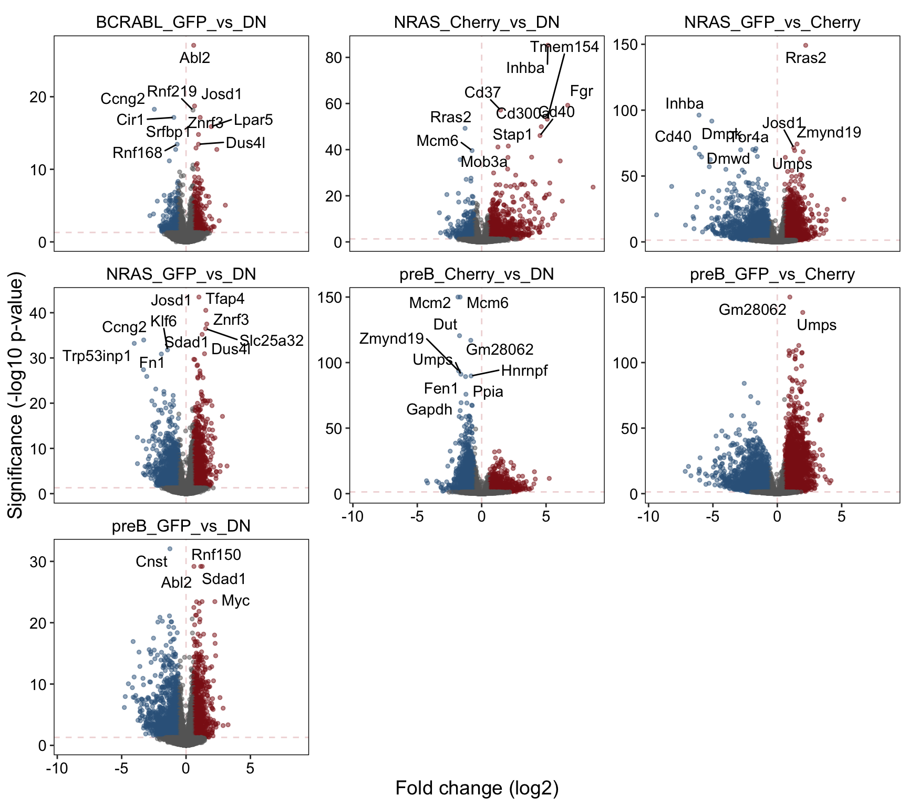
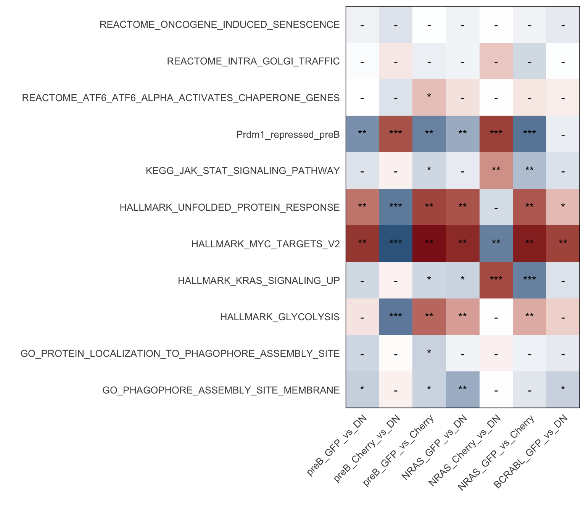
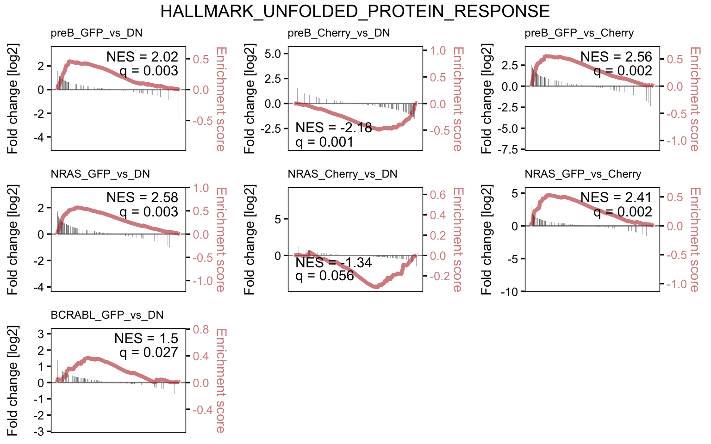

# BCL6/MYC Dual Reporter DE

## Background

To characterise the transcriptional programs driven by MYC and BCL6 in B-cells, a dual reporter system was established with GFP-Myc and mCherry-BCL6 in normal mouse pre-B cultured in Il7, and pre-B trasnformed by either BCR-ABL1 or NRAS G12D. 

Note: no mCherry+ population is observed in the BCR-ABL1 condition due to BA driving Myc program & thereby repressing Bcl6.

## Setup

```r
# load libraries
library(tidyverse)
library(tximport)
library(DESeq2)
library(openxlsx)
library(DT)
library(EnsDb.Mmusculus.v79)
txdb <- EnsDb.Mmusculus.v79
  
# make tx2gene
k <- keys(txdb, keytype = "TXID")
tx2gene <- select(txdb, k, "GENEID", "TXID")
```

## Sample Info

```r
files <- list.files("../processed_data/RNAseq/BCL6_MYC_salmon", pattern = "quant.sf", 
                    recursive = T, full.names = T)
pattern <- "^.+/XLR[0-9]+_(([A-Za-z]+)_([A-Za-z]+)_(rep[0-9]+))/quant.sf$"
smi <- data.frame(sample_id = sub(pattern, "\\1",files),
                  condition = sub(pattern, "\\2_\\3",files),
                  replicate = sub(pattern, "\\4",files),
                  path = files)
names(files) <- smi$sample_id
smi %>% arrange(sample_id) %>% 
  DT::datatable(escape  = F, rownames = F,
                colnames = c("Sample ID", "Condition", "Replicate", "File Path"),
                options = list(
                  scrollX = TRUE,
                  columnDefs = list(list(
                        targets = 3,
                        render = JS(
                          "function(data, type, row, meta) {",
                          "return type === 'display' && data.length > 35 ?",
                          "'<span title=\"' + data + '\">' + data.substr(0, 35) + '...</span>' : data;",
                          "}")))
                ), callback = JS('table.page(3).draw(false);'))
```

```{=html}
<div id="htmlwidget-eb38c5326a73bc02b136" style="width:100%;height:auto;" class="datatables html-widget"></div>
<script type="application/json" data-for="htmlwidget-eb38c5326a73bc02b136">{"x":{"filter":"none","data":[["BA_DN_rep1","BA_DN_rep2","BA_DN_rep3","BA_GFPpos_rep1","BA_GFPpos_rep2","BA_GFPpos_rep3","Nras_Cherrypos_rep1","Nras_Cherrypos_rep2","Nras_Cherrypos_rep3","Nras_DN_rep1","Nras_DN_rep2","Nras_DN_rep3","Nras_GFPpos_rep1","Nras_GFPpos_rep2","Nras_GFPpos_rep3","preB_Cherrypos_rep1","preB_Cherrypos_rep2","preB_Cherrypos_rep3","preB_DN_rep1","preB_DN_rep2","preB_DN_rep3","preB_GFPpos_rep1","preB_GFPpos_rep4","preB_GFPpos_rep5"],["BA_DN","BA_DN","BA_DN","BA_GFPpos","BA_GFPpos","BA_GFPpos","Nras_Cherrypos","Nras_Cherrypos","Nras_Cherrypos","Nras_DN","Nras_DN","Nras_DN","Nras_GFPpos","Nras_GFPpos","Nras_GFPpos","preB_Cherrypos","preB_Cherrypos","preB_Cherrypos","preB_DN","preB_DN","preB_DN","preB_GFPpos","preB_GFPpos","preB_GFPpos"],["rep1","rep2","rep3","rep1","rep2","rep3","rep1","rep2","rep3","rep1","rep2","rep3","rep1","rep2","rep3","rep1","rep2","rep3","rep1","rep2","rep3","rep1","rep4","rep5"],["../processed_data/RNAseq/BCL6_MYC_salmon/XLR4_BA_DN_rep1/quant.sf","../processed_data/RNAseq/BCL6_MYC_salmon/XLR5_BA_DN_rep2/quant.sf","../processed_data/RNAseq/BCL6_MYC_salmon/XLR6_BA_DN_rep3/quant.sf","../processed_data/RNAseq/BCL6_MYC_salmon/XLR1_BA_GFPpos_rep1/quant.sf","../processed_data/RNAseq/BCL6_MYC_salmon/XLR2_BA_GFPpos_rep2/quant.sf","../processed_data/RNAseq/BCL6_MYC_salmon/XLR3_BA_GFPpos_rep3/quant.sf","../processed_data/RNAseq/BCL6_MYC_salmon/XLR21_Nras_Cherrypos_rep1/quant.sf","../processed_data/RNAseq/BCL6_MYC_salmon/XLR22_Nras_Cherrypos_rep2/quant.sf","../processed_data/RNAseq/BCL6_MYC_salmon/XLR23_Nras_Cherrypos_rep3/quant.sf","../processed_data/RNAseq/BCL6_MYC_salmon/XLR19_Nras_DN_rep1/quant.sf","../processed_data/RNAseq/BCL6_MYC_salmon/XLR20_Nras_DN_rep2/quant.sf","../processed_data/RNAseq/BCL6_MYC_salmon/XLR21_Nras_DN_rep3/quant.sf","../processed_data/RNAseq/BCL6_MYC_salmon/XLR16_Nras_GFPpos_rep1/quant.sf","../processed_data/RNAseq/BCL6_MYC_salmon/XLR17_Nras_GFPpos_rep2/quant.sf","../processed_data/RNAseq/BCL6_MYC_salmon/XLR18_Nras_GFPpos_rep3/quant.sf","../processed_data/RNAseq/BCL6_MYC_salmon/XLR13_preB_Cherrypos_rep1/quant.sf","../processed_data/RNAseq/BCL6_MYC_salmon/XLR14_preB_Cherrypos_rep2/quant.sf","../processed_data/RNAseq/BCL6_MYC_salmon/XLR15_preB_Cherrypos_rep3/quant.sf","../processed_data/RNAseq/BCL6_MYC_salmon/XLR10_preB_DN_rep1/quant.sf","../processed_data/RNAseq/BCL6_MYC_salmon/XLR11_preB_DN_rep2/quant.sf","../processed_data/RNAseq/BCL6_MYC_salmon/XLR12_preB_DN_rep3/quant.sf","../processed_data/RNAseq/BCL6_MYC_salmon/XLR7_preB_GFPpos_rep1/quant.sf","../processed_data/RNAseq/BCL6_MYC_salmon/XLR25_preB_GFPpos_rep4/quant.sf","../processed_data/RNAseq/BCL6_MYC_salmon/XLR26_preB_GFPpos_rep5/quant.sf"]],"container":"<table class=\"display\">\n  <thead>\n    <tr>\n      <th>Sample ID<\/th>\n      <th>Condition<\/th>\n      <th>Replicate<\/th>\n      <th>File Path<\/th>\n    <\/tr>\n  <\/thead>\n<\/table>","options":{"scrollX":true,"columnDefs":[{"targets":3,"render":"function(data, type, row, meta) {\nreturn type === 'display' && data.length > 35 ?\n'<span title=\"' + data + '\">' + data.substr(0, 35) + '...<\/span>' : data;\n}"}],"order":[],"autoWidth":false,"orderClasses":false},"callback":"function(table) {\ntable.page(3).draw(false);\n}"},"evals":["options.columnDefs.0.render","callback"],"jsHooks":[]}</script>
```

## Load and preprocess counts

```r
txi <- tximport(files, type = "salmon", tx2gene = tx2gene, ignoreTxVersion = T)
dds <- DESeqDataSetFromTximport(txi, colData = smi,
                                design = ~condition)
dds <- dds[rowMeans(counts(dds)) > 5, ]
dds <- DESeq(dds)
saveRDS(dds, "../processed_data/RNAseq/BCL6_MYC_dds.2020-03-11.rds")
```

## Differential Expression

```r
contrasts <- list(preB_GFP_vs_DN = "preB_GFPpos_vs_preB_DN",
                  preB_Cherry_vs_DN = "preB_Cherrypos_vs_preB_DN",
                  preB_GFP_vs_Cherry = "preB_GFPpos_vs_preB_Cherrypos",
                  NRAS_GFP_vs_DN = "Nras_GFPpos_vs_Nras_DN",
                  NRAS_Cherry_vs_DN = "Nras_Cherrypos_vs_Nras_DN",
                  NRAS_GFP_vs_Cherry = "Nras_GFPpos_vs_Nras_Cherrypos",
                  BCRABL_GFP_vs_DN = "BA_GFPpos_vs_BA_DN")
deres <- lapply(contrasts, function(contrast) {
  a <- sub("^(.+)_vs_(.+)$", "\\1", contrast) 
  b <- sub("^(.+)_vs_(.+)$", "\\2", contrast)
  res <- results(dds, contrast=c("condition", a, b))
  lfcShrink(dds, contrast = c("condition", a, b), 
            res = res, type = "normal")
})
```

## Annotate and tidy

```r
rlog <- rlog(dds)
genesymb <- mapIds(txdb, keys = rownames(deres[[1]]), 
                   keytype = "GENEID", column = "SYMBOL")
wb <- createWorkbook()
deanno <- lapply(names(contrasts), function(contrast) {
  resdf <- as.data.frame(deres[[contrast]])
  a <- sub("^(.+)_vs_(.+)$", "\\1", contrasts[[contrast]]) 
  b <- sub("^(.+)_vs_(.+)$", "\\2", contrasts[[contrast]])
  resdf <- cbind(resdf, assay(rlog)[, c(grep(b, colnames(rlog)),
                                        grep(a, colnames(rlog)))])
  resdf$gene_symbol <- genesymb
  resdf$ensembl_id <- rownames(resdf)
  resdf$baseMean <- log2(resdf$baseMean)
  resdf[,paste0("av_", b)] <- rowMeans(assay(rlog)[, grep(b, colnames(rlog))])
  resdf[,paste0("av_", a)] <- rowMeans(assay(rlog)[, grep(a, colnames(rlog))])
  resdf <- resdf[order(resdf$pvalue), c(13:14,2,6,3,1,15:16,7:12)]
  colnames(resdf)[3:6] <- c("L2FC","qval","L2FC_SE","av_expr")
  addWorksheet(wb, sheetName = contrast)
  writeData(wb, resdf, sheet = contrast, rowNames = F)
  freezePane(wb, sheet = contrast, firstRow = TRUE, firstCol = TRUE) 
  return(resdf)
})
names(deanno) <- names(contrasts)
saveWorkbook(wb, "../results/BCL6_MYC_DE.2020-03-11.xlsx", overwrite = T) 
saveRDS(deanno, "../processed_data/RNAseq/BCL6_MYC_DE.2020-03-11.rds")
```


```r
dds <- readRDS("../processed_data/RNAseq/BCL6_MYC_dds.2020-03-11.rds")
deanno <- readRDS("../processed_data/RNAseq/BCL6_MYC_DE.2020-03-11.rds")
lapply(names(deanno), function(x) {
  y <- as.data.frame(deanno[[x]]) %>% dplyr::filter(qval < 0.05)
  data.frame(condition = x,
             upreg = y %>% dplyr::filter(L2FC > 1) %>% nrow(),
             dnreg = y %>% dplyr::filter(L2FC < -1) %>% nrow())
}) %>% bind_rows() %>% kableExtra::kable()
```

<table>
 <thead>
  <tr>
   <th style="text-align:left;"> condition </th>
   <th style="text-align:right;"> upreg </th>
   <th style="text-align:right;"> dnreg </th>
  </tr>
 </thead>
<tbody>
  <tr>
   <td style="text-align:left;"> preB_GFP_vs_DN </td>
   <td style="text-align:right;"> 324 </td>
   <td style="text-align:right;"> 870 </td>
  </tr>
  <tr>
   <td style="text-align:left;"> preB_Cherry_vs_DN </td>
   <td style="text-align:right;"> 994 </td>
   <td style="text-align:right;"> 812 </td>
  </tr>
  <tr>
   <td style="text-align:left;"> preB_GFP_vs_Cherry </td>
   <td style="text-align:right;"> 1571 </td>
   <td style="text-align:right;"> 2250 </td>
  </tr>
  <tr>
   <td style="text-align:left;"> NRAS_GFP_vs_DN </td>
   <td style="text-align:right;"> 392 </td>
   <td style="text-align:right;"> 849 </td>
  </tr>
  <tr>
   <td style="text-align:left;"> NRAS_Cherry_vs_DN </td>
   <td style="text-align:right;"> 593 </td>
   <td style="text-align:right;"> 201 </td>
  </tr>
  <tr>
   <td style="text-align:left;"> NRAS_GFP_vs_Cherry </td>
   <td style="text-align:right;"> 964 </td>
   <td style="text-align:right;"> 1809 </td>
  </tr>
  <tr>
   <td style="text-align:left;"> BCRABL_GFP_vs_DN </td>
   <td style="text-align:right;"> 94 </td>
   <td style="text-align:right;"> 116 </td>
  </tr>
</tbody>
</table>

## Volano plot

```r
goi <- c("Egr1", "Dusp6", "Cish", "Hk1", "Hk2")
plotdat <- lapply(names(deanno), function(comp) {
  x <- deanno[[comp]]
  x$col <- "B"
  x[which(x$qval < 0.05 & x$L2FC > 0.58),]$col <- "A"
  x[which(x$qval < 0.05 & x$L2FC < -0.58),]$col <- "C"
  if (any(x$qval < 1e-150, na.rm = T)) x[which(x$qval<1e-150),]$qval <- 1e-150
  topg <- top_n(x, 10, -qval)$gene_symbol
  x$label <- ifelse(x$gene_symbol %in% c(topg, goi) & x$qval < 1e-03,
                    x$gene_symbol, "")
  x$comparison <- comp
  return(x[,c(1:6,15:17)])
}) %>% bind_rows()
(p <- ggplot(plotdat, aes(x = L2FC, y = -log10(qval))) +
  geom_hline(yintercept = -log10(0.05), color = "firebrick", alpha = .2, lty=2) +
  geom_vline(xintercept = 0, color = "firebrick", alpha = .2, lty=2) +
  geom_point(aes(col=col), alpha = .5, size=1) +
  ggrepel::geom_text_repel(aes(label = label)) +
  facet_wrap(~comparison, nrow = 3, scales = "free_y") +
  scale_color_manual(values = c("firebrick4","grey40","steelblue4")) +
  scale_x_continuous(name = "Fold change (log2)") +
  scale_y_continuous(name = "Significance (-log10 p-value)") +
  theme(text = element_text(size = 14, color = "black", family = "Arial"),
        axis.text = element_text(size = 11, color = "black", family = "Arial"),
        panel.grid = element_blank(),
        panel.background = element_blank(),
        panel.border = element_rect(color = "black", fill = NA),
        strip.background = element_blank(), 
        strip.text = element_text(size = 12, color = "black", family = "Arial"), 
        legend.position = "none"))
```



## Full GSEA 

Note: This analysis was run on all REACTOME, KEGG, MSigDB Hallmark, and WIKIPATHWAY database gene sets (with some minor filtering for irrelevant sets). This is useful for data exploration but will inflate q-value/padj simply due to the large number of tests performed, hence these results should be used to identify potentially interesting pathways before performing more selective enrichment testing for more appropriate statistical values.


```r
library(msigdbr)
library(fgsea)
msig <- rbind(msigdbr(species = "Mus musculus", category = "H"),
              msigdbr(species = "Mus musculus", category = "C2", subcategory = "CP:REACTOME"),
              msigdbr(species = "Mus musculus", category = "C2", subcategory = "CP:KEGG"),
              msigdbr(species = "Mus musculus", category = "C5"))
gs <- split(msig$gene_symbol, msig$gs_name)
internal_gs <- readRDS("../../resources/public_genesets_Mm.rds")
gs <- c(gs, internal_gs)
gs <- gs[!grepl(paste0("sperm|xeno|graft|naba|spinal|neuro|sclerosis",
                       "|tion_of_hscs|photo|leish|diabetes|lupus|ebola",
                       "|staph|syndrome|myo|nicotin|asthma|thyroid_stim",
                       "|gastrin|alcohol|nutrient|carcinoma|muscle_contr",
                       "|metapathway|amyloid|fusion_mutants|circadian"),
                names(gs), ignore.case = T)]
gl <- lapply(deanno, function(x) {
  tmp <- x$L2FC
  names(tmp) <- x$gene_symbol
  tmp <- tmp[!is.na(names(tmp)) & names(tmp) != "" & !is.na(tmp) & is.finite(tmp)]
  tmp <- tmp[order(-tmp)]
  tmp[!duplicated(names(tmp))]
})
gseres <- lapply(gl, function(x) {
  fgseaSimple(pathways = gs, stats = x, 
              nperm = 1000, minSize = 10, maxSize = 500) %>%
    dplyr::filter(lengths(leadingEdge) > 3) %>%
    arrange(pval)
})
wb <- createWorkbook()
lapply(names(gseres), function(contrast) {
  gse <- as.data.frame(gseres[[contrast]])
  addWorksheet(wb, sheetName = contrast)
  writeData(wb, gse, sheet = contrast, rowNames = F)
  freezePane(wb, sheet = contrast, firstRow = TRUE, firstCol = TRUE)
  return(NULL)
})
```

```
## [[1]]
## NULL
## 
## [[2]]
## NULL
## 
## [[3]]
## NULL
## 
## [[4]]
## NULL
## 
## [[5]]
## NULL
## 
## [[6]]
## NULL
## 
## [[7]]
## NULL
```

```r
saveWorkbook(wb, "../results/BCL6_MYC_DE_fullGSEA.2020-03-11.xlsx", overwrite = T)
lapply(names(gseres), function(x) {
  tmp <- gseres[[x]] %>% dplyr::filter(pval < 0.1) %>% dplyr::select(pathway, NES)
  tmp[,2] <- round(tmp[,2], 3)
  colnames(tmp)[2] <- x
  return(tmp) }) %>% 
  Reduce(f = function(x,y) { merge(x, y, by="pathway") }) %>%
  arrange(-apply(., 1, var)) %>%
  mutate(pathway = ifelse(pathway %in% names(internal_gs), pathway,
                          paste0('<a href=https://www.gsea-msigdb.org/gsea/msigdb/cards/', 
                                 pathway, '.html>', substr(pathway, 0,30), '</a>'))) %>%
  DT::datatable(escape  = F, rownames = F,
                options = list(
                  scrollX = TRUE))
```

```{=html}
<div id="htmlwidget-ac124905f6e4db86f8ca" style="width:100%;height:auto;" class="datatables html-widget"></div>
<script type="application/json" data-for="htmlwidget-ac124905f6e4db86f8ca">{"x":{"filter":"none","data":[["Cosgun_Bcatenin_GOF_UP","<a href=https://www.gsea-msigdb.org/gsea/msigdb/cards/GO_90S_PRERIBOSOME.html>GO_90S_PRERIBOSOME<\/a>","<a href=https://www.gsea-msigdb.org/gsea/msigdb/cards/GO_ALPHA_AMINO_ACID_BIOSYNTHETIC_PROCESS.html>GO_ALPHA_AMINO_ACID_BIOSYNTHET<\/a>","<a href=https://www.gsea-msigdb.org/gsea/msigdb/cards/GO_AMINO_ACID_ACTIVATION.html>GO_AMINO_ACID_ACTIVATION<\/a>","<a href=https://www.gsea-msigdb.org/gsea/msigdb/cards/GO_ATP_SYNTHESIS_COUPLED_ELECTRON_TRANSPORT.html>GO_ATP_SYNTHESIS_COUPLED_ELECT<\/a>","<a href=https://www.gsea-msigdb.org/gsea/msigdb/cards/GO_CELLULAR_AMINO_ACID_BIOSYNTHETIC_PROCESS.html>GO_CELLULAR_AMINO_ACID_BIOSYNT<\/a>","<a href=https://www.gsea-msigdb.org/gsea/msigdb/cards/GO_CELLULAR_AMINO_ACID_METABOLIC_PROCESS.html>GO_CELLULAR_AMINO_ACID_METABOL<\/a>","<a href=https://www.gsea-msigdb.org/gsea/msigdb/cards/GO_CHAPERONE_COMPLEX.html>GO_CHAPERONE_COMPLEX<\/a>","<a href=https://www.gsea-msigdb.org/gsea/msigdb/cards/GO_CHAPERONE_MEDIATED_PROTEIN_COMPLEX_ASSEMBLY.html>GO_CHAPERONE_MEDIATED_PROTEIN_<\/a>","<a href=https://www.gsea-msigdb.org/gsea/msigdb/cards/GO_CHROMOSOMAL_REGION.html>GO_CHROMOSOMAL_REGION<\/a>","<a href=https://www.gsea-msigdb.org/gsea/msigdb/cards/GO_CLEAVAGE_INVOLVED_IN_RRNA_PROCESSING.html>GO_CLEAVAGE_INVOLVED_IN_RRNA_P<\/a>","<a href=https://www.gsea-msigdb.org/gsea/msigdb/cards/GO_CYTOPLASMIC_TRANSLATION.html>GO_CYTOPLASMIC_TRANSLATION<\/a>","<a href=https://www.gsea-msigdb.org/gsea/msigdb/cards/GO_CYTOPLASMIC_TRANSLATIONAL_INITIATION.html>GO_CYTOPLASMIC_TRANSLATIONAL_I<\/a>","<a href=https://www.gsea-msigdb.org/gsea/msigdb/cards/GO_DISULFIDE_OXIDOREDUCTASE_ACTIVITY.html>GO_DISULFIDE_OXIDOREDUCTASE_AC<\/a>","<a href=https://www.gsea-msigdb.org/gsea/msigdb/cards/GO_ENDONUCLEOLYTIC_CLEAVAGE_INVOLVED_IN_RRNA_PROCESSING.html>GO_ENDONUCLEOLYTIC_CLEAVAGE_IN<\/a>","<a href=https://www.gsea-msigdb.org/gsea/msigdb/cards/GO_ENDONUCLEOLYTIC_CLEAVAGE_IN_ITS1_TO_SEPARATE_SSU_RRNA_FROM_5_8S_RRNA_AND_LSU_RRNA_FROM_TRICISTRONIC_RRNA_TRANSCRIPT_SSU_RRNA_5_8S_RRNA_LSU_RRNA.html>GO_ENDONUCLEOLYTIC_CLEAVAGE_IN<\/a>","<a href=https://www.gsea-msigdb.org/gsea/msigdb/cards/GO_ENDOPEPTIDASE_COMPLEX.html>GO_ENDOPEPTIDASE_COMPLEX<\/a>","<a href=https://www.gsea-msigdb.org/gsea/msigdb/cards/GO_ENDOSOME_LUMEN.html>GO_ENDOSOME_LUMEN<\/a>","<a href=https://www.gsea-msigdb.org/gsea/msigdb/cards/GO_FOLIC_ACID_METABOLIC_PROCESS.html>GO_FOLIC_ACID_METABOLIC_PROCES<\/a>","<a href=https://www.gsea-msigdb.org/gsea/msigdb/cards/GO_G_PROTEIN_COUPLED_RECEPTOR_SIGNALING_PATHWAY.html>GO_G_PROTEIN_COUPLED_RECEPTOR_<\/a>","<a href=https://www.gsea-msigdb.org/gsea/msigdb/cards/GO_INNER_MITOCHONDRIAL_MEMBRANE_ORGANIZATION.html>GO_INNER_MITOCHONDRIAL_MEMBRAN<\/a>","<a href=https://www.gsea-msigdb.org/gsea/msigdb/cards/GO_INNER_MITOCHONDRIAL_MEMBRANE_PROTEIN_COMPLEX.html>GO_INNER_MITOCHONDRIAL_MEMBRAN<\/a>","<a href=https://www.gsea-msigdb.org/gsea/msigdb/cards/GO_LARGE_RIBOSOMAL_SUBUNIT.html>GO_LARGE_RIBOSOMAL_SUBUNIT<\/a>","<a href=https://www.gsea-msigdb.org/gsea/msigdb/cards/GO_LIGASE_ACTIVITY_FORMING_CARBON_OXYGEN_BONDS.html>GO_LIGASE_ACTIVITY_FORMING_CAR<\/a>","<a href=https://www.gsea-msigdb.org/gsea/msigdb/cards/GO_MATURATION_OF_5_8S_RRNA.html>GO_MATURATION_OF_5_8S_RRNA<\/a>","<a href=https://www.gsea-msigdb.org/gsea/msigdb/cards/GO_MATURATION_OF_5_8S_RRNA_FROM_TRICISTRONIC_RRNA_TRANSCRIPT_SSU_RRNA_5_8S_RRNA_LSU_RRNA.html>GO_MATURATION_OF_5_8S_RRNA_FRO<\/a>","<a href=https://www.gsea-msigdb.org/gsea/msigdb/cards/GO_MATURATION_OF_LSU_RRNA.html>GO_MATURATION_OF_LSU_RRNA<\/a>","<a href=https://www.gsea-msigdb.org/gsea/msigdb/cards/GO_MATURATION_OF_LSU_RRNA_FROM_TRICISTRONIC_RRNA_TRANSCRIPT_SSU_RRNA_5_8S_RRNA_LSU_RRNA.html>GO_MATURATION_OF_LSU_RRNA_FROM<\/a>","<a href=https://www.gsea-msigdb.org/gsea/msigdb/cards/GO_MATURATION_OF_SSU_RRNA.html>GO_MATURATION_OF_SSU_RRNA<\/a>","<a href=https://www.gsea-msigdb.org/gsea/msigdb/cards/GO_MATURATION_OF_SSU_RRNA_FROM_TRICISTRONIC_RRNA_TRANSCRIPT_SSU_RRNA_5_8S_RRNA_LSU_RRNA.html>GO_MATURATION_OF_SSU_RRNA_FROM<\/a>","<a href=https://www.gsea-msigdb.org/gsea/msigdb/cards/GO_METHYLOSOME.html>GO_METHYLOSOME<\/a>","<a href=https://www.gsea-msigdb.org/gsea/msigdb/cards/GO_MITOCHONDRIAL_ELECTRON_TRANSPORT_NADH_TO_UBIQUINONE.html>GO_MITOCHONDRIAL_ELECTRON_TRAN<\/a>","<a href=https://www.gsea-msigdb.org/gsea/msigdb/cards/GO_MITOCHONDRIAL_GENE_EXPRESSION.html>GO_MITOCHONDRIAL_GENE_EXPRESSI<\/a>","<a href=https://www.gsea-msigdb.org/gsea/msigdb/cards/GO_MITOCHONDRIAL_LARGE_RIBOSOMAL_SUBUNIT.html>GO_MITOCHONDRIAL_LARGE_RIBOSOM<\/a>","<a href=https://www.gsea-msigdb.org/gsea/msigdb/cards/GO_MITOCHONDRIAL_PROTEIN_COMPLEX.html>GO_MITOCHONDRIAL_PROTEIN_COMPL<\/a>","<a href=https://www.gsea-msigdb.org/gsea/msigdb/cards/GO_MITOCHONDRIAL_RESPIRATORY_CHAIN_COMPLEX_ASSEMBLY.html>GO_MITOCHONDRIAL_RESPIRATORY_C<\/a>","<a href=https://www.gsea-msigdb.org/gsea/msigdb/cards/GO_MITOCHONDRIAL_RNA_METABOLIC_PROCESS.html>GO_MITOCHONDRIAL_RNA_METABOLIC<\/a>","<a href=https://www.gsea-msigdb.org/gsea/msigdb/cards/GO_MITOCHONDRIAL_SMALL_RIBOSOMAL_SUBUNIT.html>GO_MITOCHONDRIAL_SMALL_RIBOSOM<\/a>","<a href=https://www.gsea-msigdb.org/gsea/msigdb/cards/GO_MITOCHONDRIAL_TRANSLATION.html>GO_MITOCHONDRIAL_TRANSLATION<\/a>","<a href=https://www.gsea-msigdb.org/gsea/msigdb/cards/GO_MITOCHONDRIAL_TRANSLATIONAL_TERMINATION.html>GO_MITOCHONDRIAL_TRANSLATIONAL<\/a>","<a href=https://www.gsea-msigdb.org/gsea/msigdb/cards/GO_MITOCHONDRIAL_TRANSMEMBRANE_TRANSPORT.html>GO_MITOCHONDRIAL_TRANSMEMBRANE<\/a>","<a href=https://www.gsea-msigdb.org/gsea/msigdb/cards/GO_MOLECULAR_TRANSDUCER_ACTIVITY.html>GO_MOLECULAR_TRANSDUCER_ACTIVI<\/a>","<a href=https://www.gsea-msigdb.org/gsea/msigdb/cards/GO_MRNA_5_UTR_BINDING.html>GO_MRNA_5_UTR_BINDING<\/a>","<a href=https://www.gsea-msigdb.org/gsea/msigdb/cards/GO_MRNA_MODIFICATION.html>GO_MRNA_MODIFICATION<\/a>","<a href=https://www.gsea-msigdb.org/gsea/msigdb/cards/GO_NADH_DEHYDROGENASE_ACTIVITY.html>GO_NADH_DEHYDROGENASE_ACTIVITY<\/a>","<a href=https://www.gsea-msigdb.org/gsea/msigdb/cards/GO_NADH_DEHYDROGENASE_COMPLEX.html>GO_NADH_DEHYDROGENASE_COMPLEX<\/a>","<a href=https://www.gsea-msigdb.org/gsea/msigdb/cards/GO_NADH_DEHYDROGENASE_COMPLEX_ASSEMBLY.html>GO_NADH_DEHYDROGENASE_COMPLEX_<\/a>","<a href=https://www.gsea-msigdb.org/gsea/msigdb/cards/GO_NCRNA_3_END_PROCESSING.html>GO_NCRNA_3_END_PROCESSING<\/a>","<a href=https://www.gsea-msigdb.org/gsea/msigdb/cards/GO_NCRNA_EXPORT_FROM_NUCLEUS.html>GO_NCRNA_EXPORT_FROM_NUCLEUS<\/a>","<a href=https://www.gsea-msigdb.org/gsea/msigdb/cards/GO_NCRNA_PROCESSING.html>GO_NCRNA_PROCESSING<\/a>","<a href=https://www.gsea-msigdb.org/gsea/msigdb/cards/GO_NUCLEAR_EXOSOME_RNASE_COMPLEX.html>GO_NUCLEAR_EXOSOME_RNASE_COMPL<\/a>","<a href=https://www.gsea-msigdb.org/gsea/msigdb/cards/GO_NUCLEOBASE_METABOLIC_PROCESS.html>GO_NUCLEOBASE_METABOLIC_PROCES<\/a>","<a href=https://www.gsea-msigdb.org/gsea/msigdb/cards/GO_NUCLEOCYTOPLASMIC_CARRIER_ACTIVITY.html>GO_NUCLEOCYTOPLASMIC_CARRIER_A<\/a>","<a href=https://www.gsea-msigdb.org/gsea/msigdb/cards/GO_NUCLEOID.html>GO_NUCLEOID<\/a>","<a href=https://www.gsea-msigdb.org/gsea/msigdb/cards/GO_ONE_CARBON_METABOLIC_PROCESS.html>GO_ONE_CARBON_METABOLIC_PROCES<\/a>","<a href=https://www.gsea-msigdb.org/gsea/msigdb/cards/GO_ORGANELLAR_RIBOSOME.html>GO_ORGANELLAR_RIBOSOME<\/a>","<a href=https://www.gsea-msigdb.org/gsea/msigdb/cards/GO_OUTER_MITOCHONDRIAL_MEMBRANE_PROTEIN_COMPLEX.html>GO_OUTER_MITOCHONDRIAL_MEMBRAN<\/a>","<a href=https://www.gsea-msigdb.org/gsea/msigdb/cards/GO_OXIDATIVE_PHOSPHORYLATION.html>GO_OXIDATIVE_PHOSPHORYLATION<\/a>","<a href=https://www.gsea-msigdb.org/gsea/msigdb/cards/GO_OXIDOREDUCTASE_ACTIVITY_ACTING_ON_A_SULFUR_GROUP_OF_DONORS_NAD_P_AS_ACCEPTOR.html>GO_OXIDOREDUCTASE_ACTIVITY_ACT<\/a>","<a href=https://www.gsea-msigdb.org/gsea/msigdb/cards/GO_PEPTIDASE_COMPLEX.html>GO_PEPTIDASE_COMPLEX<\/a>","<a href=https://www.gsea-msigdb.org/gsea/msigdb/cards/GO_POSITIVE_REGULATION_OF_IMMUNE_EFFECTOR_PROCESS.html>GO_POSITIVE_REGULATION_OF_IMMU<\/a>","<a href=https://www.gsea-msigdb.org/gsea/msigdb/cards/GO_POSITIVE_REGULATION_OF_TELOMERASE_RNA_LOCALIZATION_TO_CAJAL_BODY.html>GO_POSITIVE_REGULATION_OF_TELO<\/a>","<a href=https://www.gsea-msigdb.org/gsea/msigdb/cards/GO_PRERIBOSOME.html>GO_PRERIBOSOME<\/a>","<a href=https://www.gsea-msigdb.org/gsea/msigdb/cards/GO_PRERIBOSOME_LARGE_SUBUNIT_PRECURSOR.html>GO_PRERIBOSOME_LARGE_SUBUNIT_P<\/a>","<a href=https://www.gsea-msigdb.org/gsea/msigdb/cards/GO_PRERIBOSOME_SMALL_SUBUNIT_PRECURSOR.html>GO_PRERIBOSOME_SMALL_SUBUNIT_P<\/a>","<a href=https://www.gsea-msigdb.org/gsea/msigdb/cards/GO_PROTEASOME_ACCESSORY_COMPLEX.html>GO_PROTEASOME_ACCESSORY_COMPLE<\/a>","<a href=https://www.gsea-msigdb.org/gsea/msigdb/cards/GO_PROTEIN_LOCALIZATION_TO_CHROMOSOME_TELOMERIC_REGION.html>GO_PROTEIN_LOCALIZATION_TO_CHR<\/a>","<a href=https://www.gsea-msigdb.org/gsea/msigdb/cards/GO_PROTEIN_TARGETING_TO_MITOCHONDRION.html>GO_PROTEIN_TARGETING_TO_MITOCH<\/a>","<a href=https://www.gsea-msigdb.org/gsea/msigdb/cards/GO_PSEUDOURIDINE_SYNTHESIS.html>GO_PSEUDOURIDINE_SYNTHESIS<\/a>","<a href=https://www.gsea-msigdb.org/gsea/msigdb/cards/GO_PTERIDINE_CONTAINING_COMPOUND_METABOLIC_PROCESS.html>GO_PTERIDINE_CONTAINING_COMPOU<\/a>","<a href=https://www.gsea-msigdb.org/gsea/msigdb/cards/GO_PURINE_CONTAINING_COMPOUND_BIOSYNTHETIC_PROCESS.html>GO_PURINE_CONTAINING_COMPOUND_<\/a>","<a href=https://www.gsea-msigdb.org/gsea/msigdb/cards/GO_PYRIMIDINE_NUCLEOSIDE_MONOPHOSPHATE_METABOLIC_PROCESS.html>GO_PYRIMIDINE_NUCLEOSIDE_MONOP<\/a>","<a href=https://www.gsea-msigdb.org/gsea/msigdb/cards/GO_RAN_GTPASE_BINDING.html>GO_RAN_GTPASE_BINDING<\/a>","<a href=https://www.gsea-msigdb.org/gsea/msigdb/cards/GO_REGULATION_OF_NEUTROPHIL_ACTIVATION.html>GO_REGULATION_OF_NEUTROPHIL_AC<\/a>","<a href=https://www.gsea-msigdb.org/gsea/msigdb/cards/GO_REGULATION_OF_PROTEIN_LOCALIZATION_TO_CHROMOSOME_TELOMERIC_REGION.html>GO_REGULATION_OF_PROTEIN_LOCAL<\/a>","<a href=https://www.gsea-msigdb.org/gsea/msigdb/cards/GO_REGULATION_OF_TELOMERE_MAINTENANCE_VIA_TELOMERE_LENGTHENING.html>GO_REGULATION_OF_TELOMERE_MAIN<\/a>","<a href=https://www.gsea-msigdb.org/gsea/msigdb/cards/GO_RESPIRATORY_CHAIN_COMPLEX.html>GO_RESPIRATORY_CHAIN_COMPLEX<\/a>","<a href=https://www.gsea-msigdb.org/gsea/msigdb/cards/GO_RIBONUCLEOPROTEIN_COMPLEX_SUBUNIT_ORGANIZATION.html>GO_RIBONUCLEOPROTEIN_COMPLEX_S<\/a>","<a href=https://www.gsea-msigdb.org/gsea/msigdb/cards/GO_RIBONUCLEOSIDE_MONOPHOSPHATE_BIOSYNTHETIC_PROCESS.html>GO_RIBONUCLEOSIDE_MONOPHOSPHAT<\/a>","<a href=https://www.gsea-msigdb.org/gsea/msigdb/cards/GO_RIBOSE_PHOSPHATE_BIOSYNTHETIC_PROCESS.html>GO_RIBOSE_PHOSPHATE_BIOSYNTHET<\/a>","<a href=https://www.gsea-msigdb.org/gsea/msigdb/cards/GO_RIBOSOMAL_LARGE_SUBUNIT_ASSEMBLY.html>GO_RIBOSOMAL_LARGE_SUBUNIT_ASS<\/a>","<a href=https://www.gsea-msigdb.org/gsea/msigdb/cards/GO_RIBOSOMAL_LARGE_SUBUNIT_BIOGENESIS.html>GO_RIBOSOMAL_LARGE_SUBUNIT_BIO<\/a>","<a href=https://www.gsea-msigdb.org/gsea/msigdb/cards/GO_RIBOSOMAL_SMALL_SUBUNIT_BIOGENESIS.html>GO_RIBOSOMAL_SMALL_SUBUNIT_BIO<\/a>","<a href=https://www.gsea-msigdb.org/gsea/msigdb/cards/GO_RIBOSOMAL_SUBUNIT.html>GO_RIBOSOMAL_SUBUNIT<\/a>","<a href=https://www.gsea-msigdb.org/gsea/msigdb/cards/GO_RIBOSOME.html>GO_RIBOSOME<\/a>","<a href=https://www.gsea-msigdb.org/gsea/msigdb/cards/GO_RIBOSOME_ASSEMBLY.html>GO_RIBOSOME_ASSEMBLY<\/a>","<a href=https://www.gsea-msigdb.org/gsea/msigdb/cards/GO_RIBOSOME_BIOGENESIS.html>GO_RIBOSOME_BIOGENESIS<\/a>","<a href=https://www.gsea-msigdb.org/gsea/msigdb/cards/GO_RNA_CAPPING.html>GO_RNA_CAPPING<\/a>","<a href=https://www.gsea-msigdb.org/gsea/msigdb/cards/GO_RNA_DEPENDENT_DNA_BIOSYNTHETIC_PROCESS.html>GO_RNA_DEPENDENT_DNA_BIOSYNTHE<\/a>","<a href=https://www.gsea-msigdb.org/gsea/msigdb/cards/GO_RNA_LOCALIZATION.html>GO_RNA_LOCALIZATION<\/a>","<a href=https://www.gsea-msigdb.org/gsea/msigdb/cards/GO_RNA_METHYLATION.html>GO_RNA_METHYLATION<\/a>","<a href=https://www.gsea-msigdb.org/gsea/msigdb/cards/GO_RNA_POLYMERASE_ACTIVITY.html>GO_RNA_POLYMERASE_ACTIVITY<\/a>","<a href=https://www.gsea-msigdb.org/gsea/msigdb/cards/GO_RNA_POLYMERASE_I_COMPLEX.html>GO_RNA_POLYMERASE_I_COMPLEX<\/a>","<a href=https://www.gsea-msigdb.org/gsea/msigdb/cards/GO_RRNA_BINDING.html>GO_RRNA_BINDING<\/a>","<a href=https://www.gsea-msigdb.org/gsea/msigdb/cards/GO_RRNA_CONTAINING_RIBONUCLEOPROTEIN_COMPLEX_EXPORT_FROM_NUCLEUS.html>GO_RRNA_CONTAINING_RIBONUCLEOP<\/a>","<a href=https://www.gsea-msigdb.org/gsea/msigdb/cards/GO_RRNA_METABOLIC_PROCESS.html>GO_RRNA_METABOLIC_PROCESS<\/a>","<a href=https://www.gsea-msigdb.org/gsea/msigdb/cards/GO_RRNA_MODIFICATION.html>GO_RRNA_MODIFICATION<\/a>","<a href=https://www.gsea-msigdb.org/gsea/msigdb/cards/GO_RRNA_PSEUDOURIDINE_SYNTHESIS.html>GO_RRNA_PSEUDOURIDINE_SYNTHESI<\/a>","<a href=https://www.gsea-msigdb.org/gsea/msigdb/cards/GO_SAM_COMPLEX.html>GO_SAM_COMPLEX<\/a>","<a href=https://www.gsea-msigdb.org/gsea/msigdb/cards/GO_SIDE_OF_MEMBRANE.html>GO_SIDE_OF_MEMBRANE<\/a>","<a href=https://www.gsea-msigdb.org/gsea/msigdb/cards/GO_SMALL_NUCLEOLAR_RIBONUCLEOPROTEIN_COMPLEX.html>GO_SMALL_NUCLEOLAR_RIBONUCLEOP<\/a>","<a href=https://www.gsea-msigdb.org/gsea/msigdb/cards/GO_SMALL_RIBOSOMAL_SUBUNIT.html>GO_SMALL_RIBOSOMAL_SUBUNIT<\/a>","<a href=https://www.gsea-msigdb.org/gsea/msigdb/cards/GO_SMALL_SUBUNIT_PROCESSOME.html>GO_SMALL_SUBUNIT_PROCESSOME<\/a>","<a href=https://www.gsea-msigdb.org/gsea/msigdb/cards/GO_SMN_COMPLEX.html>GO_SMN_COMPLEX<\/a>","<a href=https://www.gsea-msigdb.org/gsea/msigdb/cards/GO_SMN_SM_PROTEIN_COMPLEX.html>GO_SMN_SM_PROTEIN_COMPLEX<\/a>","<a href=https://www.gsea-msigdb.org/gsea/msigdb/cards/GO_SM_LIKE_PROTEIN_FAMILY_COMPLEX.html>GO_SM_LIKE_PROTEIN_FAMILY_COMP<\/a>","<a href=https://www.gsea-msigdb.org/gsea/msigdb/cards/GO_SNORNA_BINDING.html>GO_SNORNA_BINDING<\/a>","<a href=https://www.gsea-msigdb.org/gsea/msigdb/cards/GO_SNORNA_METABOLIC_PROCESS.html>GO_SNORNA_METABOLIC_PROCESS<\/a>","<a href=https://www.gsea-msigdb.org/gsea/msigdb/cards/GO_SNRNA_METABOLIC_PROCESS.html>GO_SNRNA_METABOLIC_PROCESS<\/a>","<a href=https://www.gsea-msigdb.org/gsea/msigdb/cards/GO_SPLICEOSOMAL_SNRNP_ASSEMBLY.html>GO_SPLICEOSOMAL_SNRNP_ASSEMBLY<\/a>","<a href=https://www.gsea-msigdb.org/gsea/msigdb/cards/GO_STRUCTURAL_CONSTITUENT_OF_RIBOSOME.html>GO_STRUCTURAL_CONSTITUENT_OF_R<\/a>","<a href=https://www.gsea-msigdb.org/gsea/msigdb/cards/GO_S_ADENOSYLMETHIONINE_DEPENDENT_METHYLTRANSFERASE_ACTIVITY.html>GO_S_ADENOSYLMETHIONINE_DEPEND<\/a>","<a href=https://www.gsea-msigdb.org/gsea/msigdb/cards/GO_TELOMERASE_HOLOENZYME_COMPLEX.html>GO_TELOMERASE_HOLOENZYME_COMPL<\/a>","<a href=https://www.gsea-msigdb.org/gsea/msigdb/cards/GO_TELOMERASE_RNA_BINDING.html>GO_TELOMERASE_RNA_BINDING<\/a>","<a href=https://www.gsea-msigdb.org/gsea/msigdb/cards/GO_TELOMERASE_RNA_LOCALIZATION.html>GO_TELOMERASE_RNA_LOCALIZATION<\/a>","<a href=https://www.gsea-msigdb.org/gsea/msigdb/cards/GO_TELOMERE_MAINTENANCE_VIA_TELOMERE_LENGTHENING.html>GO_TELOMERE_MAINTENANCE_VIA_TE<\/a>","<a href=https://www.gsea-msigdb.org/gsea/msigdb/cards/GO_TERMINATION_OF_RNA_POLYMERASE_I_TRANSCRIPTION.html>GO_TERMINATION_OF_RNA_POLYMERA<\/a>","<a href=https://www.gsea-msigdb.org/gsea/msigdb/cards/GO_TRANSCRIPTION_ELONGATION_FROM_RNA_POLYMERASE_I_PROMOTER.html>GO_TRANSCRIPTION_ELONGATION_FR<\/a>","<a href=https://www.gsea-msigdb.org/gsea/msigdb/cards/GO_TRANSCRIPTION_INITIATION_FROM_RNA_POLYMERASE_I_PROMOTER.html>GO_TRANSCRIPTION_INITIATION_FR<\/a>","<a href=https://www.gsea-msigdb.org/gsea/msigdb/cards/GO_TRANSFERASE_ACTIVITY_TRANSFERRING_ONE_CARBON_GROUPS.html>GO_TRANSFERASE_ACTIVITY_TRANSF<\/a>","<a href=https://www.gsea-msigdb.org/gsea/msigdb/cards/GO_TRANSLATIONAL_ELONGATION.html>GO_TRANSLATIONAL_ELONGATION<\/a>","<a href=https://www.gsea-msigdb.org/gsea/msigdb/cards/GO_TRANSLATIONAL_INITIATION.html>GO_TRANSLATIONAL_INITIATION<\/a>","<a href=https://www.gsea-msigdb.org/gsea/msigdb/cards/GO_TRANSLATIONAL_TERMINATION.html>GO_TRANSLATIONAL_TERMINATION<\/a>","<a href=https://www.gsea-msigdb.org/gsea/msigdb/cards/GO_TRANSLATION_INITIATION_FACTOR_ACTIVITY.html>GO_TRANSLATION_INITIATION_FACT<\/a>","<a href=https://www.gsea-msigdb.org/gsea/msigdb/cards/GO_TRNA_BINDING.html>GO_TRNA_BINDING<\/a>","<a href=https://www.gsea-msigdb.org/gsea/msigdb/cards/GO_TRNA_METABOLIC_PROCESS.html>GO_TRNA_METABOLIC_PROCESS<\/a>","<a href=https://www.gsea-msigdb.org/gsea/msigdb/cards/GO_TRNA_TRANSPORT.html>GO_TRNA_TRANSPORT<\/a>","<a href=https://www.gsea-msigdb.org/gsea/msigdb/cards/GO_U4_SNRNP.html>GO_U4_SNRNP<\/a>","<a href=https://www.gsea-msigdb.org/gsea/msigdb/cards/GO_UNFOLDED_PROTEIN_BINDING.html>GO_UNFOLDED_PROTEIN_BINDING<\/a>","<a href=https://www.gsea-msigdb.org/gsea/msigdb/cards/HALLMARK_E2F_TARGETS.html>HALLMARK_E2F_TARGETS<\/a>","<a href=https://www.gsea-msigdb.org/gsea/msigdb/cards/HALLMARK_MTORC1_SIGNALING.html>HALLMARK_MTORC1_SIGNALING<\/a>","<a href=https://www.gsea-msigdb.org/gsea/msigdb/cards/HALLMARK_MYC_TARGETS_V1.html>HALLMARK_MYC_TARGETS_V1<\/a>","<a href=https://www.gsea-msigdb.org/gsea/msigdb/cards/HALLMARK_MYC_TARGETS_V2.html>HALLMARK_MYC_TARGETS_V2<\/a>","<a href=https://www.gsea-msigdb.org/gsea/msigdb/cards/HALLMARK_OXIDATIVE_PHOSPHORYLATION.html>HALLMARK_OXIDATIVE_PHOSPHORYLA<\/a>","<a href=https://www.gsea-msigdb.org/gsea/msigdb/cards/HALLMARK_UNFOLDED_PROTEIN_RESPONSE.html>HALLMARK_UNFOLDED_PROTEIN_RESP<\/a>","<a href=https://www.gsea-msigdb.org/gsea/msigdb/cards/HP_ABNORMAL_ACTIVITY_OF_MITOCHONDRIAL_RESPIRATORY_CHAIN.html>HP_ABNORMAL_ACTIVITY_OF_MITOCH<\/a>","<a href=https://www.gsea-msigdb.org/gsea/msigdb/cards/HP_ABNORMAL_CIRCULATING_CARBOHYDRATE_CONCENTRATION.html>HP_ABNORMAL_CIRCULATING_CARBOH<\/a>","<a href=https://www.gsea-msigdb.org/gsea/msigdb/cards/HP_DECREASED_ACTIVITY_OF_MITOCHONDRIAL_COMPLEX_I.html>HP_DECREASED_ACTIVITY_OF_MITOC<\/a>","<a href=https://www.gsea-msigdb.org/gsea/msigdb/cards/HP_DECREASED_ACTIVITY_OF_THE_PYRUVATE_DEHYDROGENASE_COMPLEX.html>HP_DECREASED_ACTIVITY_OF_THE_P<\/a>","<a href=https://www.gsea-msigdb.org/gsea/msigdb/cards/HP_DECREASED_LYMPHOCYTE_PROLIFERATION_IN_RESPONSE_TO_MITOGEN.html>HP_DECREASED_LYMPHOCYTE_PROLIF<\/a>","<a href=https://www.gsea-msigdb.org/gsea/msigdb/cards/HP_INCREASED_CSF_LACTATE.html>HP_INCREASED_CSF_LACTATE<\/a>","<a href=https://www.gsea-msigdb.org/gsea/msigdb/cards/HP_INCREASED_SERUM_LACTATE.html>HP_INCREASED_SERUM_LACTATE<\/a>","<a href=https://www.gsea-msigdb.org/gsea/msigdb/cards/HP_INSULIN_RESISTANCE.html>HP_INSULIN_RESISTANCE<\/a>","<a href=https://www.gsea-msigdb.org/gsea/msigdb/cards/HP_MENINGITIS.html>HP_MENINGITIS<\/a>","<a href=https://www.gsea-msigdb.org/gsea/msigdb/cards/HP_RECURRENT_FUNGAL_INFECTIONS.html>HP_RECURRENT_FUNGAL_INFECTIONS<\/a>","<a href=https://www.gsea-msigdb.org/gsea/msigdb/cards/HP_UNUSUAL_INFECTION_BY_ANATOMICAL_SITE.html>HP_UNUSUAL_INFECTION_BY_ANATOM<\/a>","<a href=https://www.gsea-msigdb.org/gsea/msigdb/cards/KEGG_AMINOACYL_TRNA_BIOSYNTHESIS.html>KEGG_AMINOACYL_TRNA_BIOSYNTHES<\/a>","<a href=https://www.gsea-msigdb.org/gsea/msigdb/cards/KEGG_CYTOKINE_CYTOKINE_RECEPTOR_INTERACTION.html>KEGG_CYTOKINE_CYTOKINE_RECEPTO<\/a>","<a href=https://www.gsea-msigdb.org/gsea/msigdb/cards/KEGG_PROTEASOME.html>KEGG_PROTEASOME<\/a>","<a href=https://www.gsea-msigdb.org/gsea/msigdb/cards/KEGG_PYRIMIDINE_METABOLISM.html>KEGG_PYRIMIDINE_METABOLISM<\/a>","<a href=https://www.gsea-msigdb.org/gsea/msigdb/cards/KEGG_RNA_POLYMERASE.html>KEGG_RNA_POLYMERASE<\/a>","<a href=https://www.gsea-msigdb.org/gsea/msigdb/cards/REACTOME_ACTIVATION_OF_AMPK_DOWNSTREAM_OF_NMDARS.html>REACTOME_ACTIVATION_OF_AMPK_DO<\/a>","<a href=https://www.gsea-msigdb.org/gsea/msigdb/cards/REACTOME_ACTIVATION_OF_THE_MRNA_UPON_BINDING_OF_THE_CAP_BINDING_COMPLEX_AND_EIFS_AND_SUBSEQUENT_BINDING_TO_43S.html>REACTOME_ACTIVATION_OF_THE_MRN<\/a>","<a href=https://www.gsea-msigdb.org/gsea/msigdb/cards/REACTOME_COMPLEX_I_BIOGENESIS.html>REACTOME_COMPLEX_I_BIOGENESIS<\/a>","<a href=https://www.gsea-msigdb.org/gsea/msigdb/cards/REACTOME_COOPERATION_OF_PREFOLDIN_AND_TRIC_CCT_IN_ACTIN_AND_TUBULIN_FOLDING.html>REACTOME_COOPERATION_OF_PREFOL<\/a>","<a href=https://www.gsea-msigdb.org/gsea/msigdb/cards/REACTOME_CROSS_PRESENTATION_OF_SOLUBLE_EXOGENOUS_ANTIGENS_ENDOSOMES_.html>REACTOME_CROSS_PRESENTATION_OF<\/a>","<a href=https://www.gsea-msigdb.org/gsea/msigdb/cards/REACTOME_EUKARYOTIC_TRANSLATION_INITIATION.html>REACTOME_EUKARYOTIC_TRANSLATIO<\/a>","<a href=https://www.gsea-msigdb.org/gsea/msigdb/cards/REACTOME_EXPORT_OF_VIRAL_RIBONUCLEOPROTEINS_FROM_NUCLEUS.html>REACTOME_EXPORT_OF_VIRAL_RIBON<\/a>","<a href=https://www.gsea-msigdb.org/gsea/msigdb/cards/REACTOME_FOLDING_OF_ACTIN_BY_CCT_TRIC.html>REACTOME_FOLDING_OF_ACTIN_BY_C<\/a>","<a href=https://www.gsea-msigdb.org/gsea/msigdb/cards/REACTOME_FORMATION_OF_TUBULIN_FOLDING_INTERMEDIATES_BY_CCT_TRIC.html>REACTOME_FORMATION_OF_TUBULIN_<\/a>","<a href=https://www.gsea-msigdb.org/gsea/msigdb/cards/REACTOME_HOST_INTERACTIONS_OF_HIV_FACTORS.html>REACTOME_HOST_INTERACTIONS_OF_<\/a>","<a href=https://www.gsea-msigdb.org/gsea/msigdb/cards/REACTOME_HSP90_CHAPERONE_CYCLE_FOR_STEROID_HORMONE_RECEPTORS_SHR_.html>REACTOME_HSP90_CHAPERONE_CYCLE<\/a>","<a href=https://www.gsea-msigdb.org/gsea/msigdb/cards/REACTOME_INFLUENZA_INFECTION.html>REACTOME_INFLUENZA_INFECTION<\/a>","<a href=https://www.gsea-msigdb.org/gsea/msigdb/cards/REACTOME_INTERACTIONS_OF_REV_WITH_HOST_CELLULAR_PROTEINS.html>REACTOME_INTERACTIONS_OF_REV_W<\/a>","<a href=https://www.gsea-msigdb.org/gsea/msigdb/cards/REACTOME_INTERACTIONS_OF_VPR_WITH_HOST_CELLULAR_PROTEINS.html>REACTOME_INTERACTIONS_OF_VPR_W<\/a>","<a href=https://www.gsea-msigdb.org/gsea/msigdb/cards/REACTOME_KSRP_KHSRP_BINDS_AND_DESTABILIZES_MRNA.html>REACTOME_KSRP_KHSRP_BINDS_AND_<\/a>","<a href=https://www.gsea-msigdb.org/gsea/msigdb/cards/REACTOME_METABOLISM_OF_FOLATE_AND_PTERINES.html>REACTOME_METABOLISM_OF_FOLATE_<\/a>","<a href=https://www.gsea-msigdb.org/gsea/msigdb/cards/REACTOME_MITOCHONDRIAL_BIOGENESIS.html>REACTOME_MITOCHONDRIAL_BIOGENE<\/a>","<a href=https://www.gsea-msigdb.org/gsea/msigdb/cards/REACTOME_MITOCHONDRIAL_PROTEIN_IMPORT.html>REACTOME_MITOCHONDRIAL_PROTEIN<\/a>","<a href=https://www.gsea-msigdb.org/gsea/msigdb/cards/REACTOME_MITOCHONDRIAL_TRANSLATION.html>REACTOME_MITOCHONDRIAL_TRANSLA<\/a>","<a href=https://www.gsea-msigdb.org/gsea/msigdb/cards/REACTOME_MRNA_DECAY_BY_3_TO_5_EXORIBONUCLEASE.html>REACTOME_MRNA_DECAY_BY_3_TO_5_<\/a>","<a href=https://www.gsea-msigdb.org/gsea/msigdb/cards/REACTOME_NS1_MEDIATED_EFFECTS_ON_HOST_PATHWAYS.html>REACTOME_NS1_MEDIATED_EFFECTS_<\/a>","<a href=https://www.gsea-msigdb.org/gsea/msigdb/cards/REACTOME_NUCLEAR_IMPORT_OF_REV_PROTEIN.html>REACTOME_NUCLEAR_IMPORT_OF_REV<\/a>","<a href=https://www.gsea-msigdb.org/gsea/msigdb/cards/REACTOME_POSTMITOTIC_NUCLEAR_PORE_COMPLEX_NPC_REFORMATION.html>REACTOME_POSTMITOTIC_NUCLEAR_P<\/a>","<a href=https://www.gsea-msigdb.org/gsea/msigdb/cards/REACTOME_REGULATION_OF_GLUCOKINASE_BY_GLUCOKINASE_REGULATORY_PROTEIN.html>REACTOME_REGULATION_OF_GLUCOKI<\/a>","<a href=https://www.gsea-msigdb.org/gsea/msigdb/cards/REACTOME_REGULATION_OF_HSF1_MEDIATED_HEAT_SHOCK_RESPONSE.html>REACTOME_REGULATION_OF_HSF1_ME<\/a>","<a href=https://www.gsea-msigdb.org/gsea/msigdb/cards/REACTOME_REGULATION_OF_MRNA_STABILITY_BY_PROTEINS_THAT_BIND_AU_RICH_ELEMENTS.html>REACTOME_REGULATION_OF_MRNA_ST<\/a>","<a href=https://www.gsea-msigdb.org/gsea/msigdb/cards/REACTOME_REGULATION_OF_RUNX2_EXPRESSION_AND_ACTIVITY.html>REACTOME_REGULATION_OF_RUNX2_E<\/a>","<a href=https://www.gsea-msigdb.org/gsea/msigdb/cards/REACTOME_RESPIRATORY_ELECTRON_TRANSPORT.html>REACTOME_RESPIRATORY_ELECTRON_<\/a>","<a href=https://www.gsea-msigdb.org/gsea/msigdb/cards/REACTOME_RESPIRATORY_ELECTRON_TRANSPORT_ATP_SYNTHESIS_BY_CHEMIOSMOTIC_COUPLING_AND_HEAT_PRODUCTION_BY_UNCOUPLING_PROTEINS_.html>REACTOME_RESPIRATORY_ELECTRON_<\/a>","<a href=https://www.gsea-msigdb.org/gsea/msigdb/cards/REACTOME_RNA_POLYMERASE_I_PROMOTER_ESCAPE.html>REACTOME_RNA_POLYMERASE_I_PROM<\/a>","<a href=https://www.gsea-msigdb.org/gsea/msigdb/cards/REACTOME_RNA_POLYMERASE_I_TRANSCRIPTION_INITIATION.html>REACTOME_RNA_POLYMERASE_I_TRAN<\/a>","<a href=https://www.gsea-msigdb.org/gsea/msigdb/cards/REACTOME_RNA_POLYMERASE_I_TRANSCRIPTION_TERMINATION.html>REACTOME_RNA_POLYMERASE_I_TRAN<\/a>","<a href=https://www.gsea-msigdb.org/gsea/msigdb/cards/REACTOME_RRNA_MODIFICATION_IN_THE_NUCLEUS_AND_CYTOSOL.html>REACTOME_RRNA_MODIFICATION_IN_<\/a>","<a href=https://www.gsea-msigdb.org/gsea/msigdb/cards/REACTOME_RRNA_PROCESSING.html>REACTOME_RRNA_PROCESSING<\/a>","<a href=https://www.gsea-msigdb.org/gsea/msigdb/cards/REACTOME_SELENOAMINO_ACID_METABOLISM.html>REACTOME_SELENOAMINO_ACID_META<\/a>","<a href=https://www.gsea-msigdb.org/gsea/msigdb/cards/REACTOME_SNRNP_ASSEMBLY.html>REACTOME_SNRNP_ASSEMBLY<\/a>","<a href=https://www.gsea-msigdb.org/gsea/msigdb/cards/REACTOME_THE_CITRIC_ACID_TCA_CYCLE_AND_RESPIRATORY_ELECTRON_TRANSPORT.html>REACTOME_THE_CITRIC_ACID_TCA_C<\/a>","<a href=https://www.gsea-msigdb.org/gsea/msigdb/cards/REACTOME_THE_ROLE_OF_GTSE1_IN_G2_M_PROGRESSION_AFTER_G2_CHECKPOINT.html>REACTOME_THE_ROLE_OF_GTSE1_IN_<\/a>","<a href=https://www.gsea-msigdb.org/gsea/msigdb/cards/REACTOME_TRANSLATION.html>REACTOME_TRANSLATION<\/a>","<a href=https://www.gsea-msigdb.org/gsea/msigdb/cards/REACTOME_TRNA_AMINOACYLATION.html>REACTOME_TRNA_AMINOACYLATION<\/a>","<a href=https://www.gsea-msigdb.org/gsea/msigdb/cards/REACTOME_TRNA_PROCESSING.html>REACTOME_TRNA_PROCESSING<\/a>","<a href=https://www.gsea-msigdb.org/gsea/msigdb/cards/REACTOME_TRNA_PROCESSING_IN_THE_NUCLEUS.html>REACTOME_TRNA_PROCESSING_IN_TH<\/a>","<a href=https://www.gsea-msigdb.org/gsea/msigdb/cards/REACTOME_VIRAL_MESSENGER_RNA_SYNTHESIS.html>REACTOME_VIRAL_MESSENGER_RNA_S<\/a>","Staudt_sigDB_Blimp_Bcell_repressed","Staudt_sigDB_Blood_Module-1.3_B_cells","Staudt_sigDB_CC_1p33_up","Staudt_sigDB_CC_1p5_up","Staudt_sigDB_CNS_PNS_Node1663","Staudt_sigDB_GCB_gt_ABC_U133plus","Staudt_sigDB_GC_B_cell_BL_equal_DLBCL","Staudt_sigDB_GC_B_cell_U133Plus","Staudt_sigDB_GC_T_helper_up2x_Chtanova","Staudt_sigDB_GC_T_helper_up4x_Chtanova","Staudt_sigDB_Glutamine_starve_down","Staudt_sigDB_HIF1alpha_1.5x_down","Staudt_sigDB_IL10_OCILy3_Up","Staudt_sigDB_IL4_activated_mouse_splenic_B_cells","Staudt_sigDB_IRF4_ABC_induced_panB","Staudt_sigDB_JAK2_downregulated_PMBL","Staudt_sigDB_Leucine_starve_down","Staudt_sigDB_Memory_B_CCR6pos_Memory_B_precursor_gt_DZ_CCR6neg_LZ","Staudt_sigDB_Myc_ChIP_PET_Expr_Up","Staudt_sigDB_Myc_RNAi_OCILy3","Staudt_sigDB_Myc_overexpression_1.5x_up","Staudt_sigDB_Myeloma_CD-2_subgroup_down","Staudt_sigDB_Notch_T-ALL_up_Palomero","Staudt_sigDB_PGC-1alpha_overepxression_up","Staudt_sigDB_Pan_B_U133plus","Staudt_sigDB_Quiescence_heme_all","Staudt_sigDB_Quiescence_heme_cluster1","Staudt_sigDB_Rapamycin_BJAB_down","Staudt_sigDB_Rapamycin_BL_down_0p4","Staudt_sigDB_Rapamycin_BL_up_0p4","Staudt_sigDB_Ribosomal_protein","Staudt_sigDB_STAT3_up_OCILy10","Staudt_sigDB_Serum_response_Fb_down","Staudt_sigDB_Serum_response_Fb_up","Staudt_sigDB_Tcell_cytokine_induced_prolif","Staudt_sigDB_Tcell_cytokine_repressed"],[-1.736,2.521,1.791,2.452,1.857,1.491,1.48,1.894,1.672,1.543,2.436,1.783,1.972,1.516,2.211,1.895,1.608,-1.658,1.902,-1.281,1.943,1.822,1.617,2.387,2.508,2.361,2.44,2.281,2.431,2.349,1.792,1.574,2.615,2.045,2.212,2.206,2.317,1.961,2.556,2.42,1.85,-1.669,1.933,1.969,1.9,1.764,2.034,1.817,2.282,2.933,1.933,1.585,2.281,1.791,1.502,2.258,1.903,1.848,1.79,1.579,-1.496,2.245,2.86,2.162,2.044,1.508,1.478,1.546,2.273,1.824,1.251,1.656,1.689,-1.648,1.878,1.608,1.4,2.063,1.965,1.396,1.657,2.355,2.351,1.947,1.94,1.727,3.027,1.96,1.714,2.162,2.054,1.991,1.908,1.637,2.116,3.086,2.301,2.001,1.904,-1.484,2.327,1.996,2.673,2,1.89,2.294,2.485,1.836,1.716,2.28,1.905,1.746,1.613,1.603,2.104,1.613,2.044,2.214,1.918,1.662,2.014,2.029,2.461,2.093,2.388,2.718,2.333,1.701,1.838,1.819,1.851,2.907,3.066,1.421,2.021,2.274,1.684,2.031,1.991,-1.38,2.521,2.534,-1.455,-1.68,-1.651,-1.604,2.48,-1.865,1.655,1.259,1.992,1.583,2.058,2.079,1.772,1.467,1.612,2.093,1.988,1.637,1.745,1.293,1.659,2.482,2.284,1.875,1.9,1.784,2.022,2.404,1.597,2.255,2.356,2.284,2.194,1.88,1.615,1.395,2.176,2.2,2.029,1.965,2.06,2.95,2.661,1.471,2.493,1.851,1.597,2.434,2.485,2.764,2.485,2.272,-1.888,-1.539,1.972,1.759,-1.84,-1.479,-1.397,-1.653,-1.62,-1.911,2.406,2.479,-1.638,-1.854,-1.931,-1.523,2.037,-1.633,2.609,2.232,2.878,2.255,2.609,1.591,-1.683,-1.452,-1.665,2.18,2.802,-2.049,1.558,-1.873,-1.429,1.877,1.872,-1.946],[1.216,-2.37,-2.108,-2.263,-2.285,-1.973,-2.304,-2.208,-1.872,-1.589,-2.332,-2.474,-2.082,-2.42,-1.98,-1.773,-2.542,1.425,-1.865,1.181,-2.295,-2.632,-2.926,-2.14,-2.339,-2.374,-2.431,-2.158,-2.459,-2.347,-2.197,-2.328,-2.764,-2.41,-2.934,-2.377,-1.763,-2.265,-2.812,-2.711,-2.157,1.306,-2.105,-1.68,-2.341,-2.358,-2.363,-1.984,-2.174,-2.877,-2.072,-2.59,-1.703,-2.083,-1.515,-2.644,-1.953,-2.554,-1.791,-2.416,-1.192,-2.3,-2.802,-2.2,-1.983,-2.295,-2.079,-1.911,-2.092,-2.159,-2.473,-2.082,-1.87,1.732,-2.038,-1.791,-2.408,-2.427,-2.342,-2.483,-2.347,-2.886,-2.648,-3.148,-3.08,-2.548,-3.085,-2.095,-2.105,-2.315,-1.708,-2.196,-1.941,-2.473,-1.924,-3.023,-1.917,-1.855,-1.842,-1.175,-2.241,-2.722,-2.501,-1.48,-2.036,-2.181,-2.332,-1.741,-1.982,-2.261,-3.155,-1.815,-2.129,-1.818,-2.3,-2.078,-1.772,-1.807,-1.829,-1.838,-2.551,-2.886,-2.75,-2.097,-2.152,-2.55,-2.177,-1.847,-2.429,-2.867,-2.888,-3.463,-2.963,-2.893,-2.15,-2.196,-2.142,-2.046,-2.026,1.567,-2.005,-2.189,1.459,1.456,1.68,1.412,-2.115,-1.377,-2.469,-2.476,-1.944,-1.455,-2.681,-2.438,-2.069,-2.457,-3.075,-1.936,-1.852,-1.998,-2.465,-1.753,-3.011,-2.215,-2.181,-1.857,-1.889,-1.666,-2.367,-2.694,-1.999,-2.099,-2.159,-2.179,-2.04,-2.282,-2.423,-2.128,-2.555,-2.627,-1.908,-1.77,-1.771,-2.813,-3.304,-3.07,-2.386,-2.627,-2.538,-3.282,-2.283,-2.483,-2.412,-2.257,1.536,1.389,-2.007,-1.53,1.51,1.254,1.518,1.428,1.417,1.308,-3.033,-3.146,1.403,-1.37,1.401,1.268,-3.059,1.526,-2.859,-2.583,-2.539,-1.614,-2.301,-1.959,1.76,1.233,1.39,-2.635,-2.62,1.945,-2.097,1.733,1.816,-2.742,-2.385,1.441],[-1.761,2.849,2.201,2.908,2.658,2.015,2.536,2.522,2.167,1.901,2.619,2.738,2.419,2.484,2.301,1.931,2.719,-1.575,2.33,-1.349,2.68,2.842,2.941,2.709,2.645,2.58,2.717,2.375,2.779,2.652,2.388,2.583,3.18,2.684,3.183,2.795,2.615,2.549,3.235,3.035,2.262,-1.718,2.368,2.214,2.771,2.704,2.705,2.391,2.643,3.447,2.134,2.564,2.13,2.419,1.894,2.961,2.358,2.906,2.068,2.658,-1.337,2.634,3.346,2.635,2.307,2.475,2.213,2.073,2.542,2.342,2.408,2.168,2.207,-1.646,2.329,2.138,2.629,2.814,2.521,2.486,2.178,2.973,2.951,3.273,3.21,2.593,3.52,2.411,2.363,2.843,2.259,2.466,2.19,2.594,2.23,3.526,2.587,2.242,2.226,-1.235,2.806,2.976,3.008,1.83,2.321,2.684,2.74,2.025,2.137,2.576,3.277,2.26,2.201,2.053,2.635,2.335,2.15,2.307,2.215,2.178,2.814,3.172,3.095,2.58,2.747,3.271,2.683,2.176,2.739,3.002,2.891,3.835,3.474,2.972,2.548,2.591,2.318,2.4,2.382,-1.6,2.709,2.862,-1.831,-1.862,-1.767,-1.709,2.787,-1.44,2.671,2.296,2.185,2.065,3.013,2.803,2.595,2.589,3.198,2.389,2.197,2.494,2.822,2.184,3.199,2.767,2.674,2.097,2.39,2.132,2.672,3.033,2.197,2.536,2.656,2.558,2.469,2.72,2.627,2.364,3.029,3.114,2.264,2.16,2.154,3.318,3.525,3.1,2.919,2.93,2.709,3.524,2.866,3.019,2.98,2.793,-1.964,-1.681,2.491,1.971,-1.844,-1.546,-1.659,-1.724,-1.705,-1.806,3.363,3.397,-1.747,-1.425,-2.03,-1.545,3.212,-1.749,3.397,2.885,3.24,2.232,2.949,2.085,-1.853,-1.543,-1.758,2.882,3.129,-2.298,2.109,-2.128,-1.851,2.921,2.547,-1.996],[-1.793,2.818,2.018,2.926,1.735,1.901,2.19,2.085,2.134,1.481,2.664,2.342,2.292,1.972,2.372,1.94,2.51,-1.632,1.931,-1.539,1.89,2.164,2.257,2.869,2.741,2.586,2.732,2.477,2.74,2.617,1.966,1.569,3.223,2.63,2.849,2.316,2.555,2.378,3.196,2.968,2.128,-1.742,2.223,2.098,1.907,1.851,2.115,2.229,2.442,3.348,2.163,2.148,2.26,2.484,1.695,2.92,2.042,1.908,1.804,2.267,-1.282,2.384,3.277,2.518,2.241,2.216,1.969,1.833,2.494,1.933,1.71,1.969,2.145,-1.556,2.126,1.858,1.674,2.356,2.003,1.701,2.103,2.875,2.821,2.456,2.512,2.398,3.496,2.244,2.036,2.444,2.433,2.418,2.209,2.25,2.169,3.35,2.535,2.07,1.797,-1.319,2.517,2.185,2.966,1.85,2.076,2.377,2.67,1.779,2.248,2.382,2.462,2.104,1.957,1.991,2.443,1.982,2.338,2.474,2.29,2.14,2.783,2.035,2.993,2.27,2.696,3.192,2.466,1.693,2.382,1.946,2.416,3.163,3.355,2.145,2.577,2.216,1.95,2.079,1.939,-1.62,2.258,2.53,-1.616,-1.815,-1.77,-1.54,2.944,-1.674,2.141,1.946,2.227,1.552,2.204,2.116,1.812,2.179,1.916,2.385,1.466,1.695,2.385,1.921,2.139,2.552,2.445,2.077,2.01,1.963,2.476,3.029,2.24,2.233,2.531,2.492,2.382,2.481,2.225,1.805,2.102,2.044,2.354,2.358,2.339,3.27,3.131,1.629,2.763,2.16,2.187,3.005,2.941,2.993,2.758,2.626,-1.547,-1.422,2.134,1.753,-1.641,-1.409,-1.665,-1.763,-1.518,-1.622,3.048,2.964,-1.704,-1.317,-1.633,-1.654,2.784,-1.669,3.036,2.301,3.119,2.097,2.797,1.844,-1.631,-1.577,-1.857,2.702,2.937,-2.211,1.681,-1.961,-1.728,2.051,2.077,-1.614],[1.573,-1.769,-1.369,-1.458,-1.316,-1.313,-1.376,-2.134,-1.678,-1.146,-1.733,-2.191,-1.875,-1.304,-1.56,-1.532,-1.672,1.776,-1.441,1.837,-1.641,-1.801,-2.059,-1.547,-1.914,-1.781,-1.961,-1.672,-1.793,-1.679,-1.856,-1.717,-1.855,-1.565,-2.045,-1.499,-1.556,-1.866,-1.805,-2.015,-1.603,2.355,-1.49,-1.695,-1.997,-1.929,-1.883,-1.547,-1.645,-1.752,-1.617,-2.221,-1.476,-1.557,-1.853,-1.788,-1.782,-1.511,-1.766,-1.538,2.185,-2.038,-2.027,-1.607,-1.525,-1.873,-1.423,-1.246,-1.439,-1.36,-1.379,-1.515,-1.631,1.823,-1.906,-1.305,-1.705,-1.761,-1.904,-1.316,-1.587,-2.087,-1.792,-2.255,-2.132,-1.679,-2.225,-1.94,-1.426,-1.788,-1.311,-1.714,-1.499,-1.511,-1.788,-2.015,-1.589,-1.425,-1.649,2.112,-1.905,-2.137,-1.783,-1.577,-2.022,-2.193,-1.488,-1.465,-1.452,-1.806,-2.319,-1.217,-1.598,-1.395,-2.091,-1.594,-1.665,-1.609,-1.662,-1.262,-1.852,-1.771,-1.994,-1.907,-1.49,-1.255,-1.601,-1.709,-1.765,-2.267,-1.387,-3.01,-2.321,-1.793,-1.36,-1.585,-1.526,-1.338,-1.648,1.441,-1.706,-1.412,1.464,1.873,1.66,1.889,-1.465,2.081,-2.145,-1.512,-1.387,-1.431,-2.201,-2.02,-1.569,-2.19,-2.488,-1.557,-1.472,-1.577,-1.224,-1.415,-2.249,-1.695,-1.618,-1.701,-1.44,-1.688,-1.837,-1.994,-1.648,-1.283,-1.627,-1.938,-1.447,-1.948,-2.084,-1.398,-2.052,-2.152,-1.813,-1.544,-1.736,-2.165,-2.46,-2.35,-1.875,-1.798,-1.527,-2.362,-1.686,-1.428,-1.476,-1.712,2.374,1.817,2.061,2.106,1.485,1.504,1.558,1.644,1.645,1.71,-1.997,-2.072,1.824,1.749,2.492,1.329,-1.861,1.822,-2.113,-2.083,-1.8,-1.299,-1.506,-1.505,2.25,1.936,2.088,-1.365,-1.847,1.816,-1.428,1.706,1.576,-2.119,-1.567,2.024],[-1.8,2.923,1.884,2.891,2.062,1.804,2.277,2.481,2.362,1.513,2.621,2.628,2.569,2.092,2.352,2.035,2.594,-1.843,2.024,-1.781,2.194,2.537,2.653,2.789,2.804,2.605,2.762,2.406,2.757,2.574,2.314,2.078,3.33,2.793,3.23,2.528,2.704,2.575,3.283,3.103,2.331,-2.221,2.094,2.265,2.399,2.362,2.462,2.363,2.604,3.13,2.145,2.524,2.331,2.724,2.326,3.06,2.183,2.297,2.055,2.529,-2.132,2.542,3.371,2.542,2.311,2.349,2.152,1.983,2.522,1.955,1.977,1.957,2.301,-1.992,2.244,1.785,2.143,2.578,2.245,1.89,2.141,2.889,2.717,2.834,2.843,2.415,3.528,2.445,2.097,2.676,2.355,2.541,2.231,2.232,2.261,3.35,2.643,2.038,1.963,-1.894,2.584,2.393,3.081,2.03,2.432,2.898,2.782,1.701,2.38,2.586,2.893,2.148,2.065,1.812,2.546,2.061,2.431,2.593,2.516,2.192,2.982,2.475,3.136,2.543,2.718,3.05,2.597,1.999,2.526,2.745,2.488,3.775,3.376,2.592,2.451,2.413,2.172,2.212,2.314,-1.691,2.582,2.801,-1.624,-2.045,-1.904,-1.991,2.82,-1.993,2.576,2.19,2.264,1.672,2.469,2.499,2.051,2.65,2.595,2.588,1.719,1.97,2.322,2.184,2.673,2.712,2.575,2.025,1.967,2.127,2.62,3.127,2.088,2.28,2.675,2.663,2.476,2.586,2.519,1.956,2.712,2.674,2.526,2.473,2.473,3.393,3.18,2.404,2.869,2.643,2.473,3.271,2.881,3.056,2.737,2.724,-2.436,-1.877,-1.324,-1.547,-1.691,-1.611,-1.819,-1.906,-1.749,-1.796,3.192,3.186,-1.848,-1.691,-2.432,-1.649,3.079,-1.846,3.147,2.728,3.143,2.092,2.83,1.882,-2.241,-1.93,-2.216,2.844,3.125,-2.267,1.754,-2.078,-1.84,2.551,2.111,-2.161],[-1.294,2.402,1.453,1.527,1.327,1.369,1.507,1.763,1.763,-1.277,2.073,1.443,1.334,1.734,2.037,1.762,1.712,-1.99,1.806,1.301,1.333,1.724,1.634,1.434,2.031,2.025,2.268,2.1,2.212,2.106,1.669,1.324,2.189,1.854,2.078,1.577,1.954,1.481,2.157,1.938,1.577,-1.194,1.54,1.473,1.485,1.473,1.51,1.427,1.442,2.622,1.531,1.413,1.437,1.749,1.334,1.899,1.658,1.384,1.751,1.478,1.378,1.898,2.691,2.101,1.871,1.646,1.446,1.335,2.181,1.635,1.269,1.485,1.376,-1.721,1.581,1.362,1.421,1.565,1.326,1.299,2.092,2.525,2.33,1.675,1.678,2.241,2.774,1.416,1.484,1.231,1.762,1.822,1.818,1.346,1.783,2.672,2.025,1.787,1.494,1.167,2.112,1.391,2.46,1.538,1.605,1.325,2.204,1.677,1.626,1.733,1.619,1.658,1.489,1.542,1.765,1.511,1.612,1.829,1.577,1.647,1.808,1.264,1.654,1.5,1.839,2.159,1.478,1.578,1.543,-1.432,1.609,1.848,2.686,1.512,1.492,1.61,1.344,1.456,1.572,-1.541,1.411,1.729,-1.411,-1.721,-1.393,-1.486,1.476,1.396,1.452,1.381,1.702,1.631,1.398,1.581,1.657,1.359,1.304,1.464,1.517,1.741,1.302,1.303,1.323,1.585,1.338,1.415,1.834,1.463,1.693,1.972,1.595,1.314,1.529,1.781,1.382,1.301,1.279,1.508,1.455,1.401,1.602,1.467,1.598,2.622,2.489,1.304,1.889,1.456,1.614,1.891,1.491,2.205,1.776,1.478,-1.684,-1.366,2.327,2.139,-1.374,-1.474,-1.435,-1.392,-1.452,-1.76,2.054,2.013,-1.57,1.437,-1.413,-1.604,1.619,-1.572,2.129,1.643,2.504,2.022,2.368,1.551,-1.32,-1.63,-1.776,1.742,2.175,-2.407,1.627,-1.991,-1.731,1.235,1.586,-1.844]],"container":"<table class=\"display\">\n  <thead>\n    <tr>\n      <th>pathway<\/th>\n      <th>preB_GFP_vs_DN<\/th>\n      <th>preB_Cherry_vs_DN<\/th>\n      <th>preB_GFP_vs_Cherry<\/th>\n      <th>NRAS_GFP_vs_DN<\/th>\n      <th>NRAS_Cherry_vs_DN<\/th>\n      <th>NRAS_GFP_vs_Cherry<\/th>\n      <th>BCRABL_GFP_vs_DN<\/th>\n    <\/tr>\n  <\/thead>\n<\/table>","options":{"scrollX":true,"columnDefs":[{"className":"dt-right","targets":[1,2,3,4,5,6,7]}],"order":[],"autoWidth":false,"orderClasses":false}},"evals":[],"jsHooks":[]}</script>
```

## Select GSEA

```r
poi <- c("KEGG_JAK_STAT_SIGNALING_PATHWAY",
         "HALLMARK_MYC_TARGETS_V2",
         "HALLMARK_UNFOLDED_PROTEIN_RESPONSE",
         "REACTOME_ONCOGENE_INDUCED_SENESCENCE",
         "REACTOME_INTRA_GOLGI_TRAFFIC",
         "GO_PROTEIN_LOCALIZATION_TO_PHAGOPHORE_ASSEMBLY_SITE",
         "GO_PHAGOPHORE_ASSEMBLY_SITE_MEMBRANE",
         "REACTOME_ATF6_ATF6_ALPHA_ACTIVATES_CHAPERONE_GENES",
         "HALLMARK_GLYCOLYSIS",
         "HALLMARK_KRAS_SIGNALING_UP",
         "Prdm1_repressed_preB")
```


```r
gsub <- gs[names(gs) %in% poi]
gseres <- lapply(gl, function(x) {
  fgseaSimple(pathways = gsub, stats = x, 
              nperm = 10000, minSize = 10, maxSize = 500) %>%
    arrange(pval)
})
saveRDS(gseres, "../processed_data/RNAseq/BCL6_MYC_DE_subGSEA.2020-03-11.rds")
wb <- createWorkbook()
null <- lapply(names(gseres), function(contrast) {
  gse <- as.data.frame(gseres[[contrast]])
  addWorksheet(wb, sheetName = contrast)
  writeData(wb, gse, sheet = contrast, rowNames = F)
  freezePane(wb, sheet = contrast, firstRow = TRUE, firstCol = TRUE) 
})
saveWorkbook(wb, "../results/BCL6_MYC_DE_subGSEA.2020-03-11.xlsx", overwrite = T)
```


```r
gseres <- readRDS("../processed_data/RNAseq/BCL6_MYC_DE_subGSEA.2020-03-11.rds")
lapply(names(gseres), function(x) {
  gseres[[x]] %>% 
    mutate(pvaltxt = ifelse(padj < 0.001, "***", 
                            ifelse(padj < 0.01, "**",
                              ifelse(padj < 0.05, "*", "-"))),
           cond = x, 
           score = -log10(padj)*NES) %>%
    dplyr::select(pathway, score, pvaltxt, cond) }) %>% 
  bind_rows() %>% 
  mutate(cond=factor(cond, levels=unique(cond))) %>%
  ggplot(aes(x=cond, y=pathway, fill=score, label=pvaltxt)) +
  geom_tile() +
  geom_text() +
  scale_x_discrete(expand=c(0,0), name="") +
  scale_y_discrete(expand=c(0,0), name="") + 
  scale_fill_gradient2(low="steelblue4", mid="white", high="firebrick4") +
  theme_bw(base_size = 12, base_family = "Arial") +
  theme(panel.background = element_blank(),
        panel.border = element_rect(color="black", fill=NA),
        axis.text.x = element_text(angle=45, hjust=1),
        axis.ticks = element_blank(),
        legend.position = "none")
```



## GSEA plots

```r
source("../../resources/fsea.R")
library(rvg)
library(officer)
library(cowplot)
ppt <- read_pptx()
pl <- lapply(poi[!grepl("LIPO", poi)], function(path) {
  pathplots <- lapply(names(gseres), function(contrast) {
    plot_fgsea(gseres[[contrast]], gl[[contrast]], gs, path) + 
      ggtitle(contrast) + 
    theme(plot.title = element_text(size=9))
  })
  title <- ggdraw() + draw_label(path)
  combined <- plot_grid(plotlist = pathplots, align = "vh", ncol = 3)
  p <- plot_grid(title, combined, ncol = 1, rel_heights = c(0.05, 1))
  add_slide(x = ppt, layout = "Title and Content", master = "Office Theme") %>%
    ph_with(value = dml(ggobj = p),
            location = ph_location(height = 5, width = 9,
                                   left = 0.25, top = 0.5),
            bg = "transparent")
  return(p)
})
names(pl) <- poi[!grepl("LIPO", poi)]
print(ppt, target="../img/BCL6_MYC_DE_subGSEAplots.2020-03-11.pptx")
pl$HALLMARK_UNFOLDED_PROTEIN_RESPONSE
```



## Downloads
- <a href="../results/BCL6_MYC_DE.2020-03-11.xlsx" download>Differential expression results</a> (xlsx). 
- <a href="../results/BCL6_MYC_DE_fullGSEA.2020-03-11.xlsx" download>Full GSEA results</a> for exploratory analysis (xlsx). 
- <a href="../results/BCL6_MYC_DE_subGSEA.2020-03-11.xlsx" download>GSEA subset</a> for stats on selected pathways (xlsx).
- <a href="../img/BCL6_MYC_DE_subGSEAplots.2020-03-11.pptx" download>GSEA plots</a> (vecotorised pptx).

## Session info

```r
sessionInfo()
```

```
## R version 4.0.4 (2021-02-15)
## Platform: x86_64-apple-darwin17.0 (64-bit)
## Running under: macOS Catalina 10.15.7
## 
## Matrix products: default
## BLAS:   /Library/Frameworks/R.framework/Versions/4.0/Resources/lib/libRblas.dylib
## LAPACK: /Library/Frameworks/R.framework/Versions/4.0/Resources/lib/libRlapack.dylib
## 
## locale:
## [1] en_US.UTF-8/en_US.UTF-8/en_US.UTF-8/C/en_US.UTF-8/en_US.UTF-8
## 
## attached base packages:
## [1] parallel  stats4    stats     graphics  grDevices utils     datasets 
## [8] methods   base     
## 
## other attached packages:
##  [1] gdtools_0.2.3               cowplot_1.1.1              
##  [3] officer_0.3.17              rvg_0.2.5                  
##  [5] fgsea_1.16.0                msigdbr_7.2.1              
##  [7] EnsDb.Mmusculus.v79_2.99.0  ensembldb_2.14.0           
##  [9] AnnotationFilter_1.14.0     GenomicFeatures_1.42.2     
## [11] AnnotationDbi_1.52.0        DT_0.17                    
## [13] openxlsx_4.2.3              DESeq2_1.30.1              
## [15] SummarizedExperiment_1.20.0 Biobase_2.50.0             
## [17] MatrixGenerics_1.2.1        matrixStats_0.58.0         
## [19] GenomicRanges_1.42.0        GenomeInfoDb_1.26.4        
## [21] IRanges_2.24.1              S4Vectors_0.28.1           
## [23] BiocGenerics_0.36.0         tximport_1.18.0            
## [25] forcats_0.5.1               stringr_1.4.0              
## [27] dplyr_1.0.5                 purrr_0.3.4                
## [29] readr_1.4.0                 tidyr_1.1.3                
## [31] tibble_3.1.0                ggplot2_3.3.3              
## [33] tidyverse_1.3.0            
## 
## loaded via a namespace (and not attached):
##   [1] uuid_0.1-4               readxl_1.3.1             backports_1.2.1         
##   [4] fastmatch_1.1-0          BiocFileCache_1.14.0     systemfonts_1.0.1       
##   [7] lazyeval_0.2.2           splines_4.0.4            BiocParallel_1.24.1     
##  [10] crosstalk_1.1.1          digest_0.6.27            htmltools_0.5.1.1       
##  [13] fansi_0.4.2              magrittr_2.0.1           memoise_2.0.0           
##  [16] Biostrings_2.58.0        annotate_1.68.0          modelr_0.1.8            
##  [19] svglite_2.0.0            askpass_1.1              prettyunits_1.1.1       
##  [22] colorspace_2.0-0         blob_1.2.1               rvest_1.0.0             
##  [25] rappdirs_0.3.3           ggrepel_0.9.1            haven_2.3.1             
##  [28] xfun_0.22                crayon_1.4.1             RCurl_1.98-1.3          
##  [31] jsonlite_1.7.2           genefilter_1.72.1        survival_3.2-10         
##  [34] glue_1.4.2               kableExtra_1.3.4         gtable_0.3.0            
##  [37] zlibbioc_1.36.0          XVector_0.30.0           webshot_0.5.2           
##  [40] DelayedArray_0.16.2      scales_1.1.1             DBI_1.1.1               
##  [43] Rcpp_1.0.6               viridisLite_0.3.0        xtable_1.8-4            
##  [46] progress_1.2.2           bit_4.0.4                htmlwidgets_1.5.3       
##  [49] httr_1.4.2               RColorBrewer_1.1-2       ellipsis_0.3.1          
##  [52] pkgconfig_2.0.3          XML_3.99-0.6             farver_2.1.0            
##  [55] sass_0.3.1               dbplyr_2.1.0             locfit_1.5-9.4          
##  [58] utf8_1.2.1               tidyselect_1.1.0         labeling_0.4.2          
##  [61] rlang_0.4.10             munsell_0.5.0            cellranger_1.1.0        
##  [64] tools_4.0.4              cachem_1.0.4             cli_2.3.1               
##  [67] generics_0.1.0           RSQLite_2.2.4            broom_0.7.5             
##  [70] evaluate_0.14            fastmap_1.1.0            yaml_2.2.1              
##  [73] knitr_1.31               bit64_4.0.5              fs_1.5.0                
##  [76] zip_2.1.1                xml2_1.3.2               biomaRt_2.46.3          
##  [79] compiler_4.0.4           rstudioapi_0.13          curl_4.3                
##  [82] reprex_1.0.0             geneplotter_1.68.0       bslib_0.2.4             
##  [85] stringi_1.5.3            highr_0.8                lattice_0.20-41         
##  [88] ProtGenerics_1.22.0      Matrix_1.3-2             vctrs_0.3.6             
##  [91] pillar_1.5.1             lifecycle_1.0.0          jquerylib_0.1.3         
##  [94] data.table_1.14.0        bitops_1.0-6             rtracklayer_1.50.0      
##  [97] R6_2.5.0                 bookdown_0.21            gridExtra_2.3           
## [100] assertthat_0.2.1         openssl_1.4.3            withr_2.4.1             
## [103] GenomicAlignments_1.26.0 Rsamtools_2.6.0          GenomeInfoDbData_1.2.4  
## [106] hms_1.0.0                grid_4.0.4               rmarkdown_2.7           
## [109] lubridate_1.7.10
```
