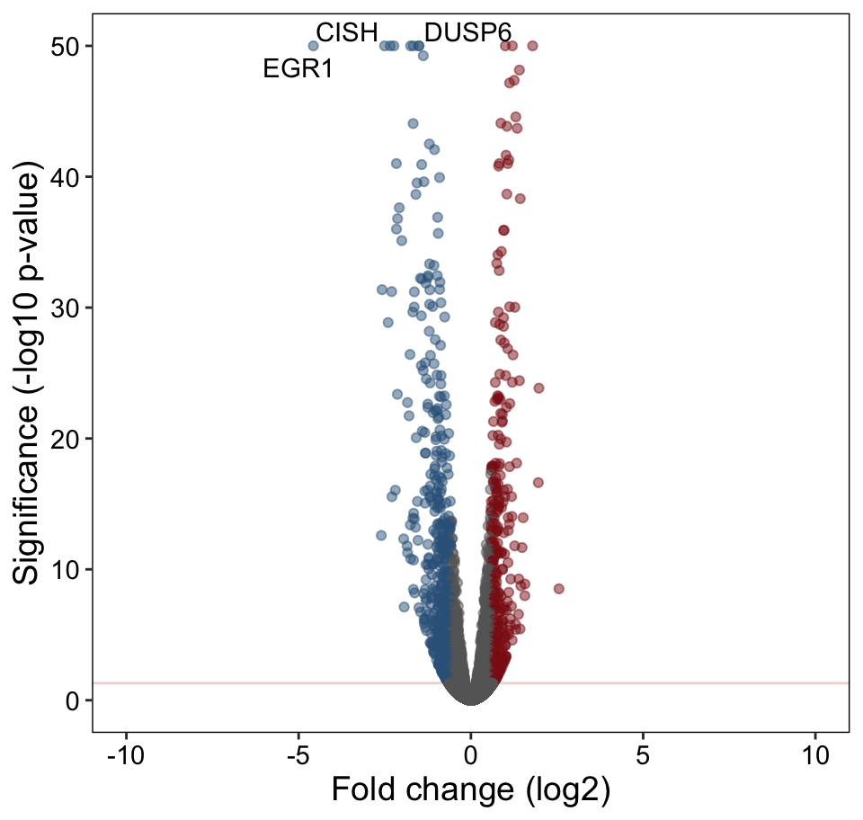
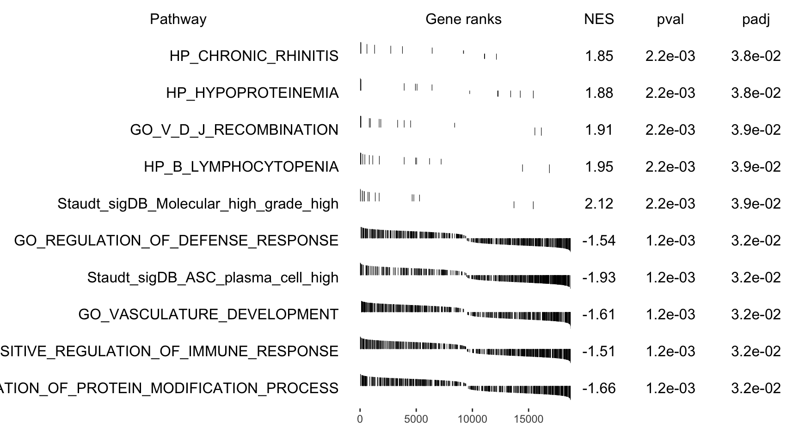
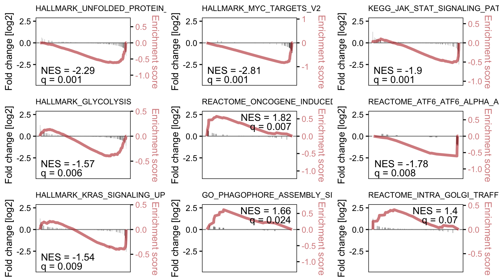

# ICN1 IM DE

## Background

To determine whether transcriptional changes associated with the Myc-to-Bcl6 transition observed in mouse pre-B cells (both STAT5-CA/YF and dual-reporter assays) are conserved in human, patient derived xenograft cells ICN1 were treated with 5uM IM for 5h.   

## Setup

```r
# load libraries
library(tidyverse)
library(tximport)
library(DESeq2)
library(openxlsx)
library(DT)
library(EnsDb.Hsapiens.v86)
txdb <- EnsDb.Hsapiens.v86
  
# make tx2gene
k <- keys(txdb, keytype = "TXID")
tx2gene <- select(txdb, k, "GENEID", "TXID")
```

## Sample Info

```r
files <- list.files("../processed_data/RNAseq/ICN1_IM_salmon", pattern = "quant.sf", 
                    recursive = T, full.names = T)
pattern <- "^.+(ICN1)_(Imatinib|veh).*_(rep[0-9])/quant.sf$"
smi <- data.frame(sample_id = sub(pattern, "\\1_\\2_\\3",files),
                  condition = sub(pattern, "\\2",files),
                  replicate = sub(pattern, "\\3",files), 
                  file = files)
names(files) <- smi$sample_id
rownames(smi) <- smi$sample_id
DT::datatable(smi, escape  = F, rownames = F,
                colnames = c("Sample ID", "Condition", "Replicate", "File Path"),
                options = list(
                  columnDefs = list(list(
                        targets = 3,
                        render = JS(
                          "function(data, type, row, meta) {",
                          "return type === 'display' && data.length > 35 ?",
                          "'<span title=\"' + data + '\">' + data.substr(0, 35) + '...</span>' : data;",
                          "}")))
                ), callback = JS('table.page(3).draw(false);'))
```

```{=html}
<div id="htmlwidget-d6cea31e2ead1265369c" style="width:100%;height:auto;" class="datatables html-widget"></div>
<script type="application/json" data-for="htmlwidget-d6cea31e2ead1265369c">{"x":{"filter":"none","data":[["ICN1_Imatinib_rep1","ICN1_Imatinib_rep2","ICN1_veh_rep1","ICN1_veh_rep2"],["Imatinib","Imatinib","veh","veh"],["rep1","rep2","rep1","rep2"],["../processed_data/RNAseq/ICN1_IM_salmon/ICN1_Imatinib_1um8h_rep1/quant.sf","../processed_data/RNAseq/ICN1_IM_salmon/ICN1_Imatinib_1um8h_rep2/quant.sf","../processed_data/RNAseq/ICN1_IM_salmon/ICN1_veh_rep1/quant.sf","../processed_data/RNAseq/ICN1_IM_salmon/ICN1_veh_rep2/quant.sf"]],"container":"<table class=\"display\">\n  <thead>\n    <tr>\n      <th>Sample ID<\/th>\n      <th>Condition<\/th>\n      <th>Replicate<\/th>\n      <th>File Path<\/th>\n    <\/tr>\n  <\/thead>\n<\/table>","options":{"columnDefs":[{"targets":3,"render":"function(data, type, row, meta) {\nreturn type === 'display' && data.length > 35 ?\n'<span title=\"' + data + '\">' + data.substr(0, 35) + '...<\/span>' : data;\n}"}],"order":[],"autoWidth":false,"orderClasses":false},"callback":"function(table) {\ntable.page(3).draw(false);\n}"},"evals":["options.columnDefs.0.render","callback"],"jsHooks":[]}</script>
```

## Load and preprocess counts

```r
txi <- tximport(files, type = "salmon", tx2gene = tx2gene, ignoreTxVersion = T)
dds <- DESeqDataSetFromTximport(txi, colData = smi,
                                design = ~condition)
dds <- dds[rowMeans(counts(dds)) > 5, ]
dds <- DESeq(dds)
saveRDS(dds, "../processed_data/RNAseq/ICN1_IM_dds.2021-02-08.rds")
```

## Differential Expression

```r
dds <- readRDS("../processed_data/RNAseq/ICN1_IM_dds.2021-02-08.rds")
deres <- results(dds, contrast=c("condition", "Imatinib", "veh"))
deres <- lfcShrink(dds, contrast=c("condition", "Imatinib", "veh"), 
                   res = deres, type = "normal")
summary(deres)
```

```
## 
## out of 18807 with nonzero total read count
## adjusted p-value < 0.1
## LFC > 0 (up)       : 1682, 8.9%
## LFC < 0 (down)     : 2014, 11%
## outliers [1]       : 0, 0%
## low counts [2]     : 5105, 27%
## (mean count < 37)
## [1] see 'cooksCutoff' argument of ?results
## [2] see 'independentFiltering' argument of ?results
```

## Annotate and tidy

```r
rlog <- rlog(dds)
resdf <- as.data.frame(deres)
resdf <- cbind(resdf, assay(rlog)[,c(3:4,1:2)])
resdf$gene_symbol <- mapIds(txdb, keys = rownames(resdf), 
                            keytype = "GENEID", column = "SYMBOL")
resdf$ensembl_id <- rownames(resdf)
resdf$baseMean <- log2(resdf$baseMean)
resdf$av_VEH <- rowMeans(assay(rlog)[,c(3:4)])
resdf$av_IM <- rowMeans(assay(rlog)[,c(1:2)])
resdf <- resdf[order(resdf$pvalue), c(11:12,2,6,3,1,13:14,7:10)]
colnames(resdf)[3:12] <- c("L2FC", "qval", "L2FC_SE", "av_expr","av_VEH","av_IM",
                           "ICN1_VEH_r1", "ICN1_VEH_r2", "ICN1_IM_r1", "ICN1_IM_r2")
saveRDS(resdf, "../processed_data/RNAseq/ICN1_IM_DE.2021-02-08.rds")
write.xlsx(resdf, "../results/ICN1_IM_DE.2021-02-08.xlsx", 
           row.names = F, firstRow=T, firstCol=T)
resdf %>% 
  dplyr::filter(qval < 0.05) %>% 
  dplyr::select(gene_symbol, L2FC, qval, av_VEH, av_IM) %>%
  mutate(gene_symbol = paste0('<a href=https://www.genecards.org/cgi-bin/carddisp.pl?gene=', 
                              gene_symbol, '>', gene_symbol, '</a>'),
         L2FC = round(L2FC, 3),
         qval = signif(qval, 3),
         av_VEH = round(av_VEH, 3),
         av_IM = round(av_IM, 3)) %>%
  DT::datatable(escape  = F, rownames = F)
```

```{=html}
<div id="htmlwidget-32517834aad884770fb8" style="width:100%;height:auto;" class="datatables html-widget"></div>
<script type="application/json" data-for="htmlwidget-32517834aad884770fb8">{"x":{"filter":"none","data":[["<a href=https://www.genecards.org/cgi-bin/carddisp.pl?gene=EGR1>EGR1<\/a>","<a href=https://www.genecards.org/cgi-bin/carddisp.pl?gene=CISH>CISH<\/a>","<a href=https://www.genecards.org/cgi-bin/carddisp.pl?gene=PIM1>PIM1<\/a>","<a href=https://www.genecards.org/cgi-bin/carddisp.pl?gene=DUSP6>DUSP6<\/a>","<a href=https://www.genecards.org/cgi-bin/carddisp.pl?gene=MYB>MYB<\/a>","<a href=https://www.genecards.org/cgi-bin/carddisp.pl?gene=DPEP1>DPEP1<\/a>","<a href=https://www.genecards.org/cgi-bin/carddisp.pl?gene=TNFRSF1B>TNFRSF1B<\/a>","<a href=https://www.genecards.org/cgi-bin/carddisp.pl?gene=LTB>LTB<\/a>","<a href=https://www.genecards.org/cgi-bin/carddisp.pl?gene=ITGB2>ITGB2<\/a>","<a href=https://www.genecards.org/cgi-bin/carddisp.pl?gene=TCF12>TCF12<\/a>","<a href=https://www.genecards.org/cgi-bin/carddisp.pl?gene=NECTIN1>NECTIN1<\/a>","<a href=https://www.genecards.org/cgi-bin/carddisp.pl?gene=TRPM2>TRPM2<\/a>","<a href=https://www.genecards.org/cgi-bin/carddisp.pl?gene=BACH2>BACH2<\/a>","<a href=https://www.genecards.org/cgi-bin/carddisp.pl?gene=MAN1A1>MAN1A1<\/a>","<a href=https://www.genecards.org/cgi-bin/carddisp.pl?gene=SLC35E3>SLC35E3<\/a>","<a href=https://www.genecards.org/cgi-bin/carddisp.pl?gene=TP53INP1>TP53INP1<\/a>","<a href=https://www.genecards.org/cgi-bin/carddisp.pl?gene=LRMP>LRMP<\/a>","<a href=https://www.genecards.org/cgi-bin/carddisp.pl?gene=EFNB1>EFNB1<\/a>","<a href=https://www.genecards.org/cgi-bin/carddisp.pl?gene=CD38>CD38<\/a>","<a href=https://www.genecards.org/cgi-bin/carddisp.pl?gene=ARPP21>ARPP21<\/a>","<a href=https://www.genecards.org/cgi-bin/carddisp.pl?gene=CD79A>CD79A<\/a>","<a href=https://www.genecards.org/cgi-bin/carddisp.pl?gene=KCNK3>KCNK3<\/a>","<a href=https://www.genecards.org/cgi-bin/carddisp.pl?gene=ERG>ERG<\/a>","<a href=https://www.genecards.org/cgi-bin/carddisp.pl?gene=DTX1>DTX1<\/a>","<a href=https://www.genecards.org/cgi-bin/carddisp.pl?gene=TNF>TNF<\/a>","<a href=https://www.genecards.org/cgi-bin/carddisp.pl?gene=RIMKLB>RIMKLB<\/a>","<a href=https://www.genecards.org/cgi-bin/carddisp.pl?gene=HPS4>HPS4<\/a>","<a href=https://www.genecards.org/cgi-bin/carddisp.pl?gene=PTP4A3>PTP4A3<\/a>","<a href=https://www.genecards.org/cgi-bin/carddisp.pl?gene=CD24>CD24<\/a>","<a href=https://www.genecards.org/cgi-bin/carddisp.pl?gene=SOCS2>SOCS2<\/a>","<a href=https://www.genecards.org/cgi-bin/carddisp.pl?gene=IER2>IER2<\/a>","<a href=https://www.genecards.org/cgi-bin/carddisp.pl?gene=CDC42EP3>CDC42EP3<\/a>","<a href=https://www.genecards.org/cgi-bin/carddisp.pl?gene=RAG2>RAG2<\/a>","<a href=https://www.genecards.org/cgi-bin/carddisp.pl?gene=CTGF>CTGF<\/a>","<a href=https://www.genecards.org/cgi-bin/carddisp.pl?gene=GPR176>GPR176<\/a>","<a href=https://www.genecards.org/cgi-bin/carddisp.pl?gene=KCNE3>KCNE3<\/a>","<a href=https://www.genecards.org/cgi-bin/carddisp.pl?gene=SLC7A5>SLC7A5<\/a>","<a href=https://www.genecards.org/cgi-bin/carddisp.pl?gene=RASD2>RASD2<\/a>","<a href=https://www.genecards.org/cgi-bin/carddisp.pl?gene=SLC17A7>SLC17A7<\/a>","<a href=https://www.genecards.org/cgi-bin/carddisp.pl?gene=IRF4>IRF4<\/a>","<a href=https://www.genecards.org/cgi-bin/carddisp.pl?gene=SERINC5>SERINC5<\/a>","<a href=https://www.genecards.org/cgi-bin/carddisp.pl?gene=XBP1>XBP1<\/a>","<a href=https://www.genecards.org/cgi-bin/carddisp.pl?gene=CCR1>CCR1<\/a>","<a href=https://www.genecards.org/cgi-bin/carddisp.pl?gene=EVI2B>EVI2B<\/a>","<a href=https://www.genecards.org/cgi-bin/carddisp.pl?gene=PPP2R5C>PPP2R5C<\/a>","<a href=https://www.genecards.org/cgi-bin/carddisp.pl?gene=MME>MME<\/a>","<a href=https://www.genecards.org/cgi-bin/carddisp.pl?gene=FUCA1>FUCA1<\/a>","<a href=https://www.genecards.org/cgi-bin/carddisp.pl?gene=HSPA5>HSPA5<\/a>","<a href=https://www.genecards.org/cgi-bin/carddisp.pl?gene=CXCR4>CXCR4<\/a>","<a href=https://www.genecards.org/cgi-bin/carddisp.pl?gene=SLC1A5>SLC1A5<\/a>","<a href=https://www.genecards.org/cgi-bin/carddisp.pl?gene=APCDD1>APCDD1<\/a>","<a href=https://www.genecards.org/cgi-bin/carddisp.pl?gene=SACS>SACS<\/a>","<a href=https://www.genecards.org/cgi-bin/carddisp.pl?gene=VCAN>VCAN<\/a>","<a href=https://www.genecards.org/cgi-bin/carddisp.pl?gene=SPIB>SPIB<\/a>","<a href=https://www.genecards.org/cgi-bin/carddisp.pl?gene=CALR>CALR<\/a>","<a href=https://www.genecards.org/cgi-bin/carddisp.pl?gene=PRKD2>PRKD2<\/a>","<a href=https://www.genecards.org/cgi-bin/carddisp.pl?gene=FMNL3>FMNL3<\/a>","<a href=https://www.genecards.org/cgi-bin/carddisp.pl?gene=HBEGF>HBEGF<\/a>","<a href=https://www.genecards.org/cgi-bin/carddisp.pl?gene=ELFN1>ELFN1<\/a>","<a href=https://www.genecards.org/cgi-bin/carddisp.pl?gene=PKDCC>PKDCC<\/a>","<a href=https://www.genecards.org/cgi-bin/carddisp.pl?gene=SPRED1>SPRED1<\/a>","<a href=https://www.genecards.org/cgi-bin/carddisp.pl?gene=HSP90B1>HSP90B1<\/a>","<a href=https://www.genecards.org/cgi-bin/carddisp.pl?gene=LRP8>LRP8<\/a>","<a href=https://www.genecards.org/cgi-bin/carddisp.pl?gene=DDIT4>DDIT4<\/a>","<a href=https://www.genecards.org/cgi-bin/carddisp.pl?gene=TEC>TEC<\/a>","<a href=https://www.genecards.org/cgi-bin/carddisp.pl?gene=FCGRT>FCGRT<\/a>","<a href=https://www.genecards.org/cgi-bin/carddisp.pl?gene=TIMP2>TIMP2<\/a>","<a href=https://www.genecards.org/cgi-bin/carddisp.pl?gene=GNG7>GNG7<\/a>","<a href=https://www.genecards.org/cgi-bin/carddisp.pl?gene=SH3BP2>SH3BP2<\/a>","<a href=https://www.genecards.org/cgi-bin/carddisp.pl?gene=HAP1>HAP1<\/a>","<a href=https://www.genecards.org/cgi-bin/carddisp.pl?gene=CD19>CD19<\/a>","<a href=https://www.genecards.org/cgi-bin/carddisp.pl?gene=RAG1>RAG1<\/a>","<a href=https://www.genecards.org/cgi-bin/carddisp.pl?gene=SIGLEC15>SIGLEC15<\/a>","<a href=https://www.genecards.org/cgi-bin/carddisp.pl?gene=TOP2B>TOP2B<\/a>","<a href=https://www.genecards.org/cgi-bin/carddisp.pl?gene=RCBTB1>RCBTB1<\/a>","<a href=https://www.genecards.org/cgi-bin/carddisp.pl?gene=ZNF608>ZNF608<\/a>","<a href=https://www.genecards.org/cgi-bin/carddisp.pl?gene=LDLR>LDLR<\/a>","<a href=https://www.genecards.org/cgi-bin/carddisp.pl?gene=TGFB1>TGFB1<\/a>","<a href=https://www.genecards.org/cgi-bin/carddisp.pl?gene=PITPNM2>PITPNM2<\/a>","<a href=https://www.genecards.org/cgi-bin/carddisp.pl?gene=H1FX>H1FX<\/a>","<a href=https://www.genecards.org/cgi-bin/carddisp.pl?gene=UBE2G2>UBE2G2<\/a>","<a href=https://www.genecards.org/cgi-bin/carddisp.pl?gene=LIG4>LIG4<\/a>","<a href=https://www.genecards.org/cgi-bin/carddisp.pl?gene=GJB2>GJB2<\/a>","<a href=https://www.genecards.org/cgi-bin/carddisp.pl?gene=HMCES>HMCES<\/a>","<a href=https://www.genecards.org/cgi-bin/carddisp.pl?gene=PDLIM7>PDLIM7<\/a>","<a href=https://www.genecards.org/cgi-bin/carddisp.pl?gene=CCDC86>CCDC86<\/a>","<a href=https://www.genecards.org/cgi-bin/carddisp.pl?gene=TTLL12>TTLL12<\/a>","<a href=https://www.genecards.org/cgi-bin/carddisp.pl?gene=NPY>NPY<\/a>","<a href=https://www.genecards.org/cgi-bin/carddisp.pl?gene=GAS6>GAS6<\/a>","<a href=https://www.genecards.org/cgi-bin/carddisp.pl?gene=TMEM263>TMEM263<\/a>","<a href=https://www.genecards.org/cgi-bin/carddisp.pl?gene=LPAR6>LPAR6<\/a>","<a href=https://www.genecards.org/cgi-bin/carddisp.pl?gene=KLHL24>KLHL24<\/a>","<a href=https://www.genecards.org/cgi-bin/carddisp.pl?gene=RGL1>RGL1<\/a>","<a href=https://www.genecards.org/cgi-bin/carddisp.pl?gene=KCNN1>KCNN1<\/a>","<a href=https://www.genecards.org/cgi-bin/carddisp.pl?gene=B2M>B2M<\/a>","<a href=https://www.genecards.org/cgi-bin/carddisp.pl?gene=PDE4DIP>PDE4DIP<\/a>","<a href=https://www.genecards.org/cgi-bin/carddisp.pl?gene=DAGLB>DAGLB<\/a>","<a href=https://www.genecards.org/cgi-bin/carddisp.pl?gene=PIK3R5>PIK3R5<\/a>","<a href=https://www.genecards.org/cgi-bin/carddisp.pl?gene=PPRC1>PPRC1<\/a>","<a href=https://www.genecards.org/cgi-bin/carddisp.pl?gene=LGI4>LGI4<\/a>","<a href=https://www.genecards.org/cgi-bin/carddisp.pl?gene=KCNA5>KCNA5<\/a>","<a href=https://www.genecards.org/cgi-bin/carddisp.pl?gene=FLNB>FLNB<\/a>","<a href=https://www.genecards.org/cgi-bin/carddisp.pl?gene=FCHSD2>FCHSD2<\/a>","<a href=https://www.genecards.org/cgi-bin/carddisp.pl?gene=USP32>USP32<\/a>","<a href=https://www.genecards.org/cgi-bin/carddisp.pl?gene=VARS>VARS<\/a>","<a href=https://www.genecards.org/cgi-bin/carddisp.pl?gene=PBXIP1>PBXIP1<\/a>","<a href=https://www.genecards.org/cgi-bin/carddisp.pl?gene=CCNG2>CCNG2<\/a>","<a href=https://www.genecards.org/cgi-bin/carddisp.pl?gene=KIAA0922>KIAA0922<\/a>","<a href=https://www.genecards.org/cgi-bin/carddisp.pl?gene=BCL6>BCL6<\/a>","<a href=https://www.genecards.org/cgi-bin/carddisp.pl?gene=GALNT2>GALNT2<\/a>","<a href=https://www.genecards.org/cgi-bin/carddisp.pl?gene=ENPP2>ENPP2<\/a>","<a href=https://www.genecards.org/cgi-bin/carddisp.pl?gene=GFI1>GFI1<\/a>","<a href=https://www.genecards.org/cgi-bin/carddisp.pl?gene=ITGA6>ITGA6<\/a>","<a href=https://www.genecards.org/cgi-bin/carddisp.pl?gene=DDX21>DDX21<\/a>","<a href=https://www.genecards.org/cgi-bin/carddisp.pl?gene=HIP1>HIP1<\/a>","<a href=https://www.genecards.org/cgi-bin/carddisp.pl?gene=SYNJ2>SYNJ2<\/a>","<a href=https://www.genecards.org/cgi-bin/carddisp.pl?gene=NOL6>NOL6<\/a>","<a href=https://www.genecards.org/cgi-bin/carddisp.pl?gene=CRTC3>CRTC3<\/a>","<a href=https://www.genecards.org/cgi-bin/carddisp.pl?gene=SH2B3>SH2B3<\/a>","<a href=https://www.genecards.org/cgi-bin/carddisp.pl?gene=SSH1>SSH1<\/a>","<a href=https://www.genecards.org/cgi-bin/carddisp.pl?gene=SMAD3>SMAD3<\/a>","<a href=https://www.genecards.org/cgi-bin/carddisp.pl?gene=AKAP2>AKAP2<\/a>","<a href=https://www.genecards.org/cgi-bin/carddisp.pl?gene=SLC43A3>SLC43A3<\/a>","<a href=https://www.genecards.org/cgi-bin/carddisp.pl?gene=YES1>YES1<\/a>","<a href=https://www.genecards.org/cgi-bin/carddisp.pl?gene=MYBBP1A>MYBBP1A<\/a>","<a href=https://www.genecards.org/cgi-bin/carddisp.pl?gene=TMC6>TMC6<\/a>","<a href=https://www.genecards.org/cgi-bin/carddisp.pl?gene=KLHL6>KLHL6<\/a>","<a href=https://www.genecards.org/cgi-bin/carddisp.pl?gene=ELOVL5>ELOVL5<\/a>","<a href=https://www.genecards.org/cgi-bin/carddisp.pl?gene=TIFA>TIFA<\/a>","<a href=https://www.genecards.org/cgi-bin/carddisp.pl?gene=SLC17A9>SLC17A9<\/a>","<a href=https://www.genecards.org/cgi-bin/carddisp.pl?gene=PDGFRB>PDGFRB<\/a>","<a href=https://www.genecards.org/cgi-bin/carddisp.pl?gene=RBM47>RBM47<\/a>","<a href=https://www.genecards.org/cgi-bin/carddisp.pl?gene=HSPA8>HSPA8<\/a>","<a href=https://www.genecards.org/cgi-bin/carddisp.pl?gene=MPP1>MPP1<\/a>","<a href=https://www.genecards.org/cgi-bin/carddisp.pl?gene=FLT3>FLT3<\/a>","<a href=https://www.genecards.org/cgi-bin/carddisp.pl?gene=PTPN7>PTPN7<\/a>","<a href=https://www.genecards.org/cgi-bin/carddisp.pl?gene=MYO1B>MYO1B<\/a>","<a href=https://www.genecards.org/cgi-bin/carddisp.pl?gene=SIRPA>SIRPA<\/a>","<a href=https://www.genecards.org/cgi-bin/carddisp.pl?gene=LRIG1>LRIG1<\/a>","<a href=https://www.genecards.org/cgi-bin/carddisp.pl?gene=CDKN1A>CDKN1A<\/a>","<a href=https://www.genecards.org/cgi-bin/carddisp.pl?gene=SRM>SRM<\/a>","<a href=https://www.genecards.org/cgi-bin/carddisp.pl?gene=GPR160>GPR160<\/a>","<a href=https://www.genecards.org/cgi-bin/carddisp.pl?gene=ETS1>ETS1<\/a>","<a href=https://www.genecards.org/cgi-bin/carddisp.pl?gene=PNP>PNP<\/a>","<a href=https://www.genecards.org/cgi-bin/carddisp.pl?gene=TMC8>TMC8<\/a>","<a href=https://www.genecards.org/cgi-bin/carddisp.pl?gene=FAM101B>FAM101B<\/a>","<a href=https://www.genecards.org/cgi-bin/carddisp.pl?gene=SKI>SKI<\/a>","<a href=https://www.genecards.org/cgi-bin/carddisp.pl?gene=DBN1>DBN1<\/a>","<a href=https://www.genecards.org/cgi-bin/carddisp.pl?gene=FASN>FASN<\/a>","<a href=https://www.genecards.org/cgi-bin/carddisp.pl?gene=PA2G4>PA2G4<\/a>","<a href=https://www.genecards.org/cgi-bin/carddisp.pl?gene=SCRIB>SCRIB<\/a>","<a href=https://www.genecards.org/cgi-bin/carddisp.pl?gene=TOMM40>TOMM40<\/a>","<a href=https://www.genecards.org/cgi-bin/carddisp.pl?gene=C10orf10>C10orf10<\/a>","<a href=https://www.genecards.org/cgi-bin/carddisp.pl?gene=BCOR>BCOR<\/a>","<a href=https://www.genecards.org/cgi-bin/carddisp.pl?gene=RNASEH2B>RNASEH2B<\/a>","<a href=https://www.genecards.org/cgi-bin/carddisp.pl?gene=BLNK>BLNK<\/a>","<a href=https://www.genecards.org/cgi-bin/carddisp.pl?gene=SETDB2>SETDB2<\/a>","<a href=https://www.genecards.org/cgi-bin/carddisp.pl?gene=OPN3>OPN3<\/a>","<a href=https://www.genecards.org/cgi-bin/carddisp.pl?gene=SSBP2>SSBP2<\/a>","<a href=https://www.genecards.org/cgi-bin/carddisp.pl?gene=KANK2>KANK2<\/a>","<a href=https://www.genecards.org/cgi-bin/carddisp.pl?gene=GLCCI1>GLCCI1<\/a>","<a href=https://www.genecards.org/cgi-bin/carddisp.pl?gene=ESYT2>ESYT2<\/a>","<a href=https://www.genecards.org/cgi-bin/carddisp.pl?gene=STK38>STK38<\/a>","<a href=https://www.genecards.org/cgi-bin/carddisp.pl?gene=ARRB2>ARRB2<\/a>","<a href=https://www.genecards.org/cgi-bin/carddisp.pl?gene=ACACA>ACACA<\/a>","<a href=https://www.genecards.org/cgi-bin/carddisp.pl?gene=FLI1>FLI1<\/a>","<a href=https://www.genecards.org/cgi-bin/carddisp.pl?gene=CLSTN1>CLSTN1<\/a>","<a href=https://www.genecards.org/cgi-bin/carddisp.pl?gene=NOLC1>NOLC1<\/a>","<a href=https://www.genecards.org/cgi-bin/carddisp.pl?gene=SPRED2>SPRED2<\/a>","<a href=https://www.genecards.org/cgi-bin/carddisp.pl?gene=PLEKHG4B>PLEKHG4B<\/a>","<a href=https://www.genecards.org/cgi-bin/carddisp.pl?gene=VASP>VASP<\/a>","<a href=https://www.genecards.org/cgi-bin/carddisp.pl?gene=GPATCH4>GPATCH4<\/a>","<a href=https://www.genecards.org/cgi-bin/carddisp.pl?gene=NRIP1>NRIP1<\/a>","<a href=https://www.genecards.org/cgi-bin/carddisp.pl?gene=HMGCS1>HMGCS1<\/a>","<a href=https://www.genecards.org/cgi-bin/carddisp.pl?gene=CYP51A1>CYP51A1<\/a>","<a href=https://www.genecards.org/cgi-bin/carddisp.pl?gene=QRSL1>QRSL1<\/a>","<a href=https://www.genecards.org/cgi-bin/carddisp.pl?gene=SLC7A6>SLC7A6<\/a>","<a href=https://www.genecards.org/cgi-bin/carddisp.pl?gene=PKD1P5>PKD1P5<\/a>","<a href=https://www.genecards.org/cgi-bin/carddisp.pl?gene=NEURL1B>NEURL1B<\/a>","<a href=https://www.genecards.org/cgi-bin/carddisp.pl?gene=DUSP1>DUSP1<\/a>","<a href=https://www.genecards.org/cgi-bin/carddisp.pl?gene=YPEL3>YPEL3<\/a>","<a href=https://www.genecards.org/cgi-bin/carddisp.pl?gene=PDCD4>PDCD4<\/a>","<a href=https://www.genecards.org/cgi-bin/carddisp.pl?gene=LCP2>LCP2<\/a>","<a href=https://www.genecards.org/cgi-bin/carddisp.pl?gene=SLC19A1>SLC19A1<\/a>","<a href=https://www.genecards.org/cgi-bin/carddisp.pl?gene=ADA>ADA<\/a>","<a href=https://www.genecards.org/cgi-bin/carddisp.pl?gene=GAB2>GAB2<\/a>","<a href=https://www.genecards.org/cgi-bin/carddisp.pl?gene=ZDHHC3>ZDHHC3<\/a>","<a href=https://www.genecards.org/cgi-bin/carddisp.pl?gene=TCF7>TCF7<\/a>","<a href=https://www.genecards.org/cgi-bin/carddisp.pl?gene=SOX4>SOX4<\/a>","<a href=https://www.genecards.org/cgi-bin/carddisp.pl?gene=SESN3>SESN3<\/a>","<a href=https://www.genecards.org/cgi-bin/carddisp.pl?gene=CCR6>CCR6<\/a>","<a href=https://www.genecards.org/cgi-bin/carddisp.pl?gene=SPRY4>SPRY4<\/a>","<a href=https://www.genecards.org/cgi-bin/carddisp.pl?gene=SNX29>SNX29<\/a>","<a href=https://www.genecards.org/cgi-bin/carddisp.pl?gene=HSPE1>HSPE1<\/a>","<a href=https://www.genecards.org/cgi-bin/carddisp.pl?gene=AMPD3>AMPD3<\/a>","<a href=https://www.genecards.org/cgi-bin/carddisp.pl?gene=NUCB2>NUCB2<\/a>","<a href=https://www.genecards.org/cgi-bin/carddisp.pl?gene=IFRD2>IFRD2<\/a>","<a href=https://www.genecards.org/cgi-bin/carddisp.pl?gene=SPRY2>SPRY2<\/a>","<a href=https://www.genecards.org/cgi-bin/carddisp.pl?gene=RAP1GAP2>RAP1GAP2<\/a>","<a href=https://www.genecards.org/cgi-bin/carddisp.pl?gene=C10orf54>C10orf54<\/a>","<a href=https://www.genecards.org/cgi-bin/carddisp.pl?gene=SELL>SELL<\/a>","<a href=https://www.genecards.org/cgi-bin/carddisp.pl?gene=TBL1XR1>TBL1XR1<\/a>","<a href=https://www.genecards.org/cgi-bin/carddisp.pl?gene=TRNP1>TRNP1<\/a>","<a href=https://www.genecards.org/cgi-bin/carddisp.pl?gene=NOP16>NOP16<\/a>","<a href=https://www.genecards.org/cgi-bin/carddisp.pl?gene=CLEC2D>CLEC2D<\/a>","<a href=https://www.genecards.org/cgi-bin/carddisp.pl?gene=NLN>NLN<\/a>","<a href=https://www.genecards.org/cgi-bin/carddisp.pl?gene=TUBA4A>TUBA4A<\/a>","<a href=https://www.genecards.org/cgi-bin/carddisp.pl?gene=CNR2>CNR2<\/a>","<a href=https://www.genecards.org/cgi-bin/carddisp.pl?gene=GLG1>GLG1<\/a>","<a href=https://www.genecards.org/cgi-bin/carddisp.pl?gene=TMEM2>TMEM2<\/a>","<a href=https://www.genecards.org/cgi-bin/carddisp.pl?gene=HBP1>HBP1<\/a>","<a href=https://www.genecards.org/cgi-bin/carddisp.pl?gene=HSPD1>HSPD1<\/a>","<a href=https://www.genecards.org/cgi-bin/carddisp.pl?gene=ITGB2-AS1>ITGB2-AS1<\/a>","<a href=https://www.genecards.org/cgi-bin/carddisp.pl?gene=FOXO1>FOXO1<\/a>","<a href=https://www.genecards.org/cgi-bin/carddisp.pl?gene=BTBD6>BTBD6<\/a>","<a href=https://www.genecards.org/cgi-bin/carddisp.pl?gene=ST3GAL1>ST3GAL1<\/a>","<a href=https://www.genecards.org/cgi-bin/carddisp.pl?gene=FAM129B>FAM129B<\/a>","<a href=https://www.genecards.org/cgi-bin/carddisp.pl?gene=CAMKK2>CAMKK2<\/a>","<a href=https://www.genecards.org/cgi-bin/carddisp.pl?gene=CMTM7>CMTM7<\/a>","<a href=https://www.genecards.org/cgi-bin/carddisp.pl?gene=SLC29A1>SLC29A1<\/a>","<a href=https://www.genecards.org/cgi-bin/carddisp.pl?gene=TAPT1>TAPT1<\/a>","<a href=https://www.genecards.org/cgi-bin/carddisp.pl?gene=NOG>NOG<\/a>","<a href=https://www.genecards.org/cgi-bin/carddisp.pl?gene=RCAN1>RCAN1<\/a>","<a href=https://www.genecards.org/cgi-bin/carddisp.pl?gene=WDR3>WDR3<\/a>","<a href=https://www.genecards.org/cgi-bin/carddisp.pl?gene=POU2AF1>POU2AF1<\/a>","<a href=https://www.genecards.org/cgi-bin/carddisp.pl?gene=LINC01224>LINC01224<\/a>","<a href=https://www.genecards.org/cgi-bin/carddisp.pl?gene=NME1>NME1<\/a>","<a href=https://www.genecards.org/cgi-bin/carddisp.pl?gene=ATP13A2>ATP13A2<\/a>","<a href=https://www.genecards.org/cgi-bin/carddisp.pl?gene=YPEL5>YPEL5<\/a>","<a href=https://www.genecards.org/cgi-bin/carddisp.pl?gene=RNF141>RNF141<\/a>","<a href=https://www.genecards.org/cgi-bin/carddisp.pl?gene=IKZF1>IKZF1<\/a>","<a href=https://www.genecards.org/cgi-bin/carddisp.pl?gene=MDM2>MDM2<\/a>","<a href=https://www.genecards.org/cgi-bin/carddisp.pl?gene=LINC00426>LINC00426<\/a>","<a href=https://www.genecards.org/cgi-bin/carddisp.pl?gene=GJA3>GJA3<\/a>","<a href=https://www.genecards.org/cgi-bin/carddisp.pl?gene=NUB1>NUB1<\/a>","<a href=https://www.genecards.org/cgi-bin/carddisp.pl?gene=HSPH1>HSPH1<\/a>","<a href=https://www.genecards.org/cgi-bin/carddisp.pl?gene=PHLDB2>PHLDB2<\/a>","<a href=https://www.genecards.org/cgi-bin/carddisp.pl?gene=PELI2>PELI2<\/a>","<a href=https://www.genecards.org/cgi-bin/carddisp.pl?gene=BCR>BCR<\/a>","<a href=https://www.genecards.org/cgi-bin/carddisp.pl?gene=TBC1D8>TBC1D8<\/a>","<a href=https://www.genecards.org/cgi-bin/carddisp.pl?gene=RASAL1>RASAL1<\/a>","<a href=https://www.genecards.org/cgi-bin/carddisp.pl?gene=PRR5L>PRR5L<\/a>","<a href=https://www.genecards.org/cgi-bin/carddisp.pl?gene=CYCS>CYCS<\/a>","<a href=https://www.genecards.org/cgi-bin/carddisp.pl?gene=GALNT6>GALNT6<\/a>","<a href=https://www.genecards.org/cgi-bin/carddisp.pl?gene=EIF4A1>EIF4A1<\/a>","<a href=https://www.genecards.org/cgi-bin/carddisp.pl?gene=SLC5A6>SLC5A6<\/a>","<a href=https://www.genecards.org/cgi-bin/carddisp.pl?gene=AKAP12>AKAP12<\/a>","<a href=https://www.genecards.org/cgi-bin/carddisp.pl?gene=EIF4G1>EIF4G1<\/a>","<a href=https://www.genecards.org/cgi-bin/carddisp.pl?gene=MYC>MYC<\/a>","<a href=https://www.genecards.org/cgi-bin/carddisp.pl?gene=PRKACB>PRKACB<\/a>","<a href=https://www.genecards.org/cgi-bin/carddisp.pl?gene=RIMBP2>RIMBP2<\/a>","<a href=https://www.genecards.org/cgi-bin/carddisp.pl?gene=ENTPD4>ENTPD4<\/a>","<a href=https://www.genecards.org/cgi-bin/carddisp.pl?gene=MFSD12>MFSD12<\/a>","<a href=https://www.genecards.org/cgi-bin/carddisp.pl?gene=FNBP1>FNBP1<\/a>","<a href=https://www.genecards.org/cgi-bin/carddisp.pl?gene=SERINC2>SERINC2<\/a>","<a href=https://www.genecards.org/cgi-bin/carddisp.pl?gene=DHCR7>DHCR7<\/a>","<a href=https://www.genecards.org/cgi-bin/carddisp.pl?gene=MAPKAPK3>MAPKAPK3<\/a>","<a href=https://www.genecards.org/cgi-bin/carddisp.pl?gene=IPO4>IPO4<\/a>","<a href=https://www.genecards.org/cgi-bin/carddisp.pl?gene=CBX6>CBX6<\/a>","<a href=https://www.genecards.org/cgi-bin/carddisp.pl?gene=RGS16>RGS16<\/a>","<a href=https://www.genecards.org/cgi-bin/carddisp.pl?gene=TARS>TARS<\/a>","<a href=https://www.genecards.org/cgi-bin/carddisp.pl?gene=CLTC>CLTC<\/a>","<a href=https://www.genecards.org/cgi-bin/carddisp.pl?gene=PRDM2>PRDM2<\/a>","<a href=https://www.genecards.org/cgi-bin/carddisp.pl?gene=FAM214A>FAM214A<\/a>","<a href=https://www.genecards.org/cgi-bin/carddisp.pl?gene=BCL3>BCL3<\/a>","<a href=https://www.genecards.org/cgi-bin/carddisp.pl?gene=LDHA>LDHA<\/a>","<a href=https://www.genecards.org/cgi-bin/carddisp.pl?gene=CAMK1D>CAMK1D<\/a>","<a href=https://www.genecards.org/cgi-bin/carddisp.pl?gene=STIP1>STIP1<\/a>","<a href=https://www.genecards.org/cgi-bin/carddisp.pl?gene=MXD3>MXD3<\/a>","<a href=https://www.genecards.org/cgi-bin/carddisp.pl?gene=MIS18BP1>MIS18BP1<\/a>","<a href=https://www.genecards.org/cgi-bin/carddisp.pl?gene=CMTM3>CMTM3<\/a>","<a href=https://www.genecards.org/cgi-bin/carddisp.pl?gene=PKIG>PKIG<\/a>","<a href=https://www.genecards.org/cgi-bin/carddisp.pl?gene=WASF1>WASF1<\/a>","<a href=https://www.genecards.org/cgi-bin/carddisp.pl?gene=DCTN4>DCTN4<\/a>","<a href=https://www.genecards.org/cgi-bin/carddisp.pl?gene=IKZF2>IKZF2<\/a>","<a href=https://www.genecards.org/cgi-bin/carddisp.pl?gene=LRRC14B>LRRC14B<\/a>","<a href=https://www.genecards.org/cgi-bin/carddisp.pl?gene=SLC12A9>SLC12A9<\/a>","<a href=https://www.genecards.org/cgi-bin/carddisp.pl?gene=CD84>CD84<\/a>","<a href=https://www.genecards.org/cgi-bin/carddisp.pl?gene=SQLE>SQLE<\/a>","<a href=https://www.genecards.org/cgi-bin/carddisp.pl?gene=VPS26B>VPS26B<\/a>","<a href=https://www.genecards.org/cgi-bin/carddisp.pl?gene=RGS19>RGS19<\/a>","<a href=https://www.genecards.org/cgi-bin/carddisp.pl?gene=NPR1>NPR1<\/a>","<a href=https://www.genecards.org/cgi-bin/carddisp.pl?gene=DHX33>DHX33<\/a>","<a href=https://www.genecards.org/cgi-bin/carddisp.pl?gene=HYOU1>HYOU1<\/a>","<a href=https://www.genecards.org/cgi-bin/carddisp.pl?gene=CCL17>CCL17<\/a>","<a href=https://www.genecards.org/cgi-bin/carddisp.pl?gene=MTUS2>MTUS2<\/a>","<a href=https://www.genecards.org/cgi-bin/carddisp.pl?gene=TXNIP>TXNIP<\/a>","<a href=https://www.genecards.org/cgi-bin/carddisp.pl?gene=PPIB>PPIB<\/a>","<a href=https://www.genecards.org/cgi-bin/carddisp.pl?gene=IARS>IARS<\/a>","<a href=https://www.genecards.org/cgi-bin/carddisp.pl?gene=RP11-1094M14.8>RP11-1094M14.8<\/a>","<a href=https://www.genecards.org/cgi-bin/carddisp.pl?gene=FILIP1L>FILIP1L<\/a>","<a href=https://www.genecards.org/cgi-bin/carddisp.pl?gene=NOP56>NOP56<\/a>","<a href=https://www.genecards.org/cgi-bin/carddisp.pl?gene=E2F2>E2F2<\/a>","<a href=https://www.genecards.org/cgi-bin/carddisp.pl?gene=ZMYND11>ZMYND11<\/a>","<a href=https://www.genecards.org/cgi-bin/carddisp.pl?gene=G3BP1>G3BP1<\/a>","<a href=https://www.genecards.org/cgi-bin/carddisp.pl?gene=C10orf2>C10orf2<\/a>","<a href=https://www.genecards.org/cgi-bin/carddisp.pl?gene=BHLHE41>BHLHE41<\/a>","<a href=https://www.genecards.org/cgi-bin/carddisp.pl?gene=AEN>AEN<\/a>","<a href=https://www.genecards.org/cgi-bin/carddisp.pl?gene=RPS6KA2>RPS6KA2<\/a>","<a href=https://www.genecards.org/cgi-bin/carddisp.pl?gene=NGLY1>NGLY1<\/a>","<a href=https://www.genecards.org/cgi-bin/carddisp.pl?gene=TSC22D1>TSC22D1<\/a>","<a href=https://www.genecards.org/cgi-bin/carddisp.pl?gene=ITGA4>ITGA4<\/a>","<a href=https://www.genecards.org/cgi-bin/carddisp.pl?gene=GBP5>GBP5<\/a>","<a href=https://www.genecards.org/cgi-bin/carddisp.pl?gene=DOCK10>DOCK10<\/a>","<a href=https://www.genecards.org/cgi-bin/carddisp.pl?gene=GRAMD4>GRAMD4<\/a>","<a href=https://www.genecards.org/cgi-bin/carddisp.pl?gene=PRMT1>PRMT1<\/a>","<a href=https://www.genecards.org/cgi-bin/carddisp.pl?gene=MSL2>MSL2<\/a>","<a href=https://www.genecards.org/cgi-bin/carddisp.pl?gene=APOL4>APOL4<\/a>","<a href=https://www.genecards.org/cgi-bin/carddisp.pl?gene=DNTT>DNTT<\/a>","<a href=https://www.genecards.org/cgi-bin/carddisp.pl?gene=EBNA1BP2>EBNA1BP2<\/a>","<a href=https://www.genecards.org/cgi-bin/carddisp.pl?gene=GNL3>GNL3<\/a>","<a href=https://www.genecards.org/cgi-bin/carddisp.pl?gene=MMP25-AS1>MMP25-AS1<\/a>","<a href=https://www.genecards.org/cgi-bin/carddisp.pl?gene=MDN1>MDN1<\/a>","<a href=https://www.genecards.org/cgi-bin/carddisp.pl?gene=NAT10>NAT10<\/a>","<a href=https://www.genecards.org/cgi-bin/carddisp.pl?gene=CHST2>CHST2<\/a>","<a href=https://www.genecards.org/cgi-bin/carddisp.pl?gene=TMEM200A>TMEM200A<\/a>","<a href=https://www.genecards.org/cgi-bin/carddisp.pl?gene=SMIM14>SMIM14<\/a>","<a href=https://www.genecards.org/cgi-bin/carddisp.pl?gene=RAC2>RAC2<\/a>","<a href=https://www.genecards.org/cgi-bin/carddisp.pl?gene=MANF>MANF<\/a>","<a href=https://www.genecards.org/cgi-bin/carddisp.pl?gene=MEGF11>MEGF11<\/a>","<a href=https://www.genecards.org/cgi-bin/carddisp.pl?gene=CD81>CD81<\/a>","<a href=https://www.genecards.org/cgi-bin/carddisp.pl?gene=KCNMB4>KCNMB4<\/a>","<a href=https://www.genecards.org/cgi-bin/carddisp.pl?gene=PUS1>PUS1<\/a>","<a href=https://www.genecards.org/cgi-bin/carddisp.pl?gene=IFI30>IFI30<\/a>","<a href=https://www.genecards.org/cgi-bin/carddisp.pl?gene=SNHG3>SNHG3<\/a>","<a href=https://www.genecards.org/cgi-bin/carddisp.pl?gene=MSH6>MSH6<\/a>","<a href=https://www.genecards.org/cgi-bin/carddisp.pl?gene=E2F1>E2F1<\/a>","<a href=https://www.genecards.org/cgi-bin/carddisp.pl?gene=MRTO4>MRTO4<\/a>","<a href=https://www.genecards.org/cgi-bin/carddisp.pl?gene=ADD3>ADD3<\/a>","<a href=https://www.genecards.org/cgi-bin/carddisp.pl?gene=CLIC5>CLIC5<\/a>","<a href=https://www.genecards.org/cgi-bin/carddisp.pl?gene=POLR1B>POLR1B<\/a>","<a href=https://www.genecards.org/cgi-bin/carddisp.pl?gene=BRF1>BRF1<\/a>","<a href=https://www.genecards.org/cgi-bin/carddisp.pl?gene=TTC7A>TTC7A<\/a>","<a href=https://www.genecards.org/cgi-bin/carddisp.pl?gene=NAV2>NAV2<\/a>","<a href=https://www.genecards.org/cgi-bin/carddisp.pl?gene=TCF3>TCF3<\/a>","<a href=https://www.genecards.org/cgi-bin/carddisp.pl?gene=POLR1A>POLR1A<\/a>","<a href=https://www.genecards.org/cgi-bin/carddisp.pl?gene=ASAH1>ASAH1<\/a>","<a href=https://www.genecards.org/cgi-bin/carddisp.pl?gene=NTN1>NTN1<\/a>","<a href=https://www.genecards.org/cgi-bin/carddisp.pl?gene=ARHGAP17>ARHGAP17<\/a>","<a href=https://www.genecards.org/cgi-bin/carddisp.pl?gene=CPM>CPM<\/a>","<a href=https://www.genecards.org/cgi-bin/carddisp.pl?gene=SLC35F2>SLC35F2<\/a>","<a href=https://www.genecards.org/cgi-bin/carddisp.pl?gene=DIP2C>DIP2C<\/a>","<a href=https://www.genecards.org/cgi-bin/carddisp.pl?gene=LAIR1>LAIR1<\/a>","<a href=https://www.genecards.org/cgi-bin/carddisp.pl?gene=SLC16A1>SLC16A1<\/a>","<a href=https://www.genecards.org/cgi-bin/carddisp.pl?gene=HRK>HRK<\/a>","<a href=https://www.genecards.org/cgi-bin/carddisp.pl?gene=EPHB4>EPHB4<\/a>","<a href=https://www.genecards.org/cgi-bin/carddisp.pl?gene=NEK6>NEK6<\/a>","<a href=https://www.genecards.org/cgi-bin/carddisp.pl?gene=SPATA33>SPATA33<\/a>","<a href=https://www.genecards.org/cgi-bin/carddisp.pl?gene=TFDP2>TFDP2<\/a>","<a href=https://www.genecards.org/cgi-bin/carddisp.pl?gene=P2RY8>P2RY8<\/a>","<a href=https://www.genecards.org/cgi-bin/carddisp.pl?gene=BRAF>BRAF<\/a>","<a href=https://www.genecards.org/cgi-bin/carddisp.pl?gene=TRIM38>TRIM38<\/a>","<a href=https://www.genecards.org/cgi-bin/carddisp.pl?gene=C15orf39>C15orf39<\/a>","<a href=https://www.genecards.org/cgi-bin/carddisp.pl?gene=IL21R>IL21R<\/a>","<a href=https://www.genecards.org/cgi-bin/carddisp.pl?gene=SLC9A7>SLC9A7<\/a>","<a href=https://www.genecards.org/cgi-bin/carddisp.pl?gene=NIFK>NIFK<\/a>","<a href=https://www.genecards.org/cgi-bin/carddisp.pl?gene=NREP>NREP<\/a>","<a href=https://www.genecards.org/cgi-bin/carddisp.pl?gene=RCN3>RCN3<\/a>","<a href=https://www.genecards.org/cgi-bin/carddisp.pl?gene=FAM207A>FAM207A<\/a>","<a href=https://www.genecards.org/cgi-bin/carddisp.pl?gene=TNFRSF10B>TNFRSF10B<\/a>","<a href=https://www.genecards.org/cgi-bin/carddisp.pl?gene=PUS7>PUS7<\/a>","<a href=https://www.genecards.org/cgi-bin/carddisp.pl?gene=ZFP36L1>ZFP36L1<\/a>","<a href=https://www.genecards.org/cgi-bin/carddisp.pl?gene=RELT>RELT<\/a>","<a href=https://www.genecards.org/cgi-bin/carddisp.pl?gene=ADCY9>ADCY9<\/a>","<a href=https://www.genecards.org/cgi-bin/carddisp.pl?gene=SLFN12L>SLFN12L<\/a>","<a href=https://www.genecards.org/cgi-bin/carddisp.pl?gene=DFNA5>DFNA5<\/a>","<a href=https://www.genecards.org/cgi-bin/carddisp.pl?gene=ENO1>ENO1<\/a>","<a href=https://www.genecards.org/cgi-bin/carddisp.pl?gene=QPRT>QPRT<\/a>","<a href=https://www.genecards.org/cgi-bin/carddisp.pl?gene=CDKN2C>CDKN2C<\/a>","<a href=https://www.genecards.org/cgi-bin/carddisp.pl?gene=GCSAM>GCSAM<\/a>","<a href=https://www.genecards.org/cgi-bin/carddisp.pl?gene=IL4R>IL4R<\/a>","<a href=https://www.genecards.org/cgi-bin/carddisp.pl?gene=SLC6A19>SLC6A19<\/a>","<a href=https://www.genecards.org/cgi-bin/carddisp.pl?gene=SASH3>SASH3<\/a>","<a href=https://www.genecards.org/cgi-bin/carddisp.pl?gene=CORO1A>CORO1A<\/a>","<a href=https://www.genecards.org/cgi-bin/carddisp.pl?gene=URB1>URB1<\/a>","<a href=https://www.genecards.org/cgi-bin/carddisp.pl?gene=CASP1>CASP1<\/a>","<a href=https://www.genecards.org/cgi-bin/carddisp.pl?gene=CD3EAP>CD3EAP<\/a>","<a href=https://www.genecards.org/cgi-bin/carddisp.pl?gene=SLC7A1>SLC7A1<\/a>","<a href=https://www.genecards.org/cgi-bin/carddisp.pl?gene=BHLHE40>BHLHE40<\/a>","<a href=https://www.genecards.org/cgi-bin/carddisp.pl?gene=PLK3>PLK3<\/a>","<a href=https://www.genecards.org/cgi-bin/carddisp.pl?gene=TLE4>TLE4<\/a>","<a href=https://www.genecards.org/cgi-bin/carddisp.pl?gene=SMAGP>SMAGP<\/a>","<a href=https://www.genecards.org/cgi-bin/carddisp.pl?gene=PCDH9>PCDH9<\/a>","<a href=https://www.genecards.org/cgi-bin/carddisp.pl?gene=RRS1>RRS1<\/a>","<a href=https://www.genecards.org/cgi-bin/carddisp.pl?gene=PTPRE>PTPRE<\/a>","<a href=https://www.genecards.org/cgi-bin/carddisp.pl?gene=JARID2>JARID2<\/a>","<a href=https://www.genecards.org/cgi-bin/carddisp.pl?gene=APBB1IP>APBB1IP<\/a>","<a href=https://www.genecards.org/cgi-bin/carddisp.pl?gene=EVI2A>EVI2A<\/a>","<a href=https://www.genecards.org/cgi-bin/carddisp.pl?gene=TLE3>TLE3<\/a>","<a href=https://www.genecards.org/cgi-bin/carddisp.pl?gene=RAB40B>RAB40B<\/a>","<a href=https://www.genecards.org/cgi-bin/carddisp.pl?gene=CCDC88A>CCDC88A<\/a>","<a href=https://www.genecards.org/cgi-bin/carddisp.pl?gene=CORO6>CORO6<\/a>","<a href=https://www.genecards.org/cgi-bin/carddisp.pl?gene=HK2>HK2<\/a>","<a href=https://www.genecards.org/cgi-bin/carddisp.pl?gene=MSI2>MSI2<\/a>","<a href=https://www.genecards.org/cgi-bin/carddisp.pl?gene=DNAJA1>DNAJA1<\/a>","<a href=https://www.genecards.org/cgi-bin/carddisp.pl?gene=MAPKBP1>MAPKBP1<\/a>","<a href=https://www.genecards.org/cgi-bin/carddisp.pl?gene=ZNF423>ZNF423<\/a>","<a href=https://www.genecards.org/cgi-bin/carddisp.pl?gene=ACSL5>ACSL5<\/a>","<a href=https://www.genecards.org/cgi-bin/carddisp.pl?gene=SYVN1>SYVN1<\/a>","<a href=https://www.genecards.org/cgi-bin/carddisp.pl?gene=CCT5>CCT5<\/a>","<a href=https://www.genecards.org/cgi-bin/carddisp.pl?gene=CKAP2>CKAP2<\/a>","<a href=https://www.genecards.org/cgi-bin/carddisp.pl?gene=FNIP1>FNIP1<\/a>","<a href=https://www.genecards.org/cgi-bin/carddisp.pl?gene=PXDN>PXDN<\/a>","<a href=https://www.genecards.org/cgi-bin/carddisp.pl?gene=MTHFD1L>MTHFD1L<\/a>","<a href=https://www.genecards.org/cgi-bin/carddisp.pl?gene=RAPGEF1>RAPGEF1<\/a>","<a href=https://www.genecards.org/cgi-bin/carddisp.pl?gene=DUSP7>DUSP7<\/a>","<a href=https://www.genecards.org/cgi-bin/carddisp.pl?gene=HM13>HM13<\/a>","<a href=https://www.genecards.org/cgi-bin/carddisp.pl?gene=EIF4G3>EIF4G3<\/a>","<a href=https://www.genecards.org/cgi-bin/carddisp.pl?gene=HLA-DRB5>HLA-DRB5<\/a>","<a href=https://www.genecards.org/cgi-bin/carddisp.pl?gene=ATP8A1>ATP8A1<\/a>","<a href=https://www.genecards.org/cgi-bin/carddisp.pl?gene=AIM1>AIM1<\/a>","<a href=https://www.genecards.org/cgi-bin/carddisp.pl?gene=MSMO1>MSMO1<\/a>","<a href=https://www.genecards.org/cgi-bin/carddisp.pl?gene=PALD1>PALD1<\/a>","<a href=https://www.genecards.org/cgi-bin/carddisp.pl?gene=CD248>CD248<\/a>","<a href=https://www.genecards.org/cgi-bin/carddisp.pl?gene=ZMYND8>ZMYND8<\/a>","<a href=https://www.genecards.org/cgi-bin/carddisp.pl?gene=BUB1B>BUB1B<\/a>","<a href=https://www.genecards.org/cgi-bin/carddisp.pl?gene=PTPRCAP>PTPRCAP<\/a>","<a href=https://www.genecards.org/cgi-bin/carddisp.pl?gene=LSS>LSS<\/a>","<a href=https://www.genecards.org/cgi-bin/carddisp.pl?gene=FRMD4A>FRMD4A<\/a>","<a href=https://www.genecards.org/cgi-bin/carddisp.pl?gene=EIF5A>EIF5A<\/a>","<a href=https://www.genecards.org/cgi-bin/carddisp.pl?gene=YPEL1>YPEL1<\/a>","<a href=https://www.genecards.org/cgi-bin/carddisp.pl?gene=LIMS2>LIMS2<\/a>","<a href=https://www.genecards.org/cgi-bin/carddisp.pl?gene=ABCE1>ABCE1<\/a>","<a href=https://www.genecards.org/cgi-bin/carddisp.pl?gene=BCAT1>BCAT1<\/a>","<a href=https://www.genecards.org/cgi-bin/carddisp.pl?gene=PLXNB1>PLXNB1<\/a>","<a href=https://www.genecards.org/cgi-bin/carddisp.pl?gene=CDHR3>CDHR3<\/a>","<a href=https://www.genecards.org/cgi-bin/carddisp.pl?gene=HRH2>HRH2<\/a>","<a href=https://www.genecards.org/cgi-bin/carddisp.pl?gene=HIST2H2BE>HIST2H2BE<\/a>","<a href=https://www.genecards.org/cgi-bin/carddisp.pl?gene=PDE4A>PDE4A<\/a>","<a href=https://www.genecards.org/cgi-bin/carddisp.pl?gene=CPNE7>CPNE7<\/a>","<a href=https://www.genecards.org/cgi-bin/carddisp.pl?gene=RXRA>RXRA<\/a>","<a href=https://www.genecards.org/cgi-bin/carddisp.pl?gene=STAT2>STAT2<\/a>","<a href=https://www.genecards.org/cgi-bin/carddisp.pl?gene=SERINC3>SERINC3<\/a>","<a href=https://www.genecards.org/cgi-bin/carddisp.pl?gene=SLC27A3>SLC27A3<\/a>","<a href=https://www.genecards.org/cgi-bin/carddisp.pl?gene=SLC1A4>SLC1A4<\/a>","<a href=https://www.genecards.org/cgi-bin/carddisp.pl?gene=ZNF217>ZNF217<\/a>","<a href=https://www.genecards.org/cgi-bin/carddisp.pl?gene=INSR>INSR<\/a>","<a href=https://www.genecards.org/cgi-bin/carddisp.pl?gene=PHC3>PHC3<\/a>","<a href=https://www.genecards.org/cgi-bin/carddisp.pl?gene=NCL>NCL<\/a>","<a href=https://www.genecards.org/cgi-bin/carddisp.pl?gene=HSP90AA1>HSP90AA1<\/a>","<a href=https://www.genecards.org/cgi-bin/carddisp.pl?gene=CCDC85B>CCDC85B<\/a>","<a href=https://www.genecards.org/cgi-bin/carddisp.pl?gene=DENND3>DENND3<\/a>","<a href=https://www.genecards.org/cgi-bin/carddisp.pl?gene=ALDH5A1>ALDH5A1<\/a>","<a href=https://www.genecards.org/cgi-bin/carddisp.pl?gene=WASF2>WASF2<\/a>","<a href=https://www.genecards.org/cgi-bin/carddisp.pl?gene=CFAP73>CFAP73<\/a>","<a href=https://www.genecards.org/cgi-bin/carddisp.pl?gene=LYAR>LYAR<\/a>","<a href=https://www.genecards.org/cgi-bin/carddisp.pl?gene=MPP6>MPP6<\/a>","<a href=https://www.genecards.org/cgi-bin/carddisp.pl?gene=GRWD1>GRWD1<\/a>","<a href=https://www.genecards.org/cgi-bin/carddisp.pl?gene=VWCE>VWCE<\/a>","<a href=https://www.genecards.org/cgi-bin/carddisp.pl?gene=SHISA2>SHISA2<\/a>","<a href=https://www.genecards.org/cgi-bin/carddisp.pl?gene=RRP9>RRP9<\/a>","<a href=https://www.genecards.org/cgi-bin/carddisp.pl?gene=C20orf27>C20orf27<\/a>","<a href=https://www.genecards.org/cgi-bin/carddisp.pl?gene=C1QTNF4>C1QTNF4<\/a>","<a href=https://www.genecards.org/cgi-bin/carddisp.pl?gene=CCT3>CCT3<\/a>","<a href=https://www.genecards.org/cgi-bin/carddisp.pl?gene=TSPAN14>TSPAN14<\/a>","<a href=https://www.genecards.org/cgi-bin/carddisp.pl?gene=IRS2>IRS2<\/a>","<a href=https://www.genecards.org/cgi-bin/carddisp.pl?gene=HECA>HECA<\/a>","<a href=https://www.genecards.org/cgi-bin/carddisp.pl?gene=PFKL>PFKL<\/a>","<a href=https://www.genecards.org/cgi-bin/carddisp.pl?gene=CHST15>CHST15<\/a>","<a href=https://www.genecards.org/cgi-bin/carddisp.pl?gene=AK2>AK2<\/a>","<a href=https://www.genecards.org/cgi-bin/carddisp.pl?gene=LRRC59>LRRC59<\/a>","<a href=https://www.genecards.org/cgi-bin/carddisp.pl?gene=POU2F1>POU2F1<\/a>","<a href=https://www.genecards.org/cgi-bin/carddisp.pl?gene=C22orf46>C22orf46<\/a>","<a href=https://www.genecards.org/cgi-bin/carddisp.pl?gene=SORL1>SORL1<\/a>","<a href=https://www.genecards.org/cgi-bin/carddisp.pl?gene=FAM107B>FAM107B<\/a>","<a href=https://www.genecards.org/cgi-bin/carddisp.pl?gene=ADAM8>ADAM8<\/a>","<a href=https://www.genecards.org/cgi-bin/carddisp.pl?gene=LDLRAD4>LDLRAD4<\/a>","<a href=https://www.genecards.org/cgi-bin/carddisp.pl?gene=DHX37>DHX37<\/a>","<a href=https://www.genecards.org/cgi-bin/carddisp.pl?gene=SCARB1>SCARB1<\/a>","<a href=https://www.genecards.org/cgi-bin/carddisp.pl?gene=CALCOCO1>CALCOCO1<\/a>","<a href=https://www.genecards.org/cgi-bin/carddisp.pl?gene=RP11-1094M14.5>RP11-1094M14.5<\/a>","<a href=https://www.genecards.org/cgi-bin/carddisp.pl?gene=SNAI1>SNAI1<\/a>","<a href=https://www.genecards.org/cgi-bin/carddisp.pl?gene=ARHGAP21>ARHGAP21<\/a>","<a href=https://www.genecards.org/cgi-bin/carddisp.pl?gene=P2RY11>P2RY11<\/a>","<a href=https://www.genecards.org/cgi-bin/carddisp.pl?gene=TUBA1C>TUBA1C<\/a>","<a href=https://www.genecards.org/cgi-bin/carddisp.pl?gene=PSD4>PSD4<\/a>","<a href=https://www.genecards.org/cgi-bin/carddisp.pl?gene=LINC01215>LINC01215<\/a>","<a href=https://www.genecards.org/cgi-bin/carddisp.pl?gene=ITGB1>ITGB1<\/a>","<a href=https://www.genecards.org/cgi-bin/carddisp.pl?gene=TMEM245>TMEM245<\/a>","<a href=https://www.genecards.org/cgi-bin/carddisp.pl?gene=SORD>SORD<\/a>","<a href=https://www.genecards.org/cgi-bin/carddisp.pl?gene=SLC39A14>SLC39A14<\/a>","<a href=https://www.genecards.org/cgi-bin/carddisp.pl?gene=B3GNTL1>B3GNTL1<\/a>","<a href=https://www.genecards.org/cgi-bin/carddisp.pl?gene=C9orf139>C9orf139<\/a>","<a href=https://www.genecards.org/cgi-bin/carddisp.pl?gene=PAICS>PAICS<\/a>","<a href=https://www.genecards.org/cgi-bin/carddisp.pl?gene=PHLDA3>PHLDA3<\/a>","<a href=https://www.genecards.org/cgi-bin/carddisp.pl?gene=MAP3K1>MAP3K1<\/a>","<a href=https://www.genecards.org/cgi-bin/carddisp.pl?gene=ARMC6>ARMC6<\/a>","<a href=https://www.genecards.org/cgi-bin/carddisp.pl?gene=MFGE8>MFGE8<\/a>","<a href=https://www.genecards.org/cgi-bin/carddisp.pl?gene=TTC21A>TTC21A<\/a>","<a href=https://www.genecards.org/cgi-bin/carddisp.pl?gene=GTF2IP4>GTF2IP4<\/a>","<a href=https://www.genecards.org/cgi-bin/carddisp.pl?gene=ARAP2>ARAP2<\/a>","<a href=https://www.genecards.org/cgi-bin/carddisp.pl?gene=MYO18B>MYO18B<\/a>","<a href=https://www.genecards.org/cgi-bin/carddisp.pl?gene=LAMA5>LAMA5<\/a>","<a href=https://www.genecards.org/cgi-bin/carddisp.pl?gene=DPH2>DPH2<\/a>","<a href=https://www.genecards.org/cgi-bin/carddisp.pl?gene=GNA15>GNA15<\/a>","<a href=https://www.genecards.org/cgi-bin/carddisp.pl?gene=HMGB2>HMGB2<\/a>","<a href=https://www.genecards.org/cgi-bin/carddisp.pl?gene=LL21NC02-1C16.2>LL21NC02-1C16.2<\/a>","<a href=https://www.genecards.org/cgi-bin/carddisp.pl?gene=FABP5>FABP5<\/a>","<a href=https://www.genecards.org/cgi-bin/carddisp.pl?gene=KANSL1L>KANSL1L<\/a>","<a href=https://www.genecards.org/cgi-bin/carddisp.pl?gene=PPP1R14B>PPP1R14B<\/a>","<a href=https://www.genecards.org/cgi-bin/carddisp.pl?gene=PHLPP1>PHLPP1<\/a>","<a href=https://www.genecards.org/cgi-bin/carddisp.pl?gene=OGFOD1>OGFOD1<\/a>","<a href=https://www.genecards.org/cgi-bin/carddisp.pl?gene=F2R>F2R<\/a>","<a href=https://www.genecards.org/cgi-bin/carddisp.pl?gene=RRP1B>RRP1B<\/a>","<a href=https://www.genecards.org/cgi-bin/carddisp.pl?gene=NOP58>NOP58<\/a>","<a href=https://www.genecards.org/cgi-bin/carddisp.pl?gene=LARS>LARS<\/a>","<a href=https://www.genecards.org/cgi-bin/carddisp.pl?gene=PYCR1>PYCR1<\/a>","<a href=https://www.genecards.org/cgi-bin/carddisp.pl?gene=NRN1>NRN1<\/a>","<a href=https://www.genecards.org/cgi-bin/carddisp.pl?gene=DCAF13>DCAF13<\/a>","<a href=https://www.genecards.org/cgi-bin/carddisp.pl?gene=SCN4A>SCN4A<\/a>","<a href=https://www.genecards.org/cgi-bin/carddisp.pl?gene=TBKBP1>TBKBP1<\/a>","<a href=https://www.genecards.org/cgi-bin/carddisp.pl?gene=MYO18A>MYO18A<\/a>","<a href=https://www.genecards.org/cgi-bin/carddisp.pl?gene=ISOC2>ISOC2<\/a>","<a href=https://www.genecards.org/cgi-bin/carddisp.pl?gene=BEST3>BEST3<\/a>","<a href=https://www.genecards.org/cgi-bin/carddisp.pl?gene=DPF3>DPF3<\/a>","<a href=https://www.genecards.org/cgi-bin/carddisp.pl?gene=HAR1A>HAR1A<\/a>","<a href=https://www.genecards.org/cgi-bin/carddisp.pl?gene=XPO5>XPO5<\/a>","<a href=https://www.genecards.org/cgi-bin/carddisp.pl?gene=PHB>PHB<\/a>","<a href=https://www.genecards.org/cgi-bin/carddisp.pl?gene=FAM111A>FAM111A<\/a>","<a href=https://www.genecards.org/cgi-bin/carddisp.pl?gene=PPARGC1B>PPARGC1B<\/a>","<a href=https://www.genecards.org/cgi-bin/carddisp.pl?gene=PRKCE>PRKCE<\/a>","<a href=https://www.genecards.org/cgi-bin/carddisp.pl?gene=ARID3B>ARID3B<\/a>","<a href=https://www.genecards.org/cgi-bin/carddisp.pl?gene=RTN4RL2>RTN4RL2<\/a>","<a href=https://www.genecards.org/cgi-bin/carddisp.pl?gene=CMTM8>CMTM8<\/a>","<a href=https://www.genecards.org/cgi-bin/carddisp.pl?gene=RNF19B>RNF19B<\/a>","<a href=https://www.genecards.org/cgi-bin/carddisp.pl?gene=CD1C>CD1C<\/a>","<a href=https://www.genecards.org/cgi-bin/carddisp.pl?gene=ASCC3>ASCC3<\/a>","<a href=https://www.genecards.org/cgi-bin/carddisp.pl?gene=SURF6>SURF6<\/a>","<a href=https://www.genecards.org/cgi-bin/carddisp.pl?gene=PIK3R6>PIK3R6<\/a>","<a href=https://www.genecards.org/cgi-bin/carddisp.pl?gene=ABCA7>ABCA7<\/a>","<a href=https://www.genecards.org/cgi-bin/carddisp.pl?gene=PAN3>PAN3<\/a>","<a href=https://www.genecards.org/cgi-bin/carddisp.pl?gene=PDP2>PDP2<\/a>","<a href=https://www.genecards.org/cgi-bin/carddisp.pl?gene=ELF1>ELF1<\/a>","<a href=https://www.genecards.org/cgi-bin/carddisp.pl?gene=ETS2>ETS2<\/a>","<a href=https://www.genecards.org/cgi-bin/carddisp.pl?gene=TUBA8>TUBA8<\/a>","<a href=https://www.genecards.org/cgi-bin/carddisp.pl?gene=MYO7B>MYO7B<\/a>","<a href=https://www.genecards.org/cgi-bin/carddisp.pl?gene=IFITM1>IFITM1<\/a>","<a href=https://www.genecards.org/cgi-bin/carddisp.pl?gene=CD52>CD52<\/a>","<a href=https://www.genecards.org/cgi-bin/carddisp.pl?gene=SIGMAR1>SIGMAR1<\/a>","<a href=https://www.genecards.org/cgi-bin/carddisp.pl?gene=ARHGEF4>ARHGEF4<\/a>","<a href=https://www.genecards.org/cgi-bin/carddisp.pl?gene=RCBTB2>RCBTB2<\/a>","<a href=https://www.genecards.org/cgi-bin/carddisp.pl?gene=H1F0>H1F0<\/a>","<a href=https://www.genecards.org/cgi-bin/carddisp.pl?gene=CD72>CD72<\/a>","<a href=https://www.genecards.org/cgi-bin/carddisp.pl?gene=RP11-611O2.5>RP11-611O2.5<\/a>","<a href=https://www.genecards.org/cgi-bin/carddisp.pl?gene=LINC00865>LINC00865<\/a>","<a href=https://www.genecards.org/cgi-bin/carddisp.pl?gene=ABL1>ABL1<\/a>","<a href=https://www.genecards.org/cgi-bin/carddisp.pl?gene=PAK1IP1>PAK1IP1<\/a>","<a href=https://www.genecards.org/cgi-bin/carddisp.pl?gene=RABGAP1L>RABGAP1L<\/a>","<a href=https://www.genecards.org/cgi-bin/carddisp.pl?gene=PLEKHA2>PLEKHA2<\/a>","<a href=https://www.genecards.org/cgi-bin/carddisp.pl?gene=RRP12>RRP12<\/a>","<a href=https://www.genecards.org/cgi-bin/carddisp.pl?gene=LILRB1>LILRB1<\/a>","<a href=https://www.genecards.org/cgi-bin/carddisp.pl?gene=EEF2KMT>EEF2KMT<\/a>","<a href=https://www.genecards.org/cgi-bin/carddisp.pl?gene=GARS>GARS<\/a>","<a href=https://www.genecards.org/cgi-bin/carddisp.pl?gene=YPEL2>YPEL2<\/a>","<a href=https://www.genecards.org/cgi-bin/carddisp.pl?gene=ABTB1>ABTB1<\/a>","<a href=https://www.genecards.org/cgi-bin/carddisp.pl?gene=RNF213>RNF213<\/a>","<a href=https://www.genecards.org/cgi-bin/carddisp.pl?gene=PTEN>PTEN<\/a>","<a href=https://www.genecards.org/cgi-bin/carddisp.pl?gene=ADAM15>ADAM15<\/a>","<a href=https://www.genecards.org/cgi-bin/carddisp.pl?gene=PECAM1>PECAM1<\/a>","<a href=https://www.genecards.org/cgi-bin/carddisp.pl?gene=HMGCR>HMGCR<\/a>","<a href=https://www.genecards.org/cgi-bin/carddisp.pl?gene=SUV39H2>SUV39H2<\/a>","<a href=https://www.genecards.org/cgi-bin/carddisp.pl?gene=ABCF2>ABCF2<\/a>","<a href=https://www.genecards.org/cgi-bin/carddisp.pl?gene=C1QBP>C1QBP<\/a>","<a href=https://www.genecards.org/cgi-bin/carddisp.pl?gene=NR3C1>NR3C1<\/a>","<a href=https://www.genecards.org/cgi-bin/carddisp.pl?gene=SLC9A3R1>SLC9A3R1<\/a>","<a href=https://www.genecards.org/cgi-bin/carddisp.pl?gene=SAMSN1>SAMSN1<\/a>","<a href=https://www.genecards.org/cgi-bin/carddisp.pl?gene=SPATS2L>SPATS2L<\/a>","<a href=https://www.genecards.org/cgi-bin/carddisp.pl?gene=WDR43>WDR43<\/a>","<a href=https://www.genecards.org/cgi-bin/carddisp.pl?gene=PTPRJ>PTPRJ<\/a>","<a href=https://www.genecards.org/cgi-bin/carddisp.pl?gene=BCL7A>BCL7A<\/a>","<a href=https://www.genecards.org/cgi-bin/carddisp.pl?gene=PRELID1>PRELID1<\/a>","<a href=https://www.genecards.org/cgi-bin/carddisp.pl?gene=WDR74>WDR74<\/a>","<a href=https://www.genecards.org/cgi-bin/carddisp.pl?gene=TMEM192>TMEM192<\/a>","<a href=https://www.genecards.org/cgi-bin/carddisp.pl?gene=RABEPK>RABEPK<\/a>","<a href=https://www.genecards.org/cgi-bin/carddisp.pl?gene=ASXL1>ASXL1<\/a>","<a href=https://www.genecards.org/cgi-bin/carddisp.pl?gene=HSP90AB1>HSP90AB1<\/a>","<a href=https://www.genecards.org/cgi-bin/carddisp.pl?gene=CD93>CD93<\/a>","<a href=https://www.genecards.org/cgi-bin/carddisp.pl?gene=RHOQ>RHOQ<\/a>","<a href=https://www.genecards.org/cgi-bin/carddisp.pl?gene=VENTX>VENTX<\/a>","<a href=https://www.genecards.org/cgi-bin/carddisp.pl?gene=IGSF9>IGSF9<\/a>","<a href=https://www.genecards.org/cgi-bin/carddisp.pl?gene=PPIL1>PPIL1<\/a>","<a href=https://www.genecards.org/cgi-bin/carddisp.pl?gene=MPO>MPO<\/a>","<a href=https://www.genecards.org/cgi-bin/carddisp.pl?gene=HIST2H2AA3>HIST2H2AA3<\/a>","<a href=https://www.genecards.org/cgi-bin/carddisp.pl?gene=SHOC2>SHOC2<\/a>","<a href=https://www.genecards.org/cgi-bin/carddisp.pl?gene=PTTG1IP>PTTG1IP<\/a>","<a href=https://www.genecards.org/cgi-bin/carddisp.pl?gene=PES1>PES1<\/a>","<a href=https://www.genecards.org/cgi-bin/carddisp.pl?gene=UBE2H>UBE2H<\/a>","<a href=https://www.genecards.org/cgi-bin/carddisp.pl?gene=GNL3L>GNL3L<\/a>","<a href=https://www.genecards.org/cgi-bin/carddisp.pl?gene=METTL7A>METTL7A<\/a>","<a href=https://www.genecards.org/cgi-bin/carddisp.pl?gene=CD164>CD164<\/a>","<a href=https://www.genecards.org/cgi-bin/carddisp.pl?gene=CCL2>CCL2<\/a>","<a href=https://www.genecards.org/cgi-bin/carddisp.pl?gene=TSR1>TSR1<\/a>","<a href=https://www.genecards.org/cgi-bin/carddisp.pl?gene=FAM49A>FAM49A<\/a>","<a href=https://www.genecards.org/cgi-bin/carddisp.pl?gene=UAP1L1>UAP1L1<\/a>","<a href=https://www.genecards.org/cgi-bin/carddisp.pl?gene=RP11-196G18.22>RP11-196G18.22<\/a>","<a href=https://www.genecards.org/cgi-bin/carddisp.pl?gene=FAM98A>FAM98A<\/a>","<a href=https://www.genecards.org/cgi-bin/carddisp.pl?gene=TBRG4>TBRG4<\/a>","<a href=https://www.genecards.org/cgi-bin/carddisp.pl?gene=PER2>PER2<\/a>","<a href=https://www.genecards.org/cgi-bin/carddisp.pl?gene=PYCRL>PYCRL<\/a>","<a href=https://www.genecards.org/cgi-bin/carddisp.pl?gene=ANKRD33B>ANKRD33B<\/a>","<a href=https://www.genecards.org/cgi-bin/carddisp.pl?gene=WDR77>WDR77<\/a>","<a href=https://www.genecards.org/cgi-bin/carddisp.pl?gene=RUBCNL>RUBCNL<\/a>","<a href=https://www.genecards.org/cgi-bin/carddisp.pl?gene=AMD1>AMD1<\/a>","<a href=https://www.genecards.org/cgi-bin/carddisp.pl?gene=PPP1R18>PPP1R18<\/a>","<a href=https://www.genecards.org/cgi-bin/carddisp.pl?gene=ATP9A>ATP9A<\/a>","<a href=https://www.genecards.org/cgi-bin/carddisp.pl?gene=HLA-DQA1>HLA-DQA1<\/a>","<a href=https://www.genecards.org/cgi-bin/carddisp.pl?gene=CH507-9B2.5>CH507-9B2.5<\/a>","<a href=https://www.genecards.org/cgi-bin/carddisp.pl?gene=ABLIM1>ABLIM1<\/a>","<a href=https://www.genecards.org/cgi-bin/carddisp.pl?gene=NT5E>NT5E<\/a>","<a href=https://www.genecards.org/cgi-bin/carddisp.pl?gene=LIF>LIF<\/a>","<a href=https://www.genecards.org/cgi-bin/carddisp.pl?gene=SPPL2B>SPPL2B<\/a>","<a href=https://www.genecards.org/cgi-bin/carddisp.pl?gene=TRMT1>TRMT1<\/a>","<a href=https://www.genecards.org/cgi-bin/carddisp.pl?gene=MRPL24>MRPL24<\/a>","<a href=https://www.genecards.org/cgi-bin/carddisp.pl?gene=GRID2IP>GRID2IP<\/a>","<a href=https://www.genecards.org/cgi-bin/carddisp.pl?gene=CLIC1>CLIC1<\/a>","<a href=https://www.genecards.org/cgi-bin/carddisp.pl?gene=YWHAG>YWHAG<\/a>","<a href=https://www.genecards.org/cgi-bin/carddisp.pl?gene=ACVR1C>ACVR1C<\/a>","<a href=https://www.genecards.org/cgi-bin/carddisp.pl?gene=NOP14>NOP14<\/a>","<a href=https://www.genecards.org/cgi-bin/carddisp.pl?gene=HERPUD1>HERPUD1<\/a>","<a href=https://www.genecards.org/cgi-bin/carddisp.pl?gene=ALDH18A1>ALDH18A1<\/a>","<a href=https://www.genecards.org/cgi-bin/carddisp.pl?gene=CD79B>CD79B<\/a>","<a href=https://www.genecards.org/cgi-bin/carddisp.pl?gene=GPR18>GPR18<\/a>","<a href=https://www.genecards.org/cgi-bin/carddisp.pl?gene=FBXL5>FBXL5<\/a>","<a href=https://www.genecards.org/cgi-bin/carddisp.pl?gene=GART>GART<\/a>","<a href=https://www.genecards.org/cgi-bin/carddisp.pl?gene=ARHGDIA>ARHGDIA<\/a>","<a href=https://www.genecards.org/cgi-bin/carddisp.pl?gene=MSN>MSN<\/a>","<a href=https://www.genecards.org/cgi-bin/carddisp.pl?gene=FADS2>FADS2<\/a>","<a href=https://www.genecards.org/cgi-bin/carddisp.pl?gene=GLS>GLS<\/a>","<a href=https://www.genecards.org/cgi-bin/carddisp.pl?gene=MLKL>MLKL<\/a>","<a href=https://www.genecards.org/cgi-bin/carddisp.pl?gene=CYFIP2>CYFIP2<\/a>","<a href=https://www.genecards.org/cgi-bin/carddisp.pl?gene=LCN8>LCN8<\/a>","<a href=https://www.genecards.org/cgi-bin/carddisp.pl?gene=DYNLL1>DYNLL1<\/a>","<a href=https://www.genecards.org/cgi-bin/carddisp.pl?gene=NARFL>NARFL<\/a>","<a href=https://www.genecards.org/cgi-bin/carddisp.pl?gene=ABI1>ABI1<\/a>","<a href=https://www.genecards.org/cgi-bin/carddisp.pl?gene=CD22>CD22<\/a>","<a href=https://www.genecards.org/cgi-bin/carddisp.pl?gene=RP3-416J7.4>RP3-416J7.4<\/a>","<a href=https://www.genecards.org/cgi-bin/carddisp.pl?gene=PPP1R16B>PPP1R16B<\/a>","<a href=https://www.genecards.org/cgi-bin/carddisp.pl?gene=B3GNT2>B3GNT2<\/a>","<a href=https://www.genecards.org/cgi-bin/carddisp.pl?gene=SYT2>SYT2<\/a>","<a href=https://www.genecards.org/cgi-bin/carddisp.pl?gene=KBTBD8>KBTBD8<\/a>","<a href=https://www.genecards.org/cgi-bin/carddisp.pl?gene=SCPEP1>SCPEP1<\/a>","<a href=https://www.genecards.org/cgi-bin/carddisp.pl?gene=SSB>SSB<\/a>","<a href=https://www.genecards.org/cgi-bin/carddisp.pl?gene=CLIP2>CLIP2<\/a>","<a href=https://www.genecards.org/cgi-bin/carddisp.pl?gene=UTP14A>UTP14A<\/a>","<a href=https://www.genecards.org/cgi-bin/carddisp.pl?gene=PPM1F>PPM1F<\/a>","<a href=https://www.genecards.org/cgi-bin/carddisp.pl?gene=LCK>LCK<\/a>","<a href=https://www.genecards.org/cgi-bin/carddisp.pl?gene=RNASET2>RNASET2<\/a>","<a href=https://www.genecards.org/cgi-bin/carddisp.pl?gene=NT5DC2>NT5DC2<\/a>","<a href=https://www.genecards.org/cgi-bin/carddisp.pl?gene=RFTN1>RFTN1<\/a>","<a href=https://www.genecards.org/cgi-bin/carddisp.pl?gene=PLCL2>PLCL2<\/a>","<a href=https://www.genecards.org/cgi-bin/carddisp.pl?gene=MYO1G>MYO1G<\/a>","<a href=https://www.genecards.org/cgi-bin/carddisp.pl?gene=EDA2R>EDA2R<\/a>","<a href=https://www.genecards.org/cgi-bin/carddisp.pl?gene=PPAN>PPAN<\/a>","<a href=https://www.genecards.org/cgi-bin/carddisp.pl?gene=ALDH1B1>ALDH1B1<\/a>","<a href=https://www.genecards.org/cgi-bin/carddisp.pl?gene=DAPK2>DAPK2<\/a>","<a href=https://www.genecards.org/cgi-bin/carddisp.pl?gene=TOMM5>TOMM5<\/a>","<a href=https://www.genecards.org/cgi-bin/carddisp.pl?gene=PSME3>PSME3<\/a>","<a href=https://www.genecards.org/cgi-bin/carddisp.pl?gene=STK24>STK24<\/a>","<a href=https://www.genecards.org/cgi-bin/carddisp.pl?gene=TFIP11>TFIP11<\/a>","<a href=https://www.genecards.org/cgi-bin/carddisp.pl?gene=TSPOAP1>TSPOAP1<\/a>","<a href=https://www.genecards.org/cgi-bin/carddisp.pl?gene=METAP1D>METAP1D<\/a>","<a href=https://www.genecards.org/cgi-bin/carddisp.pl?gene=CCT7>CCT7<\/a>","<a href=https://www.genecards.org/cgi-bin/carddisp.pl?gene=MIR142>MIR142<\/a>","<a href=https://www.genecards.org/cgi-bin/carddisp.pl?gene=ADGRA3>ADGRA3<\/a>","<a href=https://www.genecards.org/cgi-bin/carddisp.pl?gene=EDEM1>EDEM1<\/a>","<a href=https://www.genecards.org/cgi-bin/carddisp.pl?gene=PNRC1>PNRC1<\/a>","<a href=https://www.genecards.org/cgi-bin/carddisp.pl?gene=IER5>IER5<\/a>","<a href=https://www.genecards.org/cgi-bin/carddisp.pl?gene=MZB1>MZB1<\/a>","<a href=https://www.genecards.org/cgi-bin/carddisp.pl?gene=PDIA3>PDIA3<\/a>","<a href=https://www.genecards.org/cgi-bin/carddisp.pl?gene=SPTBN1>SPTBN1<\/a>","<a href=https://www.genecards.org/cgi-bin/carddisp.pl?gene=PHF11>PHF11<\/a>","<a href=https://www.genecards.org/cgi-bin/carddisp.pl?gene=EIF5B>EIF5B<\/a>","<a href=https://www.genecards.org/cgi-bin/carddisp.pl?gene=CPVL>CPVL<\/a>","<a href=https://www.genecards.org/cgi-bin/carddisp.pl?gene=SLC39A8>SLC39A8<\/a>","<a href=https://www.genecards.org/cgi-bin/carddisp.pl?gene=DACT1>DACT1<\/a>","<a href=https://www.genecards.org/cgi-bin/carddisp.pl?gene=ETV5>ETV5<\/a>","<a href=https://www.genecards.org/cgi-bin/carddisp.pl?gene=SLC38A5>SLC38A5<\/a>","<a href=https://www.genecards.org/cgi-bin/carddisp.pl?gene=CD247>CD247<\/a>","<a href=https://www.genecards.org/cgi-bin/carddisp.pl?gene=ARGLU1>ARGLU1<\/a>","<a href=https://www.genecards.org/cgi-bin/carddisp.pl?gene=SLC44A1>SLC44A1<\/a>","<a href=https://www.genecards.org/cgi-bin/carddisp.pl?gene=NUMA1>NUMA1<\/a>","<a href=https://www.genecards.org/cgi-bin/carddisp.pl?gene=WBP1L>WBP1L<\/a>","<a href=https://www.genecards.org/cgi-bin/carddisp.pl?gene=SLC4A11>SLC4A11<\/a>","<a href=https://www.genecards.org/cgi-bin/carddisp.pl?gene=JUND>JUND<\/a>","<a href=https://www.genecards.org/cgi-bin/carddisp.pl?gene=YWHAE>YWHAE<\/a>","<a href=https://www.genecards.org/cgi-bin/carddisp.pl?gene=PHF7>PHF7<\/a>","<a href=https://www.genecards.org/cgi-bin/carddisp.pl?gene=DCTPP1>DCTPP1<\/a>","<a href=https://www.genecards.org/cgi-bin/carddisp.pl?gene=DNAJA3>DNAJA3<\/a>","<a href=https://www.genecards.org/cgi-bin/carddisp.pl?gene=URB2>URB2<\/a>","<a href=https://www.genecards.org/cgi-bin/carddisp.pl?gene=POLR2E>POLR2E<\/a>","<a href=https://www.genecards.org/cgi-bin/carddisp.pl?gene=GRK6>GRK6<\/a>","<a href=https://www.genecards.org/cgi-bin/carddisp.pl?gene=GPR17>GPR17<\/a>","<a href=https://www.genecards.org/cgi-bin/carddisp.pl?gene=SERHL2>SERHL2<\/a>","<a href=https://www.genecards.org/cgi-bin/carddisp.pl?gene=MIF>MIF<\/a>","<a href=https://www.genecards.org/cgi-bin/carddisp.pl?gene=LTK>LTK<\/a>","<a href=https://www.genecards.org/cgi-bin/carddisp.pl?gene=GNA13>GNA13<\/a>","<a href=https://www.genecards.org/cgi-bin/carddisp.pl?gene=EXOSC4>EXOSC4<\/a>","<a href=https://www.genecards.org/cgi-bin/carddisp.pl?gene=ADAM10>ADAM10<\/a>","<a href=https://www.genecards.org/cgi-bin/carddisp.pl?gene=ALOX5AP>ALOX5AP<\/a>","<a href=https://www.genecards.org/cgi-bin/carddisp.pl?gene=PTPN6>PTPN6<\/a>","<a href=https://www.genecards.org/cgi-bin/carddisp.pl?gene=MMP15>MMP15<\/a>","<a href=https://www.genecards.org/cgi-bin/carddisp.pl?gene=NYNRIN>NYNRIN<\/a>","<a href=https://www.genecards.org/cgi-bin/carddisp.pl?gene=AGPS>AGPS<\/a>","<a href=https://www.genecards.org/cgi-bin/carddisp.pl?gene=MARS2>MARS2<\/a>","<a href=https://www.genecards.org/cgi-bin/carddisp.pl?gene=CYBA>CYBA<\/a>","<a href=https://www.genecards.org/cgi-bin/carddisp.pl?gene=SNX30>SNX30<\/a>","<a href=https://www.genecards.org/cgi-bin/carddisp.pl?gene=PIK3R3>PIK3R3<\/a>","<a href=https://www.genecards.org/cgi-bin/carddisp.pl?gene=EIF4EBP1>EIF4EBP1<\/a>","<a href=https://www.genecards.org/cgi-bin/carddisp.pl?gene=EIF2AK3>EIF2AK3<\/a>","<a href=https://www.genecards.org/cgi-bin/carddisp.pl?gene=JUP>JUP<\/a>","<a href=https://www.genecards.org/cgi-bin/carddisp.pl?gene=WDR66>WDR66<\/a>","<a href=https://www.genecards.org/cgi-bin/carddisp.pl?gene=NCKAP1L>NCKAP1L<\/a>","<a href=https://www.genecards.org/cgi-bin/carddisp.pl?gene=RAB3B>RAB3B<\/a>","<a href=https://www.genecards.org/cgi-bin/carddisp.pl?gene=LST1>LST1<\/a>","<a href=https://www.genecards.org/cgi-bin/carddisp.pl?gene=N4BP2L1>N4BP2L1<\/a>","<a href=https://www.genecards.org/cgi-bin/carddisp.pl?gene=ARID5B>ARID5B<\/a>","<a href=https://www.genecards.org/cgi-bin/carddisp.pl?gene=IGLL1>IGLL1<\/a>","<a href=https://www.genecards.org/cgi-bin/carddisp.pl?gene=STK26>STK26<\/a>","<a href=https://www.genecards.org/cgi-bin/carddisp.pl?gene=BZW2>BZW2<\/a>","<a href=https://www.genecards.org/cgi-bin/carddisp.pl?gene=HEATR3>HEATR3<\/a>","<a href=https://www.genecards.org/cgi-bin/carddisp.pl?gene=CEBPB>CEBPB<\/a>","<a href=https://www.genecards.org/cgi-bin/carddisp.pl?gene=ARHGAP33>ARHGAP33<\/a>","<a href=https://www.genecards.org/cgi-bin/carddisp.pl?gene=XXbac-BPG299F13.17>XXbac-BPG299F13.17<\/a>","<a href=https://www.genecards.org/cgi-bin/carddisp.pl?gene=VPS37B>VPS37B<\/a>","<a href=https://www.genecards.org/cgi-bin/carddisp.pl?gene=DAPP1>DAPP1<\/a>","<a href=https://www.genecards.org/cgi-bin/carddisp.pl?gene=MLXIP>MLXIP<\/a>","<a href=https://www.genecards.org/cgi-bin/carddisp.pl?gene=RBM5>RBM5<\/a>","<a href=https://www.genecards.org/cgi-bin/carddisp.pl?gene=MINA>MINA<\/a>","<a href=https://www.genecards.org/cgi-bin/carddisp.pl?gene=MLEC>MLEC<\/a>","<a href=https://www.genecards.org/cgi-bin/carddisp.pl?gene=SDHA>SDHA<\/a>","<a href=https://www.genecards.org/cgi-bin/carddisp.pl?gene=SNHG16>SNHG16<\/a>","<a href=https://www.genecards.org/cgi-bin/carddisp.pl?gene=TRIM65>TRIM65<\/a>","<a href=https://www.genecards.org/cgi-bin/carddisp.pl?gene=SLC29A2>SLC29A2<\/a>","<a href=https://www.genecards.org/cgi-bin/carddisp.pl?gene=PGAM5>PGAM5<\/a>","<a href=https://www.genecards.org/cgi-bin/carddisp.pl?gene=TMEM52>TMEM52<\/a>","<a href=https://www.genecards.org/cgi-bin/carddisp.pl?gene=PFN1>PFN1<\/a>","<a href=https://www.genecards.org/cgi-bin/carddisp.pl?gene=SYK>SYK<\/a>","<a href=https://www.genecards.org/cgi-bin/carddisp.pl?gene=MTHFD2>MTHFD2<\/a>","<a href=https://www.genecards.org/cgi-bin/carddisp.pl?gene=FAM168A>FAM168A<\/a>","<a href=https://www.genecards.org/cgi-bin/carddisp.pl?gene=P2RX1>P2RX1<\/a>","<a href=https://www.genecards.org/cgi-bin/carddisp.pl?gene=R3HDM2>R3HDM2<\/a>","<a href=https://www.genecards.org/cgi-bin/carddisp.pl?gene=NHP2>NHP2<\/a>","<a href=https://www.genecards.org/cgi-bin/carddisp.pl?gene=OFD1>OFD1<\/a>","<a href=https://www.genecards.org/cgi-bin/carddisp.pl?gene=VDAC1>VDAC1<\/a>","<a href=https://www.genecards.org/cgi-bin/carddisp.pl?gene=IL10RA>IL10RA<\/a>","<a href=https://www.genecards.org/cgi-bin/carddisp.pl?gene=TCL1A>TCL1A<\/a>","<a href=https://www.genecards.org/cgi-bin/carddisp.pl?gene=TSTA3>TSTA3<\/a>","<a href=https://www.genecards.org/cgi-bin/carddisp.pl?gene=SCFD2>SCFD2<\/a>","<a href=https://www.genecards.org/cgi-bin/carddisp.pl?gene=METTL1>METTL1<\/a>","<a href=https://www.genecards.org/cgi-bin/carddisp.pl?gene=RASSF2>RASSF2<\/a>","<a href=https://www.genecards.org/cgi-bin/carddisp.pl?gene=PSME2>PSME2<\/a>","<a href=https://www.genecards.org/cgi-bin/carddisp.pl?gene=SNX18>SNX18<\/a>","<a href=https://www.genecards.org/cgi-bin/carddisp.pl?gene=RNF166>RNF166<\/a>","<a href=https://www.genecards.org/cgi-bin/carddisp.pl?gene=ZNF276>ZNF276<\/a>","<a href=https://www.genecards.org/cgi-bin/carddisp.pl?gene=INPP5D>INPP5D<\/a>","<a href=https://www.genecards.org/cgi-bin/carddisp.pl?gene=DLL1>DLL1<\/a>","<a href=https://www.genecards.org/cgi-bin/carddisp.pl?gene=SLC27A2>SLC27A2<\/a>","<a href=https://www.genecards.org/cgi-bin/carddisp.pl?gene=PSMD1>PSMD1<\/a>","<a href=https://www.genecards.org/cgi-bin/carddisp.pl?gene=PKD2>PKD2<\/a>","<a href=https://www.genecards.org/cgi-bin/carddisp.pl?gene=ATP5G1>ATP5G1<\/a>","<a href=https://www.genecards.org/cgi-bin/carddisp.pl?gene=NEMP1>NEMP1<\/a>","<a href=https://www.genecards.org/cgi-bin/carddisp.pl?gene=LEF1>LEF1<\/a>","<a href=https://www.genecards.org/cgi-bin/carddisp.pl?gene=RP11-87G24.2>RP11-87G24.2<\/a>","<a href=https://www.genecards.org/cgi-bin/carddisp.pl?gene=DGKE>DGKE<\/a>","<a href=https://www.genecards.org/cgi-bin/carddisp.pl?gene=MKRN1>MKRN1<\/a>","<a href=https://www.genecards.org/cgi-bin/carddisp.pl?gene=TPI1>TPI1<\/a>","<a href=https://www.genecards.org/cgi-bin/carddisp.pl?gene=THAP9-AS1>THAP9-AS1<\/a>","<a href=https://www.genecards.org/cgi-bin/carddisp.pl?gene=MRPL12>MRPL12<\/a>","<a href=https://www.genecards.org/cgi-bin/carddisp.pl?gene=UNC93B1>UNC93B1<\/a>","<a href=https://www.genecards.org/cgi-bin/carddisp.pl?gene=COA7>COA7<\/a>","<a href=https://www.genecards.org/cgi-bin/carddisp.pl?gene=NCF4>NCF4<\/a>","<a href=https://www.genecards.org/cgi-bin/carddisp.pl?gene=AOX2P>AOX2P<\/a>","<a href=https://www.genecards.org/cgi-bin/carddisp.pl?gene=TNFAIP8L2>TNFAIP8L2<\/a>","<a href=https://www.genecards.org/cgi-bin/carddisp.pl?gene=EFHD2>EFHD2<\/a>","<a href=https://www.genecards.org/cgi-bin/carddisp.pl?gene=ARPC1B>ARPC1B<\/a>","<a href=https://www.genecards.org/cgi-bin/carddisp.pl?gene=ZMYM2>ZMYM2<\/a>","<a href=https://www.genecards.org/cgi-bin/carddisp.pl?gene=SHOX2>SHOX2<\/a>","<a href=https://www.genecards.org/cgi-bin/carddisp.pl?gene=CD44>CD44<\/a>","<a href=https://www.genecards.org/cgi-bin/carddisp.pl?gene=CTU2>CTU2<\/a>","<a href=https://www.genecards.org/cgi-bin/carddisp.pl?gene=PTGES2>PTGES2<\/a>","<a href=https://www.genecards.org/cgi-bin/carddisp.pl?gene=NFATC3>NFATC3<\/a>","<a href=https://www.genecards.org/cgi-bin/carddisp.pl?gene=ADARB1>ADARB1<\/a>","<a href=https://www.genecards.org/cgi-bin/carddisp.pl?gene=ATP6V1C2>ATP6V1C2<\/a>","<a href=https://www.genecards.org/cgi-bin/carddisp.pl?gene=RASA2>RASA2<\/a>","<a href=https://www.genecards.org/cgi-bin/carddisp.pl?gene=USP36>USP36<\/a>","<a href=https://www.genecards.org/cgi-bin/carddisp.pl?gene=C2orf91>C2orf91<\/a>","<a href=https://www.genecards.org/cgi-bin/carddisp.pl?gene=LINC00996>LINC00996<\/a>","<a href=https://www.genecards.org/cgi-bin/carddisp.pl?gene=CASP8>CASP8<\/a>","<a href=https://www.genecards.org/cgi-bin/carddisp.pl?gene=ITPR3>ITPR3<\/a>","<a href=https://www.genecards.org/cgi-bin/carddisp.pl?gene=PDXDC2P>PDXDC2P<\/a>","<a href=https://www.genecards.org/cgi-bin/carddisp.pl?gene=PUM3>PUM3<\/a>","<a href=https://www.genecards.org/cgi-bin/carddisp.pl?gene=ARHGEF12>ARHGEF12<\/a>","<a href=https://www.genecards.org/cgi-bin/carddisp.pl?gene=SNU13>SNU13<\/a>","<a href=https://www.genecards.org/cgi-bin/carddisp.pl?gene=ORAI3>ORAI3<\/a>","<a href=https://www.genecards.org/cgi-bin/carddisp.pl?gene=NAA25>NAA25<\/a>","<a href=https://www.genecards.org/cgi-bin/carddisp.pl?gene=UTP20>UTP20<\/a>","<a href=https://www.genecards.org/cgi-bin/carddisp.pl?gene=KIF24>KIF24<\/a>","<a href=https://www.genecards.org/cgi-bin/carddisp.pl?gene=PAFAH2>PAFAH2<\/a>","<a href=https://www.genecards.org/cgi-bin/carddisp.pl?gene=NOC2L>NOC2L<\/a>","<a href=https://www.genecards.org/cgi-bin/carddisp.pl?gene=MRPL3>MRPL3<\/a>","<a href=https://www.genecards.org/cgi-bin/carddisp.pl?gene=ACP2>ACP2<\/a>","<a href=https://www.genecards.org/cgi-bin/carddisp.pl?gene=LGR5>LGR5<\/a>","<a href=https://www.genecards.org/cgi-bin/carddisp.pl?gene=NIN>NIN<\/a>","<a href=https://www.genecards.org/cgi-bin/carddisp.pl?gene=ARHGEF1>ARHGEF1<\/a>","<a href=https://www.genecards.org/cgi-bin/carddisp.pl?gene=BARD1>BARD1<\/a>","<a href=https://www.genecards.org/cgi-bin/carddisp.pl?gene=POLR2L>POLR2L<\/a>","<a href=https://www.genecards.org/cgi-bin/carddisp.pl?gene=FARSB>FARSB<\/a>","<a href=https://www.genecards.org/cgi-bin/carddisp.pl?gene=FARSA>FARSA<\/a>","<a href=https://www.genecards.org/cgi-bin/carddisp.pl?gene=UNKL>UNKL<\/a>","<a href=https://www.genecards.org/cgi-bin/carddisp.pl?gene=RP11-305P22.9>RP11-305P22.9<\/a>","<a href=https://www.genecards.org/cgi-bin/carddisp.pl?gene=RFC5>RFC5<\/a>","<a href=https://www.genecards.org/cgi-bin/carddisp.pl?gene=VDAC3>VDAC3<\/a>","<a href=https://www.genecards.org/cgi-bin/carddisp.pl?gene=PDSS1>PDSS1<\/a>","<a href=https://www.genecards.org/cgi-bin/carddisp.pl?gene=ARID1B>ARID1B<\/a>","<a href=https://www.genecards.org/cgi-bin/carddisp.pl?gene=NID2>NID2<\/a>","<a href=https://www.genecards.org/cgi-bin/carddisp.pl?gene=SBF1>SBF1<\/a>","<a href=https://www.genecards.org/cgi-bin/carddisp.pl?gene=HSPA9>HSPA9<\/a>","<a href=https://www.genecards.org/cgi-bin/carddisp.pl?gene=GBGT1>GBGT1<\/a>","<a href=https://www.genecards.org/cgi-bin/carddisp.pl?gene=CABIN1>CABIN1<\/a>","<a href=https://www.genecards.org/cgi-bin/carddisp.pl?gene=ALDOA>ALDOA<\/a>","<a href=https://www.genecards.org/cgi-bin/carddisp.pl?gene=CLUH>CLUH<\/a>","<a href=https://www.genecards.org/cgi-bin/carddisp.pl?gene=SEMA7A>SEMA7A<\/a>","<a href=https://www.genecards.org/cgi-bin/carddisp.pl?gene=LAMP2>LAMP2<\/a>","<a href=https://www.genecards.org/cgi-bin/carddisp.pl?gene=ARHGEF2>ARHGEF2<\/a>","<a href=https://www.genecards.org/cgi-bin/carddisp.pl?gene=DIMT1>DIMT1<\/a>","<a href=https://www.genecards.org/cgi-bin/carddisp.pl?gene=ICOSLG>ICOSLG<\/a>","<a href=https://www.genecards.org/cgi-bin/carddisp.pl?gene=CAD>CAD<\/a>","<a href=https://www.genecards.org/cgi-bin/carddisp.pl?gene=SSH2>SSH2<\/a>","<a href=https://www.genecards.org/cgi-bin/carddisp.pl?gene=CRMP1>CRMP1<\/a>","<a href=https://www.genecards.org/cgi-bin/carddisp.pl?gene=SLC25A39>SLC25A39<\/a>","<a href=https://www.genecards.org/cgi-bin/carddisp.pl?gene=SMYD5>SMYD5<\/a>","<a href=https://www.genecards.org/cgi-bin/carddisp.pl?gene=KIFC3>KIFC3<\/a>","<a href=https://www.genecards.org/cgi-bin/carddisp.pl?gene=SLC12A2>SLC12A2<\/a>","<a href=https://www.genecards.org/cgi-bin/carddisp.pl?gene=CYC1>CYC1<\/a>","<a href=https://www.genecards.org/cgi-bin/carddisp.pl?gene=TLR7>TLR7<\/a>","<a href=https://www.genecards.org/cgi-bin/carddisp.pl?gene=HLA-DRB1>HLA-DRB1<\/a>","<a href=https://www.genecards.org/cgi-bin/carddisp.pl?gene=NEXN>NEXN<\/a>","<a href=https://www.genecards.org/cgi-bin/carddisp.pl?gene=ZNF496>ZNF496<\/a>","<a href=https://www.genecards.org/cgi-bin/carddisp.pl?gene=STARD9>STARD9<\/a>","<a href=https://www.genecards.org/cgi-bin/carddisp.pl?gene=SH3RF3>SH3RF3<\/a>","<a href=https://www.genecards.org/cgi-bin/carddisp.pl?gene=GACAT2>GACAT2<\/a>","<a href=https://www.genecards.org/cgi-bin/carddisp.pl?gene=HOMER1>HOMER1<\/a>","<a href=https://www.genecards.org/cgi-bin/carddisp.pl?gene=MARS>MARS<\/a>","<a href=https://www.genecards.org/cgi-bin/carddisp.pl?gene=SDF2L1>SDF2L1<\/a>","<a href=https://www.genecards.org/cgi-bin/carddisp.pl?gene=GLRX>GLRX<\/a>","<a href=https://www.genecards.org/cgi-bin/carddisp.pl?gene=ATAD3A>ATAD3A<\/a>","<a href=https://www.genecards.org/cgi-bin/carddisp.pl?gene=TTBK2>TTBK2<\/a>","<a href=https://www.genecards.org/cgi-bin/carddisp.pl?gene=FLNA>FLNA<\/a>","<a href=https://www.genecards.org/cgi-bin/carddisp.pl?gene=PNO1>PNO1<\/a>","<a href=https://www.genecards.org/cgi-bin/carddisp.pl?gene=MFSD2A>MFSD2A<\/a>","<a href=https://www.genecards.org/cgi-bin/carddisp.pl?gene=RRN3P3>RRN3P3<\/a>","<a href=https://www.genecards.org/cgi-bin/carddisp.pl?gene=MEX3C>MEX3C<\/a>","<a href=https://www.genecards.org/cgi-bin/carddisp.pl?gene=TAGAP>TAGAP<\/a>","<a href=https://www.genecards.org/cgi-bin/carddisp.pl?gene=AEBP1>AEBP1<\/a>","<a href=https://www.genecards.org/cgi-bin/carddisp.pl?gene=APOL6>APOL6<\/a>","<a href=https://www.genecards.org/cgi-bin/carddisp.pl?gene=OAF>OAF<\/a>","<a href=https://www.genecards.org/cgi-bin/carddisp.pl?gene=FOSL2>FOSL2<\/a>","<a href=https://www.genecards.org/cgi-bin/carddisp.pl?gene=ANPEP>ANPEP<\/a>","<a href=https://www.genecards.org/cgi-bin/carddisp.pl?gene=GLUL>GLUL<\/a>","<a href=https://www.genecards.org/cgi-bin/carddisp.pl?gene=CEP68>CEP68<\/a>","<a href=https://www.genecards.org/cgi-bin/carddisp.pl?gene=PCGF3>PCGF3<\/a>","<a href=https://www.genecards.org/cgi-bin/carddisp.pl?gene=PTPRK>PTPRK<\/a>","<a href=https://www.genecards.org/cgi-bin/carddisp.pl?gene=ABHD6>ABHD6<\/a>","<a href=https://www.genecards.org/cgi-bin/carddisp.pl?gene=TRAF3>TRAF3<\/a>","<a href=https://www.genecards.org/cgi-bin/carddisp.pl?gene=MFNG>MFNG<\/a>","<a href=https://www.genecards.org/cgi-bin/carddisp.pl?gene=KSR1>KSR1<\/a>","<a href=https://www.genecards.org/cgi-bin/carddisp.pl?gene=ADGRG1>ADGRG1<\/a>","<a href=https://www.genecards.org/cgi-bin/carddisp.pl?gene=CUEDC1>CUEDC1<\/a>","<a href=https://www.genecards.org/cgi-bin/carddisp.pl?gene=PUF60>PUF60<\/a>","<a href=https://www.genecards.org/cgi-bin/carddisp.pl?gene=BTK>BTK<\/a>","<a href=https://www.genecards.org/cgi-bin/carddisp.pl?gene=RABEP2>RABEP2<\/a>","<a href=https://www.genecards.org/cgi-bin/carddisp.pl?gene=ATP8B3>ATP8B3<\/a>","<a href=https://www.genecards.org/cgi-bin/carddisp.pl?gene=CCNI>CCNI<\/a>","<a href=https://www.genecards.org/cgi-bin/carddisp.pl?gene=IMPDH1>IMPDH1<\/a>","<a href=https://www.genecards.org/cgi-bin/carddisp.pl?gene=CIT>CIT<\/a>","<a href=https://www.genecards.org/cgi-bin/carddisp.pl?gene=NUSAP1>NUSAP1<\/a>","<a href=https://www.genecards.org/cgi-bin/carddisp.pl?gene=RGS1>RGS1<\/a>","<a href=https://www.genecards.org/cgi-bin/carddisp.pl?gene=FBXO18>FBXO18<\/a>","<a href=https://www.genecards.org/cgi-bin/carddisp.pl?gene=NARF>NARF<\/a>","<a href=https://www.genecards.org/cgi-bin/carddisp.pl?gene=PRKAR1B>PRKAR1B<\/a>","<a href=https://www.genecards.org/cgi-bin/carddisp.pl?gene=TENM4>TENM4<\/a>","<a href=https://www.genecards.org/cgi-bin/carddisp.pl?gene=PREX1>PREX1<\/a>","<a href=https://www.genecards.org/cgi-bin/carddisp.pl?gene=EBF1>EBF1<\/a>","<a href=https://www.genecards.org/cgi-bin/carddisp.pl?gene=LTV1>LTV1<\/a>","<a href=https://www.genecards.org/cgi-bin/carddisp.pl?gene=RALBP1>RALBP1<\/a>","<a href=https://www.genecards.org/cgi-bin/carddisp.pl?gene=VPS9D1-AS1>VPS9D1-AS1<\/a>","<a href=https://www.genecards.org/cgi-bin/carddisp.pl?gene=GCN1>GCN1<\/a>","<a href=https://www.genecards.org/cgi-bin/carddisp.pl?gene=RASGRP1>RASGRP1<\/a>","<a href=https://www.genecards.org/cgi-bin/carddisp.pl?gene=TGIF1>TGIF1<\/a>","<a href=https://www.genecards.org/cgi-bin/carddisp.pl?gene=RP5-1092A3.4>RP5-1092A3.4<\/a>","<a href=https://www.genecards.org/cgi-bin/carddisp.pl?gene=MARCH8>MARCH8<\/a>","<a href=https://www.genecards.org/cgi-bin/carddisp.pl?gene=RIC1>RIC1<\/a>","<a href=https://www.genecards.org/cgi-bin/carddisp.pl?gene=TTN>TTN<\/a>","<a href=https://www.genecards.org/cgi-bin/carddisp.pl?gene=AFF1>AFF1<\/a>","<a href=https://www.genecards.org/cgi-bin/carddisp.pl?gene=GOLGA2P5>GOLGA2P5<\/a>","<a href=https://www.genecards.org/cgi-bin/carddisp.pl?gene=SLC39A10>SLC39A10<\/a>","<a href=https://www.genecards.org/cgi-bin/carddisp.pl?gene=GTPBP4>GTPBP4<\/a>","<a href=https://www.genecards.org/cgi-bin/carddisp.pl?gene=NSMF>NSMF<\/a>","<a href=https://www.genecards.org/cgi-bin/carddisp.pl?gene=NUDC>NUDC<\/a>","<a href=https://www.genecards.org/cgi-bin/carddisp.pl?gene=DDX31>DDX31<\/a>","<a href=https://www.genecards.org/cgi-bin/carddisp.pl?gene=COA4>COA4<\/a>","<a href=https://www.genecards.org/cgi-bin/carddisp.pl?gene=CUL4B>CUL4B<\/a>","<a href=https://www.genecards.org/cgi-bin/carddisp.pl?gene=CENPBD1P1>CENPBD1P1<\/a>","<a href=https://www.genecards.org/cgi-bin/carddisp.pl?gene=MIR34A>MIR34A<\/a>","<a href=https://www.genecards.org/cgi-bin/carddisp.pl?gene=HNRNPAB>HNRNPAB<\/a>","<a href=https://www.genecards.org/cgi-bin/carddisp.pl?gene=MEF2A>MEF2A<\/a>","<a href=https://www.genecards.org/cgi-bin/carddisp.pl?gene=IGFBP4>IGFBP4<\/a>","<a href=https://www.genecards.org/cgi-bin/carddisp.pl?gene=MIAT>MIAT<\/a>","<a href=https://www.genecards.org/cgi-bin/carddisp.pl?gene=VLDLR>VLDLR<\/a>","<a href=https://www.genecards.org/cgi-bin/carddisp.pl?gene=NAA10>NAA10<\/a>","<a href=https://www.genecards.org/cgi-bin/carddisp.pl?gene=STAG3L3>STAG3L3<\/a>","<a href=https://www.genecards.org/cgi-bin/carddisp.pl?gene=MYADM>MYADM<\/a>","<a href=https://www.genecards.org/cgi-bin/carddisp.pl?gene=PIGW>PIGW<\/a>","<a href=https://www.genecards.org/cgi-bin/carddisp.pl?gene=OGFRL1>OGFRL1<\/a>","<a href=https://www.genecards.org/cgi-bin/carddisp.pl?gene=RANBP1>RANBP1<\/a>","<a href=https://www.genecards.org/cgi-bin/carddisp.pl?gene=GRK2>GRK2<\/a>","<a href=https://www.genecards.org/cgi-bin/carddisp.pl?gene=DDX17>DDX17<\/a>","<a href=https://www.genecards.org/cgi-bin/carddisp.pl?gene=SPAG9>SPAG9<\/a>","<a href=https://www.genecards.org/cgi-bin/carddisp.pl?gene=GEMIN5>GEMIN5<\/a>","<a href=https://www.genecards.org/cgi-bin/carddisp.pl?gene=CECR5>CECR5<\/a>","<a href=https://www.genecards.org/cgi-bin/carddisp.pl?gene=MTCL1>MTCL1<\/a>","<a href=https://www.genecards.org/cgi-bin/carddisp.pl?gene=MYOCD>MYOCD<\/a>","<a href=https://www.genecards.org/cgi-bin/carddisp.pl?gene=DCK>DCK<\/a>","<a href=https://www.genecards.org/cgi-bin/carddisp.pl?gene=FKBP11>FKBP11<\/a>","<a href=https://www.genecards.org/cgi-bin/carddisp.pl?gene=CMSS1>CMSS1<\/a>","<a href=https://www.genecards.org/cgi-bin/carddisp.pl?gene=OSR2>OSR2<\/a>","<a href=https://www.genecards.org/cgi-bin/carddisp.pl?gene=CEBPA>CEBPA<\/a>","<a href=https://www.genecards.org/cgi-bin/carddisp.pl?gene=SP100>SP100<\/a>","<a href=https://www.genecards.org/cgi-bin/carddisp.pl?gene=MARVELD1>MARVELD1<\/a>","<a href=https://www.genecards.org/cgi-bin/carddisp.pl?gene=ACTN4>ACTN4<\/a>","<a href=https://www.genecards.org/cgi-bin/carddisp.pl?gene=STK39>STK39<\/a>","<a href=https://www.genecards.org/cgi-bin/carddisp.pl?gene=PAN2>PAN2<\/a>","<a href=https://www.genecards.org/cgi-bin/carddisp.pl?gene=CECR2>CECR2<\/a>","<a href=https://www.genecards.org/cgi-bin/carddisp.pl?gene=EIF3J>EIF3J<\/a>","<a href=https://www.genecards.org/cgi-bin/carddisp.pl?gene=B4GALT2>B4GALT2<\/a>","<a href=https://www.genecards.org/cgi-bin/carddisp.pl?gene=SLC27A4>SLC27A4<\/a>","<a href=https://www.genecards.org/cgi-bin/carddisp.pl?gene=TRIP12>TRIP12<\/a>","<a href=https://www.genecards.org/cgi-bin/carddisp.pl?gene=CREB3L4>CREB3L4<\/a>","<a href=https://www.genecards.org/cgi-bin/carddisp.pl?gene=CREBRF>CREBRF<\/a>","<a href=https://www.genecards.org/cgi-bin/carddisp.pl?gene=E2F8>E2F8<\/a>","<a href=https://www.genecards.org/cgi-bin/carddisp.pl?gene=NCOA2>NCOA2<\/a>","<a href=https://www.genecards.org/cgi-bin/carddisp.pl?gene=IDH3A>IDH3A<\/a>","<a href=https://www.genecards.org/cgi-bin/carddisp.pl?gene=PRR15>PRR15<\/a>","<a href=https://www.genecards.org/cgi-bin/carddisp.pl?gene=NATD1>NATD1<\/a>","<a href=https://www.genecards.org/cgi-bin/carddisp.pl?gene=MBOAT7>MBOAT7<\/a>","<a href=https://www.genecards.org/cgi-bin/carddisp.pl?gene=FAM53B>FAM53B<\/a>","<a href=https://www.genecards.org/cgi-bin/carddisp.pl?gene=LDLRAP1>LDLRAP1<\/a>","<a href=https://www.genecards.org/cgi-bin/carddisp.pl?gene=PLK2>PLK2<\/a>","<a href=https://www.genecards.org/cgi-bin/carddisp.pl?gene=AK7>AK7<\/a>","<a href=https://www.genecards.org/cgi-bin/carddisp.pl?gene=GORASP1>GORASP1<\/a>","<a href=https://www.genecards.org/cgi-bin/carddisp.pl?gene=TBC1D14>TBC1D14<\/a>","<a href=https://www.genecards.org/cgi-bin/carddisp.pl?gene=NHSL1>NHSL1<\/a>","<a href=https://www.genecards.org/cgi-bin/carddisp.pl?gene=WDR48>WDR48<\/a>","<a href=https://www.genecards.org/cgi-bin/carddisp.pl?gene=LINC01225>LINC01225<\/a>","<a href=https://www.genecards.org/cgi-bin/carddisp.pl?gene=USP31>USP31<\/a>","<a href=https://www.genecards.org/cgi-bin/carddisp.pl?gene=NUS1>NUS1<\/a>","<a href=https://www.genecards.org/cgi-bin/carddisp.pl?gene=WIZ>WIZ<\/a>","<a href=https://www.genecards.org/cgi-bin/carddisp.pl?gene=EMG1>EMG1<\/a>","<a href=https://www.genecards.org/cgi-bin/carddisp.pl?gene=SRGAP2>SRGAP2<\/a>","<a href=https://www.genecards.org/cgi-bin/carddisp.pl?gene=CLPTM1L>CLPTM1L<\/a>","<a href=https://www.genecards.org/cgi-bin/carddisp.pl?gene=RP11-713N11.6>RP11-713N11.6<\/a>","<a href=https://www.genecards.org/cgi-bin/carddisp.pl?gene=SH3TC1>SH3TC1<\/a>","<a href=https://www.genecards.org/cgi-bin/carddisp.pl?gene=UNC13B>UNC13B<\/a>","<a href=https://www.genecards.org/cgi-bin/carddisp.pl?gene=HEATR1>HEATR1<\/a>","<a href=https://www.genecards.org/cgi-bin/carddisp.pl?gene=ARHGAP15>ARHGAP15<\/a>","<a href=https://www.genecards.org/cgi-bin/carddisp.pl?gene=VIPR2>VIPR2<\/a>","<a href=https://www.genecards.org/cgi-bin/carddisp.pl?gene=RGS14>RGS14<\/a>","<a href=https://www.genecards.org/cgi-bin/carddisp.pl?gene=LINC01089>LINC01089<\/a>","<a href=https://www.genecards.org/cgi-bin/carddisp.pl?gene=RCL1>RCL1<\/a>","<a href=https://www.genecards.org/cgi-bin/carddisp.pl?gene=C5orf56>C5orf56<\/a>","<a href=https://www.genecards.org/cgi-bin/carddisp.pl?gene=CDK6>CDK6<\/a>","<a href=https://www.genecards.org/cgi-bin/carddisp.pl?gene=KIAA1324L>KIAA1324L<\/a>","<a href=https://www.genecards.org/cgi-bin/carddisp.pl?gene=NOP2>NOP2<\/a>","<a href=https://www.genecards.org/cgi-bin/carddisp.pl?gene=CNN2>CNN2<\/a>","<a href=https://www.genecards.org/cgi-bin/carddisp.pl?gene=ICAM2>ICAM2<\/a>","<a href=https://www.genecards.org/cgi-bin/carddisp.pl?gene=ERGIC1>ERGIC1<\/a>","<a href=https://www.genecards.org/cgi-bin/carddisp.pl?gene=RPF2>RPF2<\/a>","<a href=https://www.genecards.org/cgi-bin/carddisp.pl?gene=FTSJ1>FTSJ1<\/a>","<a href=https://www.genecards.org/cgi-bin/carddisp.pl?gene=PARVG>PARVG<\/a>","<a href=https://www.genecards.org/cgi-bin/carddisp.pl?gene=KMT2E>KMT2E<\/a>","<a href=https://www.genecards.org/cgi-bin/carddisp.pl?gene=TLN1>TLN1<\/a>","<a href=https://www.genecards.org/cgi-bin/carddisp.pl?gene=NAPSB>NAPSB<\/a>","<a href=https://www.genecards.org/cgi-bin/carddisp.pl?gene=CCDC124>CCDC124<\/a>","<a href=https://www.genecards.org/cgi-bin/carddisp.pl?gene=SYNE1>SYNE1<\/a>","<a href=https://www.genecards.org/cgi-bin/carddisp.pl?gene=TFEB>TFEB<\/a>","<a href=https://www.genecards.org/cgi-bin/carddisp.pl?gene=HERC5>HERC5<\/a>","<a href=https://www.genecards.org/cgi-bin/carddisp.pl?gene=NCF2>NCF2<\/a>","<a href=https://www.genecards.org/cgi-bin/carddisp.pl?gene=NOMO1>NOMO1<\/a>","<a href=https://www.genecards.org/cgi-bin/carddisp.pl?gene=RFFL>RFFL<\/a>","<a href=https://www.genecards.org/cgi-bin/carddisp.pl?gene=IRF1>IRF1<\/a>","<a href=https://www.genecards.org/cgi-bin/carddisp.pl?gene=PIP4K2B>PIP4K2B<\/a>","<a href=https://www.genecards.org/cgi-bin/carddisp.pl?gene=TRAPPC2>TRAPPC2<\/a>","<a href=https://www.genecards.org/cgi-bin/carddisp.pl?gene=TPST2>TPST2<\/a>","<a href=https://www.genecards.org/cgi-bin/carddisp.pl?gene=SHROOM3>SHROOM3<\/a>","<a href=https://www.genecards.org/cgi-bin/carddisp.pl?gene=BLACE>BLACE<\/a>","<a href=https://www.genecards.org/cgi-bin/carddisp.pl?gene=DUSP2>DUSP2<\/a>","<a href=https://www.genecards.org/cgi-bin/carddisp.pl?gene=GNG2>GNG2<\/a>","<a href=https://www.genecards.org/cgi-bin/carddisp.pl?gene=ZCCHC7>ZCCHC7<\/a>","<a href=https://www.genecards.org/cgi-bin/carddisp.pl?gene=RPS27L>RPS27L<\/a>","<a href=https://www.genecards.org/cgi-bin/carddisp.pl?gene=TCOF1>TCOF1<\/a>","<a href=https://www.genecards.org/cgi-bin/carddisp.pl?gene=UBE2W>UBE2W<\/a>","<a href=https://www.genecards.org/cgi-bin/carddisp.pl?gene=SLC11A2>SLC11A2<\/a>","<a href=https://www.genecards.org/cgi-bin/carddisp.pl?gene=CCT2>CCT2<\/a>","<a href=https://www.genecards.org/cgi-bin/carddisp.pl?gene=PRR11>PRR11<\/a>","<a href=https://www.genecards.org/cgi-bin/carddisp.pl?gene=ZFP36L2>ZFP36L2<\/a>","<a href=https://www.genecards.org/cgi-bin/carddisp.pl?gene=MOB3A>MOB3A<\/a>","<a href=https://www.genecards.org/cgi-bin/carddisp.pl?gene=GLIPR1>GLIPR1<\/a>","<a href=https://www.genecards.org/cgi-bin/carddisp.pl?gene=TAGLN2>TAGLN2<\/a>","<a href=https://www.genecards.org/cgi-bin/carddisp.pl?gene=CAP1>CAP1<\/a>","<a href=https://www.genecards.org/cgi-bin/carddisp.pl?gene=CDS2>CDS2<\/a>","<a href=https://www.genecards.org/cgi-bin/carddisp.pl?gene=EXOSC5>EXOSC5<\/a>","<a href=https://www.genecards.org/cgi-bin/carddisp.pl?gene=UBIAD1>UBIAD1<\/a>","<a href=https://www.genecards.org/cgi-bin/carddisp.pl?gene=MRPL20>MRPL20<\/a>","<a href=https://www.genecards.org/cgi-bin/carddisp.pl?gene=FOS>FOS<\/a>","<a href=https://www.genecards.org/cgi-bin/carddisp.pl?gene=RP11-686D22.10>RP11-686D22.10<\/a>","<a href=https://www.genecards.org/cgi-bin/carddisp.pl?gene=CDC123>CDC123<\/a>","<a href=https://www.genecards.org/cgi-bin/carddisp.pl?gene=RP5-1028K7.2>RP5-1028K7.2<\/a>","<a href=https://www.genecards.org/cgi-bin/carddisp.pl?gene=SPC24>SPC24<\/a>","<a href=https://www.genecards.org/cgi-bin/carddisp.pl?gene=LAMC1>LAMC1<\/a>","<a href=https://www.genecards.org/cgi-bin/carddisp.pl?gene=HBS1L>HBS1L<\/a>","<a href=https://www.genecards.org/cgi-bin/carddisp.pl?gene=TIMM50>TIMM50<\/a>","<a href=https://www.genecards.org/cgi-bin/carddisp.pl?gene=MMACHC>MMACHC<\/a>","<a href=https://www.genecards.org/cgi-bin/carddisp.pl?gene=PDE7A>PDE7A<\/a>","<a href=https://www.genecards.org/cgi-bin/carddisp.pl?gene=ZHX2>ZHX2<\/a>","<a href=https://www.genecards.org/cgi-bin/carddisp.pl?gene=FLCN>FLCN<\/a>","<a href=https://www.genecards.org/cgi-bin/carddisp.pl?gene=NUTF2>NUTF2<\/a>","<a href=https://www.genecards.org/cgi-bin/carddisp.pl?gene=PCGF5>PCGF5<\/a>","<a href=https://www.genecards.org/cgi-bin/carddisp.pl?gene=PNISR>PNISR<\/a>","<a href=https://www.genecards.org/cgi-bin/carddisp.pl?gene=DTX4>DTX4<\/a>","<a href=https://www.genecards.org/cgi-bin/carddisp.pl?gene=SOCS2-AS1>SOCS2-AS1<\/a>","<a href=https://www.genecards.org/cgi-bin/carddisp.pl?gene=FXN>FXN<\/a>","<a href=https://www.genecards.org/cgi-bin/carddisp.pl?gene=TRIB1>TRIB1<\/a>","<a href=https://www.genecards.org/cgi-bin/carddisp.pl?gene=BOP1>BOP1<\/a>","<a href=https://www.genecards.org/cgi-bin/carddisp.pl?gene=PGAM1>PGAM1<\/a>","<a href=https://www.genecards.org/cgi-bin/carddisp.pl?gene=LCP1>LCP1<\/a>","<a href=https://www.genecards.org/cgi-bin/carddisp.pl?gene=ARID4B>ARID4B<\/a>","<a href=https://www.genecards.org/cgi-bin/carddisp.pl?gene=CDT1>CDT1<\/a>","<a href=https://www.genecards.org/cgi-bin/carddisp.pl?gene=RP11-330H6.5>RP11-330H6.5<\/a>","<a href=https://www.genecards.org/cgi-bin/carddisp.pl?gene=WDTC1>WDTC1<\/a>","<a href=https://www.genecards.org/cgi-bin/carddisp.pl?gene=QTRT1>QTRT1<\/a>","<a href=https://www.genecards.org/cgi-bin/carddisp.pl?gene=PPP5C>PPP5C<\/a>","<a href=https://www.genecards.org/cgi-bin/carddisp.pl?gene=ATIC>ATIC<\/a>","<a href=https://www.genecards.org/cgi-bin/carddisp.pl?gene=IMP4>IMP4<\/a>","<a href=https://www.genecards.org/cgi-bin/carddisp.pl?gene=UBQLN4>UBQLN4<\/a>","<a href=https://www.genecards.org/cgi-bin/carddisp.pl?gene=KMO>KMO<\/a>","<a href=https://www.genecards.org/cgi-bin/carddisp.pl?gene=C17orf96>C17orf96<\/a>","<a href=https://www.genecards.org/cgi-bin/carddisp.pl?gene=CISD3>CISD3<\/a>","<a href=https://www.genecards.org/cgi-bin/carddisp.pl?gene=RACGAP1>RACGAP1<\/a>","<a href=https://www.genecards.org/cgi-bin/carddisp.pl?gene=FAM111B>FAM111B<\/a>","<a href=https://www.genecards.org/cgi-bin/carddisp.pl?gene=CCDC186>CCDC186<\/a>","<a href=https://www.genecards.org/cgi-bin/carddisp.pl?gene=WDR36>WDR36<\/a>","<a href=https://www.genecards.org/cgi-bin/carddisp.pl?gene=USP49>USP49<\/a>","<a href=https://www.genecards.org/cgi-bin/carddisp.pl?gene=SCARB2>SCARB2<\/a>","<a href=https://www.genecards.org/cgi-bin/carddisp.pl?gene=GSPT1>GSPT1<\/a>","<a href=https://www.genecards.org/cgi-bin/carddisp.pl?gene=LMBR1L>LMBR1L<\/a>","<a href=https://www.genecards.org/cgi-bin/carddisp.pl?gene=PRMT5>PRMT5<\/a>","<a href=https://www.genecards.org/cgi-bin/carddisp.pl?gene=PNPLA2>PNPLA2<\/a>","<a href=https://www.genecards.org/cgi-bin/carddisp.pl?gene=LINC01547>LINC01547<\/a>","<a href=https://www.genecards.org/cgi-bin/carddisp.pl?gene=ORAI2>ORAI2<\/a>","<a href=https://www.genecards.org/cgi-bin/carddisp.pl?gene=RASAL3>RASAL3<\/a>","<a href=https://www.genecards.org/cgi-bin/carddisp.pl?gene=ITPA>ITPA<\/a>","<a href=https://www.genecards.org/cgi-bin/carddisp.pl?gene=RNF24>RNF24<\/a>","<a href=https://www.genecards.org/cgi-bin/carddisp.pl?gene=CHML>CHML<\/a>","<a href=https://www.genecards.org/cgi-bin/carddisp.pl?gene=CISD2>CISD2<\/a>","<a href=https://www.genecards.org/cgi-bin/carddisp.pl?gene=TOR1AIP2>TOR1AIP2<\/a>","<a href=https://www.genecards.org/cgi-bin/carddisp.pl?gene=EIF3B>EIF3B<\/a>","<a href=https://www.genecards.org/cgi-bin/carddisp.pl?gene=PDE4B>PDE4B<\/a>","<a href=https://www.genecards.org/cgi-bin/carddisp.pl?gene=ZNRF2>ZNRF2<\/a>","<a href=https://www.genecards.org/cgi-bin/carddisp.pl?gene=ITGB7>ITGB7<\/a>","<a href=https://www.genecards.org/cgi-bin/carddisp.pl?gene=PITPNB>PITPNB<\/a>","<a href=https://www.genecards.org/cgi-bin/carddisp.pl?gene=AOX3P>AOX3P<\/a>","<a href=https://www.genecards.org/cgi-bin/carddisp.pl?gene=SH3GL1>SH3GL1<\/a>","<a href=https://www.genecards.org/cgi-bin/carddisp.pl?gene=EPRS>EPRS<\/a>","<a href=https://www.genecards.org/cgi-bin/carddisp.pl?gene=ABCA2>ABCA2<\/a>","<a href=https://www.genecards.org/cgi-bin/carddisp.pl?gene=NIPA2>NIPA2<\/a>","<a href=https://www.genecards.org/cgi-bin/carddisp.pl?gene=CALCOCO2>CALCOCO2<\/a>","<a href=https://www.genecards.org/cgi-bin/carddisp.pl?gene=PLCG2>PLCG2<\/a>","<a href=https://www.genecards.org/cgi-bin/carddisp.pl?gene=SLC2A4RG>SLC2A4RG<\/a>","<a href=https://www.genecards.org/cgi-bin/carddisp.pl?gene=PITPNC1>PITPNC1<\/a>","<a href=https://www.genecards.org/cgi-bin/carddisp.pl?gene=PEX1>PEX1<\/a>","<a href=https://www.genecards.org/cgi-bin/carddisp.pl?gene=AICDA>AICDA<\/a>","<a href=https://www.genecards.org/cgi-bin/carddisp.pl?gene=MVK>MVK<\/a>","<a href=https://www.genecards.org/cgi-bin/carddisp.pl?gene=CDK19>CDK19<\/a>","<a href=https://www.genecards.org/cgi-bin/carddisp.pl?gene=MGEA5>MGEA5<\/a>","<a href=https://www.genecards.org/cgi-bin/carddisp.pl?gene=MB>MB<\/a>","<a href=https://www.genecards.org/cgi-bin/carddisp.pl?gene=SFXN4>SFXN4<\/a>","<a href=https://www.genecards.org/cgi-bin/carddisp.pl?gene=NCLN>NCLN<\/a>","<a href=https://www.genecards.org/cgi-bin/carddisp.pl?gene=SCLY>SCLY<\/a>","<a href=https://www.genecards.org/cgi-bin/carddisp.pl?gene=HN1>HN1<\/a>","<a href=https://www.genecards.org/cgi-bin/carddisp.pl?gene=WDR46>WDR46<\/a>","<a href=https://www.genecards.org/cgi-bin/carddisp.pl?gene=WDFY2>WDFY2<\/a>","<a href=https://www.genecards.org/cgi-bin/carddisp.pl?gene=SETD6>SETD6<\/a>","<a href=https://www.genecards.org/cgi-bin/carddisp.pl?gene=CD58>CD58<\/a>","<a href=https://www.genecards.org/cgi-bin/carddisp.pl?gene=LRRK1>LRRK1<\/a>","<a href=https://www.genecards.org/cgi-bin/carddisp.pl?gene=HDAC7>HDAC7<\/a>","<a href=https://www.genecards.org/cgi-bin/carddisp.pl?gene=BRIP1>BRIP1<\/a>","<a href=https://www.genecards.org/cgi-bin/carddisp.pl?gene=CPNE2>CPNE2<\/a>","<a href=https://www.genecards.org/cgi-bin/carddisp.pl?gene=SLC25A22>SLC25A22<\/a>","<a href=https://www.genecards.org/cgi-bin/carddisp.pl?gene=CAMK2G>CAMK2G<\/a>","<a href=https://www.genecards.org/cgi-bin/carddisp.pl?gene=SLC20A2>SLC20A2<\/a>","<a href=https://www.genecards.org/cgi-bin/carddisp.pl?gene=ZKSCAN8>ZKSCAN8<\/a>","<a href=https://www.genecards.org/cgi-bin/carddisp.pl?gene=PHACTR4>PHACTR4<\/a>","<a href=https://www.genecards.org/cgi-bin/carddisp.pl?gene=LARP1>LARP1<\/a>","<a href=https://www.genecards.org/cgi-bin/carddisp.pl?gene=HMX3>HMX3<\/a>","<a href=https://www.genecards.org/cgi-bin/carddisp.pl?gene=ZNF441>ZNF441<\/a>","<a href=https://www.genecards.org/cgi-bin/carddisp.pl?gene=HMMR>HMMR<\/a>","<a href=https://www.genecards.org/cgi-bin/carddisp.pl?gene=FMNL2>FMNL2<\/a>","<a href=https://www.genecards.org/cgi-bin/carddisp.pl?gene=QSER1>QSER1<\/a>","<a href=https://www.genecards.org/cgi-bin/carddisp.pl?gene=AHSA2>AHSA2<\/a>","<a href=https://www.genecards.org/cgi-bin/carddisp.pl?gene=CSRP1>CSRP1<\/a>","<a href=https://www.genecards.org/cgi-bin/carddisp.pl?gene=IRF8>IRF8<\/a>","<a href=https://www.genecards.org/cgi-bin/carddisp.pl?gene=SYNE3>SYNE3<\/a>","<a href=https://www.genecards.org/cgi-bin/carddisp.pl?gene=LUC7L3>LUC7L3<\/a>","<a href=https://www.genecards.org/cgi-bin/carddisp.pl?gene=TIMM13>TIMM13<\/a>","<a href=https://www.genecards.org/cgi-bin/carddisp.pl?gene=LRCH1>LRCH1<\/a>","<a href=https://www.genecards.org/cgi-bin/carddisp.pl?gene=MED13L>MED13L<\/a>","<a href=https://www.genecards.org/cgi-bin/carddisp.pl?gene=SUB1>SUB1<\/a>","<a href=https://www.genecards.org/cgi-bin/carddisp.pl?gene=MPHOSPH6>MPHOSPH6<\/a>","<a href=https://www.genecards.org/cgi-bin/carddisp.pl?gene=WDR4>WDR4<\/a>","<a href=https://www.genecards.org/cgi-bin/carddisp.pl?gene=TMEM86A>TMEM86A<\/a>","<a href=https://www.genecards.org/cgi-bin/carddisp.pl?gene=DNAAF5>DNAAF5<\/a>","<a href=https://www.genecards.org/cgi-bin/carddisp.pl?gene=C17orf62>C17orf62<\/a>","<a href=https://www.genecards.org/cgi-bin/carddisp.pl?gene=TUBB3>TUBB3<\/a>","<a href=https://www.genecards.org/cgi-bin/carddisp.pl?gene=SLC6A9>SLC6A9<\/a>","<a href=https://www.genecards.org/cgi-bin/carddisp.pl?gene=HCK>HCK<\/a>","<a href=https://www.genecards.org/cgi-bin/carddisp.pl?gene=CCDC18-AS1>CCDC18-AS1<\/a>","<a href=https://www.genecards.org/cgi-bin/carddisp.pl?gene=CNTRL>CNTRL<\/a>","<a href=https://www.genecards.org/cgi-bin/carddisp.pl?gene=MILR1>MILR1<\/a>","<a href=https://www.genecards.org/cgi-bin/carddisp.pl?gene=ZNF367>ZNF367<\/a>","<a href=https://www.genecards.org/cgi-bin/carddisp.pl?gene=MAP4>MAP4<\/a>","<a href=https://www.genecards.org/cgi-bin/carddisp.pl?gene=ECE2>ECE2<\/a>","<a href=https://www.genecards.org/cgi-bin/carddisp.pl?gene=CAPN15>CAPN15<\/a>","<a href=https://www.genecards.org/cgi-bin/carddisp.pl?gene=SLC12A7>SLC12A7<\/a>","<a href=https://www.genecards.org/cgi-bin/carddisp.pl?gene=PPP6R1>PPP6R1<\/a>","<a href=https://www.genecards.org/cgi-bin/carddisp.pl?gene=KIAA0100>KIAA0100<\/a>","<a href=https://www.genecards.org/cgi-bin/carddisp.pl?gene=FAM117A>FAM117A<\/a>","<a href=https://www.genecards.org/cgi-bin/carddisp.pl?gene=IL1RAP>IL1RAP<\/a>","<a href=https://www.genecards.org/cgi-bin/carddisp.pl?gene=ZNFX1>ZNFX1<\/a>","<a href=https://www.genecards.org/cgi-bin/carddisp.pl?gene=GCSH>GCSH<\/a>","<a href=https://www.genecards.org/cgi-bin/carddisp.pl?gene=NAA15>NAA15<\/a>","<a href=https://www.genecards.org/cgi-bin/carddisp.pl?gene=CH17-472G23.4>CH17-472G23.4<\/a>","<a href=https://www.genecards.org/cgi-bin/carddisp.pl?gene=PAK1>PAK1<\/a>","<a href=https://www.genecards.org/cgi-bin/carddisp.pl?gene=C12orf75>C12orf75<\/a>","<a href=https://www.genecards.org/cgi-bin/carddisp.pl?gene=DEPDC1>DEPDC1<\/a>","<a href=https://www.genecards.org/cgi-bin/carddisp.pl?gene=PFAS>PFAS<\/a>","<a href=https://www.genecards.org/cgi-bin/carddisp.pl?gene=PPIF>PPIF<\/a>","<a href=https://www.genecards.org/cgi-bin/carddisp.pl?gene=CARNMT1>CARNMT1<\/a>","<a href=https://www.genecards.org/cgi-bin/carddisp.pl?gene=PHF19>PHF19<\/a>","<a href=https://www.genecards.org/cgi-bin/carddisp.pl?gene=SDCCAG3>SDCCAG3<\/a>","<a href=https://www.genecards.org/cgi-bin/carddisp.pl?gene=PYGB>PYGB<\/a>","<a href=https://www.genecards.org/cgi-bin/carddisp.pl?gene=DDX51>DDX51<\/a>","<a href=https://www.genecards.org/cgi-bin/carddisp.pl?gene=VAT1L>VAT1L<\/a>","<a href=https://www.genecards.org/cgi-bin/carddisp.pl?gene=NFIL3>NFIL3<\/a>","<a href=https://www.genecards.org/cgi-bin/carddisp.pl?gene=SLC25A30>SLC25A30<\/a>","<a href=https://www.genecards.org/cgi-bin/carddisp.pl?gene=MRPS12>MRPS12<\/a>","<a href=https://www.genecards.org/cgi-bin/carddisp.pl?gene=SRRD>SRRD<\/a>","<a href=https://www.genecards.org/cgi-bin/carddisp.pl?gene=MXD4>MXD4<\/a>","<a href=https://www.genecards.org/cgi-bin/carddisp.pl?gene=AHSA1>AHSA1<\/a>","<a href=https://www.genecards.org/cgi-bin/carddisp.pl?gene=MARCH3>MARCH3<\/a>","<a href=https://www.genecards.org/cgi-bin/carddisp.pl?gene=PTK2>PTK2<\/a>","<a href=https://www.genecards.org/cgi-bin/carddisp.pl?gene=RP11-611O2.3>RP11-611O2.3<\/a>","<a href=https://www.genecards.org/cgi-bin/carddisp.pl?gene=MEF2D>MEF2D<\/a>","<a href=https://www.genecards.org/cgi-bin/carddisp.pl?gene=ALG3>ALG3<\/a>","<a href=https://www.genecards.org/cgi-bin/carddisp.pl?gene=CD151>CD151<\/a>","<a href=https://www.genecards.org/cgi-bin/carddisp.pl?gene=GEMIN4>GEMIN4<\/a>","<a href=https://www.genecards.org/cgi-bin/carddisp.pl?gene=ZEB2>ZEB2<\/a>","<a href=https://www.genecards.org/cgi-bin/carddisp.pl?gene=AKNA>AKNA<\/a>","<a href=https://www.genecards.org/cgi-bin/carddisp.pl?gene=CDIP1>CDIP1<\/a>","<a href=https://www.genecards.org/cgi-bin/carddisp.pl?gene=SCD>SCD<\/a>","<a href=https://www.genecards.org/cgi-bin/carddisp.pl?gene=ATP2B1>ATP2B1<\/a>","<a href=https://www.genecards.org/cgi-bin/carddisp.pl?gene=CCDC28A>CCDC28A<\/a>","<a href=https://www.genecards.org/cgi-bin/carddisp.pl?gene=MAP1S>MAP1S<\/a>","<a href=https://www.genecards.org/cgi-bin/carddisp.pl?gene=KCNJ2>KCNJ2<\/a>","<a href=https://www.genecards.org/cgi-bin/carddisp.pl?gene=LRRC37B>LRRC37B<\/a>","<a href=https://www.genecards.org/cgi-bin/carddisp.pl?gene=NDRG4>NDRG4<\/a>","<a href=https://www.genecards.org/cgi-bin/carddisp.pl?gene=XPOT>XPOT<\/a>","<a href=https://www.genecards.org/cgi-bin/carddisp.pl?gene=CCT6A>CCT6A<\/a>","<a href=https://www.genecards.org/cgi-bin/carddisp.pl?gene=DGKH>DGKH<\/a>","<a href=https://www.genecards.org/cgi-bin/carddisp.pl?gene=FAM20C>FAM20C<\/a>","<a href=https://www.genecards.org/cgi-bin/carddisp.pl?gene=LHX1>LHX1<\/a>","<a href=https://www.genecards.org/cgi-bin/carddisp.pl?gene=PRDX4>PRDX4<\/a>","<a href=https://www.genecards.org/cgi-bin/carddisp.pl?gene=MT-ND4>MT-ND4<\/a>","<a href=https://www.genecards.org/cgi-bin/carddisp.pl?gene=DKC1>DKC1<\/a>","<a href=https://www.genecards.org/cgi-bin/carddisp.pl?gene=ORC6>ORC6<\/a>","<a href=https://www.genecards.org/cgi-bin/carddisp.pl?gene=INPP4A>INPP4A<\/a>","<a href=https://www.genecards.org/cgi-bin/carddisp.pl?gene=RSRP1>RSRP1<\/a>","<a href=https://www.genecards.org/cgi-bin/carddisp.pl?gene=CYGB>CYGB<\/a>","<a href=https://www.genecards.org/cgi-bin/carddisp.pl?gene=CCP110>CCP110<\/a>","<a href=https://www.genecards.org/cgi-bin/carddisp.pl?gene=HGH1>HGH1<\/a>","<a href=https://www.genecards.org/cgi-bin/carddisp.pl?gene=SLC35E1>SLC35E1<\/a>","<a href=https://www.genecards.org/cgi-bin/carddisp.pl?gene=GRPEL1>GRPEL1<\/a>","<a href=https://www.genecards.org/cgi-bin/carddisp.pl?gene=POP7>POP7<\/a>","<a href=https://www.genecards.org/cgi-bin/carddisp.pl?gene=STAT5A>STAT5A<\/a>","<a href=https://www.genecards.org/cgi-bin/carddisp.pl?gene=DLX1>DLX1<\/a>","<a href=https://www.genecards.org/cgi-bin/carddisp.pl?gene=CD9>CD9<\/a>","<a href=https://www.genecards.org/cgi-bin/carddisp.pl?gene=ADAMTS6>ADAMTS6<\/a>","<a href=https://www.genecards.org/cgi-bin/carddisp.pl?gene=ZNF184>ZNF184<\/a>","<a href=https://www.genecards.org/cgi-bin/carddisp.pl?gene=GPX1>GPX1<\/a>","<a href=https://www.genecards.org/cgi-bin/carddisp.pl?gene=FOXO4>FOXO4<\/a>","<a href=https://www.genecards.org/cgi-bin/carddisp.pl?gene=MYO5C>MYO5C<\/a>","<a href=https://www.genecards.org/cgi-bin/carddisp.pl?gene=NEK2>NEK2<\/a>","<a href=https://www.genecards.org/cgi-bin/carddisp.pl?gene=FBXL20>FBXL20<\/a>","<a href=https://www.genecards.org/cgi-bin/carddisp.pl?gene=MCRIP2>MCRIP2<\/a>","<a href=https://www.genecards.org/cgi-bin/carddisp.pl?gene=DOCK11>DOCK11<\/a>","<a href=https://www.genecards.org/cgi-bin/carddisp.pl?gene=ITPRIPL1>ITPRIPL1<\/a>","<a href=https://www.genecards.org/cgi-bin/carddisp.pl?gene=HJURP>HJURP<\/a>","<a href=https://www.genecards.org/cgi-bin/carddisp.pl?gene=NADK2>NADK2<\/a>","<a href=https://www.genecards.org/cgi-bin/carddisp.pl?gene=EML4>EML4<\/a>","<a href=https://www.genecards.org/cgi-bin/carddisp.pl?gene=CLK4>CLK4<\/a>","<a href=https://www.genecards.org/cgi-bin/carddisp.pl?gene=RP11-196G18.24>RP11-196G18.24<\/a>","<a href=https://www.genecards.org/cgi-bin/carddisp.pl?gene=PRCP>PRCP<\/a>","<a href=https://www.genecards.org/cgi-bin/carddisp.pl?gene=TIMM44>TIMM44<\/a>","<a href=https://www.genecards.org/cgi-bin/carddisp.pl?gene=ZNF593>ZNF593<\/a>","<a href=https://www.genecards.org/cgi-bin/carddisp.pl?gene=FOSL1>FOSL1<\/a>","<a href=https://www.genecards.org/cgi-bin/carddisp.pl?gene=NDC80>NDC80<\/a>","<a href=https://www.genecards.org/cgi-bin/carddisp.pl?gene=CACUL1>CACUL1<\/a>","<a href=https://www.genecards.org/cgi-bin/carddisp.pl?gene=AMER1>AMER1<\/a>","<a href=https://www.genecards.org/cgi-bin/carddisp.pl?gene=PRPF19>PRPF19<\/a>","<a href=https://www.genecards.org/cgi-bin/carddisp.pl?gene=PTGFRN>PTGFRN<\/a>","<a href=https://www.genecards.org/cgi-bin/carddisp.pl?gene=GSE1>GSE1<\/a>","<a href=https://www.genecards.org/cgi-bin/carddisp.pl?gene=PMM2>PMM2<\/a>","<a href=https://www.genecards.org/cgi-bin/carddisp.pl?gene=WDR12>WDR12<\/a>","<a href=https://www.genecards.org/cgi-bin/carddisp.pl?gene=CRLS1>CRLS1<\/a>","<a href=https://www.genecards.org/cgi-bin/carddisp.pl?gene=MFSD11>MFSD11<\/a>","<a href=https://www.genecards.org/cgi-bin/carddisp.pl?gene=FAM193B>FAM193B<\/a>","<a href=https://www.genecards.org/cgi-bin/carddisp.pl?gene=OR2A20P>OR2A20P<\/a>","<a href=https://www.genecards.org/cgi-bin/carddisp.pl?gene=SLC44A2>SLC44A2<\/a>","<a href=https://www.genecards.org/cgi-bin/carddisp.pl?gene=TMF1>TMF1<\/a>","<a href=https://www.genecards.org/cgi-bin/carddisp.pl?gene=SRSF1>SRSF1<\/a>","<a href=https://www.genecards.org/cgi-bin/carddisp.pl?gene=MEX3A>MEX3A<\/a>","<a href=https://www.genecards.org/cgi-bin/carddisp.pl?gene=FUBP3>FUBP3<\/a>","<a href=https://www.genecards.org/cgi-bin/carddisp.pl?gene=CNNM2>CNNM2<\/a>","<a href=https://www.genecards.org/cgi-bin/carddisp.pl?gene=FAM220A>FAM220A<\/a>","<a href=https://www.genecards.org/cgi-bin/carddisp.pl?gene=POLD2>POLD2<\/a>","<a href=https://www.genecards.org/cgi-bin/carddisp.pl?gene=BTBD11>BTBD11<\/a>","<a href=https://www.genecards.org/cgi-bin/carddisp.pl?gene=KCNK12>KCNK12<\/a>","<a href=https://www.genecards.org/cgi-bin/carddisp.pl?gene=WDR19>WDR19<\/a>","<a href=https://www.genecards.org/cgi-bin/carddisp.pl?gene=CSK>CSK<\/a>","<a href=https://www.genecards.org/cgi-bin/carddisp.pl?gene=EIF2AK4>EIF2AK4<\/a>","<a href=https://www.genecards.org/cgi-bin/carddisp.pl?gene=PDE3B>PDE3B<\/a>","<a href=https://www.genecards.org/cgi-bin/carddisp.pl?gene=DGKG>DGKG<\/a>","<a href=https://www.genecards.org/cgi-bin/carddisp.pl?gene=UTP4>UTP4<\/a>","<a href=https://www.genecards.org/cgi-bin/carddisp.pl?gene=RCOR1>RCOR1<\/a>","<a href=https://www.genecards.org/cgi-bin/carddisp.pl?gene=GRB10>GRB10<\/a>","<a href=https://www.genecards.org/cgi-bin/carddisp.pl?gene=ZC3H7B>ZC3H7B<\/a>","<a href=https://www.genecards.org/cgi-bin/carddisp.pl?gene=DLGAP5>DLGAP5<\/a>","<a href=https://www.genecards.org/cgi-bin/carddisp.pl?gene=CDC37>CDC37<\/a>","<a href=https://www.genecards.org/cgi-bin/carddisp.pl?gene=AMPD2>AMPD2<\/a>","<a href=https://www.genecards.org/cgi-bin/carddisp.pl?gene=CTSZ>CTSZ<\/a>","<a href=https://www.genecards.org/cgi-bin/carddisp.pl?gene=PTGES3>PTGES3<\/a>","<a href=https://www.genecards.org/cgi-bin/carddisp.pl?gene=BAZ2B>BAZ2B<\/a>","<a href=https://www.genecards.org/cgi-bin/carddisp.pl?gene=PSD2>PSD2<\/a>","<a href=https://www.genecards.org/cgi-bin/carddisp.pl?gene=GREB1>GREB1<\/a>","<a href=https://www.genecards.org/cgi-bin/carddisp.pl?gene=SOS2>SOS2<\/a>","<a href=https://www.genecards.org/cgi-bin/carddisp.pl?gene=BTAF1>BTAF1<\/a>","<a href=https://www.genecards.org/cgi-bin/carddisp.pl?gene=HSD17B11>HSD17B11<\/a>","<a href=https://www.genecards.org/cgi-bin/carddisp.pl?gene=C11orf24>C11orf24<\/a>","<a href=https://www.genecards.org/cgi-bin/carddisp.pl?gene=AGPAT4>AGPAT4<\/a>","<a href=https://www.genecards.org/cgi-bin/carddisp.pl?gene=MRPL4>MRPL4<\/a>","<a href=https://www.genecards.org/cgi-bin/carddisp.pl?gene=MTFP1>MTFP1<\/a>","<a href=https://www.genecards.org/cgi-bin/carddisp.pl?gene=MRVI1>MRVI1<\/a>","<a href=https://www.genecards.org/cgi-bin/carddisp.pl?gene=ETV6>ETV6<\/a>","<a href=https://www.genecards.org/cgi-bin/carddisp.pl?gene=AIMP2>AIMP2<\/a>","<a href=https://www.genecards.org/cgi-bin/carddisp.pl?gene=CCNB2>CCNB2<\/a>","<a href=https://www.genecards.org/cgi-bin/carddisp.pl?gene=PSRC1>PSRC1<\/a>","<a href=https://www.genecards.org/cgi-bin/carddisp.pl?gene=RP11-75L1.2>RP11-75L1.2<\/a>","<a href=https://www.genecards.org/cgi-bin/carddisp.pl?gene=ZPR1>ZPR1<\/a>","<a href=https://www.genecards.org/cgi-bin/carddisp.pl?gene=CHORDC1>CHORDC1<\/a>","<a href=https://www.genecards.org/cgi-bin/carddisp.pl?gene=TESK2>TESK2<\/a>","<a href=https://www.genecards.org/cgi-bin/carddisp.pl?gene=KDM4B>KDM4B<\/a>","<a href=https://www.genecards.org/cgi-bin/carddisp.pl?gene=TPM3>TPM3<\/a>","<a href=https://www.genecards.org/cgi-bin/carddisp.pl?gene=MID1IP1>MID1IP1<\/a>","<a href=https://www.genecards.org/cgi-bin/carddisp.pl?gene=METTL2B>METTL2B<\/a>","<a href=https://www.genecards.org/cgi-bin/carddisp.pl?gene=SERBP1>SERBP1<\/a>","<a href=https://www.genecards.org/cgi-bin/carddisp.pl?gene=FNIP2>FNIP2<\/a>","<a href=https://www.genecards.org/cgi-bin/carddisp.pl?gene=COX5A>COX5A<\/a>","<a href=https://www.genecards.org/cgi-bin/carddisp.pl?gene=DHX40>DHX40<\/a>","<a href=https://www.genecards.org/cgi-bin/carddisp.pl?gene=LPCAT4>LPCAT4<\/a>","<a href=https://www.genecards.org/cgi-bin/carddisp.pl?gene=TSC22D3>TSC22D3<\/a>","<a href=https://www.genecards.org/cgi-bin/carddisp.pl?gene=TAF4B>TAF4B<\/a>","<a href=https://www.genecards.org/cgi-bin/carddisp.pl?gene=ORC1>ORC1<\/a>","<a href=https://www.genecards.org/cgi-bin/carddisp.pl?gene=EGLN1>EGLN1<\/a>","<a href=https://www.genecards.org/cgi-bin/carddisp.pl?gene=KATNB1>KATNB1<\/a>","<a href=https://www.genecards.org/cgi-bin/carddisp.pl?gene=SP3>SP3<\/a>","<a href=https://www.genecards.org/cgi-bin/carddisp.pl?gene=CTD-2370N5.3>CTD-2370N5.3<\/a>","<a href=https://www.genecards.org/cgi-bin/carddisp.pl?gene=SNHG4>SNHG4<\/a>","<a href=https://www.genecards.org/cgi-bin/carddisp.pl?gene=FKBP2>FKBP2<\/a>","<a href=https://www.genecards.org/cgi-bin/carddisp.pl?gene=APRT>APRT<\/a>","<a href=https://www.genecards.org/cgi-bin/carddisp.pl?gene=ABCA1>ABCA1<\/a>","<a href=https://www.genecards.org/cgi-bin/carddisp.pl?gene=RIOK1>RIOK1<\/a>","<a href=https://www.genecards.org/cgi-bin/carddisp.pl?gene=HSPA1B>HSPA1B<\/a>","<a href=https://www.genecards.org/cgi-bin/carddisp.pl?gene=ARHGEF6>ARHGEF6<\/a>","<a href=https://www.genecards.org/cgi-bin/carddisp.pl?gene=PSTPIP2>PSTPIP2<\/a>","<a href=https://www.genecards.org/cgi-bin/carddisp.pl?gene=RASSF3>RASSF3<\/a>","<a href=https://www.genecards.org/cgi-bin/carddisp.pl?gene=GOLGA1>GOLGA1<\/a>","<a href=https://www.genecards.org/cgi-bin/carddisp.pl?gene=SYF2>SYF2<\/a>","<a href=https://www.genecards.org/cgi-bin/carddisp.pl?gene=SEPT11>SEPT11<\/a>","<a href=https://www.genecards.org/cgi-bin/carddisp.pl?gene=RALGDS>RALGDS<\/a>","<a href=https://www.genecards.org/cgi-bin/carddisp.pl?gene=LINC00173>LINC00173<\/a>","<a href=https://www.genecards.org/cgi-bin/carddisp.pl?gene=EEF1A1>EEF1A1<\/a>","<a href=https://www.genecards.org/cgi-bin/carddisp.pl?gene=LINC01013>LINC01013<\/a>","<a href=https://www.genecards.org/cgi-bin/carddisp.pl?gene=TMEM107>TMEM107<\/a>","<a href=https://www.genecards.org/cgi-bin/carddisp.pl?gene=TCFL5>TCFL5<\/a>","<a href=https://www.genecards.org/cgi-bin/carddisp.pl?gene=CD53>CD53<\/a>","<a href=https://www.genecards.org/cgi-bin/carddisp.pl?gene=SGK3>SGK3<\/a>","<a href=https://www.genecards.org/cgi-bin/carddisp.pl?gene=RUNX1>RUNX1<\/a>","<a href=https://www.genecards.org/cgi-bin/carddisp.pl?gene=EIF2B3>EIF2B3<\/a>","<a href=https://www.genecards.org/cgi-bin/carddisp.pl?gene=TRIAP1>TRIAP1<\/a>","<a href=https://www.genecards.org/cgi-bin/carddisp.pl?gene=METTL22>METTL22<\/a>","<a href=https://www.genecards.org/cgi-bin/carddisp.pl?gene=RASA3>RASA3<\/a>","<a href=https://www.genecards.org/cgi-bin/carddisp.pl?gene=TBC1D9>TBC1D9<\/a>","<a href=https://www.genecards.org/cgi-bin/carddisp.pl?gene=SLC26A9>SLC26A9<\/a>","<a href=https://www.genecards.org/cgi-bin/carddisp.pl?gene=PHF21A>PHF21A<\/a>","<a href=https://www.genecards.org/cgi-bin/carddisp.pl?gene=RGMB>RGMB<\/a>","<a href=https://www.genecards.org/cgi-bin/carddisp.pl?gene=PAPD5>PAPD5<\/a>","<a href=https://www.genecards.org/cgi-bin/carddisp.pl?gene=CEP57>CEP57<\/a>","<a href=https://www.genecards.org/cgi-bin/carddisp.pl?gene=PSAT1>PSAT1<\/a>","<a href=https://www.genecards.org/cgi-bin/carddisp.pl?gene=KLHDC2>KLHDC2<\/a>","<a href=https://www.genecards.org/cgi-bin/carddisp.pl?gene=ANXA2R>ANXA2R<\/a>","<a href=https://www.genecards.org/cgi-bin/carddisp.pl?gene=KIAA0391>KIAA0391<\/a>","<a href=https://www.genecards.org/cgi-bin/carddisp.pl?gene=NDUFS5>NDUFS5<\/a>","<a href=https://www.genecards.org/cgi-bin/carddisp.pl?gene=IFITM2>IFITM2<\/a>","<a href=https://www.genecards.org/cgi-bin/carddisp.pl?gene=SRSF7>SRSF7<\/a>","<a href=https://www.genecards.org/cgi-bin/carddisp.pl?gene=RAN>RAN<\/a>","<a href=https://www.genecards.org/cgi-bin/carddisp.pl?gene=CCDC47>CCDC47<\/a>","<a href=https://www.genecards.org/cgi-bin/carddisp.pl?gene=NBPF3>NBPF3<\/a>","<a href=https://www.genecards.org/cgi-bin/carddisp.pl?gene=TXNDC5>TXNDC5<\/a>","<a href=https://www.genecards.org/cgi-bin/carddisp.pl?gene=MKNK2>MKNK2<\/a>","<a href=https://www.genecards.org/cgi-bin/carddisp.pl?gene=SOX12>SOX12<\/a>","<a href=https://www.genecards.org/cgi-bin/carddisp.pl?gene=FHIT>FHIT<\/a>","<a href=https://www.genecards.org/cgi-bin/carddisp.pl?gene=MOB3B>MOB3B<\/a>","<a href=https://www.genecards.org/cgi-bin/carddisp.pl?gene=CDC25B>CDC25B<\/a>","<a href=https://www.genecards.org/cgi-bin/carddisp.pl?gene=PPAT>PPAT<\/a>","<a href=https://www.genecards.org/cgi-bin/carddisp.pl?gene=CACNB2>CACNB2<\/a>","<a href=https://www.genecards.org/cgi-bin/carddisp.pl?gene=GTF3C5>GTF3C5<\/a>","<a href=https://www.genecards.org/cgi-bin/carddisp.pl?gene=CLK1>CLK1<\/a>","<a href=https://www.genecards.org/cgi-bin/carddisp.pl?gene=CSNK2A2>CSNK2A2<\/a>","<a href=https://www.genecards.org/cgi-bin/carddisp.pl?gene=CDKN1B>CDKN1B<\/a>","<a href=https://www.genecards.org/cgi-bin/carddisp.pl?gene=KDM3A>KDM3A<\/a>","<a href=https://www.genecards.org/cgi-bin/carddisp.pl?gene=FAM43A>FAM43A<\/a>","<a href=https://www.genecards.org/cgi-bin/carddisp.pl?gene=H1FX-AS1>H1FX-AS1<\/a>","<a href=https://www.genecards.org/cgi-bin/carddisp.pl?gene=VAV1>VAV1<\/a>","<a href=https://www.genecards.org/cgi-bin/carddisp.pl?gene=ANKRD50>ANKRD50<\/a>","<a href=https://www.genecards.org/cgi-bin/carddisp.pl?gene=BIN2>BIN2<\/a>","<a href=https://www.genecards.org/cgi-bin/carddisp.pl?gene=CENPE>CENPE<\/a>","<a href=https://www.genecards.org/cgi-bin/carddisp.pl?gene=ATRX>ATRX<\/a>","<a href=https://www.genecards.org/cgi-bin/carddisp.pl?gene=ATP8B2>ATP8B2<\/a>","<a href=https://www.genecards.org/cgi-bin/carddisp.pl?gene=HIPK2>HIPK2<\/a>","<a href=https://www.genecards.org/cgi-bin/carddisp.pl?gene=MPEG1>MPEG1<\/a>","<a href=https://www.genecards.org/cgi-bin/carddisp.pl?gene=UVRAG>UVRAG<\/a>","<a href=https://www.genecards.org/cgi-bin/carddisp.pl?gene=ATP1A1>ATP1A1<\/a>","<a href=https://www.genecards.org/cgi-bin/carddisp.pl?gene=BNIP3L>BNIP3L<\/a>","<a href=https://www.genecards.org/cgi-bin/carddisp.pl?gene=HMGB1>HMGB1<\/a>","<a href=https://www.genecards.org/cgi-bin/carddisp.pl?gene=GRK3>GRK3<\/a>","<a href=https://www.genecards.org/cgi-bin/carddisp.pl?gene=VEZF1>VEZF1<\/a>","<a href=https://www.genecards.org/cgi-bin/carddisp.pl?gene=ZBED1>ZBED1<\/a>","<a href=https://www.genecards.org/cgi-bin/carddisp.pl?gene=KIF15>KIF15<\/a>","<a href=https://www.genecards.org/cgi-bin/carddisp.pl?gene=RAB10>RAB10<\/a>","<a href=https://www.genecards.org/cgi-bin/carddisp.pl?gene=CTNNBIP1>CTNNBIP1<\/a>","<a href=https://www.genecards.org/cgi-bin/carddisp.pl?gene=DHODH>DHODH<\/a>","<a href=https://www.genecards.org/cgi-bin/carddisp.pl?gene=FAM76B>FAM76B<\/a>","<a href=https://www.genecards.org/cgi-bin/carddisp.pl?gene=SSBP4>SSBP4<\/a>","<a href=https://www.genecards.org/cgi-bin/carddisp.pl?gene=YBX1>YBX1<\/a>","<a href=https://www.genecards.org/cgi-bin/carddisp.pl?gene=SULF2>SULF2<\/a>","<a href=https://www.genecards.org/cgi-bin/carddisp.pl?gene=NOC3L>NOC3L<\/a>","<a href=https://www.genecards.org/cgi-bin/carddisp.pl?gene=DTL>DTL<\/a>","<a href=https://www.genecards.org/cgi-bin/carddisp.pl?gene=PPARD>PPARD<\/a>","<a href=https://www.genecards.org/cgi-bin/carddisp.pl?gene=PELP1>PELP1<\/a>","<a href=https://www.genecards.org/cgi-bin/carddisp.pl?gene=SEC63>SEC63<\/a>","<a href=https://www.genecards.org/cgi-bin/carddisp.pl?gene=UBAC2>UBAC2<\/a>","<a href=https://www.genecards.org/cgi-bin/carddisp.pl?gene=ACVR1B>ACVR1B<\/a>","<a href=https://www.genecards.org/cgi-bin/carddisp.pl?gene=HEG1>HEG1<\/a>","<a href=https://www.genecards.org/cgi-bin/carddisp.pl?gene=RAD51AP1>RAD51AP1<\/a>","<a href=https://www.genecards.org/cgi-bin/carddisp.pl?gene=MBNL2>MBNL2<\/a>","<a href=https://www.genecards.org/cgi-bin/carddisp.pl?gene=ATP2A2>ATP2A2<\/a>","<a href=https://www.genecards.org/cgi-bin/carddisp.pl?gene=CALM1>CALM1<\/a>","<a href=https://www.genecards.org/cgi-bin/carddisp.pl?gene=DHX34>DHX34<\/a>","<a href=https://www.genecards.org/cgi-bin/carddisp.pl?gene=SLC8A1>SLC8A1<\/a>","<a href=https://www.genecards.org/cgi-bin/carddisp.pl?gene=RNF139-AS1>RNF139-AS1<\/a>","<a href=https://www.genecards.org/cgi-bin/carddisp.pl?gene=RIMS3>RIMS3<\/a>","<a href=https://www.genecards.org/cgi-bin/carddisp.pl?gene=TSEN15>TSEN15<\/a>","<a href=https://www.genecards.org/cgi-bin/carddisp.pl?gene=ZER1>ZER1<\/a>","<a href=https://www.genecards.org/cgi-bin/carddisp.pl?gene=MRPS34>MRPS34<\/a>","<a href=https://www.genecards.org/cgi-bin/carddisp.pl?gene=TMEM185B>TMEM185B<\/a>","<a href=https://www.genecards.org/cgi-bin/carddisp.pl?gene=SNHG12>SNHG12<\/a>","<a href=https://www.genecards.org/cgi-bin/carddisp.pl?gene=UBASH3B>UBASH3B<\/a>","<a href=https://www.genecards.org/cgi-bin/carddisp.pl?gene=COG2>COG2<\/a>","<a href=https://www.genecards.org/cgi-bin/carddisp.pl?gene=ITFG1>ITFG1<\/a>","<a href=https://www.genecards.org/cgi-bin/carddisp.pl?gene=LEPROT>LEPROT<\/a>","<a href=https://www.genecards.org/cgi-bin/carddisp.pl?gene=CKAP2L>CKAP2L<\/a>","<a href=https://www.genecards.org/cgi-bin/carddisp.pl?gene=NOP10>NOP10<\/a>","<a href=https://www.genecards.org/cgi-bin/carddisp.pl?gene=ZMYM6>ZMYM6<\/a>","<a href=https://www.genecards.org/cgi-bin/carddisp.pl?gene=DCAF8>DCAF8<\/a>","<a href=https://www.genecards.org/cgi-bin/carddisp.pl?gene=ANXA2>ANXA2<\/a>","<a href=https://www.genecards.org/cgi-bin/carddisp.pl?gene=RP11-186B7.4>RP11-186B7.4<\/a>","<a href=https://www.genecards.org/cgi-bin/carddisp.pl?gene=CTD-3184A7.4>CTD-3184A7.4<\/a>","<a href=https://www.genecards.org/cgi-bin/carddisp.pl?gene=C3orf52>C3orf52<\/a>","<a href=https://www.genecards.org/cgi-bin/carddisp.pl?gene=BYSL>BYSL<\/a>","<a href=https://www.genecards.org/cgi-bin/carddisp.pl?gene=DDX56>DDX56<\/a>","<a href=https://www.genecards.org/cgi-bin/carddisp.pl?gene=SPSB1>SPSB1<\/a>","<a href=https://www.genecards.org/cgi-bin/carddisp.pl?gene=SNRPC>SNRPC<\/a>","<a href=https://www.genecards.org/cgi-bin/carddisp.pl?gene=CLN6>CLN6<\/a>","<a href=https://www.genecards.org/cgi-bin/carddisp.pl?gene=SRRT>SRRT<\/a>","<a href=https://www.genecards.org/cgi-bin/carddisp.pl?gene=TFAM>TFAM<\/a>","<a href=https://www.genecards.org/cgi-bin/carddisp.pl?gene=REPIN1>REPIN1<\/a>","<a href=https://www.genecards.org/cgi-bin/carddisp.pl?gene=SNRPD1>SNRPD1<\/a>","<a href=https://www.genecards.org/cgi-bin/carddisp.pl?gene=ANLN>ANLN<\/a>","<a href=https://www.genecards.org/cgi-bin/carddisp.pl?gene=METTL26>METTL26<\/a>","<a href=https://www.genecards.org/cgi-bin/carddisp.pl?gene=RBM33>RBM33<\/a>","<a href=https://www.genecards.org/cgi-bin/carddisp.pl?gene=SLC25A32>SLC25A32<\/a>","<a href=https://www.genecards.org/cgi-bin/carddisp.pl?gene=KATNAL1>KATNAL1<\/a>","<a href=https://www.genecards.org/cgi-bin/carddisp.pl?gene=PCDHGC4>PCDHGC4<\/a>","<a href=https://www.genecards.org/cgi-bin/carddisp.pl?gene=HUWE1>HUWE1<\/a>","<a href=https://www.genecards.org/cgi-bin/carddisp.pl?gene=DEF8>DEF8<\/a>","<a href=https://www.genecards.org/cgi-bin/carddisp.pl?gene=PLCH1>PLCH1<\/a>","<a href=https://www.genecards.org/cgi-bin/carddisp.pl?gene=PKM>PKM<\/a>","<a href=https://www.genecards.org/cgi-bin/carddisp.pl?gene=PPA1>PPA1<\/a>","<a href=https://www.genecards.org/cgi-bin/carddisp.pl?gene=INF2>INF2<\/a>","<a href=https://www.genecards.org/cgi-bin/carddisp.pl?gene=LYL1>LYL1<\/a>","<a href=https://www.genecards.org/cgi-bin/carddisp.pl?gene=SLFN13>SLFN13<\/a>","<a href=https://www.genecards.org/cgi-bin/carddisp.pl?gene=CD86>CD86<\/a>","<a href=https://www.genecards.org/cgi-bin/carddisp.pl?gene=SPNS2>SPNS2<\/a>","<a href=https://www.genecards.org/cgi-bin/carddisp.pl?gene=XRN1>XRN1<\/a>","<a href=https://www.genecards.org/cgi-bin/carddisp.pl?gene=NCAPG>NCAPG<\/a>","<a href=https://www.genecards.org/cgi-bin/carddisp.pl?gene=PI4K2B>PI4K2B<\/a>","<a href=https://www.genecards.org/cgi-bin/carddisp.pl?gene=MGAT5B>MGAT5B<\/a>","<a href=https://www.genecards.org/cgi-bin/carddisp.pl?gene=MMAB>MMAB<\/a>","<a href=https://www.genecards.org/cgi-bin/carddisp.pl?gene=PDXK>PDXK<\/a>","<a href=https://www.genecards.org/cgi-bin/carddisp.pl?gene=ORAI1>ORAI1<\/a>","<a href=https://www.genecards.org/cgi-bin/carddisp.pl?gene=KAT2A>KAT2A<\/a>","<a href=https://www.genecards.org/cgi-bin/carddisp.pl?gene=DDN>DDN<\/a>","<a href=https://www.genecards.org/cgi-bin/carddisp.pl?gene=NUP93>NUP93<\/a>","<a href=https://www.genecards.org/cgi-bin/carddisp.pl?gene=IGHV5-78>IGHV5-78<\/a>","<a href=https://www.genecards.org/cgi-bin/carddisp.pl?gene=RNH1>RNH1<\/a>","<a href=https://www.genecards.org/cgi-bin/carddisp.pl?gene=TNFRSF10D>TNFRSF10D<\/a>","<a href=https://www.genecards.org/cgi-bin/carddisp.pl?gene=NAT9>NAT9<\/a>","<a href=https://www.genecards.org/cgi-bin/carddisp.pl?gene=SMG1P1>SMG1P1<\/a>","<a href=https://www.genecards.org/cgi-bin/carddisp.pl?gene=OBSCN>OBSCN<\/a>","<a href=https://www.genecards.org/cgi-bin/carddisp.pl?gene=C11orf98>C11orf98<\/a>","<a href=https://www.genecards.org/cgi-bin/carddisp.pl?gene=RPAIN>RPAIN<\/a>","<a href=https://www.genecards.org/cgi-bin/carddisp.pl?gene=WDR49>WDR49<\/a>","<a href=https://www.genecards.org/cgi-bin/carddisp.pl?gene=NAA50>NAA50<\/a>","<a href=https://www.genecards.org/cgi-bin/carddisp.pl?gene=VAV3>VAV3<\/a>","<a href=https://www.genecards.org/cgi-bin/carddisp.pl?gene=PRMT3>PRMT3<\/a>","<a href=https://www.genecards.org/cgi-bin/carddisp.pl?gene=APAF1>APAF1<\/a>","<a href=https://www.genecards.org/cgi-bin/carddisp.pl?gene=ATP13A3>ATP13A3<\/a>","<a href=https://www.genecards.org/cgi-bin/carddisp.pl?gene=RFWD2>RFWD2<\/a>","<a href=https://www.genecards.org/cgi-bin/carddisp.pl?gene=ATF7IP>ATF7IP<\/a>","<a href=https://www.genecards.org/cgi-bin/carddisp.pl?gene=MMP25>MMP25<\/a>","<a href=https://www.genecards.org/cgi-bin/carddisp.pl?gene=C10orf128>C10orf128<\/a>","<a href=https://www.genecards.org/cgi-bin/carddisp.pl?gene=ZBTB26>ZBTB26<\/a>","<a href=https://www.genecards.org/cgi-bin/carddisp.pl?gene=ZNF439>ZNF439<\/a>","<a href=https://www.genecards.org/cgi-bin/carddisp.pl?gene=STMN1>STMN1<\/a>","<a href=https://www.genecards.org/cgi-bin/carddisp.pl?gene=PDGFA>PDGFA<\/a>","<a href=https://www.genecards.org/cgi-bin/carddisp.pl?gene=RP11-87G24.3>RP11-87G24.3<\/a>","<a href=https://www.genecards.org/cgi-bin/carddisp.pl?gene=AHCY>AHCY<\/a>","<a href=https://www.genecards.org/cgi-bin/carddisp.pl?gene=CYTH2>CYTH2<\/a>","<a href=https://www.genecards.org/cgi-bin/carddisp.pl?gene=CKLF>CKLF<\/a>","<a href=https://www.genecards.org/cgi-bin/carddisp.pl?gene=FAM8A1>FAM8A1<\/a>","<a href=https://www.genecards.org/cgi-bin/carddisp.pl?gene=ATAD2>ATAD2<\/a>","<a href=https://www.genecards.org/cgi-bin/carddisp.pl?gene=SERTAD2>SERTAD2<\/a>","<a href=https://www.genecards.org/cgi-bin/carddisp.pl?gene=MLC1>MLC1<\/a>","<a href=https://www.genecards.org/cgi-bin/carddisp.pl?gene=FAM134A>FAM134A<\/a>","<a href=https://www.genecards.org/cgi-bin/carddisp.pl?gene=TMEM120B>TMEM120B<\/a>","<a href=https://www.genecards.org/cgi-bin/carddisp.pl?gene=YIF1A>YIF1A<\/a>","<a href=https://www.genecards.org/cgi-bin/carddisp.pl?gene=RALB>RALB<\/a>","<a href=https://www.genecards.org/cgi-bin/carddisp.pl?gene=AFAP1L2>AFAP1L2<\/a>","<a href=https://www.genecards.org/cgi-bin/carddisp.pl?gene=TRMT61A>TRMT61A<\/a>","<a href=https://www.genecards.org/cgi-bin/carddisp.pl?gene=FBXO41>FBXO41<\/a>","<a href=https://www.genecards.org/cgi-bin/carddisp.pl?gene=GPAA1>GPAA1<\/a>","<a href=https://www.genecards.org/cgi-bin/carddisp.pl?gene=CYTH3>CYTH3<\/a>","<a href=https://www.genecards.org/cgi-bin/carddisp.pl?gene=YARS>YARS<\/a>","<a href=https://www.genecards.org/cgi-bin/carddisp.pl?gene=PM20D2>PM20D2<\/a>","<a href=https://www.genecards.org/cgi-bin/carddisp.pl?gene=IMP3>IMP3<\/a>","<a href=https://www.genecards.org/cgi-bin/carddisp.pl?gene=RPS10>RPS10<\/a>","<a href=https://www.genecards.org/cgi-bin/carddisp.pl?gene=PCM1>PCM1<\/a>","<a href=https://www.genecards.org/cgi-bin/carddisp.pl?gene=LIMA1>LIMA1<\/a>","<a href=https://www.genecards.org/cgi-bin/carddisp.pl?gene=IL7R>IL7R<\/a>","<a href=https://www.genecards.org/cgi-bin/carddisp.pl?gene=MBD6>MBD6<\/a>","<a href=https://www.genecards.org/cgi-bin/carddisp.pl?gene=MFN1>MFN1<\/a>","<a href=https://www.genecards.org/cgi-bin/carddisp.pl?gene=MAN2B1>MAN2B1<\/a>","<a href=https://www.genecards.org/cgi-bin/carddisp.pl?gene=GPC2>GPC2<\/a>","<a href=https://www.genecards.org/cgi-bin/carddisp.pl?gene=PLA2G6>PLA2G6<\/a>","<a href=https://www.genecards.org/cgi-bin/carddisp.pl?gene=ESF1>ESF1<\/a>","<a href=https://www.genecards.org/cgi-bin/carddisp.pl?gene=TMEM94>TMEM94<\/a>","<a href=https://www.genecards.org/cgi-bin/carddisp.pl?gene=AATF>AATF<\/a>","<a href=https://www.genecards.org/cgi-bin/carddisp.pl?gene=SLITRK5>SLITRK5<\/a>","<a href=https://www.genecards.org/cgi-bin/carddisp.pl?gene=SPSB3>SPSB3<\/a>","<a href=https://www.genecards.org/cgi-bin/carddisp.pl?gene=GBP4>GBP4<\/a>","<a href=https://www.genecards.org/cgi-bin/carddisp.pl?gene=PCDHGC3>PCDHGC3<\/a>","<a href=https://www.genecards.org/cgi-bin/carddisp.pl?gene=METRNL>METRNL<\/a>","<a href=https://www.genecards.org/cgi-bin/carddisp.pl?gene=GUK1>GUK1<\/a>","<a href=https://www.genecards.org/cgi-bin/carddisp.pl?gene=LARP4>LARP4<\/a>","<a href=https://www.genecards.org/cgi-bin/carddisp.pl?gene=LYPLA2>LYPLA2<\/a>","<a href=https://www.genecards.org/cgi-bin/carddisp.pl?gene=TMX4>TMX4<\/a>","<a href=https://www.genecards.org/cgi-bin/carddisp.pl?gene=RP11-374F3.5>RP11-374F3.5<\/a>","<a href=https://www.genecards.org/cgi-bin/carddisp.pl?gene=PDXDC1>PDXDC1<\/a>","<a href=https://www.genecards.org/cgi-bin/carddisp.pl?gene=ITGA5>ITGA5<\/a>","<a href=https://www.genecards.org/cgi-bin/carddisp.pl?gene=ZNF548>ZNF548<\/a>","<a href=https://www.genecards.org/cgi-bin/carddisp.pl?gene=GPSM2>GPSM2<\/a>","<a href=https://www.genecards.org/cgi-bin/carddisp.pl?gene=C17orf89>C17orf89<\/a>","<a href=https://www.genecards.org/cgi-bin/carddisp.pl?gene=AC005077.14>AC005077.14<\/a>","<a href=https://www.genecards.org/cgi-bin/carddisp.pl?gene=STK40>STK40<\/a>","<a href=https://www.genecards.org/cgi-bin/carddisp.pl?gene=CCDC171>CCDC171<\/a>","<a href=https://www.genecards.org/cgi-bin/carddisp.pl?gene=TGFBR2>TGFBR2<\/a>","<a href=https://www.genecards.org/cgi-bin/carddisp.pl?gene=RP11-347I19.7>RP11-347I19.7<\/a>","<a href=https://www.genecards.org/cgi-bin/carddisp.pl?gene=CCR5>CCR5<\/a>","<a href=https://www.genecards.org/cgi-bin/carddisp.pl?gene=DNAJB11>DNAJB11<\/a>","<a href=https://www.genecards.org/cgi-bin/carddisp.pl?gene=HDDC2>HDDC2<\/a>","<a href=https://www.genecards.org/cgi-bin/carddisp.pl?gene=SAMD1>SAMD1<\/a>","<a href=https://www.genecards.org/cgi-bin/carddisp.pl?gene=ZBTB33>ZBTB33<\/a>","<a href=https://www.genecards.org/cgi-bin/carddisp.pl?gene=PYGL>PYGL<\/a>","<a href=https://www.genecards.org/cgi-bin/carddisp.pl?gene=KLF8>KLF8<\/a>","<a href=https://www.genecards.org/cgi-bin/carddisp.pl?gene=SIK1>SIK1<\/a>","<a href=https://www.genecards.org/cgi-bin/carddisp.pl?gene=NKD2>NKD2<\/a>","<a href=https://www.genecards.org/cgi-bin/carddisp.pl?gene=MAT2A>MAT2A<\/a>","<a href=https://www.genecards.org/cgi-bin/carddisp.pl?gene=GAR1>GAR1<\/a>","<a href=https://www.genecards.org/cgi-bin/carddisp.pl?gene=WARS>WARS<\/a>","<a href=https://www.genecards.org/cgi-bin/carddisp.pl?gene=WDR18>WDR18<\/a>","<a href=https://www.genecards.org/cgi-bin/carddisp.pl?gene=TIMELESS>TIMELESS<\/a>","<a href=https://www.genecards.org/cgi-bin/carddisp.pl?gene=CDC42SE2>CDC42SE2<\/a>","<a href=https://www.genecards.org/cgi-bin/carddisp.pl?gene=ISG20L2>ISG20L2<\/a>","<a href=https://www.genecards.org/cgi-bin/carddisp.pl?gene=ZNF598>ZNF598<\/a>","<a href=https://www.genecards.org/cgi-bin/carddisp.pl?gene=MON1A>MON1A<\/a>","<a href=https://www.genecards.org/cgi-bin/carddisp.pl?gene=ANKRD13A>ANKRD13A<\/a>","<a href=https://www.genecards.org/cgi-bin/carddisp.pl?gene=PPP3CC>PPP3CC<\/a>","<a href=https://www.genecards.org/cgi-bin/carddisp.pl?gene=ENOSF1>ENOSF1<\/a>","<a href=https://www.genecards.org/cgi-bin/carddisp.pl?gene=SPAG5>SPAG5<\/a>","<a href=https://www.genecards.org/cgi-bin/carddisp.pl?gene=CSNK1E>CSNK1E<\/a>","<a href=https://www.genecards.org/cgi-bin/carddisp.pl?gene=GNPNAT1>GNPNAT1<\/a>","<a href=https://www.genecards.org/cgi-bin/carddisp.pl?gene=SH3D21>SH3D21<\/a>","<a href=https://www.genecards.org/cgi-bin/carddisp.pl?gene=CYP27B1>CYP27B1<\/a>","<a href=https://www.genecards.org/cgi-bin/carddisp.pl?gene=MGAT4A>MGAT4A<\/a>","<a href=https://www.genecards.org/cgi-bin/carddisp.pl?gene=MIEF1>MIEF1<\/a>","<a href=https://www.genecards.org/cgi-bin/carddisp.pl?gene=ERFE>ERFE<\/a>","<a href=https://www.genecards.org/cgi-bin/carddisp.pl?gene=B4GALT5>B4GALT5<\/a>","<a href=https://www.genecards.org/cgi-bin/carddisp.pl?gene=MTRR>MTRR<\/a>","<a href=https://www.genecards.org/cgi-bin/carddisp.pl?gene=DDX49>DDX49<\/a>","<a href=https://www.genecards.org/cgi-bin/carddisp.pl?gene=LPIN2>LPIN2<\/a>","<a href=https://www.genecards.org/cgi-bin/carddisp.pl?gene=SH2D2A>SH2D2A<\/a>","<a href=https://www.genecards.org/cgi-bin/carddisp.pl?gene=FXR1>FXR1<\/a>","<a href=https://www.genecards.org/cgi-bin/carddisp.pl?gene=SPTLC2>SPTLC2<\/a>","<a href=https://www.genecards.org/cgi-bin/carddisp.pl?gene=PSD3>PSD3<\/a>","<a href=https://www.genecards.org/cgi-bin/carddisp.pl?gene=RABGGTB>RABGGTB<\/a>","<a href=https://www.genecards.org/cgi-bin/carddisp.pl?gene=RP11-87G24.6>RP11-87G24.6<\/a>","<a href=https://www.genecards.org/cgi-bin/carddisp.pl?gene=TNS1>TNS1<\/a>","<a href=https://www.genecards.org/cgi-bin/carddisp.pl?gene=CCND3>CCND3<\/a>","<a href=https://www.genecards.org/cgi-bin/carddisp.pl?gene=RSU1>RSU1<\/a>","<a href=https://www.genecards.org/cgi-bin/carddisp.pl?gene=MAP4K2>MAP4K2<\/a>","<a href=https://www.genecards.org/cgi-bin/carddisp.pl?gene=MPC2>MPC2<\/a>","<a href=https://www.genecards.org/cgi-bin/carddisp.pl?gene=SH3BGRL3>SH3BGRL3<\/a>","<a href=https://www.genecards.org/cgi-bin/carddisp.pl?gene=SEC62>SEC62<\/a>","<a href=https://www.genecards.org/cgi-bin/carddisp.pl?gene=HYPK>HYPK<\/a>","<a href=https://www.genecards.org/cgi-bin/carddisp.pl?gene=RSL1D1>RSL1D1<\/a>","<a href=https://www.genecards.org/cgi-bin/carddisp.pl?gene=ZACN>ZACN<\/a>","<a href=https://www.genecards.org/cgi-bin/carddisp.pl?gene=SMN2>SMN2<\/a>","<a href=https://www.genecards.org/cgi-bin/carddisp.pl?gene=HEXA>HEXA<\/a>","<a href=https://www.genecards.org/cgi-bin/carddisp.pl?gene=DPP9>DPP9<\/a>","<a href=https://www.genecards.org/cgi-bin/carddisp.pl?gene=SNX16>SNX16<\/a>","<a href=https://www.genecards.org/cgi-bin/carddisp.pl?gene=SLC46A3>SLC46A3<\/a>","<a href=https://www.genecards.org/cgi-bin/carddisp.pl?gene=SMTN>SMTN<\/a>","<a href=https://www.genecards.org/cgi-bin/carddisp.pl?gene=CHMP4B>CHMP4B<\/a>","<a href=https://www.genecards.org/cgi-bin/carddisp.pl?gene=SESN1>SESN1<\/a>","<a href=https://www.genecards.org/cgi-bin/carddisp.pl?gene=ZC3H7A>ZC3H7A<\/a>","<a href=https://www.genecards.org/cgi-bin/carddisp.pl?gene=TNKS1BP1>TNKS1BP1<\/a>","<a href=https://www.genecards.org/cgi-bin/carddisp.pl?gene=RUVBL1>RUVBL1<\/a>","<a href=https://www.genecards.org/cgi-bin/carddisp.pl?gene=TNRC6B>TNRC6B<\/a>","<a href=https://www.genecards.org/cgi-bin/carddisp.pl?gene=C21orf58>C21orf58<\/a>","<a href=https://www.genecards.org/cgi-bin/carddisp.pl?gene=RASGEF1B>RASGEF1B<\/a>","<a href=https://www.genecards.org/cgi-bin/carddisp.pl?gene=HMOX2>HMOX2<\/a>","<a href=https://www.genecards.org/cgi-bin/carddisp.pl?gene=CREB5>CREB5<\/a>","<a href=https://www.genecards.org/cgi-bin/carddisp.pl?gene=CHERP>CHERP<\/a>","<a href=https://www.genecards.org/cgi-bin/carddisp.pl?gene=SIK3>SIK3<\/a>","<a href=https://www.genecards.org/cgi-bin/carddisp.pl?gene=RNF19A>RNF19A<\/a>","<a href=https://www.genecards.org/cgi-bin/carddisp.pl?gene=TIA1>TIA1<\/a>","<a href=https://www.genecards.org/cgi-bin/carddisp.pl?gene=ASAP1>ASAP1<\/a>","<a href=https://www.genecards.org/cgi-bin/carddisp.pl?gene=KRT17>KRT17<\/a>","<a href=https://www.genecards.org/cgi-bin/carddisp.pl?gene=STAG2>STAG2<\/a>","<a href=https://www.genecards.org/cgi-bin/carddisp.pl?gene=RARA>RARA<\/a>","<a href=https://www.genecards.org/cgi-bin/carddisp.pl?gene=NCOA3>NCOA3<\/a>","<a href=https://www.genecards.org/cgi-bin/carddisp.pl?gene=KIAA1462>KIAA1462<\/a>","<a href=https://www.genecards.org/cgi-bin/carddisp.pl?gene=ATXN7L1>ATXN7L1<\/a>","<a href=https://www.genecards.org/cgi-bin/carddisp.pl?gene=ZBTB44>ZBTB44<\/a>","<a href=https://www.genecards.org/cgi-bin/carddisp.pl?gene=LNPEP>LNPEP<\/a>","<a href=https://www.genecards.org/cgi-bin/carddisp.pl?gene=ENAH>ENAH<\/a>","<a href=https://www.genecards.org/cgi-bin/carddisp.pl?gene=PLOD1>PLOD1<\/a>","<a href=https://www.genecards.org/cgi-bin/carddisp.pl?gene=DNMT3B>DNMT3B<\/a>","<a href=https://www.genecards.org/cgi-bin/carddisp.pl?gene=DDX27>DDX27<\/a>","<a href=https://www.genecards.org/cgi-bin/carddisp.pl?gene=MAP3K3>MAP3K3<\/a>","<a href=https://www.genecards.org/cgi-bin/carddisp.pl?gene=RPS19BP1>RPS19BP1<\/a>","<a href=https://www.genecards.org/cgi-bin/carddisp.pl?gene=RP11-20D14.6>RP11-20D14.6<\/a>","<a href=https://www.genecards.org/cgi-bin/carddisp.pl?gene=ANGPTL2>ANGPTL2<\/a>","<a href=https://www.genecards.org/cgi-bin/carddisp.pl?gene=MED22>MED22<\/a>","<a href=https://www.genecards.org/cgi-bin/carddisp.pl?gene=CHMP1B>CHMP1B<\/a>","<a href=https://www.genecards.org/cgi-bin/carddisp.pl?gene=SLC4A7>SLC4A7<\/a>","<a href=https://www.genecards.org/cgi-bin/carddisp.pl?gene=TRIB2>TRIB2<\/a>","<a href=https://www.genecards.org/cgi-bin/carddisp.pl?gene=GGA2>GGA2<\/a>","<a href=https://www.genecards.org/cgi-bin/carddisp.pl?gene=PTH2>PTH2<\/a>","<a href=https://www.genecards.org/cgi-bin/carddisp.pl?gene=VPREB3>VPREB3<\/a>","<a href=https://www.genecards.org/cgi-bin/carddisp.pl?gene=PFKP>PFKP<\/a>","<a href=https://www.genecards.org/cgi-bin/carddisp.pl?gene=RELL1>RELL1<\/a>","<a href=https://www.genecards.org/cgi-bin/carddisp.pl?gene=KIAA1033>KIAA1033<\/a>","<a href=https://www.genecards.org/cgi-bin/carddisp.pl?gene=HSPBP1>HSPBP1<\/a>","<a href=https://www.genecards.org/cgi-bin/carddisp.pl?gene=PSPH>PSPH<\/a>","<a href=https://www.genecards.org/cgi-bin/carddisp.pl?gene=TESMIN>TESMIN<\/a>","<a href=https://www.genecards.org/cgi-bin/carddisp.pl?gene=MTPAP>MTPAP<\/a>","<a href=https://www.genecards.org/cgi-bin/carddisp.pl?gene=PLXNB3>PLXNB3<\/a>","<a href=https://www.genecards.org/cgi-bin/carddisp.pl?gene=TIMP1>TIMP1<\/a>","<a href=https://www.genecards.org/cgi-bin/carddisp.pl?gene=DNAJC14>DNAJC14<\/a>","<a href=https://www.genecards.org/cgi-bin/carddisp.pl?gene=TMEM220>TMEM220<\/a>","<a href=https://www.genecards.org/cgi-bin/carddisp.pl?gene=TMEM256-PLSCR3>TMEM256-PLSCR3<\/a>","<a href=https://www.genecards.org/cgi-bin/carddisp.pl?gene=NAA35>NAA35<\/a>","<a href=https://www.genecards.org/cgi-bin/carddisp.pl?gene=IKBIP>IKBIP<\/a>","<a href=https://www.genecards.org/cgi-bin/carddisp.pl?gene=SEC13>SEC13<\/a>","<a href=https://www.genecards.org/cgi-bin/carddisp.pl?gene=FBXO11>FBXO11<\/a>","<a href=https://www.genecards.org/cgi-bin/carddisp.pl?gene=CMAHP>CMAHP<\/a>","<a href=https://www.genecards.org/cgi-bin/carddisp.pl?gene=DOT1L>DOT1L<\/a>","<a href=https://www.genecards.org/cgi-bin/carddisp.pl?gene=FAAP100>FAAP100<\/a>","<a href=https://www.genecards.org/cgi-bin/carddisp.pl?gene=DIRAS1>DIRAS1<\/a>","<a href=https://www.genecards.org/cgi-bin/carddisp.pl?gene=PAG1>PAG1<\/a>","<a href=https://www.genecards.org/cgi-bin/carddisp.pl?gene=DCXR>DCXR<\/a>","<a href=https://www.genecards.org/cgi-bin/carddisp.pl?gene=GTF2IRD2B>GTF2IRD2B<\/a>","<a href=https://www.genecards.org/cgi-bin/carddisp.pl?gene=LINC00528>LINC00528<\/a>","<a href=https://www.genecards.org/cgi-bin/carddisp.pl?gene=NME6>NME6<\/a>","<a href=https://www.genecards.org/cgi-bin/carddisp.pl?gene=RSAD2>RSAD2<\/a>","<a href=https://www.genecards.org/cgi-bin/carddisp.pl?gene=DLAT>DLAT<\/a>","<a href=https://www.genecards.org/cgi-bin/carddisp.pl?gene=THSD7A>THSD7A<\/a>","<a href=https://www.genecards.org/cgi-bin/carddisp.pl?gene=KIR3DX1>KIR3DX1<\/a>","<a href=https://www.genecards.org/cgi-bin/carddisp.pl?gene=NBPF19>NBPF19<\/a>","<a href=https://www.genecards.org/cgi-bin/carddisp.pl?gene=PARP10>PARP10<\/a>","<a href=https://www.genecards.org/cgi-bin/carddisp.pl?gene=EPT1>EPT1<\/a>","<a href=https://www.genecards.org/cgi-bin/carddisp.pl?gene=FIBP>FIBP<\/a>","<a href=https://www.genecards.org/cgi-bin/carddisp.pl?gene=FAM162A>FAM162A<\/a>","<a href=https://www.genecards.org/cgi-bin/carddisp.pl?gene=CAB39L>CAB39L<\/a>","<a href=https://www.genecards.org/cgi-bin/carddisp.pl?gene=PLAC8>PLAC8<\/a>","<a href=https://www.genecards.org/cgi-bin/carddisp.pl?gene=SPACA9>SPACA9<\/a>","<a href=https://www.genecards.org/cgi-bin/carddisp.pl?gene=BZW1>BZW1<\/a>","<a href=https://www.genecards.org/cgi-bin/carddisp.pl?gene=SH2D4B>SH2D4B<\/a>","<a href=https://www.genecards.org/cgi-bin/carddisp.pl?gene=RPIA>RPIA<\/a>","<a href=https://www.genecards.org/cgi-bin/carddisp.pl?gene=FBXW7>FBXW7<\/a>","<a href=https://www.genecards.org/cgi-bin/carddisp.pl?gene=DLG3>DLG3<\/a>","<a href=https://www.genecards.org/cgi-bin/carddisp.pl?gene=UBAP2L>UBAP2L<\/a>","<a href=https://www.genecards.org/cgi-bin/carddisp.pl?gene=ZNF696>ZNF696<\/a>","<a href=https://www.genecards.org/cgi-bin/carddisp.pl?gene=SF3B3>SF3B3<\/a>","<a href=https://www.genecards.org/cgi-bin/carddisp.pl?gene=ADCY6>ADCY6<\/a>","<a href=https://www.genecards.org/cgi-bin/carddisp.pl?gene=CEP44>CEP44<\/a>","<a href=https://www.genecards.org/cgi-bin/carddisp.pl?gene=DDI2>DDI2<\/a>","<a href=https://www.genecards.org/cgi-bin/carddisp.pl?gene=HARS>HARS<\/a>","<a href=https://www.genecards.org/cgi-bin/carddisp.pl?gene=ARL8B>ARL8B<\/a>","<a href=https://www.genecards.org/cgi-bin/carddisp.pl?gene=BRI3BP>BRI3BP<\/a>","<a href=https://www.genecards.org/cgi-bin/carddisp.pl?gene=AMFR>AMFR<\/a>","<a href=https://www.genecards.org/cgi-bin/carddisp.pl?gene=ZMAT3>ZMAT3<\/a>","<a href=https://www.genecards.org/cgi-bin/carddisp.pl?gene=BAK1>BAK1<\/a>","<a href=https://www.genecards.org/cgi-bin/carddisp.pl?gene=ZFP41>ZFP41<\/a>","<a href=https://www.genecards.org/cgi-bin/carddisp.pl?gene=PSIP1>PSIP1<\/a>","<a href=https://www.genecards.org/cgi-bin/carddisp.pl?gene=CERS4>CERS4<\/a>","<a href=https://www.genecards.org/cgi-bin/carddisp.pl?gene=KLHL18>KLHL18<\/a>","<a href=https://www.genecards.org/cgi-bin/carddisp.pl?gene=B3GALT6>B3GALT6<\/a>","<a href=https://www.genecards.org/cgi-bin/carddisp.pl?gene=LINC01002>LINC01002<\/a>","<a href=https://www.genecards.org/cgi-bin/carddisp.pl?gene=NFATC4>NFATC4<\/a>","<a href=https://www.genecards.org/cgi-bin/carddisp.pl?gene=NOP9>NOP9<\/a>","<a href=https://www.genecards.org/cgi-bin/carddisp.pl?gene=FAM69B>FAM69B<\/a>","<a href=https://www.genecards.org/cgi-bin/carddisp.pl?gene=CALHM2>CALHM2<\/a>","<a href=https://www.genecards.org/cgi-bin/carddisp.pl?gene=ENTPD6>ENTPD6<\/a>","<a href=https://www.genecards.org/cgi-bin/carddisp.pl?gene=TMEM19>TMEM19<\/a>","<a href=https://www.genecards.org/cgi-bin/carddisp.pl?gene=RPS6KA3>RPS6KA3<\/a>","<a href=https://www.genecards.org/cgi-bin/carddisp.pl?gene=ALCAM>ALCAM<\/a>","<a href=https://www.genecards.org/cgi-bin/carddisp.pl?gene=TTYH3>TTYH3<\/a>","<a href=https://www.genecards.org/cgi-bin/carddisp.pl?gene=CRAMP1>CRAMP1<\/a>","<a href=https://www.genecards.org/cgi-bin/carddisp.pl?gene=MCUR1>MCUR1<\/a>","<a href=https://www.genecards.org/cgi-bin/carddisp.pl?gene=THOC6>THOC6<\/a>","<a href=https://www.genecards.org/cgi-bin/carddisp.pl?gene=NOMO2>NOMO2<\/a>","<a href=https://www.genecards.org/cgi-bin/carddisp.pl?gene=C16orf74>C16orf74<\/a>","<a href=https://www.genecards.org/cgi-bin/carddisp.pl?gene=MIR222HG>MIR222HG<\/a>","<a href=https://www.genecards.org/cgi-bin/carddisp.pl?gene=PGM2>PGM2<\/a>","<a href=https://www.genecards.org/cgi-bin/carddisp.pl?gene=UBE2L3>UBE2L3<\/a>","<a href=https://www.genecards.org/cgi-bin/carddisp.pl?gene=RANBP9>RANBP9<\/a>","<a href=https://www.genecards.org/cgi-bin/carddisp.pl?gene=NLK>NLK<\/a>","<a href=https://www.genecards.org/cgi-bin/carddisp.pl?gene=CTDSPL2>CTDSPL2<\/a>","<a href=https://www.genecards.org/cgi-bin/carddisp.pl?gene=FKBP1A>FKBP1A<\/a>","<a href=https://www.genecards.org/cgi-bin/carddisp.pl?gene=BRIX1>BRIX1<\/a>","<a href=https://www.genecards.org/cgi-bin/carddisp.pl?gene=PLXNA3>PLXNA3<\/a>","<a href=https://www.genecards.org/cgi-bin/carddisp.pl?gene=TP53I13>TP53I13<\/a>","<a href=https://www.genecards.org/cgi-bin/carddisp.pl?gene=SPATA20>SPATA20<\/a>","<a href=https://www.genecards.org/cgi-bin/carddisp.pl?gene=EPG5>EPG5<\/a>","<a href=https://www.genecards.org/cgi-bin/carddisp.pl?gene=BLOC1S6>BLOC1S6<\/a>","<a href=https://www.genecards.org/cgi-bin/carddisp.pl?gene=RBM38>RBM38<\/a>","<a href=https://www.genecards.org/cgi-bin/carddisp.pl?gene=EPB41L1>EPB41L1<\/a>","<a href=https://www.genecards.org/cgi-bin/carddisp.pl?gene=B4GALT1>B4GALT1<\/a>","<a href=https://www.genecards.org/cgi-bin/carddisp.pl?gene=RPUSD1>RPUSD1<\/a>","<a href=https://www.genecards.org/cgi-bin/carddisp.pl?gene=PDCD2>PDCD2<\/a>","<a href=https://www.genecards.org/cgi-bin/carddisp.pl?gene=IVNS1ABP>IVNS1ABP<\/a>","<a href=https://www.genecards.org/cgi-bin/carddisp.pl?gene=PROSC>PROSC<\/a>","<a href=https://www.genecards.org/cgi-bin/carddisp.pl?gene=TMEM147>TMEM147<\/a>","<a href=https://www.genecards.org/cgi-bin/carddisp.pl?gene=DIEXF>DIEXF<\/a>","<a href=https://www.genecards.org/cgi-bin/carddisp.pl?gene=TIMM23>TIMM23<\/a>","<a href=https://www.genecards.org/cgi-bin/carddisp.pl?gene=AGBL5>AGBL5<\/a>","<a href=https://www.genecards.org/cgi-bin/carddisp.pl?gene=RASSF4>RASSF4<\/a>","<a href=https://www.genecards.org/cgi-bin/carddisp.pl?gene=UBE2J1>UBE2J1<\/a>","<a href=https://www.genecards.org/cgi-bin/carddisp.pl?gene=CREG1>CREG1<\/a>","<a href=https://www.genecards.org/cgi-bin/carddisp.pl?gene=EI24>EI24<\/a>","<a href=https://www.genecards.org/cgi-bin/carddisp.pl?gene=RCN1>RCN1<\/a>","<a href=https://www.genecards.org/cgi-bin/carddisp.pl?gene=RTKN2>RTKN2<\/a>","<a href=https://www.genecards.org/cgi-bin/carddisp.pl?gene=KCNN4>KCNN4<\/a>","<a href=https://www.genecards.org/cgi-bin/carddisp.pl?gene=SLC25A19>SLC25A19<\/a>","<a href=https://www.genecards.org/cgi-bin/carddisp.pl?gene=LY6E>LY6E<\/a>","<a href=https://www.genecards.org/cgi-bin/carddisp.pl?gene=ECHDC1>ECHDC1<\/a>","<a href=https://www.genecards.org/cgi-bin/carddisp.pl?gene=ARRDC2>ARRDC2<\/a>","<a href=https://www.genecards.org/cgi-bin/carddisp.pl?gene=VPS8>VPS8<\/a>","<a href=https://www.genecards.org/cgi-bin/carddisp.pl?gene=AHRR>AHRR<\/a>","<a href=https://www.genecards.org/cgi-bin/carddisp.pl?gene=ALG1>ALG1<\/a>","<a href=https://www.genecards.org/cgi-bin/carddisp.pl?gene=TGS1>TGS1<\/a>","<a href=https://www.genecards.org/cgi-bin/carddisp.pl?gene=LILRA1>LILRA1<\/a>","<a href=https://www.genecards.org/cgi-bin/carddisp.pl?gene=YWHAB>YWHAB<\/a>","<a href=https://www.genecards.org/cgi-bin/carddisp.pl?gene=TBL1X>TBL1X<\/a>","<a href=https://www.genecards.org/cgi-bin/carddisp.pl?gene=ATP5E>ATP5E<\/a>","<a href=https://www.genecards.org/cgi-bin/carddisp.pl?gene=ACSL4>ACSL4<\/a>","<a href=https://www.genecards.org/cgi-bin/carddisp.pl?gene=ACOT7>ACOT7<\/a>","<a href=https://www.genecards.org/cgi-bin/carddisp.pl?gene=SP1>SP1<\/a>","<a href=https://www.genecards.org/cgi-bin/carddisp.pl?gene=CRIM1>CRIM1<\/a>","<a href=https://www.genecards.org/cgi-bin/carddisp.pl?gene=MTATP6P1>MTATP6P1<\/a>","<a href=https://www.genecards.org/cgi-bin/carddisp.pl?gene=IGHV3-66>IGHV3-66<\/a>","<a href=https://www.genecards.org/cgi-bin/carddisp.pl?gene=SENP3>SENP3<\/a>","<a href=https://www.genecards.org/cgi-bin/carddisp.pl?gene=UBE2N>UBE2N<\/a>","<a href=https://www.genecards.org/cgi-bin/carddisp.pl?gene=WIPI2>WIPI2<\/a>","<a href=https://www.genecards.org/cgi-bin/carddisp.pl?gene=SAP130>SAP130<\/a>","<a href=https://www.genecards.org/cgi-bin/carddisp.pl?gene=KIF2C>KIF2C<\/a>","<a href=https://www.genecards.org/cgi-bin/carddisp.pl?gene=NXT1>NXT1<\/a>","<a href=https://www.genecards.org/cgi-bin/carddisp.pl?gene=UBE2R2>UBE2R2<\/a>","<a href=https://www.genecards.org/cgi-bin/carddisp.pl?gene=XXbac-BPG283O16.9>XXbac-BPG283O16.9<\/a>","<a href=https://www.genecards.org/cgi-bin/carddisp.pl?gene=SGMS1-AS1>SGMS1-AS1<\/a>","<a href=https://www.genecards.org/cgi-bin/carddisp.pl?gene=EXOSC2>EXOSC2<\/a>","<a href=https://www.genecards.org/cgi-bin/carddisp.pl?gene=TP53>TP53<\/a>","<a href=https://www.genecards.org/cgi-bin/carddisp.pl?gene=WDFY1>WDFY1<\/a>","<a href=https://www.genecards.org/cgi-bin/carddisp.pl?gene=ABHD15>ABHD15<\/a>","<a href=https://www.genecards.org/cgi-bin/carddisp.pl?gene=TSEN2>TSEN2<\/a>","<a href=https://www.genecards.org/cgi-bin/carddisp.pl?gene=IP6K2>IP6K2<\/a>","<a href=https://www.genecards.org/cgi-bin/carddisp.pl?gene=ITGA8>ITGA8<\/a>","<a href=https://www.genecards.org/cgi-bin/carddisp.pl?gene=ING4>ING4<\/a>","<a href=https://www.genecards.org/cgi-bin/carddisp.pl?gene=DDX10>DDX10<\/a>","<a href=https://www.genecards.org/cgi-bin/carddisp.pl?gene=GTF2IRD2>GTF2IRD2<\/a>","<a href=https://www.genecards.org/cgi-bin/carddisp.pl?gene=KIF20A>KIF20A<\/a>","<a href=https://www.genecards.org/cgi-bin/carddisp.pl?gene=RRM2>RRM2<\/a>","<a href=https://www.genecards.org/cgi-bin/carddisp.pl?gene=PEMT>PEMT<\/a>","<a href=https://www.genecards.org/cgi-bin/carddisp.pl?gene=RRP1>RRP1<\/a>","<a href=https://www.genecards.org/cgi-bin/carddisp.pl?gene=CDCA7>CDCA7<\/a>","<a href=https://www.genecards.org/cgi-bin/carddisp.pl?gene=WSB2>WSB2<\/a>","<a href=https://www.genecards.org/cgi-bin/carddisp.pl?gene=HIST2H4B>HIST2H4B<\/a>","<a href=https://www.genecards.org/cgi-bin/carddisp.pl?gene=ABR>ABR<\/a>","<a href=https://www.genecards.org/cgi-bin/carddisp.pl?gene=CMBL>CMBL<\/a>","<a href=https://www.genecards.org/cgi-bin/carddisp.pl?gene=CCDC58>CCDC58<\/a>","<a href=https://www.genecards.org/cgi-bin/carddisp.pl?gene=ZDHHC9>ZDHHC9<\/a>","<a href=https://www.genecards.org/cgi-bin/carddisp.pl?gene=ZYX>ZYX<\/a>","<a href=https://www.genecards.org/cgi-bin/carddisp.pl?gene=RPS17>RPS17<\/a>","<a href=https://www.genecards.org/cgi-bin/carddisp.pl?gene=ZNF814>ZNF814<\/a>","<a href=https://www.genecards.org/cgi-bin/carddisp.pl?gene=RCN2>RCN2<\/a>","<a href=https://www.genecards.org/cgi-bin/carddisp.pl?gene=MS4A1>MS4A1<\/a>","<a href=https://www.genecards.org/cgi-bin/carddisp.pl?gene=SLC3A2>SLC3A2<\/a>","<a href=https://www.genecards.org/cgi-bin/carddisp.pl?gene=EIF1AX>EIF1AX<\/a>","<a href=https://www.genecards.org/cgi-bin/carddisp.pl?gene=IFNGR1>IFNGR1<\/a>","<a href=https://www.genecards.org/cgi-bin/carddisp.pl?gene=TXLNG>TXLNG<\/a>","<a href=https://www.genecards.org/cgi-bin/carddisp.pl?gene=BRI3>BRI3<\/a>","<a href=https://www.genecards.org/cgi-bin/carddisp.pl?gene=SERINC1>SERINC1<\/a>","<a href=https://www.genecards.org/cgi-bin/carddisp.pl?gene=ESCO2>ESCO2<\/a>","<a href=https://www.genecards.org/cgi-bin/carddisp.pl?gene=RRBP1>RRBP1<\/a>","<a href=https://www.genecards.org/cgi-bin/carddisp.pl?gene=R3HCC1L>R3HCC1L<\/a>","<a href=https://www.genecards.org/cgi-bin/carddisp.pl?gene=P2RX5>P2RX5<\/a>","<a href=https://www.genecards.org/cgi-bin/carddisp.pl?gene=STOM>STOM<\/a>","<a href=https://www.genecards.org/cgi-bin/carddisp.pl?gene=NDUFAB1>NDUFAB1<\/a>","<a href=https://www.genecards.org/cgi-bin/carddisp.pl?gene=SLC43A1>SLC43A1<\/a>","<a href=https://www.genecards.org/cgi-bin/carddisp.pl?gene=SYNGR2>SYNGR2<\/a>","<a href=https://www.genecards.org/cgi-bin/carddisp.pl?gene=GNS>GNS<\/a>","<a href=https://www.genecards.org/cgi-bin/carddisp.pl?gene=CHI3L2>CHI3L2<\/a>","<a href=https://www.genecards.org/cgi-bin/carddisp.pl?gene=TBL3>TBL3<\/a>","<a href=https://www.genecards.org/cgi-bin/carddisp.pl?gene=PFKM>PFKM<\/a>","<a href=https://www.genecards.org/cgi-bin/carddisp.pl?gene=GALNT10>GALNT10<\/a>","<a href=https://www.genecards.org/cgi-bin/carddisp.pl?gene=PJA1>PJA1<\/a>","<a href=https://www.genecards.org/cgi-bin/carddisp.pl?gene=MCM7>MCM7<\/a>","<a href=https://www.genecards.org/cgi-bin/carddisp.pl?gene=B4GALT3>B4GALT3<\/a>","<a href=https://www.genecards.org/cgi-bin/carddisp.pl?gene=CMTM1>CMTM1<\/a>","<a href=https://www.genecards.org/cgi-bin/carddisp.pl?gene=METAP1>METAP1<\/a>","<a href=https://www.genecards.org/cgi-bin/carddisp.pl?gene=MCUB>MCUB<\/a>","<a href=https://www.genecards.org/cgi-bin/carddisp.pl?gene=MRPL1>MRPL1<\/a>","<a href=https://www.genecards.org/cgi-bin/carddisp.pl?gene=TIMM10B>TIMM10B<\/a>","<a href=https://www.genecards.org/cgi-bin/carddisp.pl?gene=DAD1>DAD1<\/a>","<a href=https://www.genecards.org/cgi-bin/carddisp.pl?gene=FASTKD2>FASTKD2<\/a>","<a href=https://www.genecards.org/cgi-bin/carddisp.pl?gene=ARHGAP11B>ARHGAP11B<\/a>","<a href=https://www.genecards.org/cgi-bin/carddisp.pl?gene=NOMO3>NOMO3<\/a>","<a href=https://www.genecards.org/cgi-bin/carddisp.pl?gene=MNT>MNT<\/a>","<a href=https://www.genecards.org/cgi-bin/carddisp.pl?gene=DDX18>DDX18<\/a>","<a href=https://www.genecards.org/cgi-bin/carddisp.pl?gene=XYLT2>XYLT2<\/a>","<a href=https://www.genecards.org/cgi-bin/carddisp.pl?gene=SMC3>SMC3<\/a>","<a href=https://www.genecards.org/cgi-bin/carddisp.pl?gene=SLC8B1>SLC8B1<\/a>","<a href=https://www.genecards.org/cgi-bin/carddisp.pl?gene=NCAPH>NCAPH<\/a>","<a href=https://www.genecards.org/cgi-bin/carddisp.pl?gene=HEMK1>HEMK1<\/a>","<a href=https://www.genecards.org/cgi-bin/carddisp.pl?gene=ACBD7>ACBD7<\/a>","<a href=https://www.genecards.org/cgi-bin/carddisp.pl?gene=VAV2>VAV2<\/a>","<a href=https://www.genecards.org/cgi-bin/carddisp.pl?gene=L3MBTL2>L3MBTL2<\/a>","<a href=https://www.genecards.org/cgi-bin/carddisp.pl?gene=SLC41A1>SLC41A1<\/a>","<a href=https://www.genecards.org/cgi-bin/carddisp.pl?gene=TP53RK>TP53RK<\/a>","<a href=https://www.genecards.org/cgi-bin/carddisp.pl?gene=UCHL3>UCHL3<\/a>","<a href=https://www.genecards.org/cgi-bin/carddisp.pl?gene=CECR1>CECR1<\/a>","<a href=https://www.genecards.org/cgi-bin/carddisp.pl?gene=SRF>SRF<\/a>","<a href=https://www.genecards.org/cgi-bin/carddisp.pl?gene=SPN>SPN<\/a>","<a href=https://www.genecards.org/cgi-bin/carddisp.pl?gene=PAXIP1-AS1>PAXIP1-AS1<\/a>","<a href=https://www.genecards.org/cgi-bin/carddisp.pl?gene=MAP3K14-AS1>MAP3K14-AS1<\/a>","<a href=https://www.genecards.org/cgi-bin/carddisp.pl?gene=NSUN4>NSUN4<\/a>","<a href=https://www.genecards.org/cgi-bin/carddisp.pl?gene=FTSJ3>FTSJ3<\/a>","<a href=https://www.genecards.org/cgi-bin/carddisp.pl?gene=ZNF93>ZNF93<\/a>","<a href=https://www.genecards.org/cgi-bin/carddisp.pl?gene=IFT122>IFT122<\/a>","<a href=https://www.genecards.org/cgi-bin/carddisp.pl?gene=LRRC37A4P>LRRC37A4P<\/a>","<a href=https://www.genecards.org/cgi-bin/carddisp.pl?gene=LGALS3BP>LGALS3BP<\/a>","<a href=https://www.genecards.org/cgi-bin/carddisp.pl?gene=MTMR10>MTMR10<\/a>","<a href=https://www.genecards.org/cgi-bin/carddisp.pl?gene=THOP1>THOP1<\/a>","<a href=https://www.genecards.org/cgi-bin/carddisp.pl?gene=KAZALD1>KAZALD1<\/a>","<a href=https://www.genecards.org/cgi-bin/carddisp.pl?gene=PDCD11>PDCD11<\/a>","<a href=https://www.genecards.org/cgi-bin/carddisp.pl?gene=GFY>GFY<\/a>","<a href=https://www.genecards.org/cgi-bin/carddisp.pl?gene=IRAK1>IRAK1<\/a>","<a href=https://www.genecards.org/cgi-bin/carddisp.pl?gene=PAQR4>PAQR4<\/a>","<a href=https://www.genecards.org/cgi-bin/carddisp.pl?gene=RP11-480A16.1>RP11-480A16.1<\/a>","<a href=https://www.genecards.org/cgi-bin/carddisp.pl?gene=NDUFB2>NDUFB2<\/a>","<a href=https://www.genecards.org/cgi-bin/carddisp.pl?gene=FANCI>FANCI<\/a>","<a href=https://www.genecards.org/cgi-bin/carddisp.pl?gene=RB1CC1>RB1CC1<\/a>","<a href=https://www.genecards.org/cgi-bin/carddisp.pl?gene=JUNB>JUNB<\/a>","<a href=https://www.genecards.org/cgi-bin/carddisp.pl?gene=MVD>MVD<\/a>","<a href=https://www.genecards.org/cgi-bin/carddisp.pl?gene=DEPDC5>DEPDC5<\/a>","<a href=https://www.genecards.org/cgi-bin/carddisp.pl?gene=MPV17L2>MPV17L2<\/a>","<a href=https://www.genecards.org/cgi-bin/carddisp.pl?gene=FBXO43>FBXO43<\/a>","<a href=https://www.genecards.org/cgi-bin/carddisp.pl?gene=ARMC10>ARMC10<\/a>","<a href=https://www.genecards.org/cgi-bin/carddisp.pl?gene=ACTR3B>ACTR3B<\/a>","<a href=https://www.genecards.org/cgi-bin/carddisp.pl?gene=TSPAN9>TSPAN9<\/a>","<a href=https://www.genecards.org/cgi-bin/carddisp.pl?gene=MRPL15>MRPL15<\/a>","<a href=https://www.genecards.org/cgi-bin/carddisp.pl?gene=CPS1>CPS1<\/a>","<a href=https://www.genecards.org/cgi-bin/carddisp.pl?gene=IGBP1>IGBP1<\/a>","<a href=https://www.genecards.org/cgi-bin/carddisp.pl?gene=ITGB3>ITGB3<\/a>","<a href=https://www.genecards.org/cgi-bin/carddisp.pl?gene=HGSNAT>HGSNAT<\/a>","<a href=https://www.genecards.org/cgi-bin/carddisp.pl?gene=GAS7>GAS7<\/a>","<a href=https://www.genecards.org/cgi-bin/carddisp.pl?gene=RRP7A>RRP7A<\/a>","<a href=https://www.genecards.org/cgi-bin/carddisp.pl?gene=SRSF5>SRSF5<\/a>","<a href=https://www.genecards.org/cgi-bin/carddisp.pl?gene=CALU>CALU<\/a>","<a href=https://www.genecards.org/cgi-bin/carddisp.pl?gene=POLR3E>POLR3E<\/a>","<a href=https://www.genecards.org/cgi-bin/carddisp.pl?gene=TMEM109>TMEM109<\/a>","<a href=https://www.genecards.org/cgi-bin/carddisp.pl?gene=TCL1B>TCL1B<\/a>","<a href=https://www.genecards.org/cgi-bin/carddisp.pl?gene=TMEM123>TMEM123<\/a>","<a href=https://www.genecards.org/cgi-bin/carddisp.pl?gene=BRD1>BRD1<\/a>","<a href=https://www.genecards.org/cgi-bin/carddisp.pl?gene=SEPSECS>SEPSECS<\/a>","<a href=https://www.genecards.org/cgi-bin/carddisp.pl?gene=OGDH>OGDH<\/a>","<a href=https://www.genecards.org/cgi-bin/carddisp.pl?gene=RP11-228B15.4>RP11-228B15.4<\/a>","<a href=https://www.genecards.org/cgi-bin/carddisp.pl?gene=FAM120A>FAM120A<\/a>","<a href=https://www.genecards.org/cgi-bin/carddisp.pl?gene=ENDOG>ENDOG<\/a>","<a href=https://www.genecards.org/cgi-bin/carddisp.pl?gene=PIK3CA>PIK3CA<\/a>","<a href=https://www.genecards.org/cgi-bin/carddisp.pl?gene=SLC25A37>SLC25A37<\/a>","<a href=https://www.genecards.org/cgi-bin/carddisp.pl?gene=TRAP1>TRAP1<\/a>","<a href=https://www.genecards.org/cgi-bin/carddisp.pl?gene=BCAP31>BCAP31<\/a>","<a href=https://www.genecards.org/cgi-bin/carddisp.pl?gene=FBXL19>FBXL19<\/a>","<a href=https://www.genecards.org/cgi-bin/carddisp.pl?gene=OAS1>OAS1<\/a>","<a href=https://www.genecards.org/cgi-bin/carddisp.pl?gene=PEBP1>PEBP1<\/a>","<a href=https://www.genecards.org/cgi-bin/carddisp.pl?gene=TRAF4>TRAF4<\/a>","<a href=https://www.genecards.org/cgi-bin/carddisp.pl?gene=SNRPB2>SNRPB2<\/a>","<a href=https://www.genecards.org/cgi-bin/carddisp.pl?gene=PLSCR1>PLSCR1<\/a>","<a href=https://www.genecards.org/cgi-bin/carddisp.pl?gene=PLXND1>PLXND1<\/a>","<a href=https://www.genecards.org/cgi-bin/carddisp.pl?gene=POR>POR<\/a>","<a href=https://www.genecards.org/cgi-bin/carddisp.pl?gene=AGRN>AGRN<\/a>","<a href=https://www.genecards.org/cgi-bin/carddisp.pl?gene=NSUN2>NSUN2<\/a>","<a href=https://www.genecards.org/cgi-bin/carddisp.pl?gene=CFAP97>CFAP97<\/a>","<a href=https://www.genecards.org/cgi-bin/carddisp.pl?gene=C20orf194>C20orf194<\/a>","<a href=https://www.genecards.org/cgi-bin/carddisp.pl?gene=DMPK>DMPK<\/a>","<a href=https://www.genecards.org/cgi-bin/carddisp.pl?gene=LINC00869>LINC00869<\/a>","<a href=https://www.genecards.org/cgi-bin/carddisp.pl?gene=PPM1K>PPM1K<\/a>","<a href=https://www.genecards.org/cgi-bin/carddisp.pl?gene=TRIM52>TRIM52<\/a>","<a href=https://www.genecards.org/cgi-bin/carddisp.pl?gene=EAF2>EAF2<\/a>","<a href=https://www.genecards.org/cgi-bin/carddisp.pl?gene=RAD21>RAD21<\/a>","<a href=https://www.genecards.org/cgi-bin/carddisp.pl?gene=RP11-1055B8.4>RP11-1055B8.4<\/a>","<a href=https://www.genecards.org/cgi-bin/carddisp.pl?gene=PDIA6>PDIA6<\/a>","<a href=https://www.genecards.org/cgi-bin/carddisp.pl?gene=RMI2>RMI2<\/a>","<a href=https://www.genecards.org/cgi-bin/carddisp.pl?gene=ATP5G3>ATP5G3<\/a>","<a href=https://www.genecards.org/cgi-bin/carddisp.pl?gene=MDH2>MDH2<\/a>","<a href=https://www.genecards.org/cgi-bin/carddisp.pl?gene=VPS35>VPS35<\/a>","<a href=https://www.genecards.org/cgi-bin/carddisp.pl?gene=RP11-662M24.2>RP11-662M24.2<\/a>","<a href=https://www.genecards.org/cgi-bin/carddisp.pl?gene=EEF2K>EEF2K<\/a>","<a href=https://www.genecards.org/cgi-bin/carddisp.pl?gene=HNRNPU>HNRNPU<\/a>","<a href=https://www.genecards.org/cgi-bin/carddisp.pl?gene=AC018462.2>AC018462.2<\/a>","<a href=https://www.genecards.org/cgi-bin/carddisp.pl?gene=EIF2AK1>EIF2AK1<\/a>","<a href=https://www.genecards.org/cgi-bin/carddisp.pl?gene=TTC27>TTC27<\/a>","<a href=https://www.genecards.org/cgi-bin/carddisp.pl?gene=SUMO3>SUMO3<\/a>","<a href=https://www.genecards.org/cgi-bin/carddisp.pl?gene=LRFN2>LRFN2<\/a>","<a href=https://www.genecards.org/cgi-bin/carddisp.pl?gene=MLLT1>MLLT1<\/a>","<a href=https://www.genecards.org/cgi-bin/carddisp.pl?gene=CAMK2D>CAMK2D<\/a>","<a href=https://www.genecards.org/cgi-bin/carddisp.pl?gene=DDX19B>DDX19B<\/a>","<a href=https://www.genecards.org/cgi-bin/carddisp.pl?gene=MBTD1>MBTD1<\/a>","<a href=https://www.genecards.org/cgi-bin/carddisp.pl?gene=WDR76>WDR76<\/a>","<a href=https://www.genecards.org/cgi-bin/carddisp.pl?gene=TPX2>TPX2<\/a>","<a href=https://www.genecards.org/cgi-bin/carddisp.pl?gene=POLR2H>POLR2H<\/a>","<a href=https://www.genecards.org/cgi-bin/carddisp.pl?gene=RP11-117D22.2>RP11-117D22.2<\/a>","<a href=https://www.genecards.org/cgi-bin/carddisp.pl?gene=CDC40>CDC40<\/a>","<a href=https://www.genecards.org/cgi-bin/carddisp.pl?gene=STARD4-AS1>STARD4-AS1<\/a>","<a href=https://www.genecards.org/cgi-bin/carddisp.pl?gene=SLC15A4>SLC15A4<\/a>","<a href=https://www.genecards.org/cgi-bin/carddisp.pl?gene=SERPINE2>SERPINE2<\/a>","<a href=https://www.genecards.org/cgi-bin/carddisp.pl?gene=TROAP>TROAP<\/a>","<a href=https://www.genecards.org/cgi-bin/carddisp.pl?gene=CCDC30>CCDC30<\/a>","<a href=https://www.genecards.org/cgi-bin/carddisp.pl?gene=EMC8>EMC8<\/a>","<a href=https://www.genecards.org/cgi-bin/carddisp.pl?gene=HAX1>HAX1<\/a>","<a href=https://www.genecards.org/cgi-bin/carddisp.pl?gene=TPD52>TPD52<\/a>","<a href=https://www.genecards.org/cgi-bin/carddisp.pl?gene=SSH3>SSH3<\/a>","<a href=https://www.genecards.org/cgi-bin/carddisp.pl?gene=CNBP>CNBP<\/a>","<a href=https://www.genecards.org/cgi-bin/carddisp.pl?gene=PLXNB2>PLXNB2<\/a>","<a href=https://www.genecards.org/cgi-bin/carddisp.pl?gene=POLM>POLM<\/a>","<a href=https://www.genecards.org/cgi-bin/carddisp.pl?gene=MYSM1>MYSM1<\/a>","<a href=https://www.genecards.org/cgi-bin/carddisp.pl?gene=PIGB>PIGB<\/a>","<a href=https://www.genecards.org/cgi-bin/carddisp.pl?gene=LRRC28>LRRC28<\/a>","<a href=https://www.genecards.org/cgi-bin/carddisp.pl?gene=ZBTB18>ZBTB18<\/a>","<a href=https://www.genecards.org/cgi-bin/carddisp.pl?gene=RP11-343C2.11>RP11-343C2.11<\/a>","<a href=https://www.genecards.org/cgi-bin/carddisp.pl?gene=EEF1E1>EEF1E1<\/a>","<a href=https://www.genecards.org/cgi-bin/carddisp.pl?gene=NBPF11>NBPF11<\/a>","<a href=https://www.genecards.org/cgi-bin/carddisp.pl?gene=QARS>QARS<\/a>","<a href=https://www.genecards.org/cgi-bin/carddisp.pl?gene=TCF4>TCF4<\/a>","<a href=https://www.genecards.org/cgi-bin/carddisp.pl?gene=DYRK2>DYRK2<\/a>","<a href=https://www.genecards.org/cgi-bin/carddisp.pl?gene=POLR3A>POLR3A<\/a>","<a href=https://www.genecards.org/cgi-bin/carddisp.pl?gene=MTDH>MTDH<\/a>","<a href=https://www.genecards.org/cgi-bin/carddisp.pl?gene=SUCLG2>SUCLG2<\/a>","<a href=https://www.genecards.org/cgi-bin/carddisp.pl?gene=C14orf132>C14orf132<\/a>","<a href=https://www.genecards.org/cgi-bin/carddisp.pl?gene=CDK2AP2>CDK2AP2<\/a>","<a href=https://www.genecards.org/cgi-bin/carddisp.pl?gene=SLC25A29>SLC25A29<\/a>","<a href=https://www.genecards.org/cgi-bin/carddisp.pl?gene=APOBEC3G>APOBEC3G<\/a>","<a href=https://www.genecards.org/cgi-bin/carddisp.pl?gene=C19orf54>C19orf54<\/a>","<a href=https://www.genecards.org/cgi-bin/carddisp.pl?gene=OTOA>OTOA<\/a>","<a href=https://www.genecards.org/cgi-bin/carddisp.pl?gene=FN3K>FN3K<\/a>","<a href=https://www.genecards.org/cgi-bin/carddisp.pl?gene=WDR5>WDR5<\/a>","<a href=https://www.genecards.org/cgi-bin/carddisp.pl?gene=SPG7>SPG7<\/a>","<a href=https://www.genecards.org/cgi-bin/carddisp.pl?gene=RPS6KA1>RPS6KA1<\/a>","<a href=https://www.genecards.org/cgi-bin/carddisp.pl?gene=LIMD2>LIMD2<\/a>","<a href=https://www.genecards.org/cgi-bin/carddisp.pl?gene=YIPF4>YIPF4<\/a>","<a href=https://www.genecards.org/cgi-bin/carddisp.pl?gene=RP11-712B9.2>RP11-712B9.2<\/a>","<a href=https://www.genecards.org/cgi-bin/carddisp.pl?gene=PTPRN2>PTPRN2<\/a>","<a href=https://www.genecards.org/cgi-bin/carddisp.pl?gene=IFT81>IFT81<\/a>","<a href=https://www.genecards.org/cgi-bin/carddisp.pl?gene=EIF4G2>EIF4G2<\/a>","<a href=https://www.genecards.org/cgi-bin/carddisp.pl?gene=ADIRF-AS1>ADIRF-AS1<\/a>","<a href=https://www.genecards.org/cgi-bin/carddisp.pl?gene=SLC20A1>SLC20A1<\/a>","<a href=https://www.genecards.org/cgi-bin/carddisp.pl?gene=EIF6>EIF6<\/a>","<a href=https://www.genecards.org/cgi-bin/carddisp.pl?gene=POMP>POMP<\/a>","<a href=https://www.genecards.org/cgi-bin/carddisp.pl?gene=IL13RA1>IL13RA1<\/a>","<a href=https://www.genecards.org/cgi-bin/carddisp.pl?gene=P4HA2>P4HA2<\/a>","<a href=https://www.genecards.org/cgi-bin/carddisp.pl?gene=RPS7>RPS7<\/a>","<a href=https://www.genecards.org/cgi-bin/carddisp.pl?gene=FERMT3>FERMT3<\/a>","<a href=https://www.genecards.org/cgi-bin/carddisp.pl?gene=U2AF2>U2AF2<\/a>","<a href=https://www.genecards.org/cgi-bin/carddisp.pl?gene=CRAT>CRAT<\/a>","<a href=https://www.genecards.org/cgi-bin/carddisp.pl?gene=PAN3-AS1>PAN3-AS1<\/a>","<a href=https://www.genecards.org/cgi-bin/carddisp.pl?gene=ABHD17B>ABHD17B<\/a>","<a href=https://www.genecards.org/cgi-bin/carddisp.pl?gene=TDG>TDG<\/a>","<a href=https://www.genecards.org/cgi-bin/carddisp.pl?gene=BCL2>BCL2<\/a>","<a href=https://www.genecards.org/cgi-bin/carddisp.pl?gene=MT-CO2>MT-CO2<\/a>","<a href=https://www.genecards.org/cgi-bin/carddisp.pl?gene=FAR1>FAR1<\/a>","<a href=https://www.genecards.org/cgi-bin/carddisp.pl?gene=HSPA1A>HSPA1A<\/a>","<a href=https://www.genecards.org/cgi-bin/carddisp.pl?gene=CCM2>CCM2<\/a>","<a href=https://www.genecards.org/cgi-bin/carddisp.pl?gene=DNAJC10>DNAJC10<\/a>","<a href=https://www.genecards.org/cgi-bin/carddisp.pl?gene=CACYBP>CACYBP<\/a>","<a href=https://www.genecards.org/cgi-bin/carddisp.pl?gene=NFKBIA>NFKBIA<\/a>","<a href=https://www.genecards.org/cgi-bin/carddisp.pl?gene=SMG7>SMG7<\/a>","<a href=https://www.genecards.org/cgi-bin/carddisp.pl?gene=ZNF443>ZNF443<\/a>","<a href=https://www.genecards.org/cgi-bin/carddisp.pl?gene=MRM1>MRM1<\/a>","<a href=https://www.genecards.org/cgi-bin/carddisp.pl?gene=ARPC4>ARPC4<\/a>","<a href=https://www.genecards.org/cgi-bin/carddisp.pl?gene=EMC1>EMC1<\/a>","<a href=https://www.genecards.org/cgi-bin/carddisp.pl?gene=IPMK>IPMK<\/a>","<a href=https://www.genecards.org/cgi-bin/carddisp.pl?gene=SLC35E2B>SLC35E2B<\/a>","<a href=https://www.genecards.org/cgi-bin/carddisp.pl?gene=LCN10>LCN10<\/a>","<a href=https://www.genecards.org/cgi-bin/carddisp.pl?gene=ATAD3B>ATAD3B<\/a>","<a href=https://www.genecards.org/cgi-bin/carddisp.pl?gene=EXOSC7>EXOSC7<\/a>","<a href=https://www.genecards.org/cgi-bin/carddisp.pl?gene=TOMM40L>TOMM40L<\/a>","<a href=https://www.genecards.org/cgi-bin/carddisp.pl?gene=RERE>RERE<\/a>","<a href=https://www.genecards.org/cgi-bin/carddisp.pl?gene=DCAF6>DCAF6<\/a>","<a href=https://www.genecards.org/cgi-bin/carddisp.pl?gene=ADGRE5>ADGRE5<\/a>","<a href=https://www.genecards.org/cgi-bin/carddisp.pl?gene=ABCF1>ABCF1<\/a>","<a href=https://www.genecards.org/cgi-bin/carddisp.pl?gene=DNM2>DNM2<\/a>","<a href=https://www.genecards.org/cgi-bin/carddisp.pl?gene=NR1D2>NR1D2<\/a>","<a href=https://www.genecards.org/cgi-bin/carddisp.pl?gene=RP11-2C24.9>RP11-2C24.9<\/a>","<a href=https://www.genecards.org/cgi-bin/carddisp.pl?gene=CIITA>CIITA<\/a>","<a href=https://www.genecards.org/cgi-bin/carddisp.pl?gene=NLE1>NLE1<\/a>","<a href=https://www.genecards.org/cgi-bin/carddisp.pl?gene=GPR63>GPR63<\/a>","<a href=https://www.genecards.org/cgi-bin/carddisp.pl?gene=XAF1>XAF1<\/a>","<a href=https://www.genecards.org/cgi-bin/carddisp.pl?gene=TJP2>TJP2<\/a>","<a href=https://www.genecards.org/cgi-bin/carddisp.pl?gene=VWA5B2>VWA5B2<\/a>","<a href=https://www.genecards.org/cgi-bin/carddisp.pl?gene=RPL7L1>RPL7L1<\/a>","<a href=https://www.genecards.org/cgi-bin/carddisp.pl?gene=ITCH>ITCH<\/a>","<a href=https://www.genecards.org/cgi-bin/carddisp.pl?gene=ZNF726>ZNF726<\/a>","<a href=https://www.genecards.org/cgi-bin/carddisp.pl?gene=FBXO32>FBXO32<\/a>","<a href=https://www.genecards.org/cgi-bin/carddisp.pl?gene=PFDN1>PFDN1<\/a>","<a href=https://www.genecards.org/cgi-bin/carddisp.pl?gene=SCFD1>SCFD1<\/a>","<a href=https://www.genecards.org/cgi-bin/carddisp.pl?gene=SCAI>SCAI<\/a>","<a href=https://www.genecards.org/cgi-bin/carddisp.pl?gene=CDK5RAP2>CDK5RAP2<\/a>","<a href=https://www.genecards.org/cgi-bin/carddisp.pl?gene=FDX2>FDX2<\/a>","<a href=https://www.genecards.org/cgi-bin/carddisp.pl?gene=RAB3IP>RAB3IP<\/a>","<a href=https://www.genecards.org/cgi-bin/carddisp.pl?gene=PDLIM2>PDLIM2<\/a>","<a href=https://www.genecards.org/cgi-bin/carddisp.pl?gene=IL17D>IL17D<\/a>","<a href=https://www.genecards.org/cgi-bin/carddisp.pl?gene=OARD1>OARD1<\/a>","<a href=https://www.genecards.org/cgi-bin/carddisp.pl?gene=ALG8>ALG8<\/a>","<a href=https://www.genecards.org/cgi-bin/carddisp.pl?gene=TBXAS1>TBXAS1<\/a>","<a href=https://www.genecards.org/cgi-bin/carddisp.pl?gene=ARPC5L>ARPC5L<\/a>","<a href=https://www.genecards.org/cgi-bin/carddisp.pl?gene=JADE2>JADE2<\/a>","<a href=https://www.genecards.org/cgi-bin/carddisp.pl?gene=ZDHHC16>ZDHHC16<\/a>","<a href=https://www.genecards.org/cgi-bin/carddisp.pl?gene=CEACAM1>CEACAM1<\/a>","<a href=https://www.genecards.org/cgi-bin/carddisp.pl?gene=PTDSS2>PTDSS2<\/a>","<a href=https://www.genecards.org/cgi-bin/carddisp.pl?gene=WAC>WAC<\/a>","<a href=https://www.genecards.org/cgi-bin/carddisp.pl?gene=GYS1>GYS1<\/a>","<a href=https://www.genecards.org/cgi-bin/carddisp.pl?gene=CCDC107>CCDC107<\/a>","<a href=https://www.genecards.org/cgi-bin/carddisp.pl?gene=KCTD15>KCTD15<\/a>","<a href=https://www.genecards.org/cgi-bin/carddisp.pl?gene=PNPT1>PNPT1<\/a>","<a href=https://www.genecards.org/cgi-bin/carddisp.pl?gene=HIGD1A>HIGD1A<\/a>","<a href=https://www.genecards.org/cgi-bin/carddisp.pl?gene=PUS7L>PUS7L<\/a>","<a href=https://www.genecards.org/cgi-bin/carddisp.pl?gene=TNFRSF6B>TNFRSF6B<\/a>","<a href=https://www.genecards.org/cgi-bin/carddisp.pl?gene=WHSC1>WHSC1<\/a>","<a href=https://www.genecards.org/cgi-bin/carddisp.pl?gene=CASKIN2>CASKIN2<\/a>","<a href=https://www.genecards.org/cgi-bin/carddisp.pl?gene=MSR1>MSR1<\/a>","<a href=https://www.genecards.org/cgi-bin/carddisp.pl?gene=NANS>NANS<\/a>","<a href=https://www.genecards.org/cgi-bin/carddisp.pl?gene=PPP1R3E>PPP1R3E<\/a>","<a href=https://www.genecards.org/cgi-bin/carddisp.pl?gene=SKIV2L2>SKIV2L2<\/a>","<a href=https://www.genecards.org/cgi-bin/carddisp.pl?gene=ZNF566>ZNF566<\/a>","<a href=https://www.genecards.org/cgi-bin/carddisp.pl?gene=KIF11>KIF11<\/a>","<a href=https://www.genecards.org/cgi-bin/carddisp.pl?gene=PARP8>PARP8<\/a>","<a href=https://www.genecards.org/cgi-bin/carddisp.pl?gene=FBL>FBL<\/a>","<a href=https://www.genecards.org/cgi-bin/carddisp.pl?gene=NIP7>NIP7<\/a>","<a href=https://www.genecards.org/cgi-bin/carddisp.pl?gene=BOLA3>BOLA3<\/a>","<a href=https://www.genecards.org/cgi-bin/carddisp.pl?gene=TLE1>TLE1<\/a>","<a href=https://www.genecards.org/cgi-bin/carddisp.pl?gene=TUBGCP4>TUBGCP4<\/a>","<a href=https://www.genecards.org/cgi-bin/carddisp.pl?gene=ANKRD28>ANKRD28<\/a>","<a href=https://www.genecards.org/cgi-bin/carddisp.pl?gene=TCP11L2>TCP11L2<\/a>","<a href=https://www.genecards.org/cgi-bin/carddisp.pl?gene=USP41>USP41<\/a>","<a href=https://www.genecards.org/cgi-bin/carddisp.pl?gene=ATOX1>ATOX1<\/a>","<a href=https://www.genecards.org/cgi-bin/carddisp.pl?gene=RP11-544M22.13>RP11-544M22.13<\/a>","<a href=https://www.genecards.org/cgi-bin/carddisp.pl?gene=STAG3L4>STAG3L4<\/a>","<a href=https://www.genecards.org/cgi-bin/carddisp.pl?gene=SNRPF>SNRPF<\/a>","<a href=https://www.genecards.org/cgi-bin/carddisp.pl?gene=ZGRF1>ZGRF1<\/a>","<a href=https://www.genecards.org/cgi-bin/carddisp.pl?gene=WTIP>WTIP<\/a>","<a href=https://www.genecards.org/cgi-bin/carddisp.pl?gene=BSPRY>BSPRY<\/a>","<a href=https://www.genecards.org/cgi-bin/carddisp.pl?gene=FZD8>FZD8<\/a>","<a href=https://www.genecards.org/cgi-bin/carddisp.pl?gene=FPGS>FPGS<\/a>","<a href=https://www.genecards.org/cgi-bin/carddisp.pl?gene=TMEM43>TMEM43<\/a>","<a href=https://www.genecards.org/cgi-bin/carddisp.pl?gene=CKLF-CMTM1>CKLF-CMTM1<\/a>","<a href=https://www.genecards.org/cgi-bin/carddisp.pl?gene=ZNF609>ZNF609<\/a>","<a href=https://www.genecards.org/cgi-bin/carddisp.pl?gene=KCTD12>KCTD12<\/a>","<a href=https://www.genecards.org/cgi-bin/carddisp.pl?gene=KIF18A>KIF18A<\/a>","<a href=https://www.genecards.org/cgi-bin/carddisp.pl?gene=STIM1>STIM1<\/a>","<a href=https://www.genecards.org/cgi-bin/carddisp.pl?gene=NOB1>NOB1<\/a>","<a href=https://www.genecards.org/cgi-bin/carddisp.pl?gene=GATSL2>GATSL2<\/a>","<a href=https://www.genecards.org/cgi-bin/carddisp.pl?gene=SDHB>SDHB<\/a>","<a href=https://www.genecards.org/cgi-bin/carddisp.pl?gene=PARP15>PARP15<\/a>","<a href=https://www.genecards.org/cgi-bin/carddisp.pl?gene=TK1>TK1<\/a>","<a href=https://www.genecards.org/cgi-bin/carddisp.pl?gene=PMPCA>PMPCA<\/a>","<a href=https://www.genecards.org/cgi-bin/carddisp.pl?gene=PTGER4>PTGER4<\/a>","<a href=https://www.genecards.org/cgi-bin/carddisp.pl?gene=BCL2L1>BCL2L1<\/a>","<a href=https://www.genecards.org/cgi-bin/carddisp.pl?gene=UQCC2>UQCC2<\/a>","<a href=https://www.genecards.org/cgi-bin/carddisp.pl?gene=AIF1>AIF1<\/a>","<a href=https://www.genecards.org/cgi-bin/carddisp.pl?gene=MRPS15>MRPS15<\/a>","<a href=https://www.genecards.org/cgi-bin/carddisp.pl?gene=FADS1>FADS1<\/a>","<a href=https://www.genecards.org/cgi-bin/carddisp.pl?gene=PSMA7>PSMA7<\/a>","<a href=https://www.genecards.org/cgi-bin/carddisp.pl?gene=KLF10>KLF10<\/a>","<a href=https://www.genecards.org/cgi-bin/carddisp.pl?gene=MIER1>MIER1<\/a>","<a href=https://www.genecards.org/cgi-bin/carddisp.pl?gene=ELMO1>ELMO1<\/a>","<a href=https://www.genecards.org/cgi-bin/carddisp.pl?gene=STRIP2>STRIP2<\/a>","<a href=https://www.genecards.org/cgi-bin/carddisp.pl?gene=OPTN>OPTN<\/a>","<a href=https://www.genecards.org/cgi-bin/carddisp.pl?gene=SGSM3>SGSM3<\/a>","<a href=https://www.genecards.org/cgi-bin/carddisp.pl?gene=ZNF292>ZNF292<\/a>","<a href=https://www.genecards.org/cgi-bin/carddisp.pl?gene=MAML2>MAML2<\/a>","<a href=https://www.genecards.org/cgi-bin/carddisp.pl?gene=PTAR1>PTAR1<\/a>","<a href=https://www.genecards.org/cgi-bin/carddisp.pl?gene=ELF2>ELF2<\/a>","<a href=https://www.genecards.org/cgi-bin/carddisp.pl?gene=RP11-159D12.5>RP11-159D12.5<\/a>","<a href=https://www.genecards.org/cgi-bin/carddisp.pl?gene=CENPC>CENPC<\/a>","<a href=https://www.genecards.org/cgi-bin/carddisp.pl?gene=PKD1>PKD1<\/a>","<a href=https://www.genecards.org/cgi-bin/carddisp.pl?gene=OPA3>OPA3<\/a>","<a href=https://www.genecards.org/cgi-bin/carddisp.pl?gene=NCBP3>NCBP3<\/a>","<a href=https://www.genecards.org/cgi-bin/carddisp.pl?gene=ASPM>ASPM<\/a>","<a href=https://www.genecards.org/cgi-bin/carddisp.pl?gene=TOP2A>TOP2A<\/a>","<a href=https://www.genecards.org/cgi-bin/carddisp.pl?gene=INTS3>INTS3<\/a>","<a href=https://www.genecards.org/cgi-bin/carddisp.pl?gene=DDX55>DDX55<\/a>","<a href=https://www.genecards.org/cgi-bin/carddisp.pl?gene=SEH1L>SEH1L<\/a>","<a href=https://www.genecards.org/cgi-bin/carddisp.pl?gene=HLX>HLX<\/a>","<a href=https://www.genecards.org/cgi-bin/carddisp.pl?gene=ITGAM>ITGAM<\/a>","<a href=https://www.genecards.org/cgi-bin/carddisp.pl?gene=SSU72>SSU72<\/a>","<a href=https://www.genecards.org/cgi-bin/carddisp.pl?gene=NMT2>NMT2<\/a>","<a href=https://www.genecards.org/cgi-bin/carddisp.pl?gene=LDHB>LDHB<\/a>","<a href=https://www.genecards.org/cgi-bin/carddisp.pl?gene=DUSP14>DUSP14<\/a>","<a href=https://www.genecards.org/cgi-bin/carddisp.pl?gene=TWF2>TWF2<\/a>","<a href=https://www.genecards.org/cgi-bin/carddisp.pl?gene=ABRACL>ABRACL<\/a>","<a href=https://www.genecards.org/cgi-bin/carddisp.pl?gene=JUN>JUN<\/a>","<a href=https://www.genecards.org/cgi-bin/carddisp.pl?gene=E2F4>E2F4<\/a>","<a href=https://www.genecards.org/cgi-bin/carddisp.pl?gene=OAT>OAT<\/a>","<a href=https://www.genecards.org/cgi-bin/carddisp.pl?gene=RPL26>RPL26<\/a>","<a href=https://www.genecards.org/cgi-bin/carddisp.pl?gene=PKI55>PKI55<\/a>","<a href=https://www.genecards.org/cgi-bin/carddisp.pl?gene=ZNHIT6>ZNHIT6<\/a>","<a href=https://www.genecards.org/cgi-bin/carddisp.pl?gene=SOCS1>SOCS1<\/a>","<a href=https://www.genecards.org/cgi-bin/carddisp.pl?gene=MAMDC4>MAMDC4<\/a>","<a href=https://www.genecards.org/cgi-bin/carddisp.pl?gene=ADAP1>ADAP1<\/a>","<a href=https://www.genecards.org/cgi-bin/carddisp.pl?gene=LRRC4>LRRC4<\/a>","<a href=https://www.genecards.org/cgi-bin/carddisp.pl?gene=ARHGAP42>ARHGAP42<\/a>","<a href=https://www.genecards.org/cgi-bin/carddisp.pl?gene=BEND3>BEND3<\/a>","<a href=https://www.genecards.org/cgi-bin/carddisp.pl?gene=TBC1D1>TBC1D1<\/a>","<a href=https://www.genecards.org/cgi-bin/carddisp.pl?gene=PRKACA>PRKACA<\/a>","<a href=https://www.genecards.org/cgi-bin/carddisp.pl?gene=PLEKHM1P1>PLEKHM1P1<\/a>","<a href=https://www.genecards.org/cgi-bin/carddisp.pl?gene=MYCBP>MYCBP<\/a>","<a href=https://www.genecards.org/cgi-bin/carddisp.pl?gene=RAP1B>RAP1B<\/a>","<a href=https://www.genecards.org/cgi-bin/carddisp.pl?gene=MFSD10>MFSD10<\/a>","<a href=https://www.genecards.org/cgi-bin/carddisp.pl?gene=SLC35C1>SLC35C1<\/a>","<a href=https://www.genecards.org/cgi-bin/carddisp.pl?gene=UTP18>UTP18<\/a>","<a href=https://www.genecards.org/cgi-bin/carddisp.pl?gene=STARD4>STARD4<\/a>","<a href=https://www.genecards.org/cgi-bin/carddisp.pl?gene=PSMD3>PSMD3<\/a>","<a href=https://www.genecards.org/cgi-bin/carddisp.pl?gene=TIGAR>TIGAR<\/a>","<a href=https://www.genecards.org/cgi-bin/carddisp.pl?gene=KIF22>KIF22<\/a>","<a href=https://www.genecards.org/cgi-bin/carddisp.pl?gene=CCDC81>CCDC81<\/a>","<a href=https://www.genecards.org/cgi-bin/carddisp.pl?gene=NPHP3>NPHP3<\/a>","<a href=https://www.genecards.org/cgi-bin/carddisp.pl?gene=ARL16>ARL16<\/a>","<a href=https://www.genecards.org/cgi-bin/carddisp.pl?gene=PPP2CA>PPP2CA<\/a>","<a href=https://www.genecards.org/cgi-bin/carddisp.pl?gene=RCCD1>RCCD1<\/a>","<a href=https://www.genecards.org/cgi-bin/carddisp.pl?gene=PHKB>PHKB<\/a>","<a href=https://www.genecards.org/cgi-bin/carddisp.pl?gene=CREB1>CREB1<\/a>","<a href=https://www.genecards.org/cgi-bin/carddisp.pl?gene=RP11-175K6.2>RP11-175K6.2<\/a>","<a href=https://www.genecards.org/cgi-bin/carddisp.pl?gene=ZDHHC11>ZDHHC11<\/a>","<a href=https://www.genecards.org/cgi-bin/carddisp.pl?gene=OXNAD1>OXNAD1<\/a>","<a href=https://www.genecards.org/cgi-bin/carddisp.pl?gene=CTSS>CTSS<\/a>","<a href=https://www.genecards.org/cgi-bin/carddisp.pl?gene=GAS8>GAS8<\/a>","<a href=https://www.genecards.org/cgi-bin/carddisp.pl?gene=ENTPD1>ENTPD1<\/a>","<a href=https://www.genecards.org/cgi-bin/carddisp.pl?gene=LINC01578>LINC01578<\/a>","<a href=https://www.genecards.org/cgi-bin/carddisp.pl?gene=DYNC1LI2>DYNC1LI2<\/a>","<a href=https://www.genecards.org/cgi-bin/carddisp.pl?gene=QDPR>QDPR<\/a>","<a href=https://www.genecards.org/cgi-bin/carddisp.pl?gene=TMED2>TMED2<\/a>","<a href=https://www.genecards.org/cgi-bin/carddisp.pl?gene=PYCARD>PYCARD<\/a>","<a href=https://www.genecards.org/cgi-bin/carddisp.pl?gene=THADA>THADA<\/a>","<a href=https://www.genecards.org/cgi-bin/carddisp.pl?gene=AC010761.8>AC010761.8<\/a>","<a href=https://www.genecards.org/cgi-bin/carddisp.pl?gene=LUZP1>LUZP1<\/a>","<a href=https://www.genecards.org/cgi-bin/carddisp.pl?gene=BRCA1>BRCA1<\/a>","<a href=https://www.genecards.org/cgi-bin/carddisp.pl?gene=PNPLA8>PNPLA8<\/a>","<a href=https://www.genecards.org/cgi-bin/carddisp.pl?gene=HLA-DQB1>HLA-DQB1<\/a>","<a href=https://www.genecards.org/cgi-bin/carddisp.pl?gene=HIST1H4H>HIST1H4H<\/a>","<a href=https://www.genecards.org/cgi-bin/carddisp.pl?gene=HDAC6>HDAC6<\/a>","<a href=https://www.genecards.org/cgi-bin/carddisp.pl?gene=LSP1>LSP1<\/a>","<a href=https://www.genecards.org/cgi-bin/carddisp.pl?gene=MT-CYB>MT-CYB<\/a>","<a href=https://www.genecards.org/cgi-bin/carddisp.pl?gene=GALNT7>GALNT7<\/a>","<a href=https://www.genecards.org/cgi-bin/carddisp.pl?gene=TREML2>TREML2<\/a>","<a href=https://www.genecards.org/cgi-bin/carddisp.pl?gene=RUVBL2>RUVBL2<\/a>","<a href=https://www.genecards.org/cgi-bin/carddisp.pl?gene=RAB11FIP4>RAB11FIP4<\/a>","<a href=https://www.genecards.org/cgi-bin/carddisp.pl?gene=STAMBPL1>STAMBPL1<\/a>","<a href=https://www.genecards.org/cgi-bin/carddisp.pl?gene=EZH1>EZH1<\/a>","<a href=https://www.genecards.org/cgi-bin/carddisp.pl?gene=ZNF296>ZNF296<\/a>","<a href=https://www.genecards.org/cgi-bin/carddisp.pl?gene=MAPKAPK5>MAPKAPK5<\/a>","<a href=https://www.genecards.org/cgi-bin/carddisp.pl?gene=RP11-12J10.3>RP11-12J10.3<\/a>","<a href=https://www.genecards.org/cgi-bin/carddisp.pl?gene=TRIM25>TRIM25<\/a>","<a href=https://www.genecards.org/cgi-bin/carddisp.pl?gene=BAG1>BAG1<\/a>","<a href=https://www.genecards.org/cgi-bin/carddisp.pl?gene=ROCK1>ROCK1<\/a>","<a href=https://www.genecards.org/cgi-bin/carddisp.pl?gene=TRIM35>TRIM35<\/a>","<a href=https://www.genecards.org/cgi-bin/carddisp.pl?gene=AURKA>AURKA<\/a>","<a href=https://www.genecards.org/cgi-bin/carddisp.pl?gene=RAD23A>RAD23A<\/a>","<a href=https://www.genecards.org/cgi-bin/carddisp.pl?gene=C12orf49>C12orf49<\/a>","<a href=https://www.genecards.org/cgi-bin/carddisp.pl?gene=MRC1>MRC1<\/a>","<a href=https://www.genecards.org/cgi-bin/carddisp.pl?gene=TMEM104>TMEM104<\/a>","<a href=https://www.genecards.org/cgi-bin/carddisp.pl?gene=DAZAP1>DAZAP1<\/a>","<a href=https://www.genecards.org/cgi-bin/carddisp.pl?gene=NAGK>NAGK<\/a>","<a href=https://www.genecards.org/cgi-bin/carddisp.pl?gene=MTERF2>MTERF2<\/a>","<a href=https://www.genecards.org/cgi-bin/carddisp.pl?gene=RPN2>RPN2<\/a>","<a href=https://www.genecards.org/cgi-bin/carddisp.pl?gene=NTSR1>NTSR1<\/a>","<a href=https://www.genecards.org/cgi-bin/carddisp.pl?gene=ITSN1>ITSN1<\/a>","<a href=https://www.genecards.org/cgi-bin/carddisp.pl?gene=DESI1>DESI1<\/a>","<a href=https://www.genecards.org/cgi-bin/carddisp.pl?gene=RAP1A>RAP1A<\/a>","<a href=https://www.genecards.org/cgi-bin/carddisp.pl?gene=NDUFAF2>NDUFAF2<\/a>","<a href=https://www.genecards.org/cgi-bin/carddisp.pl?gene=CYSLTR1>CYSLTR1<\/a>","<a href=https://www.genecards.org/cgi-bin/carddisp.pl?gene=RSRC2>RSRC2<\/a>","<a href=https://www.genecards.org/cgi-bin/carddisp.pl?gene=KCTD5>KCTD5<\/a>","<a href=https://www.genecards.org/cgi-bin/carddisp.pl?gene=ADPRM>ADPRM<\/a>","<a href=https://www.genecards.org/cgi-bin/carddisp.pl?gene=MEX3B>MEX3B<\/a>","<a href=https://www.genecards.org/cgi-bin/carddisp.pl?gene=CCNDBP1>CCNDBP1<\/a>","<a href=https://www.genecards.org/cgi-bin/carddisp.pl?gene=PSMB8-AS1>PSMB8-AS1<\/a>","<a href=https://www.genecards.org/cgi-bin/carddisp.pl?gene=PDCD2L>PDCD2L<\/a>","<a href=https://www.genecards.org/cgi-bin/carddisp.pl?gene=S100A4>S100A4<\/a>","<a href=https://www.genecards.org/cgi-bin/carddisp.pl?gene=RP11-419C5.2>RP11-419C5.2<\/a>","<a href=https://www.genecards.org/cgi-bin/carddisp.pl?gene=TCL6>TCL6<\/a>","<a href=https://www.genecards.org/cgi-bin/carddisp.pl?gene=SSFA2>SSFA2<\/a>","<a href=https://www.genecards.org/cgi-bin/carddisp.pl?gene=PRC1>PRC1<\/a>","<a href=https://www.genecards.org/cgi-bin/carddisp.pl?gene=INPP4B>INPP4B<\/a>","<a href=https://www.genecards.org/cgi-bin/carddisp.pl?gene=TTK>TTK<\/a>","<a href=https://www.genecards.org/cgi-bin/carddisp.pl?gene=SNAI3>SNAI3<\/a>","<a href=https://www.genecards.org/cgi-bin/carddisp.pl?gene=ETNK1>ETNK1<\/a>","<a href=https://www.genecards.org/cgi-bin/carddisp.pl?gene=PHPT1>PHPT1<\/a>","<a href=https://www.genecards.org/cgi-bin/carddisp.pl?gene=NEDD8>NEDD8<\/a>","<a href=https://www.genecards.org/cgi-bin/carddisp.pl?gene=MARCH6>MARCH6<\/a>","<a href=https://www.genecards.org/cgi-bin/carddisp.pl?gene=DISP3>DISP3<\/a>","<a href=https://www.genecards.org/cgi-bin/carddisp.pl?gene=COL27A1>COL27A1<\/a>","<a href=https://www.genecards.org/cgi-bin/carddisp.pl?gene=PGK1>PGK1<\/a>","<a href=https://www.genecards.org/cgi-bin/carddisp.pl?gene=ARHGEF18>ARHGEF18<\/a>","<a href=https://www.genecards.org/cgi-bin/carddisp.pl?gene=TAGLN>TAGLN<\/a>","<a href=https://www.genecards.org/cgi-bin/carddisp.pl?gene=LRP5L>LRP5L<\/a>","<a href=https://www.genecards.org/cgi-bin/carddisp.pl?gene=C6orf48>C6orf48<\/a>","<a href=https://www.genecards.org/cgi-bin/carddisp.pl?gene=SPAG1>SPAG1<\/a>","<a href=https://www.genecards.org/cgi-bin/carddisp.pl?gene=OSER1>OSER1<\/a>","<a href=https://www.genecards.org/cgi-bin/carddisp.pl?gene=IFT74>IFT74<\/a>","<a href=https://www.genecards.org/cgi-bin/carddisp.pl?gene=KSR2>KSR2<\/a>","<a href=https://www.genecards.org/cgi-bin/carddisp.pl?gene=SLC37A3>SLC37A3<\/a>","<a href=https://www.genecards.org/cgi-bin/carddisp.pl?gene=TNFSF10>TNFSF10<\/a>","<a href=https://www.genecards.org/cgi-bin/carddisp.pl?gene=ACLY>ACLY<\/a>","<a href=https://www.genecards.org/cgi-bin/carddisp.pl?gene=SLC25A25-AS1>SLC25A25-AS1<\/a>","<a href=https://www.genecards.org/cgi-bin/carddisp.pl?gene=LSM7>LSM7<\/a>","<a href=https://www.genecards.org/cgi-bin/carddisp.pl?gene=AFDN>AFDN<\/a>","<a href=https://www.genecards.org/cgi-bin/carddisp.pl?gene=TRIM39>TRIM39<\/a>","<a href=https://www.genecards.org/cgi-bin/carddisp.pl?gene=GAB3>GAB3<\/a>","<a href=https://www.genecards.org/cgi-bin/carddisp.pl?gene=TSKU>TSKU<\/a>","<a href=https://www.genecards.org/cgi-bin/carddisp.pl?gene=PRDM15>PRDM15<\/a>","<a href=https://www.genecards.org/cgi-bin/carddisp.pl?gene=CHID1>CHID1<\/a>","<a href=https://www.genecards.org/cgi-bin/carddisp.pl?gene=CH507-42P11.8>CH507-42P11.8<\/a>","<a href=https://www.genecards.org/cgi-bin/carddisp.pl?gene=PLK1>PLK1<\/a>","<a href=https://www.genecards.org/cgi-bin/carddisp.pl?gene=CTBP1-AS2>CTBP1-AS2<\/a>","<a href=https://www.genecards.org/cgi-bin/carddisp.pl?gene=KNOP1>KNOP1<\/a>","<a href=https://www.genecards.org/cgi-bin/carddisp.pl?gene=C15orf38-AP3S2>C15orf38-AP3S2<\/a>","<a href=https://www.genecards.org/cgi-bin/carddisp.pl?gene=KIF16B>KIF16B<\/a>","<a href=https://www.genecards.org/cgi-bin/carddisp.pl?gene=LENG9>LENG9<\/a>","<a href=https://www.genecards.org/cgi-bin/carddisp.pl?gene=PRDX6>PRDX6<\/a>","<a href=https://www.genecards.org/cgi-bin/carddisp.pl?gene=FASTKD1>FASTKD1<\/a>","<a href=https://www.genecards.org/cgi-bin/carddisp.pl?gene=ITGAL>ITGAL<\/a>","<a href=https://www.genecards.org/cgi-bin/carddisp.pl?gene=UROS>UROS<\/a>","<a href=https://www.genecards.org/cgi-bin/carddisp.pl?gene=KBTBD3>KBTBD3<\/a>","<a href=https://www.genecards.org/cgi-bin/carddisp.pl?gene=MLLT6>MLLT6<\/a>","<a href=https://www.genecards.org/cgi-bin/carddisp.pl?gene=ARHGAP26>ARHGAP26<\/a>","<a href=https://www.genecards.org/cgi-bin/carddisp.pl?gene=CCT4>CCT4<\/a>","<a href=https://www.genecards.org/cgi-bin/carddisp.pl?gene=ESRRA>ESRRA<\/a>","<a href=https://www.genecards.org/cgi-bin/carddisp.pl?gene=RP11-1055B8.1>RP11-1055B8.1<\/a>","<a href=https://www.genecards.org/cgi-bin/carddisp.pl?gene=CEBPZ>CEBPZ<\/a>","<a href=https://www.genecards.org/cgi-bin/carddisp.pl?gene=CIDEB>CIDEB<\/a>","<a href=https://www.genecards.org/cgi-bin/carddisp.pl?gene=VPS39>VPS39<\/a>","<a href=https://www.genecards.org/cgi-bin/carddisp.pl?gene=INTS6>INTS6<\/a>","<a href=https://www.genecards.org/cgi-bin/carddisp.pl?gene=PCBP2>PCBP2<\/a>","<a href=https://www.genecards.org/cgi-bin/carddisp.pl?gene=EIF4B>EIF4B<\/a>","<a href=https://www.genecards.org/cgi-bin/carddisp.pl?gene=CARF>CARF<\/a>","<a href=https://www.genecards.org/cgi-bin/carddisp.pl?gene=RRAS2>RRAS2<\/a>","<a href=https://www.genecards.org/cgi-bin/carddisp.pl?gene=HAUS4>HAUS4<\/a>","<a href=https://www.genecards.org/cgi-bin/carddisp.pl?gene=SMPD1>SMPD1<\/a>","<a href=https://www.genecards.org/cgi-bin/carddisp.pl?gene=IRGM>IRGM<\/a>","<a href=https://www.genecards.org/cgi-bin/carddisp.pl?gene=STAG3L2>STAG3L2<\/a>","<a href=https://www.genecards.org/cgi-bin/carddisp.pl?gene=MRPL14>MRPL14<\/a>","<a href=https://www.genecards.org/cgi-bin/carddisp.pl?gene=ZNF302>ZNF302<\/a>","<a href=https://www.genecards.org/cgi-bin/carddisp.pl?gene=ARMC5>ARMC5<\/a>","<a href=https://www.genecards.org/cgi-bin/carddisp.pl?gene=LPGAT1>LPGAT1<\/a>","<a href=https://www.genecards.org/cgi-bin/carddisp.pl?gene=HEATR5B>HEATR5B<\/a>","<a href=https://www.genecards.org/cgi-bin/carddisp.pl?gene=TUFM>TUFM<\/a>","<a href=https://www.genecards.org/cgi-bin/carddisp.pl?gene=RP11-359G22.2>RP11-359G22.2<\/a>","<a href=https://www.genecards.org/cgi-bin/carddisp.pl?gene=DMXL2>DMXL2<\/a>","<a href=https://www.genecards.org/cgi-bin/carddisp.pl?gene=HDAC5>HDAC5<\/a>","<a href=https://www.genecards.org/cgi-bin/carddisp.pl?gene=BCCIP>BCCIP<\/a>","<a href=https://www.genecards.org/cgi-bin/carddisp.pl?gene=NCAPG2>NCAPG2<\/a>","<a href=https://www.genecards.org/cgi-bin/carddisp.pl?gene=AHR>AHR<\/a>","<a href=https://www.genecards.org/cgi-bin/carddisp.pl?gene=LSM4>LSM4<\/a>","<a href=https://www.genecards.org/cgi-bin/carddisp.pl?gene=SP110>SP110<\/a>","<a href=https://www.genecards.org/cgi-bin/carddisp.pl?gene=CCDC14>CCDC14<\/a>","<a href=https://www.genecards.org/cgi-bin/carddisp.pl?gene=ANKRD10>ANKRD10<\/a>","<a href=https://www.genecards.org/cgi-bin/carddisp.pl?gene=ABI3>ABI3<\/a>","<a href=https://www.genecards.org/cgi-bin/carddisp.pl?gene=TWISTNB>TWISTNB<\/a>","<a href=https://www.genecards.org/cgi-bin/carddisp.pl?gene=RNF145>RNF145<\/a>","<a href=https://www.genecards.org/cgi-bin/carddisp.pl?gene=KIAA0430>KIAA0430<\/a>","<a href=https://www.genecards.org/cgi-bin/carddisp.pl?gene=PIGT>PIGT<\/a>","<a href=https://www.genecards.org/cgi-bin/carddisp.pl?gene=C20orf24>C20orf24<\/a>","<a href=https://www.genecards.org/cgi-bin/carddisp.pl?gene=KLHL9>KLHL9<\/a>","<a href=https://www.genecards.org/cgi-bin/carddisp.pl?gene=ZNF266>ZNF266<\/a>","<a href=https://www.genecards.org/cgi-bin/carddisp.pl?gene=SAP30>SAP30<\/a>","<a href=https://www.genecards.org/cgi-bin/carddisp.pl?gene=MPC1>MPC1<\/a>","<a href=https://www.genecards.org/cgi-bin/carddisp.pl?gene=BRWD1>BRWD1<\/a>","<a href=https://www.genecards.org/cgi-bin/carddisp.pl?gene=SARS>SARS<\/a>","<a href=https://www.genecards.org/cgi-bin/carddisp.pl?gene=SLU7>SLU7<\/a>","<a href=https://www.genecards.org/cgi-bin/carddisp.pl?gene=OXSR1>OXSR1<\/a>","<a href=https://www.genecards.org/cgi-bin/carddisp.pl?gene=MFSD3>MFSD3<\/a>","<a href=https://www.genecards.org/cgi-bin/carddisp.pl?gene=DHX9>DHX9<\/a>","<a href=https://www.genecards.org/cgi-bin/carddisp.pl?gene=RPS23>RPS23<\/a>","<a href=https://www.genecards.org/cgi-bin/carddisp.pl?gene=SLC39A4>SLC39A4<\/a>","<a href=https://www.genecards.org/cgi-bin/carddisp.pl?gene=KCTD13>KCTD13<\/a>","<a href=https://www.genecards.org/cgi-bin/carddisp.pl?gene=CHCHD2>CHCHD2<\/a>","<a href=https://www.genecards.org/cgi-bin/carddisp.pl?gene=TIMM10>TIMM10<\/a>","<a href=https://www.genecards.org/cgi-bin/carddisp.pl?gene=RNF38>RNF38<\/a>","<a href=https://www.genecards.org/cgi-bin/carddisp.pl?gene=STX16>STX16<\/a>","<a href=https://www.genecards.org/cgi-bin/carddisp.pl?gene=DPEP2>DPEP2<\/a>","<a href=https://www.genecards.org/cgi-bin/carddisp.pl?gene=TMEM156>TMEM156<\/a>","<a href=https://www.genecards.org/cgi-bin/carddisp.pl?gene=ERMAP>ERMAP<\/a>","<a href=https://www.genecards.org/cgi-bin/carddisp.pl?gene=DUS3L>DUS3L<\/a>","<a href=https://www.genecards.org/cgi-bin/carddisp.pl?gene=FDXR>FDXR<\/a>","<a href=https://www.genecards.org/cgi-bin/carddisp.pl?gene=DNLZ>DNLZ<\/a>","<a href=https://www.genecards.org/cgi-bin/carddisp.pl?gene=EIF1>EIF1<\/a>","<a href=https://www.genecards.org/cgi-bin/carddisp.pl?gene=GCC2>GCC2<\/a>","<a href=https://www.genecards.org/cgi-bin/carddisp.pl?gene=HDAC4>HDAC4<\/a>","<a href=https://www.genecards.org/cgi-bin/carddisp.pl?gene=ZC3H15>ZC3H15<\/a>","<a href=https://www.genecards.org/cgi-bin/carddisp.pl?gene=MPHOSPH9>MPHOSPH9<\/a>","<a href=https://www.genecards.org/cgi-bin/carddisp.pl?gene=MST1>MST1<\/a>","<a href=https://www.genecards.org/cgi-bin/carddisp.pl?gene=STRN3>STRN3<\/a>","<a href=https://www.genecards.org/cgi-bin/carddisp.pl?gene=VPS11>VPS11<\/a>","<a href=https://www.genecards.org/cgi-bin/carddisp.pl?gene=RNPC3>RNPC3<\/a>","<a href=https://www.genecards.org/cgi-bin/carddisp.pl?gene=HCG27>HCG27<\/a>","<a href=https://www.genecards.org/cgi-bin/carddisp.pl?gene=RP11-206L10.2>RP11-206L10.2<\/a>","<a href=https://www.genecards.org/cgi-bin/carddisp.pl?gene=SON>SON<\/a>","<a href=https://www.genecards.org/cgi-bin/carddisp.pl?gene=AUP1>AUP1<\/a>","<a href=https://www.genecards.org/cgi-bin/carddisp.pl?gene=ZIK1>ZIK1<\/a>","<a href=https://www.genecards.org/cgi-bin/carddisp.pl?gene=SGK1>SGK1<\/a>","<a href=https://www.genecards.org/cgi-bin/carddisp.pl?gene=TRIQK>TRIQK<\/a>","<a href=https://www.genecards.org/cgi-bin/carddisp.pl?gene=PHYH>PHYH<\/a>","<a href=https://www.genecards.org/cgi-bin/carddisp.pl?gene=VGF>VGF<\/a>","<a href=https://www.genecards.org/cgi-bin/carddisp.pl?gene=NDUFA11>NDUFA11<\/a>","<a href=https://www.genecards.org/cgi-bin/carddisp.pl?gene=UBL5>UBL5<\/a>","<a href=https://www.genecards.org/cgi-bin/carddisp.pl?gene=MIOS>MIOS<\/a>","<a href=https://www.genecards.org/cgi-bin/carddisp.pl?gene=EIF4E>EIF4E<\/a>","<a href=https://www.genecards.org/cgi-bin/carddisp.pl?gene=SIN3A>SIN3A<\/a>","<a href=https://www.genecards.org/cgi-bin/carddisp.pl?gene=KLHL36>KLHL36<\/a>","<a href=https://www.genecards.org/cgi-bin/carddisp.pl?gene=UBE2F>UBE2F<\/a>","<a href=https://www.genecards.org/cgi-bin/carddisp.pl?gene=ACAP3>ACAP3<\/a>","<a href=https://www.genecards.org/cgi-bin/carddisp.pl?gene=CBX7>CBX7<\/a>","<a href=https://www.genecards.org/cgi-bin/carddisp.pl?gene=POP1>POP1<\/a>","<a href=https://www.genecards.org/cgi-bin/carddisp.pl?gene=FKBP5>FKBP5<\/a>","<a href=https://www.genecards.org/cgi-bin/carddisp.pl?gene=ZBTB7A>ZBTB7A<\/a>","<a href=https://www.genecards.org/cgi-bin/carddisp.pl?gene=QTRT2>QTRT2<\/a>","<a href=https://www.genecards.org/cgi-bin/carddisp.pl?gene=CLPP>CLPP<\/a>","<a href=https://www.genecards.org/cgi-bin/carddisp.pl?gene=PYURF>PYURF<\/a>","<a href=https://www.genecards.org/cgi-bin/carddisp.pl?gene=FUNDC2>FUNDC2<\/a>","<a href=https://www.genecards.org/cgi-bin/carddisp.pl?gene=SUPT6H>SUPT6H<\/a>","<a href=https://www.genecards.org/cgi-bin/carddisp.pl?gene=MIIP>MIIP<\/a>","<a href=https://www.genecards.org/cgi-bin/carddisp.pl?gene=ALG10B>ALG10B<\/a>","<a href=https://www.genecards.org/cgi-bin/carddisp.pl?gene=PDDC1>PDDC1<\/a>","<a href=https://www.genecards.org/cgi-bin/carddisp.pl?gene=SUPV3L1>SUPV3L1<\/a>","<a href=https://www.genecards.org/cgi-bin/carddisp.pl?gene=EME1>EME1<\/a>","<a href=https://www.genecards.org/cgi-bin/carddisp.pl?gene=SSSCA1>SSSCA1<\/a>","<a href=https://www.genecards.org/cgi-bin/carddisp.pl?gene=TRAPPC11>TRAPPC11<\/a>","<a href=https://www.genecards.org/cgi-bin/carddisp.pl?gene=OXSM>OXSM<\/a>","<a href=https://www.genecards.org/cgi-bin/carddisp.pl?gene=RP3-465N24.5>RP3-465N24.5<\/a>","<a href=https://www.genecards.org/cgi-bin/carddisp.pl?gene=APOLD1>APOLD1<\/a>","<a href=https://www.genecards.org/cgi-bin/carddisp.pl?gene=TRMT112>TRMT112<\/a>","<a href=https://www.genecards.org/cgi-bin/carddisp.pl?gene=TOMM6>TOMM6<\/a>","<a href=https://www.genecards.org/cgi-bin/carddisp.pl?gene=PIK3CD>PIK3CD<\/a>","<a href=https://www.genecards.org/cgi-bin/carddisp.pl?gene=TTC4>TTC4<\/a>","<a href=https://www.genecards.org/cgi-bin/carddisp.pl?gene=PTPN18>PTPN18<\/a>","<a href=https://www.genecards.org/cgi-bin/carddisp.pl?gene=GIMAP8>GIMAP8<\/a>","<a href=https://www.genecards.org/cgi-bin/carddisp.pl?gene=IPO13>IPO13<\/a>","<a href=https://www.genecards.org/cgi-bin/carddisp.pl?gene=PDCD6IP>PDCD6IP<\/a>","<a href=https://www.genecards.org/cgi-bin/carddisp.pl?gene=PRKAA1>PRKAA1<\/a>","<a href=https://www.genecards.org/cgi-bin/carddisp.pl?gene=VKORC1>VKORC1<\/a>","<a href=https://www.genecards.org/cgi-bin/carddisp.pl?gene=ABCA9>ABCA9<\/a>","<a href=https://www.genecards.org/cgi-bin/carddisp.pl?gene=GFM1>GFM1<\/a>","<a href=https://www.genecards.org/cgi-bin/carddisp.pl?gene=GPR146>GPR146<\/a>","<a href=https://www.genecards.org/cgi-bin/carddisp.pl?gene=RNF187>RNF187<\/a>","<a href=https://www.genecards.org/cgi-bin/carddisp.pl?gene=ELOF1>ELOF1<\/a>","<a href=https://www.genecards.org/cgi-bin/carddisp.pl?gene=MT-ND4L>MT-ND4L<\/a>","<a href=https://www.genecards.org/cgi-bin/carddisp.pl?gene=CRY1>CRY1<\/a>","<a href=https://www.genecards.org/cgi-bin/carddisp.pl?gene=ITGB1BP1>ITGB1BP1<\/a>","<a href=https://www.genecards.org/cgi-bin/carddisp.pl?gene=TPCN1>TPCN1<\/a>","<a href=https://www.genecards.org/cgi-bin/carddisp.pl?gene=GLDC>GLDC<\/a>","<a href=https://www.genecards.org/cgi-bin/carddisp.pl?gene=NHLRC3>NHLRC3<\/a>","<a href=https://www.genecards.org/cgi-bin/carddisp.pl?gene=RP11-582J16.4>RP11-582J16.4<\/a>","<a href=https://www.genecards.org/cgi-bin/carddisp.pl?gene=AC005154.6>AC005154.6<\/a>","<a href=https://www.genecards.org/cgi-bin/carddisp.pl?gene=FZD2>FZD2<\/a>","<a href=https://www.genecards.org/cgi-bin/carddisp.pl?gene=PHF3>PHF3<\/a>","<a href=https://www.genecards.org/cgi-bin/carddisp.pl?gene=TXNL4A>TXNL4A<\/a>","<a href=https://www.genecards.org/cgi-bin/carddisp.pl?gene=MTERF3>MTERF3<\/a>","<a href=https://www.genecards.org/cgi-bin/carddisp.pl?gene=ATRNL1>ATRNL1<\/a>","<a href=https://www.genecards.org/cgi-bin/carddisp.pl?gene=MT-ATP6>MT-ATP6<\/a>","<a href=https://www.genecards.org/cgi-bin/carddisp.pl?gene=ZNF330>ZNF330<\/a>","<a href=https://www.genecards.org/cgi-bin/carddisp.pl?gene=NDST1>NDST1<\/a>","<a href=https://www.genecards.org/cgi-bin/carddisp.pl?gene=HTRA3>HTRA3<\/a>","<a href=https://www.genecards.org/cgi-bin/carddisp.pl?gene=CRTAP>CRTAP<\/a>","<a href=https://www.genecards.org/cgi-bin/carddisp.pl?gene=RSAD1>RSAD1<\/a>","<a href=https://www.genecards.org/cgi-bin/carddisp.pl?gene=SLC25A33>SLC25A33<\/a>","<a href=https://www.genecards.org/cgi-bin/carddisp.pl?gene=UTP11>UTP11<\/a>","<a href=https://www.genecards.org/cgi-bin/carddisp.pl?gene=DENND4B>DENND4B<\/a>","<a href=https://www.genecards.org/cgi-bin/carddisp.pl?gene=STRADB>STRADB<\/a>","<a href=https://www.genecards.org/cgi-bin/carddisp.pl?gene=ATG13>ATG13<\/a>","<a href=https://www.genecards.org/cgi-bin/carddisp.pl?gene=NLRC3>NLRC3<\/a>","<a href=https://www.genecards.org/cgi-bin/carddisp.pl?gene=MACROD1>MACROD1<\/a>","<a href=https://www.genecards.org/cgi-bin/carddisp.pl?gene=TMCO6>TMCO6<\/a>","<a href=https://www.genecards.org/cgi-bin/carddisp.pl?gene=WDR70>WDR70<\/a>","<a href=https://www.genecards.org/cgi-bin/carddisp.pl?gene=PTGS1>PTGS1<\/a>","<a href=https://www.genecards.org/cgi-bin/carddisp.pl?gene=RP11-673C5.1>RP11-673C5.1<\/a>","<a href=https://www.genecards.org/cgi-bin/carddisp.pl?gene=C19orf60>C19orf60<\/a>","<a href=https://www.genecards.org/cgi-bin/carddisp.pl?gene=KIAA0101>KIAA0101<\/a>","<a href=https://www.genecards.org/cgi-bin/carddisp.pl?gene=TIAM2>TIAM2<\/a>","<a href=https://www.genecards.org/cgi-bin/carddisp.pl?gene=EHD1>EHD1<\/a>","<a href=https://www.genecards.org/cgi-bin/carddisp.pl?gene=ARID5A>ARID5A<\/a>","<a href=https://www.genecards.org/cgi-bin/carddisp.pl?gene=SRPK1>SRPK1<\/a>","<a href=https://www.genecards.org/cgi-bin/carddisp.pl?gene=BANF1>BANF1<\/a>","<a href=https://www.genecards.org/cgi-bin/carddisp.pl?gene=TXN>TXN<\/a>","<a href=https://www.genecards.org/cgi-bin/carddisp.pl?gene=TMLHE>TMLHE<\/a>","<a href=https://www.genecards.org/cgi-bin/carddisp.pl?gene=RP11-351A11.1>RP11-351A11.1<\/a>","<a href=https://www.genecards.org/cgi-bin/carddisp.pl?gene=FAM63B>FAM63B<\/a>","<a href=https://www.genecards.org/cgi-bin/carddisp.pl?gene=MPZL1>MPZL1<\/a>","<a href=https://www.genecards.org/cgi-bin/carddisp.pl?gene=CNOT2>CNOT2<\/a>","<a href=https://www.genecards.org/cgi-bin/carddisp.pl?gene=TSEN54>TSEN54<\/a>","<a href=https://www.genecards.org/cgi-bin/carddisp.pl?gene=RAB11FIP2>RAB11FIP2<\/a>","<a href=https://www.genecards.org/cgi-bin/carddisp.pl?gene=ABHD3>ABHD3<\/a>","<a href=https://www.genecards.org/cgi-bin/carddisp.pl?gene=ABCB7>ABCB7<\/a>","<a href=https://www.genecards.org/cgi-bin/carddisp.pl?gene=CIR1>CIR1<\/a>","<a href=https://www.genecards.org/cgi-bin/carddisp.pl?gene=AKAP1>AKAP1<\/a>","<a href=https://www.genecards.org/cgi-bin/carddisp.pl?gene=MORC2>MORC2<\/a>","<a href=https://www.genecards.org/cgi-bin/carddisp.pl?gene=RAD23B>RAD23B<\/a>","<a href=https://www.genecards.org/cgi-bin/carddisp.pl?gene=TMPO-AS1>TMPO-AS1<\/a>","<a href=https://www.genecards.org/cgi-bin/carddisp.pl?gene=SMAP2>SMAP2<\/a>","<a href=https://www.genecards.org/cgi-bin/carddisp.pl?gene=ZNF485>ZNF485<\/a>","<a href=https://www.genecards.org/cgi-bin/carddisp.pl?gene=SAMD9L>SAMD9L<\/a>","<a href=https://www.genecards.org/cgi-bin/carddisp.pl?gene=ADGRG5>ADGRG5<\/a>","<a href=https://www.genecards.org/cgi-bin/carddisp.pl?gene=DCAF15>DCAF15<\/a>","<a href=https://www.genecards.org/cgi-bin/carddisp.pl?gene=PCMTD1>PCMTD1<\/a>","<a href=https://www.genecards.org/cgi-bin/carddisp.pl?gene=C1orf43>C1orf43<\/a>","<a href=https://www.genecards.org/cgi-bin/carddisp.pl?gene=SLC25A15>SLC25A15<\/a>","<a href=https://www.genecards.org/cgi-bin/carddisp.pl?gene=USP11>USP11<\/a>","<a href=https://www.genecards.org/cgi-bin/carddisp.pl?gene=ZIC2>ZIC2<\/a>","<a href=https://www.genecards.org/cgi-bin/carddisp.pl?gene=SH3PXD2B>SH3PXD2B<\/a>","<a href=https://www.genecards.org/cgi-bin/carddisp.pl?gene=RRN3P1>RRN3P1<\/a>","<a href=https://www.genecards.org/cgi-bin/carddisp.pl?gene=TCAF2>TCAF2<\/a>","<a href=https://www.genecards.org/cgi-bin/carddisp.pl?gene=VAMP8>VAMP8<\/a>","<a href=https://www.genecards.org/cgi-bin/carddisp.pl?gene=SEL1L3>SEL1L3<\/a>","<a href=https://www.genecards.org/cgi-bin/carddisp.pl?gene=PATL2>PATL2<\/a>","<a href=https://www.genecards.org/cgi-bin/carddisp.pl?gene=PDAP1>PDAP1<\/a>","<a href=https://www.genecards.org/cgi-bin/carddisp.pl?gene=ETF1>ETF1<\/a>","<a href=https://www.genecards.org/cgi-bin/carddisp.pl?gene=ZNF664>ZNF664<\/a>","<a href=https://www.genecards.org/cgi-bin/carddisp.pl?gene=FAM126A>FAM126A<\/a>","<a href=https://www.genecards.org/cgi-bin/carddisp.pl?gene=SPATA13>SPATA13<\/a>","<a href=https://www.genecards.org/cgi-bin/carddisp.pl?gene=TSGA10>TSGA10<\/a>","<a href=https://www.genecards.org/cgi-bin/carddisp.pl?gene=MOSPD3>MOSPD3<\/a>","<a href=https://www.genecards.org/cgi-bin/carddisp.pl?gene=PDF>PDF<\/a>","<a href=https://www.genecards.org/cgi-bin/carddisp.pl?gene=STX10>STX10<\/a>","<a href=https://www.genecards.org/cgi-bin/carddisp.pl?gene=ATL1>ATL1<\/a>","<a href=https://www.genecards.org/cgi-bin/carddisp.pl?gene=SLC23A1>SLC23A1<\/a>","<a href=https://www.genecards.org/cgi-bin/carddisp.pl?gene=SLC37A1>SLC37A1<\/a>","<a href=https://www.genecards.org/cgi-bin/carddisp.pl?gene=C16orf86>C16orf86<\/a>","<a href=https://www.genecards.org/cgi-bin/carddisp.pl?gene=ATAD5>ATAD5<\/a>","<a href=https://www.genecards.org/cgi-bin/carddisp.pl?gene=ZSCAN16>ZSCAN16<\/a>","<a href=https://www.genecards.org/cgi-bin/carddisp.pl?gene=AP1G2>AP1G2<\/a>","<a href=https://www.genecards.org/cgi-bin/carddisp.pl?gene=FUS>FUS<\/a>","<a href=https://www.genecards.org/cgi-bin/carddisp.pl?gene=FYN>FYN<\/a>","<a href=https://www.genecards.org/cgi-bin/carddisp.pl?gene=BAHCC1>BAHCC1<\/a>","<a href=https://www.genecards.org/cgi-bin/carddisp.pl?gene=ETV4>ETV4<\/a>","<a href=https://www.genecards.org/cgi-bin/carddisp.pl?gene=FBXW4P1>FBXW4P1<\/a>","<a href=https://www.genecards.org/cgi-bin/carddisp.pl?gene=MRPL18>MRPL18<\/a>","<a href=https://www.genecards.org/cgi-bin/carddisp.pl?gene=DDIT4L>DDIT4L<\/a>","<a href=https://www.genecards.org/cgi-bin/carddisp.pl?gene=BLK>BLK<\/a>","<a href=https://www.genecards.org/cgi-bin/carddisp.pl?gene=HPDL>HPDL<\/a>","<a href=https://www.genecards.org/cgi-bin/carddisp.pl?gene=SRA1>SRA1<\/a>","<a href=https://www.genecards.org/cgi-bin/carddisp.pl?gene=TRA2B>TRA2B<\/a>","<a href=https://www.genecards.org/cgi-bin/carddisp.pl?gene=SIT1>SIT1<\/a>","<a href=https://www.genecards.org/cgi-bin/carddisp.pl?gene=RIOK3>RIOK3<\/a>","<a href=https://www.genecards.org/cgi-bin/carddisp.pl?gene=NOL7>NOL7<\/a>","<a href=https://www.genecards.org/cgi-bin/carddisp.pl?gene=PRICKLE3>PRICKLE3<\/a>","<a href=https://www.genecards.org/cgi-bin/carddisp.pl?gene=AC024560.3>AC024560.3<\/a>","<a href=https://www.genecards.org/cgi-bin/carddisp.pl?gene=RP11-23P13.6>RP11-23P13.6<\/a>","<a href=https://www.genecards.org/cgi-bin/carddisp.pl?gene=RAB37>RAB37<\/a>","<a href=https://www.genecards.org/cgi-bin/carddisp.pl?gene=IER3>IER3<\/a>","<a href=https://www.genecards.org/cgi-bin/carddisp.pl?gene=GTF2H2C>GTF2H2C<\/a>","<a href=https://www.genecards.org/cgi-bin/carddisp.pl?gene=PIGU>PIGU<\/a>","<a href=https://www.genecards.org/cgi-bin/carddisp.pl?gene=PPP2R2A>PPP2R2A<\/a>","<a href=https://www.genecards.org/cgi-bin/carddisp.pl?gene=PATJ>PATJ<\/a>","<a href=https://www.genecards.org/cgi-bin/carddisp.pl?gene=TOP1MT>TOP1MT<\/a>","<a href=https://www.genecards.org/cgi-bin/carddisp.pl?gene=TOM1>TOM1<\/a>","<a href=https://www.genecards.org/cgi-bin/carddisp.pl?gene=MBD4>MBD4<\/a>","<a href=https://www.genecards.org/cgi-bin/carddisp.pl?gene=CACNA2D4>CACNA2D4<\/a>","<a href=https://www.genecards.org/cgi-bin/carddisp.pl?gene=NAXE>NAXE<\/a>","<a href=https://www.genecards.org/cgi-bin/carddisp.pl?gene=WEE1>WEE1<\/a>","<a href=https://www.genecards.org/cgi-bin/carddisp.pl?gene=DNPH1>DNPH1<\/a>","<a href=https://www.genecards.org/cgi-bin/carddisp.pl?gene=ZMYM4>ZMYM4<\/a>","<a href=https://www.genecards.org/cgi-bin/carddisp.pl?gene=NCAPD2>NCAPD2<\/a>","<a href=https://www.genecards.org/cgi-bin/carddisp.pl?gene=GSTM4>GSTM4<\/a>","<a href=https://www.genecards.org/cgi-bin/carddisp.pl?gene=FAM96B>FAM96B<\/a>","<a href=https://www.genecards.org/cgi-bin/carddisp.pl?gene=KCNJ16>KCNJ16<\/a>","<a href=https://www.genecards.org/cgi-bin/carddisp.pl?gene=INTS1>INTS1<\/a>","<a href=https://www.genecards.org/cgi-bin/carddisp.pl?gene=AREL1>AREL1<\/a>","<a href=https://www.genecards.org/cgi-bin/carddisp.pl?gene=PSMB2>PSMB2<\/a>","<a href=https://www.genecards.org/cgi-bin/carddisp.pl?gene=XRCC6>XRCC6<\/a>","<a href=https://www.genecards.org/cgi-bin/carddisp.pl?gene=ATP5H>ATP5H<\/a>","<a href=https://www.genecards.org/cgi-bin/carddisp.pl?gene=SEC61A1>SEC61A1<\/a>","<a href=https://www.genecards.org/cgi-bin/carddisp.pl?gene=NOC4L>NOC4L<\/a>","<a href=https://www.genecards.org/cgi-bin/carddisp.pl?gene=NFYB>NFYB<\/a>","<a href=https://www.genecards.org/cgi-bin/carddisp.pl?gene=POMGNT1>POMGNT1<\/a>","<a href=https://www.genecards.org/cgi-bin/carddisp.pl?gene=C4orf46>C4orf46<\/a>","<a href=https://www.genecards.org/cgi-bin/carddisp.pl?gene=APEX1>APEX1<\/a>","<a href=https://www.genecards.org/cgi-bin/carddisp.pl?gene=RP11-32B5.1>RP11-32B5.1<\/a>","<a href=https://www.genecards.org/cgi-bin/carddisp.pl?gene=ZNF395>ZNF395<\/a>","<a href=https://www.genecards.org/cgi-bin/carddisp.pl?gene=PCSK4>PCSK4<\/a>","<a href=https://www.genecards.org/cgi-bin/carddisp.pl?gene=NSDHL>NSDHL<\/a>","<a href=https://www.genecards.org/cgi-bin/carddisp.pl?gene=SNX8>SNX8<\/a>","<a href=https://www.genecards.org/cgi-bin/carddisp.pl?gene=MTPN>MTPN<\/a>","<a href=https://www.genecards.org/cgi-bin/carddisp.pl?gene=RPN1>RPN1<\/a>","<a href=https://www.genecards.org/cgi-bin/carddisp.pl?gene=RAB3GAP1>RAB3GAP1<\/a>","<a href=https://www.genecards.org/cgi-bin/carddisp.pl?gene=FAM129C>FAM129C<\/a>","<a href=https://www.genecards.org/cgi-bin/carddisp.pl?gene=TMEM44>TMEM44<\/a>","<a href=https://www.genecards.org/cgi-bin/carddisp.pl?gene=GRINA>GRINA<\/a>","<a href=https://www.genecards.org/cgi-bin/carddisp.pl?gene=DDB1>DDB1<\/a>","<a href=https://www.genecards.org/cgi-bin/carddisp.pl?gene=NPC2>NPC2<\/a>","<a href=https://www.genecards.org/cgi-bin/carddisp.pl?gene=RGMA>RGMA<\/a>","<a href=https://www.genecards.org/cgi-bin/carddisp.pl?gene=GTF2IP20>GTF2IP20<\/a>","<a href=https://www.genecards.org/cgi-bin/carddisp.pl?gene=GUF1>GUF1<\/a>","<a href=https://www.genecards.org/cgi-bin/carddisp.pl?gene=FGD2>FGD2<\/a>","<a href=https://www.genecards.org/cgi-bin/carddisp.pl?gene=GOT2>GOT2<\/a>","<a href=https://www.genecards.org/cgi-bin/carddisp.pl?gene=CLOCK>CLOCK<\/a>","<a href=https://www.genecards.org/cgi-bin/carddisp.pl?gene=NME2>NME2<\/a>","<a href=https://www.genecards.org/cgi-bin/carddisp.pl?gene=MAK16>MAK16<\/a>","<a href=https://www.genecards.org/cgi-bin/carddisp.pl?gene=PHF23>PHF23<\/a>","<a href=https://www.genecards.org/cgi-bin/carddisp.pl?gene=GOLGA6L4>GOLGA6L4<\/a>","<a href=https://www.genecards.org/cgi-bin/carddisp.pl?gene=SREBF2>SREBF2<\/a>","<a href=https://www.genecards.org/cgi-bin/carddisp.pl?gene=BAX>BAX<\/a>","<a href=https://www.genecards.org/cgi-bin/carddisp.pl?gene=PRDX5>PRDX5<\/a>","<a href=https://www.genecards.org/cgi-bin/carddisp.pl?gene=RPP40>RPP40<\/a>","<a href=https://www.genecards.org/cgi-bin/carddisp.pl?gene=ACY1>ACY1<\/a>","<a href=https://www.genecards.org/cgi-bin/carddisp.pl?gene=TSPO>TSPO<\/a>","<a href=https://www.genecards.org/cgi-bin/carddisp.pl?gene=JAK3>JAK3<\/a>","<a href=https://www.genecards.org/cgi-bin/carddisp.pl?gene=TTC13>TTC13<\/a>","<a href=https://www.genecards.org/cgi-bin/carddisp.pl?gene=CCDC150>CCDC150<\/a>","<a href=https://www.genecards.org/cgi-bin/carddisp.pl?gene=MUC4>MUC4<\/a>","<a href=https://www.genecards.org/cgi-bin/carddisp.pl?gene=MEGF9>MEGF9<\/a>","<a href=https://www.genecards.org/cgi-bin/carddisp.pl?gene=AL078584.1>AL078584.1<\/a>","<a href=https://www.genecards.org/cgi-bin/carddisp.pl?gene=NDUFB7>NDUFB7<\/a>","<a href=https://www.genecards.org/cgi-bin/carddisp.pl?gene=DHRSX>DHRSX<\/a>","<a href=https://www.genecards.org/cgi-bin/carddisp.pl?gene=CCHCR1>CCHCR1<\/a>","<a href=https://www.genecards.org/cgi-bin/carddisp.pl?gene=ZC3H12D>ZC3H12D<\/a>","<a href=https://www.genecards.org/cgi-bin/carddisp.pl?gene=APEH>APEH<\/a>","<a href=https://www.genecards.org/cgi-bin/carddisp.pl?gene=KIFC1>KIFC1<\/a>","<a href=https://www.genecards.org/cgi-bin/carddisp.pl?gene=PDK2>PDK2<\/a>","<a href=https://www.genecards.org/cgi-bin/carddisp.pl?gene=PLCH2>PLCH2<\/a>","<a href=https://www.genecards.org/cgi-bin/carddisp.pl?gene=EXOC4>EXOC4<\/a>","<a href=https://www.genecards.org/cgi-bin/carddisp.pl?gene=SLC39A11>SLC39A11<\/a>","<a href=https://www.genecards.org/cgi-bin/carddisp.pl?gene=AC005276.1>AC005276.1<\/a>","<a href=https://www.genecards.org/cgi-bin/carddisp.pl?gene=SPG20>SPG20<\/a>","<a href=https://www.genecards.org/cgi-bin/carddisp.pl?gene=ZNRF3>ZNRF3<\/a>","<a href=https://www.genecards.org/cgi-bin/carddisp.pl?gene=ZNF776>ZNF776<\/a>","<a href=https://www.genecards.org/cgi-bin/carddisp.pl?gene=EMILIN1>EMILIN1<\/a>","<a href=https://www.genecards.org/cgi-bin/carddisp.pl?gene=THOC3>THOC3<\/a>","<a href=https://www.genecards.org/cgi-bin/carddisp.pl?gene=PPP3R1>PPP3R1<\/a>","<a href=https://www.genecards.org/cgi-bin/carddisp.pl?gene=TMA16>TMA16<\/a>","<a href=https://www.genecards.org/cgi-bin/carddisp.pl?gene=PTPN1>PTPN1<\/a>","<a href=https://www.genecards.org/cgi-bin/carddisp.pl?gene=MRPS25>MRPS25<\/a>","<a href=https://www.genecards.org/cgi-bin/carddisp.pl?gene=EMC3-AS1>EMC3-AS1<\/a>","<a href=https://www.genecards.org/cgi-bin/carddisp.pl?gene=TNRC18>TNRC18<\/a>","<a href=https://www.genecards.org/cgi-bin/carddisp.pl?gene=RP11-77P16.4>RP11-77P16.4<\/a>","<a href=https://www.genecards.org/cgi-bin/carddisp.pl?gene=TALDO1>TALDO1<\/a>","<a href=https://www.genecards.org/cgi-bin/carddisp.pl?gene=AAMP>AAMP<\/a>","<a href=https://www.genecards.org/cgi-bin/carddisp.pl?gene=REL>REL<\/a>","<a href=https://www.genecards.org/cgi-bin/carddisp.pl?gene=SAMD4A>SAMD4A<\/a>","<a href=https://www.genecards.org/cgi-bin/carddisp.pl?gene=MAP4K3>MAP4K3<\/a>","<a href=https://www.genecards.org/cgi-bin/carddisp.pl?gene=HMGA1>HMGA1<\/a>","<a href=https://www.genecards.org/cgi-bin/carddisp.pl?gene=SFXN2>SFXN2<\/a>","<a href=https://www.genecards.org/cgi-bin/carddisp.pl?gene=PGAP1>PGAP1<\/a>","<a href=https://www.genecards.org/cgi-bin/carddisp.pl?gene=H6PD>H6PD<\/a>","<a href=https://www.genecards.org/cgi-bin/carddisp.pl?gene=S100PBP>S100PBP<\/a>","<a href=https://www.genecards.org/cgi-bin/carddisp.pl?gene=ZHX1>ZHX1<\/a>","<a href=https://www.genecards.org/cgi-bin/carddisp.pl?gene=SMAD7>SMAD7<\/a>","<a href=https://www.genecards.org/cgi-bin/carddisp.pl?gene=ST6GALNAC3>ST6GALNAC3<\/a>","<a href=https://www.genecards.org/cgi-bin/carddisp.pl?gene=ILF2>ILF2<\/a>","<a href=https://www.genecards.org/cgi-bin/carddisp.pl?gene=HECW1>HECW1<\/a>","<a href=https://www.genecards.org/cgi-bin/carddisp.pl?gene=BUB1>BUB1<\/a>","<a href=https://www.genecards.org/cgi-bin/carddisp.pl?gene=WDR34>WDR34<\/a>","<a href=https://www.genecards.org/cgi-bin/carddisp.pl?gene=ZNF528-AS1>ZNF528-AS1<\/a>","<a href=https://www.genecards.org/cgi-bin/carddisp.pl?gene=ZNF738>ZNF738<\/a>","<a href=https://www.genecards.org/cgi-bin/carddisp.pl?gene=PRKDC>PRKDC<\/a>","<a href=https://www.genecards.org/cgi-bin/carddisp.pl?gene=RP11-574K11.24>RP11-574K11.24<\/a>","<a href=https://www.genecards.org/cgi-bin/carddisp.pl?gene=MSTO1>MSTO1<\/a>","<a href=https://www.genecards.org/cgi-bin/carddisp.pl?gene=ISG20>ISG20<\/a>","<a href=https://www.genecards.org/cgi-bin/carddisp.pl?gene=TACC3>TACC3<\/a>","<a href=https://www.genecards.org/cgi-bin/carddisp.pl?gene=CDK1>CDK1<\/a>","<a href=https://www.genecards.org/cgi-bin/carddisp.pl?gene=CTD-2357A8.3>CTD-2357A8.3<\/a>","<a href=https://www.genecards.org/cgi-bin/carddisp.pl?gene=CD320>CD320<\/a>","<a href=https://www.genecards.org/cgi-bin/carddisp.pl?gene=VAMP4>VAMP4<\/a>","<a href=https://www.genecards.org/cgi-bin/carddisp.pl?gene=G6PC3>G6PC3<\/a>","<a href=https://www.genecards.org/cgi-bin/carddisp.pl?gene=STIM2>STIM2<\/a>","<a href=https://www.genecards.org/cgi-bin/carddisp.pl?gene=HRAS>HRAS<\/a>","<a href=https://www.genecards.org/cgi-bin/carddisp.pl?gene=CCDC141>CCDC141<\/a>","<a href=https://www.genecards.org/cgi-bin/carddisp.pl?gene=TRIB3>TRIB3<\/a>","<a href=https://www.genecards.org/cgi-bin/carddisp.pl?gene=TOMM22>TOMM22<\/a>","<a href=https://www.genecards.org/cgi-bin/carddisp.pl?gene=CSF1>CSF1<\/a>","<a href=https://www.genecards.org/cgi-bin/carddisp.pl?gene=AC017116.11>AC017116.11<\/a>","<a href=https://www.genecards.org/cgi-bin/carddisp.pl?gene=FAM122C>FAM122C<\/a>","<a href=https://www.genecards.org/cgi-bin/carddisp.pl?gene=F13A1>F13A1<\/a>","<a href=https://www.genecards.org/cgi-bin/carddisp.pl?gene=RTN3>RTN3<\/a>","<a href=https://www.genecards.org/cgi-bin/carddisp.pl?gene=TNPO2>TNPO2<\/a>","<a href=https://www.genecards.org/cgi-bin/carddisp.pl?gene=TPD52L2>TPD52L2<\/a>","<a href=https://www.genecards.org/cgi-bin/carddisp.pl?gene=MDM1>MDM1<\/a>","<a href=https://www.genecards.org/cgi-bin/carddisp.pl?gene=GPX7>GPX7<\/a>","<a href=https://www.genecards.org/cgi-bin/carddisp.pl?gene=NOL11>NOL11<\/a>","<a href=https://www.genecards.org/cgi-bin/carddisp.pl?gene=SETD1B>SETD1B<\/a>","<a href=https://www.genecards.org/cgi-bin/carddisp.pl?gene=ZFAND1>ZFAND1<\/a>","<a href=https://www.genecards.org/cgi-bin/carddisp.pl?gene=CNPY2>CNPY2<\/a>","<a href=https://www.genecards.org/cgi-bin/carddisp.pl?gene=FAAP20>FAAP20<\/a>","<a href=https://www.genecards.org/cgi-bin/carddisp.pl?gene=PARP2>PARP2<\/a>","<a href=https://www.genecards.org/cgi-bin/carddisp.pl?gene=FOCAD>FOCAD<\/a>","<a href=https://www.genecards.org/cgi-bin/carddisp.pl?gene=JAK2>JAK2<\/a>","<a href=https://www.genecards.org/cgi-bin/carddisp.pl?gene=GOLGA8B>GOLGA8B<\/a>","<a href=https://www.genecards.org/cgi-bin/carddisp.pl?gene=CSRP2>CSRP2<\/a>","<a href=https://www.genecards.org/cgi-bin/carddisp.pl?gene=FAM161A>FAM161A<\/a>","<a href=https://www.genecards.org/cgi-bin/carddisp.pl?gene=SCO2>SCO2<\/a>","<a href=https://www.genecards.org/cgi-bin/carddisp.pl?gene=KHNYN>KHNYN<\/a>","<a href=https://www.genecards.org/cgi-bin/carddisp.pl?gene=USP22>USP22<\/a>","<a href=https://www.genecards.org/cgi-bin/carddisp.pl?gene=SH3PXD2A>SH3PXD2A<\/a>","<a href=https://www.genecards.org/cgi-bin/carddisp.pl?gene=XPO4>XPO4<\/a>","<a href=https://www.genecards.org/cgi-bin/carddisp.pl?gene=NOM1>NOM1<\/a>","<a href=https://www.genecards.org/cgi-bin/carddisp.pl?gene=RNF130>RNF130<\/a>","<a href=https://www.genecards.org/cgi-bin/carddisp.pl?gene=NAB2>NAB2<\/a>","<a href=https://www.genecards.org/cgi-bin/carddisp.pl?gene=TSPAN17>TSPAN17<\/a>","<a href=https://www.genecards.org/cgi-bin/carddisp.pl?gene=RP11-2C24.3>RP11-2C24.3<\/a>","<a href=https://www.genecards.org/cgi-bin/carddisp.pl?gene=PCK2>PCK2<\/a>","<a href=https://www.genecards.org/cgi-bin/carddisp.pl?gene=DSE>DSE<\/a>","<a href=https://www.genecards.org/cgi-bin/carddisp.pl?gene=NME4>NME4<\/a>","<a href=https://www.genecards.org/cgi-bin/carddisp.pl?gene=GADD45A>GADD45A<\/a>","<a href=https://www.genecards.org/cgi-bin/carddisp.pl?gene=SC5D>SC5D<\/a>","<a href=https://www.genecards.org/cgi-bin/carddisp.pl?gene=COG4>COG4<\/a>","<a href=https://www.genecards.org/cgi-bin/carddisp.pl?gene=TMED9>TMED9<\/a>","<a href=https://www.genecards.org/cgi-bin/carddisp.pl?gene=SF3B1>SF3B1<\/a>","<a href=https://www.genecards.org/cgi-bin/carddisp.pl?gene=ASAH2>ASAH2<\/a>","<a href=https://www.genecards.org/cgi-bin/carddisp.pl?gene=ZNF230>ZNF230<\/a>","<a href=https://www.genecards.org/cgi-bin/carddisp.pl?gene=PINX1>PINX1<\/a>","<a href=https://www.genecards.org/cgi-bin/carddisp.pl?gene=TNKS>TNKS<\/a>","<a href=https://www.genecards.org/cgi-bin/carddisp.pl?gene=NPIPB15>NPIPB15<\/a>","<a href=https://www.genecards.org/cgi-bin/carddisp.pl?gene=SMC4>SMC4<\/a>","<a href=https://www.genecards.org/cgi-bin/carddisp.pl?gene=LIPA>LIPA<\/a>","<a href=https://www.genecards.org/cgi-bin/carddisp.pl?gene=MAPK14>MAPK14<\/a>","<a href=https://www.genecards.org/cgi-bin/carddisp.pl?gene=LINC00667>LINC00667<\/a>","<a href=https://www.genecards.org/cgi-bin/carddisp.pl?gene=PNPLA7>PNPLA7<\/a>","<a href=https://www.genecards.org/cgi-bin/carddisp.pl?gene=SRSF11>SRSF11<\/a>","<a href=https://www.genecards.org/cgi-bin/carddisp.pl?gene=ZC3H6>ZC3H6<\/a>","<a href=https://www.genecards.org/cgi-bin/carddisp.pl?gene=BMS1>BMS1<\/a>","<a href=https://www.genecards.org/cgi-bin/carddisp.pl?gene=ADGRD1>ADGRD1<\/a>","<a href=https://www.genecards.org/cgi-bin/carddisp.pl?gene=FAM69C>FAM69C<\/a>","<a href=https://www.genecards.org/cgi-bin/carddisp.pl?gene=RAD51-AS1>RAD51-AS1<\/a>","<a href=https://www.genecards.org/cgi-bin/carddisp.pl?gene=MTBP>MTBP<\/a>","<a href=https://www.genecards.org/cgi-bin/carddisp.pl?gene=HSPA4>HSPA4<\/a>","<a href=https://www.genecards.org/cgi-bin/carddisp.pl?gene=ATF7>ATF7<\/a>","<a href=https://www.genecards.org/cgi-bin/carddisp.pl?gene=PDHA1>PDHA1<\/a>","<a href=https://www.genecards.org/cgi-bin/carddisp.pl?gene=GTF3C6>GTF3C6<\/a>","<a href=https://www.genecards.org/cgi-bin/carddisp.pl?gene=WBP1>WBP1<\/a>","<a href=https://www.genecards.org/cgi-bin/carddisp.pl?gene=MT-CO1>MT-CO1<\/a>","<a href=https://www.genecards.org/cgi-bin/carddisp.pl?gene=MCEMP1>MCEMP1<\/a>","<a href=https://www.genecards.org/cgi-bin/carddisp.pl?gene=PWP1>PWP1<\/a>","<a href=https://www.genecards.org/cgi-bin/carddisp.pl?gene=TPT1-AS1>TPT1-AS1<\/a>","<a href=https://www.genecards.org/cgi-bin/carddisp.pl?gene=CLCN7>CLCN7<\/a>","<a href=https://www.genecards.org/cgi-bin/carddisp.pl?gene=RAD9A>RAD9A<\/a>","<a href=https://www.genecards.org/cgi-bin/carddisp.pl?gene=EVA1A>EVA1A<\/a>","<a href=https://www.genecards.org/cgi-bin/carddisp.pl?gene=RFX3>RFX3<\/a>","<a href=https://www.genecards.org/cgi-bin/carddisp.pl?gene=SURF2>SURF2<\/a>","<a href=https://www.genecards.org/cgi-bin/carddisp.pl?gene=TMEM214>TMEM214<\/a>","<a href=https://www.genecards.org/cgi-bin/carddisp.pl?gene=MPHOSPH10>MPHOSPH10<\/a>","<a href=https://www.genecards.org/cgi-bin/carddisp.pl?gene=CCNF>CCNF<\/a>","<a href=https://www.genecards.org/cgi-bin/carddisp.pl?gene=ARHGEF7>ARHGEF7<\/a>","<a href=https://www.genecards.org/cgi-bin/carddisp.pl?gene=POLR2F>POLR2F<\/a>","<a href=https://www.genecards.org/cgi-bin/carddisp.pl?gene=RBM8A>RBM8A<\/a>","<a href=https://www.genecards.org/cgi-bin/carddisp.pl?gene=TRIM45>TRIM45<\/a>","<a href=https://www.genecards.org/cgi-bin/carddisp.pl?gene=EPB41>EPB41<\/a>","<a href=https://www.genecards.org/cgi-bin/carddisp.pl?gene=TLK2>TLK2<\/a>","<a href=https://www.genecards.org/cgi-bin/carddisp.pl?gene=RP4-669L17.10>RP4-669L17.10<\/a>","<a href=https://www.genecards.org/cgi-bin/carddisp.pl?gene=RMDN1>RMDN1<\/a>","<a href=https://www.genecards.org/cgi-bin/carddisp.pl?gene=GIMAP6>GIMAP6<\/a>","<a href=https://www.genecards.org/cgi-bin/carddisp.pl?gene=SLC25A42>SLC25A42<\/a>","<a href=https://www.genecards.org/cgi-bin/carddisp.pl?gene=RP11-175K6.1>RP11-175K6.1<\/a>","<a href=https://www.genecards.org/cgi-bin/carddisp.pl?gene=RNF123>RNF123<\/a>","<a href=https://www.genecards.org/cgi-bin/carddisp.pl?gene=AC062029.1>AC062029.1<\/a>","<a href=https://www.genecards.org/cgi-bin/carddisp.pl?gene=PINK1>PINK1<\/a>","<a href=https://www.genecards.org/cgi-bin/carddisp.pl?gene=AARS2>AARS2<\/a>","<a href=https://www.genecards.org/cgi-bin/carddisp.pl?gene=CENPA>CENPA<\/a>","<a href=https://www.genecards.org/cgi-bin/carddisp.pl?gene=C14orf169>C14orf169<\/a>","<a href=https://www.genecards.org/cgi-bin/carddisp.pl?gene=YY1AP1>YY1AP1<\/a>","<a href=https://www.genecards.org/cgi-bin/carddisp.pl?gene=LBHD1>LBHD1<\/a>","<a href=https://www.genecards.org/cgi-bin/carddisp.pl?gene=ANKRA2>ANKRA2<\/a>","<a href=https://www.genecards.org/cgi-bin/carddisp.pl?gene=GADD45GIP1>GADD45GIP1<\/a>","<a href=https://www.genecards.org/cgi-bin/carddisp.pl?gene=RCC1>RCC1<\/a>","<a href=https://www.genecards.org/cgi-bin/carddisp.pl?gene=PBLD>PBLD<\/a>","<a href=https://www.genecards.org/cgi-bin/carddisp.pl?gene=DUSP3>DUSP3<\/a>","<a href=https://www.genecards.org/cgi-bin/carddisp.pl?gene=RALA>RALA<\/a>","<a href=https://www.genecards.org/cgi-bin/carddisp.pl?gene=CLTB>CLTB<\/a>","<a href=https://www.genecards.org/cgi-bin/carddisp.pl?gene=POGK>POGK<\/a>","<a href=https://www.genecards.org/cgi-bin/carddisp.pl?gene=SUPT7L>SUPT7L<\/a>","<a href=https://www.genecards.org/cgi-bin/carddisp.pl?gene=GAL3ST4>GAL3ST4<\/a>","<a href=https://www.genecards.org/cgi-bin/carddisp.pl?gene=AC013461.1>AC013461.1<\/a>","<a href=https://www.genecards.org/cgi-bin/carddisp.pl?gene=NDUFAF4>NDUFAF4<\/a>","<a href=https://www.genecards.org/cgi-bin/carddisp.pl?gene=CCR2>CCR2<\/a>","<a href=https://www.genecards.org/cgi-bin/carddisp.pl?gene=CNTROB>CNTROB<\/a>","<a href=https://www.genecards.org/cgi-bin/carddisp.pl?gene=FRMD4B>FRMD4B<\/a>","<a href=https://www.genecards.org/cgi-bin/carddisp.pl?gene=HP1BP3>HP1BP3<\/a>","<a href=https://www.genecards.org/cgi-bin/carddisp.pl?gene=POLR3G>POLR3G<\/a>","<a href=https://www.genecards.org/cgi-bin/carddisp.pl?gene=TMX2>TMX2<\/a>","<a href=https://www.genecards.org/cgi-bin/carddisp.pl?gene=NCKAP5L>NCKAP5L<\/a>","<a href=https://www.genecards.org/cgi-bin/carddisp.pl?gene=GATAD1>GATAD1<\/a>","<a href=https://www.genecards.org/cgi-bin/carddisp.pl?gene=CYTH1>CYTH1<\/a>","<a href=https://www.genecards.org/cgi-bin/carddisp.pl?gene=IQGAP2>IQGAP2<\/a>","<a href=https://www.genecards.org/cgi-bin/carddisp.pl?gene=ZFYVE1>ZFYVE1<\/a>","<a href=https://www.genecards.org/cgi-bin/carddisp.pl?gene=MND1>MND1<\/a>","<a href=https://www.genecards.org/cgi-bin/carddisp.pl?gene=MTM1>MTM1<\/a>","<a href=https://www.genecards.org/cgi-bin/carddisp.pl?gene=RP3-483K16.4>RP3-483K16.4<\/a>","<a href=https://www.genecards.org/cgi-bin/carddisp.pl?gene=LSM10>LSM10<\/a>","<a href=https://www.genecards.org/cgi-bin/carddisp.pl?gene=THAP6>THAP6<\/a>","<a href=https://www.genecards.org/cgi-bin/carddisp.pl?gene=VAMP1>VAMP1<\/a>","<a href=https://www.genecards.org/cgi-bin/carddisp.pl?gene=TIMM17A>TIMM17A<\/a>","<a href=https://www.genecards.org/cgi-bin/carddisp.pl?gene=ACAD11>ACAD11<\/a>","<a href=https://www.genecards.org/cgi-bin/carddisp.pl?gene=UNC119B>UNC119B<\/a>","<a href=https://www.genecards.org/cgi-bin/carddisp.pl?gene=MRPS2>MRPS2<\/a>","<a href=https://www.genecards.org/cgi-bin/carddisp.pl?gene=MYO15B>MYO15B<\/a>","<a href=https://www.genecards.org/cgi-bin/carddisp.pl?gene=HIST2H4A>HIST2H4A<\/a>","<a href=https://www.genecards.org/cgi-bin/carddisp.pl?gene=LSG1>LSG1<\/a>","<a href=https://www.genecards.org/cgi-bin/carddisp.pl?gene=USP14>USP14<\/a>","<a href=https://www.genecards.org/cgi-bin/carddisp.pl?gene=POLR3D>POLR3D<\/a>","<a href=https://www.genecards.org/cgi-bin/carddisp.pl?gene=AHNAK2>AHNAK2<\/a>","<a href=https://www.genecards.org/cgi-bin/carddisp.pl?gene=RTN4IP1>RTN4IP1<\/a>","<a href=https://www.genecards.org/cgi-bin/carddisp.pl?gene=IRF2BP2>IRF2BP2<\/a>","<a href=https://www.genecards.org/cgi-bin/carddisp.pl?gene=SURF4>SURF4<\/a>","<a href=https://www.genecards.org/cgi-bin/carddisp.pl?gene=MCCC2>MCCC2<\/a>","<a href=https://www.genecards.org/cgi-bin/carddisp.pl?gene=NUDT5>NUDT5<\/a>","<a href=https://www.genecards.org/cgi-bin/carddisp.pl?gene=SPOUT1>SPOUT1<\/a>","<a href=https://www.genecards.org/cgi-bin/carddisp.pl?gene=ANKRD44>ANKRD44<\/a>","<a href=https://www.genecards.org/cgi-bin/carddisp.pl?gene=GALNT1>GALNT1<\/a>","<a href=https://www.genecards.org/cgi-bin/carddisp.pl?gene=IPO5>IPO5<\/a>","<a href=https://www.genecards.org/cgi-bin/carddisp.pl?gene=PXK>PXK<\/a>","<a href=https://www.genecards.org/cgi-bin/carddisp.pl?gene=ARRDC3>ARRDC3<\/a>","<a href=https://www.genecards.org/cgi-bin/carddisp.pl?gene=SLC35D1>SLC35D1<\/a>","<a href=https://www.genecards.org/cgi-bin/carddisp.pl?gene=SUGT1>SUGT1<\/a>","<a href=https://www.genecards.org/cgi-bin/carddisp.pl?gene=CTSD>CTSD<\/a>","<a href=https://www.genecards.org/cgi-bin/carddisp.pl?gene=DPP3>DPP3<\/a>","<a href=https://www.genecards.org/cgi-bin/carddisp.pl?gene=MAPK8IP3>MAPK8IP3<\/a>","<a href=https://www.genecards.org/cgi-bin/carddisp.pl?gene=TTYH2>TTYH2<\/a>","<a href=https://www.genecards.org/cgi-bin/carddisp.pl?gene=PTGDR>PTGDR<\/a>","<a href=https://www.genecards.org/cgi-bin/carddisp.pl?gene=CDCA8>CDCA8<\/a>","<a href=https://www.genecards.org/cgi-bin/carddisp.pl?gene=TUBB4B>TUBB4B<\/a>","<a href=https://www.genecards.org/cgi-bin/carddisp.pl?gene=ALG13>ALG13<\/a>","<a href=https://www.genecards.org/cgi-bin/carddisp.pl?gene=C15orf52>C15orf52<\/a>","<a href=https://www.genecards.org/cgi-bin/carddisp.pl?gene=RFX5>RFX5<\/a>","<a href=https://www.genecards.org/cgi-bin/carddisp.pl?gene=AGTRAP>AGTRAP<\/a>","<a href=https://www.genecards.org/cgi-bin/carddisp.pl?gene=IL18BP>IL18BP<\/a>","<a href=https://www.genecards.org/cgi-bin/carddisp.pl?gene=NOL10>NOL10<\/a>","<a href=https://www.genecards.org/cgi-bin/carddisp.pl?gene=SWAP70>SWAP70<\/a>","<a href=https://www.genecards.org/cgi-bin/carddisp.pl?gene=PSMC4>PSMC4<\/a>","<a href=https://www.genecards.org/cgi-bin/carddisp.pl?gene=MCM5>MCM5<\/a>","<a href=https://www.genecards.org/cgi-bin/carddisp.pl?gene=TRUB2>TRUB2<\/a>","<a href=https://www.genecards.org/cgi-bin/carddisp.pl?gene=PRKAR2A>PRKAR2A<\/a>","<a href=https://www.genecards.org/cgi-bin/carddisp.pl?gene=PSMA4>PSMA4<\/a>","<a href=https://www.genecards.org/cgi-bin/carddisp.pl?gene=TTC30B>TTC30B<\/a>","<a href=https://www.genecards.org/cgi-bin/carddisp.pl?gene=PLPP6>PLPP6<\/a>","<a href=https://www.genecards.org/cgi-bin/carddisp.pl?gene=ZSCAN31>ZSCAN31<\/a>","<a href=https://www.genecards.org/cgi-bin/carddisp.pl?gene=RBMX>RBMX<\/a>","<a href=https://www.genecards.org/cgi-bin/carddisp.pl?gene=SMAP1>SMAP1<\/a>","<a href=https://www.genecards.org/cgi-bin/carddisp.pl?gene=FAS>FAS<\/a>","<a href=https://www.genecards.org/cgi-bin/carddisp.pl?gene=MCTS1>MCTS1<\/a>","<a href=https://www.genecards.org/cgi-bin/carddisp.pl?gene=ZNF223>ZNF223<\/a>","<a href=https://www.genecards.org/cgi-bin/carddisp.pl?gene=NUP214>NUP214<\/a>","<a href=https://www.genecards.org/cgi-bin/carddisp.pl?gene=HNRNPD>HNRNPD<\/a>","<a href=https://www.genecards.org/cgi-bin/carddisp.pl?gene=CKAP5>CKAP5<\/a>","<a href=https://www.genecards.org/cgi-bin/carddisp.pl?gene=PRKCZ>PRKCZ<\/a>","<a href=https://www.genecards.org/cgi-bin/carddisp.pl?gene=ATP5D>ATP5D<\/a>","<a href=https://www.genecards.org/cgi-bin/carddisp.pl?gene=RP11-10O17.1>RP11-10O17.1<\/a>","<a href=https://www.genecards.org/cgi-bin/carddisp.pl?gene=KLHL7>KLHL7<\/a>","<a href=https://www.genecards.org/cgi-bin/carddisp.pl?gene=RHOH>RHOH<\/a>","<a href=https://www.genecards.org/cgi-bin/carddisp.pl?gene=RPS20>RPS20<\/a>","<a href=https://www.genecards.org/cgi-bin/carddisp.pl?gene=TMEM168>TMEM168<\/a>","<a href=https://www.genecards.org/cgi-bin/carddisp.pl?gene=BAZ2A>BAZ2A<\/a>","<a href=https://www.genecards.org/cgi-bin/carddisp.pl?gene=DPY19L2P2>DPY19L2P2<\/a>","<a href=https://www.genecards.org/cgi-bin/carddisp.pl?gene=MRPS11>MRPS11<\/a>","<a href=https://www.genecards.org/cgi-bin/carddisp.pl?gene=BST2>BST2<\/a>","<a href=https://www.genecards.org/cgi-bin/carddisp.pl?gene=UBR7>UBR7<\/a>","<a href=https://www.genecards.org/cgi-bin/carddisp.pl?gene=PPIA>PPIA<\/a>","<a href=https://www.genecards.org/cgi-bin/carddisp.pl?gene=AMY2B>AMY2B<\/a>","<a href=https://www.genecards.org/cgi-bin/carddisp.pl?gene=AC138969.4>AC138969.4<\/a>","<a href=https://www.genecards.org/cgi-bin/carddisp.pl?gene=INO80C>INO80C<\/a>","<a href=https://www.genecards.org/cgi-bin/carddisp.pl?gene=GTPBP1>GTPBP1<\/a>","<a href=https://www.genecards.org/cgi-bin/carddisp.pl?gene=ZNF202>ZNF202<\/a>","<a href=https://www.genecards.org/cgi-bin/carddisp.pl?gene=TMEM167A>TMEM167A<\/a>","<a href=https://www.genecards.org/cgi-bin/carddisp.pl?gene=WDCP>WDCP<\/a>","<a href=https://www.genecards.org/cgi-bin/carddisp.pl?gene=NCBP2>NCBP2<\/a>","<a href=https://www.genecards.org/cgi-bin/carddisp.pl?gene=OTUD6B>OTUD6B<\/a>","<a href=https://www.genecards.org/cgi-bin/carddisp.pl?gene=AP1B1>AP1B1<\/a>","<a href=https://www.genecards.org/cgi-bin/carddisp.pl?gene=MRPL32>MRPL32<\/a>","<a href=https://www.genecards.org/cgi-bin/carddisp.pl?gene=SFT2D1>SFT2D1<\/a>","<a href=https://www.genecards.org/cgi-bin/carddisp.pl?gene=FLT1>FLT1<\/a>","<a href=https://www.genecards.org/cgi-bin/carddisp.pl?gene=NAA40>NAA40<\/a>","<a href=https://www.genecards.org/cgi-bin/carddisp.pl?gene=MRPS6>MRPS6<\/a>","<a href=https://www.genecards.org/cgi-bin/carddisp.pl?gene=DNPEP>DNPEP<\/a>","<a href=https://www.genecards.org/cgi-bin/carddisp.pl?gene=LRRFIP1>LRRFIP1<\/a>","<a href=https://www.genecards.org/cgi-bin/carddisp.pl?gene=BMPR2>BMPR2<\/a>","<a href=https://www.genecards.org/cgi-bin/carddisp.pl?gene=SEPT7>SEPT7<\/a>","<a href=https://www.genecards.org/cgi-bin/carddisp.pl?gene=PGGHG>PGGHG<\/a>","<a href=https://www.genecards.org/cgi-bin/carddisp.pl?gene=SNRNP70>SNRNP70<\/a>","<a href=https://www.genecards.org/cgi-bin/carddisp.pl?gene=CSGALNACT1>CSGALNACT1<\/a>","<a href=https://www.genecards.org/cgi-bin/carddisp.pl?gene=POLE4>POLE4<\/a>","<a href=https://www.genecards.org/cgi-bin/carddisp.pl?gene=GTDC1>GTDC1<\/a>","<a href=https://www.genecards.org/cgi-bin/carddisp.pl?gene=DNAJC2>DNAJC2<\/a>","<a href=https://www.genecards.org/cgi-bin/carddisp.pl?gene=C12orf77>C12orf77<\/a>","<a href=https://www.genecards.org/cgi-bin/carddisp.pl?gene=CD69>CD69<\/a>","<a href=https://www.genecards.org/cgi-bin/carddisp.pl?gene=IFITM3>IFITM3<\/a>","<a href=https://www.genecards.org/cgi-bin/carddisp.pl?gene=SBDS>SBDS<\/a>","<a href=https://www.genecards.org/cgi-bin/carddisp.pl?gene=ARF4>ARF4<\/a>","<a href=https://www.genecards.org/cgi-bin/carddisp.pl?gene=MT-ATP8>MT-ATP8<\/a>","<a href=https://www.genecards.org/cgi-bin/carddisp.pl?gene=RPL39>RPL39<\/a>","<a href=https://www.genecards.org/cgi-bin/carddisp.pl?gene=SATB1>SATB1<\/a>","<a href=https://www.genecards.org/cgi-bin/carddisp.pl?gene=COL8A2>COL8A2<\/a>","<a href=https://www.genecards.org/cgi-bin/carddisp.pl?gene=KAT6B>KAT6B<\/a>","<a href=https://www.genecards.org/cgi-bin/carddisp.pl?gene=GLTSCR1>GLTSCR1<\/a>","<a href=https://www.genecards.org/cgi-bin/carddisp.pl?gene=SLC38A10>SLC38A10<\/a>","<a href=https://www.genecards.org/cgi-bin/carddisp.pl?gene=RP11-212P7.2>RP11-212P7.2<\/a>","<a href=https://www.genecards.org/cgi-bin/carddisp.pl?gene=ELOVL1>ELOVL1<\/a>","<a href=https://www.genecards.org/cgi-bin/carddisp.pl?gene=ABHD17A>ABHD17A<\/a>","<a href=https://www.genecards.org/cgi-bin/carddisp.pl?gene=FAM35A>FAM35A<\/a>","<a href=https://www.genecards.org/cgi-bin/carddisp.pl?gene=NR2C1>NR2C1<\/a>","<a href=https://www.genecards.org/cgi-bin/carddisp.pl?gene=KDELC2>KDELC2<\/a>","<a href=https://www.genecards.org/cgi-bin/carddisp.pl?gene=INPP5K>INPP5K<\/a>","<a href=https://www.genecards.org/cgi-bin/carddisp.pl?gene=ATG14>ATG14<\/a>","<a href=https://www.genecards.org/cgi-bin/carddisp.pl?gene=SLC9B2>SLC9B2<\/a>","<a href=https://www.genecards.org/cgi-bin/carddisp.pl?gene=ERVH48-1>ERVH48-1<\/a>","<a href=https://www.genecards.org/cgi-bin/carddisp.pl?gene=RP11-290F5.2>RP11-290F5.2<\/a>","<a href=https://www.genecards.org/cgi-bin/carddisp.pl?gene=SECISBP2L>SECISBP2L<\/a>","<a href=https://www.genecards.org/cgi-bin/carddisp.pl?gene=ERMARD>ERMARD<\/a>","<a href=https://www.genecards.org/cgi-bin/carddisp.pl?gene=HERPUD2>HERPUD2<\/a>","<a href=https://www.genecards.org/cgi-bin/carddisp.pl?gene=STARD7>STARD7<\/a>","<a href=https://www.genecards.org/cgi-bin/carddisp.pl?gene=NFATC1>NFATC1<\/a>","<a href=https://www.genecards.org/cgi-bin/carddisp.pl?gene=GSTP1>GSTP1<\/a>","<a href=https://www.genecards.org/cgi-bin/carddisp.pl?gene=SNHG7>SNHG7<\/a>","<a href=https://www.genecards.org/cgi-bin/carddisp.pl?gene=ANKRD49>ANKRD49<\/a>","<a href=https://www.genecards.org/cgi-bin/carddisp.pl?gene=MT-ND1>MT-ND1<\/a>","<a href=https://www.genecards.org/cgi-bin/carddisp.pl?gene=DSN1>DSN1<\/a>","<a href=https://www.genecards.org/cgi-bin/carddisp.pl?gene=SETD2>SETD2<\/a>","<a href=https://www.genecards.org/cgi-bin/carddisp.pl?gene=FAM193A>FAM193A<\/a>","<a href=https://www.genecards.org/cgi-bin/carddisp.pl?gene=PROCA1>PROCA1<\/a>","<a href=https://www.genecards.org/cgi-bin/carddisp.pl?gene=PYCR2>PYCR2<\/a>","<a href=https://www.genecards.org/cgi-bin/carddisp.pl?gene=FDFT1>FDFT1<\/a>","<a href=https://www.genecards.org/cgi-bin/carddisp.pl?gene=AUTS2>AUTS2<\/a>","<a href=https://www.genecards.org/cgi-bin/carddisp.pl?gene=TTC32>TTC32<\/a>","<a href=https://www.genecards.org/cgi-bin/carddisp.pl?gene=SPPL3>SPPL3<\/a>","<a href=https://www.genecards.org/cgi-bin/carddisp.pl?gene=TMEM143>TMEM143<\/a>","<a href=https://www.genecards.org/cgi-bin/carddisp.pl?gene=CDC7>CDC7<\/a>","<a href=https://www.genecards.org/cgi-bin/carddisp.pl?gene=FOXP4>FOXP4<\/a>","<a href=https://www.genecards.org/cgi-bin/carddisp.pl?gene=ARRB1>ARRB1<\/a>","<a href=https://www.genecards.org/cgi-bin/carddisp.pl?gene=CTNNAL1>CTNNAL1<\/a>","<a href=https://www.genecards.org/cgi-bin/carddisp.pl?gene=ZNF92>ZNF92<\/a>","<a href=https://www.genecards.org/cgi-bin/carddisp.pl?gene=DUSP22>DUSP22<\/a>","<a href=https://www.genecards.org/cgi-bin/carddisp.pl?gene=FAM86C1>FAM86C1<\/a>","<a href=https://www.genecards.org/cgi-bin/carddisp.pl?gene=RRP8>RRP8<\/a>","<a href=https://www.genecards.org/cgi-bin/carddisp.pl?gene=KMT5C>KMT5C<\/a>","<a href=https://www.genecards.org/cgi-bin/carddisp.pl?gene=EPB41L2>EPB41L2<\/a>","<a href=https://www.genecards.org/cgi-bin/carddisp.pl?gene=LTA>LTA<\/a>","<a href=https://www.genecards.org/cgi-bin/carddisp.pl?gene=MAP7D1>MAP7D1<\/a>","<a href=https://www.genecards.org/cgi-bin/carddisp.pl?gene=ANKRD26>ANKRD26<\/a>","<a href=https://www.genecards.org/cgi-bin/carddisp.pl?gene=ZDHHC4>ZDHHC4<\/a>","<a href=https://www.genecards.org/cgi-bin/carddisp.pl?gene=EPB41L4A-AS1>EPB41L4A-AS1<\/a>","<a href=https://www.genecards.org/cgi-bin/carddisp.pl?gene=CSE1L>CSE1L<\/a>","<a href=https://www.genecards.org/cgi-bin/carddisp.pl?gene=ZMIZ1>ZMIZ1<\/a>","<a href=https://www.genecards.org/cgi-bin/carddisp.pl?gene=NPPA-AS1>NPPA-AS1<\/a>","<a href=https://www.genecards.org/cgi-bin/carddisp.pl?gene=MSX1>MSX1<\/a>","<a href=https://www.genecards.org/cgi-bin/carddisp.pl?gene=COX15>COX15<\/a>","<a href=https://www.genecards.org/cgi-bin/carddisp.pl?gene=JMJD8>JMJD8<\/a>","<a href=https://www.genecards.org/cgi-bin/carddisp.pl?gene=PHF20>PHF20<\/a>","<a href=https://www.genecards.org/cgi-bin/carddisp.pl?gene=AGPAT2>AGPAT2<\/a>","<a href=https://www.genecards.org/cgi-bin/carddisp.pl?gene=PACS1>PACS1<\/a>","<a href=https://www.genecards.org/cgi-bin/carddisp.pl?gene=DNAH6>DNAH6<\/a>","<a href=https://www.genecards.org/cgi-bin/carddisp.pl?gene=EARS2>EARS2<\/a>","<a href=https://www.genecards.org/cgi-bin/carddisp.pl?gene=USF1>USF1<\/a>","<a href=https://www.genecards.org/cgi-bin/carddisp.pl?gene=FAM136A>FAM136A<\/a>","<a href=https://www.genecards.org/cgi-bin/carddisp.pl?gene=HNRNPA1>HNRNPA1<\/a>","<a href=https://www.genecards.org/cgi-bin/carddisp.pl?gene=MKL1>MKL1<\/a>","<a href=https://www.genecards.org/cgi-bin/carddisp.pl?gene=RP11-373L24.1>RP11-373L24.1<\/a>","<a href=https://www.genecards.org/cgi-bin/carddisp.pl?gene=STAG3>STAG3<\/a>","<a href=https://www.genecards.org/cgi-bin/carddisp.pl?gene=SEC11C>SEC11C<\/a>","<a href=https://www.genecards.org/cgi-bin/carddisp.pl?gene=CCDC85C>CCDC85C<\/a>","<a href=https://www.genecards.org/cgi-bin/carddisp.pl?gene=SUN2>SUN2<\/a>","<a href=https://www.genecards.org/cgi-bin/carddisp.pl?gene=PNN>PNN<\/a>","<a href=https://www.genecards.org/cgi-bin/carddisp.pl?gene=MAF>MAF<\/a>","<a href=https://www.genecards.org/cgi-bin/carddisp.pl?gene=RPL37>RPL37<\/a>","<a href=https://www.genecards.org/cgi-bin/carddisp.pl?gene=PTGES3L>PTGES3L<\/a>","<a href=https://www.genecards.org/cgi-bin/carddisp.pl?gene=MMGT1>MMGT1<\/a>","<a href=https://www.genecards.org/cgi-bin/carddisp.pl?gene=CTSC>CTSC<\/a>","<a href=https://www.genecards.org/cgi-bin/carddisp.pl?gene=C9orf172>C9orf172<\/a>","<a href=https://www.genecards.org/cgi-bin/carddisp.pl?gene=MB21D1>MB21D1<\/a>","<a href=https://www.genecards.org/cgi-bin/carddisp.pl?gene=GLRX3>GLRX3<\/a>","<a href=https://www.genecards.org/cgi-bin/carddisp.pl?gene=PTRH2>PTRH2<\/a>","<a href=https://www.genecards.org/cgi-bin/carddisp.pl?gene=CASC4>CASC4<\/a>","<a href=https://www.genecards.org/cgi-bin/carddisp.pl?gene=CTD-2228K2.7>CTD-2228K2.7<\/a>","<a href=https://www.genecards.org/cgi-bin/carddisp.pl?gene=BTN3A3>BTN3A3<\/a>","<a href=https://www.genecards.org/cgi-bin/carddisp.pl?gene=DDX60>DDX60<\/a>","<a href=https://www.genecards.org/cgi-bin/carddisp.pl?gene=OTUD7B>OTUD7B<\/a>","<a href=https://www.genecards.org/cgi-bin/carddisp.pl?gene=MICU1>MICU1<\/a>","<a href=https://www.genecards.org/cgi-bin/carddisp.pl?gene=STMN3>STMN3<\/a>","<a href=https://www.genecards.org/cgi-bin/carddisp.pl?gene=SNHG15>SNHG15<\/a>","<a href=https://www.genecards.org/cgi-bin/carddisp.pl?gene=CDK2>CDK2<\/a>","<a href=https://www.genecards.org/cgi-bin/carddisp.pl?gene=HERC3>HERC3<\/a>","<a href=https://www.genecards.org/cgi-bin/carddisp.pl?gene=RWDD1>RWDD1<\/a>","<a href=https://www.genecards.org/cgi-bin/carddisp.pl?gene=BTG2>BTG2<\/a>","<a href=https://www.genecards.org/cgi-bin/carddisp.pl?gene=MRPL23>MRPL23<\/a>","<a href=https://www.genecards.org/cgi-bin/carddisp.pl?gene=NUDT7>NUDT7<\/a>","<a href=https://www.genecards.org/cgi-bin/carddisp.pl?gene=AC011558.5>AC011558.5<\/a>","<a href=https://www.genecards.org/cgi-bin/carddisp.pl?gene=BMF>BMF<\/a>","<a href=https://www.genecards.org/cgi-bin/carddisp.pl?gene=TRIM21>TRIM21<\/a>","<a href=https://www.genecards.org/cgi-bin/carddisp.pl?gene=URI1>URI1<\/a>","<a href=https://www.genecards.org/cgi-bin/carddisp.pl?gene=ITGA9>ITGA9<\/a>","<a href=https://www.genecards.org/cgi-bin/carddisp.pl?gene=ADNP>ADNP<\/a>","<a href=https://www.genecards.org/cgi-bin/carddisp.pl?gene=DISP1>DISP1<\/a>","<a href=https://www.genecards.org/cgi-bin/carddisp.pl?gene=GATAD2A>GATAD2A<\/a>","<a href=https://www.genecards.org/cgi-bin/carddisp.pl?gene=NIPSNAP3B>NIPSNAP3B<\/a>","<a href=https://www.genecards.org/cgi-bin/carddisp.pl?gene=RP11-196G18.23>RP11-196G18.23<\/a>","<a href=https://www.genecards.org/cgi-bin/carddisp.pl?gene=FAM21C>FAM21C<\/a>","<a href=https://www.genecards.org/cgi-bin/carddisp.pl?gene=LCORL>LCORL<\/a>","<a href=https://www.genecards.org/cgi-bin/carddisp.pl?gene=WSB1>WSB1<\/a>","<a href=https://www.genecards.org/cgi-bin/carddisp.pl?gene=BSCL2>BSCL2<\/a>","<a href=https://www.genecards.org/cgi-bin/carddisp.pl?gene=RCAN3>RCAN3<\/a>","<a href=https://www.genecards.org/cgi-bin/carddisp.pl?gene=TRAF3IP2>TRAF3IP2<\/a>","<a href=https://www.genecards.org/cgi-bin/carddisp.pl?gene=ATP1A3>ATP1A3<\/a>","<a href=https://www.genecards.org/cgi-bin/carddisp.pl?gene=ZRANB2>ZRANB2<\/a>","<a href=https://www.genecards.org/cgi-bin/carddisp.pl?gene=CHPT1>CHPT1<\/a>","<a href=https://www.genecards.org/cgi-bin/carddisp.pl?gene=LRRC37A3>LRRC37A3<\/a>","<a href=https://www.genecards.org/cgi-bin/carddisp.pl?gene=ZNF260>ZNF260<\/a>","<a href=https://www.genecards.org/cgi-bin/carddisp.pl?gene=LSM12>LSM12<\/a>","<a href=https://www.genecards.org/cgi-bin/carddisp.pl?gene=MYLIP>MYLIP<\/a>","<a href=https://www.genecards.org/cgi-bin/carddisp.pl?gene=CDNF>CDNF<\/a>","<a href=https://www.genecards.org/cgi-bin/carddisp.pl?gene=PTBP3>PTBP3<\/a>","<a href=https://www.genecards.org/cgi-bin/carddisp.pl?gene=COPS6>COPS6<\/a>","<a href=https://www.genecards.org/cgi-bin/carddisp.pl?gene=MAFK>MAFK<\/a>","<a href=https://www.genecards.org/cgi-bin/carddisp.pl?gene=RP11-876N24.5>RP11-876N24.5<\/a>","<a href=https://www.genecards.org/cgi-bin/carddisp.pl?gene=CD47>CD47<\/a>","<a href=https://www.genecards.org/cgi-bin/carddisp.pl?gene=CEP70>CEP70<\/a>","<a href=https://www.genecards.org/cgi-bin/carddisp.pl?gene=PLP2>PLP2<\/a>","<a href=https://www.genecards.org/cgi-bin/carddisp.pl?gene=PDIA4>PDIA4<\/a>","<a href=https://www.genecards.org/cgi-bin/carddisp.pl?gene=GPR132>GPR132<\/a>","<a href=https://www.genecards.org/cgi-bin/carddisp.pl?gene=PKN2>PKN2<\/a>","<a href=https://www.genecards.org/cgi-bin/carddisp.pl?gene=DICER1-AS1>DICER1-AS1<\/a>","<a href=https://www.genecards.org/cgi-bin/carddisp.pl?gene=FSCN1>FSCN1<\/a>","<a href=https://www.genecards.org/cgi-bin/carddisp.pl?gene=TRAPPC12>TRAPPC12<\/a>","<a href=https://www.genecards.org/cgi-bin/carddisp.pl?gene=EIF2S1>EIF2S1<\/a>","<a href=https://www.genecards.org/cgi-bin/carddisp.pl?gene=DCPS>DCPS<\/a>","<a href=https://www.genecards.org/cgi-bin/carddisp.pl?gene=CDC25C>CDC25C<\/a>","<a href=https://www.genecards.org/cgi-bin/carddisp.pl?gene=NT5DC3>NT5DC3<\/a>","<a href=https://www.genecards.org/cgi-bin/carddisp.pl?gene=NPRL2>NPRL2<\/a>","<a href=https://www.genecards.org/cgi-bin/carddisp.pl?gene=STK17A>STK17A<\/a>","<a href=https://www.genecards.org/cgi-bin/carddisp.pl?gene=TLR10>TLR10<\/a>","<a href=https://www.genecards.org/cgi-bin/carddisp.pl?gene=ZNF248>ZNF248<\/a>","<a href=https://www.genecards.org/cgi-bin/carddisp.pl?gene=IGF2BP2>IGF2BP2<\/a>","<a href=https://www.genecards.org/cgi-bin/carddisp.pl?gene=TICAM2>TICAM2<\/a>","<a href=https://www.genecards.org/cgi-bin/carddisp.pl?gene=CDC42EP4>CDC42EP4<\/a>","<a href=https://www.genecards.org/cgi-bin/carddisp.pl?gene=NOA1>NOA1<\/a>","<a href=https://www.genecards.org/cgi-bin/carddisp.pl?gene=ERO1B>ERO1B<\/a>","<a href=https://www.genecards.org/cgi-bin/carddisp.pl?gene=CECR6>CECR6<\/a>","<a href=https://www.genecards.org/cgi-bin/carddisp.pl?gene=RPL36AL>RPL36AL<\/a>","<a href=https://www.genecards.org/cgi-bin/carddisp.pl?gene=SMAD1>SMAD1<\/a>","<a href=https://www.genecards.org/cgi-bin/carddisp.pl?gene=PCCA>PCCA<\/a>","<a href=https://www.genecards.org/cgi-bin/carddisp.pl?gene=C2CD5>C2CD5<\/a>","<a href=https://www.genecards.org/cgi-bin/carddisp.pl?gene=SAMD9>SAMD9<\/a>","<a href=https://www.genecards.org/cgi-bin/carddisp.pl?gene=EIF2B4>EIF2B4<\/a>","<a href=https://www.genecards.org/cgi-bin/carddisp.pl?gene=CAT>CAT<\/a>","<a href=https://www.genecards.org/cgi-bin/carddisp.pl?gene=MRPS5>MRPS5<\/a>","<a href=https://www.genecards.org/cgi-bin/carddisp.pl?gene=PPP1R13B>PPP1R13B<\/a>","<a href=https://www.genecards.org/cgi-bin/carddisp.pl?gene=TCTN1>TCTN1<\/a>","<a href=https://www.genecards.org/cgi-bin/carddisp.pl?gene=TTC9C>TTC9C<\/a>","<a href=https://www.genecards.org/cgi-bin/carddisp.pl?gene=RNF122>RNF122<\/a>","<a href=https://www.genecards.org/cgi-bin/carddisp.pl?gene=TSPY26P>TSPY26P<\/a>","<a href=https://www.genecards.org/cgi-bin/carddisp.pl?gene=STXBP3>STXBP3<\/a>","<a href=https://www.genecards.org/cgi-bin/carddisp.pl?gene=NLRX1>NLRX1<\/a>","<a href=https://www.genecards.org/cgi-bin/carddisp.pl?gene=PHC2>PHC2<\/a>","<a href=https://www.genecards.org/cgi-bin/carddisp.pl?gene=C2orf68>C2orf68<\/a>","<a href=https://www.genecards.org/cgi-bin/carddisp.pl?gene=NRARP>NRARP<\/a>","<a href=https://www.genecards.org/cgi-bin/carddisp.pl?gene=SNRPD2>SNRPD2<\/a>","<a href=https://www.genecards.org/cgi-bin/carddisp.pl?gene=LIPC>LIPC<\/a>","<a href=https://www.genecards.org/cgi-bin/carddisp.pl?gene=ATP5J>ATP5J<\/a>","<a href=https://www.genecards.org/cgi-bin/carddisp.pl?gene=C8orf33>C8orf33<\/a>","<a href=https://www.genecards.org/cgi-bin/carddisp.pl?gene=ZNF587>ZNF587<\/a>","<a href=https://www.genecards.org/cgi-bin/carddisp.pl?gene=BROX>BROX<\/a>","<a href=https://www.genecards.org/cgi-bin/carddisp.pl?gene=METRN>METRN<\/a>","<a href=https://www.genecards.org/cgi-bin/carddisp.pl?gene=ARHGAP18>ARHGAP18<\/a>","<a href=https://www.genecards.org/cgi-bin/carddisp.pl?gene=FAM212B>FAM212B<\/a>","<a href=https://www.genecards.org/cgi-bin/carddisp.pl?gene=TMEM106A>TMEM106A<\/a>","<a href=https://www.genecards.org/cgi-bin/carddisp.pl?gene=RASSF8>RASSF8<\/a>","<a href=https://www.genecards.org/cgi-bin/carddisp.pl?gene=VCPIP1>VCPIP1<\/a>","<a href=https://www.genecards.org/cgi-bin/carddisp.pl?gene=CGGBP1>CGGBP1<\/a>","<a href=https://www.genecards.org/cgi-bin/carddisp.pl?gene=HNRNPUL1>HNRNPUL1<\/a>","<a href=https://www.genecards.org/cgi-bin/carddisp.pl?gene=S100A13>S100A13<\/a>","<a href=https://www.genecards.org/cgi-bin/carddisp.pl?gene=IKZF3>IKZF3<\/a>","<a href=https://www.genecards.org/cgi-bin/carddisp.pl?gene=SUPT20H>SUPT20H<\/a>","<a href=https://www.genecards.org/cgi-bin/carddisp.pl?gene=C19orf70>C19orf70<\/a>","<a href=https://www.genecards.org/cgi-bin/carddisp.pl?gene=DANCR>DANCR<\/a>","<a href=https://www.genecards.org/cgi-bin/carddisp.pl?gene=FCMR>FCMR<\/a>","<a href=https://www.genecards.org/cgi-bin/carddisp.pl?gene=POLE>POLE<\/a>","<a href=https://www.genecards.org/cgi-bin/carddisp.pl?gene=MDFI>MDFI<\/a>","<a href=https://www.genecards.org/cgi-bin/carddisp.pl?gene=GNB4>GNB4<\/a>","<a href=https://www.genecards.org/cgi-bin/carddisp.pl?gene=ELP3>ELP3<\/a>","<a href=https://www.genecards.org/cgi-bin/carddisp.pl?gene=ZNF606>ZNF606<\/a>","<a href=https://www.genecards.org/cgi-bin/carddisp.pl?gene=ING3>ING3<\/a>","<a href=https://www.genecards.org/cgi-bin/carddisp.pl?gene=METTL12>METTL12<\/a>","<a href=https://www.genecards.org/cgi-bin/carddisp.pl?gene=UVSSA>UVSSA<\/a>","<a href=https://www.genecards.org/cgi-bin/carddisp.pl?gene=SELT>SELT<\/a>","<a href=https://www.genecards.org/cgi-bin/carddisp.pl?gene=BTN3A1>BTN3A1<\/a>","<a href=https://www.genecards.org/cgi-bin/carddisp.pl?gene=POC1B-GALNT4>POC1B-GALNT4<\/a>","<a href=https://www.genecards.org/cgi-bin/carddisp.pl?gene=FBXO25>FBXO25<\/a>","<a href=https://www.genecards.org/cgi-bin/carddisp.pl?gene=EIF2S2>EIF2S2<\/a>","<a href=https://www.genecards.org/cgi-bin/carddisp.pl?gene=SWT1>SWT1<\/a>","<a href=https://www.genecards.org/cgi-bin/carddisp.pl?gene=EXOC1>EXOC1<\/a>","<a href=https://www.genecards.org/cgi-bin/carddisp.pl?gene=RNF165>RNF165<\/a>","<a href=https://www.genecards.org/cgi-bin/carddisp.pl?gene=C1orf122>C1orf122<\/a>","<a href=https://www.genecards.org/cgi-bin/carddisp.pl?gene=TSPYL1>TSPYL1<\/a>","<a href=https://www.genecards.org/cgi-bin/carddisp.pl?gene=MAP7D3>MAP7D3<\/a>","<a href=https://www.genecards.org/cgi-bin/carddisp.pl?gene=BBX>BBX<\/a>","<a href=https://www.genecards.org/cgi-bin/carddisp.pl?gene=LILRB2>LILRB2<\/a>","<a href=https://www.genecards.org/cgi-bin/carddisp.pl?gene=ZNF436-AS1>ZNF436-AS1<\/a>","<a href=https://www.genecards.org/cgi-bin/carddisp.pl?gene=NGRN>NGRN<\/a>","<a href=https://www.genecards.org/cgi-bin/carddisp.pl?gene=SLIRP>SLIRP<\/a>","<a href=https://www.genecards.org/cgi-bin/carddisp.pl?gene=CANX>CANX<\/a>","<a href=https://www.genecards.org/cgi-bin/carddisp.pl?gene=ARHGAP30>ARHGAP30<\/a>","<a href=https://www.genecards.org/cgi-bin/carddisp.pl?gene=TBC1D17>TBC1D17<\/a>","<a href=https://www.genecards.org/cgi-bin/carddisp.pl?gene=TERF2IP>TERF2IP<\/a>","<a href=https://www.genecards.org/cgi-bin/carddisp.pl?gene=RBM39>RBM39<\/a>","<a href=https://www.genecards.org/cgi-bin/carddisp.pl?gene=CD63>CD63<\/a>","<a href=https://www.genecards.org/cgi-bin/carddisp.pl?gene=UTP3>UTP3<\/a>","<a href=https://www.genecards.org/cgi-bin/carddisp.pl?gene=RRAGD>RRAGD<\/a>","<a href=https://www.genecards.org/cgi-bin/carddisp.pl?gene=PLD6>PLD6<\/a>","<a href=https://www.genecards.org/cgi-bin/carddisp.pl?gene=IQGAP3>IQGAP3<\/a>","<a href=https://www.genecards.org/cgi-bin/carddisp.pl?gene=LINC00174>LINC00174<\/a>","<a href=https://www.genecards.org/cgi-bin/carddisp.pl?gene=ZNF83>ZNF83<\/a>","<a href=https://www.genecards.org/cgi-bin/carddisp.pl?gene=RP11-481J2.2>RP11-481J2.2<\/a>","<a href=https://www.genecards.org/cgi-bin/carddisp.pl?gene=LZIC>LZIC<\/a>","<a href=https://www.genecards.org/cgi-bin/carddisp.pl?gene=ZNF300>ZNF300<\/a>","<a href=https://www.genecards.org/cgi-bin/carddisp.pl?gene=FAM102B>FAM102B<\/a>","<a href=https://www.genecards.org/cgi-bin/carddisp.pl?gene=VAMP2>VAMP2<\/a>","<a href=https://www.genecards.org/cgi-bin/carddisp.pl?gene=CCL28>CCL28<\/a>","<a href=https://www.genecards.org/cgi-bin/carddisp.pl?gene=AFMID>AFMID<\/a>","<a href=https://www.genecards.org/cgi-bin/carddisp.pl?gene=MAZ>MAZ<\/a>","<a href=https://www.genecards.org/cgi-bin/carddisp.pl?gene=PPP3CA>PPP3CA<\/a>","<a href=https://www.genecards.org/cgi-bin/carddisp.pl?gene=DPY19L1>DPY19L1<\/a>","<a href=https://www.genecards.org/cgi-bin/carddisp.pl?gene=ZFP91>ZFP91<\/a>","<a href=https://www.genecards.org/cgi-bin/carddisp.pl?gene=KARS>KARS<\/a>","<a href=https://www.genecards.org/cgi-bin/carddisp.pl?gene=ZNF703>ZNF703<\/a>","<a href=https://www.genecards.org/cgi-bin/carddisp.pl?gene=PHKA2>PHKA2<\/a>","<a href=https://www.genecards.org/cgi-bin/carddisp.pl?gene=SMG5>SMG5<\/a>","<a href=https://www.genecards.org/cgi-bin/carddisp.pl?gene=PMM1>PMM1<\/a>","<a href=https://www.genecards.org/cgi-bin/carddisp.pl?gene=IL17RA>IL17RA<\/a>","<a href=https://www.genecards.org/cgi-bin/carddisp.pl?gene=FAM208B>FAM208B<\/a>","<a href=https://www.genecards.org/cgi-bin/carddisp.pl?gene=PSMD14>PSMD14<\/a>","<a href=https://www.genecards.org/cgi-bin/carddisp.pl?gene=POLR2C>POLR2C<\/a>","<a href=https://www.genecards.org/cgi-bin/carddisp.pl?gene=MED25>MED25<\/a>","<a href=https://www.genecards.org/cgi-bin/carddisp.pl?gene=SIPA1>SIPA1<\/a>","<a href=https://www.genecards.org/cgi-bin/carddisp.pl?gene=STAT6>STAT6<\/a>","<a href=https://www.genecards.org/cgi-bin/carddisp.pl?gene=RANBP2>RANBP2<\/a>","<a href=https://www.genecards.org/cgi-bin/carddisp.pl?gene=API5>API5<\/a>","<a href=https://www.genecards.org/cgi-bin/carddisp.pl?gene=CA6>CA6<\/a>","<a href=https://www.genecards.org/cgi-bin/carddisp.pl?gene=KHDRBS1>KHDRBS1<\/a>","<a href=https://www.genecards.org/cgi-bin/carddisp.pl?gene=ZNF736>ZNF736<\/a>","<a href=https://www.genecards.org/cgi-bin/carddisp.pl?gene=UQCC3>UQCC3<\/a>","<a href=https://www.genecards.org/cgi-bin/carddisp.pl?gene=LLPH>LLPH<\/a>","<a href=https://www.genecards.org/cgi-bin/carddisp.pl?gene=AC125232.1>AC125232.1<\/a>","<a href=https://www.genecards.org/cgi-bin/carddisp.pl?gene=CENPH>CENPH<\/a>","<a href=https://www.genecards.org/cgi-bin/carddisp.pl?gene=NT5C2>NT5C2<\/a>","<a href=https://www.genecards.org/cgi-bin/carddisp.pl?gene=POLR1C>POLR1C<\/a>","<a href=https://www.genecards.org/cgi-bin/carddisp.pl?gene=NAMPT>NAMPT<\/a>","<a href=https://www.genecards.org/cgi-bin/carddisp.pl?gene=NSUN7>NSUN7<\/a>","<a href=https://www.genecards.org/cgi-bin/carddisp.pl?gene=SPOCK2>SPOCK2<\/a>","<a href=https://www.genecards.org/cgi-bin/carddisp.pl?gene=EPOR>EPOR<\/a>","<a href=https://www.genecards.org/cgi-bin/carddisp.pl?gene=SERPINB1>SERPINB1<\/a>","<a href=https://www.genecards.org/cgi-bin/carddisp.pl?gene=CCDC102A>CCDC102A<\/a>","<a href=https://www.genecards.org/cgi-bin/carddisp.pl?gene=MRPS23>MRPS23<\/a>","<a href=https://www.genecards.org/cgi-bin/carddisp.pl?gene=INTS10>INTS10<\/a>","<a href=https://www.genecards.org/cgi-bin/carddisp.pl?gene=RP5-1180D12.1>RP5-1180D12.1<\/a>","<a href=https://www.genecards.org/cgi-bin/carddisp.pl?gene=COPA>COPA<\/a>","<a href=https://www.genecards.org/cgi-bin/carddisp.pl?gene=AKAP8L>AKAP8L<\/a>","<a href=https://www.genecards.org/cgi-bin/carddisp.pl?gene=KRT10>KRT10<\/a>","<a href=https://www.genecards.org/cgi-bin/carddisp.pl?gene=TMEM161A>TMEM161A<\/a>","<a href=https://www.genecards.org/cgi-bin/carddisp.pl?gene=RBM28>RBM28<\/a>","<a href=https://www.genecards.org/cgi-bin/carddisp.pl?gene=MECR>MECR<\/a>","<a href=https://www.genecards.org/cgi-bin/carddisp.pl?gene=USP10>USP10<\/a>","<a href=https://www.genecards.org/cgi-bin/carddisp.pl?gene=CHD4>CHD4<\/a>","<a href=https://www.genecards.org/cgi-bin/carddisp.pl?gene=WRNIP1>WRNIP1<\/a>","<a href=https://www.genecards.org/cgi-bin/carddisp.pl?gene=PSAP>PSAP<\/a>","<a href=https://www.genecards.org/cgi-bin/carddisp.pl?gene=VANGL2>VANGL2<\/a>","<a href=https://www.genecards.org/cgi-bin/carddisp.pl?gene=ASPHD2>ASPHD2<\/a>","<a href=https://www.genecards.org/cgi-bin/carddisp.pl?gene=LYN>LYN<\/a>","<a href=https://www.genecards.org/cgi-bin/carddisp.pl?gene=LAP3>LAP3<\/a>","<a href=https://www.genecards.org/cgi-bin/carddisp.pl?gene=PARK7>PARK7<\/a>","<a href=https://www.genecards.org/cgi-bin/carddisp.pl?gene=WDR45B>WDR45B<\/a>","<a href=https://www.genecards.org/cgi-bin/carddisp.pl?gene=GTF2H2B>GTF2H2B<\/a>","<a href=https://www.genecards.org/cgi-bin/carddisp.pl?gene=STOML2>STOML2<\/a>","<a href=https://www.genecards.org/cgi-bin/carddisp.pl?gene=DBT>DBT<\/a>","<a href=https://www.genecards.org/cgi-bin/carddisp.pl?gene=BUB3>BUB3<\/a>","<a href=https://www.genecards.org/cgi-bin/carddisp.pl?gene=PEX3>PEX3<\/a>","<a href=https://www.genecards.org/cgi-bin/carddisp.pl?gene=SLC35B3>SLC35B3<\/a>","<a href=https://www.genecards.org/cgi-bin/carddisp.pl?gene=AJ006998.2>AJ006998.2<\/a>","<a href=https://www.genecards.org/cgi-bin/carddisp.pl?gene=BRCA2>BRCA2<\/a>","<a href=https://www.genecards.org/cgi-bin/carddisp.pl?gene=DTNBP1>DTNBP1<\/a>","<a href=https://www.genecards.org/cgi-bin/carddisp.pl?gene=OXR1>OXR1<\/a>","<a href=https://www.genecards.org/cgi-bin/carddisp.pl?gene=FLNB-AS1>FLNB-AS1<\/a>","<a href=https://www.genecards.org/cgi-bin/carddisp.pl?gene=MTF1>MTF1<\/a>","<a href=https://www.genecards.org/cgi-bin/carddisp.pl?gene=ATP6V0E1>ATP6V0E1<\/a>","<a href=https://www.genecards.org/cgi-bin/carddisp.pl?gene=THNSL1>THNSL1<\/a>","<a href=https://www.genecards.org/cgi-bin/carddisp.pl?gene=C18orf32>C18orf32<\/a>"],[-4.572,-2.505,-1.749,-1.515,1.204,-1.503,-1.673,-2.235,-2.343,1,1.792,-1.382,1.408,1.257,1.122,1.303,0.87,-1.676,1.046,1.344,-1.205,-1.057,1.02,1.1,-2.163,1.069,0.826,-1.428,0.804,-0.909,-1.364,-1.565,1.043,-1.598,1.432,-2.078,-0.965,-2.129,-2.161,0.962,0.95,-0.947,-2.006,0.884,0.783,0.75,-1.199,-1.072,0.822,-0.975,-1.246,-1.246,-1.465,-1.422,-0.898,-1.305,-0.907,-2.579,-1.194,-2.3,-1.641,-0.87,-1.199,-1.108,1.124,-1.647,1.276,0.798,-1.685,-1.438,-0.761,0.948,-2.403,0.709,0.834,0.949,-1.208,-1.034,0.867,0.968,-0.881,1.066,-1.767,1.221,-1.174,-1.327,-1.071,-1.439,-1.386,0.837,-0.985,1.01,-0.866,-1.296,1.409,1.202,0.707,-1.184,-0.872,1.974,-2.134,0.777,-0.768,-0.918,-0.868,0.808,0.796,0.758,0.853,0.697,-1.839,1.131,-1.25,-0.714,1.032,-1.249,-0.963,-0.992,-1.024,-1.099,0.865,0.917,-0.73,-1.795,-0.928,-0.956,0.916,0.655,0.903,-0.898,-1.413,-1.34,-0.643,0.793,0.638,-0.858,-1.012,-1.588,0.87,-0.771,-1.017,1.031,0.824,-0.859,-0.993,-1.315,-1.321,-0.731,-1.007,-0.618,-0.835,-0.844,1.328,0.719,0.834,0.619,0.807,-1.039,0.612,0.696,1.122,0.609,0.641,-0.696,-1.051,0.59,0.577,-0.657,-1.164,0.854,-1.059,-0.935,0.718,-0.866,-1.006,0.651,-0.828,1.957,0.654,0.718,0.794,0.717,-0.935,-1.176,0.704,0.725,-0.855,1.063,0.566,0.768,-1.261,-2.194,0.951,-1.001,-1.337,0.765,-0.88,-1.002,0.745,-1.197,1.181,0.986,-2.291,-1.174,0.816,-0.955,-0.935,-0.964,0.65,-1.148,0.815,-0.598,-1.551,0.594,0.932,-0.72,-1.329,-0.881,0.678,-1.063,0.752,0.806,0.812,-0.918,0.59,0.891,-0.972,-0.883,0.788,-1.047,0.577,0.589,0.757,-1.663,0.638,-0.647,1.194,1.082,0.561,0.676,1.517,-1.684,-0.761,-1.638,-0.573,-0.803,0.566,-0.555,-0.599,0.634,-0.936,0.7,-0.792,-0.571,1.117,-0.973,-0.881,-0.865,-0.713,-1.758,-0.644,0.496,0.586,0.782,-1.608,-0.603,-0.649,-0.602,0.785,0.598,-1.085,1.085,0.607,-0.624,0.762,0.74,-0.674,0.952,-1.021,0.697,-0.803,-0.978,-0.79,-0.67,-2.6,-0.831,0.53,-0.637,-0.536,-1.951,-0.766,-0.55,0.567,-0.79,-0.679,-0.876,-1.534,-0.776,-0.916,0.61,0.667,0.596,-0.796,-0.954,0.778,-0.6,0.587,-1.246,0.445,-0.835,-0.599,-0.659,-0.776,-0.582,1.272,-1.851,0.694,-0.58,-0.997,0.678,0.616,1.486,-0.89,-0.808,-0.71,0.486,0.564,-0.841,0.748,-0.655,-0.95,0.648,0.514,0.89,0.443,-0.746,0.823,-1.838,-0.533,0.887,-0.723,0.764,-0.512,-0.68,0.98,-0.671,-0.794,-0.932,0.762,0.489,0.68,0.537,-0.613,-1.217,0.567,-0.724,0.525,-1.748,-1.22,-0.737,-0.995,-0.472,-0.731,0.655,-1.666,-0.981,-0.489,0.624,0.646,0.611,-0.929,1.077,-0.469,-0.528,-0.818,-1.101,-1.118,-0.553,-1.108,-1.306,0.506,-1.25,0.608,-0.916,0.681,0.488,0.509,0.674,-1.221,0.921,0.573,0.915,-0.711,0.474,-0.504,0.557,-0.757,-0.651,0.483,-0.49,0.487,0.699,0.549,-0.724,0.518,-0.7,-0.631,-0.663,-0.516,0.733,0.757,-0.867,-0.812,-1.131,0.459,0.537,-0.592,-0.81,-0.972,-0.52,0.713,-0.731,-0.59,-0.469,0.61,1.39,-0.704,1.156,-0.642,-0.623,-1.303,0.64,0.48,-0.663,-0.552,0.43,0.475,0.745,-0.509,-0.387,-0.837,-0.525,0.678,0.431,1.569,-0.849,-0.681,-0.643,-0.859,1.45,-1.034,-0.822,0.728,-0.471,0.435,-0.674,0.559,0.411,0.451,-0.464,-0.537,0.599,2.556,0.592,0.41,-1.123,0.526,-0.682,-0.516,0.54,-1.67,-1.327,0.578,-0.685,-0.455,-0.49,0.701,0.448,0.51,-0.65,-0.96,0.558,0.642,-0.416,-1.055,0.465,-0.71,0.685,1.098,0.468,-0.706,0.41,0.805,-0.777,-0.465,0.424,-1.634,-0.676,0.811,-0.636,0.564,-0.653,-1.369,-0.52,-0.541,-0.484,-0.903,-0.551,-0.666,0.698,-0.728,0.442,-0.732,1.565,-1.158,0.879,-0.536,-0.608,0.481,-0.816,0.543,-1.09,-0.913,0.79,0.633,-1.143,-0.617,-0.587,-1.307,0.64,0.418,-0.862,0.393,0.376,-0.923,-0.636,-1.3,-0.535,-0.569,-0.693,-0.728,0.721,0.52,0.647,1.062,0.395,-0.837,0.618,-0.519,-0.743,-0.929,-0.908,-0.544,0.772,0.641,-0.445,0.4,-0.718,0.817,-0.538,-0.732,-0.58,-0.477,0.445,-0.686,-1.161,-0.681,-0.593,-0.707,0.431,-0.628,-0.629,-0.738,-0.927,0.566,-0.368,-0.832,0.677,-0.946,1.176,-0.775,0.97,-1.938,0.478,-0.528,-0.542,0.615,-0.67,0.436,-0.447,-1.509,-0.563,-0.774,0.713,0.886,-0.635,-0.575,-0.687,-0.985,0.644,-0.555,0.419,-0.51,-0.439,0.953,-0.465,-0.668,1.035,0.678,-1.289,0.424,-0.595,-0.762,0.852,-0.482,-0.4,-1.462,-0.443,-0.685,-0.52,0.452,0.797,0.544,-0.469,-0.398,-0.341,-0.431,-0.52,-1.071,0.361,0.481,-0.519,0.5,0.451,-0.395,1.383,-0.398,0.425,-1.218,-0.868,0.52,-0.501,-0.414,-0.638,-0.498,-0.596,-0.483,-0.532,-0.423,0.478,0.429,-0.823,-0.61,-0.941,-0.854,-0.685,-0.462,0.409,0.476,0.384,-0.898,-0.409,-0.571,0.448,0.409,0.402,-0.613,0.414,-0.417,0.371,0.468,-0.43,-0.485,-0.521,1.146,-1.358,-0.787,-1.325,0.392,0.659,0.398,-0.458,-0.647,-0.448,-0.354,0.889,-0.648,-0.542,-0.626,-0.439,-0.483,-1.12,0.933,-0.491,0.552,0.397,-1.04,0.486,-1.011,-0.736,-1.349,0.764,0.539,-0.777,-0.432,0.547,0.518,-0.576,0.609,-0.373,0.784,0.363,-0.943,-0.924,0.573,0.458,0.396,0.424,-0.496,-0.702,-1.026,0.445,0.91,-0.596,0.701,0.449,0.358,-0.778,-0.398,0.357,-0.622,-0.585,-0.804,-0.483,-1.358,-0.408,0.362,-0.523,0.46,0.546,0.497,-0.577,0.464,0.371,1.294,0.394,-0.643,-0.911,-0.963,-0.369,-0.444,-0.525,-0.554,-0.496,0.342,-1.066,-1.105,-0.507,0.447,-0.625,0.435,0.311,1.14,0.546,0.492,-0.532,0.462,-0.577,-0.433,-0.567,-0.394,0.788,-0.786,-0.471,-0.593,0.431,0.911,-0.42,-0.9,-0.519,-0.455,-0.932,0.648,-0.626,-0.486,-1.321,-1.038,0.5,-0.493,0.522,-0.624,0.494,-0.509,0.559,-0.527,-0.592,0.575,0.746,-0.445,-0.533,1.427,-0.4,0.51,-0.368,0.587,-0.666,-0.595,-0.458,0.578,1.306,0.42,-0.507,-0.828,0.425,1.105,-0.359,-0.429,-0.688,-0.494,-0.426,-0.518,-1.287,0.429,0.372,-0.589,-0.378,-0.41,0.381,-0.753,-0.39,-0.77,-0.904,-0.707,-0.489,0.864,-0.413,-0.541,0.539,0.53,-0.571,0.774,-0.693,-0.396,-0.957,0.45,-0.525,0.56,-0.431,-0.865,-0.972,0.69,0.461,-0.858,0.324,-0.489,-0.781,-0.575,0.558,0.364,0.433,0.351,0.935,-0.753,-0.576,-0.466,-1.013,-0.449,-1.154,-0.47,0.367,-0.477,0.727,0.315,-0.544,0.498,0.384,1.1,0.411,0.411,-0.744,0.573,-0.346,0.328,-0.578,0.371,-0.897,-0.402,0.519,0.525,0.75,0.491,0.422,1.021,0.384,0.526,-0.489,-0.514,-0.515,-0.4,-0.7,-0.629,0.47,-0.648,-0.619,-0.364,0.341,-0.428,0.962,0.619,-0.492,0.402,0.38,-0.736,-0.515,-0.394,0.299,0.32,0.482,-0.545,-0.558,0.351,0.749,0.349,-0.683,-0.635,0.981,-0.46,0.406,-0.503,-0.338,0.407,0.381,0.536,-0.437,-0.576,-0.673,0.363,0.601,0.568,0.427,0.414,-0.53,0.744,0.752,-0.429,0.357,-0.562,-0.97,-0.491,0.409,0.288,-0.926,0.43,1.197,-0.727,-0.409,-0.398,-0.789,0.429,0.334,0.853,0.461,-0.537,-0.418,0.438,0.524,-0.77,0.556,-0.728,0.643,0.322,0.704,-0.614,0.343,0.499,0.288,-0.666,-0.521,-0.359,0.32,-0.334,-0.554,-0.581,0.77,-0.491,0.385,-1.125,-0.421,0.609,0.361,-0.372,0.478,0.458,-0.942,0.428,-0.994,-0.4,0.334,-0.543,-0.388,-0.666,0.7,-0.346,0.403,0.278,-0.362,0.508,-0.371,-0.318,0.367,-0.668,-0.57,-0.577,-1.102,-1.186,-0.369,-1.16,0.529,-0.598,0.391,-0.505,-0.753,0.373,0.341,0.509,-0.388,0.436,0.354,0.781,-0.689,-0.808,-0.983,-0.444,-0.38,-0.293,0.389,0.374,-0.777,0.39,-0.576,-0.385,-0.412,-0.425,-0.404,-0.919,-0.615,-0.712,0.372,0.348,0.54,-0.457,0.519,0.481,-0.338,0.497,-0.378,0.36,-1.134,0.44,-0.406,-0.543,0.402,-0.567,1.008,0.441,-0.363,0.614,0.477,-0.443,-0.385,0.989,-0.559,-0.37,-0.362,-0.431,0.388,0.326,0.402,0.477,0.527,0.705,-0.797,0.443,0.321,-1.1,-0.606,-0.42,-0.678,-0.4,-0.47,0.443,-0.592,0.525,0.433,-0.342,0.411,0.411,-0.553,0.396,-0.589,0.376,0.362,-0.354,0.388,0.71,0.45,-0.492,-0.426,0.455,-0.44,-0.323,0.377,0.305,-0.566,-0.54,0.476,-0.473,-0.714,-0.783,0.931,-0.494,0.319,0.787,-0.871,-0.665,0.613,0.344,0.399,0.41,-0.315,-0.868,-0.345,0.32,-0.284,-0.322,0.398,-0.651,-0.393,-0.634,-0.39,0.867,0.373,-0.459,0.524,-0.504,-0.44,-0.795,0.372,-0.464,-0.395,-0.451,0.473,0.412,-0.575,-0.654,0.381,0.401,-0.614,0.704,-0.433,0.522,0.295,-0.518,-0.578,-0.543,0.352,-0.281,-0.471,-0.862,-0.432,0.549,-0.357,-0.502,0.57,-0.506,-0.309,-0.324,-0.447,-0.705,-1.079,-0.715,0.279,-0.357,0.405,-0.472,0.332,-0.482,0.385,-0.505,-0.466,-0.544,-0.614,0.439,-1.088,0.454,0.84,0.427,-0.334,0.622,0.588,0.535,0.445,-0.528,0.33,-0.541,0.415,0.399,-0.419,0.445,0.7,0.524,-0.554,-0.795,-1.054,0.464,0.427,-0.526,-0.333,-0.769,0.392,-0.514,-0.572,-0.589,0.55,0.33,-0.906,0.27,0.493,-0.263,-0.629,-0.376,0.673,0.403,-0.402,0.648,0.298,0.458,-0.322,0.399,0.419,-1.055,-0.409,-0.396,-0.545,-0.346,0.425,-0.299,-0.545,-0.541,-0.281,0.432,0.687,-0.624,0.364,0.318,0.479,-0.584,-0.591,-0.46,-0.665,-0.863,0.338,-0.547,0.404,0.56,0.671,-0.479,-0.425,0.778,0.375,-0.283,0.333,-0.461,-0.261,0.508,-0.398,0.384,-0.474,0.588,-0.574,0.398,0.369,-0.48,0.302,1.025,-0.411,-0.676,-0.437,0.986,-0.478,-0.536,0.272,-0.79,0.351,0.545,0.432,-0.323,-0.386,1.01,0.261,-0.894,0.605,0.451,-0.288,0.484,-0.355,-0.635,-0.637,0.604,-0.398,-0.46,0.901,0.493,-0.526,-0.6,0.346,-0.39,0.464,0.557,0.443,-0.428,-0.403,-0.317,-0.303,-0.37,-0.693,-0.357,-0.328,-0.358,0.525,-0.456,0.319,-0.436,0.73,0.263,0.312,0.334,0.433,0.362,-0.335,1.014,-0.332,0.495,-0.934,0.446,0.38,-0.586,-0.408,0.727,0.391,-0.307,0.461,0.295,0.312,0.335,0.457,0.383,-0.373,0.514,-0.618,0.379,-0.517,-0.274,-0.548,-0.562,0.35,-0.405,-0.348,0.322,0.374,-0.494,-0.708,0.516,0.528,-0.286,-0.298,-0.515,0.555,0.84,0.472,-0.609,0.409,-0.465,-0.429,-0.466,-0.29,-0.403,0.405,0.409,0.366,-0.465,0.488,0.301,-0.385,-0.722,0.743,0.738,-0.473,-0.381,0.364,-0.402,-0.436,-0.307,-0.364,0.291,-0.377,0.402,-0.456,0.3,-0.465,0.444,0.891,-0.291,0.348,-0.832,-0.263,-0.356,-0.375,-0.409,0.324,0.611,-0.512,0.396,0.318,0.417,0.872,-0.59,-0.407,-0.678,-0.348,-0.998,-0.334,0.844,-0.389,-0.821,-0.477,0.392,-0.714,-0.48,0.377,0.987,-0.29,-0.4,-0.541,-0.344,-0.545,0.377,0.361,-0.803,-0.884,0.529,0.397,0.252,-0.768,0.968,-0.3,0.355,-0.642,0.433,0.283,0.395,-0.568,0.309,-0.581,-0.577,-0.436,0.903,-0.617,-0.301,-0.351,0.38,-0.39,-0.345,-0.427,-0.922,0.389,-0.728,0.314,0.28,0.454,-0.298,0.481,0.612,-0.499,0.326,-0.381,0.753,0.404,0.292,0.285,0.388,-0.34,-0.346,-0.378,0.351,0.799,0.362,0.262,0.556,0.429,-0.59,0.481,-0.32,0.804,0.275,0.64,-0.864,-0.381,-0.363,-0.357,0.336,0.443,0.735,-0.884,0.452,-0.244,-0.521,-0.31,-0.451,0.275,0.294,-0.375,-0.333,-0.619,0.276,0.466,-0.482,0.312,0.278,-0.48,-0.875,-0.922,-0.427,-0.323,-0.894,-0.604,-0.365,-0.406,-0.819,-0.714,0.289,-0.413,0.376,-0.371,0.926,-0.91,0.233,-0.337,0.336,0.398,-0.297,0.305,-0.494,-0.281,-0.624,-0.399,0.377,-0.32,0.616,0.407,-0.44,0.319,-0.43,0.31,-0.562,-0.398,0.342,0.334,0.72,-0.588,0.937,-0.286,0.371,0.41,0.292,-0.3,-0.94,0.271,-0.487,0.252,-0.903,0.483,0.351,0.356,-0.51,-0.521,0.633,-0.31,0.324,-0.504,0.409,-0.931,-0.404,0.346,-0.425,0.299,0.273,-0.938,0.286,-0.33,0.602,0.279,-0.515,-0.5,0.597,-0.428,-0.935,-0.524,0.506,0.589,-0.478,-0.455,-0.529,-0.34,0.295,0.47,-0.314,-0.406,0.423,0.303,-0.491,0.4,0.507,-0.464,0.814,-0.349,0.792,-0.89,0.51,-0.449,-0.374,-0.345,-0.55,0.626,0.65,0.75,-0.294,0.62,-0.514,0.28,0.523,-0.239,-0.574,-0.243,-0.331,0.495,-0.36,-0.374,0.347,0.264,0.332,-0.263,-0.391,-0.611,0.256,-0.419,-0.491,-0.407,0.647,0.598,-0.321,0.321,-0.478,-0.442,0.376,-0.297,0.38,0.247,0.278,-0.379,-0.404,-0.354,0.692,-0.847,-0.334,-0.288,0.311,0.376,0.278,-0.294,-0.407,-0.478,0.364,0.48,0.358,0.277,-0.33,-0.818,0.24,-0.385,-0.333,-0.278,-0.385,-0.468,-0.482,-0.394,0.377,0.477,0.261,-0.353,-0.333,-0.367,0.541,-0.757,-0.53,-0.56,-0.356,0.278,0.419,-0.274,-0.487,-0.378,-0.876,-0.236,-0.328,-0.39,-0.655,-0.471,0.283,0.292,0.287,0.43,-0.329,-0.277,0.302,0.611,0.307,-0.494,0.272,-0.562,0.582,-0.359,-0.281,0.35,0.376,-0.575,0.295,0.897,0.445,-0.431,0.506,0.362,0.427,-0.545,-0.419,0.255,-0.368,0.821,0.324,-0.536,-0.627,-0.517,-0.249,-0.551,-0.427,-0.352,-0.233,-0.328,-0.287,-0.388,-0.392,0.502,0.305,0.506,-0.44,0.451,0.591,-0.534,-0.424,-0.391,-0.39,0.339,-0.412,-0.444,-0.359,-0.54,-0.555,0.241,-0.456,-0.815,-0.335,0.424,-0.557,-0.395,-0.375,-0.418,0.405,-0.589,-0.357,-0.292,-0.429,0.266,0.463,0.29,-0.407,0.43,-0.366,-0.374,0.259,-0.389,-0.507,0.698,-0.295,0.322,0.498,0.836,-0.379,-0.304,0.353,0.447,0.341,-0.261,0.301,-0.315,-0.641,-0.343,-0.839,-0.248,0.318,0.402,-0.481,0.289,0.337,-0.431,-0.474,0.516,-0.562,0.518,-0.377,-0.586,-0.847,-0.486,0.864,0.327,-0.803,0.51,-0.243,-0.323,0.252,-0.297,-0.328,-0.293,0.233,0.217,0.283,0.415,-0.303,0.475,-0.232,-0.572,0.42,-0.406,-0.337,-0.333,-0.307,0.648,-0.234,-0.482,-0.341,-0.468,0.386,-0.386,-0.447,-0.271,-0.299,0.441,-0.86,0.685,0.293,0.363,0.485,0.223,0.829,-0.246,0.464,-0.344,-0.27,0.248,-0.858,0.324,-0.299,0.775,0.235,-0.493,-0.317,0.538,-0.333,0.419,0.327,0.283,0.316,0.233,-0.435,-0.847,0.31,0.572,-0.388,-0.8,0.339,0.836,-0.451,-0.384,0.35,-0.582,-0.241,-0.215,0.339,0.309,0.552,0.417,0.3,0.594,-0.563,0.424,0.306,0.323,-0.285,-0.369,-0.292,-0.334,0.421,-0.367,0.383,-0.297,0.369,0.69,0.632,-0.304,0.421,-0.294,-0.26,0.384,0.777,-0.572,0.536,-0.197,0.725,-0.287,-0.335,-0.389,0.419,0.765,-0.522,-0.265,-0.249,0.421,0.445,0.338,-0.298,-0.263,0.196,-0.399,-0.434,0.276,-0.327,-0.306,0.315,-0.267,-0.597,-0.636,-0.255,-0.361,0.365,0.213,-0.294,-0.371,-0.524,-0.545,-0.268,0.33,-0.278,-0.265,-0.225,0.386,-0.276,-0.217,-0.513,-0.529,0.347,0.464,0.745,-0.256,0.527,0.492,0.766,-0.351,-0.449,0.426,0.277,-0.695,0.499,-0.594,-0.711,0.396,-0.407,-0.706,-0.329,0.318,-0.385,-0.834,-0.466,0.231,-0.322,-0.46,-0.385,-0.321,-0.364,-0.35,0.833,0.252,-0.511,0.76,-0.434,0.415,-0.287,0.441,0.267,0.364,-0.282,-0.37,-0.683,-0.288,-0.327,0.258,0.568,0.687,-0.519,0.711,0.622,-0.374,0.355,-0.725,0.539,-0.444,0.258,-0.35,-0.817,0.259,-0.659,0.422,0.292,-0.296,0.358,-0.33,0.248,0.312,-0.342,0.386,-0.284,-0.48,-0.469,-0.365,-0.254,-0.307,0.415,-0.316,0.298,-0.548,-0.425,0.255,0.298,-0.356,0.324,0.318,0.361,0.344,-0.294,-0.343,0.284,0.274,0.197,-0.259,-0.349,-0.29,0.317,-0.825,-0.283,0.387,-0.221,-0.432,-0.328,-0.401,-0.647,-0.25,-0.342,-0.492,-0.53,-0.431,-0.816,-0.56,-0.454,-0.52,-0.673,-0.496,0.246,0.343,0.41,-0.355,0.224,-0.348,-0.489,-0.352,-0.36,-0.255,-0.55,0.237,0.666,0.429,0.32,-0.265,-0.346,0.249,0.305,0.542,-0.736,-0.551,0.286,0.495,0.316,0.357,0.25,-0.503,-0.234,-0.36,-0.436,-0.68,-0.295,0.353,0.398,-0.26,0.784,0.333,0.25,0.215,0.278,-0.761,-0.271,0.434,-0.556,0.273,-0.399,-0.298,0.577,0.236,-0.312,0.238,-0.583,0.334,-0.231,0.242,-0.533,-0.444,-0.213,0.305,0.489,-0.241,-0.68,0.409,-0.417,-0.295,-0.705,-0.469,0.252,-0.346,0.572,0.383,0.296,0.327,-0.67,-0.494,0.686,0.741,0.34,0.26,-0.64,0.327,-0.779,-0.312,-0.384,-0.333,0.222,-0.608,-0.324,-0.287,0.258,0.665,0.418,0.292,0.79,0.337,0.589,0.504,0.325,0.591,-0.217,-0.351,-0.321,-0.297,0.456,0.335,-0.619,0.374,-0.457,-0.775,0.249,0.333,-0.377,-0.552,-0.331,-0.534,-0.244,-0.353,0.2,-0.347,0.78,-0.274,0.732,-0.242,-0.447,0.511,-0.308,-0.463,0.251,-0.295,0.2,0.184,0.376,-0.49,0.285,-0.684,-0.726,0.291,-0.451,0.441,-0.473,0.293,0.283,-0.258,-0.74,-0.447,0.258,-0.316,0.246,-0.471,-0.306,-0.278,0.24,0.252,-0.611,-0.337,-0.337,0.268,-0.367,-0.383,-0.33,0.314,0.437,-0.43,0.256,-0.249,0.284,-0.26,-0.602,-0.198,0.182,-0.55,-0.508,-0.261,-0.535,0.268,0.226,0.762,0.458,0.453,-0.354,-0.529,-0.472,-0.22,0.325,-0.478,-0.3,0.34,0.636,0.421,0.286,0.322,0.758,0.29,-0.198,-0.245,0.345,-0.556,0.56,0.598,-0.747,-0.335,-0.404,-0.387,-0.285,0.219,0.297,-0.314,-0.264,0.487,-0.479,-0.33,-0.279,-0.305,-0.339,-0.311,-0.363,0.217,-0.352,0.345,-0.344,-0.333,0.394,-0.46,0.277,0.574,0.761,0.618,-0.302,-0.344,0.212,-0.413,0.249,-0.68,-0.324,0.235,0.238,-0.398,-0.765,-0.304,0.581,-0.252,-0.362,0.236,-0.337,-0.354,0.659,-0.747,0.353,0.666,0.325,0.355,0.249,-0.34,-0.417,0.446,0.202,-0.332,-0.277,0.66,0.245,-0.376,-0.397,-0.325,-0.237,0.395,0.254,-0.35,-0.379,-0.424,0.359,-0.393,0.205,-0.365,0.322,-0.264,-0.352,-0.243,-0.253,-0.274,-0.357,0.466,0.746,0.316,0.216,0.235,-0.378,0.481,-0.302,0.553,0.326,-0.269,-0.331,-0.234,0.317,0.255,-0.631,0.383,-0.383,0.296,0.356,-0.247,-0.39,0.233,0.28,-0.412,0.372,0.68,0.275,0.21,0.618,-0.28,-0.255,-0.242,-0.308,-0.429,0.689,-0.45,-0.46,-0.363,0.734,0.484,0.405,0.646,0.322,0.48,0.248,-0.191,-0.281,0.23,-0.751,0.701,-0.344,0.73,0.34,-0.591,-0.436,-0.198,-0.523,0.246,-0.33,-0.454,0.293,0.746,0.579,-0.726,-0.365,-0.4,-0.43,0.719,-0.324,0.424,0.284,-0.346,-0.376,0.234,-0.55,0.26,0.221,-0.397,-0.392,-0.422,0.21,0.304,-0.246,-0.191,-0.338,-0.216,-0.345,0.288,-0.345,0.284,-0.198,0.711,0.354,0.542,-0.512,-0.32,0.235,-0.226,0.252,0.19,-0.359,-0.263,-0.193,0.368,-0.334,0.335,-0.294,-0.385,-0.247,-0.385,-0.248,-0.46,-0.263,0.577,-0.205,-0.274,-0.373,-0.605,-0.48,-0.34,-0.324,-0.36,0.466,-0.504,0.34,0.373,-0.364,0.46,0.335,0.27,-0.273,0.236,0.36,-0.72,0.281,-0.384,0.718,-0.307,-0.626,0.394,-0.433,-0.277,0.238,-0.345,-0.246,-0.266,0.591,-0.259,0.725,-0.244,-0.295,0.411,0.423,0.403,-0.188,-0.31,0.546,0.293,0.27,-0.308,0.51,-0.707,-0.2,0.557,0.229,0.255,0.385,0.3,-0.257,0.415,-0.294,0.494,0.204,0.273,0.722,-0.364,0.347,-0.318,0.217,-0.488,0.698,-0.472,-0.257,-0.718,0.708,0.554,0.701,0.197,-0.265,0.204,0.321,-0.327,-0.314,0.245,0.358,-0.32,-0.371,0.285,-0.502,0.327,0.2,0.397,0.433,-0.603,0.239,0.194,0.228,-0.303,-0.317,0.212,-0.404,-0.374,-0.715,-0.333,-0.498,-0.248,-0.494,-0.37,0.276,-0.293,0.181,-0.708,0.44,-0.608,0.364,0.384,0.218,-0.293,0.226,-0.581,0.376,0.225,0.541,-0.26,0.567,0.713,0.39,0.438,-0.221,0.306,-0.244,-0.353,0.328,0.164,-0.702,-0.287,-0.465,0.228,0.281,0.548,0.463,-0.524,-0.251,-0.279,0.244,0.232,-0.446,-0.234,0.52,0.355,0.257,0.483,0.309,-0.304,0.355,0.492,-0.266,0.643,0.399,-0.333,0.396,-0.442,0.219,-0.455,0.435,-0.37,-0.234,0.55,-0.389,-0.306,-0.307,-0.235,0.263,0.416,-0.244,-0.556,-0.649,0.265,0.201,0.214,-0.594,-0.253,-0.289,0.316,0.2,-0.339,0.414,0.372,0.316,0.703,-0.434,0.398,0.287,-0.314,0.352,0.274,-0.305,0.25,0.521,-0.245,-0.246,-0.412,-0.681,0.452,0.19,-0.229,-0.216,-0.281,-0.264,0.627,-0.204,-0.241,0.198,0.373,0.274,-0.329,0.254,-0.275,0.248,-0.619,0.692,0.249,-0.202,-0.343,0.536,0.229,-0.605,-0.285,-0.341,0.223,-0.263,0.196,-0.333,-0.277,-0.208,0.5,0.376,0.626,0.179,0.252,-0.692,-0.27,0.49,-0.238,-0.179,0.195,0.674,-0.263,-0.652,0.397,0.256,0.229,-0.431,0.254,0.383,-0.34,-0.378,0.217,-0.206,0.388,-0.277,-0.383,0.219,-0.362,-0.277,-0.37,-0.233,-0.401,-0.19,-0.308,-0.395,-0.338,0.239,-0.311,-0.284,0.178,0.301,0.188,0.207,-0.195,0.355,-0.513,-0.358,-0.289,0.531,-0.67,-0.42,-0.371,-0.251,0.171,0.225,0.186,-0.681,0.355,0.286,-0.248,0.336,-0.284,-0.259,-0.277,0.287,0.302,0.283,0.328,-0.442,0.355,0.314,0.348,0.39,0.361,-0.177,0.416,-0.222,0.396,0.318,0.176,0.279,0.203,0.241,0.437,-0.244,-0.226,0.276,0.488,0.282,0.385,0.285,-0.274,-0.407,0.306,0.24,0.302,-0.493,-0.361,0.344,0.195,-0.647,-0.222,0.463,0.401,0.427,-0.207,0.174,0.596,-0.44,0.254,-0.279,-0.281,-0.289,0.215,0.611,-0.474,0.212,-0.297,0.169,0.213,0.272,0.3,-0.428,0.341,0.175,0.195,-0.672,0.209,0.632,0.305,-0.241,-0.555,-0.341,-0.258,-0.399,0.256,-0.233,0.275,-0.469,-0.506,0.257,0.271,-0.534,0.218,0.267,-0.298,0.192,-0.333,0.535,0.611,0.211,-0.334,-0.262,0.599,0.181,-0.653,-0.279,0.596,0.668,0.218,0.3,0.201,0.453,0.479,0.199,-0.351,0.194,0.383,0.59,0.306,-0.22,0.282,0.647,0.186,-0.266,0.243,-0.34,0.201,0.301,-0.276,-0.543,0.39,0.262,0.627,-0.431,0.271,-0.379,-0.316,0.47,-0.529,-0.321,-0.307,-0.243,0.345,-0.334,0.651,0.426,0.25,0.306,-0.6,-0.251,0.283,0.324,-0.253,0.252,-0.276,0.202,-0.269,-0.334,0.35,0.307,0.454,0.567,0.257,0.351,0.225,0.248,-0.386,-0.273,0.381,-0.315,-0.243,0.31,0.245,-0.503,-0.406,-0.406,0.345,-0.472,0.256,0.188,0.165,-0.379,0.24,0.22,-0.415,-0.292,-0.194,0.196,-0.374,-0.213,-0.366,0.404,0.321,-0.584,0.327,-0.231,0.251,-0.549,0.47,-0.209,0.56,0.311,-0.455,-0.475,0.208,0.255,0.23,-0.593,0.638,-0.272,-0.485,-0.159,-0.207,0.271,0.225,0.168,-0.324,-0.267,0.278,-0.376,0.226,0.441,0.236,-0.653,-0.33,-0.621,0.339,0.207,0.294,-0.366,0.171,-0.19,-0.289,0.179,-0.204,-0.398,0.279,-0.201,0.501,-0.304,-0.325,-0.291,-0.254,0.228,-0.198,-0.172,-0.218,-0.182,-0.651,0.178,0.313,-0.502,-0.302,0.398,0.29,0.265,-0.515,-0.332,0.636,-0.569,-0.459,0.298,-0.645,-0.34,0.305,-0.497,0.219,0.214,-0.52,-0.401,-0.239,-0.449,-0.19,0.253,-0.277,0.171,0.328,-0.36,-0.217,-0.265,-0.237,0.224,-0.595,-0.266,0.357,0.166,-0.411,0.622,0.645,0.257,0.299,0.299,0.643,-0.311,-0.229,-0.468,-0.481],[4.55e-188,2.98e-99,3.76e-91,2.39e-89,2.19e-85,1.55e-72,1.28e-69,4.51e-60,8.33e-55,1.06e-52,1.61e-52,5.7e-50,7.07e-49,4.31e-48,6.84e-48,2.68e-45,8.11e-45,8.65e-45,1.39e-44,1.99e-44,3.15e-43,8.47e-43,2.27e-42,5.23e-42,9.84e-42,9.9e-42,9.9e-42,1.18e-41,1.52e-41,1.15e-40,2.43e-40,3.01e-40,2.1e-39,2.23e-39,4.73e-39,2.35e-38,1.26e-37,1.59e-37,9.99e-37,1.22e-36,1.26e-36,2.13e-36,7.63e-36,5.17e-35,9.31e-35,4.22e-34,4.57e-34,6.03e-34,1.48e-33,3.6e-33,3.6e-33,4.96e-33,5.68e-33,6.55e-33,1.15e-32,1.35e-32,4.04e-32,4.28e-32,4.39e-32,5.94e-32,6.23e-32,4.25e-31,5.57e-31,8.19e-31,8.66e-31,9.11e-31,9.38e-31,2.17e-30,2.18e-30,4.2e-30,5.18e-30,5.92e-30,1.38e-29,1.38e-29,1.91e-29,2.72e-29,6.44e-29,2.81e-28,2.98e-28,5.03e-28,7.5e-28,1.36e-27,3.81e-27,4.11e-27,4.47e-27,1.65e-26,1.93e-26,2.71e-26,6.35e-26,1.24e-25,1.42e-25,1.55e-25,1.55e-25,2.79e-25,3.82e-25,4.98e-25,5.23e-25,5.76e-25,6.8e-25,1.43e-24,4.19e-24,5.42e-24,5.52e-24,5.87e-24,6.51e-24,6.67e-24,8.77e-24,9.9e-24,1.08e-23,1.45e-23,1.79e-23,2.15e-23,2.38e-23,2.61e-23,4.19e-23,4.19e-23,5.11e-23,7.38e-23,7.64e-23,1.08e-22,1.22e-22,1.4e-22,1.52e-22,1.84e-22,2.28e-22,3.04e-22,4.58e-22,5.05e-22,5.72e-22,2.25e-21,2.76e-21,3.53e-21,4.15e-21,5.62e-21,5.92e-21,6.24e-21,7.31e-21,8.68e-21,1.1e-20,1.16e-20,1.23e-20,1.87e-20,2.74e-20,8.14e-20,9.22e-20,1.31e-19,1.31e-19,1.41e-19,2.01e-19,2.1e-19,2.67e-19,6.22e-19,7.65e-19,7.72e-19,8.4e-19,1.28e-18,1.31e-18,1.31e-18,1.33e-18,1.42e-18,1.43e-18,1.55e-18,1.67e-18,1.76e-18,2.07e-18,2.65e-18,5.36e-18,5.45e-18,5.49e-18,6.7e-18,7.13e-18,7.42e-18,9.04e-18,1.02e-17,1.46e-17,1.85e-17,1.86e-17,2.35e-17,2.4e-17,2.42e-17,3.11e-17,3.13e-17,4.14e-17,4.21e-17,6.02e-17,6.03e-17,7.17e-17,7.42e-17,7.83e-17,8.21e-17,8.82e-17,8.98e-17,8.98e-17,1.02e-16,1.04e-16,1.29e-16,1.32e-16,1.58e-16,1.63e-16,2.54e-16,2.74e-16,2.76e-16,2.79e-16,3.2e-16,4.02e-16,4.1e-16,4.33e-16,4.55e-16,5.32e-16,5.62e-16,5.89e-16,6.29e-16,6.42e-16,6.62e-16,7.49e-16,8.35e-16,8.77e-16,9.28e-16,9.68e-16,1.13e-15,1.13e-15,1.56e-15,1.56e-15,1.59e-15,1.83e-15,1.91e-15,2e-15,2.08e-15,2.59e-15,3.72e-15,3.87e-15,3.92e-15,4.08e-15,5.17e-15,7.71e-15,8.34e-15,9.12e-15,1.09e-14,1.11e-14,1.11e-14,1.13e-14,1.22e-14,1.23e-14,1.4e-14,1.97e-14,2.05e-14,2.06e-14,2.12e-14,2.61e-14,2.78e-14,3.08e-14,3.2e-14,3.39e-14,3.39e-14,3.47e-14,3.71e-14,3.78e-14,3.92e-14,3.93e-14,4.01e-14,4.11e-14,4.83e-14,5.45e-14,5.8e-14,6.09e-14,6.5e-14,6.71e-14,8.45e-14,9.19e-14,9.87e-14,1.04e-13,1.1e-13,1.15e-13,1.18e-13,1.19e-13,1.24e-13,1.3e-13,1.6e-13,1.61e-13,1.69e-13,1.81e-13,2.12e-13,2.21e-13,2.5e-13,2.57e-13,3.25e-13,3.27e-13,3.67e-13,4.21e-13,4.7e-13,4.87e-13,4.91e-13,5.01e-13,5.05e-13,5.61e-13,5.93e-13,6.03e-13,6.16e-13,6.7e-13,6.76e-13,8e-13,9.22e-13,9.33e-13,9.72e-13,9.8e-13,9.94e-13,1.06e-12,1.22e-12,1.28e-12,1.34e-12,1.37e-12,1.4e-12,1.42e-12,1.6e-12,1.6e-12,1.64e-12,1.64e-12,1.72e-12,1.93e-12,1.98e-12,2.1e-12,2.16e-12,2.16e-12,2.28e-12,2.46e-12,2.62e-12,2.8e-12,2.94e-12,3.07e-12,3.28e-12,3.74e-12,4.12e-12,4.5e-12,4.6e-12,4.76e-12,4.86e-12,4.91e-12,5.33e-12,5.61e-12,5.61e-12,5.66e-12,5.94e-12,6.04e-12,6.05e-12,6.6e-12,6.6e-12,6.7e-12,7.05e-12,7.3e-12,8.79e-12,1e-11,1.1e-11,1.15e-11,1.27e-11,1.37e-11,1.4e-11,1.52e-11,1.55e-11,1.57e-11,1.6e-11,1.67e-11,1.68e-11,1.73e-11,1.94e-11,1.94e-11,2.01e-11,2.1e-11,2.34e-11,2.47e-11,2.49e-11,2.52e-11,3.06e-11,3.2e-11,3.4e-11,3.84e-11,3.88e-11,4.08e-11,4.15e-11,4.15e-11,4.28e-11,4.52e-11,4.52e-11,5.04e-11,5.18e-11,6.84e-11,8.64e-11,8.78e-11,9.19e-11,9.49e-11,9.61e-11,1.03e-10,1.03e-10,1.06e-10,1.14e-10,1.23e-10,1.26e-10,1.33e-10,1.46e-10,1.51e-10,1.53e-10,1.58e-10,1.68e-10,1.78e-10,1.82e-10,1.84e-10,1.92e-10,2e-10,2.04e-10,2.06e-10,2.13e-10,2.23e-10,2.35e-10,2.47e-10,2.56e-10,2.95e-10,3.44e-10,3.67e-10,3.72e-10,3.8e-10,3.83e-10,4.4e-10,4.58e-10,4.62e-10,5.37e-10,5.37e-10,5.4e-10,5.47e-10,5.48e-10,6.05e-10,6.13e-10,6.17e-10,6.41e-10,6.43e-10,6.5e-10,7.06e-10,7.12e-10,7.6e-10,8.86e-10,9.99e-10,1.06e-09,1.17e-09,1.22e-09,1.29e-09,1.3e-09,1.33e-09,1.42e-09,1.57e-09,1.63e-09,1.78e-09,1.82e-09,1.83e-09,1.83e-09,1.93e-09,2.25e-09,2.26e-09,2.26e-09,2.38e-09,2.38e-09,2.42e-09,2.61e-09,2.76e-09,2.87e-09,3.07e-09,3.07e-09,3.1e-09,3.15e-09,3.17e-09,3.21e-09,3.22e-09,3.35e-09,3.42e-09,3.42e-09,3.42e-09,3.47e-09,3.47e-09,3.53e-09,3.57e-09,3.63e-09,4.07e-09,4.34e-09,4.36e-09,4.56e-09,4.58e-09,4.59e-09,4.92e-09,5.24e-09,5.58e-09,5.61e-09,5.64e-09,5.66e-09,5.72e-09,5.79e-09,5.9e-09,6.02e-09,6.21e-09,6.28e-09,6.32e-09,6.43e-09,6.77e-09,6.81e-09,6.92e-09,7.04e-09,7.04e-09,7.37e-09,7.76e-09,7.86e-09,8.28e-09,8.33e-09,8.54e-09,8.59e-09,9.02e-09,9.13e-09,1.01e-08,1.03e-08,1.04e-08,1.12e-08,1.15e-08,1.17e-08,1.21e-08,1.44e-08,1.44e-08,1.44e-08,1.46e-08,1.47e-08,1.55e-08,1.59e-08,1.63e-08,1.63e-08,1.65e-08,1.65e-08,1.87e-08,1.9e-08,1.96e-08,2.05e-08,2.12e-08,2.19e-08,2.36e-08,2.4e-08,2.47e-08,2.52e-08,2.64e-08,2.67e-08,2.67e-08,2.82e-08,2.82e-08,2.98e-08,3.03e-08,3.12e-08,3.13e-08,3.16e-08,3.16e-08,3.28e-08,3.28e-08,3.28e-08,3.35e-08,3.47e-08,3.63e-08,3.86e-08,3.86e-08,3.94e-08,3.96e-08,4.06e-08,4.1e-08,4.24e-08,4.3e-08,4.59e-08,4.67e-08,4.74e-08,4.99e-08,5e-08,5.39e-08,5.95e-08,5.97e-08,6.12e-08,6.14e-08,6.2e-08,6.2e-08,6.31e-08,6.42e-08,6.46e-08,7.31e-08,7.42e-08,7.5e-08,7.62e-08,7.81e-08,8.1e-08,8.21e-08,8.3e-08,8.33e-08,8.41e-08,8.46e-08,8.99e-08,9.2e-08,9.61e-08,9.86e-08,1.05e-07,1.05e-07,1.07e-07,1.1e-07,1.15e-07,1.15e-07,1.19e-07,1.25e-07,1.27e-07,1.29e-07,1.32e-07,1.34e-07,1.36e-07,1.42e-07,1.52e-07,1.52e-07,1.62e-07,1.65e-07,1.65e-07,1.68e-07,1.73e-07,1.79e-07,1.8e-07,1.92e-07,1.94e-07,1.96e-07,2.03e-07,2.03e-07,2.13e-07,2.13e-07,2.18e-07,2.23e-07,2.24e-07,2.26e-07,2.26e-07,2.41e-07,2.52e-07,2.58e-07,2.71e-07,2.72e-07,2.72e-07,2.73e-07,2.74e-07,2.78e-07,2.93e-07,2.96e-07,2.98e-07,3.01e-07,3.03e-07,3.17e-07,3.4e-07,3.44e-07,3.65e-07,3.65e-07,3.75e-07,3.86e-07,4.09e-07,4.16e-07,4.17e-07,4.31e-07,4.31e-07,4.53e-07,4.65e-07,4.65e-07,4.72e-07,5.17e-07,5.19e-07,5.21e-07,5.23e-07,5.41e-07,5.5e-07,5.55e-07,5.63e-07,5.66e-07,5.79e-07,5.83e-07,5.86e-07,5.88e-07,5.89e-07,5.92e-07,6.05e-07,6.09e-07,6.23e-07,6.37e-07,6.73e-07,6.73e-07,7.03e-07,7.1e-07,7.17e-07,7.2e-07,7.47e-07,7.76e-07,7.93e-07,7.96e-07,7.96e-07,8.01e-07,8.01e-07,8.14e-07,8.16e-07,8.37e-07,8.42e-07,8.45e-07,8.63e-07,8.66e-07,8.66e-07,8.69e-07,8.86e-07,9.03e-07,9.05e-07,9.29e-07,9.34e-07,9.55e-07,9.55e-07,9.55e-07,9.65e-07,9.65e-07,9.79e-07,9.79e-07,1.03e-06,1.04e-06,1.04e-06,1.06e-06,1.06e-06,1.06e-06,1.09e-06,1.15e-06,1.15e-06,1.17e-06,1.18e-06,1.29e-06,1.31e-06,1.31e-06,1.32e-06,1.33e-06,1.34e-06,1.34e-06,1.35e-06,1.35e-06,1.36e-06,1.37e-06,1.37e-06,1.44e-06,1.48e-06,1.48e-06,1.48e-06,1.53e-06,1.54e-06,1.54e-06,1.55e-06,1.58e-06,1.58e-06,1.59e-06,1.62e-06,1.62e-06,1.68e-06,1.68e-06,1.68e-06,1.68e-06,1.7e-06,1.74e-06,1.74e-06,1.79e-06,1.83e-06,1.83e-06,1.84e-06,1.86e-06,1.86e-06,1.86e-06,1.9e-06,1.97e-06,2.09e-06,2.14e-06,2.18e-06,2.21e-06,2.33e-06,2.33e-06,2.34e-06,2.38e-06,2.43e-06,2.44e-06,2.47e-06,2.48e-06,2.48e-06,2.49e-06,2.52e-06,2.61e-06,2.65e-06,2.68e-06,2.71e-06,2.73e-06,2.74e-06,2.87e-06,2.87e-06,2.92e-06,2.96e-06,3e-06,3e-06,3.03e-06,3.11e-06,3.14e-06,3.15e-06,3.19e-06,3.24e-06,3.36e-06,3.44e-06,3.57e-06,3.7e-06,3.7e-06,3.76e-06,3.82e-06,3.83e-06,3.83e-06,3.86e-06,3.92e-06,3.92e-06,3.92e-06,3.92e-06,4.14e-06,4.32e-06,4.38e-06,4.43e-06,4.52e-06,4.52e-06,4.52e-06,4.8e-06,4.8e-06,4.8e-06,4.82e-06,4.83e-06,4.86e-06,5.02e-06,5.08e-06,5.21e-06,5.22e-06,5.28e-06,5.38e-06,5.55e-06,5.59e-06,5.6e-06,5.6e-06,5.64e-06,5.83e-06,5.83e-06,5.9e-06,5.92e-06,5.97e-06,5.98e-06,6.17e-06,6.18e-06,6.23e-06,6.25e-06,6.28e-06,6.31e-06,6.38e-06,6.47e-06,6.5e-06,6.64e-06,6.74e-06,6.79e-06,6.83e-06,6.83e-06,6.84e-06,6.97e-06,7.07e-06,7.11e-06,7.17e-06,7.2e-06,7.29e-06,7.34e-06,7.61e-06,7.62e-06,7.84e-06,7.95e-06,8.24e-06,8.36e-06,8.37e-06,8.45e-06,8.62e-06,9.17e-06,9.26e-06,9.45e-06,9.47e-06,9.52e-06,9.55e-06,9.57e-06,9.6e-06,9.72e-06,9.73e-06,9.8e-06,9.87e-06,1.04e-05,1.07e-05,1.07e-05,1.08e-05,1.08e-05,1.09e-05,1.1e-05,1.1e-05,1.11e-05,1.11e-05,1.13e-05,1.13e-05,1.14e-05,1.2e-05,1.21e-05,1.23e-05,1.23e-05,1.24e-05,1.25e-05,1.27e-05,1.3e-05,1.32e-05,1.34e-05,1.34e-05,1.36e-05,1.39e-05,1.44e-05,1.46e-05,1.47e-05,1.49e-05,1.5e-05,1.57e-05,1.6e-05,1.65e-05,1.67e-05,1.67e-05,1.68e-05,1.68e-05,1.68e-05,1.7e-05,1.74e-05,1.77e-05,1.78e-05,1.79e-05,1.8e-05,1.88e-05,1.9e-05,1.96e-05,2.01e-05,2.05e-05,2.07e-05,2.09e-05,2.1e-05,2.12e-05,2.15e-05,2.16e-05,2.25e-05,2.28e-05,2.31e-05,2.32e-05,2.32e-05,2.36e-05,2.37e-05,2.4e-05,2.46e-05,2.48e-05,2.5e-05,2.51e-05,2.56e-05,2.58e-05,2.61e-05,2.65e-05,2.65e-05,2.65e-05,2.65e-05,2.69e-05,2.73e-05,2.81e-05,2.82e-05,2.82e-05,2.84e-05,2.85e-05,2.86e-05,2.88e-05,2.89e-05,2.89e-05,2.89e-05,2.96e-05,2.96e-05,2.96e-05,2.98e-05,2.99e-05,3.01e-05,3.02e-05,3.04e-05,3.11e-05,3.11e-05,3.11e-05,3.11e-05,3.13e-05,3.15e-05,3.15e-05,3.2e-05,3.23e-05,3.25e-05,3.28e-05,3.28e-05,3.3e-05,3.3e-05,3.31e-05,3.31e-05,3.38e-05,3.49e-05,3.53e-05,3.58e-05,3.63e-05,3.64e-05,3.64e-05,3.65e-05,3.68e-05,3.7e-05,3.9e-05,3.93e-05,3.93e-05,3.96e-05,3.97e-05,3.99e-05,4.03e-05,4.1e-05,4.11e-05,4.14e-05,4.2e-05,4.22e-05,4.24e-05,4.3e-05,4.45e-05,4.58e-05,4.6e-05,4.62e-05,4.62e-05,4.66e-05,4.69e-05,4.69e-05,4.69e-05,4.73e-05,4.8e-05,4.81e-05,4.81e-05,4.81e-05,4.87e-05,4.92e-05,4.97e-05,5.03e-05,5.08e-05,5.09e-05,5.1e-05,5.13e-05,5.14e-05,5.18e-05,5.27e-05,5.34e-05,5.49e-05,5.51e-05,5.54e-05,5.57e-05,5.57e-05,5.6e-05,5.71e-05,5.75e-05,5.76e-05,5.76e-05,5.83e-05,5.93e-05,6.11e-05,6.15e-05,6.17e-05,6.2e-05,6.25e-05,6.26e-05,6.34e-05,6.38e-05,6.46e-05,6.46e-05,6.5e-05,6.64e-05,6.67e-05,6.7e-05,6.77e-05,6.77e-05,6.77e-05,6.86e-05,6.87e-05,7.02e-05,7.08e-05,7.1e-05,7.48e-05,7.5e-05,7.52e-05,7.57e-05,7.6e-05,7.65e-05,7.68e-05,7.68e-05,7.68e-05,7.76e-05,7.79e-05,7.82e-05,7.87e-05,7.93e-05,8.01e-05,8.02e-05,8.09e-05,8.14e-05,8.27e-05,8.28e-05,8.28e-05,8.28e-05,8.36e-05,8.41e-05,8.42e-05,8.5e-05,8.56e-05,8.69e-05,8.71e-05,8.8e-05,9.03e-05,9.04e-05,9.04e-05,9.15e-05,9.28e-05,9.34e-05,9.46e-05,9.48e-05,9.54e-05,9.57e-05,9.89e-05,0.000102,0.000103,0.000106,0.000107,0.000107,0.000109,0.000109,0.000116,0.000116,0.000116,0.000117,0.000119,0.000119,0.00012,0.000122,0.000123,0.000124,0.000124,0.000125,0.000126,0.000127,0.000127,0.00013,0.000131,0.000132,0.000132,0.000134,0.000134,0.000134,0.000135,0.000135,0.000137,0.000138,0.000142,0.000142,0.000146,0.000146,0.000146,0.000146,0.000148,0.00015,0.000151,0.000151,0.000152,0.000156,0.000156,0.000163,0.000163,0.000165,0.000166,0.000166,0.000167,0.000167,0.000171,0.000171,0.000171,0.000172,0.000172,0.000173,0.000173,0.000173,0.000178,0.00018,0.00018,0.000181,0.000185,0.000188,0.000189,0.00019,0.000197,0.000197,0.000198,0.0002,0.000203,0.000208,0.000208,0.000213,0.000214,0.000215,0.000218,0.000219,0.000222,0.000222,0.000223,0.000224,0.000225,0.000227,0.000231,0.000232,0.000232,0.000234,0.000234,0.000236,0.000239,0.000242,0.000244,0.000247,0.000249,0.000249,0.000251,0.000253,0.000254,0.000254,0.000258,0.000262,0.000266,0.000267,0.000267,0.00027,0.000274,0.000275,0.000276,0.000277,0.000286,0.000288,0.000289,0.00029,0.000296,0.000296,0.000296,0.000296,0.000298,0.000304,0.000307,0.000309,0.000311,0.000317,0.000318,0.000323,0.000324,0.000324,0.000324,0.000325,0.000326,0.000327,0.00033,0.000331,0.000334,0.000335,0.000336,0.000341,0.000344,0.000344,0.000346,0.000348,0.000357,0.000366,0.000377,0.000382,0.000385,0.000386,0.000386,0.000387,0.00039,0.000391,0.000391,0.000393,0.000401,0.000403,0.000408,0.000409,0.000416,0.000421,0.000421,0.000421,0.000425,0.000429,0.000434,0.000434,0.000434,0.000434,0.000434,0.000436,0.000438,0.000441,0.000443,0.000443,0.000444,0.000445,0.000448,0.000448,0.000449,0.000453,0.000455,0.000459,0.000461,0.000464,0.000468,0.000468,0.00047,0.000473,0.000477,0.000482,0.000482,0.000482,0.000485,0.000485,0.000485,0.000485,0.000486,0.000487,0.000488,0.000491,0.000492,0.000492,0.000493,0.000494,0.000499,0.000504,0.000506,0.000506,0.000506,0.000507,0.000508,0.000508,0.00051,0.000517,0.000519,0.000523,0.000524,0.000525,0.000525,0.000526,0.000527,0.000527,0.000533,0.000537,0.000539,0.000541,0.000544,0.000548,0.00055,0.000551,0.000558,0.000559,0.00056,0.000565,0.000565,0.00057,0.000573,0.000578,0.000581,0.000588,0.000589,0.000597,0.000601,0.000606,0.000608,0.00061,0.000613,0.000616,0.000616,0.000618,0.000624,0.000624,0.000625,0.00063,0.00063,0.000637,0.000642,0.000647,0.000653,0.000661,0.000661,0.000662,0.000663,0.000666,0.000669,0.000675,0.000681,0.000686,0.000689,0.000693,0.000716,0.00072,0.00072,0.000722,0.000726,0.000731,0.000733,0.000733,0.000735,0.000748,0.000749,0.000751,0.000762,0.000768,0.000771,0.000771,0.000773,0.000778,0.00078,0.000786,0.000786,0.000786,0.000786,0.00079,0.00079,0.00079,0.000795,0.000795,0.000798,0.000805,0.000805,0.000807,0.000809,0.00081,0.000819,0.000825,0.000836,0.00084,0.000841,0.000845,0.000847,0.00085,0.000852,0.000854,0.000868,0.000868,0.000877,0.000877,0.000877,0.000879,0.000895,0.000896,0.000896,0.000896,0.000906,0.000915,0.000915,0.000933,0.000933,0.000962,0.000972,0.000978,0.000986,0.000994,0.00101,0.00103,0.00103,0.00103,0.00103,0.00105,0.00106,0.00106,0.00107,0.00107,0.00107,0.00108,0.00109,0.00109,0.0011,0.0011,0.00112,0.00113,0.00113,0.00114,0.00114,0.00115,0.00115,0.00115,0.00115,0.00116,0.00117,0.00117,0.00117,0.00117,0.00118,0.00118,0.00119,0.0012,0.0012,0.0012,0.0012,0.00123,0.00123,0.00123,0.00123,0.00123,0.00124,0.00125,0.00125,0.00125,0.00126,0.00127,0.00127,0.00127,0.00128,0.0013,0.00132,0.00133,0.00133,0.00133,0.00134,0.00134,0.00134,0.00135,0.00136,0.00136,0.00139,0.00139,0.00139,0.00139,0.00139,0.00141,0.00141,0.00142,0.00142,0.00142,0.00142,0.00143,0.00143,0.00143,0.00143,0.00144,0.00145,0.00146,0.00147,0.00147,0.00149,0.00149,0.0015,0.0015,0.00151,0.00152,0.00152,0.00154,0.00155,0.00155,0.00156,0.00156,0.00156,0.00157,0.00159,0.00159,0.0016,0.00161,0.00161,0.00161,0.00162,0.00163,0.00166,0.00166,0.00166,0.00166,0.00168,0.00169,0.0017,0.0017,0.00171,0.00171,0.00171,0.00173,0.00173,0.00173,0.00176,0.00176,0.00177,0.00177,0.00177,0.00178,0.00179,0.0018,0.00181,0.00181,0.00182,0.00182,0.00185,0.00186,0.00187,0.00187,0.00188,0.0019,0.0019,0.00191,0.00193,0.00193,0.00193,0.00194,0.00194,0.00194,0.00194,0.00194,0.00195,0.00196,0.00198,0.00199,0.00199,0.002,0.00201,0.00202,0.00203,0.00204,0.00205,0.00206,0.00206,0.00206,0.00206,0.00206,0.00206,0.00207,0.00207,0.00208,0.0021,0.0021,0.00215,0.00215,0.00215,0.00215,0.00215,0.00215,0.00215,0.00217,0.00217,0.00218,0.00219,0.00219,0.00221,0.00223,0.00225,0.00229,0.00229,0.00229,0.0023,0.0023,0.0023,0.00233,0.00234,0.00234,0.00234,0.00234,0.00238,0.00238,0.00239,0.00239,0.00243,0.00244,0.00244,0.00245,0.00245,0.00247,0.00247,0.00248,0.00248,0.00248,0.00251,0.00251,0.00252,0.00252,0.00253,0.00256,0.00258,0.00258,0.00259,0.00259,0.0026,0.00266,0.00267,0.00267,0.00271,0.00273,0.00274,0.00274,0.00275,0.00278,0.00278,0.00278,0.00281,0.00282,0.00283,0.00283,0.00283,0.00283,0.00284,0.00284,0.00286,0.00288,0.00289,0.00291,0.00291,0.00291,0.00292,0.00293,0.00294,0.00294,0.00295,0.00296,0.00297,0.00297,0.00297,0.00297,0.003,0.00301,0.00302,0.00302,0.00302,0.00303,0.00303,0.00303,0.00303,0.00304,0.00305,0.00306,0.00307,0.00308,0.00309,0.00312,0.00314,0.00314,0.00316,0.00316,0.00317,0.00319,0.00319,0.00319,0.0032,0.00322,0.00324,0.00325,0.00325,0.00327,0.00328,0.00328,0.00328,0.00331,0.00332,0.00335,0.00337,0.00337,0.00337,0.00342,0.00342,0.00343,0.00344,0.00346,0.00349,0.0035,0.00356,0.00358,0.00358,0.0036,0.00365,0.00365,0.00365,0.00366,0.00366,0.00372,0.00373,0.00373,0.00374,0.00374,0.00374,0.00376,0.00376,0.00376,0.00377,0.00377,0.00378,0.00378,0.00379,0.00379,0.00381,0.00381,0.00382,0.00382,0.00385,0.00387,0.00388,0.00388,0.00389,0.00389,0.0039,0.00391,0.00392,0.00393,0.00393,0.00399,0.00401,0.00402,0.00404,0.00405,0.00405,0.00405,0.00405,0.00409,0.0041,0.00414,0.00415,0.00416,0.00417,0.00417,0.00417,0.00417,0.00418,0.00418,0.00418,0.00422,0.00424,0.00425,0.00427,0.00429,0.00429,0.00429,0.00429,0.0043,0.00433,0.00436,0.00438,0.00441,0.00445,0.0045,0.0045,0.00451,0.00451,0.00453,0.00456,0.00456,0.00456,0.00462,0.00463,0.00471,0.00476,0.00479,0.00479,0.00479,0.00479,0.00481,0.00483,0.00483,0.00488,0.00489,0.00491,0.00492,0.00494,0.00494,0.00495,0.005,0.00502,0.00503,0.00505,0.00505,0.00508,0.00508,0.00508,0.0051,0.00513,0.00513,0.00516,0.00517,0.00517,0.00517,0.00519,0.0052,0.0052,0.0052,0.00528,0.00529,0.0053,0.00535,0.00536,0.00536,0.00536,0.00537,0.00541,0.00541,0.00541,0.00543,0.00543,0.00544,0.00545,0.00548,0.00548,0.00548,0.00549,0.00549,0.00549,0.0055,0.0055,0.00552,0.00552,0.00552,0.00552,0.00552,0.00554,0.00554,0.00554,0.00556,0.00556,0.00557,0.00558,0.00559,0.00559,0.00559,0.0056,0.00561,0.00561,0.00565,0.00566,0.00569,0.0057,0.0057,0.0057,0.00573,0.00573,0.00577,0.00577,0.00577,0.00579,0.00579,0.00579,0.00579,0.00581,0.00583,0.00586,0.00587,0.00588,0.00588,0.00592,0.00593,0.00593,0.00593,0.00594,0.00595,0.00596,0.00596,0.00599,0.006,0.006,0.006,0.00602,0.00602,0.00606,0.00606,0.00606,0.00609,0.0061,0.00611,0.00614,0.00614,0.00614,0.00614,0.00614,0.00614,0.00616,0.00616,0.00618,0.00618,0.00619,0.00632,0.00641,0.00646,0.00647,0.00649,0.00663,0.00664,0.00666,0.00666,0.00666,0.00668,0.00668,0.00669,0.00671,0.00671,0.00671,0.00671,0.00674,0.00677,0.00678,0.0068,0.00681,0.00683,0.00688,0.0069,0.0069,0.00693,0.00695,0.00695,0.00696,0.00698,0.007,0.00701,0.00702,0.00703,0.00707,0.00708,0.00708,0.00711,0.00712,0.00713,0.00714,0.00718,0.00719,0.0072,0.00722,0.00724,0.00727,0.00728,0.00729,0.0073,0.0073,0.00732,0.00735,0.00738,0.00738,0.00739,0.00743,0.00744,0.00745,0.00745,0.00748,0.0075,0.00756,0.00757,0.00765,0.00767,0.00767,0.00769,0.0077,0.00776,0.0078,0.00781,0.00781,0.00784,0.00786,0.00786,0.00787,0.00791,0.00791,0.00792,0.00808,0.00812,0.00813,0.00815,0.00815,0.00817,0.00817,0.00817,0.00821,0.00821,0.00825,0.00829,0.00837,0.00837,0.00838,0.00839,0.00841,0.00844,0.00845,0.00847,0.00849,0.0085,0.00851,0.00854,0.00857,0.00858,0.0086,0.00863,0.00864,0.00864,0.00864,0.00865,0.00867,0.00867,0.00869,0.00873,0.00873,0.00875,0.00876,0.00876,0.0088,0.00881,0.00887,0.00887,0.00895,0.00895,0.00896,0.00899,0.00899,0.00901,0.0091,0.00911,0.00912,0.00913,0.00915,0.00918,0.00919,0.00919,0.00921,0.00923,0.00926,0.00928,0.00932,0.00935,0.00935,0.00935,0.00935,0.00938,0.00942,0.00943,0.00944,0.00944,0.00945,0.00951,0.00953,0.00954,0.00955,0.00958,0.00958,0.00959,0.0096,0.0096,0.00962,0.00965,0.00965,0.0098,0.00981,0.00982,0.00982,0.00984,0.00984,0.00985,0.00988,0.00989,0.0099,0.00993,0.00993,0.00994,0.00997,0.00997,0.00997,0.00997,0.00998,0.00998,0.00998,0.01,0.0101,0.0101,0.0102,0.0102,0.0103,0.0103,0.0103,0.0103,0.0103,0.0104,0.0104,0.0104,0.0104,0.0104,0.0104,0.0105,0.0105,0.0105,0.0105,0.0106,0.0106,0.0106,0.0107,0.0108,0.0108,0.0108,0.0109,0.0109,0.0109,0.011,0.011,0.011,0.011,0.011,0.011,0.011,0.011,0.011,0.0111,0.0111,0.0111,0.0112,0.0112,0.0113,0.0113,0.0114,0.0115,0.0115,0.0115,0.0115,0.0115,0.0116,0.0116,0.0117,0.0117,0.0117,0.0117,0.0117,0.0117,0.0117,0.0117,0.0118,0.0118,0.0118,0.0118,0.0119,0.0119,0.0119,0.0119,0.012,0.012,0.012,0.012,0.012,0.012,0.012,0.012,0.012,0.012,0.0121,0.0121,0.0121,0.0122,0.0122,0.0123,0.0123,0.0124,0.0125,0.0125,0.0125,0.0125,0.0125,0.0125,0.0125,0.0125,0.0126,0.0126,0.0126,0.0126,0.0126,0.0127,0.0127,0.0128,0.0128,0.0128,0.0129,0.0129,0.0129,0.013,0.013,0.013,0.0131,0.0131,0.0131,0.0131,0.0131,0.0131,0.0132,0.0132,0.0132,0.0132,0.0133,0.0133,0.0133,0.0134,0.0134,0.0134,0.0134,0.0134,0.0135,0.0136,0.0136,0.0136,0.0136,0.0136,0.0136,0.0137,0.0137,0.0137,0.0138,0.0138,0.0138,0.0139,0.0139,0.0139,0.014,0.014,0.014,0.014,0.014,0.0141,0.0141,0.0141,0.0141,0.0141,0.0141,0.0141,0.0143,0.0143,0.0143,0.0143,0.0143,0.0143,0.0143,0.0144,0.0144,0.0144,0.0144,0.0144,0.0145,0.0145,0.0145,0.0145,0.0146,0.0146,0.0147,0.0147,0.0147,0.0147,0.0147,0.0147,0.0147,0.0148,0.0148,0.0148,0.0149,0.0149,0.015,0.015,0.0151,0.0151,0.0152,0.0152,0.0152,0.0152,0.0152,0.0152,0.0152,0.0153,0.0153,0.0153,0.0154,0.0154,0.0156,0.0156,0.0156,0.0158,0.0158,0.0159,0.016,0.016,0.016,0.0161,0.0161,0.0161,0.0162,0.0162,0.0162,0.0163,0.0163,0.0163,0.0164,0.0166,0.0166,0.0166,0.0167,0.0167,0.0167,0.0168,0.0169,0.0169,0.0169,0.0169,0.0169,0.017,0.0171,0.0171,0.0172,0.0173,0.0173,0.0173,0.0173,0.0174,0.0174,0.0174,0.0174,0.0174,0.0174,0.0175,0.0177,0.0177,0.0177,0.0177,0.0177,0.0177,0.0177,0.0177,0.0178,0.0178,0.0178,0.0179,0.018,0.018,0.018,0.018,0.018,0.0181,0.0182,0.0182,0.0182,0.0183,0.0183,0.0183,0.0184,0.0184,0.0184,0.0185,0.0185,0.0186,0.0186,0.0188,0.0188,0.0189,0.0189,0.0189,0.0189,0.019,0.019,0.019,0.019,0.019,0.0194,0.0194,0.0194,0.0194,0.0196,0.0196,0.0196,0.0197,0.0197,0.0199,0.0199,0.0199,0.0199,0.02,0.02,0.0201,0.0201,0.0202,0.0202,0.0202,0.0202,0.0204,0.0204,0.0204,0.0205,0.0205,0.0206,0.0207,0.0207,0.0207,0.0208,0.0208,0.0208,0.0208,0.0209,0.021,0.021,0.0211,0.0212,0.0212,0.0212,0.0212,0.0212,0.0213,0.0213,0.0213,0.0215,0.0215,0.0216,0.0216,0.0216,0.0216,0.0216,0.0216,0.0216,0.0216,0.0216,0.0216,0.0216,0.0217,0.0217,0.0217,0.0219,0.0219,0.0219,0.0219,0.0219,0.022,0.022,0.0222,0.0222,0.0223,0.0224,0.0224,0.0224,0.0224,0.0225,0.0225,0.0226,0.0227,0.0227,0.0228,0.0229,0.0229,0.0229,0.023,0.023,0.023,0.0231,0.0231,0.0232,0.0233,0.0234,0.0234,0.0234,0.0235,0.0237,0.0237,0.0237,0.0237,0.0238,0.0239,0.024,0.024,0.0241,0.0241,0.0241,0.0242,0.0242,0.0243,0.0243,0.0243,0.0243,0.0243,0.0244,0.0245,0.0245,0.0245,0.0246,0.0246,0.0247,0.0247,0.0247,0.0247,0.0248,0.0248,0.0248,0.0249,0.0249,0.0249,0.0249,0.0249,0.0249,0.025,0.025,0.0251,0.0251,0.0251,0.0251,0.0251,0.0252,0.0252,0.0252,0.0252,0.0254,0.0254,0.0254,0.0254,0.0255,0.0255,0.0255,0.0255,0.0255,0.0255,0.0255,0.0255,0.0255,0.0255,0.0255,0.0255,0.0255,0.0256,0.0256,0.0256,0.0256,0.0256,0.0256,0.0257,0.0257,0.0258,0.0259,0.0259,0.0259,0.0259,0.026,0.0262,0.0263,0.0264,0.0266,0.0266,0.0266,0.0268,0.0269,0.027,0.027,0.027,0.0271,0.0272,0.0272,0.0273,0.0273,0.0273,0.0274,0.0274,0.0275,0.0275,0.0276,0.0276,0.0278,0.0278,0.0279,0.0279,0.028,0.0281,0.0281,0.0281,0.0282,0.0282,0.0283,0.0283,0.0283,0.0283,0.0283,0.0283,0.0284,0.0284,0.0284,0.0285,0.0285,0.0286,0.0286,0.0287,0.0287,0.0287,0.0287,0.0289,0.0289,0.0289,0.0289,0.0291,0.0292,0.0293,0.0294,0.0294,0.0294,0.0295,0.0295,0.0295,0.0295,0.0295,0.0295,0.0295,0.0295,0.0296,0.0296,0.0296,0.0297,0.0297,0.0298,0.0298,0.0298,0.03,0.03,0.03,0.03,0.03,0.0301,0.0301,0.0301,0.0302,0.0303,0.0303,0.0303,0.0304,0.0304,0.0304,0.0306,0.0306,0.0306,0.0307,0.0307,0.0308,0.0308,0.0308,0.0308,0.0309,0.0309,0.031,0.0311,0.0311,0.0312,0.0312,0.0312,0.0313,0.0314,0.0314,0.0314,0.0314,0.0314,0.0316,0.0316,0.0316,0.0318,0.0318,0.0318,0.0318,0.0318,0.0319,0.0319,0.0319,0.0319,0.0319,0.0319,0.0322,0.0323,0.0323,0.0324,0.0325,0.0325,0.0325,0.0329,0.0329,0.0329,0.0329,0.0329,0.033,0.033,0.0331,0.0331,0.0331,0.0331,0.0331,0.0331,0.0331,0.0331,0.0331,0.0331,0.0332,0.0332,0.0332,0.0333,0.0333,0.0333,0.0333,0.0334,0.0334,0.0334,0.0334,0.0334,0.0334,0.0334,0.0334,0.0335,0.0335,0.0335,0.0335,0.0336,0.0336,0.0338,0.0338,0.0338,0.0339,0.0339,0.034,0.034,0.034,0.034,0.034,0.0342,0.0342,0.0343,0.0343,0.0343,0.0343,0.0343,0.0344,0.0344,0.0346,0.0346,0.0346,0.0348,0.0349,0.0349,0.0349,0.0349,0.0349,0.0352,0.0353,0.0353,0.0354,0.0354,0.0355,0.0356,0.0356,0.0357,0.0358,0.0359,0.0359,0.0359,0.036,0.036,0.0361,0.0362,0.0362,0.0362,0.0363,0.0364,0.0364,0.0365,0.0366,0.0367,0.0367,0.0367,0.0368,0.0368,0.0369,0.0369,0.037,0.037,0.037,0.0372,0.0373,0.0373,0.0373,0.0373,0.0373,0.0373,0.0374,0.0375,0.0376,0.0376,0.0377,0.0378,0.0378,0.0379,0.038,0.0381,0.0381,0.0386,0.0386,0.0387,0.0389,0.039,0.0391,0.0391,0.0391,0.0392,0.0393,0.0393,0.0393,0.0394,0.0394,0.0395,0.04,0.0401,0.0401,0.0401,0.0401,0.0402,0.0402,0.0402,0.0403,0.0404,0.0405,0.0406,0.0407,0.0407,0.0407,0.0408,0.0409,0.0409,0.0409,0.0409,0.041,0.041,0.0411,0.0411,0.0411,0.0416,0.0416,0.0416,0.0417,0.0418,0.0418,0.0419,0.0419,0.042,0.042,0.042,0.0421,0.0421,0.0421,0.0422,0.0426,0.0426,0.0427,0.0427,0.0427,0.0427,0.0427,0.0427,0.0427,0.0428,0.0428,0.0429,0.043,0.0431,0.0431,0.0432,0.0432,0.0433,0.0435,0.0435,0.0435,0.0436,0.0436,0.0436,0.0436,0.0436,0.0436,0.0437,0.0438,0.0439,0.0439,0.044,0.044,0.044,0.0441,0.0441,0.0441,0.0442,0.0442,0.0442,0.0446,0.0446,0.0447,0.0449,0.045,0.045,0.0451,0.0451,0.0452,0.0453,0.0453,0.0453,0.0453,0.0453,0.0454,0.0454,0.0454,0.0454,0.0454,0.0456,0.0456,0.0457,0.0458,0.0458,0.0458,0.046,0.046,0.046,0.046,0.0461,0.0462,0.0462,0.0463,0.0464,0.0464,0.0465,0.0465,0.0467,0.0467,0.0467,0.0467,0.0468,0.0468,0.0469,0.0473,0.0473,0.0473,0.0474,0.0474,0.0475,0.0475,0.0475,0.0475,0.0475,0.0476,0.0477,0.0478,0.0478,0.0479,0.0479,0.0479,0.0479,0.048,0.0481,0.0481,0.0481,0.0481,0.0481,0.0482,0.0482,0.0483,0.0483,0.0484,0.0485,0.0485,0.0485,0.0485,0.0486,0.0486,0.0486,0.0486,0.0487,0.0489,0.0492,0.0492,0.0493,0.0493,0.0495,0.0495,0.0497,0.0497,0.0497,0.0497,0.0499,0.0499,0.0499,0.0499,0.0499,0.0499,0.05],[10.646,10.72,11.982,12.891,13.998,12.915,11.459,10.427,9.695,13.44,9.599,11.559,12.967,11.584,11.859,11.06,14.751,10.587,12.061,10.568,13.792,13.082,12.17,11.879,9.962,11.966,14.805,11.682,15.564,13.668,11.5,11.012,11.664,10.41,10.109,9.503,13.258,9.36,9.771,11.996,12.613,13.028,9.338,12.575,13.692,14.856,11.582,12.509,13.594,12.166,11.102,11.158,10.641,10.537,14.134,11.079,12.534,8.201,11.279,8.712,9.968,13.211,11.343,12.196,10.748,10.752,10.035,12.92,10.119,10.211,14.048,11.945,8.558,15.565,12.274,11.829,11.042,11.621,12.02,12.287,12.312,10.676,9.563,11.11,10.926,10.312,11.484,10.751,10.091,12.035,12.179,11.782,12.354,10.49,10.125,9.997,12.982,10.723,12.015,7.822,8.325,12.054,12.899,11.815,12.268,11.895,11.853,12.323,12.38,13.356,8.75,10.102,10.64,13.054,11.058,10.374,11.331,11.318,11.414,10.909,11.922,12.575,12.76,8.818,11.924,11.413,11.433,13.297,11.688,11.815,9.73,9.855,15.439,11.563,13.275,11.645,10.859,9.081,11.213,12.436,11.427,10.204,11.722,11.646,11.014,9.925,9.648,12.822,12.768,13.549,11.789,11.846,8.868,11.791,11.261,13.225,11.595,10.512,13.176,12.484,9.532,13.153,12.863,12.334,10.782,13.268,13.47,12.892,10.114,10.729,11.212,10.902,12.432,11.442,10.518,12.299,12.213,7.397,12.382,11.946,11.02,11.552,10.713,10.011,11.704,12.349,11.617,9.742,13.845,11.699,9.625,7.091,10.355,10.71,9.333,11.944,10.938,10.419,11.657,10.11,9.601,10.369,6.716,9.706,12.259,10.599,10.712,10.454,12.119,9.857,10.804,13.246,8.717,12.522,10.534,11.698,9.23,10.969,11.922,10.035,11.504,10.681,10.76,10.781,12.812,10.277,11.141,11.736,10.848,10.723,13.289,14.365,10.959,8.167,11.87,12.083,8.997,9.563,13.002,11.515,7.904,8.035,11.855,8.184,14.245,11.012,13.238,13.596,13.525,11.892,10.778,11.163,10.988,13.271,9.039,10.229,10.576,10.953,12.293,7.742,12.644,13.812,12.137,10.89,8.322,13.568,11.87,12.52,10.648,12.365,9.72,9.089,12.328,12.369,11.634,11.604,11.994,9.66,9.887,11.249,11.413,10.015,11.247,11.896,6.516,10.74,13.554,12.028,12.939,6.75,11.107,12.955,12.119,11.113,12.253,10.431,8.782,10.885,10.179,11.705,11.325,13.895,10.794,10.214,11.19,12.31,12.033,8.996,14.945,10.508,12.23,11.656,11.483,12.266,8.394,6.999,11.533,13.027,10.03,11.641,13.217,7.643,10.231,11.099,11.741,13.398,12.058,10.691,11.399,11.616,11.027,11.185,13.432,9.918,15.013,11.553,9.998,6.881,13.198,10.29,11.09,10.323,13.101,11.465,9.358,11.366,10.966,9.919,12.09,13.076,10.855,12.111,12.588,9.224,12.388,11.242,12.667,7.244,8.849,10.877,9.799,14.029,10.828,11.041,7.368,9.676,14.9,11.54,11.489,11.778,10.05,8.811,13.901,13.896,10.529,9.261,9.233,12.2,9.342,8.903,12.471,8.758,11.56,9.893,11.047,12.52,12.481,11.011,9.788,9.597,11.577,9.447,11.111,13.198,12.528,12.274,10.715,11.225,12.748,13.011,12.531,10.464,11.996,10.798,12.272,11.076,11.277,11.964,13.172,10.93,10.213,10.136,10.276,8.908,12.99,12.262,12.121,10.663,9.448,13.257,10.666,10.548,12.143,12.817,11.549,7.325,10.72,8.157,11.109,11.417,8.215,11.504,12.311,11.224,11.76,13.3,12.675,11.362,12.92,15.06,9.986,13.014,11.583,13.676,6.591,10.059,10.74,10.96,9.968,6.953,9.122,10.489,10.114,12.726,13.086,10.768,11.238,13.682,13.222,13.205,11.907,11.097,5.597,11.999,14.27,8.729,12.528,11.001,12.003,11.58,5.947,7.926,11.683,10.623,12.756,12.458,10.138,12.536,11.766,10.887,9.253,11.212,10.784,13.504,8.942,12.586,10.704,10.178,8.338,12.205,10.431,13.43,10.17,10.622,12.826,14.207,5.995,11.129,9.539,11.46,11.575,10.915,7.67,11.755,11.591,12.245,9.466,12.157,10.778,10.041,10.41,13.962,10.297,6.1,8.577,9.023,11.724,11.468,12.678,9.842,12.134,9.175,9.375,9.485,10.59,8.558,11.392,11.102,7.939,10.853,13.187,9.72,13.489,13.958,9.697,10.987,7.811,13.724,11.367,10.7,10.326,9.808,11.327,10.587,8.125,13.159,9.6,10.519,11.872,10.042,9.245,9.318,12.318,9.469,10.447,12.679,13.681,10.227,10.614,11.648,10.244,11.079,12.289,12.53,10.475,8.228,10.708,11.469,10.222,12.504,11.244,10.796,10.17,9.144,12.163,15.315,9.528,10.603,9.007,7.568,10.014,8.438,5.676,12.008,11.425,11.272,11.272,11.261,12.169,13.472,5.809,11.231,10.042,9.756,8.798,10.53,11.117,10.296,8.852,10.128,11.315,12.665,11.868,13.871,8.485,13.131,10.332,8.452,9.962,7.47,12.751,11.124,9.858,9.116,12.552,12.936,6.377,12.155,10.365,11.406,12.615,9.104,11.052,11.831,13.296,14.892,12.374,11.834,8.541,13.705,11.758,11.514,11.92,11.759,13.894,6.4,12.938,12.124,7.712,9.149,11.02,11.822,13.168,10.404,11.562,10.677,12.424,11.124,12.793,11.377,12.267,9.318,10.728,8.925,9.375,10.421,12.795,12.929,11.403,12.867,8.983,12.877,10.896,11.605,13.108,12.271,10.489,12.287,13.362,14.239,11.331,12.532,11.573,11.245,7.579,9.894,10.351,7.107,13.843,9.761,14.114,12.18,10.254,11.886,13.584,8.521,10.564,11.272,10.302,12.111,11.534,7.949,8.366,12.267,10.657,12.615,8.35,13.617,8.465,10.588,6.835,9.102,11.309,9.461,12.683,10.714,11.116,11.119,11.645,14.302,9.462,13.608,8.782,8.947,10.344,12.81,14.196,11.963,11.448,9.983,8.315,11.878,8.503,10.691,9.413,13.144,13.163,9.486,12.554,13.348,10.615,10.539,9.345,11.397,6.415,15.078,12.984,11.359,11.54,10.681,11.353,11.066,11.566,14.219,6.456,14.328,10.109,8.778,8.522,12.905,12.512,10.938,10.674,11.204,13.849,8.033,7.852,11.558,11.91,10.536,11.928,14.761,7.236,11.589,11.991,11.74,11.249,10.616,12.046,10.563,13.741,8.975,9.253,11.842,10.357,11.971,8.279,12.304,9.141,10.883,12.181,9.021,9.806,10.107,11.297,6.295,8.106,11.08,11.621,10.687,10.594,10.885,11.538,10.318,11.195,10.353,10.088,9.094,11.87,11.454,4.914,12.191,12.612,13.069,10.93,10.365,11.035,11.438,10.141,5.498,11.803,11.135,9.049,12.177,7.204,13.396,12.083,9.772,11.302,12.389,11.685,5.666,11.458,12.567,10.282,12.497,12.46,12.382,9.312,12.286,9.535,8.575,9.911,11.504,8.317,13.299,10.668,10.677,11.086,10.386,8.815,9.832,12.727,8.324,11.142,11.089,10.624,12.885,9.128,8.276,9.347,11.541,9.002,13.438,11.145,9.118,10.424,10.177,12.691,11.503,12.6,7.968,9.335,10.356,11.353,8.592,11.565,7.199,11.614,12.545,11.124,9.465,14.328,10.636,10.826,13.453,7.066,11.606,11.74,9.344,11.723,13.163,13.344,10.274,12.096,8.545,12.602,10.429,10.531,8.798,10.944,11.885,7.531,12.609,10.49,10.915,11.318,10.735,11.827,9.567,9.921,10.769,9.812,9.884,12.994,12.869,11.709,7.672,9.621,10.879,11.608,12.067,9.408,11.092,12.595,14.696,14.849,11.056,10.432,10.413,12.682,8.841,12.681,9.504,9.768,7.515,11.663,11.461,10.663,13.217,11.422,11.879,10.7,11.536,10.113,9.546,12.302,9.828,10.165,11.314,11.283,10.712,8.812,8.687,11.449,12.841,10.17,8.099,10.932,11.317,14.293,8.502,11.167,5.17,9.265,11.594,11.672,9.137,11.563,12.781,8.465,10.885,10.533,11.763,11.019,10.218,8.907,9.892,9.155,9.391,14.051,9.344,10.261,12.95,10.369,14.231,9.544,10.424,12.253,13.039,13.855,10.366,10.157,9.174,10.758,11.554,6.945,11.646,9.638,12.627,12.065,10.497,10.939,8.396,11.264,7.739,11.684,12.655,10.698,11.869,9.624,8.951,12.443,12.017,14.764,12.712,10.178,12.775,13.593,11.824,9.41,10.039,10.507,7.141,6.109,12.09,6.676,10.011,10.276,11.417,11.02,8.992,11.745,12.418,10.661,12.014,11.225,13.245,9.473,9.399,8.83,7.739,11.33,12.388,15.309,11.491,12.097,9.06,12.143,9.967,11.868,11.857,11.184,11.76,8.127,9.815,9.073,11.851,12.005,10.013,11.097,10.828,10.519,12.647,10.197,11.783,11.823,5.337,11.282,11.832,10.352,11.615,10.897,7.614,10.949,13.002,9.438,10.454,10.939,11.647,7.137,10.262,12.233,12.442,11.415,11.899,12.69,11.296,10.473,10.324,9.32,8.753,10.84,12.987,6.804,9.808,11.657,9.701,11.595,10.745,11.087,9.887,10.107,11.134,12.594,11.06,12.049,10.003,11.176,9.9,11.995,11.743,13.529,11.491,8.706,10.935,10.769,11.033,11.745,11.373,13.153,11.825,13.569,10.049,10.035,12.449,11.896,8.947,8.848,7.474,10.492,12.922,8.267,8.621,9.964,9.416,12.244,11.259,10.937,12.599,8.095,12.066,12.931,13.982,12.99,11.208,9.304,11.338,9.428,11.54,7.725,11.468,11.647,10.184,11.77,10.799,8.93,11.637,10.705,11.432,11.001,10.297,10.942,9.93,9.384,11.446,11.627,10.341,8.69,11.116,10.265,13.468,10.838,9.706,10.47,12.819,13.691,10.665,8.116,11.208,9.573,11.89,10.307,9.494,10.33,12.86,12.964,11.301,9.163,6.479,8.879,18.382,11.997,11.115,10.592,12.206,10.813,11.171,10.286,10.537,10.009,9.598,10.465,6.132,10.683,7.753,10.64,13.045,9.025,9.411,9.7,10.389,10.03,12.109,9.98,11.012,11.001,10.972,10.652,8.845,9.681,10.024,8.327,6.634,10.451,10.749,10.03,12.827,8.571,11.533,10.024,10.36,9.649,9.589,11.949,8.36,13.43,10.434,13.9,9.293,11.323,8.601,10.859,11.603,8.786,13.173,10.172,12.518,11.296,11.195,6.431,11.159,12.009,10.05,12.241,10.518,12.779,10.019,9.776,13.342,10.793,8.561,9.394,11.21,12.599,10.68,9.502,9.436,11.168,8.965,7.814,12.123,10.172,11.225,9.349,8.684,10.575,10.826,7.878,11.715,14.113,12.449,10.356,14.021,9.86,11.516,11.195,10.357,9.298,9.507,10.802,11.142,10.582,12.567,5.833,10.82,8.808,10.906,6.771,10.287,9.776,13.233,8.233,11.3,9.58,11.203,12.213,11.078,6.263,14.92,7.953,9.107,10.149,13.19,10.053,13.848,9.058,9.324,9.024,10.957,10.391,7.185,10.181,9.756,9.586,11.886,11.254,10.662,9.387,10.414,11.078,11.542,12.853,13.452,11.391,8.789,11.656,13.235,11.544,11,10.338,11.887,10.629,8.295,13.799,12.225,11.508,10.266,11.389,11.806,6.041,11.741,9.762,7.21,10.51,12.096,10.255,11.344,8.231,10.744,12.861,10.013,15.319,12.134,11.772,11.638,10.909,11.926,9.707,9.1,10.963,9.775,15.006,9.693,9.438,11.747,10.918,11.863,12.517,10.919,9.971,8.772,9.577,9.424,12.732,12.957,9.864,9.318,7.357,9.897,9.229,10.826,10.189,10.479,10.434,14.356,10.861,10.486,10.587,10.992,10.343,10.1,12.499,11.247,8.437,7.906,7.99,10.135,11.166,11.361,10.924,10.766,12.769,11.335,12.862,11.232,11.118,10.584,12.22,10.353,10.211,7.046,13.129,11.234,7.736,14.775,11.602,11.474,10.982,12.105,8.811,9.86,11.146,11.658,10.318,7.143,9.725,10.666,9.287,11.422,5.917,11.684,7.58,11.146,7.72,10.187,10.677,8.751,9.995,10.763,5.863,12.563,10.922,9.481,11.721,9.613,10.85,11.728,7.863,7.366,9.327,10.528,14.863,8.13,6.294,12.277,11.65,9.11,10.1,12.413,10.491,9.265,11.903,9.677,9.245,10.354,6.89,8.945,12.256,11.222,10.994,10.83,11.441,10.607,6.953,11.37,8.507,13.254,12.539,10.896,12.18,9.899,8.717,9.829,11.771,11.265,7.758,10.96,12.787,12.187,10.656,11.498,11.272,10.954,11.167,7.55,11.519,12.738,9.903,10.367,9.169,9.588,11.689,7.392,12.452,8.398,7.269,10.914,11.024,11.067,11.358,10.069,8.046,7.135,10.645,13.831,9.545,12.025,10.449,12.666,12.265,11.21,11.451,8.941,12.379,9.956,10.561,11.736,12.356,10.022,7.075,5.497,11.073,11.567,7.088,8.941,10.955,10.503,8.154,8.373,11.953,10.618,11.081,11.257,6.372,6.991,13.964,11.983,11.225,10.659,12.867,12.321,9.867,12.893,9.349,10.652,10.878,11.929,8.609,10.301,10.517,12.001,10.198,11.551,9.799,10.873,11.225,11.094,7.84,9.127,5.381,12.17,10.982,10.594,12.515,11.967,5.598,12.907,9.8,13.265,5.811,9.719,11.849,12.358,9.74,9.488,8.368,11.738,11.204,9.59,10.444,5.958,10.793,11.245,10.828,11.729,12.307,5.891,12.441,11.471,8.521,12.737,9.811,9.649,8.554,10.356,6.096,9.423,9.272,8.682,9.932,10.004,9.385,11.167,11.934,9.551,12.533,10.634,10.118,12.623,9.661,10.313,9.212,10.078,7.037,11.019,7.39,6.733,9.702,10.406,10.87,11.36,9.176,8.376,8.371,7.487,13.165,8.372,9.932,12.011,9.147,13.322,9.153,13.303,11.212,9.361,11.407,10.878,11.49,12.489,11.139,12.642,10.487,8.841,12.645,10.351,9.582,10.382,8.833,8.678,11.731,11.505,9.924,10.022,10.828,11.905,10.483,12.905,12.403,10.692,10.506,11.77,7.829,7.019,11.246,12.576,11.745,10.487,11.891,12.981,10.639,10.897,10.74,10.119,10.807,12.242,11.936,5.413,12.94,10.653,11.215,12.259,10.683,9.788,9.61,10.667,10.602,9.472,13.014,10.85,11.171,10.665,9.333,7.642,9.343,9.523,11.023,11.949,9.911,12.416,9.559,10.686,6.6,13.796,11.164,11.431,8.987,10.19,12.302,11.822,15.679,9.855,11.275,12.128,11.827,9.036,11.33,9.598,12.178,9.078,8.534,10.727,12.81,11.007,10.303,8.988,11.587,5.756,9.587,10.207,9.562,10.499,11.396,9.12,10.145,12.706,11.773,7.678,12.232,9.213,8.449,9.258,12.816,9.023,10.113,10.994,13.495,11.604,11.861,10.651,10.41,9.574,11.453,9.436,10.275,9.802,8.389,9.193,10.18,10.486,10.707,10.808,10.231,10.449,11.07,9.792,9.028,14.051,9.877,7.062,11.25,10.187,9.048,10.251,10.724,10.062,10.85,8.693,10.949,11.815,10.015,12.373,9.365,11.629,10.164,9.719,10.869,10.713,12.185,10.318,9.492,8.024,11.541,11.804,9.164,6.75,10.514,11.409,10.601,9.863,11.394,12.607,11.29,11.518,8.567,11.235,6.75,12.657,10.945,10,9.658,12.144,11.124,10.262,9.533,9.437,8.95,8.875,10.41,8.672,6.556,9.614,5.284,10.915,7.109,8.924,12.681,11.45,12.478,11.443,10.984,11.97,15.572,13.913,11.574,9.898,11.363,9.298,13.114,8.707,9.851,10.132,11.602,10.986,11.678,8.086,13.173,10.217,11.165,9.732,10.664,10.613,10.126,12.004,11.609,9.583,6.23,7.681,11.629,10.305,9.224,13.486,6.352,13.405,9.263,11.35,12.773,12.239,6.106,11.902,13.214,6.848,12.86,9.319,12.297,8.662,12.028,9.9,10.844,11.425,11.096,12.732,9.919,5.607,11.455,8.973,10.246,7.258,11.007,6.17,9.854,10.553,10.458,8.794,13.52,13.574,10.555,11.256,8.574,9.744,11.377,8.487,8.806,9.591,13.239,11.87,11.617,10.505,12.892,11.038,9.642,10.657,11.3,11.447,10.252,7.9,7.954,11.305,9.753,12.079,12.326,11.016,6.838,8.657,8.684,15.269,7.211,11.485,10.883,11.435,9.709,7.053,9.45,12.332,13.368,9.777,9.403,10.828,11.28,12.469,18.324,11.211,9.753,12.215,11.593,11.412,11.003,12.267,8.421,8.186,12.207,10.85,10.181,13.603,11.436,10.721,9.166,8.82,12.053,10.759,11.719,12.005,13.293,10.197,11.757,13.551,9.998,8.921,11.383,10.471,7.051,12.545,9.078,8.986,6.874,10.611,9.791,9.789,11.548,7.667,9.57,8.437,7.888,9.913,10.526,7.81,11.082,11.204,10.215,6.015,9.419,12.947,11.052,9.438,10.578,11.096,10.832,10.484,5.772,13.008,9.483,6.861,9.799,10.005,11.609,9.434,12.238,10.217,11.978,10.763,7.722,11.693,11.142,11.974,8.393,7.375,9.09,7.415,8.132,10.479,10.537,7.855,8.609,9.543,13.594,10.46,5.415,11.938,7.884,9.51,11.402,11.208,10.392,10.852,12.428,11.289,11.058,10.691,11.566,9.461,9.328,10.533,11.943,11.496,9.553,11.387,11.965,8.683,9.716,12.099,11.494,10.744,11.295,10.727,10.158,10.606,11.455,10.552,11.528,12.098,14.262,11.806,10.654,11.357,11.192,5.845,11.708,9.96,13.647,9.603,10.947,10.635,7.885,12.32,10.542,9.067,8.827,9.839,5.97,8.859,9.614,9.041,7.785,9.09,12.283,10.654,9.938,10.327,12.88,10.435,9.35,10.363,10.334,12.396,9.417,12.343,7.492,9.687,10.594,12.423,10.467,11.88,11.948,8.444,7.344,8.703,11.349,9.107,11.355,10.588,12.047,8.967,12.566,10.47,10.682,7.58,11.411,11.256,9.633,12.221,6.331,10.413,12.142,17.525,11.335,6.807,11.695,9.727,8.758,11.29,10.164,11.126,8.242,12.395,10.975,12.537,8.89,10.35,12.386,11.964,8.846,9.398,13.142,11.159,8.854,12.731,7.577,9.611,10.272,11.364,7.524,9.233,11.736,10.985,8.221,9.856,10.896,10.567,7.733,9.079,7.18,6.854,10.93,11.533,7.958,10.447,6.476,11.419,10.034,10.511,12.583,8.397,10.879,12.14,11.537,7.406,9.378,11.77,5.833,10.489,8.119,8.802,10.564,7.937,12.963,10.32,10.86,11.468,9.071,10.425,8.067,9.984,9.223,5.663,12.108,10.512,10.157,8.744,10.54,8.613,12.095,10.35,13.938,10.334,6.087,13.515,7.364,12.423,9.747,8.673,10.976,9.348,12.001,11.033,14.407,15.084,9.819,8.935,11.197,7.414,6.98,10.92,9.296,9.299,9.191,10.902,11.023,12.708,6.85,9.49,12.113,10.831,11.778,9.627,11.193,11.273,12.201,11.806,8,11.455,10.575,12.112,10.419,10.287,10.528,10.502,9.116,9.452,11.534,12.009,11.389,11.549,8.227,13.641,14.63,8.471,9.009,12.262,8.566,11.345,12.269,6.204,8.927,9.043,10.275,8.597,9.069,12.978,11,9.511,11.262,11.097,7.679,9.318,11.153,11.063,6.207,10.98,13.973,12.091,10.322,8.575,8.463,7.785,6.6,10.513,10.313,9.878,11.198,12.421,10.824,10.637,11.432,9.123,9.24,10.454,11.633,10.849,10.344,10.957,10.113,12.661,10.618,10.361,11.592,10.409,9.689,9.108,11.02,8.059,5.247,7.536,10.845,11.448,14.19,9.591,12.142,7.273,10.472,12.444,11.835,9.78,5.668,11.373,8.833,11.724,10.074,15.472,10.439,10.252,7.317,6.565,10.303,7.224,10.253,9.89,11.922,10.627,9.47,9.076,17.845,10.42,11.507,7.34,12.234,9.91,9.751,10.451,12.653,9.964,11.647,10.147,9.871,9.426,10.156,9.773,12.833,10.153,10.787,11.381,10.144,11.833,11.688,11.559,10.956,8.835,5.151,10.45,12.307,11.936,9.989,9.707,11.063,9.123,10.632,11.561,10.389,12.408,10.609,11.874,7.754,9.79,9.74,11.005,10.228,12.173,9.736,12.109,10.963,10.022,9.753,6.904,11.132,12.681,7.428,11.375,11.858,11.704,10.894,9.404,7.089,9.278,9.168,9.941,6.415,8.567,9.305,7.178,10.695,8.63,12.247,14.071,11.029,13.004,5.921,6.627,10.227,6.241,10.128,8.09,9.511,13.265,8.674,11.531,10.584,9.193,10.691,5.568,7.696,5.296,9.968,9.536,9.789,6.296,10.382,9.199,11.042,10.084,10.403,11.739,8.196,11.259,12.647,9.682,9.641,9.384,12.694,10.483,12.013,13.53,10.547,12.514,10.075,10.649,10.134,10.72,13.466,6.451,9.958,7.976,8.56,11.174,13.01,12.562,11.327,14.285,9.932,11.57,13.429,9.657,10.185,9.966,10.713,9.675,11.728,9.938,12.644,9.285,11.241,7.683,13.304,11.909,9.873,7.922,8.805,10.388,10.387,10.031,9.01,8.795,9.894,9.609,10.052,8.752,10.075,11.244,11.462,11.914,10.064,6.52,10.975,9.589,6.201,10.52,7.536,10.35,9.718,11.093,11.632,10.064,11.592,11.231,7.791,11.668,5.314,12.177,11.047,10.529,9.019,9.677,14.143,10.564,7.879,10.576,10.989,10.468,8.198,7.405,13.221,8,11.905,11.246,9.342,10.471,13.604,9.117,10.843,8.408,12.375,11.227,5.884,9.835,9.776,10.662,11.991,8.79,6.378,8.844,11.335,5.752,6.26,7.8,6.291,12.759,12.157,12.471,10.407,10.373,11.292,11.952,9.698,10.359,9.879,10.593,8.496,10.514,13.616,9.18,8.878,7.785,11.442,13.467,12.487,11.079,10.445,12.211,9.413,10.131,6.265,10.326,8.472,11.495,8.578,10.177,10.716,11.132,14.074,6.655,8.866,7.585,10.308,9.349,13.358,10.694,11.77,8.191,9.422,13.493,8.508,11.24,7.886,5.828,9.341,8.805,12.516,11.248,11.776,10.01,10.526,18.97,6.033,10.66,8.995,12.679,10.614,7.816,8.553,8.272,11.374,10.799,11.295,12.275,9.1,12.269,8.022,10.065,11.1,8.398,10.177,10.542,9.581,8.242,11.028,6.948,9.207,10.19,9.229,9.083,12.013,8.811,8.956,10.159,11.646,8.094,9.513,10.449,10.509,11.799,10.966,9.254,11.43,9.06,7.007,11.277,12.746,13.757,7.621,11.267,10.589,10.092,12.496,10.824,9.249,9.461,10.091,5.39,9.437,9.126,10.691,10.296,9.632,10.762,10.377,11.281,8.119,11.385,11.654,9.405,6.476,8.563,12.917,11.906,11.979,11.621,11.001,7.1,12.31,12.767,12.682,9.368,10.68,10.373,11.231,11.052,12.732,7.288,6.035,11.338,13.297,10.17,8.139,12.739,7.442,10.651,10.255,11.629,11.206,13.226,10.145,10.82,12.259,8.144,9.317,7.138,13.797,11.401,6.302,10.833,8.177,11.812,13.955,12.803,6.319,11,6.901,9.464,11.023,14.731,8.964,12.898,9.219,9.98,9.757,11.963,14.898,9.255,11.409,9.501,12.05,9.712,11.384,9.507,11.523,9.287,13.655,10.242,9.658,10.162,11.536,10.472,10.949,13.127,10.433,13.014,12.165,13.381,9.463,8.476,9.661,10.609,7.831,6.478,9.26,9.676,11.216,15.497,13.487,12.705,5.397,10.658,10.388,11.377,9.683,10.823,11.484,10.839,10.636,10.304,10.634,9.85,8.837,9.565,10.016,10.942,9.181,10.557,13.239,9.009,12.156,9.15,10.287,17.249,10.496,12.524,11.342,9.124,12.157,11.87,11.403,8.196,10.529,9.146,10.588,10.849,9.605,10.143,11.234,10.428,8.452,9.635,9.741,12.584,6.821,12.017,8.46,9.052,9.131,12.347,14.121,7.319,8.883,10.858,10.896,10.907,10.6,12.07,4.844,8.474,11.82,10.592,16.031,12.143,10.581,10.361,8.881,9.941,13.723,13.382,6.231,14.416,6.676,10.369,11.65,7.772,9.766,11.215,9.353,10.98,11.748,10.47,8.802,8.141,10.802,10.858,8.069,12.244,10.655,10.588,12.573,9.961,7.754,7.382,12.565,9.917,11.218,7.029,12.773,7.313,12.122,7.372,5.921,11.599,10.086,12.103,8.37,8.552,12.278,9.903,12.611,9.041,7.086,10.485,11.787,10.426,5.037,13.256,11.042,11.053,9.87,12.757,10.045,11.117,7.777,8.958,11.037,6.624,8.87,10.47,10.397,10.045,8.408,8.128,10.059,10.636,11.347,9.547,9.764,6.678,8.661,10.844,10.542,7.289,11.306,10.298,9.766,11.125,11.046,10.628,12.04,10.632,9.767,9.628,10.116,8.324,7.212,10.905,9.473,12.25,11.398,9.247,11.143,9.171,10.737,11.075,10.469,10.931,8.438,9.095,8.961,9.511,8.454,10.926,12.76,14.276,9.24,11.1,11.52,8.901,10.362,12.4,12.682,9.439,11.754,9.37,8.993,9.778,7.477,10.383,11.422,10.849,7.901,8.676,11.933,7.313,10.29,9.046,8.679,11.727,10.693,11.613,7.468,6.37,10.613,8.45,14.197,12.379,10.573,11.428,13.326,10.139,10.774,10.484,9.446,11.225,8.708,11.133,6.051,10.156,6.765,9.741,11.67,10.074,9.48,13.64,12.416,10.365,12.629,12.373,9.025,10.437,12.038,7.821,10.213,10.776,10.533,10.955,11.66,12.184,13.426,12.319,12.55,5.675,13.4,10.717,8.007,10.228,8.822,10.561,10.688,8.196,10.503,6.512,7.343,8.6,10.025,6.135,9.936,9.928,8.189,11.736,11.636,8.305,9.399,11.071,8.517,12.267,11.551,10.439,13.726,9.716,9.437,11.767,11.083,11.196,11.202,7.203,10.812,9.522,13.414,9.018,6.566,5.844,10.639,9.937,10.179,5.409,10.021,11.349,8.266,8.638],[8.323,9.337,10.956,11.987,14.726,12.012,10.491,9.188,8.487,14.044,10.6,10.753,13.835,12.333,12.528,11.828,15.28,9.648,12.686,11.346,13.059,12.445,12.781,12.536,8.785,12.605,15.306,10.839,16.053,13.119,10.701,10.111,12.284,9.524,10.927,8.433,12.677,8.281,8.604,12.57,13.187,12.458,8.328,13.106,14.166,15.311,10.878,11.867,14.092,11.588,10.384,10.437,9.812,9.738,13.589,10.326,11.993,7.122,10.585,7.642,9.079,12.686,10.643,11.532,11.404,9.8,10.76,13.401,9.183,9.42,13.587,12.512,7.446,15.996,12.773,12.396,10.345,11.013,12.539,12.872,11.787,11.296,8.632,11.847,10.253,9.575,10.854,9.916,9.333,12.536,11.591,12.392,11.837,9.759,10.948,10.681,13.408,10.049,11.498,8.775,7.38,12.518,12.436,11.273,11.749,12.377,12.327,12.778,12.896,13.778,7.878,10.746,9.925,12.624,11.668,9.674,10.77,10.74,10.814,10.276,12.443,13.137,12.323,7.953,11.371,10.853,11.98,13.693,12.229,11.283,8.973,9.132,15.047,12.033,13.661,11.14,10.279,8.291,11.727,11.974,10.828,10.794,12.215,11.14,10.44,9.208,8.948,12.382,12.144,13.176,11.294,11.344,9.568,12.218,11.754,13.599,12.077,9.926,13.546,12.903,10.151,13.521,13.249,11.919,10.176,13.625,13.819,12.497,9.47,11.226,10.582,10.364,12.865,10.934,9.95,12.69,11.715,8.378,12.776,12.375,11.485,11.977,10.18,9.363,12.123,12.789,11.112,10.338,14.188,12.156,8.955,6.35,10.906,10.136,8.642,12.404,10.432,9.856,12.102,9.444,10.274,10.942,5.982,9.079,12.759,10.056,10.178,9.912,12.508,9.234,11.28,12.885,7.967,12.879,11.079,11.273,8.55,10.459,12.328,9.452,11.952,11.149,11.233,10.255,13.169,10.787,10.571,11.207,11.308,10.118,13.639,14.724,11.402,7.436,12.25,11.699,9.638,10.168,13.341,11.916,8.631,7.311,11.403,7.457,13.896,10.549,13.581,13.26,13.16,12.27,10.236,11.574,10.531,12.926,9.634,9.687,10.076,10.453,11.866,7.027,12.256,14.113,12.487,11.347,7.575,13.201,11.486,12.16,11.104,12.725,9.138,9.669,12.693,11.995,12.09,12.049,11.593,10.189,9.332,11.661,10.941,9.479,10.784,11.497,5.782,10.264,13.876,11.649,12.617,6.12,10.661,12.624,12.458,10.651,11.845,9.938,7.991,10.438,9.671,12.068,11.718,14.26,10.338,9.681,11.656,11.951,12.384,8.373,15.215,10.036,11.873,11.267,11.024,11.919,9.041,6.357,11.949,12.676,9.478,12.048,13.591,8.337,9.735,10.628,11.318,13.692,12.395,10.209,11.849,11.23,10.468,11.566,13.744,10.421,15.283,11.109,10.463,6.251,12.876,10.804,10.67,10.76,12.792,11.065,9.895,10.973,10.507,9.41,12.561,13.371,11.252,12.431,12.216,8.583,12.729,10.819,12.984,6.584,8.25,10.453,9.258,13.742,10.408,11.425,6.72,9.15,14.601,11.912,11.875,12.143,9.537,9.375,13.617,13.575,10.065,8.69,8.656,11.87,8.759,8.241,12.775,8.145,11.922,9.393,11.45,12.813,12.787,11.407,9.092,10.11,11.918,9.951,10.697,13.484,12.226,12.609,10.28,10.845,13.039,12.716,12.823,10.866,12.325,10.382,12.582,10.668,10.909,11.568,12.859,11.361,10.646,9.654,9.821,8.346,13.267,12.584,11.765,10.195,8.936,12.942,11.084,10.134,11.789,12.536,11.915,7.923,10.317,8.718,10.736,11.051,7.628,11.886,12.598,10.837,11.435,13.56,12.961,11.815,12.612,14.824,9.525,12.697,11.994,13.937,7.19,9.588,10.351,10.589,9.493,7.531,8.593,10.013,10.528,12.443,13.349,10.382,11.567,13.931,13.496,12.925,11.588,11.448,6.28,12.356,14.519,8.181,12.849,10.604,11.697,11.9,5.488,7.356,12.028,10.233,12.483,12.165,10.536,12.806,12.069,10.511,8.757,11.54,11.158,13.253,8.413,12.866,10.296,10.568,8.889,12.485,10.032,13.678,10.634,10.172,12.546,14.466,5.531,10.735,9.986,11.086,11.911,10.536,7.107,11.447,11.272,11.956,8.989,11.827,10.396,10.435,9.998,14.233,9.886,6.622,8.015,9.488,11.407,11.109,12.97,9.395,12.464,8.59,8.897,9.919,10.957,8.007,11.027,10.761,7.361,11.231,13.441,9.252,13.727,14.185,9.194,10.617,7.258,13.398,11.033,10.3,9.916,10.211,11.634,10.965,8.636,13.397,9.152,10.875,11.564,9.632,8.761,8.845,11.992,9.891,10.816,12.411,13.925,9.825,11.116,11.33,9.834,10.743,12.004,12.798,10.086,7.699,10.314,11.117,9.827,12.763,10.872,10.433,9.756,8.668,12.509,15.09,9.085,10.998,8.53,8.091,9.585,8.924,5.189,12.295,11.115,10.955,11.634,10.867,12.43,13.2,5.397,10.902,9.613,10.154,9.258,10.169,10.782,9.91,8.362,10.494,10.989,12.918,11.565,13.606,8.967,12.85,9.956,8.993,10.345,6.958,13.007,10.776,9.439,9.579,12.264,12.695,5.885,11.891,9.977,11.102,12.888,9.528,11.371,11.553,13.055,14.684,12.117,11.524,8.022,13.923,12.046,11.208,12.221,12.027,13.654,6.894,12.699,12.378,7.202,8.704,11.325,11.523,12.918,10.043,11.269,10.337,12.133,10.815,12.538,11.659,12.525,8.889,10.376,8.45,8.922,10.031,12.514,13.177,11.684,13.099,8.53,12.63,10.565,11.87,13.355,12.511,10.142,12.535,13.109,14.463,11.607,12.274,11.287,10.941,8.109,8.815,9.889,6.607,14.083,10.128,14.359,11.906,9.891,11.62,13.37,8.969,10.192,10.953,9.951,11.85,11.25,7.461,8.831,11.969,10.978,12.854,7.862,13.921,7.986,10.156,6.343,9.509,11.633,9.05,12.421,11.032,11.421,10.78,12.022,14.074,9.905,13.828,8.312,8.479,10.672,13.091,14.438,12.216,11.156,9.593,7.839,12.143,8.969,10.348,9.794,13.42,13.379,9.071,12.316,13.564,10.257,10.206,8.922,11.113,5.95,14.83,13.202,11.052,11.814,10.999,11.648,10.726,11.842,14.446,6.933,14.568,9.752,8.327,8.063,12.683,12.245,10.634,10.358,10.915,14.057,7.56,7.376,11.26,12.178,10.179,12.187,14.95,7.719,11.917,12.29,11.421,11.521,10.285,11.788,10.24,13.502,9.394,8.845,11.56,10.022,12.23,8.729,12.052,8.663,10.584,11.91,8.533,10.169,9.759,11.012,5.843,7.638,11.373,11.33,10.989,10.24,11.174,11.239,10.638,10.887,10.019,10.413,9.493,11.605,11.14,5.284,11.952,12.929,12.847,11.275,9.98,10.686,11.169,10.47,5.89,12.054,10.839,8.626,12.435,7.662,13.178,11.826,9.396,11.013,12.132,11.379,5.307,11.711,12.791,9.951,12.27,12.213,12.611,8.918,12.053,9.115,8.14,9.517,11.213,8.743,13.046,10.358,10.993,11.401,10.063,9.217,9.452,12.489,7.878,11.406,10.78,10.954,12.622,8.667,7.824,9.723,11.817,8.558,13.634,10.859,8.717,10.097,10.494,12.91,11.76,12.811,8.41,8.939,10.03,11.079,8.079,11.3,6.757,11.334,12.766,10.846,9.873,14.52,10.324,11.116,13.689,7.513,11.85,11.985,8.951,12.074,12.954,13.542,9.95,12.317,8.112,12.36,10.727,10.835,9.186,11.234,12.135,7.996,12.842,10.794,10.633,11.013,10.439,11.59,9.19,9.575,11.041,9.457,9.545,12.775,13.074,11.456,8.106,9.962,10.595,11.846,12.295,9.016,10.788,12.358,14.878,15.043,11.337,10.122,10.096,12.893,9.233,12.891,9.14,9.422,7.945,11.388,11.702,10.376,13.013,11.662,12.107,11.017,11.278,9.792,9.186,12.52,10.168,10.491,11.566,11.526,10.407,9.201,9.072,11.197,13.058,9.856,7.655,10.648,11.558,14.467,8.047,11.42,5.488,8.885,11.353,11.437,8.721,11.82,12.983,8.9,11.155,10.227,11.514,11.276,10.517,8.52,10.203,8.779,9.741,14.246,9.738,9.915,13.156,10.655,14.406,9.188,10.129,12.039,13.232,13.652,10.051,9.831,9.609,10.476,11.782,6.537,11.396,9.976,12.844,11.844,10.772,11.207,7.936,11.517,7.317,11.448,12.857,10.386,11.639,9.262,9.32,12.236,12.261,14.933,12.494,10.467,12.552,13.401,12.042,9.057,9.723,10.174,6.714,5.742,11.87,6.262,10.309,9.935,11.648,10.722,8.609,11.967,12.622,10.957,11.782,11.483,13.459,9.944,9.032,8.421,7.32,11.068,12.16,15.13,11.721,12.319,8.656,12.379,9.649,11.639,11.613,10.936,11.52,7.706,9.476,8.709,12.072,12.213,10.319,10.83,11.139,10.797,12.444,10.479,11.559,12.037,5.043,11.545,11.589,10.043,11.856,10.559,8.107,11.209,12.783,9.775,10.728,10.683,11.42,7.542,9.945,12.012,12.226,11.163,12.131,12.887,11.533,10.747,10.63,9.709,8.351,11.098,13.181,6.41,9.475,11.406,9.324,11.36,10.475,11.347,9.56,10.405,11.39,12.388,11.301,12.299,9.698,11.409,9.574,12.219,11.958,13.314,11.721,9.072,11.199,10.482,10.785,12.022,11.114,12.958,12.049,13.754,9.732,9.736,12.74,11.615,8.586,8.449,7.888,10.21,13.114,8.652,8.169,9.579,9.75,12.45,11.494,11.176,12.41,7.703,11.861,13.124,13.81,12.796,11.442,8.963,11.108,9.091,11.309,8.121,11.688,11.374,10.484,11.464,10.546,8.513,11.858,10.438,11.2,10.738,10.567,11.182,9.61,9.035,11.671,11.867,9.981,9.055,10.863,10.568,13.647,10.531,9.392,10.155,13.032,13.522,10.395,7.72,10.956,9.874,11.678,10.023,9.807,10.044,12.675,12.768,11.034,8.791,6.115,8.52,18.554,11.786,11.354,10.321,12.405,10.535,11.398,10,10.272,9.706,9.264,10.717,5.797,10.946,8.138,10.887,12.842,9.353,9.732,9.997,10.644,9.737,12.307,9.68,11.254,11.235,10.729,10.911,9.222,9.971,9.712,7.953,6.265,10.72,10.998,9.737,12.625,8.192,11.768,9.739,10.032,9.33,9.893,12.146,7.884,13.593,10.719,13.741,8.962,11.103,8.941,11.094,11.364,9.12,13.354,10.432,12.325,11.533,11.446,6.067,10.92,11.773,9.743,12.035,10.762,12.6,9.714,9.481,13.172,11.046,8.91,9.06,11.424,12.79,10.963,9.19,9.122,10.893,8.627,7.44,12.326,9.86,11.465,9.653,9.028,10.297,10.581,8.237,11.941,13.941,12.649,10.096,13.863,10.142,11.279,11.423,10.089,9.613,9.201,11.034,11.358,10.303,12.748,6.243,10.583,8.471,10.65,7.171,10.018,9.484,13.397,7.865,11.507,9.881,11.463,12.019,10.853,6.614,15.079,7.528,9.43,10.405,13.016,10.324,13.628,8.733,8.988,9.343,10.727,10.13,7.563,10.466,9.47,9.258,12.093,11.027,10.938,9.689,10.669,10.828,11.3,12.663,13.269,11.174,8.442,11.444,13.034,11.334,11.323,10.08,12.077,10.379,8.656,13.958,12.412,11.705,10.512,11.603,11.607,6.376,11.545,10.038,6.845,10.766,12.327,9.916,11.101,8.59,10.971,12.676,10.272,15.501,12.321,11.972,11.911,11.132,11.704,9.993,8.782,11.185,9.493,14.838,9.396,9.14,11.958,10.683,11.656,12.711,11.137,9.697,8.412,9.86,9.71,12.561,12.776,9.581,9.62,7.715,10.161,8.909,11.065,9.929,10.236,10.169,14.18,10.628,10.718,10.823,11.206,10.081,10.38,12.68,11.022,8.093,8.25,8.337,9.87,10.942,11.578,10.691,10.513,12.582,11.121,13.037,11.013,11.356,10.321,12.399,10.09,10.464,7.41,12.952,11.438,7.379,14.614,11.39,11.251,10.742,12.299,9.127,9.577,11.382,11.847,10.556,7.504,9.391,10.433,8.907,11.218,5.619,11.486,7.979,10.918,7.37,9.921,10.904,8.387,9.729,10.982,6.18,12.389,10.691,9.193,11.518,9.322,11.069,11.946,7.511,7.006,9.612,10.757,15.015,7.778,6.653,12.097,11.861,8.777,10.345,12.583,10.718,8.967,12.088,9.351,8.942,10.107,7.257,8.632,12.076,11.017,11.218,10.604,11.238,10.361,6.607,11.6,8.151,13.447,12.707,11.162,12.002,10.17,9.029,9.554,11.965,11.039,8.101,11.197,12.965,12.358,10.88,11.297,11.069,10.734,11.374,7.91,11.733,12.895,10.234,10.615,8.862,9.852,11.5,7.741,12.616,8.714,6.929,10.693,10.813,10.86,11.556,10.32,8.402,6.793,10.916,13.684,9.265,11.84,10.188,12.832,12.441,10.99,11.255,8.624,12.544,10.22,10.284,11.922,12.523,9.755,6.743,5.219,10.821,11.377,6.742,8.635,10.744,10.272,7.761,8.03,12.125,10.381,11.304,11.04,6.707,6.64,14.105,11.782,11.423,10.892,12.689,12.504,9.593,12.725,9.001,10.423,11.098,11.737,8.923,10.533,10.266,12.193,9.957,11.735,9.489,10.641,11.427,11.29,8.174,8.82,5.661,12,11.201,10.831,12.69,11.788,5.335,13.071,9.532,13.418,5.523,9.987,12.063,12.571,9.464,9.208,8.68,11.554,11.394,9.319,10.68,5.665,10.557,11.451,10.582,11.907,12.471,5.61,12.614,11.277,8.822,12.905,9.522,9.378,8.854,10.112,5.803,9.143,9.544,8.984,9.667,9.752,9.105,10.968,12.11,9.808,12.344,10.4,10.356,12.805,9.395,10.542,9.483,9.817,7.364,10.816,7.743,6.415,9.993,10.146,10.652,11.156,8.89,8.685,8.7,7.812,12.986,8.678,9.639,12.178,9.426,13.178,8.852,13.157,11.019,9.628,11.192,10.661,11.696,12.647,11.334,12.484,10.265,8.537,12.799,10.113,9.318,10.151,9.175,8.988,11.541,11.696,9.656,9.777,11.049,11.728,10.701,13.054,12.57,10.476,10.275,11.56,8.145,6.7,11.052,12.403,11.932,10.702,12.056,12.803,10.406,10.603,10.952,10.4,11.015,12.407,11.738,5.106,13.085,10.431,11.021,12.094,10.462,9.532,9.349,10.441,10.821,9.733,13.173,10.647,10.977,10.455,9.628,7.322,9.06,9.21,10.816,12.115,10.145,12.252,9.297,10.469,6.299,13.653,10.973,11.197,8.64,9.918,12.472,11.997,15.86,10.096,11.081,11.963,12.007,9.368,11.511,9.33,12.341,8.788,8.826,10.52,12.64,11.212,10.517,8.692,11.761,6.042,9.831,9.963,9.85,10.707,11.665,8.839,9.91,12.86,11.548,8.136,12.427,8.935,8.15,8.988,12.666,8.74,9.874,10.79,13.354,11.41,11.691,10.428,10.189,9.853,11.634,9.715,10.026,10.057,8.679,8.917,9.94,10.264,10.479,11.004,10.001,10.189,10.858,9.493,8.743,14.197,9.623,6.751,11.053,10.431,8.759,10.029,10.508,9.829,11.086,8.403,10.74,11.643,9.776,12.533,9.615,11.801,9.936,9.958,10.655,10.496,12.34,10.098,9.22,8.368,11.368,11.999,9.43,7.09,10.297,11.23,10.804,10.117,11.598,12.449,11.467,11.331,8.249,11.032,6.448,12.508,11.13,10.226,9.393,12.318,11.321,10.016,9.279,9.72,8.663,9.143,10.196,8.383,6.265,9.349,5.533,11.106,6.798,9.19,12.535,11.26,12.629,11.269,10.793,11.795,15.714,14.044,11.742,10.131,11.185,9.555,12.974,8.424,10.086,9.905,11.398,10.792,11.496,8.4,13.031,9.939,10.966,9.473,10.889,10.389,9.873,11.843,11.433,9.826,5.934,7.992,11.804,10.512,9.486,13.621,6.642,13.257,9.511,11.147,12.609,12.387,5.839,12.101,13.034,7.147,13.002,9.059,12.108,8.935,11.824,10.135,11.035,11.592,11.282,12.872,9.676,5.355,11.639,9.287,10.028,6.92,11.207,6.459,9.603,10.331,10.659,8.501,13.375,13.444,10.75,11.437,8.852,9.976,11.554,8.789,8.523,9.824,13.424,12.067,11.449,10.294,12.716,10.844,9.874,10.445,11.537,11.272,10.462,8.23,8.249,11.127,9.985,11.902,12.169,11.243,7.142,8.375,8.957,15.149,7.513,11.317,10.69,11.206,9.941,7.373,9.163,12.173,13.216,10.012,9.644,11.024,11.105,12.311,18.444,10.969,9.516,12.38,11.397,11.232,11.187,12.108,8.137,7.892,12.055,10.639,10.388,13.732,11.264,10.507,8.89,8.547,11.893,10.951,11.555,11.848,13.156,10.416,11.594,13.42,9.695,8.653,11.595,10.738,7.356,12.392,9.36,9.244,7.175,10.411,9.545,10.029,11.713,7.372,9.86,8.152,7.557,10.135,10.293,7.49,10.889,11.394,10,5.756,9.171,13.087,10.864,9.193,10.355,10.91,10.622,10.285,6.032,13.161,9.207,7.16,9.559,10.241,11.44,9.673,12.398,10.423,11.808,10.547,7.429,11.523,10.951,12.129,8.676,7.667,8.818,7.729,8.436,10.266,10.741,7.519,8.884,9.305,13.751,10.261,5.191,12.092,7.593,9.74,11.576,11.035,10.598,10.661,12.577,11.473,10.857,10.922,11.397,9.201,9.081,10.325,11.792,11.315,9.78,11.199,12.147,8.412,9.484,12.252,11.673,10.536,11.486,10.911,10.362,10.806,11.282,10.356,11.697,12.261,14.381,11.652,10.453,11.186,11.378,5.594,11.54,10.179,13.514,9.37,10.755,10.406,7.6,12.17,10.346,8.814,8.561,9.602,5.721,8.569,9.367,8.774,7.49,8.833,12.431,10.854,10.174,10.127,13.015,10.238,9.087,10.164,10.131,12.242,9.105,12.485,7.784,9.924,10.778,12.262,10.27,12.028,12.135,8.714,7.039,8.427,11.517,9.371,11.541,10.798,12.196,8.711,12.425,10.264,10.429,7.295,11.238,11.471,9.851,12.064,6.611,10.603,12.292,17.658,11.498,6.532,11.535,9.971,8.476,11.451,9.937,10.952,8.528,12.537,10.794,12.68,8.587,10.541,12.248,12.108,8.578,9.163,13.013,11.34,9.108,12.586,7.292,9.835,10.031,11.191,7.223,8.987,11.886,10.779,8.501,10.07,11.068,10.756,7.442,8.823,7.461,7.154,11.129,11.687,7.67,10.635,6.212,11.231,9.822,10.321,12.716,8.096,10.69,11.968,11.69,7.694,9.603,11.945,6.085,10.684,8.402,9.062,10.752,8.211,12.832,10.122,10.674,11.292,9.312,10.618,7.783,10.193,8.985,5.409,12.257,10.706,9.946,8.464,10.351,8.352,11.95,10.149,14.059,10.138,6.408,13.35,7.731,12.278,9.495,8.936,10.796,9.101,12.151,10.861,14.529,15.196,10.028,8.686,11.364,7.134,6.708,11.09,9.058,9.538,8.943,11.073,11.188,12.55,6.579,9.251,12.267,10.649,11.924,9.362,11.014,11.11,12.345,11.955,7.724,11.252,10.382,12.275,10.208,10.068,10.341,10.682,9.347,9.222,11.685,11.86,11.558,11.396,7.94,13.522,14.74,8.206,8.747,12.107,8.306,11.502,12.404,6.466,9.165,9.282,10.074,8.338,8.825,12.845,11.191,9.25,11.084,11.303,7.971,9.543,11.321,11.257,6.464,11.149,13.853,11.945,10.521,8.302,8.749,8.056,6.34,10.321,10.083,9.664,11.032,12.552,10.997,10.457,11.277,9.389,8.983,10.266,11.466,10.673,10.153,10.776,9.91,12.791,10.412,10.558,11.387,10.221,9.909,8.87,11.181,8.332,5.464,7.806,10.671,11.243,14.321,9.37,12.291,7.004,10.287,12.585,11.977,9.56,5.439,11.194,9.171,11.574,9.871,15.616,10.248,10.053,7.602,6.304,10.504,7.498,10.438,10.089,12.071,10.432,9.247,9.311,17.97,10.231,11.343,7.627,12.38,9.704,9.534,10.267,12.511,10.194,11.798,9.951,9.663,9.201,10.361,9.559,12.956,9.948,10.978,11.226,9.948,11.689,11.537,11.398,10.749,9.077,5.359,10.631,12.436,12.077,9.777,9.976,10.885,9.44,10.822,11.401,10.201,12.267,10.794,12.026,7.478,10.006,9.532,11.179,10.433,12.024,9.523,12.248,11.126,9.792,9.958,7.171,11.293,12.807,7.693,11.209,11.707,11.561,10.714,9.176,7.389,9.038,8.928,9.741,6.698,8.81,9.522,7.444,10.881,8.874,12.396,13.955,10.865,13.145,5.693,6.885,10.034,6.491,10.321,7.816,9.272,13.145,8.413,11.677,10.394,8.955,10.861,5.788,7.955,5.092,9.764,9.321,9.552,6.547,10.198,9.426,11.21,9.891,10.183,11.878,7.942,11.412,12.78,9.466,9.43,9.159,12.82,10.657,11.867,13.414,10.353,12.384,9.883,10.814,9.94,10.884,13.347,6.708,10.156,8.227,8.311,10.982,13.152,12.426,11.475,14.402,9.733,11.414,13.312,9.86,9.998,10.154,10.544,9.465,11.582,9.722,12.493,9.036,11.087,7.942,13.18,11.743,9.665,7.648,8.564,10.193,10.202,9.829,9.262,8.536,10.084,9.814,9.847,8.988,10.265,11.404,11.299,12.055,10.267,6.258,11.139,9.382,6.448,10.345,7.272,10.591,9.471,10.931,11.772,9.873,11.447,11.076,8.074,11.513,5.518,12.031,10.873,10.777,9.242,9.904,14.029,10.387,8.129,10.746,11.147,10.292,8.442,7.043,13.1,8.268,12.04,11.396,9.55,10.642,13.449,9.337,10.672,8.655,12.498,11.389,6.123,9.634,9.968,10.48,12.121,8.541,6.626,8.605,11.184,5.527,6.51,8.051,6.534,12.878,11.999,12.593,10.592,10.187,11.11,12.1,9.896,10.176,9.672,10.756,8.253,10.706,13.738,9.391,9.103,7.515,11.584,13.585,12.623,10.898,10.264,12.338,9.196,9.915,6.017,10.136,8.233,11.349,8.335,9.962,10.875,10.958,14.183,6.361,9.096,7.326,10.521,9.556,13.489,10.526,11.905,7.908,9.625,13.628,8.798,11.088,8.158,6.054,9.552,9.03,12.383,11.428,11.631,9.814,10.716,19.07,5.77,10.495,8.754,12.819,10.776,8.063,8.785,8.025,11.227,10.638,11.438,12.415,8.865,12.128,8.265,10.269,11.25,8.637,10.353,10.368,9.775,8.479,10.874,7.204,9.419,10.002,9.442,8.85,12.144,8.583,9.183,9.944,11.508,8.37,9.304,10.275,10.332,11.66,11.12,9.481,11.287,8.765,6.761,11.435,12.868,13.889,7.367,11.119,10.424,10.27,12.615,10.62,9.476,9.664,10.269,5.592,9.202,9.336,10.857,10.119,9.826,10.92,10.204,11.427,8.372,11.241,11.507,9.183,6.243,8.79,13.031,11.771,11.851,11.454,10.848,7.365,12.188,12.623,12.801,9.569,10.839,10.186,11.38,10.89,12.886,7.04,6.263,11.485,13.174,9.974,8.409,12.88,7.192,10.487,10.058,11.762,11.052,13.344,9.957,10.66,12.135,8.38,9.519,7.4,13.906,11.552,6.061,10.677,8.411,11.671,13.846,12.92,6.555,10.847,6.656,9.682,11.172,14.875,8.744,13.058,9.422,9.79,9.546,12.092,14.773,9.462,11.242,9.295,12.182,9.515,11.219,9.309,11.386,9.075,13.54,10.069,9.44,9.972,11.677,10.295,10.784,13.235,10.606,13.128,12.288,13.263,9.655,8.22,9.467,10.443,8.074,6.25,9.034,9.472,11.07,15.6,13.627,12.817,5.206,10.867,10.551,11.232,9.868,10.657,11.329,10.678,10.802,10.475,10.797,10.032,8.614,9.76,10.191,11.158,9.39,10.769,13.132,9.227,12.022,9.36,10.47,17.358,10.656,12.647,11.485,9.362,12.007,11.735,11.571,8.433,10.691,9.349,10.753,10.69,9.376,10.317,11.375,10.603,8.211,9.439,9.933,12.702,6.582,11.885,8.691,9.263,9.365,12.223,14.227,7.573,8.657,11.006,10.733,10.743,10.433,12.198,5.048,8.246,11.946,10.422,16.134,12.271,10.737,10.533,8.664,10.136,13.829,13.502,6.013,14.547,6.912,10.546,11.508,7.528,9.58,11.064,9.14,11.129,11.608,10.627,8.558,7.908,10.951,11.015,7.818,12.376,10.809,10.418,12.688,9.775,7.999,7.675,12.693,9.731,11.063,7.27,12.882,6.99,11.954,7.641,6.135,11.728,10.255,12.223,8.591,8.804,12.397,9.705,12.728,9.242,7.326,10.661,11.657,10.589,5.222,13.368,10.886,11.195,9.684,12.879,10.213,10.956,7.541,9.161,11.19,6.856,8.652,10.626,10.167,9.869,8.646,7.881,9.88,10.457,11.204,9.736,9.582,6.954,8.878,10.989,10.724,7.039,11.156,10.459,9.947,10.976,11.194,10.469,12.16,10.478,9.584,9.821,10.291,8.546,7.445,11.055,9.665,12.386,11.547,9.044,10.981,9.374,10.556,10.934,10.651,11.074,8.184,8.883,8.754,9.699,8.223,11.075,12.873,14.376,9.041,11.241,11.65,8.691,10.197,12.284,12.8,9.236,11.628,9.175,9.208,9.956,7.223,10.578,11.286,10.995,7.649,8.92,11.809,7.55,10.467,8.8,8.436,11.85,10.841,11.751,7.208,6.6,10.457,8.21,14.1,12.255,10.729,11.561,13.427,9.953,10.618,10.644,9.242,11.358,8.942,11.271,5.846,9.965,6.538,9.928,11.793,10.241,9.282,13.744,12.302,10.2,12.737,12.251,8.821,10.598,11.919,8.049,10.041,10.583,10.367,10.807,11.795,12.066,13.322,12.188,12.44,5.481,13.509,10.907,7.78,10.057,9.026,10.732,10.843,7.944,10.308,6.769,7.112,8.37,10.193,5.929,9.743,10.097,7.954,11.866,11.763,8.04,9.179,10.932,8.299,12.153,11.704,10.282,13.829,9.899,9.246,11.639,10.927,11.057,11.333,6.957,10.658,9.72,13.514,8.806,6.801,6.047,10.786,10.103,10.35,5.602,9.847,11.214,8.047,8.397]],"container":"<table class=\"display\">\n  <thead>\n    <tr>\n      <th>gene_symbol<\/th>\n      <th>L2FC<\/th>\n      <th>qval<\/th>\n      <th>av_VEH<\/th>\n      <th>av_IM<\/th>\n    <\/tr>\n  <\/thead>\n<\/table>","options":{"columnDefs":[{"className":"dt-right","targets":[1,2,3,4]}],"order":[],"autoWidth":false,"orderClasses":false}},"evals":[],"jsHooks":[]}</script>
```

## Volano plot

```r
library(ggrepel)
plotdat <- resdf
plotdat$col <- "B"
plotdat[which(plotdat$qval < 0.05 & plotdat$L2FC > 0.58),]$col <- "A"
plotdat[which(plotdat$qval < 0.05 & plotdat$L2FC < -0.58),]$col <- "C"
plotdat[which(plotdat$qval<1e-50),]$qval <- 1e-50
goi <- c("EGR1", "DUSP6", "CISH", "HK1", "HK2", top_n(plotdat, 25, qval))
plotdat$label <- ifelse(plotdat$gene_symbol %in% goi,
                        plotdat$gene_symbol, "")
(p <- ggplot(plotdat, aes (x = L2FC, y = -log10(qval))) +
  geom_hline(yintercept = -log10(0.05), color = "firebrick", alpha = .2) +
  geom_point(aes(col=col), alpha = .5) +
  geom_text_repel(aes(label = label)) +
  scale_color_manual(values = c("firebrick4","grey40","steelblue4")) +
  scale_x_continuous(limits = c(-10,10), name = "Fold change (log2)") +
  scale_y_continuous(name = "Significance (-log10 p-value)") +
  theme(text = element_text(size = 14, color = "black", family = "Arial"),
        axis.text = element_text(size = 11, color = "black", family = "Arial"),
        panel.grid = element_blank(),
        panel.background = element_blank(),
        panel.border = element_rect(color = "black", fill = NA),
        strip.background = element_blank(), 
        strip.text = element_text(size = 12, color = "black", family = "Arial"), 
        legend.position = "none"))
```



## Full GSEA 

Note: This analysis was run on all REACTOME, KEGG, MSigDB Hallmark, and WIKIPATHWAY database gene sets (with some minor filtering for irrelevant sets). This is useful for data exploration but will inflate q-value/padj simply due to the large number of tests performed, hence these results should be used to identify potentially interesting pathways before performing more selective enrichment testing for more appropriate statistical values.


```r
library(msigdbr)
library(fgsea)
msig <- rbind(msigdbr(species = "Homo sapiens", category = "H"),
              msigdbr(species = "Homo sapiens", category = "C2", subcategory = "CP:REACTOME"),
              msigdbr(species = "Homo sapiens", category = "C2", subcategory = "CP:KEGG"),
              msigdbr(species = "Homo sapiens", category = "C5")) 
gs <- split(msig$gene_symbol, msig$gs_name)
internal_gs <- readRDS("../../resources/public_genesets_Hs.rds")
gs <- c(gs, internal_gs)
gs <- gs[!grepl(paste0("sperm|xeno|graft|naba|spinal|neuro|sclerosis",
                       "|tion_of_hscs|photo|leish|diabetes|lupus",
                       "|staph|syndrome|myo|nicotin|asthma|thyroid_stim",
                       "|gastrin|alcohol|nutrient|carcinoma",
                       "|metapathway|amyloid|fusion_mutants|circadian"),
                names(gs), ignore.case = T)]
gl <- resdf$L2FC
names(gl) <- resdf$gene_symbol
gl <- gl[!is.na(names(gl)) & names(gl) != "" & !is.na(gl) & is.finite(gl)]
gl <- gl[order(-gl)]
gl <- gl[!duplicated(names(gl))]
gseres <- fgseaSimple(pathways = gs, stats = gl, 
                      nperm = 1000, minSize = 10, maxSize = 500) %>%
  dplyr::filter(lengths(leadingEdge) > 3) %>%
  arrange(pval)
write.xlsx(gseres, "../results/ICN1_IM_DE_fullGSEA.2021-02-08.xlsx", 
           row.names = F, firstRow=T, firstCol=T)
plotpaths <- c(dplyr::filter(gseres, NES > 0) %>% top_n(5, -pval) %>% .$pathway,
               rev(dplyr::filter(gseres, NES < 0) %>% top_n(5, -pval) %>% .$pathway))
plotGseaTable(gs[plotpaths], gl, gseres, gseaParam = 0.25)
```



```r
gseres %>% 
  dplyr::filter(pval < 0.1) %>% 
  dplyr::select(pathway, pval, padj, NES, leadingEdge) %>%
  mutate(pathway = ifelse(pathway %in% names(internal_gs), pathway,
                          paste0('<a href=https://www.gsea-msigdb.org/gsea/msigdb/cards/', 
                              pathway, '.html>', substr(pathway, 0,30), '</a>')),
         pval = round(pval, 5),
         padj = round(padj, 5),
         NES = round(NES, 3),
         leadingEdge = sapply(leadingEdge, function(x) paste0(x, collapse = ","))) %>%
  DT::datatable(escape  = F, rownames = F,
                colnames = c("Pathway","pval","qval","NES","Enriched Genes"),
                options = list(
                  scrollX = TRUE,
                  columnDefs = list(list(
                        targets = 4,
                        render = JS(
                          "function(data, type, row, meta) {",
                          "return type === 'display' && data.length > 30 ?",
                          "'<span title=\"' + data + '\">' + data.substr(0, 30) + '...</span>' : data;",
                          "}")))
                ), callback = JS('table.page(3).draw(false);'))
```

```{=html}
<div id="htmlwidget-451201a73074937840c7" style="width:100%;height:auto;" class="datatables html-widget"></div>
<script type="application/json" data-for="htmlwidget-451201a73074937840c7">{"x":{"filter":"none","data":[["<a href=https://www.gsea-msigdb.org/gsea/msigdb/cards/GO_NEGATIVE_REGULATION_OF_PROTEIN_MODIFICATION_PROCESS.html>GO_NEGATIVE_REGULATION_OF_PROT<\/a>","<a href=https://www.gsea-msigdb.org/gsea/msigdb/cards/GO_POSITIVE_REGULATION_OF_IMMUNE_RESPONSE.html>GO_POSITIVE_REGULATION_OF_IMMU<\/a>","<a href=https://www.gsea-msigdb.org/gsea/msigdb/cards/GO_VASCULATURE_DEVELOPMENT.html>GO_VASCULATURE_DEVELOPMENT<\/a>","Staudt_sigDB_ASC_plasma_cell_high","<a href=https://www.gsea-msigdb.org/gsea/msigdb/cards/GO_REGULATION_OF_DEFENSE_RESPONSE.html>GO_REGULATION_OF_DEFENSE_RESPO<\/a>","<a href=https://www.gsea-msigdb.org/gsea/msigdb/cards/GO_REGULATION_OF_CELL_ACTIVATION.html>GO_REGULATION_OF_CELL_ACTIVATI<\/a>","<a href=https://www.gsea-msigdb.org/gsea/msigdb/cards/GO_RESPONSE_TO_GROWTH_FACTOR.html>GO_RESPONSE_TO_GROWTH_FACTOR<\/a>","<a href=https://www.gsea-msigdb.org/gsea/msigdb/cards/GO_G_PROTEIN_COUPLED_RECEPTOR_SIGNALING_PATHWAY.html>GO_G_PROTEIN_COUPLED_RECEPTOR_<\/a>","<a href=https://www.gsea-msigdb.org/gsea/msigdb/cards/GO_INFLAMMATORY_RESPONSE.html>GO_INFLAMMATORY_RESPONSE<\/a>","<a href=https://www.gsea-msigdb.org/gsea/msigdb/cards/REACTOME_CELLULAR_RESPONSES_TO_EXTERNAL_STIMULI.html>REACTOME_CELLULAR_RESPONSES_TO<\/a>","<a href=https://www.gsea-msigdb.org/gsea/msigdb/cards/GO_NUCLEOBASE_CONTAINING_SMALL_MOLECULE_METABOLIC_PROCESS.html>GO_NUCLEOBASE_CONTAINING_SMALL<\/a>","<a href=https://www.gsea-msigdb.org/gsea/msigdb/cards/GO_ORGANOPHOSPHATE_BIOSYNTHETIC_PROCESS.html>GO_ORGANOPHOSPHATE_BIOSYNTHETI<\/a>","<a href=https://www.gsea-msigdb.org/gsea/msigdb/cards/GO_REGULATION_OF_GROWTH.html>GO_REGULATION_OF_GROWTH<\/a>","<a href=https://www.gsea-msigdb.org/gsea/msigdb/cards/GO_APOPTOTIC_SIGNALING_PATHWAY.html>GO_APOPTOTIC_SIGNALING_PATHWAY<\/a>","<a href=https://www.gsea-msigdb.org/gsea/msigdb/cards/GO_MONOCARBOXYLIC_ACID_METABOLIC_PROCESS.html>GO_MONOCARBOXYLIC_ACID_METABOL<\/a>","<a href=https://www.gsea-msigdb.org/gsea/msigdb/cards/GO_NEGATIVE_REGULATION_OF_CELL_POPULATION_PROLIFERATION.html>GO_NEGATIVE_REGULATION_OF_CELL<\/a>","<a href=https://www.gsea-msigdb.org/gsea/msigdb/cards/GO_MITOCHONDRION_ORGANIZATION.html>GO_MITOCHONDRION_ORGANIZATION<\/a>","<a href=https://www.gsea-msigdb.org/gsea/msigdb/cards/GO_REGULATION_OF_SECRETION.html>GO_REGULATION_OF_SECRETION<\/a>","Staudt_sigDB_scGC_cluster1_LZ","<a href=https://www.gsea-msigdb.org/gsea/msigdb/cards/GO_MUSCLE_STRUCTURE_DEVELOPMENT.html>GO_MUSCLE_STRUCTURE_DEVELOPMEN<\/a>","<a href=https://www.gsea-msigdb.org/gsea/msigdb/cards/GO_NCRNA_METABOLIC_PROCESS.html>GO_NCRNA_METABOLIC_PROCESS<\/a>","<a href=https://www.gsea-msigdb.org/gsea/msigdb/cards/GO_CARBOHYDRATE_METABOLIC_PROCESS.html>GO_CARBOHYDRATE_METABOLIC_PROC<\/a>","<a href=https://www.gsea-msigdb.org/gsea/msigdb/cards/GO_SYNAPTIC_SIGNALING.html>GO_SYNAPTIC_SIGNALING<\/a>","<a href=https://www.gsea-msigdb.org/gsea/msigdb/cards/REACTOME_SIGNALING_BY_GPCR.html>REACTOME_SIGNALING_BY_GPCR<\/a>","<a href=https://www.gsea-msigdb.org/gsea/msigdb/cards/GO_MITOCHONDRIAL_MATRIX.html>GO_MITOCHONDRIAL_MATRIX<\/a>","<a href=https://www.gsea-msigdb.org/gsea/msigdb/cards/GO_ORGANELLE_INNER_MEMBRANE.html>GO_ORGANELLE_INNER_MEMBRANE<\/a>","<a href=https://www.gsea-msigdb.org/gsea/msigdb/cards/GO_RIBONUCLEOPROTEIN_COMPLEX_BIOGENESIS.html>GO_RIBONUCLEOPROTEIN_COMPLEX_B<\/a>","<a href=https://www.gsea-msigdb.org/gsea/msigdb/cards/GO_MYELOID_LEUKOCYTE_MEDIATED_IMMUNITY.html>GO_MYELOID_LEUKOCYTE_MEDIATED_<\/a>","<a href=https://www.gsea-msigdb.org/gsea/msigdb/cards/GO_NEGATIVE_REGULATION_OF_PHOSPHORUS_METABOLIC_PROCESS.html>GO_NEGATIVE_REGULATION_OF_PHOS<\/a>","<a href=https://www.gsea-msigdb.org/gsea/msigdb/cards/GO_CELLULAR_COMPONENT_DISASSEMBLY.html>GO_CELLULAR_COMPONENT_DISASSEM<\/a>","<a href=https://www.gsea-msigdb.org/gsea/msigdb/cards/GO_GENERATION_OF_PRECURSOR_METABOLITES_AND_ENERGY.html>GO_GENERATION_OF_PRECURSOR_MET<\/a>","<a href=https://www.gsea-msigdb.org/gsea/msigdb/cards/GO_NEGATIVE_REGULATION_OF_INTRACELLULAR_SIGNAL_TRANSDUCTION.html>GO_NEGATIVE_REGULATION_OF_INTR<\/a>","<a href=https://www.gsea-msigdb.org/gsea/msigdb/cards/GO_DEPHOSPHORYLATION.html>GO_DEPHOSPHORYLATION<\/a>","<a href=https://www.gsea-msigdb.org/gsea/msigdb/cards/GO_CELL_ADHESION_MOLECULE_BINDING.html>GO_CELL_ADHESION_MOLECULE_BIND<\/a>","<a href=https://www.gsea-msigdb.org/gsea/msigdb/cards/GO_POSITIVE_REGULATION_OF_CELLULAR_COMPONENT_MOVEMENT.html>GO_POSITIVE_REGULATION_OF_CELL<\/a>","<a href=https://www.gsea-msigdb.org/gsea/msigdb/cards/GO_ANION_TRANSPORT.html>GO_ANION_TRANSPORT<\/a>","Staudt_sigDB_Myc_ChIP_PET_Expr_Up","<a href=https://www.gsea-msigdb.org/gsea/msigdb/cards/GO_LEUKOCYTE_DIFFERENTIATION.html>GO_LEUKOCYTE_DIFFERENTIATION<\/a>","<a href=https://www.gsea-msigdb.org/gsea/msigdb/cards/GO_POSITIVE_REGULATION_OF_PROTEIN_KINASE_ACTIVITY.html>GO_POSITIVE_REGULATION_OF_PROT<\/a>","<a href=https://www.gsea-msigdb.org/gsea/msigdb/cards/GO_REGULATION_OF_ION_TRANSPORT.html>GO_REGULATION_OF_ION_TRANSPORT<\/a>","Staudt_sigDB_Glutamine_Glucose_starve_both_down","<a href=https://www.gsea-msigdb.org/gsea/msigdb/cards/GO_BLOOD_VESSEL_MORPHOGENESIS.html>GO_BLOOD_VESSEL_MORPHOGENESIS<\/a>","<a href=https://www.gsea-msigdb.org/gsea/msigdb/cards/GO_METAL_ION_HOMEOSTASIS.html>GO_METAL_ION_HOMEOSTASIS<\/a>","<a href=https://www.gsea-msigdb.org/gsea/msigdb/cards/GO_REGULATION_OF_VESICLE_MEDIATED_TRANSPORT.html>GO_REGULATION_OF_VESICLE_MEDIA<\/a>","<a href=https://www.gsea-msigdb.org/gsea/msigdb/cards/REACTOME_NEUTROPHIL_DEGRANULATION.html>REACTOME_NEUTROPHIL_DEGRANULAT<\/a>","<a href=https://www.gsea-msigdb.org/gsea/msigdb/cards/REACTOME_SIGNALING_BY_RECEPTOR_TYROSINE_KINASES.html>REACTOME_SIGNALING_BY_RECEPTOR<\/a>","Staudt_sigDB_BCL6_ChIP-CHIP_3celltypes_BCL6_motif_Ci","<a href=https://www.gsea-msigdb.org/gsea/msigdb/cards/GO_CELLULAR_RESPONSE_TO_ORGANIC_CYCLIC_COMPOUND.html>GO_CELLULAR_RESPONSE_TO_ORGANI<\/a>","<a href=https://www.gsea-msigdb.org/gsea/msigdb/cards/GO_CELLULAR_RESPONSE_TO_LIPID.html>GO_CELLULAR_RESPONSE_TO_LIPID<\/a>","<a href=https://www.gsea-msigdb.org/gsea/msigdb/cards/GO_TAXIS.html>GO_TAXIS<\/a>","<a href=https://www.gsea-msigdb.org/gsea/msigdb/cards/GO_NCRNA_PROCESSING.html>GO_NCRNA_PROCESSING<\/a>","<a href=https://www.gsea-msigdb.org/gsea/msigdb/cards/GO_MORPHOGENESIS_OF_AN_EPITHELIUM.html>GO_MORPHOGENESIS_OF_AN_EPITHEL<\/a>","<a href=https://www.gsea-msigdb.org/gsea/msigdb/cards/GO_REGULATION_OF_CELL_MORPHOGENESIS.html>GO_REGULATION_OF_CELL_MORPHOGE<\/a>","<a href=https://www.gsea-msigdb.org/gsea/msigdb/cards/GO_POSITIVE_REGULATION_OF_RESPONSE_TO_EXTERNAL_STIMULUS.html>GO_POSITIVE_REGULATION_OF_RESP<\/a>","<a href=https://www.gsea-msigdb.org/gsea/msigdb/cards/GO_PEPTIDE_SECRETION.html>GO_PEPTIDE_SECRETION<\/a>","<a href=https://www.gsea-msigdb.org/gsea/msigdb/cards/GO_REGULATION_OF_CELLULAR_AMIDE_METABOLIC_PROCESS.html>GO_REGULATION_OF_CELLULAR_AMID<\/a>","<a href=https://www.gsea-msigdb.org/gsea/msigdb/cards/GO_ORGANIC_HYDROXY_COMPOUND_METABOLIC_PROCESS.html>GO_ORGANIC_HYDROXY_COMPOUND_ME<\/a>","<a href=https://www.gsea-msigdb.org/gsea/msigdb/cards/GO_RNA_CATABOLIC_PROCESS.html>GO_RNA_CATABOLIC_PROCESS<\/a>","<a href=https://www.gsea-msigdb.org/gsea/msigdb/cards/REACTOME_SIGNALING_BY_INTERLEUKINS.html>REACTOME_SIGNALING_BY_INTERLEU<\/a>","Staudt_sigDB_Myc_ChIP_PET_3plus","<a href=https://www.gsea-msigdb.org/gsea/msigdb/cards/GO_CELL_SUBSTRATE_JUNCTION.html>GO_CELL_SUBSTRATE_JUNCTION<\/a>","<a href=https://www.gsea-msigdb.org/gsea/msigdb/cards/GO_PURINE_CONTAINING_COMPOUND_METABOLIC_PROCESS.html>GO_PURINE_CONTAINING_COMPOUND_<\/a>","<a href=https://www.gsea-msigdb.org/gsea/msigdb/cards/GO_PHOSPHOLIPID_METABOLIC_PROCESS.html>GO_PHOSPHOLIPID_METABOLIC_PROC<\/a>","<a href=https://www.gsea-msigdb.org/gsea/msigdb/cards/GO_POSITIVE_REGULATION_OF_CYTOKINE_PRODUCTION.html>GO_POSITIVE_REGULATION_OF_CYTO<\/a>","<a href=https://www.gsea-msigdb.org/gsea/msigdb/cards/GO_REGULATION_OF_BODY_FLUID_LEVELS.html>GO_REGULATION_OF_BODY_FLUID_LE<\/a>","<a href=https://www.gsea-msigdb.org/gsea/msigdb/cards/GO_REGULATION_OF_DNA_BINDING_TRANSCRIPTION_FACTOR_ACTIVITY.html>GO_REGULATION_OF_DNA_BINDING_T<\/a>","<a href=https://www.gsea-msigdb.org/gsea/msigdb/cards/GO_REGULATION_OF_SMALL_MOLECULE_METABOLIC_PROCESS.html>GO_REGULATION_OF_SMALL_MOLECUL<\/a>","<a href=https://www.gsea-msigdb.org/gsea/msigdb/cards/GO_MULTICELLULAR_ORGANISMAL_HOMEOSTASIS.html>GO_MULTICELLULAR_ORGANISMAL_HO<\/a>","<a href=https://www.gsea-msigdb.org/gsea/msigdb/cards/GO_RESPONSE_TO_OXIDATIVE_STRESS.html>GO_RESPONSE_TO_OXIDATIVE_STRES<\/a>","<a href=https://www.gsea-msigdb.org/gsea/msigdb/cards/GO_ACTIN_CYTOSKELETON.html>GO_ACTIN_CYTOSKELETON<\/a>","<a href=https://www.gsea-msigdb.org/gsea/msigdb/cards/GO_POSITIVE_REGULATION_OF_MAPK_CASCADE.html>GO_POSITIVE_REGULATION_OF_MAPK<\/a>","<a href=https://www.gsea-msigdb.org/gsea/msigdb/cards/GO_REGULATION_OF_LYMPHOCYTE_ACTIVATION.html>GO_REGULATION_OF_LYMPHOCYTE_AC<\/a>","<a href=https://www.gsea-msigdb.org/gsea/msigdb/cards/GO_RESPONSE_TO_EXTRACELLULAR_STIMULUS.html>GO_RESPONSE_TO_EXTRACELLULAR_S<\/a>","<a href=https://www.gsea-msigdb.org/gsea/msigdb/cards/GO_RESPONSE_TO_RADIATION.html>GO_RESPONSE_TO_RADIATION<\/a>","<a href=https://www.gsea-msigdb.org/gsea/msigdb/cards/GO_T_CELL_ACTIVATION.html>GO_T_CELL_ACTIVATION<\/a>","<a href=https://www.gsea-msigdb.org/gsea/msigdb/cards/GO_NEGATIVE_REGULATION_OF_PHOSPHORYLATION.html>GO_NEGATIVE_REGULATION_OF_PHOS<\/a>","<a href=https://www.gsea-msigdb.org/gsea/msigdb/cards/GO_NUCLEAR_TRANSPORT.html>GO_NUCLEAR_TRANSPORT<\/a>","<a href=https://www.gsea-msigdb.org/gsea/msigdb/cards/GO_CATALYTIC_ACTIVITY_ACTING_ON_RNA.html>GO_CATALYTIC_ACTIVITY_ACTING_O<\/a>","<a href=https://www.gsea-msigdb.org/gsea/msigdb/cards/GO_RIBOSE_PHOSPHATE_METABOLIC_PROCESS.html>GO_RIBOSE_PHOSPHATE_METABOLIC_<\/a>","<a href=https://www.gsea-msigdb.org/gsea/msigdb/cards/GO_ORGANIC_ANION_TRANSPORT.html>GO_ORGANIC_ANION_TRANSPORT<\/a>","<a href=https://www.gsea-msigdb.org/gsea/msigdb/cards/GO_CIRCULATORY_SYSTEM_PROCESS.html>GO_CIRCULATORY_SYSTEM_PROCESS<\/a>","<a href=https://www.gsea-msigdb.org/gsea/msigdb/cards/GO_REGULATION_OF_APOPTOTIC_SIGNALING_PATHWAY.html>GO_REGULATION_OF_APOPTOTIC_SIG<\/a>","<a href=https://www.gsea-msigdb.org/gsea/msigdb/cards/GO_REGULATION_OF_RESPONSE_TO_BIOTIC_STIMULUS.html>GO_REGULATION_OF_RESPONSE_TO_B<\/a>","<a href=https://www.gsea-msigdb.org/gsea/msigdb/cards/GO_NEGATIVE_REGULATION_OF_TRANSPORT.html>GO_NEGATIVE_REGULATION_OF_TRAN<\/a>","<a href=https://www.gsea-msigdb.org/gsea/msigdb/cards/GO_DIVALENT_INORGANIC_CATION_HOMEOSTASIS.html>GO_DIVALENT_INORGANIC_CATION_H<\/a>","<a href=https://www.gsea-msigdb.org/gsea/msigdb/cards/GO_REGULATION_OF_TRANS_SYNAPTIC_SIGNALING.html>GO_REGULATION_OF_TRANS_SYNAPTI<\/a>","<a href=https://www.gsea-msigdb.org/gsea/msigdb/cards/REACTOME_METABOLISM_OF_AMINO_ACIDS_AND_DERIVATIVES.html>REACTOME_METABOLISM_OF_AMINO_A<\/a>","<a href=https://www.gsea-msigdb.org/gsea/msigdb/cards/GO_LEUKOCYTE_MIGRATION.html>GO_LEUKOCYTE_MIGRATION<\/a>","<a href=https://www.gsea-msigdb.org/gsea/msigdb/cards/GO_POSITIVE_REGULATION_OF_CELL_ADHESION.html>GO_POSITIVE_REGULATION_OF_CELL<\/a>","<a href=https://www.gsea-msigdb.org/gsea/msigdb/cards/GO_REGULATION_OF_CELL_CELL_ADHESION.html>GO_REGULATION_OF_CELL_CELL_ADH<\/a>","<a href=https://www.gsea-msigdb.org/gsea/msigdb/cards/GO_REGULATION_OF_LIPID_METABOLIC_PROCESS.html>GO_REGULATION_OF_LIPID_METABOL<\/a>","Staudt_sigDB_Glutamine_starve_down","Staudt_sigDB_JAK_Up_HBL1","Staudt_sigDB_Plasma_cell_gt_B_cell","<a href=https://www.gsea-msigdb.org/gsea/msigdb/cards/GO_DIVALENT_INORGANIC_CATION_TRANSPORT.html>GO_DIVALENT_INORGANIC_CATION_T<\/a>","<a href=https://www.gsea-msigdb.org/gsea/msigdb/cards/GO_PEPTIDYL_TYROSINE_MODIFICATION.html>GO_PEPTIDYL_TYROSINE_MODIFICAT<\/a>","<a href=https://www.gsea-msigdb.org/gsea/msigdb/cards/GO_REGULATION_OF_HORMONE_LEVELS.html>GO_REGULATION_OF_HORMONE_LEVEL<\/a>","<a href=https://www.gsea-msigdb.org/gsea/msigdb/cards/GO_RIBOSOME_BIOGENESIS.html>GO_RIBOSOME_BIOGENESIS<\/a>","<a href=https://www.gsea-msigdb.org/gsea/msigdb/cards/GO_NEGATIVE_REGULATION_OF_IMMUNE_SYSTEM_PROCESS.html>GO_NEGATIVE_REGULATION_OF_IMMU<\/a>","<a href=https://www.gsea-msigdb.org/gsea/msigdb/cards/GO_REGULATION_OF_PEPTIDASE_ACTIVITY.html>GO_REGULATION_OF_PEPTIDASE_ACT<\/a>","<a href=https://www.gsea-msigdb.org/gsea/msigdb/cards/GO_AMIDE_BINDING.html>GO_AMIDE_BINDING<\/a>","<a href=https://www.gsea-msigdb.org/gsea/msigdb/cards/GO_CELLULAR_AMINO_ACID_METABOLIC_PROCESS.html>GO_CELLULAR_AMINO_ACID_METABOL<\/a>","<a href=https://www.gsea-msigdb.org/gsea/msigdb/cards/GO_MEMBRANE_REGION.html>GO_MEMBRANE_REGION<\/a>","<a href=https://www.gsea-msigdb.org/gsea/msigdb/cards/GO_METHYLATION.html>GO_METHYLATION<\/a>","<a href=https://www.gsea-msigdb.org/gsea/msigdb/cards/GO_OSSIFICATION.html>GO_OSSIFICATION<\/a>","<a href=https://www.gsea-msigdb.org/gsea/msigdb/cards/GO_POSITIVE_REGULATION_OF_CELL_ACTIVATION.html>GO_POSITIVE_REGULATION_OF_CELL<\/a>","<a href=https://www.gsea-msigdb.org/gsea/msigdb/cards/GO_REGULATION_OF_PEPTIDE_SECRETION.html>GO_REGULATION_OF_PEPTIDE_SECRE<\/a>","<a href=https://www.gsea-msigdb.org/gsea/msigdb/cards/GO_RESPONSE_TO_OXYGEN_LEVELS.html>GO_RESPONSE_TO_OXYGEN_LEVELS<\/a>","<a href=https://www.gsea-msigdb.org/gsea/msigdb/cards/REACTOME_MAPK_FAMILY_SIGNALING_CASCADES.html>REACTOME_MAPK_FAMILY_SIGNALING<\/a>","Staudt_sigDB_NFkB_ChIPCHIP_Young_all","<a href=https://www.gsea-msigdb.org/gsea/msigdb/cards/GO_LEUKOCYTE_CELL_CELL_ADHESION.html>GO_LEUKOCYTE_CELL_CELL_ADHESIO<\/a>","<a href=https://www.gsea-msigdb.org/gsea/msigdb/cards/GO_MRNA_BINDING.html>GO_MRNA_BINDING<\/a>","<a href=https://www.gsea-msigdb.org/gsea/msigdb/cards/GO_NEGATIVE_REGULATION_OF_RESPONSE_TO_EXTERNAL_STIMULUS.html>GO_NEGATIVE_REGULATION_OF_RESP<\/a>","<a href=https://www.gsea-msigdb.org/gsea/msigdb/cards/GO_ORGANIC_ACID_BIOSYNTHETIC_PROCESS.html>GO_ORGANIC_ACID_BIOSYNTHETIC_P<\/a>","Staudt_sigDB_ABCgtGCB_U133AB","<a href=https://www.gsea-msigdb.org/gsea/msigdb/cards/GO_CADHERIN_BINDING.html>GO_CADHERIN_BINDING<\/a>","<a href=https://www.gsea-msigdb.org/gsea/msigdb/cards/GO_GLAND_DEVELOPMENT.html>GO_GLAND_DEVELOPMENT<\/a>","<a href=https://www.gsea-msigdb.org/gsea/msigdb/cards/GO_POSITIVE_REGULATION_OF_DEFENSE_RESPONSE.html>GO_POSITIVE_REGULATION_OF_DEFE<\/a>","<a href=https://www.gsea-msigdb.org/gsea/msigdb/cards/GO_POSITIVE_REGULATION_OF_PROTEOLYSIS.html>GO_POSITIVE_REGULATION_OF_PROT<\/a>","<a href=https://www.gsea-msigdb.org/gsea/msigdb/cards/GO_NEGATIVE_REGULATION_OF_HYDROLASE_ACTIVITY.html>GO_NEGATIVE_REGULATION_OF_HYDR<\/a>","<a href=https://www.gsea-msigdb.org/gsea/msigdb/cards/GO_PHOSPHORIC_ESTER_HYDROLASE_ACTIVITY.html>GO_PHOSPHORIC_ESTER_HYDROLASE_<\/a>","<a href=https://www.gsea-msigdb.org/gsea/msigdb/cards/HP_ABNORMALITY_OF_ACID_BASE_HOMEOSTASIS.html>HP_ABNORMALITY_OF_ACID_BASE_HO<\/a>","Staudt_sigDB_CC_1p33_up","<a href=https://www.gsea-msigdb.org/gsea/msigdb/cards/GO_REGULATION_OF_MAP_KINASE_ACTIVITY.html>GO_REGULATION_OF_MAP_KINASE_AC<\/a>","<a href=https://www.gsea-msigdb.org/gsea/msigdb/cards/HP_REDUCED_CONSCIOUSNESS_CONFUSION.html>HP_REDUCED_CONSCIOUSNESS_CONFU<\/a>","<a href=https://www.gsea-msigdb.org/gsea/msigdb/cards/GO_APICAL_PART_OF_CELL.html>GO_APICAL_PART_OF_CELL<\/a>","<a href=https://www.gsea-msigdb.org/gsea/msigdb/cards/GO_ATP_METABOLIC_PROCESS.html>GO_ATP_METABOLIC_PROCESS<\/a>","<a href=https://www.gsea-msigdb.org/gsea/msigdb/cards/GO_CELLULAR_RESPONSE_TO_CHEMICAL_STRESS.html>GO_CELLULAR_RESPONSE_TO_CHEMIC<\/a>","<a href=https://www.gsea-msigdb.org/gsea/msigdb/cards/GO_GLYCEROPHOSPHOLIPID_METABOLIC_PROCESS.html>GO_GLYCEROPHOSPHOLIPID_METABOL<\/a>","<a href=https://www.gsea-msigdb.org/gsea/msigdb/cards/GO_LIPID_LOCALIZATION.html>GO_LIPID_LOCALIZATION<\/a>","<a href=https://www.gsea-msigdb.org/gsea/msigdb/cards/GO_PROTEIN_DEPHOSPHORYLATION.html>GO_PROTEIN_DEPHOSPHORYLATION<\/a>","<a href=https://www.gsea-msigdb.org/gsea/msigdb/cards/GO_REGULATION_OF_INFLAMMATORY_RESPONSE.html>GO_REGULATION_OF_INFLAMMATORY_<\/a>","<a href=https://www.gsea-msigdb.org/gsea/msigdb/cards/GO_REGULATION_OF_T_CELL_ACTIVATION.html>GO_REGULATION_OF_T_CELL_ACTIVA<\/a>","Staudt_sigDB_Blood_Module-3.7_Undetermined","<a href=https://www.gsea-msigdb.org/gsea/msigdb/cards/GO_AMEBOIDAL_TYPE_CELL_MIGRATION.html>GO_AMEBOIDAL_TYPE_CELL_MIGRATI<\/a>","<a href=https://www.gsea-msigdb.org/gsea/msigdb/cards/GO_CELLULAR_RESPONSE_TO_EXTERNAL_STIMULUS.html>GO_CELLULAR_RESPONSE_TO_EXTERN<\/a>","<a href=https://www.gsea-msigdb.org/gsea/msigdb/cards/GO_RESPONSE_TO_DRUG.html>GO_RESPONSE_TO_DRUG<\/a>","<a href=https://www.gsea-msigdb.org/gsea/msigdb/cards/GO_RESPONSE_TO_VIRUS.html>GO_RESPONSE_TO_VIRUS<\/a>","<a href=https://www.gsea-msigdb.org/gsea/msigdb/cards/GO_SULFUR_COMPOUND_METABOLIC_PROCESS.html>GO_SULFUR_COMPOUND_METABOLIC_P<\/a>","Staudt_sigDB_PMBL_gt_GCB","<a href=https://www.gsea-msigdb.org/gsea/msigdb/cards/GO_GLYCOPROTEIN_BIOSYNTHETIC_PROCESS.html>GO_GLYCOPROTEIN_BIOSYNTHETIC_P<\/a>","<a href=https://www.gsea-msigdb.org/gsea/msigdb/cards/GO_INTRINSIC_APOPTOTIC_SIGNALING_PATHWAY.html>GO_INTRINSIC_APOPTOTIC_SIGNALI<\/a>","<a href=https://www.gsea-msigdb.org/gsea/msigdb/cards/GO_RECEPTOR_COMPLEX.html>GO_RECEPTOR_COMPLEX<\/a>","<a href=https://www.gsea-msigdb.org/gsea/msigdb/cards/GO_SENSORY_PERCEPTION.html>GO_SENSORY_PERCEPTION<\/a>","<a href=https://www.gsea-msigdb.org/gsea/msigdb/cards/REACTOME_TRANSLATION.html>REACTOME_TRANSLATION<\/a>","<a href=https://www.gsea-msigdb.org/gsea/msigdb/cards/GO_FATTY_ACID_METABOLIC_PROCESS.html>GO_FATTY_ACID_METABOLIC_PROCES<\/a>","<a href=https://www.gsea-msigdb.org/gsea/msigdb/cards/GO_RESPONSE_TO_ENDOPLASMIC_RETICULUM_STRESS.html>GO_RESPONSE_TO_ENDOPLASMIC_RET<\/a>","<a href=https://www.gsea-msigdb.org/gsea/msigdb/cards/GO_MITOCHONDRIAL_TRANSPORT.html>GO_MITOCHONDRIAL_TRANSPORT<\/a>","<a href=https://www.gsea-msigdb.org/gsea/msigdb/cards/GO_NEGATIVE_REGULATION_OF_CELLULAR_COMPONENT_MOVEMENT.html>GO_NEGATIVE_REGULATION_OF_CELL<\/a>","Staudt_sigDB_Blood_Module-3.2_Inflammation-1","<a href=https://www.gsea-msigdb.org/gsea/msigdb/cards/GO_CELL_PROJECTION_MEMBRANE.html>GO_CELL_PROJECTION_MEMBRANE<\/a>","<a href=https://www.gsea-msigdb.org/gsea/msigdb/cards/GO_MITOCHONDRIAL_PROTEIN_COMPLEX.html>GO_MITOCHONDRIAL_PROTEIN_COMPL<\/a>","<a href=https://www.gsea-msigdb.org/gsea/msigdb/cards/GO_REGULATION_OF_INNATE_IMMUNE_RESPONSE.html>GO_REGULATION_OF_INNATE_IMMUNE<\/a>","<a href=https://www.gsea-msigdb.org/gsea/msigdb/cards/GO_RESPONSE_TO_TUMOR_NECROSIS_FACTOR.html>GO_RESPONSE_TO_TUMOR_NECROSIS_<\/a>","<a href=https://www.gsea-msigdb.org/gsea/msigdb/cards/GO_COGNITION.html>GO_COGNITION<\/a>","<a href=https://www.gsea-msigdb.org/gsea/msigdb/cards/GO_PHAGOCYTOSIS.html>GO_PHAGOCYTOSIS<\/a>","<a href=https://www.gsea-msigdb.org/gsea/msigdb/cards/GO_RRNA_METABOLIC_PROCESS.html>GO_RRNA_METABOLIC_PROCESS<\/a>","<a href=https://www.gsea-msigdb.org/gsea/msigdb/cards/HALLMARK_MYC_TARGETS_V1.html>HALLMARK_MYC_TARGETS_V1<\/a>","<a href=https://www.gsea-msigdb.org/gsea/msigdb/cards/GO_ORGANIC_ACID_TRANSPORT.html>GO_ORGANIC_ACID_TRANSPORT<\/a>","<a href=https://www.gsea-msigdb.org/gsea/msigdb/cards/GO_ENERGY_DERIVATION_BY_OXIDATION_OF_ORGANIC_COMPOUNDS.html>GO_ENERGY_DERIVATION_BY_OXIDAT<\/a>","<a href=https://www.gsea-msigdb.org/gsea/msigdb/cards/GO_ERK1_AND_ERK2_CASCADE.html>GO_ERK1_AND_ERK2_CASCADE<\/a>","<a href=https://www.gsea-msigdb.org/gsea/msigdb/cards/GO_EXTERNAL_SIDE_OF_PLASMA_MEMBRANE.html>GO_EXTERNAL_SIDE_OF_PLASMA_MEM<\/a>","<a href=https://www.gsea-msigdb.org/gsea/msigdb/cards/GO_POSITIVE_REGULATION_OF_LYMPHOCYTE_ACTIVATION.html>GO_POSITIVE_REGULATION_OF_LYMP<\/a>","<a href=https://www.gsea-msigdb.org/gsea/msigdb/cards/GO_RESPONSE_TO_MOLECULE_OF_BACTERIAL_ORIGIN.html>GO_RESPONSE_TO_MOLECULE_OF_BAC<\/a>","<a href=https://www.gsea-msigdb.org/gsea/msigdb/cards/REACTOME_FLT3_SIGNALING.html>REACTOME_FLT3_SIGNALING<\/a>","<a href=https://www.gsea-msigdb.org/gsea/msigdb/cards/REACTOME_RRNA_PROCESSING.html>REACTOME_RRNA_PROCESSING<\/a>","Staudt_sigDB_MyD88_Up_HBL1","<a href=https://www.gsea-msigdb.org/gsea/msigdb/cards/GO_NEGATIVE_REGULATION_OF_TRANSFERASE_ACTIVITY.html>GO_NEGATIVE_REGULATION_OF_TRAN<\/a>","<a href=https://www.gsea-msigdb.org/gsea/msigdb/cards/GO_PASSIVE_TRANSMEMBRANE_TRANSPORTER_ACTIVITY.html>GO_PASSIVE_TRANSMEMBRANE_TRANS<\/a>","<a href=https://www.gsea-msigdb.org/gsea/msigdb/cards/GO_REGULATION_OF_VASCULATURE_DEVELOPMENT.html>GO_REGULATION_OF_VASCULATURE_D<\/a>","Staudt_sigDB_HIF1alpha_1.5x_down","<a href=https://www.gsea-msigdb.org/gsea/msigdb/cards/GO_CELLULAR_PROTEIN_COMPLEX_DISASSEMBLY.html>GO_CELLULAR_PROTEIN_COMPLEX_DI<\/a>","<a href=https://www.gsea-msigdb.org/gsea/msigdb/cards/GO_GLIOGENESIS.html>GO_GLIOGENESIS<\/a>","<a href=https://www.gsea-msigdb.org/gsea/msigdb/cards/GO_NUCLEOSIDE_PHOSPHATE_BIOSYNTHETIC_PROCESS.html>GO_NUCLEOSIDE_PHOSPHATE_BIOSYN<\/a>","<a href=https://www.gsea-msigdb.org/gsea/msigdb/cards/GO_POSITIVE_REGULATION_OF_CELL_CELL_ADHESION.html>GO_POSITIVE_REGULATION_OF_CELL<\/a>","<a href=https://www.gsea-msigdb.org/gsea/msigdb/cards/GO_RECEPTOR_REGULATOR_ACTIVITY.html>GO_RECEPTOR_REGULATOR_ACTIVITY<\/a>","Staudt_sigDB_Rapamycin_BJAB_down","<a href=https://www.gsea-msigdb.org/gsea/msigdb/cards/GO_APICAL_PLASMA_MEMBRANE.html>GO_APICAL_PLASMA_MEMBRANE<\/a>","<a href=https://www.gsea-msigdb.org/gsea/msigdb/cards/GO_REGULATION_OF_LEUKOCYTE_DIFFERENTIATION.html>GO_REGULATION_OF_LEUKOCYTE_DIF<\/a>","<a href=https://www.gsea-msigdb.org/gsea/msigdb/cards/GO_TISSUE_MIGRATION.html>GO_TISSUE_MIGRATION<\/a>","<a href=https://www.gsea-msigdb.org/gsea/msigdb/cards/GO_RNA_LOCALIZATION.html>GO_RNA_LOCALIZATION<\/a>","<a href=https://www.gsea-msigdb.org/gsea/msigdb/cards/HP_ABNORMAL_ORAL_MUCOSA_MORPHOLOGY.html>HP_ABNORMAL_ORAL_MUCOSA_MORPHO<\/a>","<a href=https://www.gsea-msigdb.org/gsea/msigdb/cards/REACTOME_HIV_INFECTION.html>REACTOME_HIV_INFECTION<\/a>","<a href=https://www.gsea-msigdb.org/gsea/msigdb/cards/GO_ENDOPLASMIC_RETICULUM_LUMEN.html>GO_ENDOPLASMIC_RETICULUM_LUMEN<\/a>","<a href=https://www.gsea-msigdb.org/gsea/msigdb/cards/GO_LEUKOCYTE_PROLIFERATION.html>GO_LEUKOCYTE_PROLIFERATION<\/a>","<a href=https://www.gsea-msigdb.org/gsea/msigdb/cards/GO_NEGATIVE_REGULATION_OF_KINASE_ACTIVITY.html>GO_NEGATIVE_REGULATION_OF_KINA<\/a>","<a href=https://www.gsea-msigdb.org/gsea/msigdb/cards/GO_REGULATION_OF_PROTEIN_MODIFICATION_BY_SMALL_PROTEIN_CONJUGATION_OR_REMOVAL.html>GO_REGULATION_OF_PROTEIN_MODIF<\/a>","<a href=https://www.gsea-msigdb.org/gsea/msigdb/cards/GO_STEROID_METABOLIC_PROCESS.html>GO_STEROID_METABOLIC_PROCESS<\/a>","<a href=https://www.gsea-msigdb.org/gsea/msigdb/cards/GO_TRANSFERASE_ACTIVITY_TRANSFERRING_ONE_CARBON_GROUPS.html>GO_TRANSFERASE_ACTIVITY_TRANSF<\/a>","<a href=https://www.gsea-msigdb.org/gsea/msigdb/cards/GO_NUCLEAR_EXPORT.html>GO_NUCLEAR_EXPORT<\/a>","<a href=https://www.gsea-msigdb.org/gsea/msigdb/cards/GO_PROTEIN_FOLDING.html>GO_PROTEIN_FOLDING<\/a>","Staudt_sigDB_IRF4_ABC_induced_NFkB","<a href=https://www.gsea-msigdb.org/gsea/msigdb/cards/GO_REACTIVE_OXYGEN_SPECIES_METABOLIC_PROCESS.html>GO_REACTIVE_OXYGEN_SPECIES_MET<\/a>","<a href=https://www.gsea-msigdb.org/gsea/msigdb/cards/GO_RIBONUCLEOPROTEIN_COMPLEX_SUBUNIT_ORGANIZATION.html>GO_RIBONUCLEOPROTEIN_COMPLEX_S<\/a>","<a href=https://www.gsea-msigdb.org/gsea/msigdb/cards/GO_MONOSACCHARIDE_METABOLIC_PROCESS.html>GO_MONOSACCHARIDE_METABOLIC_PR<\/a>","<a href=https://www.gsea-msigdb.org/gsea/msigdb/cards/GO_ANION_TRANSMEMBRANE_TRANSPORTER_ACTIVITY.html>GO_ANION_TRANSMEMBRANE_TRANSPO<\/a>","<a href=https://www.gsea-msigdb.org/gsea/msigdb/cards/GO_RESPONSE_TO_TOPOLOGICALLY_INCORRECT_PROTEIN.html>GO_RESPONSE_TO_TOPOLOGICALLY_I<\/a>","<a href=https://www.gsea-msigdb.org/gsea/msigdb/cards/GO_RIBOSOME.html>GO_RIBOSOME<\/a>","<a href=https://www.gsea-msigdb.org/gsea/msigdb/cards/GO_CELL_CHEMOTAXIS.html>GO_CELL_CHEMOTAXIS<\/a>","<a href=https://www.gsea-msigdb.org/gsea/msigdb/cards/GO_CELLULAR_KETONE_METABOLIC_PROCESS.html>GO_CELLULAR_KETONE_METABOLIC_P<\/a>","<a href=https://www.gsea-msigdb.org/gsea/msigdb/cards/GO_POSITIVE_REGULATION_OF_GROWTH.html>GO_POSITIVE_REGULATION_OF_GROW<\/a>","<a href=https://www.gsea-msigdb.org/gsea/msigdb/cards/GO_REGULATION_OF_MYELOID_CELL_DIFFERENTIATION.html>GO_REGULATION_OF_MYELOID_CELL_<\/a>","<a href=https://www.gsea-msigdb.org/gsea/msigdb/cards/GO_STRIATED_MUSCLE_CELL_DIFFERENTIATION.html>GO_STRIATED_MUSCLE_CELL_DIFFER<\/a>","<a href=https://www.gsea-msigdb.org/gsea/msigdb/cards/HALLMARK_MTORC1_SIGNALING.html>HALLMARK_MTORC1_SIGNALING<\/a>","<a href=https://www.gsea-msigdb.org/gsea/msigdb/cards/HALLMARK_OXIDATIVE_PHOSPHORYLATION.html>HALLMARK_OXIDATIVE_PHOSPHORYLA<\/a>","Staudt_sigDB_Monocyte_4x_U133plus","<a href=https://www.gsea-msigdb.org/gsea/msigdb/cards/GO_ANION_TRANSMEMBRANE_TRANSPORT.html>GO_ANION_TRANSMEMBRANE_TRANSPO<\/a>","<a href=https://www.gsea-msigdb.org/gsea/msigdb/cards/GO_PEPTIDE_BINDING.html>GO_PEPTIDE_BINDING<\/a>","Staudt_sigDB_NFkB_Up_HBL1","Staudt_sigDB_Serum_response_Fb_up","<a href=https://www.gsea-msigdb.org/gsea/msigdb/cards/GO_REGULATION_OF_MRNA_CATABOLIC_PROCESS.html>GO_REGULATION_OF_MRNA_CATABOLI<\/a>","<a href=https://www.gsea-msigdb.org/gsea/msigdb/cards/GO_RIBOSOMAL_SUBUNIT.html>GO_RIBOSOMAL_SUBUNIT<\/a>","<a href=https://www.gsea-msigdb.org/gsea/msigdb/cards/REACTOME_GPCR_LIGAND_BINDING.html>REACTOME_GPCR_LIGAND_BINDING<\/a>","<a href=https://www.gsea-msigdb.org/gsea/msigdb/cards/GO_REGULATION_OF_CYSTEINE_TYPE_ENDOPEPTIDASE_ACTIVITY.html>GO_REGULATION_OF_CYSTEINE_TYPE<\/a>","<a href=https://www.gsea-msigdb.org/gsea/msigdb/cards/GO_PROTEIN_COMPLEX_OLIGOMERIZATION.html>GO_PROTEIN_COMPLEX_OLIGOMERIZA<\/a>","<a href=https://www.gsea-msigdb.org/gsea/msigdb/cards/HALLMARK_P53_PATHWAY.html>HALLMARK_P53_PATHWAY<\/a>","Staudt_sigDB_Leucine_starve_down","<a href=https://www.gsea-msigdb.org/gsea/msigdb/cards/GO_EPIDERMIS_DEVELOPMENT.html>GO_EPIDERMIS_DEVELOPMENT<\/a>","<a href=https://www.gsea-msigdb.org/gsea/msigdb/cards/GO_BASOLATERAL_PLASMA_MEMBRANE.html>GO_BASOLATERAL_PLASMA_MEMBRANE<\/a>","<a href=https://www.gsea-msigdb.org/gsea/msigdb/cards/GO_MITOCHONDRIAL_GENE_EXPRESSION.html>GO_MITOCHONDRIAL_GENE_EXPRESSI<\/a>","<a href=https://www.gsea-msigdb.org/gsea/msigdb/cards/GO_POSITIVE_REGULATION_OF_LEUKOCYTE_CELL_CELL_ADHESION.html>GO_POSITIVE_REGULATION_OF_LEUK<\/a>","<a href=https://www.gsea-msigdb.org/gsea/msigdb/cards/GO_CELLULAR_RESPONSE_TO_BIOTIC_STIMULUS.html>GO_CELLULAR_RESPONSE_TO_BIOTIC<\/a>","<a href=https://www.gsea-msigdb.org/gsea/msigdb/cards/HALLMARK_IL2_STAT5_SIGNALING.html>HALLMARK_IL2_STAT5_SIGNALING<\/a>","Staudt_sigDB_TCF3_BL_down","<a href=https://www.gsea-msigdb.org/gsea/msigdb/cards/GO_PROTEIN_KINASE_B_SIGNALING.html>GO_PROTEIN_KINASE_B_SIGNALING<\/a>","<a href=https://www.gsea-msigdb.org/gsea/msigdb/cards/GO_REGULATION_OF_PEPTIDYL_TYROSINE_PHOSPHORYLATION.html>GO_REGULATION_OF_PEPTIDYL_TYRO<\/a>","<a href=https://www.gsea-msigdb.org/gsea/msigdb/cards/GO_MYELOID_LEUKOCYTE_DIFFERENTIATION.html>GO_MYELOID_LEUKOCYTE_DIFFERENT<\/a>","<a href=https://www.gsea-msigdb.org/gsea/msigdb/cards/GO_ORGANIC_HYDROXY_COMPOUND_BIOSYNTHETIC_PROCESS.html>GO_ORGANIC_HYDROXY_COMPOUND_BI<\/a>","<a href=https://www.gsea-msigdb.org/gsea/msigdb/cards/GO_POSITIVE_REGULATION_OF_PEPTIDASE_ACTIVITY.html>GO_POSITIVE_REGULATION_OF_PEPT<\/a>","<a href=https://www.gsea-msigdb.org/gsea/msigdb/cards/GO_ACTIN_BASED_CELL_PROJECTION.html>GO_ACTIN_BASED_CELL_PROJECTION<\/a>","<a href=https://www.gsea-msigdb.org/gsea/msigdb/cards/GO_MONOCARBOXYLIC_ACID_BIOSYNTHETIC_PROCESS.html>GO_MONOCARBOXYLIC_ACID_BIOSYNT<\/a>","<a href=https://www.gsea-msigdb.org/gsea/msigdb/cards/GO_RNA_MODIFICATION.html>GO_RNA_MODIFICATION<\/a>","<a href=https://www.gsea-msigdb.org/gsea/msigdb/cards/GO_STRUCTURAL_CONSTITUENT_OF_RIBOSOME.html>GO_STRUCTURAL_CONSTITUENT_OF_R<\/a>","<a href=https://www.gsea-msigdb.org/gsea/msigdb/cards/GO_TRNA_METABOLIC_PROCESS.html>GO_TRNA_METABOLIC_PROCESS<\/a>","<a href=https://www.gsea-msigdb.org/gsea/msigdb/cards/HALLMARK_TNFA_SIGNALING_VIA_NFKB.html>HALLMARK_TNFA_SIGNALING_VIA_NF<\/a>","Staudt_sigDB_BCR_activation","<a href=https://www.gsea-msigdb.org/gsea/msigdb/cards/GO_REGULATION_OF_ANIMAL_ORGAN_MORPHOGENESIS.html>GO_REGULATION_OF_ANIMAL_ORGAN_<\/a>","<a href=https://www.gsea-msigdb.org/gsea/msigdb/cards/GO_ELECTRON_TRANSPORT_CHAIN.html>GO_ELECTRON_TRANSPORT_CHAIN<\/a>","<a href=https://www.gsea-msigdb.org/gsea/msigdb/cards/GO_POSITIVE_REGULATION_OF_ION_TRANSPORT.html>GO_POSITIVE_REGULATION_OF_ION_<\/a>","<a href=https://www.gsea-msigdb.org/gsea/msigdb/cards/GO_REGULATION_OF_LEUKOCYTE_PROLIFERATION.html>GO_REGULATION_OF_LEUKOCYTE_PRO<\/a>","Staudt_sigDB_IRF4_SPIB_ABC_induced_all","<a href=https://www.gsea-msigdb.org/gsea/msigdb/cards/GO_RESPONSE_TO_INTERLEUKIN_1.html>GO_RESPONSE_TO_INTERLEUKIN_1<\/a>","<a href=https://www.gsea-msigdb.org/gsea/msigdb/cards/REACTOME_THE_CITRIC_ACID_TCA_CYCLE_AND_RESPIRATORY_ELECTRON_TRANSPORT.html>REACTOME_THE_CITRIC_ACID_TCA_C<\/a>","<a href=https://www.gsea-msigdb.org/gsea/msigdb/cards/HALLMARK_COMPLEMENT.html>HALLMARK_COMPLEMENT<\/a>","<a href=https://www.gsea-msigdb.org/gsea/msigdb/cards/HALLMARK_INFLAMMATORY_RESPONSE.html>HALLMARK_INFLAMMATORY_RESPONSE<\/a>","<a href=https://www.gsea-msigdb.org/gsea/msigdb/cards/GO_PURINE_CONTAINING_COMPOUND_BIOSYNTHETIC_PROCESS.html>GO_PURINE_CONTAINING_COMPOUND_<\/a>","<a href=https://www.gsea-msigdb.org/gsea/msigdb/cards/HP_LEUKOENCEPHALOPATHY.html>HP_LEUKOENCEPHALOPATHY<\/a>","Staudt_sigDB_IRF4_ABC_induced_ABCDLBCL","<a href=https://www.gsea-msigdb.org/gsea/msigdb/cards/GO_ORGANIC_ANION_TRANSMEMBRANE_TRANSPORTER_ACTIVITY.html>GO_ORGANIC_ANION_TRANSMEMBRANE<\/a>","<a href=https://www.gsea-msigdb.org/gsea/msigdb/cards/GO_RIBOSE_PHOSPHATE_BIOSYNTHETIC_PROCESS.html>GO_RIBOSE_PHOSPHATE_BIOSYNTHET<\/a>","<a href=https://www.gsea-msigdb.org/gsea/msigdb/cards/GO_TUMOR_NECROSIS_FACTOR_MEDIATED_SIGNALING_PATHWAY.html>GO_TUMOR_NECROSIS_FACTOR_MEDIA<\/a>","<a href=https://www.gsea-msigdb.org/gsea/msigdb/cards/GO_CELLULAR_RESPONSE_TO_MOLECULE_OF_BACTERIAL_ORIGIN.html>GO_CELLULAR_RESPONSE_TO_MOLECU<\/a>","<a href=https://www.gsea-msigdb.org/gsea/msigdb/cards/GO_IMPORT_INTO_CELL.html>GO_IMPORT_INTO_CELL<\/a>","<a href=https://www.gsea-msigdb.org/gsea/msigdb/cards/GO_REGULATION_OF_CHEMOTAXIS.html>GO_REGULATION_OF_CHEMOTAXIS<\/a>","<a href=https://www.gsea-msigdb.org/gsea/msigdb/cards/GO_REGULATION_OF_REACTIVE_OXYGEN_SPECIES_METABOLIC_PROCESS.html>GO_REGULATION_OF_REACTIVE_OXYG<\/a>","<a href=https://www.gsea-msigdb.org/gsea/msigdb/cards/GO_CYTOKINE_RECEPTOR_BINDING.html>GO_CYTOKINE_RECEPTOR_BINDING<\/a>","<a href=https://www.gsea-msigdb.org/gsea/msigdb/cards/GO_NEGATIVE_REGULATION_OF_MAPK_CASCADE.html>GO_NEGATIVE_REGULATION_OF_MAPK<\/a>","<a href=https://www.gsea-msigdb.org/gsea/msigdb/cards/GO_OSTEOBLAST_DIFFERENTIATION.html>GO_OSTEOBLAST_DIFFERENTIATION<\/a>","<a href=https://www.gsea-msigdb.org/gsea/msigdb/cards/GO_REGULATION_OF_LIPID_BIOSYNTHETIC_PROCESS.html>GO_REGULATION_OF_LIPID_BIOSYNT<\/a>","<a href=https://www.gsea-msigdb.org/gsea/msigdb/cards/GO_S_ADENOSYLMETHIONINE_DEPENDENT_METHYLTRANSFERASE_ACTIVITY.html>GO_S_ADENOSYLMETHIONINE_DEPEND<\/a>","Staudt_sigDB_CC_1p5_up","Staudt_sigDB_HRAS_overexpression_2x_up","<a href=https://www.gsea-msigdb.org/gsea/msigdb/cards/GO_INOSITOL_LIPID_MEDIATED_SIGNALING.html>GO_INOSITOL_LIPID_MEDIATED_SIG<\/a>","<a href=https://www.gsea-msigdb.org/gsea/msigdb/cards/GO_LEUKOCYTE_CHEMOTAXIS.html>GO_LEUKOCYTE_CHEMOTAXIS<\/a>","<a href=https://www.gsea-msigdb.org/gsea/msigdb/cards/GO_MITOCHONDRIAL_TRANSLATION.html>GO_MITOCHONDRIAL_TRANSLATION<\/a>","<a href=https://www.gsea-msigdb.org/gsea/msigdb/cards/GO_MULTI_MULTICELLULAR_ORGANISM_PROCESS.html>GO_MULTI_MULTICELLULAR_ORGANIS<\/a>","<a href=https://www.gsea-msigdb.org/gsea/msigdb/cards/GO_POSITIVE_REGULATION_OF_VASCULATURE_DEVELOPMENT.html>GO_POSITIVE_REGULATION_OF_VASC<\/a>","<a href=https://www.gsea-msigdb.org/gsea/msigdb/cards/GO_PROTEIN_HOMOOLIGOMERIZATION.html>GO_PROTEIN_HOMOOLIGOMERIZATION<\/a>","<a href=https://www.gsea-msigdb.org/gsea/msigdb/cards/GO_REGULATION_OF_OSSIFICATION.html>GO_REGULATION_OF_OSSIFICATION<\/a>","<a href=https://www.gsea-msigdb.org/gsea/msigdb/cards/HALLMARK_UV_RESPONSE_UP.html>HALLMARK_UV_RESPONSE_UP<\/a>","<a href=https://www.gsea-msigdb.org/gsea/msigdb/cards/KEGG_CYTOKINE_CYTOKINE_RECEPTOR_INTERACTION.html>KEGG_CYTOKINE_CYTOKINE_RECEPTO<\/a>","Staudt_sigDB_Resting_monocyte_GNF","<a href=https://www.gsea-msigdb.org/gsea/msigdb/cards/GO_G_PROTEIN_COUPLED_RECEPTOR_BINDING.html>GO_G_PROTEIN_COUPLED_RECEPTOR_<\/a>","<a href=https://www.gsea-msigdb.org/gsea/msigdb/cards/HALLMARK_ESTROGEN_RESPONSE_LATE.html>HALLMARK_ESTROGEN_RESPONSE_LAT<\/a>","<a href=https://www.gsea-msigdb.org/gsea/msigdb/cards/GO_ISOMERASE_ACTIVITY.html>GO_ISOMERASE_ACTIVITY<\/a>","<a href=https://www.gsea-msigdb.org/gsea/msigdb/cards/GO_TRANSLATIONAL_ELONGATION.html>GO_TRANSLATIONAL_ELONGATION<\/a>","<a href=https://www.gsea-msigdb.org/gsea/msigdb/cards/GO_TRNA_PROCESSING.html>GO_TRNA_PROCESSING<\/a>","<a href=https://www.gsea-msigdb.org/gsea/msigdb/cards/KEGG_PURINE_METABOLISM.html>KEGG_PURINE_METABOLISM<\/a>","<a href=https://www.gsea-msigdb.org/gsea/msigdb/cards/HALLMARK_EPITHELIAL_MESENCHYMAL_TRANSITION.html>HALLMARK_EPITHELIAL_MESENCHYMA<\/a>","<a href=https://www.gsea-msigdb.org/gsea/msigdb/cards/HP_ABNORMALITY_OF_FONTANELLES.html>HP_ABNORMALITY_OF_FONTANELLES<\/a>","<a href=https://www.gsea-msigdb.org/gsea/msigdb/cards/GO_ORGANIC_ACID_BINDING.html>GO_ORGANIC_ACID_BINDING<\/a>","Staudt_sigDB_Lymph_node_DLBCL","<a href=https://www.gsea-msigdb.org/gsea/msigdb/cards/GO_MYELOID_LEUKOCYTE_MIGRATION.html>GO_MYELOID_LEUKOCYTE_MIGRATION<\/a>","<a href=https://www.gsea-msigdb.org/gsea/msigdb/cards/GO_POSITIVE_REGULATION_OF_LEUKOCYTE_DIFFERENTIATION.html>GO_POSITIVE_REGULATION_OF_LEUK<\/a>","<a href=https://www.gsea-msigdb.org/gsea/msigdb/cards/GO_POSITIVE_REGULATION_OF_TRANSLATION.html>GO_POSITIVE_REGULATION_OF_TRAN<\/a>","<a href=https://www.gsea-msigdb.org/gsea/msigdb/cards/GO_RIBONUCLEOPROTEIN_COMPLEX_BINDING.html>GO_RIBONUCLEOPROTEIN_COMPLEX_B<\/a>","Staudt_sigDB_Rapamycin_BL_down_0p4","<a href=https://www.gsea-msigdb.org/gsea/msigdb/cards/GO_POSITIVE_REGULATION_OF_PROTEIN_KINASE_B_SIGNALING.html>GO_POSITIVE_REGULATION_OF_PROT<\/a>","<a href=https://www.gsea-msigdb.org/gsea/msigdb/cards/GO_STEROID_BIOSYNTHETIC_PROCESS.html>GO_STEROID_BIOSYNTHETIC_PROCES<\/a>","<a href=https://www.gsea-msigdb.org/gsea/msigdb/cards/KEGG_SPLICEOSOME.html>KEGG_SPLICEOSOME<\/a>","<a href=https://www.gsea-msigdb.org/gsea/msigdb/cards/REACTOME_BIOLOGICAL_OXIDATIONS.html>REACTOME_BIOLOGICAL_OXIDATIONS<\/a>","<a href=https://www.gsea-msigdb.org/gsea/msigdb/cards/REACTOME_CLASS_A_1_RHODOPSIN_LIKE_RECEPTORS_.html>REACTOME_CLASS_A_1_RHODOPSIN_L<\/a>","<a href=https://www.gsea-msigdb.org/gsea/msigdb/cards/REACTOME_TRNA_PROCESSING.html>REACTOME_TRNA_PROCESSING<\/a>","<a href=https://www.gsea-msigdb.org/gsea/msigdb/cards/GO_HEAT_SHOCK_PROTEIN_BINDING.html>GO_HEAT_SHOCK_PROTEIN_BINDING<\/a>","<a href=https://www.gsea-msigdb.org/gsea/msigdb/cards/GO_NUCLEOTIDE_PHOSPHORYLATION.html>GO_NUCLEOTIDE_PHOSPHORYLATION<\/a>","<a href=https://www.gsea-msigdb.org/gsea/msigdb/cards/GO_PLATELET_ACTIVATION.html>GO_PLATELET_ACTIVATION<\/a>","<a href=https://www.gsea-msigdb.org/gsea/msigdb/cards/HALLMARK_UNFOLDED_PROTEIN_RESPONSE.html>HALLMARK_UNFOLDED_PROTEIN_RESP<\/a>","<a href=https://www.gsea-msigdb.org/gsea/msigdb/cards/REACTOME_METABOLISM_OF_STEROIDS.html>REACTOME_METABOLISM_OF_STEROID<\/a>","<a href=https://www.gsea-msigdb.org/gsea/msigdb/cards/GO_POSITIVE_REGULATION_OF_ERK1_AND_ERK2_CASCADE.html>GO_POSITIVE_REGULATION_OF_ERK1<\/a>","<a href=https://www.gsea-msigdb.org/gsea/msigdb/cards/GO_POSITIVE_REGULATION_OF_SYNAPTIC_TRANSMISSION.html>GO_POSITIVE_REGULATION_OF_SYNA<\/a>","<a href=https://www.gsea-msigdb.org/gsea/msigdb/cards/REACTOME_SIGNALING_BY_NTRKS.html>REACTOME_SIGNALING_BY_NTRKS<\/a>","<a href=https://www.gsea-msigdb.org/gsea/msigdb/cards/GO_LARGE_RIBOSOMAL_SUBUNIT.html>GO_LARGE_RIBOSOMAL_SUBUNIT<\/a>","<a href=https://www.gsea-msigdb.org/gsea/msigdb/cards/GO_NEGATIVE_REGULATION_OF_PROTEIN_SERINE_THREONINE_KINASE_ACTIVITY.html>GO_NEGATIVE_REGULATION_OF_PROT<\/a>","<a href=https://www.gsea-msigdb.org/gsea/msigdb/cards/GO_STEROL_METABOLIC_PROCESS.html>GO_STEROL_METABOLIC_PROCESS<\/a>","<a href=https://www.gsea-msigdb.org/gsea/msigdb/cards/GO_TEMPERATURE_HOMEOSTASIS.html>GO_TEMPERATURE_HOMEOSTASIS<\/a>","<a href=https://www.gsea-msigdb.org/gsea/msigdb/cards/REACTOME_G_ALPHA_Q_SIGNALLING_EVENTS.html>REACTOME_G_ALPHA_Q_SIGNALLING_<\/a>","<a href=https://www.gsea-msigdb.org/gsea/msigdb/cards/GO_RESPONSE_TO_FIBROBLAST_GROWTH_FACTOR.html>GO_RESPONSE_TO_FIBROBLAST_GROW<\/a>","<a href=https://www.gsea-msigdb.org/gsea/msigdb/cards/GO_TRANSLATIONAL_TERMINATION.html>GO_TRANSLATIONAL_TERMINATION<\/a>","<a href=https://www.gsea-msigdb.org/gsea/msigdb/cards/GO_ORGANIC_ACID_TRANSMEMBRANE_TRANSPORT.html>GO_ORGANIC_ACID_TRANSMEMBRANE_<\/a>","<a href=https://www.gsea-msigdb.org/gsea/msigdb/cards/GO_IMPORT_ACROSS_PLASMA_MEMBRANE.html>GO_IMPORT_ACROSS_PLASMA_MEMBRA<\/a>","<a href=https://www.gsea-msigdb.org/gsea/msigdb/cards/GO_MONOCARBOXYLIC_ACID_TRANSPORT.html>GO_MONOCARBOXYLIC_ACID_TRANSPO<\/a>","<a href=https://www.gsea-msigdb.org/gsea/msigdb/cards/GO_REGULATION_OF_DNA_TEMPLATED_TRANSCRIPTION_IN_RESPONSE_TO_STRESS.html>GO_REGULATION_OF_DNA_TEMPLATED<\/a>","<a href=https://www.gsea-msigdb.org/gsea/msigdb/cards/GO_RNA_POLYMERASE_COMPLEX.html>GO_RNA_POLYMERASE_COMPLEX<\/a>","<a href=https://www.gsea-msigdb.org/gsea/msigdb/cards/GO_AMINO_ACID_TRANSPORT.html>GO_AMINO_ACID_TRANSPORT<\/a>","<a href=https://www.gsea-msigdb.org/gsea/msigdb/cards/GO_MAMMARY_GLAND_DEVELOPMENT.html>GO_MAMMARY_GLAND_DEVELOPMENT<\/a>","<a href=https://www.gsea-msigdb.org/gsea/msigdb/cards/GO_ORGANIC_ACID_TRANSMEMBRANE_TRANSPORTER_ACTIVITY.html>GO_ORGANIC_ACID_TRANSMEMBRANE_<\/a>","<a href=https://www.gsea-msigdb.org/gsea/msigdb/cards/KEGG_JAK_STAT_SIGNALING_PATHWAY.html>KEGG_JAK_STAT_SIGNALING_PATHWA<\/a>","Staudt_sigDB_Blood_Module-1.5_Myeloid_lineage-1","<a href=https://www.gsea-msigdb.org/gsea/msigdb/cards/GO_UNFOLDED_PROTEIN_BINDING.html>GO_UNFOLDED_PROTEIN_BINDING<\/a>","<a href=https://www.gsea-msigdb.org/gsea/msigdb/cards/GO_CATALYTIC_ACTIVITY_ACTING_ON_A_TRNA.html>GO_CATALYTIC_ACTIVITY_ACTING_O<\/a>","<a href=https://www.gsea-msigdb.org/gsea/msigdb/cards/REACTOME_RESPIRATORY_ELECTRON_TRANSPORT.html>REACTOME_RESPIRATORY_ELECTRON_<\/a>","<a href=https://www.gsea-msigdb.org/gsea/msigdb/cards/GO_REGULATION_OF_POSTTRANSCRIPTIONAL_GENE_SILENCING.html>GO_REGULATION_OF_POSTTRANSCRIP<\/a>","<a href=https://www.gsea-msigdb.org/gsea/msigdb/cards/GO_ACTIN_FILAMENT.html>GO_ACTIN_FILAMENT<\/a>","<a href=https://www.gsea-msigdb.org/gsea/msigdb/cards/GO_CHAPERONE_BINDING.html>GO_CHAPERONE_BINDING<\/a>","<a href=https://www.gsea-msigdb.org/gsea/msigdb/cards/GO_MITOCHONDRIAL_RESPIRATORY_CHAIN_COMPLEX_ASSEMBLY.html>GO_MITOCHONDRIAL_RESPIRATORY_C<\/a>","<a href=https://www.gsea-msigdb.org/gsea/msigdb/cards/GO_PHOSPHATIDYLINOSITOL_3_KINASE_SIGNALING.html>GO_PHOSPHATIDYLINOSITOL_3_KINA<\/a>","<a href=https://www.gsea-msigdb.org/gsea/msigdb/cards/GO_REGULATION_OF_PEPTIDYL_SERINE_PHOSPHORYLATION.html>GO_REGULATION_OF_PEPTIDYL_SERI<\/a>","<a href=https://www.gsea-msigdb.org/gsea/msigdb/cards/GO_TRNA_MODIFICATION.html>GO_TRNA_MODIFICATION<\/a>","<a href=https://www.gsea-msigdb.org/gsea/msigdb/cards/REACTOME_REGULATION_OF_MRNA_STABILITY_BY_PROTEINS_THAT_BIND_AU_RICH_ELEMENTS.html>REACTOME_REGULATION_OF_MRNA_ST<\/a>","Staudt_sigDB_IRF4_ABC_induced_PC","<a href=https://www.gsea-msigdb.org/gsea/msigdb/cards/GO_MITOCHONDRIAL_TRANSLATIONAL_TERMINATION.html>GO_MITOCHONDRIAL_TRANSLATIONAL<\/a>","<a href=https://www.gsea-msigdb.org/gsea/msigdb/cards/GO_REGULATION_OF_MYELOID_LEUKOCYTE_DIFFERENTIATION.html>GO_REGULATION_OF_MYELOID_LEUKO<\/a>","<a href=https://www.gsea-msigdb.org/gsea/msigdb/cards/REACTOME_MITOCHONDRIAL_TRANSLATION.html>REACTOME_MITOCHONDRIAL_TRANSLA<\/a>","<a href=https://www.gsea-msigdb.org/gsea/msigdb/cards/REACTOME_TNFR2_NON_CANONICAL_NF_KB_PATHWAY.html>REACTOME_TNFR2_NON_CANONICAL_N<\/a>","<a href=https://www.gsea-msigdb.org/gsea/msigdb/cards/GO_CYTOKINE_ACTIVITY.html>GO_CYTOKINE_ACTIVITY<\/a>","<a href=https://www.gsea-msigdb.org/gsea/msigdb/cards/GO_ORGANELLAR_RIBOSOME.html>GO_ORGANELLAR_RIBOSOME<\/a>","<a href=https://www.gsea-msigdb.org/gsea/msigdb/cards/GO_POSITIVE_REGULATION_OF_CHEMOTAXIS.html>GO_POSITIVE_REGULATION_OF_CHEM<\/a>","<a href=https://www.gsea-msigdb.org/gsea/msigdb/cards/HP_SKIN_ULCER.html>HP_SKIN_ULCER<\/a>","<a href=https://www.gsea-msigdb.org/gsea/msigdb/cards/GO_REGULATION_OF_STEROID_METABOLIC_PROCESS.html>GO_REGULATION_OF_STEROID_METAB<\/a>","Staudt_sigDB_Myc_overexpression_1.5x_up","<a href=https://www.gsea-msigdb.org/gsea/msigdb/cards/GO_VITAMIN_METABOLIC_PROCESS.html>GO_VITAMIN_METABOLIC_PROCESS<\/a>","<a href=https://www.gsea-msigdb.org/gsea/msigdb/cards/GO_DNA_TEMPLATED_TRANSCRIPTION_TERMINATION.html>GO_DNA_TEMPLATED_TRANSCRIPTION<\/a>","<a href=https://www.gsea-msigdb.org/gsea/msigdb/cards/GO_LEUKOCYTE_MEDIATED_CYTOTOXICITY.html>GO_LEUKOCYTE_MEDIATED_CYTOTOXI<\/a>","<a href=https://www.gsea-msigdb.org/gsea/msigdb/cards/GO_MITOCHONDRIAL_TRANSMEMBRANE_TRANSPORT.html>GO_MITOCHONDRIAL_TRANSMEMBRANE<\/a>","<a href=https://www.gsea-msigdb.org/gsea/msigdb/cards/GO_ORGANELLE_ENVELOPE_LUMEN.html>GO_ORGANELLE_ENVELOPE_LUMEN<\/a>","Staudt_sigDB_XBP1_target_all","<a href=https://www.gsea-msigdb.org/gsea/msigdb/cards/GO_GRANULOCYTE_MIGRATION.html>GO_GRANULOCYTE_MIGRATION<\/a>","<a href=https://www.gsea-msigdb.org/gsea/msigdb/cards/GO_MONOSACCHARIDE_BIOSYNTHETIC_PROCESS.html>GO_MONOSACCHARIDE_BIOSYNTHETIC<\/a>","<a href=https://www.gsea-msigdb.org/gsea/msigdb/cards/GO_SM_LIKE_PROTEIN_FAMILY_COMPLEX.html>GO_SM_LIKE_PROTEIN_FAMILY_COMP<\/a>","Staudt_sigDB_IL4_activated_human_blood_B_cells_2","Staudt_sigDB_IRF4_target_MM_B_cell_activation","Staudt_sigDB_MyD88_NFKB_HBL1","Staudt_sigDB_Tcell_PIind4x_Feske_Fig6","<a href=https://www.gsea-msigdb.org/gsea/msigdb/cards/GO_PRERIBOSOME.html>GO_PRERIBOSOME<\/a>","<a href=https://www.gsea-msigdb.org/gsea/msigdb/cards/GO_RNA_METHYLATION.html>GO_RNA_METHYLATION<\/a>","<a href=https://www.gsea-msigdb.org/gsea/msigdb/cards/GO_SPECIFIC_GRANULE_MEMBRANE.html>GO_SPECIFIC_GRANULE_MEMBRANE<\/a>","<a href=https://www.gsea-msigdb.org/gsea/msigdb/cards/REACTOME_INTERLEUKIN_4_AND_INTERLEUKIN_13_SIGNALING.html>REACTOME_INTERLEUKIN_4_AND_INT<\/a>","<a href=https://www.gsea-msigdb.org/gsea/msigdb/cards/GO_INTERFERON_GAMMA_PRODUCTION.html>GO_INTERFERON_GAMMA_PRODUCTION<\/a>","<a href=https://www.gsea-msigdb.org/gsea/msigdb/cards/GO_PLASMA_MEMBRANE_RAFT.html>GO_PLASMA_MEMBRANE_RAFT<\/a>","<a href=https://www.gsea-msigdb.org/gsea/msigdb/cards/GO_REGULATION_OF_PHOSPHATIDYLINOSITOL_3_KINASE_SIGNALING.html>GO_REGULATION_OF_PHOSPHATIDYLI<\/a>","Staudt_sigDB_HRAS_overexpression_4x_up","<a href=https://www.gsea-msigdb.org/gsea/msigdb/cards/GO_GLAND_MORPHOGENESIS.html>GO_GLAND_MORPHOGENESIS<\/a>","<a href=https://www.gsea-msigdb.org/gsea/msigdb/cards/GO_PEPTIDE_RECEPTOR_ACTIVITY.html>GO_PEPTIDE_RECEPTOR_ACTIVITY<\/a>","<a href=https://www.gsea-msigdb.org/gsea/msigdb/cards/GO_POSITIVE_REGULATION_OF_CALCIUM_ION_TRANSPORT.html>GO_POSITIVE_REGULATION_OF_CALC<\/a>","<a href=https://www.gsea-msigdb.org/gsea/msigdb/cards/GO_REGULATION_OF_REACTIVE_OXYGEN_SPECIES_BIOSYNTHETIC_PROCESS.html>GO_REGULATION_OF_REACTIVE_OXYG<\/a>","<a href=https://www.gsea-msigdb.org/gsea/msigdb/cards/GO_REGULATION_OF_RECEPTOR_SIGNALING_PATHWAY_VIA_STAT.html>GO_REGULATION_OF_RECEPTOR_SIGN<\/a>","<a href=https://www.gsea-msigdb.org/gsea/msigdb/cards/GO_REGULATION_OF_STEROID_BIOSYNTHETIC_PROCESS.html>GO_REGULATION_OF_STEROID_BIOSY<\/a>","<a href=https://www.gsea-msigdb.org/gsea/msigdb/cards/HALLMARK_IL6_JAK_STAT3_SIGNALING.html>HALLMARK_IL6_JAK_STAT3_SIGNALI<\/a>","<a href=https://www.gsea-msigdb.org/gsea/msigdb/cards/REACTOME_REGULATION_OF_HSF1_MEDIATED_HEAT_SHOCK_RESPONSE.html>REACTOME_REGULATION_OF_HSF1_ME<\/a>","<a href=https://www.gsea-msigdb.org/gsea/msigdb/cards/GO_COLUMNAR_CUBOIDAL_EPITHELIAL_CELL_DIFFERENTIATION.html>GO_COLUMNAR_CUBOIDAL_EPITHELIA<\/a>","<a href=https://www.gsea-msigdb.org/gsea/msigdb/cards/GO_GROWTH_FACTOR_ACTIVITY.html>GO_GROWTH_FACTOR_ACTIVITY<\/a>","<a href=https://www.gsea-msigdb.org/gsea/msigdb/cards/GO_POSITIVE_REGULATION_OF_REACTIVE_OXYGEN_SPECIES_METABOLIC_PROCESS.html>GO_POSITIVE_REGULATION_OF_REAC<\/a>","<a href=https://www.gsea-msigdb.org/gsea/msigdb/cards/GO_REGULATION_OF_PHOSPHOLIPID_METABOLIC_PROCESS.html>GO_REGULATION_OF_PHOSPHOLIPID_<\/a>","<a href=https://www.gsea-msigdb.org/gsea/msigdb/cards/GO_REGULATION_OF_TRANSCRIPTION_FROM_RNA_POLYMERASE_II_PROMOTER_IN_RESPONSE_TO_HYPOXIA.html>GO_REGULATION_OF_TRANSCRIPTION<\/a>","<a href=https://www.gsea-msigdb.org/gsea/msigdb/cards/GO_SMALL_RIBOSOMAL_SUBUNIT.html>GO_SMALL_RIBOSOMAL_SUBUNIT<\/a>","Staudt_sigDB_Tcell_PIind4x_Feske_Fig4","<a href=https://www.gsea-msigdb.org/gsea/msigdb/cards/GO_ENDOPEPTIDASE_COMPLEX.html>GO_ENDOPEPTIDASE_COMPLEX<\/a>","<a href=https://www.gsea-msigdb.org/gsea/msigdb/cards/GO_GRANULOCYTE_CHEMOTAXIS.html>GO_GRANULOCYTE_CHEMOTAXIS<\/a>","<a href=https://www.gsea-msigdb.org/gsea/msigdb/cards/GO_REGULATION_OF_CELLULAR_AMINE_METABOLIC_PROCESS.html>GO_REGULATION_OF_CELLULAR_AMIN<\/a>","<a href=https://www.gsea-msigdb.org/gsea/msigdb/cards/GO_REGULATION_OF_PHAGOCYTOSIS.html>GO_REGULATION_OF_PHAGOCYTOSIS<\/a>","<a href=https://www.gsea-msigdb.org/gsea/msigdb/cards/HP_PROGRESSIVE_MICROCEPHALY.html>HP_PROGRESSIVE_MICROCEPHALY<\/a>","<a href=https://www.gsea-msigdb.org/gsea/msigdb/cards/GO_POSITIVE_REGULATION_OF_MYELOID_CELL_DIFFERENTIATION.html>GO_POSITIVE_REGULATION_OF_MYEL<\/a>","<a href=https://www.gsea-msigdb.org/gsea/msigdb/cards/GO_PROTEIN_SUMOYLATION.html>GO_PROTEIN_SUMOYLATION<\/a>","<a href=https://www.gsea-msigdb.org/gsea/msigdb/cards/GO_RIBOSOMAL_SMALL_SUBUNIT_BIOGENESIS.html>GO_RIBOSOMAL_SMALL_SUBUNIT_BIO<\/a>","<a href=https://www.gsea-msigdb.org/gsea/msigdb/cards/HALLMARK_CHOLESTEROL_HOMEOSTASIS.html>HALLMARK_CHOLESTEROL_HOMEOSTAS<\/a>","<a href=https://www.gsea-msigdb.org/gsea/msigdb/cards/GO_INTERLEUKIN_1_PRODUCTION.html>GO_INTERLEUKIN_1_PRODUCTION<\/a>","<a href=https://www.gsea-msigdb.org/gsea/msigdb/cards/GO_INTRINSIC_APOPTOTIC_SIGNALING_PATHWAY_BY_P53_CLASS_MEDIATOR.html>GO_INTRINSIC_APOPTOTIC_SIGNALI<\/a>","<a href=https://www.gsea-msigdb.org/gsea/msigdb/cards/GO_MACROPHAGE_ACTIVATION.html>GO_MACROPHAGE_ACTIVATION<\/a>","<a href=https://www.gsea-msigdb.org/gsea/msigdb/cards/GO_POSITIVE_REGULATION_OF_PEPTIDYL_SERINE_PHOSPHORYLATION.html>GO_POSITIVE_REGULATION_OF_PEPT<\/a>","<a href=https://www.gsea-msigdb.org/gsea/msigdb/cards/GO_RIBOSOMAL_LARGE_SUBUNIT_BIOGENESIS.html>GO_RIBOSOMAL_LARGE_SUBUNIT_BIO<\/a>","<a href=https://www.gsea-msigdb.org/gsea/msigdb/cards/GO_RNA_METHYLTRANSFERASE_ACTIVITY.html>GO_RNA_METHYLTRANSFERASE_ACTIV<\/a>","<a href=https://www.gsea-msigdb.org/gsea/msigdb/cards/REACTOME_PEPTIDE_LIGAND_BINDING_RECEPTORS.html>REACTOME_PEPTIDE_LIGAND_BINDIN<\/a>","Staudt_sigDB_Notch_T-ALL_up_Palomero","<a href=https://www.gsea-msigdb.org/gsea/msigdb/cards/GO_REGULATION_OF_CELLULAR_AMINO_ACID_METABOLIC_PROCESS.html>GO_REGULATION_OF_CELLULAR_AMIN<\/a>","<a href=https://www.gsea-msigdb.org/gsea/msigdb/cards/REACTOME_TRNA_PROCESSING_IN_THE_NUCLEUS.html>REACTOME_TRNA_PROCESSING_IN_TH<\/a>","<a href=https://www.gsea-msigdb.org/gsea/msigdb/cards/GO_AMINO_ACID_TRANSMEMBRANE_TRANSPORT.html>GO_AMINO_ACID_TRANSMEMBRANE_TR<\/a>","<a href=https://www.gsea-msigdb.org/gsea/msigdb/cards/GO_FICOLIN_1_RICH_GRANULE_MEMBRANE.html>GO_FICOLIN_1_RICH_GRANULE_MEMB<\/a>","<a href=https://www.gsea-msigdb.org/gsea/msigdb/cards/GO_L_AMINO_ACID_TRANSPORT.html>GO_L_AMINO_ACID_TRANSPORT<\/a>","<a href=https://www.gsea-msigdb.org/gsea/msigdb/cards/REACTOME_CROSS_PRESENTATION_OF_SOLUBLE_EXOGENOUS_ANTIGENS_ENDOSOMES_.html>REACTOME_CROSS_PRESENTATION_OF<\/a>","<a href=https://www.gsea-msigdb.org/gsea/msigdb/cards/REACTOME_REGULATION_OF_CHOLESTEROL_BIOSYNTHESIS_BY_SREBP_SREBF_.html>REACTOME_REGULATION_OF_CHOLEST<\/a>","Staudt_sigDB_Double_hit__low","<a href=https://www.gsea-msigdb.org/gsea/msigdb/cards/GO_RESPONSE_TO_CHEMOKINE.html>GO_RESPONSE_TO_CHEMOKINE<\/a>","<a href=https://www.gsea-msigdb.org/gsea/msigdb/cards/GO_CHAPERONE_MEDIATED_PROTEIN_FOLDING.html>GO_CHAPERONE_MEDIATED_PROTEIN_<\/a>","<a href=https://www.gsea-msigdb.org/gsea/msigdb/cards/GO_INTERLEUKIN_1_BETA_PRODUCTION.html>GO_INTERLEUKIN_1_BETA_PRODUCTI<\/a>","<a href=https://www.gsea-msigdb.org/gsea/msigdb/cards/GO_MITOCHONDRIAL_RNA_METABOLIC_PROCESS.html>GO_MITOCHONDRIAL_RNA_METABOLIC<\/a>","<a href=https://www.gsea-msigdb.org/gsea/msigdb/cards/GO_POSITIVE_REGULATION_OF_LEUKOCYTE_CHEMOTAXIS.html>GO_POSITIVE_REGULATION_OF_LEUK<\/a>","<a href=https://www.gsea-msigdb.org/gsea/msigdb/cards/GO_REGULATION_OF_CHOLESTEROL_BIOSYNTHETIC_PROCESS.html>GO_REGULATION_OF_CHOLESTEROL_B<\/a>","<a href=https://www.gsea-msigdb.org/gsea/msigdb/cards/GO_STEROL_BIOSYNTHETIC_PROCESS.html>GO_STEROL_BIOSYNTHETIC_PROCESS<\/a>","<a href=https://www.gsea-msigdb.org/gsea/msigdb/cards/KEGG_ADIPOCYTOKINE_SIGNALING_PATHWAY.html>KEGG_ADIPOCYTOKINE_SIGNALING_P<\/a>","<a href=https://www.gsea-msigdb.org/gsea/msigdb/cards/REACTOME_NUCLEAR_EVENTS_KINASE_AND_TRANSCRIPTION_FACTOR_ACTIVATION_.html>REACTOME_NUCLEAR_EVENTS_KINASE<\/a>","<a href=https://www.gsea-msigdb.org/gsea/msigdb/cards/REACTOME_PHASE_I_FUNCTIONALIZATION_OF_COMPOUNDS.html>REACTOME_PHASE_I_FUNCTIONALIZA<\/a>","<a href=https://www.gsea-msigdb.org/gsea/msigdb/cards/REACTOME_TRNA_MODIFICATION_IN_THE_NUCLEUS_AND_CYTOSOL.html>REACTOME_TRNA_MODIFICATION_IN_<\/a>","<a href=https://www.gsea-msigdb.org/gsea/msigdb/cards/GO_DICARBOXYLIC_ACID_TRANSPORT.html>GO_DICARBOXYLIC_ACID_TRANSPORT<\/a>","<a href=https://www.gsea-msigdb.org/gsea/msigdb/cards/GO_NEGATIVE_REGULATION_OF_ERK1_AND_ERK2_CASCADE.html>GO_NEGATIVE_REGULATION_OF_ERK1<\/a>","<a href=https://www.gsea-msigdb.org/gsea/msigdb/cards/GO_RIBOSOME_ASSEMBLY.html>GO_RIBOSOME_ASSEMBLY<\/a>","<a href=https://www.gsea-msigdb.org/gsea/msigdb/cards/GO_RRNA_BINDING.html>GO_RRNA_BINDING<\/a>","<a href=https://www.gsea-msigdb.org/gsea/msigdb/cards/GO_TRANSCRIPTION_BY_RNA_POLYMERASE_I.html>GO_TRANSCRIPTION_BY_RNA_POLYME<\/a>","<a href=https://www.gsea-msigdb.org/gsea/msigdb/cards/HALLMARK_MYC_TARGETS_V2.html>HALLMARK_MYC_TARGETS_V2<\/a>","<a href=https://www.gsea-msigdb.org/gsea/msigdb/cards/REACTOME_RRNA_MODIFICATION_IN_THE_NUCLEUS_AND_CYTOSOL.html>REACTOME_RRNA_MODIFICATION_IN_<\/a>","<a href=https://www.gsea-msigdb.org/gsea/msigdb/cards/GO_MONONUCLEAR_CELL_MIGRATION.html>GO_MONONUCLEAR_CELL_MIGRATION<\/a>","<a href=https://www.gsea-msigdb.org/gsea/msigdb/cards/GO_MONOOXYGENASE_ACTIVITY.html>GO_MONOOXYGENASE_ACTIVITY<\/a>","<a href=https://www.gsea-msigdb.org/gsea/msigdb/cards/GO_REGULATION_OF_OSTEOCLAST_DIFFERENTIATION.html>GO_REGULATION_OF_OSTEOCLAST_DI<\/a>","Staudt_sigDB_KRAS_Down","<a href=https://www.gsea-msigdb.org/gsea/msigdb/cards/GO_AMINO_ACID_TRANSMEMBRANE_TRANSPORTER_ACTIVITY.html>GO_AMINO_ACID_TRANSMEMBRANE_TR<\/a>","<a href=https://www.gsea-msigdb.org/gsea/msigdb/cards/GO_COLLAGEN_METABOLIC_PROCESS.html>GO_COLLAGEN_METABOLIC_PROCESS<\/a>","<a href=https://www.gsea-msigdb.org/gsea/msigdb/cards/GO_DE_NOVO_PROTEIN_FOLDING.html>GO_DE_NOVO_PROTEIN_FOLDING<\/a>","<a href=https://www.gsea-msigdb.org/gsea/msigdb/cards/GO_L_AMINO_ACID_TRANSMEMBRANE_TRANSPORTER_ACTIVITY.html>GO_L_AMINO_ACID_TRANSMEMBRANE_<\/a>","<a href=https://www.gsea-msigdb.org/gsea/msigdb/cards/GO_MICROVILLUS.html>GO_MICROVILLUS<\/a>","<a href=https://www.gsea-msigdb.org/gsea/msigdb/cards/GO_NEGATIVE_REGULATION_OF_MAP_KINASE_ACTIVITY.html>GO_NEGATIVE_REGULATION_OF_MAP_<\/a>","<a href=https://www.gsea-msigdb.org/gsea/msigdb/cards/GO_POSITIVE_REGULATION_OF_PHOSPHATIDYLINOSITOL_3_KINASE_SIGNALING.html>GO_POSITIVE_REGULATION_OF_PHOS<\/a>","<a href=https://www.gsea-msigdb.org/gsea/msigdb/cards/GO_PROTEIN_TYROSINE_SERINE_THREONINE_PHOSPHATASE_ACTIVITY.html>GO_PROTEIN_TYROSINE_SERINE_THR<\/a>","<a href=https://www.gsea-msigdb.org/gsea/msigdb/cards/GO_REGULATION_OF_CHOLESTEROL_METABOLIC_PROCESS.html>GO_REGULATION_OF_CHOLESTEROL_M<\/a>","<a href=https://www.gsea-msigdb.org/gsea/msigdb/cards/GO_REGULATION_OF_PEPTIDYL_THREONINE_PHOSPHORYLATION.html>GO_REGULATION_OF_PEPTIDYL_THRE<\/a>","<a href=https://www.gsea-msigdb.org/gsea/msigdb/cards/GO_SMALL_SUBUNIT_PROCESSOME.html>GO_SMALL_SUBUNIT_PROCESSOME<\/a>","<a href=https://www.gsea-msigdb.org/gsea/msigdb/cards/REACTOME_DECTIN_1_MEDIATED_NONCANONICAL_NF_KB_SIGNALING.html>REACTOME_DECTIN_1_MEDIATED_NON<\/a>","<a href=https://www.gsea-msigdb.org/gsea/msigdb/cards/REACTOME_MITOCHONDRIAL_PROTEIN_IMPORT.html>REACTOME_MITOCHONDRIAL_PROTEIN<\/a>","<a href=https://www.gsea-msigdb.org/gsea/msigdb/cards/GO_CELLULAR_RESPONSE_TO_VASCULAR_ENDOTHELIAL_GROWTH_FACTOR_STIMULUS.html>GO_CELLULAR_RESPONSE_TO_VASCUL<\/a>","<a href=https://www.gsea-msigdb.org/gsea/msigdb/cards/GO_CHEMOKINE_PRODUCTION.html>GO_CHEMOKINE_PRODUCTION<\/a>","<a href=https://www.gsea-msigdb.org/gsea/msigdb/cards/GO_GOLGI_LUMEN.html>GO_GOLGI_LUMEN<\/a>","<a href=https://www.gsea-msigdb.org/gsea/msigdb/cards/GO_INTRAMOLECULAR_OXIDOREDUCTASE_ACTIVITY.html>GO_INTRAMOLECULAR_OXIDOREDUCTA<\/a>","<a href=https://www.gsea-msigdb.org/gsea/msigdb/cards/GO_INTRINSIC_APOPTOTIC_SIGNALING_PATHWAY_IN_RESPONSE_TO_DNA_DAMAGE_BY_P53_CLASS_MEDIATOR.html>GO_INTRINSIC_APOPTOTIC_SIGNALI<\/a>","<a href=https://www.gsea-msigdb.org/gsea/msigdb/cards/GO_MITOCHONDRIAL_LARGE_RIBOSOMAL_SUBUNIT.html>GO_MITOCHONDRIAL_LARGE_RIBOSOM<\/a>","<a href=https://www.gsea-msigdb.org/gsea/msigdb/cards/GO_RESPONSE_TO_ISCHEMIA.html>GO_RESPONSE_TO_ISCHEMIA<\/a>","<a href=https://www.gsea-msigdb.org/gsea/msigdb/cards/GO_SPLICEOSOMAL_SNRNP_ASSEMBLY.html>GO_SPLICEOSOMAL_SNRNP_ASSEMBLY<\/a>","<a href=https://www.gsea-msigdb.org/gsea/msigdb/cards/GO_TERTIARY_GRANULE_MEMBRANE.html>GO_TERTIARY_GRANULE_MEMBRANE<\/a>","Staudt_sigDB_Myeloma_CD-2_subgroup_down","Staudt_sigDB_Tcell_PIrep_CalciumDefPtup4x_Feske_Fig6","<a href=https://www.gsea-msigdb.org/gsea/msigdb/cards/GO_POSITIVE_REGULATION_OF_CHEMOKINE_PRODUCTION.html>GO_POSITIVE_REGULATION_OF_CHEM<\/a>","<a href=https://www.gsea-msigdb.org/gsea/msigdb/cards/GO_RRNA_MODIFICATION.html>GO_RRNA_MODIFICATION<\/a>","<a href=https://www.gsea-msigdb.org/gsea/msigdb/cards/GO_TRNA_METHYLATION.html>GO_TRNA_METHYLATION<\/a>","<a href=https://www.gsea-msigdb.org/gsea/msigdb/cards/KEGG_PPAR_SIGNALING_PATHWAY.html>KEGG_PPAR_SIGNALING_PATHWAY<\/a>","<a href=https://www.gsea-msigdb.org/gsea/msigdb/cards/GO_CYSTEINE_TYPE_ENDOPEPTIDASE_REGULATOR_ACTIVITY_INVOLVED_IN_APOPTOTIC_PROCESS.html>GO_CYSTEINE_TYPE_ENDOPEPTIDASE<\/a>","<a href=https://www.gsea-msigdb.org/gsea/msigdb/cards/GO_MATURATION_OF_5_8S_RRNA.html>GO_MATURATION_OF_5_8S_RRNA<\/a>","Staudt_sigDB_Tcell_cytokine_induced_PMBConly_Iinduced","<a href=https://www.gsea-msigdb.org/gsea/msigdb/cards/GO_L_ALPHA_AMINO_ACID_TRANSMEMBRANE_TRANSPORT.html>GO_L_ALPHA_AMINO_ACID_TRANSMEM<\/a>","<a href=https://www.gsea-msigdb.org/gsea/msigdb/cards/GO_MATURATION_OF_SSU_RRNA_FROM_TRICISTRONIC_RRNA_TRANSCRIPT_SSU_RRNA_5_8S_RRNA_LSU_RRNA.html>GO_MATURATION_OF_SSU_RRNA_FROM<\/a>","<a href=https://www.gsea-msigdb.org/gsea/msigdb/cards/GO_PROTEIN_PEPTIDYL_PROLYL_ISOMERIZATION.html>GO_PROTEIN_PEPTIDYL_PROLYL_ISO<\/a>","<a href=https://www.gsea-msigdb.org/gsea/msigdb/cards/GO_CHAPERONE_COFACTOR_DEPENDENT_PROTEIN_REFOLDING.html>GO_CHAPERONE_COFACTOR_DEPENDEN<\/a>","<a href=https://www.gsea-msigdb.org/gsea/msigdb/cards/GO_HINDBRAIN_MORPHOGENESIS.html>GO_HINDBRAIN_MORPHOGENESIS<\/a>","<a href=https://www.gsea-msigdb.org/gsea/msigdb/cards/GO_PROTEIN_TRANSMEMBRANE_IMPORT_INTO_INTRACELLULAR_ORGANELLE.html>GO_PROTEIN_TRANSMEMBRANE_IMPOR<\/a>","<a href=https://www.gsea-msigdb.org/gsea/msigdb/cards/GO_RIBONUCLEOSIDE_MONOPHOSPHATE_BIOSYNTHETIC_PROCESS.html>GO_RIBONUCLEOSIDE_MONOPHOSPHAT<\/a>","<a href=https://www.gsea-msigdb.org/gsea/msigdb/cards/GO_STEROID_HORMONE_BIOSYNTHETIC_PROCESS.html>GO_STEROID_HORMONE_BIOSYNTHETI<\/a>","<a href=https://www.gsea-msigdb.org/gsea/msigdb/cards/GO_SYNAPTIC_TRANSMISSION_GLUTAMATERGIC.html>GO_SYNAPTIC_TRANSMISSION_GLUTA<\/a>","<a href=https://www.gsea-msigdb.org/gsea/msigdb/cards/GO_TERMINATION_OF_RNA_POLYMERASE_I_TRANSCRIPTION.html>GO_TERMINATION_OF_RNA_POLYMERA<\/a>","<a href=https://www.gsea-msigdb.org/gsea/msigdb/cards/GO_TRANSCRIPTION_ELONGATION_FROM_RNA_POLYMERASE_I_PROMOTER.html>GO_TRANSCRIPTION_ELONGATION_FR<\/a>","<a href=https://www.gsea-msigdb.org/gsea/msigdb/cards/KEGG_RNA_POLYMERASE.html>KEGG_RNA_POLYMERASE<\/a>","<a href=https://www.gsea-msigdb.org/gsea/msigdb/cards/REACTOME_CYTOCHROME_P450_ARRANGED_BY_SUBSTRATE_TYPE.html>REACTOME_CYTOCHROME_P450_ARRAN<\/a>","<a href=https://www.gsea-msigdb.org/gsea/msigdb/cards/REACTOME_MRNA_CAPPING.html>REACTOME_MRNA_CAPPING<\/a>","<a href=https://www.gsea-msigdb.org/gsea/msigdb/cards/REACTOME_PERK_REGULATES_GENE_EXPRESSION.html>REACTOME_PERK_REGULATES_GENE_E<\/a>","<a href=https://www.gsea-msigdb.org/gsea/msigdb/cards/REACTOME_RNA_POLYMERASE_I_TRANSCRIPTION_TERMINATION.html>REACTOME_RNA_POLYMERASE_I_TRAN<\/a>","<a href=https://www.gsea-msigdb.org/gsea/msigdb/cards/REACTOME_SNRNP_ASSEMBLY.html>REACTOME_SNRNP_ASSEMBLY<\/a>","Staudt_sigDB_IL6_Ly10_Up_all","Staudt_sigDB_NFkB_Up_BCR_paper","<a href=https://www.gsea-msigdb.org/gsea/msigdb/cards/GO_GLIAL_CELL_ACTIVATION.html>GO_GLIAL_CELL_ACTIVATION<\/a>","<a href=https://www.gsea-msigdb.org/gsea/msigdb/cards/GO_MATURATION_OF_SSU_RRNA.html>GO_MATURATION_OF_SSU_RRNA<\/a>","<a href=https://www.gsea-msigdb.org/gsea/msigdb/cards/GO_MONOSACCHARIDE_CATABOLIC_PROCESS.html>GO_MONOSACCHARIDE_CATABOLIC_PR<\/a>","<a href=https://www.gsea-msigdb.org/gsea/msigdb/cards/GO_NEUTROPHIL_CHEMOTAXIS.html>GO_NEUTROPHIL_CHEMOTAXIS<\/a>","<a href=https://www.gsea-msigdb.org/gsea/msigdb/cards/GO_REGULATION_OF_LIPID_KINASE_ACTIVITY.html>GO_REGULATION_OF_LIPID_KINASE_<\/a>","<a href=https://www.gsea-msigdb.org/gsea/msigdb/cards/KEGG_GLYCOLYSIS_GLUCONEOGENESIS.html>KEGG_GLYCOLYSIS_GLUCONEOGENESI<\/a>","<a href=https://www.gsea-msigdb.org/gsea/msigdb/cards/KEGG_NOD_LIKE_RECEPTOR_SIGNALING_PATHWAY.html>KEGG_NOD_LIKE_RECEPTOR_SIGNALI<\/a>","<a href=https://www.gsea-msigdb.org/gsea/msigdb/cards/KEGG_PROTEASOME.html>KEGG_PROTEASOME<\/a>","<a href=https://www.gsea-msigdb.org/gsea/msigdb/cards/REACTOME_AUF1_HNRNP_D0_BINDS_AND_DESTABILIZES_MRNA.html>REACTOME_AUF1_HNRNP_D0_BINDS_A<\/a>","<a href=https://www.gsea-msigdb.org/gsea/msigdb/cards/REACTOME_MRNA_SPLICING_MINOR_PATHWAY.html>REACTOME_MRNA_SPLICING_MINOR_P<\/a>","Staudt_sigDB_Myc_RNAi_OCILy3","Staudt_sigDB_TCF3_BL_down_direct","Staudt_sigDB_XBP1_target_secretory","<a href=https://www.gsea-msigdb.org/gsea/msigdb/cards/GO_RIBOSOMAL_LARGE_SUBUNIT_ASSEMBLY.html>GO_RIBOSOMAL_LARGE_SUBUNIT_ASS<\/a>","Staudt_sigDB_BCR_signaling_unique_Node5852","Staudt_sigDB_BCR_up_CLL_Bernard","Staudt_sigDB_Dendritic_cell_resting_Newman","<a href=https://www.gsea-msigdb.org/gsea/msigdb/cards/GO_LYMPHOCYTE_CHEMOTAXIS.html>GO_LYMPHOCYTE_CHEMOTAXIS<\/a>","<a href=https://www.gsea-msigdb.org/gsea/msigdb/cards/GO_POSITIVE_REGULATION_OF_MYELOID_LEUKOCYTE_DIFFERENTIATION.html>GO_POSITIVE_REGULATION_OF_MYEL<\/a>","<a href=https://www.gsea-msigdb.org/gsea/msigdb/cards/GO_REGULATION_OF_MONONUCLEAR_CELL_MIGRATION.html>GO_REGULATION_OF_MONONUCLEAR_C<\/a>","<a href=https://www.gsea-msigdb.org/gsea/msigdb/cards/GO_SNORNA_BINDING.html>GO_SNORNA_BINDING<\/a>","<a href=https://www.gsea-msigdb.org/gsea/msigdb/cards/REACTOME_ACTIVATION_OF_GENE_EXPRESSION_BY_SREBF_SREBP_.html>REACTOME_ACTIVATION_OF_GENE_EX<\/a>","<a href=https://www.gsea-msigdb.org/gsea/msigdb/cards/REACTOME_B_WICH_COMPLEX_POSITIVELY_REGULATES_RRNA_EXPRESSION.html>REACTOME_B_WICH_COMPLEX_POSITI<\/a>","<a href=https://www.gsea-msigdb.org/gsea/msigdb/cards/REACTOME_RNA_POLYMERASE_I_PROMOTER_ESCAPE.html>REACTOME_RNA_POLYMERASE_I_PROM<\/a>","Staudt_sigDB_MyD88_JAK_HBL1","Staudt_sigDB_SREBP1a&2_up_Scap_dep","<a href=https://www.gsea-msigdb.org/gsea/msigdb/cards/GO_DENDRITIC_CELL_MIGRATION.html>GO_DENDRITIC_CELL_MIGRATION<\/a>","<a href=https://www.gsea-msigdb.org/gsea/msigdb/cards/GO_MATURATION_OF_5_8S_RRNA_FROM_TRICISTRONIC_RRNA_TRANSCRIPT_SSU_RRNA_5_8S_RRNA_LSU_RRNA.html>GO_MATURATION_OF_5_8S_RRNA_FRO<\/a>","<a href=https://www.gsea-msigdb.org/gsea/msigdb/cards/GO_VASCULAR_ENDOTHELIAL_GROWTH_FACTOR_SIGNALING_PATHWAY.html>GO_VASCULAR_ENDOTHELIAL_GROWTH<\/a>","<a href=https://www.gsea-msigdb.org/gsea/msigdb/cards/REACTOME_ATF4_ACTIVATES_GENES_IN_RESPONSE_TO_ENDOPLASMIC_RETICULUM_STRESS.html>REACTOME_ATF4_ACTIVATES_GENES_<\/a>","Staudt_sigDB_Tcell_cytokine_induced_PMBC_Bcell_induced","Staudt_sigDB_Tcell_cytokine_induced_prolif","<a href=https://www.gsea-msigdb.org/gsea/msigdb/cards/GO_SPLICEOSOMAL_TRI_SNRNP_COMPLEX.html>GO_SPLICEOSOMAL_TRI_SNRNP_COMP<\/a>","<a href=https://www.gsea-msigdb.org/gsea/msigdb/cards/REACTOME_NGF_STIMULATED_TRANSCRIPTION.html>REACTOME_NGF_STIMULATED_TRANSC<\/a>","Staudt_sigDB_Myc_overexpression_2x_up","<a href=https://www.gsea-msigdb.org/gsea/msigdb/cards/GO_90S_PRERIBOSOME.html>GO_90S_PRERIBOSOME<\/a>","<a href=https://www.gsea-msigdb.org/gsea/msigdb/cards/GO_AMINO_ACID_IMPORT.html>GO_AMINO_ACID_IMPORT<\/a>","<a href=https://www.gsea-msigdb.org/gsea/msigdb/cards/GO_CIS_TRANS_ISOMERASE_ACTIVITY.html>GO_CIS_TRANS_ISOMERASE_ACTIVIT<\/a>","<a href=https://www.gsea-msigdb.org/gsea/msigdb/cards/GO_CLEAVAGE_INVOLVED_IN_RRNA_PROCESSING.html>GO_CLEAVAGE_INVOLVED_IN_RRNA_P<\/a>","<a href=https://www.gsea-msigdb.org/gsea/msigdb/cards/GO_EMBRYO_IMPLANTATION.html>GO_EMBRYO_IMPLANTATION<\/a>","<a href=https://www.gsea-msigdb.org/gsea/msigdb/cards/GO_KETONE_BIOSYNTHETIC_PROCESS.html>GO_KETONE_BIOSYNTHETIC_PROCESS<\/a>","<a href=https://www.gsea-msigdb.org/gsea/msigdb/cards/GO_LEUKOCYTE_ACTIVATION_INVOLVED_IN_INFLAMMATORY_RESPONSE.html>GO_LEUKOCYTE_ACTIVATION_INVOLV<\/a>","<a href=https://www.gsea-msigdb.org/gsea/msigdb/cards/GO_MATURATION_OF_LSU_RRNA.html>GO_MATURATION_OF_LSU_RRNA<\/a>","<a href=https://www.gsea-msigdb.org/gsea/msigdb/cards/GO_MITOCHONDRIAL_SMALL_RIBOSOMAL_SUBUNIT.html>GO_MITOCHONDRIAL_SMALL_RIBOSOM<\/a>","<a href=https://www.gsea-msigdb.org/gsea/msigdb/cards/GO_TRIGLYCERIDE_BIOSYNTHETIC_PROCESS.html>GO_TRIGLYCERIDE_BIOSYNTHETIC_P<\/a>","<a href=https://www.gsea-msigdb.org/gsea/msigdb/cards/REACTOME_FORMATION_OF_THE_EARLY_ELONGATION_COMPLEX.html>REACTOME_FORMATION_OF_THE_EARL<\/a>","<a href=https://www.gsea-msigdb.org/gsea/msigdb/cards/GO_OXIDOREDUCTASE_ACTIVITY_ACTING_ON_PAIRED_DONORS_WITH_INCORPORATION_OR_REDUCTION_OF_MOLECULAR_OXYGEN_NAD_P_H_AS_ONE_DONOR_AND_INCORPORATION_OF_ONE_ATOM_OF_OXYGEN.html>GO_OXIDOREDUCTASE_ACTIVITY_ACT<\/a>","<a href=https://www.gsea-msigdb.org/gsea/msigdb/cards/REACTOME_CHEMOKINE_RECEPTORS_BIND_CHEMOKINES.html>REACTOME_CHEMOKINE_RECEPTORS_B<\/a>","<a href=https://www.gsea-msigdb.org/gsea/msigdb/cards/REACTOME_INTERLEUKIN_10_SIGNALING.html>REACTOME_INTERLEUKIN_10_SIGNAL<\/a>","<a href=https://www.gsea-msigdb.org/gsea/msigdb/cards/GO_PROTEASOME_ACCESSORY_COMPLEX.html>GO_PROTEASOME_ACCESSORY_COMPLE<\/a>","<a href=https://www.gsea-msigdb.org/gsea/msigdb/cards/GO_PROTEIN_IMPORT_INTO_MITOCHONDRIAL_MATRIX.html>GO_PROTEIN_IMPORT_INTO_MITOCHO<\/a>","<a href=https://www.gsea-msigdb.org/gsea/msigdb/cards/GO_PSEUDOURIDINE_SYNTHESIS.html>GO_PSEUDOURIDINE_SYNTHESIS<\/a>","<a href=https://www.gsea-msigdb.org/gsea/msigdb/cards/GO_SMALL_NUCLEOLAR_RIBONUCLEOPROTEIN_COMPLEX.html>GO_SMALL_NUCLEOLAR_RIBONUCLEOP<\/a>","Staudt_sigDB_Notch_T-ALL_up_Sharma","<a href=https://www.gsea-msigdb.org/gsea/msigdb/cards/GO_DENDRITIC_CELL_CHEMOTAXIS.html>GO_DENDRITIC_CELL_CHEMOTAXIS<\/a>","<a href=https://www.gsea-msigdb.org/gsea/msigdb/cards/GO_POSITIVE_REGULATION_OF_SIGNAL_TRANSDUCTION_BY_P53_CLASS_MEDIATOR.html>GO_POSITIVE_REGULATION_OF_SIGN<\/a>","<a href=https://www.gsea-msigdb.org/gsea/msigdb/cards/GO_PRERIBOSOME_LARGE_SUBUNIT_PRECURSOR.html>GO_PRERIBOSOME_LARGE_SUBUNIT_P<\/a>","<a href=https://www.gsea-msigdb.org/gsea/msigdb/cards/GO_PROTEIN_FOLDING_CHAPERONE.html>GO_PROTEIN_FOLDING_CHAPERONE<\/a>","<a href=https://www.gsea-msigdb.org/gsea/msigdb/cards/GO_REGULATION_OF_CALCIUM_ION_IMPORT.html>GO_REGULATION_OF_CALCIUM_ION_I<\/a>","<a href=https://www.gsea-msigdb.org/gsea/msigdb/cards/GO_REGULATION_OF_PROTEIN_SUMOYLATION.html>GO_REGULATION_OF_PROTEIN_SUMOY<\/a>","<a href=https://www.gsea-msigdb.org/gsea/msigdb/cards/REACTOME_CHOLESTEROL_BIOSYNTHESIS.html>REACTOME_CHOLESTEROL_BIOSYNTHE<\/a>","Staudt_sigDB_IL6_Ly10_Up_group1","Staudt_sigDB_Tcell_cytokine_induced_IL2_IL7_IL15only","<a href=https://www.gsea-msigdb.org/gsea/msigdb/cards/GO_CATALYTIC_ACTIVITY_ACTING_ON_A_RRNA.html>GO_CATALYTIC_ACTIVITY_ACTING_O<\/a>","<a href=https://www.gsea-msigdb.org/gsea/msigdb/cards/GO_DENSE_CORE_GRANULE.html>GO_DENSE_CORE_GRANULE<\/a>","<a href=https://www.gsea-msigdb.org/gsea/msigdb/cards/GO_METANEPHRIC_NEPHRON_DEVELOPMENT.html>GO_METANEPHRIC_NEPHRON_DEVELOP<\/a>","<a href=https://www.gsea-msigdb.org/gsea/msigdb/cards/GO_RNA_5_END_PROCESSING.html>GO_RNA_5_END_PROCESSING<\/a>","<a href=https://www.gsea-msigdb.org/gsea/msigdb/cards/GO_CHEMOKINE_BIOSYNTHETIC_PROCESS.html>GO_CHEMOKINE_BIOSYNTHETIC_PROC<\/a>","<a href=https://www.gsea-msigdb.org/gsea/msigdb/cards/GO_OPSONIN_BINDING.html>GO_OPSONIN_BINDING<\/a>","<a href=https://www.gsea-msigdb.org/gsea/msigdb/cards/GO_PEPTIDYL_METHIONINE_MODIFICATION.html>GO_PEPTIDYL_METHIONINE_MODIFIC<\/a>","<a href=https://www.gsea-msigdb.org/gsea/msigdb/cards/GO_REGULATION_OF_METANEPHROS_DEVELOPMENT.html>GO_REGULATION_OF_METANEPHROS_D<\/a>","<a href=https://www.gsea-msigdb.org/gsea/msigdb/cards/GO_MATURATION_OF_LSU_RRNA_FROM_TRICISTRONIC_RRNA_TRANSCRIPT_SSU_RRNA_5_8S_RRNA_LSU_RRNA.html>GO_MATURATION_OF_LSU_RRNA_FROM<\/a>","<a href=https://www.gsea-msigdb.org/gsea/msigdb/cards/GO_PRERIBOSOME_SMALL_SUBUNIT_PRECURSOR.html>GO_PRERIBOSOME_SMALL_SUBUNIT_P<\/a>","<a href=https://www.gsea-msigdb.org/gsea/msigdb/cards/KEGG_STEROID_BIOSYNTHESIS.html>KEGG_STEROID_BIOSYNTHESIS<\/a>","Staudt_sigDB_Myeloid_Node1536","<a href=https://www.gsea-msigdb.org/gsea/msigdb/cards/GO_COMPLEMENT_BINDING.html>GO_COMPLEMENT_BINDING<\/a>","<a href=https://www.gsea-msigdb.org/gsea/msigdb/cards/GO_ENDONUCLEOLYTIC_CLEAVAGE_INVOLVED_IN_RRNA_PROCESSING.html>GO_ENDONUCLEOLYTIC_CLEAVAGE_IN<\/a>","<a href=https://www.gsea-msigdb.org/gsea/msigdb/cards/GO_LONG_CHAIN_FATTY_ACID_TRANSPORTER_ACTIVITY.html>GO_LONG_CHAIN_FATTY_ACID_TRANS<\/a>","<a href=https://www.gsea-msigdb.org/gsea/msigdb/cards/GO_RNA_POLYMERASE_I_COMPLEX.html>GO_RNA_POLYMERASE_I_COMPLEX<\/a>","<a href=https://www.gsea-msigdb.org/gsea/msigdb/cards/REACTOME_NUCLEOBASE_BIOSYNTHESIS.html>REACTOME_NUCLEOBASE_BIOSYNTHES<\/a>","<a href=https://www.gsea-msigdb.org/gsea/msigdb/cards/GO_PROTEIN_TRIMERIZATION.html>GO_PROTEIN_TRIMERIZATION<\/a>","<a href=https://www.gsea-msigdb.org/gsea/msigdb/cards/GO_ACIDIC_AMINO_ACID_TRANSMEMBRANE_TRANSPORTER_ACTIVITY.html>GO_ACIDIC_AMINO_ACID_TRANSMEMB<\/a>","<a href=https://www.gsea-msigdb.org/gsea/msigdb/cards/GO_ATF6_MEDIATED_UNFOLDED_PROTEIN_RESPONSE.html>GO_ATF6_MEDIATED_UNFOLDED_PROT<\/a>","<a href=https://www.gsea-msigdb.org/gsea/msigdb/cards/GO_RESPONSE_TO_CORTICOSTERONE.html>GO_RESPONSE_TO_CORTICOSTERONE<\/a>","<a href=https://www.gsea-msigdb.org/gsea/msigdb/cards/HP_CHRONIC_RHINITIS.html>HP_CHRONIC_RHINITIS<\/a>","<a href=https://www.gsea-msigdb.org/gsea/msigdb/cards/HP_HYPOPROTEINEMIA.html>HP_HYPOPROTEINEMIA<\/a>","<a href=https://www.gsea-msigdb.org/gsea/msigdb/cards/GO_V_D_J_RECOMBINATION.html>GO_V_D_J_RECOMBINATION<\/a>","<a href=https://www.gsea-msigdb.org/gsea/msigdb/cards/HP_B_LYMPHOCYTOPENIA.html>HP_B_LYMPHOCYTOPENIA<\/a>","Staudt_sigDB_Molecular_high_grade_high","<a href=https://www.gsea-msigdb.org/gsea/msigdb/cards/GO_PROTEIN_LOCALIZATION_TO_CHROMOSOME_CENTROMERIC_REGION.html>GO_PROTEIN_LOCALIZATION_TO_CHR<\/a>","<a href=https://www.gsea-msigdb.org/gsea/msigdb/cards/GO_BASEMENT_MEMBRANE_ORGANIZATION.html>GO_BASEMENT_MEMBRANE_ORGANIZAT<\/a>","<a href=https://www.gsea-msigdb.org/gsea/msigdb/cards/GO_CALCIUM_DEPENDENT_CELL_CELL_ADHESION_VIA_PLASMA_MEMBRANE_CELL_ADHESION_MOLECULES.html>GO_CALCIUM_DEPENDENT_CELL_CELL<\/a>","<a href=https://www.gsea-msigdb.org/gsea/msigdb/cards/GO_KINETOCHORE_ORGANIZATION.html>GO_KINETOCHORE_ORGANIZATION<\/a>","<a href=https://www.gsea-msigdb.org/gsea/msigdb/cards/REACTOME_FGFR1_MUTANT_RECEPTOR_ACTIVATION.html>REACTOME_FGFR1_MUTANT_RECEPTOR<\/a>","<a href=https://www.gsea-msigdb.org/gsea/msigdb/cards/GO_INTRACILIARY_TRANSPORT_PARTICLE.html>GO_INTRACILIARY_TRANSPORT_PART<\/a>","Staudt_sigDB_GC_B_cell_BLhigh_DLBCLlow","<a href=https://www.gsea-msigdb.org/gsea/msigdb/cards/REACTOME_ONCOGENE_INDUCED_SENESCENCE.html>REACTOME_ONCOGENE_INDUCED_SENE<\/a>","<a href=https://www.gsea-msigdb.org/gsea/msigdb/cards/GO_REGULATION_OF_HISTONE_H3_K4_METHYLATION.html>GO_REGULATION_OF_HISTONE_H3_K4<\/a>","<a href=https://www.gsea-msigdb.org/gsea/msigdb/cards/REACTOME_RESOLUTION_OF_D_LOOP_STRUCTURES_THROUGH_SYNTHESIS_DEPENDENT_STRAND_ANNEALING_SDSA_.html>REACTOME_RESOLUTION_OF_D_LOOP_<\/a>","Staudt_sigDB_Myeloma_PR_subgroup_up","<a href=https://www.gsea-msigdb.org/gsea/msigdb/cards/GO_MITOTIC_SPINDLE_POLE.html>GO_MITOTIC_SPINDLE_POLE<\/a>","<a href=https://www.gsea-msigdb.org/gsea/msigdb/cards/HP_THYROIDITIS.html>HP_THYROIDITIS<\/a>","<a href=https://www.gsea-msigdb.org/gsea/msigdb/cards/REACTOME_HDR_THROUGH_SINGLE_STRAND_ANNEALING_SSA_.html>REACTOME_HDR_THROUGH_SINGLE_ST<\/a>","Staudt_sigDB_Tcell_cytokine_repressed","<a href=https://www.gsea-msigdb.org/gsea/msigdb/cards/GO_SPINDLE_MICROTUBULE.html>GO_SPINDLE_MICROTUBULE<\/a>","<a href=https://www.gsea-msigdb.org/gsea/msigdb/cards/HP_CONE_SHAPED_EPIPHYSIS.html>HP_CONE_SHAPED_EPIPHYSIS<\/a>","<a href=https://www.gsea-msigdb.org/gsea/msigdb/cards/REACTOME_ACTIVATION_OF_ATR_IN_RESPONSE_TO_REPLICATION_STRESS.html>REACTOME_ACTIVATION_OF_ATR_IN_<\/a>","Staudt_sigDB_Germinal_center_Bcell_DLBCL","<a href=https://www.gsea-msigdb.org/gsea/msigdb/cards/GO_METAPHASE_PLATE_CONGRESSION.html>GO_METAPHASE_PLATE_CONGRESSION<\/a>","<a href=https://www.gsea-msigdb.org/gsea/msigdb/cards/HP_SHORT_TOE.html>HP_SHORT_TOE<\/a>","<a href=https://www.gsea-msigdb.org/gsea/msigdb/cards/GO_SISTER_CHROMATID_COHESION.html>GO_SISTER_CHROMATID_COHESION<\/a>","<a href=https://www.gsea-msigdb.org/gsea/msigdb/cards/REACTOME_HOMOLOGOUS_DNA_PAIRING_AND_STRAND_EXCHANGE.html>REACTOME_HOMOLOGOUS_DNA_PAIRIN<\/a>","<a href=https://www.gsea-msigdb.org/gsea/msigdb/cards/GO_TISSUE_MORPHOGENESIS.html>GO_TISSUE_MORPHOGENESIS<\/a>","<a href=https://www.gsea-msigdb.org/gsea/msigdb/cards/GO_CELLULAR_ION_HOMEOSTASIS.html>GO_CELLULAR_ION_HOMEOSTASIS<\/a>","<a href=https://www.gsea-msigdb.org/gsea/msigdb/cards/HP_ABNORMALITY_OF_CHROMOSOME_STABILITY.html>HP_ABNORMALITY_OF_CHROMOSOME_S<\/a>","<a href=https://www.gsea-msigdb.org/gsea/msigdb/cards/GO_NEGATIVE_REGULATION_OF_CELL_DIFFERENTIATION.html>GO_NEGATIVE_REGULATION_OF_CELL<\/a>","<a href=https://www.gsea-msigdb.org/gsea/msigdb/cards/GO_CILIARY_TRANSITION_ZONE.html>GO_CILIARY_TRANSITION_ZONE<\/a>","<a href=https://www.gsea-msigdb.org/gsea/msigdb/cards/GO_REGULATION_OF_HISTONE_METHYLATION.html>GO_REGULATION_OF_HISTONE_METHY<\/a>","Staudt_sigDB_Myeloma_PR_subgroup_down","<a href=https://www.gsea-msigdb.org/gsea/msigdb/cards/GO_BETA_CATENIN_BINDING.html>GO_BETA_CATENIN_BINDING<\/a>","Staudt_sigDB_Proliferation_Node1618","Staudt_sigDB_IRF4_ABC_induced_all","<a href=https://www.gsea-msigdb.org/gsea/msigdb/cards/GO_SIDE_OF_MEMBRANE.html>GO_SIDE_OF_MEMBRANE<\/a>","Staudt_sigDB_TCF3_BL_up_direct","<a href=https://www.gsea-msigdb.org/gsea/msigdb/cards/GO_REGULATION_OF_GTPASE_ACTIVITY.html>GO_REGULATION_OF_GTPASE_ACTIVI<\/a>","<a href=https://www.gsea-msigdb.org/gsea/msigdb/cards/GO_BEHAVIOR.html>GO_BEHAVIOR<\/a>","<a href=https://www.gsea-msigdb.org/gsea/msigdb/cards/HP_ABNORMALITY_OF_BONE_MINERAL_DENSITY.html>HP_ABNORMALITY_OF_BONE_MINERAL<\/a>","<a href=https://www.gsea-msigdb.org/gsea/msigdb/cards/GO_PLASMA_MEMBRANE_PROTEIN_COMPLEX.html>GO_PLASMA_MEMBRANE_PROTEIN_COM<\/a>","<a href=https://www.gsea-msigdb.org/gsea/msigdb/cards/GO_POSITIVE_REGULATION_OF_NERVOUS_SYSTEM_DEVELOPMENT.html>GO_POSITIVE_REGULATION_OF_NERV<\/a>","<a href=https://www.gsea-msigdb.org/gsea/msigdb/cards/GO_REGULATION_OF_ANATOMICAL_STRUCTURE_SIZE.html>GO_REGULATION_OF_ANATOMICAL_ST<\/a>","<a href=https://www.gsea-msigdb.org/gsea/msigdb/cards/GO_ANATOMICAL_STRUCTURE_HOMEOSTASIS.html>GO_ANATOMICAL_STRUCTURE_HOMEOS<\/a>","<a href=https://www.gsea-msigdb.org/gsea/msigdb/cards/GO_IMMUNE_RESPONSE_REGULATING_SIGNALING_PATHWAY.html>GO_IMMUNE_RESPONSE_REGULATING_<\/a>","<a href=https://www.gsea-msigdb.org/gsea/msigdb/cards/GO_REGULATION_OF_HEMOPOIESIS.html>GO_REGULATION_OF_HEMOPOIESIS<\/a>","<a href=https://www.gsea-msigdb.org/gsea/msigdb/cards/GO_SMALL_MOLECULE_CATABOLIC_PROCESS.html>GO_SMALL_MOLECULE_CATABOLIC_PR<\/a>","<a href=https://www.gsea-msigdb.org/gsea/msigdb/cards/GO_WOUND_HEALING.html>GO_WOUND_HEALING<\/a>","<a href=https://www.gsea-msigdb.org/gsea/msigdb/cards/REACTOME_DISEASES_OF_SIGNAL_TRANSDUCTION_BY_GROWTH_FACTOR_RECEPTORS_AND_SECOND_MESSENGERS.html>REACTOME_DISEASES_OF_SIGNAL_TR<\/a>","Staudt_sigDB_OCT2_shRNA_OCT2_OCAB_ChIP","<a href=https://www.gsea-msigdb.org/gsea/msigdb/cards/GO_CELL_GROWTH.html>GO_CELL_GROWTH<\/a>","<a href=https://www.gsea-msigdb.org/gsea/msigdb/cards/GO_MYELOID_CELL_DIFFERENTIATION.html>GO_MYELOID_CELL_DIFFERENTIATIO<\/a>","<a href=https://www.gsea-msigdb.org/gsea/msigdb/cards/GO_REGULATION_OF_TRANSMEMBRANE_TRANSPORT.html>GO_REGULATION_OF_TRANSMEMBRANE<\/a>","<a href=https://www.gsea-msigdb.org/gsea/msigdb/cards/GO_SENSORY_ORGAN_DEVELOPMENT.html>GO_SENSORY_ORGAN_DEVELOPMENT<\/a>","<a href=https://www.gsea-msigdb.org/gsea/msigdb/cards/GO_SKELETAL_SYSTEM_DEVELOPMENT.html>GO_SKELETAL_SYSTEM_DEVELOPMENT<\/a>","<a href=https://www.gsea-msigdb.org/gsea/msigdb/cards/HP_ABNORMALITY_OF_SKIN_PHYSIOLOGY.html>HP_ABNORMALITY_OF_SKIN_PHYSIOL<\/a>","Staudt_sigDB_Pan_B_U133plus","<a href=https://www.gsea-msigdb.org/gsea/msigdb/cards/HP_ABNORMAL_PYRAMIDAL_SIGN.html>HP_ABNORMAL_PYRAMIDAL_SIGN<\/a>","<a href=https://www.gsea-msigdb.org/gsea/msigdb/cards/GO_METAL_ION_TRANSMEMBRANE_TRANSPORTER_ACTIVITY.html>GO_METAL_ION_TRANSMEMBRANE_TRA<\/a>","Staudt_sigDB_Thymic_DP_Tcell_gt_Thymic_SP_CD4+Tcell","<a href=https://www.gsea-msigdb.org/gsea/msigdb/cards/HP_APLASIA_HYPOPLASIA_OF_TOE.html>HP_APLASIA_HYPOPLASIA_OF_TOE<\/a>","Staudt_sigDB_Cell_cycle_Cho&Whitfield","<a href=https://www.gsea-msigdb.org/gsea/msigdb/cards/GO_EXTRACELLULAR_STRUCTURE_ORGANIZATION.html>GO_EXTRACELLULAR_STRUCTURE_ORG<\/a>","Staudt_sigDB_CB_1p5_up","<a href=https://www.gsea-msigdb.org/gsea/msigdb/cards/GO_TRANSFERASE_COMPLEX_TRANSFERRING_PHOSPHORUS_CONTAINING_GROUPS.html>GO_TRANSFERASE_COMPLEX_TRANSFE<\/a>","<a href=https://www.gsea-msigdb.org/gsea/msigdb/cards/GO_GLYCEROLIPID_BIOSYNTHETIC_PROCESS.html>GO_GLYCEROLIPID_BIOSYNTHETIC_P<\/a>","<a href=https://www.gsea-msigdb.org/gsea/msigdb/cards/GO_CELLULAR_RESPONSE_TO_EXTRACELLULAR_STIMULUS.html>GO_CELLULAR_RESPONSE_TO_EXTRAC<\/a>","<a href=https://www.gsea-msigdb.org/gsea/msigdb/cards/GO_G_PROTEIN_COUPLED_RECEPTOR_ACTIVITY.html>GO_G_PROTEIN_COUPLED_RECEPTOR_<\/a>","<a href=https://www.gsea-msigdb.org/gsea/msigdb/cards/GO_GLUCOSE_METABOLIC_PROCESS.html>GO_GLUCOSE_METABOLIC_PROCESS<\/a>","<a href=https://www.gsea-msigdb.org/gsea/msigdb/cards/GO_NEGATIVE_REGULATION_OF_APOPTOTIC_SIGNALING_PATHWAY.html>GO_NEGATIVE_REGULATION_OF_APOP<\/a>","<a href=https://www.gsea-msigdb.org/gsea/msigdb/cards/GO_POSITIVE_REGULATION_OF_HEMOPOIESIS.html>GO_POSITIVE_REGULATION_OF_HEMO<\/a>","<a href=https://www.gsea-msigdb.org/gsea/msigdb/cards/GO_REGULATION_OF_LEUKOCYTE_MEDIATED_IMMUNITY.html>GO_REGULATION_OF_LEUKOCYTE_MED<\/a>","<a href=https://www.gsea-msigdb.org/gsea/msigdb/cards/GO_RUFFLE.html>GO_RUFFLE<\/a>","<a href=https://www.gsea-msigdb.org/gsea/msigdb/cards/REACTOME_DISEASES_OF_METABOLISM.html>REACTOME_DISEASES_OF_METABOLIS<\/a>","Staudt_sigDB_IRF4_ABC_induced_IL6_IL10_STAT3","<a href=https://www.gsea-msigdb.org/gsea/msigdb/cards/HP_INCREASED_SERUM_LACTATE.html>HP_INCREASED_SERUM_LACTATE<\/a>","<a href=https://www.gsea-msigdb.org/gsea/msigdb/cards/GO_MITOTIC_SPINDLE.html>GO_MITOTIC_SPINDLE<\/a>","<a href=https://www.gsea-msigdb.org/gsea/msigdb/cards/GO_CARBOHYDRATE_BINDING.html>GO_CARBOHYDRATE_BINDING<\/a>","<a href=https://www.gsea-msigdb.org/gsea/msigdb/cards/GO_RESPIRATORY_SYSTEM_DEVELOPMENT.html>GO_RESPIRATORY_SYSTEM_DEVELOPM<\/a>","<a href=https://www.gsea-msigdb.org/gsea/msigdb/cards/GO_CENTRIOLE.html>GO_CENTRIOLE<\/a>","Staudt_sigDB_TCF3_BL_up","<a href=https://www.gsea-msigdb.org/gsea/msigdb/cards/REACTOME_METABOLISM_OF_VITAMINS_AND_COFACTORS.html>REACTOME_METABOLISM_OF_VITAMIN<\/a>","<a href=https://www.gsea-msigdb.org/gsea/msigdb/cards/GO_PROTEIN_LOCALIZATION_TO_MITOCHONDRION.html>GO_PROTEIN_LOCALIZATION_TO_MIT<\/a>","<a href=https://www.gsea-msigdb.org/gsea/msigdb/cards/GO_CELLULAR_MODIFIED_AMINO_ACID_METABOLIC_PROCESS.html>GO_CELLULAR_MODIFIED_AMINO_ACI<\/a>","<a href=https://www.gsea-msigdb.org/gsea/msigdb/cards/GO_REGULATION_OF_CELLULAR_KETONE_METABOLIC_PROCESS.html>GO_REGULATION_OF_CELLULAR_KETO<\/a>","<a href=https://www.gsea-msigdb.org/gsea/msigdb/cards/GO_SPECIFIC_GRANULE.html>GO_SPECIFIC_GRANULE<\/a>","<a href=https://www.gsea-msigdb.org/gsea/msigdb/cards/GO_CILIARY_BASAL_BODY.html>GO_CILIARY_BASAL_BODY<\/a>","<a href=https://www.gsea-msigdb.org/gsea/msigdb/cards/GO_POSITIVE_REGULATION_OF_CELL_GROWTH.html>GO_POSITIVE_REGULATION_OF_CELL<\/a>","<a href=https://www.gsea-msigdb.org/gsea/msigdb/cards/GO_POSITIVE_REGULATION_OF_CYSTEINE_TYPE_ENDOPEPTIDASE_ACTIVITY.html>GO_POSITIVE_REGULATION_OF_CYST<\/a>","<a href=https://www.gsea-msigdb.org/gsea/msigdb/cards/GO_OXIDATIVE_PHOSPHORYLATION.html>GO_OXIDATIVE_PHOSPHORYLATION<\/a>","<a href=https://www.gsea-msigdb.org/gsea/msigdb/cards/GO_REGULATION_OF_CELL_SHAPE.html>GO_REGULATION_OF_CELL_SHAPE<\/a>","<a href=https://www.gsea-msigdb.org/gsea/msigdb/cards/GO_PYRUVATE_METABOLIC_PROCESS.html>GO_PYRUVATE_METABOLIC_PROCESS<\/a>","<a href=https://www.gsea-msigdb.org/gsea/msigdb/cards/REACTOME_HOST_INTERACTIONS_OF_HIV_FACTORS.html>REACTOME_HOST_INTERACTIONS_OF_<\/a>","<a href=https://www.gsea-msigdb.org/gsea/msigdb/cards/GO_NEGATIVE_REGULATION_OF_SECRETION.html>GO_NEGATIVE_REGULATION_OF_SECR<\/a>","<a href=https://www.gsea-msigdb.org/gsea/msigdb/cards/GO_POSITIVE_REGULATION_OF_PEPTIDYL_TYROSINE_PHOSPHORYLATION.html>GO_POSITIVE_REGULATION_OF_PEPT<\/a>","<a href=https://www.gsea-msigdb.org/gsea/msigdb/cards/HP_LETHARGY.html>HP_LETHARGY<\/a>","<a href=https://www.gsea-msigdb.org/gsea/msigdb/cards/GO_INNER_MITOCHONDRIAL_MEMBRANE_PROTEIN_COMPLEX.html>GO_INNER_MITOCHONDRIAL_MEMBRAN<\/a>","<a href=https://www.gsea-msigdb.org/gsea/msigdb/cards/GO_OXIDOREDUCTASE_ACTIVITY_ACTING_ON_NAD_P_H.html>GO_OXIDOREDUCTASE_ACTIVITY_ACT<\/a>","<a href=https://www.gsea-msigdb.org/gsea/msigdb/cards/GO_POSITIVE_REGULATION_OF_LEUKOCYTE_MIGRATION.html>GO_POSITIVE_REGULATION_OF_LEUK<\/a>","<a href=https://www.gsea-msigdb.org/gsea/msigdb/cards/HP_SOMATIC_MUTATION.html>HP_SOMATIC_MUTATION<\/a>","Staudt_sigDB_GC_T_helper_up4x_Chtanova","<a href=https://www.gsea-msigdb.org/gsea/msigdb/cards/GO_ENDOTHELIAL_CELL_PROLIFERATION.html>GO_ENDOTHELIAL_CELL_PROLIFERAT<\/a>","<a href=https://www.gsea-msigdb.org/gsea/msigdb/cards/REACTOME_CELL_SURFACE_INTERACTIONS_AT_THE_VASCULAR_WALL.html>REACTOME_CELL_SURFACE_INTERACT<\/a>","Staudt_sigDB_KLF2_repressed","<a href=https://www.gsea-msigdb.org/gsea/msigdb/cards/GO_CELL_KILLING.html>GO_CELL_KILLING<\/a>","<a href=https://www.gsea-msigdb.org/gsea/msigdb/cards/GO_ELECTRON_TRANSFER_ACTIVITY.html>GO_ELECTRON_TRANSFER_ACTIVITY<\/a>","<a href=https://www.gsea-msigdb.org/gsea/msigdb/cards/GO_POSITIVE_REGULATION_OF_LIPID_METABOLIC_PROCESS.html>GO_POSITIVE_REGULATION_OF_LIPI<\/a>","<a href=https://www.gsea-msigdb.org/gsea/msigdb/cards/GO_FIBROBLAST_GROWTH_FACTOR_RECEPTOR_SIGNALING_PATHWAY.html>GO_FIBROBLAST_GROWTH_FACTOR_RE<\/a>","<a href=https://www.gsea-msigdb.org/gsea/msigdb/cards/GO_IMMUNE_RECEPTOR_ACTIVITY.html>GO_IMMUNE_RECEPTOR_ACTIVITY<\/a>","<a href=https://www.gsea-msigdb.org/gsea/msigdb/cards/GO_INTERLEUKIN_1_MEDIATED_SIGNALING_PATHWAY.html>GO_INTERLEUKIN_1_MEDIATED_SIGN<\/a>","<a href=https://www.gsea-msigdb.org/gsea/msigdb/cards/GO_PROTEIN_TARGETING_TO_MITOCHONDRION.html>GO_PROTEIN_TARGETING_TO_MITOCH<\/a>","<a href=https://www.gsea-msigdb.org/gsea/msigdb/cards/GO_REACTIVE_OXYGEN_SPECIES_BIOSYNTHETIC_PROCESS.html>GO_REACTIVE_OXYGEN_SPECIES_BIO<\/a>","<a href=https://www.gsea-msigdb.org/gsea/msigdb/cards/GO_REGULATION_OF_GENE_SILENCING.html>GO_REGULATION_OF_GENE_SILENCIN<\/a>","<a href=https://www.gsea-msigdb.org/gsea/msigdb/cards/GO_SYMPORTER_ACTIVITY.html>GO_SYMPORTER_ACTIVITY<\/a>","<a href=https://www.gsea-msigdb.org/gsea/msigdb/cards/REACTOME_METABOLISM_OF_NUCLEOTIDES.html>REACTOME_METABOLISM_OF_NUCLEOT<\/a>","<a href=https://www.gsea-msigdb.org/gsea/msigdb/cards/REACTOME_PCP_CE_PATHWAY.html>REACTOME_PCP_CE_PATHWAY<\/a>","<a href=https://www.gsea-msigdb.org/gsea/msigdb/cards/REACTOME_UNFOLDED_PROTEIN_RESPONSE_UPR_.html>REACTOME_UNFOLDED_PROTEIN_RESP<\/a>","Staudt_sigDB_CD40_upregulated_Burkitt_lymphoma","<a href=https://www.gsea-msigdb.org/gsea/msigdb/cards/GO_PEPTIDASE_COMPLEX.html>GO_PEPTIDASE_COMPLEX<\/a>","<a href=https://www.gsea-msigdb.org/gsea/msigdb/cards/GO_REGULATION_OF_GLIOGENESIS.html>GO_REGULATION_OF_GLIOGENESIS<\/a>","<a href=https://www.gsea-msigdb.org/gsea/msigdb/cards/HP_ABNORMAL_METABOLISM.html>HP_ABNORMAL_METABOLISM<\/a>","<a href=https://www.gsea-msigdb.org/gsea/msigdb/cards/HP_ICHTHYOSIS.html>HP_ICHTHYOSIS<\/a>","<a href=https://www.gsea-msigdb.org/gsea/msigdb/cards/GO_REGULATION_OF_EPITHELIAL_CELL_DIFFERENTIATION.html>GO_REGULATION_OF_EPITHELIAL_CE<\/a>","<a href=https://www.gsea-msigdb.org/gsea/msigdb/cards/HP_ABNORMAL_MITRAL_VALVE_PHYSIOLOGY.html>HP_ABNORMAL_MITRAL_VALVE_PHYSI<\/a>","<a href=https://www.gsea-msigdb.org/gsea/msigdb/cards/REACTOME_CELLULAR_RESPONSE_TO_HEAT_STRESS.html>REACTOME_CELLULAR_RESPONSE_TO_<\/a>","<a href=https://www.gsea-msigdb.org/gsea/msigdb/cards/GO_CARDIAC_CONDUCTION.html>GO_CARDIAC_CONDUCTION<\/a>","<a href=https://www.gsea-msigdb.org/gsea/msigdb/cards/GO_GROWTH_FACTOR_RECEPTOR_BINDING.html>GO_GROWTH_FACTOR_RECEPTOR_BIND<\/a>","<a href=https://www.gsea-msigdb.org/gsea/msigdb/cards/GO_NUCLEOBASE_CONTAINING_SMALL_MOLECULE_BIOSYNTHETIC_PROCESS.html>GO_NUCLEOBASE_CONTAINING_SMALL<\/a>","Staudt_sigDB_STAT3high_ABC_DLBCL_subgroup","<a href=https://www.gsea-msigdb.org/gsea/msigdb/cards/GO_INTRINSIC_APOPTOTIC_SIGNALING_PATHWAY_IN_RESPONSE_TO_DNA_DAMAGE.html>GO_INTRINSIC_APOPTOTIC_SIGNALI<\/a>","<a href=https://www.gsea-msigdb.org/gsea/msigdb/cards/GO_RECEPTOR_SIGNALING_PATHWAY_VIA_STAT.html>GO_RECEPTOR_SIGNALING_PATHWAY_<\/a>","<a href=https://www.gsea-msigdb.org/gsea/msigdb/cards/GO_OSTEOCLAST_DIFFERENTIATION.html>GO_OSTEOCLAST_DIFFERENTIATION<\/a>","<a href=https://www.gsea-msigdb.org/gsea/msigdb/cards/GO_TETRAPYRROLE_BINDING.html>GO_TETRAPYRROLE_BINDING<\/a>","<a href=https://www.gsea-msigdb.org/gsea/msigdb/cards/GO_TRANSLATION_FACTOR_ACTIVITY_RNA_BINDING.html>GO_TRANSLATION_FACTOR_ACTIVITY<\/a>","<a href=https://www.gsea-msigdb.org/gsea/msigdb/cards/GO_NEGATIVE_REGULATION_OF_PROTEIN_MODIFICATION_BY_SMALL_PROTEIN_CONJUGATION_OR_REMOVAL.html>GO_NEGATIVE_REGULATION_OF_PROT<\/a>","<a href=https://www.gsea-msigdb.org/gsea/msigdb/cards/REACTOME_GLUCOSE_METABOLISM.html>REACTOME_GLUCOSE_METABOLISM<\/a>","<a href=https://www.gsea-msigdb.org/gsea/msigdb/cards/GO_REGULATION_OF_LEUKOCYTE_CHEMOTAXIS.html>GO_REGULATION_OF_LEUKOCYTE_CHE<\/a>","<a href=https://www.gsea-msigdb.org/gsea/msigdb/cards/GO_RNA_HELICASE_ACTIVITY.html>GO_RNA_HELICASE_ACTIVITY<\/a>","Staudt_sigDB_BCR_NFkB_cytokine_Node5356","<a href=https://www.gsea-msigdb.org/gsea/msigdb/cards/GO_FATTY_ACID_DERIVATIVE_BIOSYNTHETIC_PROCESS.html>GO_FATTY_ACID_DERIVATIVE_BIOSY<\/a>","<a href=https://www.gsea-msigdb.org/gsea/msigdb/cards/GO_MITOTIC_SISTER_CHROMATID_SEGREGATION.html>GO_MITOTIC_SISTER_CHROMATID_SE<\/a>","<a href=https://www.gsea-msigdb.org/gsea/msigdb/cards/REACTOME_INTERLEUKIN_17_SIGNALING.html>REACTOME_INTERLEUKIN_17_SIGNAL<\/a>","<a href=https://www.gsea-msigdb.org/gsea/msigdb/cards/REACTOME_REGULATION_OF_RAS_BY_GAPS.html>REACTOME_REGULATION_OF_RAS_BY_<\/a>","GSE73238_CD8_TcfLefDKO_DN","<a href=https://www.gsea-msigdb.org/gsea/msigdb/cards/GO_LONG_CHAIN_FATTY_ACID_TRANSPORT.html>GO_LONG_CHAIN_FATTY_ACID_TRANS<\/a>","<a href=https://www.gsea-msigdb.org/gsea/msigdb/cards/REACTOME_METABOLISM_OF_POLYAMINES.html>REACTOME_METABOLISM_OF_POLYAMI<\/a>","<a href=https://www.gsea-msigdb.org/gsea/msigdb/cards/GO_ACIDIC_AMINO_ACID_TRANSPORT.html>GO_ACIDIC_AMINO_ACID_TRANSPORT<\/a>","<a href=https://www.gsea-msigdb.org/gsea/msigdb/cards/REACTOME_POSITIVE_EPIGENETIC_REGULATION_OF_RRNA_EXPRESSION.html>REACTOME_POSITIVE_EPIGENETIC_R<\/a>","<a href=https://www.gsea-msigdb.org/gsea/msigdb/cards/GO_ANTIGEN_BINDING.html>GO_ANTIGEN_BINDING<\/a>","<a href=https://www.gsea-msigdb.org/gsea/msigdb/cards/GO_BASAL_PLASMA_MEMBRANE.html>GO_BASAL_PLASMA_MEMBRANE<\/a>","<a href=https://www.gsea-msigdb.org/gsea/msigdb/cards/GO_REGULATION_OF_HUMORAL_IMMUNE_RESPONSE.html>GO_REGULATION_OF_HUMORAL_IMMUN<\/a>","<a href=https://www.gsea-msigdb.org/gsea/msigdb/cards/HP_PAPULE.html>HP_PAPULE<\/a>","<a href=https://www.gsea-msigdb.org/gsea/msigdb/cards/GO_CAJAL_BODY.html>GO_CAJAL_BODY<\/a>","<a href=https://www.gsea-msigdb.org/gsea/msigdb/cards/KEGG_HEMATOPOIETIC_CELL_LINEAGE.html>KEGG_HEMATOPOIETIC_CELL_LINEAG<\/a>","Staudt_sigDB_Rapamycin_BL_up_0p4","<a href=https://www.gsea-msigdb.org/gsea/msigdb/cards/GO_FATTY_ACID_TRANSPORT.html>GO_FATTY_ACID_TRANSPORT<\/a>","<a href=https://www.gsea-msigdb.org/gsea/msigdb/cards/GO_HUMORAL_IMMUNE_RESPONSE_MEDIATED_BY_CIRCULATING_IMMUNOGLOBULIN.html>GO_HUMORAL_IMMUNE_RESPONSE_MED<\/a>","<a href=https://www.gsea-msigdb.org/gsea/msigdb/cards/GO_REGULATION_OF_MICROTUBULE_CYTOSKELETON_ORGANIZATION.html>GO_REGULATION_OF_MICROTUBULE_C<\/a>","<a href=https://www.gsea-msigdb.org/gsea/msigdb/cards/GO_SISTER_CHROMATID_SEGREGATION.html>GO_SISTER_CHROMATID_SEGREGATIO<\/a>","Staudt_sigDB_KRAS_Up","<a href=https://www.gsea-msigdb.org/gsea/msigdb/cards/REACTOME_DEFECTIVE_CFTR_CAUSES_CYSTIC_FIBROSIS.html>REACTOME_DEFECTIVE_CFTR_CAUSES<\/a>","<a href=https://www.gsea-msigdb.org/gsea/msigdb/cards/GO_GLUTATHIONE_METABOLIC_PROCESS.html>GO_GLUTATHIONE_METABOLIC_PROCE<\/a>","<a href=https://www.gsea-msigdb.org/gsea/msigdb/cards/GO_CYTOCHROME_COMPLEX_ASSEMBLY.html>GO_CYTOCHROME_COMPLEX_ASSEMBLY<\/a>","<a href=https://www.gsea-msigdb.org/gsea/msigdb/cards/GO_NEGATIVE_REGULATION_OF_BLOOD_VESSEL_ENDOTHELIAL_CELL_MIGRATION.html>GO_NEGATIVE_REGULATION_OF_BLOO<\/a>","<a href=https://www.gsea-msigdb.org/gsea/msigdb/cards/GO_NEGATIVE_REGULATION_OF_INTERLEUKIN_6_PRODUCTION.html>GO_NEGATIVE_REGULATION_OF_INTE<\/a>","<a href=https://www.gsea-msigdb.org/gsea/msigdb/cards/GO_NEGATIVE_REGULATION_OF_GTPASE_ACTIVITY.html>GO_NEGATIVE_REGULATION_OF_GTPA<\/a>","<a href=https://www.gsea-msigdb.org/gsea/msigdb/cards/GO_REGULATION_OF_EPIDERMIS_DEVELOPMENT.html>GO_REGULATION_OF_EPIDERMIS_DEV<\/a>","<a href=https://www.gsea-msigdb.org/gsea/msigdb/cards/GO_REGULATION_OF_SYNAPTIC_TRANSMISSION_GLUTAMATERGIC.html>GO_REGULATION_OF_SYNAPTIC_TRAN<\/a>","<a href=https://www.gsea-msigdb.org/gsea/msigdb/cards/GO_RIBOSOME_BINDING.html>GO_RIBOSOME_BINDING<\/a>","<a href=https://www.gsea-msigdb.org/gsea/msigdb/cards/GO_TRANSLATION_INITIATION_FACTOR_ACTIVITY.html>GO_TRANSLATION_INITIATION_FACT<\/a>","<a href=https://www.gsea-msigdb.org/gsea/msigdb/cards/HP_ABNORMAL_BLISTERING_OF_THE_SKIN.html>HP_ABNORMAL_BLISTERING_OF_THE_<\/a>","<a href=https://www.gsea-msigdb.org/gsea/msigdb/cards/REACTOME_RNA_POLYMERASE_I_TRANSCRIPTION.html>REACTOME_RNA_POLYMERASE_I_TRAN<\/a>","<a href=https://www.gsea-msigdb.org/gsea/msigdb/cards/GO_MEIOTIC_CELL_CYCLE.html>GO_MEIOTIC_CELL_CYCLE<\/a>","<a href=https://www.gsea-msigdb.org/gsea/msigdb/cards/GO_POSITIVE_REGULATION_OF_PRI_MIRNA_TRANSCRIPTION_BY_RNA_POLYMERASE_II.html>GO_POSITIVE_REGULATION_OF_PRI_<\/a>","<a href=https://www.gsea-msigdb.org/gsea/msigdb/cards/GO_PRI_MIRNA_TRANSCRIPTION_BY_RNA_POLYMERASE_II.html>GO_PRI_MIRNA_TRANSCRIPTION_BY_<\/a>","<a href=https://www.gsea-msigdb.org/gsea/msigdb/cards/GO_COLLAGEN_BIOSYNTHETIC_PROCESS.html>GO_COLLAGEN_BIOSYNTHETIC_PROCE<\/a>","<a href=https://www.gsea-msigdb.org/gsea/msigdb/cards/GO_MRNA_5_UTR_BINDING.html>GO_MRNA_5_UTR_BINDING<\/a>","<a href=https://www.gsea-msigdb.org/gsea/msigdb/cards/GO_RRNA_METHYLATION.html>GO_RRNA_METHYLATION<\/a>","<a href=https://www.gsea-msigdb.org/gsea/msigdb/cards/GO_CARDIAC_MUSCLE_CELL_MEMBRANE_REPOLARIZATION.html>GO_CARDIAC_MUSCLE_CELL_MEMBRAN<\/a>","<a href=https://www.gsea-msigdb.org/gsea/msigdb/cards/HALLMARK_ANGIOGENESIS.html>HALLMARK_ANGIOGENESIS<\/a>","<a href=https://www.gsea-msigdb.org/gsea/msigdb/cards/HP_APLASIA_HYPOPLASIA_INVOLVING_BONES_OF_THE_FEET.html>HP_APLASIA_HYPOPLASIA_INVOLVIN<\/a>","<a href=https://www.gsea-msigdb.org/gsea/msigdb/cards/REACTOME_TRNA_AMINOACYLATION.html>REACTOME_TRNA_AMINOACYLATION<\/a>","<a href=https://www.gsea-msigdb.org/gsea/msigdb/cards/GO_CHAPERONE_COMPLEX.html>GO_CHAPERONE_COMPLEX<\/a>","<a href=https://www.gsea-msigdb.org/gsea/msigdb/cards/GO_INTRAMOLECULAR_TRANSFERASE_ACTIVITY.html>GO_INTRAMOLECULAR_TRANSFERASE_<\/a>","<a href=https://www.gsea-msigdb.org/gsea/msigdb/cards/GO_PODOSOME_ASSEMBLY.html>GO_PODOSOME_ASSEMBLY<\/a>","<a href=https://www.gsea-msigdb.org/gsea/msigdb/cards/HP_URETEROCELE.html>HP_URETEROCELE<\/a>","Staudt_sigDB_CB_1p33_up","<a href=https://www.gsea-msigdb.org/gsea/msigdb/cards/REACTOME_ATTENUATION_PHASE.html>REACTOME_ATTENUATION_PHASE<\/a>","<a href=https://www.gsea-msigdb.org/gsea/msigdb/cards/HALLMARK_MITOTIC_SPINDLE.html>HALLMARK_MITOTIC_SPINDLE<\/a>","Staudt_sigDB_GC_B_cell_BL_equal_DLBCL","<a href=https://www.gsea-msigdb.org/gsea/msigdb/cards/HP_ABNORMAL_TENDON_MORPHOLOGY.html>HP_ABNORMAL_TENDON_MORPHOLOGY<\/a>","<a href=https://www.gsea-msigdb.org/gsea/msigdb/cards/GO_REGULATION_OF_HEPATOCYTE_PROLIFERATION.html>GO_REGULATION_OF_HEPATOCYTE_PR<\/a>","<a href=https://www.gsea-msigdb.org/gsea/msigdb/cards/HP_EPIPHORA.html>HP_EPIPHORA<\/a>","<a href=https://www.gsea-msigdb.org/gsea/msigdb/cards/REACTOME_DEFECTS_IN_COBALAMIN_B12_METABOLISM.html>REACTOME_DEFECTS_IN_COBALAMIN_<\/a>","Staudt_sigDB_Blood_Module-3.8_Undetermined","Staudt_sigDB_Cell_cycle_Liu","<a href=https://www.gsea-msigdb.org/gsea/msigdb/cards/GO_POSITIVE_REGULATION_OF_TELOMERASE_RNA_LOCALIZATION_TO_CAJAL_BODY.html>GO_POSITIVE_REGULATION_OF_TELO<\/a>","<a href=https://www.gsea-msigdb.org/gsea/msigdb/cards/GO_WIDE_PORE_CHANNEL_ACTIVITY.html>GO_WIDE_PORE_CHANNEL_ACTIVITY<\/a>","<a href=https://www.gsea-msigdb.org/gsea/msigdb/cards/GO_POSITIVE_REGULATION_OF_MONONUCLEAR_CELL_MIGRATION.html>GO_POSITIVE_REGULATION_OF_MONO<\/a>","<a href=https://www.gsea-msigdb.org/gsea/msigdb/cards/HP_SKIN_PLAQUE.html>HP_SKIN_PLAQUE<\/a>","<a href=https://www.gsea-msigdb.org/gsea/msigdb/cards/REACTOME_REGULATION_OF_KIT_SIGNALING.html>REACTOME_REGULATION_OF_KIT_SIG<\/a>","<a href=https://www.gsea-msigdb.org/gsea/msigdb/cards/GO_NUCLEAR_CHROMOSOME_SEGREGATION.html>GO_NUCLEAR_CHROMOSOME_SEGREGAT<\/a>","<a href=https://www.gsea-msigdb.org/gsea/msigdb/cards/GO_POSITIVE_REGULATION_OF_DNA_DAMAGE_RESPONSE_SIGNAL_TRANSDUCTION_BY_P53_CLASS_MEDIATOR.html>GO_POSITIVE_REGULATION_OF_DNA_<\/a>","<a href=https://www.gsea-msigdb.org/gsea/msigdb/cards/HP_APLASIA_HYPOPLASIA_INVOLVING_BONES_OF_THE_LOWER_LIMBS.html>HP_APLASIA_HYPOPLASIA_INVOLVIN<\/a>","Staudt_sigDB_Tcell_cytokine_induced_IL2_IL7_IL15_IL4","<a href=https://www.gsea-msigdb.org/gsea/msigdb/cards/GO_BLOOD_VESSEL_ENDOTHELIAL_CELL_PROLIFERATION_INVOLVED_IN_SPROUTING_ANGIOGENESIS.html>GO_BLOOD_VESSEL_ENDOTHELIAL_CE<\/a>","<a href=https://www.gsea-msigdb.org/gsea/msigdb/cards/GO_LONG_CHAIN_FATTY_ACID_COA_LIGASE_ACTIVITY.html>GO_LONG_CHAIN_FATTY_ACID_COA_L<\/a>","<a href=https://www.gsea-msigdb.org/gsea/msigdb/cards/GO_METHYLOSOME.html>GO_METHYLOSOME<\/a>","<a href=https://www.gsea-msigdb.org/gsea/msigdb/cards/GO_RIBONUCLEASE_P_COMPLEX.html>GO_RIBONUCLEASE_P_COMPLEX<\/a>","<a href=https://www.gsea-msigdb.org/gsea/msigdb/cards/GO_S100_PROTEIN_BINDING.html>GO_S100_PROTEIN_BINDING<\/a>","<a href=https://www.gsea-msigdb.org/gsea/msigdb/cards/REACTOME_ATF6_ATF6_ALPHA_ACTIVATES_CHAPERONES.html>REACTOME_ATF6_ATF6_ALPHA_ACTIV<\/a>","<a href=https://www.gsea-msigdb.org/gsea/msigdb/cards/GO_ARACHIDONATE_COA_LIGASE_ACTIVITY.html>GO_ARACHIDONATE_COA_LIGASE_ACT<\/a>","<a href=https://www.gsea-msigdb.org/gsea/msigdb/cards/GO_CALCIUM_ION_BINDING.html>GO_CALCIUM_ION_BINDING<\/a>","<a href=https://www.gsea-msigdb.org/gsea/msigdb/cards/REACTOME_HEMOSTASIS.html>REACTOME_HEMOSTASIS<\/a>","<a href=https://www.gsea-msigdb.org/gsea/msigdb/cards/GO_CELL_BODY.html>GO_CELL_BODY<\/a>","<a href=https://www.gsea-msigdb.org/gsea/msigdb/cards/GO_REGULATION_OF_PROTEIN_SERINE_THREONINE_KINASE_ACTIVITY.html>GO_REGULATION_OF_PROTEIN_SERIN<\/a>","<a href=https://www.gsea-msigdb.org/gsea/msigdb/cards/HP_VASCULAR_SKIN_ABNORMALITY.html>HP_VASCULAR_SKIN_ABNORMALITY<\/a>","<a href=https://www.gsea-msigdb.org/gsea/msigdb/cards/GO_POSITIVE_REGULATION_OF_CELL_DEVELOPMENT.html>GO_POSITIVE_REGULATION_OF_CELL<\/a>","<a href=https://www.gsea-msigdb.org/gsea/msigdb/cards/HP_ABNORMAL_MYELINATION.html>HP_ABNORMAL_MYELINATION<\/a>","<a href=https://www.gsea-msigdb.org/gsea/msigdb/cards/GO_RESPONSE_TO_BACTERIUM.html>GO_RESPONSE_TO_BACTERIUM<\/a>","<a href=https://www.gsea-msigdb.org/gsea/msigdb/cards/GO_EPITHELIAL_CELL_DIFFERENTIATION.html>GO_EPITHELIAL_CELL_DIFFERENTIA<\/a>","<a href=https://www.gsea-msigdb.org/gsea/msigdb/cards/GO_CATION_TRANSMEMBRANE_TRANSPORTER_ACTIVITY.html>GO_CATION_TRANSMEMBRANE_TRANSP<\/a>","Staudt_sigDB_MYD88_all_down","Staudt_sigDB_GC_B_cell_U133Plus","Staudt_sigDB_GCB_gt_ABC_U133plus","<a href=https://www.gsea-msigdb.org/gsea/msigdb/cards/GO_GUANYL_NUCLEOTIDE_BINDING.html>GO_GUANYL_NUCLEOTIDE_BINDING<\/a>","<a href=https://www.gsea-msigdb.org/gsea/msigdb/cards/GO_MITOTIC_NUCLEAR_DIVISION.html>GO_MITOTIC_NUCLEAR_DIVISION<\/a>","<a href=https://www.gsea-msigdb.org/gsea/msigdb/cards/GO_POST_TRANSLATIONAL_PROTEIN_MODIFICATION.html>GO_POST_TRANSLATIONAL_PROTEIN_<\/a>","<a href=https://www.gsea-msigdb.org/gsea/msigdb/cards/GO_CHROMOSOME_SEGREGATION.html>GO_CHROMOSOME_SEGREGATION<\/a>","<a href=https://www.gsea-msigdb.org/gsea/msigdb/cards/GO_MICROTUBULE_BASED_MOVEMENT.html>GO_MICROTUBULE_BASED_MOVEMENT<\/a>","<a href=https://www.gsea-msigdb.org/gsea/msigdb/cards/REACTOME_PLATELET_ACTIVATION_SIGNALING_AND_AGGREGATION.html>REACTOME_PLATELET_ACTIVATION_S<\/a>","<a href=https://www.gsea-msigdb.org/gsea/msigdb/cards/GO_POSITIVE_REGULATION_OF_RESPONSE_TO_BIOTIC_STIMULUS.html>GO_POSITIVE_REGULATION_OF_RESP<\/a>","<a href=https://www.gsea-msigdb.org/gsea/msigdb/cards/HP_ABNORMAL_CNS_MYELINATION.html>HP_ABNORMAL_CNS_MYELINATION<\/a>","<a href=https://www.gsea-msigdb.org/gsea/msigdb/cards/GO_CILIUM_ORGANIZATION.html>GO_CILIUM_ORGANIZATION<\/a>","<a href=https://www.gsea-msigdb.org/gsea/msigdb/cards/GO_TRANSLATIONAL_INITIATION.html>GO_TRANSLATIONAL_INITIATION<\/a>","<a href=https://www.gsea-msigdb.org/gsea/msigdb/cards/HP_ABNORMAL_BLOOD_ION_CONCENTRATION.html>HP_ABNORMAL_BLOOD_ION_CONCENTR<\/a>","<a href=https://www.gsea-msigdb.org/gsea/msigdb/cards/GO_CELLULAR_RESPONSE_TO_OXYGEN_LEVELS.html>GO_CELLULAR_RESPONSE_TO_OXYGEN<\/a>","<a href=https://www.gsea-msigdb.org/gsea/msigdb/cards/GO_ESTABLISHMENT_OF_RNA_LOCALIZATION.html>GO_ESTABLISHMENT_OF_RNA_LOCALI<\/a>","<a href=https://www.gsea-msigdb.org/gsea/msigdb/cards/GO_SPINDLE.html>GO_SPINDLE<\/a>","<a href=https://www.gsea-msigdb.org/gsea/msigdb/cards/GO_RESPONSE_TO_REACTIVE_OXYGEN_SPECIES.html>GO_RESPONSE_TO_REACTIVE_OXYGEN<\/a>","<a href=https://www.gsea-msigdb.org/gsea/msigdb/cards/HALLMARK_GLYCOLYSIS.html>HALLMARK_GLYCOLYSIS<\/a>","<a href=https://www.gsea-msigdb.org/gsea/msigdb/cards/GO_CARBOHYDRATE_BIOSYNTHETIC_PROCESS.html>GO_CARBOHYDRATE_BIOSYNTHETIC_P<\/a>","Staudt_sigDB_ABC_memory_B_precursor_high","<a href=https://www.gsea-msigdb.org/gsea/msigdb/cards/GO_TISSUE_HOMEOSTASIS.html>GO_TISSUE_HOMEOSTASIS<\/a>","<a href=https://www.gsea-msigdb.org/gsea/msigdb/cards/HP_OSTEOPENIA.html>HP_OSTEOPENIA<\/a>","<a href=https://www.gsea-msigdb.org/gsea/msigdb/cards/GO_REGULATION_OF_EPITHELIAL_CELL_MIGRATION.html>GO_REGULATION_OF_EPITHELIAL_CE<\/a>","<a href=https://www.gsea-msigdb.org/gsea/msigdb/cards/REACTOME_SLC_MEDIATED_TRANSMEMBRANE_TRANSPORT.html>REACTOME_SLC_MEDIATED_TRANSMEM<\/a>","<a href=https://www.gsea-msigdb.org/gsea/msigdb/cards/GO_PROTEIN_STABILIZATION.html>GO_PROTEIN_STABILIZATION<\/a>","<a href=https://www.gsea-msigdb.org/gsea/msigdb/cards/GO_ALPHA_AMINO_ACID_METABOLIC_PROCESS.html>GO_ALPHA_AMINO_ACID_METABOLIC_<\/a>","<a href=https://www.gsea-msigdb.org/gsea/msigdb/cards/GO_ENDOTHELIAL_CELL_MIGRATION.html>GO_ENDOTHELIAL_CELL_MIGRATION<\/a>","<a href=https://www.gsea-msigdb.org/gsea/msigdb/cards/GO_SKIN_DEVELOPMENT.html>GO_SKIN_DEVELOPMENT<\/a>","<a href=https://www.gsea-msigdb.org/gsea/msigdb/cards/GO_SULFUR_COMPOUND_BIOSYNTHETIC_PROCESS.html>GO_SULFUR_COMPOUND_BIOSYNTHETI<\/a>","<a href=https://www.gsea-msigdb.org/gsea/msigdb/cards/HP_ACCESSORY_ORAL_FRENULUM.html>HP_ACCESSORY_ORAL_FRENULUM<\/a>","<a href=https://www.gsea-msigdb.org/gsea/msigdb/cards/GO_CELLULAR_RESPONSE_TO_TOPOLOGICALLY_INCORRECT_PROTEIN.html>GO_CELLULAR_RESPONSE_TO_TOPOLO<\/a>","<a href=https://www.gsea-msigdb.org/gsea/msigdb/cards/HP_APLASIA_HYPOPLASIA_INVOLVING_BONES_OF_THE_UPPER_LIMBS.html>HP_APLASIA_HYPOPLASIA_INVOLVIN<\/a>","Staudt_sigDB_JAK2_downregulated_PMBL","<a href=https://www.gsea-msigdb.org/gsea/msigdb/cards/GO_NEGATIVE_REGULATION_OF_CELL_ACTIVATION.html>GO_NEGATIVE_REGULATION_OF_CELL<\/a>","<a href=https://www.gsea-msigdb.org/gsea/msigdb/cards/REACTOME_PROTEIN_LOCALIZATION.html>REACTOME_PROTEIN_LOCALIZATION<\/a>","<a href=https://www.gsea-msigdb.org/gsea/msigdb/cards/HP_NEOPLASM_OF_THE_SKIN.html>HP_NEOPLASM_OF_THE_SKIN<\/a>","<a href=https://www.gsea-msigdb.org/gsea/msigdb/cards/GO_RNA_EXPORT_FROM_NUCLEUS.html>GO_RNA_EXPORT_FROM_NUCLEUS<\/a>","<a href=https://www.gsea-msigdb.org/gsea/msigdb/cards/GO_POSITIVE_REGULATION_OF_CELLULAR_AMIDE_METABOLIC_PROCESS.html>GO_POSITIVE_REGULATION_OF_CELL<\/a>","Staudt_sigDB_GC_T_helper_up2x_Chtanova","<a href=https://www.gsea-msigdb.org/gsea/msigdb/cards/GO_NUCLEOSIDE_DIPHOSPHATE_METABOLIC_PROCESS.html>GO_NUCLEOSIDE_DIPHOSPHATE_META<\/a>","<a href=https://www.gsea-msigdb.org/gsea/msigdb/cards/GO_DNA_TEMPLATED_TRANSCRIPTION_ELONGATION.html>GO_DNA_TEMPLATED_TRANSCRIPTION<\/a>","<a href=https://www.gsea-msigdb.org/gsea/msigdb/cards/GO_FATTY_ACID_DERIVATIVE_METABOLIC_PROCESS.html>GO_FATTY_ACID_DERIVATIVE_METAB<\/a>","<a href=https://www.gsea-msigdb.org/gsea/msigdb/cards/GO_VASCULAR_PROCESS_IN_CIRCULATORY_SYSTEM.html>GO_VASCULAR_PROCESS_IN_CIRCULA<\/a>","<a href=https://www.gsea-msigdb.org/gsea/msigdb/cards/HP_ABNORMAL_ATRIOVENTRICULAR_VALVE_PHYSIOLOGY.html>HP_ABNORMAL_ATRIOVENTRICULAR_V<\/a>","<a href=https://www.gsea-msigdb.org/gsea/msigdb/cards/REACTOME_RESPIRATORY_ELECTRON_TRANSPORT_ATP_SYNTHESIS_BY_CHEMIOSMOTIC_COUPLING_AND_HEAT_PRODUCTION_BY_UNCOUPLING_PROTEINS_.html>REACTOME_RESPIRATORY_ELECTRON_<\/a>","<a href=https://www.gsea-msigdb.org/gsea/msigdb/cards/GO_NEGATIVE_REGULATION_OF_IMMUNE_RESPONSE.html>GO_NEGATIVE_REGULATION_OF_IMMU<\/a>","<a href=https://www.gsea-msigdb.org/gsea/msigdb/cards/GO_POSITIVE_REGULATION_OF_EPITHELIAL_CELL_MIGRATION.html>GO_POSITIVE_REGULATION_OF_EPIT<\/a>","<a href=https://www.gsea-msigdb.org/gsea/msigdb/cards/GO_RESPIRATORY_ELECTRON_TRANSPORT_CHAIN.html>GO_RESPIRATORY_ELECTRON_TRANSP<\/a>","<a href=https://www.gsea-msigdb.org/gsea/msigdb/cards/GO_ORGANELLE_FISSION.html>GO_ORGANELLE_FISSION<\/a>","<a href=https://www.gsea-msigdb.org/gsea/msigdb/cards/HP_ARTHRALGIA.html>HP_ARTHRALGIA<\/a>","<a href=https://www.gsea-msigdb.org/gsea/msigdb/cards/REACTOME_TCR_SIGNALING.html>REACTOME_TCR_SIGNALING<\/a>","<a href=https://www.gsea-msigdb.org/gsea/msigdb/cards/GO_FIBRILLAR_CENTER.html>GO_FIBRILLAR_CENTER<\/a>","<a href=https://www.gsea-msigdb.org/gsea/msigdb/cards/GO_AMINE_METABOLIC_PROCESS.html>GO_AMINE_METABOLIC_PROCESS<\/a>","Staudt_sigDB_IL10_OCILy3_Up","<a href=https://www.gsea-msigdb.org/gsea/msigdb/cards/GO_SKELETAL_MUSCLE_ORGAN_DEVELOPMENT.html>GO_SKELETAL_MUSCLE_ORGAN_DEVEL<\/a>","<a href=https://www.gsea-msigdb.org/gsea/msigdb/cards/HP_MYALGIA.html>HP_MYALGIA<\/a>","<a href=https://www.gsea-msigdb.org/gsea/msigdb/cards/REACTOME_METABOLISM_OF_WATER_SOLUBLE_VITAMINS_AND_COFACTORS.html>REACTOME_METABOLISM_OF_WATER_S<\/a>","<a href=https://www.gsea-msigdb.org/gsea/msigdb/cards/GO_DNA_PACKAGING_COMPLEX.html>GO_DNA_PACKAGING_COMPLEX<\/a>","<a href=https://www.gsea-msigdb.org/gsea/msigdb/cards/GO_QUATERNARY_AMMONIUM_GROUP_BINDING.html>GO_QUATERNARY_AMMONIUM_GROUP_B<\/a>","<a href=https://www.gsea-msigdb.org/gsea/msigdb/cards/GO_REGULATION_OF_HISTONE_H3_K9_METHYLATION.html>GO_REGULATION_OF_HISTONE_H3_K9<\/a>","<a href=https://www.gsea-msigdb.org/gsea/msigdb/cards/GO_OXIDOREDUCTASE_ACTIVITY_ACTING_ON_PAIRED_DONORS_WITH_INCORPORATION_OR_REDUCTION_OF_MOLECULAR_OXYGEN.html>GO_OXIDOREDUCTASE_ACTIVITY_ACT<\/a>","<a href=https://www.gsea-msigdb.org/gsea/msigdb/cards/GO_TRANSLATION_REGULATOR_ACTIVITY_NUCLEIC_ACID_BINDING.html>GO_TRANSLATION_REGULATOR_ACTIV<\/a>","<a href=https://www.gsea-msigdb.org/gsea/msigdb/cards/GO_PERIKARYON.html>GO_PERIKARYON<\/a>","<a href=https://www.gsea-msigdb.org/gsea/msigdb/cards/GO_RESPONSE_TO_CORTICOSTEROID.html>GO_RESPONSE_TO_CORTICOSTEROID<\/a>","<a href=https://www.gsea-msigdb.org/gsea/msigdb/cards/KEGG_NATURAL_KILLER_CELL_MEDIATED_CYTOTOXICITY.html>KEGG_NATURAL_KILLER_CELL_MEDIA<\/a>","<a href=https://www.gsea-msigdb.org/gsea/msigdb/cards/GO_SMOOTH_MUSCLE_CELL_PROLIFERATION.html>GO_SMOOTH_MUSCLE_CELL_PROLIFER<\/a>","<a href=https://www.gsea-msigdb.org/gsea/msigdb/cards/REACTOME_IMMUNOREGULATORY_INTERACTIONS_BETWEEN_A_LYMPHOID_AND_A_NON_LYMPHOID_CELL.html>REACTOME_IMMUNOREGULATORY_INTE<\/a>","<a href=https://www.gsea-msigdb.org/gsea/msigdb/cards/REACTOME_RESOLUTION_OF_D_LOOP_STRUCTURES.html>REACTOME_RESOLUTION_OF_D_LOOP_<\/a>","Staudt_sigDB_Myeloma_LB_subgroup_up","<a href=https://www.gsea-msigdb.org/gsea/msigdb/cards/GO_RNA_PHOSPHODIESTER_BOND_HYDROLYSIS_ENDONUCLEOLYTIC.html>GO_RNA_PHOSPHODIESTER_BOND_HYD<\/a>","<a href=https://www.gsea-msigdb.org/gsea/msigdb/cards/GO_REGULATION_OF_OSTEOBLAST_DIFFERENTIATION.html>GO_REGULATION_OF_OSTEOBLAST_DI<\/a>","Schjerven_Ikzf1_KO_UP","<a href=https://www.gsea-msigdb.org/gsea/msigdb/cards/REACTOME_APC_C_CDH1_MEDIATED_DEGRADATION_OF_CDC20_AND_OTHER_APC_C_CDH1_TARGETED_PROTEINS_IN_LATE_MITOSIS_EARLY_G1.html>REACTOME_APC_C_CDH1_MEDIATED_D<\/a>","<a href=https://www.gsea-msigdb.org/gsea/msigdb/cards/REACTOME_REGULATION_OF_INSULIN_LIKE_GROWTH_FACTOR_IGF_TRANSPORT_AND_UPTAKE_BY_INSULIN_LIKE_GROWTH_FACTOR_BINDING_PROTEINS_IGFBPS_.html>REACTOME_REGULATION_OF_INSULIN<\/a>","<a href=https://www.gsea-msigdb.org/gsea/msigdb/cards/GO_WATER_SOLUBLE_VITAMIN_METABOLIC_PROCESS.html>GO_WATER_SOLUBLE_VITAMIN_METAB<\/a>","<a href=https://www.gsea-msigdb.org/gsea/msigdb/cards/REACTOME_THE_ROLE_OF_GTSE1_IN_G2_M_PROGRESSION_AFTER_G2_CHECKPOINT.html>REACTOME_THE_ROLE_OF_GTSE1_IN_<\/a>","<a href=https://www.gsea-msigdb.org/gsea/msigdb/cards/HP_CHRONIC_DIARRHEA.html>HP_CHRONIC_DIARRHEA<\/a>","<a href=https://www.gsea-msigdb.org/gsea/msigdb/cards/GO_CONDENSED_NUCLEAR_CHROMOSOME_CENTROMERIC_REGION.html>GO_CONDENSED_NUCLEAR_CHROMOSOM<\/a>","<a href=https://www.gsea-msigdb.org/gsea/msigdb/cards/GO_REGULATION_OF_STRIATED_MUSCLE_CELL_DIFFERENTIATION.html>GO_REGULATION_OF_STRIATED_MUSC<\/a>","<a href=https://www.gsea-msigdb.org/gsea/msigdb/cards/HP_APLASIA_HYPOPLASIA_OF_THE_EXTREMITIES.html>HP_APLASIA_HYPOPLASIA_OF_THE_E<\/a>","<a href=https://www.gsea-msigdb.org/gsea/msigdb/cards/GO_MODIFIED_AMINO_ACID_BINDING.html>GO_MODIFIED_AMINO_ACID_BINDING<\/a>","<a href=https://www.gsea-msigdb.org/gsea/msigdb/cards/GO_NEUTROPHIL_MIGRATION.html>GO_NEUTROPHIL_MIGRATION<\/a>","<a href=https://www.gsea-msigdb.org/gsea/msigdb/cards/GO_UNSATURATED_FATTY_ACID_METABOLIC_PROCESS.html>GO_UNSATURATED_FATTY_ACID_META<\/a>","<a href=https://www.gsea-msigdb.org/gsea/msigdb/cards/GO_SMALL_NUCLEAR_RIBONUCLEOPROTEIN_COMPLEX.html>GO_SMALL_NUCLEAR_RIBONUCLEOPRO<\/a>","<a href=https://www.gsea-msigdb.org/gsea/msigdb/cards/GO_CYTOKINE_METABOLIC_PROCESS.html>GO_CYTOKINE_METABOLIC_PROCESS<\/a>","<a href=https://www.gsea-msigdb.org/gsea/msigdb/cards/GO_POSITIVE_REGULATION_OF_GLIOGENESIS.html>GO_POSITIVE_REGULATION_OF_GLIO<\/a>","<a href=https://www.gsea-msigdb.org/gsea/msigdb/cards/GO_SKIN_EPIDERMIS_DEVELOPMENT.html>GO_SKIN_EPIDERMIS_DEVELOPMENT<\/a>","<a href=https://www.gsea-msigdb.org/gsea/msigdb/cards/GO_SOLUTE_CATION_SYMPORTER_ACTIVITY.html>GO_SOLUTE_CATION_SYMPORTER_ACT<\/a>","<a href=https://www.gsea-msigdb.org/gsea/msigdb/cards/GO_RESPONSE_TO_WOUNDING.html>GO_RESPONSE_TO_WOUNDING<\/a>","<a href=https://www.gsea-msigdb.org/gsea/msigdb/cards/GO_INTERACTION_WITH_SYMBIONT.html>GO_INTERACTION_WITH_SYMBIONT<\/a>","<a href=https://www.gsea-msigdb.org/gsea/msigdb/cards/GO_METANEPHROS_DEVELOPMENT.html>GO_METANEPHROS_DEVELOPMENT<\/a>","<a href=https://www.gsea-msigdb.org/gsea/msigdb/cards/GO_POSITIVE_REGULATION_OF_GENE_EXPRESSION_EPIGENETIC.html>GO_POSITIVE_REGULATION_OF_GENE<\/a>","<a href=https://www.gsea-msigdb.org/gsea/msigdb/cards/GO_RESPONSE_TO_GAMMA_RADIATION.html>GO_RESPONSE_TO_GAMMA_RADIATION<\/a>","<a href=https://www.gsea-msigdb.org/gsea/msigdb/cards/GO_CELLULAR_RESPONSE_TO_CALCIUM_ION.html>GO_CELLULAR_RESPONSE_TO_CALCIU<\/a>","<a href=https://www.gsea-msigdb.org/gsea/msigdb/cards/GO_SUPEROXIDE_METABOLIC_PROCESS.html>GO_SUPEROXIDE_METABOLIC_PROCES<\/a>","<a href=https://www.gsea-msigdb.org/gsea/msigdb/cards/HP_DELAYED_CRANIAL_SUTURE_CLOSURE.html>HP_DELAYED_CRANIAL_SUTURE_CLOS<\/a>","<a href=https://www.gsea-msigdb.org/gsea/msigdb/cards/REACTOME_ASYMMETRIC_LOCALIZATION_OF_PCP_PROTEINS.html>REACTOME_ASYMMETRIC_LOCALIZATI<\/a>","<a href=https://www.gsea-msigdb.org/gsea/msigdb/cards/GO_CELL_CYCLE_DNA_REPLICATION.html>GO_CELL_CYCLE_DNA_REPLICATION<\/a>","<a href=https://www.gsea-msigdb.org/gsea/msigdb/cards/GO_CENTROSOME_DUPLICATION.html>GO_CENTROSOME_DUPLICATION<\/a>","<a href=https://www.gsea-msigdb.org/gsea/msigdb/cards/GO_HORMONE_BIOSYNTHETIC_PROCESS.html>GO_HORMONE_BIOSYNTHETIC_PROCES<\/a>","<a href=https://www.gsea-msigdb.org/gsea/msigdb/cards/GO_POSITIVE_REGULATION_OF_OXIDOREDUCTASE_ACTIVITY.html>GO_POSITIVE_REGULATION_OF_OXID<\/a>","<a href=https://www.gsea-msigdb.org/gsea/msigdb/cards/GO_FATTY_ACYL_COA_METABOLIC_PROCESS.html>GO_FATTY_ACYL_COA_METABOLIC_PR<\/a>","<a href=https://www.gsea-msigdb.org/gsea/msigdb/cards/GO_CYTOKINE_PRODUCTION_INVOLVED_IN_INFLAMMATORY_RESPONSE.html>GO_CYTOKINE_PRODUCTION_INVOLVE<\/a>","<a href=https://www.gsea-msigdb.org/gsea/msigdb/cards/GO_MICROTUBULE_CYTOSKELETON_ORGANIZATION.html>GO_MICROTUBULE_CYTOSKELETON_OR<\/a>","<a href=https://www.gsea-msigdb.org/gsea/msigdb/cards/GO_PTERIDINE_CONTAINING_COMPOUND_METABOLIC_PROCESS.html>GO_PTERIDINE_CONTAINING_COMPOU<\/a>","<a href=https://www.gsea-msigdb.org/gsea/msigdb/cards/GO_REGULATION_OF_KIDNEY_DEVELOPMENT.html>GO_REGULATION_OF_KIDNEY_DEVELO<\/a>","<a href=https://www.gsea-msigdb.org/gsea/msigdb/cards/GO_TRNA_BINDING.html>GO_TRNA_BINDING<\/a>","<a href=https://www.gsea-msigdb.org/gsea/msigdb/cards/HP_OBSTRUCTIVE_SLEEP_APNEA.html>HP_OBSTRUCTIVE_SLEEP_APNEA<\/a>","<a href=https://www.gsea-msigdb.org/gsea/msigdb/cards/REACTOME_MAPK_TARGETS_NUCLEAR_EVENTS_MEDIATED_BY_MAP_KINASES.html>REACTOME_MAPK_TARGETS_NUCLEAR_<\/a>","<a href=https://www.gsea-msigdb.org/gsea/msigdb/cards/REACTOME_NEGATIVE_REGULATION_OF_NOTCH4_SIGNALING.html>REACTOME_NEGATIVE_REGULATION_O<\/a>","<a href=https://www.gsea-msigdb.org/gsea/msigdb/cards/REACTOME_REGULATION_OF_RUNX3_EXPRESSION_AND_ACTIVITY.html>REACTOME_REGULATION_OF_RUNX3_E<\/a>","<a href=https://www.gsea-msigdb.org/gsea/msigdb/cards/GO_PRECATALYTIC_SPLICEOSOME.html>GO_PRECATALYTIC_SPLICEOSOME<\/a>","<a href=https://www.gsea-msigdb.org/gsea/msigdb/cards/HP_ABNORMAL_CIRCULATING_CARBOHYDRATE_CONCENTRATION.html>HP_ABNORMAL_CIRCULATING_CARBOH<\/a>","<a href=https://www.gsea-msigdb.org/gsea/msigdb/cards/REACTOME_STABILIZATION_OF_P53.html>REACTOME_STABILIZATION_OF_P53<\/a>","<a href=https://www.gsea-msigdb.org/gsea/msigdb/cards/GO_NUCLEAR_ENVELOPE.html>GO_NUCLEAR_ENVELOPE<\/a>","<a href=https://www.gsea-msigdb.org/gsea/msigdb/cards/GO_MONOCYTE_CHEMOTAXIS.html>GO_MONOCYTE_CHEMOTAXIS<\/a>","<a href=https://www.gsea-msigdb.org/gsea/msigdb/cards/GO_NEGATIVE_CHEMOTAXIS.html>GO_NEGATIVE_CHEMOTAXIS<\/a>","<a href=https://www.gsea-msigdb.org/gsea/msigdb/cards/GO_CELLULAR_RESPONSE_TO_GAMMA_RADIATION.html>GO_CELLULAR_RESPONSE_TO_GAMMA_<\/a>","<a href=https://www.gsea-msigdb.org/gsea/msigdb/cards/GO_ZINC_ION_HOMEOSTASIS.html>GO_ZINC_ION_HOMEOSTASIS<\/a>","<a href=https://www.gsea-msigdb.org/gsea/msigdb/cards/GO_CELLULAR_DEFENSE_RESPONSE.html>GO_CELLULAR_DEFENSE_RESPONSE<\/a>","<a href=https://www.gsea-msigdb.org/gsea/msigdb/cards/GO_REGULATION_OF_DNA_DAMAGE_RESPONSE_SIGNAL_TRANSDUCTION_BY_P53_CLASS_MEDIATOR.html>GO_REGULATION_OF_DNA_DAMAGE_RE<\/a>","<a href=https://www.gsea-msigdb.org/gsea/msigdb/cards/GO_RNA_CAPPING.html>GO_RNA_CAPPING<\/a>","<a href=https://www.gsea-msigdb.org/gsea/msigdb/cards/GO_TRNA_METHYLTRANSFERASE_ACTIVITY.html>GO_TRNA_METHYLTRANSFERASE_ACTI<\/a>","<a href=https://www.gsea-msigdb.org/gsea/msigdb/cards/HP_GLOMERULOPATHY.html>HP_GLOMERULOPATHY<\/a>","Staudt_sigDB_JAK_IL10_Ly10_Up","<a href=https://www.gsea-msigdb.org/gsea/msigdb/cards/GO_ACTIVATION_OF_IMMUNE_RESPONSE.html>GO_ACTIVATION_OF_IMMUNE_RESPON<\/a>","<a href=https://www.gsea-msigdb.org/gsea/msigdb/cards/GO_ASTROCYTE_ACTIVATION.html>GO_ASTROCYTE_ACTIVATION<\/a>","<a href=https://www.gsea-msigdb.org/gsea/msigdb/cards/GO_CEREBELLAR_CORTEX_MORPHOGENESIS.html>GO_CEREBELLAR_CORTEX_MORPHOGEN<\/a>","<a href=https://www.gsea-msigdb.org/gsea/msigdb/cards/GO_DELAYED_RECTIFIER_POTASSIUM_CHANNEL_ACTIVITY.html>GO_DELAYED_RECTIFIER_POTASSIUM<\/a>","<a href=https://www.gsea-msigdb.org/gsea/msigdb/cards/GO_MEMBRANE_REPOLARIZATION_DURING_ACTION_POTENTIAL.html>GO_MEMBRANE_REPOLARIZATION_DUR<\/a>","<a href=https://www.gsea-msigdb.org/gsea/msigdb/cards/GO_POSITIVE_REGULATION_OF_KIDNEY_DEVELOPMENT.html>GO_POSITIVE_REGULATION_OF_KIDN<\/a>","<a href=https://www.gsea-msigdb.org/gsea/msigdb/cards/GO_RESPONSE_TO_MINERALOCORTICOID.html>GO_RESPONSE_TO_MINERALOCORTICO<\/a>","<a href=https://www.gsea-msigdb.org/gsea/msigdb/cards/REACTOME_RNA_POLYMERASE_III_TRANSCRIPTION_TERMINATION.html>REACTOME_RNA_POLYMERASE_III_TR<\/a>","<a href=https://www.gsea-msigdb.org/gsea/msigdb/cards/GO_INACTIVATION_OF_MAPK_ACTIVITY.html>GO_INACTIVATION_OF_MAPK_ACTIVI<\/a>","<a href=https://www.gsea-msigdb.org/gsea/msigdb/cards/HP_PTERYGIUM.html>HP_PTERYGIUM<\/a>","<a href=https://www.gsea-msigdb.org/gsea/msigdb/cards/GO_SECOND_MESSENGER_MEDIATED_SIGNALING.html>GO_SECOND_MESSENGER_MEDIATED_S<\/a>","<a href=https://www.gsea-msigdb.org/gsea/msigdb/cards/GO_MUSCLE_ORGAN_DEVELOPMENT.html>GO_MUSCLE_ORGAN_DEVELOPMENT<\/a>","<a href=https://www.gsea-msigdb.org/gsea/msigdb/cards/HP_ABNORMAL_THYROID_MORPHOLOGY.html>HP_ABNORMAL_THYROID_MORPHOLOGY<\/a>","<a href=https://www.gsea-msigdb.org/gsea/msigdb/cards/REACTOME_PROCESSING_OF_CAPPED_INTRON_CONTAINING_PRE_MRNA.html>REACTOME_PROCESSING_OF_CAPPED_<\/a>","<a href=https://www.gsea-msigdb.org/gsea/msigdb/cards/GO_MAINTENANCE_OF_LOCATION.html>GO_MAINTENANCE_OF_LOCATION<\/a>","<a href=https://www.gsea-msigdb.org/gsea/msigdb/cards/GO_NUCLEOBASE_CONTAINING_COMPOUND_TRANSPORT.html>GO_NUCLEOBASE_CONTAINING_COMPO<\/a>","<a href=https://www.gsea-msigdb.org/gsea/msigdb/cards/GO_REGULATION_OF_CHROMOSOME_SEGREGATION.html>GO_REGULATION_OF_CHROMOSOME_SE<\/a>","Staudt_sigDB_Notch_T-ALL_down_Weng","<a href=https://www.gsea-msigdb.org/gsea/msigdb/cards/GO_PSEUDOURIDINE_SYNTHASE_ACTIVITY.html>GO_PSEUDOURIDINE_SYNTHASE_ACTI<\/a>","<a href=https://www.gsea-msigdb.org/gsea/msigdb/cards/REACTOME_EXTRACELLULAR_MATRIX_ORGANIZATION.html>REACTOME_EXTRACELLULAR_MATRIX_<\/a>","<a href=https://www.gsea-msigdb.org/gsea/msigdb/cards/GO_ENDONUCLEOLYTIC_CLEAVAGE_IN_ITS1_TO_SEPARATE_SSU_RRNA_FROM_5_8S_RRNA_AND_LSU_RRNA_FROM_TRICISTRONIC_RRNA_TRANSCRIPT_SSU_RRNA_5_8S_RRNA_LSU_RRNA.html>GO_ENDONUCLEOLYTIC_CLEAVAGE_IN<\/a>","<a href=https://www.gsea-msigdb.org/gsea/msigdb/cards/GO_IMP_METABOLIC_PROCESS.html>GO_IMP_METABOLIC_PROCESS<\/a>","<a href=https://www.gsea-msigdb.org/gsea/msigdb/cards/GO_POSITIVE_REGULATION_OF_INTERLEUKIN_17_PRODUCTION.html>GO_POSITIVE_REGULATION_OF_INTE<\/a>","<a href=https://www.gsea-msigdb.org/gsea/msigdb/cards/GO_RRNA_PSEUDOURIDINE_SYNTHESIS.html>GO_RRNA_PSEUDOURIDINE_SYNTHESI<\/a>","<a href=https://www.gsea-msigdb.org/gsea/msigdb/cards/GO_TFIID_CLASS_TRANSCRIPTION_FACTOR_COMPLEX_BINDING.html>GO_TFIID_CLASS_TRANSCRIPTION_F<\/a>","<a href=https://www.gsea-msigdb.org/gsea/msigdb/cards/REACTOME_ATF6_ATF6_ALPHA_ACTIVATES_CHAPERONE_GENES.html>REACTOME_ATF6_ATF6_ALPHA_ACTIV<\/a>","<a href=https://www.gsea-msigdb.org/gsea/msigdb/cards/REACTOME_PURINE_RIBONUCLEOSIDE_MONOPHOSPHATE_BIOSYNTHESIS.html>REACTOME_PURINE_RIBONUCLEOSIDE<\/a>","<a href=https://www.gsea-msigdb.org/gsea/msigdb/cards/GO_PROTEIN_IMPORT.html>GO_PROTEIN_IMPORT<\/a>","<a href=https://www.gsea-msigdb.org/gsea/msigdb/cards/GO_SECONDARY_ACTIVE_TRANSMEMBRANE_TRANSPORTER_ACTIVITY.html>GO_SECONDARY_ACTIVE_TRANSMEMBR<\/a>","<a href=https://www.gsea-msigdb.org/gsea/msigdb/cards/REACTOME_INFLUENZA_INFECTION.html>REACTOME_INFLUENZA_INFECTION<\/a>","<a href=https://www.gsea-msigdb.org/gsea/msigdb/cards/GO_MICROTUBULE_ORGANIZING_CENTER_ORGANIZATION.html>GO_MICROTUBULE_ORGANIZING_CENT<\/a>","<a href=https://www.gsea-msigdb.org/gsea/msigdb/cards/GO_RNA_PHOSPHODIESTER_BOND_HYDROLYSIS.html>GO_RNA_PHOSPHODIESTER_BOND_HYD<\/a>","<a href=https://www.gsea-msigdb.org/gsea/msigdb/cards/GO_MUSCLE_CELL_PROLIFERATION.html>GO_MUSCLE_CELL_PROLIFERATION<\/a>","<a href=https://www.gsea-msigdb.org/gsea/msigdb/cards/GO_RESPONSE_TO_MONOSACCHARIDE.html>GO_RESPONSE_TO_MONOSACCHARIDE<\/a>","Staudt_sigDB_IRF4_ABC_repressed_GCBDLBCL","<a href=https://www.gsea-msigdb.org/gsea/msigdb/cards/GO_INTERLEUKIN_6_PRODUCTION.html>GO_INTERLEUKIN_6_PRODUCTION<\/a>","<a href=https://www.gsea-msigdb.org/gsea/msigdb/cards/GO_OXIDOREDUCTASE_COMPLEX.html>GO_OXIDOREDUCTASE_COMPLEX<\/a>","<a href=https://www.gsea-msigdb.org/gsea/msigdb/cards/GO_STRUCTURAL_MOLECULE_ACTIVITY.html>GO_STRUCTURAL_MOLECULE_ACTIVIT<\/a>","<a href=https://www.gsea-msigdb.org/gsea/msigdb/cards/REACTOME_NERVOUS_SYSTEM_DEVELOPMENT.html>REACTOME_NERVOUS_SYSTEM_DEVELO<\/a>","<a href=https://www.gsea-msigdb.org/gsea/msigdb/cards/GO_ENDOCYTOSIS.html>GO_ENDOCYTOSIS<\/a>","<a href=https://www.gsea-msigdb.org/gsea/msigdb/cards/GO_DNA_DAMAGE_RESPONSE_SIGNAL_TRANSDUCTION_BY_P53_CLASS_MEDIATOR.html>GO_DNA_DAMAGE_RESPONSE_SIGNAL_<\/a>","<a href=https://www.gsea-msigdb.org/gsea/msigdb/cards/GO_PIGMENT_GRANULE.html>GO_PIGMENT_GRANULE<\/a>","<a href=https://www.gsea-msigdb.org/gsea/msigdb/cards/GO_POSITIVE_REGULATION_OF_VIRAL_PROCESS.html>GO_POSITIVE_REGULATION_OF_VIRA<\/a>","<a href=https://www.gsea-msigdb.org/gsea/msigdb/cards/GO_NEGATIVE_REGULATION_OF_VASCULATURE_DEVELOPMENT.html>GO_NEGATIVE_REGULATION_OF_VASC<\/a>","<a href=https://www.gsea-msigdb.org/gsea/msigdb/cards/GO_RESPIRASOME.html>GO_RESPIRASOME<\/a>","<a href=https://www.gsea-msigdb.org/gsea/msigdb/cards/GO_RESPONSE_TO_ACID_CHEMICAL.html>GO_RESPONSE_TO_ACID_CHEMICAL<\/a>","<a href=https://www.gsea-msigdb.org/gsea/msigdb/cards/REACTOME_ABC_FAMILY_PROTEINS_MEDIATED_TRANSPORT.html>REACTOME_ABC_FAMILY_PROTEINS_M<\/a>","Staudt_sigDB_IL4_activated_human_blood_B_cells_4","Staudt_sigDB_Myeloma_TACI_low_plasmablast_gene","<a href=https://www.gsea-msigdb.org/gsea/msigdb/cards/GO_NUCLEOSIDE_TRIPHOSPHATE_METABOLIC_PROCESS.html>GO_NUCLEOSIDE_TRIPHOSPHATE_MET<\/a>","<a href=https://www.gsea-msigdb.org/gsea/msigdb/cards/GO_CELL_CELL_ADHESION_VIA_PLASMA_MEMBRANE_ADHESION_MOLECULES.html>GO_CELL_CELL_ADHESION_VIA_PLAS<\/a>","<a href=https://www.gsea-msigdb.org/gsea/msigdb/cards/HP_ABNORMAL_PALMAR_DERMATOGLYPHICS.html>HP_ABNORMAL_PALMAR_DERMATOGLYP<\/a>","<a href=https://www.gsea-msigdb.org/gsea/msigdb/cards/GO_GLYCEROLIPID_METABOLIC_PROCESS.html>GO_GLYCEROLIPID_METABOLIC_PROC<\/a>","<a href=https://www.gsea-msigdb.org/gsea/msigdb/cards/GO_BODY_FLUID_SECRETION.html>GO_BODY_FLUID_SECRETION<\/a>","<a href=https://www.gsea-msigdb.org/gsea/msigdb/cards/GO_EPHRIN_RECEPTOR_SIGNALING_PATHWAY.html>GO_EPHRIN_RECEPTOR_SIGNALING_P<\/a>","<a href=https://www.gsea-msigdb.org/gsea/msigdb/cards/HP_MYELOID_LEUKEMIA.html>HP_MYELOID_LEUKEMIA<\/a>","<a href=https://www.gsea-msigdb.org/gsea/msigdb/cards/GO_ACTIVATION_OF_CYSTEINE_TYPE_ENDOPEPTIDASE_ACTIVITY_INVOLVED_IN_APOPTOTIC_PROCESS.html>GO_ACTIVATION_OF_CYSTEINE_TYPE<\/a>","<a href=https://www.gsea-msigdb.org/gsea/msigdb/cards/GO_PROTEIN_TETRAMERIZATION.html>GO_PROTEIN_TETRAMERIZATION<\/a>","<a href=https://www.gsea-msigdb.org/gsea/msigdb/cards/GO_PROTEIN_TRANSMEMBRANE_TRANSPORT.html>GO_PROTEIN_TRANSMEMBRANE_TRANS<\/a>","<a href=https://www.gsea-msigdb.org/gsea/msigdb/cards/REACTOME_COMPLEX_I_BIOGENESIS.html>REACTOME_COMPLEX_I_BIOGENESIS<\/a>","<a href=https://www.gsea-msigdb.org/gsea/msigdb/cards/REACTOME_RNA_POLYMERASE_I_TRANSCRIPTION_INITIATION.html>REACTOME_RNA_POLYMERASE_I_TRAN<\/a>","<a href=https://www.gsea-msigdb.org/gsea/msigdb/cards/GO_POSITIVE_REGULATION_OF_PHAGOCYTOSIS.html>GO_POSITIVE_REGULATION_OF_PHAG<\/a>","<a href=https://www.gsea-msigdb.org/gsea/msigdb/cards/REACTOME_TRANSCRIPTIONAL_REGULATION_BY_SMALL_RNAS.html>REACTOME_TRANSCRIPTIONAL_REGUL<\/a>","<a href=https://www.gsea-msigdb.org/gsea/msigdb/cards/GO_INTERLEUKIN_12_PRODUCTION.html>GO_INTERLEUKIN_12_PRODUCTION<\/a>","<a href=https://www.gsea-msigdb.org/gsea/msigdb/cards/GO_REGULATION_OF_CELL_KILLING.html>GO_REGULATION_OF_CELL_KILLING<\/a>","<a href=https://www.gsea-msigdb.org/gsea/msigdb/cards/GO_ENZYME_INHIBITOR_ACTIVITY.html>GO_ENZYME_INHIBITOR_ACTIVITY<\/a>","<a href=https://www.gsea-msigdb.org/gsea/msigdb/cards/GO_PROTEIN_CONTAINING_COMPLEX_DISASSEMBLY.html>GO_PROTEIN_CONTAINING_COMPLEX_<\/a>","<a href=https://www.gsea-msigdb.org/gsea/msigdb/cards/GO_VESICLE_LUMEN.html>GO_VESICLE_LUMEN<\/a>","<a href=https://www.gsea-msigdb.org/gsea/msigdb/cards/GO_CAVEOLA.html>GO_CAVEOLA<\/a>","<a href=https://www.gsea-msigdb.org/gsea/msigdb/cards/REACTOME_SCF_SKP2_MEDIATED_DEGRADATION_OF_P27_P21.html>REACTOME_SCF_SKP2_MEDIATED_DEG<\/a>","<a href=https://www.gsea-msigdb.org/gsea/msigdb/cards/GO_NCRNA_3_END_PROCESSING.html>GO_NCRNA_3_END_PROCESSING<\/a>","<a href=https://www.gsea-msigdb.org/gsea/msigdb/cards/GO_NCRNA_EXPORT_FROM_NUCLEUS.html>GO_NCRNA_EXPORT_FROM_NUCLEUS<\/a>","<a href=https://www.gsea-msigdb.org/gsea/msigdb/cards/GO_PHOSPHOTYROSINE_RESIDUE_BINDING.html>GO_PHOSPHOTYROSINE_RESIDUE_BIN<\/a>","<a href=https://www.gsea-msigdb.org/gsea/msigdb/cards/REACTOME_ACTIVATION_OF_THE_MRNA_UPON_BINDING_OF_THE_CAP_BINDING_COMPLEX_AND_EIFS_AND_SUBSEQUENT_BINDING_TO_43S.html>REACTOME_ACTIVATION_OF_THE_MRN<\/a>","<a href=https://www.gsea-msigdb.org/gsea/msigdb/cards/GO_RAN_GTPASE_BINDING.html>GO_RAN_GTPASE_BINDING<\/a>","<a href=https://www.gsea-msigdb.org/gsea/msigdb/cards/GO_VOLTAGE_GATED_POTASSIUM_CHANNEL_ACTIVITY.html>GO_VOLTAGE_GATED_POTASSIUM_CHA<\/a>","<a href=https://www.gsea-msigdb.org/gsea/msigdb/cards/REACTOME_HIV_TRANSCRIPTION_ELONGATION.html>REACTOME_HIV_TRANSCRIPTION_ELO<\/a>","<a href=https://www.gsea-msigdb.org/gsea/msigdb/cards/GO_VESICLE_DOCKING_INVOLVED_IN_EXOCYTOSIS.html>GO_VESICLE_DOCKING_INVOLVED_IN<\/a>","<a href=https://www.gsea-msigdb.org/gsea/msigdb/cards/GO_DISULFIDE_OXIDOREDUCTASE_ACTIVITY.html>GO_DISULFIDE_OXIDOREDUCTASE_AC<\/a>","<a href=https://www.gsea-msigdb.org/gsea/msigdb/cards/GO_MONOCARBOXYLIC_ACID_BINDING.html>GO_MONOCARBOXYLIC_ACID_BINDING<\/a>","<a href=https://www.gsea-msigdb.org/gsea/msigdb/cards/GO_TRNA_TRANSPORT.html>GO_TRNA_TRANSPORT<\/a>","<a href=https://www.gsea-msigdb.org/gsea/msigdb/cards/REACTOME_EPHB_MEDIATED_FORWARD_SIGNALING.html>REACTOME_EPHB_MEDIATED_FORWARD<\/a>","<a href=https://www.gsea-msigdb.org/gsea/msigdb/cards/GO_CEREBELLAR_CORTEX_DEVELOPMENT.html>GO_CEREBELLAR_CORTEX_DEVELOPME<\/a>","<a href=https://www.gsea-msigdb.org/gsea/msigdb/cards/GO_POSITIVE_REGULATION_OF_AXON_EXTENSION.html>GO_POSITIVE_REGULATION_OF_AXON<\/a>","<a href=https://www.gsea-msigdb.org/gsea/msigdb/cards/GO_INTRINSIC_APOPTOTIC_SIGNALING_PATHWAY_IN_RESPONSE_TO_ENDOPLASMIC_RETICULUM_STRESS.html>GO_INTRINSIC_APOPTOTIC_SIGNALI<\/a>","<a href=https://www.gsea-msigdb.org/gsea/msigdb/cards/GO_MACROPHAGE_DIFFERENTIATION.html>GO_MACROPHAGE_DIFFERENTIATION<\/a>","<a href=https://www.gsea-msigdb.org/gsea/msigdb/cards/GO_TRANSLATION_INITIATION_FACTOR_BINDING.html>GO_TRANSLATION_INITIATION_FACT<\/a>","<a href=https://www.gsea-msigdb.org/gsea/msigdb/cards/HP_ABNORMALITY_OF_THE_AXILLARY_HAIR.html>HP_ABNORMALITY_OF_THE_AXILLARY<\/a>","<a href=https://www.gsea-msigdb.org/gsea/msigdb/cards/GO_LIPOPOLYSACCHARIDE_MEDIATED_SIGNALING_PATHWAY.html>GO_LIPOPOLYSACCHARIDE_MEDIATED<\/a>","<a href=https://www.gsea-msigdb.org/gsea/msigdb/cards/GO_OXIDOREDUCTASE_ACTIVITY_ACTING_ON_A_SULFUR_GROUP_OF_DONORS.html>GO_OXIDOREDUCTASE_ACTIVITY_ACT<\/a>","<a href=https://www.gsea-msigdb.org/gsea/msigdb/cards/GO_PEPTIDYL_PROLINE_MODIFICATION.html>GO_PEPTIDYL_PROLINE_MODIFICATI<\/a>","<a href=https://www.gsea-msigdb.org/gsea/msigdb/cards/GO_REGULATION_OF_LEUKOCYTE_MEDIATED_CYTOTOXICITY.html>GO_REGULATION_OF_LEUKOCYTE_MED<\/a>","<a href=https://www.gsea-msigdb.org/gsea/msigdb/cards/KEGG_ANTIGEN_PROCESSING_AND_PRESENTATION.html>KEGG_ANTIGEN_PROCESSING_AND_PR<\/a>","Staudt_sigDB_Tcell_PIind_CalciumDefPtdown4x_Feske_Fig4","<a href=https://www.gsea-msigdb.org/gsea/msigdb/cards/GO_ASTROCYTE_DEVELOPMENT.html>GO_ASTROCYTE_DEVELOPMENT<\/a>","<a href=https://www.gsea-msigdb.org/gsea/msigdb/cards/GO_RNA_POLYMERASE_ACTIVITY.html>GO_RNA_POLYMERASE_ACTIVITY<\/a>","<a href=https://www.gsea-msigdb.org/gsea/msigdb/cards/GO_SECRETORY_GRANULE_MEMBRANE.html>GO_SECRETORY_GRANULE_MEMBRANE<\/a>","<a href=https://www.gsea-msigdb.org/gsea/msigdb/cards/GO_NADH_METABOLIC_PROCESS.html>GO_NADH_METABOLIC_PROCESS<\/a>","<a href=https://www.gsea-msigdb.org/gsea/msigdb/cards/GO_NEUTRAL_LIPID_BIOSYNTHETIC_PROCESS.html>GO_NEUTRAL_LIPID_BIOSYNTHETIC_<\/a>","<a href=https://www.gsea-msigdb.org/gsea/msigdb/cards/GO_SOLUTE_SODIUM_SYMPORTER_ACTIVITY.html>GO_SOLUTE_SODIUM_SYMPORTER_ACT<\/a>","Staudt_sigDB_NK_cell_activated_Newman","<a href=https://www.gsea-msigdb.org/gsea/msigdb/cards/GO_GLUCOSE_CATABOLIC_PROCESS.html>GO_GLUCOSE_CATABOLIC_PROCESS<\/a>","<a href=https://www.gsea-msigdb.org/gsea/msigdb/cards/GO_MATERNAL_PLACENTA_DEVELOPMENT.html>GO_MATERNAL_PLACENTA_DEVELOPME<\/a>","<a href=https://www.gsea-msigdb.org/gsea/msigdb/cards/HP_ELEVATED_ERYTHROCYTE_SEDIMENTATION_RATE.html>HP_ELEVATED_ERYTHROCYTE_SEDIME<\/a>","<a href=https://www.gsea-msigdb.org/gsea/msigdb/cards/REACTOME_METABOLISM_OF_CARBOHYDRATES.html>REACTOME_METABOLISM_OF_CARBOHY<\/a>","<a href=https://www.gsea-msigdb.org/gsea/msigdb/cards/GO_ASPARTATE_FAMILY_AMINO_ACID_BIOSYNTHETIC_PROCESS.html>GO_ASPARTATE_FAMILY_AMINO_ACID<\/a>","<a href=https://www.gsea-msigdb.org/gsea/msigdb/cards/GO_DICARBOXYLIC_ACID_TRANSMEMBRANE_TRANSPORTER_ACTIVITY.html>GO_DICARBOXYLIC_ACID_TRANSMEMB<\/a>","<a href=https://www.gsea-msigdb.org/gsea/msigdb/cards/GO_FATTY_ACID_BINDING.html>GO_FATTY_ACID_BINDING<\/a>","<a href=https://www.gsea-msigdb.org/gsea/msigdb/cards/GO_MAMMARY_GLAND_DUCT_MORPHOGENESIS.html>GO_MAMMARY_GLAND_DUCT_MORPHOGE<\/a>","<a href=https://www.gsea-msigdb.org/gsea/msigdb/cards/GO_OXIDOREDUCTASE_ACTIVITY_ACTING_ON_THE_CH_CH_GROUP_OF_DONORS_NAD_OR_NADP_AS_ACCEPTOR.html>GO_OXIDOREDUCTASE_ACTIVITY_ACT<\/a>","<a href=https://www.gsea-msigdb.org/gsea/msigdb/cards/GO_PHOSPHATIDYLINOSITOL_3_KINASE_REGULATOR_ACTIVITY.html>GO_PHOSPHATIDYLINOSITOL_3_KINA<\/a>","<a href=https://www.gsea-msigdb.org/gsea/msigdb/cards/GO_PROTEIN_KINASE_C_ACTIVATING_G_PROTEIN_COUPLED_RECEPTOR_SIGNALING_PATHWAY.html>GO_PROTEIN_KINASE_C_ACTIVATING<\/a>","<a href=https://www.gsea-msigdb.org/gsea/msigdb/cards/GO_REGULATION_OF_CARDIAC_MUSCLE_CELL_MEMBRANE_REPOLARIZATION.html>GO_REGULATION_OF_CARDIAC_MUSCL<\/a>","<a href=https://www.gsea-msigdb.org/gsea/msigdb/cards/GO_RNA_POLYMERASE_III_COMPLEX.html>GO_RNA_POLYMERASE_III_COMPLEX<\/a>","<a href=https://www.gsea-msigdb.org/gsea/msigdb/cards/GO_SMN_SM_PROTEIN_COMPLEX.html>GO_SMN_SM_PROTEIN_COMPLEX<\/a>","<a href=https://www.gsea-msigdb.org/gsea/msigdb/cards/HP_ELEVATED_C_REACTIVE_PROTEIN_LEVEL.html>HP_ELEVATED_C_REACTIVE_PROTEIN<\/a>","<a href=https://www.gsea-msigdb.org/gsea/msigdb/cards/HP_RIDGED_NAIL.html>HP_RIDGED_NAIL<\/a>","<a href=https://www.gsea-msigdb.org/gsea/msigdb/cards/REACTOME_GAP_JUNCTION_ASSEMBLY.html>REACTOME_GAP_JUNCTION_ASSEMBLY<\/a>","<a href=https://www.gsea-msigdb.org/gsea/msigdb/cards/REACTOME_RNA_POLYMERASE_III_CHAIN_ELONGATION.html>REACTOME_RNA_POLYMERASE_III_CH<\/a>","<a href=https://www.gsea-msigdb.org/gsea/msigdb/cards/GO_DECIDUALIZATION.html>GO_DECIDUALIZATION<\/a>","<a href=https://www.gsea-msigdb.org/gsea/msigdb/cards/GO_TELOMERASE_RNA_LOCALIZATION.html>GO_TELOMERASE_RNA_LOCALIZATION<\/a>","<a href=https://www.gsea-msigdb.org/gsea/msigdb/cards/GO_METANEPHROS_MORPHOGENESIS.html>GO_METANEPHROS_MORPHOGENESIS<\/a>","<a href=https://www.gsea-msigdb.org/gsea/msigdb/cards/GO_RESPONSE_TO_GONADOTROPIN.html>GO_RESPONSE_TO_GONADOTROPIN<\/a>","<a href=https://www.gsea-msigdb.org/gsea/msigdb/cards/HP_ORAL_LEUKOPLAKIA.html>HP_ORAL_LEUKOPLAKIA<\/a>","<a href=https://www.gsea-msigdb.org/gsea/msigdb/cards/REACTOME_PD_1_SIGNALING.html>REACTOME_PD_1_SIGNALING<\/a>","<a href=https://www.gsea-msigdb.org/gsea/msigdb/cards/REACTOME_CILIUM_ASSEMBLY.html>REACTOME_CILIUM_ASSEMBLY<\/a>","Staudt_sigDB_Serum_response_Fb_down","<a href=https://www.gsea-msigdb.org/gsea/msigdb/cards/GO_CONDENSED_NUCLEAR_CHROMOSOME_KINETOCHORE.html>GO_CONDENSED_NUCLEAR_CHROMOSOM<\/a>","<a href=https://www.gsea-msigdb.org/gsea/msigdb/cards/GO_PROTEIN_LOCALIZATION_TO_KINETOCHORE.html>GO_PROTEIN_LOCALIZATION_TO_KIN<\/a>","<a href=https://www.gsea-msigdb.org/gsea/msigdb/cards/HP_ABNORMAL_5TH_FINGER_PHALANX_MORPHOLOGY.html>HP_ABNORMAL_5TH_FINGER_PHALANX<\/a>","<a href=https://www.gsea-msigdb.org/gsea/msigdb/cards/HP_CUTANEOUS_FINGER_SYNDACTYLY.html>HP_CUTANEOUS_FINGER_SYNDACTYLY<\/a>","<a href=https://www.gsea-msigdb.org/gsea/msigdb/cards/GO_POSITIVE_REGULATION_OF_IMMUNE_EFFECTOR_PROCESS.html>GO_POSITIVE_REGULATION_OF_IMMU<\/a>","<a href=https://www.gsea-msigdb.org/gsea/msigdb/cards/HALLMARK_ADIPOGENESIS.html>HALLMARK_ADIPOGENESIS<\/a>","<a href=https://www.gsea-msigdb.org/gsea/msigdb/cards/REACTOME_SEMA4D_INDUCED_CELL_MIGRATION_AND_GROWTH_CONE_COLLAPSE.html>REACTOME_SEMA4D_INDUCED_CELL_M<\/a>","<a href=https://www.gsea-msigdb.org/gsea/msigdb/cards/GO_CONDENSED_CHROMOSOME.html>GO_CONDENSED_CHROMOSOME<\/a>","<a href=https://www.gsea-msigdb.org/gsea/msigdb/cards/HP_SLOW_DECREASE_IN_VISUAL_ACUITY.html>HP_SLOW_DECREASE_IN_VISUAL_ACU<\/a>","<a href=https://www.gsea-msigdb.org/gsea/msigdb/cards/KEGG_HUNTINGTONS_DISEASE.html>KEGG_HUNTINGTONS_DISEASE<\/a>","<a href=https://www.gsea-msigdb.org/gsea/msigdb/cards/GO_PHOSPHATIDYLINOSITOL_METABOLIC_PROCESS.html>GO_PHOSPHATIDYLINOSITOL_METABO<\/a>","<a href=https://www.gsea-msigdb.org/gsea/msigdb/cards/HALLMARK_ESTROGEN_RESPONSE_EARLY.html>HALLMARK_ESTROGEN_RESPONSE_EAR<\/a>","<a href=https://www.gsea-msigdb.org/gsea/msigdb/cards/GO_SYNAPTIC_VESICLE_MATURATION.html>GO_SYNAPTIC_VESICLE_MATURATION<\/a>","<a href=https://www.gsea-msigdb.org/gsea/msigdb/cards/HP_RHINITIS.html>HP_RHINITIS<\/a>","<a href=https://www.gsea-msigdb.org/gsea/msigdb/cards/HP_SCAPULAR_WINGING.html>HP_SCAPULAR_WINGING<\/a>","<a href=https://www.gsea-msigdb.org/gsea/msigdb/cards/GO_TRNA_5_END_PROCESSING.html>GO_TRNA_5_END_PROCESSING<\/a>","<a href=https://www.gsea-msigdb.org/gsea/msigdb/cards/HP_PUSTULE.html>HP_PUSTULE<\/a>","<a href=https://www.gsea-msigdb.org/gsea/msigdb/cards/GO_1_PHOSPHATIDYLINOSITOL_3_KINASE_REGULATOR_ACTIVITY.html>GO_1_PHOSPHATIDYLINOSITOL_3_KI<\/a>","<a href=https://www.gsea-msigdb.org/gsea/msigdb/cards/GO_LIPID_IMPORT_INTO_CELL.html>GO_LIPID_IMPORT_INTO_CELL<\/a>","<a href=https://www.gsea-msigdb.org/gsea/msigdb/cards/GO_REGULATION_OF_SUPEROXIDE_ANION_GENERATION.html>GO_REGULATION_OF_SUPEROXIDE_AN<\/a>","<a href=https://www.gsea-msigdb.org/gsea/msigdb/cards/GO_SNORNA_METABOLIC_PROCESS.html>GO_SNORNA_METABOLIC_PROCESS<\/a>","<a href=https://www.gsea-msigdb.org/gsea/msigdb/cards/GO_T_CELL_PROLIFERATION.html>GO_T_CELL_PROLIFERATION<\/a>","<a href=https://www.gsea-msigdb.org/gsea/msigdb/cards/GO_NEGATIVE_REGULATION_OF_RELEASE_OF_CYTOCHROME_C_FROM_MITOCHONDRIA.html>GO_NEGATIVE_REGULATION_OF_RELE<\/a>","<a href=https://www.gsea-msigdb.org/gsea/msigdb/cards/GO_GAP_JUNCTION.html>GO_GAP_JUNCTION<\/a>","<a href=https://www.gsea-msigdb.org/gsea/msigdb/cards/GO_POSITIVE_REGULATION_OF_MACROPHAGE_DIFFERENTIATION.html>GO_POSITIVE_REGULATION_OF_MACR<\/a>","<a href=https://www.gsea-msigdb.org/gsea/msigdb/cards/GO_REGULATION_OF_PODOSOME_ASSEMBLY.html>GO_REGULATION_OF_PODOSOME_ASSE<\/a>","<a href=https://www.gsea-msigdb.org/gsea/msigdb/cards/GO_REGULATION_OF_PROTEIN_LOCALIZATION_TO_CHROMOSOME_TELOMERIC_REGION.html>GO_REGULATION_OF_PROTEIN_LOCAL<\/a>","<a href=https://www.gsea-msigdb.org/gsea/msigdb/cards/GO_TRNA_GUANINE_METHYLTRANSFERASE_ACTIVITY.html>GO_TRNA_GUANINE_METHYLTRANSFER<\/a>","<a href=https://www.gsea-msigdb.org/gsea/msigdb/cards/KEGG_TERPENOID_BACKBONE_BIOSYNTHESIS.html>KEGG_TERPENOID_BACKBONE_BIOSYN<\/a>","Staudt_sigDB_Macrophage_M0_Newman","Staudt_sigDB_SREBP1a_up","<a href=https://www.gsea-msigdb.org/gsea/msigdb/cards/HP_SHORT_THORAX.html>HP_SHORT_THORAX<\/a>","<a href=https://www.gsea-msigdb.org/gsea/msigdb/cards/GO_SYNAPTIC_TRANSMISSION_DOPAMINERGIC.html>GO_SYNAPTIC_TRANSMISSION_DOPAM<\/a>","<a href=https://www.gsea-msigdb.org/gsea/msigdb/cards/REACTOME_ENDOGENOUS_STEROLS.html>REACTOME_ENDOGENOUS_STEROLS<\/a>","<a href=https://www.gsea-msigdb.org/gsea/msigdb/cards/GO_INTRACILIARY_TRANSPORT.html>GO_INTRACILIARY_TRANSPORT<\/a>","<a href=https://www.gsea-msigdb.org/gsea/msigdb/cards/HALLMARK_KRAS_SIGNALING_UP.html>HALLMARK_KRAS_SIGNALING_UP<\/a>","<a href=https://www.gsea-msigdb.org/gsea/msigdb/cards/REACTOME_DDX58_IFIH1_MEDIATED_INDUCTION_OF_INTERFERON_ALPHA_BETA.html>REACTOME_DDX58_IFIH1_MEDIATED_<\/a>","<a href=https://www.gsea-msigdb.org/gsea/msigdb/cards/GO_CELLULAR_RESPONSE_TO_HEAT.html>GO_CELLULAR_RESPONSE_TO_HEAT<\/a>","<a href=https://www.gsea-msigdb.org/gsea/msigdb/cards/GO_ORGANOPHOSPHATE_CATABOLIC_PROCESS.html>GO_ORGANOPHOSPHATE_CATABOLIC_P<\/a>","<a href=https://www.gsea-msigdb.org/gsea/msigdb/cards/HP_RADIAL_DEVIATION_OF_THE_HAND_OR_OF_FINGERS_OF_THE_HAND.html>HP_RADIAL_DEVIATION_OF_THE_HAN<\/a>","<a href=https://www.gsea-msigdb.org/gsea/msigdb/cards/GO_CHROMOSOME_LOCALIZATION.html>GO_CHROMOSOME_LOCALIZATION<\/a>","<a href=https://www.gsea-msigdb.org/gsea/msigdb/cards/GO_PROTEIN_TARGETING.html>GO_PROTEIN_TARGETING<\/a>","<a href=https://www.gsea-msigdb.org/gsea/msigdb/cards/GO_SOMATIC_DIVERSIFICATION_OF_IMMUNE_RECEPTORS.html>GO_SOMATIC_DIVERSIFICATION_OF_<\/a>","<a href=https://www.gsea-msigdb.org/gsea/msigdb/cards/REACTOME_CLEC7A_DECTIN_1_SIGNALING.html>REACTOME_CLEC7A_DECTIN_1_SIGNA<\/a>","<a href=https://www.gsea-msigdb.org/gsea/msigdb/cards/HP_SYNDACTYLY.html>HP_SYNDACTYLY<\/a>","<a href=https://www.gsea-msigdb.org/gsea/msigdb/cards/GO_UBIQUITIN_LIKE_PROTEIN_LIGASE_ACTIVITY.html>GO_UBIQUITIN_LIKE_PROTEIN_LIGA<\/a>","<a href=https://www.gsea-msigdb.org/gsea/msigdb/cards/GO_POSITIVE_REGULATION_OF_ESTABLISHMENT_OF_PROTEIN_LOCALIZATION.html>GO_POSITIVE_REGULATION_OF_ESTA<\/a>","Prdm1_repressed_proB","<a href=https://www.gsea-msigdb.org/gsea/msigdb/cards/KEGG_PYRIMIDINE_METABOLISM.html>KEGG_PYRIMIDINE_METABOLISM<\/a>","<a href=https://www.gsea-msigdb.org/gsea/msigdb/cards/GO_REGULATION_OF_CELLULAR_RESPONSE_TO_HEAT.html>GO_REGULATION_OF_CELLULAR_RESP<\/a>","<a href=https://www.gsea-msigdb.org/gsea/msigdb/cards/GO_DNA_REPLICATION.html>GO_DNA_REPLICATION<\/a>","<a href=https://www.gsea-msigdb.org/gsea/msigdb/cards/GO_REGULATION_OF_METAL_ION_TRANSPORT.html>GO_REGULATION_OF_METAL_ION_TRA<\/a>","Staudt_sigDB_Monocyte_8x_U133plus","<a href=https://www.gsea-msigdb.org/gsea/msigdb/cards/REACTOME_CELLULAR_RESPONSE_TO_HYPOXIA.html>REACTOME_CELLULAR_RESPONSE_TO_<\/a>","<a href=https://www.gsea-msigdb.org/gsea/msigdb/cards/GO_NEGATIVE_REGULATION_OF_SMALL_MOLECULE_METABOLIC_PROCESS.html>GO_NEGATIVE_REGULATION_OF_SMAL<\/a>","<a href=https://www.gsea-msigdb.org/gsea/msigdb/cards/GO_PHOSPHORIC_DIESTER_HYDROLASE_ACTIVITY.html>GO_PHOSPHORIC_DIESTER_HYDROLAS<\/a>","<a href=https://www.gsea-msigdb.org/gsea/msigdb/cards/GO_ACTIVE_TRANSMEMBRANE_TRANSPORTER_ACTIVITY.html>GO_ACTIVE_TRANSMEMBRANE_TRANSP<\/a>","<a href=https://www.gsea-msigdb.org/gsea/msigdb/cards/GO_MONOVALENT_INORGANIC_CATION_TRANSMEMBRANE_TRANSPORTER_ACTIVITY.html>GO_MONOVALENT_INORGANIC_CATION<\/a>","<a href=https://www.gsea-msigdb.org/gsea/msigdb/cards/GO_POSITIVE_REGULATION_OF_ANIMAL_ORGAN_MORPHOGENESIS.html>GO_POSITIVE_REGULATION_OF_ANIM<\/a>","<a href=https://www.gsea-msigdb.org/gsea/msigdb/cards/GO_RECEPTOR_CLUSTERING.html>GO_RECEPTOR_CLUSTERING<\/a>","<a href=https://www.gsea-msigdb.org/gsea/msigdb/cards/REACTOME_CONSTITUTIVE_SIGNALING_BY_ABERRANT_PI3K_IN_CANCER.html>REACTOME_CONSTITUTIVE_SIGNALIN<\/a>","<a href=https://www.gsea-msigdb.org/gsea/msigdb/cards/GO_AMINE_TRANSPORT.html>GO_AMINE_TRANSPORT<\/a>","<a href=https://www.gsea-msigdb.org/gsea/msigdb/cards/GO_HETEROTYPIC_CELL_CELL_ADHESION.html>GO_HETEROTYPIC_CELL_CELL_ADHES<\/a>","<a href=https://www.gsea-msigdb.org/gsea/msigdb/cards/GO_HEXOSE_CATABOLIC_PROCESS.html>GO_HEXOSE_CATABOLIC_PROCESS<\/a>","<a href=https://www.gsea-msigdb.org/gsea/msigdb/cards/GO_OXIDOREDUCTASE_ACTIVITY_ACTING_ON_NAD_P_H_QUINONE_OR_SIMILAR_COMPOUND_AS_ACCEPTOR.html>GO_OXIDOREDUCTASE_ACTIVITY_ACT<\/a>","<a href=https://www.gsea-msigdb.org/gsea/msigdb/cards/GO_TYROSINE_PHOSPHORYLATION_OF_STAT_PROTEIN.html>GO_TYROSINE_PHOSPHORYLATION_OF<\/a>","<a href=https://www.gsea-msigdb.org/gsea/msigdb/cards/HP_MACROCYTIC_ANEMIA.html>HP_MACROCYTIC_ANEMIA<\/a>","<a href=https://www.gsea-msigdb.org/gsea/msigdb/cards/REACTOME_ACTIVATION_OF_ANTERIOR_HOX_GENES_IN_HINDBRAIN_DEVELOPMENT_DURING_EARLY_EMBRYOGENESIS.html>REACTOME_ACTIVATION_OF_ANTERIO<\/a>","<a href=https://www.gsea-msigdb.org/gsea/msigdb/cards/REACTOME_HSP90_CHAPERONE_CYCLE_FOR_STEROID_HORMONE_RECEPTORS_SHR_.html>REACTOME_HSP90_CHAPERONE_CYCLE<\/a>","<a href=https://www.gsea-msigdb.org/gsea/msigdb/cards/REACTOME_HIV_TRANSCRIPTION_INITIATION.html>REACTOME_HIV_TRANSCRIPTION_INI<\/a>","<a href=https://www.gsea-msigdb.org/gsea/msigdb/cards/GO_CELLULAR_RESPONSE_TO_ACID_CHEMICAL.html>GO_CELLULAR_RESPONSE_TO_ACID_C<\/a>","<a href=https://www.gsea-msigdb.org/gsea/msigdb/cards/GO_PHOSPHATASE_ACTIVITY.html>GO_PHOSPHATASE_ACTIVITY<\/a>","<a href=https://www.gsea-msigdb.org/gsea/msigdb/cards/GO_CELLULAR_RESPONSE_TO_DRUG.html>GO_CELLULAR_RESPONSE_TO_DRUG<\/a>","<a href=https://www.gsea-msigdb.org/gsea/msigdb/cards/GO_PLATELET_AGGREGATION.html>GO_PLATELET_AGGREGATION<\/a>","<a href=https://www.gsea-msigdb.org/gsea/msigdb/cards/GO_POSITIVE_REGULATION_OF_INTERFERON_GAMMA_PRODUCTION.html>GO_POSITIVE_REGULATION_OF_INTE<\/a>","<a href=https://www.gsea-msigdb.org/gsea/msigdb/cards/GO_PROTEIN_PHOSPHORYLATED_AMINO_ACID_BINDING.html>GO_PROTEIN_PHOSPHORYLATED_AMIN<\/a>","<a href=https://www.gsea-msigdb.org/gsea/msigdb/cards/GO_LACTATION.html>GO_LACTATION<\/a>","<a href=https://www.gsea-msigdb.org/gsea/msigdb/cards/GO_NUCLEOSIDE_MONOPHOSPHATE_BIOSYNTHETIC_PROCESS.html>GO_NUCLEOSIDE_MONOPHOSPHATE_BI<\/a>","<a href=https://www.gsea-msigdb.org/gsea/msigdb/cards/GO_PRODUCTION_OF_MOLECULAR_MEDIATOR_INVOLVED_IN_INFLAMMATORY_RESPONSE.html>GO_PRODUCTION_OF_MOLECULAR_MED<\/a>","<a href=https://www.gsea-msigdb.org/gsea/msigdb/cards/GO_TRANSCRIPTION_INITIATION_FROM_RNA_POLYMERASE_I_PROMOTER.html>GO_TRANSCRIPTION_INITIATION_FR<\/a>","<a href=https://www.gsea-msigdb.org/gsea/msigdb/cards/GO_TUMOR_NECROSIS_FACTOR_RECEPTOR_SUPERFAMILY_BINDING.html>GO_TUMOR_NECROSIS_FACTOR_RECEP<\/a>","Staudt_sigDB_TGFbeta_up_epithelial_large","<a href=https://www.gsea-msigdb.org/gsea/msigdb/cards/HP_GASTROINTESTINAL_OBSTRUCTION.html>HP_GASTROINTESTINAL_OBSTRUCTIO<\/a>","<a href=https://www.gsea-msigdb.org/gsea/msigdb/cards/REACTOME_VIRAL_MESSENGER_RNA_SYNTHESIS.html>REACTOME_VIRAL_MESSENGER_RNA_S<\/a>","<a href=https://www.gsea-msigdb.org/gsea/msigdb/cards/KEGG_MAPK_SIGNALING_PATHWAY.html>KEGG_MAPK_SIGNALING_PATHWAY<\/a>","<a href=https://www.gsea-msigdb.org/gsea/msigdb/cards/GO_LUNG_MORPHOGENESIS.html>GO_LUNG_MORPHOGENESIS<\/a>","<a href=https://www.gsea-msigdb.org/gsea/msigdb/cards/GO_NEGATIVE_REGULATION_OF_CHEMOTAXIS.html>GO_NEGATIVE_REGULATION_OF_CHEM<\/a>","<a href=https://www.gsea-msigdb.org/gsea/msigdb/cards/GO_SMOOTH_MUSCLE_CELL_MIGRATION.html>GO_SMOOTH_MUSCLE_CELL_MIGRATIO<\/a>","Staudt_sigDB_JAK2_PMBL_gt_GCB","<a href=https://www.gsea-msigdb.org/gsea/msigdb/cards/GO_MACROPHAGE_CHEMOTAXIS.html>GO_MACROPHAGE_CHEMOTAXIS<\/a>","<a href=https://www.gsea-msigdb.org/gsea/msigdb/cards/GO_RESPONSE_TO_INTERLEUKIN_7.html>GO_RESPONSE_TO_INTERLEUKIN_7<\/a>","<a href=https://www.gsea-msigdb.org/gsea/msigdb/cards/REACTOME_GENERATION_OF_SECOND_MESSENGER_MOLECULES.html>REACTOME_GENERATION_OF_SECOND_<\/a>","<a href=https://www.gsea-msigdb.org/gsea/msigdb/cards/GO_NEGATIVE_REGULATION_OF_TUMOR_NECROSIS_FACTOR_SUPERFAMILY_CYTOKINE_PRODUCTION.html>GO_NEGATIVE_REGULATION_OF_TUMO<\/a>","<a href=https://www.gsea-msigdb.org/gsea/msigdb/cards/GO_CELLULAR_RESPIRATION.html>GO_CELLULAR_RESPIRATION<\/a>","<a href=https://www.gsea-msigdb.org/gsea/msigdb/cards/GO_GATED_CHANNEL_ACTIVITY.html>GO_GATED_CHANNEL_ACTIVITY<\/a>","<a href=https://www.gsea-msigdb.org/gsea/msigdb/cards/GO_PHOSPHATIDYLINOSITOL_3_KINASE_COMPLEX.html>GO_PHOSPHATIDYLINOSITOL_3_KINA<\/a>","<a href=https://www.gsea-msigdb.org/gsea/msigdb/cards/GO_AORTIC_VALVE_DEVELOPMENT.html>GO_AORTIC_VALVE_DEVELOPMENT<\/a>","<a href=https://www.gsea-msigdb.org/gsea/msigdb/cards/GO_FOLIC_ACID_METABOLIC_PROCESS.html>GO_FOLIC_ACID_METABOLIC_PROCES<\/a>","<a href=https://www.gsea-msigdb.org/gsea/msigdb/cards/GO_REGULATION_OF_SUPEROXIDE_METABOLIC_PROCESS.html>GO_REGULATION_OF_SUPEROXIDE_ME<\/a>","<a href=https://www.gsea-msigdb.org/gsea/msigdb/cards/GO_C4_DICARBOXYLATE_TRANSPORT.html>GO_C4_DICARBOXYLATE_TRANSPORT<\/a>","<a href=https://www.gsea-msigdb.org/gsea/msigdb/cards/GO_GLUCOSE_6_PHOSPHATE_METABOLIC_PROCESS.html>GO_GLUCOSE_6_PHOSPHATE_METABOL<\/a>","<a href=https://www.gsea-msigdb.org/gsea/msigdb/cards/GO_ISOPRENOID_BIOSYNTHETIC_PROCESS.html>GO_ISOPRENOID_BIOSYNTHETIC_PRO<\/a>","<a href=https://www.gsea-msigdb.org/gsea/msigdb/cards/GO_MODIFIED_AMINO_ACID_TRANSPORT.html>GO_MODIFIED_AMINO_ACID_TRANSPO<\/a>","<a href=https://www.gsea-msigdb.org/gsea/msigdb/cards/GO_NEGATIVE_REGULATION_OF_INTERLEUKIN_1_PRODUCTION.html>GO_NEGATIVE_REGULATION_OF_INTE<\/a>","<a href=https://www.gsea-msigdb.org/gsea/msigdb/cards/KEGG_PRION_DISEASES.html>KEGG_PRION_DISEASES<\/a>","<a href=https://www.gsea-msigdb.org/gsea/msigdb/cards/HP_ABNORMAL_NERVOUS_SYSTEM_ELECTROPHYSIOLOGY.html>HP_ABNORMAL_NERVOUS_SYSTEM_ELE<\/a>","<a href=https://www.gsea-msigdb.org/gsea/msigdb/cards/GO_CELLULAR_RESPONSE_TO_NITROGEN_COMPOUND.html>GO_CELLULAR_RESPONSE_TO_NITROG<\/a>","Staudt_sigDB_Cell_cycle_Cho","<a href=https://www.gsea-msigdb.org/gsea/msigdb/cards/GO_G_PROTEIN_COUPLED_CHEMOATTRACTANT_RECEPTOR_ACTIVITY.html>GO_G_PROTEIN_COUPLED_CHEMOATTR<\/a>","<a href=https://www.gsea-msigdb.org/gsea/msigdb/cards/KEGG_GLYCOSAMINOGLYCAN_BIOSYNTHESIS_HEPARAN_SULFATE.html>KEGG_GLYCOSAMINOGLYCAN_BIOSYNT<\/a>","<a href=https://www.gsea-msigdb.org/gsea/msigdb/cards/REACTOME_GROWTH_HORMONE_RECEPTOR_SIGNALING.html>REACTOME_GROWTH_HORMONE_RECEPT<\/a>","<a href=https://www.gsea-msigdb.org/gsea/msigdb/cards/GO_LYMPH_NODE_DEVELOPMENT.html>GO_LYMPH_NODE_DEVELOPMENT<\/a>","<a href=https://www.gsea-msigdb.org/gsea/msigdb/cards/GO_NEGATIVE_REGULATION_OF_PEPTIDYL_THREONINE_PHOSPHORYLATION.html>GO_NEGATIVE_REGULATION_OF_PEPT<\/a>","<a href=https://www.gsea-msigdb.org/gsea/msigdb/cards/GO_PEPTIDASE_ACTIVATOR_ACTIVITY_INVOLVED_IN_APOPTOTIC_PROCESS.html>GO_PEPTIDASE_ACTIVATOR_ACTIVIT<\/a>","<a href=https://www.gsea-msigdb.org/gsea/msigdb/cards/GO_POSITIVE_REGULATION_OF_OSTEOCLAST_DIFFERENTIATION.html>GO_POSITIVE_REGULATION_OF_OSTE<\/a>","<a href=https://www.gsea-msigdb.org/gsea/msigdb/cards/GO_NIK_NF_KAPPAB_SIGNALING.html>GO_NIK_NF_KAPPAB_SIGNALING<\/a>","<a href=https://www.gsea-msigdb.org/gsea/msigdb/cards/GO_MITOTIC_CHROMOSOME_CONDENSATION.html>GO_MITOTIC_CHROMOSOME_CONDENSA<\/a>","<a href=https://www.gsea-msigdb.org/gsea/msigdb/cards/HALLMARK_APOPTOSIS.html>HALLMARK_APOPTOSIS<\/a>","<a href=https://www.gsea-msigdb.org/gsea/msigdb/cards/GO_REGULATION_OF_LEUKOCYTE_MIGRATION.html>GO_REGULATION_OF_LEUKOCYTE_MIG<\/a>","<a href=https://www.gsea-msigdb.org/gsea/msigdb/cards/HP_SINGLE_TRANSVERSE_PALMAR_CREASE.html>HP_SINGLE_TRANSVERSE_PALMAR_CR<\/a>","<a href=https://www.gsea-msigdb.org/gsea/msigdb/cards/GO_MICROTUBULE_CYTOSKELETON_ORGANIZATION_INVOLVED_IN_MITOSIS.html>GO_MICROTUBULE_CYTOSKELETON_OR<\/a>","<a href=https://www.gsea-msigdb.org/gsea/msigdb/cards/GO_REGULATION_OF_RENAL_SYSTEM_PROCESS.html>GO_REGULATION_OF_RENAL_SYSTEM_<\/a>","<a href=https://www.gsea-msigdb.org/gsea/msigdb/cards/GO_REGULATION_OF_CELLULAR_COMPONENT_SIZE.html>GO_REGULATION_OF_CELLULAR_COMP<\/a>","<a href=https://www.gsea-msigdb.org/gsea/msigdb/cards/GO_POSITIVE_REGULATION_OF_CREB_TRANSCRIPTION_FACTOR_ACTIVITY.html>GO_POSITIVE_REGULATION_OF_CREB<\/a>","<a href=https://www.gsea-msigdb.org/gsea/msigdb/cards/HP_TYPE_I_TRANSFERRIN_ISOFORM_PROFILE.html>HP_TYPE_I_TRANSFERRIN_ISOFORM_<\/a>","<a href=https://www.gsea-msigdb.org/gsea/msigdb/cards/REACTOME_METABOLIC_DISORDERS_OF_BIOLOGICAL_OXIDATION_ENZYMES.html>REACTOME_METABOLIC_DISORDERS_O<\/a>","<a href=https://www.gsea-msigdb.org/gsea/msigdb/cards/GO_GLYCOPROTEIN_METABOLIC_PROCESS.html>GO_GLYCOPROTEIN_METABOLIC_PROC<\/a>","<a href=https://www.gsea-msigdb.org/gsea/msigdb/cards/GO_VITAMIN_TRANSMEMBRANE_TRANSPORT.html>GO_VITAMIN_TRANSMEMBRANE_TRANS<\/a>","<a href=https://www.gsea-msigdb.org/gsea/msigdb/cards/GO_EPITHELIAL_CELL_PROLIFERATION.html>GO_EPITHELIAL_CELL_PROLIFERATI<\/a>","<a href=https://www.gsea-msigdb.org/gsea/msigdb/cards/GO_TRNA_5_LEADER_REMOVAL.html>GO_TRNA_5_LEADER_REMOVAL<\/a>","<a href=https://www.gsea-msigdb.org/gsea/msigdb/cards/GO_NUCLEIC_ACID_PHOSPHODIESTER_BOND_HYDROLYSIS.html>GO_NUCLEIC_ACID_PHOSPHODIESTER<\/a>","<a href=https://www.gsea-msigdb.org/gsea/msigdb/cards/REACTOME_RHO_GTPASES_ACTIVATE_CIT.html>REACTOME_RHO_GTPASES_ACTIVATE_<\/a>","<a href=https://www.gsea-msigdb.org/gsea/msigdb/cards/GO_NUCLEAR_TRANSCRIBED_MRNA_CATABOLIC_PROCESS_EXONUCLEOLYTIC_3_5.html>GO_NUCLEAR_TRANSCRIBED_MRNA_CA<\/a>","<a href=https://www.gsea-msigdb.org/gsea/msigdb/cards/HP_ACUTE_LYMPHOBLASTIC_LEUKEMIA.html>HP_ACUTE_LYMPHOBLASTIC_LEUKEMI<\/a>","<a href=https://www.gsea-msigdb.org/gsea/msigdb/cards/GO_POSITIVE_REGULATION_OF_INFLAMMATORY_RESPONSE.html>GO_POSITIVE_REGULATION_OF_INFL<\/a>","<a href=https://www.gsea-msigdb.org/gsea/msigdb/cards/GO_RESPONSE_TO_STEROID_HORMONE.html>GO_RESPONSE_TO_STEROID_HORMONE<\/a>","<a href=https://www.gsea-msigdb.org/gsea/msigdb/cards/GO_TRANSMISSION_OF_NERVE_IMPULSE.html>GO_TRANSMISSION_OF_NERVE_IMPUL<\/a>","<a href=https://www.gsea-msigdb.org/gsea/msigdb/cards/GO_ALPHA_AMINO_ACID_CATABOLIC_PROCESS.html>GO_ALPHA_AMINO_ACID_CATABOLIC_<\/a>","<a href=https://www.gsea-msigdb.org/gsea/msigdb/cards/GO_PEPTIDYL_TYROSINE_DEPHOSPHORYLATION.html>GO_PEPTIDYL_TYROSINE_DEPHOSPHO<\/a>","<a href=https://www.gsea-msigdb.org/gsea/msigdb/cards/GO_ATTACHMENT_OF_SPINDLE_MICROTUBULES_TO_KINETOCHORE.html>GO_ATTACHMENT_OF_SPINDLE_MICRO<\/a>","<a href=https://www.gsea-msigdb.org/gsea/msigdb/cards/GO_NEGATIVE_REGULATION_OF_PEPTIDE_SECRETION.html>GO_NEGATIVE_REGULATION_OF_PEPT<\/a>","<a href=https://www.gsea-msigdb.org/gsea/msigdb/cards/GO_NEGATIVE_REGULATION_OF_CHROMOSOME_SEGREGATION.html>GO_NEGATIVE_REGULATION_OF_CHRO<\/a>","<a href=https://www.gsea-msigdb.org/gsea/msigdb/cards/HP_ABNORMALITY_OF_THE_COMMON_COAGULATION_PATHWAY.html>HP_ABNORMALITY_OF_THE_COMMON_C<\/a>","<a href=https://www.gsea-msigdb.org/gsea/msigdb/cards/HP_CHOREOATHETOSIS.html>HP_CHOREOATHETOSIS<\/a>","<a href=https://www.gsea-msigdb.org/gsea/msigdb/cards/GO_RECEPTOR_MEDIATED_ENDOCYTOSIS.html>GO_RECEPTOR_MEDIATED_ENDOCYTOS<\/a>","Staudt_sigDB_Plasma_cell_Newman","<a href=https://www.gsea-msigdb.org/gsea/msigdb/cards/HP_CUTANEOUS_SYNDACTYLY.html>HP_CUTANEOUS_SYNDACTYLY<\/a>","<a href=https://www.gsea-msigdb.org/gsea/msigdb/cards/REACTOME_MRNA_SPLICING.html>REACTOME_MRNA_SPLICING<\/a>","<a href=https://www.gsea-msigdb.org/gsea/msigdb/cards/GO_CALCIUM_ION_IMPORT.html>GO_CALCIUM_ION_IMPORT<\/a>","<a href=https://www.gsea-msigdb.org/gsea/msigdb/cards/GO_NATURAL_KILLER_CELL_MEDIATED_IMMUNITY.html>GO_NATURAL_KILLER_CELL_MEDIATE<\/a>","<a href=https://www.gsea-msigdb.org/gsea/msigdb/cards/GO_PROTEIN_TRANSPORT_ALONG_MICROTUBULE.html>GO_PROTEIN_TRANSPORT_ALONG_MIC<\/a>","<a href=https://www.gsea-msigdb.org/gsea/msigdb/cards/GO_TRANSFERASE_ACTIVITY_TRANSFERRING_ALKYL_OR_ARYL_OTHER_THAN_METHYL_GROUPS.html>GO_TRANSFERASE_ACTIVITY_TRANSF<\/a>","<a href=https://www.gsea-msigdb.org/gsea/msigdb/cards/HP_SEPSIS.html>HP_SEPSIS<\/a>","<a href=https://www.gsea-msigdb.org/gsea/msigdb/cards/REACTOME_REPRODUCTION.html>REACTOME_REPRODUCTION<\/a>","<a href=https://www.gsea-msigdb.org/gsea/msigdb/cards/GO_REGULATION_OF_BLOOD_CIRCULATION.html>GO_REGULATION_OF_BLOOD_CIRCULA<\/a>","<a href=https://www.gsea-msigdb.org/gsea/msigdb/cards/GO_ACTIVATING_TRANSCRIPTION_FACTOR_BINDING.html>GO_ACTIVATING_TRANSCRIPTION_FA<\/a>","<a href=https://www.gsea-msigdb.org/gsea/msigdb/cards/REACTOME_HEDGEHOG_LIGAND_BIOGENESIS.html>REACTOME_HEDGEHOG_LIGAND_BIOGE<\/a>","<a href=https://www.gsea-msigdb.org/gsea/msigdb/cards/GO_ER_NUCLEUS_SIGNALING_PATHWAY.html>GO_ER_NUCLEUS_SIGNALING_PATHWA<\/a>","<a href=https://www.gsea-msigdb.org/gsea/msigdb/cards/GO_MAMMARY_GLAND_EPITHELIUM_DEVELOPMENT.html>GO_MAMMARY_GLAND_EPITHELIUM_DE<\/a>","<a href=https://www.gsea-msigdb.org/gsea/msigdb/cards/GO_MICROTUBULE_MOTOR_ACTIVITY.html>GO_MICROTUBULE_MOTOR_ACTIVITY<\/a>","<a href=https://www.gsea-msigdb.org/gsea/msigdb/cards/GO_NUCLEOSIDE_TRIPHOSPHATE_BIOSYNTHETIC_PROCESS.html>GO_NUCLEOSIDE_TRIPHOSPHATE_BIO<\/a>","<a href=https://www.gsea-msigdb.org/gsea/msigdb/cards/GO_REGULATION_OF_SPROUTING_ANGIOGENESIS.html>GO_REGULATION_OF_SPROUTING_ANG<\/a>","<a href=https://www.gsea-msigdb.org/gsea/msigdb/cards/GO_ORGANIC_HYDROXY_COMPOUND_CATABOLIC_PROCESS.html>GO_ORGANIC_HYDROXY_COMPOUND_CA<\/a>","<a href=https://www.gsea-msigdb.org/gsea/msigdb/cards/HP_HYPEREXTENSIBLE_SKIN.html>HP_HYPEREXTENSIBLE_SKIN<\/a>","Staudt_sigDB_Notch_T-ALL_up_Weng","<a href=https://www.gsea-msigdb.org/gsea/msigdb/cards/REACTOME_REGULATION_OF_EXPRESSION_OF_SLITS_AND_ROBOS.html>REACTOME_REGULATION_OF_EXPRESS<\/a>","<a href=https://www.gsea-msigdb.org/gsea/msigdb/cards/HP_ABNORMALITY_OF_THE_DUODENUM.html>HP_ABNORMALITY_OF_THE_DUODENUM<\/a>","<a href=https://www.gsea-msigdb.org/gsea/msigdb/cards/KEGG_RNA_DEGRADATION.html>KEGG_RNA_DEGRADATION<\/a>","<a href=https://www.gsea-msigdb.org/gsea/msigdb/cards/GO_CONNECTIVE_TISSUE_DEVELOPMENT.html>GO_CONNECTIVE_TISSUE_DEVELOPME<\/a>","<a href=https://www.gsea-msigdb.org/gsea/msigdb/cards/GO_RESPONSE_TO_CARBOHYDRATE.html>GO_RESPONSE_TO_CARBOHYDRATE<\/a>","<a href=https://www.gsea-msigdb.org/gsea/msigdb/cards/GO_ASTROCYTE_DIFFERENTIATION.html>GO_ASTROCYTE_DIFFERENTIATION<\/a>","Staudt_sigDB_Thymic_DP_Tcell_gt_Thymic_progenitor_Tcell","<a href=https://www.gsea-msigdb.org/gsea/msigdb/cards/GO_NADH_DEHYDROGENASE_COMPLEX_ASSEMBLY.html>GO_NADH_DEHYDROGENASE_COMPLEX_<\/a>","<a href=https://www.gsea-msigdb.org/gsea/msigdb/cards/GO_NEGATIVE_REGULATION_OF_HORMONE_SECRETION.html>GO_NEGATIVE_REGULATION_OF_HORM<\/a>","<a href=https://www.gsea-msigdb.org/gsea/msigdb/cards/GO_REGULATION_OF_ANTIGEN_RECEPTOR_MEDIATED_SIGNALING_PATHWAY.html>GO_REGULATION_OF_ANTIGEN_RECEP<\/a>","<a href=https://www.gsea-msigdb.org/gsea/msigdb/cards/GO_REGULATION_OF_MULTI_ORGANISM_PROCESS.html>GO_REGULATION_OF_MULTI_ORGANIS<\/a>","<a href=https://www.gsea-msigdb.org/gsea/msigdb/cards/GO_POSITIVE_REGULATION_OF_REACTIVE_OXYGEN_SPECIES_BIOSYNTHETIC_PROCESS.html>GO_POSITIVE_REGULATION_OF_REAC<\/a>","<a href=https://www.gsea-msigdb.org/gsea/msigdb/cards/GO_MONOCARBOXYLIC_ACID_TRANSMEMBRANE_TRANSPORTER_ACTIVITY.html>GO_MONOCARBOXYLIC_ACID_TRANSME<\/a>","<a href=https://www.gsea-msigdb.org/gsea/msigdb/cards/GO_E_BOX_BINDING.html>GO_E_BOX_BINDING<\/a>","<a href=https://www.gsea-msigdb.org/gsea/msigdb/cards/GO_MEMBRANE_REPOLARIZATION.html>GO_MEMBRANE_REPOLARIZATION<\/a>","Staudt_sigDB_Follicular_lymphoma_Immune_Response1","<a href=https://www.gsea-msigdb.org/gsea/msigdb/cards/GO_ASSOCIATIVE_LEARNING.html>GO_ASSOCIATIVE_LEARNING<\/a>","<a href=https://www.gsea-msigdb.org/gsea/msigdb/cards/GO_REGULATION_OF_GLIAL_CELL_DIFFERENTIATION.html>GO_REGULATION_OF_GLIAL_CELL_DI<\/a>","<a href=https://www.gsea-msigdb.org/gsea/msigdb/cards/GO_RELEASE_OF_CYTOCHROME_C_FROM_MITOCHONDRIA.html>GO_RELEASE_OF_CYTOCHROME_C_FRO<\/a>","<a href=https://www.gsea-msigdb.org/gsea/msigdb/cards/REACTOME_POSTMITOTIC_NUCLEAR_PORE_COMPLEX_NPC_REFORMATION.html>REACTOME_POSTMITOTIC_NUCLEAR_P<\/a>","<a href=https://www.gsea-msigdb.org/gsea/msigdb/cards/GO_FOLIC_ACID_CONTAINING_COMPOUND_METABOLIC_PROCESS.html>GO_FOLIC_ACID_CONTAINING_COMPO<\/a>","<a href=https://www.gsea-msigdb.org/gsea/msigdb/cards/GO_GLUTAMATE_SECRETION.html>GO_GLUTAMATE_SECRETION<\/a>","<a href=https://www.gsea-msigdb.org/gsea/msigdb/cards/REACTOME_GLUCONEOGENESIS.html>REACTOME_GLUCONEOGENESIS<\/a>","<a href=https://www.gsea-msigdb.org/gsea/msigdb/cards/REACTOME_ARACHIDONIC_ACID_METABOLISM.html>REACTOME_ARACHIDONIC_ACID_META<\/a>","<a href=https://www.gsea-msigdb.org/gsea/msigdb/cards/GO_NUCLEOCYTOPLASMIC_CARRIER_ACTIVITY.html>GO_NUCLEOCYTOPLASMIC_CARRIER_A<\/a>","<a href=https://www.gsea-msigdb.org/gsea/msigdb/cards/GO_REGULATION_OF_VASCULAR_PERMEABILITY.html>GO_REGULATION_OF_VASCULAR_PERM<\/a>","<a href=https://www.gsea-msigdb.org/gsea/msigdb/cards/HP_BIMANUAL_SYNKINESIA.html>HP_BIMANUAL_SYNKINESIA<\/a>","<a href=https://www.gsea-msigdb.org/gsea/msigdb/cards/GO_POSITIVE_REGULATION_OF_NF_KAPPAB_TRANSCRIPTION_FACTOR_ACTIVITY.html>GO_POSITIVE_REGULATION_OF_NF_K<\/a>","<a href=https://www.gsea-msigdb.org/gsea/msigdb/cards/GO_CHEMOKINE_RECEPTOR_BINDING.html>GO_CHEMOKINE_RECEPTOR_BINDING<\/a>","<a href=https://www.gsea-msigdb.org/gsea/msigdb/cards/GO_HOMEOSTASIS_OF_NUMBER_OF_CELLS_WITHIN_A_TISSUE.html>GO_HOMEOSTASIS_OF_NUMBER_OF_CE<\/a>","<a href=https://www.gsea-msigdb.org/gsea/msigdb/cards/GO_MICROVILLUS_MEMBRANE.html>GO_MICROVILLUS_MEMBRANE<\/a>","<a href=https://www.gsea-msigdb.org/gsea/msigdb/cards/GO_NEGATIVE_REGULATION_OF_REACTIVE_OXYGEN_SPECIES_BIOSYNTHETIC_PROCESS.html>GO_NEGATIVE_REGULATION_OF_REAC<\/a>","<a href=https://www.gsea-msigdb.org/gsea/msigdb/cards/GO_RESPONSE_TO_IONIZING_RADIATION.html>GO_RESPONSE_TO_IONIZING_RADIAT<\/a>","<a href=https://www.gsea-msigdb.org/gsea/msigdb/cards/GO_EPITHELIAL_TUBE_BRANCHING_INVOLVED_IN_LUNG_MORPHOGENESIS.html>GO_EPITHELIAL_TUBE_BRANCHING_I<\/a>","<a href=https://www.gsea-msigdb.org/gsea/msigdb/cards/HALLMARK_FATTY_ACID_METABOLISM.html>HALLMARK_FATTY_ACID_METABOLISM<\/a>","<a href=https://www.gsea-msigdb.org/gsea/msigdb/cards/GO_POSITIVE_REGULATION_OF_MITOCHONDRIAL_TRANSLATION.html>GO_POSITIVE_REGULATION_OF_MITO<\/a>","<a href=https://www.gsea-msigdb.org/gsea/msigdb/cards/GO_REGULATION_OF_BICELLULAR_TIGHT_JUNCTION_ASSEMBLY.html>GO_REGULATION_OF_BICELLULAR_TI<\/a>","<a href=https://www.gsea-msigdb.org/gsea/msigdb/cards/REACTOME_SIGNALING_BY_FGFR2_IIIA_TM.html>REACTOME_SIGNALING_BY_FGFR2_II<\/a>","<a href=https://www.gsea-msigdb.org/gsea/msigdb/cards/REACTOME_SIGNALLING_TO_RAS.html>REACTOME_SIGNALLING_TO_RAS<\/a>","<a href=https://www.gsea-msigdb.org/gsea/msigdb/cards/GO_POSITIVE_REGULATION_OF_EPIDERMIS_DEVELOPMENT.html>GO_POSITIVE_REGULATION_OF_EPID<\/a>","<a href=https://www.gsea-msigdb.org/gsea/msigdb/cards/REACTOME_EUKARYOTIC_TRANSLATION_INITIATION.html>REACTOME_EUKARYOTIC_TRANSLATIO<\/a>","<a href=https://www.gsea-msigdb.org/gsea/msigdb/cards/GO_REGULATION_OF_MRNA_METABOLIC_PROCESS.html>GO_REGULATION_OF_MRNA_METABOLI<\/a>","<a href=https://www.gsea-msigdb.org/gsea/msigdb/cards/GO_REGULATION_OF_PROTEIN_STABILITY.html>GO_REGULATION_OF_PROTEIN_STABI<\/a>","<a href=https://www.gsea-msigdb.org/gsea/msigdb/cards/GO_CYTOSKELETON_DEPENDENT_CYTOKINESIS.html>GO_CYTOSKELETON_DEPENDENT_CYTO<\/a>","<a href=https://www.gsea-msigdb.org/gsea/msigdb/cards/GO_REGULATION_OF_IMMUNE_EFFECTOR_PROCESS.html>GO_REGULATION_OF_IMMUNE_EFFECT<\/a>","<a href=https://www.gsea-msigdb.org/gsea/msigdb/cards/REACTOME_MITOTIC_PROMETAPHASE.html>REACTOME_MITOTIC_PROMETAPHASE<\/a>","<a href=https://www.gsea-msigdb.org/gsea/msigdb/cards/GO_TISSUE_REMODELING.html>GO_TISSUE_REMODELING<\/a>","<a href=https://www.gsea-msigdb.org/gsea/msigdb/cards/GO_SIGNAL_TRANSDUCTION_BY_P53_CLASS_MEDIATOR.html>GO_SIGNAL_TRANSDUCTION_BY_P53_<\/a>","<a href=https://www.gsea-msigdb.org/gsea/msigdb/cards/GO_SENSORY_SYSTEM_DEVELOPMENT.html>GO_SENSORY_SYSTEM_DEVELOPMENT<\/a>","<a href=https://www.gsea-msigdb.org/gsea/msigdb/cards/HP_ABNORMAL_ANATOMIC_LOCATION_OF_THE_HEART.html>HP_ABNORMAL_ANATOMIC_LOCATION_<\/a>","<a href=https://www.gsea-msigdb.org/gsea/msigdb/cards/GO_CLUSTER_OF_ACTIN_BASED_CELL_PROJECTIONS.html>GO_CLUSTER_OF_ACTIN_BASED_CELL<\/a>","<a href=https://www.gsea-msigdb.org/gsea/msigdb/cards/GO_MEIOSIS_I_CELL_CYCLE_PROCESS.html>GO_MEIOSIS_I_CELL_CYCLE_PROCES<\/a>","<a href=https://www.gsea-msigdb.org/gsea/msigdb/cards/HP_RECURRENT_SINOPULMONARY_INFECTIONS.html>HP_RECURRENT_SINOPULMONARY_INF<\/a>","<a href=https://www.gsea-msigdb.org/gsea/msigdb/cards/GO_SPHINGOMYELIN_METABOLIC_PROCESS.html>GO_SPHINGOMYELIN_METABOLIC_PRO<\/a>","<a href=https://www.gsea-msigdb.org/gsea/msigdb/cards/GO_CELL_PROLIFERATION_INVOLVED_IN_KIDNEY_DEVELOPMENT.html>GO_CELL_PROLIFERATION_INVOLVED<\/a>","<a href=https://www.gsea-msigdb.org/gsea/msigdb/cards/GO_L_GLUTAMATE_TRANSMEMBRANE_TRANSPORT.html>GO_L_GLUTAMATE_TRANSMEMBRANE_T<\/a>","<a href=https://www.gsea-msigdb.org/gsea/msigdb/cards/GO_LIVER_MORPHOGENESIS.html>GO_LIVER_MORPHOGENESIS<\/a>","<a href=https://www.gsea-msigdb.org/gsea/msigdb/cards/GO_NUCLEAR_EXOSOME_RNASE_COMPLEX.html>GO_NUCLEAR_EXOSOME_RNASE_COMPL<\/a>","<a href=https://www.gsea-msigdb.org/gsea/msigdb/cards/GO_POSITIVE_REGULATION_OF_CYTOKINE_PRODUCTION_INVOLVED_IN_INFLAMMATORY_RESPONSE.html>GO_POSITIVE_REGULATION_OF_CYTO<\/a>","<a href=https://www.gsea-msigdb.org/gsea/msigdb/cards/GO_RENAL_FILTRATION.html>GO_RENAL_FILTRATION<\/a>","<a href=https://www.gsea-msigdb.org/gsea/msigdb/cards/HP_ABNORMAL_CSF_METABOLITE_LEVEL.html>HP_ABNORMAL_CSF_METABOLITE_LEV<\/a>","<a href=https://www.gsea-msigdb.org/gsea/msigdb/cards/REACTOME_RESPONSE_OF_EIF2AK1_HRI_TO_HEME_DEFICIENCY.html>REACTOME_RESPONSE_OF_EIF2AK1_H<\/a>","<a href=https://www.gsea-msigdb.org/gsea/msigdb/cards/REACTOME_TNF_RECEPTOR_SUPERFAMILY_TNFSF_MEMBERS_MEDIATING_NON_CANONICAL_NF_KB_PATHWAY.html>REACTOME_TNF_RECEPTOR_SUPERFAM<\/a>","<a href=https://www.gsea-msigdb.org/gsea/msigdb/cards/GO_ATRIAL_SEPTUM_DEVELOPMENT.html>GO_ATRIAL_SEPTUM_DEVELOPMENT<\/a>","<a href=https://www.gsea-msigdb.org/gsea/msigdb/cards/GO_LIPID_HOMEOSTASIS.html>GO_LIPID_HOMEOSTASIS<\/a>","<a href=https://www.gsea-msigdb.org/gsea/msigdb/cards/GO_REGULATION_OF_REPRODUCTIVE_PROCESS.html>GO_REGULATION_OF_REPRODUCTIVE_<\/a>","<a href=https://www.gsea-msigdb.org/gsea/msigdb/cards/HP_INCREASED_CSF_LACTATE.html>HP_INCREASED_CSF_LACTATE<\/a>","<a href=https://www.gsea-msigdb.org/gsea/msigdb/cards/GO_NCRNA_TRANSCRIPTION.html>GO_NCRNA_TRANSCRIPTION<\/a>","<a href=https://www.gsea-msigdb.org/gsea/msigdb/cards/GO_THIOESTER_METABOLIC_PROCESS.html>GO_THIOESTER_METABOLIC_PROCESS<\/a>","<a href=https://www.gsea-msigdb.org/gsea/msigdb/cards/REACTOME_TRANSCRIPTIONAL_REGULATION_BY_RUNX2.html>REACTOME_TRANSCRIPTIONAL_REGUL<\/a>","<a href=https://www.gsea-msigdb.org/gsea/msigdb/cards/GO_CYTOPLASMIC_TRANSLATION.html>GO_CYTOPLASMIC_TRANSLATION<\/a>","<a href=https://www.gsea-msigdb.org/gsea/msigdb/cards/GO_MITOCHONDRIAL_RNA_PROCESSING.html>GO_MITOCHONDRIAL_RNA_PROCESSIN<\/a>","<a href=https://www.gsea-msigdb.org/gsea/msigdb/cards/GO_MACROPHAGE_CYTOKINE_PRODUCTION.html>GO_MACROPHAGE_CYTOKINE_PRODUCT<\/a>","<a href=https://www.gsea-msigdb.org/gsea/msigdb/cards/GO_VASCULAR_WOUND_HEALING.html>GO_VASCULAR_WOUND_HEALING<\/a>","<a href=https://www.gsea-msigdb.org/gsea/msigdb/cards/GO_POSITIVE_REGULATION_OF_DNA_BINDING_TRANSCRIPTION_FACTOR_ACTIVITY.html>GO_POSITIVE_REGULATION_OF_DNA_<\/a>","<a href=https://www.gsea-msigdb.org/gsea/msigdb/cards/GO_REGULATION_OF_CELLULAR_RESPONSE_TO_VASCULAR_ENDOTHELIAL_GROWTH_FACTOR_STIMULUS.html>GO_REGULATION_OF_CELLULAR_RESP<\/a>","<a href=https://www.gsea-msigdb.org/gsea/msigdb/cards/GO_POLYMERIC_CYTOSKELETAL_FIBER.html>GO_POLYMERIC_CYTOSKELETAL_FIBE<\/a>","<a href=https://www.gsea-msigdb.org/gsea/msigdb/cards/GO_NEGATIVE_REGULATION_OF_DEPHOSPHORYLATION.html>GO_NEGATIVE_REGULATION_OF_DEPH<\/a>","<a href=https://www.gsea-msigdb.org/gsea/msigdb/cards/GO_METENCEPHALON_DEVELOPMENT.html>GO_METENCEPHALON_DEVELOPMENT<\/a>","<a href=https://www.gsea-msigdb.org/gsea/msigdb/cards/GO_PHOSPHOPROTEIN_BINDING.html>GO_PHOSPHOPROTEIN_BINDING<\/a>","<a href=https://www.gsea-msigdb.org/gsea/msigdb/cards/GO_PROTEIN_TYROSINE_PHOSPHATASE_ACTIVITY.html>GO_PROTEIN_TYROSINE_PHOSPHATAS<\/a>","<a href=https://www.gsea-msigdb.org/gsea/msigdb/cards/GO_CELL_JUNCTION_ORGANIZATION.html>GO_CELL_JUNCTION_ORGANIZATION<\/a>","<a href=https://www.gsea-msigdb.org/gsea/msigdb/cards/REACTOME_ONCOGENIC_MAPK_SIGNALING.html>REACTOME_ONCOGENIC_MAPK_SIGNAL<\/a>","Staudt_sigDB_IRF4_myeloma_induced_Agilent","<a href=https://www.gsea-msigdb.org/gsea/msigdb/cards/GO_TELENCEPHALON_DEVELOPMENT.html>GO_TELENCEPHALON_DEVELOPMENT<\/a>","<a href=https://www.gsea-msigdb.org/gsea/msigdb/cards/GO_T_CELL_RECEPTOR_SIGNALING_PATHWAY.html>GO_T_CELL_RECEPTOR_SIGNALING_P<\/a>","<a href=https://www.gsea-msigdb.org/gsea/msigdb/cards/HALLMARK_INTERFERON_GAMMA_RESPONSE.html>HALLMARK_INTERFERON_GAMMA_RESP<\/a>","<a href=https://www.gsea-msigdb.org/gsea/msigdb/cards/GO_PHOSPHOLIPASE_ACTIVITY.html>GO_PHOSPHOLIPASE_ACTIVITY<\/a>","<a href=https://www.gsea-msigdb.org/gsea/msigdb/cards/GO_RIBONUCLEOSIDE_TRIPHOSPHATE_BIOSYNTHETIC_PROCESS.html>GO_RIBONUCLEOSIDE_TRIPHOSPHATE<\/a>","<a href=https://www.gsea-msigdb.org/gsea/msigdb/cards/GO_TETRAPYRROLE_METABOLIC_PROCESS.html>GO_TETRAPYRROLE_METABOLIC_PROC<\/a>","<a href=https://www.gsea-msigdb.org/gsea/msigdb/cards/GO_POTASSIUM_CHANNEL_ACTIVITY.html>GO_POTASSIUM_CHANNEL_ACTIVITY<\/a>","<a href=https://www.gsea-msigdb.org/gsea/msigdb/cards/HP_CYANOSIS.html>HP_CYANOSIS<\/a>","<a href=https://www.gsea-msigdb.org/gsea/msigdb/cards/HP_VASCULITIS.html>HP_VASCULITIS<\/a>","<a href=https://www.gsea-msigdb.org/gsea/msigdb/cards/GO_MATERNAL_PROCESS_INVOLVED_IN_FEMALE_PREGNANCY.html>GO_MATERNAL_PROCESS_INVOLVED_I<\/a>","<a href=https://www.gsea-msigdb.org/gsea/msigdb/cards/HP_URTICARIA.html>HP_URTICARIA<\/a>","<a href=https://www.gsea-msigdb.org/gsea/msigdb/cards/GO_NEGATIVE_REGULATION_OF_CALCIUM_ION_TRANSPORT.html>GO_NEGATIVE_REGULATION_OF_CALC<\/a>","Staudt_sigDB_IL4_activated_human_CLL_cells","<a href=https://www.gsea-msigdb.org/gsea/msigdb/cards/HP_KERATITIS.html>HP_KERATITIS<\/a>","<a href=https://www.gsea-msigdb.org/gsea/msigdb/cards/REACTOME_DEGRADATION_OF_AXIN.html>REACTOME_DEGRADATION_OF_AXIN<\/a>","Staudt_sigDB_PGC-1alpha_overepxression_up","<a href=https://www.gsea-msigdb.org/gsea/msigdb/cards/REACTOME_G1_S_SPECIFIC_TRANSCRIPTION.html>REACTOME_G1_S_SPECIFIC_TRANSCR<\/a>","<a href=https://www.gsea-msigdb.org/gsea/msigdb/cards/GO_TUMOR_NECROSIS_FACTOR_RECEPTOR_BINDING.html>GO_TUMOR_NECROSIS_FACTOR_RECEP<\/a>","<a href=https://www.gsea-msigdb.org/gsea/msigdb/cards/GO_NEGATIVE_REGULATION_OF_CELL_CELL_ADHESION.html>GO_NEGATIVE_REGULATION_OF_CELL<\/a>","<a href=https://www.gsea-msigdb.org/gsea/msigdb/cards/HP_ANEMIA_OF_INADEQUATE_PRODUCTION.html>HP_ANEMIA_OF_INADEQUATE_PRODUC<\/a>","<a href=https://www.gsea-msigdb.org/gsea/msigdb/cards/GO_REGULATION_OF_MEMBRANE_REPOLARIZATION.html>GO_REGULATION_OF_MEMBRANE_REPO<\/a>","<a href=https://www.gsea-msigdb.org/gsea/msigdb/cards/GO_TELOMERASE_HOLOENZYME_COMPLEX.html>GO_TELOMERASE_HOLOENZYME_COMPL<\/a>","<a href=https://www.gsea-msigdb.org/gsea/msigdb/cards/GO_AROMATIC_AMINO_ACID_FAMILY_CATABOLIC_PROCESS.html>GO_AROMATIC_AMINO_ACID_FAMILY_<\/a>","<a href=https://www.gsea-msigdb.org/gsea/msigdb/cards/GO_PHOSPHOLIPASE_C_ACTIVITY.html>GO_PHOSPHOLIPASE_C_ACTIVITY<\/a>","<a href=https://www.gsea-msigdb.org/gsea/msigdb/cards/GO_PURINE_NUCLEOSIDE_MONOPHOSPHATE_BIOSYNTHETIC_PROCESS.html>GO_PURINE_NUCLEOSIDE_MONOPHOSP<\/a>","<a href=https://www.gsea-msigdb.org/gsea/msigdb/cards/GO_REGULATION_OF_HORMONE_METABOLIC_PROCESS.html>GO_REGULATION_OF_HORMONE_METAB<\/a>","<a href=https://www.gsea-msigdb.org/gsea/msigdb/cards/GO_RIBOSOMAL_SMALL_SUBUNIT_ASSEMBLY.html>GO_RIBOSOMAL_SMALL_SUBUNIT_ASS<\/a>","<a href=https://www.gsea-msigdb.org/gsea/msigdb/cards/GO_U2_SNRNP.html>GO_U2_SNRNP<\/a>","<a href=https://www.gsea-msigdb.org/gsea/msigdb/cards/REACTOME_DEFECTS_IN_VITAMIN_AND_COFACTOR_METABOLISM.html>REACTOME_DEFECTS_IN_VITAMIN_AN<\/a>","<a href=https://www.gsea-msigdb.org/gsea/msigdb/cards/REACTOME_N_GLYCAN_ANTENNAE_ELONGATION_IN_THE_MEDIAL_TRANS_GOLGI.html>REACTOME_N_GLYCAN_ANTENNAE_ELO<\/a>","<a href=https://www.gsea-msigdb.org/gsea/msigdb/cards/REACTOME_VOLTAGE_GATED_POTASSIUM_CHANNELS.html>REACTOME_VOLTAGE_GATED_POTASSI<\/a>","Staudt_sigDB_Tcell_PIrep_CsAup4x","<a href=https://www.gsea-msigdb.org/gsea/msigdb/cards/GO_SUPEROXIDE_ANION_GENERATION.html>GO_SUPEROXIDE_ANION_GENERATION<\/a>","<a href=https://www.gsea-msigdb.org/gsea/msigdb/cards/HP_APLASIA_HYPOPLASIA_OF_THE_ULNA.html>HP_APLASIA_HYPOPLASIA_OF_THE_U<\/a>","<a href=https://www.gsea-msigdb.org/gsea/msigdb/cards/HP_FEMORAL_BOWING.html>HP_FEMORAL_BOWING<\/a>","<a href=https://www.gsea-msigdb.org/gsea/msigdb/cards/GO_SUBSTRATE_DEPENDENT_CELL_MIGRATION.html>GO_SUBSTRATE_DEPENDENT_CELL_MI<\/a>","<a href=https://www.gsea-msigdb.org/gsea/msigdb/cards/GO_ZINC_ION_TRANSPORT.html>GO_ZINC_ION_TRANSPORT<\/a>","Staudt_sigDB_DC_TLR4_TLR8_synergy","<a href=https://www.gsea-msigdb.org/gsea/msigdb/cards/HP_EPISODIC_TACHYPNEA.html>HP_EPISODIC_TACHYPNEA<\/a>","<a href=https://www.gsea-msigdb.org/gsea/msigdb/cards/GO_CHROMOSOMAL_REGION.html>GO_CHROMOSOMAL_REGION<\/a>","<a href=https://www.gsea-msigdb.org/gsea/msigdb/cards/HP_ABNORMALITY_OF_THE_OPTIC_DISC.html>HP_ABNORMALITY_OF_THE_OPTIC_DI<\/a>","<a href=https://www.gsea-msigdb.org/gsea/msigdb/cards/GO_CENTROMERE_COMPLEX_ASSEMBLY.html>GO_CENTROMERE_COMPLEX_ASSEMBLY<\/a>","<a href=https://www.gsea-msigdb.org/gsea/msigdb/cards/GO_INTRACILIARY_TRANSPORT_INVOLVED_IN_CILIUM_ASSEMBLY.html>GO_INTRACILIARY_TRANSPORT_INVO<\/a>","<a href=https://www.gsea-msigdb.org/gsea/msigdb/cards/HP_ABNORMALITY_OF_EARLOBE.html>HP_ABNORMALITY_OF_EARLOBE<\/a>","<a href=https://www.gsea-msigdb.org/gsea/msigdb/cards/REACTOME_PROCESSING_OF_DNA_DOUBLE_STRAND_BREAK_ENDS.html>REACTOME_PROCESSING_OF_DNA_DOU<\/a>","Staudt_sigDB_GC_T_helper_up_Kim","<a href=https://www.gsea-msigdb.org/gsea/msigdb/cards/GO_DNA_TEMPLATED_TRANSCRIPTION_INITIATION.html>GO_DNA_TEMPLATED_TRANSCRIPTION<\/a>","<a href=https://www.gsea-msigdb.org/gsea/msigdb/cards/GO_LYMPHOCYTE_MEDIATED_IMMUNITY.html>GO_LYMPHOCYTE_MEDIATED_IMMUNIT<\/a>","<a href=https://www.gsea-msigdb.org/gsea/msigdb/cards/HP_MIGRAINE.html>HP_MIGRAINE<\/a>","<a href=https://www.gsea-msigdb.org/gsea/msigdb/cards/HP_PEDIATRIC_ONSET.html>HP_PEDIATRIC_ONSET<\/a>","<a href=https://www.gsea-msigdb.org/gsea/msigdb/cards/GO_POSITIVE_REGULATION_OF_LEUKOCYTE_MEDIATED_IMMUNITY.html>GO_POSITIVE_REGULATION_OF_LEUK<\/a>","<a href=https://www.gsea-msigdb.org/gsea/msigdb/cards/GO_ANTIGEN_PROCESSING_AND_PRESENTATION.html>GO_ANTIGEN_PROCESSING_AND_PRES<\/a>","<a href=https://www.gsea-msigdb.org/gsea/msigdb/cards/GO_IRON_ION_BINDING.html>GO_IRON_ION_BINDING<\/a>","<a href=https://www.gsea-msigdb.org/gsea/msigdb/cards/GO_REGULATION_OF_WOUND_HEALING.html>GO_REGULATION_OF_WOUND_HEALING<\/a>","<a href=https://www.gsea-msigdb.org/gsea/msigdb/cards/GO_MITOTIC_CYTOKINESIS.html>GO_MITOTIC_CYTOKINESIS<\/a>","<a href=https://www.gsea-msigdb.org/gsea/msigdb/cards/GO_REGULATION_OF_CALCIUM_ION_TRANSPORT.html>GO_REGULATION_OF_CALCIUM_ION_T<\/a>","<a href=https://www.gsea-msigdb.org/gsea/msigdb/cards/KEGG_REGULATION_OF_ACTIN_CYTOSKELETON.html>KEGG_REGULATION_OF_ACTIN_CYTOS<\/a>","<a href=https://www.gsea-msigdb.org/gsea/msigdb/cards/GO_POSITIVE_REGULATION_OF_G_PROTEIN_COUPLED_RECEPTOR_SIGNALING_PATHWAY.html>GO_POSITIVE_REGULATION_OF_G_PR<\/a>","<a href=https://www.gsea-msigdb.org/gsea/msigdb/cards/GO_HIGH_DENSITY_LIPOPROTEIN_PARTICLE_ASSEMBLY.html>GO_HIGH_DENSITY_LIPOPROTEIN_PA<\/a>","<a href=https://www.gsea-msigdb.org/gsea/msigdb/cards/GO_VASCULAR_ENDOTHELIAL_GROWTH_FACTOR_RECEPTOR_SIGNALING_PATHWAY.html>GO_VASCULAR_ENDOTHELIAL_GROWTH<\/a>","Staudt_sigDB_NFkB_Up_K1106","Staudt_sigDB_Thymic_SP_CD4+Tcell_gt_Blood_CD4+Tcell","<a href=https://www.gsea-msigdb.org/gsea/msigdb/cards/REACTOME_FCERI_MEDIATED_NF_KB_ACTIVATION.html>REACTOME_FCERI_MEDIATED_NF_KB_<\/a>","<a href=https://www.gsea-msigdb.org/gsea/msigdb/cards/GO_METANEPHRIC_NEPHRON_MORPHOGENESIS.html>GO_METANEPHRIC_NEPHRON_MORPHOG<\/a>","<a href=https://www.gsea-msigdb.org/gsea/msigdb/cards/GO_TIM23_MITOCHONDRIAL_IMPORT_INNER_MEMBRANE_TRANSLOCASE_COMPLEX.html>GO_TIM23_MITOCHONDRIAL_IMPORT_<\/a>","<a href=https://www.gsea-msigdb.org/gsea/msigdb/cards/GO_CENTRIOLE_CENTRIOLE_COHESION.html>GO_CENTRIOLE_CENTRIOLE_COHESIO<\/a>","<a href=https://www.gsea-msigdb.org/gsea/msigdb/cards/HP_CENTROCECAL_SCOTOMA.html>HP_CENTROCECAL_SCOTOMA<\/a>","<a href=https://www.gsea-msigdb.org/gsea/msigdb/cards/GO_TRNA_SPECIFIC_RIBONUCLEASE_ACTIVITY.html>GO_TRNA_SPECIFIC_RIBONUCLEASE_<\/a>","<a href=https://www.gsea-msigdb.org/gsea/msigdb/cards/GO_LONG_CHAIN_FATTY_ACID_METABOLIC_PROCESS.html>GO_LONG_CHAIN_FATTY_ACID_METAB<\/a>","<a href=https://www.gsea-msigdb.org/gsea/msigdb/cards/HP_CLINODACTYLY.html>HP_CLINODACTYLY<\/a>","<a href=https://www.gsea-msigdb.org/gsea/msigdb/cards/GO_DNA_LIGATION.html>GO_DNA_LIGATION<\/a>","<a href=https://www.gsea-msigdb.org/gsea/msigdb/cards/HP_APLASTIC_CLAVICLE.html>HP_APLASTIC_CLAVICLE<\/a>","<a href=https://www.gsea-msigdb.org/gsea/msigdb/cards/GO_LYASE_ACTIVITY.html>GO_LYASE_ACTIVITY<\/a>","<a href=https://www.gsea-msigdb.org/gsea/msigdb/cards/HP_INCREASED_SUSCEPTIBILITY_TO_FRACTURES.html>HP_INCREASED_SUSCEPTIBILITY_TO<\/a>","<a href=https://www.gsea-msigdb.org/gsea/msigdb/cards/GO_NEGATIVE_REGULATION_OF_LIPID_METABOLIC_PROCESS.html>GO_NEGATIVE_REGULATION_OF_LIPI<\/a>","<a href=https://www.gsea-msigdb.org/gsea/msigdb/cards/GO_VASCULOGENESIS.html>GO_VASCULOGENESIS<\/a>","<a href=https://www.gsea-msigdb.org/gsea/msigdb/cards/HP_OSTEOLYSIS.html>HP_OSTEOLYSIS<\/a>","<a href=https://www.gsea-msigdb.org/gsea/msigdb/cards/GO_RECEPTOR_METABOLIC_PROCESS.html>GO_RECEPTOR_METABOLIC_PROCESS<\/a>","<a href=https://www.gsea-msigdb.org/gsea/msigdb/cards/GO_POSITIVE_REGULATION_OF_CELL_PROJECTION_ORGANIZATION.html>GO_POSITIVE_REGULATION_OF_CELL<\/a>","<a href=https://www.gsea-msigdb.org/gsea/msigdb/cards/GO_REPRODUCTIVE_SYSTEM_DEVELOPMENT.html>GO_REPRODUCTIVE_SYSTEM_DEVELOP<\/a>","<a href=https://www.gsea-msigdb.org/gsea/msigdb/cards/GO_HOMOPHILIC_CELL_ADHESION_VIA_PLASMA_MEMBRANE_ADHESION_MOLECULES.html>GO_HOMOPHILIC_CELL_ADHESION_VI<\/a>","<a href=https://www.gsea-msigdb.org/gsea/msigdb/cards/GO_POSITIVE_REGULATION_OF_SMOOTH_MUSCLE_CELL_PROLIFERATION.html>GO_POSITIVE_REGULATION_OF_SMOO<\/a>","<a href=https://www.gsea-msigdb.org/gsea/msigdb/cards/HP_ABNORMAL_GLYCOSYLATION.html>HP_ABNORMAL_GLYCOSYLATION<\/a>","<a href=https://www.gsea-msigdb.org/gsea/msigdb/cards/HP_ABNORMALITY_OF_SECONDARY_SEXUAL_HAIR.html>HP_ABNORMALITY_OF_SECONDARY_SE<\/a>","<a href=https://www.gsea-msigdb.org/gsea/msigdb/cards/GO_ASPARTATE_FAMILY_AMINO_ACID_METABOLIC_PROCESS.html>GO_ASPARTATE_FAMILY_AMINO_ACID<\/a>","<a href=https://www.gsea-msigdb.org/gsea/msigdb/cards/GO_COLUMNAR_CUBOIDAL_EPITHELIAL_CELL_DEVELOPMENT.html>GO_COLUMNAR_CUBOIDAL_EPITHELIA<\/a>","<a href=https://www.gsea-msigdb.org/gsea/msigdb/cards/GO_PROTEIN_HOMOTETRAMERIZATION.html>GO_PROTEIN_HOMOTETRAMERIZATION<\/a>","<a href=https://www.gsea-msigdb.org/gsea/msigdb/cards/GO_TERTIARY_GRANULE.html>GO_TERTIARY_GRANULE<\/a>","<a href=https://www.gsea-msigdb.org/gsea/msigdb/cards/HP_FETAL_DISTRESS.html>HP_FETAL_DISTRESS<\/a>","<a href=https://www.gsea-msigdb.org/gsea/msigdb/cards/GO_AMINO_ACID_ACTIVATION.html>GO_AMINO_ACID_ACTIVATION<\/a>","<a href=https://www.gsea-msigdb.org/gsea/msigdb/cards/HP_GENERALIZED_JOINT_LAXITY.html>HP_GENERALIZED_JOINT_LAXITY<\/a>","Staudt_sigDB_Proliferation_Node1606","<a href=https://www.gsea-msigdb.org/gsea/msigdb/cards/HP_SEROSITIS.html>HP_SEROSITIS<\/a>","<a href=https://www.gsea-msigdb.org/gsea/msigdb/cards/GO_CONDENSED_NUCLEAR_CHROMOSOME.html>GO_CONDENSED_NUCLEAR_CHROMOSOM<\/a>","<a href=https://www.gsea-msigdb.org/gsea/msigdb/cards/GO_POSITIVE_REGULATION_OF_LEUKOCYTE_PROLIFERATION.html>GO_POSITIVE_REGULATION_OF_LEUK<\/a>","<a href=https://www.gsea-msigdb.org/gsea/msigdb/cards/GO_MAMMARY_GLAND_MORPHOGENESIS.html>GO_MAMMARY_GLAND_MORPHOGENESIS<\/a>","<a href=https://www.gsea-msigdb.org/gsea/msigdb/cards/GO_CAMERA_TYPE_EYE_DEVELOPMENT.html>GO_CAMERA_TYPE_EYE_DEVELOPMENT<\/a>","<a href=https://www.gsea-msigdb.org/gsea/msigdb/cards/GO_FATTY_ACYL_COA_BIOSYNTHETIC_PROCESS.html>GO_FATTY_ACYL_COA_BIOSYNTHETIC<\/a>","<a href=https://www.gsea-msigdb.org/gsea/msigdb/cards/HP_BULBAR_PALSY.html>HP_BULBAR_PALSY<\/a>","<a href=https://www.gsea-msigdb.org/gsea/msigdb/cards/HP_LIMB_UNDERGROWTH.html>HP_LIMB_UNDERGROWTH<\/a>","<a href=https://www.gsea-msigdb.org/gsea/msigdb/cards/REACTOME_RNA_POLYMERASE_III_TRANSCRIPTION_INITIATION_FROM_TYPE_3_PROMOTER.html>REACTOME_RNA_POLYMERASE_III_TR<\/a>","<a href=https://www.gsea-msigdb.org/gsea/msigdb/cards/HP_DIFFUSE_WHITE_MATTER_ABNORMALITIES.html>HP_DIFFUSE_WHITE_MATTER_ABNORM<\/a>","<a href=https://www.gsea-msigdb.org/gsea/msigdb/cards/GO_FICOLIN_1_RICH_GRANULE.html>GO_FICOLIN_1_RICH_GRANULE<\/a>","<a href=https://www.gsea-msigdb.org/gsea/msigdb/cards/GO_FAT_SOLUBLE_VITAMIN_METABOLIC_PROCESS.html>GO_FAT_SOLUBLE_VITAMIN_METABOL<\/a>","<a href=https://www.gsea-msigdb.org/gsea/msigdb/cards/GO_NEGATIVE_REGULATION_OF_ENDOTHELIAL_CELL_PROLIFERATION.html>GO_NEGATIVE_REGULATION_OF_ENDO<\/a>","<a href=https://www.gsea-msigdb.org/gsea/msigdb/cards/GO_SMOOTH_ENDOPLASMIC_RETICULUM.html>GO_SMOOTH_ENDOPLASMIC_RETICULU<\/a>","<a href=https://www.gsea-msigdb.org/gsea/msigdb/cards/REACTOME_HSF1_ACTIVATION.html>REACTOME_HSF1_ACTIVATION<\/a>","<a href=https://www.gsea-msigdb.org/gsea/msigdb/cards/HP_PROGRESSIVE.html>HP_PROGRESSIVE<\/a>","<a href=https://www.gsea-msigdb.org/gsea/msigdb/cards/HP_ARTERIAL_THROMBOSIS.html>HP_ARTERIAL_THROMBOSIS<\/a>","Staudt_sigDB_CLL_BCR_crosslinking_up_Lymph_Node_up","<a href=https://www.gsea-msigdb.org/gsea/msigdb/cards/GO_C_C_CHEMOKINE_BINDING.html>GO_C_C_CHEMOKINE_BINDING<\/a>","<a href=https://www.gsea-msigdb.org/gsea/msigdb/cards/GO_NEGATIVE_REGULATION_OF_EPITHELIAL_CELL_DIFFERENTIATION.html>GO_NEGATIVE_REGULATION_OF_EPIT<\/a>","<a href=https://www.gsea-msigdb.org/gsea/msigdb/cards/GO_RESPONSE_TO_SALT_STRESS.html>GO_RESPONSE_TO_SALT_STRESS<\/a>","<a href=https://www.gsea-msigdb.org/gsea/msigdb/cards/GO_ZINC_ION_TRANSMEMBRANE_TRANSPORTER_ACTIVITY.html>GO_ZINC_ION_TRANSMEMBRANE_TRAN<\/a>","<a href=https://www.gsea-msigdb.org/gsea/msigdb/cards/HP_PACE_OF_PROGRESSION.html>HP_PACE_OF_PROGRESSION<\/a>","<a href=https://www.gsea-msigdb.org/gsea/msigdb/cards/GO_REGULATION_OF_DEPHOSPHORYLATION.html>GO_REGULATION_OF_DEPHOSPHORYLA<\/a>","<a href=https://www.gsea-msigdb.org/gsea/msigdb/cards/GO_REGULATION_OF_SYSTEM_PROCESS.html>GO_REGULATION_OF_SYSTEM_PROCES<\/a>","<a href=https://www.gsea-msigdb.org/gsea/msigdb/cards/GO_POSITIVE_REGULATION_OF_INNATE_IMMUNE_RESPONSE.html>GO_POSITIVE_REGULATION_OF_INNA<\/a>","<a href=https://www.gsea-msigdb.org/gsea/msigdb/cards/GO_NEGATIVE_REGULATION_OF_DEFENSE_RESPONSE.html>GO_NEGATIVE_REGULATION_OF_DEFE<\/a>","<a href=https://www.gsea-msigdb.org/gsea/msigdb/cards/GO_REGULATION_OF_NERVOUS_SYSTEM_PROCESS.html>GO_REGULATION_OF_NERVOUS_SYSTE<\/a>","<a href=https://www.gsea-msigdb.org/gsea/msigdb/cards/GO_DIGESTIVE_TRACT_MORPHOGENESIS.html>GO_DIGESTIVE_TRACT_MORPHOGENES<\/a>","<a href=https://www.gsea-msigdb.org/gsea/msigdb/cards/GO_GLIAL_CELL_DIFFERENTIATION.html>GO_GLIAL_CELL_DIFFERENTIATION<\/a>","<a href=https://www.gsea-msigdb.org/gsea/msigdb/cards/GO_RESPONSE_TO_INTERFERON_GAMMA.html>GO_RESPONSE_TO_INTERFERON_GAMM<\/a>","<a href=https://www.gsea-msigdb.org/gsea/msigdb/cards/GO_LYMPHOCYTE_MIGRATION.html>GO_LYMPHOCYTE_MIGRATION<\/a>","<a href=https://www.gsea-msigdb.org/gsea/msigdb/cards/GO_RUFFLE_MEMBRANE.html>GO_RUFFLE_MEMBRANE<\/a>","<a href=https://www.gsea-msigdb.org/gsea/msigdb/cards/GO_SEQUESTERING_OF_CALCIUM_ION.html>GO_SEQUESTERING_OF_CALCIUM_ION<\/a>","<a href=https://www.gsea-msigdb.org/gsea/msigdb/cards/REACTOME_UCH_PROTEINASES.html>REACTOME_UCH_PROTEINASES<\/a>","<a href=https://www.gsea-msigdb.org/gsea/msigdb/cards/GO_SPROUTING_ANGIOGENESIS.html>GO_SPROUTING_ANGIOGENESIS<\/a>","<a href=https://www.gsea-msigdb.org/gsea/msigdb/cards/HP_DUODENAL_STENOSIS.html>HP_DUODENAL_STENOSIS<\/a>","<a href=https://www.gsea-msigdb.org/gsea/msigdb/cards/GO_SODIUM_ION_TRANSMEMBRANE_TRANSPORTER_ACTIVITY.html>GO_SODIUM_ION_TRANSMEMBRANE_TR<\/a>","<a href=https://www.gsea-msigdb.org/gsea/msigdb/cards/REACTOME_GENE_SILENCING_BY_RNA.html>REACTOME_GENE_SILENCING_BY_RNA<\/a>","<a href=https://www.gsea-msigdb.org/gsea/msigdb/cards/GO_HISTONE_H3_K9_MODIFICATION.html>GO_HISTONE_H3_K9_MODIFICATION<\/a>","Staudt_sigDB_IRF4_myeloma_induced_all","<a href=https://www.gsea-msigdb.org/gsea/msigdb/cards/GO_RRNA_CONTAINING_RIBONUCLEOPROTEIN_COMPLEX_EXPORT_FROM_NUCLEUS.html>GO_RRNA_CONTAINING_RIBONUCLEOP<\/a>","<a href=https://www.gsea-msigdb.org/gsea/msigdb/cards/GO_VITAMIN_BIOSYNTHETIC_PROCESS.html>GO_VITAMIN_BIOSYNTHETIC_PROCES<\/a>","<a href=https://www.gsea-msigdb.org/gsea/msigdb/cards/HP_NEONATAL_ONSET.html>HP_NEONATAL_ONSET<\/a>","<a href=https://www.gsea-msigdb.org/gsea/msigdb/cards/GO_HISTONE_H3_K9_METHYLATION.html>GO_HISTONE_H3_K9_METHYLATION<\/a>","<a href=https://www.gsea-msigdb.org/gsea/msigdb/cards/GO_NEGATIVE_REGULATION_OF_METAPHASE_ANAPHASE_TRANSITION_OF_CELL_CYCLE.html>GO_NEGATIVE_REGULATION_OF_META<\/a>","<a href=https://www.gsea-msigdb.org/gsea/msigdb/cards/GO_POSITIVE_REGULATION_OF_CELL_CYCLE_G2_M_PHASE_TRANSITION.html>GO_POSITIVE_REGULATION_OF_CELL<\/a>","<a href=https://www.gsea-msigdb.org/gsea/msigdb/cards/REACTOME_COBALAMIN_CBL_VITAMIN_B12_TRANSPORT_AND_METABOLISM.html>REACTOME_COBALAMIN_CBL_VITAMIN<\/a>","<a href=https://www.gsea-msigdb.org/gsea/msigdb/cards/GO_RESPONSE_TO_HEAT.html>GO_RESPONSE_TO_HEAT<\/a>","<a href=https://www.gsea-msigdb.org/gsea/msigdb/cards/GO_RESPONSE_TO_OSMOTIC_STRESS.html>GO_RESPONSE_TO_OSMOTIC_STRESS<\/a>","Cosgun_Bcatenin_GOF_DN","<a href=https://www.gsea-msigdb.org/gsea/msigdb/cards/GO_REGULATION_OF_MACROPHAGE_DIFFERENTIATION.html>GO_REGULATION_OF_MACROPHAGE_DI<\/a>","<a href=https://www.gsea-msigdb.org/gsea/msigdb/cards/GO_RENAL_SYSTEM_VASCULATURE_DEVELOPMENT.html>GO_RENAL_SYSTEM_VASCULATURE_DE<\/a>","<a href=https://www.gsea-msigdb.org/gsea/msigdb/cards/REACTOME_TRANSPORT_OF_INORGANIC_CATIONS_ANIONS_AND_AMINO_ACIDS_OLIGOPEPTIDES.html>REACTOME_TRANSPORT_OF_INORGANI<\/a>","<a href=https://www.gsea-msigdb.org/gsea/msigdb/cards/REACTOME_FATTY_ACID_METABOLISM.html>REACTOME_FATTY_ACID_METABOLISM<\/a>","<a href=https://www.gsea-msigdb.org/gsea/msigdb/cards/REACTOME_MITOCHONDRIAL_IRON_SULFUR_CLUSTER_BIOGENESIS.html>REACTOME_MITOCHONDRIAL_IRON_SU<\/a>","<a href=https://www.gsea-msigdb.org/gsea/msigdb/cards/HP_ABNORMAL_ORAL_FRENULUM_MORPHOLOGY.html>HP_ABNORMAL_ORAL_FRENULUM_MORP<\/a>","<a href=https://www.gsea-msigdb.org/gsea/msigdb/cards/GO_INFLAMMATORY_RESPONSE_TO_WOUNDING.html>GO_INFLAMMATORY_RESPONSE_TO_WO<\/a>","<a href=https://www.gsea-msigdb.org/gsea/msigdb/cards/GO_CYTOKINE_RECEPTOR_ACTIVITY.html>GO_CYTOKINE_RECEPTOR_ACTIVITY<\/a>","<a href=https://www.gsea-msigdb.org/gsea/msigdb/cards/HP_ABNORMAL_LOWER_LIMB_BONE_MORPHOLOGY.html>HP_ABNORMAL_LOWER_LIMB_BONE_MO<\/a>","<a href=https://www.gsea-msigdb.org/gsea/msigdb/cards/GO_MEIOTIC_CHROMOSOME_SEGREGATION.html>GO_MEIOTIC_CHROMOSOME_SEGREGAT<\/a>","<a href=https://www.gsea-msigdb.org/gsea/msigdb/cards/HP_BILATERAL_SINGLE_TRANSVERSE_PALMAR_CREASES.html>HP_BILATERAL_SINGLE_TRANSVERSE<\/a>","<a href=https://www.gsea-msigdb.org/gsea/msigdb/cards/REACTOME_TP53_REGULATES_TRANSCRIPTION_OF_DEATH_RECEPTORS_AND_LIGANDS.html>REACTOME_TP53_REGULATES_TRANSC<\/a>","<a href=https://www.gsea-msigdb.org/gsea/msigdb/cards/REACTOME_GLYCOLYSIS.html>REACTOME_GLYCOLYSIS<\/a>","<a href=https://www.gsea-msigdb.org/gsea/msigdb/cards/GO_TRANSLATION_REGULATOR_ACTIVITY.html>GO_TRANSLATION_REGULATOR_ACTIV<\/a>","<a href=https://www.gsea-msigdb.org/gsea/msigdb/cards/GO_PHOSPHOLIPID_BIOSYNTHETIC_PROCESS.html>GO_PHOSPHOLIPID_BIOSYNTHETIC_P<\/a>","<a href=https://www.gsea-msigdb.org/gsea/msigdb/cards/GO_PHOSPHOLIPASE_C_ACTIVATING_G_PROTEIN_COUPLED_RECEPTOR_SIGNALING_PATHWAY.html>GO_PHOSPHOLIPASE_C_ACTIVATING_<\/a>","<a href=https://www.gsea-msigdb.org/gsea/msigdb/cards/GO_AMINOGLYCAN_METABOLIC_PROCESS.html>GO_AMINOGLYCAN_METABOLIC_PROCE<\/a>","<a href=https://www.gsea-msigdb.org/gsea/msigdb/cards/GO_POSITIVE_REGULATION_OF_CELL_MORPHOGENESIS_INVOLVED_IN_DIFFERENTIATION.html>GO_POSITIVE_REGULATION_OF_CELL<\/a>","<a href=https://www.gsea-msigdb.org/gsea/msigdb/cards/GO_VIRAL_GENOME_REPLICATION.html>GO_VIRAL_GENOME_REPLICATION<\/a>","<a href=https://www.gsea-msigdb.org/gsea/msigdb/cards/HP_POSTNATAL_MICROCEPHALY.html>HP_POSTNATAL_MICROCEPHALY<\/a>","<a href=https://www.gsea-msigdb.org/gsea/msigdb/cards/REACTOME_EPH_EPHRIN_MEDIATED_REPULSION_OF_CELLS.html>REACTOME_EPH_EPHRIN_MEDIATED_R<\/a>","<a href=https://www.gsea-msigdb.org/gsea/msigdb/cards/GO_POSITIVE_REGULATION_OF_SMALL_GTPASE_MEDIATED_SIGNAL_TRANSDUCTION.html>GO_POSITIVE_REGULATION_OF_SMAL<\/a>","<a href=https://www.gsea-msigdb.org/gsea/msigdb/cards/HP_ABNORMALITY_OF_THE_PUBIC_HAIR.html>HP_ABNORMALITY_OF_THE_PUBIC_HA<\/a>","<a href=https://www.gsea-msigdb.org/gsea/msigdb/cards/GO_CELLULAR_MODIFIED_AMINO_ACID_BIOSYNTHETIC_PROCESS.html>GO_CELLULAR_MODIFIED_AMINO_ACI<\/a>","<a href=https://www.gsea-msigdb.org/gsea/msigdb/cards/GO_VITAMIN_TRANSPORT.html>GO_VITAMIN_TRANSPORT<\/a>","<a href=https://www.gsea-msigdb.org/gsea/msigdb/cards/HP_ABNORMALITY_ON_PULMONARY_FUNCTION_TESTING.html>HP_ABNORMALITY_ON_PULMONARY_FU<\/a>","<a href=https://www.gsea-msigdb.org/gsea/msigdb/cards/GO_RESPONSE_TO_INTERFERON_BETA.html>GO_RESPONSE_TO_INTERFERON_BETA<\/a>","<a href=https://www.gsea-msigdb.org/gsea/msigdb/cards/GO_REGULATION_OF_SYMBIOTIC_PROCESS.html>GO_REGULATION_OF_SYMBIOTIC_PRO<\/a>","<a href=https://www.gsea-msigdb.org/gsea/msigdb/cards/GO_POSITIVE_REGULATION_OF_GLIAL_CELL_DIFFERENTIATION.html>GO_POSITIVE_REGULATION_OF_GLIA<\/a>","<a href=https://www.gsea-msigdb.org/gsea/msigdb/cards/HP_ABNORMAL_BLOOD_PHOSPHATE_CONCENTRATION.html>HP_ABNORMAL_BLOOD_PHOSPHATE_CO<\/a>","<a href=https://www.gsea-msigdb.org/gsea/msigdb/cards/HP_HYPOSMIA.html>HP_HYPOSMIA<\/a>","<a href=https://www.gsea-msigdb.org/gsea/msigdb/cards/HP_SPARSE_BODY_HAIR.html>HP_SPARSE_BODY_HAIR<\/a>","<a href=https://www.gsea-msigdb.org/gsea/msigdb/cards/KEGG_PYRUVATE_METABOLISM.html>KEGG_PYRUVATE_METABOLISM<\/a>","<a href=https://www.gsea-msigdb.org/gsea/msigdb/cards/REACTOME_CONDENSATION_OF_PROMETAPHASE_CHROMOSOMES.html>REACTOME_CONDENSATION_OF_PROME<\/a>","<a href=https://www.gsea-msigdb.org/gsea/msigdb/cards/GO_MICROTUBULE_BUNDLE_FORMATION.html>GO_MICROTUBULE_BUNDLE_FORMATIO<\/a>","<a href=https://www.gsea-msigdb.org/gsea/msigdb/cards/REACTOME_HDR_THROUGH_HOMOLOGOUS_RECOMBINATION_HRR_.html>REACTOME_HDR_THROUGH_HOMOLOGOU<\/a>","<a href=https://www.gsea-msigdb.org/gsea/msigdb/cards/GO_EXCITATORY_SYNAPSE.html>GO_EXCITATORY_SYNAPSE<\/a>","<a href=https://www.gsea-msigdb.org/gsea/msigdb/cards/GO_NEGATIVE_REGULATION_OF_BLOOD_CIRCULATION.html>GO_NEGATIVE_REGULATION_OF_BLOO<\/a>","<a href=https://www.gsea-msigdb.org/gsea/msigdb/cards/GO_NEGATIVE_REGULATION_OF_RECEPTOR_SIGNALING_PATHWAY_VIA_JAK_STAT.html>GO_NEGATIVE_REGULATION_OF_RECE<\/a>","<a href=https://www.gsea-msigdb.org/gsea/msigdb/cards/GO_NEGATIVE_REGULATION_OF_RECEPTOR_SIGNALING_PATHWAY_VIA_STAT.html>GO_NEGATIVE_REGULATION_OF_RECE<\/a>","<a href=https://www.gsea-msigdb.org/gsea/msigdb/cards/GO_POSITIVE_REGULATION_OF_MONOOXYGENASE_ACTIVITY.html>GO_POSITIVE_REGULATION_OF_MONO<\/a>","<a href=https://www.gsea-msigdb.org/gsea/msigdb/cards/GO_POTASSIUM_ION_HOMEOSTASIS.html>GO_POTASSIUM_ION_HOMEOSTASIS<\/a>","<a href=https://www.gsea-msigdb.org/gsea/msigdb/cards/HP_ACROCYANOSIS.html>HP_ACROCYANOSIS<\/a>","<a href=https://www.gsea-msigdb.org/gsea/msigdb/cards/REACTOME_MICRORNA_MIRNA_BIOGENESIS.html>REACTOME_MICRORNA_MIRNA_BIOGEN<\/a>","<a href=https://www.gsea-msigdb.org/gsea/msigdb/cards/HP_PES_CAVUS.html>HP_PES_CAVUS<\/a>","<a href=https://www.gsea-msigdb.org/gsea/msigdb/cards/HP_ABNORMAL_URINE_PHOSPHATE_CONCENTRATION.html>HP_ABNORMAL_URINE_PHOSPHATE_CO<\/a>","<a href=https://www.gsea-msigdb.org/gsea/msigdb/cards/REACTOME_ABORTIVE_ELONGATION_OF_HIV_1_TRANSCRIPT_IN_THE_ABSENCE_OF_TAT.html>REACTOME_ABORTIVE_ELONGATION_O<\/a>","<a href=https://www.gsea-msigdb.org/gsea/msigdb/cards/GO_ATP_DEPENDENT_CHROMATIN_REMODELING.html>GO_ATP_DEPENDENT_CHROMATIN_REM<\/a>","<a href=https://www.gsea-msigdb.org/gsea/msigdb/cards/GO_HISTONE_H4_ACETYLATION.html>GO_HISTONE_H4_ACETYLATION<\/a>","<a href=https://www.gsea-msigdb.org/gsea/msigdb/cards/GO_REGULATION_OF_DOUBLE_STRAND_BREAK_REPAIR.html>GO_REGULATION_OF_DOUBLE_STRAND<\/a>","<a href=https://www.gsea-msigdb.org/gsea/msigdb/cards/HP_MYELODYSPLASIA.html>HP_MYELODYSPLASIA<\/a>","<a href=https://www.gsea-msigdb.org/gsea/msigdb/cards/GO_POSITIVE_REGULATION_OF_HORMONE_SECRETION.html>GO_POSITIVE_REGULATION_OF_HORM<\/a>","<a href=https://www.gsea-msigdb.org/gsea/msigdb/cards/HP_ABNORMAL_FOREARM_BONE_MORPHOLOGY.html>HP_ABNORMAL_FOREARM_BONE_MORPH<\/a>","<a href=https://www.gsea-msigdb.org/gsea/msigdb/cards/GO_CHROMOSOME_SEPARATION.html>GO_CHROMOSOME_SEPARATION<\/a>","<a href=https://www.gsea-msigdb.org/gsea/msigdb/cards/GO_NEGATIVE_REGULATION_OF_INFLAMMATORY_RESPONSE.html>GO_NEGATIVE_REGULATION_OF_INFL<\/a>","<a href=https://www.gsea-msigdb.org/gsea/msigdb/cards/GO_FATTY_ACID_LIGASE_ACTIVITY.html>GO_FATTY_ACID_LIGASE_ACTIVITY<\/a>","<a href=https://www.gsea-msigdb.org/gsea/msigdb/cards/GO_INTERLEUKIN_17_PRODUCTION.html>GO_INTERLEUKIN_17_PRODUCTION<\/a>","<a href=https://www.gsea-msigdb.org/gsea/msigdb/cards/REACTOME_ERK_MAPK_TARGETS.html>REACTOME_ERK_MAPK_TARGETS<\/a>","<a href=https://www.gsea-msigdb.org/gsea/msigdb/cards/REACTOME_METABOLISM_OF_FOLATE_AND_PTERINES.html>REACTOME_METABOLISM_OF_FOLATE_<\/a>","<a href=https://www.gsea-msigdb.org/gsea/msigdb/cards/GO_CELL_DIVISION.html>GO_CELL_DIVISION<\/a>","<a href=https://www.gsea-msigdb.org/gsea/msigdb/cards/GO_LIGASE_ACTIVITY_FORMING_CARBON_OXYGEN_BONDS.html>GO_LIGASE_ACTIVITY_FORMING_CAR<\/a>","<a href=https://www.gsea-msigdb.org/gsea/msigdb/cards/GO_LIPID_TRANSPORTER_ACTIVITY.html>GO_LIPID_TRANSPORTER_ACTIVITY<\/a>","<a href=https://www.gsea-msigdb.org/gsea/msigdb/cards/GO_POTASSIUM_ION_TRANSMEMBRANE_TRANSPORTER_ACTIVITY.html>GO_POTASSIUM_ION_TRANSMEMBRANE<\/a>","<a href=https://www.gsea-msigdb.org/gsea/msigdb/cards/HALLMARK_PEROXISOME.html>HALLMARK_PEROXISOME<\/a>","<a href=https://www.gsea-msigdb.org/gsea/msigdb/cards/HP_SELF_INJURIOUS_BEHAVIOR.html>HP_SELF_INJURIOUS_BEHAVIOR<\/a>","<a href=https://www.gsea-msigdb.org/gsea/msigdb/cards/GO_NUCLEAR_MEMBRANE.html>GO_NUCLEAR_MEMBRANE<\/a>","<a href=https://www.gsea-msigdb.org/gsea/msigdb/cards/HP_UPPER_EXTREMITY_JOINT_DISLOCATION.html>HP_UPPER_EXTREMITY_JOINT_DISLO<\/a>","<a href=https://www.gsea-msigdb.org/gsea/msigdb/cards/HP_CEREBELLAR_ATROPHY.html>HP_CEREBELLAR_ATROPHY<\/a>","<a href=https://www.gsea-msigdb.org/gsea/msigdb/cards/HP_RECURRENT_SKIN_INFECTIONS.html>HP_RECURRENT_SKIN_INFECTIONS<\/a>","Staudt_sigDB_Notch_CLL_up_all_Fabbri","<a href=https://www.gsea-msigdb.org/gsea/msigdb/cards/GO_RESPIRATORY_CHAIN_COMPLEX.html>GO_RESPIRATORY_CHAIN_COMPLEX<\/a>","<a href=https://www.gsea-msigdb.org/gsea/msigdb/cards/GO_NEGATIVE_REGULATION_OF_TRANSMEMBRANE_TRANSPORT.html>GO_NEGATIVE_REGULATION_OF_TRAN<\/a>","<a href=https://www.gsea-msigdb.org/gsea/msigdb/cards/HP_ERYTHEMA.html>HP_ERYTHEMA<\/a>","<a href=https://www.gsea-msigdb.org/gsea/msigdb/cards/REACTOME_DOWNSTREAM_SIGNALING_EVENTS_OF_B_CELL_RECEPTOR_BCR_.html>REACTOME_DOWNSTREAM_SIGNALING_<\/a>","<a href=https://www.gsea-msigdb.org/gsea/msigdb/cards/GO_LOCALIZATION_WITHIN_MEMBRANE.html>GO_LOCALIZATION_WITHIN_MEMBRAN<\/a>","<a href=https://www.gsea-msigdb.org/gsea/msigdb/cards/GO_NEGATIVE_REGULATION_OF_INTRINSIC_APOPTOTIC_SIGNALING_PATHWAY.html>GO_NEGATIVE_REGULATION_OF_INTR<\/a>","<a href=https://www.gsea-msigdb.org/gsea/msigdb/cards/GO_ANTIGEN_PROCESSING_AND_PRESENTATION_OF_EXOGENOUS_PEPTIDE_ANTIGEN_VIA_MHC_CLASS_I.html>GO_ANTIGEN_PROCESSING_AND_PRES<\/a>","<a href=https://www.gsea-msigdb.org/gsea/msigdb/cards/HP_PROGRESSIVE_CEREBELLAR_ATAXIA.html>HP_PROGRESSIVE_CEREBELLAR_ATAX<\/a>","<a href=https://www.gsea-msigdb.org/gsea/msigdb/cards/HP_ABNORMAL_ACTIVITY_OF_MITOCHONDRIAL_RESPIRATORY_CHAIN.html>HP_ABNORMAL_ACTIVITY_OF_MITOCH<\/a>","<a href=https://www.gsea-msigdb.org/gsea/msigdb/cards/GO_EOSINOPHIL_MIGRATION.html>GO_EOSINOPHIL_MIGRATION<\/a>","<a href=https://www.gsea-msigdb.org/gsea/msigdb/cards/GO_PENTOSE_METABOLIC_PROCESS.html>GO_PENTOSE_METABOLIC_PROCESS<\/a>","<a href=https://www.gsea-msigdb.org/gsea/msigdb/cards/REACTOME_RRNA_PROCESSING_IN_THE_MITOCHONDRION.html>REACTOME_RRNA_PROCESSING_IN_TH<\/a>","<a href=https://www.gsea-msigdb.org/gsea/msigdb/cards/GO_RESPONSE_TO_INORGANIC_SUBSTANCE.html>GO_RESPONSE_TO_INORGANIC_SUBST<\/a>","<a href=https://www.gsea-msigdb.org/gsea/msigdb/cards/REACTOME_ANCHORING_OF_THE_BASAL_BODY_TO_THE_PLASMA_MEMBRANE.html>REACTOME_ANCHORING_OF_THE_BASA<\/a>","<a href=https://www.gsea-msigdb.org/gsea/msigdb/cards/GO_COBALAMIN_METABOLIC_PROCESS.html>GO_COBALAMIN_METABOLIC_PROCESS<\/a>","<a href=https://www.gsea-msigdb.org/gsea/msigdb/cards/HP_CONFUSION.html>HP_CONFUSION<\/a>","<a href=https://www.gsea-msigdb.org/gsea/msigdb/cards/GO_REGULATION_OF_TISSUE_REMODELING.html>GO_REGULATION_OF_TISSUE_REMODE<\/a>","<a href=https://www.gsea-msigdb.org/gsea/msigdb/cards/GO_CILIARY_BASAL_BODY_PLASMA_MEMBRANE_DOCKING.html>GO_CILIARY_BASAL_BODY_PLASMA_M<\/a>","<a href=https://www.gsea-msigdb.org/gsea/msigdb/cards/REACTOME_INTERFERON_ALPHA_BETA_SIGNALING.html>REACTOME_INTERFERON_ALPHA_BETA<\/a>","<a href=https://www.gsea-msigdb.org/gsea/msigdb/cards/HP_SPARSE_HAIR.html>HP_SPARSE_HAIR<\/a>","<a href=https://www.gsea-msigdb.org/gsea/msigdb/cards/GO_MICROTUBULE_BASED_TRANSPORT.html>GO_MICROTUBULE_BASED_TRANSPORT<\/a>","<a href=https://www.gsea-msigdb.org/gsea/msigdb/cards/GO_EPITHELIAL_TUBE_MORPHOGENESIS.html>GO_EPITHELIAL_TUBE_MORPHOGENES<\/a>","<a href=https://www.gsea-msigdb.org/gsea/msigdb/cards/HP_EEG_WITH_BURST_SUPPRESSION.html>HP_EEG_WITH_BURST_SUPPRESSION<\/a>","<a href=https://www.gsea-msigdb.org/gsea/msigdb/cards/HP_FEMALE_HYPOGONADISM.html>HP_FEMALE_HYPOGONADISM<\/a>","<a href=https://www.gsea-msigdb.org/gsea/msigdb/cards/GO_PURINE_NUCLEOSIDE_TRIPHOSPHATE_METABOLIC_PROCESS.html>GO_PURINE_NUCLEOSIDE_TRIPHOSPH<\/a>","<a href=https://www.gsea-msigdb.org/gsea/msigdb/cards/GO_REGULATION_OF_NITRIC_OXIDE_BIOSYNTHETIC_PROCESS.html>GO_REGULATION_OF_NITRIC_OXIDE_<\/a>","<a href=https://www.gsea-msigdb.org/gsea/msigdb/cards/GO_NUCLEOSIDE_BISPHOSPHATE_METABOLIC_PROCESS.html>GO_NUCLEOSIDE_BISPHOSPHATE_MET<\/a>","<a href=https://www.gsea-msigdb.org/gsea/msigdb/cards/HP_KYPHOSCOLIOSIS.html>HP_KYPHOSCOLIOSIS<\/a>","<a href=https://www.gsea-msigdb.org/gsea/msigdb/cards/GO_HORMONE_METABOLIC_PROCESS.html>GO_HORMONE_METABOLIC_PROCESS<\/a>","<a href=https://www.gsea-msigdb.org/gsea/msigdb/cards/GO_RIBONUCLEOSIDE_TRIPHOSPHATE_METABOLIC_PROCESS.html>GO_RIBONUCLEOSIDE_TRIPHOSPHATE<\/a>","<a href=https://www.gsea-msigdb.org/gsea/msigdb/cards/GO_NEURAL_TUBE_PATTERNING.html>GO_NEURAL_TUBE_PATTERNING<\/a>","<a href=https://www.gsea-msigdb.org/gsea/msigdb/cards/GO_POSITIVE_REGULATION_OF_OSSIFICATION.html>GO_POSITIVE_REGULATION_OF_OSSI<\/a>","<a href=https://www.gsea-msigdb.org/gsea/msigdb/cards/REACTOME_NON_INTEGRIN_MEMBRANE_ECM_INTERACTIONS.html>REACTOME_NON_INTEGRIN_MEMBRANE<\/a>","<a href=https://www.gsea-msigdb.org/gsea/msigdb/cards/GO_GUANOSINE_CONTAINING_COMPOUND_BIOSYNTHETIC_PROCESS.html>GO_GUANOSINE_CONTAINING_COMPOU<\/a>","<a href=https://www.gsea-msigdb.org/gsea/msigdb/cards/GO_VESICLE_DOCKING.html>GO_VESICLE_DOCKING<\/a>","<a href=https://www.gsea-msigdb.org/gsea/msigdb/cards/HP_CHROMOSOME_BREAKAGE.html>HP_CHROMOSOME_BREAKAGE<\/a>","<a href=https://www.gsea-msigdb.org/gsea/msigdb/cards/GO_CELLULAR_RESPONSE_TO_GONADOTROPIN_STIMULUS.html>GO_CELLULAR_RESPONSE_TO_GONADO<\/a>","<a href=https://www.gsea-msigdb.org/gsea/msigdb/cards/GO_CHAPERONE_MEDIATED_PROTEIN_TRANSPORT.html>GO_CHAPERONE_MEDIATED_PROTEIN_<\/a>","<a href=https://www.gsea-msigdb.org/gsea/msigdb/cards/GO_DICARBOXYLIC_ACID_BIOSYNTHETIC_PROCESS.html>GO_DICARBOXYLIC_ACID_BIOSYNTHE<\/a>","<a href=https://www.gsea-msigdb.org/gsea/msigdb/cards/GO_REGULATION_OF_CELL_PROLIFERATION_INVOLVED_IN_KIDNEY_DEVELOPMENT.html>GO_REGULATION_OF_CELL_PROLIFER<\/a>","<a href=https://www.gsea-msigdb.org/gsea/msigdb/cards/GO_RENAL_ABSORPTION.html>GO_RENAL_ABSORPTION<\/a>","<a href=https://www.gsea-msigdb.org/gsea/msigdb/cards/GO_MITOGEN_ACTIVATED_PROTEIN_KINASE_BINDING.html>GO_MITOGEN_ACTIVATED_PROTEIN_K<\/a>","<a href=https://www.gsea-msigdb.org/gsea/msigdb/cards/GO_REGULATION_OF_ACTIN_CYTOSKELETON_REORGANIZATION.html>GO_REGULATION_OF_ACTIN_CYTOSKE<\/a>","<a href=https://www.gsea-msigdb.org/gsea/msigdb/cards/GO_REGULATION_OF_TRANSCRIPTION_REGULATORY_REGION_DNA_BINDING.html>GO_REGULATION_OF_TRANSCRIPTION<\/a>","<a href=https://www.gsea-msigdb.org/gsea/msigdb/cards/GO_REGULATION_OF_TYPE_I_INTERFERON_MEDIATED_SIGNALING_PATHWAY.html>GO_REGULATION_OF_TYPE_I_INTERF<\/a>","<a href=https://www.gsea-msigdb.org/gsea/msigdb/cards/HP_IMPOTENCE.html>HP_IMPOTENCE<\/a>","<a href=https://www.gsea-msigdb.org/gsea/msigdb/cards/REACTOME_GAP_JUNCTION_TRAFFICKING_AND_REGULATION.html>REACTOME_GAP_JUNCTION_TRAFFICK<\/a>","<a href=https://www.gsea-msigdb.org/gsea/msigdb/cards/GO_REGULATION_OF_ENDOTHELIAL_CELL_MIGRATION.html>GO_REGULATION_OF_ENDOTHELIAL_C<\/a>","<a href=https://www.gsea-msigdb.org/gsea/msigdb/cards/GO_SPINDLE_ORGANIZATION.html>GO_SPINDLE_ORGANIZATION<\/a>","Staudt_sigDB_Memory_B_lt_CCR6pos_Memory_B_precursor","<a href=https://www.gsea-msigdb.org/gsea/msigdb/cards/REACTOME_DETOXIFICATION_OF_REACTIVE_OXYGEN_SPECIES.html>REACTOME_DETOXIFICATION_OF_REA<\/a>","<a href=https://www.gsea-msigdb.org/gsea/msigdb/cards/REACTOME_FATTY_ACYL_COA_BIOSYNTHESIS.html>REACTOME_FATTY_ACYL_COA_BIOSYN<\/a>","<a href=https://www.gsea-msigdb.org/gsea/msigdb/cards/GO_GLANDULAR_EPITHELIAL_CELL_DIFFERENTIATION.html>GO_GLANDULAR_EPITHELIAL_CELL_D<\/a>","<a href=https://www.gsea-msigdb.org/gsea/msigdb/cards/REACTOME_SIGNALING_BY_FGFR1_IN_DISEASE.html>REACTOME_SIGNALING_BY_FGFR1_IN<\/a>","<a href=https://www.gsea-msigdb.org/gsea/msigdb/cards/GO_AROMATIC_AMINO_ACID_FAMILY_METABOLIC_PROCESS.html>GO_AROMATIC_AMINO_ACID_FAMILY_<\/a>","<a href=https://www.gsea-msigdb.org/gsea/msigdb/cards/GO_SNRNA_METABOLIC_PROCESS.html>GO_SNRNA_METABOLIC_PROCESS<\/a>","<a href=https://www.gsea-msigdb.org/gsea/msigdb/cards/GO_REGULATION_OF_MEMBRANE_POTENTIAL.html>GO_REGULATION_OF_MEMBRANE_POTE<\/a>","<a href=https://www.gsea-msigdb.org/gsea/msigdb/cards/GO_GLYCOLYTIC_PROCESS_THROUGH_FRUCTOSE_6_PHOSPHATE.html>GO_GLYCOLYTIC_PROCESS_THROUGH_<\/a>","<a href=https://www.gsea-msigdb.org/gsea/msigdb/cards/HP_ABNORMAL_LARGE_INTESTINE_PHYSIOLOGY.html>HP_ABNORMAL_LARGE_INTESTINE_PH<\/a>","<a href=https://www.gsea-msigdb.org/gsea/msigdb/cards/GO_ION_CHANNEL_BINDING.html>GO_ION_CHANNEL_BINDING<\/a>","<a href=https://www.gsea-msigdb.org/gsea/msigdb/cards/HP_NATAL_TOOTH.html>HP_NATAL_TOOTH<\/a>","<a href=https://www.gsea-msigdb.org/gsea/msigdb/cards/GO_CILIARY_TIP.html>GO_CILIARY_TIP<\/a>","<a href=https://www.gsea-msigdb.org/gsea/msigdb/cards/GO_NUCLEAR_UBIQUITIN_LIGASE_COMPLEX.html>GO_NUCLEAR_UBIQUITIN_LIGASE_CO<\/a>","<a href=https://www.gsea-msigdb.org/gsea/msigdb/cards/GO_COHESIN_COMPLEX.html>GO_COHESIN_COMPLEX<\/a>","<a href=https://www.gsea-msigdb.org/gsea/msigdb/cards/GO_POSITIVE_REGULATION_OF_TRANSFORMING_GROWTH_FACTOR_BETA_PRODUCTION.html>GO_POSITIVE_REGULATION_OF_TRAN<\/a>","<a href=https://www.gsea-msigdb.org/gsea/msigdb/cards/HP_HEMATOCHEZIA.html>HP_HEMATOCHEZIA<\/a>","<a href=https://www.gsea-msigdb.org/gsea/msigdb/cards/GO_ANTIGEN_PROCESSING_AND_PRESENTATION_OF_PEPTIDE_ANTIGEN_VIA_MHC_CLASS_I.html>GO_ANTIGEN_PROCESSING_AND_PRES<\/a>","<a href=https://www.gsea-msigdb.org/gsea/msigdb/cards/HP_HETERONYMOUS_HEMIANOPIA.html>HP_HETERONYMOUS_HEMIANOPIA<\/a>","<a href=https://www.gsea-msigdb.org/gsea/msigdb/cards/HALLMARK_BILE_ACID_METABOLISM.html>HALLMARK_BILE_ACID_METABOLISM<\/a>","<a href=https://www.gsea-msigdb.org/gsea/msigdb/cards/REACTOME_TP53_REGULATES_METABOLIC_GENES.html>REACTOME_TP53_REGULATES_METABO<\/a>","<a href=https://www.gsea-msigdb.org/gsea/msigdb/cards/GO_CYTOKINE_PRODUCTION_INVOLVED_IN_IMMUNE_RESPONSE.html>GO_CYTOKINE_PRODUCTION_INVOLVE<\/a>","<a href=https://www.gsea-msigdb.org/gsea/msigdb/cards/GO_DICARBOXYLIC_ACID_METABOLIC_PROCESS.html>GO_DICARBOXYLIC_ACID_METABOLIC<\/a>","Staudt_sigDB_IL4_activated_human_blood B_cells_1","<a href=https://www.gsea-msigdb.org/gsea/msigdb/cards/GO_REGULATION_OF_TUBE_SIZE.html>GO_REGULATION_OF_TUBE_SIZE<\/a>","<a href=https://www.gsea-msigdb.org/gsea/msigdb/cards/GO_REGULATION_OF_INTRINSIC_APOPTOTIC_SIGNALING_PATHWAY.html>GO_REGULATION_OF_INTRINSIC_APO<\/a>","<a href=https://www.gsea-msigdb.org/gsea/msigdb/cards/GO_REGULATION_OF_TRANSLATIONAL_INITIATION.html>GO_REGULATION_OF_TRANSLATIONAL<\/a>","<a href=https://www.gsea-msigdb.org/gsea/msigdb/cards/GO_NEGATIVE_REGULATION_OF_CYSTEINE_TYPE_ENDOPEPTIDASE_ACTIVITY.html>GO_NEGATIVE_REGULATION_OF_CYST<\/a>","<a href=https://www.gsea-msigdb.org/gsea/msigdb/cards/GO_MICROTUBULE_BINDING.html>GO_MICROTUBULE_BINDING<\/a>","<a href=https://www.gsea-msigdb.org/gsea/msigdb/cards/HP_EXTERNAL_EAR_MALFORMATION.html>HP_EXTERNAL_EAR_MALFORMATION<\/a>","<a href=https://www.gsea-msigdb.org/gsea/msigdb/cards/GO_KINASE_INHIBITOR_ACTIVITY.html>GO_KINASE_INHIBITOR_ACTIVITY<\/a>","<a href=https://www.gsea-msigdb.org/gsea/msigdb/cards/GO_MUSCLE_CELL_MIGRATION.html>GO_MUSCLE_CELL_MIGRATION<\/a>","<a href=https://www.gsea-msigdb.org/gsea/msigdb/cards/GO_THIOESTER_BIOSYNTHETIC_PROCESS.html>GO_THIOESTER_BIOSYNTHETIC_PROC<\/a>","<a href=https://www.gsea-msigdb.org/gsea/msigdb/cards/HP_ECTRODACTYLY.html>HP_ECTRODACTYLY<\/a>","<a href=https://www.gsea-msigdb.org/gsea/msigdb/cards/GO_MAP_KINASE_PHOSPHATASE_ACTIVITY.html>GO_MAP_KINASE_PHOSPHATASE_ACTI<\/a>","<a href=https://www.gsea-msigdb.org/gsea/msigdb/cards/GO_REGULATION_OF_DENDRITIC_CELL_DIFFERENTIATION.html>GO_REGULATION_OF_DENDRITIC_CEL<\/a>","<a href=https://www.gsea-msigdb.org/gsea/msigdb/cards/HP_ILEUS.html>HP_ILEUS<\/a>","<a href=https://www.gsea-msigdb.org/gsea/msigdb/cards/GO_RIBONUCLEOSIDE_MONOPHOSPHATE_METABOLIC_PROCESS.html>GO_RIBONUCLEOSIDE_MONOPHOSPHAT<\/a>","<a href=https://www.gsea-msigdb.org/gsea/msigdb/cards/GO_NEGATIVE_REGULATION_OF_ESTABLISHMENT_OF_PROTEIN_LOCALIZATION.html>GO_NEGATIVE_REGULATION_OF_ESTA<\/a>","<a href=https://www.gsea-msigdb.org/gsea/msigdb/cards/GO_REGULATION_OF_LYMPHOCYTE_MEDIATED_IMMUNITY.html>GO_REGULATION_OF_LYMPHOCYTE_ME<\/a>","<a href=https://www.gsea-msigdb.org/gsea/msigdb/cards/GO_APOPTOTIC_CELL_CLEARANCE.html>GO_APOPTOTIC_CELL_CLEARANCE<\/a>","<a href=https://www.gsea-msigdb.org/gsea/msigdb/cards/GO_SKELETAL_MUSCLE_CELL_DIFFERENTIATION.html>GO_SKELETAL_MUSCLE_CELL_DIFFER<\/a>","<a href=https://www.gsea-msigdb.org/gsea/msigdb/cards/HP_INCREASED_SERUM_PYRUVATE.html>HP_INCREASED_SERUM_PYRUVATE<\/a>","<a href=https://www.gsea-msigdb.org/gsea/msigdb/cards/REACTOME_VITAMIN_B5_PANTOTHENATE_METABOLISM.html>REACTOME_VITAMIN_B5_PANTOTHENA<\/a>","<a href=https://www.gsea-msigdb.org/gsea/msigdb/cards/HP_IMMUNODEFICIENCY.html>HP_IMMUNODEFICIENCY<\/a>","<a href=https://www.gsea-msigdb.org/gsea/msigdb/cards/GO_REGULATION_OF_SYNAPSE_STRUCTURE_OR_ACTIVITY.html>GO_REGULATION_OF_SYNAPSE_STRUC<\/a>","<a href=https://www.gsea-msigdb.org/gsea/msigdb/cards/GO_POSITIVE_REGULATION_OF_INTERLEUKIN_6_PRODUCTION.html>GO_POSITIVE_REGULATION_OF_INTE<\/a>","<a href=https://www.gsea-msigdb.org/gsea/msigdb/cards/GO_POSITIVE_REGULATION_OF_PROTEIN_DEPHOSPHORYLATION.html>GO_POSITIVE_REGULATION_OF_PROT<\/a>","<a href=https://www.gsea-msigdb.org/gsea/msigdb/cards/HP_HYPERGONADOTROPIC_HYPOGONADISM.html>HP_HYPERGONADOTROPIC_HYPOGONAD<\/a>","<a href=https://www.gsea-msigdb.org/gsea/msigdb/cards/GO_FAT_CELL_DIFFERENTIATION.html>GO_FAT_CELL_DIFFERENTIATION<\/a>","<a href=https://www.gsea-msigdb.org/gsea/msigdb/cards/GO_INTERLEUKIN_7_MEDIATED_SIGNALING_PATHWAY.html>GO_INTERLEUKIN_7_MEDIATED_SIGN<\/a>","<a href=https://www.gsea-msigdb.org/gsea/msigdb/cards/GO_U5_SNRNP.html>GO_U5_SNRNP<\/a>","<a href=https://www.gsea-msigdb.org/gsea/msigdb/cards/HP_ARNOLD_CHIARI_TYPE_I_MALFORMATION.html>HP_ARNOLD_CHIARI_TYPE_I_MALFOR<\/a>","<a href=https://www.gsea-msigdb.org/gsea/msigdb/cards/GO_UNSATURATED_FATTY_ACID_BIOSYNTHETIC_PROCESS.html>GO_UNSATURATED_FATTY_ACID_BIOS<\/a>","<a href=https://www.gsea-msigdb.org/gsea/msigdb/cards/GO_CARDIAC_MUSCLE_CELL_ACTION_POTENTIAL_INVOLVED_IN_CONTRACTION.html>GO_CARDIAC_MUSCLE_CELL_ACTION_<\/a>","<a href=https://www.gsea-msigdb.org/gsea/msigdb/cards/GO_CARDIAC_SEPTUM_DEVELOPMENT.html>GO_CARDIAC_SEPTUM_DEVELOPMENT<\/a>","<a href=https://www.gsea-msigdb.org/gsea/msigdb/cards/HP_ABNORMALITY_OF_THE_SHOULDER_GIRDLE_MUSCULATURE.html>HP_ABNORMALITY_OF_THE_SHOULDER<\/a>","<a href=https://www.gsea-msigdb.org/gsea/msigdb/cards/HP_PRENATAL_MATERNAL_ABNORMALITY.html>HP_PRENATAL_MATERNAL_ABNORMALI<\/a>","Staudt_sigDB_Resting_blood_B_cell_GNF","<a href=https://www.gsea-msigdb.org/gsea/msigdb/cards/GO_POTASSIUM_CHANNEL_COMPLEX.html>GO_POTASSIUM_CHANNEL_COMPLEX<\/a>","<a href=https://www.gsea-msigdb.org/gsea/msigdb/cards/GO_PRESYNAPTIC_ENDOCYTOSIS.html>GO_PRESYNAPTIC_ENDOCYTOSIS<\/a>","<a href=https://www.gsea-msigdb.org/gsea/msigdb/cards/GO_REGULATION_OF_T_CELL_RECEPTOR_SIGNALING_PATHWAY.html>GO_REGULATION_OF_T_CELL_RECEPT<\/a>","<a href=https://www.gsea-msigdb.org/gsea/msigdb/cards/HP_VENOUS_THROMBOSIS.html>HP_VENOUS_THROMBOSIS<\/a>","<a href=https://www.gsea-msigdb.org/gsea/msigdb/cards/REACTOME_RNA_POLYMERASE_III_TRANSCRIPTION.html>REACTOME_RNA_POLYMERASE_III_TR<\/a>","Staudt_sigDB_Glucose_starve_up","<a href=https://www.gsea-msigdb.org/gsea/msigdb/cards/GO_NEGATIVE_REGULATION_OF_PRODUCTION_OF_MIRNAS_INVOLVED_IN_GENE_SILENCING_BY_MIRNA.html>GO_NEGATIVE_REGULATION_OF_PROD<\/a>","<a href=https://www.gsea-msigdb.org/gsea/msigdb/cards/GO_PLASMINOGEN_ACTIVATION.html>GO_PLASMINOGEN_ACTIVATION<\/a>","<a href=https://www.gsea-msigdb.org/gsea/msigdb/cards/KEGG_FRUCTOSE_AND_MANNOSE_METABOLISM.html>KEGG_FRUCTOSE_AND_MANNOSE_META<\/a>","<a href=https://www.gsea-msigdb.org/gsea/msigdb/cards/REACTOME_COOPERATION_OF_PREFOLDIN_AND_TRIC_CCT_IN_ACTIN_AND_TUBULIN_FOLDING.html>REACTOME_COOPERATION_OF_PREFOL<\/a>","<a href=https://www.gsea-msigdb.org/gsea/msigdb/cards/REACTOME_HSF1_DEPENDENT_TRANSACTIVATION.html>REACTOME_HSF1_DEPENDENT_TRANSA<\/a>","<a href=https://www.gsea-msigdb.org/gsea/msigdb/cards/GO_PHOSPHATIDYLINOSITOL_MONOPHOSPHATE_PHOSPHATASE_ACTIVITY.html>GO_PHOSPHATIDYLINOSITOL_MONOPH<\/a>","<a href=https://www.gsea-msigdb.org/gsea/msigdb/cards/GO_EXORIBONUCLEASE_COMPLEX.html>GO_EXORIBONUCLEASE_COMPLEX<\/a>","<a href=https://www.gsea-msigdb.org/gsea/msigdb/cards/REACTOME_RNA_POLYMERASE_III_TRANSCRIPTION_INITIATION_FROM_TYPE_1_PROMOTER.html>REACTOME_RNA_POLYMERASE_III_TR<\/a>","<a href=https://www.gsea-msigdb.org/gsea/msigdb/cards/GO_MODULATION_OF_PROCESS_OF_OTHER_ORGANISM.html>GO_MODULATION_OF_PROCESS_OF_OT<\/a>","<a href=https://www.gsea-msigdb.org/gsea/msigdb/cards/HP_SHORT_FOOT.html>HP_SHORT_FOOT<\/a>","<a href=https://www.gsea-msigdb.org/gsea/msigdb/cards/GO_PEPTIDYL_THREONINE_DEPHOSPHORYLATION.html>GO_PEPTIDYL_THREONINE_DEPHOSPH<\/a>","<a href=https://www.gsea-msigdb.org/gsea/msigdb/cards/KEGG_PORPHYRIN_AND_CHLOROPHYLL_METABOLISM.html>KEGG_PORPHYRIN_AND_CHLOROPHYLL<\/a>","<a href=https://www.gsea-msigdb.org/gsea/msigdb/cards/REACTOME_DEPOSITION_OF_NEW_CENPA_CONTAINING_NUCLEOSOMES_AT_THE_CENTROMERE.html>REACTOME_DEPOSITION_OF_NEW_CEN<\/a>","<a href=https://www.gsea-msigdb.org/gsea/msigdb/cards/GO_NEGATIVE_REGULATION_OF_MUSCLE_CONTRACTION.html>GO_NEGATIVE_REGULATION_OF_MUSC<\/a>","<a href=https://www.gsea-msigdb.org/gsea/msigdb/cards/GO_POSITIVE_REGULATION_OF_SYNAPTIC_TRANSMISSION_GLUTAMATERGIC.html>GO_POSITIVE_REGULATION_OF_SYNA<\/a>","<a href=https://www.gsea-msigdb.org/gsea/msigdb/cards/GO_RIBOSOMAL_SMALL_SUBUNIT_BINDING.html>GO_RIBOSOMAL_SMALL_SUBUNIT_BIN<\/a>","<a href=https://www.gsea-msigdb.org/gsea/msigdb/cards/HP_DRY_SKIN.html>HP_DRY_SKIN<\/a>","<a href=https://www.gsea-msigdb.org/gsea/msigdb/cards/GO_POSITIVE_REGULATION_OF_RHO_PROTEIN_SIGNAL_TRANSDUCTION.html>GO_POSITIVE_REGULATION_OF_RHO_<\/a>","<a href=https://www.gsea-msigdb.org/gsea/msigdb/cards/GO_RNA_POLYMERASE_II_HOLOENZYME.html>GO_RNA_POLYMERASE_II_HOLOENZYM<\/a>","<a href=https://www.gsea-msigdb.org/gsea/msigdb/cards/GO_RESPONSE_TO_TYPE_I_INTERFERON.html>GO_RESPONSE_TO_TYPE_I_INTERFER<\/a>","<a href=https://www.gsea-msigdb.org/gsea/msigdb/cards/HP_CENTRAL_HYPOTHYROIDISM.html>HP_CENTRAL_HYPOTHYROIDISM<\/a>","<a href=https://www.gsea-msigdb.org/gsea/msigdb/cards/HP_RETINAL_ARTERIAL_TORTUOSITY.html>HP_RETINAL_ARTERIAL_TORTUOSITY<\/a>","<a href=https://www.gsea-msigdb.org/gsea/msigdb/cards/REACTOME_BETA_CATENIN_INDEPENDENT_WNT_SIGNALING.html>REACTOME_BETA_CATENIN_INDEPEND<\/a>","<a href=https://www.gsea-msigdb.org/gsea/msigdb/cards/GO_BRUSH_BORDER.html>GO_BRUSH_BORDER<\/a>","<a href=https://www.gsea-msigdb.org/gsea/msigdb/cards/GO_PROTEIN_PHOSPHATASE_BINDING.html>GO_PROTEIN_PHOSPHATASE_BINDING<\/a>","<a href=https://www.gsea-msigdb.org/gsea/msigdb/cards/HP_REDUCED_VISUAL_ACUITY.html>HP_REDUCED_VISUAL_ACUITY<\/a>","<a href=https://www.gsea-msigdb.org/gsea/msigdb/cards/GO_INTERMEDIATE_FILAMENT_CYTOSKELETON.html>GO_INTERMEDIATE_FILAMENT_CYTOS<\/a>","<a href=https://www.gsea-msigdb.org/gsea/msigdb/cards/REACTOME_MEIOTIC_SYNAPSIS.html>REACTOME_MEIOTIC_SYNAPSIS<\/a>","<a href=https://www.gsea-msigdb.org/gsea/msigdb/cards/HP_ABNORMALITY_OF_THE_PERIVENTRICULAR_WHITE_MATTER.html>HP_ABNORMALITY_OF_THE_PERIVENT<\/a>","<a href=https://www.gsea-msigdb.org/gsea/msigdb/cards/GO_NEGATIVE_REGULATION_OF_LYMPHOCYTE_ACTIVATION.html>GO_NEGATIVE_REGULATION_OF_LYMP<\/a>","<a href=https://www.gsea-msigdb.org/gsea/msigdb/cards/GO_REGULATION_OF_PROTEIN_DEPHOSPHORYLATION.html>GO_REGULATION_OF_PROTEIN_DEPHO<\/a>","<a href=https://www.gsea-msigdb.org/gsea/msigdb/cards/REACTOME_TRANSCRIPTION_OF_THE_HIV_GENOME.html>REACTOME_TRANSCRIPTION_OF_THE_<\/a>","<a href=https://www.gsea-msigdb.org/gsea/msigdb/cards/GO_RESPONSE_TO_HYDROGEN_PEROXIDE.html>GO_RESPONSE_TO_HYDROGEN_PEROXI<\/a>","<a href=https://www.gsea-msigdb.org/gsea/msigdb/cards/GO_CELLULAR_EXTRAVASATION.html>GO_CELLULAR_EXTRAVASATION<\/a>","<a href=https://www.gsea-msigdb.org/gsea/msigdb/cards/GO_REGULATION_OF_CHROMOSOME_SEPARATION.html>GO_REGULATION_OF_CHROMOSOME_SE<\/a>","<a href=https://www.gsea-msigdb.org/gsea/msigdb/cards/GO_REGULATION_OF_TOLL_LIKE_RECEPTOR_SIGNALING_PATHWAY.html>GO_REGULATION_OF_TOLL_LIKE_REC<\/a>","Staudt_sigDB_Stromal-1_DLBCL_survival_predictor","<a href=https://www.gsea-msigdb.org/gsea/msigdb/cards/GO_NUCLEOSIDE_BISPHOSPHATE_BIOSYNTHETIC_PROCESS.html>GO_NUCLEOSIDE_BISPHOSPHATE_BIO<\/a>","<a href=https://www.gsea-msigdb.org/gsea/msigdb/cards/HP_APLASIA_HYPOPLASIA_OF_THE_SPLEEN.html>HP_APLASIA_HYPOPLASIA_OF_THE_S<\/a>","<a href=https://www.gsea-msigdb.org/gsea/msigdb/cards/GO_SNORNA_3_END_PROCESSING.html>GO_SNORNA_3_END_PROCESSING<\/a>","<a href=https://www.gsea-msigdb.org/gsea/msigdb/cards/GO_REGULATION_OF_BIOMINERALIZATION.html>GO_REGULATION_OF_BIOMINERALIZA<\/a>","<a href=https://www.gsea-msigdb.org/gsea/msigdb/cards/REACTOME_POTASSIUM_CHANNELS.html>REACTOME_POTASSIUM_CHANNELS<\/a>","<a href=https://www.gsea-msigdb.org/gsea/msigdb/cards/GO_GLUTATHIONE_PEROXIDASE_ACTIVITY.html>GO_GLUTATHIONE_PEROXIDASE_ACTI<\/a>","<a href=https://www.gsea-msigdb.org/gsea/msigdb/cards/GO_HUMORAL_IMMUNE_RESPONSE.html>GO_HUMORAL_IMMUNE_RESPONSE<\/a>","<a href=https://www.gsea-msigdb.org/gsea/msigdb/cards/GO_CARDIAC_SEPTUM_MORPHOGENESIS.html>GO_CARDIAC_SEPTUM_MORPHOGENESI<\/a>","<a href=https://www.gsea-msigdb.org/gsea/msigdb/cards/HP_HEPATOMEGALY.html>HP_HEPATOMEGALY<\/a>","<a href=https://www.gsea-msigdb.org/gsea/msigdb/cards/GO_COP9_SIGNALOSOME.html>GO_COP9_SIGNALOSOME<\/a>","<a href=https://www.gsea-msigdb.org/gsea/msigdb/cards/GO_ICOSANOID_BIOSYNTHETIC_PROCESS.html>GO_ICOSANOID_BIOSYNTHETIC_PROC<\/a>","<a href=https://www.gsea-msigdb.org/gsea/msigdb/cards/GO_INNATE_IMMUNE_RESPONSE_ACTIVATING_SIGNAL_TRANSDUCTION.html>GO_INNATE_IMMUNE_RESPONSE_ACTI<\/a>","<a href=https://www.gsea-msigdb.org/gsea/msigdb/cards/GO_LEARNING.html>GO_LEARNING<\/a>","<a href=https://www.gsea-msigdb.org/gsea/msigdb/cards/GO_REGULATION_OF_ATP_METABOLIC_PROCESS.html>GO_REGULATION_OF_ATP_METABOLIC<\/a>","<a href=https://www.gsea-msigdb.org/gsea/msigdb/cards/HP_ABNORMAL_5TH_FINGER_MORPHOLOGY.html>HP_ABNORMAL_5TH_FINGER_MORPHOL<\/a>","<a href=https://www.gsea-msigdb.org/gsea/msigdb/cards/KEGG_PARKINSONS_DISEASE.html>KEGG_PARKINSONS_DISEASE<\/a>","<a href=https://www.gsea-msigdb.org/gsea/msigdb/cards/GO_VASCULAR_ENDOTHELIAL_GROWTH_FACTOR_PRODUCTION.html>GO_VASCULAR_ENDOTHELIAL_GROWTH<\/a>","<a href=https://www.gsea-msigdb.org/gsea/msigdb/cards/GO_PROTEIN_LOCALIZATION_TO_NUCLEUS.html>GO_PROTEIN_LOCALIZATION_TO_NUC<\/a>","<a href=https://www.gsea-msigdb.org/gsea/msigdb/cards/GO_REGULATION_OF_DNA_BIOSYNTHETIC_PROCESS.html>GO_REGULATION_OF_DNA_BIOSYNTHE<\/a>","<a href=https://www.gsea-msigdb.org/gsea/msigdb/cards/GO_U2_TYPE_SPLICEOSOMAL_COMPLEX.html>GO_U2_TYPE_SPLICEOSOMAL_COMPLE<\/a>","Staudt_sigDB_NFkB_Up_bothOCILy3andLy10","<a href=https://www.gsea-msigdb.org/gsea/msigdb/cards/GO_BLOOD_VESSEL_ENDOTHELIAL_CELL_MIGRATION.html>GO_BLOOD_VESSEL_ENDOTHELIAL_CE<\/a>","<a href=https://www.gsea-msigdb.org/gsea/msigdb/cards/GO_NEUTRAL_AMINO_ACID_TRANSMEMBRANE_TRANSPORTER_ACTIVITY.html>GO_NEUTRAL_AMINO_ACID_TRANSMEM<\/a>","<a href=https://www.gsea-msigdb.org/gsea/msigdb/cards/GO_REGULATION_OF_PHOSPHATASE_ACTIVITY.html>GO_REGULATION_OF_PHOSPHATASE_A<\/a>","<a href=https://www.gsea-msigdb.org/gsea/msigdb/cards/KEGG_CHEMOKINE_SIGNALING_PATHWAY.html>KEGG_CHEMOKINE_SIGNALING_PATHW<\/a>","<a href=https://www.gsea-msigdb.org/gsea/msigdb/cards/REACTOME_TOLL_LIKE_RECEPTOR_CASCADES.html>REACTOME_TOLL_LIKE_RECEPTOR_CA<\/a>","<a href=https://www.gsea-msigdb.org/gsea/msigdb/cards/GO_DETECTION_OF_BIOTIC_STIMULUS.html>GO_DETECTION_OF_BIOTIC_STIMULU<\/a>","<a href=https://www.gsea-msigdb.org/gsea/msigdb/cards/GO_GALACTOSYLTRANSFERASE_ACTIVITY.html>GO_GALACTOSYLTRANSFERASE_ACTIV<\/a>","<a href=https://www.gsea-msigdb.org/gsea/msigdb/cards/GO_MYELOID_LEUKOCYTE_CYTOKINE_PRODUCTION.html>GO_MYELOID_LEUKOCYTE_CYTOKINE_<\/a>","<a href=https://www.gsea-msigdb.org/gsea/msigdb/cards/GO_SEMI_LUNAR_VALVE_DEVELOPMENT.html>GO_SEMI_LUNAR_VALVE_DEVELOPMEN<\/a>","<a href=https://www.gsea-msigdb.org/gsea/msigdb/cards/HP_BONE_CYST.html>HP_BONE_CYST<\/a>","<a href=https://www.gsea-msigdb.org/gsea/msigdb/cards/REACTOME_FGFR2_MUTANT_RECEPTOR_ACTIVATION.html>REACTOME_FGFR2_MUTANT_RECEPTOR<\/a>","<a href=https://www.gsea-msigdb.org/gsea/msigdb/cards/GO_MEMORY.html>GO_MEMORY<\/a>","<a href=https://www.gsea-msigdb.org/gsea/msigdb/cards/GO_TRANSCRIPTION_ELONGATION_FROM_RNA_POLYMERASE_II_PROMOTER.html>GO_TRANSCRIPTION_ELONGATION_FR<\/a>","<a href=https://www.gsea-msigdb.org/gsea/msigdb/cards/KEGG_APOPTOSIS.html>KEGG_APOPTOSIS<\/a>","<a href=https://www.gsea-msigdb.org/gsea/msigdb/cards/REACTOME_NEGATIVE_REGULATION_OF_THE_PI3K_AKT_NETWORK.html>REACTOME_NEGATIVE_REGULATION_O<\/a>","<a href=https://www.gsea-msigdb.org/gsea/msigdb/cards/GO_POSITIVE_REGULATION_OF_NEUTROPHIL_MIGRATION.html>GO_POSITIVE_REGULATION_OF_NEUT<\/a>","<a href=https://www.gsea-msigdb.org/gsea/msigdb/cards/REACTOME_SEMA4D_IN_SEMAPHORIN_SIGNALING.html>REACTOME_SEMA4D_IN_SEMAPHORIN_<\/a>","<a href=https://www.gsea-msigdb.org/gsea/msigdb/cards/GO_CYTOKINE_SECRETION.html>GO_CYTOKINE_SECRETION<\/a>","<a href=https://www.gsea-msigdb.org/gsea/msigdb/cards/REACTOME_C_TYPE_LECTIN_RECEPTORS_CLRS_.html>REACTOME_C_TYPE_LECTIN_RECEPTO<\/a>","<a href=https://www.gsea-msigdb.org/gsea/msigdb/cards/GO_CELLULAR_RESPONSE_TO_REACTIVE_OXYGEN_SPECIES.html>GO_CELLULAR_RESPONSE_TO_REACTI<\/a>","<a href=https://www.gsea-msigdb.org/gsea/msigdb/cards/GO_REGULATION_OF_SISTER_CHROMATID_SEGREGATION.html>GO_REGULATION_OF_SISTER_CHROMA<\/a>","<a href=https://www.gsea-msigdb.org/gsea/msigdb/cards/HP_BRONCHIECTASIS.html>HP_BRONCHIECTASIS<\/a>","<a href=https://www.gsea-msigdb.org/gsea/msigdb/cards/GO_MOLTING_CYCLE.html>GO_MOLTING_CYCLE<\/a>","<a href=https://www.gsea-msigdb.org/gsea/msigdb/cards/GO_HETEROPHILIC_CELL_CELL_ADHESION_VIA_PLASMA_MEMBRANE_CELL_ADHESION_MOLECULES.html>GO_HETEROPHILIC_CELL_CELL_ADHE<\/a>","<a href=https://www.gsea-msigdb.org/gsea/msigdb/cards/HP_ABNORMALITY_OF_INCISOR_MORPHOLOGY.html>HP_ABNORMALITY_OF_INCISOR_MORP<\/a>","<a href=https://www.gsea-msigdb.org/gsea/msigdb/cards/HP_VASCULAR_TORTUOSITY.html>HP_VASCULAR_TORTUOSITY<\/a>","<a href=https://www.gsea-msigdb.org/gsea/msigdb/cards/REACTOME_REGULATION_OF_RUNX2_EXPRESSION_AND_ACTIVITY.html>REACTOME_REGULATION_OF_RUNX2_E<\/a>","<a href=https://www.gsea-msigdb.org/gsea/msigdb/cards/GO_CYCLIC_NUCLEOTIDE_MEDIATED_SIGNALING.html>GO_CYCLIC_NUCLEOTIDE_MEDIATED_<\/a>","<a href=https://www.gsea-msigdb.org/gsea/msigdb/cards/HP_NEOPLASM_OF_THE_GASTROINTESTINAL_TRACT.html>HP_NEOPLASM_OF_THE_GASTROINTES<\/a>","<a href=https://www.gsea-msigdb.org/gsea/msigdb/cards/GO_RUFFLE_ORGANIZATION.html>GO_RUFFLE_ORGANIZATION<\/a>","<a href=https://www.gsea-msigdb.org/gsea/msigdb/cards/HP_MULTIFACTORIAL_INHERITANCE.html>HP_MULTIFACTORIAL_INHERITANCE<\/a>","<a href=https://www.gsea-msigdb.org/gsea/msigdb/cards/GO_SPINDLE_MIDZONE.html>GO_SPINDLE_MIDZONE<\/a>","Staudt_sigDB_Germinal_center_B_cell_DLBCL_survival_predictor","<a href=https://www.gsea-msigdb.org/gsea/msigdb/cards/GO_CELLULAR_RESPONSE_TO_IONIZING_RADIATION.html>GO_CELLULAR_RESPONSE_TO_IONIZI<\/a>","<a href=https://www.gsea-msigdb.org/gsea/msigdb/cards/HP_SPARSE_EYELASHES.html>HP_SPARSE_EYELASHES<\/a>","<a href=https://www.gsea-msigdb.org/gsea/msigdb/cards/REACTOME_FORMATION_OF_RNA_POL_II_ELONGATION_COMPLEX_.html>REACTOME_FORMATION_OF_RNA_POL_<\/a>","<a href=https://www.gsea-msigdb.org/gsea/msigdb/cards/GO_PHAGOPHORE_ASSEMBLY_SITE_MEMBRANE.html>GO_PHAGOPHORE_ASSEMBLY_SITE_ME<\/a>","<a href=https://www.gsea-msigdb.org/gsea/msigdb/cards/REACTOME_POLO_LIKE_KINASE_MEDIATED_EVENTS.html>REACTOME_POLO_LIKE_KINASE_MEDI<\/a>","<a href=https://www.gsea-msigdb.org/gsea/msigdb/cards/GO_MODULATION_BY_HOST_OF_SYMBIONT_PROCESS.html>GO_MODULATION_BY_HOST_OF_SYMBI<\/a>","<a href=https://www.gsea-msigdb.org/gsea/msigdb/cards/GO_REGULATION_OF_GLUCOSE_TRANSMEMBRANE_TRANSPORT.html>GO_REGULATION_OF_GLUCOSE_TRANS<\/a>","<a href=https://www.gsea-msigdb.org/gsea/msigdb/cards/HP_APLASIA_HYPOPLASIA_OF_THE_PATELLA.html>HP_APLASIA_HYPOPLASIA_OF_THE_P<\/a>","<a href=https://www.gsea-msigdb.org/gsea/msigdb/cards/REACTOME_SIGNALING_BY_RHO_GTPASES.html>REACTOME_SIGNALING_BY_RHO_GTPA<\/a>","<a href=https://www.gsea-msigdb.org/gsea/msigdb/cards/GO_ANTIGEN_RECEPTOR_MEDIATED_SIGNALING_PATHWAY.html>GO_ANTIGEN_RECEPTOR_MEDIATED_S<\/a>","<a href=https://www.gsea-msigdb.org/gsea/msigdb/cards/GO_LIPID_CATABOLIC_PROCESS.html>GO_LIPID_CATABOLIC_PROCESS<\/a>","<a href=https://www.gsea-msigdb.org/gsea/msigdb/cards/GO_CELLULAR_RESPONSE_TO_GLUCOSE_STARVATION.html>GO_CELLULAR_RESPONSE_TO_GLUCOS<\/a>","<a href=https://www.gsea-msigdb.org/gsea/msigdb/cards/HP_ABNORMALITY_OF_CIRCULATING_ADRENOCORTICOTROPIN_LEVEL.html>HP_ABNORMALITY_OF_CIRCULATING_<\/a>","<a href=https://www.gsea-msigdb.org/gsea/msigdb/cards/GO_B_CELL_ACTIVATION.html>GO_B_CELL_ACTIVATION<\/a>","<a href=https://www.gsea-msigdb.org/gsea/msigdb/cards/GO_AGING.html>GO_AGING<\/a>","<a href=https://www.gsea-msigdb.org/gsea/msigdb/cards/GO_GLOMERULUS_DEVELOPMENT.html>GO_GLOMERULUS_DEVELOPMENT<\/a>","<a href=https://www.gsea-msigdb.org/gsea/msigdb/cards/GO_REACTIVE_NITROGEN_SPECIES_METABOLIC_PROCESS.html>GO_REACTIVE_NITROGEN_SPECIES_M<\/a>","Staudt_sigDB_Myc_overexpression_2x_down","<a href=https://www.gsea-msigdb.org/gsea/msigdb/cards/GO_CELLULAR_AMINO_ACID_CATABOLIC_PROCESS.html>GO_CELLULAR_AMINO_ACID_CATABOL<\/a>","<a href=https://www.gsea-msigdb.org/gsea/msigdb/cards/GO_REGULATION_OF_BLOOD_PRESSURE.html>GO_REGULATION_OF_BLOOD_PRESSUR<\/a>","<a href=https://www.gsea-msigdb.org/gsea/msigdb/cards/GO_RESPONSE_TO_PURINE_CONTAINING_COMPOUND.html>GO_RESPONSE_TO_PURINE_CONTAINI<\/a>","<a href=https://www.gsea-msigdb.org/gsea/msigdb/cards/REACTOME_ZINC_TRANSPORTERS.html>REACTOME_ZINC_TRANSPORTERS<\/a>","<a href=https://www.gsea-msigdb.org/gsea/msigdb/cards/HP_HYPOPLASTIC_FIFTH_TOENAIL.html>HP_HYPOPLASTIC_FIFTH_TOENAIL<\/a>","<a href=https://www.gsea-msigdb.org/gsea/msigdb/cards/GO_RESPONSE_TO_KETONE.html>GO_RESPONSE_TO_KETONE<\/a>","<a href=https://www.gsea-msigdb.org/gsea/msigdb/cards/GO_REGULATION_OF_NIK_NF_KAPPAB_SIGNALING.html>GO_REGULATION_OF_NIK_NF_KAPPAB<\/a>","<a href=https://www.gsea-msigdb.org/gsea/msigdb/cards/HP_CEREBRAL_HYPOMYELINATION.html>HP_CEREBRAL_HYPOMYELINATION<\/a>","<a href=https://www.gsea-msigdb.org/gsea/msigdb/cards/REACTOME_PTEN_REGULATION.html>REACTOME_PTEN_REGULATION<\/a>","<a href=https://www.gsea-msigdb.org/gsea/msigdb/cards/HP_UNDERDEVELOPED_SUPRAORBITAL_RIDGES.html>HP_UNDERDEVELOPED_SUPRAORBITAL<\/a>","<a href=https://www.gsea-msigdb.org/gsea/msigdb/cards/GO_REGULATION_OF_CELLULAR_RESPONSE_TO_GROWTH_FACTOR_STIMULUS.html>GO_REGULATION_OF_CELLULAR_RESP<\/a>","<a href=https://www.gsea-msigdb.org/gsea/msigdb/cards/GO_SIGNAL_TRANSDUCTION_IN_RESPONSE_TO_DNA_DAMAGE.html>GO_SIGNAL_TRANSDUCTION_IN_RESP<\/a>","<a href=https://www.gsea-msigdb.org/gsea/msigdb/cards/HP_BIPARIETAL_NARROWING.html>HP_BIPARIETAL_NARROWING<\/a>","<a href=https://www.gsea-msigdb.org/gsea/msigdb/cards/GO_MUCOPOLYSACCHARIDE_METABOLIC_PROCESS.html>GO_MUCOPOLYSACCHARIDE_METABOLI<\/a>","<a href=https://www.gsea-msigdb.org/gsea/msigdb/cards/HP_ABSENCE_OF_SECONDARY_SEX_CHARACTERISTICS.html>HP_ABSENCE_OF_SECONDARY_SEX_CH<\/a>","<a href=https://www.gsea-msigdb.org/gsea/msigdb/cards/REACTOME_EGR2_AND_SOX10_MEDIATED_INITIATION_OF_SCHWANN_CELL_MYELINATION.html>REACTOME_EGR2_AND_SOX10_MEDIAT<\/a>","Staudt_sigDB_Memory_B_CCR6pos_Memory_B_precursor_gt_DZ_CCR6neg_LZ","<a href=https://www.gsea-msigdb.org/gsea/msigdb/cards/GO_EXTRINSIC_APOPTOTIC_SIGNALING_PATHWAY.html>GO_EXTRINSIC_APOPTOTIC_SIGNALI<\/a>","<a href=https://www.gsea-msigdb.org/gsea/msigdb/cards/GO_REGULATION_OF_AMINO_ACID_TRANSPORT.html>GO_REGULATION_OF_AMINO_ACID_TR<\/a>","<a href=https://www.gsea-msigdb.org/gsea/msigdb/cards/REACTOME_ASPARAGINE_N_LINKED_GLYCOSYLATION.html>REACTOME_ASPARAGINE_N_LINKED_G<\/a>","<a href=https://www.gsea-msigdb.org/gsea/msigdb/cards/REACTOME_G2_M_DNA_DAMAGE_CHECKPOINT.html>REACTOME_G2_M_DNA_DAMAGE_CHECK<\/a>","<a href=https://www.gsea-msigdb.org/gsea/msigdb/cards/HP_SHORT_DIGIT.html>HP_SHORT_DIGIT<\/a>","Staudt_sigDB_Lenalidomide_induced_ABC","<a href=https://www.gsea-msigdb.org/gsea/msigdb/cards/REACTOME_SIGNALING_BY_FGFR.html>REACTOME_SIGNALING_BY_FGFR<\/a>","Staudt_sigDB_PMBL_9p24_gt_GCB","<a href=https://www.gsea-msigdb.org/gsea/msigdb/cards/GO_MRNA_MODIFICATION.html>GO_MRNA_MODIFICATION<\/a>","<a href=https://www.gsea-msigdb.org/gsea/msigdb/cards/GO_NEGATIVE_REGULATION_OF_INTERFERON_GAMMA_PRODUCTION.html>GO_NEGATIVE_REGULATION_OF_INTE<\/a>","<a href=https://www.gsea-msigdb.org/gsea/msigdb/cards/HP_MALE_HYPOGONADISM.html>HP_MALE_HYPOGONADISM<\/a>","<a href=https://www.gsea-msigdb.org/gsea/msigdb/cards/REACTOME_PIWI_INTERACTING_RNA_PIRNA_BIOGENESIS.html>REACTOME_PIWI_INTERACTING_RNA_<\/a>","<a href=https://www.gsea-msigdb.org/gsea/msigdb/cards/GO_CELLULAR_RESPONSE_TO_KETONE.html>GO_CELLULAR_RESPONSE_TO_KETONE<\/a>","<a href=https://www.gsea-msigdb.org/gsea/msigdb/cards/GO_POSITIVE_REGULATION_OF_T_CELL_PROLIFERATION.html>GO_POSITIVE_REGULATION_OF_T_CE<\/a>","<a href=https://www.gsea-msigdb.org/gsea/msigdb/cards/GO_CARBOHYDRATE_CATABOLIC_PROCESS.html>GO_CARBOHYDRATE_CATABOLIC_PROC<\/a>","<a href=https://www.gsea-msigdb.org/gsea/msigdb/cards/GO_UBIQUITIN_LIKE_PROTEIN_TRANSFERASE_ACTIVITY.html>GO_UBIQUITIN_LIKE_PROTEIN_TRAN<\/a>","<a href=https://www.gsea-msigdb.org/gsea/msigdb/cards/KEGG_ENDOCYTOSIS.html>KEGG_ENDOCYTOSIS<\/a>","<a href=https://www.gsea-msigdb.org/gsea/msigdb/cards/KEGG_CELL_CYCLE.html>KEGG_CELL_CYCLE<\/a>","<a href=https://www.gsea-msigdb.org/gsea/msigdb/cards/GO_FATTY_ACID_BIOSYNTHETIC_PROCESS.html>GO_FATTY_ACID_BIOSYNTHETIC_PRO<\/a>","<a href=https://www.gsea-msigdb.org/gsea/msigdb/cards/GO_RESPONSE_TO_LIGHT_STIMULUS.html>GO_RESPONSE_TO_LIGHT_STIMULUS<\/a>","<a href=https://www.gsea-msigdb.org/gsea/msigdb/cards/GO_DRUG_BINDING.html>GO_DRUG_BINDING<\/a>","<a href=https://www.gsea-msigdb.org/gsea/msigdb/cards/GO_LIGASE_ACTIVITY.html>GO_LIGASE_ACTIVITY<\/a>","<a href=https://www.gsea-msigdb.org/gsea/msigdb/cards/GO_CHEMICAL_SYNAPTIC_TRANSMISSION_POSTSYNAPTIC.html>GO_CHEMICAL_SYNAPTIC_TRANSMISS<\/a>","<a href=https://www.gsea-msigdb.org/gsea/msigdb/cards/GO_NEGATIVE_REGULATION_OF_RESPONSE_TO_ENDOPLASMIC_RETICULUM_STRESS.html>GO_NEGATIVE_REGULATION_OF_RESP<\/a>","<a href=https://www.gsea-msigdb.org/gsea/msigdb/cards/GO_CELL_CELL_JUNCTION.html>GO_CELL_CELL_JUNCTION<\/a>","Staudt_sigDB_Dendritic_cell_CD123pos_blood","<a href=https://www.gsea-msigdb.org/gsea/msigdb/cards/GO_HISTONE_H4_K16_ACETYLATION.html>GO_HISTONE_H4_K16_ACETYLATION<\/a>","<a href=https://www.gsea-msigdb.org/gsea/msigdb/cards/GO_INTERLEUKIN_8_PRODUCTION.html>GO_INTERLEUKIN_8_PRODUCTION<\/a>","<a href=https://www.gsea-msigdb.org/gsea/msigdb/cards/GO_COAGULATION.html>GO_COAGULATION<\/a>","<a href=https://www.gsea-msigdb.org/gsea/msigdb/cards/KEGG_CHRONIC_MYELOID_LEUKEMIA.html>KEGG_CHRONIC_MYELOID_LEUKEMIA<\/a>","<a href=https://www.gsea-msigdb.org/gsea/msigdb/cards/GO_BASAL_PART_OF_CELL.html>GO_BASAL_PART_OF_CELL<\/a>","<a href=https://www.gsea-msigdb.org/gsea/msigdb/cards/GO_POSITIVE_REGULATION_OF_AXONOGENESIS.html>GO_POSITIVE_REGULATION_OF_AXON<\/a>","<a href=https://www.gsea-msigdb.org/gsea/msigdb/cards/HP_FINGER_CLINODACTYLY.html>HP_FINGER_CLINODACTYLY<\/a>","<a href=https://www.gsea-msigdb.org/gsea/msigdb/cards/GO_POSITIVE_REGULATION_OF_GTPASE_ACTIVITY.html>GO_POSITIVE_REGULATION_OF_GTPA<\/a>","<a href=https://www.gsea-msigdb.org/gsea/msigdb/cards/GO_MACROPHAGE_MIGRATION.html>GO_MACROPHAGE_MIGRATION<\/a>","<a href=https://www.gsea-msigdb.org/gsea/msigdb/cards/GO_NEGATIVE_REGULATION_OF_CELL_GROWTH.html>GO_NEGATIVE_REGULATION_OF_CELL<\/a>","<a href=https://www.gsea-msigdb.org/gsea/msigdb/cards/HP_ABNORMALITY_OF_THE_ELBOW.html>HP_ABNORMALITY_OF_THE_ELBOW<\/a>","<a href=https://www.gsea-msigdb.org/gsea/msigdb/cards/HP_MORPHOLOGICAL_ABNORMALITY_OF_THE_INNER_EAR.html>HP_MORPHOLOGICAL_ABNORMALITY_O<\/a>","<a href=https://www.gsea-msigdb.org/gsea/msigdb/cards/GO_REGULATION_OF_NATURAL_KILLER_CELL_MEDIATED_IMMUNITY.html>GO_REGULATION_OF_NATURAL_KILLE<\/a>","<a href=https://www.gsea-msigdb.org/gsea/msigdb/cards/KEGG_FATTY_ACID_METABOLISM.html>KEGG_FATTY_ACID_METABOLISM<\/a>","Staudt_sigDB_Proliferation_Node1542","<a href=https://www.gsea-msigdb.org/gsea/msigdb/cards/GO_PROTEIN_DEMETHYLASE_ACTIVITY.html>GO_PROTEIN_DEMETHYLASE_ACTIVIT<\/a>","<a href=https://www.gsea-msigdb.org/gsea/msigdb/cards/GO_AMIDE_TRANSMEMBRANE_TRANSPORTER_ACTIVITY.html>GO_AMIDE_TRANSMEMBRANE_TRANSPO<\/a>","<a href=https://www.gsea-msigdb.org/gsea/msigdb/cards/GO_NEGATIVE_REGULATION_OF_EPITHELIAL_CELL_MIGRATION.html>GO_NEGATIVE_REGULATION_OF_EPIT<\/a>","<a href=https://www.gsea-msigdb.org/gsea/msigdb/cards/GO_PEPTIDASE_REGULATOR_ACTIVITY.html>GO_PEPTIDASE_REGULATOR_ACTIVIT<\/a>","<a href=https://www.gsea-msigdb.org/gsea/msigdb/cards/GO_NEGATIVE_REGULATION_OF_GROWTH.html>GO_NEGATIVE_REGULATION_OF_GROW<\/a>","<a href=https://www.gsea-msigdb.org/gsea/msigdb/cards/GO_RESPONSE_TO_TEMPERATURE_STIMULUS.html>GO_RESPONSE_TO_TEMPERATURE_STI<\/a>","<a href=https://www.gsea-msigdb.org/gsea/msigdb/cards/HP_BABINSKI_SIGN.html>HP_BABINSKI_SIGN<\/a>","<a href=https://www.gsea-msigdb.org/gsea/msigdb/cards/HP_ABNORMALITY_OF_THE_NASAL_SEPTUM.html>HP_ABNORMALITY_OF_THE_NASAL_SE<\/a>","<a href=https://www.gsea-msigdb.org/gsea/msigdb/cards/HP_NEOPLASM_OF_THE_TRACHEOBRONCHIAL_SYSTEM.html>HP_NEOPLASM_OF_THE_TRACHEOBRON<\/a>","Staudt_sigDB_Notch_T-ALL_down_Palomero","<a href=https://www.gsea-msigdb.org/gsea/msigdb/cards/GO_POSITIVE_REGULATION_OF_MYELOID_LEUKOCYTE_MEDIATED_IMMUNITY.html>GO_POSITIVE_REGULATION_OF_MYEL<\/a>","<a href=https://www.gsea-msigdb.org/gsea/msigdb/cards/HP_HYPOPHOSPHATEMIA.html>HP_HYPOPHOSPHATEMIA<\/a>","<a href=https://www.gsea-msigdb.org/gsea/msigdb/cards/GO_PROTEIN_DEMETHYLATION.html>GO_PROTEIN_DEMETHYLATION<\/a>","<a href=https://www.gsea-msigdb.org/gsea/msigdb/cards/GO_POSITIVE_REGULATION_OF_HISTONE_METHYLATION.html>GO_POSITIVE_REGULATION_OF_HIST<\/a>","<a href=https://www.gsea-msigdb.org/gsea/msigdb/cards/GO_REGULATION_OF_SYNAPTIC_PLASTICITY.html>GO_REGULATION_OF_SYNAPTIC_PLAS<\/a>","<a href=https://www.gsea-msigdb.org/gsea/msigdb/cards/GO_LIPASE_ACTIVITY.html>GO_LIPASE_ACTIVITY<\/a>","<a href=https://www.gsea-msigdb.org/gsea/msigdb/cards/REACTOME_CARGO_RECOGNITION_FOR_CLATHRIN_MEDIATED_ENDOCYTOSIS.html>REACTOME_CARGO_RECOGNITION_FOR<\/a>","<a href=https://www.gsea-msigdb.org/gsea/msigdb/cards/GO_SALIVARY_GLAND_DEVELOPMENT.html>GO_SALIVARY_GLAND_DEVELOPMENT<\/a>","<a href=https://www.gsea-msigdb.org/gsea/msigdb/cards/HP_BREAST_HYPOPLASIA.html>HP_BREAST_HYPOPLASIA<\/a>","<a href=https://www.gsea-msigdb.org/gsea/msigdb/cards/GO_AMINOGLYCAN_BIOSYNTHETIC_PROCESS.html>GO_AMINOGLYCAN_BIOSYNTHETIC_PR<\/a>","<a href=https://www.gsea-msigdb.org/gsea/msigdb/cards/GO_ATRIOVENTRICULAR_VALVE_DEVELOPMENT.html>GO_ATRIOVENTRICULAR_VALVE_DEVE<\/a>","<a href=https://www.gsea-msigdb.org/gsea/msigdb/cards/HALLMARK_HYPOXIA.html>HALLMARK_HYPOXIA<\/a>","<a href=https://www.gsea-msigdb.org/gsea/msigdb/cards/GO_POSTSYNAPTIC_CYTOSOL.html>GO_POSTSYNAPTIC_CYTOSOL<\/a>","<a href=https://www.gsea-msigdb.org/gsea/msigdb/cards/GO_CHROMOSOME_CONDENSATION.html>GO_CHROMOSOME_CONDENSATION<\/a>","<a href=https://www.gsea-msigdb.org/gsea/msigdb/cards/GO_CELL_JUNCTION_MAINTENANCE.html>GO_CELL_JUNCTION_MAINTENANCE<\/a>","<a href=https://www.gsea-msigdb.org/gsea/msigdb/cards/GO_SNRNA_PROCESSING.html>GO_SNRNA_PROCESSING<\/a>","<a href=https://www.gsea-msigdb.org/gsea/msigdb/cards/HP_ABNORMAL_BLOOD_TRANSITION_ELEMENT_CATION_CONCENTRATION.html>HP_ABNORMAL_BLOOD_TRANSITION_E<\/a>","<a href=https://www.gsea-msigdb.org/gsea/msigdb/cards/GO_REGULATION_OF_POSTSYNAPTIC_MEMBRANE_POTENTIAL.html>GO_REGULATION_OF_POSTSYNAPTIC_<\/a>","<a href=https://www.gsea-msigdb.org/gsea/msigdb/cards/GO_SIGNAL_RELEASE.html>GO_SIGNAL_RELEASE<\/a>","<a href=https://www.gsea-msigdb.org/gsea/msigdb/cards/GO_MULTIMERIC_RIBONUCLEASE_P_COMPLEX.html>GO_MULTIMERIC_RIBONUCLEASE_P_C<\/a>","<a href=https://www.gsea-msigdb.org/gsea/msigdb/cards/GO_POSITIVE_REGULATION_OF_ESTABLISHMENT_OF_PROTEIN_LOCALIZATION_TO_TELOMERE.html>GO_POSITIVE_REGULATION_OF_ESTA<\/a>","<a href=https://www.gsea-msigdb.org/gsea/msigdb/cards/GO_RIBONUCLEASE_P_ACTIVITY.html>GO_RIBONUCLEASE_P_ACTIVITY<\/a>","<a href=https://www.gsea-msigdb.org/gsea/msigdb/cards/GO_RIBONUCLEASE_P_RNA_BINDING.html>GO_RIBONUCLEASE_P_RNA_BINDING<\/a>","<a href=https://www.gsea-msigdb.org/gsea/msigdb/cards/GO_PLACENTA_DEVELOPMENT.html>GO_PLACENTA_DEVELOPMENT<\/a>","<a href=https://www.gsea-msigdb.org/gsea/msigdb/cards/GO_CEREBELLAR_PURKINJE_CELL_LAYER_DEVELOPMENT.html>GO_CEREBELLAR_PURKINJE_CELL_LA<\/a>","<a href=https://www.gsea-msigdb.org/gsea/msigdb/cards/GO_HISTONE_MRNA_METABOLIC_PROCESS.html>GO_HISTONE_MRNA_METABOLIC_PROC<\/a>","<a href=https://www.gsea-msigdb.org/gsea/msigdb/cards/GO_IMMUNE_RESPONSE_TO_TUMOR_CELL.html>GO_IMMUNE_RESPONSE_TO_TUMOR_CE<\/a>","<a href=https://www.gsea-msigdb.org/gsea/msigdb/cards/GO_REGULATION_OF_FIBROBLAST_GROWTH_FACTOR_RECEPTOR_SIGNALING_PATHWAY.html>GO_REGULATION_OF_FIBROBLAST_GR<\/a>","<a href=https://www.gsea-msigdb.org/gsea/msigdb/cards/GO_REGULATION_OF_HEART_RATE_BY_CARDIAC_CONDUCTION.html>GO_REGULATION_OF_HEART_RATE_BY<\/a>","Staudt_sigDB_BreastCa_70gene_Bad","<a href=https://www.gsea-msigdb.org/gsea/msigdb/cards/GO_CHROMOSOME_CENTROMERIC_REGION.html>GO_CHROMOSOME_CENTROMERIC_REGI<\/a>","<a href=https://www.gsea-msigdb.org/gsea/msigdb/cards/HP_ABNORMALITY_OF_CENTRAL_NERVOUS_SYSTEM_ELECTROPHYSIOLOGY.html>HP_ABNORMALITY_OF_CENTRAL_NERV<\/a>","<a href=https://www.gsea-msigdb.org/gsea/msigdb/cards/HP_ABNORMALITY_OF_THE_THYROID_GLAND.html>HP_ABNORMALITY_OF_THE_THYROID_<\/a>","<a href=https://www.gsea-msigdb.org/gsea/msigdb/cards/GO_CELL_LEADING_EDGE.html>GO_CELL_LEADING_EDGE<\/a>","<a href=https://www.gsea-msigdb.org/gsea/msigdb/cards/HP_ABNORMAL_BRONCHUS_MORPHOLOGY.html>HP_ABNORMAL_BRONCHUS_MORPHOLOG<\/a>","<a href=https://www.gsea-msigdb.org/gsea/msigdb/cards/GO_ORGANIC_ACID_CATABOLIC_PROCESS.html>GO_ORGANIC_ACID_CATABOLIC_PROC<\/a>","<a href=https://www.gsea-msigdb.org/gsea/msigdb/cards/GO_REGULATION_OF_CYTOSOLIC_CALCIUM_ION_CONCENTRATION.html>GO_REGULATION_OF_CYTOSOLIC_CAL<\/a>","<a href=https://www.gsea-msigdb.org/gsea/msigdb/cards/HP_ABNORMALITY_OF_DENTAL_STRUCTURE.html>HP_ABNORMALITY_OF_DENTAL_STRUC<\/a>","<a href=https://www.gsea-msigdb.org/gsea/msigdb/cards/GO_FIBROBLAST_PROLIFERATION.html>GO_FIBROBLAST_PROLIFERATION<\/a>","Staudt_sigDB_PMBL_HL_high","<a href=https://www.gsea-msigdb.org/gsea/msigdb/cards/GO_SENSORY_PERCEPTION_OF_PAIN.html>GO_SENSORY_PERCEPTION_OF_PAIN<\/a>","<a href=https://www.gsea-msigdb.org/gsea/msigdb/cards/HP_CNS_HYPOMYELINATION.html>HP_CNS_HYPOMYELINATION<\/a>","<a href=https://www.gsea-msigdb.org/gsea/msigdb/cards/GO_NEGATIVE_REGULATION_OF_CYTOKINE_PRODUCTION.html>GO_NEGATIVE_REGULATION_OF_CYTO<\/a>","<a href=https://www.gsea-msigdb.org/gsea/msigdb/cards/REACTOME_SIGNALING_BY_NUCLEAR_RECEPTORS.html>REACTOME_SIGNALING_BY_NUCLEAR_<\/a>","<a href=https://www.gsea-msigdb.org/gsea/msigdb/cards/HP_ABNORMAL_IMMUNE_SYSTEM_MORPHOLOGY.html>HP_ABNORMAL_IMMUNE_SYSTEM_MORP<\/a>","<a href=https://www.gsea-msigdb.org/gsea/msigdb/cards/GO_B_CELL_DIFFERENTIATION.html>GO_B_CELL_DIFFERENTIATION<\/a>","<a href=https://www.gsea-msigdb.org/gsea/msigdb/cards/HP_ABNORMAL_CIRCULATING_CHOLESTEROL_CONCENTRATION.html>HP_ABNORMAL_CIRCULATING_CHOLES<\/a>","<a href=https://www.gsea-msigdb.org/gsea/msigdb/cards/HP_ABNORMAL_UTERUS_MORPHOLOGY.html>HP_ABNORMAL_UTERUS_MORPHOLOGY<\/a>","<a href=https://www.gsea-msigdb.org/gsea/msigdb/cards/REACTOME_CYTOSOLIC_SENSORS_OF_PATHOGEN_ASSOCIATED_DNA_.html>REACTOME_CYTOSOLIC_SENSORS_OF_<\/a>","<a href=https://www.gsea-msigdb.org/gsea/msigdb/cards/REACTOME_TP53_REGULATES_TRANSCRIPTION_OF_DNA_REPAIR_GENES.html>REACTOME_TP53_REGULATES_TRANSC<\/a>","<a href=https://www.gsea-msigdb.org/gsea/msigdb/cards/GO_REGULATION_OF_ACTIN_FILAMENT_BASED_PROCESS.html>GO_REGULATION_OF_ACTIN_FILAMEN<\/a>","<a href=https://www.gsea-msigdb.org/gsea/msigdb/cards/GO_DEFENSE_RESPONSE_TO_GRAM_POSITIVE_BACTERIUM.html>GO_DEFENSE_RESPONSE_TO_GRAM_PO<\/a>","<a href=https://www.gsea-msigdb.org/gsea/msigdb/cards/HP_OSTEOMYELITIS.html>HP_OSTEOMYELITIS<\/a>","Staudt_sigDB_NFkB_Up_all_OCILy3_Ly10","<a href=https://www.gsea-msigdb.org/gsea/msigdb/cards/REACTOME_RESPONSE_OF_EIF2AK4_GCN2_TO_AMINO_ACID_DEFICIENCY.html>REACTOME_RESPONSE_OF_EIF2AK4_G<\/a>","<a href=https://www.gsea-msigdb.org/gsea/msigdb/cards/GO_SULFUR_COMPOUND_CATABOLIC_PROCESS.html>GO_SULFUR_COMPOUND_CATABOLIC_P<\/a>","<a href=https://www.gsea-msigdb.org/gsea/msigdb/cards/GO_REGULATION_OF_ORGANIC_ACID_TRANSPORT.html>GO_REGULATION_OF_ORGANIC_ACID_<\/a>","<a href=https://www.gsea-msigdb.org/gsea/msigdb/cards/GO_NEGATIVE_REGULATION_OF_LEUKOCYTE_CELL_CELL_ADHESION.html>GO_NEGATIVE_REGULATION_OF_LEUK<\/a>","<a href=https://www.gsea-msigdb.org/gsea/msigdb/cards/GO_REGULATION_OF_G_PROTEIN_COUPLED_RECEPTOR_SIGNALING_PATHWAY.html>GO_REGULATION_OF_G_PROTEIN_COU<\/a>","<a href=https://www.gsea-msigdb.org/gsea/msigdb/cards/GO_MUSCLE_CELL_DIFFERENTIATION.html>GO_MUSCLE_CELL_DIFFERENTIATION<\/a>","<a href=https://www.gsea-msigdb.org/gsea/msigdb/cards/GO_VACUOLAR_LUMEN.html>GO_VACUOLAR_LUMEN<\/a>","<a href=https://www.gsea-msigdb.org/gsea/msigdb/cards/HP_INCOMPLETE_PENETRANCE.html>HP_INCOMPLETE_PENETRANCE<\/a>","<a href=https://www.gsea-msigdb.org/gsea/msigdb/cards/HP_VESTIBULAR_DYSFUNCTION.html>HP_VESTIBULAR_DYSFUNCTION<\/a>","<a href=https://www.gsea-msigdb.org/gsea/msigdb/cards/REACTOME_ANTIGEN_PROCESSING_CROSS_PRESENTATION.html>REACTOME_ANTIGEN_PROCESSING_CR<\/a>","<a href=https://www.gsea-msigdb.org/gsea/msigdb/cards/GO_GLIAL_CELL_MIGRATION.html>GO_GLIAL_CELL_MIGRATION<\/a>","<a href=https://www.gsea-msigdb.org/gsea/msigdb/cards/HP_DELUSIONS.html>HP_DELUSIONS<\/a>","<a href=https://www.gsea-msigdb.org/gsea/msigdb/cards/GO_PHOSPHATASE_BINDING.html>GO_PHOSPHATASE_BINDING<\/a>","<a href=https://www.gsea-msigdb.org/gsea/msigdb/cards/GO_ASTROCYTE_PROJECTION.html>GO_ASTROCYTE_PROJECTION<\/a>","<a href=https://www.gsea-msigdb.org/gsea/msigdb/cards/GO_CRANIAL_NERVE_MORPHOGENESIS.html>GO_CRANIAL_NERVE_MORPHOGENESIS<\/a>","<a href=https://www.gsea-msigdb.org/gsea/msigdb/cards/HP_MICROSCOPIC_HEMATURIA.html>HP_MICROSCOPIC_HEMATURIA<\/a>","<a href=https://www.gsea-msigdb.org/gsea/msigdb/cards/REACTOME_SLBP_DEPENDENT_PROCESSING_OF_REPLICATION_DEPENDENT_HISTONE_PRE_MRNAS.html>REACTOME_SLBP_DEPENDENT_PROCES<\/a>","<a href=https://www.gsea-msigdb.org/gsea/msigdb/cards/GO_ACETYL_COA_METABOLIC_PROCESS.html>GO_ACETYL_COA_METABOLIC_PROCES<\/a>","<a href=https://www.gsea-msigdb.org/gsea/msigdb/cards/GO_NEPHRON_DEVELOPMENT.html>GO_NEPHRON_DEVELOPMENT<\/a>","<a href=https://www.gsea-msigdb.org/gsea/msigdb/cards/GO_POSITIVE_REGULATION_OF_PHOSPHOLIPID_METABOLIC_PROCESS.html>GO_POSITIVE_REGULATION_OF_PHOS<\/a>","<a href=https://www.gsea-msigdb.org/gsea/msigdb/cards/GO_DENDRITIC_CELL_DIFFERENTIATION.html>GO_DENDRITIC_CELL_DIFFERENTIAT<\/a>","<a href=https://www.gsea-msigdb.org/gsea/msigdb/cards/GO_CYTOPLASMIC_EXOSOME_RNASE_COMPLEX.html>GO_CYTOPLASMIC_EXOSOME_RNASE_C<\/a>","<a href=https://www.gsea-msigdb.org/gsea/msigdb/cards/HP_ORAL_CAVITY_BLEEDING.html>HP_ORAL_CAVITY_BLEEDING<\/a>","<a href=https://www.gsea-msigdb.org/gsea/msigdb/cards/HP_APLASIA_HYPOPLASIA_OF_THE_HUMERUS.html>HP_APLASIA_HYPOPLASIA_OF_THE_H<\/a>","<a href=https://www.gsea-msigdb.org/gsea/msigdb/cards/HP_COMBINED_IMMUNODEFICIENCY.html>HP_COMBINED_IMMUNODEFICIENCY<\/a>","<a href=https://www.gsea-msigdb.org/gsea/msigdb/cards/GO_ECTODERM_DEVELOPMENT.html>GO_ECTODERM_DEVELOPMENT<\/a>","<a href=https://www.gsea-msigdb.org/gsea/msigdb/cards/GO_MODIFIED_AMINO_ACID_TRANSMEMBRANE_TRANSPORTER_ACTIVITY.html>GO_MODIFIED_AMINO_ACID_TRANSME<\/a>","<a href=https://www.gsea-msigdb.org/gsea/msigdb/cards/GO_PHOSPHOPROTEIN_PHOSPHATASE_ACTIVITY.html>GO_PHOSPHOPROTEIN_PHOSPHATASE_<\/a>","<a href=https://www.gsea-msigdb.org/gsea/msigdb/cards/GO_ACTININ_BINDING.html>GO_ACTININ_BINDING<\/a>","<a href=https://www.gsea-msigdb.org/gsea/msigdb/cards/GO_N_TERMINAL_PROTEIN_AMINO_ACID_MODIFICATION.html>GO_N_TERMINAL_PROTEIN_AMINO_AC<\/a>","<a href=https://www.gsea-msigdb.org/gsea/msigdb/cards/GO_PHOSPHATIDYLINOSITOL_3_KINASE_BINDING.html>GO_PHOSPHATIDYLINOSITOL_3_KINA<\/a>","<a href=https://www.gsea-msigdb.org/gsea/msigdb/cards/REACTOME_P38MAPK_EVENTS.html>REACTOME_P38MAPK_EVENTS<\/a>","<a href=https://www.gsea-msigdb.org/gsea/msigdb/cards/HP_RIMMED_VACUOLES.html>HP_RIMMED_VACUOLES<\/a>","<a href=https://www.gsea-msigdb.org/gsea/msigdb/cards/REACTOME_INFLAMMASOMES.html>REACTOME_INFLAMMASOMES<\/a>","<a href=https://www.gsea-msigdb.org/gsea/msigdb/cards/GO_MKS_COMPLEX.html>GO_MKS_COMPLEX<\/a>","<a href=https://www.gsea-msigdb.org/gsea/msigdb/cards/REACTOME_MITOTIC_TELOPHASE_CYTOKINESIS.html>REACTOME_MITOTIC_TELOPHASE_CYT<\/a>","<a href=https://www.gsea-msigdb.org/gsea/msigdb/cards/GO_INTRACILIARY_TRANSPORT_PARTICLE_B.html>GO_INTRACILIARY_TRANSPORT_PART<\/a>","<a href=https://www.gsea-msigdb.org/gsea/msigdb/cards/KEGG_DORSO_VENTRAL_AXIS_FORMATION.html>KEGG_DORSO_VENTRAL_AXIS_FORMAT<\/a>","<a href=https://www.gsea-msigdb.org/gsea/msigdb/cards/GO_ADAPTIVE_IMMUNE_RESPONSE.html>GO_ADAPTIVE_IMMUNE_RESPONSE<\/a>","<a href=https://www.gsea-msigdb.org/gsea/msigdb/cards/HP_OPTIC_NEURITIS.html>HP_OPTIC_NEURITIS<\/a>","<a href=https://www.gsea-msigdb.org/gsea/msigdb/cards/GO_REGULATION_OF_DEVELOPMENTAL_GROWTH.html>GO_REGULATION_OF_DEVELOPMENTAL<\/a>","<a href=https://www.gsea-msigdb.org/gsea/msigdb/cards/HP_SMALL_HAND.html>HP_SMALL_HAND<\/a>","<a href=https://www.gsea-msigdb.org/gsea/msigdb/cards/GO_MONOVALENT_INORGANIC_CATION_TRANSPORT.html>GO_MONOVALENT_INORGANIC_CATION<\/a>","<a href=https://www.gsea-msigdb.org/gsea/msigdb/cards/GO_RNA_DEPENDENT_DNA_BIOSYNTHETIC_PROCESS.html>GO_RNA_DEPENDENT_DNA_BIOSYNTHE<\/a>","<a href=https://www.gsea-msigdb.org/gsea/msigdb/cards/GO_POSITIVE_REGULATION_OF_POSTTRANSCRIPTIONAL_GENE_SILENCING.html>GO_POSITIVE_REGULATION_OF_POST<\/a>","<a href=https://www.gsea-msigdb.org/gsea/msigdb/cards/KEGG_SELENOAMINO_ACID_METABOLISM.html>KEGG_SELENOAMINO_ACID_METABOLI<\/a>","<a href=https://www.gsea-msigdb.org/gsea/msigdb/cards/GO_POSITIVE_REGULATION_OF_COLD_INDUCED_THERMOGENESIS.html>GO_POSITIVE_REGULATION_OF_COLD<\/a>","<a href=https://www.gsea-msigdb.org/gsea/msigdb/cards/GO_REGULATION_OF_ATPASE_ACTIVITY.html>GO_REGULATION_OF_ATPASE_ACTIVI<\/a>","Staudt_sigDB_Lenalidomide_repressed_ABC","<a href=https://www.gsea-msigdb.org/gsea/msigdb/cards/GO_KIDNEY_MESENCHYME_DEVELOPMENT.html>GO_KIDNEY_MESENCHYME_DEVELOPME<\/a>","<a href=https://www.gsea-msigdb.org/gsea/msigdb/cards/GO_REGULATION_OF_DNA_CATABOLIC_PROCESS.html>GO_REGULATION_OF_DNA_CATABOLIC<\/a>","<a href=https://www.gsea-msigdb.org/gsea/msigdb/cards/GO_ICOSANOID_METABOLIC_PROCESS.html>GO_ICOSANOID_METABOLIC_PROCESS<\/a>","<a href=https://www.gsea-msigdb.org/gsea/msigdb/cards/GO_NADH_DEHYDROGENASE_ACTIVITY.html>GO_NADH_DEHYDROGENASE_ACTIVITY<\/a>","<a href=https://www.gsea-msigdb.org/gsea/msigdb/cards/GO_NON_RECOMBINATIONAL_REPAIR.html>GO_NON_RECOMBINATIONAL_REPAIR<\/a>","<a href=https://www.gsea-msigdb.org/gsea/msigdb/cards/GO_ESTABLISHMENT_OF_PROTEIN_LOCALIZATION_TO_MEMBRANE.html>GO_ESTABLISHMENT_OF_PROTEIN_LO<\/a>","<a href=https://www.gsea-msigdb.org/gsea/msigdb/cards/REACTOME_RESPONSE_TO_ELEVATED_PLATELET_CYTOSOLIC_CA2_.html>REACTOME_RESPONSE_TO_ELEVATED_<\/a>","<a href=https://www.gsea-msigdb.org/gsea/msigdb/cards/HP_ABNORMAL_CIRCULATING_ANDROGEN_LEVEL.html>HP_ABNORMAL_CIRCULATING_ANDROG<\/a>","<a href=https://www.gsea-msigdb.org/gsea/msigdb/cards/GO_NEGATIVE_REGULATION_OF_PROTEIN_DEPHOSPHORYLATION.html>GO_NEGATIVE_REGULATION_OF_PROT<\/a>","<a href=https://www.gsea-msigdb.org/gsea/msigdb/cards/GO_REGULATION_OF_CYTOKINE_PRODUCTION_INVOLVED_IN_IMMUNE_RESPONSE.html>GO_REGULATION_OF_CYTOKINE_PROD<\/a>","<a href=https://www.gsea-msigdb.org/gsea/msigdb/cards/GO_REGULATION_OF_VIRAL_GENOME_REPLICATION.html>GO_REGULATION_OF_VIRAL_GENOME_<\/a>","Staudt_sigDB_Blood_Module-1.3_B_cells","<a href=https://www.gsea-msigdb.org/gsea/msigdb/cards/HP_OSTEOPOROSIS.html>HP_OSTEOPOROSIS<\/a>","<a href=https://www.gsea-msigdb.org/gsea/msigdb/cards/GO_REGULATION_OF_MACROPHAGE_ACTIVATION.html>GO_REGULATION_OF_MACROPHAGE_AC<\/a>","<a href=https://www.gsea-msigdb.org/gsea/msigdb/cards/GO_REGULATION_OF_GENERATION_OF_PRECURSOR_METABOLITES_AND_ENERGY.html>GO_REGULATION_OF_GENERATION_OF<\/a>","Staudt_sigDB_Blood_Module-2.6_Myeloid_lineage-2","<a href=https://www.gsea-msigdb.org/gsea/msigdb/cards/GO_POSITIVE_REGULATION_OF_OSTEOBLAST_DIFFERENTIATION.html>GO_POSITIVE_REGULATION_OF_OSTE<\/a>","<a href=https://www.gsea-msigdb.org/gsea/msigdb/cards/GO_POSITIVE_REGULATION_OF_RECEPTOR_SIGNALING_PATHWAY_VIA_STAT.html>GO_POSITIVE_REGULATION_OF_RECE<\/a>","<a href=https://www.gsea-msigdb.org/gsea/msigdb/cards/GO_REGULATION_OF_EPITHELIAL_CELL_APOPTOTIC_PROCESS.html>GO_REGULATION_OF_EPITHELIAL_CE<\/a>","<a href=https://www.gsea-msigdb.org/gsea/msigdb/cards/HP_SPARSE_OR_ABSENT_EYELASHES.html>HP_SPARSE_OR_ABSENT_EYELASHES<\/a>","<a href=https://www.gsea-msigdb.org/gsea/msigdb/cards/GO_LEADING_EDGE_MEMBRANE.html>GO_LEADING_EDGE_MEMBRANE<\/a>","<a href=https://www.gsea-msigdb.org/gsea/msigdb/cards/GO_POSTSYNAPTIC_MEMBRANE_ORGANIZATION.html>GO_POSTSYNAPTIC_MEMBRANE_ORGAN<\/a>","<a href=https://www.gsea-msigdb.org/gsea/msigdb/cards/GO_PROSTANOID_METABOLIC_PROCESS.html>GO_PROSTANOID_METABOLIC_PROCES<\/a>","<a href=https://www.gsea-msigdb.org/gsea/msigdb/cards/HP_ADVANCED_ERUPTION_OF_TEETH.html>HP_ADVANCED_ERUPTION_OF_TEETH<\/a>","<a href=https://www.gsea-msigdb.org/gsea/msigdb/cards/GO_ADAPTIVE_THERMOGENESIS.html>GO_ADAPTIVE_THERMOGENESIS<\/a>","<a href=https://www.gsea-msigdb.org/gsea/msigdb/cards/GO_LOW_DENSITY_LIPOPROTEIN_PARTICLE_CLEARANCE.html>GO_LOW_DENSITY_LIPOPROTEIN_PAR<\/a>","<a href=https://www.gsea-msigdb.org/gsea/msigdb/cards/HP_PUBERTY_AND_GONADAL_DISORDERS.html>HP_PUBERTY_AND_GONADAL_DISORDE<\/a>","<a href=https://www.gsea-msigdb.org/gsea/msigdb/cards/GO_14_3_3_PROTEIN_BINDING.html>GO_14_3_3_PROTEIN_BINDING<\/a>","<a href=https://www.gsea-msigdb.org/gsea/msigdb/cards/GO_REGULATION_OF_MORPHOGENESIS_OF_A_BRANCHING_STRUCTURE.html>GO_REGULATION_OF_MORPHOGENESIS<\/a>","<a href=https://www.gsea-msigdb.org/gsea/msigdb/cards/GO_REGULATION_OF_CENTROSOME_CYCLE.html>GO_REGULATION_OF_CENTROSOME_CY<\/a>","<a href=https://www.gsea-msigdb.org/gsea/msigdb/cards/GO_OXIDOREDUCTASE_ACTIVITY_ACTING_ON_THE_CH_NH_GROUP_OF_DONORS_NAD_OR_NADP_AS_ACCEPTOR.html>GO_OXIDOREDUCTASE_ACTIVITY_ACT<\/a>","<a href=https://www.gsea-msigdb.org/gsea/msigdb/cards/GO_RESPONSE_TO_INTERFERON_ALPHA.html>GO_RESPONSE_TO_INTERFERON_ALPH<\/a>","<a href=https://www.gsea-msigdb.org/gsea/msigdb/cards/HP_ABSENT_THUMBNAIL.html>HP_ABSENT_THUMBNAIL<\/a>","<a href=https://www.gsea-msigdb.org/gsea/msigdb/cards/REACTOME_SYNDECAN_INTERACTIONS.html>REACTOME_SYNDECAN_INTERACTIONS<\/a>","<a href=https://www.gsea-msigdb.org/gsea/msigdb/cards/HP_FINGER_SYNDACTYLY.html>HP_FINGER_SYNDACTYLY<\/a>","<a href=https://www.gsea-msigdb.org/gsea/msigdb/cards/KEGG_ONE_CARBON_POOL_BY_FOLATE.html>KEGG_ONE_CARBON_POOL_BY_FOLATE<\/a>","<a href=https://www.gsea-msigdb.org/gsea/msigdb/cards/GO_MHC_PROTEIN_COMPLEX_BINDING.html>GO_MHC_PROTEIN_COMPLEX_BINDING<\/a>","<a href=https://www.gsea-msigdb.org/gsea/msigdb/cards/HP_ABNORMAL_DERMATOGLYPHICS.html>HP_ABNORMAL_DERMATOGLYPHICS<\/a>","<a href=https://www.gsea-msigdb.org/gsea/msigdb/cards/HP_ABNORMALITY_OF_THE_1ST_METACARPAL.html>HP_ABNORMALITY_OF_THE_1ST_META<\/a>","<a href=https://www.gsea-msigdb.org/gsea/msigdb/cards/GO_SPINDLE_ASSEMBLY.html>GO_SPINDLE_ASSEMBLY<\/a>","<a href=https://www.gsea-msigdb.org/gsea/msigdb/cards/GO_ADENYL_NUCLEOTIDE_EXCHANGE_FACTOR_ACTIVITY.html>GO_ADENYL_NUCLEOTIDE_EXCHANGE_<\/a>","<a href=https://www.gsea-msigdb.org/gsea/msigdb/cards/GO_MITOCHONDRIAL_RESPIRATORY_CHAIN_COMPLEX_III_ASSEMBLY.html>GO_MITOCHONDRIAL_RESPIRATORY_C<\/a>","<a href=https://www.gsea-msigdb.org/gsea/msigdb/cards/GO_U4_SNRNP.html>GO_U4_SNRNP<\/a>","<a href=https://www.gsea-msigdb.org/gsea/msigdb/cards/GO_PLASMA_MEMBRANE_SIGNALING_RECEPTOR_COMPLEX.html>GO_PLASMA_MEMBRANE_SIGNALING_R<\/a>","<a href=https://www.gsea-msigdb.org/gsea/msigdb/cards/GO_POLYOL_METABOLIC_PROCESS.html>GO_POLYOL_METABOLIC_PROCESS<\/a>","<a href=https://www.gsea-msigdb.org/gsea/msigdb/cards/HP_DESQUAMATION_OF_SKIN_SOON_AFTER_BIRTH.html>HP_DESQUAMATION_OF_SKIN_SOON_A<\/a>","<a href=https://www.gsea-msigdb.org/gsea/msigdb/cards/GO_NEGATIVE_REGULATION_OF_CELLULAR_RESPONSE_TO_TRANSFORMING_GROWTH_FACTOR_BETA_STIMULUS.html>GO_NEGATIVE_REGULATION_OF_CELL<\/a>","<a href=https://www.gsea-msigdb.org/gsea/msigdb/cards/HP_ABNORMALITY_OF_GLOBE_SIZE.html>HP_ABNORMALITY_OF_GLOBE_SIZE<\/a>","<a href=https://www.gsea-msigdb.org/gsea/msigdb/cards/GO_PEPTIDYL_SERINE_MODIFICATION.html>GO_PEPTIDYL_SERINE_MODIFICATIO<\/a>","<a href=https://www.gsea-msigdb.org/gsea/msigdb/cards/HP_EEG_WITH_SPIKE_WAVE_COMPLEXES.html>HP_EEG_WITH_SPIKE_WAVE_COMPLEX<\/a>","<a href=https://www.gsea-msigdb.org/gsea/msigdb/cards/GO_NEGATIVE_REGULATION_OF_DNA_BINDING_TRANSCRIPTION_FACTOR_ACTIVITY.html>GO_NEGATIVE_REGULATION_OF_DNA_<\/a>","<a href=https://www.gsea-msigdb.org/gsea/msigdb/cards/GO_CELL_REDOX_HOMEOSTASIS.html>GO_CELL_REDOX_HOMEOSTASIS<\/a>","<a href=https://www.gsea-msigdb.org/gsea/msigdb/cards/REACTOME_G1_S_DNA_DAMAGE_CHECKPOINTS.html>REACTOME_G1_S_DNA_DAMAGE_CHECK<\/a>","Staudt_sigDB_Tcell_PIind_CsAdown4x","<a href=https://www.gsea-msigdb.org/gsea/msigdb/cards/HP_IRRITABILITY.html>HP_IRRITABILITY<\/a>","<a href=https://www.gsea-msigdb.org/gsea/msigdb/cards/GO_POSITIVE_REGULATION_OF_LIPID_BIOSYNTHETIC_PROCESS.html>GO_POSITIVE_REGULATION_OF_LIPI<\/a>","<a href=https://www.gsea-msigdb.org/gsea/msigdb/cards/KEGG_ARGININE_AND_PROLINE_METABOLISM.html>KEGG_ARGININE_AND_PROLINE_META<\/a>","<a href=https://www.gsea-msigdb.org/gsea/msigdb/cards/REACTOME_REGULATION_OF_PTEN_GENE_TRANSCRIPTION.html>REACTOME_REGULATION_OF_PTEN_GE<\/a>","<a href=https://www.gsea-msigdb.org/gsea/msigdb/cards/HP_ABNORMAL_CEREBRAL_ARTERY_MORPHOLOGY.html>HP_ABNORMAL_CEREBRAL_ARTERY_MO<\/a>","<a href=https://www.gsea-msigdb.org/gsea/msigdb/cards/GO_DOUBLE_STRAND_BREAK_REPAIR.html>GO_DOUBLE_STRAND_BREAK_REPAIR<\/a>","<a href=https://www.gsea-msigdb.org/gsea/msigdb/cards/REACTOME_CDC6_ASSOCIATION_WITH_THE_ORC_ORIGIN_COMPLEX.html>REACTOME_CDC6_ASSOCIATION_WITH<\/a>","<a href=https://www.gsea-msigdb.org/gsea/msigdb/cards/GO_EXTRACELLULAR_MATRIX_BINDING.html>GO_EXTRACELLULAR_MATRIX_BINDIN<\/a>","<a href=https://www.gsea-msigdb.org/gsea/msigdb/cards/GO_REGULATION_OF_GRANULOCYTE_CHEMOTAXIS.html>GO_REGULATION_OF_GRANULOCYTE_C<\/a>","<a href=https://www.gsea-msigdb.org/gsea/msigdb/cards/GO_EMBRYO_DEVELOPMENT_ENDING_IN_BIRTH_OR_EGG_HATCHING.html>GO_EMBRYO_DEVELOPMENT_ENDING_I<\/a>","Staudt_sigDB_B_cell_memory_Newman","<a href=https://www.gsea-msigdb.org/gsea/msigdb/cards/HP_BLEPHAROPHIMOSIS.html>HP_BLEPHAROPHIMOSIS<\/a>","<a href=https://www.gsea-msigdb.org/gsea/msigdb/cards/REACTOME_RESOLUTION_OF_SISTER_CHROMATID_COHESION.html>REACTOME_RESOLUTION_OF_SISTER_<\/a>","<a href=https://www.gsea-msigdb.org/gsea/msigdb/cards/GO_RNA_SPLICING.html>GO_RNA_SPLICING<\/a>","<a href=https://www.gsea-msigdb.org/gsea/msigdb/cards/GO_CELLULAR_RESPONSE_TO_TOXIC_SUBSTANCE.html>GO_CELLULAR_RESPONSE_TO_TOXIC_<\/a>","<a href=https://www.gsea-msigdb.org/gsea/msigdb/cards/GO_NUCLEOTIDYLTRANSFERASE_ACTIVITY.html>GO_NUCLEOTIDYLTRANSFERASE_ACTI<\/a>","<a href=https://www.gsea-msigdb.org/gsea/msigdb/cards/HP_BLINDNESS.html>HP_BLINDNESS<\/a>","<a href=https://www.gsea-msigdb.org/gsea/msigdb/cards/GO_PROTEIN_AUTOPHOSPHORYLATION.html>GO_PROTEIN_AUTOPHOSPHORYLATION<\/a>","<a href=https://www.gsea-msigdb.org/gsea/msigdb/cards/GO_PEPTIDASE_ACTIVATOR_ACTIVITY.html>GO_PEPTIDASE_ACTIVATOR_ACTIVIT<\/a>","<a href=https://www.gsea-msigdb.org/gsea/msigdb/cards/REACTOME_FGFR2_ALTERNATIVE_SPLICING.html>REACTOME_FGFR2_ALTERNATIVE_SPL<\/a>","<a href=https://www.gsea-msigdb.org/gsea/msigdb/cards/HP_OCULOMOTOR_APRAXIA.html>HP_OCULOMOTOR_APRAXIA<\/a>","<a href=https://www.gsea-msigdb.org/gsea/msigdb/cards/GO_BLASTODERM_SEGMENTATION.html>GO_BLASTODERM_SEGMENTATION<\/a>","<a href=https://www.gsea-msigdb.org/gsea/msigdb/cards/GO_ER_ASSOCIATED_MISFOLDED_PROTEIN_CATABOLIC_PROCESS.html>GO_ER_ASSOCIATED_MISFOLDED_PRO<\/a>","<a href=https://www.gsea-msigdb.org/gsea/msigdb/cards/GO_MITOTIC_SPINDLE_ORGANIZATION.html>GO_MITOTIC_SPINDLE_ORGANIZATIO<\/a>","<a href=https://www.gsea-msigdb.org/gsea/msigdb/cards/REACTOME_MEIOSIS.html>REACTOME_MEIOSIS<\/a>","<a href=https://www.gsea-msigdb.org/gsea/msigdb/cards/GO_NADPH_BINDING.html>GO_NADPH_BINDING<\/a>","<a href=https://www.gsea-msigdb.org/gsea/msigdb/cards/REACTOME_INTRACELLULAR_SIGNALING_BY_SECOND_MESSENGERS.html>REACTOME_INTRACELLULAR_SIGNALI<\/a>","<a href=https://www.gsea-msigdb.org/gsea/msigdb/cards/GO_MICROTUBULE_DEPOLYMERIZATION.html>GO_MICROTUBULE_DEPOLYMERIZATIO<\/a>","<a href=https://www.gsea-msigdb.org/gsea/msigdb/cards/GO_ALPHA_BETA_T_CELL_DIFFERENTIATION.html>GO_ALPHA_BETA_T_CELL_DIFFERENT<\/a>","<a href=https://www.gsea-msigdb.org/gsea/msigdb/cards/GO_POSITIVE_REGULATION_OF_ION_TRANSMEMBRANE_TRANSPORT.html>GO_POSITIVE_REGULATION_OF_ION_<\/a>","<a href=https://www.gsea-msigdb.org/gsea/msigdb/cards/REACTOME_MITOCHONDRIAL_BIOGENESIS.html>REACTOME_MITOCHONDRIAL_BIOGENE<\/a>","Staudt_sigDB_Blood_Module-2.9_Undetermined","<a href=https://www.gsea-msigdb.org/gsea/msigdb/cards/GO_CORNIFICATION.html>GO_CORNIFICATION<\/a>","<a href=https://www.gsea-msigdb.org/gsea/msigdb/cards/GO_FMN_BINDING.html>GO_FMN_BINDING<\/a>","<a href=https://www.gsea-msigdb.org/gsea/msigdb/cards/GO_POSITIVE_REGULATION_BY_HOST_OF_VIRAL_PROCESS.html>GO_POSITIVE_REGULATION_BY_HOST<\/a>","<a href=https://www.gsea-msigdb.org/gsea/msigdb/cards/GO_REGULATION_OF_ADAPTIVE_IMMUNE_RESPONSE.html>GO_REGULATION_OF_ADAPTIVE_IMMU<\/a>","<a href=https://www.gsea-msigdb.org/gsea/msigdb/cards/HP_NONIMMUNE_HYDROPS_FETALIS.html>HP_NONIMMUNE_HYDROPS_FETALIS<\/a>","<a href=https://www.gsea-msigdb.org/gsea/msigdb/cards/REACTOME_ERKS_ARE_INACTIVATED.html>REACTOME_ERKS_ARE_INACTIVATED<\/a>","Staudt_sigDB_CD8_T_effectorDn_memoryDn_NaiveUp","<a href=https://www.gsea-msigdb.org/gsea/msigdb/cards/HP_RICKETS.html>HP_RICKETS<\/a>","<a href=https://www.gsea-msigdb.org/gsea/msigdb/cards/REACTOME_FORMATION_OF_THE_CORNIFIED_ENVELOPE.html>REACTOME_FORMATION_OF_THE_CORN<\/a>","<a href=https://www.gsea-msigdb.org/gsea/msigdb/cards/GO_HINDBRAIN_DEVELOPMENT.html>GO_HINDBRAIN_DEVELOPMENT<\/a>","<a href=https://www.gsea-msigdb.org/gsea/msigdb/cards/GO_CARBON_OXYGEN_LYASE_ACTIVITY.html>GO_CARBON_OXYGEN_LYASE_ACTIVIT<\/a>","<a href=https://www.gsea-msigdb.org/gsea/msigdb/cards/REACTOME_DEGRADATION_OF_GLI1_BY_THE_PROTEASOME.html>REACTOME_DEGRADATION_OF_GLI1_B<\/a>","<a href=https://www.gsea-msigdb.org/gsea/msigdb/cards/GO_AROMATIC_AMINO_ACID_TRANSPORT.html>GO_AROMATIC_AMINO_ACID_TRANSPO<\/a>","<a href=https://www.gsea-msigdb.org/gsea/msigdb/cards/GO_BH_DOMAIN_BINDING.html>GO_BH_DOMAIN_BINDING<\/a>","<a href=https://www.gsea-msigdb.org/gsea/msigdb/cards/GO_CORONARY_VASCULATURE_MORPHOGENESIS.html>GO_CORONARY_VASCULATURE_MORPHO<\/a>","<a href=https://www.gsea-msigdb.org/gsea/msigdb/cards/GO_POSITIVE_REGULATION_OF_HETEROTYPIC_CELL_CELL_ADHESION.html>GO_POSITIVE_REGULATION_OF_HETE<\/a>","<a href=https://www.gsea-msigdb.org/gsea/msigdb/cards/GO_REGULATION_OF_TRANSLATIONAL_TERMINATION.html>GO_REGULATION_OF_TRANSLATIONAL<\/a>","<a href=https://www.gsea-msigdb.org/gsea/msigdb/cards/HP_DIARRHEA.html>HP_DIARRHEA<\/a>","<a href=https://www.gsea-msigdb.org/gsea/msigdb/cards/REACTOME_FREE_FATTY_ACIDS_REGULATE_INSULIN_SECRETION.html>REACTOME_FREE_FATTY_ACIDS_REGU<\/a>","<a href=https://www.gsea-msigdb.org/gsea/msigdb/cards/REACTOME_TRYPTOPHAN_CATABOLISM.html>REACTOME_TRYPTOPHAN_CATABOLISM<\/a>","<a href=https://www.gsea-msigdb.org/gsea/msigdb/cards/GO_RESPONSE_TO_PEPTIDE_HORMONE.html>GO_RESPONSE_TO_PEPTIDE_HORMONE<\/a>","<a href=https://www.gsea-msigdb.org/gsea/msigdb/cards/GO_SARCOPLASM.html>GO_SARCOPLASM<\/a>","<a href=https://www.gsea-msigdb.org/gsea/msigdb/cards/HP_RIGHT_VENTRICULAR_HYPERTROPHY.html>HP_RIGHT_VENTRICULAR_HYPERTROP<\/a>","<a href=https://www.gsea-msigdb.org/gsea/msigdb/cards/GO_NUCLEAR_TRANSCRIBED_MRNA_CATABOLIC_PROCESS_EXONUCLEOLYTIC.html>GO_NUCLEAR_TRANSCRIBED_MRNA_CA<\/a>","<a href=https://www.gsea-msigdb.org/gsea/msigdb/cards/REACTOME_TRANSPORT_OF_THE_SLBP_DEPENDANT_MATURE_MRNA.html>REACTOME_TRANSPORT_OF_THE_SLBP<\/a>","Staudt_sigDB_Regulatory_T cell_Newman","<a href=https://www.gsea-msigdb.org/gsea/msigdb/cards/GO_ENDORIBONUCLEASE_COMPLEX.html>GO_ENDORIBONUCLEASE_COMPLEX<\/a>","<a href=https://www.gsea-msigdb.org/gsea/msigdb/cards/GO_NCRNA_CATABOLIC_PROCESS.html>GO_NCRNA_CATABOLIC_PROCESS<\/a>","<a href=https://www.gsea-msigdb.org/gsea/msigdb/cards/HP_DIFFUSE_CEREBRAL_ATROPHY.html>HP_DIFFUSE_CEREBRAL_ATROPHY<\/a>","<a href=https://www.gsea-msigdb.org/gsea/msigdb/cards/GO_RENAL_SYSTEM_PROCESS.html>GO_RENAL_SYSTEM_PROCESS<\/a>","<a href=https://www.gsea-msigdb.org/gsea/msigdb/cards/GO_POSITIVE_REGULATION_OF_DEPHOSPHORYLATION.html>GO_POSITIVE_REGULATION_OF_DEPH<\/a>","<a href=https://www.gsea-msigdb.org/gsea/msigdb/cards/GO_N_METHYLTRANSFERASE_ACTIVITY.html>GO_N_METHYLTRANSFERASE_ACTIVIT<\/a>","<a href=https://www.gsea-msigdb.org/gsea/msigdb/cards/GO_GTPASE_ACTIVITY.html>GO_GTPASE_ACTIVITY<\/a>","<a href=https://www.gsea-msigdb.org/gsea/msigdb/cards/HP_CHRONIC_LEUKEMIA.html>HP_CHRONIC_LEUKEMIA<\/a>","<a href=https://www.gsea-msigdb.org/gsea/msigdb/cards/GO_EXTRACELLULAR_MATRIX.html>GO_EXTRACELLULAR_MATRIX<\/a>","<a href=https://www.gsea-msigdb.org/gsea/msigdb/cards/GO_RHYTHMIC_PROCESS.html>GO_RHYTHMIC_PROCESS<\/a>","<a href=https://www.gsea-msigdb.org/gsea/msigdb/cards/GO_RECEPTOR_INTERNALIZATION.html>GO_RECEPTOR_INTERNALIZATION<\/a>","<a href=https://www.gsea-msigdb.org/gsea/msigdb/cards/GO_SINGLE_STRANDED_TELOMERIC_DNA_BINDING.html>GO_SINGLE_STRANDED_TELOMERIC_D<\/a>","<a href=https://www.gsea-msigdb.org/gsea/msigdb/cards/GO_DNA_DEPENDENT_DNA_REPLICATION.html>GO_DNA_DEPENDENT_DNA_REPLICATI<\/a>","<a href=https://www.gsea-msigdb.org/gsea/msigdb/cards/GO_POSITIVE_REGULATION_OF_ASTROCYTE_DIFFERENTIATION.html>GO_POSITIVE_REGULATION_OF_ASTR<\/a>","<a href=https://www.gsea-msigdb.org/gsea/msigdb/cards/GO_POSITIVE_REGULATION_OF_EXECUTION_PHASE_OF_APOPTOSIS.html>GO_POSITIVE_REGULATION_OF_EXEC<\/a>","<a href=https://www.gsea-msigdb.org/gsea/msigdb/cards/GO_SMALL_NUCLEOLAR_RIBONUCLEOPROTEIN_COMPLEX_ASSEMBLY.html>GO_SMALL_NUCLEOLAR_RIBONUCLEOP<\/a>","<a href=https://www.gsea-msigdb.org/gsea/msigdb/cards/GO_RNA_3_END_PROCESSING.html>GO_RNA_3_END_PROCESSING<\/a>","<a href=https://www.gsea-msigdb.org/gsea/msigdb/cards/GO_ACID_THIOL_LIGASE_ACTIVITY.html>GO_ACID_THIOL_LIGASE_ACTIVITY<\/a>","<a href=https://www.gsea-msigdb.org/gsea/msigdb/cards/HP_MICROCYTIC_ANEMIA.html>HP_MICROCYTIC_ANEMIA<\/a>","<a href=https://www.gsea-msigdb.org/gsea/msigdb/cards/HP_ASCITES.html>HP_ASCITES<\/a>","<a href=https://www.gsea-msigdb.org/gsea/msigdb/cards/KEGG_MELANOGENESIS.html>KEGG_MELANOGENESIS<\/a>","<a href=https://www.gsea-msigdb.org/gsea/msigdb/cards/GO_ACUTE_PHASE_RESPONSE.html>GO_ACUTE_PHASE_RESPONSE<\/a>","<a href=https://www.gsea-msigdb.org/gsea/msigdb/cards/GO_SH3_DOMAIN_BINDING.html>GO_SH3_DOMAIN_BINDING<\/a>","<a href=https://www.gsea-msigdb.org/gsea/msigdb/cards/GO_VITAMIN_BINDING.html>GO_VITAMIN_BINDING<\/a>","<a href=https://www.gsea-msigdb.org/gsea/msigdb/cards/GO_NEGATIVE_REGULATION_OF_WOUND_HEALING.html>GO_NEGATIVE_REGULATION_OF_WOUN<\/a>","<a href=https://www.gsea-msigdb.org/gsea/msigdb/cards/REACTOME_BINDING_AND_UPTAKE_OF_LIGANDS_BY_SCAVENGER_RECEPTORS.html>REACTOME_BINDING_AND_UPTAKE_OF<\/a>","<a href=https://www.gsea-msigdb.org/gsea/msigdb/cards/GO_B_CELL_MEDIATED_IMMUNITY.html>GO_B_CELL_MEDIATED_IMMUNITY<\/a>","<a href=https://www.gsea-msigdb.org/gsea/msigdb/cards/HP_PAIN.html>HP_PAIN<\/a>","<a href=https://www.gsea-msigdb.org/gsea/msigdb/cards/GO_APOPTOTIC_PROCESS_INVOLVED_IN_DEVELOPMENT.html>GO_APOPTOTIC_PROCESS_INVOLVED_<\/a>","<a href=https://www.gsea-msigdb.org/gsea/msigdb/cards/GO_EMBRYONIC_AXIS_SPECIFICATION.html>GO_EMBRYONIC_AXIS_SPECIFICATIO<\/a>","<a href=https://www.gsea-msigdb.org/gsea/msigdb/cards/GO_MITOCHONDRIAL_CYTOCHROME_C_OXIDASE_ASSEMBLY.html>GO_MITOCHONDRIAL_CYTOCHROME_C_<\/a>","<a href=https://www.gsea-msigdb.org/gsea/msigdb/cards/REACTOME_SIGNALING_BY_ROBO_RECEPTORS.html>REACTOME_SIGNALING_BY_ROBO_REC<\/a>","<a href=https://www.gsea-msigdb.org/gsea/msigdb/cards/GO_FILOPODIUM_ASSEMBLY.html>GO_FILOPODIUM_ASSEMBLY<\/a>","<a href=https://www.gsea-msigdb.org/gsea/msigdb/cards/GO_GLYCOSYLATION.html>GO_GLYCOSYLATION<\/a>","Staudt_sigDB_Blimp_proliferation_repressed","<a href=https://www.gsea-msigdb.org/gsea/msigdb/cards/HP_KYPHOSIS.html>HP_KYPHOSIS<\/a>","<a href=https://www.gsea-msigdb.org/gsea/msigdb/cards/HP_ABNORMALITY_OF_MIDBRAIN_MORPHOLOGY.html>HP_ABNORMALITY_OF_MIDBRAIN_MOR<\/a>","<a href=https://www.gsea-msigdb.org/gsea/msigdb/cards/HP_GRAY_MATTER_HETEROTOPIA.html>HP_GRAY_MATTER_HETEROTOPIA<\/a>","<a href=https://www.gsea-msigdb.org/gsea/msigdb/cards/GO_MONOSACCHARIDE_BINDING.html>GO_MONOSACCHARIDE_BINDING<\/a>","<a href=https://www.gsea-msigdb.org/gsea/msigdb/cards/GO_REGULATION_OF_MONOOXYGENASE_ACTIVITY.html>GO_REGULATION_OF_MONOOXYGENASE<\/a>","<a href=https://www.gsea-msigdb.org/gsea/msigdb/cards/HP_ABNORMALITY_OF_VITAMIN_METABOLISM.html>HP_ABNORMALITY_OF_VITAMIN_META<\/a>","<a href=https://www.gsea-msigdb.org/gsea/msigdb/cards/GO_REGULATION_OF_BONE_REMODELING.html>GO_REGULATION_OF_BONE_REMODELI<\/a>","Staudt_sigDB_Dendritic_cell_CD16pos_blood","<a href=https://www.gsea-msigdb.org/gsea/msigdb/cards/GO_TELOMERE_MAINTENANCE_VIA_TELOMERE_LENGTHENING.html>GO_TELOMERE_MAINTENANCE_VIA_TE<\/a>","<a href=https://www.gsea-msigdb.org/gsea/msigdb/cards/HP_EARLY_ONSET_OF_SEXUAL_MATURATION.html>HP_EARLY_ONSET_OF_SEXUAL_MATUR<\/a>","Staudt_sigDB_Blimp_Bcell_repressed","<a href=https://www.gsea-msigdb.org/gsea/msigdb/cards/REACTOME_TRANSPORT_OF_VITAMINS_NUCLEOSIDES_AND_RELATED_MOLECULES.html>REACTOME_TRANSPORT_OF_VITAMINS<\/a>","<a href=https://www.gsea-msigdb.org/gsea/msigdb/cards/HP_ABNORMAL_HYPOTHALAMUS_MORPHOLOGY.html>HP_ABNORMAL_HYPOTHALAMUS_MORPH<\/a>","<a href=https://www.gsea-msigdb.org/gsea/msigdb/cards/HP_ABNORMAL_FINGERTIP_MORPHOLOGY.html>HP_ABNORMAL_FINGERTIP_MORPHOLO<\/a>","<a href=https://www.gsea-msigdb.org/gsea/msigdb/cards/HP_JOINT_LAXITY.html>HP_JOINT_LAXITY<\/a>","<a href=https://www.gsea-msigdb.org/gsea/msigdb/cards/HP_RESTRICTIVE_VENTILATORY_DEFECT.html>HP_RESTRICTIVE_VENTILATORY_DEF<\/a>","<a href=https://www.gsea-msigdb.org/gsea/msigdb/cards/HP_DERMATOLOGICAL_MANIFESTATIONS_OF_SYSTEMIC_DISORDERS.html>HP_DERMATOLOGICAL_MANIFESTATIO<\/a>","<a href=https://www.gsea-msigdb.org/gsea/msigdb/cards/REACTOME_INTERFERON_SIGNALING.html>REACTOME_INTERFERON_SIGNALING<\/a>","Staudt_sigDB_E2F3_overexpression_2x_up","<a href=https://www.gsea-msigdb.org/gsea/msigdb/cards/GO_TRANSPORTER_COMPLEX.html>GO_TRANSPORTER_COMPLEX<\/a>","<a href=https://www.gsea-msigdb.org/gsea/msigdb/cards/GO_CELL_BODY_MEMBRANE.html>GO_CELL_BODY_MEMBRANE<\/a>","<a href=https://www.gsea-msigdb.org/gsea/msigdb/cards/REACTOME_AMINO_ACID_TRANSPORT_ACROSS_THE_PLASMA_MEMBRANE.html>REACTOME_AMINO_ACID_TRANSPORT_<\/a>","<a href=https://www.gsea-msigdb.org/gsea/msigdb/cards/HP_ABNORMAL_NUMBER_OF_TEETH.html>HP_ABNORMAL_NUMBER_OF_TEETH<\/a>","<a href=https://www.gsea-msigdb.org/gsea/msigdb/cards/HP_DECREASED_CIRCULATING_ACTH_LEVEL.html>HP_DECREASED_CIRCULATING_ACTH_<\/a>","<a href=https://www.gsea-msigdb.org/gsea/msigdb/cards/GO_ATP_SYNTHESIS_COUPLED_ELECTRON_TRANSPORT.html>GO_ATP_SYNTHESIS_COUPLED_ELECT<\/a>","<a href=https://www.gsea-msigdb.org/gsea/msigdb/cards/GO_PHOSPHATE_ION_TRANSPORT.html>GO_PHOSPHATE_ION_TRANSPORT<\/a>","<a href=https://www.gsea-msigdb.org/gsea/msigdb/cards/HP_ABNORMAL_AUTONOMIC_NERVOUS_SYSTEM_PHYSIOLOGY.html>HP_ABNORMAL_AUTONOMIC_NERVOUS_<\/a>","<a href=https://www.gsea-msigdb.org/gsea/msigdb/cards/REACTOME_AURKA_ACTIVATION_BY_TPX2.html>REACTOME_AURKA_ACTIVATION_BY_T<\/a>","Staudt_sigDB_CD4_T_cell_memory_activated_Newman","<a href=https://www.gsea-msigdb.org/gsea/msigdb/cards/GO_REGULATION_OF_ION_TRANSMEMBRANE_TRANSPORT.html>GO_REGULATION_OF_ION_TRANSMEMB<\/a>","Cosgun_Bcatenin_GOF_UP","<a href=https://www.gsea-msigdb.org/gsea/msigdb/cards/GO_NEGATIVE_REGULATION_OF_LIPID_TRANSPORT.html>GO_NEGATIVE_REGULATION_OF_LIPI<\/a>","<a href=https://www.gsea-msigdb.org/gsea/msigdb/cards/GO_REGULATION_OF_ANION_TRANSPORT.html>GO_REGULATION_OF_ANION_TRANSPO<\/a>","<a href=https://www.gsea-msigdb.org/gsea/msigdb/cards/GO_NEGATIVE_REGULATION_OF_MULTI_ORGANISM_PROCESS.html>GO_NEGATIVE_REGULATION_OF_MULT<\/a>","<a href=https://www.gsea-msigdb.org/gsea/msigdb/cards/GO_PHOSPHATIDYLINOSITOL_4_5_BISPHOSPHATE_BINDING.html>GO_PHOSPHATIDYLINOSITOL_4_5_BI<\/a>","<a href=https://www.gsea-msigdb.org/gsea/msigdb/cards/GO_POSITIVE_REGULATION_OF_STEROID_METABOLIC_PROCESS.html>GO_POSITIVE_REGULATION_OF_STER<\/a>","<a href=https://www.gsea-msigdb.org/gsea/msigdb/cards/GO_RAS_PROTEIN_SIGNAL_TRANSDUCTION.html>GO_RAS_PROTEIN_SIGNAL_TRANSDUC<\/a>","<a href=https://www.gsea-msigdb.org/gsea/msigdb/cards/HP_ABNORMALITY_OF_THE_FONTANELLES_OR_CRANIAL_SUTURES.html>HP_ABNORMALITY_OF_THE_FONTANEL<\/a>","<a href=https://www.gsea-msigdb.org/gsea/msigdb/cards/GO_NEGATIVE_REGULATION_OF_CARBOHYDRATE_METABOLIC_PROCESS.html>GO_NEGATIVE_REGULATION_OF_CARB<\/a>","<a href=https://www.gsea-msigdb.org/gsea/msigdb/cards/GO_REGULATION_OF_LIPID_CATABOLIC_PROCESS.html>GO_REGULATION_OF_LIPID_CATABOL<\/a>","<a href=https://www.gsea-msigdb.org/gsea/msigdb/cards/HP_ABNORMAL_BRAINSTEM_MRI_SIGNAL_INTENSITY.html>HP_ABNORMAL_BRAINSTEM_MRI_SIGN<\/a>","<a href=https://www.gsea-msigdb.org/gsea/msigdb/cards/GO_C4_DICARBOXYLATE_TRANSMEMBRANE_TRANSPORTER_ACTIVITY.html>GO_C4_DICARBOXYLATE_TRANSMEMBR<\/a>","<a href=https://www.gsea-msigdb.org/gsea/msigdb/cards/HP_ABNORMALITY_OF_PULMONARY_CIRCULATION.html>HP_ABNORMALITY_OF_PULMONARY_CI<\/a>","<a href=https://www.gsea-msigdb.org/gsea/msigdb/cards/HP_CUBITUS_VALGUS.html>HP_CUBITUS_VALGUS<\/a>","Staudt_sigDB_Myeloma_MF_subgroup_up","<a href=https://www.gsea-msigdb.org/gsea/msigdb/cards/GO_ANIMAL_ORGAN_REGENERATION.html>GO_ANIMAL_ORGAN_REGENERATION<\/a>","<a href=https://www.gsea-msigdb.org/gsea/msigdb/cards/GO_ANTERIOR_POSTERIOR_AXIS_SPECIFICATION.html>GO_ANTERIOR_POSTERIOR_AXIS_SPE<\/a>","<a href=https://www.gsea-msigdb.org/gsea/msigdb/cards/GO_REGULATION_OF_NITRIC_OXIDE_SYNTHASE_ACTIVITY.html>GO_REGULATION_OF_NITRIC_OXIDE_<\/a>","<a href=https://www.gsea-msigdb.org/gsea/msigdb/cards/REACTOME_TRANSCRIPTIONAL_ACTIVATION_OF_MITOCHONDRIAL_BIOGENESIS.html>REACTOME_TRANSCRIPTIONAL_ACTIV<\/a>","<a href=https://www.gsea-msigdb.org/gsea/msigdb/cards/GO_ISOPRENOID_METABOLIC_PROCESS.html>GO_ISOPRENOID_METABOLIC_PROCES<\/a>","<a href=https://www.gsea-msigdb.org/gsea/msigdb/cards/KEGG_TRYPTOPHAN_METABOLISM.html>KEGG_TRYPTOPHAN_METABOLISM<\/a>","<a href=https://www.gsea-msigdb.org/gsea/msigdb/cards/GO_MAINTENANCE_OF_LOCATION_IN_CELL.html>GO_MAINTENANCE_OF_LOCATION_IN_<\/a>","<a href=https://www.gsea-msigdb.org/gsea/msigdb/cards/REACTOME_PLASMA_LIPOPROTEIN_ASSEMBLY.html>REACTOME_PLASMA_LIPOPROTEIN_AS<\/a>","<a href=https://www.gsea-msigdb.org/gsea/msigdb/cards/HP_PROMINENT_OCCIPUT.html>HP_PROMINENT_OCCIPUT<\/a>","<a href=https://www.gsea-msigdb.org/gsea/msigdb/cards/GO_POSITIVE_REGULATION_OF_MAP_KINASE_ACTIVITY.html>GO_POSITIVE_REGULATION_OF_MAP_<\/a>","<a href=https://www.gsea-msigdb.org/gsea/msigdb/cards/GO_NUCLEOSIDE_MONOPHOSPHATE_METABOLIC_PROCESS.html>GO_NUCLEOSIDE_MONOPHOSPHATE_ME<\/a>","<a href=https://www.gsea-msigdb.org/gsea/msigdb/cards/HP_BLUE_SCLERAE.html>HP_BLUE_SCLERAE<\/a>","<a href=https://www.gsea-msigdb.org/gsea/msigdb/cards/GO_MUSCLE_TISSUE_DEVELOPMENT.html>GO_MUSCLE_TISSUE_DEVELOPMENT<\/a>","<a href=https://www.gsea-msigdb.org/gsea/msigdb/cards/KEGG_PROSTATE_CANCER.html>KEGG_PROSTATE_CANCER<\/a>","<a href=https://www.gsea-msigdb.org/gsea/msigdb/cards/HP_HYPOGONADOTROPIC_HYPOGONADISM.html>HP_HYPOGONADOTROPIC_HYPOGONADI<\/a>","<a href=https://www.gsea-msigdb.org/gsea/msigdb/cards/GO_ALPHA_ACTININ_BINDING.html>GO_ALPHA_ACTININ_BINDING<\/a>","<a href=https://www.gsea-msigdb.org/gsea/msigdb/cards/GO_ENDOPLASMIC_RETICULUM_CALCIUM_ION_HOMEOSTASIS.html>GO_ENDOPLASMIC_RETICULUM_CALCI<\/a>","<a href=https://www.gsea-msigdb.org/gsea/msigdb/cards/GO_OUTER_MITOCHONDRIAL_MEMBRANE_PROTEIN_COMPLEX.html>GO_OUTER_MITOCHONDRIAL_MEMBRAN<\/a>","<a href=https://www.gsea-msigdb.org/gsea/msigdb/cards/HP_DYSPAREUNIA.html>HP_DYSPAREUNIA<\/a>","<a href=https://www.gsea-msigdb.org/gsea/msigdb/cards/HP_APLASIA_HYPOPLASIA_OF_THE_STERNUM.html>HP_APLASIA_HYPOPLASIA_OF_THE_S<\/a>","<a href=https://www.gsea-msigdb.org/gsea/msigdb/cards/HP_TRIPHALANGEAL_THUMB.html>HP_TRIPHALANGEAL_THUMB<\/a>","<a href=https://www.gsea-msigdb.org/gsea/msigdb/cards/HP_UNDERDEVELOPED_NASAL_ALAE.html>HP_UNDERDEVELOPED_NASAL_ALAE<\/a>","<a href=https://www.gsea-msigdb.org/gsea/msigdb/cards/GO_REGULATION_OF_FAT_CELL_DIFFERENTIATION.html>GO_REGULATION_OF_FAT_CELL_DIFF<\/a>","<a href=https://www.gsea-msigdb.org/gsea/msigdb/cards/GO_PERK_MEDIATED_UNFOLDED_PROTEIN_RESPONSE.html>GO_PERK_MEDIATED_UNFOLDED_PROT<\/a>","<a href=https://www.gsea-msigdb.org/gsea/msigdb/cards/GO_U1_SNRNP.html>GO_U1_SNRNP<\/a>","<a href=https://www.gsea-msigdb.org/gsea/msigdb/cards/REACTOME_BASIGIN_INTERACTIONS.html>REACTOME_BASIGIN_INTERACTIONS<\/a>","<a href=https://www.gsea-msigdb.org/gsea/msigdb/cards/GO_DNA_RECOMBINATION.html>GO_DNA_RECOMBINATION<\/a>","<a href=https://www.gsea-msigdb.org/gsea/msigdb/cards/GO_POSITIVE_REGULATION_OF_DNA_BIOSYNTHETIC_PROCESS.html>GO_POSITIVE_REGULATION_OF_DNA_<\/a>","<a href=https://www.gsea-msigdb.org/gsea/msigdb/cards/GO_BONE_RESORPTION.html>GO_BONE_RESORPTION<\/a>","<a href=https://www.gsea-msigdb.org/gsea/msigdb/cards/GO_MODULATION_BY_HOST_OF_VIRAL_PROCESS.html>GO_MODULATION_BY_HOST_OF_VIRAL<\/a>","<a href=https://www.gsea-msigdb.org/gsea/msigdb/cards/KEGG_AMINOACYL_TRNA_BIOSYNTHESIS.html>KEGG_AMINOACYL_TRNA_BIOSYNTHES<\/a>","<a href=https://www.gsea-msigdb.org/gsea/msigdb/cards/GO_CELLULAR_RESPONSE_TO_HORMONE_STIMULUS.html>GO_CELLULAR_RESPONSE_TO_HORMON<\/a>","<a href=https://www.gsea-msigdb.org/gsea/msigdb/cards/GO_PROTEIN_TARGETING_TO_LYSOSOME.html>GO_PROTEIN_TARGETING_TO_LYSOSO<\/a>","<a href=https://www.gsea-msigdb.org/gsea/msigdb/cards/GO_INTEGRIN_MEDIATED_SIGNALING_PATHWAY.html>GO_INTEGRIN_MEDIATED_SIGNALING<\/a>","<a href=https://www.gsea-msigdb.org/gsea/msigdb/cards/GO_REGULATION_OF_EXTENT_OF_CELL_GROWTH.html>GO_REGULATION_OF_EXTENT_OF_CEL<\/a>","<a href=https://www.gsea-msigdb.org/gsea/msigdb/cards/GO_GLOMERULAR_EPITHELIUM_DEVELOPMENT.html>GO_GLOMERULAR_EPITHELIUM_DEVEL<\/a>","<a href=https://www.gsea-msigdb.org/gsea/msigdb/cards/HP_LIPID_ACCUMULATION_IN_HEPATOCYTES.html>HP_LIPID_ACCUMULATION_IN_HEPAT<\/a>","<a href=https://www.gsea-msigdb.org/gsea/msigdb/cards/HP_GINGIVAL_BLEEDING.html>HP_GINGIVAL_BLEEDING<\/a>","<a href=https://www.gsea-msigdb.org/gsea/msigdb/cards/GO_INORGANIC_ION_IMPORT_ACROSS_PLASMA_MEMBRANE.html>GO_INORGANIC_ION_IMPORT_ACROSS<\/a>","<a href=https://www.gsea-msigdb.org/gsea/msigdb/cards/HP_CLUBBING.html>HP_CLUBBING<\/a>","<a href=https://www.gsea-msigdb.org/gsea/msigdb/cards/GO_O_ACYLTRANSFERASE_ACTIVITY.html>GO_O_ACYLTRANSFERASE_ACTIVITY<\/a>","<a href=https://www.gsea-msigdb.org/gsea/msigdb/cards/HP_ACNE.html>HP_ACNE<\/a>","<a href=https://www.gsea-msigdb.org/gsea/msigdb/cards/GO_GAMMA_DELTA_T_CELL_DIFFERENTIATION.html>GO_GAMMA_DELTA_T_CELL_DIFFEREN<\/a>","<a href=https://www.gsea-msigdb.org/gsea/msigdb/cards/GO_REGULATION_OF_OXIDOREDUCTASE_ACTIVITY.html>GO_REGULATION_OF_OXIDOREDUCTAS<\/a>","<a href=https://www.gsea-msigdb.org/gsea/msigdb/cards/REACTOME_HEDGEHOG_ON_STATE.html>REACTOME_HEDGEHOG_ON_STATE<\/a>","<a href=https://www.gsea-msigdb.org/gsea/msigdb/cards/HP_HYPSARRHYTHMIA.html>HP_HYPSARRHYTHMIA<\/a>","<a href=https://www.gsea-msigdb.org/gsea/msigdb/cards/GO_T_CELL_MEDIATED_CYTOTOXICITY.html>GO_T_CELL_MEDIATED_CYTOTOXICIT<\/a>","<a href=https://www.gsea-msigdb.org/gsea/msigdb/cards/HP_ABNORMALITY_OF_THE_EXTRINSIC_PATHWAY.html>HP_ABNORMALITY_OF_THE_EXTRINSI<\/a>","<a href=https://www.gsea-msigdb.org/gsea/msigdb/cards/GO_REGULATION_OF_MORPHOGENESIS_OF_AN_EPITHELIUM.html>GO_REGULATION_OF_MORPHOGENESIS<\/a>","<a href=https://www.gsea-msigdb.org/gsea/msigdb/cards/GO_POSITIVE_REGULATION_OF_MRNA_PROCESSING.html>GO_POSITIVE_REGULATION_OF_MRNA<\/a>","<a href=https://www.gsea-msigdb.org/gsea/msigdb/cards/GO_RESPONSE_TO_INTERLEUKIN_4.html>GO_RESPONSE_TO_INTERLEUKIN_4<\/a>","<a href=https://www.gsea-msigdb.org/gsea/msigdb/cards/GO_TERMINAL_BOUTON.html>GO_TERMINAL_BOUTON<\/a>","<a href=https://www.gsea-msigdb.org/gsea/msigdb/cards/HP_KERATOCONJUNCTIVITIS.html>HP_KERATOCONJUNCTIVITIS<\/a>","<a href=https://www.gsea-msigdb.org/gsea/msigdb/cards/GO_CARDIAC_ATRIUM_DEVELOPMENT.html>GO_CARDIAC_ATRIUM_DEVELOPMENT<\/a>","<a href=https://www.gsea-msigdb.org/gsea/msigdb/cards/GO_NEGATIVE_REGULATION_OF_T_CELL_PROLIFERATION.html>GO_NEGATIVE_REGULATION_OF_T_CE<\/a>","Staudt_sigDB_Myeloma_HY_subgroup_down","<a href=https://www.gsea-msigdb.org/gsea/msigdb/cards/GO_UBIQUITIN_LIGASE_COMPLEX.html>GO_UBIQUITIN_LIGASE_COMPLEX<\/a>","<a href=https://www.gsea-msigdb.org/gsea/msigdb/cards/GO_REGULATION_OF_MICROTUBULE_BASED_PROCESS.html>GO_REGULATION_OF_MICROTUBULE_B<\/a>","<a href=https://www.gsea-msigdb.org/gsea/msigdb/cards/HP_CONGENITAL_ONSET.html>HP_CONGENITAL_ONSET<\/a>","<a href=https://www.gsea-msigdb.org/gsea/msigdb/cards/REACTOME_HOMOLOGY_DIRECTED_REPAIR.html>REACTOME_HOMOLOGY_DIRECTED_REP<\/a>","<a href=https://www.gsea-msigdb.org/gsea/msigdb/cards/GO_CYTOSOLIC_SMALL_RIBOSOMAL_SUBUNIT.html>GO_CYTOSOLIC_SMALL_RIBOSOMAL_S<\/a>","<a href=https://www.gsea-msigdb.org/gsea/msigdb/cards/HP_ABNORMALITY_OF_THE_PHARYNX.html>HP_ABNORMALITY_OF_THE_PHARYNX<\/a>","<a href=https://www.gsea-msigdb.org/gsea/msigdb/cards/GO_RESPIRATORY_CHAIN_COMPLEX_IV_ASSEMBLY.html>GO_RESPIRATORY_CHAIN_COMPLEX_I<\/a>","<a href=https://www.gsea-msigdb.org/gsea/msigdb/cards/GO_UBIQUITIN_LIKE_PROTEIN_LIGASE_BINDING.html>GO_UBIQUITIN_LIKE_PROTEIN_LIGA<\/a>","<a href=https://www.gsea-msigdb.org/gsea/msigdb/cards/HP_ABNORMALITY_OF_CIRCULATING_GLUCOCORTICOID_LEVEL.html>HP_ABNORMALITY_OF_CIRCULATING_<\/a>","<a href=https://www.gsea-msigdb.org/gsea/msigdb/cards/GO_REGULATION_OF_ACUTE_INFLAMMATORY_RESPONSE.html>GO_REGULATION_OF_ACUTE_INFLAMM<\/a>","<a href=https://www.gsea-msigdb.org/gsea/msigdb/cards/REACTOME_ABC_TRANSPORTER_DISORDERS.html>REACTOME_ABC_TRANSPORTER_DISOR<\/a>","Staudt_sigDB_EGR2_mutant_CLL_up_all","<a href=https://www.gsea-msigdb.org/gsea/msigdb/cards/GO_POSITIVE_REGULATION_OF_LIPID_KINASE_ACTIVITY.html>GO_POSITIVE_REGULATION_OF_LIPI<\/a>","<a href=https://www.gsea-msigdb.org/gsea/msigdb/cards/GO_REGULATION_OF_CELL_MIGRATION_INVOLVED_IN_SPROUTING_ANGIOGENESIS.html>GO_REGULATION_OF_CELL_MIGRATIO<\/a>","<a href=https://www.gsea-msigdb.org/gsea/msigdb/cards/GO_CALCIUM_ION_TRANSMEMBRANE_IMPORT_INTO_CYTOSOL.html>GO_CALCIUM_ION_TRANSMEMBRANE_I<\/a>","<a href=https://www.gsea-msigdb.org/gsea/msigdb/cards/GO_CLATHRIN_COATED_VESICLE_MEMBRANE.html>GO_CLATHRIN_COATED_VESICLE_MEM<\/a>","<a href=https://www.gsea-msigdb.org/gsea/msigdb/cards/HP_ABNORMAL_CIRCULATING_PROTEIN_LEVEL.html>HP_ABNORMAL_CIRCULATING_PROTEI<\/a>","<a href=https://www.gsea-msigdb.org/gsea/msigdb/cards/HP_UPSLANTED_PALPEBRAL_FISSURE.html>HP_UPSLANTED_PALPEBRAL_FISSURE<\/a>","<a href=https://www.gsea-msigdb.org/gsea/msigdb/cards/GO_REGULATION_OF_INFLAMMATORY_RESPONSE_TO_ANTIGENIC_STIMULUS.html>GO_REGULATION_OF_INFLAMMATORY_<\/a>","<a href=https://www.gsea-msigdb.org/gsea/msigdb/cards/HP_ANOSMIA.html>HP_ANOSMIA<\/a>","<a href=https://www.gsea-msigdb.org/gsea/msigdb/cards/HALLMARK_DNA_REPAIR.html>HALLMARK_DNA_REPAIR<\/a>","<a href=https://www.gsea-msigdb.org/gsea/msigdb/cards/GO_ESTABLISHMENT_OR_MAINTENANCE_OF_MONOPOLAR_CELL_POLARITY.html>GO_ESTABLISHMENT_OR_MAINTENANC<\/a>","<a href=https://www.gsea-msigdb.org/gsea/msigdb/cards/GO_PROTEIN_DISULFIDE_ISOMERASE_ACTIVITY.html>GO_PROTEIN_DISULFIDE_ISOMERASE<\/a>","<a href=https://www.gsea-msigdb.org/gsea/msigdb/cards/GO_REGULATION_OF_PROTON_TRANSPORT.html>GO_REGULATION_OF_PROTON_TRANSP<\/a>","<a href=https://www.gsea-msigdb.org/gsea/msigdb/cards/REACTOME_KERATINIZATION.html>REACTOME_KERATINIZATION<\/a>","<a href=https://www.gsea-msigdb.org/gsea/msigdb/cards/GO_REGULATION_OF_RELEASE_OF_CYTOCHROME_C_FROM_MITOCHONDRIA.html>GO_REGULATION_OF_RELEASE_OF_CY<\/a>","<a href=https://www.gsea-msigdb.org/gsea/msigdb/cards/HP_NAUSEA_AND_VOMITING.html>HP_NAUSEA_AND_VOMITING<\/a>","Staudt_sigDB_Dendritic_cell_BDCA1pos_blood","<a href=https://www.gsea-msigdb.org/gsea/msigdb/cards/GO_SYNAPTIC_VESICLE_RECYCLING.html>GO_SYNAPTIC_VESICLE_RECYCLING<\/a>","<a href=https://www.gsea-msigdb.org/gsea/msigdb/cards/GO_CHROMATIN_REMODELING_AT_CENTROMERE.html>GO_CHROMATIN_REMODELING_AT_CEN<\/a>","<a href=https://www.gsea-msigdb.org/gsea/msigdb/cards/GO_PHAGOPHORE_ASSEMBLY_SITE.html>GO_PHAGOPHORE_ASSEMBLY_SITE<\/a>","<a href=https://www.gsea-msigdb.org/gsea/msigdb/cards/HP_ABNORMALITY_OF_CIRCULATING_FIBRINOGEN.html>HP_ABNORMALITY_OF_CIRCULATING_<\/a>","<a href=https://www.gsea-msigdb.org/gsea/msigdb/cards/GO_CONDENSED_CHROMOSOME_OUTER_KINETOCHORE.html>GO_CONDENSED_CHROMOSOME_OUTER_<\/a>","<a href=https://www.gsea-msigdb.org/gsea/msigdb/cards/GO_SMOOTHENED_SIGNALING_PATHWAY_INVOLVED_IN_DORSAL_VENTRAL_NEURAL_TUBE_PATTERNING.html>GO_SMOOTHENED_SIGNALING_PATHWA<\/a>","<a href=https://www.gsea-msigdb.org/gsea/msigdb/cards/HP_BRACHYCEPHALY.html>HP_BRACHYCEPHALY<\/a>","<a href=https://www.gsea-msigdb.org/gsea/msigdb/cards/GO_NADP_BINDING.html>GO_NADP_BINDING<\/a>","<a href=https://www.gsea-msigdb.org/gsea/msigdb/cards/REACTOME_CARDIAC_CONDUCTION.html>REACTOME_CARDIAC_CONDUCTION<\/a>","<a href=https://www.gsea-msigdb.org/gsea/msigdb/cards/HP_FRAGILE_SKIN.html>HP_FRAGILE_SKIN<\/a>","<a href=https://www.gsea-msigdb.org/gsea/msigdb/cards/GO_POSITIVE_REGULATION_OF_ANION_TRANSPORT.html>GO_POSITIVE_REGULATION_OF_ANIO<\/a>","<a href=https://www.gsea-msigdb.org/gsea/msigdb/cards/GO_REGULATION_OF_GLYCOPROTEIN_METABOLIC_PROCESS.html>GO_REGULATION_OF_GLYCOPROTEIN_<\/a>","<a href=https://www.gsea-msigdb.org/gsea/msigdb/cards/GO_CELL_CELL_JUNCTION_ORGANIZATION.html>GO_CELL_CELL_JUNCTION_ORGANIZA<\/a>","<a href=https://www.gsea-msigdb.org/gsea/msigdb/cards/HP_ABNORMAL_PANCREAS_MORPHOLOGY.html>HP_ABNORMAL_PANCREAS_MORPHOLOG<\/a>","<a href=https://www.gsea-msigdb.org/gsea/msigdb/cards/GO_LIGASE_ACTIVITY_FORMING_CARBON_SULFUR_BONDS.html>GO_LIGASE_ACTIVITY_FORMING_CAR<\/a>","Staudt_sigDB_CD40_downregulated_Burkitt_lymphoma","<a href=https://www.gsea-msigdb.org/gsea/msigdb/cards/HP_ABNORMALITY_OF_TIBIA_MORPHOLOGY.html>HP_ABNORMALITY_OF_TIBIA_MORPHO<\/a>","<a href=https://www.gsea-msigdb.org/gsea/msigdb/cards/GO_PROTEIN_LOCALIZATION_TO_NUCLEAR_BODY.html>GO_PROTEIN_LOCALIZATION_TO_NUC<\/a>","<a href=https://www.gsea-msigdb.org/gsea/msigdb/cards/GO_CALCIUM_ION_TRANSMEMBRANE_TRANSPORT.html>GO_CALCIUM_ION_TRANSMEMBRANE_T<\/a>","<a href=https://www.gsea-msigdb.org/gsea/msigdb/cards/HP_ABNORMAL_PROTEIN_GLYCOSYLATION.html>HP_ABNORMAL_PROTEIN_GLYCOSYLAT<\/a>","<a href=https://www.gsea-msigdb.org/gsea/msigdb/cards/GO_CELLULAR_POTASSIUM_ION_HOMEOSTASIS.html>GO_CELLULAR_POTASSIUM_ION_HOME<\/a>","<a href=https://www.gsea-msigdb.org/gsea/msigdb/cards/HP_SHORT_LONG_BONE.html>HP_SHORT_LONG_BONE<\/a>","<a href=https://www.gsea-msigdb.org/gsea/msigdb/cards/GO_ADENYLATE_CYCLASE_INHIBITING_G_PROTEIN_COUPLED_RECEPTOR_SIGNALING_PATHWAY.html>GO_ADENYLATE_CYCLASE_INHIBITIN<\/a>","<a href=https://www.gsea-msigdb.org/gsea/msigdb/cards/GO_POSITIVE_REGULATION_OF_DEVELOPMENTAL_GROWTH.html>GO_POSITIVE_REGULATION_OF_DEVE<\/a>","<a href=https://www.gsea-msigdb.org/gsea/msigdb/cards/HP_CLUBBING_OF_FINGERS.html>HP_CLUBBING_OF_FINGERS<\/a>","<a href=https://www.gsea-msigdb.org/gsea/msigdb/cards/HP_ABNORMAL_CORNEAL_EPITHELIUM_MORPHOLOGY.html>HP_ABNORMAL_CORNEAL_EPITHELIUM<\/a>","<a href=https://www.gsea-msigdb.org/gsea/msigdb/cards/HP_DEEP_PALMAR_CREASE.html>HP_DEEP_PALMAR_CREASE<\/a>","<a href=https://www.gsea-msigdb.org/gsea/msigdb/cards/GO_REGULATION_OF_PHOSPHOPROTEIN_PHOSPHATASE_ACTIVITY.html>GO_REGULATION_OF_PHOSPHOPROTEI<\/a>","<a href=https://www.gsea-msigdb.org/gsea/msigdb/cards/GO_DORSAL_VENTRAL_NEURAL_TUBE_PATTERNING.html>GO_DORSAL_VENTRAL_NEURAL_TUBE_<\/a>","<a href=https://www.gsea-msigdb.org/gsea/msigdb/cards/GO_ROUGH_ENDOPLASMIC_RETICULUM.html>GO_ROUGH_ENDOPLASMIC_RETICULUM<\/a>","<a href=https://www.gsea-msigdb.org/gsea/msigdb/cards/GO_TUMOR_NECROSIS_FACTOR_SUPERFAMILY_CYTOKINE_PRODUCTION.html>GO_TUMOR_NECROSIS_FACTOR_SUPER<\/a>","<a href=https://www.gsea-msigdb.org/gsea/msigdb/cards/GO_MISFOLDED_PROTEIN_BINDING.html>GO_MISFOLDED_PROTEIN_BINDING<\/a>","<a href=https://www.gsea-msigdb.org/gsea/msigdb/cards/GO_THREONINE_TYPE_ENDOPEPTIDASE_ACTIVITY.html>GO_THREONINE_TYPE_ENDOPEPTIDAS<\/a>","<a href=https://www.gsea-msigdb.org/gsea/msigdb/cards/GO_OXIDOREDUCTASE_ACTIVITY_ACTING_ON_THE_CH_CH_GROUP_OF_DONORS.html>GO_OXIDOREDUCTASE_ACTIVITY_ACT<\/a>","<a href=https://www.gsea-msigdb.org/gsea/msigdb/cards/REACTOME_PROTEIN_FOLDING.html>REACTOME_PROTEIN_FOLDING<\/a>","<a href=https://www.gsea-msigdb.org/gsea/msigdb/cards/GO_NUCLEAR_IMPORT_SIGNAL_RECEPTOR_ACTIVITY.html>GO_NUCLEAR_IMPORT_SIGNAL_RECEP<\/a>","<a href=https://www.gsea-msigdb.org/gsea/msigdb/cards/REACTOME_SENESCENCE_ASSOCIATED_SECRETORY_PHENOTYPE_SASP_.html>REACTOME_SENESCENCE_ASSOCIATED<\/a>","<a href=https://www.gsea-msigdb.org/gsea/msigdb/cards/HP_APLASIA_HYPOPLASIA_OF_THE_SKIN.html>HP_APLASIA_HYPOPLASIA_OF_THE_S<\/a>","<a href=https://www.gsea-msigdb.org/gsea/msigdb/cards/REACTOME_ESR_MEDIATED_SIGNALING.html>REACTOME_ESR_MEDIATED_SIGNALIN<\/a>","<a href=https://www.gsea-msigdb.org/gsea/msigdb/cards/GO_MEDIUM_CHAIN_FATTY_ACID_COA_LIGASE_ACTIVITY.html>GO_MEDIUM_CHAIN_FATTY_ACID_COA<\/a>","<a href=https://www.gsea-msigdb.org/gsea/msigdb/cards/GO_NEGATIVE_REGULATION_OF_PLATELET_ACTIVATION.html>GO_NEGATIVE_REGULATION_OF_PLAT<\/a>","<a href=https://www.gsea-msigdb.org/gsea/msigdb/cards/HP_ABNORMALITY_OF_THE_DISTAL_PHALANX_OF_THE_5TH_FINGER.html>HP_ABNORMALITY_OF_THE_DISTAL_P<\/a>","<a href=https://www.gsea-msigdb.org/gsea/msigdb/cards/HP_APLASIA_HYPOPLASIA_OF_THE_DISTAL_PHALANX_OF_THE_5TH_TOE.html>HP_APLASIA_HYPOPLASIA_OF_THE_D<\/a>","<a href=https://www.gsea-msigdb.org/gsea/msigdb/cards/HP_PANCREATIC_CYSTS.html>HP_PANCREATIC_CYSTS<\/a>","<a href=https://www.gsea-msigdb.org/gsea/msigdb/cards/REACTOME_THE_NLRP3_INFLAMMASOME.html>REACTOME_THE_NLRP3_INFLAMMASOM<\/a>","<a href=https://www.gsea-msigdb.org/gsea/msigdb/cards/GO_MHC_CLASS_II_PROTEIN_COMPLEX.html>GO_MHC_CLASS_II_PROTEIN_COMPLE<\/a>","<a href=https://www.gsea-msigdb.org/gsea/msigdb/cards/HP_ABNORMAL_LEUKOCYTE_COUNT.html>HP_ABNORMAL_LEUKOCYTE_COUNT<\/a>","<a href=https://www.gsea-msigdb.org/gsea/msigdb/cards/GO_RESPONSE_TO_INSULIN.html>GO_RESPONSE_TO_INSULIN<\/a>","<a href=https://www.gsea-msigdb.org/gsea/msigdb/cards/GO_RNA_SPLICING_VIA_TRANSESTERIFICATION_REACTIONS.html>GO_RNA_SPLICING_VIA_TRANSESTER<\/a>","<a href=https://www.gsea-msigdb.org/gsea/msigdb/cards/GO_OVARIAN_FOLLICLE_DEVELOPMENT.html>GO_OVARIAN_FOLLICLE_DEVELOPMEN<\/a>","<a href=https://www.gsea-msigdb.org/gsea/msigdb/cards/HP_AREFLEXIA_OF_LOWER_LIMBS.html>HP_AREFLEXIA_OF_LOWER_LIMBS<\/a>","<a href=https://www.gsea-msigdb.org/gsea/msigdb/cards/REACTOME_MAP2K_AND_MAPK_ACTIVATION.html>REACTOME_MAP2K_AND_MAPK_ACTIVA<\/a>","<a href=https://www.gsea-msigdb.org/gsea/msigdb/cards/GO_REGULATION_OF_PROTEIN_LOCALIZATION_TO_NUCLEUS.html>GO_REGULATION_OF_PROTEIN_LOCAL<\/a>","<a href=https://www.gsea-msigdb.org/gsea/msigdb/cards/GO_CELL_JUNCTION_ASSEMBLY.html>GO_CELL_JUNCTION_ASSEMBLY<\/a>","<a href=https://www.gsea-msigdb.org/gsea/msigdb/cards/GO_CYTOPLASMIC_TRANSLATIONAL_INITIATION.html>GO_CYTOPLASMIC_TRANSLATIONAL_I<\/a>","<a href=https://www.gsea-msigdb.org/gsea/msigdb/cards/GO_CARBOHYDRATE_TRANSPORT.html>GO_CARBOHYDRATE_TRANSPORT<\/a>","<a href=https://www.gsea-msigdb.org/gsea/msigdb/cards/HP_APLASIA_HYPOPLASIA_INVOLVING_THE_NOSE.html>HP_APLASIA_HYPOPLASIA_INVOLVIN<\/a>","<a href=https://www.gsea-msigdb.org/gsea/msigdb/cards/GO_REGULATION_OF_DNA_DEPENDENT_DNA_REPLICATION.html>GO_REGULATION_OF_DNA_DEPENDENT<\/a>","<a href=https://www.gsea-msigdb.org/gsea/msigdb/cards/GO_DNA_BINDING_TRANSCRIPTION_REPRESSOR_ACTIVITY.html>GO_DNA_BINDING_TRANSCRIPTION_R<\/a>","<a href=https://www.gsea-msigdb.org/gsea/msigdb/cards/GO_BLOOD_MICROPARTICLE.html>GO_BLOOD_MICROPARTICLE<\/a>","<a href=https://www.gsea-msigdb.org/gsea/msigdb/cards/GO_CELLULAR_OXIDANT_DETOXIFICATION.html>GO_CELLULAR_OXIDANT_DETOXIFICA<\/a>","<a href=https://www.gsea-msigdb.org/gsea/msigdb/cards/GO_MEIOTIC_CELL_CYCLE_PROCESS.html>GO_MEIOTIC_CELL_CYCLE_PROCESS<\/a>","<a href=https://www.gsea-msigdb.org/gsea/msigdb/cards/GO_CENTRIOLE_ASSEMBLY.html>GO_CENTRIOLE_ASSEMBLY<\/a>","<a href=https://www.gsea-msigdb.org/gsea/msigdb/cards/HP_RECURRENT_FEVER.html>HP_RECURRENT_FEVER<\/a>","<a href=https://www.gsea-msigdb.org/gsea/msigdb/cards/GO_NEGATIVE_REGULATION_OF_ANTIGEN_RECEPTOR_MEDIATED_SIGNALING_PATHWAY.html>GO_NEGATIVE_REGULATION_OF_ANTI<\/a>","<a href=https://www.gsea-msigdb.org/gsea/msigdb/cards/GO_POSITIVE_REGULATION_OF_ENDOTHELIAL_CELL_PROLIFERATION.html>GO_POSITIVE_REGULATION_OF_ENDO<\/a>","<a href=https://www.gsea-msigdb.org/gsea/msigdb/cards/GO_TRANSPORT_ALONG_MICROTUBULE.html>GO_TRANSPORT_ALONG_MICROTUBULE<\/a>","<a href=https://www.gsea-msigdb.org/gsea/msigdb/cards/HP_ABNORMALITY_OF_THE_PALM.html>HP_ABNORMALITY_OF_THE_PALM<\/a>","<a href=https://www.gsea-msigdb.org/gsea/msigdb/cards/GO_IRON_ION_TRANSPORT.html>GO_IRON_ION_TRANSPORT<\/a>","<a href=https://www.gsea-msigdb.org/gsea/msigdb/cards/GO_TERTIARY_GRANULE_LUMEN.html>GO_TERTIARY_GRANULE_LUMEN<\/a>","<a href=https://www.gsea-msigdb.org/gsea/msigdb/cards/HP_NAIL_DYSPLASIA.html>HP_NAIL_DYSPLASIA<\/a>","<a href=https://www.gsea-msigdb.org/gsea/msigdb/cards/GO_POSITIVE_REGULATION_OF_TRANSLATIONAL_INITIATION.html>GO_POSITIVE_REGULATION_OF_TRAN<\/a>","<a href=https://www.gsea-msigdb.org/gsea/msigdb/cards/GO_PROTEASOME_CORE_COMPLEX.html>GO_PROTEASOME_CORE_COMPLEX<\/a>","<a href=https://www.gsea-msigdb.org/gsea/msigdb/cards/GO_PROTEIN_SERINE_THREONINE_KINASE_INHIBITOR_ACTIVITY.html>GO_PROTEIN_SERINE_THREONINE_KI<\/a>","<a href=https://www.gsea-msigdb.org/gsea/msigdb/cards/GO_REGULATION_OF_EXECUTION_PHASE_OF_APOPTOSIS.html>GO_REGULATION_OF_EXECUTION_PHA<\/a>","<a href=https://www.gsea-msigdb.org/gsea/msigdb/cards/HP_ABSCESS.html>HP_ABSCESS<\/a>","<a href=https://www.gsea-msigdb.org/gsea/msigdb/cards/REACTOME_ESTROGEN_DEPENDENT_NUCLEAR_EVENTS_DOWNSTREAM_OF_ESR_MEMBRANE_SIGNALING.html>REACTOME_ESTROGEN_DEPENDENT_NU<\/a>","<a href=https://www.gsea-msigdb.org/gsea/msigdb/cards/GO_REGULATION_OF_MYELOID_LEUKOCYTE_MEDIATED_IMMUNITY.html>GO_REGULATION_OF_MYELOID_LEUKO<\/a>","<a href=https://www.gsea-msigdb.org/gsea/msigdb/cards/GO_MITOTIC_METAPHASE_PLATE_CONGRESSION.html>GO_MITOTIC_METAPHASE_PLATE_CON<\/a>","<a href=https://www.gsea-msigdb.org/gsea/msigdb/cards/GO_NEGATIVE_REGULATION_OF_MYELOID_CELL_DIFFERENTIATION.html>GO_NEGATIVE_REGULATION_OF_MYEL<\/a>","<a href=https://www.gsea-msigdb.org/gsea/msigdb/cards/GO_NEGATIVE_REGULATION_OF_SMOOTH_MUSCLE_CELL_MIGRATION.html>GO_NEGATIVE_REGULATION_OF_SMOO<\/a>","<a href=https://www.gsea-msigdb.org/gsea/msigdb/cards/HP_CONGENITAL_HIP_DISLOCATION.html>HP_CONGENITAL_HIP_DISLOCATION<\/a>","<a href=https://www.gsea-msigdb.org/gsea/msigdb/cards/GO_EMBRYONIC_PATTERN_SPECIFICATION.html>GO_EMBRYONIC_PATTERN_SPECIFICA<\/a>","<a href=https://www.gsea-msigdb.org/gsea/msigdb/cards/GO_HISTONE_BINDING.html>GO_HISTONE_BINDING<\/a>","<a href=https://www.gsea-msigdb.org/gsea/msigdb/cards/GO_MITOCHONDRIAL_ELECTRON_TRANSPORT_UBIQUINOL_TO_CYTOCHROME_C.html>GO_MITOCHONDRIAL_ELECTRON_TRAN<\/a>","<a href=https://www.gsea-msigdb.org/gsea/msigdb/cards/GO_REGULATION_OF_TRIGLYCERIDE_BIOSYNTHETIC_PROCESS.html>GO_REGULATION_OF_TRIGLYCERIDE_<\/a>","<a href=https://www.gsea-msigdb.org/gsea/msigdb/cards/GO_ENDOTHELIAL_CELL_APOPTOTIC_PROCESS.html>GO_ENDOTHELIAL_CELL_APOPTOTIC_<\/a>","<a href=https://www.gsea-msigdb.org/gsea/msigdb/cards/GO_APOPTOTIC_PROCESS_INVOLVED_IN_MORPHOGENESIS.html>GO_APOPTOTIC_PROCESS_INVOLVED_<\/a>","<a href=https://www.gsea-msigdb.org/gsea/msigdb/cards/GO_I_KAPPAB_KINASE_NF_KAPPAB_SIGNALING.html>GO_I_KAPPAB_KINASE_NF_KAPPAB_S<\/a>","<a href=https://www.gsea-msigdb.org/gsea/msigdb/cards/GO_ANION_HOMEOSTASIS.html>GO_ANION_HOMEOSTASIS<\/a>","<a href=https://www.gsea-msigdb.org/gsea/msigdb/cards/GO_ALPHA_AMINO_ACID_BIOSYNTHETIC_PROCESS.html>GO_ALPHA_AMINO_ACID_BIOSYNTHET<\/a>","<a href=https://www.gsea-msigdb.org/gsea/msigdb/cards/GO_RESPONSE_TO_PROGESTERONE.html>GO_RESPONSE_TO_PROGESTERONE<\/a>","<a href=https://www.gsea-msigdb.org/gsea/msigdb/cards/GO_ROOF_OF_MOUTH_DEVELOPMENT.html>GO_ROOF_OF_MOUTH_DEVELOPMENT<\/a>","<a href=https://www.gsea-msigdb.org/gsea/msigdb/cards/GO_NEGATIVE_REGULATION_OF_LEUKOCYTE_PROLIFERATION.html>GO_NEGATIVE_REGULATION_OF_LEUK<\/a>","<a href=https://www.gsea-msigdb.org/gsea/msigdb/cards/GO_PROTEIN_TARGETING_TO_MEMBRANE.html>GO_PROTEIN_TARGETING_TO_MEMBRA<\/a>","<a href=https://www.gsea-msigdb.org/gsea/msigdb/cards/GO_CELL_CELL_JUNCTION_ASSEMBLY.html>GO_CELL_CELL_JUNCTION_ASSEMBLY<\/a>","<a href=https://www.gsea-msigdb.org/gsea/msigdb/cards/GO_REGULATION_OF_PRODUCTION_OF_MOLECULAR_MEDIATOR_OF_IMMUNE_RESPONSE.html>GO_REGULATION_OF_PRODUCTION_OF<\/a>","<a href=https://www.gsea-msigdb.org/gsea/msigdb/cards/REACTOME_MRNA_DECAY_BY_3_TO_5_EXORIBONUCLEASE.html>REACTOME_MRNA_DECAY_BY_3_TO_5_<\/a>","<a href=https://www.gsea-msigdb.org/gsea/msigdb/cards/GO_AXON_EXTENSION.html>GO_AXON_EXTENSION<\/a>","<a href=https://www.gsea-msigdb.org/gsea/msigdb/cards/GO_HYDROLASE_ACTIVITY_ACTING_ON_CARBON_NITROGEN_BUT_NOT_PEPTIDE_BONDS.html>GO_HYDROLASE_ACTIVITY_ACTING_O<\/a>","Staudt_sigDB_Reticulocyte_large","<a href=https://www.gsea-msigdb.org/gsea/msigdb/cards/REACTOME_ACTIVATION_OF_THE_PRE_REPLICATIVE_COMPLEX.html>REACTOME_ACTIVATION_OF_THE_PRE<\/a>","<a href=https://www.gsea-msigdb.org/gsea/msigdb/cards/GO_POSITIVE_REGULATION_OF_SECRETION.html>GO_POSITIVE_REGULATION_OF_SECR<\/a>","<a href=https://www.gsea-msigdb.org/gsea/msigdb/cards/REACTOME_TRANSCRIPTIONAL_REGULATION_BY_RUNX3.html>REACTOME_TRANSCRIPTIONAL_REGUL<\/a>","<a href=https://www.gsea-msigdb.org/gsea/msigdb/cards/HP_HEADACHE.html>HP_HEADACHE<\/a>","<a href=https://www.gsea-msigdb.org/gsea/msigdb/cards/HP_DECREASED_CIRCULATING_ANTIBODY_LEVEL.html>HP_DECREASED_CIRCULATING_ANTIB<\/a>","<a href=https://www.gsea-msigdb.org/gsea/msigdb/cards/REACTOME_DNA_DOUBLE_STRAND_BREAK_REPAIR.html>REACTOME_DNA_DOUBLE_STRAND_BRE<\/a>","<a href=https://www.gsea-msigdb.org/gsea/msigdb/cards/GO_INTRINSIC_COMPONENT_OF_ORGANELLE_MEMBRANE.html>GO_INTRINSIC_COMPONENT_OF_ORGA<\/a>","<a href=https://www.gsea-msigdb.org/gsea/msigdb/cards/GO_KERATINIZATION.html>GO_KERATINIZATION<\/a>","<a href=https://www.gsea-msigdb.org/gsea/msigdb/cards/HP_ABNORMAL_URETER_PHYSIOLOGY.html>HP_ABNORMAL_URETER_PHYSIOLOGY<\/a>","<a href=https://www.gsea-msigdb.org/gsea/msigdb/cards/GO_NEGATIVE_REGULATION_OF_INTERLEUKIN_12_PRODUCTION.html>GO_NEGATIVE_REGULATION_OF_INTE<\/a>","<a href=https://www.gsea-msigdb.org/gsea/msigdb/cards/GO_POSITIVE_REGULATION_OF_RESPONSE_TO_TUMOR_CELL.html>GO_POSITIVE_REGULATION_OF_RESP<\/a>","<a href=https://www.gsea-msigdb.org/gsea/msigdb/cards/GO_REGULATION_OF_RESPONSE_TO_WOUNDING.html>GO_REGULATION_OF_RESPONSE_TO_W<\/a>","<a href=https://www.gsea-msigdb.org/gsea/msigdb/cards/HP_DELAYED_MYELINATION.html>HP_DELAYED_MYELINATION<\/a>","<a href=https://www.gsea-msigdb.org/gsea/msigdb/cards/HP_INABILITY_TO_WALK.html>HP_INABILITY_TO_WALK<\/a>","<a href=https://www.gsea-msigdb.org/gsea/msigdb/cards/GO_LYMPHOCYTE_DIFFERENTIATION.html>GO_LYMPHOCYTE_DIFFERENTIATION<\/a>","Staudt_sigDB_Tcell_PIind_CalciumDefPtdown4x_Feske_Fig6","<a href=https://www.gsea-msigdb.org/gsea/msigdb/cards/GO_KINETOCHORE.html>GO_KINETOCHORE<\/a>","<a href=https://www.gsea-msigdb.org/gsea/msigdb/cards/GO_CYSTEINE_TYPE_ENDOPEPTIDASE_INHIBITOR_ACTIVITY_INVOLVED_IN_APOPTOTIC_PROCESS.html>GO_CYSTEINE_TYPE_ENDOPEPTIDASE<\/a>","<a href=https://www.gsea-msigdb.org/gsea/msigdb/cards/GO_INTRINSIC_COMPONENT_OF_MITOCHONDRIAL_INNER_MEMBRANE.html>GO_INTRINSIC_COMPONENT_OF_MITO<\/a>","<a href=https://www.gsea-msigdb.org/gsea/msigdb/cards/GO_BASEMENT_MEMBRANE.html>GO_BASEMENT_MEMBRANE<\/a>","<a href=https://www.gsea-msigdb.org/gsea/msigdb/cards/GO_KINETOCHORE_ASSEMBLY.html>GO_KINETOCHORE_ASSEMBLY<\/a>","<a href=https://www.gsea-msigdb.org/gsea/msigdb/cards/GO_LYMPHOID_PROGENITOR_CELL_DIFFERENTIATION.html>GO_LYMPHOID_PROGENITOR_CELL_DI<\/a>","<a href=https://www.gsea-msigdb.org/gsea/msigdb/cards/GO_PRC1_COMPLEX.html>GO_PRC1_COMPLEX<\/a>","<a href=https://www.gsea-msigdb.org/gsea/msigdb/cards/GO_REGULATION_OF_PROGRAMMED_NECROTIC_CELL_DEATH.html>GO_REGULATION_OF_PROGRAMMED_NE<\/a>","<a href=https://www.gsea-msigdb.org/gsea/msigdb/cards/GO_NUCLEAR_PORE.html>GO_NUCLEAR_PORE<\/a>","Staudt_sigDB_Normal_mesenchymal-1_Node1643","<a href=https://www.gsea-msigdb.org/gsea/msigdb/cards/GO_POSITIVE_REGULATION_OF_ANTIGEN_RECEPTOR_MEDIATED_SIGNALING_PATHWAY.html>GO_POSITIVE_REGULATION_OF_ANTI<\/a>","<a href=https://www.gsea-msigdb.org/gsea/msigdb/cards/HP_ABNORMAL_PLATELET_VOLUME.html>HP_ABNORMAL_PLATELET_VOLUME<\/a>","<a href=https://www.gsea-msigdb.org/gsea/msigdb/cards/HP_ERECTILE_DYSFUNCTION.html>HP_ERECTILE_DYSFUNCTION<\/a>","<a href=https://www.gsea-msigdb.org/gsea/msigdb/cards/GO_ARP2_3_PROTEIN_COMPLEX.html>GO_ARP2_3_PROTEIN_COMPLEX<\/a>","<a href=https://www.gsea-msigdb.org/gsea/msigdb/cards/HP_RETINAL_TELANGIECTASIA.html>HP_RETINAL_TELANGIECTASIA<\/a>","<a href=https://www.gsea-msigdb.org/gsea/msigdb/cards/HP_CEREBRAL_INCLUSION_BODIES.html>HP_CEREBRAL_INCLUSION_BODIES<\/a>","<a href=https://www.gsea-msigdb.org/gsea/msigdb/cards/GO_REGULATION_OF_ACTION_POTENTIAL.html>GO_REGULATION_OF_ACTION_POTENT<\/a>","<a href=https://www.gsea-msigdb.org/gsea/msigdb/cards/GO_SULFUR_AMINO_ACID_METABOLIC_PROCESS.html>GO_SULFUR_AMINO_ACID_METABOLIC<\/a>","Staudt_sigDB_Tcell_PIind4x_CsAindependent","<a href=https://www.gsea-msigdb.org/gsea/msigdb/cards/GO_PIGMENT_METABOLIC_PROCESS.html>GO_PIGMENT_METABOLIC_PROCESS<\/a>","<a href=https://www.gsea-msigdb.org/gsea/msigdb/cards/GO_METHYLTRANSFERASE_COMPLEX.html>GO_METHYLTRANSFERASE_COMPLEX<\/a>","<a href=https://www.gsea-msigdb.org/gsea/msigdb/cards/GO_FC_RECEPTOR_SIGNALING_PATHWAY.html>GO_FC_RECEPTOR_SIGNALING_PATHW<\/a>","<a href=https://www.gsea-msigdb.org/gsea/msigdb/cards/GO_NEUTRAL_AMINO_ACID_TRANSPORT.html>GO_NEUTRAL_AMINO_ACID_TRANSPOR<\/a>","<a href=https://www.gsea-msigdb.org/gsea/msigdb/cards/GO_PODOSOME.html>GO_PODOSOME<\/a>","<a href=https://www.gsea-msigdb.org/gsea/msigdb/cards/GO_POSITIVE_REGULATION_OF_INTERLEUKIN_12_PRODUCTION.html>GO_POSITIVE_REGULATION_OF_INTE<\/a>","<a href=https://www.gsea-msigdb.org/gsea/msigdb/cards/GO_REGULATION_OF_TRANSCRIPTION_BY_RNA_POLYMERASE_I.html>GO_REGULATION_OF_TRANSCRIPTION<\/a>","<a href=https://www.gsea-msigdb.org/gsea/msigdb/cards/GO_RRNA_TRANSCRIPTION.html>GO_RRNA_TRANSCRIPTION<\/a>","<a href=https://www.gsea-msigdb.org/gsea/msigdb/cards/KEGG_CITRATE_CYCLE_TCA_CYCLE.html>KEGG_CITRATE_CYCLE_TCA_CYCLE<\/a>","<a href=https://www.gsea-msigdb.org/gsea/msigdb/cards/HP_CORNEAL_OPACITY.html>HP_CORNEAL_OPACITY<\/a>","Staudt_sigDB_IL4_repressed_mouse_splenic_B_cells","<a href=https://www.gsea-msigdb.org/gsea/msigdb/cards/GO_HORMONE_ACTIVITY.html>GO_HORMONE_ACTIVITY<\/a>","<a href=https://www.gsea-msigdb.org/gsea/msigdb/cards/HP_DISTAL_SENSORY_IMPAIRMENT.html>HP_DISTAL_SENSORY_IMPAIRMENT<\/a>","<a href=https://www.gsea-msigdb.org/gsea/msigdb/cards/HP_RESPIRATORY_TRACT_INFECTION.html>HP_RESPIRATORY_TRACT_INFECTION<\/a>","<a href=https://www.gsea-msigdb.org/gsea/msigdb/cards/GO_ACID_SECRETION.html>GO_ACID_SECRETION<\/a>","<a href=https://www.gsea-msigdb.org/gsea/msigdb/cards/HALLMARK_E2F_TARGETS.html>HALLMARK_E2F_TARGETS<\/a>","<a href=https://www.gsea-msigdb.org/gsea/msigdb/cards/GO_LIPID_PHOSPHORYLATION.html>GO_LIPID_PHOSPHORYLATION<\/a>","<a href=https://www.gsea-msigdb.org/gsea/msigdb/cards/GO_CELLULAR_METABOLIC_COMPOUND_SALVAGE.html>GO_CELLULAR_METABOLIC_COMPOUND<\/a>","<a href=https://www.gsea-msigdb.org/gsea/msigdb/cards/GO_CLATHRIN_COATED_ENDOCYTIC_VESICLE_MEMBRANE.html>GO_CLATHRIN_COATED_ENDOCYTIC_V<\/a>","<a href=https://www.gsea-msigdb.org/gsea/msigdb/cards/GO_PROTEIN_MATURATION.html>GO_PROTEIN_MATURATION<\/a>","<a href=https://www.gsea-msigdb.org/gsea/msigdb/cards/REACTOME_TRANSCRIPTIONAL_REGULATION_BY_THE_AP_2_TFAP2_FAMILY_OF_TRANSCRIPTION_FACTORS.html>REACTOME_TRANSCRIPTIONAL_REGUL<\/a>","<a href=https://www.gsea-msigdb.org/gsea/msigdb/cards/GO_VENTRICULAR_SEPTUM_MORPHOGENESIS.html>GO_VENTRICULAR_SEPTUM_MORPHOGE<\/a>","<a href=https://www.gsea-msigdb.org/gsea/msigdb/cards/HP_COLITIS.html>HP_COLITIS<\/a>","<a href=https://www.gsea-msigdb.org/gsea/msigdb/cards/REACTOME_G_ALPHA_I_SIGNALLING_EVENTS.html>REACTOME_G_ALPHA_I_SIGNALLING_<\/a>","<a href=https://www.gsea-msigdb.org/gsea/msigdb/cards/GO_REGULATION_OF_PRODUCTION_OF_SMALL_RNA_INVOLVED_IN_GENE_SILENCING_BY_RNA.html>GO_REGULATION_OF_PRODUCTION_OF<\/a>","<a href=https://www.gsea-msigdb.org/gsea/msigdb/cards/HP_FRAGILE_NAILS.html>HP_FRAGILE_NAILS<\/a>","<a href=https://www.gsea-msigdb.org/gsea/msigdb/cards/REACTOME_MITOTIC_SPINDLE_CHECKPOINT.html>REACTOME_MITOTIC_SPINDLE_CHECK<\/a>","Staudt_sigDB_B_cell_naive_Newman","<a href=https://www.gsea-msigdb.org/gsea/msigdb/cards/REACTOME_COSTIMULATION_BY_THE_CD28_FAMILY.html>REACTOME_COSTIMULATION_BY_THE_<\/a>","<a href=https://www.gsea-msigdb.org/gsea/msigdb/cards/GO_FRIZZLED_BINDING.html>GO_FRIZZLED_BINDING<\/a>","<a href=https://www.gsea-msigdb.org/gsea/msigdb/cards/GO_MRNA_PROCESSING.html>GO_MRNA_PROCESSING<\/a>","<a href=https://www.gsea-msigdb.org/gsea/msigdb/cards/GO_NEGATIVE_REGULATION_OF_NOTCH_SIGNALING_PATHWAY.html>GO_NEGATIVE_REGULATION_OF_NOTC<\/a>","<a href=https://www.gsea-msigdb.org/gsea/msigdb/cards/GO_REGULATION_OF_MITOCHONDRIAL_GENE_EXPRESSION.html>GO_REGULATION_OF_MITOCHONDRIAL<\/a>","<a href=https://www.gsea-msigdb.org/gsea/msigdb/cards/HP_ABNORMAL_CORTICAL_BONE_MORPHOLOGY.html>HP_ABNORMAL_CORTICAL_BONE_MORP<\/a>","<a href=https://www.gsea-msigdb.org/gsea/msigdb/cards/GO_CONDENSED_CHROMOSOME_CENTROMERIC_REGION.html>GO_CONDENSED_CHROMOSOME_CENTRO<\/a>","<a href=https://www.gsea-msigdb.org/gsea/msigdb/cards/GO_CARGO_RECEPTOR_ACTIVITY.html>GO_CARGO_RECEPTOR_ACTIVITY<\/a>","<a href=https://www.gsea-msigdb.org/gsea/msigdb/cards/GO_CELL_ADHESION_MEDIATOR_ACTIVITY.html>GO_CELL_ADHESION_MEDIATOR_ACTI<\/a>","<a href=https://www.gsea-msigdb.org/gsea/msigdb/cards/GO_REGULATION_OF_SENSORY_PERCEPTION.html>GO_REGULATION_OF_SENSORY_PERCE<\/a>","<a href=https://www.gsea-msigdb.org/gsea/msigdb/cards/GO_HISTONE_MONOUBIQUITINATION.html>GO_HISTONE_MONOUBIQUITINATION<\/a>","<a href=https://www.gsea-msigdb.org/gsea/msigdb/cards/REACTOME_ESTABLISHMENT_OF_SISTER_CHROMATID_COHESION.html>REACTOME_ESTABLISHMENT_OF_SIST<\/a>","<a href=https://www.gsea-msigdb.org/gsea/msigdb/cards/HP_INFANTILE_ONSET.html>HP_INFANTILE_ONSET<\/a>","<a href=https://www.gsea-msigdb.org/gsea/msigdb/cards/GO_REGULATION_OF_T_CELL_MEDIATED_CYTOTOXICITY.html>GO_REGULATION_OF_T_CELL_MEDIAT<\/a>","<a href=https://www.gsea-msigdb.org/gsea/msigdb/cards/HP_UPPER_LIMB_UNDERGROWTH.html>HP_UPPER_LIMB_UNDERGROWTH<\/a>","<a href=https://www.gsea-msigdb.org/gsea/msigdb/cards/GO_T_HELPER_1_TYPE_IMMUNE_RESPONSE.html>GO_T_HELPER_1_TYPE_IMMUNE_RESP<\/a>","<a href=https://www.gsea-msigdb.org/gsea/msigdb/cards/REACTOME_E2F_MEDIATED_REGULATION_OF_DNA_REPLICATION.html>REACTOME_E2F_MEDIATED_REGULATI<\/a>","<a href=https://www.gsea-msigdb.org/gsea/msigdb/cards/HP_METHYLMALONIC_ACIDURIA.html>HP_METHYLMALONIC_ACIDURIA<\/a>","<a href=https://www.gsea-msigdb.org/gsea/msigdb/cards/GO_CYTOSOLIC_CALCIUM_ION_TRANSPORT.html>GO_CYTOSOLIC_CALCIUM_ION_TRANS<\/a>","<a href=https://www.gsea-msigdb.org/gsea/msigdb/cards/GO_I_BAND.html>GO_I_BAND<\/a>","<a href=https://www.gsea-msigdb.org/gsea/msigdb/cards/REACTOME_ENDOSOMAL_VACUOLAR_PATHWAY.html>REACTOME_ENDOSOMAL_VACUOLAR_PA<\/a>","<a href=https://www.gsea-msigdb.org/gsea/msigdb/cards/HP_SPONTANEOUS_ABORTION.html>HP_SPONTANEOUS_ABORTION<\/a>","<a href=https://www.gsea-msigdb.org/gsea/msigdb/cards/GO_FAT_SOLUBLE_VITAMIN_BIOSYNTHETIC_PROCESS.html>GO_FAT_SOLUBLE_VITAMIN_BIOSYNT<\/a>","<a href=https://www.gsea-msigdb.org/gsea/msigdb/cards/GO_REGULATION_OF_LEUKOCYTE_DEGRANULATION.html>GO_REGULATION_OF_LEUKOCYTE_DEG<\/a>","<a href=https://www.gsea-msigdb.org/gsea/msigdb/cards/GO_RESPONSE_TO_VITAMIN.html>GO_RESPONSE_TO_VITAMIN<\/a>","<a href=https://www.gsea-msigdb.org/gsea/msigdb/cards/GO_GLUTAMINE_FAMILY_AMINO_ACID_CATABOLIC_PROCESS.html>GO_GLUTAMINE_FAMILY_AMINO_ACID<\/a>","<a href=https://www.gsea-msigdb.org/gsea/msigdb/cards/HP_ABNORMALITY_OF_DENTAL_COLOR.html>HP_ABNORMALITY_OF_DENTAL_COLOR<\/a>","<a href=https://www.gsea-msigdb.org/gsea/msigdb/cards/HP_CARDIOVASCULAR_CALCIFICATION.html>HP_CARDIOVASCULAR_CALCIFICATIO<\/a>","<a href=https://www.gsea-msigdb.org/gsea/msigdb/cards/HP_FALLS.html>HP_FALLS<\/a>","<a href=https://www.gsea-msigdb.org/gsea/msigdb/cards/REACTOME_MITOCHONDRIAL_TRNA_AMINOACYLATION.html>REACTOME_MITOCHONDRIAL_TRNA_AM<\/a>","<a href=https://www.gsea-msigdb.org/gsea/msigdb/cards/GO_RESPONSE_TO_TOXIC_SUBSTANCE.html>GO_RESPONSE_TO_TOXIC_SUBSTANCE<\/a>","<a href=https://www.gsea-msigdb.org/gsea/msigdb/cards/GO_REGULATION_OF_INSULIN_SECRETION.html>GO_REGULATION_OF_INSULIN_SECRE<\/a>","<a href=https://www.gsea-msigdb.org/gsea/msigdb/cards/HP_CHOREA.html>HP_CHOREA<\/a>","<a href=https://www.gsea-msigdb.org/gsea/msigdb/cards/GO_REGULATION_OF_COLLAGEN_METABOLIC_PROCESS.html>GO_REGULATION_OF_COLLAGEN_META<\/a>","<a href=https://www.gsea-msigdb.org/gsea/msigdb/cards/GO_LATERAL_PLASMA_MEMBRANE.html>GO_LATERAL_PLASMA_MEMBRANE<\/a>","<a href=https://www.gsea-msigdb.org/gsea/msigdb/cards/GO_POSITIVE_REGULATION_OF_STEROID_BIOSYNTHETIC_PROCESS.html>GO_POSITIVE_REGULATION_OF_STER<\/a>","<a href=https://www.gsea-msigdb.org/gsea/msigdb/cards/GO_KINASE_REGULATOR_ACTIVITY.html>GO_KINASE_REGULATOR_ACTIVITY<\/a>","<a href=https://www.gsea-msigdb.org/gsea/msigdb/cards/GO_CELLULAR_TRANSITION_METAL_ION_HOMEOSTASIS.html>GO_CELLULAR_TRANSITION_METAL_I<\/a>","<a href=https://www.gsea-msigdb.org/gsea/msigdb/cards/HP_ABNORMAL_BRAIN_POSITRON_EMISSION_TOMOGRAPHY.html>HP_ABNORMAL_BRAIN_POSITRON_EMI<\/a>","<a href=https://www.gsea-msigdb.org/gsea/msigdb/cards/GO_HOMOTYPIC_CELL_CELL_ADHESION.html>GO_HOMOTYPIC_CELL_CELL_ADHESIO<\/a>","<a href=https://www.gsea-msigdb.org/gsea/msigdb/cards/GO_LEUKOCYTE_APOPTOTIC_PROCESS.html>GO_LEUKOCYTE_APOPTOTIC_PROCESS<\/a>","<a href=https://www.gsea-msigdb.org/gsea/msigdb/cards/HP_RENAL_AGENESIS.html>HP_RENAL_AGENESIS<\/a>","<a href=https://www.gsea-msigdb.org/gsea/msigdb/cards/GO_PROTEASOME_BINDING.html>GO_PROTEASOME_BINDING<\/a>","<a href=https://www.gsea-msigdb.org/gsea/msigdb/cards/GO_REGULATION_OF_RIBOSOME_BIOGENESIS.html>GO_REGULATION_OF_RIBOSOME_BIOG<\/a>","<a href=https://www.gsea-msigdb.org/gsea/msigdb/cards/GO_ORGAN_GROWTH.html>GO_ORGAN_GROWTH<\/a>","<a href=https://www.gsea-msigdb.org/gsea/msigdb/cards/GO_ESTABLISHMENT_OF_MITOTIC_SPINDLE_LOCALIZATION.html>GO_ESTABLISHMENT_OF_MITOTIC_SP<\/a>","<a href=https://www.gsea-msigdb.org/gsea/msigdb/cards/REACTOME_INTRA_GOLGI_TRAFFIC.html>REACTOME_INTRA_GOLGI_TRAFFIC<\/a>","<a href=https://www.gsea-msigdb.org/gsea/msigdb/cards/REACTOME_TOLL_LIKE_RECEPTOR_4_TLR4_CASCADE.html>REACTOME_TOLL_LIKE_RECEPTOR_4_<\/a>","<a href=https://www.gsea-msigdb.org/gsea/msigdb/cards/GO_NEGATIVE_REGULATION_OF_AXON_EXTENSION.html>GO_NEGATIVE_REGULATION_OF_AXON<\/a>","<a href=https://www.gsea-msigdb.org/gsea/msigdb/cards/HP_ABNORMAL_CIRCULATING_SERINE_FAMILY_AMINO_ACID_CONCENTRATION.html>HP_ABNORMAL_CIRCULATING_SERINE<\/a>","<a href=https://www.gsea-msigdb.org/gsea/msigdb/cards/GO_INTRINSIC_COMPONENT_OF_SYNAPTIC_VESICLE_MEMBRANE.html>GO_INTRINSIC_COMPONENT_OF_SYNA<\/a>","<a href=https://www.gsea-msigdb.org/gsea/msigdb/cards/GO_POSITIVE_REGULATION_OF_PROTEIN_TARGETING_TO_MEMBRANE.html>GO_POSITIVE_REGULATION_OF_PROT<\/a>","<a href=https://www.gsea-msigdb.org/gsea/msigdb/cards/HP_RECURRENT_APHTHOUS_STOMATITIS.html>HP_RECURRENT_APHTHOUS_STOMATIT<\/a>","<a href=https://www.gsea-msigdb.org/gsea/msigdb/cards/HP_METABOLIC_ACIDOSIS.html>HP_METABOLIC_ACIDOSIS<\/a>","<a href=https://www.gsea-msigdb.org/gsea/msigdb/cards/GO_PROTEASOME_REGULATORY_PARTICLE_BASE_SUBCOMPLEX.html>GO_PROTEASOME_REGULATORY_PARTI<\/a>","<a href=https://www.gsea-msigdb.org/gsea/msigdb/cards/REACTOME_TRANSPORT_OF_CONNEXONS_TO_THE_PLASMA_MEMBRANE.html>REACTOME_TRANSPORT_OF_CONNEXON<\/a>","<a href=https://www.gsea-msigdb.org/gsea/msigdb/cards/GO_GENE_SILENCING.html>GO_GENE_SILENCING<\/a>","Staudt_sigDB_IRF4_SPIB_ABC_repressed_all","<a href=https://www.gsea-msigdb.org/gsea/msigdb/cards/GO_PYRIMIDINE_NUCLEOTIDE_METABOLIC_PROCESS.html>GO_PYRIMIDINE_NUCLEOTIDE_METAB<\/a>","<a href=https://www.gsea-msigdb.org/gsea/msigdb/cards/HP_MENORRHAGIA.html>HP_MENORRHAGIA<\/a>","<a href=https://www.gsea-msigdb.org/gsea/msigdb/cards/REACTOME_TRAF6_MEDIATED_NF_KB_ACTIVATION.html>REACTOME_TRAF6_MEDIATED_NF_KB_<\/a>","<a href=https://www.gsea-msigdb.org/gsea/msigdb/cards/GO_ACUTE_INFLAMMATORY_RESPONSE.html>GO_ACUTE_INFLAMMATORY_RESPONSE<\/a>","<a href=https://www.gsea-msigdb.org/gsea/msigdb/cards/HP_THICKENED_SKIN.html>HP_THICKENED_SKIN<\/a>","<a href=https://www.gsea-msigdb.org/gsea/msigdb/cards/GO_NEGATIVE_REGULATION_OF_COLLAGEN_METABOLIC_PROCESS.html>GO_NEGATIVE_REGULATION_OF_COLL<\/a>","<a href=https://www.gsea-msigdb.org/gsea/msigdb/cards/GO_PLATELET_DERIVED_GROWTH_FACTOR_RECEPTOR_BINDING.html>GO_PLATELET_DERIVED_GROWTH_FAC<\/a>","<a href=https://www.gsea-msigdb.org/gsea/msigdb/cards/GO_CELLULAR_RESPONSE_TO_VITAMIN.html>GO_CELLULAR_RESPONSE_TO_VITAMI<\/a>","<a href=https://www.gsea-msigdb.org/gsea/msigdb/cards/GO_REGULATION_OF_RECEPTOR_RECYCLING.html>GO_REGULATION_OF_RECEPTOR_RECY<\/a>","<a href=https://www.gsea-msigdb.org/gsea/msigdb/cards/HP_ABNORMALITY_OF_THE_PITUITARY_GLAND.html>HP_ABNORMALITY_OF_THE_PITUITAR<\/a>","<a href=https://www.gsea-msigdb.org/gsea/msigdb/cards/GO_CHONDROCYTE_DEVELOPMENT.html>GO_CHONDROCYTE_DEVELOPMENT<\/a>","<a href=https://www.gsea-msigdb.org/gsea/msigdb/cards/GO_NEGATIVE_REGULATION_OF_HISTONE_METHYLATION.html>GO_NEGATIVE_REGULATION_OF_HIST<\/a>","<a href=https://www.gsea-msigdb.org/gsea/msigdb/cards/GO_EAR_DEVELOPMENT.html>GO_EAR_DEVELOPMENT<\/a>","<a href=https://www.gsea-msigdb.org/gsea/msigdb/cards/GO_REGULATION_OF_LEUKOCYTE_APOPTOTIC_PROCESS.html>GO_REGULATION_OF_LEUKOCYTE_APO<\/a>","<a href=https://www.gsea-msigdb.org/gsea/msigdb/cards/HP_BRADYKINESIA.html>HP_BRADYKINESIA<\/a>","<a href=https://www.gsea-msigdb.org/gsea/msigdb/cards/HP_JUVENILE_ONSET.html>HP_JUVENILE_ONSET<\/a>","<a href=https://www.gsea-msigdb.org/gsea/msigdb/cards/HP_RESPIRATORY_FAILURE_REQUIRING_ASSISTED_VENTILATION.html>HP_RESPIRATORY_FAILURE_REQUIRI<\/a>","<a href=https://www.gsea-msigdb.org/gsea/msigdb/cards/HP_DECREASED_ADIPOSE_TISSUE.html>HP_DECREASED_ADIPOSE_TISSUE<\/a>","<a href=https://www.gsea-msigdb.org/gsea/msigdb/cards/HP_EXCESSIVE_DAYTIME_SOMNOLENCE.html>HP_EXCESSIVE_DAYTIME_SOMNOLENC<\/a>","<a href=https://www.gsea-msigdb.org/gsea/msigdb/cards/GO_POSITIVE_REGULATION_OF_CELL_SUBSTRATE_ADHESION.html>GO_POSITIVE_REGULATION_OF_CELL<\/a>","<a href=https://www.gsea-msigdb.org/gsea/msigdb/cards/GO_CYCLIN_DEPENDENT_PROTEIN_SERINE_THREONINE_KINASE_REGULATOR_ACTIVITY.html>GO_CYCLIN_DEPENDENT_PROTEIN_SE<\/a>","<a href=https://www.gsea-msigdb.org/gsea/msigdb/cards/HP_NEOPLASM_OF_THE_ORAL_CAVITY.html>HP_NEOPLASM_OF_THE_ORAL_CAVITY<\/a>","<a href=https://www.gsea-msigdb.org/gsea/msigdb/cards/GO_POSITIVE_REGULATION_OF_PEPTIDE_SECRETION.html>GO_POSITIVE_REGULATION_OF_PEPT<\/a>","<a href=https://www.gsea-msigdb.org/gsea/msigdb/cards/GO_ERAD_PATHWAY.html>GO_ERAD_PATHWAY<\/a>","<a href=https://www.gsea-msigdb.org/gsea/msigdb/cards/HP_LEUKODYSTROPHY.html>HP_LEUKODYSTROPHY<\/a>","<a href=https://www.gsea-msigdb.org/gsea/msigdb/cards/GO_LUMENAL_SIDE_OF_MEMBRANE.html>GO_LUMENAL_SIDE_OF_MEMBRANE<\/a>","<a href=https://www.gsea-msigdb.org/gsea/msigdb/cards/HP_HEMATOLOGICAL_NEOPLASM.html>HP_HEMATOLOGICAL_NEOPLASM<\/a>","<a href=https://www.gsea-msigdb.org/gsea/msigdb/cards/GO_POSITIVE_REGULATION_OF_PROTEIN_SERINE_THREONINE_KINASE_ACTIVITY.html>GO_POSITIVE_REGULATION_OF_PROT<\/a>","<a href=https://www.gsea-msigdb.org/gsea/msigdb/cards/REACTOME_ESTROGEN_DEPENDENT_GENE_EXPRESSION.html>REACTOME_ESTROGEN_DEPENDENT_GE<\/a>","<a href=https://www.gsea-msigdb.org/gsea/msigdb/cards/GO_TRANSFORMING_GROWTH_FACTOR_BETA_PRODUCTION.html>GO_TRANSFORMING_GROWTH_FACTOR_<\/a>","<a href=https://www.gsea-msigdb.org/gsea/msigdb/cards/GO_REGULATION_OF_VIRAL_LIFE_CYCLE.html>GO_REGULATION_OF_VIRAL_LIFE_CY<\/a>","<a href=https://www.gsea-msigdb.org/gsea/msigdb/cards/GO_GRANULOCYTE_DIFFERENTIATION.html>GO_GRANULOCYTE_DIFFERENTIATION<\/a>","<a href=https://www.gsea-msigdb.org/gsea/msigdb/cards/HP_PAROXYSMAL_INVOLUNTARY_EYE_MOVEMENTS.html>HP_PAROXYSMAL_INVOLUNTARY_EYE_<\/a>","Staudt_sigDB_Interferon_meta","<a href=https://www.gsea-msigdb.org/gsea/msigdb/cards/HP_ABNORMAL_ORAL_PHYSIOLOGY.html>HP_ABNORMAL_ORAL_PHYSIOLOGY<\/a>","<a href=https://www.gsea-msigdb.org/gsea/msigdb/cards/HP_DELAYED_ERUPTION_OF_TEETH.html>HP_DELAYED_ERUPTION_OF_TEETH<\/a>","<a href=https://www.gsea-msigdb.org/gsea/msigdb/cards/REACTOME_APOPTOTIC_FACTOR_MEDIATED_RESPONSE.html>REACTOME_APOPTOTIC_FACTOR_MEDI<\/a>","<a href=https://www.gsea-msigdb.org/gsea/msigdb/cards/HP_ABNORMAL_PERICARDIUM_MORPHOLOGY.html>HP_ABNORMAL_PERICARDIUM_MORPHO<\/a>","<a href=https://www.gsea-msigdb.org/gsea/msigdb/cards/GO_RESPONSE_TO_LEUKEMIA_INHIBITORY_FACTOR.html>GO_RESPONSE_TO_LEUKEMIA_INHIBI<\/a>","<a href=https://www.gsea-msigdb.org/gsea/msigdb/cards/HP_NEOPLASM_OF_THE_BREAST.html>HP_NEOPLASM_OF_THE_BREAST<\/a>","<a href=https://www.gsea-msigdb.org/gsea/msigdb/cards/GO_ATTACHMENT_OF_MITOTIC_SPINDLE_MICROTUBULES_TO_KINETOCHORE.html>GO_ATTACHMENT_OF_MITOTIC_SPIND<\/a>","<a href=https://www.gsea-msigdb.org/gsea/msigdb/cards/HP_SHORT_1ST_METACARPAL.html>HP_SHORT_1ST_METACARPAL<\/a>","<a href=https://www.gsea-msigdb.org/gsea/msigdb/cards/HP_THICK_HAIR.html>HP_THICK_HAIR<\/a>","<a href=https://www.gsea-msigdb.org/gsea/msigdb/cards/REACTOME_FOXO_MEDIATED_TRANSCRIPTION_OF_CELL_CYCLE_GENES.html>REACTOME_FOXO_MEDIATED_TRANSCR<\/a>","<a href=https://www.gsea-msigdb.org/gsea/msigdb/cards/REACTOME_FOXO_MEDIATED_TRANSCRIPTION_OF_CELL_DEATH_GENES.html>REACTOME_FOXO_MEDIATED_TRANSCR<\/a>","<a href=https://www.gsea-msigdb.org/gsea/msigdb/cards/HP_THIN_EYEBROW.html>HP_THIN_EYEBROW<\/a>","<a href=https://www.gsea-msigdb.org/gsea/msigdb/cards/GO_REGULATION_OF_TRANSCRIPTION_INVOLVED_IN_G1_S_TRANSITION_OF_MITOTIC_CELL_CYCLE.html>GO_REGULATION_OF_TRANSCRIPTION<\/a>","<a href=https://www.gsea-msigdb.org/gsea/msigdb/cards/REACTOME_INTERLEUKIN_3_INTERLEUKIN_5_AND_GM_CSF_SIGNALING.html>REACTOME_INTERLEUKIN_3_INTERLE<\/a>","<a href=https://www.gsea-msigdb.org/gsea/msigdb/cards/HP_GENERALIZED_LIMB_MUSCLE_ATROPHY.html>HP_GENERALIZED_LIMB_MUSCLE_ATR<\/a>","<a href=https://www.gsea-msigdb.org/gsea/msigdb/cards/HP_OSTEOLYSIS_INVOLVING_BONES_OF_THE_UPPER_LIMBS.html>HP_OSTEOLYSIS_INVOLVING_BONES_<\/a>","<a href=https://www.gsea-msigdb.org/gsea/msigdb/cards/GO_INSULIN_SECRETION.html>GO_INSULIN_SECRETION<\/a>","<a href=https://www.gsea-msigdb.org/gsea/msigdb/cards/HP_HYPEROSTOSIS.html>HP_HYPEROSTOSIS<\/a>","<a href=https://www.gsea-msigdb.org/gsea/msigdb/cards/GO_NEGATIVE_REGULATION_OF_ORGANELLE_ORGANIZATION.html>GO_NEGATIVE_REGULATION_OF_ORGA<\/a>","Staudt_sigDB_Mast_cell_activated_Newman","<a href=https://www.gsea-msigdb.org/gsea/msigdb/cards/GO_MULTICELLULAR_ORGANISM_GROWTH.html>GO_MULTICELLULAR_ORGANISM_GROW<\/a>","<a href=https://www.gsea-msigdb.org/gsea/msigdb/cards/GO_ENDODERM_DEVELOPMENT.html>GO_ENDODERM_DEVELOPMENT<\/a>","<a href=https://www.gsea-msigdb.org/gsea/msigdb/cards/GO_NEURAL_NUCLEUS_DEVELOPMENT.html>GO_NEURAL_NUCLEUS_DEVELOPMENT<\/a>","<a href=https://www.gsea-msigdb.org/gsea/msigdb/cards/HP_DEVIATION_OF_THE_HAND_OR_OF_FINGERS_OF_THE_HAND.html>HP_DEVIATION_OF_THE_HAND_OR_OF<\/a>","<a href=https://www.gsea-msigdb.org/gsea/msigdb/cards/GO_GLYCOSYL_COMPOUND_BIOSYNTHETIC_PROCESS.html>GO_GLYCOSYL_COMPOUND_BIOSYNTHE<\/a>","<a href=https://www.gsea-msigdb.org/gsea/msigdb/cards/REACTOME_TRANSCRIPTIONAL_REGULATION_BY_VENTX.html>REACTOME_TRANSCRIPTIONAL_REGUL<\/a>","<a href=https://www.gsea-msigdb.org/gsea/msigdb/cards/GO_DEVELOPMENTAL_GROWTH.html>GO_DEVELOPMENTAL_GROWTH<\/a>","<a href=https://www.gsea-msigdb.org/gsea/msigdb/cards/HP_ABNORMAL_ERYTHROCYTE_MORPHOLOGY.html>HP_ABNORMAL_ERYTHROCYTE_MORPHO<\/a>","<a href=https://www.gsea-msigdb.org/gsea/msigdb/cards/GO_LOCOMOTORY_BEHAVIOR.html>GO_LOCOMOTORY_BEHAVIOR<\/a>","<a href=https://www.gsea-msigdb.org/gsea/msigdb/cards/HP_ABNORMAL_VASCULAR_PHYSIOLOGY.html>HP_ABNORMAL_VASCULAR_PHYSIOLOG<\/a>","Staudt_sigDB_Quiescence_heme_cluster1","<a href=https://www.gsea-msigdb.org/gsea/msigdb/cards/GO_EXOCRINE_SYSTEM_DEVELOPMENT.html>GO_EXOCRINE_SYSTEM_DEVELOPMENT<\/a>","<a href=https://www.gsea-msigdb.org/gsea/msigdb/cards/HP_HYPERCHOLESTEROLEMIA.html>HP_HYPERCHOLESTEROLEMIA<\/a>","<a href=https://www.gsea-msigdb.org/gsea/msigdb/cards/HP_DOLICHOCEPHALY.html>HP_DOLICHOCEPHALY<\/a>","<a href=https://www.gsea-msigdb.org/gsea/msigdb/cards/HP_CHRONIC_SINUSITIS.html>HP_CHRONIC_SINUSITIS<\/a>","<a href=https://www.gsea-msigdb.org/gsea/msigdb/cards/GO_TRIGLYCERIDE_CATABOLIC_PROCESS.html>GO_TRIGLYCERIDE_CATABOLIC_PROC<\/a>","<a href=https://www.gsea-msigdb.org/gsea/msigdb/cards/GO_CYTOKINESIS.html>GO_CYTOKINESIS<\/a>","<a href=https://www.gsea-msigdb.org/gsea/msigdb/cards/GO_CELL_FATE_SPECIFICATION.html>GO_CELL_FATE_SPECIFICATION<\/a>","<a href=https://www.gsea-msigdb.org/gsea/msigdb/cards/HP_ABNORMAL_URINE_CARBOHYDRATE_LEVEL.html>HP_ABNORMAL_URINE_CARBOHYDRATE<\/a>","<a href=https://www.gsea-msigdb.org/gsea/msigdb/cards/HP_REDUCED_TENDON_REFLEXES.html>HP_REDUCED_TENDON_REFLEXES<\/a>","<a href=https://www.gsea-msigdb.org/gsea/msigdb/cards/GO_DNA_DEPENDENT_ATPASE_ACTIVITY.html>GO_DNA_DEPENDENT_ATPASE_ACTIVI<\/a>","<a href=https://www.gsea-msigdb.org/gsea/msigdb/cards/HP_RECURRENT_OTITIS_MEDIA.html>HP_RECURRENT_OTITIS_MEDIA<\/a>","Staudt_sigDB_Erythroid_precursor_GNF","<a href=https://www.gsea-msigdb.org/gsea/msigdb/cards/REACTOME_PROGRAMMED_CELL_DEATH.html>REACTOME_PROGRAMMED_CELL_DEATH<\/a>","<a href=https://www.gsea-msigdb.org/gsea/msigdb/cards/GO_T_CELL_DIFFERENTIATION.html>GO_T_CELL_DIFFERENTIATION<\/a>","<a href=https://www.gsea-msigdb.org/gsea/msigdb/cards/HP_ECZEMA.html>HP_ECZEMA<\/a>","<a href=https://www.gsea-msigdb.org/gsea/msigdb/cards/GO_CHROMOSOME_ORGANIZATION_INVOLVED_IN_MEIOTIC_CELL_CYCLE.html>GO_CHROMOSOME_ORGANIZATION_INV<\/a>","<a href=https://www.gsea-msigdb.org/gsea/msigdb/cards/REACTOME_CLATHRIN_MEDIATED_ENDOCYTOSIS.html>REACTOME_CLATHRIN_MEDIATED_END<\/a>","<a href=https://www.gsea-msigdb.org/gsea/msigdb/cards/GO_FILOPODIUM.html>GO_FILOPODIUM<\/a>","<a href=https://www.gsea-msigdb.org/gsea/msigdb/cards/GO_MEMBRANE_PROTEIN_PROTEOLYSIS.html>GO_MEMBRANE_PROTEIN_PROTEOLYSI<\/a>","<a href=https://www.gsea-msigdb.org/gsea/msigdb/cards/GO_POSITIVE_REGULATION_OF_COLLAGEN_METABOLIC_PROCESS.html>GO_POSITIVE_REGULATION_OF_COLL<\/a>","<a href=https://www.gsea-msigdb.org/gsea/msigdb/cards/GO_CELL_CYCLE_ARREST.html>GO_CELL_CYCLE_ARREST<\/a>","<a href=https://www.gsea-msigdb.org/gsea/msigdb/cards/GO_REGULATION_OF_ESTABLISHMENT_OF_PROTEIN_LOCALIZATION_TO_CHROMOSOME.html>GO_REGULATION_OF_ESTABLISHMENT<\/a>","<a href=https://www.gsea-msigdb.org/gsea/msigdb/cards/GO_ENDOPEPTIDASE_REGULATOR_ACTIVITY.html>GO_ENDOPEPTIDASE_REGULATOR_ACT<\/a>","<a href=https://www.gsea-msigdb.org/gsea/msigdb/cards/GO_NUCLEOSIDE_PHOSPHATE_CATABOLIC_PROCESS.html>GO_NUCLEOSIDE_PHOSPHATE_CATABO<\/a>","Staudt_sigDB_BreastCa_Bone_Metastasis","<a href=https://www.gsea-msigdb.org/gsea/msigdb/cards/HP_HEPATOSPLENOMEGALY.html>HP_HEPATOSPLENOMEGALY<\/a>","<a href=https://www.gsea-msigdb.org/gsea/msigdb/cards/GO_NEGATIVE_REGULATION_OF_CENTROSOME_CYCLE.html>GO_NEGATIVE_REGULATION_OF_CENT<\/a>","<a href=https://www.gsea-msigdb.org/gsea/msigdb/cards/GO_REGULATION_OF_INTRACELLULAR_TRANSPORT.html>GO_REGULATION_OF_INTRACELLULAR<\/a>","Staudt_sigDB_HIF1alpha_2x_down","<a href=https://www.gsea-msigdb.org/gsea/msigdb/cards/GO_MULTICELLULAR_ORGANISMAL_SIGNALING.html>GO_MULTICELLULAR_ORGANISMAL_SI<\/a>","<a href=https://www.gsea-msigdb.org/gsea/msigdb/cards/REACTOME_KSRP_KHSRP_BINDS_AND_DESTABILIZES_MRNA.html>REACTOME_KSRP_KHSRP_BINDS_AND_<\/a>","<a href=https://www.gsea-msigdb.org/gsea/msigdb/cards/REACTOME_RAS_PROCESSING.html>REACTOME_RAS_PROCESSING<\/a>","<a href=https://www.gsea-msigdb.org/gsea/msigdb/cards/GO_DNA_BINDING_TRANSCRIPTION_FACTOR_BINDING.html>GO_DNA_BINDING_TRANSCRIPTION_F<\/a>","<a href=https://www.gsea-msigdb.org/gsea/msigdb/cards/GO_NEGATIVE_REGULATION_OF_HISTONE_H3_K9_METHYLATION.html>GO_NEGATIVE_REGULATION_OF_HIST<\/a>","<a href=https://www.gsea-msigdb.org/gsea/msigdb/cards/HP_COGNITIVE_IMPAIRMENT.html>HP_COGNITIVE_IMPAIRMENT<\/a>","<a href=https://www.gsea-msigdb.org/gsea/msigdb/cards/HP_ABNORMALITY_OF_TOE.html>HP_ABNORMALITY_OF_TOE<\/a>","<a href=https://www.gsea-msigdb.org/gsea/msigdb/cards/REACTOME_TRANSPORT_OF_MATURE_MRNAS_DERIVED_FROM_INTRONLESS_TRANSCRIPTS.html>REACTOME_TRANSPORT_OF_MATURE_M<\/a>","<a href=https://www.gsea-msigdb.org/gsea/msigdb/cards/GO_MESENCHYME_DEVELOPMENT.html>GO_MESENCHYME_DEVELOPMENT<\/a>","<a href=https://www.gsea-msigdb.org/gsea/msigdb/cards/GO_POSITIVE_REGULATION_OF_TRIGLYCERIDE_BIOSYNTHETIC_PROCESS.html>GO_POSITIVE_REGULATION_OF_TRIG<\/a>","<a href=https://www.gsea-msigdb.org/gsea/msigdb/cards/HP_APLASIA_HYPOPLASIA_OF_FINGERS.html>HP_APLASIA_HYPOPLASIA_OF_FINGE<\/a>","<a href=https://www.gsea-msigdb.org/gsea/msigdb/cards/REACTOME_FOXO_MEDIATED_TRANSCRIPTION.html>REACTOME_FOXO_MEDIATED_TRANSCR<\/a>","<a href=https://www.gsea-msigdb.org/gsea/msigdb/cards/GO_INTRINSIC_COMPONENT_OF_MITOCHONDRIAL_MEMBRANE.html>GO_INTRINSIC_COMPONENT_OF_MITO<\/a>","<a href=https://www.gsea-msigdb.org/gsea/msigdb/cards/GO_NEGATIVE_REGULATION_OF_ENDOPLASMIC_RETICULUM_STRESS_INDUCED_INTRINSIC_APOPTOTIC_SIGNALING_PATHWAY.html>GO_NEGATIVE_REGULATION_OF_ENDO<\/a>","<a href=https://www.gsea-msigdb.org/gsea/msigdb/cards/GO_PYRIDINE_CONTAINING_COMPOUND_METABOLIC_PROCESS.html>GO_PYRIDINE_CONTAINING_COMPOUN<\/a>","<a href=https://www.gsea-msigdb.org/gsea/msigdb/cards/GO_RNA_SURVEILLANCE.html>GO_RNA_SURVEILLANCE<\/a>","<a href=https://www.gsea-msigdb.org/gsea/msigdb/cards/HP_ABNORMALITY_OF_THE_5TH_METACARPAL.html>HP_ABNORMALITY_OF_THE_5TH_META<\/a>","<a href=https://www.gsea-msigdb.org/gsea/msigdb/cards/GO_EMBRYONIC_PLACENTA_DEVELOPMENT.html>GO_EMBRYONIC_PLACENTA_DEVELOPM<\/a>","<a href=https://www.gsea-msigdb.org/gsea/msigdb/cards/HP_NEOPLASM_OF_THE_TONGUE.html>HP_NEOPLASM_OF_THE_TONGUE<\/a>","<a href=https://www.gsea-msigdb.org/gsea/msigdb/cards/HP_ABNORMALITY_OF_THE_WRIST.html>HP_ABNORMALITY_OF_THE_WRIST<\/a>","<a href=https://www.gsea-msigdb.org/gsea/msigdb/cards/GO_POSITIVE_REGULATION_OF_NITRIC_OXIDE_METABOLIC_PROCESS.html>GO_POSITIVE_REGULATION_OF_NITR<\/a>","<a href=https://www.gsea-msigdb.org/gsea/msigdb/cards/KEGG_CYSTEINE_AND_METHIONINE_METABOLISM.html>KEGG_CYSTEINE_AND_METHIONINE_M<\/a>","<a href=https://www.gsea-msigdb.org/gsea/msigdb/cards/GO_GLUTAMINE_FAMILY_AMINO_ACID_METABOLIC_PROCESS.html>GO_GLUTAMINE_FAMILY_AMINO_ACID<\/a>","<a href=https://www.gsea-msigdb.org/gsea/msigdb/cards/GO_ENDOPLASMIC_RETICULUM_UNFOLDED_PROTEIN_RESPONSE.html>GO_ENDOPLASMIC_RETICULUM_UNFOL<\/a>","<a href=https://www.gsea-msigdb.org/gsea/msigdb/cards/GO_SODIUM_ION_TRANSPORT.html>GO_SODIUM_ION_TRANSPORT<\/a>","<a href=https://www.gsea-msigdb.org/gsea/msigdb/cards/HP_ABDOMINAL_PAIN.html>HP_ABDOMINAL_PAIN<\/a>","<a href=https://www.gsea-msigdb.org/gsea/msigdb/cards/GO_CELLULAR_RESPONSE_TO_STEROID_HORMONE_STIMULUS.html>GO_CELLULAR_RESPONSE_TO_STEROI<\/a>","<a href=https://www.gsea-msigdb.org/gsea/msigdb/cards/HP_ABNORMALITY_OF_CORNEAL_STROMA.html>HP_ABNORMALITY_OF_CORNEAL_STRO<\/a>","<a href=https://www.gsea-msigdb.org/gsea/msigdb/cards/GO_NADPLUS_BINDING.html>GO_NADPLUS_BINDING<\/a>","<a href=https://www.gsea-msigdb.org/gsea/msigdb/cards/GO_AXON_DEVELOPMENT.html>GO_AXON_DEVELOPMENT<\/a>","<a href=https://www.gsea-msigdb.org/gsea/msigdb/cards/HP_PERIVENTRICULAR_LEUKOMALACIA.html>HP_PERIVENTRICULAR_LEUKOMALACI<\/a>","<a href=https://www.gsea-msigdb.org/gsea/msigdb/cards/GO_ISOPRENOID_BINDING.html>GO_ISOPRENOID_BINDING<\/a>","<a href=https://www.gsea-msigdb.org/gsea/msigdb/cards/GO_REGULATION_OF_URINE_VOLUME.html>GO_REGULATION_OF_URINE_VOLUME<\/a>","<a href=https://www.gsea-msigdb.org/gsea/msigdb/cards/GO_TRANSMEMBRANE_RECEPTOR_PROTEIN_SERINE_THREONINE_KINASE_SIGNALING_PATHWAY.html>GO_TRANSMEMBRANE_RECEPTOR_PROT<\/a>","<a href=https://www.gsea-msigdb.org/gsea/msigdb/cards/HP_ABNORMALITY_OF_THE_NASOPHARYNX.html>HP_ABNORMALITY_OF_THE_NASOPHAR<\/a>","<a href=https://www.gsea-msigdb.org/gsea/msigdb/cards/GO_POSITIVE_REGULATION_OF_TYROSINE_PHOSPHORYLATION_OF_STAT_PROTEIN.html>GO_POSITIVE_REGULATION_OF_TYRO<\/a>","<a href=https://www.gsea-msigdb.org/gsea/msigdb/cards/GO_REGULATION_OF_TRANSLATIONAL_ELONGATION.html>GO_REGULATION_OF_TRANSLATIONAL<\/a>","<a href=https://www.gsea-msigdb.org/gsea/msigdb/cards/REACTOME_BUTYRATE_RESPONSE_FACTOR_1_BRF1_BINDS_AND_DESTABILIZES_MRNA.html>REACTOME_BUTYRATE_RESPONSE_FAC<\/a>","<a href=https://www.gsea-msigdb.org/gsea/msigdb/cards/REACTOME_DOWNREGULATION_OF_ERBB2_SIGNALING.html>REACTOME_DOWNREGULATION_OF_ERB<\/a>","<a href=https://www.gsea-msigdb.org/gsea/msigdb/cards/GO_ANGIOGENESIS_INVOLVED_IN_WOUND_HEALING.html>GO_ANGIOGENESIS_INVOLVED_IN_WO<\/a>","<a href=https://www.gsea-msigdb.org/gsea/msigdb/cards/GO_CARDIAC_MUSCLE_CELL_CONTRACTION.html>GO_CARDIAC_MUSCLE_CELL_CONTRAC<\/a>","<a href=https://www.gsea-msigdb.org/gsea/msigdb/cards/HP_ABNORMAL_VISUAL_FIELD_TEST.html>HP_ABNORMAL_VISUAL_FIELD_TEST<\/a>","<a href=https://www.gsea-msigdb.org/gsea/msigdb/cards/GO_REGULATION_OF_CAMP_MEDIATED_SIGNALING.html>GO_REGULATION_OF_CAMP_MEDIATED<\/a>","<a href=https://www.gsea-msigdb.org/gsea/msigdb/cards/HP_ABNORMAL_EMOTION_AFFECT_BEHAVIOR.html>HP_ABNORMAL_EMOTION_AFFECT_BEH<\/a>","<a href=https://www.gsea-msigdb.org/gsea/msigdb/cards/GO_NEGATIVE_REGULATION_OF_REACTIVE_OXYGEN_SPECIES_METABOLIC_PROCESS.html>GO_NEGATIVE_REGULATION_OF_REAC<\/a>","<a href=https://www.gsea-msigdb.org/gsea/msigdb/cards/GO_SCF_UBIQUITIN_LIGASE_COMPLEX.html>GO_SCF_UBIQUITIN_LIGASE_COMPLE<\/a>","<a href=https://www.gsea-msigdb.org/gsea/msigdb/cards/HP_APLASIA_HYPOPLASIA_OF_THE_UVULA.html>HP_APLASIA_HYPOPLASIA_OF_THE_U<\/a>","<a href=https://www.gsea-msigdb.org/gsea/msigdb/cards/HP_DUPLICATION_OF_THUMB_PHALANX.html>HP_DUPLICATION_OF_THUMB_PHALAN<\/a>","<a href=https://www.gsea-msigdb.org/gsea/msigdb/cards/REACTOME_HIV_LIFE_CYCLE.html>REACTOME_HIV_LIFE_CYCLE<\/a>","<a href=https://www.gsea-msigdb.org/gsea/msigdb/cards/GO_NADH_DEHYDROGENASE_COMPLEX.html>GO_NADH_DEHYDROGENASE_COMPLEX<\/a>","<a href=https://www.gsea-msigdb.org/gsea/msigdb/cards/GO_SPINDLE_LOCALIZATION.html>GO_SPINDLE_LOCALIZATION<\/a>","<a href=https://www.gsea-msigdb.org/gsea/msigdb/cards/GO_QUINONE_METABOLIC_PROCESS.html>GO_QUINONE_METABOLIC_PROCESS<\/a>","<a href=https://www.gsea-msigdb.org/gsea/msigdb/cards/HP_FIBROUS_TISSUE_NEOPLASM.html>HP_FIBROUS_TISSUE_NEOPLASM<\/a>","<a href=https://www.gsea-msigdb.org/gsea/msigdb/cards/HP_ABNORMAL_SIZE_OF_THE_PALPEBRAL_FISSURES.html>HP_ABNORMAL_SIZE_OF_THE_PALPEB<\/a>","<a href=https://www.gsea-msigdb.org/gsea/msigdb/cards/REACTOME_EPH_EPHRIN_SIGNALING.html>REACTOME_EPH_EPHRIN_SIGNALING<\/a>","<a href=https://www.gsea-msigdb.org/gsea/msigdb/cards/GO_EMBRYONIC_ORGAN_DEVELOPMENT.html>GO_EMBRYONIC_ORGAN_DEVELOPMENT<\/a>","<a href=https://www.gsea-msigdb.org/gsea/msigdb/cards/HP_VOMITING.html>HP_VOMITING<\/a>","<a href=https://www.gsea-msigdb.org/gsea/msigdb/cards/HP_APLASIA_HYPOPLASIA_OF_THE_BREASTS.html>HP_APLASIA_HYPOPLASIA_OF_THE_B<\/a>","<a href=https://www.gsea-msigdb.org/gsea/msigdb/cards/GO_LONG_TERM_MEMORY.html>GO_LONG_TERM_MEMORY<\/a>","<a href=https://www.gsea-msigdb.org/gsea/msigdb/cards/GO_NEGATIVE_REGULATION_OF_NUCLEAR_DIVISION.html>GO_NEGATIVE_REGULATION_OF_NUCL<\/a>","<a href=https://www.gsea-msigdb.org/gsea/msigdb/cards/GO_INTERACTION_WITH_HOST.html>GO_INTERACTION_WITH_HOST<\/a>","<a href=https://www.gsea-msigdb.org/gsea/msigdb/cards/HP_CHORIORETINAL_DEGENERATION.html>HP_CHORIORETINAL_DEGENERATION<\/a>","<a href=https://www.gsea-msigdb.org/gsea/msigdb/cards/REACTOME_INTERACTIONS_OF_REV_WITH_HOST_CELLULAR_PROTEINS.html>REACTOME_INTERACTIONS_OF_REV_W<\/a>","<a href=https://www.gsea-msigdb.org/gsea/msigdb/cards/REACTOME_EPIGENETIC_REGULATION_OF_GENE_EXPRESSION.html>REACTOME_EPIGENETIC_REGULATION<\/a>","<a href=https://www.gsea-msigdb.org/gsea/msigdb/cards/GO_TRANSCRIPTION_FACTOR_TFIIH_HOLO_COMPLEX.html>GO_TRANSCRIPTION_FACTOR_TFIIH_<\/a>","<a href=https://www.gsea-msigdb.org/gsea/msigdb/cards/GO_CELL_MIGRATION_INVOLVED_IN_SPROUTING_ANGIOGENESIS.html>GO_CELL_MIGRATION_INVOLVED_IN_<\/a>","<a href=https://www.gsea-msigdb.org/gsea/msigdb/cards/KEGG_CYTOSOLIC_DNA_SENSING_PATHWAY.html>KEGG_CYTOSOLIC_DNA_SENSING_PAT<\/a>","<a href=https://www.gsea-msigdb.org/gsea/msigdb/cards/REACTOME_HIV_ELONGATION_ARREST_AND_RECOVERY.html>REACTOME_HIV_ELONGATION_ARREST<\/a>","<a href=https://www.gsea-msigdb.org/gsea/msigdb/cards/REACTOME_PI3K_AKT_SIGNALING_IN_CANCER.html>REACTOME_PI3K_AKT_SIGNALING_IN<\/a>","<a href=https://www.gsea-msigdb.org/gsea/msigdb/cards/GO_NUCLEASE_ACTIVITY.html>GO_NUCLEASE_ACTIVITY<\/a>","<a href=https://www.gsea-msigdb.org/gsea/msigdb/cards/HP_ABNORMAL_FINGER_PHALANX_MORPHOLOGY.html>HP_ABNORMAL_FINGER_PHALANX_MOR<\/a>","<a href=https://www.gsea-msigdb.org/gsea/msigdb/cards/HP_ABNORMALITY_OF_THE_THYMUS.html>HP_ABNORMALITY_OF_THE_THYMUS<\/a>","<a href=https://www.gsea-msigdb.org/gsea/msigdb/cards/HP_ACUTE_HEPATIC_FAILURE.html>HP_ACUTE_HEPATIC_FAILURE<\/a>","<a href=https://www.gsea-msigdb.org/gsea/msigdb/cards/HP_ABNORMAL_MORPHOLOGY_OF_THE_RADIUS.html>HP_ABNORMAL_MORPHOLOGY_OF_THE_<\/a>","<a href=https://www.gsea-msigdb.org/gsea/msigdb/cards/GO_B_CELL_RECEPTOR_SIGNALING_PATHWAY.html>GO_B_CELL_RECEPTOR_SIGNALING_P<\/a>","<a href=https://www.gsea-msigdb.org/gsea/msigdb/cards/HP_NAIL_DYSTROPHY.html>HP_NAIL_DYSTROPHY<\/a>","<a href=https://www.gsea-msigdb.org/gsea/msigdb/cards/HP_PSYCHOMOTOR_RETARDATION.html>HP_PSYCHOMOTOR_RETARDATION<\/a>","<a href=https://www.gsea-msigdb.org/gsea/msigdb/cards/GO_REGULATION_OF_CELL_SIZE.html>GO_REGULATION_OF_CELL_SIZE<\/a>","<a href=https://www.gsea-msigdb.org/gsea/msigdb/cards/GO_CILIUM.html>GO_CILIUM<\/a>","<a href=https://www.gsea-msigdb.org/gsea/msigdb/cards/GO_POSITIVE_REGULATION_OF_ATPASE_ACTIVITY.html>GO_POSITIVE_REGULATION_OF_ATPA<\/a>","<a href=https://www.gsea-msigdb.org/gsea/msigdb/cards/GO_NEGATIVE_REGULATION_OF_TYROSINE_PHOSPHORYLATION_OF_STAT_PROTEIN.html>GO_NEGATIVE_REGULATION_OF_TYRO<\/a>","<a href=https://www.gsea-msigdb.org/gsea/msigdb/cards/GO_TROPHOBLAST_GIANT_CELL_DIFFERENTIATION.html>GO_TROPHOBLAST_GIANT_CELL_DIFF<\/a>","<a href=https://www.gsea-msigdb.org/gsea/msigdb/cards/HP_ABNORMAL_PROXIMAL_PHALANX_MORPHOLOGY_OF_THE_HAND.html>HP_ABNORMAL_PROXIMAL_PHALANX_M<\/a>","<a href=https://www.gsea-msigdb.org/gsea/msigdb/cards/HP_HYPERKALEMIA.html>HP_HYPERKALEMIA<\/a>","<a href=https://www.gsea-msigdb.org/gsea/msigdb/cards/HP_ABNORMALITY_OF_THE_FOREARM.html>HP_ABNORMALITY_OF_THE_FOREARM<\/a>","<a href=https://www.gsea-msigdb.org/gsea/msigdb/cards/HP_RECURRENT_FRACTURES.html>HP_RECURRENT_FRACTURES<\/a>","<a href=https://www.gsea-msigdb.org/gsea/msigdb/cards/GO_DIGESTION.html>GO_DIGESTION<\/a>","<a href=https://www.gsea-msigdb.org/gsea/msigdb/cards/HP_ABNORMALITY_OF_THYROID_PHYSIOLOGY.html>HP_ABNORMALITY_OF_THYROID_PHYS<\/a>","<a href=https://www.gsea-msigdb.org/gsea/msigdb/cards/GO_POSITIVE_REGULATION_OF_PROTEIN_LOCALIZATION_TO_NUCLEUS.html>GO_POSITIVE_REGULATION_OF_PROT<\/a>","<a href=https://www.gsea-msigdb.org/gsea/msigdb/cards/GO_CELL_CORTEX_REGION.html>GO_CELL_CORTEX_REGION<\/a>","<a href=https://www.gsea-msigdb.org/gsea/msigdb/cards/HP_BREAST_APLASIA.html>HP_BREAST_APLASIA<\/a>","<a href=https://www.gsea-msigdb.org/gsea/msigdb/cards/HP_MALE_REPRODUCTIVE_SYSTEM_NEOPLASM.html>HP_MALE_REPRODUCTIVE_SYSTEM_NE<\/a>","<a href=https://www.gsea-msigdb.org/gsea/msigdb/cards/GO_HISTONE_H2A_UBIQUITINATION.html>GO_HISTONE_H2A_UBIQUITINATION<\/a>","<a href=https://www.gsea-msigdb.org/gsea/msigdb/cards/GO_GTP_DEPENDENT_PROTEIN_BINDING.html>GO_GTP_DEPENDENT_PROTEIN_BINDI<\/a>","<a href=https://www.gsea-msigdb.org/gsea/msigdb/cards/GO_PYRIMIDINE_NUCLEOSIDE_TRIPHOSPHATE_METABOLIC_PROCESS.html>GO_PYRIMIDINE_NUCLEOSIDE_TRIPH<\/a>","<a href=https://www.gsea-msigdb.org/gsea/msigdb/cards/REACTOME_A_TETRASACCHARIDE_LINKER_SEQUENCE_IS_REQUIRED_FOR_GAG_SYNTHESIS.html>REACTOME_A_TETRASACCHARIDE_LIN<\/a>","<a href=https://www.gsea-msigdb.org/gsea/msigdb/cards/GO_CHROMATIN_BINDING.html>GO_CHROMATIN_BINDING<\/a>","<a href=https://www.gsea-msigdb.org/gsea/msigdb/cards/GO_G0_TO_G1_TRANSITION.html>GO_G0_TO_G1_TRANSITION<\/a>","<a href=https://www.gsea-msigdb.org/gsea/msigdb/cards/GO_OUTER_MEMBRANE.html>GO_OUTER_MEMBRANE<\/a>","<a href=https://www.gsea-msigdb.org/gsea/msigdb/cards/GO_CELLULAR_HORMONE_METABOLIC_PROCESS.html>GO_CELLULAR_HORMONE_METABOLIC_<\/a>","<a href=https://www.gsea-msigdb.org/gsea/msigdb/cards/HP_ABNORMAL_MOTOR_NERVE_CONDUCTION_VELOCITY.html>HP_ABNORMAL_MOTOR_NERVE_CONDUC<\/a>","<a href=https://www.gsea-msigdb.org/gsea/msigdb/cards/GO_POSITIVE_REGULATION_OF_ORGANIC_ACID_TRANSPORT.html>GO_POSITIVE_REGULATION_OF_ORGA<\/a>","<a href=https://www.gsea-msigdb.org/gsea/msigdb/cards/HP_FEVER.html>HP_FEVER<\/a>","<a href=https://www.gsea-msigdb.org/gsea/msigdb/cards/GO_NEGATIVE_REGULATION_OF_NIK_NF_KAPPAB_SIGNALING.html>GO_NEGATIVE_REGULATION_OF_NIK_<\/a>","<a href=https://www.gsea-msigdb.org/gsea/msigdb/cards/GO_PEPTIDE_ANTIGEN_BINDING.html>GO_PEPTIDE_ANTIGEN_BINDING<\/a>","<a href=https://www.gsea-msigdb.org/gsea/msigdb/cards/GO_NEGATIVE_REGULATION_OF_CHROMOSOME_ORGANIZATION.html>GO_NEGATIVE_REGULATION_OF_CHRO<\/a>","<a href=https://www.gsea-msigdb.org/gsea/msigdb/cards/GO_CLATHRIN_COATED_VESICLE.html>GO_CLATHRIN_COATED_VESICLE<\/a>","<a href=https://www.gsea-msigdb.org/gsea/msigdb/cards/GO_CARBOHYDRATE_TRANSMEMBRANE_TRANSPORT.html>GO_CARBOHYDRATE_TRANSMEMBRANE_<\/a>","<a href=https://www.gsea-msigdb.org/gsea/msigdb/cards/GO_POSITIVE_REGULATION_OF_TRANSCRIPTION_FROM_RNA_POLYMERASE_II_PROMOTER_IN_RESPONSE_TO_ENDOPLASMIC_RETICULUM_STRESS.html>GO_POSITIVE_REGULATION_OF_TRAN<\/a>","<a href=https://www.gsea-msigdb.org/gsea/msigdb/cards/GO_REGULATION_OF_VITAMIN_METABOLIC_PROCESS.html>GO_REGULATION_OF_VITAMIN_METAB<\/a>","<a href=https://www.gsea-msigdb.org/gsea/msigdb/cards/HP_CENTRAL_HYPOVENTILATION.html>HP_CENTRAL_HYPOVENTILATION<\/a>","<a href=https://www.gsea-msigdb.org/gsea/msigdb/cards/HP_ABNORMALITY_OF_THE_5TH_TOE.html>HP_ABNORMALITY_OF_THE_5TH_TOE<\/a>","<a href=https://www.gsea-msigdb.org/gsea/msigdb/cards/GO_NEGATIVE_REGULATION_OF_RESPONSE_TO_WOUNDING.html>GO_NEGATIVE_REGULATION_OF_RESP<\/a>","<a href=https://www.gsea-msigdb.org/gsea/msigdb/cards/HP_ABNORMALITY_OF_URINE_HOMEOSTASIS.html>HP_ABNORMALITY_OF_URINE_HOMEOS<\/a>","<a href=https://www.gsea-msigdb.org/gsea/msigdb/cards/GO_FOREBRAIN_DEVELOPMENT.html>GO_FOREBRAIN_DEVELOPMENT<\/a>","<a href=https://www.gsea-msigdb.org/gsea/msigdb/cards/GO_POSITIVE_REGULATION_OF_HISTONE_H3_K4_METHYLATION.html>GO_POSITIVE_REGULATION_OF_HIST<\/a>","<a href=https://www.gsea-msigdb.org/gsea/msigdb/cards/GO_T_CELL_MIGRATION.html>GO_T_CELL_MIGRATION<\/a>","<a href=https://www.gsea-msigdb.org/gsea/msigdb/cards/HP_LEUKOPENIA.html>HP_LEUKOPENIA<\/a>","<a href=https://www.gsea-msigdb.org/gsea/msigdb/cards/HP_MEMORY_IMPAIRMENT.html>HP_MEMORY_IMPAIRMENT<\/a>","GSE73238_CD8_TcfLefDKO_UP","<a href=https://www.gsea-msigdb.org/gsea/msigdb/cards/GO_PEPTIDYL_CYSTEINE_MODIFICATION.html>GO_PEPTIDYL_CYSTEINE_MODIFICAT<\/a>","<a href=https://www.gsea-msigdb.org/gsea/msigdb/cards/GO_INORGANIC_ANION_TRANSPORT.html>GO_INORGANIC_ANION_TRANSPORT<\/a>","Staudt_sigDB_EGR2_mutant_CLL_up_direct","<a href=https://www.gsea-msigdb.org/gsea/msigdb/cards/REACTOME_NUCLEAR_ENVELOPE_NE_REASSEMBLY.html>REACTOME_NUCLEAR_ENVELOPE_NE_R<\/a>","<a href=https://www.gsea-msigdb.org/gsea/msigdb/cards/HP_AUTOIMMUNE_HEMOLYTIC_ANEMIA.html>HP_AUTOIMMUNE_HEMOLYTIC_ANEMIA<\/a>","<a href=https://www.gsea-msigdb.org/gsea/msigdb/cards/GO_ACTIVATION_OF_INNATE_IMMUNE_RESPONSE.html>GO_ACTIVATION_OF_INNATE_IMMUNE<\/a>","<a href=https://www.gsea-msigdb.org/gsea/msigdb/cards/GO_POSITIVE_REGULATION_OF_MYELOID_LEUKOCYTE_CYTOKINE_PRODUCTION_INVOLVED_IN_IMMUNE_RESPONSE.html>GO_POSITIVE_REGULATION_OF_MYEL<\/a>","<a href=https://www.gsea-msigdb.org/gsea/msigdb/cards/GO_ACTIN_FILAMENT_BUNDLE.html>GO_ACTIN_FILAMENT_BUNDLE<\/a>","<a href=https://www.gsea-msigdb.org/gsea/msigdb/cards/HP_ABNORMAL_SKIN_MORPHOLOGY_OF_THE_PALM.html>HP_ABNORMAL_SKIN_MORPHOLOGY_OF<\/a>","<a href=https://www.gsea-msigdb.org/gsea/msigdb/cards/GO_NEGATIVE_REGULATION_OF_CELL_KILLING.html>GO_NEGATIVE_REGULATION_OF_CELL<\/a>","<a href=https://www.gsea-msigdb.org/gsea/msigdb/cards/GO_RNA_POLYMERASE_II_GENERAL_TRANSCRIPTION_INITIATION_FACTOR_BINDING.html>GO_RNA_POLYMERASE_II_GENERAL_T<\/a>","<a href=https://www.gsea-msigdb.org/gsea/msigdb/cards/GO_DNA_BINDING_TRANSCRIPTION_ACTIVATOR_ACTIVITY.html>GO_DNA_BINDING_TRANSCRIPTION_A<\/a>","<a href=https://www.gsea-msigdb.org/gsea/msigdb/cards/HP_ABNORMALITY_OF_THE_CHEEK.html>HP_ABNORMALITY_OF_THE_CHEEK<\/a>","<a href=https://www.gsea-msigdb.org/gsea/msigdb/cards/GO_INNER_EAR_AUDITORY_RECEPTOR_CELL_DIFFERENTIATION.html>GO_INNER_EAR_AUDITORY_RECEPTOR<\/a>","<a href=https://www.gsea-msigdb.org/gsea/msigdb/cards/GO_RESPONSE_TO_MISFOLDED_PROTEIN.html>GO_RESPONSE_TO_MISFOLDED_PROTE<\/a>","<a href=https://www.gsea-msigdb.org/gsea/msigdb/cards/REACTOME_FORMATION_OF_TUBULIN_FOLDING_INTERMEDIATES_BY_CCT_TRIC.html>REACTOME_FORMATION_OF_TUBULIN_<\/a>","<a href=https://www.gsea-msigdb.org/gsea/msigdb/cards/GO_NEGATIVE_REGULATION_OF_ADAPTIVE_IMMUNE_RESPONSE.html>GO_NEGATIVE_REGULATION_OF_ADAP<\/a>","<a href=https://www.gsea-msigdb.org/gsea/msigdb/cards/GO_LYSOSOMAL_LUMEN.html>GO_LYSOSOMAL_LUMEN<\/a>","<a href=https://www.gsea-msigdb.org/gsea/msigdb/cards/GO_PROTEIN_LOCALIZATION_TO_MICROTUBULE_ORGANIZING_CENTER.html>GO_PROTEIN_LOCALIZATION_TO_MIC<\/a>","<a href=https://www.gsea-msigdb.org/gsea/msigdb/cards/GO_REGULATION_OF_PROTEIN_DEACETYLATION.html>GO_REGULATION_OF_PROTEIN_DEACE<\/a>","<a href=https://www.gsea-msigdb.org/gsea/msigdb/cards/GO_WNT_PROTEIN_BINDING.html>GO_WNT_PROTEIN_BINDING<\/a>","<a href=https://www.gsea-msigdb.org/gsea/msigdb/cards/GO_MICROTUBULE_POLYMERIZATION_OR_DEPOLYMERIZATION.html>GO_MICROTUBULE_POLYMERIZATION_<\/a>","<a href=https://www.gsea-msigdb.org/gsea/msigdb/cards/HP_APLASIA_HYPOPLASIA_OF_THE_LUNGS.html>HP_APLASIA_HYPOPLASIA_OF_THE_L<\/a>","<a href=https://www.gsea-msigdb.org/gsea/msigdb/cards/GO_LENS_FIBER_CELL_DIFFERENTIATION.html>GO_LENS_FIBER_CELL_DIFFERENTIA<\/a>","<a href=https://www.gsea-msigdb.org/gsea/msigdb/cards/GO_POSITIVE_REGULATION_OF_TRANSCRIPTION_FROM_RNA_POLYMERASE_II_PROMOTER_IN_RESPONSE_TO_STRESS.html>GO_POSITIVE_REGULATION_OF_TRAN<\/a>","<a href=https://www.gsea-msigdb.org/gsea/msigdb/cards/KEGG_O_GLYCAN_BIOSYNTHESIS.html>KEGG_O_GLYCAN_BIOSYNTHESIS<\/a>","<a href=https://www.gsea-msigdb.org/gsea/msigdb/cards/GO_CARBON_SULFUR_LYASE_ACTIVITY.html>GO_CARBON_SULFUR_LYASE_ACTIVIT<\/a>","<a href=https://www.gsea-msigdb.org/gsea/msigdb/cards/GO_MITOCHONDRIAL_TRNA_PROCESSING.html>GO_MITOCHONDRIAL_TRNA_PROCESSI<\/a>","<a href=https://www.gsea-msigdb.org/gsea/msigdb/cards/HP_HYPERACTIVE_PATELLAR_REFLEX.html>HP_HYPERACTIVE_PATELLAR_REFLEX<\/a>","<a href=https://www.gsea-msigdb.org/gsea/msigdb/cards/KEGG_OXIDATIVE_PHOSPHORYLATION.html>KEGG_OXIDATIVE_PHOSPHORYLATION<\/a>","<a href=https://www.gsea-msigdb.org/gsea/msigdb/cards/GO_CARDIAC_MUSCLE_CELL_DIFFERENTIATION.html>GO_CARDIAC_MUSCLE_CELL_DIFFERE<\/a>","<a href=https://www.gsea-msigdb.org/gsea/msigdb/cards/GO_G_RICH_STRAND_TELOMERIC_DNA_BINDING.html>GO_G_RICH_STRAND_TELOMERIC_DNA<\/a>","<a href=https://www.gsea-msigdb.org/gsea/msigdb/cards/HP_APLASIA_HYPOPLASIA_OF_THE_OVARY.html>HP_APLASIA_HYPOPLASIA_OF_THE_O<\/a>","<a href=https://www.gsea-msigdb.org/gsea/msigdb/cards/GO_NEGATIVE_REGULATION_OF_REPRODUCTIVE_PROCESS.html>GO_NEGATIVE_REGULATION_OF_REPR<\/a>","<a href=https://www.gsea-msigdb.org/gsea/msigdb/cards/GO_RESPONSE_TO_PEPTIDE.html>GO_RESPONSE_TO_PEPTIDE<\/a>","<a href=https://www.gsea-msigdb.org/gsea/msigdb/cards/GO_POSITIVE_REGULATION_OF_NEURAL_PRECURSOR_CELL_PROLIFERATION.html>GO_POSITIVE_REGULATION_OF_NEUR<\/a>","<a href=https://www.gsea-msigdb.org/gsea/msigdb/cards/GO_FEEDING_BEHAVIOR.html>GO_FEEDING_BEHAVIOR<\/a>","<a href=https://www.gsea-msigdb.org/gsea/msigdb/cards/REACTOME_DEGRADATION_OF_DVL.html>REACTOME_DEGRADATION_OF_DVL<\/a>","<a href=https://www.gsea-msigdb.org/gsea/msigdb/cards/REACTOME_RNA_POLYMERASE_II_TRANSCRIBES_SNRNA_GENES.html>REACTOME_RNA_POLYMERASE_II_TRA<\/a>","Staudt_sigDB_PI3K_overexpression_up","<a href=https://www.gsea-msigdb.org/gsea/msigdb/cards/GO_MIDBRAIN_DEVELOPMENT.html>GO_MIDBRAIN_DEVELOPMENT<\/a>","<a href=https://www.gsea-msigdb.org/gsea/msigdb/cards/GO_REGULATION_OF_VIRAL_TRANSCRIPTION.html>GO_REGULATION_OF_VIRAL_TRANSCR<\/a>","<a href=https://www.gsea-msigdb.org/gsea/msigdb/cards/HP_ABNORMAL_OVARIAN_PHYSIOLOGY.html>HP_ABNORMAL_OVARIAN_PHYSIOLOGY<\/a>","Staudt_sigDB_Regulatory_T_cell_McHugh_Herman_concensus","<a href=https://www.gsea-msigdb.org/gsea/msigdb/cards/HP_METRORRHAGIA.html>HP_METRORRHAGIA<\/a>","<a href=https://www.gsea-msigdb.org/gsea/msigdb/cards/GO_POST_MRNA_RELEASE_SPLICEOSOMAL_COMPLEX.html>GO_POST_MRNA_RELEASE_SPLICEOSO<\/a>","<a href=https://www.gsea-msigdb.org/gsea/msigdb/cards/GO_CELLULAR_RESPONSE_TO_CARBOHYDRATE_STIMULUS.html>GO_CELLULAR_RESPONSE_TO_CARBOH<\/a>","<a href=https://www.gsea-msigdb.org/gsea/msigdb/cards/GO_GLYCOPROTEIN_CATABOLIC_PROCESS.html>GO_GLYCOPROTEIN_CATABOLIC_PROC<\/a>","Staudt_sigDB_B_cell_up_anergy","<a href=https://www.gsea-msigdb.org/gsea/msigdb/cards/GO_REGULATION_OF_SPINDLE_ORGANIZATION.html>GO_REGULATION_OF_SPINDLE_ORGAN<\/a>","<a href=https://www.gsea-msigdb.org/gsea/msigdb/cards/GO_OXIDOREDUCTASE_ACTIVITY_ACTING_ON_THE_CH_NH_GROUP_OF_DONORS.html>GO_OXIDOREDUCTASE_ACTIVITY_ACT<\/a>","<a href=https://www.gsea-msigdb.org/gsea/msigdb/cards/GO_NEGATIVE_REGULATION_OF_ORGANELLE_ASSEMBLY.html>GO_NEGATIVE_REGULATION_OF_ORGA<\/a>","<a href=https://www.gsea-msigdb.org/gsea/msigdb/cards/GO_RNA_POLYMERASE_II_ACTIVATING_TRANSCRIPTION_FACTOR_BINDING.html>GO_RNA_POLYMERASE_II_ACTIVATIN<\/a>","<a href=https://www.gsea-msigdb.org/gsea/msigdb/cards/HP_TREMOR.html>HP_TREMOR<\/a>","<a href=https://www.gsea-msigdb.org/gsea/msigdb/cards/HP_ABSENT_FOREARM_BONE.html>HP_ABSENT_FOREARM_BONE<\/a>","<a href=https://www.gsea-msigdb.org/gsea/msigdb/cards/GO_REGULATION_OF_HETEROTYPIC_CELL_CELL_ADHESION.html>GO_REGULATION_OF_HETEROTYPIC_C<\/a>","<a href=https://www.gsea-msigdb.org/gsea/msigdb/cards/GO_MITOGEN_ACTIVATED_PROTEIN_KINASE_KINASE_BINDING.html>GO_MITOGEN_ACTIVATED_PROTEIN_K<\/a>","<a href=https://www.gsea-msigdb.org/gsea/msigdb/cards/HP_ABNORMAL_LDL_CHOLESTEROL_CONCENTRATION.html>HP_ABNORMAL_LDL_CHOLESTEROL_CO<\/a>","<a href=https://www.gsea-msigdb.org/gsea/msigdb/cards/GO_LYMPHOCYTE_ACTIVATION_INVOLVED_IN_IMMUNE_RESPONSE.html>GO_LYMPHOCYTE_ACTIVATION_INVOL<\/a>","<a href=https://www.gsea-msigdb.org/gsea/msigdb/cards/GO_RIBONUCLEASE_ACTIVITY.html>GO_RIBONUCLEASE_ACTIVITY<\/a>","<a href=https://www.gsea-msigdb.org/gsea/msigdb/cards/GO_HEART_PROCESS.html>GO_HEART_PROCESS<\/a>","<a href=https://www.gsea-msigdb.org/gsea/msigdb/cards/GO_PROTEIN_DEGLYCOSYLATION.html>GO_PROTEIN_DEGLYCOSYLATION<\/a>","<a href=https://www.gsea-msigdb.org/gsea/msigdb/cards/HP_ABNORMAL_UPPER_LIMB_BONE_MORPHOLOGY.html>HP_ABNORMAL_UPPER_LIMB_BONE_MO<\/a>","<a href=https://www.gsea-msigdb.org/gsea/msigdb/cards/GO_NEGATIVE_REGULATION_OF_CATABOLIC_PROCESS.html>GO_NEGATIVE_REGULATION_OF_CATA<\/a>","<a href=https://www.gsea-msigdb.org/gsea/msigdb/cards/HP_SUBMUCOUS_CLEFT_HARD_PALATE.html>HP_SUBMUCOUS_CLEFT_HARD_PALATE<\/a>","<a href=https://www.gsea-msigdb.org/gsea/msigdb/cards/HP_REDUCED_ANTITHROMBIN_III_ACTIVITY.html>HP_REDUCED_ANTITHROMBIN_III_AC<\/a>","<a href=https://www.gsea-msigdb.org/gsea/msigdb/cards/GO_OXIDOREDUCTASE_ACTIVITY_ACTING_ON_CH_OH_GROUP_OF_DONORS.html>GO_OXIDOREDUCTASE_ACTIVITY_ACT<\/a>","<a href=https://www.gsea-msigdb.org/gsea/msigdb/cards/HP_SPINA_BIFIDA_OCCULTA.html>HP_SPINA_BIFIDA_OCCULTA<\/a>","<a href=https://www.gsea-msigdb.org/gsea/msigdb/cards/HP_ABNORMALITY_OF_THE_SMALL_INTESTINE.html>HP_ABNORMALITY_OF_THE_SMALL_IN<\/a>","<a href=https://www.gsea-msigdb.org/gsea/msigdb/cards/GO_POSITIVE_REGULATION_OF_PROTEIN_TYROSINE_KINASE_ACTIVITY.html>GO_POSITIVE_REGULATION_OF_PROT<\/a>","<a href=https://www.gsea-msigdb.org/gsea/msigdb/cards/GO_LIPID_MODIFICATION.html>GO_LIPID_MODIFICATION<\/a>","<a href=https://www.gsea-msigdb.org/gsea/msigdb/cards/GO_NEGATIVE_REGULATION_OF_CELL_DEVELOPMENT.html>GO_NEGATIVE_REGULATION_OF_CELL<\/a>","<a href=https://www.gsea-msigdb.org/gsea/msigdb/cards/GO_POSITIVE_REGULATION_OF_PHOSPHOPROTEIN_PHOSPHATASE_ACTIVITY.html>GO_POSITIVE_REGULATION_OF_PHOS<\/a>","<a href=https://www.gsea-msigdb.org/gsea/msigdb/cards/GO_RAC_GUANYL_NUCLEOTIDE_EXCHANGE_FACTOR_ACTIVITY.html>GO_RAC_GUANYL_NUCLEOTIDE_EXCHA<\/a>","<a href=https://www.gsea-msigdb.org/gsea/msigdb/cards/GO_REGULATION_OF_ASTROCYTE_DIFFERENTIATION.html>GO_REGULATION_OF_ASTROCYTE_DIF<\/a>","<a href=https://www.gsea-msigdb.org/gsea/msigdb/cards/GO_REGULATION_OF_HAIR_CYCLE.html>GO_REGULATION_OF_HAIR_CYCLE<\/a>","<a href=https://www.gsea-msigdb.org/gsea/msigdb/cards/GO_RESPONSE_TO_CALCIUM_ION.html>GO_RESPONSE_TO_CALCIUM_ION<\/a>","<a href=https://www.gsea-msigdb.org/gsea/msigdb/cards/GO_BROWN_FAT_CELL_DIFFERENTIATION.html>GO_BROWN_FAT_CELL_DIFFERENTIAT<\/a>","<a href=https://www.gsea-msigdb.org/gsea/msigdb/cards/GO_G_PROTEIN_BETA_SUBUNIT_BINDING.html>GO_G_PROTEIN_BETA_SUBUNIT_BIND<\/a>","<a href=https://www.gsea-msigdb.org/gsea/msigdb/cards/GO_HISTONE_H2A_MONOUBIQUITINATION.html>GO_HISTONE_H2A_MONOUBIQUITINAT<\/a>","<a href=https://www.gsea-msigdb.org/gsea/msigdb/cards/GO_POSITIVE_REGULATION_OF_T_CELL_CYTOKINE_PRODUCTION.html>GO_POSITIVE_REGULATION_OF_T_CE<\/a>","<a href=https://www.gsea-msigdb.org/gsea/msigdb/cards/HP_DYSMETRIA.html>HP_DYSMETRIA<\/a>","<a href=https://www.gsea-msigdb.org/gsea/msigdb/cards/GO_PROTEIN_DISULFIDE_OXIDOREDUCTASE_ACTIVITY.html>GO_PROTEIN_DISULFIDE_OXIDOREDU<\/a>","<a href=https://www.gsea-msigdb.org/gsea/msigdb/cards/GO_UBIQUINONE_METABOLIC_PROCESS.html>GO_UBIQUINONE_METABOLIC_PROCES<\/a>","<a href=https://www.gsea-msigdb.org/gsea/msigdb/cards/HP_WEAKNESS_OF_MUSCLES_OF_RESPIRATION.html>HP_WEAKNESS_OF_MUSCLES_OF_RESP<\/a>","<a href=https://www.gsea-msigdb.org/gsea/msigdb/cards/GO_SYNAPTIC_VESICLE_MEMBRANE.html>GO_SYNAPTIC_VESICLE_MEMBRANE<\/a>","<a href=https://www.gsea-msigdb.org/gsea/msigdb/cards/GO_ADRENERGIC_RECEPTOR_BINDING.html>GO_ADRENERGIC_RECEPTOR_BINDING<\/a>","<a href=https://www.gsea-msigdb.org/gsea/msigdb/cards/GO_FATTY_ACID_TRANSMEMBRANE_TRANSPORT.html>GO_FATTY_ACID_TRANSMEMBRANE_TR<\/a>","<a href=https://www.gsea-msigdb.org/gsea/msigdb/cards/GO_NEGATIVE_REGULATION_OF_SPROUTING_ANGIOGENESIS.html>GO_NEGATIVE_REGULATION_OF_SPRO<\/a>","<a href=https://www.gsea-msigdb.org/gsea/msigdb/cards/GO_RNA_CAP_BINDING.html>GO_RNA_CAP_BINDING<\/a>","<a href=https://www.gsea-msigdb.org/gsea/msigdb/cards/REACTOME_G_BETA_GAMMA_SIGNALLING_THROUGH_PI3KGAMMA.html>REACTOME_G_BETA_GAMMA_SIGNALLI<\/a>","<a href=https://www.gsea-msigdb.org/gsea/msigdb/cards/HP_SPARSE_SCALP_HAIR.html>HP_SPARSE_SCALP_HAIR<\/a>","<a href=https://www.gsea-msigdb.org/gsea/msigdb/cards/REACTOME_TOLL_LIKE_RECEPTOR_10_TLR10_CASCADE.html>REACTOME_TOLL_LIKE_RECEPTOR_10<\/a>","<a href=https://www.gsea-msigdb.org/gsea/msigdb/cards/GO_PROTEIN_LOCALIZATION_TO_CYTOSKELETON.html>GO_PROTEIN_LOCALIZATION_TO_CYT<\/a>","<a href=https://www.gsea-msigdb.org/gsea/msigdb/cards/GO_NEGATIVE_REGULATION_OF_CELLULAR_RESPONSE_TO_GROWTH_FACTOR_STIMULUS.html>GO_NEGATIVE_REGULATION_OF_CELL<\/a>","Staudt_sigDB_Testis_Node1662","<a href=https://www.gsea-msigdb.org/gsea/msigdb/cards/REACTOME_MYD88_INDEPENDENT_TLR4_CASCADE_.html>REACTOME_MYD88_INDEPENDENT_TLR<\/a>","<a href=https://www.gsea-msigdb.org/gsea/msigdb/cards/GO_MITOCHONDRIAL_ELECTRON_TRANSPORT_NADH_TO_UBIQUINONE.html>GO_MITOCHONDRIAL_ELECTRON_TRAN<\/a>","<a href=https://www.gsea-msigdb.org/gsea/msigdb/cards/HP_ABNORMALITY_OF_THE_GALLBLADDER.html>HP_ABNORMALITY_OF_THE_GALLBLAD<\/a>","<a href=https://www.gsea-msigdb.org/gsea/msigdb/cards/GO_VIRAL_LIFE_CYCLE.html>GO_VIRAL_LIFE_CYCLE<\/a>","<a href=https://www.gsea-msigdb.org/gsea/msigdb/cards/HP_ABNORMAL_ADIPOSE_TISSUE_MORPHOLOGY.html>HP_ABNORMAL_ADIPOSE_TISSUE_MOR<\/a>","<a href=https://www.gsea-msigdb.org/gsea/msigdb/cards/GO_PHOSPHATIDYLINOSITOL_PHOSPHORYLATION.html>GO_PHOSPHATIDYLINOSITOL_PHOSPH<\/a>","<a href=https://www.gsea-msigdb.org/gsea/msigdb/cards/GO_CLATHRIN_COATED_ENDOCYTIC_VESICLE.html>GO_CLATHRIN_COATED_ENDOCYTIC_V<\/a>","<a href=https://www.gsea-msigdb.org/gsea/msigdb/cards/GO_REGULATION_OF_CELLULAR_PROTEIN_LOCALIZATION.html>GO_REGULATION_OF_CELLULAR_PROT<\/a>","<a href=https://www.gsea-msigdb.org/gsea/msigdb/cards/GO_NEGATIVE_REGULATION_OF_AXON_GUIDANCE.html>GO_NEGATIVE_REGULATION_OF_AXON<\/a>","<a href=https://www.gsea-msigdb.org/gsea/msigdb/cards/GO_TETRAHYDROFOLATE_METABOLIC_PROCESS.html>GO_TETRAHYDROFOLATE_METABOLIC_<\/a>","<a href=https://www.gsea-msigdb.org/gsea/msigdb/cards/HP_STENOSIS_OF_THE_EXTERNAL_AUDITORY_CANAL.html>HP_STENOSIS_OF_THE_EXTERNAL_AU<\/a>","<a href=https://www.gsea-msigdb.org/gsea/msigdb/cards/GO_POSITIVE_REGULATION_OF_MRNA_METABOLIC_PROCESS.html>GO_POSITIVE_REGULATION_OF_MRNA<\/a>","<a href=https://www.gsea-msigdb.org/gsea/msigdb/cards/GO_REGULATION_OF_CELL_JUNCTION_ASSEMBLY.html>GO_REGULATION_OF_CELL_JUNCTION<\/a>","<a href=https://www.gsea-msigdb.org/gsea/msigdb/cards/GO_METAPHASE_ANAPHASE_TRANSITION_OF_CELL_CYCLE.html>GO_METAPHASE_ANAPHASE_TRANSITI<\/a>","<a href=https://www.gsea-msigdb.org/gsea/msigdb/cards/GO_POSITIVE_REGULATION_OF_DNA_TEMPLATED_TRANSCRIPTION_INITIATION.html>GO_POSITIVE_REGULATION_OF_DNA_<\/a>","<a href=https://www.gsea-msigdb.org/gsea/msigdb/cards/HP_PROLONGED_BLEEDING_TIME.html>HP_PROLONGED_BLEEDING_TIME<\/a>","<a href=https://www.gsea-msigdb.org/gsea/msigdb/cards/GO_NEGATIVE_REGULATION_OF_BLOOD_VESSEL_DIAMETER.html>GO_NEGATIVE_REGULATION_OF_BLOO<\/a>","<a href=https://www.gsea-msigdb.org/gsea/msigdb/cards/GO_O_GLYCAN_PROCESSING.html>GO_O_GLYCAN_PROCESSING<\/a>","<a href=https://www.gsea-msigdb.org/gsea/msigdb/cards/GO_ANAPHASE_PROMOTING_COMPLEX_DEPENDENT_CATABOLIC_PROCESS.html>GO_ANAPHASE_PROMOTING_COMPLEX_<\/a>","<a href=https://www.gsea-msigdb.org/gsea/msigdb/cards/HP_PREAXIAL_HAND_POLYDACTYLY.html>HP_PREAXIAL_HAND_POLYDACTYLY<\/a>","<a href=https://www.gsea-msigdb.org/gsea/msigdb/cards/GO_CELLULAR_RESPONSE_TO_STARVATION.html>GO_CELLULAR_RESPONSE_TO_STARVA<\/a>","<a href=https://www.gsea-msigdb.org/gsea/msigdb/cards/GO_REGULATION_OF_MEIOTIC_NUCLEAR_DIVISION.html>GO_REGULATION_OF_MEIOTIC_NUCLE<\/a>","<a href=https://www.gsea-msigdb.org/gsea/msigdb/cards/HP_ABNORMALITY_OF_THE_PYLORUS.html>HP_ABNORMALITY_OF_THE_PYLORUS<\/a>","<a href=https://www.gsea-msigdb.org/gsea/msigdb/cards/HP_ABNORMAL_TONGUE_PHYSIOLOGY.html>HP_ABNORMAL_TONGUE_PHYSIOLOGY<\/a>","<a href=https://www.gsea-msigdb.org/gsea/msigdb/cards/GO_VITAMIN_TRANSMEMBRANE_TRANSPORTER_ACTIVITY.html>GO_VITAMIN_TRANSMEMBRANE_TRANS<\/a>","<a href=https://www.gsea-msigdb.org/gsea/msigdb/cards/HP_CORNEAL_EROSION.html>HP_CORNEAL_EROSION<\/a>","<a href=https://www.gsea-msigdb.org/gsea/msigdb/cards/HP_ABNORMALITY_OF_THE_TONSILS.html>HP_ABNORMALITY_OF_THE_TONSILS<\/a>","<a href=https://www.gsea-msigdb.org/gsea/msigdb/cards/HP_ABNORMALITY_OF_EPIPHYSIS_MORPHOLOGY.html>HP_ABNORMALITY_OF_EPIPHYSIS_MO<\/a>","<a href=https://www.gsea-msigdb.org/gsea/msigdb/cards/GO_IMMUNOGLOBULIN_BINDING.html>GO_IMMUNOGLOBULIN_BINDING<\/a>","<a href=https://www.gsea-msigdb.org/gsea/msigdb/cards/GO_PROTEIN_LOCALIZATION_TO_NUCLEOPLASM.html>GO_PROTEIN_LOCALIZATION_TO_NUC<\/a>","<a href=https://www.gsea-msigdb.org/gsea/msigdb/cards/GO_REGULATION_OF_RESPONSE_TO_TUMOR_CELL.html>GO_REGULATION_OF_RESPONSE_TO_T<\/a>","<a href=https://www.gsea-msigdb.org/gsea/msigdb/cards/GO_TRNA_THREONYLCARBAMOYLADENOSINE_METABOLIC_PROCESS.html>GO_TRNA_THREONYLCARBAMOYLADENO<\/a>","<a href=https://www.gsea-msigdb.org/gsea/msigdb/cards/HP_ANONYCHIA.html>HP_ANONYCHIA<\/a>","<a href=https://www.gsea-msigdb.org/gsea/msigdb/cards/HP_TEMPORAL_PATTERN.html>HP_TEMPORAL_PATTERN<\/a>","<a href=https://www.gsea-msigdb.org/gsea/msigdb/cards/GO_ALKALI_METAL_ION_BINDING.html>GO_ALKALI_METAL_ION_BINDING<\/a>","<a href=https://www.gsea-msigdb.org/gsea/msigdb/cards/HP_HYPERKINETIC_MOVEMENTS.html>HP_HYPERKINETIC_MOVEMENTS<\/a>","<a href=https://www.gsea-msigdb.org/gsea/msigdb/cards/HP_ABNORMAL_PATELLA_MORPHOLOGY.html>HP_ABNORMAL_PATELLA_MORPHOLOGY<\/a>","<a href=https://www.gsea-msigdb.org/gsea/msigdb/cards/GO_NEGATIVE_REGULATION_OF_CATION_CHANNEL_ACTIVITY.html>GO_NEGATIVE_REGULATION_OF_CATI<\/a>","<a href=https://www.gsea-msigdb.org/gsea/msigdb/cards/GO_HSP70_PROTEIN_BINDING.html>GO_HSP70_PROTEIN_BINDING<\/a>","<a href=https://www.gsea-msigdb.org/gsea/msigdb/cards/HP_DYSPHAGIA.html>HP_DYSPHAGIA<\/a>","<a href=https://www.gsea-msigdb.org/gsea/msigdb/cards/HP_ABNORMALITY_OF_THE_POSTERIOR_PITUITARY.html>HP_ABNORMALITY_OF_THE_POSTERIO<\/a>","<a href=https://www.gsea-msigdb.org/gsea/msigdb/cards/GO_TELOMERE_CAPPING.html>GO_TELOMERE_CAPPING<\/a>","<a href=https://www.gsea-msigdb.org/gsea/msigdb/cards/GO_SENSORY_PERCEPTION_OF_BITTER_TASTE.html>GO_SENSORY_PERCEPTION_OF_BITTE<\/a>","<a href=https://www.gsea-msigdb.org/gsea/msigdb/cards/GO_REGULATION_OF_RAS_PROTEIN_SIGNAL_TRANSDUCTION.html>GO_REGULATION_OF_RAS_PROTEIN_S<\/a>","<a href=https://www.gsea-msigdb.org/gsea/msigdb/cards/GO_INORGANIC_ANION_TRANSMEMBRANE_TRANSPORTER_ACTIVITY.html>GO_INORGANIC_ANION_TRANSMEMBRA<\/a>","Staudt_sigDB_Naive_B_high","<a href=https://www.gsea-msigdb.org/gsea/msigdb/cards/GO_REGULATION_OF_LIPID_LOCALIZATION.html>GO_REGULATION_OF_LIPID_LOCALIZ<\/a>","<a href=https://www.gsea-msigdb.org/gsea/msigdb/cards/GO_U2_TYPE_CATALYTIC_STEP_2_SPLICEOSOME.html>GO_U2_TYPE_CATALYTIC_STEP_2_SP<\/a>","<a href=https://www.gsea-msigdb.org/gsea/msigdb/cards/HP_ABNORMALITY_OF_THE_PERIPHERAL_NERVOUS_SYSTEM.html>HP_ABNORMALITY_OF_THE_PERIPHER<\/a>","<a href=https://www.gsea-msigdb.org/gsea/msigdb/cards/GO_TRANSPORT_VESICLE_MEMBRANE.html>GO_TRANSPORT_VESICLE_MEMBRANE<\/a>","<a href=https://www.gsea-msigdb.org/gsea/msigdb/cards/REACTOME_SIGNALING_BY_EGFR_IN_CANCER.html>REACTOME_SIGNALING_BY_EGFR_IN_<\/a>","<a href=https://www.gsea-msigdb.org/gsea/msigdb/cards/GO_BASEMENT_MEMBRANE_ASSEMBLY.html>GO_BASEMENT_MEMBRANE_ASSEMBLY<\/a>","<a href=https://www.gsea-msigdb.org/gsea/msigdb/cards/HP_FETAL_AKINESIA_SEQUENCE.html>HP_FETAL_AKINESIA_SEQUENCE<\/a>","<a href=https://www.gsea-msigdb.org/gsea/msigdb/cards/GO_NUCLEAR_TRANSCRIBED_MRNA_CATABOLIC_PROCESS.html>GO_NUCLEAR_TRANSCRIBED_MRNA_CA<\/a>","<a href=https://www.gsea-msigdb.org/gsea/msigdb/cards/GO_POSTSYNAPSE.html>GO_POSTSYNAPSE<\/a>","<a href=https://www.gsea-msigdb.org/gsea/msigdb/cards/GO_DETOXIFICATION.html>GO_DETOXIFICATION<\/a>","<a href=https://www.gsea-msigdb.org/gsea/msigdb/cards/GO_HYALURONIC_ACID_BINDING.html>GO_HYALURONIC_ACID_BINDING<\/a>","<a href=https://www.gsea-msigdb.org/gsea/msigdb/cards/HP_HEPATIC_FIBROSIS.html>HP_HEPATIC_FIBROSIS<\/a>","<a href=https://www.gsea-msigdb.org/gsea/msigdb/cards/HP_PROPORTIONATE_SHORT_STATURE.html>HP_PROPORTIONATE_SHORT_STATURE<\/a>","<a href=https://www.gsea-msigdb.org/gsea/msigdb/cards/GO_SEX_DIFFERENTIATION.html>GO_SEX_DIFFERENTIATION<\/a>","<a href=https://www.gsea-msigdb.org/gsea/msigdb/cards/GO_NUCLEOSOME_ORGANIZATION.html>GO_NUCLEOSOME_ORGANIZATION<\/a>","<a href=https://www.gsea-msigdb.org/gsea/msigdb/cards/HP_PENDULAR_NYSTAGMUS.html>HP_PENDULAR_NYSTAGMUS<\/a>","<a href=https://www.gsea-msigdb.org/gsea/msigdb/cards/HP_ABNORMAL_TOENAIL_MORPHOLOGY.html>HP_ABNORMAL_TOENAIL_MORPHOLOGY<\/a>","<a href=https://www.gsea-msigdb.org/gsea/msigdb/cards/GO_MOLECULAR_CARRIER_ACTIVITY.html>GO_MOLECULAR_CARRIER_ACTIVITY<\/a>","<a href=https://www.gsea-msigdb.org/gsea/msigdb/cards/GO_RETINA_DEVELOPMENT_IN_CAMERA_TYPE_EYE.html>GO_RETINA_DEVELOPMENT_IN_CAMER<\/a>","<a href=https://www.gsea-msigdb.org/gsea/msigdb/cards/GO_GLANDULAR_EPITHELIAL_CELL_DEVELOPMENT.html>GO_GLANDULAR_EPITHELIAL_CELL_D<\/a>","<a href=https://www.gsea-msigdb.org/gsea/msigdb/cards/GO_HAIR_CELL_DIFFERENTIATION.html>GO_HAIR_CELL_DIFFERENTIATION<\/a>","<a href=https://www.gsea-msigdb.org/gsea/msigdb/cards/GO_PLATELET_MORPHOGENESIS.html>GO_PLATELET_MORPHOGENESIS<\/a>","<a href=https://www.gsea-msigdb.org/gsea/msigdb/cards/GO_POSITIVE_REGULATION_OF_SPROUTING_ANGIOGENESIS.html>GO_POSITIVE_REGULATION_OF_SPRO<\/a>","<a href=https://www.gsea-msigdb.org/gsea/msigdb/cards/GO_EMBRYONIC_HEART_TUBE_DEVELOPMENT.html>GO_EMBRYONIC_HEART_TUBE_DEVELO<\/a>","<a href=https://www.gsea-msigdb.org/gsea/msigdb/cards/GO_PROTEIN_HOMODIMERIZATION_ACTIVITY.html>GO_PROTEIN_HOMODIMERIZATION_AC<\/a>","<a href=https://www.gsea-msigdb.org/gsea/msigdb/cards/GO_NEGATIVE_REGULATION_OF_ACTIN_FILAMENT_BUNDLE_ASSEMBLY.html>GO_NEGATIVE_REGULATION_OF_ACTI<\/a>","<a href=https://www.gsea-msigdb.org/gsea/msigdb/cards/GO_NEGATIVE_REGULATION_OF_PRODUCTION_OF_MOLECULAR_MEDIATOR_OF_IMMUNE_RESPONSE.html>GO_NEGATIVE_REGULATION_OF_PROD<\/a>","<a href=https://www.gsea-msigdb.org/gsea/msigdb/cards/REACTOME_INTERCONVERSION_OF_NUCLEOTIDE_DI_AND_TRIPHOSPHATES.html>REACTOME_INTERCONVERSION_OF_NU<\/a>","Staudt_sigDB_Myeloma_CD-1_subgroup_up","<a href=https://www.gsea-msigdb.org/gsea/msigdb/cards/GO_HISTONE_H3_K4_METHYLATION.html>GO_HISTONE_H3_K4_METHYLATION<\/a>","<a href=https://www.gsea-msigdb.org/gsea/msigdb/cards/HP_ABNORMALITY_OF_THE_PANCREAS.html>HP_ABNORMALITY_OF_THE_PANCREAS<\/a>","<a href=https://www.gsea-msigdb.org/gsea/msigdb/cards/GO_SINGLE_STRAND_BREAK_REPAIR.html>GO_SINGLE_STRAND_BREAK_REPAIR<\/a>","<a href=https://www.gsea-msigdb.org/gsea/msigdb/cards/HP_PARTIAL_DUPLICATION_OF_THE_PHALANX_OF_HAND.html>HP_PARTIAL_DUPLICATION_OF_THE_<\/a>","<a href=https://www.gsea-msigdb.org/gsea/msigdb/cards/GO_PHOSPHATIDYLSERINE_BINDING.html>GO_PHOSPHATIDYLSERINE_BINDING<\/a>","<a href=https://www.gsea-msigdb.org/gsea/msigdb/cards/GO_PLATELET_ALPHA_GRANULE_LUMEN.html>GO_PLATELET_ALPHA_GRANULE_LUME<\/a>","<a href=https://www.gsea-msigdb.org/gsea/msigdb/cards/GO_POSITIVE_REGULATION_OF_REPRODUCTIVE_PROCESS.html>GO_POSITIVE_REGULATION_OF_REPR<\/a>","<a href=https://www.gsea-msigdb.org/gsea/msigdb/cards/GO_POSITIVE_REGULATION_OF_CELLULAR_PROTEIN_LOCALIZATION.html>GO_POSITIVE_REGULATION_OF_CELL<\/a>","<a href=https://www.gsea-msigdb.org/gsea/msigdb/cards/GO_REGULATION_OF_PROTEIN_TARGETING_TO_MEMBRANE.html>GO_REGULATION_OF_PROTEIN_TARGE<\/a>","<a href=https://www.gsea-msigdb.org/gsea/msigdb/cards/GO_RESPONSE_TO_CAMP.html>GO_RESPONSE_TO_CAMP<\/a>","<a href=https://www.gsea-msigdb.org/gsea/msigdb/cards/GO_PROTEIN_COMPLEX_INVOLVED_IN_CELL_ADHESION.html>GO_PROTEIN_COMPLEX_INVOLVED_IN<\/a>","<a href=https://www.gsea-msigdb.org/gsea/msigdb/cards/GO_SMOOTH_MUSCLE_CELL_DIFFERENTIATION.html>GO_SMOOTH_MUSCLE_CELL_DIFFEREN<\/a>","Staudt_sigDB_Double_hit_high","<a href=https://www.gsea-msigdb.org/gsea/msigdb/cards/HP_LARGE_FACE.html>HP_LARGE_FACE<\/a>","<a href=https://www.gsea-msigdb.org/gsea/msigdb/cards/GO_NEGATIVE_REGULATION_OF_EXTRINSIC_APOPTOTIC_SIGNALING_PATHWAY.html>GO_NEGATIVE_REGULATION_OF_EXTR<\/a>","<a href=https://www.gsea-msigdb.org/gsea/msigdb/cards/HP_BLOODY_DIARRHEA.html>HP_BLOODY_DIARRHEA<\/a>","<a href=https://www.gsea-msigdb.org/gsea/msigdb/cards/GO_POSITIVE_REGULATION_OF_TRANSPORTER_ACTIVITY.html>GO_POSITIVE_REGULATION_OF_TRAN<\/a>","<a href=https://www.gsea-msigdb.org/gsea/msigdb/cards/GO_POSITIVE_REGULATION_OF_TRANSMEMBRANE_TRANSPORT.html>GO_POSITIVE_REGULATION_OF_TRAN<\/a>","<a href=https://www.gsea-msigdb.org/gsea/msigdb/cards/GO_MONONUCLEAR_CELL_DIFFERENTIATION.html>GO_MONONUCLEAR_CELL_DIFFERENTI<\/a>","<a href=https://www.gsea-msigdb.org/gsea/msigdb/cards/KEGG_PENTOSE_PHOSPHATE_PATHWAY.html>KEGG_PENTOSE_PHOSPHATE_PATHWAY<\/a>","<a href=https://www.gsea-msigdb.org/gsea/msigdb/cards/HP_CORNEAL_DYSTROPHY.html>HP_CORNEAL_DYSTROPHY<\/a>","<a href=https://www.gsea-msigdb.org/gsea/msigdb/cards/HP_TOE_SYNDACTYLY.html>HP_TOE_SYNDACTYLY<\/a>","<a href=https://www.gsea-msigdb.org/gsea/msigdb/cards/GO_PRESYNAPTIC_ACTIVE_ZONE_MEMBRANE.html>GO_PRESYNAPTIC_ACTIVE_ZONE_MEM<\/a>","<a href=https://www.gsea-msigdb.org/gsea/msigdb/cards/HP_CLONIC_SEIZURE.html>HP_CLONIC_SEIZURE<\/a>","<a href=https://www.gsea-msigdb.org/gsea/msigdb/cards/HP_ZONULAR_CATARACT.html>HP_ZONULAR_CATARACT<\/a>","<a href=https://www.gsea-msigdb.org/gsea/msigdb/cards/HP_ORAL_PHARYNGEAL_DYSPHAGIA.html>HP_ORAL_PHARYNGEAL_DYSPHAGIA<\/a>","<a href=https://www.gsea-msigdb.org/gsea/msigdb/cards/HP_GENERALIZED_CLONIC_SEIZURE.html>HP_GENERALIZED_CLONIC_SEIZURE<\/a>","<a href=https://www.gsea-msigdb.org/gsea/msigdb/cards/GO_CHROMATIN_REMODELING.html>GO_CHROMATIN_REMODELING<\/a>","<a href=https://www.gsea-msigdb.org/gsea/msigdb/cards/GO_NEGATIVE_REGULATION_OF_PEPTIDASE_ACTIVITY.html>GO_NEGATIVE_REGULATION_OF_PEPT<\/a>","<a href=https://www.gsea-msigdb.org/gsea/msigdb/cards/GO_PYRIMIDINE_NUCLEOSIDE_TRIPHOSPHATE_BIOSYNTHETIC_PROCESS.html>GO_PYRIMIDINE_NUCLEOSIDE_TRIPH<\/a>","<a href=https://www.gsea-msigdb.org/gsea/msigdb/cards/GO_RESPONSE_TO_MURAMYL_DIPEPTIDE.html>GO_RESPONSE_TO_MURAMYL_DIPEPTI<\/a>","<a href=https://www.gsea-msigdb.org/gsea/msigdb/cards/GO_POSITIVE_REGULATION_OF_VIRAL_LIFE_CYCLE.html>GO_POSITIVE_REGULATION_OF_VIRA<\/a>","<a href=https://www.gsea-msigdb.org/gsea/msigdb/cards/HP_ONION_BULB_FORMATION.html>HP_ONION_BULB_FORMATION<\/a>","<a href=https://www.gsea-msigdb.org/gsea/msigdb/cards/REACTOME_MUCOPOLYSACCHARIDOSES.html>REACTOME_MUCOPOLYSACCHARIDOSES<\/a>","<a href=https://www.gsea-msigdb.org/gsea/msigdb/cards/GO_NEGATIVE_REGULATION_OF_GLYCOPROTEIN_METABOLIC_PROCESS.html>GO_NEGATIVE_REGULATION_OF_GLYC<\/a>","<a href=https://www.gsea-msigdb.org/gsea/msigdb/cards/KEGG_OOCYTE_MEIOSIS.html>KEGG_OOCYTE_MEIOSIS<\/a>","<a href=https://www.gsea-msigdb.org/gsea/msigdb/cards/GO_GEMINI_OF_COILED_BODIES.html>GO_GEMINI_OF_COILED_BODIES<\/a>","<a href=https://www.gsea-msigdb.org/gsea/msigdb/cards/HP_WOOLLY_HAIR.html>HP_WOOLLY_HAIR<\/a>","<a href=https://www.gsea-msigdb.org/gsea/msigdb/cards/GO_ADAPTIVE_IMMUNE_RESPONSE_BASED_ON_SOMATIC_RECOMBINATION_OF_IMMUNE_RECEPTORS_BUILT_FROM_IMMUNOGLOBULIN_SUPERFAMILY_DOMAINS.html>GO_ADAPTIVE_IMMUNE_RESPONSE_BA<\/a>","<a href=https://www.gsea-msigdb.org/gsea/msigdb/cards/HP_ABNORMAL_AGGRESSIVE_IMPULSIVE_OR_VIOLENT_BEHAVIOR.html>HP_ABNORMAL_AGGRESSIVE_IMPULSI<\/a>","<a href=https://www.gsea-msigdb.org/gsea/msigdb/cards/GO_SNRNA_TRANSCRIPTION.html>GO_SNRNA_TRANSCRIPTION<\/a>","<a href=https://www.gsea-msigdb.org/gsea/msigdb/cards/GO_REGULATION_OF_NEUTROPHIL_MIGRATION.html>GO_REGULATION_OF_NEUTROPHIL_MI<\/a>","<a href=https://www.gsea-msigdb.org/gsea/msigdb/cards/HP_ABNORMALITY_OF_THE_MUSCULATURE_OF_THE_UPPER_LIMBS.html>HP_ABNORMALITY_OF_THE_MUSCULAT<\/a>","<a href=https://www.gsea-msigdb.org/gsea/msigdb/cards/GO_SNARE_COMPLEX_ASSEMBLY.html>GO_SNARE_COMPLEX_ASSEMBLY<\/a>","<a href=https://www.gsea-msigdb.org/gsea/msigdb/cards/GO_IRE1_MEDIATED_UNFOLDED_PROTEIN_RESPONSE.html>GO_IRE1_MEDIATED_UNFOLDED_PROT<\/a>","<a href=https://www.gsea-msigdb.org/gsea/msigdb/cards/HP_ABNORMAL_OVARIAN_MORPHOLOGY.html>HP_ABNORMAL_OVARIAN_MORPHOLOGY<\/a>","<a href=https://www.gsea-msigdb.org/gsea/msigdb/cards/KEGG_T_CELL_RECEPTOR_SIGNALING_PATHWAY.html>KEGG_T_CELL_RECEPTOR_SIGNALING<\/a>","<a href=https://www.gsea-msigdb.org/gsea/msigdb/cards/GO_NEGATIVE_REGULATION_OF_ATP_METABOLIC_PROCESS.html>GO_NEGATIVE_REGULATION_OF_ATP_<\/a>","<a href=https://www.gsea-msigdb.org/gsea/msigdb/cards/GO_POSITIVE_REGULATION_OF_CYTOSOLIC_CALCIUM_ION_CONCENTRATION_INVOLVED_IN_PHOSPHOLIPASE_C_ACTIVATING_G_PROTEIN_COUPLED_SIGNALING_PATHWAY.html>GO_POSITIVE_REGULATION_OF_CYTO<\/a>","<a href=https://www.gsea-msigdb.org/gsea/msigdb/cards/HP_PLEURITIS.html>HP_PLEURITIS<\/a>","<a href=https://www.gsea-msigdb.org/gsea/msigdb/cards/GO_RESPONSE_TO_STARVATION.html>GO_RESPONSE_TO_STARVATION<\/a>","<a href=https://www.gsea-msigdb.org/gsea/msigdb/cards/GO_REGULATION_OF_VASOCONSTRICTION.html>GO_REGULATION_OF_VASOCONSTRICT<\/a>","<a href=https://www.gsea-msigdb.org/gsea/msigdb/cards/GO_MESONEPHROS_DEVELOPMENT.html>GO_MESONEPHROS_DEVELOPMENT<\/a>","<a href=https://www.gsea-msigdb.org/gsea/msigdb/cards/GO_NEGATIVE_REGULATION_OF_FIBROBLAST_PROLIFERATION.html>GO_NEGATIVE_REGULATION_OF_FIBR<\/a>","<a href=https://www.gsea-msigdb.org/gsea/msigdb/cards/GO_RESPONSE_TO_INCREASED_OXYGEN_LEVELS.html>GO_RESPONSE_TO_INCREASED_OXYGE<\/a>","<a href=https://www.gsea-msigdb.org/gsea/msigdb/cards/GO_ACTIVE_ION_TRANSMEMBRANE_TRANSPORTER_ACTIVITY.html>GO_ACTIVE_ION_TRANSMEMBRANE_TR<\/a>","<a href=https://www.gsea-msigdb.org/gsea/msigdb/cards/GO_MEMBRANE_DEPOLARIZATION_DURING_ACTION_POTENTIAL.html>GO_MEMBRANE_DEPOLARIZATION_DUR<\/a>","<a href=https://www.gsea-msigdb.org/gsea/msigdb/cards/REACTOME_IRE1ALPHA_ACTIVATES_CHAPERONES.html>REACTOME_IRE1ALPHA_ACTIVATES_C<\/a>","<a href=https://www.gsea-msigdb.org/gsea/msigdb/cards/HP_NEOPLASM_OF_THE_PANCREAS.html>HP_NEOPLASM_OF_THE_PANCREAS<\/a>","<a href=https://www.gsea-msigdb.org/gsea/msigdb/cards/HP_INTERMITTENT_DIARRHEA.html>HP_INTERMITTENT_DIARRHEA<\/a>","<a href=https://www.gsea-msigdb.org/gsea/msigdb/cards/HP_LACTIC_ACIDOSIS.html>HP_LACTIC_ACIDOSIS<\/a>","<a href=https://www.gsea-msigdb.org/gsea/msigdb/cards/HP_ABNORMAL_CORPUS_STRIATUM_MORPHOLOGY.html>HP_ABNORMAL_CORPUS_STRIATUM_MO<\/a>","<a href=https://www.gsea-msigdb.org/gsea/msigdb/cards/GO_REGULATION_OF_MEMBRANE_PROTEIN_ECTODOMAIN_PROTEOLYSIS.html>GO_REGULATION_OF_MEMBRANE_PROT<\/a>","<a href=https://www.gsea-msigdb.org/gsea/msigdb/cards/HP_INTERICTAL_EEG_ABNORMALITY.html>HP_INTERICTAL_EEG_ABNORMALITY<\/a>","<a href=https://www.gsea-msigdb.org/gsea/msigdb/cards/GO_AUTOPHAGIC_CELL_DEATH.html>GO_AUTOPHAGIC_CELL_DEATH<\/a>","<a href=https://www.gsea-msigdb.org/gsea/msigdb/cards/GO_REGULATION_OF_MICROTUBULE_BINDING.html>GO_REGULATION_OF_MICROTUBULE_B<\/a>","<a href=https://www.gsea-msigdb.org/gsea/msigdb/cards/HP_ANKYLOGLOSSIA.html>HP_ANKYLOGLOSSIA<\/a>","<a href=https://www.gsea-msigdb.org/gsea/msigdb/cards/REACTOME_MUSCLE_CONTRACTION.html>REACTOME_MUSCLE_CONTRACTION<\/a>","<a href=https://www.gsea-msigdb.org/gsea/msigdb/cards/GO_CYTOSKELETON_DEPENDENT_INTRACELLULAR_TRANSPORT.html>GO_CYTOSKELETON_DEPENDENT_INTR<\/a>","<a href=https://www.gsea-msigdb.org/gsea/msigdb/cards/HP_FUNCTIONAL_MOTOR_DEFICIT.html>HP_FUNCTIONAL_MOTOR_DEFICIT<\/a>","<a href=https://www.gsea-msigdb.org/gsea/msigdb/cards/KEGG_ARACHIDONIC_ACID_METABOLISM.html>KEGG_ARACHIDONIC_ACID_METABOLI<\/a>","<a href=https://www.gsea-msigdb.org/gsea/msigdb/cards/GO_NEGATIVE_REGULATION_OF_CELL_ADHESION.html>GO_NEGATIVE_REGULATION_OF_CELL<\/a>","<a href=https://www.gsea-msigdb.org/gsea/msigdb/cards/GO_DNA_CONFORMATION_CHANGE.html>GO_DNA_CONFORMATION_CHANGE<\/a>","<a href=https://www.gsea-msigdb.org/gsea/msigdb/cards/REACTOME_RHO_GTPASE_EFFECTORS.html>REACTOME_RHO_GTPASE_EFFECTORS<\/a>","<a href=https://www.gsea-msigdb.org/gsea/msigdb/cards/HP_ABNORMAL_SIZE_OF_PITUITARY_GLAND.html>HP_ABNORMAL_SIZE_OF_PITUITARY_<\/a>","<a href=https://www.gsea-msigdb.org/gsea/msigdb/cards/HP_NON_MIDLINE_CLEFT_LIP.html>HP_NON_MIDLINE_CLEFT_LIP<\/a>","Staudt_sigDB_CLL_BCR_crosslinking_up","<a href=https://www.gsea-msigdb.org/gsea/msigdb/cards/REACTOME_CELL_CYCLE_MITOTIC.html>REACTOME_CELL_CYCLE_MITOTIC<\/a>","<a href=https://www.gsea-msigdb.org/gsea/msigdb/cards/GO_HISTONE_DEMETHYLASE_ACTIVITY_H3_K9_SPECIFIC.html>GO_HISTONE_DEMETHYLASE_ACTIVIT<\/a>","<a href=https://www.gsea-msigdb.org/gsea/msigdb/cards/HP_ABNORMAL_CIRCULATING_METHIONINE_CONCENTRATION.html>HP_ABNORMAL_CIRCULATING_METHIO<\/a>","<a href=https://www.gsea-msigdb.org/gsea/msigdb/cards/HALLMARK_HEME_METABOLISM.html>HALLMARK_HEME_METABOLISM<\/a>","Staudt_sigDB_Thymic_SP_CD4+Tcell_gt_Thymic_DP_Tcell","<a href=https://www.gsea-msigdb.org/gsea/msigdb/cards/HP_FACIAL_ASYMMETRY.html>HP_FACIAL_ASYMMETRY<\/a>","<a href=https://www.gsea-msigdb.org/gsea/msigdb/cards/GO_PYRIMIDINE_NUCLEOTIDE_BIOSYNTHETIC_PROCESS.html>GO_PYRIMIDINE_NUCLEOTIDE_BIOSY<\/a>","<a href=https://www.gsea-msigdb.org/gsea/msigdb/cards/GO_RESPONSE_TO_TRANSFORMING_GROWTH_FACTOR_BETA.html>GO_RESPONSE_TO_TRANSFORMING_GR<\/a>","<a href=https://www.gsea-msigdb.org/gsea/msigdb/cards/GO_NEGATIVE_REGULATION_OF_COAGULATION.html>GO_NEGATIVE_REGULATION_OF_COAG<\/a>","<a href=https://www.gsea-msigdb.org/gsea/msigdb/cards/GO_S_ADENOSYLMETHIONINE_METABOLIC_PROCESS.html>GO_S_ADENOSYLMETHIONINE_METABO<\/a>","<a href=https://www.gsea-msigdb.org/gsea/msigdb/cards/KEGG_PROXIMAL_TUBULE_BICARBONATE_RECLAMATION.html>KEGG_PROXIMAL_TUBULE_BICARBONA<\/a>","<a href=https://www.gsea-msigdb.org/gsea/msigdb/cards/GO_DEFENSE_RESPONSE_TO_VIRUS.html>GO_DEFENSE_RESPONSE_TO_VIRUS<\/a>","<a href=https://www.gsea-msigdb.org/gsea/msigdb/cards/GO_HISTONE_KINASE_ACTIVITY.html>GO_HISTONE_KINASE_ACTIVITY<\/a>","<a href=https://www.gsea-msigdb.org/gsea/msigdb/cards/GO_SOMATIC_DIVERSIFICATION_OF_IMMUNE_RECEPTORS_VIA_SOMATIC_MUTATION.html>GO_SOMATIC_DIVERSIFICATION_OF_<\/a>","<a href=https://www.gsea-msigdb.org/gsea/msigdb/cards/REACTOME_G0_AND_EARLY_G1.html>REACTOME_G0_AND_EARLY_G1<\/a>","<a href=https://www.gsea-msigdb.org/gsea/msigdb/cards/GO_PROTEIN_N_LINKED_GLYCOSYLATION.html>GO_PROTEIN_N_LINKED_GLYCOSYLAT<\/a>","<a href=https://www.gsea-msigdb.org/gsea/msigdb/cards/GO_SEGMENTATION.html>GO_SEGMENTATION<\/a>","<a href=https://www.gsea-msigdb.org/gsea/msigdb/cards/HP_DISPLACEMENT_OF_THE_URETHRAL_MEATUS.html>HP_DISPLACEMENT_OF_THE_URETHRA<\/a>","<a href=https://www.gsea-msigdb.org/gsea/msigdb/cards/REACTOME_FCERI_MEDIATED_MAPK_ACTIVATION.html>REACTOME_FCERI_MEDIATED_MAPK_A<\/a>","<a href=https://www.gsea-msigdb.org/gsea/msigdb/cards/REACTOME_SIGNALING_BY_MODERATE_KINASE_ACTIVITY_BRAF_MUTANTS.html>REACTOME_SIGNALING_BY_MODERATE<\/a>","<a href=https://www.gsea-msigdb.org/gsea/msigdb/cards/HP_SPARSE_EYEBROW.html>HP_SPARSE_EYEBROW<\/a>","<a href=https://www.gsea-msigdb.org/gsea/msigdb/cards/GO_CELL_CELL_CONTACT_ZONE.html>GO_CELL_CELL_CONTACT_ZONE<\/a>","<a href=https://www.gsea-msigdb.org/gsea/msigdb/cards/GO_POSITIVE_REGULATION_OF_MACROPHAGE_ACTIVATION.html>GO_POSITIVE_REGULATION_OF_MACR<\/a>","<a href=https://www.gsea-msigdb.org/gsea/msigdb/cards/HP_ABNORMAL_CIRCULATING_LIPID_CONCENTRATION.html>HP_ABNORMAL_CIRCULATING_LIPID_<\/a>","<a href=https://www.gsea-msigdb.org/gsea/msigdb/cards/HP_POSTNATAL_GROWTH_RETARDATION.html>HP_POSTNATAL_GROWTH_RETARDATIO<\/a>","<a href=https://www.gsea-msigdb.org/gsea/msigdb/cards/HP_CYSTIC_LIVER_DISEASE.html>HP_CYSTIC_LIVER_DISEASE<\/a>","<a href=https://www.gsea-msigdb.org/gsea/msigdb/cards/GO_POSITIVE_REGULATION_OF_VIRAL_GENOME_REPLICATION.html>GO_POSITIVE_REGULATION_OF_VIRA<\/a>","<a href=https://www.gsea-msigdb.org/gsea/msigdb/cards/KEGG_PROPANOATE_METABOLISM.html>KEGG_PROPANOATE_METABOLISM<\/a>","<a href=https://www.gsea-msigdb.org/gsea/msigdb/cards/HP_HYPOPLASIA_OF_THE_UTERUS.html>HP_HYPOPLASIA_OF_THE_UTERUS<\/a>","<a href=https://www.gsea-msigdb.org/gsea/msigdb/cards/GO_TRANSMEMBRANE_RECEPTOR_PROTEIN_KINASE_ACTIVITY.html>GO_TRANSMEMBRANE_RECEPTOR_PROT<\/a>","<a href=https://www.gsea-msigdb.org/gsea/msigdb/cards/GO_REGULATION_OF_T_HELPER_CELL_DIFFERENTIATION.html>GO_REGULATION_OF_T_HELPER_CELL<\/a>","<a href=https://www.gsea-msigdb.org/gsea/msigdb/cards/GO_ARMADILLO_REPEAT_DOMAIN_BINDING.html>GO_ARMADILLO_REPEAT_DOMAIN_BIN<\/a>","<a href=https://www.gsea-msigdb.org/gsea/msigdb/cards/GO_IRON_SULFUR_CLUSTER_ASSEMBLY.html>GO_IRON_SULFUR_CLUSTER_ASSEMBL<\/a>","<a href=https://www.gsea-msigdb.org/gsea/msigdb/cards/GO_PROTEASOMAL_UBIQUITIN_INDEPENDENT_PROTEIN_CATABOLIC_PROCESS.html>GO_PROTEASOMAL_UBIQUITIN_INDEP<\/a>","<a href=https://www.gsea-msigdb.org/gsea/msigdb/cards/GO_PROTEIN_LOCALIZATION_TO_PHAGOPHORE_ASSEMBLY_SITE.html>GO_PROTEIN_LOCALIZATION_TO_PHA<\/a>","<a href=https://www.gsea-msigdb.org/gsea/msigdb/cards/REACTOME_ALPHA_PROTEIN_KINASE_1_SIGNALING_PATHWAY.html>REACTOME_ALPHA_PROTEIN_KINASE_<\/a>","<a href=https://www.gsea-msigdb.org/gsea/msigdb/cards/GO_REGULATION_OF_FATTY_ACID_METABOLIC_PROCESS.html>GO_REGULATION_OF_FATTY_ACID_ME<\/a>","<a href=https://www.gsea-msigdb.org/gsea/msigdb/cards/GO_COLLAGEN_CATABOLIC_PROCESS.html>GO_COLLAGEN_CATABOLIC_PROCESS<\/a>","<a href=https://www.gsea-msigdb.org/gsea/msigdb/cards/GO_LACTATE_METABOLIC_PROCESS.html>GO_LACTATE_METABOLIC_PROCESS<\/a>","<a href=https://www.gsea-msigdb.org/gsea/msigdb/cards/HP_OSTEOLYTIC_DEFECTS_OF_THE_HAND_BONES.html>HP_OSTEOLYTIC_DEFECTS_OF_THE_H<\/a>","<a href=https://www.gsea-msigdb.org/gsea/msigdb/cards/GO_PROMOTER_SPECIFIC_CHROMATIN_BINDING.html>GO_PROMOTER_SPECIFIC_CHROMATIN<\/a>","<a href=https://www.gsea-msigdb.org/gsea/msigdb/cards/HP_MACULE.html>HP_MACULE<\/a>","<a href=https://www.gsea-msigdb.org/gsea/msigdb/cards/GO_RECEPTOR_BIOSYNTHETIC_PROCESS.html>GO_RECEPTOR_BIOSYNTHETIC_PROCE<\/a>","Staudt_sigDB_Mast_cell_resting_Newman","<a href=https://www.gsea-msigdb.org/gsea/msigdb/cards/GO_CHEMOKINE_BINDING.html>GO_CHEMOKINE_BINDING<\/a>","<a href=https://www.gsea-msigdb.org/gsea/msigdb/cards/HP_PALPITATIONS.html>HP_PALPITATIONS<\/a>","<a href=https://www.gsea-msigdb.org/gsea/msigdb/cards/GO_SEMAPHORIN_PLEXIN_SIGNALING_PATHWAY.html>GO_SEMAPHORIN_PLEXIN_SIGNALING<\/a>","<a href=https://www.gsea-msigdb.org/gsea/msigdb/cards/GO_MEIOTIC_CHROMOSOME_SEPARATION.html>GO_MEIOTIC_CHROMOSOME_SEPARATI<\/a>","<a href=https://www.gsea-msigdb.org/gsea/msigdb/cards/GO_REGULATION_OF_NUCLEAR_CELL_CYCLE_DNA_REPLICATION.html>GO_REGULATION_OF_NUCLEAR_CELL_<\/a>","<a href=https://www.gsea-msigdb.org/gsea/msigdb/cards/HP_ALKALOSIS.html>HP_ALKALOSIS<\/a>","<a href=https://www.gsea-msigdb.org/gsea/msigdb/cards/REACTOME_ABERRANT_REGULATION_OF_MITOTIC_G1_S_TRANSITION_IN_CANCER_DUE_TO_RB1_DEFECTS.html>REACTOME_ABERRANT_REGULATION_O<\/a>","<a href=https://www.gsea-msigdb.org/gsea/msigdb/cards/GO_EPIDERMAL_GROWTH_FACTOR_RECEPTOR_BINDING.html>GO_EPIDERMAL_GROWTH_FACTOR_REC<\/a>","<a href=https://www.gsea-msigdb.org/gsea/msigdb/cards/GO_NEGATIVE_REGULATION_OF_GLIOGENESIS.html>GO_NEGATIVE_REGULATION_OF_GLIO<\/a>","<a href=https://www.gsea-msigdb.org/gsea/msigdb/cards/GO_PHAGOCYTIC_CUP.html>GO_PHAGOCYTIC_CUP<\/a>","<a href=https://www.gsea-msigdb.org/gsea/msigdb/cards/GO_POSITIVE_REGULATION_OF_RELEASE_OF_SEQUESTERED_CALCIUM_ION_INTO_CYTOSOL.html>GO_POSITIVE_REGULATION_OF_RELE<\/a>","<a href=https://www.gsea-msigdb.org/gsea/msigdb/cards/GO_PYRIDINE_CONTAINING_COMPOUND_BIOSYNTHETIC_PROCESS.html>GO_PYRIDINE_CONTAINING_COMPOUN<\/a>","<a href=https://www.gsea-msigdb.org/gsea/msigdb/cards/HP_DECREASED_ACTIVITY_OF_MITOCHONDRIAL_COMPLEX_I.html>HP_DECREASED_ACTIVITY_OF_MITOC<\/a>","<a href=https://www.gsea-msigdb.org/gsea/msigdb/cards/GO_BONE_REMODELING.html>GO_BONE_REMODELING<\/a>","<a href=https://www.gsea-msigdb.org/gsea/msigdb/cards/HP_DECREASED_TESTICULAR_SIZE.html>HP_DECREASED_TESTICULAR_SIZE<\/a>","<a href=https://www.gsea-msigdb.org/gsea/msigdb/cards/HP_ABNORMAL_RETINAL_ARTERY_MORPHOLOGY.html>HP_ABNORMAL_RETINAL_ARTERY_MOR<\/a>","<a href=https://www.gsea-msigdb.org/gsea/msigdb/cards/KEGG_VASCULAR_SMOOTH_MUSCLE_CONTRACTION.html>KEGG_VASCULAR_SMOOTH_MUSCLE_CO<\/a>","<a href=https://www.gsea-msigdb.org/gsea/msigdb/cards/GO_EUKARYOTIC_TRANSLATION_INITIATION_FACTOR_4F_COMPLEX.html>GO_EUKARYOTIC_TRANSLATION_INIT<\/a>","<a href=https://www.gsea-msigdb.org/gsea/msigdb/cards/HP_DYSARTHRIA.html>HP_DYSARTHRIA<\/a>","<a href=https://www.gsea-msigdb.org/gsea/msigdb/cards/GO_I_SMAD_BINDING.html>GO_I_SMAD_BINDING<\/a>","<a href=https://www.gsea-msigdb.org/gsea/msigdb/cards/HP_FACIAL_HYPERTRICHOSIS.html>HP_FACIAL_HYPERTRICHOSIS<\/a>","<a href=https://www.gsea-msigdb.org/gsea/msigdb/cards/HP_PROGRESSIVE_GAIT_ATAXIA.html>HP_PROGRESSIVE_GAIT_ATAXIA<\/a>","<a href=https://www.gsea-msigdb.org/gsea/msigdb/cards/KEGG_HISTIDINE_METABOLISM.html>KEGG_HISTIDINE_METABOLISM<\/a>","<a href=https://www.gsea-msigdb.org/gsea/msigdb/cards/GO_POSITIVE_REGULATION_OF_PROTEIN_CONTAINING_COMPLEX_DISASSEMBLY.html>GO_POSITIVE_REGULATION_OF_PROT<\/a>","<a href=https://www.gsea-msigdb.org/gsea/msigdb/cards/GO_DERMATAN_SULFATE_PROTEOGLYCAN_METABOLIC_PROCESS.html>GO_DERMATAN_SULFATE_PROTEOGLYC<\/a>","<a href=https://www.gsea-msigdb.org/gsea/msigdb/cards/GO_TRNA_CATABOLIC_PROCESS.html>GO_TRNA_CATABOLIC_PROCESS<\/a>","<a href=https://www.gsea-msigdb.org/gsea/msigdb/cards/REACTOME_GPVI_MEDIATED_ACTIVATION_CASCADE.html>REACTOME_GPVI_MEDIATED_ACTIVAT<\/a>","<a href=https://www.gsea-msigdb.org/gsea/msigdb/cards/HP_SIMPLIFIED_GYRAL_PATTERN.html>HP_SIMPLIFIED_GYRAL_PATTERN<\/a>","<a href=https://www.gsea-msigdb.org/gsea/msigdb/cards/GO_POSITIVE_REGULATION_OF_VASCULAR_ENDOTHELIAL_GROWTH_FACTOR_RECEPTOR_SIGNALING_PATHWAY.html>GO_POSITIVE_REGULATION_OF_VASC<\/a>","<a href=https://www.gsea-msigdb.org/gsea/msigdb/cards/GO_PROTEIN_AUTOPROCESSING.html>GO_PROTEIN_AUTOPROCESSING<\/a>","<a href=https://www.gsea-msigdb.org/gsea/msigdb/cards/GO_TETRAHYDROFOLATE_INTERCONVERSION.html>GO_TETRAHYDROFOLATE_INTERCONVE<\/a>","<a href=https://www.gsea-msigdb.org/gsea/msigdb/cards/GO_RESPONSE_TO_PROTOZOAN.html>GO_RESPONSE_TO_PROTOZOAN<\/a>","<a href=https://www.gsea-msigdb.org/gsea/msigdb/cards/REACTOME_UPTAKE_AND_ACTIONS_OF_BACTERIAL_TOXINS.html>REACTOME_UPTAKE_AND_ACTIONS_OF<\/a>","<a href=https://www.gsea-msigdb.org/gsea/msigdb/cards/GO_PROSTANOID_BIOSYNTHETIC_PROCESS.html>GO_PROSTANOID_BIOSYNTHETIC_PRO<\/a>","<a href=https://www.gsea-msigdb.org/gsea/msigdb/cards/HP_LOSS_OF_CONSCIOUSNESS.html>HP_LOSS_OF_CONSCIOUSNESS<\/a>","<a href=https://www.gsea-msigdb.org/gsea/msigdb/cards/GO_REGULATION_OF_CD4_POSITIVE_ALPHA_BETA_T_CELL_ACTIVATION.html>GO_REGULATION_OF_CD4_POSITIVE_<\/a>","<a href=https://www.gsea-msigdb.org/gsea/msigdb/cards/GO_IMMUNOGLOBULIN_SECRETION.html>GO_IMMUNOGLOBULIN_SECRETION<\/a>","<a href=https://www.gsea-msigdb.org/gsea/msigdb/cards/KEGG_GLYOXYLATE_AND_DICARBOXYLATE_METABOLISM.html>KEGG_GLYOXYLATE_AND_DICARBOXYL<\/a>","<a href=https://www.gsea-msigdb.org/gsea/msigdb/cards/GO_NERVE_DEVELOPMENT.html>GO_NERVE_DEVELOPMENT<\/a>","<a href=https://www.gsea-msigdb.org/gsea/msigdb/cards/GO_PHENOL_CONTAINING_COMPOUND_METABOLIC_PROCESS.html>GO_PHENOL_CONTAINING_COMPOUND_<\/a>","<a href=https://www.gsea-msigdb.org/gsea/msigdb/cards/GO_LIMBIC_SYSTEM_DEVELOPMENT.html>GO_LIMBIC_SYSTEM_DEVELOPMENT<\/a>","<a href=https://www.gsea-msigdb.org/gsea/msigdb/cards/HP_SECONDARY_AMENORRHEA.html>HP_SECONDARY_AMENORRHEA<\/a>","<a href=https://www.gsea-msigdb.org/gsea/msigdb/cards/GO_CARDIAC_MUSCLE_CELL_ACTION_POTENTIAL.html>GO_CARDIAC_MUSCLE_CELL_ACTION_<\/a>","<a href=https://www.gsea-msigdb.org/gsea/msigdb/cards/GO_PROTEIN_O_LINKED_GLYCOSYLATION.html>GO_PROTEIN_O_LINKED_GLYCOSYLAT<\/a>","<a href=https://www.gsea-msigdb.org/gsea/msigdb/cards/GO_DNA_BIOSYNTHETIC_PROCESS.html>GO_DNA_BIOSYNTHETIC_PROCESS<\/a>","<a href=https://www.gsea-msigdb.org/gsea/msigdb/cards/HP_PANCYTOPENIA.html>HP_PANCYTOPENIA<\/a>","<a href=https://www.gsea-msigdb.org/gsea/msigdb/cards/GO_AUTOPHAGY_OF_NUCLEUS.html>GO_AUTOPHAGY_OF_NUCLEUS<\/a>","<a href=https://www.gsea-msigdb.org/gsea/msigdb/cards/GO_CORPUS_CALLOSUM_DEVELOPMENT.html>GO_CORPUS_CALLOSUM_DEVELOPMENT<\/a>","<a href=https://www.gsea-msigdb.org/gsea/msigdb/cards/GO_RRNA_CATABOLIC_PROCESS.html>GO_RRNA_CATABOLIC_PROCESS<\/a>","<a href=https://www.gsea-msigdb.org/gsea/msigdb/cards/GO_CERAMIDE_BIOSYNTHETIC_PROCESS.html>GO_CERAMIDE_BIOSYNTHETIC_PROCE<\/a>","<a href=https://www.gsea-msigdb.org/gsea/msigdb/cards/REACTOME_PYRUVATE_METABOLISM_AND_CITRIC_ACID_TCA_CYCLE.html>REACTOME_PYRUVATE_METABOLISM_A<\/a>","<a href=https://www.gsea-msigdb.org/gsea/msigdb/cards/GO_NON_MEMBRANE_SPANNING_PROTEIN_TYROSINE_KINASE_ACTIVITY.html>GO_NON_MEMBRANE_SPANNING_PROTE<\/a>","Staudt_sigDB_ABC_gt_GCB_PMBL_MCL_BL_U133AB","<a href=https://www.gsea-msigdb.org/gsea/msigdb/cards/HP_CONICAL_INCISOR.html>HP_CONICAL_INCISOR<\/a>","<a href=https://www.gsea-msigdb.org/gsea/msigdb/cards/GO_EPHRIN_RECEPTOR_BINDING.html>GO_EPHRIN_RECEPTOR_BINDING<\/a>","<a href=https://www.gsea-msigdb.org/gsea/msigdb/cards/GO_POSITIVE_REGULATION_OF_AMINE_TRANSPORT.html>GO_POSITIVE_REGULATION_OF_AMIN<\/a>","<a href=https://www.gsea-msigdb.org/gsea/msigdb/cards/GO_CELLULAR_RESPONSE_TO_ETHANOL.html>GO_CELLULAR_RESPONSE_TO_ETHANO<\/a>","<a href=https://www.gsea-msigdb.org/gsea/msigdb/cards/GO_NEGATIVE_REGULATION_OF_INTRACELLULAR_ESTROGEN_RECEPTOR_SIGNALING_PATHWAY.html>GO_NEGATIVE_REGULATION_OF_INTR<\/a>","<a href=https://www.gsea-msigdb.org/gsea/msigdb/cards/GO_PROTEOGLYCAN_METABOLIC_PROCESS.html>GO_PROTEOGLYCAN_METABOLIC_PROC<\/a>","<a href=https://www.gsea-msigdb.org/gsea/msigdb/cards/HP_ANKLE_WEAKNESS.html>HP_ANKLE_WEAKNESS<\/a>","<a href=https://www.gsea-msigdb.org/gsea/msigdb/cards/HP_DELAYED_PUBERTY.html>HP_DELAYED_PUBERTY<\/a>","<a href=https://www.gsea-msigdb.org/gsea/msigdb/cards/GO_REGULATION_OF_AXON_GUIDANCE.html>GO_REGULATION_OF_AXON_GUIDANCE<\/a>","<a href=https://www.gsea-msigdb.org/gsea/msigdb/cards/HP_POOR_MOTOR_COORDINATION.html>HP_POOR_MOTOR_COORDINATION<\/a>","<a href=https://www.gsea-msigdb.org/gsea/msigdb/cards/GO_BONE_CELL_DEVELOPMENT.html>GO_BONE_CELL_DEVELOPMENT<\/a>","<a href=https://www.gsea-msigdb.org/gsea/msigdb/cards/HP_HYPOCHROMIC_ANEMIA.html>HP_HYPOCHROMIC_ANEMIA<\/a>","<a href=https://www.gsea-msigdb.org/gsea/msigdb/cards/HP_PROGRESSIVE_SENSORINEURAL_HEARING_IMPAIRMENT.html>HP_PROGRESSIVE_SENSORINEURAL_H<\/a>","<a href=https://www.gsea-msigdb.org/gsea/msigdb/cards/GO_RESPONSE_TO_ORGANOPHOSPHORUS.html>GO_RESPONSE_TO_ORGANOPHOSPHORU<\/a>","<a href=https://www.gsea-msigdb.org/gsea/msigdb/cards/HP_ABNORMALITY_OF_SKULL_OSSIFICATION.html>HP_ABNORMALITY_OF_SKULL_OSSIFI<\/a>","<a href=https://www.gsea-msigdb.org/gsea/msigdb/cards/GO_ENDOCRINE_SYSTEM_DEVELOPMENT.html>GO_ENDOCRINE_SYSTEM_DEVELOPMEN<\/a>","<a href=https://www.gsea-msigdb.org/gsea/msigdb/cards/HP_HIP_CONTRACTURE.html>HP_HIP_CONTRACTURE<\/a>","<a href=https://www.gsea-msigdb.org/gsea/msigdb/cards/GO_PEPTIDYL_ASPARAGINE_MODIFICATION.html>GO_PEPTIDYL_ASPARAGINE_MODIFIC<\/a>","<a href=https://www.gsea-msigdb.org/gsea/msigdb/cards/GO_EXCITATORY_SYNAPSE_ASSEMBLY.html>GO_EXCITATORY_SYNAPSE_ASSEMBLY<\/a>","<a href=https://www.gsea-msigdb.org/gsea/msigdb/cards/HP_ACIDEMIA.html>HP_ACIDEMIA<\/a>","<a href=https://www.gsea-msigdb.org/gsea/msigdb/cards/REACTOME_NEGATIVE_EPIGENETIC_REGULATION_OF_RRNA_EXPRESSION.html>REACTOME_NEGATIVE_EPIGENETIC_R<\/a>","<a href=https://www.gsea-msigdb.org/gsea/msigdb/cards/HP_POOR_FINE_MOTOR_COORDINATION.html>HP_POOR_FINE_MOTOR_COORDINATIO<\/a>","<a href=https://www.gsea-msigdb.org/gsea/msigdb/cards/REACTOME_REGULATION_OF_IFNG_SIGNALING.html>REACTOME_REGULATION_OF_IFNG_SI<\/a>","<a href=https://www.gsea-msigdb.org/gsea/msigdb/cards/HP_ABSENT_TOE.html>HP_ABSENT_TOE<\/a>","<a href=https://www.gsea-msigdb.org/gsea/msigdb/cards/GO_POSITIVE_REGULATION_OF_CALCIUM_ION_TRANSMEMBRANE_TRANSPORT.html>GO_POSITIVE_REGULATION_OF_CALC<\/a>","<a href=https://www.gsea-msigdb.org/gsea/msigdb/cards/GO_PITUITARY_GLAND_DEVELOPMENT.html>GO_PITUITARY_GLAND_DEVELOPMENT<\/a>","<a href=https://www.gsea-msigdb.org/gsea/msigdb/cards/REACTOME_NEGATIVE_REGULATION_OF_MAPK_PATHWAY.html>REACTOME_NEGATIVE_REGULATION_O<\/a>","<a href=https://www.gsea-msigdb.org/gsea/msigdb/cards/HP_SYNOSTOSIS_INVOLVING_BONES_OF_THE_HAND.html>HP_SYNOSTOSIS_INVOLVING_BONES_<\/a>","<a href=https://www.gsea-msigdb.org/gsea/msigdb/cards/GO_REGULATION_OF_EXTRINSIC_APOPTOTIC_SIGNALING_PATHWAY.html>GO_REGULATION_OF_EXTRINSIC_APO<\/a>","<a href=https://www.gsea-msigdb.org/gsea/msigdb/cards/GO_PROTEIN_REFOLDING.html>GO_PROTEIN_REFOLDING<\/a>","<a href=https://www.gsea-msigdb.org/gsea/msigdb/cards/HP_SLENDER_BUILD.html>HP_SLENDER_BUILD<\/a>","Staudt_sigDB_CD8_T_cell_Newman","<a href=https://www.gsea-msigdb.org/gsea/msigdb/cards/GO_TRANSITION_METAL_ION_HOMEOSTASIS.html>GO_TRANSITION_METAL_ION_HOMEOS<\/a>","<a href=https://www.gsea-msigdb.org/gsea/msigdb/cards/GO_POSITIVE_REGULATION_OF_BIOMINERALIZATION.html>GO_POSITIVE_REGULATION_OF_BIOM<\/a>","<a href=https://www.gsea-msigdb.org/gsea/msigdb/cards/GO_NEGATIVE_REGULATION_OF_SMOOTH_MUSCLE_CELL_PROLIFERATION.html>GO_NEGATIVE_REGULATION_OF_SMOO<\/a>","<a href=https://www.gsea-msigdb.org/gsea/msigdb/cards/REACTOME_NUCLEAR_IMPORT_OF_REV_PROTEIN.html>REACTOME_NUCLEAR_IMPORT_OF_REV<\/a>","<a href=https://www.gsea-msigdb.org/gsea/msigdb/cards/HP_RECURRENT_VIRAL_INFECTIONS.html>HP_RECURRENT_VIRAL_INFECTIONS<\/a>","<a href=https://www.gsea-msigdb.org/gsea/msigdb/cards/GO_CELLULAR_RESPONSE_TO_RADIATION.html>GO_CELLULAR_RESPONSE_TO_RADIAT<\/a>","<a href=https://www.gsea-msigdb.org/gsea/msigdb/cards/GO_POSITIVE_REGULATION_OF_INTRACELLULAR_TRANSPORT.html>GO_POSITIVE_REGULATION_OF_INTR<\/a>","<a href=https://www.gsea-msigdb.org/gsea/msigdb/cards/GO_MODULATION_BY_HOST_OF_VIRAL_GENOME_REPLICATION.html>GO_MODULATION_BY_HOST_OF_VIRAL<\/a>","<a href=https://www.gsea-msigdb.org/gsea/msigdb/cards/GO_NEGATIVE_REGULATION_OF_STRIATED_MUSCLE_CELL_DIFFERENTIATION.html>GO_NEGATIVE_REGULATION_OF_STRI<\/a>","<a href=https://www.gsea-msigdb.org/gsea/msigdb/cards/GO_INTRACILIARY_RETROGRADE_TRANSPORT.html>GO_INTRACILIARY_RETROGRADE_TRA<\/a>","<a href=https://www.gsea-msigdb.org/gsea/msigdb/cards/REACTOME_INTERLEUKIN_1_FAMILY_SIGNALING.html>REACTOME_INTERLEUKIN_1_FAMILY_<\/a>","<a href=https://www.gsea-msigdb.org/gsea/msigdb/cards/HP_NEOPLASM_OF_THE_STOMACH.html>HP_NEOPLASM_OF_THE_STOMACH<\/a>","<a href=https://www.gsea-msigdb.org/gsea/msigdb/cards/HP_ABNORMAL_EPIPHYSIS_MORPHOLOGY_OF_THE_PHALANGES_OF_THE_HAND.html>HP_ABNORMAL_EPIPHYSIS_MORPHOLO<\/a>","<a href=https://www.gsea-msigdb.org/gsea/msigdb/cards/HP_HYPOPLASIA_OF_THE_ZYGOMATIC_BONE.html>HP_HYPOPLASIA_OF_THE_ZYGOMATIC<\/a>","<a href=https://www.gsea-msigdb.org/gsea/msigdb/cards/HP_ANOREXIA.html>HP_ANOREXIA<\/a>","<a href=https://www.gsea-msigdb.org/gsea/msigdb/cards/GO_RESPONSE_TO_HYPEROXIA.html>GO_RESPONSE_TO_HYPEROXIA<\/a>","<a href=https://www.gsea-msigdb.org/gsea/msigdb/cards/GO_DEVELOPMENT_OF_PRIMARY_SEXUAL_CHARACTERISTICS.html>GO_DEVELOPMENT_OF_PRIMARY_SEXU<\/a>","<a href=https://www.gsea-msigdb.org/gsea/msigdb/cards/GO_CELLULAR_RESPONSE_TO_INORGANIC_SUBSTANCE.html>GO_CELLULAR_RESPONSE_TO_INORGA<\/a>","<a href=https://www.gsea-msigdb.org/gsea/msigdb/cards/GO_REGULATION_OF_EXOCYTOSIS.html>GO_REGULATION_OF_EXOCYTOSIS<\/a>","<a href=https://www.gsea-msigdb.org/gsea/msigdb/cards/GO_NUCLEOSOME_ASSEMBLY.html>GO_NUCLEOSOME_ASSEMBLY<\/a>","<a href=https://www.gsea-msigdb.org/gsea/msigdb/cards/HP_NEOPLASM_OF_THE_PITUITARY_GLAND.html>HP_NEOPLASM_OF_THE_PITUITARY_G<\/a>","<a href=https://www.gsea-msigdb.org/gsea/msigdb/cards/HP_ABNORMAL_NERVE_CONDUCTION_VELOCITY.html>HP_ABNORMAL_NERVE_CONDUCTION_V<\/a>","<a href=https://www.gsea-msigdb.org/gsea/msigdb/cards/HP_ABNORMALITY_OF_THE_INCISOR.html>HP_ABNORMALITY_OF_THE_INCISOR<\/a>","<a href=https://www.gsea-msigdb.org/gsea/msigdb/cards/REACTOME_CONDENSATION_OF_PROPHASE_CHROMOSOMES.html>REACTOME_CONDENSATION_OF_PROPH<\/a>","<a href=https://www.gsea-msigdb.org/gsea/msigdb/cards/GO_PCG_PROTEIN_COMPLEX.html>GO_PCG_PROTEIN_COMPLEX<\/a>","<a href=https://www.gsea-msigdb.org/gsea/msigdb/cards/GO_ENERGY_HOMEOSTASIS.html>GO_ENERGY_HOMEOSTASIS<\/a>","<a href=https://www.gsea-msigdb.org/gsea/msigdb/cards/HP_MALABSORPTION.html>HP_MALABSORPTION<\/a>","<a href=https://www.gsea-msigdb.org/gsea/msigdb/cards/GO_PROTEIN_TYROSINE_KINASE_ACTIVITY.html>GO_PROTEIN_TYROSINE_KINASE_ACT<\/a>","<a href=https://www.gsea-msigdb.org/gsea/msigdb/cards/GO_ENDODERM_FORMATION.html>GO_ENDODERM_FORMATION<\/a>","<a href=https://www.gsea-msigdb.org/gsea/msigdb/cards/GO_LONG_CHAIN_FATTY_ACYL_COA_METABOLIC_PROCESS.html>GO_LONG_CHAIN_FATTY_ACYL_COA_M<\/a>","<a href=https://www.gsea-msigdb.org/gsea/msigdb/cards/KEGG_TYROSINE_METABOLISM.html>KEGG_TYROSINE_METABOLISM<\/a>","<a href=https://www.gsea-msigdb.org/gsea/msigdb/cards/HP_ABNORMALITY_OF_THE_INTERNAL_AUDITORY_CANAL.html>HP_ABNORMALITY_OF_THE_INTERNAL<\/a>","<a href=https://www.gsea-msigdb.org/gsea/msigdb/cards/HP_ATLANTOAXIAL_ABNORMALITY.html>HP_ATLANTOAXIAL_ABNORMALITY<\/a>","<a href=https://www.gsea-msigdb.org/gsea/msigdb/cards/REACTOME_FORMATION_OF_SENESCENCE_ASSOCIATED_HETEROCHROMATIN_FOCI_SAHF_.html>REACTOME_FORMATION_OF_SENESCEN<\/a>","<a href=https://www.gsea-msigdb.org/gsea/msigdb/cards/REACTOME_SYNTHESIS_OF_PA.html>REACTOME_SYNTHESIS_OF_PA<\/a>","<a href=https://www.gsea-msigdb.org/gsea/msigdb/cards/HP_CHRONIC_CONSTIPATION.html>HP_CHRONIC_CONSTIPATION<\/a>","<a href=https://www.gsea-msigdb.org/gsea/msigdb/cards/GO_ENDODERMAL_CELL_DIFFERENTIATION.html>GO_ENDODERMAL_CELL_DIFFERENTIA<\/a>","<a href=https://www.gsea-msigdb.org/gsea/msigdb/cards/GO_REGULATION_OF_CARDIAC_MUSCLE_CONTRACTION_BY_REGULATION_OF_THE_RELEASE_OF_SEQUESTERED_CALCIUM_ION.html>GO_REGULATION_OF_CARDIAC_MUSCL<\/a>","<a href=https://www.gsea-msigdb.org/gsea/msigdb/cards/GO_REGULATION_OF_EXIT_FROM_MITOSIS.html>GO_REGULATION_OF_EXIT_FROM_MIT<\/a>","<a href=https://www.gsea-msigdb.org/gsea/msigdb/cards/GO_ACTIN_POLYMERIZATION_OR_DEPOLYMERIZATION.html>GO_ACTIN_POLYMERIZATION_OR_DEP<\/a>","<a href=https://www.gsea-msigdb.org/gsea/msigdb/cards/GO_SWI_SNF_COMPLEX.html>GO_SWI_SNF_COMPLEX<\/a>","<a href=https://www.gsea-msigdb.org/gsea/msigdb/cards/REACTOME_REGULATION_OF_FZD_BY_UBIQUITINATION.html>REACTOME_REGULATION_OF_FZD_BY_<\/a>","<a href=https://www.gsea-msigdb.org/gsea/msigdb/cards/REACTOME_ANTIMICROBIAL_PEPTIDES.html>REACTOME_ANTIMICROBIAL_PEPTIDE<\/a>","<a href=https://www.gsea-msigdb.org/gsea/msigdb/cards/GO_RESPIRATORY_GASEOUS_EXCHANGE_BY_RESPIRATORY_SYSTEM.html>GO_RESPIRATORY_GASEOUS_EXCHANG<\/a>","<a href=https://www.gsea-msigdb.org/gsea/msigdb/cards/GO_HORMONE_TRANSPORT.html>GO_HORMONE_TRANSPORT<\/a>","<a href=https://www.gsea-msigdb.org/gsea/msigdb/cards/HP_CLONUS.html>HP_CLONUS<\/a>","<a href=https://www.gsea-msigdb.org/gsea/msigdb/cards/GO_REGULATION_OF_MUSCLE_CELL_DIFFERENTIATION.html>GO_REGULATION_OF_MUSCLE_CELL_D<\/a>","<a href=https://www.gsea-msigdb.org/gsea/msigdb/cards/GO_EXIT_FROM_MITOSIS.html>GO_EXIT_FROM_MITOSIS<\/a>","<a href=https://www.gsea-msigdb.org/gsea/msigdb/cards/GO_ACYL_COA_LIGASE_ACTIVITY.html>GO_ACYL_COA_LIGASE_ACTIVITY<\/a>","<a href=https://www.gsea-msigdb.org/gsea/msigdb/cards/GO_ANATOMICAL_STRUCTURE_ARRANGEMENT.html>GO_ANATOMICAL_STRUCTURE_ARRANG<\/a>","<a href=https://www.gsea-msigdb.org/gsea/msigdb/cards/GO_NEGATIVE_REGULATION_OF_GLUCOSE_TRANSMEMBRANE_TRANSPORT.html>GO_NEGATIVE_REGULATION_OF_GLUC<\/a>","<a href=https://www.gsea-msigdb.org/gsea/msigdb/cards/GO_CELL_COMMUNICATION_BY_ELECTRICAL_COUPLING.html>GO_CELL_COMMUNICATION_BY_ELECT<\/a>","<a href=https://www.gsea-msigdb.org/gsea/msigdb/cards/GO_SPHINGOLIPID_BIOSYNTHETIC_PROCESS.html>GO_SPHINGOLIPID_BIOSYNTHETIC_P<\/a>","<a href=https://www.gsea-msigdb.org/gsea/msigdb/cards/KEGG_NON_HOMOLOGOUS_END_JOINING.html>KEGG_NON_HOMOLOGOUS_END_JOININ<\/a>","<a href=https://www.gsea-msigdb.org/gsea/msigdb/cards/HP_ADRENAL_OVERACTIVITY.html>HP_ADRENAL_OVERACTIVITY<\/a>","<a href=https://www.gsea-msigdb.org/gsea/msigdb/cards/HP_FULL_CHEEKS.html>HP_FULL_CHEEKS<\/a>","<a href=https://www.gsea-msigdb.org/gsea/msigdb/cards/GO_MONOAMINE_TRANSPORT.html>GO_MONOAMINE_TRANSPORT<\/a>","<a href=https://www.gsea-msigdb.org/gsea/msigdb/cards/GO_ACTIVATION_OF_NF_KAPPAB_INDUCING_KINASE_ACTIVITY.html>GO_ACTIVATION_OF_NF_KAPPAB_IND<\/a>","<a href=https://www.gsea-msigdb.org/gsea/msigdb/cards/GO_PROTEOGLYCAN_BIOSYNTHETIC_PROCESS.html>GO_PROTEOGLYCAN_BIOSYNTHETIC_P<\/a>","<a href=https://www.gsea-msigdb.org/gsea/msigdb/cards/GO_RESPONSE_TO_MECHANICAL_STIMULUS.html>GO_RESPONSE_TO_MECHANICAL_STIM<\/a>","<a href=https://www.gsea-msigdb.org/gsea/msigdb/cards/REACTOME_METABOLISM_OF_FAT_SOLUBLE_VITAMINS.html>REACTOME_METABOLISM_OF_FAT_SOL<\/a>","<a href=https://www.gsea-msigdb.org/gsea/msigdb/cards/GO_REGULATION_OF_AXONOGENESIS.html>GO_REGULATION_OF_AXONOGENESIS<\/a>","<a href=https://www.gsea-msigdb.org/gsea/msigdb/cards/GO_DEOXYRIBOSE_PHOSPHATE_CATABOLIC_PROCESS.html>GO_DEOXYRIBOSE_PHOSPHATE_CATAB<\/a>","<a href=https://www.gsea-msigdb.org/gsea/msigdb/cards/REACTOME_DISEASES_OF_GLYCOSYLATION.html>REACTOME_DISEASES_OF_GLYCOSYLA<\/a>","<a href=https://www.gsea-msigdb.org/gsea/msigdb/cards/GO_BETA_CATENIN_TCF_COMPLEX_ASSEMBLY.html>GO_BETA_CATENIN_TCF_COMPLEX_AS<\/a>","<a href=https://www.gsea-msigdb.org/gsea/msigdb/cards/GO_POSITIVE_REGULATION_OF_FAT_CELL_DIFFERENTIATION.html>GO_POSITIVE_REGULATION_OF_FAT_<\/a>","<a href=https://www.gsea-msigdb.org/gsea/msigdb/cards/REACTOME_DEADENYLATION_DEPENDENT_MRNA_DECAY.html>REACTOME_DEADENYLATION_DEPENDE<\/a>","<a href=https://www.gsea-msigdb.org/gsea/msigdb/cards/GO_CYCLOSPORIN_A_BINDING.html>GO_CYCLOSPORIN_A_BINDING<\/a>","<a href=https://www.gsea-msigdb.org/gsea/msigdb/cards/GO_PTERIDINE_CONTAINING_COMPOUND_BIOSYNTHETIC_PROCESS.html>GO_PTERIDINE_CONTAINING_COMPOU<\/a>","<a href=https://www.gsea-msigdb.org/gsea/msigdb/cards/GO_REGULATION_OF_T_CELL_MEDIATED_IMMUNITY.html>GO_REGULATION_OF_T_CELL_MEDIAT<\/a>","<a href=https://www.gsea-msigdb.org/gsea/msigdb/cards/HP_ABNORMAL_LARYNX_PHYSIOLOGY.html>HP_ABNORMAL_LARYNX_PHYSIOLOGY<\/a>","<a href=https://www.gsea-msigdb.org/gsea/msigdb/cards/HP_OSTEOARTHRITIS.html>HP_OSTEOARTHRITIS<\/a>","<a href=https://www.gsea-msigdb.org/gsea/msigdb/cards/REACTOME_COHESIN_LOADING_ONTO_CHROMATIN.html>REACTOME_COHESIN_LOADING_ONTO_<\/a>","<a href=https://www.gsea-msigdb.org/gsea/msigdb/cards/HP_PARESTHESIA.html>HP_PARESTHESIA<\/a>","<a href=https://www.gsea-msigdb.org/gsea/msigdb/cards/KEGG_ALZHEIMERS_DISEASE.html>KEGG_ALZHEIMERS_DISEASE<\/a>","<a href=https://www.gsea-msigdb.org/gsea/msigdb/cards/HP_PULMONARY_ARTERIAL_HYPERTENSION.html>HP_PULMONARY_ARTERIAL_HYPERTEN<\/a>","<a href=https://www.gsea-msigdb.org/gsea/msigdb/cards/GO_NEGATIVE_REGULATION_OF_AXONOGENESIS.html>GO_NEGATIVE_REGULATION_OF_AXON<\/a>","<a href=https://www.gsea-msigdb.org/gsea/msigdb/cards/GO_CHAPERONE_MEDIATED_PROTEIN_COMPLEX_ASSEMBLY.html>GO_CHAPERONE_MEDIATED_PROTEIN_<\/a>","<a href=https://www.gsea-msigdb.org/gsea/msigdb/cards/GO_ENDOTHELIAL_CELL_CHEMOTAXIS.html>GO_ENDOTHELIAL_CELL_CHEMOTAXIS<\/a>","<a href=https://www.gsea-msigdb.org/gsea/msigdb/cards/GO_REGULATION_OF_GLIAL_CELL_PROLIFERATION.html>GO_REGULATION_OF_GLIAL_CELL_PR<\/a>","<a href=https://www.gsea-msigdb.org/gsea/msigdb/cards/GO_REGULATION_OF_SYSTEMIC_ARTERIAL_BLOOD_PRESSURE_MEDIATED_BY_A_CHEMICAL_SIGNAL.html>GO_REGULATION_OF_SYSTEMIC_ARTE<\/a>","<a href=https://www.gsea-msigdb.org/gsea/msigdb/cards/GO_REGULATION_OF_VASCULAR_ENDOTHELIAL_GROWTH_FACTOR_RECEPTOR_SIGNALING_PATHWAY.html>GO_REGULATION_OF_VASCULAR_ENDO<\/a>","<a href=https://www.gsea-msigdb.org/gsea/msigdb/cards/HP_EPIDERMAL_ACANTHOSIS.html>HP_EPIDERMAL_ACANTHOSIS<\/a>","<a href=https://www.gsea-msigdb.org/gsea/msigdb/cards/HP_HYPEREXTENSIBILITY_OF_THE_KNEE.html>HP_HYPEREXTENSIBILITY_OF_THE_K<\/a>","<a href=https://www.gsea-msigdb.org/gsea/msigdb/cards/GO_TUBULIN_BINDING.html>GO_TUBULIN_BINDING<\/a>","<a href=https://www.gsea-msigdb.org/gsea/msigdb/cards/GO_NEGATIVE_REGULATION_OF_LIPID_LOCALIZATION.html>GO_NEGATIVE_REGULATION_OF_LIPI<\/a>","<a href=https://www.gsea-msigdb.org/gsea/msigdb/cards/HP_HAMMERTOE.html>HP_HAMMERTOE<\/a>","<a href=https://www.gsea-msigdb.org/gsea/msigdb/cards/HP_PLATYBASIA.html>HP_PLATYBASIA<\/a>","<a href=https://www.gsea-msigdb.org/gsea/msigdb/cards/REACTOME_TELOMERE_C_STRAND_SYNTHESIS_INITIATION.html>REACTOME_TELOMERE_C_STRAND_SYN<\/a>","<a href=https://www.gsea-msigdb.org/gsea/msigdb/cards/GO_PROTEIN_KINASE_A_REGULATORY_SUBUNIT_BINDING.html>GO_PROTEIN_KINASE_A_REGULATORY<\/a>","<a href=https://www.gsea-msigdb.org/gsea/msigdb/cards/GO_POSITIVE_REGULATION_OF_CATION_CHANNEL_ACTIVITY.html>GO_POSITIVE_REGULATION_OF_CATI<\/a>","<a href=https://www.gsea-msigdb.org/gsea/msigdb/cards/REACTOME_CHONDROITIN_SULFATE_DERMATAN_SULFATE_METABOLISM.html>REACTOME_CHONDROITIN_SULFATE_D<\/a>","<a href=https://www.gsea-msigdb.org/gsea/msigdb/cards/GO_ANION_CATION_SYMPORTER_ACTIVITY.html>GO_ANION_CATION_SYMPORTER_ACTI<\/a>","<a href=https://www.gsea-msigdb.org/gsea/msigdb/cards/HP_ABNORMALITY_OF_KREBS_CYCLE_METABOLISM.html>HP_ABNORMALITY_OF_KREBS_CYCLE_<\/a>","<a href=https://www.gsea-msigdb.org/gsea/msigdb/cards/GO_LEUKOCYTE_AGGREGATION.html>GO_LEUKOCYTE_AGGREGATION<\/a>","<a href=https://www.gsea-msigdb.org/gsea/msigdb/cards/GO_SENSORY_PERCEPTION_OF_LIGHT_STIMULUS.html>GO_SENSORY_PERCEPTION_OF_LIGHT<\/a>","<a href=https://www.gsea-msigdb.org/gsea/msigdb/cards/HP_ABNORMAL_VITAMIN_B12_LEVEL.html>HP_ABNORMAL_VITAMIN_B12_LEVEL<\/a>","<a href=https://www.gsea-msigdb.org/gsea/msigdb/cards/HP_POOR_WOUND_HEALING.html>HP_POOR_WOUND_HEALING<\/a>","<a href=https://www.gsea-msigdb.org/gsea/msigdb/cards/GO_HISTONE_H3_K9_DEMETHYLATION.html>GO_HISTONE_H3_K9_DEMETHYLATION<\/a>","<a href=https://www.gsea-msigdb.org/gsea/msigdb/cards/GO_DIGESTIVE_SYSTEM_PROCESS.html>GO_DIGESTIVE_SYSTEM_PROCESS<\/a>","<a href=https://www.gsea-msigdb.org/gsea/msigdb/cards/GO_REGULATION_OF_TUMOR_NECROSIS_FACTOR_MEDIATED_SIGNALING_PATHWAY.html>GO_REGULATION_OF_TUMOR_NECROSI<\/a>","<a href=https://www.gsea-msigdb.org/gsea/msigdb/cards/HP_ABNORMAL_LARGE_INTESTINE_MORPHOLOGY.html>HP_ABNORMAL_LARGE_INTESTINE_MO<\/a>","<a href=https://www.gsea-msigdb.org/gsea/msigdb/cards/GO_POSITIVE_REGULATION_OF_TRANSCRIPTION_BY_RNA_POLYMERASE_I.html>GO_POSITIVE_REGULATION_OF_TRAN<\/a>","<a href=https://www.gsea-msigdb.org/gsea/msigdb/cards/HP_LONG_FOOT.html>HP_LONG_FOOT<\/a>","<a href=https://www.gsea-msigdb.org/gsea/msigdb/cards/KEGG_GALACTOSE_METABOLISM.html>KEGG_GALACTOSE_METABOLISM<\/a>","<a href=https://www.gsea-msigdb.org/gsea/msigdb/cards/KEGG_B_CELL_RECEPTOR_SIGNALING_PATHWAY.html>KEGG_B_CELL_RECEPTOR_SIGNALING<\/a>","Staudt_sigDB_IFN_PMBC_2x_Up","<a href=https://www.gsea-msigdb.org/gsea/msigdb/cards/HP_POOR_EYE_CONTACT.html>HP_POOR_EYE_CONTACT<\/a>","<a href=https://www.gsea-msigdb.org/gsea/msigdb/cards/GO_KIDNEY_EPITHELIUM_DEVELOPMENT.html>GO_KIDNEY_EPITHELIUM_DEVELOPME<\/a>","<a href=https://www.gsea-msigdb.org/gsea/msigdb/cards/KEGG_LEUKOCYTE_TRANSENDOTHELIAL_MIGRATION.html>KEGG_LEUKOCYTE_TRANSENDOTHELIA<\/a>","<a href=https://www.gsea-msigdb.org/gsea/msigdb/cards/HP_ABNORMAL_CIRCULATING_GLYCINE_CONCENTRATION.html>HP_ABNORMAL_CIRCULATING_GLYCIN<\/a>","<a href=https://www.gsea-msigdb.org/gsea/msigdb/cards/HP_BROAD_EYEBROW.html>HP_BROAD_EYEBROW<\/a>","<a href=https://www.gsea-msigdb.org/gsea/msigdb/cards/GO_SMALL_GTPASE_MEDIATED_SIGNAL_TRANSDUCTION.html>GO_SMALL_GTPASE_MEDIATED_SIGNA<\/a>","<a href=https://www.gsea-msigdb.org/gsea/msigdb/cards/GO_LIGAND_GATED_ION_CHANNEL_ACTIVITY.html>GO_LIGAND_GATED_ION_CHANNEL_AC<\/a>","<a href=https://www.gsea-msigdb.org/gsea/msigdb/cards/REACTOME_NONSENSE_MEDIATED_DECAY_NMD_.html>REACTOME_NONSENSE_MEDIATED_DEC<\/a>","<a href=https://www.gsea-msigdb.org/gsea/msigdb/cards/GO_DENDRITIC_SPINE_MAINTENANCE.html>GO_DENDRITIC_SPINE_MAINTENANCE<\/a>","<a href=https://www.gsea-msigdb.org/gsea/msigdb/cards/HP_PATELLAR_APLASIA.html>HP_PATELLAR_APLASIA<\/a>","<a href=https://www.gsea-msigdb.org/gsea/msigdb/cards/GO_REGULATION_OF_EPIDERMAL_CELL_DIFFERENTIATION.html>GO_REGULATION_OF_EPIDERMAL_CEL<\/a>","<a href=https://www.gsea-msigdb.org/gsea/msigdb/cards/GO_CELLULAR_RESPONSE_TO_ABIOTIC_STIMULUS.html>GO_CELLULAR_RESPONSE_TO_ABIOTI<\/a>","<a href=https://www.gsea-msigdb.org/gsea/msigdb/cards/GO_INNER_MITOCHONDRIAL_MEMBRANE_ORGANIZATION.html>GO_INNER_MITOCHONDRIAL_MEMBRAN<\/a>","<a href=https://www.gsea-msigdb.org/gsea/msigdb/cards/HP_PROGRESSIVE_HEARING_IMPAIRMENT.html>HP_PROGRESSIVE_HEARING_IMPAIRM<\/a>","Staudt_sigDB_E2F3_overexpression_4x_up","<a href=https://www.gsea-msigdb.org/gsea/msigdb/cards/GO_CELLULAR_RESPONSE_TO_ZINC_ION.html>GO_CELLULAR_RESPONSE_TO_ZINC_I<\/a>","<a href=https://www.gsea-msigdb.org/gsea/msigdb/cards/GO_OSTEOBLAST_PROLIFERATION.html>GO_OSTEOBLAST_PROLIFERATION<\/a>","<a href=https://www.gsea-msigdb.org/gsea/msigdb/cards/GO_EXTRACELLULAR_MATRIX_DISASSEMBLY.html>GO_EXTRACELLULAR_MATRIX_DISASS<\/a>","<a href=https://www.gsea-msigdb.org/gsea/msigdb/cards/GO_ANCHORED_COMPONENT_OF_MEMBRANE.html>GO_ANCHORED_COMPONENT_OF_MEMBR<\/a>","<a href=https://www.gsea-msigdb.org/gsea/msigdb/cards/HP_ABNORMAL_EYELASH_MORPHOLOGY.html>HP_ABNORMAL_EYELASH_MORPHOLOGY<\/a>","<a href=https://www.gsea-msigdb.org/gsea/msigdb/cards/GO_POSITIVE_REGULATION_OF_INTERLEUKIN_8_PRODUCTION.html>GO_POSITIVE_REGULATION_OF_INTE<\/a>","<a href=https://www.gsea-msigdb.org/gsea/msigdb/cards/GO_NEGATIVE_REGULATION_OF_HEMOPOIESIS.html>GO_NEGATIVE_REGULATION_OF_HEMO<\/a>","<a href=https://www.gsea-msigdb.org/gsea/msigdb/cards/GO_SENSORY_PERCEPTION_OF_TASTE.html>GO_SENSORY_PERCEPTION_OF_TASTE<\/a>","<a href=https://www.gsea-msigdb.org/gsea/msigdb/cards/GO_REGULATION_OF_BONE_MINERALIZATION.html>GO_REGULATION_OF_BONE_MINERALI<\/a>","<a href=https://www.gsea-msigdb.org/gsea/msigdb/cards/HP_LIMITED_HIP_MOVEMENT.html>HP_LIMITED_HIP_MOVEMENT<\/a>","<a href=https://www.gsea-msigdb.org/gsea/msigdb/cards/HP_OLIGODONTIA.html>HP_OLIGODONTIA<\/a>","<a href=https://www.gsea-msigdb.org/gsea/msigdb/cards/HP_X_LINKED_DOMINANT_INHERITANCE.html>HP_X_LINKED_DOMINANT_INHERITAN<\/a>","<a href=https://www.gsea-msigdb.org/gsea/msigdb/cards/REACTOME_NONHOMOLOGOUS_END_JOINING_NHEJ_.html>REACTOME_NONHOMOLOGOUS_END_JOI<\/a>","<a href=https://www.gsea-msigdb.org/gsea/msigdb/cards/GO_EPITHELIAL_CELL_DEVELOPMENT.html>GO_EPITHELIAL_CELL_DEVELOPMENT<\/a>","<a href=https://www.gsea-msigdb.org/gsea/msigdb/cards/GO_NEURAL_PRECURSOR_CELL_PROLIFERATION.html>GO_NEURAL_PRECURSOR_CELL_PROLI<\/a>","<a href=https://www.gsea-msigdb.org/gsea/msigdb/cards/GO_OXIDOREDUCTASE_ACTIVITY_ACTING_ON_PEROXIDE_AS_ACCEPTOR.html>GO_OXIDOREDUCTASE_ACTIVITY_ACT<\/a>","<a href=https://www.gsea-msigdb.org/gsea/msigdb/cards/GO_CELLULAR_CARBOHYDRATE_METABOLIC_PROCESS.html>GO_CELLULAR_CARBOHYDRATE_METAB<\/a>","<a href=https://www.gsea-msigdb.org/gsea/msigdb/cards/GO_PROTEIN_SERINE_THREONINE_KINASE_ACTIVITY.html>GO_PROTEIN_SERINE_THREONINE_KI<\/a>","<a href=https://www.gsea-msigdb.org/gsea/msigdb/cards/GO_G_PROTEIN_COUPLED_RECEPTOR_SIGNALING_PATHWAY_COUPLED_TO_CYCLIC_NUCLEOTIDE_SECOND_MESSENGER.html>GO_G_PROTEIN_COUPLED_RECEPTOR_<\/a>","<a href=https://www.gsea-msigdb.org/gsea/msigdb/cards/GO_INTEGRIN_BINDING.html>GO_INTEGRIN_BINDING<\/a>","<a href=https://www.gsea-msigdb.org/gsea/msigdb/cards/GO_TRANSCRIPTION_BY_RNA_POLYMERASE_III.html>GO_TRANSCRIPTION_BY_RNA_POLYME<\/a>","<a href=https://www.gsea-msigdb.org/gsea/msigdb/cards/HP_STOMATITIS.html>HP_STOMATITIS<\/a>","<a href=https://www.gsea-msigdb.org/gsea/msigdb/cards/GO_REGULATION_OF_PEPTIDE_HORMONE_SECRETION.html>GO_REGULATION_OF_PEPTIDE_HORMO<\/a>","<a href=https://www.gsea-msigdb.org/gsea/msigdb/cards/GO_PRESYNAPTIC_MODULATION_OF_CHEMICAL_SYNAPTIC_TRANSMISSION.html>GO_PRESYNAPTIC_MODULATION_OF_C<\/a>","<a href=https://www.gsea-msigdb.org/gsea/msigdb/cards/HP_PROMINENT_NASAL_TIP.html>HP_PROMINENT_NASAL_TIP<\/a>","<a href=https://www.gsea-msigdb.org/gsea/msigdb/cards/REACTOME_SIGNALING_BY_NOTCH4.html>REACTOME_SIGNALING_BY_NOTCH4<\/a>","<a href=https://www.gsea-msigdb.org/gsea/msigdb/cards/GO_POSITIVE_REGULATION_OF_INTRACELLULAR_PROTEIN_TRANSPORT.html>GO_POSITIVE_REGULATION_OF_INTR<\/a>","<a href=https://www.gsea-msigdb.org/gsea/msigdb/cards/GO_GLYCOLIPID_BINDING.html>GO_GLYCOLIPID_BINDING<\/a>","<a href=https://www.gsea-msigdb.org/gsea/msigdb/cards/GO_REGULATION_OF_DOUBLE_STRAND_BREAK_REPAIR_VIA_HOMOLOGOUS_RECOMBINATION.html>GO_REGULATION_OF_DOUBLE_STRAND<\/a>","<a href=https://www.gsea-msigdb.org/gsea/msigdb/cards/GO_TELOMERE_CAP_COMPLEX.html>GO_TELOMERE_CAP_COMPLEX<\/a>","<a href=https://www.gsea-msigdb.org/gsea/msigdb/cards/HP_PULMONARY_CYST.html>HP_PULMONARY_CYST<\/a>","<a href=https://www.gsea-msigdb.org/gsea/msigdb/cards/GO_REGULATION_OF_SIGNAL_TRANSDUCTION_BY_P53_CLASS_MEDIATOR.html>GO_REGULATION_OF_SIGNAL_TRANSD<\/a>","<a href=https://www.gsea-msigdb.org/gsea/msigdb/cards/GO_PRESYNAPSE.html>GO_PRESYNAPSE<\/a>","<a href=https://www.gsea-msigdb.org/gsea/msigdb/cards/GO_REGULATION_OF_SPINDLE_CHECKPOINT.html>GO_REGULATION_OF_SPINDLE_CHECK<\/a>","<a href=https://www.gsea-msigdb.org/gsea/msigdb/cards/HP_VISUAL_ACUITY_TEST_ABNORMALITY.html>HP_VISUAL_ACUITY_TEST_ABNORMAL<\/a>","<a href=https://www.gsea-msigdb.org/gsea/msigdb/cards/HP_SMALL_FOR_GESTATIONAL_AGE.html>HP_SMALL_FOR_GESTATIONAL_AGE<\/a>","<a href=https://www.gsea-msigdb.org/gsea/msigdb/cards/GO_POLARIZED_EPITHELIAL_CELL_DIFFERENTIATION.html>GO_POLARIZED_EPITHELIAL_CELL_D<\/a>","<a href=https://www.gsea-msigdb.org/gsea/msigdb/cards/GO_REGULATION_OF_ANOIKIS.html>GO_REGULATION_OF_ANOIKIS<\/a>","<a href=https://www.gsea-msigdb.org/gsea/msigdb/cards/GO_HISTONE_EXCHANGE.html>GO_HISTONE_EXCHANGE<\/a>","<a href=https://www.gsea-msigdb.org/gsea/msigdb/cards/GO_INFLAMMASOME_COMPLEX.html>GO_INFLAMMASOME_COMPLEX<\/a>","<a href=https://www.gsea-msigdb.org/gsea/msigdb/cards/REACTOME_INTERLEUKIN_1_SIGNALING.html>REACTOME_INTERLEUKIN_1_SIGNALI<\/a>","<a href=https://www.gsea-msigdb.org/gsea/msigdb/cards/GO_VOLTAGE_GATED_CATION_CHANNEL_ACTIVITY.html>GO_VOLTAGE_GATED_CATION_CHANNE<\/a>","<a href=https://www.gsea-msigdb.org/gsea/msigdb/cards/HP_ABNORMAL_CARDIAC_TEST.html>HP_ABNORMAL_CARDIAC_TEST<\/a>","<a href=https://www.gsea-msigdb.org/gsea/msigdb/cards/GO_PROTEIN_DEMANNOSYLATION.html>GO_PROTEIN_DEMANNOSYLATION<\/a>","<a href=https://www.gsea-msigdb.org/gsea/msigdb/cards/HP_ABNORMAL_CIRCULATING_IGG_LEVEL.html>HP_ABNORMAL_CIRCULATING_IGG_LE<\/a>","<a href=https://www.gsea-msigdb.org/gsea/msigdb/cards/HP_EPISODIC_ABDOMINAL_PAIN.html>HP_EPISODIC_ABDOMINAL_PAIN<\/a>","<a href=https://www.gsea-msigdb.org/gsea/msigdb/cards/GO_RUFFLE_ASSEMBLY.html>GO_RUFFLE_ASSEMBLY<\/a>","<a href=https://www.gsea-msigdb.org/gsea/msigdb/cards/HP_LOW_ANTERIOR_HAIRLINE.html>HP_LOW_ANTERIOR_HAIRLINE<\/a>","<a href=https://www.gsea-msigdb.org/gsea/msigdb/cards/REACTOME_BIOSYNTHESIS_OF_THE_N_GLYCAN_PRECURSOR_DOLICHOL_LIPID_LINKED_OLIGOSACCHARIDE_LLO_AND_TRANSFER_TO_A_NASCENT_PROTEIN.html>REACTOME_BIOSYNTHESIS_OF_THE_N<\/a>","<a href=https://www.gsea-msigdb.org/gsea/msigdb/cards/GO_PHOSPHATIDYLCHOLINE_METABOLIC_PROCESS.html>GO_PHOSPHATIDYLCHOLINE_METABOL<\/a>","<a href=https://www.gsea-msigdb.org/gsea/msigdb/cards/HP_SUPRAVENTRICULAR_ARRHYTHMIA.html>HP_SUPRAVENTRICULAR_ARRHYTHMIA<\/a>","<a href=https://www.gsea-msigdb.org/gsea/msigdb/cards/GO_HEPARAN_SULFATE_PROTEOGLYCAN_BIOSYNTHETIC_PROCESS.html>GO_HEPARAN_SULFATE_PROTEOGLYCA<\/a>","<a href=https://www.gsea-msigdb.org/gsea/msigdb/cards/GO_SODIUM_ION_HOMEOSTASIS.html>GO_SODIUM_ION_HOMEOSTASIS<\/a>","<a href=https://www.gsea-msigdb.org/gsea/msigdb/cards/GO_REGULATION_OF_MICROTUBULE_BASED_MOVEMENT.html>GO_REGULATION_OF_MICROTUBULE_B<\/a>","<a href=https://www.gsea-msigdb.org/gsea/msigdb/cards/HP_DELAYED_CNS_MYELINATION.html>HP_DELAYED_CNS_MYELINATION<\/a>","<a href=https://www.gsea-msigdb.org/gsea/msigdb/cards/REACTOME_PYRUVATE_METABOLISM.html>REACTOME_PYRUVATE_METABOLISM<\/a>","<a href=https://www.gsea-msigdb.org/gsea/msigdb/cards/GO_REGULATION_OF_HORMONE_SECRETION.html>GO_REGULATION_OF_HORMONE_SECRE<\/a>","<a href=https://www.gsea-msigdb.org/gsea/msigdb/cards/GO_BRUSH_BORDER_MEMBRANE.html>GO_BRUSH_BORDER_MEMBRANE<\/a>","<a href=https://www.gsea-msigdb.org/gsea/msigdb/cards/REACTOME_SIGNALING_BY_RETINOIC_ACID.html>REACTOME_SIGNALING_BY_RETINOIC<\/a>","<a href=https://www.gsea-msigdb.org/gsea/msigdb/cards/GO_SPECIFICATION_OF_SYMMETRY.html>GO_SPECIFICATION_OF_SYMMETRY<\/a>","<a href=https://www.gsea-msigdb.org/gsea/msigdb/cards/GO_NEGATIVE_REGULATION_OF_HEART_CONTRACTION.html>GO_NEGATIVE_REGULATION_OF_HEAR<\/a>","<a href=https://www.gsea-msigdb.org/gsea/msigdb/cards/HP_FLARED_ILIAC_WINGS.html>HP_FLARED_ILIAC_WINGS<\/a>","<a href=https://www.gsea-msigdb.org/gsea/msigdb/cards/GO_PEPTIDYL_ARGININE_METHYLATION.html>GO_PEPTIDYL_ARGININE_METHYLATI<\/a>","<a href=https://www.gsea-msigdb.org/gsea/msigdb/cards/GO_PROTEIN_LOCALIZATION_TO_NUCLEOLUS.html>GO_PROTEIN_LOCALIZATION_TO_NUC<\/a>","<a href=https://www.gsea-msigdb.org/gsea/msigdb/cards/GO_CORTICAL_ACTIN_CYTOSKELETON_ORGANIZATION.html>GO_CORTICAL_ACTIN_CYTOSKELETON<\/a>","<a href=https://www.gsea-msigdb.org/gsea/msigdb/cards/GO_NEGATIVE_REGULATION_OF_MYELOID_LEUKOCYTE_DIFFERENTIATION.html>GO_NEGATIVE_REGULATION_OF_MYEL<\/a>","<a href=https://www.gsea-msigdb.org/gsea/msigdb/cards/GO_POSITIVE_REGULATION_OF_FIBROBLAST_PROLIFERATION.html>GO_POSITIVE_REGULATION_OF_FIBR<\/a>","<a href=https://www.gsea-msigdb.org/gsea/msigdb/cards/GO_NEGATIVE_REGULATION_OF_INNATE_IMMUNE_RESPONSE.html>GO_NEGATIVE_REGULATION_OF_INNA<\/a>","<a href=https://www.gsea-msigdb.org/gsea/msigdb/cards/HP_INFANTILE_SPASMS.html>HP_INFANTILE_SPASMS<\/a>","<a href=https://www.gsea-msigdb.org/gsea/msigdb/cards/HP_OBSESSIVE_COMPULSIVE_TRAIT.html>HP_OBSESSIVE_COMPULSIVE_TRAIT<\/a>","<a href=https://www.gsea-msigdb.org/gsea/msigdb/cards/GO_CATALYTIC_STEP_2_SPLICEOSOME.html>GO_CATALYTIC_STEP_2_SPLICEOSOM<\/a>","<a href=https://www.gsea-msigdb.org/gsea/msigdb/cards/HP_WIDE_CRANIAL_SUTURES.html>HP_WIDE_CRANIAL_SUTURES<\/a>","<a href=https://www.gsea-msigdb.org/gsea/msigdb/cards/GO_CYTOKINETIC_PROCESS.html>GO_CYTOKINETIC_PROCESS<\/a>","<a href=https://www.gsea-msigdb.org/gsea/msigdb/cards/GO_REGULATION_OF_ALPHA_BETA_T_CELL_DIFFERENTIATION.html>GO_REGULATION_OF_ALPHA_BETA_T_<\/a>","<a href=https://www.gsea-msigdb.org/gsea/msigdb/cards/GO_REGULATION_OF_CELL_MORPHOGENESIS_INVOLVED_IN_DIFFERENTIATION.html>GO_REGULATION_OF_CELL_MORPHOGE<\/a>","<a href=https://www.gsea-msigdb.org/gsea/msigdb/cards/GO_CADHERIN_BINDING_INVOLVED_IN_CELL_CELL_ADHESION.html>GO_CADHERIN_BINDING_INVOLVED_I<\/a>","<a href=https://www.gsea-msigdb.org/gsea/msigdb/cards/GO_G_PROTEIN_COUPLED_RECEPTOR_INTERNALIZATION.html>GO_G_PROTEIN_COUPLED_RECEPTOR_<\/a>","<a href=https://www.gsea-msigdb.org/gsea/msigdb/cards/GO_NEGATIVE_REGULATION_OF_TISSUE_REMODELING.html>GO_NEGATIVE_REGULATION_OF_TISS<\/a>","<a href=https://www.gsea-msigdb.org/gsea/msigdb/cards/REACTOME_ROLE_OF_LAT2_NTAL_LAB_ON_CALCIUM_MOBILIZATION.html>REACTOME_ROLE_OF_LAT2_NTAL_LAB<\/a>","<a href=https://www.gsea-msigdb.org/gsea/msigdb/cards/HP_RECURRENT_BACTERIAL_SKIN_INFECTIONS.html>HP_RECURRENT_BACTERIAL_SKIN_IN<\/a>","<a href=https://www.gsea-msigdb.org/gsea/msigdb/cards/HP_NEOPLASM_OF_THE_LARGE_INTESTINE.html>HP_NEOPLASM_OF_THE_LARGE_INTES<\/a>","<a href=https://www.gsea-msigdb.org/gsea/msigdb/cards/GO_RESPONSE_TO_STEROL.html>GO_RESPONSE_TO_STEROL<\/a>","<a href=https://www.gsea-msigdb.org/gsea/msigdb/cards/REACTOME_EXPORT_OF_VIRAL_RIBONUCLEOPROTEINS_FROM_NUCLEUS.html>REACTOME_EXPORT_OF_VIRAL_RIBON<\/a>","<a href=https://www.gsea-msigdb.org/gsea/msigdb/cards/GO_NADPH_REGENERATION.html>GO_NADPH_REGENERATION<\/a>","<a href=https://www.gsea-msigdb.org/gsea/msigdb/cards/GO_PINOCYTOSIS.html>GO_PINOCYTOSIS<\/a>","<a href=https://www.gsea-msigdb.org/gsea/msigdb/cards/HP_LONG_TOE.html>HP_LONG_TOE<\/a>","<a href=https://www.gsea-msigdb.org/gsea/msigdb/cards/GO_SIGNAL_TRANSDUCTION_INVOLVED_IN_G2_DNA_DAMAGE_CHECKPOINT.html>GO_SIGNAL_TRANSDUCTION_INVOLVE<\/a>","<a href=https://www.gsea-msigdb.org/gsea/msigdb/cards/GO_AXONEME_ASSEMBLY.html>GO_AXONEME_ASSEMBLY<\/a>","<a href=https://www.gsea-msigdb.org/gsea/msigdb/cards/GO_CATION_CHANNEL_ACTIVITY.html>GO_CATION_CHANNEL_ACTIVITY<\/a>","<a href=https://www.gsea-msigdb.org/gsea/msigdb/cards/GO_POSITIVE_REGULATION_OF_DNA_METABOLIC_PROCESS.html>GO_POSITIVE_REGULATION_OF_DNA_<\/a>","<a href=https://www.gsea-msigdb.org/gsea/msigdb/cards/REACTOME_TRANSMISSION_ACROSS_CHEMICAL_SYNAPSES.html>REACTOME_TRANSMISSION_ACROSS_C<\/a>","<a href=https://www.gsea-msigdb.org/gsea/msigdb/cards/REACTOME_FORMATION_OF_TC_NER_PRE_INCISION_COMPLEX.html>REACTOME_FORMATION_OF_TC_NER_P<\/a>","<a href=https://www.gsea-msigdb.org/gsea/msigdb/cards/GO_MESENCHYMAL_CELL_DIFFERENTIATION.html>GO_MESENCHYMAL_CELL_DIFFERENTI<\/a>","<a href=https://www.gsea-msigdb.org/gsea/msigdb/cards/GO_PROTEIN_TYROSINE_KINASE_BINDING.html>GO_PROTEIN_TYROSINE_KINASE_BIN<\/a>","<a href=https://www.gsea-msigdb.org/gsea/msigdb/cards/GO_PEPTIDE_DISULFIDE_OXIDOREDUCTASE_ACTIVITY.html>GO_PEPTIDE_DISULFIDE_OXIDOREDU<\/a>","<a href=https://www.gsea-msigdb.org/gsea/msigdb/cards/HP_CONCAVE_NAIL.html>HP_CONCAVE_NAIL<\/a>","<a href=https://www.gsea-msigdb.org/gsea/msigdb/cards/REACTOME_ABC_TRANSPORTERS_IN_LIPID_HOMEOSTASIS.html>REACTOME_ABC_TRANSPORTERS_IN_L<\/a>","<a href=https://www.gsea-msigdb.org/gsea/msigdb/cards/GO_METHIONINE_BIOSYNTHETIC_PROCESS.html>GO_METHIONINE_BIOSYNTHETIC_PRO<\/a>","Staudt_sigDB_Blood_Module-3.4_Undetermined","<a href=https://www.gsea-msigdb.org/gsea/msigdb/cards/HP_ABNORMAL_SCALP_MORPHOLOGY.html>HP_ABNORMAL_SCALP_MORPHOLOGY<\/a>","Staudt_sigDB_IRF4_myeloma_induced_Lymphochip","<a href=https://www.gsea-msigdb.org/gsea/msigdb/cards/GO_POSITIVE_REGULATION_OF_ACTIN_CYTOSKELETON_REORGANIZATION.html>GO_POSITIVE_REGULATION_OF_ACTI<\/a>","<a href=https://www.gsea-msigdb.org/gsea/msigdb/cards/GO_PYRIMIDINE_RIBONUCLEOSIDE_TRIPHOSPHATE_METABOLIC_PROCESS.html>GO_PYRIMIDINE_RIBONUCLEOSIDE_T<\/a>","<a href=https://www.gsea-msigdb.org/gsea/msigdb/cards/GO_REGULATION_OF_CD4_POSITIVE_ALPHA_BETA_T_CELL_DIFFERENTIATION.html>GO_REGULATION_OF_CD4_POSITIVE_<\/a>","<a href=https://www.gsea-msigdb.org/gsea/msigdb/cards/GO_REGULATION_OF_SYSTEMIC_ARTERIAL_BLOOD_PRESSURE.html>GO_REGULATION_OF_SYSTEMIC_ARTE<\/a>","<a href=https://www.gsea-msigdb.org/gsea/msigdb/cards/GO_VERY_LONG_CHAIN_FATTY_ACID_METABOLIC_PROCESS.html>GO_VERY_LONG_CHAIN_FATTY_ACID_<\/a>","<a href=https://www.gsea-msigdb.org/gsea/msigdb/cards/GO_DYNEIN_COMPLEX_BINDING.html>GO_DYNEIN_COMPLEX_BINDING<\/a>","<a href=https://www.gsea-msigdb.org/gsea/msigdb/cards/GO_LIGAND_ACTIVATED_TRANSCRIPTION_FACTOR_ACTIVITY.html>GO_LIGAND_ACTIVATED_TRANSCRIPT<\/a>","<a href=https://www.gsea-msigdb.org/gsea/msigdb/cards/HP_REDUCED_VITAL_CAPACITY.html>HP_REDUCED_VITAL_CAPACITY<\/a>","<a href=https://www.gsea-msigdb.org/gsea/msigdb/cards/HP_ABSENT_TESTIS.html>HP_ABSENT_TESTIS<\/a>","<a href=https://www.gsea-msigdb.org/gsea/msigdb/cards/GO_POSITIVE_REGULATION_OF_CYTOKINESIS.html>GO_POSITIVE_REGULATION_OF_CYTO<\/a>","<a href=https://www.gsea-msigdb.org/gsea/msigdb/cards/GO_BLOOD_VESSEL_REMODELING.html>GO_BLOOD_VESSEL_REMODELING<\/a>","<a href=https://www.gsea-msigdb.org/gsea/msigdb/cards/GO_NEGATIVE_REGULATION_OF_ALPHA_BETA_T_CELL_ACTIVATION.html>GO_NEGATIVE_REGULATION_OF_ALPH<\/a>","<a href=https://www.gsea-msigdb.org/gsea/msigdb/cards/HP_GENERALIZED_HYPERKERATOSIS.html>HP_GENERALIZED_HYPERKERATOSIS<\/a>","<a href=https://www.gsea-msigdb.org/gsea/msigdb/cards/HP_MALE_SEXUAL_DYSFUNCTION.html>HP_MALE_SEXUAL_DYSFUNCTION<\/a>","<a href=https://www.gsea-msigdb.org/gsea/msigdb/cards/GO_CELLULAR_GLUCOSE_HOMEOSTASIS.html>GO_CELLULAR_GLUCOSE_HOMEOSTASI<\/a>","<a href=https://www.gsea-msigdb.org/gsea/msigdb/cards/GO_NEGATIVE_REGULATION_OF_INTERLEUKIN_10_PRODUCTION.html>GO_NEGATIVE_REGULATION_OF_INTE<\/a>","<a href=https://www.gsea-msigdb.org/gsea/msigdb/cards/GO_REGULATION_OF_CARBOHYDRATE_METABOLIC_PROCESS.html>GO_REGULATION_OF_CARBOHYDRATE_<\/a>","<a href=https://www.gsea-msigdb.org/gsea/msigdb/cards/GO_NEGATIVE_REGULATION_OF_CYTOSKELETON_ORGANIZATION.html>GO_NEGATIVE_REGULATION_OF_CYTO<\/a>","<a href=https://www.gsea-msigdb.org/gsea/msigdb/cards/GO_CELLULAR_RESPONSE_TO_CADMIUM_ION.html>GO_CELLULAR_RESPONSE_TO_CADMIU<\/a>","<a href=https://www.gsea-msigdb.org/gsea/msigdb/cards/GO_PLATELET_DEGRANULATION.html>GO_PLATELET_DEGRANULATION<\/a>","<a href=https://www.gsea-msigdb.org/gsea/msigdb/cards/GO_ADA2_GCN5_ADA3_TRANSCRIPTION_ACTIVATOR_COMPLEX.html>GO_ADA2_GCN5_ADA3_TRANSCRIPTIO<\/a>","<a href=https://www.gsea-msigdb.org/gsea/msigdb/cards/GO_EPIDERMIS_MORPHOGENESIS.html>GO_EPIDERMIS_MORPHOGENESIS<\/a>","Staudt_sigDB_Notch_T-ALL_down_Sharma","<a href=https://www.gsea-msigdb.org/gsea/msigdb/cards/REACTOME_NUCLEOTIDE_EXCISION_REPAIR.html>REACTOME_NUCLEOTIDE_EXCISION_R<\/a>","<a href=https://www.gsea-msigdb.org/gsea/msigdb/cards/HP_SHORT_PALM.html>HP_SHORT_PALM<\/a>","<a href=https://www.gsea-msigdb.org/gsea/msigdb/cards/HP_AUTOAMPUTATION.html>HP_AUTOAMPUTATION<\/a>","<a href=https://www.gsea-msigdb.org/gsea/msigdb/cards/GO_REGULATION_OF_SISTER_CHROMATID_COHESION.html>GO_REGULATION_OF_SISTER_CHROMA<\/a>","<a href=https://www.gsea-msigdb.org/gsea/msigdb/cards/REACTOME_CELL_EXTRACELLULAR_MATRIX_INTERACTIONS.html>REACTOME_CELL_EXTRACELLULAR_MA<\/a>","<a href=https://www.gsea-msigdb.org/gsea/msigdb/cards/REACTOME_TRISTETRAPROLIN_TTP_ZFP36_BINDS_AND_DESTABILIZES_MRNA.html>REACTOME_TRISTETRAPROLIN_TTP_Z<\/a>","<a href=https://www.gsea-msigdb.org/gsea/msigdb/cards/GO_REGULATION_OF_SYNAPTIC_TRANSMISSION_GABAERGIC.html>GO_REGULATION_OF_SYNAPTIC_TRAN<\/a>","<a href=https://www.gsea-msigdb.org/gsea/msigdb/cards/GO_HIPPOCAMPUS_DEVELOPMENT.html>GO_HIPPOCAMPUS_DEVELOPMENT<\/a>","<a href=https://www.gsea-msigdb.org/gsea/msigdb/cards/HP_CEREBRAL_HYPOPLASIA.html>HP_CEREBRAL_HYPOPLASIA<\/a>","<a href=https://www.gsea-msigdb.org/gsea/msigdb/cards/HP_ABNORMAL_URINE_PH.html>HP_ABNORMAL_URINE_PH<\/a>","<a href=https://www.gsea-msigdb.org/gsea/msigdb/cards/REACTOME_TP53_REGULATES_TRANSCRIPTION_OF_CELL_DEATH_GENES.html>REACTOME_TP53_REGULATES_TRANSC<\/a>","<a href=https://www.gsea-msigdb.org/gsea/msigdb/cards/HP_HYPOREFLEXIA.html>HP_HYPOREFLEXIA<\/a>","<a href=https://www.gsea-msigdb.org/gsea/msigdb/cards/HP_ABNORMALITY_OF_THE_MENSTRUAL_CYCLE.html>HP_ABNORMALITY_OF_THE_MENSTRUA<\/a>","<a href=https://www.gsea-msigdb.org/gsea/msigdb/cards/GO_NEGATIVE_REGULATION_OF_CHONDROCYTE_DIFFERENTIATION.html>GO_NEGATIVE_REGULATION_OF_CHON<\/a>","<a href=https://www.gsea-msigdb.org/gsea/msigdb/cards/GO_PEPTIDYL_ARGININE_N_METHYLATION.html>GO_PEPTIDYL_ARGININE_N_METHYLA<\/a>","<a href=https://www.gsea-msigdb.org/gsea/msigdb/cards/GO_PROTEIN_ARGININE_N_METHYLTRANSFERASE_ACTIVITY.html>GO_PROTEIN_ARGININE_N_METHYLTR<\/a>","Staudt_sigDB_TGFbeta_up_epithelial_small","<a href=https://www.gsea-msigdb.org/gsea/msigdb/cards/HP_PALMAR_HYPERKERATOSIS.html>HP_PALMAR_HYPERKERATOSIS<\/a>","<a href=https://www.gsea-msigdb.org/gsea/msigdb/cards/HP_ABNORMALITY_OF_THE_STERNUM.html>HP_ABNORMALITY_OF_THE_STERNUM<\/a>","<a href=https://www.gsea-msigdb.org/gsea/msigdb/cards/GO_POSITIVE_REGULATION_OF_REGULATED_SECRETORY_PATHWAY.html>GO_POSITIVE_REGULATION_OF_REGU<\/a>","<a href=https://www.gsea-msigdb.org/gsea/msigdb/cards/REACTOME_RECYCLING_PATHWAY_OF_L1.html>REACTOME_RECYCLING_PATHWAY_OF_<\/a>","<a href=https://www.gsea-msigdb.org/gsea/msigdb/cards/GO_METALLOENDOPEPTIDASE_ACTIVITY.html>GO_METALLOENDOPEPTIDASE_ACTIVI<\/a>","<a href=https://www.gsea-msigdb.org/gsea/msigdb/cards/HALLMARK_KRAS_SIGNALING_DN.html>HALLMARK_KRAS_SIGNALING_DN<\/a>","Staudt_sigDB_Monocyte_Newman","<a href=https://www.gsea-msigdb.org/gsea/msigdb/cards/GO_SYNAPSE_ORGANIZATION.html>GO_SYNAPSE_ORGANIZATION<\/a>","<a href=https://www.gsea-msigdb.org/gsea/msigdb/cards/GO_EPITHELIAL_CELL_CELL_ADHESION.html>GO_EPITHELIAL_CELL_CELL_ADHESI<\/a>","<a href=https://www.gsea-msigdb.org/gsea/msigdb/cards/HP_THIN_BONY_CORTEX.html>HP_THIN_BONY_CORTEX<\/a>","<a href=https://www.gsea-msigdb.org/gsea/msigdb/cards/GO_PROTON_TRANSMEMBRANE_TRANSPORT.html>GO_PROTON_TRANSMEMBRANE_TRANSP<\/a>","<a href=https://www.gsea-msigdb.org/gsea/msigdb/cards/GO_DETECTION_OF_LIGHT_STIMULUS.html>GO_DETECTION_OF_LIGHT_STIMULUS<\/a>","<a href=https://www.gsea-msigdb.org/gsea/msigdb/cards/HP_ABNORMAL_FEMALE_REPRODUCTIVE_SYSTEM_PHYSIOLOGY.html>HP_ABNORMAL_FEMALE_REPRODUCTIV<\/a>","<a href=https://www.gsea-msigdb.org/gsea/msigdb/cards/REACTOME_DISORDERS_OF_TRANSMEMBRANE_TRANSPORTERS.html>REACTOME_DISORDERS_OF_TRANSMEM<\/a>","<a href=https://www.gsea-msigdb.org/gsea/msigdb/cards/GO_INTRACELLULAR_LIPID_TRANSPORT.html>GO_INTRACELLULAR_LIPID_TRANSPO<\/a>","<a href=https://www.gsea-msigdb.org/gsea/msigdb/cards/GO_POSITIVE_REGULATION_OF_WOUND_HEALING.html>GO_POSITIVE_REGULATION_OF_WOUN<\/a>","<a href=https://www.gsea-msigdb.org/gsea/msigdb/cards/HP_CUTIS_MARMORATA.html>HP_CUTIS_MARMORATA<\/a>","<a href=https://www.gsea-msigdb.org/gsea/msigdb/cards/GO_GENETIC_IMPRINTING.html>GO_GENETIC_IMPRINTING<\/a>","<a href=https://www.gsea-msigdb.org/gsea/msigdb/cards/HP_SKIN_APPENDAGE_NEOPLASM.html>HP_SKIN_APPENDAGE_NEOPLASM<\/a>","<a href=https://www.gsea-msigdb.org/gsea/msigdb/cards/KEGG_GLYCEROPHOSPHOLIPID_METABOLISM.html>KEGG_GLYCEROPHOSPHOLIPID_METAB<\/a>","<a href=https://www.gsea-msigdb.org/gsea/msigdb/cards/GO_ORGANIC_HYDROXY_COMPOUND_TRANSPORT.html>GO_ORGANIC_HYDROXY_COMPOUND_TR<\/a>","<a href=https://www.gsea-msigdb.org/gsea/msigdb/cards/GO_PROTEIN_INSERTION_INTO_MEMBRANE.html>GO_PROTEIN_INSERTION_INTO_MEMB<\/a>","<a href=https://www.gsea-msigdb.org/gsea/msigdb/cards/GO_REGULATION_OF_RESPONSE_TO_CYTOKINE_STIMULUS.html>GO_REGULATION_OF_RESPONSE_TO_C<\/a>","<a href=https://www.gsea-msigdb.org/gsea/msigdb/cards/GO_REGULATION_OF_ACTIN_FILAMENT_LENGTH.html>GO_REGULATION_OF_ACTIN_FILAMEN<\/a>","<a href=https://www.gsea-msigdb.org/gsea/msigdb/cards/HP_LONG_NOSE.html>HP_LONG_NOSE<\/a>","<a href=https://www.gsea-msigdb.org/gsea/msigdb/cards/GO_CHAPERONE_MEDIATED_AUTOPHAGY.html>GO_CHAPERONE_MEDIATED_AUTOPHAG<\/a>","<a href=https://www.gsea-msigdb.org/gsea/msigdb/cards/GO_OSTEOCLAST_DEVELOPMENT.html>GO_OSTEOCLAST_DEVELOPMENT<\/a>","<a href=https://www.gsea-msigdb.org/gsea/msigdb/cards/GO_REGULATION_OF_MICROGLIAL_CELL_ACTIVATION.html>GO_REGULATION_OF_MICROGLIAL_CE<\/a>","<a href=https://www.gsea-msigdb.org/gsea/msigdb/cards/HP_INCREASED_CONNECTIVE_TISSUE.html>HP_INCREASED_CONNECTIVE_TISSUE<\/a>","<a href=https://www.gsea-msigdb.org/gsea/msigdb/cards/GO_ACROSOMAL_MEMBRANE.html>GO_ACROSOMAL_MEMBRANE<\/a>","<a href=https://www.gsea-msigdb.org/gsea/msigdb/cards/GO_NPBAF_COMPLEX.html>GO_NPBAF_COMPLEX<\/a>","<a href=https://www.gsea-msigdb.org/gsea/msigdb/cards/GO_PROTEIN_LOCALIZATION_TO_CILIUM.html>GO_PROTEIN_LOCALIZATION_TO_CIL<\/a>","<a href=https://www.gsea-msigdb.org/gsea/msigdb/cards/GO_CHONDROITIN_SULFATE_BIOSYNTHETIC_PROCESS.html>GO_CHONDROITIN_SULFATE_BIOSYNT<\/a>","<a href=https://www.gsea-msigdb.org/gsea/msigdb/cards/GO_NEUTRAL_LIPID_METABOLIC_PROCESS.html>GO_NEUTRAL_LIPID_METABOLIC_PRO<\/a>","<a href=https://www.gsea-msigdb.org/gsea/msigdb/cards/GO_REGULATION_OF_FATTY_ACID_OXIDATION.html>GO_REGULATION_OF_FATTY_ACID_OX<\/a>","<a href=https://www.gsea-msigdb.org/gsea/msigdb/cards/GO_REGULATORY_T_CELL_DIFFERENTIATION.html>GO_REGULATORY_T_CELL_DIFFERENT<\/a>","<a href=https://www.gsea-msigdb.org/gsea/msigdb/cards/GO_CYSTEINE_TYPE_ENDOPEPTIDASE_INHIBITOR_ACTIVITY.html>GO_CYSTEINE_TYPE_ENDOPEPTIDASE<\/a>","<a href=https://www.gsea-msigdb.org/gsea/msigdb/cards/GO_PEPTIDE_HORMONE_SECRETION.html>GO_PEPTIDE_HORMONE_SECRETION<\/a>","<a href=https://www.gsea-msigdb.org/gsea/msigdb/cards/GO_INSULIN_RECEPTOR_SIGNALING_PATHWAY.html>GO_INSULIN_RECEPTOR_SIGNALING_<\/a>","<a href=https://www.gsea-msigdb.org/gsea/msigdb/cards/REACTOME_TRANSCRIPTION_OF_E2F_TARGETS_UNDER_NEGATIVE_CONTROL_BY_P107_RBL1_AND_P130_RBL2_IN_COMPLEX_WITH_HDAC1.html>REACTOME_TRANSCRIPTION_OF_E2F_<\/a>","<a href=https://www.gsea-msigdb.org/gsea/msigdb/cards/GO_BASAL_TRANSCRIPTION_MACHINERY_BINDING.html>GO_BASAL_TRANSCRIPTION_MACHINE<\/a>","<a href=https://www.gsea-msigdb.org/gsea/msigdb/cards/GO_PRODUCTION_OF_MOLECULAR_MEDIATOR_OF_IMMUNE_RESPONSE.html>GO_PRODUCTION_OF_MOLECULAR_MED<\/a>"],[0.00123,0.00123,0.00123,0.00123,0.00123,0.00124,0.00124,0.00124,0.00124,0.00124,0.00124,0.00124,0.00124,0.00124,0.00124,0.00124,0.00125,0.00125,0.00125,0.00125,0.00125,0.00125,0.00125,0.00125,0.00125,0.00125,0.00125,0.00125,0.00125,0.00125,0.00125,0.00126,0.00126,0.00126,0.00126,0.00126,0.00126,0.00126,0.00126,0.00126,0.00126,0.00127,0.00127,0.00127,0.00127,0.00127,0.00127,0.00127,0.00127,0.00127,0.00128,0.00128,0.00128,0.00128,0.00128,0.00128,0.00129,0.00129,0.00129,0.00129,0.00129,0.00129,0.00129,0.00129,0.00129,0.00129,0.00129,0.00129,0.00129,0.00129,0.00129,0.00129,0.00129,0.00129,0.0013,0.0013,0.0013,0.0013,0.0013,0.0013,0.00131,0.00131,0.00131,0.00131,0.00132,0.00132,0.00132,0.00132,0.00132,0.00132,0.00132,0.00132,0.00132,0.00132,0.00132,0.00132,0.00132,0.00132,0.00132,0.00132,0.00132,0.00132,0.00132,0.00132,0.00132,0.00132,0.00132,0.00132,0.00132,0.00132,0.00133,0.00133,0.00133,0.00133,0.00133,0.00133,0.00133,0.00133,0.00133,0.00133,0.00133,0.00133,0.00133,0.00133,0.00133,0.00134,0.00134,0.00134,0.00134,0.00134,0.00134,0.00134,0.00134,0.00134,0.00134,0.00134,0.00134,0.00134,0.00134,0.00134,0.00134,0.00134,0.00134,0.00134,0.00134,0.00134,0.00135,0.00136,0.00136,0.00136,0.00136,0.00137,0.00137,0.00137,0.00137,0.00137,0.00137,0.00137,0.00137,0.00137,0.00137,0.00137,0.00137,0.00137,0.00137,0.00137,0.00137,0.00138,0.00138,0.00138,0.00138,0.00138,0.00138,0.00138,0.00138,0.00138,0.00138,0.00138,0.00138,0.00138,0.00138,0.00138,0.00138,0.00139,0.00139,0.00139,0.00139,0.00139,0.00139,0.00139,0.00139,0.00139,0.00139,0.00139,0.00139,0.00139,0.00139,0.00139,0.0014,0.0014,0.0014,0.0014,0.0014,0.0014,0.0014,0.0014,0.0014,0.0014,0.0014,0.0014,0.0014,0.0014,0.0014,0.00141,0.00141,0.00141,0.00141,0.00141,0.00141,0.00141,0.00141,0.00142,0.00142,0.00142,0.00142,0.00142,0.00142,0.00142,0.00142,0.00142,0.00142,0.00142,0.00142,0.00142,0.00142,0.00142,0.00142,0.00143,0.00143,0.00143,0.00143,0.00143,0.00143,0.00144,0.00144,0.00145,0.00145,0.00145,0.00146,0.00146,0.00146,0.00147,0.00147,0.00147,0.00147,0.00147,0.00147,0.00147,0.00147,0.00147,0.00147,0.00147,0.00148,0.00148,0.00148,0.00148,0.00148,0.00148,0.00148,0.00148,0.00148,0.00148,0.00149,0.00149,0.00149,0.00149,0.00149,0.00149,0.0015,0.0015,0.0015,0.0015,0.00151,0.00151,0.00151,0.00151,0.00151,0.00151,0.00151,0.00151,0.00151,0.00151,0.00151,0.00152,0.00152,0.00152,0.00152,0.00152,0.00152,0.00152,0.00152,0.00153,0.00153,0.00153,0.00153,0.00153,0.00154,0.00154,0.00155,0.00156,0.00156,0.00156,0.00156,0.00157,0.00157,0.00157,0.00157,0.00157,0.00157,0.00157,0.00157,0.00157,0.00158,0.00158,0.00158,0.00158,0.00158,0.00158,0.00158,0.00158,0.00158,0.00158,0.00158,0.00158,0.00158,0.00158,0.00158,0.00158,0.00159,0.00159,0.00159,0.0016,0.0016,0.0016,0.0016,0.0016,0.0016,0.0016,0.0016,0.0016,0.0016,0.0016,0.0016,0.00161,0.00161,0.00161,0.00161,0.00162,0.00162,0.00162,0.00162,0.00162,0.00162,0.00162,0.00162,0.00162,0.00162,0.00162,0.00162,0.00163,0.00163,0.00163,0.00163,0.00163,0.00163,0.00163,0.00163,0.00163,0.00163,0.00163,0.00163,0.00164,0.00164,0.00164,0.00164,0.00164,0.00164,0.00164,0.00164,0.00164,0.00164,0.00164,0.00165,0.00166,0.00166,0.00166,0.00166,0.00166,0.00166,0.00166,0.00166,0.00166,0.00166,0.00166,0.00166,0.00166,0.00166,0.00166,0.00166,0.00166,0.00166,0.00166,0.00167,0.00167,0.00167,0.00167,0.00167,0.00167,0.00167,0.00167,0.00167,0.00167,0.00167,0.00167,0.00167,0.00167,0.00167,0.00167,0.00167,0.00167,0.00167,0.00167,0.00167,0.00167,0.00167,0.00167,0.00168,0.00168,0.00168,0.00168,0.00168,0.00168,0.00168,0.00168,0.00168,0.00168,0.00168,0.00168,0.00168,0.00168,0.00168,0.00168,0.00168,0.00168,0.00168,0.00168,0.00168,0.00169,0.00169,0.00169,0.00169,0.00169,0.00169,0.00169,0.00169,0.00169,0.00169,0.00169,0.00169,0.00169,0.00169,0.00169,0.00169,0.00169,0.00169,0.00169,0.00169,0.00169,0.00169,0.00169,0.00169,0.00169,0.00169,0.00169,0.00169,0.00169,0.0017,0.0017,0.0017,0.0017,0.0017,0.0017,0.0017,0.0017,0.0017,0.0017,0.0017,0.0017,0.0017,0.00171,0.00171,0.00171,0.00171,0.00171,0.00171,0.00171,0.00171,0.00171,0.00171,0.00171,0.00171,0.00171,0.00171,0.00171,0.00171,0.00171,0.00171,0.00171,0.00171,0.00172,0.00172,0.00172,0.00173,0.00173,0.00173,0.00173,0.00173,0.00173,0.00173,0.00173,0.00173,0.00173,0.00173,0.00173,0.00173,0.00174,0.00174,0.00174,0.00174,0.00174,0.00182,0.00182,0.00182,0.00182,0.00183,0.00183,0.00183,0.00183,0.00183,0.00185,0.00185,0.00185,0.00185,0.00186,0.00187,0.00187,0.00187,0.00216,0.00216,0.00219,0.00219,0.00219,0.00233,0.00234,0.00234,0.00236,0.00236,0.00239,0.00239,0.0024,0.0024,0.0024,0.00242,0.00244,0.00244,0.00245,0.00245,0.00248,0.00248,0.00248,0.00248,0.00249,0.00249,0.00249,0.00249,0.0025,0.0025,0.0025,0.0025,0.00251,0.00251,0.00251,0.00251,0.00251,0.00252,0.00252,0.00254,0.00254,0.00256,0.00256,0.00256,0.00256,0.00257,0.00259,0.00259,0.00259,0.00259,0.00259,0.00259,0.00259,0.00259,0.00259,0.00259,0.00261,0.00265,0.00265,0.00265,0.00266,0.00268,0.0027,0.00272,0.00272,0.00275,0.00275,0.00275,0.00276,0.00277,0.00278,0.00283,0.00283,0.00284,0.00284,0.00284,0.00284,0.00284,0.00287,0.00287,0.00289,0.00292,0.00292,0.00292,0.00295,0.00296,0.00296,0.00296,0.00297,0.00299,0.00299,0.00299,0.00299,0.00299,0.00301,0.00302,0.00303,0.00303,0.00307,0.00307,0.00313,0.00313,0.00313,0.00313,0.00313,0.00313,0.00313,0.00314,0.00314,0.00314,0.00315,0.00315,0.00315,0.00315,0.00315,0.00315,0.00315,0.00315,0.00315,0.00315,0.00315,0.00315,0.00315,0.00315,0.00315,0.00316,0.00316,0.00316,0.00317,0.00317,0.00317,0.00317,0.00318,0.00318,0.0032,0.0032,0.00321,0.00321,0.00321,0.00323,0.00324,0.00324,0.00326,0.00329,0.00329,0.00329,0.00329,0.0033,0.00331,0.00332,0.00332,0.00333,0.00333,0.00333,0.00333,0.00333,0.00333,0.00333,0.00334,0.00334,0.00334,0.00334,0.00334,0.00335,0.00336,0.00337,0.00337,0.00337,0.00338,0.00338,0.00338,0.00338,0.00338,0.00338,0.00338,0.00339,0.0034,0.0034,0.00342,0.00343,0.00343,0.00345,0.00345,0.00346,0.00346,0.00348,0.00348,0.00348,0.00348,0.00348,0.00349,0.00356,0.00357,0.00364,0.00365,0.00365,0.00365,0.00365,0.00365,0.00366,0.00366,0.00367,0.00367,0.00367,0.00369,0.0037,0.0037,0.0037,0.00372,0.00372,0.00372,0.00372,0.00372,0.00372,0.00375,0.00375,0.00375,0.00378,0.00379,0.00379,0.0038,0.00382,0.00384,0.00385,0.00388,0.00394,0.00395,0.00395,0.00397,0.00398,0.00398,0.00402,0.00403,0.00412,0.00416,0.00416,0.00417,0.00419,0.0042,0.00421,0.00422,0.00422,0.00424,0.00425,0.00426,0.00427,0.00427,0.00427,0.00428,0.00428,0.00429,0.0043,0.0043,0.0043,0.0043,0.00431,0.00432,0.00433,0.00435,0.00441,0.00441,0.00442,0.00444,0.00446,0.00446,0.0045,0.0045,0.0045,0.0045,0.0045,0.0045,0.00454,0.00454,0.00454,0.00455,0.00457,0.00457,0.00459,0.00461,0.00461,0.00465,0.00469,0.00469,0.00469,0.00469,0.00469,0.00471,0.00471,0.00472,0.00472,0.00472,0.00473,0.00473,0.00478,0.00478,0.0048,0.00481,0.00481,0.00485,0.00485,0.00486,0.00486,0.00488,0.00489,0.00489,0.0049,0.00491,0.00491,0.00493,0.00497,0.00498,0.00498,0.00498,0.00498,0.00499,0.005,0.00501,0.00501,0.00501,0.00502,0.00502,0.00502,0.00502,0.00503,0.00503,0.00503,0.00503,0.00504,0.00505,0.00505,0.00506,0.00506,0.00506,0.00506,0.00506,0.00506,0.00506,0.00507,0.00507,0.00507,0.00508,0.00509,0.00509,0.00512,0.00512,0.00514,0.00514,0.00514,0.00514,0.00514,0.00514,0.00517,0.00518,0.00518,0.00518,0.00523,0.00523,0.00523,0.00523,0.00524,0.00524,0.00534,0.00539,0.00541,0.00545,0.00546,0.00546,0.00552,0.00555,0.00556,0.00561,0.00562,0.00562,0.00562,0.00562,0.00562,0.00562,0.00562,0.00567,0.00573,0.00573,0.00587,0.00589,0.00593,0.00594,0.00619,0.00623,0.00623,0.00626,0.00626,0.00627,0.00628,0.00628,0.00631,0.00633,0.00633,0.00633,0.00633,0.00633,0.00641,0.00642,0.00645,0.00645,0.00647,0.00648,0.00648,0.00649,0.00651,0.00653,0.00662,0.00663,0.00663,0.00664,0.00664,0.00666,0.00666,0.00666,0.00666,0.00666,0.00667,0.00667,0.00669,0.00669,0.00669,0.00669,0.0067,0.0067,0.0067,0.00671,0.00672,0.00672,0.00672,0.00672,0.00673,0.00673,0.00675,0.00675,0.00675,0.00675,0.00676,0.00676,0.00676,0.00676,0.00676,0.00676,0.00679,0.0068,0.00681,0.00684,0.00684,0.00684,0.00684,0.00686,0.00686,0.00686,0.00688,0.00691,0.00691,0.00691,0.00691,0.00691,0.00691,0.00691,0.00691,0.00691,0.00691,0.00691,0.00691,0.00691,0.00691,0.00694,0.00694,0.00697,0.00697,0.00697,0.00697,0.00699,0.00699,0.00701,0.00701,0.00701,0.00701,0.00708,0.00709,0.00709,0.00712,0.00716,0.00716,0.00719,0.00719,0.0073,0.00732,0.00732,0.00733,0.00733,0.00734,0.00734,0.00734,0.00734,0.00736,0.00739,0.00741,0.00741,0.00741,0.00741,0.00741,0.00741,0.00741,0.00741,0.00743,0.00743,0.00743,0.00744,0.00746,0.00748,0.00756,0.00758,0.00758,0.00761,0.00762,0.00771,0.00784,0.00787,0.00791,0.00795,0.00795,0.00796,0.008,0.00806,0.00808,0.00809,0.0081,0.00818,0.00818,0.0082,0.00823,0.00825,0.00825,0.00825,0.00829,0.00829,0.00829,0.00829,0.00829,0.00829,0.00829,0.00829,0.00831,0.00832,0.00834,0.00835,0.00835,0.00835,0.00835,0.00836,0.00836,0.00836,0.00836,0.00836,0.00836,0.00838,0.00838,0.00839,0.0084,0.00845,0.00845,0.00845,0.00849,0.00849,0.00849,0.0085,0.00852,0.00856,0.00858,0.00864,0.00864,0.00864,0.00865,0.00865,0.00865,0.00865,0.00865,0.00865,0.00865,0.00867,0.00867,0.00868,0.00868,0.00868,0.00871,0.00871,0.00871,0.00871,0.00876,0.00877,0.00882,0.00892,0.00898,0.00917,0.00917,0.00923,0.00924,0.00924,0.00924,0.00926,0.00926,0.00928,0.00929,0.0093,0.00935,0.00936,0.00939,0.00949,0.00956,0.00959,0.00962,0.00963,0.00966,0.00972,0.00976,0.00976,0.00977,0.00978,0.00978,0.00983,0.00985,0.0099,0.0099,0.0099,0.0099,0.0099,0.0099,0.00992,0.00993,0.00993,0.00995,0.00995,0.00995,0.00995,0.00995,0.00997,0.00997,0.00997,0.00997,0.00998,0.00998,0.00999,0.00999,0.01002,0.01002,0.01003,0.01003,0.01003,0.01005,0.01007,0.01008,0.01012,0.01012,0.01012,0.01014,0.01014,0.01014,0.01019,0.01024,0.01024,0.01024,0.01026,0.01027,0.01027,0.01036,0.01037,0.01038,0.01038,0.01038,0.01038,0.01039,0.01042,0.01045,0.01045,0.01045,0.01045,0.01045,0.01047,0.01054,0.01055,0.01057,0.01058,0.01062,0.01068,0.0107,0.01072,0.01077,0.01078,0.01085,0.0109,0.01094,0.01095,0.01099,0.01099,0.01099,0.01099,0.01099,0.01099,0.01099,0.01099,0.01099,0.01101,0.01102,0.01102,0.01102,0.01104,0.01104,0.01104,0.01108,0.01109,0.01111,0.01111,0.01114,0.01115,0.01119,0.0112,0.01122,0.01122,0.01122,0.01128,0.01133,0.01138,0.0114,0.01141,0.01141,0.01151,0.01161,0.01161,0.01165,0.01169,0.01169,0.01173,0.01173,0.01178,0.0118,0.01182,0.01182,0.01195,0.01196,0.01201,0.01205,0.01208,0.01211,0.01211,0.01215,0.01215,0.01215,0.01215,0.01215,0.01215,0.01215,0.01215,0.01215,0.01215,0.0122,0.0122,0.0122,0.01222,0.01222,0.01222,0.01222,0.01224,0.01229,0.01232,0.01232,0.01238,0.01238,0.01238,0.01238,0.01238,0.0124,0.01248,0.01258,0.01259,0.01262,0.01262,0.01269,0.01273,0.01277,0.01277,0.01282,0.01282,0.01282,0.01282,0.01284,0.01284,0.01284,0.01293,0.01293,0.01296,0.01297,0.01299,0.01302,0.01316,0.01324,0.01324,0.01325,0.01325,0.01325,0.01325,0.0133,0.01332,0.01337,0.01338,0.01338,0.01338,0.0134,0.0134,0.0134,0.01343,0.01347,0.01349,0.01349,0.01349,0.01358,0.01362,0.01364,0.01365,0.0137,0.0137,0.0137,0.0137,0.0137,0.01372,0.01374,0.01382,0.01382,0.01382,0.01382,0.01383,0.01384,0.01384,0.01394,0.01394,0.01394,0.01394,0.01416,0.01416,0.01419,0.01427,0.01429,0.01431,0.01432,0.01439,0.01439,0.0144,0.01442,0.01442,0.01442,0.01445,0.01453,0.01459,0.01459,0.01463,0.01465,0.01465,0.01465,0.01465,0.01467,0.01467,0.01467,0.01468,0.01471,0.01473,0.01473,0.01479,0.01479,0.0148,0.01481,0.01481,0.01485,0.01487,0.0149,0.01493,0.01496,0.01496,0.01498,0.015,0.01506,0.01507,0.01508,0.01515,0.01515,0.01515,0.01515,0.01515,0.01518,0.01518,0.0152,0.01528,0.01535,0.01536,0.01536,0.01538,0.01541,0.01541,0.01541,0.01541,0.01542,0.01542,0.01542,0.01554,0.01554,0.01554,0.01554,0.01554,0.01554,0.01554,0.01554,0.01556,0.01557,0.01557,0.01558,0.01558,0.01558,0.01558,0.01562,0.01562,0.01567,0.01567,0.01568,0.01568,0.01568,0.01568,0.01571,0.01571,0.01577,0.01577,0.01577,0.01577,0.01585,0.01587,0.016,0.016,0.016,0.01603,0.01605,0.01605,0.01605,0.01616,0.01616,0.01621,0.01621,0.01631,0.01642,0.01642,0.01642,0.01643,0.01644,0.01648,0.0165,0.01656,0.01657,0.01658,0.0166,0.01661,0.01662,0.01664,0.01664,0.01664,0.01664,0.01664,0.01664,0.01667,0.01667,0.01671,0.01672,0.01672,0.01673,0.01675,0.01683,0.01685,0.01685,0.01685,0.01685,0.01685,0.01686,0.01686,0.01686,0.01686,0.01686,0.01686,0.01687,0.01689,0.01695,0.01701,0.01701,0.01706,0.01711,0.01712,0.01712,0.01724,0.0173,0.01733,0.01735,0.01736,0.01746,0.01746,0.01751,0.01751,0.01751,0.01752,0.01754,0.01763,0.01763,0.01766,0.01766,0.01766,0.01777,0.01778,0.0178,0.01809,0.01818,0.01818,0.01821,0.01821,0.01824,0.01824,0.01825,0.01825,0.01825,0.01827,0.01829,0.01829,0.0183,0.0183,0.0183,0.01835,0.01836,0.01839,0.01839,0.01846,0.01846,0.01847,0.01848,0.01848,0.01848,0.01852,0.01855,0.01857,0.01857,0.01857,0.01857,0.01858,0.01858,0.01858,0.01858,0.01858,0.01858,0.01859,0.01859,0.01868,0.01868,0.01868,0.01869,0.01877,0.01884,0.0189,0.01892,0.01903,0.01903,0.01909,0.01916,0.01916,0.01916,0.01918,0.0192,0.0192,0.01923,0.01923,0.01923,0.0194,0.01945,0.01949,0.01953,0.01954,0.01956,0.01964,0.01967,0.0197,0.01974,0.01982,0.0199,0.0199,0.0199,0.01997,0.02,0.02005,0.02007,0.0201,0.0201,0.02015,0.02016,0.0202,0.02025,0.02041,0.02041,0.02041,0.02041,0.02041,0.02041,0.02041,0.02048,0.02049,0.0205,0.0205,0.02051,0.02057,0.02073,0.02074,0.02074,0.02074,0.02076,0.02076,0.02076,0.02076,0.02076,0.02076,0.02083,0.02083,0.02083,0.02087,0.02091,0.02098,0.02104,0.02105,0.02108,0.02116,0.02116,0.02121,0.02128,0.02128,0.02128,0.02128,0.02131,0.02135,0.02145,0.02145,0.02153,0.02153,0.02163,0.02163,0.02163,0.02169,0.02169,0.0217,0.02174,0.02174,0.02174,0.02177,0.02177,0.02178,0.02179,0.02182,0.02186,0.02189,0.02192,0.02193,0.02194,0.02198,0.02201,0.02202,0.02203,0.02206,0.02208,0.02218,0.02219,0.02228,0.02235,0.02239,0.02239,0.02244,0.02249,0.02249,0.02249,0.02257,0.02257,0.02261,0.02261,0.02262,0.02262,0.02265,0.02267,0.02269,0.02269,0.02269,0.02269,0.02269,0.02269,0.02273,0.02273,0.02276,0.02286,0.02287,0.02288,0.02291,0.02294,0.02303,0.02322,0.02326,0.02326,0.02331,0.02333,0.02335,0.02338,0.02341,0.02341,0.02344,0.02347,0.02349,0.02356,0.02357,0.02357,0.02361,0.02361,0.02361,0.02364,0.02365,0.02365,0.02374,0.02374,0.02374,0.02374,0.02381,0.02381,0.02381,0.02389,0.02389,0.02392,0.02398,0.02399,0.024,0.024,0.02401,0.02401,0.02404,0.02407,0.02415,0.02418,0.02421,0.02422,0.02422,0.02422,0.02427,0.02433,0.02434,0.02434,0.02434,0.02434,0.02435,0.02439,0.02439,0.02439,0.02439,0.02439,0.02445,0.02448,0.02448,0.02449,0.02452,0.02459,0.02473,0.02473,0.02476,0.02483,0.02483,0.02488,0.02488,0.02497,0.02497,0.02497,0.025,0.025,0.025,0.025,0.025,0.02507,0.02508,0.02508,0.02508,0.02512,0.02525,0.0253,0.02532,0.02532,0.02537,0.02537,0.02542,0.02548,0.02548,0.02551,0.02551,0.02553,0.02555,0.02555,0.02555,0.02555,0.02564,0.02564,0.02564,0.02568,0.02569,0.0257,0.02582,0.02582,0.02588,0.02588,0.0259,0.02591,0.02591,0.02591,0.02593,0.02594,0.02595,0.02597,0.02597,0.026,0.026,0.02601,0.02602,0.02603,0.02604,0.02608,0.0261,0.02613,0.02613,0.02619,0.02619,0.02621,0.02622,0.02622,0.02632,0.0264,0.02646,0.02649,0.02656,0.02662,0.02671,0.02676,0.02677,0.02683,0.02687,0.02698,0.02699,0.02699,0.02703,0.02703,0.02703,0.02703,0.02711,0.02716,0.02716,0.02716,0.02727,0.0273,0.02736,0.0274,0.0274,0.02743,0.02747,0.02778,0.02778,0.02778,0.02786,0.02787,0.02792,0.02797,0.02797,0.02801,0.02809,0.02809,0.02809,0.02811,0.02813,0.02814,0.02815,0.02817,0.02819,0.02824,0.02836,0.02843,0.02843,0.02843,0.02844,0.02848,0.02848,0.02848,0.02848,0.02857,0.02863,0.02867,0.02867,0.02871,0.02872,0.02872,0.02874,0.02882,0.02889,0.02892,0.02897,0.02909,0.02911,0.02916,0.02918,0.0292,0.0292,0.02924,0.02927,0.0293,0.02937,0.02948,0.02949,0.0296,0.02961,0.02961,0.02962,0.02963,0.02963,0.02963,0.02963,0.02963,0.02963,0.02967,0.02967,0.02978,0.0298,0.0298,0.02996,0.02996,0.02996,0.02996,0.02996,0.02996,0.02996,0.02996,0.03014,0.03015,0.03017,0.03025,0.03025,0.03025,0.03035,0.03035,0.03035,0.0304,0.03041,0.03045,0.0305,0.03052,0.03059,0.0306,0.03079,0.03084,0.03096,0.03102,0.03102,0.03102,0.03107,0.03109,0.03114,0.03117,0.03117,0.03125,0.03125,0.03135,0.03135,0.03136,0.0314,0.03141,0.03141,0.03141,0.03141,0.03151,0.03151,0.03164,0.03165,0.03166,0.03171,0.03175,0.03177,0.03183,0.03183,0.03204,0.03204,0.03205,0.0321,0.03218,0.03231,0.03233,0.03242,0.03258,0.03258,0.03267,0.03267,0.03274,0.03281,0.03282,0.03282,0.03283,0.03286,0.03297,0.03299,0.03299,0.03299,0.03303,0.0332,0.03324,0.03327,0.03328,0.03333,0.03333,0.03333,0.03342,0.03342,0.03344,0.03344,0.03344,0.03346,0.03349,0.03357,0.03361,0.03373,0.03373,0.03373,0.03378,0.03393,0.03396,0.03399,0.03419,0.03423,0.03425,0.03437,0.03437,0.03448,0.03448,0.03454,0.03454,0.0346,0.0346,0.0346,0.03463,0.03465,0.03465,0.0347,0.03472,0.03472,0.03472,0.03475,0.03477,0.03483,0.0349,0.0349,0.03496,0.03497,0.03498,0.03498,0.03501,0.03503,0.03509,0.03512,0.03514,0.03523,0.03523,0.03524,0.03526,0.03526,0.03528,0.03529,0.03532,0.0354,0.03541,0.03541,0.03541,0.03541,0.03546,0.03547,0.03547,0.03557,0.03559,0.03562,0.03562,0.03571,0.03582,0.03584,0.03586,0.03597,0.03602,0.03618,0.03621,0.03627,0.03627,0.03628,0.03628,0.03632,0.03636,0.03646,0.03646,0.0365,0.03659,0.03659,0.03659,0.03659,0.03661,0.03665,0.03665,0.03667,0.03667,0.03667,0.03667,0.0368,0.0368,0.03683,0.03685,0.03686,0.03697,0.03697,0.03697,0.03704,0.03704,0.0371,0.03713,0.03716,0.03717,0.03724,0.03741,0.03745,0.0375,0.03759,0.03759,0.03759,0.03764,0.03774,0.0378,0.03783,0.03783,0.03788,0.038,0.038,0.03814,0.03816,0.03819,0.03821,0.03824,0.03829,0.03832,0.03832,0.03846,0.03846,0.03846,0.03846,0.03853,0.03862,0.03862,0.03871,0.03872,0.03872,0.03872,0.03876,0.03877,0.03879,0.03894,0.03896,0.03902,0.03906,0.03915,0.03915,0.03916,0.03922,0.03932,0.03938,0.03947,0.03951,0.03953,0.0396,0.0396,0.03963,0.03972,0.03972,0.03972,0.03972,0.03979,0.03979,0.03987,0.04,0.04,0.04007,0.04013,0.0402,0.04029,0.04029,0.04029,0.04034,0.04037,0.04038,0.0404,0.04047,0.04047,0.04047,0.04054,0.04056,0.04062,0.04062,0.04067,0.04075,0.04075,0.04076,0.04077,0.04082,0.04094,0.04098,0.04106,0.04106,0.04113,0.04117,0.04118,0.0412,0.0412,0.04122,0.04124,0.04124,0.04139,0.04139,0.04142,0.04152,0.04153,0.04167,0.04167,0.04167,0.04167,0.04167,0.04173,0.04181,0.04181,0.04181,0.04195,0.04197,0.04206,0.04208,0.04216,0.04216,0.0422,0.04223,0.04239,0.04243,0.04244,0.04244,0.04244,0.04244,0.04244,0.04244,0.04249,0.0425,0.04252,0.04252,0.04265,0.04266,0.0427,0.04276,0.04281,0.04281,0.04282,0.04288,0.04296,0.04306,0.04312,0.04325,0.04325,0.04348,0.04348,0.04355,0.04355,0.0437,0.04384,0.04384,0.04384,0.04386,0.04392,0.04392,0.04396,0.04401,0.04405,0.0441,0.04414,0.04416,0.04422,0.04439,0.04444,0.04455,0.04459,0.04487,0.04489,0.04494,0.04523,0.04523,0.0453,0.0453,0.0453,0.0453,0.0453,0.04533,0.04545,0.04545,0.04553,0.04561,0.04562,0.04565,0.04567,0.04567,0.04568,0.04574,0.04574,0.04579,0.04579,0.0458,0.04589,0.04589,0.04601,0.04615,0.04621,0.04623,0.04623,0.04623,0.0463,0.04647,0.04647,0.04658,0.04658,0.04659,0.04662,0.04662,0.04667,0.04679,0.04682,0.04682,0.04688,0.04688,0.04694,0.04695,0.04695,0.04697,0.047,0.047,0.047,0.04704,0.04722,0.0473,0.04732,0.04738,0.04738,0.04741,0.04747,0.04747,0.04762,0.04762,0.04768,0.04769,0.04773,0.04776,0.04778,0.04786,0.04787,0.04795,0.04798,0.04806,0.04809,0.04815,0.04822,0.04825,0.04825,0.04825,0.04825,0.04825,0.04825,0.04831,0.04831,0.04833,0.04833,0.04839,0.04841,0.04846,0.04846,0.04848,0.04849,0.04858,0.04858,0.04866,0.04866,0.04869,0.04869,0.04878,0.04882,0.04886,0.0489,0.0489,0.04893,0.04902,0.04907,0.04908,0.04914,0.04924,0.0493,0.04932,0.04948,0.04966,0.04979,0.04979,0.04992,0.05,0.05,0.05008,0.05008,0.05009,0.05018,0.05019,0.05024,0.05025,0.05025,0.05026,0.05033,0.05033,0.05034,0.05038,0.05052,0.05052,0.05053,0.05066,0.05087,0.05102,0.05102,0.05106,0.05109,0.05109,0.05122,0.05128,0.05128,0.05128,0.05128,0.05128,0.05132,0.05134,0.05135,0.05137,0.05137,0.05141,0.05152,0.05155,0.05155,0.05158,0.05167,0.05172,0.05181,0.05181,0.05185,0.05185,0.05191,0.05205,0.05219,0.05226,0.05226,0.05226,0.05236,0.05236,0.05252,0.05263,0.0527,0.05272,0.05276,0.05288,0.05288,0.05302,0.05307,0.05314,0.05317,0.05333,0.05338,0.0534,0.05348,0.05352,0.0536,0.05363,0.05366,0.05375,0.05382,0.05387,0.05388,0.0539,0.05396,0.05396,0.05396,0.05401,0.05405,0.05419,0.05419,0.05425,0.05432,0.05446,0.05449,0.05449,0.05449,0.05473,0.05473,0.05474,0.05474,0.05482,0.05482,0.05484,0.05486,0.05491,0.05498,0.05502,0.05502,0.05507,0.05514,0.05529,0.05536,0.05536,0.05545,0.05556,0.05556,0.05563,0.05565,0.05574,0.05575,0.05579,0.05585,0.05585,0.05588,0.05596,0.05609,0.05618,0.05618,0.05618,0.05627,0.05629,0.05632,0.05638,0.0564,0.05648,0.05648,0.05651,0.05651,0.05657,0.0566,0.05666,0.05673,0.05674,0.05675,0.05678,0.05686,0.05694,0.05699,0.05699,0.05702,0.05705,0.05709,0.05709,0.05709,0.05724,0.05728,0.05742,0.05743,0.05749,0.05753,0.05753,0.05759,0.05759,0.05759,0.05762,0.05762,0.05762,0.05763,0.05769,0.05769,0.05776,0.05782,0.05792,0.05812,0.05824,0.05824,0.05825,0.05827,0.05833,0.05833,0.05833,0.05839,0.05841,0.05844,0.05856,0.05857,0.05861,0.05868,0.05872,0.05882,0.05882,0.0589,0.0591,0.05923,0.05926,0.05934,0.05937,0.05965,0.05966,0.05967,0.05976,0.05984,0.05985,0.05993,0.05994,0.06015,0.0602,0.0603,0.06036,0.06036,0.06045,0.06045,0.06045,0.06045,0.06047,0.0605,0.06055,0.06075,0.06075,0.06075,0.06076,0.06076,0.0608,0.06086,0.06098,0.06098,0.06098,0.06098,0.06098,0.061,0.061,0.06112,0.06132,0.0614,0.06142,0.06156,0.06159,0.06174,0.06186,0.06187,0.06198,0.06203,0.06218,0.06218,0.06218,0.06219,0.06231,0.06234,0.06239,0.06239,0.0625,0.0625,0.0626,0.06266,0.06269,0.06272,0.06279,0.06282,0.06283,0.06283,0.06291,0.06294,0.06296,0.06296,0.06296,0.06296,0.06302,0.06308,0.0632,0.06338,0.06345,0.06346,0.06355,0.06366,0.06368,0.06373,0.06387,0.06392,0.064,0.06402,0.06406,0.06408,0.06441,0.06447,0.06457,0.06466,0.06466,0.06483,0.06492,0.06498,0.06506,0.06522,0.06522,0.06525,0.0654,0.06542,0.06553,0.06554,0.06563,0.06563,0.06563,0.06563,0.06563,0.06566,0.06568,0.06573,0.06574,0.06577,0.06577,0.06585,0.06618,0.06624,0.06624,0.06656,0.06656,0.06656,0.06658,0.06667,0.06667,0.06678,0.06683,0.06683,0.06689,0.06731,0.06731,0.06742,0.06745,0.06745,0.06747,0.06757,0.06757,0.0676,0.06771,0.06771,0.06776,0.06777,0.0678,0.06785,0.06794,0.06798,0.06799,0.06826,0.06828,0.06852,0.06868,0.06877,0.06877,0.06878,0.06878,0.06908,0.06914,0.06916,0.06941,0.06954,0.06962,0.06962,0.06969,0.06969,0.06969,0.0697,0.06973,0.06983,0.06997,0.06997,0.07007,0.07009,0.07012,0.07013,0.07018,0.0702,0.07021,0.07024,0.07042,0.07051,0.07051,0.07051,0.07068,0.07071,0.07077,0.07083,0.07083,0.07087,0.0709,0.07092,0.07092,0.07095,0.07107,0.07112,0.07117,0.07119,0.0712,0.07123,0.07131,0.07133,0.07143,0.07143,0.07143,0.07153,0.07158,0.07158,0.0716,0.07166,0.07167,0.07168,0.07192,0.07203,0.07212,0.07214,0.07222,0.07224,0.07229,0.07246,0.07251,0.07251,0.07254,0.07264,0.07264,0.07265,0.07266,0.07266,0.07269,0.07269,0.07285,0.07292,0.07299,0.07299,0.07309,0.07313,0.07317,0.07329,0.07338,0.07346,0.07363,0.07375,0.07375,0.07375,0.07375,0.07376,0.07376,0.07376,0.07376,0.07376,0.07383,0.07401,0.07402,0.07407,0.07427,0.07435,0.07436,0.0744,0.0744,0.07465,0.07465,0.0747,0.07482,0.07482,0.07483,0.07488,0.07491,0.07491,0.07491,0.07491,0.07509,0.07509,0.07509,0.07519,0.07523,0.07523,0.07525,0.07525,0.07529,0.07534,0.07538,0.07544,0.07561,0.07568,0.07576,0.07599,0.07599,0.07601,0.07601,0.07653,0.07653,0.07659,0.07666,0.07666,0.07692,0.07692,0.07692,0.07692,0.07692,0.07705,0.07705,0.07719,0.07719,0.07719,0.07729,0.07729,0.07731,0.07748,0.07757,0.07763,0.07763,0.0777,0.07772,0.07778,0.07805,0.07807,0.07809,0.0782,0.07824,0.07831,0.0784,0.0784,0.0786,0.07862,0.07863,0.07877,0.07877,0.07882,0.07883,0.07884,0.0789,0.0789,0.07906,0.07927,0.07928,0.07933,0.07933,0.07942,0.07945,0.07953,0.07955,0.07955,0.0798,0.0798,0.08,0.08,0.08009,0.0802,0.0802,0.08023,0.08025,0.08027,0.08028,0.08028,0.08029,0.08029,0.08029,0.08062,0.08068,0.08094,0.08096,0.08096,0.08108,0.08114,0.08133,0.08148,0.08153,0.08158,0.08167,0.08169,0.08173,0.08178,0.08178,0.08178,0.08188,0.08189,0.0819,0.08216,0.08219,0.08221,0.08242,0.08251,0.0826,0.0829,0.08296,0.08304,0.08307,0.08313,0.08319,0.08319,0.08333,0.08333,0.08333,0.08333,0.08333,0.08333,0.08347,0.08358,0.0836,0.08361,0.08362,0.08362,0.08362,0.08362,0.08362,0.08362,0.08362,0.08367,0.0839,0.0839,0.08405,0.08405,0.08411,0.08416,0.08418,0.08425,0.08425,0.08427,0.08438,0.0844,0.0844,0.08442,0.08446,0.08446,0.08475,0.08478,0.08478,0.08478,0.0848,0.08485,0.08486,0.08488,0.08504,0.08519,0.08519,0.08521,0.08528,0.08537,0.08553,0.08553,0.08562,0.08591,0.086,0.086,0.08612,0.08624,0.08625,0.08638,0.08661,0.08665,0.08673,0.08675,0.08681,0.08681,0.08696,0.08696,0.08696,0.08696,0.08702,0.08723,0.08725,0.08726,0.08734,0.08735,0.0875,0.08789,0.08789,0.08806,0.08811,0.08811,0.08814,0.08819,0.08824,0.08824,0.08836,0.08836,0.08845,0.08869,0.08874,0.08874,0.08876,0.08885,0.08885,0.08889,0.08889,0.08906,0.08914,0.08914,0.0892,0.08937,0.08937,0.08938,0.08955,0.08958,0.08985,0.08985,0.08997,0.08997,0.08998,0.08998,0.08998,0.09,0.09014,0.09014,0.09019,0.09057,0.09059,0.09074,0.09074,0.09076,0.09076,0.09076,0.09076,0.09076,0.09108,0.09148,0.09158,0.09158,0.09158,0.09166,0.09176,0.09176,0.0919,0.0919,0.09201,0.09207,0.09215,0.09231,0.09233,0.0925,0.0925,0.09251,0.09268,0.09272,0.09272,0.09272,0.09275,0.09278,0.0928,0.09294,0.09294,0.09294,0.09307,0.09312,0.09315,0.09323,0.09358,0.09358,0.0936,0.0938,0.09386,0.0939,0.09402,0.0943,0.09434,0.09443,0.09444,0.09444,0.09444,0.09453,0.09459,0.0948,0.0949,0.09496,0.09508,0.09509,0.09524,0.09524,0.09524,0.09531,0.09549,0.09551,0.09557,0.09582,0.09582,0.09599,0.09628,0.0963,0.0964,0.09651,0.09664,0.09667,0.09672,0.09672,0.09672,0.09672,0.09689,0.0969,0.09699,0.09699,0.09715,0.0973,0.09732,0.09733,0.09738,0.09738,0.09741,0.09748,0.09756,0.09763,0.09764,0.09764,0.09799,0.09813,0.09829,0.09833,0.09853,0.09866,0.09867,0.09885,0.09906,0.09908,0.09908,0.09908,0.09908,0.09914,0.09914,0.09926,0.0993,0.09937,0.09948,0.09949,0.09949,0.09957,0.09971,0.09978,0.09983,0.09986],[0.03203,0.03203,0.03203,0.03203,0.03203,0.03203,0.03203,0.03203,0.03203,0.03203,0.03203,0.03203,0.03203,0.03203,0.03203,0.03203,0.03203,0.03203,0.03203,0.03203,0.03203,0.03203,0.03203,0.03203,0.03203,0.03203,0.03203,0.03203,0.03203,0.03203,0.03203,0.03203,0.03203,0.03203,0.03203,0.03203,0.03203,0.03203,0.03203,0.03203,0.03203,0.03203,0.03203,0.03203,0.03203,0.03203,0.03203,0.03203,0.03203,0.03203,0.03203,0.03203,0.03203,0.03203,0.03203,0.03203,0.03203,0.03203,0.03203,0.03203,0.03203,0.03203,0.03203,0.03203,0.03203,0.03203,0.03203,0.03203,0.03203,0.03203,0.03203,0.03203,0.03203,0.03203,0.03203,0.03203,0.03203,0.03203,0.03203,0.03203,0.03203,0.03203,0.03203,0.03203,0.03203,0.03203,0.03203,0.03203,0.03203,0.03203,0.03203,0.03203,0.03203,0.03203,0.03203,0.03203,0.03203,0.03203,0.03203,0.03203,0.03203,0.03203,0.03203,0.03203,0.03203,0.03203,0.03203,0.03203,0.03203,0.03203,0.03203,0.03203,0.03203,0.03203,0.03203,0.03203,0.03203,0.03203,0.03203,0.03203,0.03203,0.03203,0.03203,0.03203,0.03203,0.03203,0.03203,0.03203,0.03203,0.03203,0.03203,0.03203,0.03203,0.03203,0.03203,0.03203,0.03203,0.03203,0.03203,0.03203,0.03203,0.03203,0.03203,0.03203,0.03203,0.03203,0.03203,0.03203,0.03203,0.03203,0.03203,0.03203,0.03203,0.03203,0.03203,0.03203,0.03203,0.03203,0.03203,0.03203,0.03203,0.03203,0.03203,0.03203,0.03203,0.03203,0.03203,0.03203,0.03203,0.03203,0.03203,0.03203,0.03203,0.03203,0.03203,0.03203,0.03203,0.03203,0.03203,0.03203,0.03203,0.03203,0.03203,0.03203,0.03203,0.03203,0.03203,0.03203,0.03203,0.03203,0.03203,0.03203,0.03203,0.03203,0.03203,0.03203,0.03203,0.03203,0.03203,0.03203,0.03203,0.03203,0.03203,0.03203,0.03203,0.03203,0.03203,0.03203,0.03203,0.03203,0.03203,0.03203,0.03203,0.03203,0.03203,0.03203,0.03203,0.03203,0.03203,0.03203,0.03203,0.03203,0.03203,0.03203,0.03203,0.03203,0.03203,0.03203,0.03203,0.03203,0.03203,0.03203,0.03203,0.03203,0.03203,0.03203,0.03203,0.03203,0.03203,0.03203,0.03203,0.03203,0.03203,0.03203,0.03203,0.03203,0.03203,0.03203,0.03203,0.03203,0.03203,0.03203,0.03203,0.03203,0.03203,0.03203,0.03203,0.03203,0.03203,0.03203,0.03203,0.03203,0.03203,0.03203,0.03203,0.03203,0.03203,0.03203,0.03203,0.03203,0.03203,0.03203,0.03203,0.03203,0.03203,0.03203,0.03203,0.03203,0.03203,0.03203,0.03203,0.03203,0.03203,0.03203,0.03203,0.03203,0.03203,0.03203,0.03203,0.03203,0.03203,0.03203,0.03203,0.03203,0.03203,0.03203,0.03203,0.03203,0.03203,0.03203,0.03203,0.03203,0.03203,0.03203,0.03203,0.03203,0.03203,0.03203,0.03203,0.03203,0.03203,0.03203,0.03203,0.03203,0.03203,0.03203,0.03203,0.03203,0.03203,0.03203,0.03203,0.03203,0.03203,0.03203,0.03203,0.03203,0.03203,0.03203,0.03203,0.03203,0.03203,0.03203,0.03203,0.03203,0.03203,0.03203,0.03203,0.03203,0.03203,0.03203,0.03203,0.03203,0.03203,0.03203,0.03203,0.03203,0.03203,0.03203,0.03203,0.03203,0.03203,0.03203,0.03203,0.03203,0.03203,0.03203,0.03203,0.03203,0.03203,0.03203,0.03203,0.03203,0.03203,0.03203,0.03203,0.03203,0.03203,0.03203,0.03203,0.03203,0.03203,0.03203,0.03203,0.03203,0.03203,0.03203,0.03203,0.03203,0.03203,0.03203,0.03203,0.03203,0.03203,0.03203,0.03203,0.03203,0.03203,0.03203,0.03203,0.03203,0.03203,0.03203,0.03203,0.03203,0.03203,0.03203,0.03203,0.03203,0.03203,0.03203,0.03203,0.03203,0.03203,0.03203,0.03203,0.03203,0.03203,0.03203,0.03203,0.03203,0.03203,0.03203,0.03203,0.03203,0.03203,0.03203,0.03203,0.03203,0.03203,0.03203,0.03203,0.03203,0.03203,0.03203,0.03203,0.03203,0.03203,0.03203,0.03203,0.03203,0.03203,0.03203,0.03203,0.03203,0.03203,0.03203,0.03203,0.03203,0.03203,0.03203,0.03203,0.03203,0.03203,0.03203,0.03203,0.03203,0.03203,0.03203,0.03203,0.03203,0.03203,0.03203,0.03203,0.03203,0.03203,0.03203,0.03203,0.03203,0.03203,0.03203,0.03203,0.03203,0.03203,0.03203,0.03203,0.03203,0.03203,0.03203,0.03203,0.03203,0.03203,0.03203,0.03203,0.03203,0.03203,0.03203,0.03203,0.03203,0.03203,0.03203,0.03203,0.03203,0.03203,0.03203,0.03203,0.03203,0.03203,0.03203,0.03203,0.03203,0.03203,0.03203,0.03203,0.03203,0.03203,0.03203,0.03203,0.03203,0.03203,0.03203,0.03203,0.03203,0.03203,0.03203,0.03203,0.03203,0.03203,0.03203,0.03203,0.03203,0.03203,0.03203,0.03203,0.03203,0.03203,0.03203,0.03203,0.03203,0.03203,0.03203,0.03203,0.03203,0.03203,0.03203,0.03203,0.03203,0.03203,0.03203,0.03203,0.03203,0.03203,0.03203,0.03203,0.03203,0.03203,0.03203,0.03203,0.03203,0.03203,0.03203,0.03318,0.03318,0.03318,0.03318,0.03318,0.03318,0.03318,0.03318,0.03318,0.03325,0.03325,0.03325,0.03325,0.03331,0.03338,0.03338,0.03338,0.03835,0.03844,0.03874,0.03874,0.03874,0.04106,0.04106,0.04106,0.0413,0.0413,0.04164,0.04164,0.04172,0.04172,0.04172,0.04185,0.04198,0.04198,0.04198,0.04198,0.04198,0.04198,0.04198,0.04198,0.04198,0.04198,0.04198,0.04198,0.04198,0.04198,0.04198,0.04198,0.04198,0.04198,0.04198,0.04198,0.04198,0.04198,0.04201,0.04201,0.04201,0.04201,0.04201,0.04201,0.04201,0.04201,0.04201,0.04201,0.04201,0.04201,0.04201,0.04201,0.04201,0.04201,0.04201,0.04201,0.04216,0.04268,0.04268,0.04268,0.04273,0.04306,0.04316,0.04337,0.04337,0.0437,0.0437,0.0437,0.04381,0.04391,0.04391,0.04448,0.04448,0.04448,0.04448,0.04448,0.04448,0.04448,0.04473,0.04479,0.04497,0.04529,0.04529,0.04529,0.04555,0.0456,0.0456,0.0456,0.0456,0.04566,0.04566,0.04566,0.04566,0.04566,0.04567,0.04567,0.04567,0.04567,0.04567,0.04567,0.04567,0.04567,0.04567,0.04567,0.04567,0.04567,0.04567,0.04567,0.04567,0.04567,0.04567,0.04567,0.04567,0.04567,0.04567,0.04567,0.04567,0.04567,0.04567,0.04567,0.04567,0.04567,0.04567,0.04567,0.04567,0.04567,0.04567,0.04567,0.04567,0.04567,0.04567,0.04567,0.04576,0.04576,0.04579,0.04579,0.04579,0.04579,0.04579,0.04582,0.04582,0.04582,0.04582,0.04582,0.04582,0.04582,0.04582,0.04582,0.04582,0.04582,0.04582,0.04582,0.04582,0.04582,0.04582,0.04582,0.04582,0.04582,0.04582,0.04582,0.04582,0.04582,0.04582,0.04582,0.04582,0.04582,0.04582,0.04582,0.04582,0.04582,0.04582,0.04582,0.04582,0.04582,0.04582,0.04591,0.04594,0.04594,0.04615,0.04615,0.04615,0.0463,0.0463,0.0463,0.0463,0.04631,0.04631,0.04631,0.04631,0.04631,0.04633,0.04717,0.04728,0.04768,0.04768,0.04768,0.04768,0.04768,0.04768,0.04768,0.04768,0.04768,0.04768,0.04768,0.04768,0.04768,0.04768,0.04768,0.04768,0.04768,0.04768,0.04768,0.04768,0.04768,0.04786,0.04786,0.04786,0.04827,0.04827,0.04827,0.04827,0.04846,0.0487,0.04877,0.04908,0.04973,0.0498,0.0498,0.05,0.05,0.05,0.05034,0.05048,0.05153,0.0519,0.0519,0.0519,0.05213,0.05214,0.05222,0.05223,0.05223,0.05236,0.05236,0.05236,0.05236,0.05236,0.05236,0.05236,0.05236,0.05236,0.05236,0.05236,0.05236,0.05236,0.05244,0.05245,0.05254,0.0527,0.05328,0.05328,0.0533,0.05355,0.05364,0.05366,0.05375,0.05375,0.05375,0.05375,0.05375,0.05375,0.05396,0.05396,0.05396,0.05398,0.0541,0.0541,0.05428,0.0544,0.0544,0.05484,0.05501,0.05501,0.05501,0.05501,0.05501,0.05501,0.05501,0.05501,0.05501,0.05501,0.05501,0.05501,0.05549,0.05549,0.05557,0.05557,0.05557,0.05584,0.05584,0.05584,0.05584,0.05584,0.05584,0.05584,0.05584,0.05584,0.05584,0.05584,0.05584,0.05584,0.05584,0.05584,0.05584,0.05584,0.05584,0.05584,0.05584,0.05584,0.05584,0.05584,0.05584,0.05584,0.05584,0.05584,0.05584,0.05584,0.05584,0.05584,0.05584,0.05584,0.05584,0.05584,0.05584,0.05584,0.05584,0.05584,0.05584,0.05584,0.05584,0.05587,0.05592,0.05592,0.05592,0.05592,0.05592,0.05592,0.05592,0.05592,0.05592,0.05592,0.05616,0.05616,0.05616,0.05616,0.05638,0.05638,0.05638,0.05638,0.05638,0.05638,0.05744,0.05792,0.05802,0.05843,0.05846,0.05846,0.05904,0.05915,0.05915,0.05915,0.05915,0.05915,0.05915,0.05915,0.05915,0.05915,0.05915,0.05967,0.06014,0.06014,0.06149,0.06169,0.06199,0.06211,0.06464,0.06491,0.06491,0.06506,0.06506,0.06507,0.06508,0.06508,0.06518,0.06518,0.06518,0.06518,0.06518,0.06518,0.06588,0.06592,0.0661,0.0661,0.06614,0.06614,0.06614,0.06614,0.06614,0.06614,0.06614,0.06614,0.06614,0.06614,0.06614,0.06614,0.06614,0.06614,0.06614,0.06614,0.06614,0.06614,0.06614,0.06614,0.06614,0.06614,0.06614,0.06614,0.06614,0.06614,0.06614,0.06614,0.06614,0.06614,0.06614,0.06614,0.06614,0.06614,0.06614,0.06614,0.06614,0.06614,0.06614,0.06614,0.06614,0.06614,0.06614,0.06614,0.06614,0.06614,0.06614,0.06614,0.06614,0.06614,0.06614,0.06614,0.06614,0.06614,0.06614,0.06614,0.06614,0.06614,0.06614,0.06614,0.06614,0.06614,0.06614,0.06614,0.06614,0.06614,0.06614,0.06633,0.06633,0.06633,0.06633,0.06633,0.06633,0.06634,0.06634,0.06634,0.06634,0.06634,0.06634,0.06693,0.06693,0.06693,0.06711,0.06741,0.06741,0.06757,0.06757,0.06816,0.06816,0.06816,0.06816,0.06816,0.06816,0.06816,0.06816,0.06816,0.06816,0.06816,0.06816,0.06816,0.06816,0.06816,0.06816,0.06816,0.06816,0.06816,0.06822,0.06822,0.06822,0.06824,0.06835,0.06846,0.06913,0.06913,0.06913,0.06942,0.06944,0.07018,0.07125,0.07152,0.07174,0.07201,0.07201,0.07206,0.07234,0.07285,0.07288,0.07296,0.07301,0.07345,0.07345,0.07345,0.07345,0.07345,0.07345,0.07345,0.07345,0.07345,0.07345,0.07345,0.07345,0.07345,0.07345,0.07345,0.07345,0.07345,0.07345,0.07345,0.07345,0.07345,0.07345,0.07345,0.07345,0.07345,0.07345,0.07345,0.07345,0.07345,0.07345,0.07353,0.07357,0.07375,0.07375,0.07375,0.07393,0.07393,0.07393,0.07399,0.07409,0.07429,0.07429,0.07429,0.07429,0.07429,0.07429,0.07429,0.07429,0.07429,0.07429,0.07429,0.07429,0.07429,0.07429,0.07429,0.07429,0.07429,0.0743,0.0743,0.0743,0.0743,0.07464,0.07469,0.07506,0.07578,0.07628,0.07778,0.07778,0.07809,0.07809,0.07809,0.07809,0.0781,0.0781,0.07821,0.07821,0.07821,0.07856,0.07865,0.0788,0.07961,0.08012,0.0803,0.08042,0.08048,0.08068,0.08113,0.08125,0.08125,0.08125,0.08125,0.08125,0.08133,0.08133,0.08133,0.08133,0.08133,0.08133,0.08133,0.08133,0.08133,0.08133,0.08133,0.08133,0.08133,0.08133,0.08133,0.08133,0.08133,0.08133,0.08133,0.08133,0.08133,0.08133,0.08133,0.08133,0.08138,0.08138,0.08138,0.08138,0.08138,0.08145,0.08152,0.08159,0.08161,0.08161,0.08161,0.08161,0.08161,0.08161,0.08196,0.08218,0.08218,0.08218,0.08225,0.08226,0.08226,0.08269,0.08269,0.08269,0.08269,0.08269,0.08269,0.08269,0.08282,0.08282,0.08282,0.08282,0.08282,0.08282,0.0829,0.0834,0.08342,0.08347,0.08351,0.08378,0.08412,0.08427,0.08436,0.08464,0.08468,0.08517,0.08537,0.08537,0.08537,0.08537,0.08537,0.08537,0.08537,0.08537,0.08537,0.08537,0.08537,0.08537,0.08537,0.08537,0.08537,0.08537,0.08537,0.08537,0.08537,0.08557,0.08562,0.08565,0.08565,0.08582,0.08583,0.086,0.086,0.086,0.086,0.086,0.0864,0.0867,0.08704,0.08709,0.08709,0.08709,0.08779,0.08838,0.08838,0.08861,0.08877,0.08877,0.08893,0.08893,0.08931,0.08936,0.08941,0.08941,0.09025,0.09031,0.09058,0.09072,0.09072,0.09072,0.09072,0.09072,0.09072,0.09072,0.09072,0.09072,0.09072,0.09072,0.09072,0.09072,0.09072,0.09078,0.09078,0.09078,0.09078,0.09078,0.09078,0.09078,0.09086,0.09109,0.09118,0.09118,0.09131,0.09131,0.09131,0.09131,0.09131,0.09142,0.09195,0.09257,0.09257,0.09266,0.09266,0.09312,0.09334,0.09352,0.09352,0.09356,0.09356,0.09356,0.09356,0.09356,0.09356,0.09356,0.09405,0.09405,0.09417,0.09417,0.09425,0.09439,0.09535,0.09563,0.09563,0.09563,0.09563,0.09563,0.09563,0.09588,0.09593,0.09606,0.09606,0.09606,0.09606,0.09606,0.09606,0.09606,0.09622,0.09636,0.09636,0.09636,0.09636,0.09694,0.09717,0.09719,0.09721,0.09721,0.09721,0.09721,0.09721,0.09721,0.09731,0.09737,0.09759,0.09759,0.09759,0.09759,0.09759,0.09759,0.09759,0.098,0.098,0.098,0.098,0.09945,0.09945,0.09959,0.10002,0.10009,0.10018,0.10019,0.10049,0.10049,0.10049,0.10049,0.10049,0.10049,0.10058,0.10107,0.10127,0.10127,0.10127,0.10127,0.10127,0.10127,0.10127,0.10127,0.10127,0.10127,0.10127,0.10139,0.10141,0.10141,0.10165,0.10165,0.10165,0.10165,0.10165,0.10183,0.10188,0.10202,0.10212,0.10224,0.10224,0.10229,0.10235,0.10265,0.10265,0.10265,0.10282,0.10282,0.10282,0.10282,0.10282,0.10285,0.10285,0.10296,0.10341,0.10356,0.10356,0.10356,0.10356,0.10356,0.10356,0.10356,0.10356,0.10356,0.10356,0.10356,0.10356,0.10356,0.10356,0.10356,0.10356,0.10356,0.10356,0.10356,0.10356,0.10356,0.10356,0.10356,0.10356,0.10356,0.10356,0.10364,0.10364,0.10364,0.10364,0.10364,0.10364,0.10364,0.10364,0.10368,0.10368,0.10384,0.10384,0.10384,0.10384,0.10429,0.10436,0.10499,0.10499,0.10499,0.10505,0.10505,0.10505,0.10505,0.10559,0.10559,0.10579,0.10579,0.10641,0.10681,0.10681,0.10681,0.10681,0.10681,0.10703,0.10708,0.1071,0.1071,0.1071,0.1071,0.1071,0.1071,0.1071,0.1071,0.1071,0.1071,0.1071,0.1071,0.1071,0.1071,0.1071,0.1071,0.1071,0.1071,0.1071,0.1071,0.1071,0.1071,0.1071,0.1071,0.1071,0.1071,0.1071,0.1071,0.1071,0.1071,0.1071,0.1071,0.10716,0.10745,0.10768,0.10768,0.10798,0.10814,0.10814,0.10814,0.10882,0.10913,0.10922,0.1093,0.1093,0.10969,0.10969,0.10978,0.10978,0.10978,0.10978,0.10989,0.11025,0.11025,0.11025,0.11025,0.11025,0.11087,0.11087,0.11093,0.11268,0.11273,0.11273,0.11273,0.11273,0.11273,0.11273,0.11273,0.11273,0.11273,0.11273,0.11273,0.11273,0.11273,0.11273,0.11273,0.11273,0.11273,0.11273,0.11273,0.11273,0.11273,0.11273,0.11273,0.11273,0.11273,0.11273,0.11273,0.11273,0.11273,0.11273,0.11273,0.11273,0.11273,0.11273,0.11273,0.11273,0.11273,0.11273,0.11273,0.11306,0.11306,0.11306,0.11308,0.1135,0.11382,0.11412,0.11418,0.11472,0.11472,0.11502,0.11522,0.11522,0.11522,0.11522,0.11522,0.11522,0.11522,0.11522,0.11522,0.11618,0.11639,0.11657,0.11674,0.11675,0.11677,0.11718,0.11727,0.11738,0.11754,0.11795,0.11824,0.11824,0.11824,0.11859,0.11868,0.11891,0.11898,0.119,0.119,0.11918,0.11918,0.11938,0.11962,0.12003,0.12003,0.12003,0.12003,0.12003,0.12003,0.12003,0.12022,0.12022,0.12022,0.12022,0.12022,0.12048,0.12089,0.12089,0.12089,0.12089,0.12089,0.12089,0.12089,0.12089,0.12089,0.12089,0.12103,0.12103,0.12103,0.12115,0.12131,0.12166,0.12192,0.12194,0.12206,0.12237,0.12237,0.12255,0.12267,0.12267,0.12267,0.12267,0.12278,0.12296,0.12339,0.12339,0.1237,0.1237,0.12406,0.12406,0.12406,0.12425,0.12425,0.12425,0.12425,0.12425,0.12425,0.12425,0.12425,0.12425,0.12427,0.12435,0.1245,0.12459,0.1247,0.1247,0.1247,0.12483,0.12489,0.12489,0.12489,0.125,0.12506,0.12552,0.12552,0.12595,0.1262,0.12629,0.12629,0.12649,0.12658,0.12658,0.12658,0.1267,0.1267,0.1267,0.1267,0.1267,0.1267,0.1267,0.1267,0.1267,0.1267,0.1267,0.1267,0.1267,0.1267,0.12676,0.12676,0.12687,0.12732,0.12732,0.12733,0.12744,0.1275,0.12793,0.12892,0.12899,0.12899,0.12921,0.12927,0.1293,0.12937,0.12941,0.12941,0.12949,0.12958,0.12963,0.12985,0.12985,0.12985,0.12985,0.12985,0.12985,0.12986,0.12986,0.12986,0.13002,0.13002,0.13002,0.13002,0.13017,0.13017,0.13017,0.13047,0.13047,0.13057,0.13063,0.13063,0.13063,0.13063,0.13063,0.13063,0.1307,0.1308,0.13115,0.13119,0.13119,0.13119,0.13119,0.13119,0.13124,0.13124,0.13124,0.13124,0.13124,0.13124,0.13124,0.13124,0.13124,0.13124,0.13124,0.13124,0.13149,0.1315,0.1315,0.1315,0.13157,0.13189,0.13247,0.13247,0.13258,0.13284,0.13284,0.13292,0.13292,0.13301,0.13301,0.13301,0.13301,0.13301,0.13301,0.13301,0.13301,0.13317,0.13317,0.13317,0.13317,0.13328,0.13392,0.13405,0.13405,0.13405,0.13421,0.13421,0.13434,0.13434,0.13434,0.13434,0.13434,0.13434,0.13434,0.13434,0.13434,0.13434,0.13462,0.13462,0.13462,0.13472,0.13472,0.13472,0.13515,0.13515,0.13515,0.13515,0.13515,0.13515,0.13515,0.13515,0.13515,0.13515,0.13515,0.13515,0.13515,0.13515,0.13515,0.13515,0.13515,0.13515,0.13515,0.13526,0.13528,0.13528,0.13528,0.13528,0.13528,0.13528,0.13528,0.13528,0.13572,0.1361,0.1363,0.13641,0.13671,0.13695,0.13733,0.13749,0.1375,0.13773,0.13788,0.13817,0.13817,0.13817,0.13817,0.13817,0.13817,0.13817,0.13851,0.13859,0.13859,0.13859,0.13907,0.13915,0.13934,0.13934,0.13934,0.13945,0.13958,0.14092,0.14092,0.14092,0.14127,0.14127,0.14144,0.14154,0.14154,0.14167,0.14184,0.14184,0.14184,0.14184,0.14184,0.14184,0.14184,0.14189,0.14191,0.1421,0.14262,0.14266,0.14266,0.14266,0.14266,0.14266,0.14266,0.14266,0.14266,0.14304,0.14329,0.14331,0.14331,0.14336,0.14336,0.14336,0.14336,0.14372,0.144,0.14406,0.14422,0.14467,0.14472,0.14486,0.14486,0.14486,0.14486,0.145,0.14507,0.14517,0.14544,0.14563,0.14563,0.14563,0.14563,0.14563,0.14563,0.14563,0.14563,0.14563,0.14563,0.14563,0.14563,0.14567,0.14567,0.14604,0.14604,0.14604,0.14625,0.14625,0.14625,0.14625,0.14625,0.14625,0.14625,0.14625,0.14702,0.14702,0.14706,0.14723,0.14723,0.14723,0.14751,0.14751,0.14751,0.14761,0.14761,0.14775,0.14793,0.14793,0.14818,0.14818,0.14906,0.1492,0.14972,0.1498,0.1498,0.1498,0.14993,0.14997,0.15014,0.15014,0.15014,0.15039,0.15039,0.15059,0.15059,0.15059,0.15059,0.15059,0.15059,0.15059,0.15059,0.1509,0.1509,0.15141,0.15141,0.15142,0.15156,0.15167,0.15173,0.15183,0.15183,0.15269,0.15269,0.15269,0.15286,0.15315,0.15371,0.15371,0.15407,0.1547,0.1547,0.15497,0.15497,0.15522,0.15536,0.15536,0.15536,0.15536,0.15544,0.15576,0.15576,0.15576,0.15576,0.15577,0.15651,0.15665,0.15665,0.15665,0.15669,0.15669,0.15669,0.15683,0.15683,0.15683,0.15683,0.15683,0.15683,0.15689,0.15722,0.15734,0.15765,0.15765,0.15765,0.15784,0.15843,0.15849,0.1586,0.15943,0.15955,0.15955,0.15997,0.15997,0.16035,0.16035,0.16048,0.16048,0.16053,0.16053,0.16053,0.16054,0.16054,0.16054,0.16056,0.16056,0.16056,0.16056,0.16061,0.16062,0.16081,0.16103,0.16103,0.16106,0.16106,0.16106,0.16106,0.16114,0.16117,0.16135,0.16141,0.16142,0.1615,0.1615,0.1615,0.1615,0.1615,0.1615,0.1615,0.1615,0.16157,0.16157,0.16157,0.16157,0.16157,0.16162,0.16162,0.16162,0.16198,0.16198,0.16198,0.16198,0.16235,0.16275,0.16275,0.16277,0.16322,0.16337,0.16404,0.16408,0.16408,0.16408,0.16408,0.16408,0.16418,0.16432,0.1646,0.1646,0.16461,0.16461,0.16461,0.16461,0.16461,0.16461,0.16461,0.16461,0.16461,0.16461,0.16461,0.16461,0.165,0.165,0.16506,0.16506,0.16506,0.16535,0.16535,0.16535,0.16541,0.16541,0.16561,0.16567,0.16573,0.16573,0.16595,0.16665,0.16674,0.16688,0.16707,0.16707,0.16707,0.16721,0.16755,0.16774,0.16774,0.16774,0.16788,0.16826,0.16826,0.16881,0.16881,0.16888,0.16888,0.16894,0.16901,0.16901,0.16901,0.16933,0.16933,0.16933,0.16933,0.16957,0.16981,0.16981,0.16995,0.16995,0.16995,0.16995,0.17001,0.17001,0.17001,0.17061,0.17062,0.17083,0.17092,0.1711,0.1711,0.1711,0.17129,0.17162,0.17179,0.17211,0.17219,0.17219,0.17238,0.17238,0.17243,0.17252,0.17252,0.17252,0.17252,0.17267,0.17267,0.17291,0.17334,0.17334,0.17341,0.17362,0.17383,0.174,0.174,0.174,0.17411,0.17414,0.17414,0.17418,0.17424,0.17424,0.17424,0.17446,0.17447,0.1746,0.1746,0.1747,0.17483,0.17483,0.17483,0.17483,0.17497,0.17544,0.17553,0.17569,0.17569,0.17586,0.17586,0.17586,0.17586,0.17586,0.17586,0.17586,0.17586,0.17636,0.17636,0.17641,0.17672,0.17672,0.17693,0.17693,0.17693,0.17693,0.17693,0.17714,0.17725,0.17725,0.17725,0.17774,0.17777,0.17805,0.17807,0.17826,0.17826,0.17837,0.17841,0.17871,0.17871,0.17871,0.17871,0.17871,0.17871,0.17871,0.17871,0.17872,0.17872,0.17872,0.17872,0.17917,0.17917,0.17927,0.17944,0.17944,0.17944,0.17944,0.17963,0.17988,0.18024,0.18038,0.1808,0.1808,0.1816,0.1816,0.18168,0.18168,0.1822,0.18257,0.18257,0.18257,0.18257,0.18267,0.18267,0.18275,0.18289,0.18299,0.18311,0.18319,0.18319,0.18337,0.18402,0.18416,0.18451,0.18459,0.18569,0.18569,0.18584,0.18675,0.18675,0.18675,0.18675,0.18675,0.18675,0.18675,0.1868,0.18717,0.18717,0.18741,0.18754,0.18754,0.18754,0.18754,0.18754,0.18754,0.18765,0.18765,0.18767,0.18767,0.18767,0.18789,0.18789,0.1883,0.1888,0.18881,0.18881,0.18881,0.18881,0.18899,0.18954,0.18954,0.18977,0.18977,0.18977,0.18977,0.18977,0.18988,0.19026,0.19026,0.19026,0.19031,0.19031,0.19031,0.19031,0.19031,0.19031,0.19031,0.19031,0.19031,0.19038,0.19103,0.19127,0.19128,0.19138,0.19138,0.1914,0.19149,0.19149,0.19195,0.19195,0.19209,0.19209,0.19217,0.19221,0.19221,0.19242,0.19242,0.19263,0.19268,0.19286,0.19292,0.19292,0.19292,0.19292,0.19292,0.19292,0.19292,0.19292,0.19292,0.19292,0.19292,0.19292,0.19292,0.19308,0.19311,0.19312,0.19312,0.19312,0.19312,0.19324,0.19324,0.19335,0.19335,0.19335,0.19335,0.19364,0.19371,0.1938,0.19382,0.19382,0.19384,0.19412,0.19421,0.19421,0.19437,0.19467,0.19483,0.19483,0.1954,0.19594,0.19632,0.19632,0.19676,0.19691,0.19691,0.19693,0.19693,0.19693,0.19717,0.19717,0.19717,0.19717,0.19717,0.19717,0.19721,0.19721,0.19721,0.19731,0.19767,0.19767,0.19767,0.19802,0.19875,0.19909,0.19909,0.19909,0.19909,0.19909,0.1993,0.1993,0.1993,0.1993,0.1993,0.1993,0.1993,0.1993,0.1993,0.1993,0.1993,0.19937,0.19967,0.19967,0.19967,0.19971,0.19998,0.20012,0.20031,0.20031,0.20031,0.20031,0.20046,0.20093,0.20137,0.20143,0.20143,0.20143,0.20158,0.20158,0.20209,0.20245,0.20263,0.20264,0.20272,0.20303,0.20303,0.20347,0.20358,0.20378,0.20382,0.20436,0.20445,0.20445,0.20467,0.20476,0.20499,0.20503,0.20505,0.20531,0.20551,0.20558,0.20558,0.20558,0.20558,0.20558,0.20558,0.20568,0.20577,0.20612,0.20612,0.20626,0.20647,0.2068,0.2068,0.2068,0.2068,0.20744,0.20744,0.20744,0.20744,0.20756,0.20756,0.20756,0.20756,0.20767,0.20787,0.20787,0.20787,0.20795,0.20814,0.20863,0.20875,0.20875,0.20901,0.20924,0.20924,0.20942,0.20942,0.20965,0.20965,0.2097,0.2097,0.2097,0.20975,0.20998,0.21037,0.21039,0.21039,0.21039,0.21064,0.21065,0.21068,0.21081,0.21082,0.21093,0.21093,0.21093,0.21093,0.21099,0.21103,0.21115,0.21125,0.21125,0.21125,0.21127,0.21149,0.21172,0.21174,0.21174,0.21174,0.21174,0.21174,0.21174,0.21174,0.2122,0.21227,0.21247,0.21247,0.21247,0.21247,0.21247,0.21247,0.21247,0.21247,0.21247,0.21247,0.21247,0.21247,0.21253,0.21253,0.21269,0.21285,0.21311,0.21371,0.21394,0.21394,0.21394,0.21394,0.21394,0.21394,0.21394,0.21407,0.21407,0.2141,0.21441,0.21441,0.21447,0.21465,0.21465,0.21486,0.21486,0.21506,0.21572,0.21612,0.21614,0.21634,0.2164,0.21722,0.21722,0.21722,0.21749,0.21765,0.21765,0.21765,0.21765,0.21834,0.21845,0.21873,0.21877,0.21877,0.21877,0.21877,0.21877,0.21877,0.21877,0.21883,0.21892,0.21929,0.21929,0.21929,0.21929,0.21929,0.21934,0.21941,0.21941,0.21941,0.21941,0.21941,0.21941,0.21941,0.21941,0.21979,0.2204,0.22052,0.22052,0.22097,0.22098,0.22146,0.22176,0.22176,0.22205,0.22218,0.22243,0.22243,0.22243,0.22243,0.22278,0.22281,0.22283,0.22283,0.22304,0.22304,0.22332,0.22341,0.22341,0.22341,0.22341,0.22341,0.22341,0.22341,0.22341,0.22341,0.22341,0.22341,0.22341,0.22341,0.22352,0.22368,0.224,0.22457,0.22471,0.22471,0.22491,0.22523,0.22523,0.22531,0.22573,0.22576,0.22596,0.22596,0.226,0.226,0.22707,0.22721,0.22749,0.22762,0.22762,0.22815,0.22839,0.22851,0.22871,0.22911,0.22911,0.22914,0.22958,0.22958,0.22967,0.22967,0.22967,0.22967,0.22967,0.22967,0.22967,0.22967,0.22967,0.22967,0.22967,0.22967,0.22967,0.22989,0.23093,0.23099,0.23099,0.23184,0.23184,0.23184,0.23184,0.23199,0.23199,0.23231,0.23232,0.23232,0.23244,0.23373,0.23373,0.23398,0.23398,0.23398,0.23398,0.23414,0.23414,0.23417,0.23438,0.23438,0.23442,0.23442,0.23444,0.23453,0.23479,0.2348,0.2348,0.23563,0.23563,0.23636,0.23684,0.23684,0.23684,0.23684,0.23684,0.2378,0.23793,0.23793,0.23871,0.23904,0.23911,0.23911,0.23911,0.23911,0.23911,0.23911,0.23912,0.23937,0.23969,0.23969,0.23992,0.23992,0.23992,0.23992,0.23993,0.23993,0.23993,0.23997,0.24051,0.24057,0.24057,0.24057,0.24104,0.24106,0.24121,0.24122,0.24122,0.24122,0.24122,0.24122,0.24122,0.24122,0.24154,0.24164,0.24167,0.24167,0.24167,0.2417,0.24185,0.24185,0.24186,0.24186,0.24186,0.24211,0.24211,0.24211,0.24211,0.24215,0.24215,0.24215,0.24286,0.24314,0.24336,0.24336,0.24352,0.24352,0.24361,0.24404,0.24404,0.24404,0.24404,0.24404,0.24404,0.24404,0.24404,0.24404,0.24404,0.24404,0.2445,0.24457,0.24457,0.24457,0.24482,0.24487,0.24492,0.24523,0.24542,0.24555,0.24572,0.24572,0.24572,0.24572,0.24572,0.24572,0.24572,0.24572,0.24572,0.24572,0.24587,0.24626,0.24626,0.24629,0.24686,0.24697,0.24697,0.24697,0.24697,0.24758,0.24758,0.24758,0.24758,0.24758,0.24758,0.24758,0.24758,0.24758,0.24758,0.24758,0.24792,0.24792,0.24792,0.24796,0.24796,0.24796,0.24796,0.24796,0.24799,0.24809,0.24812,0.24825,0.24871,0.24886,0.24905,0.24956,0.24956,0.24956,0.24956,0.25109,0.25109,0.25119,0.25125,0.25125,0.25171,0.25171,0.25171,0.25171,0.25171,0.25198,0.25198,0.25216,0.25216,0.25216,0.2523,0.2523,0.2523,0.25279,0.253,0.25304,0.25304,0.25315,0.25315,0.25326,0.25403,0.25403,0.25403,0.25431,0.25434,0.2545,0.25461,0.25461,0.25512,0.25512,0.25512,0.25537,0.25537,0.25537,0.25537,0.25537,0.25541,0.25541,0.25584,0.25637,0.25637,0.25637,0.25637,0.25657,0.25659,0.25665,0.25665,0.25665,0.25731,0.25731,0.25764,0.25764,0.25764,0.25764,0.25764,0.25764,0.25764,0.25764,0.25764,0.25764,0.25764,0.25764,0.25764,0.2586,0.25873,0.25937,0.25937,0.25937,0.25967,0.25977,0.2603,0.26061,0.26069,0.26074,0.26074,0.26074,0.26074,0.26074,0.26074,0.26074,0.26085,0.26085,0.26085,0.2616,0.26161,0.26161,0.26209,0.26229,0.26249,0.26337,0.26349,0.26352,0.26352,0.26352,0.26352,0.26352,0.26352,0.26352,0.26352,0.26352,0.26352,0.26352,0.26352,0.26352,0.26352,0.26352,0.26352,0.26352,0.26352,0.26352,0.26352,0.26352,0.26352,0.26352,0.26403,0.26403,0.26432,0.26432,0.26443,0.26446,0.26446,0.2645,0.2645,0.2645,0.2646,0.2646,0.2646,0.2646,0.2646,0.2646,0.26525,0.26525,0.26525,0.26525,0.26525,0.26525,0.26525,0.26525,0.26566,0.26595,0.26595,0.26595,0.26609,0.26626,0.2666,0.2666,0.26679,0.26761,0.26775,0.26775,0.26801,0.26817,0.26817,0.26849,0.26914,0.26916,0.26931,0.26931,0.26933,0.26933,0.26945,0.26945,0.26945,0.26945,0.26956,0.27004,0.27004,0.27004,0.27016,0.27016,0.27054,0.27159,0.27159,0.27199,0.27199,0.27199,0.27201,0.27205,0.27205,0.27205,0.27219,0.27219,0.27236,0.27296,0.27296,0.27296,0.27296,0.27296,0.27296,0.27296,0.27296,0.27341,0.27348,0.27348,0.27359,0.27387,0.27387,0.27387,0.27431,0.27431,0.27493,0.27493,0.27493,0.27493,0.27493,0.27493,0.27493,0.27493,0.27518,0.27518,0.27524,0.27614,0.27614,0.27614,0.27614,0.27614,0.27614,0.27614,0.27614,0.27614,0.27703,0.27817,0.27823,0.27823,0.27823,0.27836,0.27851,0.27851,0.27877,0.27877,0.27902,0.27911,0.27926,0.27965,0.27965,0.27993,0.27993,0.27993,0.28021,0.28021,0.28021,0.28021,0.28021,0.28021,0.28021,0.28036,0.28036,0.28036,0.28067,0.28074,0.28075,0.28092,0.28175,0.28175,0.28175,0.28229,0.28237,0.2824,0.28268,0.28344,0.28345,0.28345,0.28345,0.28345,0.28345,0.28361,0.28373,0.28424,0.28447,0.28455,0.28477,0.28477,0.2848,0.2848,0.2848,0.28493,0.28534,0.28534,0.28545,0.28593,0.28593,0.28634,0.2871,0.2871,0.28733,0.28755,0.28765,0.28765,0.28765,0.28765,0.28765,0.28765,0.28803,0.28803,0.28813,0.28813,0.28852,0.28867,0.28867,0.28867,0.28867,0.28867,0.28869,0.2888,0.28894,0.28894,0.28894,0.28894,0.28988,0.29021,0.2906,0.29064,0.29113,0.29139,0.29139,0.29183,0.29189,0.29189,0.29189,0.29189,0.29189,0.29189,0.29189,0.29206,0.29211,0.29222,0.29233,0.29233,0.29233,0.29247,0.29278,0.29292,0.29296,0.29296],[-1.657,-1.507,-1.614,-1.935,-1.541,-1.649,-1.669,-1.558,-1.652,-1.452,-1.521,-1.619,-1.553,-1.547,-1.679,-1.531,-1.568,-1.516,-2.266,-1.551,-2.538,-1.482,-1.735,-1.551,-1.891,-1.722,-2.673,-1.457,-1.694,-1.431,-1.796,-1.497,-1.55,-1.513,-1.619,-1.557,-2.534,-1.569,-1.448,-1.473,-2.153,-1.565,-1.491,-1.529,-1.55,-1.576,-1.488,-1.544,-1.641,-1.88,-2.621,-1.558,-1.479,-1.706,-1.543,-1.619,-1.839,-1.509,-1.723,-1.579,-1.567,-1.64,-1.513,-1.58,-1.456,-1.526,-1.854,-1.713,-1.605,-1.533,-1.641,-1.623,-1.529,-1.465,-1.601,-1.662,-1.444,-1.911,-1.639,-1.669,-1.471,-1.44,-1.604,-1.583,-1.503,-1.603,-1.468,-1.824,-1.664,-1.668,-1.871,-2.765,-1.877,-1.851,-1.526,-1.69,-1.45,-2.856,-1.555,-1.567,-1.695,-1.625,-1.741,-1.475,-1.711,-1.659,-1.546,-1.521,-1.508,-1.601,-1.631,-1.507,-1.59,-1.662,-1.548,-1.492,-1.564,-1.519,-1.527,-1.506,-1.602,-1.478,-2.767,-1.628,-1.545,-1.517,-1.882,-1.552,-1.484,-1.484,-1.523,-1.532,-1.655,-1.988,-1.62,-1.527,-1.494,-1.498,-1.615,-1.475,-1.501,-1.684,-1.622,-1.526,-2.151,-1.523,-1.561,-1.604,-1.636,-1.581,-1.556,-2.057,-1.654,-1.594,-1.556,-1.713,-2.798,-2.464,-1.886,-1.477,-2.134,-1.468,-1.589,-1.566,-1.571,-2.667,-2.32,-1.754,-1.542,-1.718,-2.278,-1.547,-1.559,-1.779,-1.663,-1.971,-2.693,-1.553,-1.649,-1.629,-1.746,-1.537,-1.537,-1.825,-1.597,-1.781,-1.599,-1.891,-1.757,-1.558,-1.984,-1.673,-1.671,-1.948,-1.587,-1.527,-1.719,-1.912,-2.065,-1.644,-1.677,-1.605,-1.579,-2.326,-1.929,-1.629,-1.57,-1.664,-2.202,-2.174,-1.567,-1.901,-1.781,-1.629,-1.878,-2.123,-2.612,-1.646,-1.761,-2.175,-1.707,-1.642,-2.023,-1.627,-1.962,-1.76,-1.792,-1.838,-1.711,-1.673,-1.656,-2.079,-1.878,-2.103,-1.982,-2.998,-1.714,-1.769,-1.743,-1.686,-1.714,-1.791,-1.679,-1.745,-1.65,-1.794,-1.677,-1.728,-1.687,-1.858,-1.681,-1.668,-1.838,-1.722,-1.651,-1.903,-1.662,-1.814,-1.993,-1.728,-2.661,-2.298,-1.713,-1.971,-2.097,-1.741,-1.655,-1.855,-1.667,-1.779,-2.013,-1.781,-1.729,-1.65,-2.097,-1.866,-2.053,-1.715,-1.722,-1.663,-1.665,-2.029,-1.807,-1.641,-1.749,-1.969,-2.973,-2.048,-2.045,-1.727,-1.671,-1.982,-2.183,-1.802,-1.777,-1.74,-2.283,-1.951,-2.039,-1.693,-1.868,-1.729,-1.739,-1.907,-1.863,-1.625,-1.93,-2.262,-1.913,-1.953,-1.817,-1.857,-1.769,-1.82,-1.833,-1.842,-1.903,-1.912,-1.899,-1.996,-1.77,-1.764,-1.866,-1.789,-1.9,-1.774,-1.763,-1.983,-1.921,-2.003,-2.173,-2.007,-2.205,-1.771,-1.988,-2.124,-1.845,-1.78,-2.08,-2.913,-1.905,-1.956,-1.736,-1.937,-1.976,-1.78,-1.752,-1.783,-1.787,-1.8,-2.018,-2.022,-1.953,-2.793,-1.926,-1.875,-2.016,-1.846,-1.695,-1.877,-2.311,-1.923,-1.897,-1.844,-1.847,-1.691,-2.067,-2.032,-1.838,-1.814,-1.825,-1.772,-1.921,-1.774,-1.823,-2.001,-1.849,-1.931,-1.749,-1.829,-1.748,-1.718,-1.68,-2.567,-1.999,-1.888,-1.77,-1.869,-1.866,-2.549,-2.002,-2.06,-2.595,-1.801,-1.842,-1.825,-1.973,-1.998,-1.965,-1.887,-2,-2.042,-2.107,-1.776,-1.977,-1.868,-1.964,-2.013,-1.985,-2.123,-1.868,-2.093,-1.935,-1.902,-2.485,-1.953,-1.843,-2.839,-2.718,-2.074,-1.817,-1.889,-1.963,-1.95,-1.809,-2.201,-2.103,-1.885,-1.979,-1.867,-1.847,-1.995,-2.001,-2.586,-1.934,-2.212,-1.972,-1.837,-1.839,-1.975,-1.904,-2.05,-2.047,-1.998,-2.138,-2.281,-2.441,-1.898,-2.16,-1.863,-1.969,-1.879,-2.178,-2.425,-2.126,-2.347,-1.905,-2.052,-1.799,-1.885,-1.902,-1.86,-1.902,-1.98,-1.871,-1.851,-1.965,-1.826,-1.893,-1.922,-1.972,-1.906,-1.822,-1.889,-2.429,-1.806,-1.837,-1.851,-1.865,-1.816,-1.988,-2.001,-1.837,-2.23,-1.877,-1.854,-2.225,-2.298,-2.187,-2.042,-1.83,-1.907,-1.948,-2.182,-1.941,-2.003,-1.895,-2.027,-2.085,-1.94,-2.092,-1.916,-1.916,-2.094,-2.249,-1.863,-2.012,-2.374,-2.414,-2.024,-1.921,-2.098,-1.881,-1.921,-1.913,-2.217,-1.94,-1.872,-1.791,-1.948,-1.984,-1.997,-1.915,-1.998,-1.99,-2.227,-2.255,-1.946,-1.979,-2.257,-2.039,-1.872,-2.139,-2.117,-2.084,-1.992,-2.002,-2.035,-2.025,-1.999,-1.899,-1.979,-1.889,-2.046,-2.001,-2.071,-2.03,-2.126,-2.083,-1.998,-2.018,-1.978,-1.927,-1.937,-1.908,-1.904,-1.849,1.854,1.88,1.91,1.954,2.121,1.854,1.8,1.838,1.813,1.752,1.897,2.253,1.81,1.792,1.886,1.918,1.873,2.192,1.863,2.298,1.692,1.635,1.788,1.965,1.585,1.951,1.747,1.903,-1.434,-1.432,1.753,-1.389,1.901,1.698,1.767,1.671,2.063,-1.49,-1.434,2.164,-1.438,-1.416,-1.437,-1.447,-1.442,-1.44,-1.414,-1.411,-1.455,-1.416,-1.413,-1.423,-1.415,-1.425,-1.409,-1.411,-1.407,-1.419,-1.415,1.591,-1.445,-1.47,1.919,1.926,1.881,-1.447,2.724,-1.451,-1.473,-1.543,-1.538,-1.613,-1.549,-1.586,-1.561,-1.609,-1.608,-1.624,-1.589,1.866,-1.647,-1.614,1.594,1.862,-1.653,-1.573,-1.598,-1.621,-1.65,1.615,-1.612,-1.637,-1.572,-1.63,-1.553,-1.613,-1.597,-1.601,-1.613,-1.681,-1.655,-1.746,1.584,1.609,-1.751,-1.714,-1.635,-1.641,-1.724,-1.607,-1.697,-1.759,-1.69,-1.678,-1.693,-1.69,-1.745,-1.72,-1.683,-1.701,-1.69,-1.643,-1.71,-1.674,-1.649,-1.65,-1.667,-1.637,-1.635,-1.641,-1.638,-1.732,-1.731,-1.622,-1.71,-1.625,-1.613,-1.7,-1.637,-1.669,-1.673,-1.689,-1.729,1.565,-1.716,-1.739,2.096,-1.857,-1.789,-1.836,-1.873,-1.792,-1.848,-1.848,-1.747,-1.826,-1.794,2.617,-1.764,-1.793,1.568,1.798,-1.775,-1.776,-1.811,-1.84,-1.778,-1.762,-1.781,-1.746,-1.788,-1.761,-1.775,-1.749,-1.729,1.509,-1.793,-1.799,-1.753,-1.898,-1.914,-1.873,-1.953,1.666,-1.871,-1.878,-1.893,-1.937,-1.927,2.663,-1.881,1.823,1.67,-1.369,-1.801,-1.832,-1.801,1.747,2.035,-1.906,-1.868,-1.874,-1.912,-1.891,1.743,-1.857,1.65,-1.876,-1.846,-1.752,-1.788,-1.741,-1.74,-1.775,-1.817,-1.42,-1.416,-1.37,-1.382,-1.403,-1.395,-1.412,-1.41,-1.414,-1.377,1.74,1.805,1.722,-1.397,1.429,-1.42,1.744,1.431,-1.538,-1.505,-1.498,1.51,-1.536,-1.548,-1.538,-1.524,1.364,-1.497,-1.574,-1.579,-1.579,-1.526,-1.559,-1.579,-1.558,-1.507,-1.558,-1.552,-1.568,-1.557,1.788,-1.542,1.394,1.893,-1.58,-1.565,-1.569,-1.542,-1.605,1.846,-1.592,-1.559,-1.689,-1.675,-1.564,-1.662,-1.55,-1.532,-1.576,1.301,-1.657,-1.661,-1.549,-1.614,-1.625,-1.56,-1.603,-1.584,1.763,1.737,1.838,-1.595,-1.59,-1.65,-1.598,-1.613,-1.636,-1.591,1.755,1.67,-1.652,-1.644,-1.633,-1.649,-1.668,-1.679,-1.681,1.694,1.817,-1.7,1.396,-1.731,-1.712,-1.64,-1.742,-1.797,-1.756,-1.709,-1.746,-1.391,-1.635,-1.788,-1.788,-1.753,-1.65,-1.66,-1.68,-1.676,1.578,1.571,-1.761,-1.742,-1.798,-1.795,1.465,-1.757,-1.793,-1.719,-1.732,-1.742,-1.727,-1.691,-1.714,-1.717,-1.672,-1.34,-1.806,-1.85,-1.879,-1.874,-1.702,-1.823,-1.702,-1.753,-1.713,-1.728,-1.356,-1.922,-1.846,-1.895,-1.856,-1.84,-1.897,-1.835,-1.834,-1.839,-1.43,-1.41,1.634,-1.49,-1.463,-1.46,1.661,-1.838,-1.795,-1.456,-1.744,-1.756,-1.713,-1.697,-1.733,-1.766,-1.756,-1.495,-1.499,-1.516,1.546,-1.583,-1.536,-1.538,1.501,-1.532,-1.535,-1.358,-1.358,-1.345,-1.56,-1.596,-1.549,-1.591,-1.52,-1.543,-1.591,-1.545,-1.601,-1.593,1.523,1.508,-1.382,-1.626,-1.62,1.76,-1.624,-1.623,-1.682,-1.671,-1.778,-1.793,-1.775,-1.682,-1.583,-1.462,-1.401,-1.473,-1.608,-1.62,-1.761,-1.765,-1.747,-1.61,-1.661,-1.726,-1.69,-1.665,-1.757,-1.693,-1.687,-1.764,-1.761,-1.731,-1.639,-1.702,-1.709,-1.752,-1.666,-1.648,-1.661,-1.648,-1.633,-1.71,-1.789,-1.751,-1.438,-1.748,-1.737,-1.717,-1.733,-1.866,-1.815,-1.814,-1.42,-1.769,-1.81,-1.773,-1.825,-1.83,-1.801,-1.744,-1.817,-1.878,-1.761,-1.785,-1.842,-1.785,-1.878,-1.849,-1.84,-1.786,-1.835,-1.818,-1.833,1.45,1.487,1.713,1.766,1.67,1.732,-1.498,-1.47,1.72,1.495,1.711,-1.487,-1.477,-1.469,-1.77,1.614,1.541,-1.813,-1.804,-1.841,-1.787,-1.729,-1.756,-1.551,-1.805,-1.73,-1.723,-1.725,-1.717,-1.719,-1.769,-1.717,-1.762,1.623,-1.715,-1.73,1.635,-1.533,1.549,-1.52,-1.519,1.539,1.544,-1.314,1.528,-1.577,1.298,1.378,-1.377,-1.575,-1.566,-1.615,1.353,-1.43,-1.613,-1.599,-1.628,-1.623,-1.396,-1.461,-1.666,-1.657,-1.699,-1.618,-1.71,-1.743,-1.599,-1.671,-1.708,-1.673,-1.68,-1.691,-1.641,-1.445,-1.695,-1.667,-1.682,-1.731,-1.713,-1.723,-1.605,-1.715,-1.685,-1.696,-1.712,-1.687,-1.512,-1.673,-1.641,-1.596,-1.606,-1.75,-1.716,-1.734,-1.66,-1.483,-1.497,-1.754,-1.735,-1.714,-1.803,-1.767,-1.768,-1.763,-1.802,-1.795,-1.77,-1.325,-1.325,-1.331,-1.788,-1.767,-1.782,-1.741,-1.78,-1.736,-1.767,-1.482,1.671,-1.509,-1.484,1.443,1.485,-1.726,-1.377,-1.751,-1.768,-1.77,-1.382,-1.704,-1.409,-1.689,-1.413,1.703,-1.686,1.68,-1.52,-1.386,1.639,-1.587,-1.539,1.682,-1.582,1.587,1.602,-1.573,-1.428,1.626,1.635,-1.416,-1.639,-1.611,1.535,-1.602,1.518,1.493,-1.474,-1.593,-1.639,-1.628,-1.664,1.468,-1.587,-1.619,-1.644,-1.604,-1.585,-1.482,1.576,-1.584,-1.49,-1.496,-1.644,-1.651,-1.599,-1.664,-1.598,-1.635,-1.632,-1.661,-1.688,-1.689,-1.699,-1.629,-1.636,-1.59,-1.693,-1.786,-1.773,-1.781,-1.689,-1.68,-1.675,-1.694,-1.485,-1.743,-1.75,-1.749,-1.796,-1.534,-1.76,-1.507,-1.704,-1.707,-1.694,-1.683,-1.752,-1.5,-1.367,-1.38,1.485,-1.39,1.475,-1.503,-1.381,-1.386,1.546,-1.489,1.536,1.68,-1.73,-1.739,-1.751,-1.748,-1.778,-1.762,-1.748,-1.494,-1.762,-1.75,1.72,-1.511,-1.506,-1.524,-1.503,-1.54,-1.49,-1.508,-1.72,-1.692,-1.689,-1.448,-1.683,-1.31,-1.523,-1.544,-1.578,-1.544,-1.288,-1.589,-1.449,-1.452,-1.456,-1.438,-1.592,-1.58,-1.596,-1.538,-1.573,-1.587,-1.614,-1.614,-1.646,-1.502,-1.57,-1.552,-1.757,1.7,-1.71,-1.472,-1.509,-1.757,-1.684,-1.719,-1.691,-1.7,-1.746,-1.748,-1.667,-1.702,-1.662,-1.722,-1.705,-1.775,1.495,-1.787,-1.705,-1.706,-1.72,1.691,1.283,-1.309,1.587,1.581,1.482,1.483,1.504,-1.42,-1.43,-1.482,-1.301,-1.491,-1.428,-1.487,-1.48,1.491,-1.452,-1.464,-1.71,1.709,-1.526,-1.718,-1.538,-1.524,-1.711,-1.712,1.75,1.732,-1.685,-1.598,1.231,1.666,1.66,-1.441,-1.449,-1.55,-1.55,-1.551,-1.478,-1.371,-1.382,1.554,-1.585,-1.601,-1.611,-1.602,-1.595,-1.588,-1.479,-1.624,-1.654,-1.647,-1.645,-1.677,1.521,-1.504,-1.735,-1.408,-1.641,-1.626,1.434,-1.647,-1.691,-1.471,-1.735,-1.689,-1.696,-1.687,-1.407,-1.663,-1.7,-1.657,-1.745,-1.657,-1.655,-1.307,-1.441,-1.306,-1.447,-1.436,-1.459,1.63,-1.429,-1.431,-1.581,-1.484,-1.496,-1.494,-1.513,1.617,-1.531,-1.55,1.554,-1.362,-1.704,-1.709,-1.689,1.649,1.568,1.611,-1.687,-1.472,-1.601,-1.576,-1.696,-1.687,-1.546,-1.489,-1.674,1.58,-1.656,-1.573,1.259,1.488,1.489,-1.679,-1.549,-1.448,-1.377,-1.556,-1.471,-1.46,-1.474,-1.47,-1.612,-1.543,-1.636,-1.562,-1.646,1.448,-1.68,-1.408,-1.611,-1.624,-1.616,-1.612,-1.621,1.653,1.455,1.465,-1.677,-1.671,-1.676,-1.676,-1.668,-1.681,-1.674,-1.649,-1.416,-1.686,-1.667,1.408,1.429,1.447,1.471,1.478,1.439,1.518,-1.472,-1.648,-1.688,-1.71,-1.643,1.304,-1.678,-1.468,-1.469,-1.464,-1.468,-1.358,1.459,-1.349,-1.514,1.316,-1.499,-1.428,-1.471,-1.47,-1.45,-1.45,-1.515,-1.503,-1.542,-1.677,-1.683,-1.673,-1.292,1.479,-1.665,-1.547,-1.529,1.48,-1.535,-1.37,1.353,-1.366,-1.675,-1.677,-1.517,-1.586,-1.458,-1.446,-1.444,-1.536,1.61,-1.519,-1.57,-1.627,-1.546,1.595,-1.656,-1.671,-1.671,-1.677,-1.668,-1.582,-1.616,-1.577,-1.601,-1.605,-1.582,-1.453,1.373,1.611,-1.602,-1.604,-1.647,1.634,-1.621,-1.578,-1.352,-1.632,1.548,-1.464,-1.633,1.521,1.519,1.654,1.637,1.639,-1.482,1.627,-1.474,-1.471,-1.469,-1.493,-1.421,-1.428,-1.447,-1.516,-1.484,1.332,1.4,-1.522,-1.511,-1.515,-1.538,-1.647,-1.648,-1.647,-1.506,-1.453,-1.46,-1.573,-1.58,-1.559,-1.665,-1.394,-1.392,-1.526,-1.569,-1.553,-1.42,-1.67,-1.661,-1.663,-1.601,-1.594,1.425,1.43,1.469,1.428,-1.512,-1.514,-1.537,-1.508,-1.542,-1.54,-1.623,-1.621,-1.619,-1.593,-1.603,1.601,-1.634,-1.614,-1.462,1.458,-1.634,-1.628,1.574,-1.633,-1.626,-1.63,1.465,-1.655,-1.469,-1.44,1.569,1.655,-1.439,-1.521,-1.428,-1.306,-1.501,1.592,-1.48,-1.45,-1.446,-1.533,-1.433,-1.508,1.413,1.425,-1.423,-1.509,1.418,-1.643,-1.525,-1.508,-1.639,-1.442,1.483,-1.289,-1.574,-1.555,-1.45,-1.449,-1.447,1.254,-1.445,-1.608,-1.337,-1.454,-1.446,-1.57,-1.435,-1.631,-1.416,-1.426,-1.401,-1.625,-1.623,-1.618,-1.609,-1.609,-1.621,-1.418,-1.423,-1.459,-1.434,-1.625,1.568,-1.507,-1.399,-1.416,1.434,1.424,-1.477,1.53,1.534,1.58,-1.546,-1.424,1.319,-1.494,-1.501,1.512,1.523,-1.493,-1.53,-1.485,1.648,1.65,-1.493,-1.52,1.508,1.212,-1.346,-1.321,-1.513,1.548,1.307,-1.337,-1.57,-1.49,1.602,-1.456,-1.44,-1.424,-1.65,1.617,-1.424,-1.412,-1.603,-1.401,1.53,-1.359,-1.404,1.408,-1.441,-1.605,-1.611,-1.611,-1.387,-1.613,-1.316,1.405,1.228,1.223,-1.491,-1.271,-1.607,-1.609,-1.623,-1.636,-1.427,-1.425,-1.381,1.227,-1.39,1.396,-1.409,-1.323,-1.5,-1.408,-1.488,-1.484,-1.284,1.272,1.543,-1.474,-1.338,1.378,-1.506,-1.483,1.288,-1.3,-1.54,-1.41,1.312,-1.548,-1.575,-1.546,-1.555,1.512,-1.525,-1.477,-1.392,-1.348,-1.348,-1.356,1.676,1.655,1.634,-1.599,-1.588,1.563,1.508,-1.398,-1.414,-1.399,-1.583,-1.583,-1.423,1.602,-1.382,-1.594,1.512,-1.552,-1.584,-1.588,-1.463,-1.284,-1.634,-1.63,-1.634,-1.634,-1.412,-1.603,-1.587,-1.604,-1.585,-1.592,1.498,1.337,-1.288,1.259,-1.284,1.384,-1.331,-1.342,-1.35,-1.458,-1.458,-1.475,-1.469,-1.351,-1.348,-1.263,1.432,-1.482,1.413,-1.47,-1.484,-1.304,-1.516,-1.515,-1.467,-1.414,-1.531,-1.534,-1.408,-1.415,-1.315,-1.394,1.41,-1.415,-1.412,-1.503,-1.526,-1.382,-1.606,-1.622,-1.61,-1.61,-1.513,-1.415,-1.522,-1.526,-1.62,1.594,1.576,1.564,-1.623,-1.607,-1.389,-1.559,-1.557,-1.581,-1.631,1.546,-1.577,1.614,1.616,1.555,1.569,-1.299,-1.581,-1.321,1.397,-1.291,-1.458,-1.566,-1.581,-1.455,-1.456,-1.333,-1.623,-1.619,-1.464,-1.461,1.386,-1.294,-1.419,-1.507,-1.46,-1.456,-1.424,1.41,-1.35,-1.523,-1.372,-1.374,-1.514,-1.446,-1.489,-1.489,-1.375,-1.556,-1.555,-1.554,-1.401,-1.571,-1.252,-1.568,-1.514,1.41,-1.611,-1.583,-1.627,-1.596,1.341,-1.586,-1.576,1.3,1.527,1.37,-1.61,-1.611,-1.614,-1.361,-1.416,1.612,-1.445,1.296,-1.305,-1.48,-1.378,-1.447,-1.451,-1.445,-1.381,-1.461,-1.505,-1.456,-1.404,1.297,1.614,-1.52,-1.52,-1.251,-1.463,1.38,1.391,-1.257,-1.375,-1.395,-1.315,-1.334,-1.504,-1.553,1.393,-1.593,-1.584,1.397,1.44,-1.592,-1.302,1.48,1.375,-1.408,-1.446,1.326,-1.557,-1.61,-1.611,-1.369,-1.604,-1.603,-1.618,-1.565,-1.562,-1.395,-1.454,-1.465,-1.581,-1.582,-1.58,-1.571,-1.575,1.289,-1.587,-1.591,-1.299,-1.449,1.642,-1.518,-1.515,-1.512,-1.522,-1.501,-1.506,-1.384,-1.428,-1.387,-1.302,1.546,-1.294,-1.311,-1.399,1.594,1.331,-1.571,-1.573,-1.567,-1.356,-1.539,-1.538,1.38,1.371,-1.57,-1.384,-1.399,-1.455,-1.54,-1.382,-1.246,-1.545,-1.546,-1.556,-1.351,-1.447,-1.329,-1.389,-1.281,1.402,1.352,-1.43,-1.477,-1.489,-1.51,-1.5,-1.392,-1.375,1.382,-1.513,1.6,1.384,-1.349,1.416,-1.327,-1.326,1.378,-1.329,-1.578,-1.535,-1.292,1.534,-1.394,-1.563,1.36,1.36,-1.6,-1.277,-1.292,-1.584,-1.415,-1.585,-1.429,-1.592,-1.283,-1.294,-1.496,-1.496,-1.493,-1.563,-1.359,1.434,-1.51,-1.443,-1.506,-1.506,-1.425,-1.37,-1.535,-1.344,1.599,1.488,-1.328,-1.426,-1.422,-1.296,1.369,-1.385,-1.569,-1.516,-1.55,-1.518,1.579,1.451,1.373,-1.385,-1.55,-1.543,-1.558,1.269,-1.429,-1.431,-1.529,-1.529,-1.229,1.498,-1.382,-1.39,1.558,-1.367,1.431,-1.428,1.379,-1.499,-1.499,1.576,-1.371,-1.376,-1.373,-1.496,-1.561,-1.352,-1.502,-1.504,-1.496,-1.494,1.525,-1.483,-1.484,1.237,1.28,-1.292,1.359,-1.472,1.322,-1.506,-1.282,1.428,-1.514,-1.413,-1.32,-1.521,-1.518,-1.384,-1.393,-1.271,1.279,-1.537,-1.537,-1.336,-1.566,-1.564,-1.561,-1.527,-1.482,-1.261,-1.527,-1.413,1.462,1.445,1.469,1.566,1.565,-1.336,-1.455,-1.37,-1.561,-1.474,-1.473,-1.347,1.386,-1.487,1.36,-1.413,-1.55,-1.33,-1.489,-1.554,1.328,1.422,-1.351,1.424,-1.405,1.51,-1.369,1.516,-1.399,-1.347,-1.515,-1.553,-1.421,-1.374,-1.534,-1.449,-1.336,-1.356,-1.546,-1.547,1.591,1.591,1.487,-1.574,-1.568,-1.271,-1.308,-1.253,-1.503,-1.494,-1.495,-1.342,-1.27,-1.486,-1.346,1.356,1.375,1.239,-1.413,-1.415,1.315,1.418,-1.486,-1.501,-1.397,1.32,1.228,1.354,1.404,-1.364,-1.495,-1.55,-1.487,-1.49,-1.535,-1.539,-1.443,1.409,-1.41,-1.547,-1.389,-1.47,1.272,-1.565,-1.569,-1.467,-1.562,-1.277,-1.488,-1.427,-1.485,-1.43,-1.412,-1.302,-1.364,-1.345,-1.555,-1.346,-1.354,1.317,1.415,-1.278,-1.369,-1.277,1.317,1.315,-1.259,-1.469,1.315,-1.537,-1.542,-1.343,-1.34,-1.349,-1.259,-1.391,1.319,-1.525,-1.441,-1.382,1.547,1.553,1.55,1.55,-1.357,-1.404,-1.501,-1.543,-1.47,-1.535,1.543,1.398,-1.467,-1.468,-1.559,-1.413,-1.36,-1.324,-1.5,-1.483,-1.499,-1.508,-1.507,-1.484,-1.324,1.406,-1.479,-1.356,1.178,-1.48,1.241,-1.387,-1.483,-1.48,-1.294,-1.465,1.449,1.431,-1.297,-1.519,-1.517,1.328,-1.395,-1.383,-1.492,-1.226,-1.457,-1.486,-1.403,1.345,-1.404,-1.467,-1.553,1.424,1.561,-1.243,-1.475,1.337,-1.475,1.487,-1.553,-1.331,-1.334,1.572,1.399,-1.528,-1.452,-1.38,-1.532,-1.535,-1.532,-1.523,-1.517,-1.32,-1.334,-1.33,-1.474,-1.396,-1.531,-1.302,-1.34,1.456,-1.399,-1.361,-1.353,-1.54,-1.542,-1.329,1.4,1.406,-1.331,-1.467,-1.523,-1.465,-1.469,-1.469,-1.323,-1.525,-1.521,-1.28,1.271,-1.449,1.475,1.482,-1.404,-1.251,-1.524,-1.523,-1.516,-1.512,-1.293,1.489,1.492,-1.329,-1.384,-1.363,-1.364,-1.513,-1.459,-1.393,-1.359,1.394,1.372,-1.307,-1.354,-1.354,-1.454,1.265,-1.258,-1.348,1.444,-1.32,-1.464,-1.464,-1.253,1.243,-1.32,-1.513,-1.412,-1.344,1.329,1.532,1.533,1.529,1.531,1.536,-1.412,1.397,1.393,-1.517,-1.517,-1.309,-1.416,1.184,1.556,-1.325,-1.38,-1.443,1.198,-1.458,-1.451,-1.215,-1.215,-1.334,-1.323,1.28,-1.445,-1.447,1.294,1.386,1.525,1.281,1.399,-1.457,-1.227,1.316,1.321,-1.273,-1.319,-1.296,-1.322,1.362,-1.321,-1.351,-1.409,-1.525,1.229,-1.509,-1.338,-1.374,-1.438,1.325,1.532,-1.256,-1.449,-1.323,-1.509,-1.481,-1.26,1.553,-1.215,1.195,-1.426,-1.298,-1.511,1.257,1.355,-1.351,-1.524,-1.451,-1.527,1.544,-1.362,1.408,1.306,-1.435,-1.433,-1.389,-1.323,-1.315,1.232,-1.308,-1.387,1.556,-1.232,-1.464,-1.527,-1.526,-1.258,1.311,-1.437,-1.504,-1.506,-1.48,-1.508,-1.451,1.521,-1.442,-1.235,-1.424,1.318,1.441,1.443,-1.317,-1.399,1.366,-1.448,-1.378,1.225,-1.358,-1.24,-1.278,-1.43,-1.483,1.353,-1.299,-1.506,-1.418,-1.319,-1.505,-1.451,-1.447,-1.434,-1.372,-1.284,1.166,1.393,1.445,1.377,1.322,-1.328,-1.337,-1.307,1.171,-1.396,-1.506,-1.506,1.487,1.512,1.269,-1.331,-1.366,1.242,-1.351,1.393,1.534,1.372,1.437,-1.493,-1.489,-1.497,1.165,1.352,-1.274,-1.363,-1.446,-1.463,-1.258,-1.494,-1.488,1.29,-1.301,-1.324,-1.503,-1.503,-1.507,1.316,-1.36,-1.209,-1.257,1.513,-1.401,1.272,-1.321,-1.323,-1.421,-1.313,-1.306,-1.361,1.438,-1.308,-1.521,-1.372,1.223,-1.505,-1.503,1.18,1.271,-1.479,-1.476,-1.481,-1.412,-1.341,1.39,-1.441,-1.501,1.313,1.296,-1.478,-1.477,-1.471,-1.496,-1.496,-1.498,-1.312,-1.334,1.529,-1.401,-1.427,-1.215,-1.432,-1.421,-1.377,-1.332,-1.322,-1.366,-1.362,-1.367,-1.5,1.502,1.533,-1.31,1.51,-1.51,1.393,-1.45,1.36,-1.421,-1.211,1.472,-1.499,-1.513,-1.468,1.259,-1.313,-1.278,1.411,1.209,-1.255,1.335,-1.493,-1.324,1.316,1.256,-1.409,-1.258,-1.257,-1.5,-1.484,-1.489,-1.486,-1.302,-1.412,-1.505,1.462,1.459,-1.304,-1.477,-1.48,-1.332,-1.341,-1.494,-1.452,-1.451,-1.49,-1.44,-1.314,-1.319,1.286,-1.298,1.471,-1.314,-1.356,-1.341,-1.231,-1.288,-1.366,-1.403,-1.196,-1.471,-1.473,-1.479,-1.321,-1.293,1.305,-1.412,-1.413,-1.399,-1.414,-1.31,1.363,-1.294,-1.479,-1.309,-1.426,-1.44,-1.437,1.502,1.209,-1.508,-1.506,-1.508,-1.5,-1.411,1.456,-1.479,1.456,1.308,-1.429,-1.425,-1.236,1.422,1.35,-1.492,-1.299,-1.314,1.27,-1.305,-1.407,1.261,-1.289,-1.433,1.539,1.537,-1.26,-1.196,-1.307,-1.478,1.28,1.287,-1.284,1.279,1.441,1.28,-1.475,-1.296,-1.464,-1.43,-1.466,-1.427,1.33,-1.197,1.436,-1.433,-1.408,-1.408,1.293,1.189,1.51,1.509,-1.409,-1.41,-1.409,-1.227,-1.406,-1.347,-1.404,1.344,1.339,1.223,-1.296,1.419,-1.301,-1.28,-1.399,-1.453,-1.357,1.256,1.434,-1.47,-1.467,1.44,-1.49,1.246,-1.286,-1.472,1.441,-1.355,-1.436,1.504,-1.491,1.262,-1.473,-1.472,-1.246,-1.247,-1.328,-1.392,1.266,1.463,-1.33,-1.305,-1.306,-1.424,-1.468,-1.468,-1.286,-1.406,1.289,-1.433,-1.427,-1.28,1.411,-1.369,1.3,1.435,-1.285,-1.388,-1.452,-1.263,1.49,1.486,1.483,-1.285,1.224,-1.222,-1.39,-1.254,1.197,1.212,1.419,1.415,-1.348,1.149,1.505,-1.48,1.237,-1.292,1.266,-1.413,-1.251,-1.395,-1.478,-1.482,-1.251,1.451,1.454,1.375,-1.324,-1.327,1.204,-1.379,-1.388,-1.303,1.28,-1.483,-1.278,1.252,1.365,-1.396,-1.389,-1.411,-1.359,1.382,1.474,-1.442,-1.438,1.487,1.487,-1.322,-1.451,-1.465,-1.468,-1.376,-1.297,-1.466,1.401,-1.411,-1.344,-1.379,1.424,1.444,1.423,1.424,-1.411,-1.412,-1.409,-1.409,-1.411,-1.401,-1.331,-1.301,1.323,1.285,-1.468,-1.193,1.476,1.273,-1.445,-1.448,-1.41,-1.459,-1.461,-1.393,1.324,-1.451,-1.453,-1.453,-1.463,-1.41,-1.463,-1.466,1.3,-1.48,-1.479,-1.399,-1.331,-1.328,-1.392,-1.383,-1.29,-1.271,1.26,1.503,-1.445,-1.445,-1.352,-1.345,-1.384,-1.384,1.471,-1.422,-1.422,1.463,1.456,-1.32,1.468,-1.276,-1.366,-1.386,-1.407,-1.402,-1.405,-1.3,1.361,1.283,1.375,-1.369,-1.428,-1.433,-1.34,-1.397,-1.466,1.27,-1.367,1.412,-1.387,1.356,-1.269,-1.409,-1.414,-1.381,-1.274,-1.382,-1.362,-1.366,1.306,-1.27,-1.239,-1.468,-1.394,1.446,-1.287,1.271,1.389,1.385,-1.306,-1.437,-1.253,-1.265,-1.272,1.275,1.303,-1.288,1.288,1.488,1.321,-1.394,-1.271,-1.279,-1.379,-1.41,-1.41,-1.45,-1.452,-1.449,-1.386,1.365,-1.356,1.454,1.45,-1.242,1.42,-1.418,-1.464,-1.385,-1.234,-1.318,-1.279,1.358,-1.462,-1.452,-1.451,-1.4,-1.291,1.464,1.395,1.249,-1.394,-1.452,-1.365,-1.271,-1.385,-1.267,-1.416,-1.274,1.337,-1.383,-1.327,-1.461,-1.463,-1.316,1.299,1.3,1.432,-1.28,-1.26,-1.277,-1.331,-1.439,-1.441,-1.392,-1.394,-1.395,-1.441,-1.396,1.168,-1.361,-1.346,1.455,1.459,1.401,-1.354,-1.372,-1.448,-1.441,-1.441,-1.271,-1.457,-1.46,1.476,-1.326,-1.334,1.214,-1.399,-1.405,-1.402,-1.286,-1.258,-1.311,1.266,-1.283,-1.459,-1.458,-1.188,-1.307,-1.265,1.402,1.41,-1.343,-1.216,-1.343,-1.356,1.369,-1.454,1.393,-1.34,-1.284,-1.246,-1.365,-1.27,-1.426,-1.327,1.331,-1.366,-1.328,1.329,-1.253,-1.269,-1.381,-1.214,1.134,-1.258,-1.277,-1.361,-1.337,-1.253,1.435,1.44,-1.281,-1.248,-1.386,1.289,1.451,1.445,-1.246,-1.196,1.467,1.467,1.235,-1.421,-1.425,1.284,-1.452,-1.274,-1.289,-1.298,1.387,1.304,1.323,-1.341,1.261,-1.291,-1.307,-1.306,-1.373,-1.389,-1.366,-1.357,-1.375,-1.242,-1.355,-1.362,1.253,-1.408,-1.412,-1.446,-1.445,-1.355,-1.35,-1.346,-1.336,-1.344,-1.443,-1.265,-1.43,1.265,1.265,-1.21,-1.429,-1.431,1.409,1.417,-1.411,1.254,-1.366,-1.346,-1.407,-1.38,-1.387,1.432,1.289,-1.239,-1.235,-1.235,-1.313,-1.231,-1.28,-1.441,-1.435,-1.431,-1.435,1.149,-1.21,-1.25,-1.439,-1.441,1.281,-1.352,-1.364,1.373,-1.342,1.392,1.382,1.322,-1.339,-1.332,-1.439,-1.33,-1.267,-1.43,-1.238,1.221,-1.349,-1.276,-1.425,-1.422,1.427,-1.256,1.242,-1.411,1.381,-1.397,-1.402,-1.375,-1.299,1.279,-1.235,-1.364,-1.186,1.208,-1.417,-1.425,-1.425,-1.417,-1.363,-1.183,-1.343,-1.343,-1.301,1.237,-1.35,-1.187,-1.403,-1.406,-1.27,-1.34,1.149,-1.251,-1.348,-1.349,1.244,1.366,1.409,-1.301,-1.23,-1.302,-1.219,-1.227,1.369,-1.408,-1.429,-1.428,-1.412,1.423,1.425,1.264,-1.389,-1.257,-1.363,-1.335,-1.32,-1.228,1.232,1.376,-1.303,-1.229],["SPRY4,TNF,RASD2,PRR5L,SPRED1,SIRPA,DUSP6,SKI,LIF,ELFN1,SPRED2,SAMSN1,DDIT4,TGFB1,SH2B3,SPRY2,DUSP2,TRIB1,ADARB1,CEACAM1,SOCS1,ZMYND11,CDKN1A,RGS14,PRKAR1B,PTPN6,HEG1,PTPRJ,DUSP7,ARRB2,PER2,SLC9A3R1,SMPD1,GNL3L,JUN,PPP1R14B,SRCIN1,PINX1,PHB,MYC,PRR7,EIF4G1,PRMT3,HMGCR,HSPA1B,CD300A,RPS7,GTPBP4,DNAJA1,PPM1F,ADORA2A,GADD45A,CABIN1,TRIB3,CEBPA,PARP10,NOC2L,HSPA1A,EMILIN1,DUSP14,CHORDC1,MIR24-2,DUSP4,ARRB1,YWHAG,PPP1R16B,BAK1,SOCS3,DUSP3,TESC,PPP5C,BMP4,COPS9,RASSF2,SH3BP5,PYCARD,YWHAE,ITGB1BP1,ATF3,CNKSR3,TSPO,CRY1,TRIM21,MLLT1,NLRP12,DNAJC10,CSK,HYAL2,ADGRB1,WDR5,CALM1,IL1B,FKBP1A,UBASH3B,PWP1,LATS2,FYN,TFAP4,IVNS1ABP,PRKAR2A,BAX,MLLT6,PPP2CA,URI1,PRKDC,ZC3H12A,U2AF2,PTPN1,NCK1,CORO1C,IPO5,PARK7,YWHAB,SPHK2,EPHA1,PEBP1,KLF4,DVL1,G6PD,LIMK1,GSTP1,BAG2,LYN,LRP6,PRKCD,PRKAR2B,MAPK8IP1,AKT1S1,GBP1,LRP5","ITGB2,TNF,YES1,CD247,PRKD2,SEMA7A,CD79A,CD1C,ADAM8,CMTM3,TGFB1,SLC7A5,XBP1,LCP2,LILRB1,IL4R,CD1D,CEACAM1,ITGAM,GBP5,CD19,KCNN4,PTPN6,IRGM,DDX21,PTPRJ,MUC19,CD1A,HCK,CCR2,LTA,EIF2B3,MIR34A,PHB,HSPD1,LCK,POLR3G,ARPC1B,MYO1C,CD300A,HLA-DRB5,CR2,PSMD1,MUC4,MIF,SLC39A10,CD226,HRAS,RARA,C1QBP,C4A,SASH3,PLSCR1,HLA-DQA1,PSME3,PSME2,CD1E,CR1,PTK2,RFTN1,HLA-DRB1,POLR3D,BAIAP2,VAV3,TESPA1,CD22,STAP1,DUSP3,HSP90AA1,PHPT1,ICOSLG,HSP90AB1,CLEC10A,VAV2,NLRP3,TNFSF4,PYCARD,RUNX1,CFP,STXBP1,VAV1,CD274,TICAM1,CSK,NCR3,PSMB5,PLEKHA1,PSMA7,IL27RA,CARD9,IL1B,RAP1A,PSMD14,IKBKE,EIF2B2,FYN,UBE2N,TRAC,EIF2B4,BAX,CD40,MYO10,EXOSC3,IL12A,STOML2,PSMC4,BCL2,HLA-DQB1,PRKDC,ARPC4,PSMD3,PROS1,ZC3H12A,CD160,CUL1,MALT1,PSMB2,RAB29,NCK1,PARK7,SPHK2,PSMB6,CACNB3,MS4A1,NECTIN2,HLA-DQA2,PSMA3,LIMK1,RELB,POLR3B,LYN,PRKCD,GBP1,FCGR2A,FOXP1,PSMD6,PSMA4,PSMB1,TBX21,PSMF1","EGR1,ITGB2,TNF,ENPP2,SPRED1,CCL2,PDGFRB,PIK3R6,PRKD2,LIF,LDLR,ADAM8,DLL1,FOSL1,TGFB1,SPRY2,NPR1,DHCR7,PLK2,XBP1,ANGPTL2,FMNL3,CEACAM1,ITGB3,PDGFA,EGR3,ADAM15,SH2D2A,HK2,HEG1,SLC12A2,COL8A2,EPHB4,CCR2,JUN,TNFSF12,MIR34A,TNFRSF12A,ACTA2,NSDHL,NCL,DLL4,GADD45A,MIR223,ZFP36L1,AHR,NFATC3,ADGRG1,RNF213,FZD8,PTK2,EMILIN1,JUNB,EFNA3,MIR24-2,MYDGF,LYL1,NUS1,HIPK2,VAV3,PPP1R16B,BAK1,NAA15,SOCS3,RNH1,NRARP,ANXA2,TCF7L2,NAXE,JUP,RAMP1,BMP4,DYNC2H1,WT1,VAV2,RUNX1,ITGB1BP1,HMOX1,EPHB3,HDAC7,COL5A1,FLT1,GPX1,VEGFA,ADM2,PLCD3,ADGRB1,PDCL3,FN1,MMP14,IL1B,SRF,AAMP,LUZP1,RAP1A,PKD1,MTDH,PGK1,COL1A1,SEMA4A,AGO2,JMJD8,NDST1,BAX,CD40,CXCR3,RIN2,IL12A,TGFBR3,PKM","HIST2H2AA3,BHLHE40,MANF,TRIB1,NME1,SDF2L1,XBP1,CALR,HSP90B1,EBNA1BP2,ZNF593,PRDX4,NDUFAF2,HERPUD1,TOMM5,FKBP11,BOLA3,FABP5,CCR2,CKLF,PPIB,GCSH,HM13,CCDC58,ATP5G1,ASNS,LDHA,SCO2,HSPD1,CRLS1,NHP2,EIF4A1,SRPRB,EEF1E1,SGK1,PDIA4,RPS27L,SLC39A8,DYNLL1,ATOX1,VDAC3,GLRX2,MIF,CYC1,SLIRP,NDUFB2,UQCC2,SUB1,TMEM147,NOP10,AK2,UAP1,MRPL14,SCFD1,POLR2F,PSME2,APRT,POLR2H,MPC1,SEC11C,NDUFS5,MGAT4A,IMP4,NDUFAB1,HIST1H4J,MYDGF,COX16,UBL5,ABRACL,COX5A,SFT2D1,TIMM23,RANBP1,CHCHD1,PSAT1,SLC25A39,POMP,PAM16,HAX1,PHPT1,C20orf24,DNAJB11,PGAM1,MCUR1,BST2,NAA38,DAD1,SNRPF,PRDX5,MRPS15,HIGD1A,NDUFB7,MRPS17,TXN,TXNDC5,PPA1,YWHAE,TMEM208,TOMM6,MRPL18,GUK1,SEC13,SNHG9,MRPL36,NDUFA11,NAA20,GPX1,NDUFB3,MRPL23,COX7B,CNPY2,C1GALT1C1,ELL2,TEX30,ATP5J,COX7A2,CHAC2,WARS,EMC3,MRPL32,SEC61G,POP5,RAN,TXNDC17,TRMT112,NDUFB6,GTF2A2,TDG,TMEM141,APOBEC3G,COX17,FKBP1A,DANCR,MTDH,PSMD14,LINC00467,EIF1AX,MRPS28,MANEA,NUDT5,ATP5J2,TMEM167A,BET1,SNRPG,SNRPD2,TIMM8B,MCTS1,NDUFC1,MGST2,STOML2,CHCHD2,IGLL3P,ETF1,COX5B,PREB,YIF1B,ARF4,RPL26L1,C1orf43,PSMB2,PDIA6,RPN2,CCDC167,SRGN,NDUFA13,PARK7,PSMB6,PEBP1,TMED2,NCBP2,ROMO1,DERL2,RPN1,PSMA3,MRPL27,GSTP1,C12orf45,NDUFB9,GLMP,STT3A,OSTC,SSR4,NDUFA2,NDUFS8,MRPS24,SNRPE,SSR3,PSMA4,ATP5I,EMC7,ALG5,PERP,PSMB3,SEC61B,MRPS33,CHMP6,UQCRQ,JTB,COX6A1,FIS1,EED,XRCC6,SPCS3,EZH2,NPM3,ZBTB8OS,SRP19,MRPL58","TNF,TNFRSF1B,SIRPA,PIK3R6,SEMA7A,LDLR,LRP8,ADAM8,GPR17,CASP1,TTLL12,CEBPB,CNR2,LILRB1,CD1D,CEACAM1,SOCS1,MVK,GBP5,TNFAIP8L2,TREML2,ZDHHC11,PTPN6,IRGM,IL17D,MUC19,ARRB2,HCK,CCR2,LTA,OSM,HSPD1,POLR3G,SETD6,ABCE1,TRAF3,MIR142,UNC13B,SAMHD1,PSMD1,ABCD2,MUC4,ADORA2A,CD226,HRAS,MIR223,C1QBP,DDX60,PLSCR1,PSME3,CEBPA,CHID1,PSME2,CR1,CYBA,OPTN,USP18,HLA-DRB1,POLR3D,PPARD,STAP1,SOCS3,IFNGR1,CLOCK,HSP90AB1,CLEC10A,AOAH,NLRP3,TNFSF4,PYCARD,NLRC3,NR1D1,GPX1,NLRP12,VAV1,TICAM1,NCR3,HYAL2,PSMB5,PSMA7,IL17RA,FEM1A,CARD9,NAPEPLD,CDC37,IL1B,MYD88,APOBEC3G,PSMD14,IKBKE,AKNA,FYN,IL12A,MGST2,PSMC4,PRKDC,PSMD3,ZC3H12A,ZMPSTE24,CD160,ZYX,CUL1,MALT1,PSMB2,PTPN1,TLR10,NPAS2,CTSC,TLR3,PARK7,IFNGR2,PSMB6,NECTIN2,KLF4,PSMA3,LPCAT3,GSTP1,RELB,POLR3B,LYN,PRKCD,FOXP1,FUT7,PSMD6,PSMA4,PSMB1,PSMF1,PSMB3,DHX9,RNF125,PSMD8,IFIT1,XRCC6,CUEDC2,IL2RA,COCH,CACTIN,SEC14L1,ANKRD17,TARBP2,LILRA2,IRAK3,DNASE1,NR1H2,PSMD13,F2RL1,F12,MUL1,SNCA,CCL5,PSMC1,CARD11,MUC1,SUMO1,PROC,PSMD2,SOD1,PSMD9","ITGB2,YES1,EFNB1,TNFRSF1B,SIRPA,CCL2,PDGFRB,GAS6,PIK3R6,LDLR,SAMSN1,ADAM8,TGFB1,CEBPB,SH2B3,CNR2,XBP1,LILRB1,IL4R,LST1,CD1D,PNP,SCRIB,CEACAM1,ITGAM,SOCS1,SERPINE2,TNFAIP8L2,CDKN1A,PDGFA,CD19,EGR3,PTPN6,IRS2,CCR2,HSPH1,PRELID1,HSPD1,LCK,LILRB2,RAC2,MIR142,SLC7A1,DNAJA3,CD300A,CORO1A,SIT1,ADORA2A,MIF,SLC39A10,CD226,RARA,CYGB,ZFP36L1,AHR,SASH3,AIF1,PLSCR1,CEBPA,CR1,EMILIN1,HLA-DRB1,TOX,GPAM,RASAL3,VAV3,TESPA1,CD22,STAP1,DUSP3,NRARP,ICOSLG,BMP4,CD320,NLRP3,TNFSF4,PYCARD,SOX12,RUNX1,HMOX1,KAT2A,NR1D1,STXBP1,VAV1,CD274,TICAM1,JAK3,CSK,RUNX3","EGR1,SPRY4,YES1,TNFRSF1B,SPRED1,DUSP6,CCL2,ACVR1C,HAP1,PTP4A3,PDGFRB,GAS6,IER2,SKI,PRKD2,LRP8,SPRED2,DDIT4,FOS,DLX1,LHX1,HSPA5,DLL1,TGFB1,SPRY2,ITGB3,ZNF423,EGR3,FAM20C,ARRB2,POLR2L,JUN,MYC,MYO1C,SULF2,GRB10,CORO1A,RGMB,NCL,DLL4,ACVR1B,TRIM71,BAMBI,ZPR1,NTRK1,ZFP36L1,RNF165,POLR2F,MSX1,POLR2E,POLR2H,HSPA1A,PTK2,EMILIN1,NOS1,USP9Y,CD44,CAD,NUS1,HIPK2,BAIAP2,GALNT3,ZNF703,DUSP3,POLR2I,FAM83G,EHD4,BMP4,HSP90AB1,BMP8A,ZFYVE9,ITGB1BP1,EHD1,KAT2A,FIBP,APAF1,FLT1,RGMA,KIF16B,TWF2,VEGFA,CD63,RUNX3,UBE2D1,HYAL2,FZD1,MIR17HG,IL1B,GTF2F2,RAP1A,ITGB5,COL1A1,ESRP2,PDCD5,FYN,TP53,ZBTB7A,NDST1,KCNC1,RBFOX2,IL12A,TGFBR3,URI1,HIVEP1,GOT1,POLR2C,NRROS","CCL17,CISH,CCR1,RGS16,CCL2,NPY,PDGFRB,F2R,PIK3R6,CCR6,PIK3R5,GPR17,DGKG,OPN3,LPAR6,NPR1,CNR2,SLC39A14,PTH2,CCR5,ZDHHC3,RGS19,RGS14,ABHD6,PTPN6,OBSCN,GPR3,SLC12A2,HRH2,ARRB2,HOMER1,ARHGEF4,SLC9A3R1,P2RY11,NTSR1,CCR2,PDE4A,PHB,AGTRAP,GPR84,RAC2,SIGMAR1,GPR63,TMEM145,OGFRL1,SPNS2,ADORA2A,ITPR3,GPRASP1,GRK6,CYSLTR1,PLCB1,GNA15,ADGRG1,PTGIR,AGRN,DGKH,GTF2H2,FZD8,GPR65,FFAR1,FLNA,CAMKMT,NOS1,ARRB1,GNG2,VAV3,LGR5,FGD2,ADGRG5,PRMT5,GNG11,RAMP1,GRK5,ARHGEF1,VAV2,HRH1,CELSR3,NPB,PREX1,IQGAP2,CRY1,METAP1,VAV1,ADCY6,ADM2,GPRC5C,ADGRB1,FZD1,IGF2R,GPR82,AVPR2,CALM1","CCL17,ITGB2,TNF,CCR1,TNFRSF1B,SIRPA,CCL2,DPEP1,F2R,SEMA7A,CCR6,LDLR,ADAM8,GPR17,FOS,CASP1,TGFB1,CEBPB,CNR2,IL4R,CCR5,ITGAM,MMP25,MVK,GBP5,TNFAIP8L2,IRGM,CSF1,IL17D,HCK,IL1RAP,CCR2,CAMK1D,LTA,JUN,OSM,HSPD1,SETD6,FOLR2,MIR142,KRT16,CSF1R,TIMP1,ABCD2,ADORA2A,MIF,MIR223,HDAC4,C4A,CYSLTR1,AIF1,PLSCR1,CEBPA,CHID1,NFATC3,PTGIR,CYBA,IGFBP4,CD44,USP18,HLA-DRB1,PPARD,PTGS1,STAP1,SOCS3,IFNGR1,CLOCK,PRDX5,PSTPIP1,AOAH,NLRP3,TNFSF4,PYCARD,HRH1,HMOX1,NLRC3,NR1D1,IL1RN,GPX1,NLRP12,NAMPT,TICAM1,NCR3,HYAL2,IL17RA,FN1,FEM1A,AHCY,NAPEPLD,IL1B,MYD88,MSMP,LIPA,PLGRKT,SEH1L,AKNA,ACKR2,ASS1,ADGRE5,NDST1,CD40,CXCR3,MGST2,ABCF1,IL17RE,LY75,TFR2,NRROS,APOL3,OGG1,ZC3H12A,ZYX,NLRP2,TLR10,CTSC,SGMS1,TLR3,PARK7,PRKD1,GSDMD,HK1,KLF4,ICAM1,LPCAT3,GSTP1,RELB,LYN,CIITA,PRKCD","NCF2,FOS,HSPA5,CEBPB,VENTX,TUBA4A,TUBA8,RPS10,RPS6KA2,MAPKAPK3,CDKN1A,CYCS,WTIP,CBX6,JUN,HSPH1,HSPA8,ASNS,DCTN4,STIP1,FKBP4,RPS17,GRB10,RPS27L,HSPA1B,RPS7,DYNLL1,ATOX1,PSMD1,DNAJA1,RPS19BP1,CABIN1,RPL26,TRIB3,CHAC1,PSME3,TUBA1C,PSME2,CSRP1,HSPA1A,CYBA,SESN1,HSPA9,MIR24-2,GCN1,KPTN,NUP35,NCF4,HSP90AA1,MIOS,EIF2S1,PRDX5,RPL22L1,HSP90AB1,HIGD1A,TXN,YWHAE,ATF3,MRPL18,ITFG2,SEC13,GPX1,NUP93,FKBP5,ATP6V0E2,VEGFA,GPX7,NPRL2,UBE2D1,BAG1,PSMB5,MTF1,PSMA7,MAPKAPK5,RPS6KA3,RPS6KA1,MAPK11,PSMD14,SEH1L,DNAJC2,CDC26,PTGES3,TP53,RPS27,PSMC4,PSMD3,GPX3,RPL36AL,RPL26L1,ANAPC16,C12orf66,PSMB2,PRDX6,LAMTOR2,TUBB6,NUP214,PSMB6,ATP6V0E1,LAMTOR1,LAMTOR5,PSMA3,GSTP1,HSPA4,RANBP2,BAG2,AKT1S1,EIF2S2,HMGA2,PSMD6,PSMA4,DCTN5,PSMB1,RPL3L,PSMF1,TUBB4B,PSMB3,CDK4,HSF1,PSMD8,HSBP1,EED,AGO1,EZH2,HIRA,CYBB,HMGA1,ATP6V1E2,DCTN1,SERPINH1,ID1,PSMD13,DYNLL2,NUP205,PSMC1,VCP,NUP37,PSMD2,SOD1,PSMD9,P4HB,ANAPC7,RBX1,BAG4,AGO3,DYNC1LI1,PSMC3,MAP3K5,SESN2,PSMD12,MAPKAPK2,CDC16,PSMC5","AMPD3,DDIT4,ACACA,TGFB1,FASN,NPR1,NME1,KMO,HMGCS1,PDP2,SCD,PNP,MVK,HK2,ACSL4,ACSL5,DCTPP1,TSTA3,PDE4A,DHODH,LDHA,UCK2,NTHL1,TIGAR,DNPH1,PEMT,AMPD2,IMPDH1,ITPA,HMGCR,TPI1,SAMHD1,PMM2,AMD1,PFAS,UQCC3,AK7,CYC1,ENO1,ACSL1,GNPNAT1,HDAC4,MVD,ACOT7,GART,AK2,NME6,AK1,UAP1,PARP10,ENTPD6,APRT,PPAT,NANS,MPC1,ALDOA,NOS1,PAICS,ATIC,CAD,GPAM,FAR1,NUP35,NUDT9,PGAM1,MACROD1,NAXE,GCDH,SLC2A6,AFMID,PANK1,PFKM,VPS9D1,DLAT,GUK1,DGAT2,SEC13,MTHFD2L,EIF6,GPX1,SUCLG2,NUP93,NAMPT,NT5C,ADCY6,PFKP,MPI,MTAP,OGDH,RAN,SLC26A1,AHCY,TDG,APOBEC3G,PPT1,TK2,SEH1L,PGK1,ELOVL1,NUDT5,ZBTB7A,JMJD8,MTHFD1,NUDT15,AK6,STOML2,PKM,EXTL2,COX5B,OGG1,DCAKD,NME4,NME2,ACAT1,HPRT1,PDHA1,SMUG1,NUP214,RAB23,PARK7,GALT,SPHK2,NUDT1,NT5C3B,SLC26A2,HK1,NEIL2,CTPS1,NPR2,PMVK,RANBP2,ACLY,SLC25A1,HSD17B4,UPP1,MCCC2,GPI,TGDS,ERH,PGM1,ACSL6,ADSL,CASK,SLC25A13","AMPD3,PIK3R6,SYNJ2,PIK3R5,DGKG,ACACA,TGFB1,FASN,NPR1,MFSD2A,NME1,KMO,HMGCS1,PDP2,SCD,PNP,LPIN2,MVK,PDGFA,PIGW,NTSR1,FABP5,ACSL4,ACSL5,SORD,INPP4B,CPNE7,DHODH,AGPAT4,CRLS1,UCK2,PEMT,AMPD2,IMPDH1,CHAT,TPI1,PLEKHA2,PFAS,UQCC3,DCXR,AK7,CYC1,ENO1,ACSL1,MVD,LPCAT4,INPP4A,ACOT7,GART,PLSCR1,PTDSS2,AK2,NME6,AK1,PARP10,DGKH,APRT,GPAT3,PPAT,MPC1,MBOAT7,ALDOA,NOS1,PAICS,SPTLC2,ATIC,CAD,NUS1,PDXK,GPAM,PPARD,PIGU,FAR1,XYLB,NAXE,PLD6,GCDH,PIP4K2B,PIGT,AFMID,PANK1,ABCA2,SBF1,HRH1,VPS9D1,GPAA1,DLAT,GUK1,MTHFD2L,NAMPT,PLA2G12A,ADCY6,ETNK1,PYURF,PLEKHA1,AGAP2,ABHD3,SLC26A1,PPT1,TK2,PHOSPHO1,AGPAT2,ELOVL1,MTHFD1,AK6,OCRL,STOML2,PKM,GCH1,COX5B,FADS1,GK,DCAKD,PIP4K2A,NME4,NME2,ACAT1,HPRT1,PDHA1,SGMS1,PIK3R4,SPHK2,DOLPP1,SLC26A2,NFS1,LPCAT3,CTPS1,G6PD,NPR2,PMVK,ACLY,SLC25A1,UPP1,FDPS,ACSL6,ADSL,SLC25A13,HACD1,GPD1L,PITPNM1,DPM2,RCVRN,PGS1,CSNK2B,PCYT2,CEPT1,NME7,LCLAT1,PTK2B,ELOVL6,FITM2,ACSL3,DPM1,STARD7,PANK3,ARF3,IDI1,PIK3R2","HBEGF,CISH,NTN1,PIM1,DUSP6,GAS6,SEMA7A,SYT2,DLL1,EXOSC4,TGFB1,TMC8,NPR1,MFSD2A,KRT17,CYP27B1,SOCS2,CCDC85B,CEACAM1,SOCS1,FXN,SERPINE2,CDKN1A,DBN1,CSF1,ADAM15,PTPRJ,KAZALD1,PPIB,OSM,PHB,RYK,TRPV2,TNFRSF12A,SGK1,EIF4G1,DNPH1,HSPA1B,ATAD3A,PPM1F,ACVR1B,ENO1,ZPR1,PLXNA3,SASH3,PLCB1,NME6,WDR36,CDHR2,AGRN,MSX1,HSPA1A,PTK2,CYBA,IGFBP4,N6AMT1,SOCS7,RFTN1,SH3PXD2B,GPAM,DDX49,PPARD,RUVBL1,SLC25A33,SOCS3,POR,BST2,ARMC10,BMP4,WT1,EXOSC2,SEMA4C,CREG1,OPA3,SUPV3L1,EI24,GAMT,TWF2,VEGFA,PNPT1,HYAL2,MIR17HG,FN1,MMP14,RPS6KA3,CRABP2,SRF,PPT1,RPS6KA1,MAPK11,CLSTN3,BCL2L1,SEMA4A,LATS2,TP53,RUVBL2,APBB1,MCTS1,TGFBR3,PPP2CA,ZMAT3,BCL2,URI1,ISLR2,PRKDC,ZMPSTE24,ING5,RTN4R,LAMTOR2,PTCH1,NDUFA13,SPHK2,RAI1,CACNA2D2,NEDD9,UNC13A,LAMTOR1,DERL2,GPC3,DNM2,G6PD,LIMK1","TNF,TNFRSF1B,BCL3,SNAI1,ITGA6,DDIT4,CASP1,PHLDA3,TGFB1,CEBPB,TMC8,XBP1,MYBBP1A,ZDHHC3,DAPK2,ITGAM,EDA2R,FXN,ZMYND11,AEN,CDKN1A,TNFRSF10B,ASAH2,ARRB2,FAS,SLC9A3R1,HERPUD1,HYOU1,JUN,TNFSF12,TRIAP1,PRELID1,LCK,TNFRSF12A,PRR7,FAM162A,RPS27L,HSPA1B,PTTG1IP,RPS7,NLE1,TIMM50,DNAJA1,PPM1F,ADORA2A,ACVR1B,RPL26,MIF,ENO1,HRAS,TRIB3,CDIP1,CHAC1,CIDEB,PSME3,NOC2L,MSX1,PPIF,HSPA1A,CD44,PDIA3,HIPK2,PPARD,TMEM161A,YWHAG,BAK1,PAM16,AATF,TCF7L2,BMP4,HIGD1A,RRP8,PYCARD,MNT,YWHAE,ATF3,HMOX1,BBC3,APAF1,KRT8,TRAP1,GPX1,PPP1R13B,BCAP31,TICAM1,MKNK2,DNAJC10,GGCT,AIFM1,HYAL2,TNFRSF10A,IL1B,TMEM109,IKBKE,DYRK2,BCL2L1,PDCD5,FYN,TP53,TFAP4,IVNS1ABP,DDX47,BAX,PEA15,IL12A,GRINA,BCL2,URI1,PRKDC,SLC35F6,CUL1,PTPN1,ING5,NCK1,CTSC,SGMS1,TLR3,SRGN,NDUFA13,PARK7,YWHAB,TFPT,RNF41,CHCHD10,ICAM1,GSTP1,CREB3,PRKCD,DDIAS,MAPK8IP1,NOL3,CRADD,STYXL1,CD14,TGFBR1","VCAN,DDIT4,SLC27A2,ACACA,ALOX5AP,FASN,MFSD2A,XBP1,KMO,ERFE,MSMO1,PDP2,SCD,CEACAM1,LPIN2,SLC5A6,MTHFD1L,HK2,ASAH2,TBXAS1,PER2,SLC16A1,FABP5,IRS2,SLC27A4,CYP4F3,SLC27A3,ACSL4,ACSL5,SORD,ASNS,LDHA,TIGAR,TPI1,PTGES2,ABCD2,DSE,MIF,DCXR,ENO1,CYGB,ACSL1,HDAC4,TRIB3,ACOT7,FAH,MECR,CBR1,FADS2,MPC1,N6AMT1,ALDOA,NDUFAB1,UST,GPAM,PPARD,GSTM4,NUP35,PTGS1,MMAA,POR,PGAM1,LYPLA2,XYLB,CYP2C8,GCDH,SLC2A6,AOAH,STARD4,PFKM,ECHDC1,PAM,NAAA,DLAT,NR1D1,DGAT2,SEC13,EIF6,GPX1,NUP93,PCK2,MORC2,PFKP,GAMT,NDUFS6,OGDH,ABHD3,IL1B,CRABP2,SEH1L,PGK1,ALDH4A1,ELOVL1,PTGES3,TP53,ZBTB7A,JMJD8,DEGS1,PKM,ACAT2,RDH10,FADS1,GOT2,ACOX1,ACAT1,PDHA1,CES2,NUP214,SCAP,PARK7,HLCS,HK1,SLC27A5,GSTP1,LDHB,RANBP2,ACLY,HSD17B4,MCCC2,PRKAR2B,CSPG4,GPI,ETFA,PGM1,ACSL6,PC,OSBPL3","TNF,CCL2,ACVR1C,F2R,SKI,IFITM1,LIF,DLL1,FOSL1,TGFB1,CEBPB,SH2B3,SPRY2,TRIB1,NPR1,NME1,ADARB1,LILRB1,LST1,CYP27B1,RPS6KA2,SCRIB,CEACAM1,SERPINE2,CDKN1A,PTPN6,LIMS2,PRDX4,PTPRJ,PER2,SLC9A3R1,LTA,JUN,MIR34A,OSM,PINX1,PHB,MYC,LILRB2,UTP20,S100A11,EEF1E1,WDR77,CSF1R,AIMP2,PEMT,DNAJA3,HSPA1B,CD300A,GTPBP4,NDRG4,DLL4,ADORA2A,HRAS,RARA,WNT10B,MIR223,HDAC4,NTRK1,GJB6,AIF1,CEBPA,PARP10,ADGRG1,PTGIR,CD164,MSX1,HSPA1A,MIR24-2,HLA-DRB1,PPARD,BAK1,TPM1,TESC,BMP4,WT1,MNT,ITGB1BP1,RARG,HMOX1,NLRC3,WNT9A,TSPO,FLT1,B4GALT7,CD274,CSK,RUNX3,ADGRB1,MIR17HG,RIDA,TNS2,AVPR2,IL1B,SRF,MAPK11,CHERP,PDCD5,TP53,DLG5,TFAP4,BAX,VDR,TSC1,IL12A,TGFBR3,BCL2","HAP1,ATP13A2,CAMKK2,PPRC1,TOMM40,FXN,CYCS,HK2,NDUFAF2,ARRB2,TOMM5,MTFP1,JUN,TRIAP1,COA4,PRELID1,DHODH,PHB,SCO2,HSPD1,RAC2,TIMM13,NDUFAF4,TIMM44,TIGAR,FAM162A,TOMM40L,GRPEL1,DNAJA3,TIMM10,ATAD3A,CLUH,TIMM50,UQCC3,USP36,SLIRP,NDUFB2,UQCC2,DNLZ,RAB3A,CIDEB,CEBPA,TIMM9,ESRRA,PPIF,HSPA1A,CHCHD4,HSPA9,NDUFS5,OPTN,NDUFAB1,CAMKMT,COX16,UBL5,YWHAG,SLC25A33,TIMM10B,TIMM23,BAK1,HSP90AA1,PAM16,HAX1,PLD6,INF2,ATAD3B,HIGD1A,TFAM,NDUFB7,FUNDC2,TFB2M,PYCARD,YWHAE,BCS1L,KAT2A,BBC3,CHCHD6,OPA3,PMPCA,TSPO,NDUFA11,GPX1,NDUFB3,PPP1R13B,SUPV3L1,GGCT,SDHAF3,MIEF1,PNPT1,AIFM1,MX2,NDUFS6,TIMM17A,COX7A2,HSD17B10,NDUFB6,CDC37,COX17,MSTO1,NDUFA12,HUWE1,CTSK,UBE2L3,BCL2L1,NRF1,PDCD5,TP53,NDUFA8,BAX,TIMM8B,LIG3,NDUFC1,STOML2,BCL2,CHCHD2,TOMM22,UQCR10,TIMM22,SLC35F6,RAB29,ATG7,LYRM7,NDUFA13,PARK7,YWHAB,NECTIN2,ROMO1,RNF41,NDUFC2,ALAS1,TIMM21,AMBRA1,DNM2,CHCHD10,VPS13D,HSPA4,NDUFB9,STPG1,TOMM34,FASTKD3,MCU,LETM1,NDUFA2,NDUFS8,NDUFA3,NOL3,COX10","ITGB2,TNF,KCNA5,TNFRSF1B,ACVR1C,HAP1,F2R,LIF,SYT2,ADAM8,TGFB1,CYP51A1,NPR1,FRMD4A,XBP1,RAB3B,LILRB1,IL4R,KMO,ATP13A2,CEACAM1,ITGAM,SOCS1,KCNN4,SLC12A2,NDUFAF2,PER2,SLC9A3R1,SLC16A1,NTSR1,IRS2,ACSL4,DISP1,CCR2,DCANP1,SRCIN1,OSM,ASIC1,HSPD1,RAC2,SGK1,CSF1R,HMGCR,UNC13B,CD300A,KCNC4,ADORA2A,ITPR3,MIF,UQCC2,RAB3A,AIF1,SLC9B2,CHRNA5,RALB,FFAR1,CYBA,RAB15,HLA-DRB1,ARRB1,GPAM,PPARD,MYRIP,CD22,IFNGR1,CLOCK,PHPT1,TCF7L2,RAB10,BMP8A,TNFSF4,PYCARD,PAM,HMOX1,NR1D1,CRY1,STXBP1,NLRP12,PPID,ARL2,RALA,FN1,IL27RA,AVPR2,IL1B,RAP1A,SRI,PFN2,RAB11FIP1,CACNA1I,SYTL2,ATP2A2","EGR1,ITGB2,RGS16,SPIB,IER2,PRKD2,FAM207A,IL21R,CD79A,SAMSN1,HSPA5,VASP,SQLE,ALOX5AP,DUSP2,TMC8,NME1,TMC6,BIN2,CALR,LINC01013,TAGAP,CCDC85B,RGS19,EMG1,CD19,PTPN6,LIMA1,DDX21,HERPUD1,FKBP2,MRPS12,DCTPP1,PPIB,ATP5G1,PHB,PRMT1,LCK,TRMT1,PDLIM2,ARPC1B,MRPL20,MYO1C,EIF4A1,FNBP1,TIMM13,SGK1,WDR77,PDIA4,NOP58,CTSZ,CD52,TPI1,CORO1A,DENND3,ATOX1,HLA-DRB5,AMD1,RPL26,MIF,TFEB,RRAS2,RNASET2,TRAF4,NDUFB2,C1QBP,MVD,ZFP36L1,PUF60,SASH3,HLA-DQA1,CCDC107,SSSCA1,METTL26,MRPL14,CD164,PSME2,PPP1R18,APRT,CYBA,ATP2B1,JUNB,NIPA2,EIF5B,HSPA9,IL4I1,ALDOA,PCED1B,RFTN1,CERS4,MYDGF,PDIA3,C19orf70,HLA-DRB1,PFN1,TOX,ABRACL,CD22,SYNGR2,SLC25A39,RNH1,LYSMD2,PHPT1,EHD4,DNAJB11,AATF,BST2,PRDX5,FAAP20,TAGLN2,NIP7,GADD45GIP1,SLC2A6,MEA1,RASSF2,HSP90AB1,SH3BP5,HDDC2,ELOF1,PARVG,ECHDC1,GTF3C6,MFSD10,FIBP,ALG13,MSN,CLPP,RSU1,GPX1,BCAP31,ARPC5L,MKNK2,DNAJC10,GGCT,CSK,SNX8,CAP1,DDX27,MRPL32,ATP1A1,PFDN2,TMEM154,LLPH,SH3BGRL3,NOB1,INTS6,TMED9,LCP1,DDX18,RAB11FIP1,CD53,EIF1AX,PGK1,PRPF31,SSU72,SEMA4A,RSL1D1,ZNF791,TRAC,RPS27,PEA15,CD40,STOML2,FERMT3,HLA-DQB1,BMS1,GLRX3,RPL7L1,ARPC4,PSMD3,ARF4,ZYX,PIP4K2A,PDIA6,C1orf186,MAP3K8,TLR10,EMC10,RPN2,MS4A1,NCBP2,HLA-DQA2,HCST,ATP6V0E1,CHCHD10,RGS10,UQCR11,TBCB,RANBP2,OSTC,LYN,CIITA,SSR4","EGR1,CCL17,HBEGF,TNF,PIM1,BHLHE41,PDGFRB,SKI,RXRA,LIF,PDLIM7,FOS,DLL1,TGFB1,NLN,XBP1,ADARB1,IL4R,CALR,SIK1,DMPK,LAMA2,PTGFRN,EGR3,OBSCN,HEG1,ARRB2,HOMER1,DISP1,DCANP1,MIR34A,RANBP3L,PDLIM2,ITGA11,EGR2,HMGCR,DLL4,RARA,WNT10B,UQCC2,HDAC4,ZFP36L1,PLCB1,NFATC3,RNF165,CD164,SMTN,MSX1,CSRP1,SRA1,NOS1,MIR24-2,PPARD,TPM1,TCF7L2,BMP4,WT1,IGSF8,SEMA4C,ATF3,EHD1,KAT2A,KRT8,GPX1,DYRK1B,RBM38,VEGFA,PITX1,TNNT1,ADGRB1,FZD1,MIR17HG,CACYBP,MMP14,HNRNPU,SRF,FKBP1A,LDB3,MAPK11,SRI,POU6F1,CD53,TMOD2,ATP2A2,ASS1,FHL3,YBX1,TSC1,TGFBR3,LMOD3,BCL2","FAM207A,EXOSC4,RRP9,PUS7,NOL6,METTL1,WDR3,RRS1,CTU2,PUS1,LYAR,MRTO4,EBNA1BP2,URB1,EMG1,WDR4,MARS2,MDN1,RRP12,RCL1,NIFK,MPHOSPH6,DDX21,DHX37,EXOSC5,RPF2,DCAF13,NOLC1,UTP14A,MRM1,WDR74,PA2G4,TRMT61A,NOP2,POP7,TSEN15,RPP40,FARSB,TRMT1,WDR43,UTP20,DIMT1,NAT10,NHP2,QTRT1,TSEN2,WDR12,EEF1E1,TSR1,MRPL1,RPS17,NOP56,AIMP2,PWP2,GEMIN4,PES1,NOP58,XPO5,EXOSC7,RPS7,GAR1,FTSJ1,RRP1B,GTPBP4,SNU13,SSB,ESF1,RPL26,HRAS,USP36,TRIM71,FDXACB1,POP1,RIOK1,EARS2,BYSL,WDR46,NOP10,METTL2B,MAK16,FARSA,WDR36,DDX51,WDR18,BOP1,TBL3,NOP14,THADA,ZNHIT6,DDX10,IMP3,IMP4,TRMT5,RRP1,HEATR1,UTP4,DDX49,TP53RK,PUSL1,RPUSD1,DDX56,NSUN4,TSEN54,PLD6,ISG20L2,SBDS,ELP3,TFB2M,RRP8,EXOSC2,DKC1,PPA1,DUS3L,UTP18,PELP1,NOC4L,PDCD11,NOL10,MRPS11,RPUSD2,AARSD1,EIF6,METTL8,AARS2,SRFBP1,SENP3,UTP11,RRP7A,NOP9,PNPT1,LSM6,CTU1,MRM3,NOL11,INTS5,DDX27,YARS2,HSD17B10,SRRT,QTRT2,LCMT2,FTSJ3,POP5,RAN,TRMT112,NOB1,INTS6,ERI3,NAF1,UTP23,DDX18,METTL2A,FBL,RSL1D1,MTFMT,AGO2,MPHOSPH10,ADAT2,RPS27,DDX47,RPP21,NSUN2,TRMT6,EXOSC3,UTP3,THUMPD3,BMS1,INTS3,PRKDC,RPL7L1,FBLL1,METTL5,PPA2,LARS2,KRI1,ZC3H12A,RBFA,RPP14,TRMT44,REXO4,WDR75,POP4","TNF,SYNJ2,FUCA1,DDIT4,TGFB1,SLC39A14,NLN,ALDH1B1,ERFE,SIK1,HK2,ST6GALNAC3,GBGT1,PER2,NTSR1,FABP5,IRS2,SORD,B4GALT5,LDHA,B4GALT2,TIGAR,TPI1,IDH3A,PMM2,RPIA,DCXR,ENO1,ENOSF1,HDAC4,CHID1,B4GALT3,NANS,IGFBP4,FUOM,ALDOA,CHI3L2,CHST3,GALNT3,PPARD,MLEC,PYGB,NUP35,SLC2A3,PGAM1,XYLB,GALE,SLC2A6,AOAH,PFKM,HRH1,ATF3,DLAT,KAT2A,NR1D1,DGAT2,SEC13,CRY1,EIF6,PGM2,NUP93,B4GALT7,PCK2,PFKP,SLC3A2,SDHAF3,GYS1,MPI,STK40,G6PC3,HYAL2,CHST7,B4GALT6,INPP1,WDR5,OGDH,CALM1,MAN2B1,NANP,SEH1L,CHST5,PGK1,DYRK2,NUDT5,TP53,YDJC,ZBTB7A,JMJD8,NDST1,COQ3,OCRL,MDH2,PKM,GOT1,NPL,GK,ZMPSTE24,GOT2,POFUT1,TALDO1,PDHA1,NUP214,GALT,HK1,MPDU1,SLC3A1,G6PD,LDHB,SLC25A11,RANBP2,B3GAT3,SLC25A1,PPP1R3F,GPI,PGP,PGM1,LRP5,PC,FUT7,SLC25A13,GYG1,EXT1,GNPDA1,GPD1L,ALDH2,B3GLCT,CPT1A,GALK1,PPP1R3G,PFKFB3,DDB1,AKT2,GCNT3,KHK,PTK2B,CHST10,GNPDA2,MOGAT3,SIRT6,OVGP1,IDH3G,SNCA,BRAT1,NUP205,ITPK1,GSK3A,ALDOC,PGD,PGM5,PRKAG1,NUP37,BPNT1,ST6GALNAC6,TKT,PGLS,SESN2,RPE,GANAB,PPP1CA,P2RY6,ST3GAL4,SLC5A3,CYB5R3,HAS3,PARG,PDHB,PPIP5K2,IL6ST,INPPL1,PGM3,IRS1,PIGQ,CHST6,SORBS1,DUSP12","TNF,SLC17A7,RASD2,CCL2,NPY,HAP1,F2R,ETV5,KCNN1,SYT2,LRP8,SSH1,SLC29A1,KCNK3,PLK2,CNR2,RAB3B,RIMBP2,ADARB1,KMO,SLC6A9,DMPK,ZDHHC3,SCRIB,SERPINE2,LAMA2,RGS14,FCHSD2,ABHD6,VGF,EGR3,PRKAR1B,DBN1,SLC12A2,HRH2,ARRB2,HOMER1,NTSR1,FABP5,IL1RAP,CCR2,HSPA8,ZACN,ASIC1,LILRB2,RIN1,PTPRN2,MIR142,EGR2,PRR7,SH3GL1,SLC1A4,BRSK1,UNC13B,CHAT,LRRC4,GLS,NSMF,KCTD13,VDAC3,KCNC4,ADORA2A,ITPR3,HRAS,RARA,NTRK1,RAB3A,PLCB1,GNA15,IQSEC2,SLC7A11,AGRN,CHRNA5","CCL17,HBEGF,CCR1,RGS16,CCL2,NPY,F2R,PIK3R6,CCR6,LDLR,LRP8,PIK3R5,GPR17,DGKG,OPN3,LPAR6,CNR2,NLN,PTH2,RPS6KA2,CAMKK2,ECE2,CCR5,RGS19,RGS14,ABHD6,PRKAR1B,OBSCN,HRH2,ARRB2,ARHGEF4,P2RY11,NTSR1,CCR2,PDE4A,GPR84,SDC2,ECE1,ADORA2A,ITPR3,HRAS,WNT10B,GRK6,CYSLTR1,PLCB1,GNA15,PTGIR,AGRN,DGKH,FZD8,GPR65,FFAR1,CAMKMT,ARRB1,GNG2,VAV3,FGD2,GNG11,RAMP1,GRK5,ARHGEF1,VAV2,HRH1,NPB,PREX1,WNT9A,METAP1,VAV1,ADCY6,ADM2,HSD17B1,FZD1,NAPEPLD,AVPR2,CALM1,RPS6KA3,RPS6KA1,GNG12,UTS2,ACKR2,ADGRE5,PRKAR2A,REEP2,CXCR3,PPP2CA,TIAM2,FGD4,OPRL1,RDH10","HSPE1,ALDH1B1,PYCR1,PUS1,PDP2,PDSS1,FXN,MARS2,MRPL24,GLDC,MTHFD1L,FDX2,MRPS12,MRM1,GCSH,SCO2,HSPD1,ABCE1,MMAB,DIMT1,MRPL12,MRPL20,TBRG4,MPV17L2,TIMM44,GRPEL1,DNAJA3,LRRC59,MRPL3,IDH3A,FDXR,ATAD3A,MTHFD2,GLS,GLRX2,MRPL15,UQCC2,C1QBP,EARS2,MRPS34,MRPL4,MRPL14,MECR,PPIF,HSPA9,TRMT5,NDUFAB1,FASTKD2,NUDT9,MMAA,CHCHD1,PAM16,NSUN4,NAXE,PRDX5,GCDH,GADD45GIP1,MRPS15,TFAM,TFB2M,MRPS17,DLAT,MRPL18,OAT,MRPS11,CLPP,MTHFD2L,TRAP1,MRPL36,GPX1,SUCLG2,PCK2,SUPV3L1,MRPL23,TRUB2,SDHAF3,TOP1MT,PNPT1,MRM3,MRPS6,YARS2,ARL2,HSD17B10,MRPL32,MRPS2,ATXN3,GFM1,RIDA,OGDH,MALSU1,GUF1,TK2,MRPS28,ALDH4A1,MRPL50,BCL2L1,MRPL2,TP53,MRPS7,MRPL52,COQ3,MDH2,MRPS5,MRPS26,DDX28,GFM2,TUFM,MRPL21,PPA2,PDE12,LARS2,NME4,GOT2,PTPN1,ACAT1,PYCR2,PDHA1,MRPL54,LYRM7,PARK7,NUDT1,FAHD1,TRMT10C,TSFM,BCKDK,NFS1,ALAS1,MRPL27,TRNT1,POLG,MRPL42,NARS2,BCAT2,MCCC2,MRPS9,NDUFS8,TEFM,ETFA,MRPS24,MTG2,PC,MRPS16,LYRM4,STYXL1,ELAC2,MTRF1L,MRPL11,RPUSD3,ALDH2,MRPL13,MRPS33,LONP1","TOMM40,MRPL24,CYCS,NDUFAF2,MTFP1,MRPS12,DHODH,PHB,SFXN4,SCO2,HSPD1,CRLS1,TMEM120B,MRPL12,MRPL20,SLC25A30,ENDOG,SIGMAR1,TIMM13,MPV17L2,MRPL1,NDUFAF4,TIMM44,SLC25A22,GRPEL1,TIMM10,MRPL3,SLC25A19,FDXR,ATAD3A,ALDH18A1,TIMM50,UQCC3,CYC1,MRPL15,NDUFB2,UQCC2,SLC25A32,MRPS34,MRPL4,TIMM9,MRPL14,SLC9B2,PPIF,MPC1,NDUFS5,TMEM177,NDUFAB1,SLC25A43,TIMM8A,COX16,SLC25A37,COX5A,SLC25A33,TIMM10B,TIMM23,CHCHD1,SLC25A39,SLC25A15,NUTF2,PAM16,MCUR1,ATAD3B,MRPS15,HIGD1A,NDUFB7,MRPS17,BCS1L,TMEM43,MFSD10,CHCHD6,MRPL18,PMPCA,MRPS23,MRPS11,MTHFD2L,TRAP1,MRPL36,NDUFA11,NDUFB3,MRPL23,SDHB,COX7B,AIFM1,NDUFS6,TIMM17A,COX7A2,MRPS6,SFXN2,MRPL32,MRPS2,NDUFB6,GUF1,NDUFA12,DPY19L1,MRPS28,MRPL50,BCL2L1,ATP1B4,MRPL2,MRPS7,NDUFA8,MRPL52,COQ3,TIMM8B,MRPS5,NDUFC1,MRPS26,MRPS25,STOML2,SLC25A23,MRPL21,COX5B,UQCR10,TIMM22,ZMPSTE24,NME4,GOT2,PTPN1,MRPL54,NDUFA13,SPHK2,ROMO1,SLC25A51,NDUFC2,TIMM21,CHCHD10,MRPL27,UQCR11,ABCB8,SLC25A11,MRPL42,NDUFB9,SLC25A1,LYN,MCU,MRPS9,LETM1,NDUFA2,NDUFS8,MRPS24,NDUFA3,MTG2,COX10,MRPS16,SLC25A13,NDUFA4L2,MRPL11,MRPL13,MRPS33,PGS1,TRA2B,UQCRQ,TMEM201,COX6A1,RDH13,GCAT,BDH1,FAM169A,COA3,MRPL19,MRPL28,MRPL58,DNAJC11,NDUFV3,TMEM11,MRPL38,MTCH2,MRPL9,C12orf73,HCCS,PISD,NDUFA1,ETFDH,UQCRH,MRPL35,CPOX,NDUFAF5,AFG3L2,UQCC1,UQCRFS1,TMEM126B,ECSIT,SLC25A41,MRPS30,NDUFB11,DNAJC15,MRPL55,MRPL37,AURKAIP1,SDHAF4,APOO,DHRS13,SLC25A20,UQCRC1,NDUFB10,L2HGDH,CHCHD3,MPV17,SLC25A53,NDUFB1,TAMM41,DNAJC30,MRPL46,NDUFA6,ERAL1,COX8A,MRPL47,NDUFAF3,MRPL57,MRPL44,ADCK1,SUN1,SCO1,SHMT2,STAR,SDHD,LMNB2,TTC19,THEM4,DPY19L3","FAM207A,NOP16,EXOSC4,RRP9,NOL6,MYBBP1A,RPS10,WDR3,RRS1,LYAR,MRTO4,PAK1IP1,EBNA1BP2,URB1,EMG1,MDN1,RRP12,RCL1,NIFK,MPHOSPH6,DDX21,HEATR3,DDX31,DHX37,GNL3L,EXOSC5,RPF2,DCAF13,NOLC1,UTP14A,MRM1,WDR74,URB2,PA2G4,NOP2,POP7,PPAN,RPP40,WDR43,UTP20,ABCE1,DIMT1,SURF6,NAT10,LTV1,NHP2,MRPL20,WDR12,TSR1,MPV17L2,MRPL1,WDR77,RPS17,NOP56,GEMIN5,PWP2,GEMIN4,RPS27L,PES1,NOP58,EXOSC7,RPS7,GAR1,RRP1B,GTPBP4,NLE1,SNU13,ESF1,RPL26,USP36,FDXACB1,RIOK1,C1QBP,BYSL,PUF60,WDR46,NOP10,MAK16,WDR36,DDX51,WDR18,NOC2L,BOP1,TBL3,NOP14,EIF3J,ZNHIT6,DDX10,IMP3,IMP4,RRP1,HEATR1,FASTKD2,MTERF3,UTP4,BRIX1,DDX49,SNRPC,SMN2,RUVBL1,HSP90AA1,RPUSD1,DDX56,AATF,NSUN4,PRMT5,TGS1,SNRPD1,ISG20L2,SNRPF,SBDS,NIP7,HSP90AB1,EIF3B,TFB2M,RRP8,EXOSC2,DKC1,UTP18,PELP1,NOC4L,PDCD11,NOL10,MRPS11,TXNL4A,RPUSD2,MRPL36,EIF6,PRPF19,SRFBP1,SENP3,UTP11,RRP7A,NOP9,LSM6,MRM3,NOM1,NOL11,DDX27,CEBPZ,LSM4,MRPS2,FTSJ3,PRMT7,POP5,RAN,TRMT112,MALSU1,NOB1,ERI3,NAF1,UTP23,DDX18,PWP1,PRPF31,FBL,PTGES3,RSL1D1,AGO2,MPHOSPH10,SMN1,MRPS7,SNRPG,RPS27,DDX47,SNRPD2,RUVBL2,MCTS1,EXOSC3,TSC1,UTP3,DDX28,SRSF1,EIF3CL,BMS1,PRKDC,RPL7L1,FBLL1,METTL5,SRPK1,KRI1,RPL26L1,RBFA,LSG1,NUFIP1,REXO4,WDR75,POP4,SNRPD3,GNL2,UTP15,PRPF39,AAR2,SDAD1,RPF1,SNRPE,MTG2,NOL3,EIF2S2,RPL3L,MRPL11,RPUSD3,GTF2H5,GTPBP10,SF3A3,DHX9,NUDT21,ABT1,NOL9,EIF3G,AGO1,NPM3,NMD3,NVL,TARBP2,GEMIN2,GTF3A","ITGB2,TNFRSF1B,SIRPA,TRPM2,AMPD3,FUCA1,ADAM8,SLC27A2,TMC6,BIN2,IL4R,PNP,CEACAM1,CD93,ITGAM,MMP25,PTPN6,PRDX4,DDX21,PTPRJ,MCEMP1,FABP5,CCR2,HSPA8,PA2G4,LILRB2,HMOX2,GPR84,RAC2,S100A11,PTPRN2,IMPDH1,CTSZ,HSPA1B,CD300A,STOM,DYNLL1,PTGES2,PIGR,LAIR1,PSMD1,MIF,LILRB3,RNASET2,RAB3A,APRT,CR1,HSPA1A,CYBA,ALDOA,CD44,PDXK,MLEC,CRACR2A,PYGB,STAP1,SLC15A4,HSP90AA1,ANXA2,SLC2A3,PGAM1,S100A13,BST2,RAB10,JUP,ATAD3B,HSP90AB1,RAB31,PYCARD,TXNDC5,CREG1,HMOX1,CCT2,APAF1,IQGAP2,CFP,STXBP1,PGM2,TICAM1,CD63,PRG2,CAP1,CKAP4,IGF2R,MAN2B1,RAP1A,HUWE1,PSMD14,AGPAT2,CD53,A1BG,PDAP1,ADGRE5,CEACAM6,APEH,DEGS1,PKM,RAB24,PSMD3,NME2,PRDX6,COMMD9,ATG7,LAMTOR2,CTSC,VCL,SPHK2,GSDMD,CSTB,ATP11A,JAGN1,SURF4,LAMTOR1,NDUFC2,CST3,GSTP1,ACLY,LYN,PRKCD,GPI,PGM1,FCGR2A,PSMD6,CD14,PSMB1,GYG1,PPIA","SPRY4,TNF,PRR5L,SPRED1,SIRPA,DUSP6,LIF,ELFN1,SPRED2,SAMSN1,DDIT4,TGFB1,SH2B3,SPRY2,DUSP2,TRIB1,RIMBP2,ADARB1,CEACAM1,SOCS1,ZMYND11,CDKN1A,RGS14,PDGFA,PRKAR1B,PTPN6,HEG1,PTPRJ,DUSP7,ARRB2,SLC9A3R1,SMPD1,IRS2,JUN,PPP1R14B,SRCIN1,PHB,MYC,SH2D4A,EIF4G1,TIGAR,HMGCR,CD300A,RRP1B,DYNLL1,DNAJA1,PPM1F,ADORA2A,GADD45A,CABIN1,HDAC4,TRIB3,CEBPA,PPIF,EMILIN1,DUSP14,CHORDC1,MIR24-2,DUSP4,ARRB1,YWHAG,PPP1R16B,STAP1,BAK1,SOCS3,DUSP3,TESC,PPP5C,BMP4,RASSF2,SH3BP5,ABCA2,PYCARD,YWHAE,ITGB1BP1,ATF3,CNKSR3,MLLT1,NLRP12,DNAJC10,CSK,NPRL2,HYAL2,HNRNPU,CALM1,IL1B,FKBP1A,UBASH3B,PWP1,SYTL2,LATS2,TP53,MPHOSPH10,TFAP4,PRKAR2A,BAX,PPP2CA,URI1,PRKDC,PDE12,ZC3H12A,PTPN1,NCK1,CORO1C,IPO5,PARK7,YWHAB,EPHA1,PEBP1,KLF4,DVL1,GSTP1,LYN,LRP6,PRKCD,PRKAR2B,MAPK8IP1,AKT1S1,GBP1,LRP5,STYXL1,BMP7","TNF,ACVR1C,MMP15,PLK3,ADAM8,DDIT4,TGFB1,ATP13A2,CAMKK2,ITGAM,NEK6,MRPL24,LIMA1,IRGM,ADAM15,HK2,MRPS12,OGFOD1,GRWD1,HSPA8,MYC,LAMC1,ABCE1,MRPL12,MRPL20,ENDOG,SH3GL1,MRPL1,TIGAR,MRPL3,AMER1,TIMP1,EIF5A,USP36,MRPL15,KATNB1,MRPS34,MRPL4,MRPL14,FSCN1,N6AMT1,OPTN,CD44,SH3PXD2B,UBQLN4,CHCHD1,DUSP3,PAM16,HAX1,GADD45GIP1,MRPS15,FUNDC2,MRPS17,MAP1S,MFSD8,APAF1,MRPL18,MRPS23,MRPS11,TSPO,GSPT1,MRPL36,MRPL23,TWF2,AIFM1,FZD1,MRPS6,MRPL32,MRPS2,TRMT112,MMP14,CDC37,LCP1,HUWE1,CHMP7,CTSK,FYCO1,NCKAP5L,JMJD4,TMOD2,MRPS28,MRPL50,DDR2,MRPL2,TP53,MRPS7,CAMSAP2,MRPL52,EIF5AL1,BAX,APEH,MCTS1,MRPS5,MRPS26,MRPS25,LMOD3,GFM2,PHF23,MRPL21,TMEM39A,ETF1,ZMPSTE24,MRPL54,ATG7,KLC1,PARK7,RNF41,DVL1,CST3,AMBRA1,VPS13D,MRPL27,MRPL42,DFFA,LRP6,MRPS9,MRPS24,TLL2,MRPS16,TGFBR1,SREBF2,MTRF1L,MRPL11,MRPL13,MRPS33,GABARAPL1,HSF1,FIS1,HMGA1,MRPL19,MRPL28,MRPL58,TMOD3,DCTN1,MRPL38,SPTBN2,CHMP2A,IRAK3,WDR1","NCF2,DDIT4,ALDH1B1,MYBBP1A,FXN,CYCS,VGF,GLDC,HK2,NDUFAF2,FDX2,PER2,IRS2,TSTA3,PRELID1,LDHA,SCO2,MYC,SLC25A22,TIGAR,TPI1,IDH3A,FDXR,PTGES2,RPIA,QDPR,UQCC3,GLRX2,CYC1,ENO1,NDUFB2,UQCC2,HDAC4,CEBPA,PPIF,CYBA,NDUFS5,ALDOA,NDUFAB1,PPARD,COX5A,SLC25A33,PYGB,NUP35,POR,PGAM1,XYLB,SLC2A6,NDUFB7,PFKM,DLAT,NR1D1,SEC13,TRAP1,NDUFA11,EIF6,NDUFB3,SUCLG2,PGM2,NUP93,SDHB,PFKP,COX7B,GYS1,PNPT1,STK40,NDUFS6,COX7A2,OGDH,NDUFB6,CALM1,COX17,SH3BGRL3,NDUFA12,SEH1L,PGK1,ALDH4A1,DYRK2,THTPA,NRF1,TP53,ZBTB7A,JMJD8,NDUFA8,MDH2,DEGS1,NDUFC1,COA6,STOML2,PKM,SLC25A23,GLRX3,COX5B,UQCR10,PDE12,ACOX1,ACAT1,TALDO1,PDHA1,LYRM7,CISD1,NUP214,NDUFA13,PARK7,SPHK2,FAHD1,HK1,SLC27A5,NDUFC2,CHCHD10,G6PD,UQCR11,NDUFB9,RANBP2,CYB561,CIAPIN1,PPP1R3F,GPI,NDUFA2,NDUFS8,TEFM,ETFA,NDUFA3,PGM1,COX10,ADSL,SLC25A13,NDUFA4L2,GYG1,GNPDA1,AKR7A3,ALDH2,GALK1,UQCRQ,PPP1R3G,PFKFB3,COX6A1,AKT2,BDH1,CYBB,KHK,FH,NDUFV3,CYB5B,AIFM2,BID,SIRT6,IDH3G,NDUFA1,SNCA,ETFDH,NUP205,UQCRH,VCP,GSK3A,ALDOC,PGD,PRKAG1,NUP37,RDH16,TKT,PGLS,STEAP4,AOC2,UQCRFS1,RPE,PPP1CA,GLRX5,NDUFB11,DNAJC15,PDHB,IL6ST,SDHAF4,IRS1,UQCRC1,NDUFB10,HAAO,SORBS1,PHKG2,NDUFB1,ETFB,HSD17B6,DNAJC30,PPP1R3B,NDUFA6","SPRY4,SPRED1,SIRPA,DUSP6,SNAI1,LIF,SPRED2,DDIT4,PHLDA3,DGKG,SH2B3,SPRY2,DUSP2,CRTC3,XBP1,SERPINE2,ZMYND11,RGS14,PTPN6,WTIP,HEG1,PTPRJ,DUSP7,ARRB2,SLC9A3R1,HERPUD1,SMPD1,ARHGAP42,HYOU1,TRIAP1,RASA2,MIR34A,PHB,MYC,HMGCR,CD300A,PTTG1IP,KCTD13,OTUD7B,DNAJA1,MIF,ENO1,MIR223,C1QBP,TRIB3,NOC2L,PPIF,HSPA1A,EMILIN1,DUSP14,SESN1,OPTN,CD44,RNF152,DUSP4,ARRB1,RASAL3,TMEM161A,KPTN,RASA3,CD22,DUSP3,SYNGAP1,ARHGAP12,BMP4,RASSF2,NLRP3,PYCARD,ITGB1BP1,ATF3,NLRC3,CNKSR3,NR1D1,ITFG2,HDAC7,TRAP1,GPX1,NLRP12,CSK,NPRL2,HYAL2,PLEKHA1,CALM1,MAPKAPK5,IL1B,SRI,TLE1,DYRK2,BCL2L1,PHLPP2,DLG5,IVNS1ABP,ABL2,TSC1,PPP2CA,GRINA,BCL2,URI1,OPRL1,EPM2A,ZC3H12A,C12orf66,PTPN1,NDUFA13,PARK7,LITAF,PEBP1,KLF4,GSTP1,RASA4B,CREB3,LYN,PRKCD,DDIAS,MAPK8IP1,AKT1S1,GBP1,NOL3","TNF,SPRED1,DUSP6,PTP4A3,PDGFRB,SYNJ2,ELFN1,SSH1,TGFB1,DUSP2,RIMBP2,HSP90B1,PDP2,DMPK,PTPN7,LPIN2,PPARGC1B,PALD1,CYCS,PTPN6,PTPRJ,DUSP7,SMPD1,INPP4B,PPP1R14B,LCK,LILRB2,SSH3,PTPRN2,SH2D4A,TIGAR,CD300A,NT5DC2,NT5DC3,RRP1B,NSMF,TIMM50,PSPH,PPM1F,CABIN1,SLC39A10,PGAM5,INPP4A,DUSP14,PPP2R2A,DUSP4,NOCT,PPP1R16B,DUSP3,PPP5C,PHPT1,HSP90AB1,HDDC2,SBF1,SGPP2,PPM1M,YWHAE,PTPDC1,NT5C,G6PC3,INPP1,ATP1A1,TNS2,CALM1,FKBP1A,NANP,PHOSPHO1,UBASH3B,SYTL2,THTPA,PPP6R1,SSU72,PHLPP2,MPHOSPH10,OCRL,TSC1,SMG7,PPP2CA,BCL2,URI1","ITGB2,SIRPA,SEMA7A,ITGA6,ADAM8,HSPA5,VASP,MYO1B,FASN,PLXNB3,CD1D,CALR,SCRIB,ITGAM,ITGB3,PTPN6,DBN1,LIMA1,ADAM15,OBSCN,PTPRJ,HSPA8,AHSA1,LDHA,LILRB2,ITGA11,CD151,S100A11,TNKS1BP1,SH3GL1,NOP56,NEXN,LRRC59,BZW2,FMNL2,CD226,ENO1,CLIC1,EFHD2,PUF60,CDHR2,ITGB7,HSPA1A,PTK2,EMILIN1,FLNA,FSCN1,ALDOA,PAICS,ATIC,PFN1,BAIAP2,ARHGAP18,GCN1,NUDC,RUVBL1,RANBP1,TSPAN4,ANXA2,EHD4,LYPLA2,RAB10,JUP,TAGLN2,HSP90AB1,YWHAE,ITGB1BP1,LARP1,EHD1,CIB2,MSN,COL5A1,ACTN4,TLN1,PFKP,SLC3A2,TWF2,DOCK9,FN1,RAN,ZC3H15,MMP14,ASAP1,IL1B,AFDN,BZW1,LCP1","HBEGF,TNF,CCR1,ENPP2,NTN1,PDGFRB,GAS6,F2R,SNAI1,PRKD2,SEMA7A,CCR6,ITGA6,ADAM8,SSH1,HSPA5,TGFB1,SPRY2,PLK2,XBP1,CALR,DAPK2,ITGB3,PDGFA,CSF1,IRS2,CCR2,CAMK1D,JUN,TSTA3,RAC2,CD151,S100A11,MYO1C,SPOCK2,CSF1R,CORO1A,SCARB1,NSMF,PPM1F,ACVR1B,RRAS2,HRAS,HDAC4,C1QBP,AIF1,PTK2,FLNA,NUS1,PFN1,ZNF703,PHPT1,BMP4,ELP3,PYCARD,SEMA4C,ITGB1BP1,HMOX1,PREX1,HDAC7,FLT1,ACTN4,CD274,DOCK4,VEGFA,TMSB15B,FN1,MMP14,IL1B,AAMP,DDR2,COL1A1,SEMA4A,AGO2,CEACAM6,CD40,RIN2,IL12A,FERMT3,BCL2,OXSR1","SLC17A7,RXRA,LDLR,SLC19A1,SLC27A2,ACACA,CEBPB,SLC1A5,MFSD2A,SLC7A5,SLC39A14,KMO,ERFE,SLC6A9,CEACAM1,SLC7A6,SLC5A6,SLC38A5,KCNN4,SLC12A2,PER2,SLC9A3R1,SLC16A1,NTSR1,FABP5,SLC12A9,IRS2,SLC27A4,SLC27A3,CLIC5,ACSL4,ACSL5,CA6,SLC4A11,TRIAP1,PRELID1,TTYH2,SFXN4,SLC20A2,ATP8B2,FOLR2,SLC25A30,SLC7A1,SLC25A22,SLC1A4,UNC13B,SLC25A19,SLC39A8,GLS,SCARB1,VDAC3,ABCD2,ADORA2A,MIF,CLIC1,ACSL1,RAB3A,PLSCR1,SLC25A32,SLC7A11,MPC1,SLC4A7,SLC25A43,PPARD,ABCB4,SLC43A1,SLC6A12,SLC25A15,SLC15A4,PITPNB","SLC19A1,HSPA5,ACACA,CEBPB,MYO1B,PUS7,NME1,SLC7A5,NOL6,SDF2L1,POLR1B,IFRD2,PPRC1,PNO1,PNP,C20orf27,LSS,CARNMT1,EMG1,WDR4,DPH2,CYCS,GLDC,TMEM192,ZDHHC11,MTHFD1L,SLC35F2,CBX6,IL17D,DDX31,FKBP11,DHX37,MPP6,SLC16A1,SLC27A4,EXOSC5,DCAF13,NOLC1,SORD,EIF2B3,GCSH,COA4,ASNS,DHODH,PA2G4,TSEN15,SFXN4,LDHA,SCO2,MFSD3,MYC,POLR3G,NAT10,CCDC124,NHP2,QTRT1,SIGMAR1,SRPRB,COA7,MRPL1,OXNAD1,AIMP2,GEMIN5,IMPDH1,GRPEL1,GEMIN4,DNAJA3,NOP58,HMGCR,LRRC59,XPO5,IARS,NAA25,EXOSC7,SLC39A8,RRP1B,NCL,PSPH,GLRX2,CCT5,ENO1,ACOT7,FAH,TMEM147,MFNG,AK2,SDCCAG3,DDX51,WDR18,APRT,EIF3J,CLN6,NANS,SPATA13,QSER1,RRP1,PAICS,STEAP3,PDIA5,GCN1,RUVBL1,TXLNG,POLR2I,PGAM1,NAA38,SNRPD1,PLD6,NTMT1,RABGGTB,HNRNPAB,EIF3B,EMC1,SOX12,DKC1,PPA1,GTF3C6,NOL10,SNRPB2,GSPT1,TBCE,METAP1,SUCLG2,METTL8,MRPL23,ZNF598,NAMPT,PLA2G12A,ARPC5L,POLR3E,SLC3A2,GGCT,SDHAF3,C19orf48,MIEF1,DPH6,ZNF74,NOL11,MIR17HG,MTAP,BAG1,NPDC1,PSMB5,GOLM1,MRPL32,ZHX1,ATP1A1,RALA,PFDN2,XPO4,NDUFB6,HNRNPU,KAT14,MSTO1,GUF1,PWP1,MRPS28,ATP2A2,ASS1,MRPS7,TMEM167A,YBX1,APEH,AKAP1,MGST2,ATP5D,ZNF614,GLRX3,MRPL21,COMTD1,MATK,U2AF1,LEO1,NME4,RARS,C12orf66,USP14,ACAT1,LYRM7,RAP1GDS1,CTSC,MRI1,WDR75,SCAP,UBXN8,RAD23A,DVL1,CTPS1,DNAAF2,TRNT1,NARS2,SLC39A3,ADSL,SSR3,SLC25A13,BMP7,PSMG1,CSE1L,KARS,CDK4,GTPBP10,TRA2B,ARIH2,TRIP13,GOLIM4,RANGAP1,ZZZ3,COCH,NPM3,HMGA1,NAE1,MCMBP,GTF3A","EGR1,SIGLEC15,TNF,CCR1,BCL3,GAS6,TRPM2,PIK3R6,LIF,CCR6,CD79A,ADAM8,FOS,DLL1,TGFB1,CEBPB,FASN,TRIB1,NME1,DOCK10,XBP1,LILRB1,IL4R,CD1D,PNP,CEACAM1,PPARGC1B,SOCS1,CD19,EGR3,PTPN6,CSF1,PTPRJ,FAM20C,CCR2,JUN,BATF3,PRELID1,MYC,LCK,LILRB2,BATF,PRR7,CSF1R,DNAJA3,CR2,DLL4,RARA,LILRB3,MIR223,HDAC4,NTRK1,ZFP36L1,SASH3,MFNG,CEBPA,ESRRA,FZD8,SLC9B2,CR1,JUNB,HLA-DRB1,LYL1,TOX,TESPA1,BAK1,TESC,NRARP,ANXA2,HAX1,BMP4,RASSF2,NLRP3,TNFSF4,SOX12,RUNX1,KAT2A,PREX1,ITFG2","EGR1,HBEGF,TNF,DUSP6,PDGFRB,GAS6,F2R,PIK3R6,LRP8,PIK3R5,ADAM8,MLKL,TGFB1,KSR1,SPRY2,LCP2,MAPKAPK3,SOCS1,ITGB3,CDKN1A,PDGFA,PRKAR1B,TNFRSF10B,IRGM,CSF1,DUSP7,SRCIN1,PHB,CSF1R,CD300A,GADD45A,MIF,HRAS,TRAF4,ACSL1,NTRK1,MAP3K6,FZD8,RALB,PTK2,ARRB1,NAB2,STAP1,HSP90AA1,FGD2,BMP4,RASSF2,HSP90AB1,HIGD1A,TXN,ITGB1BP1,FLT1,ADCY6,BIRC7,VEGFA,CSK,GPRC5C,AGAP2,MAP3K10,TNFRSF10A,CALM1,MAPKAPK5,IL1B,RAP1A,PKD1,MAPK11,DDR2,FYN,UBE2N,PRKAR2A,PEA15,CD40","KCNA5,KCNE3,CCR1,CCL2,HAP1,PDGFRB,F2R,SYT2,CEBPB,RAB3B,LILRB1,KMO,ERFE,SIK1,SLC6A9,DMPK,ITGB3,SERPINE2,CD19,PTPN6,SLC12A2,ARRB2,HOMER1,PER2,SLC9A3R1,NTSR1,ORAI1,IRS2,CLIC5,ACSL5,CCR2,TRIAP1,PRELID1,MIR34A,LILRB2,TRPV2,STOM,CORO1A,KCNJ2,KCNC4,ADORA2A,MIF,CLIC1,RAB3A,PPIF,THADA,FFAR1,CYBA,ATP2B1,FLNA,KCNJ16,NOS1,ABCB4,CRACR2A,SLC43A1,BAK1,TESC,YWHAE,SCN1B,CNIH3,CNKSR3,CACNA2D4,KCNA6,TSPO,ACTN4,STXBP1,CD63,CACNB1,ATP1A1,CALM1,IL1B,COX17,FKBP1A,TMEM109,SRI,UBASH3B,CACNA1I,FYN,NKAIN4,KCNA2,KCNC1,BAX,MLLT6,KCNJ14,BCL2,OXSR1,OPRL1,UTRN,ZMPSTE24,NLGN2,PARK7,GJC2,SPHK2,CACNA2D2,CACNB3,PACSIN3,DNM2,P2RY12,ICAM1,G6PD","HIST2H2AA3,ENPP2,MMP15,FUCA1,NOP16,HSPA5,SLC29A1,RRP9,SQLE,SRM,FASN,HSPE1,MANF,TRIB1,SLC1A5,NME1,SLC7A5,SLC39A14,TMC6,XBP1,IL4R,RABEPK,MAPKAPK3,HSP90B1,SCD,PNP,TOMM40,EBNA1BP2,IFI30,EMG1,DPH2,CYCS,DDX21,FABP5,HYOU1,MRPS12,LTA,TARS,HSPA8,PPIB,FAM98A,ASNS,PA2G4,AHSA1,NOP2,POP7,PHB,PRMT1,MYC,WDR43,MRPL12,SPOCK2,UCK2,EEF1E1,FKBP4,EIF4G1,TIMM44,NOP56,IDH3A,SIT1,RRP1B,AMD1,DNAJA1,S100A4,CCT5,CYC1,WNT10B,ZPR1,C1QBP,BYSL,ZFP36L1,HLA-DQA1,AK2,MAK16,FARSA,WDR18,JUND,POLR2F,PPIF,PPP2R2A,HSPA9,SNRPC,LRWD1,MARS,CD22,YARS,RNH1,HSP90AA1,PITPNB,CLOCK,AATF,PGAM1,GCDH,RABGGTB,HSP90AB1,EIF3B,PFKM,MYCBP,DAAM1,BCS1L,KAT2A,UROS,CCT2,ATP5G3,GSPT1,BCAP31,PRPF19,SDHB,SLC3A2,CCT6A,COX7B,TIMM17A,PSMB5,HSD17B10,GTF2A2,TDG,CALU,TMEM109,PSMD14,CD53,UBE2L3,PGK1,CHERP,ATP2A2,ALDH4A1,EIF2B2,TP53,ASS1,EBP,EIF2B4,CD40,SRSF1,ACAT2,ETF1,GOT2,RARS,PTPN1,CCT4,CTSC,IFNGR2,TMED2,RCC1,MS4A1,ATP6V0E1,DVL1,RGS10,CTPS1,HSPA4,LDHB,RELB,GTF3C1,ETFA,ATP6V0A2,TGDS,CSE1L,UBE2M,CDK4,ALDH2,SF3A3,EIF4G2,LTN1,ERCC1,PSMD8,JTB,CBLB,RNASEH1,IFIT1,TRIP13,IL2RG,USP10,NPM3,DDX19A,PTK2B,MRPL58,ACVRL1,CHMP2A,ADRM1,IDI1,GORASP2,MORF4L2,TATDN2","ITGB2,TNF,ENPP2,SPRED1,CCL2,PDGFRB,PIK3R6,PRKD2,LDLR,ADAM8,DLL1,TGFB1,SPRY2,NPR1,PLK2,XBP1,ANGPTL2,FMNL3,CEACAM1,ITGB3,PDGFA,EGR3,ADAM15,SH2D2A,HK2,HEG1,SLC12A2,COL8A2,EPHB4,CCR2,JUN,TNFSF12,MIR34A,TNFRSF12A,NCL,DLL4,GADD45A,ZFP36L1,ADGRG1,RNF213,FZD8,PTK2,EMILIN1,JUNB,EFNA3,MIR24-2,MYDGF,NUS1,HIPK2,VAV3,PPP1R16B,BAK1,NAA15,RNH1,NRARP,ANXA2,NAXE,JUP,RAMP1,BMP4,WT1,VAV2,RUNX1,ITGB1BP1,HMOX1,EPHB3,HDAC7,FLT1,GPX1,VEGFA,ADM2,PLCD3,ADGRB1,PDCL3,FN1,MMP14,IL1B,SRF,AAMP,RAP1A,MTDH,PGK1,SEMA4A,AGO2,JMJD8,BAX,CD40,CXCR3,RIN2,IL12A,TGFBR3,PKM","KCNA5,CCR1,HAP1,TRPM2,F2R,CCR6,GPR17,KCNK3,TMC8,LPAR6,NPR1,SLC39A14,CYP27B1,CALR,ERFE,ATP13A2,HSP90B1,CCR5,DMPK,FXN,CD19,PTPN6,SLC12A2,HERPUD1,NTSR1,SLC12A9,CCR2,SCO2,MYC,LCK,TRPV2,HMOX2,SLC39A4,ATP13A3,CD52,CORO1A,SLC39A8,ATOX1,KCNJ2,ADORA2A,ITPR3,SLC39A10,CYSLTR1,GNA15,PTGIR,GPR65,THADA,FFAR1,CYBA,ATP2B1,NOS1,STEAP3,SLC25A37,RASA3,BAK1,MCUR1,KCTD7,CCDC47,YWHAE,ATP1A3,HMOX1,CIB2,NEDD8,BCAP31,HYAL2,ATP7B,ATP1A1,AVPR2,CALM1,FKBP1A,PKD1,SRI,UBASH3B,CHERP,ATP2A2,FYN,ACKR2,BAX,MLLT6,VDR,ABL2,CD40,CXCR3,AP3D1,STOML2,GRINA,BCL2,SLC25A23,GOT1,GLRX3,OPRL1,TFR2","ITGB2,PKDCC,TNF,SLC17A7,SIRPA,CCL2,HAP1,GAS6,SYT2,DLL1,RAB3B,LILRB1,IL4R,CALR,ATP13A2,LYAR,SCRIB,CEACAM1,ITGAM,ITGB3,PRKAR1B,PTPRJ,ARRB2,HCK,CCR2,CAMK1D,RAC2,CD151,LDLRAP1,SH3GL1,BRSK1,UNC13B,CD300A,CORO1A,SCARB1,NDRG4,ADORA2A,C4A,RAB3A,SCFD1,CHRNA5,RALB,IL15RA,CYBA,RAB15,ARRB1,CD22,STAP1,ANXA2,ANKRD13B,EHD4,RAB10,RAB31,ABCA2,PYCARD,EHD1,HMOX1,MSN,ACTN4,STXBP1,VEGFA,CD63,CSK,RALA,IL1B,RAP1A,PPT1,PFN2,CACNA1I,ATP2A2","ITGB2,TNFRSF1B,SIRPA,TRPM2,AMPD3,FUCA1,ADAM8,SLC27A2,TMC6,BIN2,PNP,CEACAM1,CD93,ITGAM,MMP25,PTPN6,PRDX4,PTPRJ,MCEMP1,FABP5,HSPA8,PA2G4,LILRB2,HMOX2,GPR84,S100A11,PTPRN2,IMPDH1,CTSZ,HSPA1B,CD300A,STOM,DYNLL1,PTGES2,PIGR,LAIR1,PSMD1,MIF,LILRB3,RNASET2,RAB3A,APRT,CR1,HSPA1A,CYBA,ALDOA,CD44,PDXK,MLEC,CRACR2A,PYGB,SLC15A4,HSP90AA1,ANXA2,SLC2A3,PGAM1,BST2,RAB10,JUP,ATAD3B,HSP90AB1,RAB31,PYCARD,TXNDC5,CREG1,CCT2,APAF1,IQGAP2,CFP,PGM2,CD63,PRG2,CAP1,CKAP4,IGF2R,MAN2B1,RAP1A,HUWE1,PSMD14,AGPAT2,CD53,A1BG,PDAP1,ADGRE5,CEACAM6,APEH,DEGS1,PKM,RAB24,PSMD3,NME2,PRDX6,COMMD9,ATG7,LAMTOR2,CTSC,VCL,GSDMD,CSTB,ATP11A,SURF4,LAMTOR1,NDUFC2,CST3,GSTP1,ACLY,PRKCD,GPI,PGM1,FCGR2A,PSMD6,CD14,PSMB1,GYG1,PPIA,TUBB4B,COTL1,ILF2","EGR1,HBEGF,YES1,SPRED1,DUSP6,PDGFRB,SPRED2,NCF2,FOS,FOSL1,SH2B3,SPRY2,TRIB1,RPS6KA2,MAPKAPK3,SOCS1,ITGB3,LAMA2,PDGFA,VGF,EGR3,PTPN6,SH2D2A,PTPRJ,DUSP7,IRS2,POLR2L,LAMC1,LCK,EGR2,SH3GL1,SGK1,GRB10,ADORA2A,ITPR3,HRAS,NTRK1,TRIB3,ADAP1,JUND,POLR2F,POLR2E,RALB,POLR2H,PTK2,CYBA,JUNB,DUSP4,LYL1,BAIAP2,GALNT3,NAB2,VAV3,NCF4,DUSP3,HSP90AA1,RALGDS,POLR2I,JUP,VAV2,COL5A1,FLT1,VAV1,ATP6V0E2,VEGFA,COL27A1,CSK,RALA,FN1,CDC37,CALM1,RPS6KA3,GTF2F2,SRF,AAMP,RAP1A,RPS6KA1,MAPK11,COL1A1,ESRP2,FYN","CISH,TNF,HIST2H2AA3,RBM47,LDLR,CD3EAP,OPN3,KMO,RPS6KA2,SOCS2,MAPKAPK3,HSP90B1,ECE2,CCDC85B,DPH2,PPIL1,EGR3,NDUFAF2,DUSP7,SLC27A4,GNL3L,DCAF13,JUN,TARS,KAZALD1,MRM1,CMSS1,OSM,LINC00667,DNAJA3,IRF2BPL,RHEBL1,ALG3,ZPR1,ZFP36L1,ACOT7,GART,SLC25A32,TIMM9,LBHD1,NAA35,MRPL14,ESRRA,SESN1,CHORDC1,HIST1H4J,HEATR1,PTRH2,TXLNG,NAA15,NABP1,HAX1,PRMT5,SC5D,ELP3,TXN,BCS1L,GTF3C6,C12orf60,MRPL18,NDUFA11,TRUB2,DOCK4,VEGFA,MIR22HG,SRSF7,SPATA5,TXNDC17,NAA50,IPO11,SKIV2L2,FYN,TP53,PDAP1,BANF1,YBX1,SNRPD2","EGR1,TNF,GJB2,PIM1,CCL2,TRPM2,RXRA,ITGA6,LRP8,DDIT4,SSH1,HSPA5,TGFB1,CEBPB,CYP27B1,CALR,HSP90B1,HMGCS1,PPARGC1B,HRH2,ARRB2,SLC9A3R1,P2RY11,SLC16A1,PHB,FOLR2,EIF4EBP1,MLC1,FKBP4,WNT10B,ZFP36L1,AHR,AIF1,GNA15,CEBPA,ESRRA,RALB,CYBA,ATP2B1,FLNA,GPAM,PPARD,GNG2,ZNF703,ABCB4,CLOCK,PPP5C,PRMT5,JUP,BMP4,HSP90AB1,WT1,HRH1,RUNX1,LARP1,ATP1A3,CIB2,NR1D1,MSN,CRY1,PCK2,ADCY6,PAQR7,AIFM1,ATP1A1,TFPI,HNRNPU,RWDD1,IL1B,RAP1A,DDX18,UBE2L3,EIF4E,COL1A1,ASS1,ZBTB7A,TFAP4,VDR,RBFOX2,RUVBL2,URI1,PDE12,RNF14,PLPP1,ZC3H12A,KLF2,ATG7,TLR3,PTCH1,PARK7,KLF16,KLF4,DNM2,P2RY12,ICAM1,GSTP1,LRP6,LBH,FOXP1,ELK1,BMP7,CTNNA1,CDK4,OPRM1,DHX9,APEX1,HSF1,KCTD6,IFIT1,GNAI3,FIS1,KMT2D","TNF,YES1,GJB2,PIM1,TNFRSF1B,SIRPA,CCL2,RXRA,LDLR,LRP8,DDIT4,CASP1,ACACA,TGFB1,CEBPB,TRIB1,NME1,XBP1,LILRB1,CYP27B1,KMO,CALR,HMGCS1,CCR5,PPARGC1B,IRGM,ADAM15,ARRB2,HCK,PHB,LILRB2,EIF4EBP1,MLC1,FKBP4,MRC1,SCARB1,MIF,RARA,WNT10B,ZFP36L1,AHR,ESRRA,ATP2B1,GPAM,PPARD,GNG2,ZNF703,ABCB4,STAP1,TESC,CLOCK,PPP5C,BMP4,NLRP3,TNFSF4,PYCARD,RUNX1,RARG,ATP1A3,NR1D1,WNT9A,MSN,DGAT2,TSPO,CRY1,PCK2,ADCY6,CD274,PAQR7,TICAM1,TWF2,IRF8,AIFM1,ATP1A1,TFPI,HNRNPU,RWDD1,IL1B,MYD88,MTDH,DDX18,UBE2L3,EIF4E,COL1A1,ASS1,ZBTB7A,TFAP4,VDR,ABL2,RBFOX2,CD40,RUVBL2,IL12A,URI1,RNF14,PLPP1,ZC3H12A,IRAK1,NME2,MALT1,AKAP8,SGMS1,PTCH1,NDUFA13,PARK7,LITAF,SPHK2","CCL17,HBEGF,ITGB2,CCR1,ENPP2,NTN1,EFNB1,CCL2,DPEP1,PDGFRB,GAS6,TRPM2,PRKD2,SEMA7A,CCR6,PDLIM7,ADAM8,CMTM3,LHX1,VASP,FOSL1,TGFB1,CNR2,PLXNB3,BIN2,CALR,CCR5,DAPK2,SCRIB,CMTM1,ITGB3,LAMA2,PDGFA,CRMP1,EGR3,CSF1,SLC12A2,PTPRJ,ARRB2,IRS2,EPHB4,CCR2,CAMK1D,CKLF,PPIB,MIR34A,RYK,RAC2,EGR2,CSF1R,GRB10,NEXN,CORO1A,ENAH,PPM1F,MIF,HRAS,PLXNA3,MIR223,C1QBP,NTRK1,CYSLTR1,AIF1,RNF165,PTK2,EFNA3,VAV3,STAP1,LYST,DUSP3,LYPLA2,SBDS,BMP4,HRH1,CELSR3,SEMA4C,SCN1B,PREX1,EPHB3,FLT1,VAV1,DOCK4,VEGFA","FAM207A,EXOSC4,RRP9,PUS7,NOL6,METTL1,WDR3,RRS1,CTU2,PUS1,LYAR,MRTO4,EBNA1BP2,URB1,EMG1,WDR4,MDN1,RRP12,RCL1,NIFK,MPHOSPH6,DDX21,DHX37,EXOSC5,RPF2,DCAF13,NOLC1,UTP14A,MRM1,WDR74,PA2G4,TRMT61A,NOP2,POP7,TSEN15,RPP40,TRMT1,WDR43,UTP20,DIMT1,NAT10,NHP2,QTRT1,TSEN2,WDR12,TSR1,MRPL1,RPS17,NOP56,PWP2,GEMIN4,PES1,NOP58,EXOSC7,RPS7,GAR1,FTSJ1,RRP1B,GTPBP4,SNU13,SSB,ESF1,RPL26,USP36,FDXACB1,POP1,RIOK1,BYSL,WDR46,NOP10,METTL2B,MAK16,WDR36,DDX51,WDR18,BOP1,TBL3,NOP14,THADA,ZNHIT6,DDX10,IMP3,IMP4,TRMT5,RRP1,HEATR1,UTP4,DDX49,TP53RK,PUSL1,RPUSD1,DDX56,NSUN4,TSEN54,ISG20L2,SBDS,ELP3,TFB2M,RRP8,EXOSC2,DKC1,DUS3L,UTP18,PELP1,NOC4L,PDCD11,NOL10,MRPS11,RPUSD2,EIF6,METTL8,AARS2,SRFBP1,SENP3,UTP11,RRP7A,NOP9,LSM6,CTU1,MRM3,NOL11,INTS5,DDX27,HSD17B10,SRRT,QTRT2,LCMT2,FTSJ3,POP5,TRMT112,NOB1,INTS6,ERI3,NAF1,UTP23,DDX18,METTL2A,FBL,RSL1D1,MTFMT,AGO2,MPHOSPH10,ADAT2,RPS27,DDX47,RPP21,NSUN2,TRMT6,EXOSC3,UTP3,THUMPD3,BMS1,INTS3,PRKDC,RPL7L1,FBLL1,METTL5,KRI1,RBFA,RPP14,TRMT44,REXO4,WDR75,POP4","HBEGF,TNF,NTN1,ETV5,SNAI1,SKI,PRKD2,RXRA,LIF,LHX1,DLL1,VASP,TGFB1,SPRY2,SHROOM3,KRT17,SCRIB,CEACAM1,PDGFA,MTHFD1L,CSF1,ARRB2,SLC9A3R1,ZNRF3,RYK,MYC,CD151,KRT16,CSF1R,CTSZ,BRSK1,FRAS1,RPS7,PSMD1,NDRG4,DLL4,RARA,TRIM71,PSME3,PSME2,FLNA,CD44,CRYGS,PFN1,LGR5,SOCS3,NRARP,ARHGAP12,RAB10,CCDC40,BMP4,WT1,CELSR3,SEMA4C,DAAM1,RARG,KAT2A,APAF1,MSN,COL5A1,VEGFA,PLOD3,FZD1,PSMB5,PSMA7,RALA,MMP14,SRF,LUZP1,PKD1,PSMD14,ESRP2,DLG5,MTHFD1,VDR,TSC1,PSMC4,BCL2,KDM6A,RDH10,PSMD3,PSMB2,PTCH1,VCL,PSMB6,TMED2,KLF4,DVL1,GPC3,GZF1,PSMA3,AP2S1,LRP6,PLXNB2,LRP5,FOXP1,PSMD6,PSMA4,BMP7,PSMB1,TBX21,PSMF1,FZD3,PSMB3","ITGB2,ENPP2,NTN1,CDC42EP3,CCL2,SEMA7A,SYT2,LRP8,MFSD2A,SHROOM3,PLXNB3,LST1,FMNL3,CALR,LIMS2,DBN1,WTIP,SLC9A3R1,HCK,SRCIN1,RYK,TRPV2,RAC2,TNFRSF12A,CSF1R,STRIP2,BRSK1,CORO1A,SDC2,NSMF,METRN,FMNL2,BAMBI,PLXNA3,C1QBP,ENAM,WDR36,PTK2,FLNA,ALDOA,CD44,UST,BAIAP2,ARHGAP18,FGD5,ARHGDIA,TPM1,FGD2,SYNGAP1,S100A13,SEMA4C,ITGB1BP1,LARP4,PREX1,EPHB3,MSN,ACTN4,TWF2,VEGFA,TBCCD1,FN1,CHN1,CRABP2,SRF,SEMA4A,FYN,MYO10,TIAM2,ISLR2,FGD4,PRKDC,ZMPSTE24,FGD6,CORO1C,RTN4R,SS18L2,C15orf62,NEDD9,UNC13A,DVL1,DNM2,ICAM1,LIMK1,CDC42EP2,GAS2,ZSWIM4,PLXNB2,CDC42SE1,RHOBTB3,GBP1","TNF,CCR1,NPY,PDGFRB,GAS6,PRKD2,CCR6,LDLR,ADAM8,TGFB1,CEBPB,CYP27B1,CD1D,CALR,DAPK2,GBP5,IRGM,CSF1,IL17D,MUC19,HCK,CCR2,CAMK1D,LTA,OSM,HSPD1,POLR3G,RAC2,MIR142,CSF1R,UNC13B,PSMD1,MUC4,PPM1F,MIF,CD226,HRAS,C1QBP,DDX60,AIF1,PLSCR1,PSME3,CEBPA,PSME2,PTK2,CYBA,OPTN,POLR3D,STAP1,CLOCK,CLEC10A,TNFSF4,PYCARD,NLRP12,VAV1,TICAM1,VEGFA,NCR3,HYAL2,PSMB5,PSMA7,IL17RA,CARD9,NAPEPLD,IL1B,MYD88,PSMD14,IKBKE,FYN,STX3,IL12A,MGST2,PSMC4,OXSR1,PRKDC,PSMD3,CD160,CUL1,MALT1,PSMB2,TLR10,CTSC,TLR3,PARK7,PRKD1,PSMB6,NECTIN2,PSMA3,P2RY12,CREB3,RELB,POLR3B,LYN,PRKCD,MCU","TNF,KCNA5,RCN3,ACVR1C,F2R,ADAM8,TGFB1,CYP51A1,FRMD4A,XBP1,RAB3B,LCP2,LILRB1,IL4R,ATP13A2,SOCS1,KCNN4,VGF,SLC12A2,NDUFAF2,PER2,SLC16A1,IRS2,ACSL4,DISP1,MON1A,SRCIN1,HSPD1,PTPRN2,CSF1R,PDIA4,HMGCR,UNC13B,ADORA2A,ITPR3,MIF,UQCC2,RAB3A,AIF1,SLC9B2,FFAR1,RAB15,STEAP3,HLA-DRB1,ARRB1,GPAM,PPARD,MYRIP,CD22,IFNGR1,CLOCK,PHPT1,TCF7L2,S100A13,RAB10,BMP8A,NLRP3,TNFSF4,PYCARD,PAM,NR1D1,IL1RN,NLRP12,PPID,ARL2,FN1,IL27RA,IL1B,RAP1A,SRI,RAB11FIP1","TNF,BCL3,HAP1,RXRA,PUS7,KRT17,CALR,KBTBD8,PDP2,DPH2,PER2,EIF4G3,NOLC1,OGFOD1,PUM3,PA2G4,NAT10,EIF4EBP1,MPV17L2,EIF4G1,TIGAR,GEMIN5,RPS27L,EIF5A,NCL,ENC1,RPL26,RARA,TRIM71,UQCC2,C1QBP,ZFP36L1,SLC7A11,EIF5B,FASTKD2,GCN1,IFNGR1,TCOF1,PGAM1,EIF2S1,NSUN4,CDC123,EIF3B,ABCA2,LARP1,LARP4,GSPT1,TRAP1,EIF6,METAP1,IGF2BP2,ZNF598,TRUB2,MKNK2,DPH6,SMPD2,RIDA,MALSU1,MAPKAPK5,RPS6KA3,GUF1,RPS6KA1,JMJD4,EIF4E,EIF2B2,TP53,AGO2,EIF2B4,EIF5AL1,YBX1,NGRN,TSC1,PKM,PRKDC,KLHL25,ETF1,METTL5,ZC3H12A,NCK1,CNBP,MKNK1,SPHK2,RBM8A,NCBP2,TRMT10C,EEFSEC,TSFM,EIF4EBP3,EIF1,FASTKD3,DPH3,ZNF706,PRKCD,PLXNB2,MTG2,TMED10,HABP4,GGA3,RPUSD3,CDK4,IGF2BP3,MRPL13,DHX9,EIF4G2,LTN1,EIF4E2,AKT2,AGO1,ZNF385A,EIF2AK2,COA3,PTK2B,TARBP2,CNOT11,HNRNPD,YBX3,EIF2B1","ITGB2,TNF,SNAI1,RXRA,SYNJ2,LDLR,SLC27A2,ACACA,SQLE,FASN,CYP51A1,NPR1,DHCR7,ALDH1B1,CYP27B1,MSMO1,HMGCS1,SCD,PLCH1,ITGAM,LSS,MVK,MFSD12,LIMA1,PLCH2,ASAH2,FDX2,PER2,SMPD1,NTSR1,CYP4F3,SORD,INPP4B,DISP3,LDHA,LDLRAP1,TIGAR,HMGCR,TPI1,IDH3A,FDXR,SCARB1,NSDHL,QDPR,MVD,INPP4A,FAH,PLCB1,CEBPA,SLC7A11,CPQ,CLN6,SPTLC2,NUS1,PDXK,GPAM,PPARD,PSAT1,POR,CYP2C8,SC5D,ABCA2,STARD4,HRH1,SGPP2,NAAA,NR1D1,DGAT2,PCK2,PLCD3,INPP1,RAN,NAPEPLD,CTNS,CALM1,IL1B,LIPA,CTSK,TP53,EBP,VDR,COQ3,OCRL,APOL1,BCL2,APOBR,CYP2R1,GOT1,ACAT2,GCH1,RDH10,GK,PLPP1,HPRT1,CNBP,SCAP,PARK7,SPHK2,SLC27A5,FDFT1,LPCAT3,G6PD,PMVK,ACLY,HSD17B4,FDPS,PGP,LRP5,OSBPL3,DUOX2,SREBF2,DHRS4,ALDH2,DPM2,PLCB2,GALK1","PRR5L,TNFRSF1B,EXOSC4,RPS10,MRTO4,EXOSC5,HSPA8,TBRG4,TNKS1BP1,EIF4G1,RPS17,HSPA1B,EXOSC7,RPS7,DHX34,PSMD1,SSB,RPL26,TRIM71,SLIRP,RNASET2,POP1,ZPR1,ZFP36L1,PSME3,PSME2,HSPA1A,PPP2R2A,MTPAP,FASTKD2,DDX49,NOCT,RNH1,MAGOHB,EXOSC2,RNASE6,DKC1,LARP1,FASTKD1,GSPT1,IGF2BP2,SUPV3L1,LSM7,PNPT1,LSM6,DCPS,PSMB5,PSMA7,LSM4,RIDA,HNRNPU,MYD88,NAF1,PSMD14,AGO2,RPS27,YBX1,NSUN2,EXOSC3,SMG7,PPP2CA,PSMC4,SERBP1,ETF1,PSMD3,PDE12,ZC3H12A,PSMB2,NUP214,YWHAB,PSMB6,NT5C3B,RBM8A,NCBP2,PSMA3,FASTKD3,PRKCD,PSMD6,PSMA4,PSMB1,PSMF1,PSMB3,SMG5,IGF2BP3,DHX9,APEX1,PSMD8,RNASEH1,FUS,AGO1,HELZ2,LSM1,CNOT11,HNRNPD,YBX3,PSMD13,RNPS1,METTL14,PSMC1,KHSRP,MLH1,NCBP1,PSMD2,PSMD9,AGO3,PSMC3,NRDE2,PCID2,PELO,PSMD12,DIS3,RBM7,MAPKAPK2,PSMC5","CISH,ITGB2,TNF,CCR1,YES1,PIM1,TNFRSF1B,DUSP6,CCL2,LIF,IL21R,FOS,CASP1,TGFB1,IL4R,RPS6KA2,SOCS2,MAPKAPK3,HSP90B1,CCR5,PTPN7,ITGAM,SOCS1,CDKN1A,PTPN6,CSF1,DUSP7,IRS2,HCK,IL1RAP,CCR2,JUN,HSPA8,OSM,MYC,LCK,BATF,CSF1R,TIMP1,PSMD1,MIF,PSME3,PSME2,IL15RA,JUNB,FSCN1,HSPA9,DUSP4,SOCS3,DUSP3,HSP90AA1,ANXA2,HMOX1,IL1RN,MSN,VAV1,VEGFA,CRLF1,JAK3,MTAP,PSMB5,PSMA7,RALA,IL17RA,FN1,IL27RA,IL1B,RPS6KA3,MYD88,RPS6KA1,MAPK11,LCP1,PSMD14,IL18BP,BCL2L1,FYN,TP53,UBE2N,STX3,IL32,IL12A,PPP2CA,PSMC4,BCL2,IL17RE,PSMD3,CUL1,IRAK1,PSMB2,TALDO1,MAP3K8","PKDCC,RCN3,SH3BP2,TNFRSF1B,CD247,CEBPB,MYO1B,PUS7,POLR1B,PPARGC1B,CARNMT1,WDR4,GLDC,SLC12A9,HYOU1,JUN,EIF2B3,PUM3,TSEN15,SFXN4,LDHA,MFSD3,MYC,NAT10,CCDC124,PTPRN2,SIGMAR1,UCK2,AIMP2,GRPEL1,GEMIN4,IARS,DNAJA1,KCNC4,TFEB,TMEM241,CLIC1,TRAF4,MFNG,TMEM104,QSER1,RFTN1,PAICS,PDIA5,CHST3,CRACR2A,RANBP1,DNAJB11,COPS9,ELP3,VAV2,EIF3B,DKC1,RARG,PELP1,NR1D1,LARP4,PTPDC1,SNRPB2,NSMCE1,GSPT1,METTL8,FKBP5,KIAA0513,ANKS6,DPP9,RUNX3,ETNK1,MIR17HG,ATP1A1,FN1,FLYWCH2,ZNF320,RAB11FIP1,ATP2A2,USMG5,C21orf33,YBX1,FOXP4,PPIC,FAM86JP,ATP5D,BCL2,KLHL25,COMTD1,SBF2,C2CD5,USP14,ITM2A,NPAS2,NELL2,TMEM170A,KLF16,FAM120A","ITGB2,SPRY4,YES1,PDGFRB,ITGA6,PDLIM7,HSPA5,VASP,RPS10,TNS1,CALR,HSP90B1,TSPAN9,ITGB3,LIMS2,LIMA1,G3BP1,HYOU1,HCK,HSPA8,PPIB,DCTN4,ARPC1B,ITGA11,RAC2,CD151,RPS17,NEXN,HSPA1B,SLA,RPS7,ENAH,FOCAD,RRAS2,ARMC5,ITGB7,CSRP1,HSPA1A,PTK2,CYBA,FLNA,HSPA9,CD44,PDIA3,PFN1,ASAP3,YWHAG,ABCB4,TSPAN4,RAB10,JUP,PARVG,YWHAE,CIB2,MSN,FLT1,ACTN4,RSU1,TLN1,ARPC5L,CAP1,ADGRB1,FZD1,ARL2,RALA,IGF2R,TNS2,MMP14,ARHGAP31,LCP1,ITGB5,DDR2,SNTB1,ADGRE5,PRKAR2A,FHL3,PLEC,LAP3,FERMT3,CAPN5,ZYX,TRIP6,CORO1C,YWHAB,VCL,PEAK1,ZFYVE21,NECTIN2,NEDD9,DNM2,ICAM1,LIMK1","AMPD3,DDIT4,ACACA,TGFB1,FASN,NPR1,NME1,HMGCS1,PDP2,SCD,PNP,MVK,HK2,ACSL4,ACSL5,PDE4A,LDHA,TIGAR,DNPH1,PEMT,AMPD2,IMPDH1,ITPA,HMGCR,TPI1,SAMHD1,AMD1,PFAS,UQCC3,AK7,CYC1,ENO1,ACSL1,HDAC4,MVD,ACOT7,GART,AK2,NME6,AK1,APRT,PPAT,MPC1,ALDOA,NOS1,PAICS,ATIC,GPAM,FAR1,NUP35,NUDT9,PGAM1,MACROD1,GCDH,SLC2A6,PANK1,PFKM,VPS9D1,DLAT,GUK1,DGAT2,SEC13,MTHFD2L,EIF6,GPX1,SUCLG2,NUP93,NT5C,ADCY6,PFKP,MTAP,OGDH,RAN,SLC26A1,AHCY,PPT1,SEH1L,PGK1,ELOVL1,ZBTB7A,JMJD8,MTHFD1,NUDT15,STOML2,PKM,COX5B,DCAKD,NME4,NME2,ACAT1,HPRT1,PDHA1,NUP214,RAB23,SPHK2,NUDT1,SLC26A2,HK1,NPR2,PMVK,RANBP2,ACLY,SLC25A1,HSD17B4,MCCC2,GPI,PGM1,ACSL6,ADSL,CASK,SLC25A13","CISH,ENPP2,PDGFRB,PIK3R6,SYNJ2,LDLR,PIK3R5,DGKG,TGFB1,MFSD2A,SOCS2,HMGCS1,LPIN2,SOCS1,MVK,PDGFA,CD19,ABHD6,PIGW,PLCH2,SMPD1,FABP5,INPP4B,CPNE7,AGPAT4,CRLS1,CSF1R,PEMT,CHAT,PLEKHA2,SCARB1,MVD,LPCAT4,INPP4A,PLSCR1,PLCB1,PTDSS2,DGKH,GPAT3,PTK2,MBOAT7,SOCS7,SPTLC2,NUS1,GPAM,PPARD,PIGU,VAV3,FAR1,SOCS3,PLD6,PIP4K2B,PIGT,VAV2,ABCA2,SBF1,GPAA1,FLT1,PLA2G12A,ETNK1,SMPD2,PYURF,PLEKHA1,FAM126A,INPP1,AGAP2,ABHD3,NAPEPLD,PHOSPHO1,AGPAT2,PNPLA6,OCRL,STOML2,FADS1,PLPP1,PIP4K2A,PRDX6,SGMS1,PIK3R4,PRKD1,SPHK2,DOLPP1,TMEM86B,KLF4,FDFT1,AMBRA1,P2RY12,LPCAT3,PMVK,LYN,PRKCD,FDPS,PGP,GPD1L,PITPNM1,DPM2,PLCB2,PGS1,CSNK2B,PCYT2,CEPT1,LCLAT1,PTK2B,FITM2,LIPG,ACSL3,DPM1,STARD7,ARF3,NR1H2,IDI1,PIK3R2","EGR1,LTB,TNF,BCL3,F2R,PRKD2,SEMA7A,ADAM8,CASP1,TGFB1,CEBPB,SLC7A5,XBP1,LILRB1,IL4R,SCRIB,GBP5,DHX33,DDX21,IL17D,HEG1,PTPRJ,POLR2L,IL1RAP,CCR2,LTA,OSM,PHB,HSPD1,POLR3G,LILRB2,CSF1R,SULF2,HSPA1B,POLR1C,MIF,CD226,HRAS,RARA,C1QBP,SASH3,DDX60,AIF1,PLCB1,POLR2F,POLR2E,POLR2H,HSPA1A,CYBA,POLR3D,IFNGR1,POLR3A,NLRP3,TNFSF4,PYCARD,RUNX1,HMOX1,NLRP12,CD274,TICAM1,POLR3E,IRF8,POLR3H,HYAL2,IL17RA,IL27RA,CARD9,IL1B,MYD88,MAPK11,AGPAT2","GAS6,F2R,PIK3R6,PIK3R5,SLC29A1,DGKG,SH2B3,NPR1,NME1,XBP1,LCP2,SOCS2,CEACAM1,ITGB3,SERPINE2,PDGFA,KCNN4,PRKAR1B,PTPN6,HK2,HEG1,ARRB2,DCANP1,DHODH,LCK,KRT16,ADORA2A,ITPR3,CLIC1,C1QBP,PLSCR1,GNA15,SLC7A11,DGKH,CSRP1,APRT,PPAT,CYBA,FLNA,CAD,ARRB1,GNG2,VAV3,VKORC1,RCOR1,ANXA2,VAV2,PAM,EHD1,FIBP,METAP1,STXBP1,TLN1,VAV1,ADCY6,VEGFA,C1GALT1C1,DOCK9,HYAL2,ATP7B,FN1,TFPI,AVPR2,SRF,UBASH3B,SYTL2,COL1A1,ELOVL1,FYN,PRKAR2A,MLLT6,VDR,CD40,AKAP1,FERMT3","ITGB2,TNF,PIM1,GAS6,PRKD2,LRP8,ADAM8,BHLHE40,FOS,FOSL1,CRTC3,TRIB1,SIK1,PPRC1,EDA2R,PPARGC1B,DHX33,ARRB2,HCK,IL1RAP,CAMK1D,JUN,SETD6,TRAF3,SGK1,HSPA1B,RHEBL1,WNT10B,HDAC4,NTRK1,PARP10,HSPA1A,FLNA,HIPK2,ARRB1,CLOCK,TCF7L2,MDFI,JUP,NLRP3,TNFSF4,PYCARD,HMOX1,NLRC3,TRIM21,NLRP12,TICAM1,VEGFA,FZD1,MAP3K10,RWDD1,IL1B,MYD88,SRF,PKD1,BRMS1,MAPK11,SRI,MTDH,DDR2,GLIS2,ZBTB7A,UBE2N,CD40,ZC3H12A,IRAK1,EDA,MALT1,NLRP2,TLR3,PTCH1,PARK7,PRKD1,RNF41,KLF4,CRTC1,LAMTOR5,ICAM1","EGR1,TNF,SNAI1,LDLR,DDIT4,ACACA,TGFB1,SQLE,FASN,CYP51A1,DHCR7,MFSD2A,NLN,CYP27B1,ERFE,SIK1,HMGCS1,PDP2,SCD,CEACAM1,LSS,MVK,NTSR1,FABP5,IRS2,SLC27A4,LDLRAP1,TIGAR,HMGCR,PSMD1,ABCD2,ENO1,HDAC4,MVD,TRIB3,PSME3,SLC7A11,PSME2,IGFBP4,NOS1,GPAM,PPARD,NUP35,POR,PGAM1,SC5D,SLC2A6,CD320,STARD4,HRH1,KAT2A,NR1D1,DGAT2,SEC13,CRY1,EIF6,NUP93,SDHAF3,PSMB5,PSMA7,WDR5,RAN,IL1B,PSMD14,SEH1L,DYRK2,TP53,ZBTB7A,JMJD8,VDR,COQ3,PSMC4,RDH10,PSMD3,ZMPSTE24,PSMB2,NUP214,SCAP,PARK7,SPHK2,PSMB6,FDFT1,PSMA3,LPCAT3,PMVK,RANBP2,PPP1R3F,FDPS,PGP,PSMD6,PSMA4,NQO1,PSMB1,PSMF1,SREBF2,OAZ3,PSMB3,RCVRN,CPT1A,PPP1R3G,PFKFB3,PSMD8,DDB1,AKT2,KHK,ADM,PTK2B,ELOVL6,NR1H2,PSMD13,IDI1,SIRT6,SNCA,NUP205,PSMC1,VCP,GSK3A,PRKAG1,NUP37,PSMD2,SOD1,PSMD9,PSMC3,INSIG1,SESN2,PPP1CA,PSMD12,P2RY6","EGR1,SIGLEC15,TNF,RCN3,PDGFRB,TRPM2,F2R,AMPD3,TLE3,ADAM8,DLL1,ACACA,CEBPB,CRTC3,MFSD2A,IL4R,SCD,PPARGC1B,ITGB3,LAMA2,ZNF423,ABHD6,PRKAR1B,CSF1,GPR3,SLC12A2,HOMER1,PER2,NTSR1,FABP5,CCR2,LAMC1,TRPV2,RAC2,KRT16,EIF4G1,CSF1R,PEMT,GRB10,AMPD2,CORO1A,SLC39A8,PIGR,MUC4,WNT10B,PGAM5,ACSL1,GJB6,SASH3,WDR36","TNF,KCNA5,GJB2,PRR5L,SIRPA,DPEP1,PDGFRB,TRPM2,ETV5,PLK3,NCF2,FOS,MB,FOSL1,PYCR1,ATP13A2,CAMKK2,PPARGC1B,FXN,RGS14,CYCS,PRDX4,JUN,MIR34A,LDHA,HSPD1,HMOX2,ENDOG,SIGMAR1,HSPA1B,ATOX1,GLRX2,CYGB,AIF1,SLC7A11,PPIF,HSPA1A,CYBA,SESN1,TMEM161A,NCF4,PTGS1,BAK1,TPM1,PPP5C,EIF2S1,PRDX5,TXN,HMOX1,TRAP1,GPX1,GPX7,PNPT1,AIFM1,HYAL2,FZD1,PSMB5,MTF1,PLEKHA1,MMP14,RWDD1,NDUFA12,ATP2A2,COL1A1,FYN,TP53,NUDT15,TSC1,RBPMS,BCL2,OXSR1,GCH1,GPX3,OGG1,ZC3H12A,NME2,KLF2,PRDX6,PYCR2,ATG7,PARK7,PRKD1,NUDT1,LPO,ROMO1,IPCEF1,KLF4,CST3,DNM2,G6PD,GSTP1,PRKCD,NDUFS8,NOL3,DUOX2,BMP7,NQO1,TBC1D24,TRA2B,APEX1,LONP1,HSF1,ERCC1","YES1,CDC42EP3,HAP1,PDLIM7,ADAM8,VASP,ACACA,MYO1B,SPRY2,SHROOM3,BIN2,PSTPIP2,DBN1,LIMA1,SLC9A3R1,HCK,CLIC5,CCDC102A,MYO7B,DCTN4,SRCIN1,PDLIM2,ARPC1B,ACTR3B,RAC2,MYO1C,SH3GL1,ACTA2,DNAJA3,NEXN,CORO1A,RARA,HDAC4,GJB6,AIF1,DGKH,SMTN,PTK2,CYBA,FLNA,FSCN1,ALDOA,SH3PXD2B,BAIAP2,KPTN,MYRIP,ABCB4,SPECC1,TPM1,HAX1,JUP,PSTPIP1,PARVG,DAAM1,CIB2,IQGAP2,FLT1,ACTN4,ARPC5L,TWF2,CAP1,TNNT1,ZNF74,ASAP1,INTS6,LDB3,LCP1,GNG12,TMOD2,DDR2,TPM3,FYN,ACKR2,FHL3,ABL2,MYO10,TSC1,FHOD1,STOML2,LMOD3,FERMT3,ARPC4,UTRN,ZYX,TRIP6,GAS7,CORO1C","CCL17,TNF,CCR1,DUSP6,CCL2,PDGFRB,GAS6,F2R,PIK3R6,PRKD2,LIF,SEMA7A,PIK3R5,ADAM8,MLKL,TGFB1,KSR1,SPRY2,MAPKAPK3,EDA2R,DHX33,PDGFA,PTPRJ,DUSP7,ARRB2,JUN,OSM,PHB,RYK,PRMT1,TRAF3,SH3RF3,CSF1R,HMGCR,NDRG4,GADD45A,MIF,HRAS,TRAF4,NTRK1,MAP3K6,PLCB1,FZD8,IGFBP4,CD44,MIR24-2,MYDGF,HLA-DRB1,HIPK2,ARRB1,FGD2,BMP4,RASSF2,PYCARD,SEMA4C,FLT1,BIRC7,VEGFA,ARHGAP8,CSK,CARD9,MAP3K10,MAPKAPK5,IL1B,RAP1A,MAPK11","YES1,EFNB1,TNFRSF1B,SIRPA,CCL2,GAS6,PIK3R6,SAMSN1,ADAM8,TGFB1,CEBPB,XBP1,LILRB1,IL4R,LST1,CD1D,PNP,SCRIB,CEACAM1,SOCS1,TNFAIP8L2,CDKN1A,CD19,EGR3,PTPN6,IRS2,CCR2,HSPH1,PRELID1,HSPD1,LCK,LILRB2,RAC2,SLC7A1,DNAJA3,CD300A,CORO1A,SIT1,ADORA2A,MIF,SLC39A10,RARA,ZFP36L1,AHR,SASH3,AIF1,CR1,HLA-DRB1,TOX,GPAM,RASAL3,VAV3,TESPA1,CD22,DUSP3,NRARP,ICOSLG,BMP4,CD320,NLRP3,TNFSF4,PYCARD,SOX12,RUNX1,KAT2A,VAV1,CD274,TICAM1,JAK3,CSK,RUNX3,MIR17HG,IL27RA,MMP14,IL1B,FYN,DLG5,CD40,EXOSC3,AP3D1,IL12A,BCL2,PRKDC,ZC3H12A,CD160,TNFSF9,MALT1,NCK1,MAP3K8","PIM1,ACVR1C,NPY,GAS6,ITGA6,LDLR,FOS,HSPA5,FOSL1,MFSD2A,XBP1,MYBBP1A,CYP27B1,SIK1,HMGCS1,CDKN1A,VGF,FAS,SLC16A1,SLC27A4,ACSL4,SORD,DCTPP1,LTA,JUN,HSPA8,ASNS,DHODH,LDHA,FOLR2,EIF4EBP1,EIF4G1,SLC39A4,PEMT,HMGCR,BRSK1,PSPH,GLRX2,TFEB,RARA,ACSL1,NTRK1,AIF1,RALB,CYBA,ATP2B1,SESN1,RNF152,CAD,NOCT,PPARD,GCN1,KPTN,MIOS,POR,EIF2S1,DAD1,BMP8A,HIGD1A,RRP8,LARP1,ATF3,HMOX1,KAT2A,APAF1,ITFG2,TSPO,PCK2,NAMPT,NPRL2,AIFM1,AHCY,SRF,SEH1L,COL1A1,TP53,ASS1,NUDT15,VDR,CD40,TSC1,PKM,BCL2,FADS1,OGG1,DNMT3A,ZC3H12A,C12orf66,ACAT1,ATG7,PIK3R4,FBXO22,PRKD1,NUDT1,GSDMD,CACNB3,HLCS,CST3,AMBRA1,ICAM1,G6PD,GSTP1,LYN,UPP1,ADSL,BMP7,NQO1,SREBF2,OPRM1,SIPA1,GABARAPL1,HSF1,ERCC1,FIS1,EIF2AK2,CYBB,DSC2,ADM,MBD3,SKP2,LIPG,TPH2,ACSL3,TRPV1","EGR1,BCL3,PLK3,BHLHE40,FOS,HSPA5,OPN3,SIK1,HMGCS1,AEN,CDKN1A,RGS14,HRH2,PER2,TRIAP1,ASNS,MYC,B4GALT2,TNKS1BP1,TIGAR,HMGCR,BRSK1,IKBIP,NDRG4,GADD45A,RPL26,HRAS,NTRK1,SLC7A11,JUND,GTF2H2,NOC2L,CYBA,CAMKMT,ARRB1,TMEM161A,BAK1,NABP1,CLOCK,SYNGAP1,EIF2S1,COPS9,HRH1,TXN,CACNA2D4,CRY1,METAP1,GPX1,NAMPT,LZIC,PPID,HYAL2,PDE6C,CTNS,CALM1,FBXL22,TMEM109,BCL2L1,TP53,TIPIN,KCNC1,BAX,HUS1,RUVBL2,IL12A,BCL2,CYP2R1,INTS3,PRKDC,OGG1,DNMT3A,ACTR5,ZMPSTE24,DMC1,SDF4,GNGT2,CRTC1,DNM2,ICAM1,POLG,LRP5,HMGA2,ELK1,PITPNM1,OPRM1,RCVRN,GTF2H5,HSF1,ERCC1,DDB1,AKT2,RDH13,XRCC6","EGR1,YES1,EFNB1,TNFRSF1B,BCL3,SIRPA,CCL2,PIK3R6,CCR6,CD1C,ADAM8,CEBPB,XBP1,LILRB1,IL4R,CD1D,PNP,SCRIB,CEACAM1,SOCS1,TNFAIP8L2,TREML2,EGR3,PTPN6,CCR2,HSPH1,PRELID1,HSPD1,LCK,LILRB2,BATF,RAC2,CD151,PRR7,SLC7A1,DNAJA3,CD300A,CORO1A,SIT1,DLL4,ADORA2A,RARA,ZFP36L1,SASH3,AIF1,FZD8,CR1,CD44,HLA-DRB1,TOX,GPAM,RASAL3,TESPA1,DUSP3,NRARP,ICOSLG,BMP4,NLRP3,TNFSF4,PYCARD,SOX12,RUNX1,NLRC3,KAT2A,PREX1,MSN,VAV1,CD274,JAK3,CSK,RUNX3,IL27RA,IL1B,SRF,FKBP1A,LCP1,SEMA4A,FYN,TP53,DLG5,BAX,TSC1,AP3D1,RABL3,IL12A,STOML2,BCL2,PRKDC,ZC3H12A,CD160,TNFSF9,MALT1,RAB29,NCK1,MAP3K8","SPRY4,PRR5L,SPRED1,SIRPA,DUSP6,LIF,SPRED2,SAMSN1,DDIT4,TGFB1,SH2B3,SPRY2,DUSP2,TRIB1,ADARB1,CEACAM1,SOCS1,ZMYND11,CDKN1A,RGS14,PRKAR1B,PTPN6,HEG1,PTPRJ,DUSP7,ARRB2,SLC9A3R1,SMPD1,IRS2,JUN,SRCIN1,PHB,MYC,EIF4G1,TIGAR,HMGCR,CD300A,DYNLL1,DNAJA1,PPM1F,ADORA2A,GADD45A,HDAC4,TRIB3,CEBPA,PPIF,EMILIN1,DUSP14,CHORDC1,MIR24-2,DUSP4,ARRB1,YWHAG,STAP1,BAK1,SOCS3,DUSP3,TESC,PPP5C,BMP4,RASSF2,SH3BP5,PYCARD,ITGB1BP1,ATF3,CNKSR3,MLLT1,NLRP12,DNAJC10,CSK,NPRL2,HYAL2,HNRNPU,CALM1,IL1B,UBASH3B,PWP1,LATS2,TFAP4,PRKAR2A,BAX,PPP2CA,PRKDC,PDE12,ZC3H12A,PTPN1,NCK1,CORO1C,IPO5,PARK7,EPHA1,PEBP1,KLF4,DVL1,GSTP1,LYN,LRP6,PRKCD,PRKAR2B,MAPK8IP1,AKT1S1,GBP1,LRP5","GAS6,TGFB1,NOL6,RRS1,CALR,IPO4,CDKN1A,RGS14,HEATR3,NOLC1,RANBP3L,ABCE1,LTV1,EGR2,GEMIN5,GEMIN4,XPO5,PTTG1IP,EIF5A,SSB,NXT1,ZPR1,FLNA,HSPA9,TMCO6,DESI1,THOC6,SMN2,NUP35,NUTF2,TCF7L2,SNRPD1,SNRPF,JUP,MAGOHB,BMP4,HSP90AB1,TXN,YWHAE,SEC13,EIF6,NUP93,IPO13,NOP9,MX2,SRSF7,HYAL2,XPOT,RAN,XPO4,IL1B,PKD1,SEH1L,IPO11,EIF4E,TP53,SMN1,THOC3,SNRPG,BANF1,SNRPD2,NSUN2,TSC1,SMG7,TNPO2,SRSF1,U2AF1,ZC3H12A,U2AF2,MALT1,LSG1,IPO5,NUP214,RAB23,PARK7,FBXO22,SNRPD3,PHAX,RBM8A,NCBP2,RANBP2,SDAD1,PRKCD,SNRPE,CSE1L,SMG5,DHX9,CBLB,RANGAP1,PPP3CA,NMD3,HMGA1,DDX19A,GEMIN2,C12orf50,IPO7,PIK3R2,RNPS1,HHEX,SNRPB,NUP205,ANGPT1,NCBP1,DDX39A,PRKAG1,NUP37,UFM1,NRDE2,STRADA,PCID2,GLI3","CD3EAP,EXOSC4,METTL1,POLR1B,PUS1,DHX33,EMG1,WDR4,MARS2,POLR1A,RCL1,DDX21,DDX31,DHX37,G3BP1,EXOSC5,POLR2L,MRM1,TRMT61A,NOP2,POP7,RPP40,FARSB,TRMT1,POLR3G,DIMT1,QTRT1,TSEN2,EIF4A1,ENDOG,SAMHD1,EXOSC7,FTSJ1,POLR1C,DHX34,RNASET2,FDXACB1,POP1,EARS2,DDX60,METTL2B,FARSA,DDX51,POLR2F,POLR2E,POLR2H,DDX10,TRMT5,POLR3D,DDX49,NOCT,PTRH2,POLR2I,DDX56,NSUN4,TGS1,ISG20L2,POLR3A,TFB2M,EXOSC2,RNASE6,DUS3L,DDX55,TWISTNB,AARSD1,METTL8,AARS2,SUPV3L1,POLR3E,PNPT1,MRM3,POLR3H,DCPS,DDX27,YARS2,QTRT2,LCMT2,FTSJ3,RIDA,POP5,TRMT112,NOB1,DHX32,ERI3,DDX18,METTL2A,FBL,MTFMT,AGO2,DDX47,RPP21,NSUN2,TRMT6,EXOSC3,YTHDC2,THUMPD3,DDX28,FBLL1,METTL5,POLR2C,PDE12,LARS2,ZC3H12A,RPP14,TRMT44,POP4,TRMT10C,TRNT1,POLR3B,NARS2,JMJD6,CRCP,DTD2,TRMT2A,PUS3,ELAC2,TYW3,DHX9,APEX1","AMPD3,DDIT4,ACACA,TGFB1,FASN,NPR1,NME1,HMGCS1,PDP2,SCD,MVK,HK2,ACSL4,ACSL5,PDE4A,DHODH,LDHA,UCK2,TIGAR,AMPD2,IMPDH1,ITPA,HMGCR,TPI1,RPIA,PFAS,UQCC3,CYC1,ENO1,ACSL1,HDAC4,MVD,ACOT7,GART,AK2,NME6,AK1,APRT,PPAT,MPC1,ALDOA,PAICS,ATIC,CAD,GPAM,FAR1,NUP35,NUDT9,PGAM1,GCDH,SLC2A6,PANK1,PFKM,VPS9D1,DLAT,GUK1,DGAT2,SEC13,EIF6,SUCLG2,NUP93,ADCY6,PFKP,OGDH,RAN,SLC26A1,PPT1,SEH1L,PGK1,ELOVL1,NUDT5,ZBTB7A,JMJD8,STOML2,PKM,COX5B,DCAKD,NME4,NME2,ACAT1,HPRT1,PDHA1,NUP214,RAB23,SPHK2,SLC26A2,HK1,CTPS1,G6PD,NPR2,PMVK,RANBP2,ACLY,SLC25A1,HSD17B4,UPP1,MCCC2,GPI,PGM1,ACSL6,ADSL,CASK,SLC25A13","SLC17A7,RXRA,LDLR,SLC19A1,SLC27A2,ACACA,SLC1A5,MFSD2A,SLC7A5,KMO,ERFE,SLC6A9,CEACAM1,SLC7A6,SLC5A6,SLC38A5,KCNN4,SLC12A2,PER2,SLC9A3R1,SLC16A1,NTSR1,FABP5,IRS2,SLC27A4,SLC27A3,ACSL4,ACSL5,CA6,SLC4A11,TRIAP1,PRELID1,SFXN4,ATP8B2,FOLR2,SLC25A30,SLC7A1,SLC25A22,SLC1A4,UNC13B,SLC25A19,SLC39A8,GLS,SCARB1,ABCD2,ADORA2A,MIF,ACSL1,RAB3A,PLSCR1,SLC25A32,SLC7A11,MPC1,SLC4A7,SLC25A43,PPARD,ABCB4,SLC43A1,SLC6A12,SLC25A15,SLC15A4,PITPNB","HBEGF,KCNA5,KCNE3,YES1,NPY,PTP4A3,GAS6,F2R,DLL1,KCNK3,TGFB1,NPR1,MFSD2A,DMPK,CEACAM1,HEG1,PTPRJ,HRH2,PER2,NTSR1,FABP5,ARHGAP42,SLC27A4,AGTRAP,IRX5,SGK1,ACTA2,CTSZ,HMGCR,KCNJ2,DLL4,ECE1,ADORA2A,ITPR3,HDAC4,CYBA,ATP2B1,FLNA,NOS1,PPARD,PTGS1,TPM1,GJD3,JUP,HRH1,YWHAE,ITGB1BP1,ATP1A3,HMOX1,SCN1B,CACNA2D4,GPX1,NAMPT,ADCY6,DOCK4,VEGFA,ADM2,PLOD3,CACNB1,ATP1A1,AVPR2,CALM1,SRI,UTS2,ATP2A2,FYN","TNF,SNAI1,ITGA6,TMC8,XBP1,DAPK2,FXN,ZMYND11,TNFRSF10B,ASAH2,ARRB2,FAS,SLC9A3R1,HERPUD1,HYOU1,TNFSF12,TRIAP1,PRELID1,LCK,TNFRSF12A,PRR7,FAM162A,HSPA1B,PTTG1IP,RPS7,NLE1,DNAJA1,ADORA2A,RPL26,MIF,ENO1,CIDEB,PSME3,NOC2L,MSX1,PPIF,HSPA1A,CD44,PDIA3,TMEM161A,YWHAG,BAK1,PAM16,AATF,TCF7L2,BMP4,HIGD1A,PYCARD,MNT,YWHAE,ATF3,HMOX1,BBC3,APAF1,TRAP1,GPX1,PPP1R13B,BCAP31,HYAL2,TNFRSF10A,IL1B,BCL2L1,PDCD5,FYN,TP53,TFAP4,IVNS1ABP,BAX,PEA15,GRINA,BCL2,URI1,SLC35F6,PTPN1,ING5,NCK1,CTSC,SGMS1,NDUFA13,PARK7,YWHAB,CHCHD10,ICAM1,GSTP1,CREB3,PRKCD,DDIAS,MAPK8IP1,NOL3,CRADD,STYXL1,TGFBR1","PIK3R6,LRP8,ADAM8,TTLL12,TRIB1,LILRB1,CD1D,CEACAM1,SOCS1,GBP5,TREML2,ZDHHC11,PTPN6,IRGM,MUC19,ARRB2,HCK,HSPD1,POLR3G,ABCE1,TRAF3,TIGAR,UNC13B,SAMHD1,PSMD1,MUC4,MIF,CD226,HRAS,C1QBP,DDX60,PLSCR1,PSME3,PSME2,CR1,CYBA,OPTN,USP18,POLR3D,SOCS3,IFNGR1,HSP90AB1,CLEC10A,PYCARD,NLRC3,VAV1,CD274,NCR3,PSMB5,PSMA7,CARD9,CDC37,IL1B,APOBEC3G,PSMD14,IKBKE,FYN,IL12A,PSMC4,PRKDC,PSMD3,ZC3H12A,ZMPSTE24,CD160,CUL1,MALT1,PSMB2,PTPN1,IFNGR2,PSMB6,NECTIN2,PSMA3,RELB,POLR3B,LYN,PRKCD,FOXP1,PSMD6,PSMA4,PSMB1,PSMF1,PSMB3,DHX9,RNF125,PSMD8,IFIT1,XRCC6,IL2RA,COCH,CACTIN,SEC14L1,ANKRD17,TARBP2,LILRA2,IRAK3,NR1H2,PSMD13,F2RL1,MUL1,CCL5,PSMC1,CARD11,MUC1,SUMO1,PSMD2,PSMD9","PKDCC,TNF,KCNE3,TNFRSF1B,SIRPA,ACVR1C,F2R,LIF,CYP51A1,FRMD4A,LILRB1,UBE2G2,SLC6A9,CEACAM1,ITGB3,SERPINE2,NDUFAF2,SLC9A3R1,NTSR1,FABP5,IRS2,CCR2,DCANP1,MIR34A,SRCIN1,OSM,ASIC1,LILRB2,GRB10,HMGCR,CD300A,CORO1A,PPM1F,PPIF,THADA,HSPA1A,NOS1,CD22,SLC43A1,ANKRD13B,BST2,YRDC,BMP8A,ABCA2,TXN,YWHAE,ITGB1BP1,HMOX1,CRY1,NLRP12,CSK,FN1,IL27RA,AVPR2,CALM1,IL1B,RAP1A,SRI,RAB11FIP1,PEA15,IL12A,BCL2,OXSR1,OPRL1,ZC3H12A,SLC35F6,RAB23,SRGN,PARK7,PRKD1,CACNB3,JAGN1,DERL2,PACSIN3,P2RY12,ICAM1","KCNA5,CCR1,HAP1,TRPM2,F2R,CCR6,GPR17,KCNK3,TMC8,LPAR6,SLC39A14,CYP27B1,CALR,ATP13A2,HSP90B1,CCR5,DMPK,CD19,PTPN6,HERPUD1,NTSR1,CCR2,LCK,TRPV2,SLC39A4,ATP13A3,CD52,CORO1A,SLC39A8,ITPR3,SLC39A10,CYSLTR1,GNA15,PTGIR,GPR65,THADA,FFAR1,CYBA,ATP2B1,NOS1,RASA3,BAK1,MCUR1,CCDC47,YWHAE,CIB2,BCAP31,ATP7B,CALM1,FKBP1A,PKD1,SRI,UBASH3B,CHERP,ATP2A2,FYN,ACKR2,BAX,VDR,ABL2,CD40,CXCR3,AP3D1,STOML2,GRINA,BCL2,SLC25A23,GOT1,OPRL1","TNF,CCL2,HAP1,F2R,LRP8,SSH1,PLK2,CNR2,RAB3B,KMO,DMPK,ZDHHC3,SERPINE2,LAMA2,RGS14,ABHD6,VGF,PRKAR1B,DBN1,SLC12A2,HRH2,ARRB2,HOMER1,NTSR1,FABP5,CCR2,ASIC1,LILRB2,RIN1,MIR142,EGR2,SH3GL1,BRSK1,UNC13B,LRRC4,NSMF,KCTD13,KCNC4,ADORA2A,ITPR3,HRAS,RARA,NTRK1,RAB3A,PLCB1,IQSEC2,SLC7A11,CHRNA5,BAIAP2,YWHAG,NCDN","SRM,SLC7A5,RPS10,KMO,PYCR1,CARNMT1,GLDC,SCLY,GCSH,ASNS,EEF1E1,RPS17,AIMP2,RPS27L,RPS7,GLS,ALDH18A1,AMD1,PSMD1,QDPR,PSPH,RPL26,BCAT1,FAH,PSME3,GADL1,PSME2,IL4I1,NDUFAB1,SLC6A12,PSAT1,SLC25A15,SMOX,GCDH,RPL22L1,AFMID,MTRR,DLAT,OAT,GAMT,SLC3A2,MTAP,PSMB5,HSD17B10,PSMA7,RIDA,OGDH,AHCY,PSMD14,ALDH4A1,NAALAD2,ASS1,RPS27,SLC36A4,PSMC4,GOT1,INMT,PSMD3,RPL36AL,RPL26L1,GOT2,PSMB2,ACAT1,PYCR2,PDHA1,MRI1,PSMB6,EEFSEC,BCKDK,PSMA3,BCAT2,MCCC2,ALDH9A1,DUOX2,PSMD6,PSMA4,SLC25A13,NQO1,PSMB1,RPL3L,PSMF1,OAZ3,PSMB3","CCL17,ITGB2,TNF,CCR1,YES1,SIRPA,CCL2,DPEP1,GAS6,TRPM2,CCR6,ITGA6,ADAM8,TGFB1,SLC7A5,CNR2,CALR,CCR5,DAPK2,CEACAM1,SLC7A6,ITGAM,TNFRSF10D,ITGB3,TNFRSF10B,PTPN6,CSF1,SLC12A2,SLC16A1,HCK,CCR2,CAMK1D,CKLF,PPIB,LCK,RAC2,CSF1R,LRCH1,CD300A,CORO1A,SDC2,SPNS2,MIF,MIR223,C1QBP,AIF1,PLCB1,SLC7A11,ITGB7,PTK2,EMILIN1,CD44,MIR24-2,VAV3,STAP1,LYST,SBDS,PYCARD,HRH1,HMOX1,PREX1,MSN,FLT1,NLRP12,VAV1,SLC3A2,VEGFA,IL17RA,FN1,IL27RA,MMP14,TNFRSF10A,IL1B,MSMP","ITGB2,TNF,YES1,EFNB1,SIRPA,CCL2,PIK3R6,PRKD2,LIF,ITGA6,ADAM8,XBP1,LILRB1,IL4R,CD1D,CALR,PNP,SOCS1,EGR3,PTPN6,LIMS2,CSF1,PTPRJ,CCR2,HSPH1,TSTA3,HSPD1,LCK,LILRB2,SPOCK2,SLC7A1,DNAJA3,CORO1A,PLEKHA2,PPM1F,RARA,C1QBP,SASH3,AIF1,ADGRG1,EMILIN1,FLNA,CD44,GPAM,RASAL3,VAV3,TESPA1,TPM1,ICOSLG,JUP,NLRP3,TNFSF4,PYCARD,SOX12,RUNX1,ITGB1BP1,PREX1,RSU1,VAV1,CD274,VEGFA,JAK3,CSK,RUNX3,ARL2,FN1,IL27RA,IL1B,AFDN,FYN,STX3,CEACAM6,NFAT5,MYO10,RIN2,TSC1,AP3D1,IL12A,UTRN,CD160,IRAK1,TNFSF9,MALT1,NCK1,MAP3K8","ITGB2,TNF,YES1,EFNB1,SIRPA,CCL2,PIK3R6,ITGA6,ADAM8,TGFB1,CEBPB,SH2B3,XBP1,LILRB1,IL4R,CD1D,PNP,SCRIB,CEACAM1,SOCS1,SERPINE2,TNFAIP8L2,EGR3,PTPN6,CCR2,HSPH1,HSPD1,LCK,LILRB2,SLC7A1,DNAJA3,CD300A,CORO1A,GTPBP4,PPM1F,ADORA2A,RARA,SASH3,AIF1,PTK2,CD44,HLA-DRB1,GPAM,RASAL3,ZNF703,TESPA1,DUSP3,NRARP,ICOSLG,BMP4,NLRP3,TNFSF4,PYCARD,SOX12,RUNX1,EPHB3,IL1RN,VAV1,CD274,VEGFA,JAK3,CSK,RUNX3,IL27RA,IL1B,AFDN,UBASH3B,AKNA,FYN,ASS1,DLG5,CEACAM6,NFAT5,MYO10,AP3D1,IL12A,FERMT3,ZC3H12A,CD160,IRAK1,TNFSF9,MALT1,LRFN3,NCK1,MAP3K8","EGR1,CISH,TNF,PDGFRB,SNAI1,PIK3R6,RXRA,LDLR,PIK3R5,ACACA,TGFB1,SQLE,FASN,CYP51A1,CRTC3,DHCR7,MFSD2A,CYP27B1,SOCS2,ERFE,SIK1,HMGCS1,RGL1,PDP2,SCD,CEACAM1,SOCS1,LSS,MVK,PDGFA,CD19,ABHD6,FABP5,IRS2,SLC27A4,DISP3,LDLRAP1,HMGCR,SCARB1,ABCD2,ACSL1,MVD,TRIB3,PTK2,SOCS7,GPAM,PPARD,ZFP69,VAV3,ABCB4,SOCS3,POR,TGS1,SC5D,VAV2,ABCA2,STARD4,NR1D1,OPA3,DGAT2,TSPO,FLT1,EIF6,TBL1X,SMPD2,GOLM1,ATP1A1,AGAP2,RAN,IL1B,VDR,STOML2,TIAM2,RDH10,FADS1,PLPP1,ZMPSTE24,ACOX1,NPAS2,SCAP,PIK3R4,PRKD1,SPHK2,KLF4,LAMTOR1,ALAS1,FDFT1,AMBRA1,P2RY12,LPCAT3,PMVK,LYN,PRKCD","MMP15,SACS,SLC19A1,NOP16,HSPA5,SLC29A1,RRP9,TGFB1,SQLE,SRM,FASN,HSPE1,MANF,TRIB1,DHCR7,NME1,METTL1,XBP1,TUBA4A,RABEPK,RRS1,CALR,UBE2G2,IFRD2,HSP90B1,VARS,MSMO1,SCD,PNP,TOMM40,EBNA1BP2,IFI30,SLC29A2,SLC5A6,EMG1,DPH2,CYCS,PTPN6,PRDX4,DDX21,G3BP1,FKBP2,NOLC1,MRPS12,HSPA8,PPIB,FAM98A,GCSH,PA2G4,AHSA1,NOP2,POP7,PHB,LDHA,PRMT1,DIMT1,MRPL12,YIF1A,UCK2,EEF1E1,WDR77,FKBP4,EIF4G1,NOP56,IMPDH1,PWP2,PES1,MRPL3,IDH3A,EXOSC7,RRP1B,EIF5A,ALG3,AMD1,NCL,PSMD1,DNAJA1,SSB,CCT5,CYC1,HRAS,CLIC1,C1QBP,BYSL,AK2,MAK16,FARSA,BOP1,TBL3,PPIF,EIF5B,PPP2R2A,ALDOA,SLC4A7,PAICS,CAD,PFN1,ALG8,MED22,COG2,NUDC,SYNGR2,HSP90AA1,PGAM1,ISG20L2,SNRPF,GCDH,RABGGTB,CDC123,HSP90AB1,HNRNPAB,EXOSC2,DKC1,UTP18,CCT2,ATP5G3,SNRPB2,GSPT1,MRPL23,BCAP31,PRPF19,PFKP,CCT6A,IRF8,NDUFS6,TIMM17A,CEBPZ,SRRT,TDG,MYD88,BZW1,TMED9,TMEM109,DDX18,EIF1AX,ATP2A2,FBL,MPHOSPH10,UBE2N,EBP,MTHFD1,EIF2B4,RUVBL2,ABCF1,SRSF1,BMS1,ACAT2,PSMD3,POLR2C,SRPK1,ZMPSTE24,HPRT1,CTSC,UBAP2L,PSMB6,FDFT1,CTPS1,HSPA4,LDHB,INHBC,ACLY,ERH,TMED10,CSE1L,UBE2M,PSMF1,HS6ST1,KARS,PSMB3,ILF2,SEC61B,DHX9,EIF4G2,SF3B4,PSMD8,SNRNP70,RNASEH1,TRIP13,RANGAP1,OGFR,FUS","RGS16,BCL3,GAS6,IER2,CCDC86,LDLR,FOS,VASP,CEBPB,DUSP2,XBP1,PUS1,LILRA1,SOCS1,DHX33,CYCS,KCNN4,MMACHC,EGR3,MTHFD1L,SH2D2A,DDX31,SCLY,JUN,BATF3,C15orf39,OSM,MYC,BATF,YIF1A,FOSL2,TAF4B,EGR2,MPV17L2,PRR7,KRT16,SGK1,GRB10,STOM,NAA25,EIF5A,HMBS,ECE1,FJX1,APOL6,DIEXF,HDAC4,GART,MAK16,ADAMTS14,JUNB,SLC4A7,SLC25A37,UBQLN4,CD22,SOCS3,TCOF1,RASSF2,AFMID,TUBE1,EMC1,SGPP2,ATF3,BBC3,RNF145,PCK2,NAMPT,ARPC5L,ERI3,TMED9,MTDH,FYCO1,FLVCR2,SLC20A1,PDAP1,ASS1,ZNF791,PRKAR2A,BAX,LIG3,MCTS1,RBPMS,RABL3,IL12A,AP1S1,APOL1,ZMAT3,AMIGO2,RPL7L1,U2AF1,SLC38A10,KBTBD6,ADAMTS7,ZNRF1,NEDD9,TMED5,ICAM1,LPCAT3,GLI4,NFIX,DNAJC25-GNG10,PFDN6,NDUFA4L2,TRIL,ABTB2,PFKFB3,PEX5,PRSS53,NFIC,AKT2,HIRA,SEC14L1,ZNF507","EGR1,RGS16,DPEP1,GAS6,RBM47,ITGA6,LDLR,FOS,SRM,MANF,TRIB1,SLC1A5,METTL1,SLC39A14,XBP1,ADARB1,PYCR1,SLC17A9,CALR,SIK1,HSP90B1,TOMM40,CDKN1A,CSF1,PRDX4,HERPUD1,FKBP11,FKBP2,HYOU1,JUN,CPNE7,ATP8B2,SIGMAR1,EIF4G1,SLC1A4,PDIA4,STOM,TIMP1,PLOD1,ATOX1,EVA1B,LILRB3,C4A,ACOT7,RAB3A,PTDSS2,HS3ST1,UAP1,AGRN,RRBP1,NANS,SIL1,ZCCHC24,EFEMP2,MYDGF,TTC38,PDIA5,ABHD14A,RASA3,VKORC1,MLEC,TFAM,TXNDC5,PAM,ATF3,MIIP,TMEM208,KIAA0513,SLC3A2,CD63,MIR22HG,PLOD3,FICD,PSMB5,CKAP4,CALU,CRABP2,PKD1,LDB3,COL1A1,SEMA4A,SLC52A2,ASS1","KCNE3,CCR1,CCL2,HAP1,PDGFRB,GAS6,TRPM2,F2R,SLC39A14,LILRB1,CYP27B1,CCR5,CD19,KCNN4,PTPN6,ARRB2,HOMER1,NTSR1,ORAI1,MIR34A,PHB,ASIC1,LCK,LILRB2,TRPV2,SLC39A4,CORO1A,SLC39A8,KCNJ2,ADORA2A,ITPR3,SLC39A10,CYSLTR1,THADA,FFAR1,CYBA,ATP2B1,NIPA2,NOS1,RASA3,CRACR2A,BAK1,ANXA2,SLC39A11,MCUR1,RAMP1,YWHAE,CACNA2D4,PMPCA,TSPO,SLC3A2,ATP7B,CACNB1,CALM1,FKBP1A,PKD1,SRI,UBASH3B,CACNA1I,CHERP,ATP2A2,FYN,BAX,VDR,STOML2,NIPAL1,BCL2,SLC25A23,OPRL1,ZMPSTE24,GJC2,SPHK2,SLC39A1,CACNA2D2,CACNB3,MS4A1,PACSIN3,P2RY12,ICAM1,G6PD,LYN,SEC61A1,MCU,LETM1,SLC39A3,NOL3,S100A1,CASK","HBEGF,ITGB2,PKDCC,TNF,ENPP2,YES1,PDGFRB,GAS6,LIF,LRP8,SAMSN1,TGFB1,SH2B3,CAMKK2,SOCS1,ITGB3,PDGFA,PTPN6,PTPRJ,ARRB2,EPHB4,HCK,SRCIN1,OSM,RYK,LCK,CSF1R,CD300A,SLA,MIF,NTRK1,PTK2,CD44,HIPK2,STYK1,STAP1,SOCS3,HAX1,EHD4,SH3BP5,EPHB3,FLT1,DYRK1B,VEGFA,CRLF1,JAK3,CSK,STAP2,HYAL2,PDCL3,DDR2,DYRK2,FYN,TP53,ABL2,CD40,IL12A,PPP2CA","EGR1,TNF,KCNA5,ACVR1C,LIF,DHCR7,SLC7A5,SLC39A14,ECE2,VGF,NDUFAF2,FDX2,PER2,SLC16A1,IRS2,SLC27A4,ACSL4,DISP1,OSM,PTPRN2,CTSZ,HMGCR,FDXR,SCARB1,ECE1,ITPR3,UQCC2,CPQ,SLC9B2,FFAR1,HLA-DRB1,ARRB1,PPARD,MYRIP,POR,CLOCK,PHPT1,TCF7L2,CYP2C8,BMP8A,NR1D1,IL1RN,DGAT2,TSPO,CRY1,HSD17B1,PLEKHA1,ARL2,ATP1A1,IL1B,CRABP2,RAP1A,SRI,RAB11FIP1,CTSK","FAM207A,NOP16,EXOSC4,RRP9,NOL6,MYBBP1A,RPS10,WDR3,RRS1,LYAR,MRTO4,PAK1IP1,EBNA1BP2,URB1,EMG1,MDN1,RRP12,RCL1,NIFK,MPHOSPH6,DDX21,HEATR3,DDX31,DHX37,GNL3L,EXOSC5,RPF2,DCAF13,NOLC1,UTP14A,MRM1,WDR74,URB2,PA2G4,NOP2,POP7,PPAN,RPP40,WDR43,UTP20,ABCE1,DIMT1,SURF6,NAT10,LTV1,NHP2,MRPL20,WDR12,TSR1,MPV17L2,MRPL1,RPS17,NOP56,PWP2,GEMIN4,RPS27L,PES1,NOP58,EXOSC7,RPS7,GAR1,RRP1B,GTPBP4,NLE1,SNU13,ESF1,RPL26,USP36,FDXACB1,RIOK1,C1QBP,BYSL,WDR46,NOP10,MAK16,WDR36,DDX51,WDR18,NOC2L,BOP1,TBL3,NOP14,ZNHIT6,DDX10,IMP3,IMP4,RRP1,HEATR1,FASTKD2,MTERF3,UTP4,BRIX1,DDX49,RPUSD1,DDX56,AATF,NSUN4,ISG20L2,SBDS,NIP7,TFB2M,RRP8,EXOSC2,DKC1,UTP18,PELP1,NOC4L,PDCD11,NOL10,MRPS11,RPUSD2,MRPL36,EIF6,SRFBP1,SENP3,UTP11,RRP7A,NOP9,LSM6,MRM3,NOM1,NOL11,DDX27,CEBPZ,MRPS2,FTSJ3,POP5,RAN,TRMT112,MALSU1,NOB1,ERI3,NAF1,UTP23,DDX18,PWP1,FBL,RSL1D1,MPHOSPH10,MRPS7,RPS27,DDX47,EXOSC3,TSC1,UTP3,DDX28,BMS1,PRKDC,RPL7L1,FBLL1,METTL5,KRI1,RPL26L1,RBFA,LSG1,REXO4,WDR75,POP4","TNF,CCL2,LDLR,SAMSN1,GPR17,TTLL12,DLL1,TGFB1,CEBPB,TRIB1,NME1,CNR2,LILRB1,IL4R,LST1,SCRIB,CEACAM1,SOCS1,TNFAIP8L2,PTPN6,IL17D,PTPRJ,ARRB2,CCR2,MIR34A,PRMT1,MYC,LILRB2,LRCH1,CD300A,SAMHD1,ADORA2A,MIF,RARA,LILRB3,MIR223,C1QBP,ZFP36L1,PLCB1,CR1,EMILIN1,HSPA9,MIR24-2,HLA-DRB1,GPAM,CD22,STAP1,DUSP3,NRARP,PHPT1,BST2,BMP4,TNFSF4,RUNX1,HMOX1,NLRC3,NR1D1,GPX1,CD274,JAK3,RUNX3","TNF,RCN3,DPEP1,ACVR1C,GAS6,F2R,CASP1,HSPE1,ATP13A2,SERPINE2,CYCS,TNFRSF10B,ARRB2,FAS,HERPUD1,TRIAP1,PRELID1,MYC,HSPD1,LCK,SPOCK2,PRR7,FAM162A,RPS27L,TIMP1,NLE1,PPM1F,ADORA2A,C4A,CIDEB,PSME3,PSME2,CR1,EFNA3,CD44,MIR24-2,ARRB1,BAK1,POR,ANXA2,BST2,PRDX5,NLRP3,ABCA2,PYCARD,YWHAE,BBC3,APAF1,WNT9A,GPX1,PDCD2,BCAP31,NLRP12,BIRC7,VEGFA,AIFM1,FN1,CARD9,TFPI,TNFRSF10A,RPS6KA3,RPS6KA1,PSMD14,PDCD5,FYN,TFAP4,BAX,PROS1,MALT1,USP14,NLRP2,NDUFA13,PARK7,PEBP1,CSTB,KLF4,GPC3,MAPK12,APLP2,LAMTOR5,CST3,PSMA3","ITGB2,RXRA,LDLR,SLC19A1,CD1C,FASN,NPR1,SLC7A5,NLN,CD1D,CALR,IPO4,ITGAM,PPIL1,MMACHC,CD1A,FKBP2,NOLC1,PPIB,HSPD1,LILRB2,FOLR2,LDLRAP1,FKBP4,TOMM40L,PTGES2,SCARB1,HLA-DRB5,ECE1,GPRASP2,ACOT7,HLA-DQA1,PPIF,CD1E,HLA-DRB1,GSTM4,GCDH,RAMP1,HSP90AB1,PANK1,ATP1A3,FKBP5,PPID,THOP1,CLTB,AVPR2,FKBP1A,PPIH,PLEKHA8P1,APBB1,PPIC,MGST2,TNPO2,HLA-DQB1,OPRL1,TIMM22,LAPTM4B,ITM2A,RTN4R,IPO5,NUP214,HLCS,CST3,GSTP1,PTGDR2,NPR2,SEC61A1,PC,CD14,PPIA,OPRM1,PEX5,KDELR3,CLIP3,PPP3CA","DPEP1,KMO,PYCR1,CARNMT1,MARS2,GLDC,SCLY,GCSH,ASNS,FARSB,EEF1E1,AIMP2,PEMT,SLC39A8,GLS,ALDH18A1,PSMD1,PFAS,QDPR,PSPH,ENOSF1,ACY1,EARS2,GART,BCAT1,FAH,PSME3,GADL1,SLC7A11,FARSA,PSME2,PPAT,IL4I1,NOS1,CAD,PSAT1,GCDH,AFMID,MTRR,PPA1,OAT,MTHFD2L,AARSD1,AARS2,PLOD3,MTAP,PSMB5,YARS2,HSD17B10,PSMA7,RIDA,OGDH,AHCY,CTNS,PSMD14,ALDH4A1,NAALAD2,ASS1,MTHFD1,PSMC4,GOT1,PSMD3,PPA2,LARS2,GOT2,PSMB2,ACAT1,PYCR2,MRI1,PARK7,PSMB6,BCKDK,PSMA3,CTPS1,NARS2,BCAT2,MCCC2,PSMD6,PSMA4,NQO1,PSMB1,PSMF1,OAZ3,PSMB3,PSMD8,GCAT,SARS2,GAD1,TPH2,PSMD13,PHYKPL,IVD,HNMT,PSMC1,GPT2,PSMD2,AASDHPPT,PSMD9,ENOPH1","ITGB2,TNF,KCNA5,KCNE3,EFNB1,TNFRSF1B,SPRED1,F2R,SYNJ2,CD79A,LRP8,DLL1,LCP2,RTN4RL2,ITGAM,RGS19,CD19,ASAH2,CD1A,FAS,SLC9A3R1,NTSR1,ORAI1,HCK,HSPD1,LCK,MYO1C,MLC1,STOM,RGMB,EIF5A,SCARB1,CD226,EFHD2,PLSCR1,ADGRG1,CLN6,ATP2B1,RFTN1,NOS1,ABCB4,ANXA2,BST2,HMOX1,CSK,HYAL2,SMPD2,ATP1A1,TFPI,TNFRSF10A,PPT1,PGK1,FYN,PRKAR2A,STOML2,PPP2CA,PLPP1,CORO1C,RTN4R,LAMTOR2,PTCH1,PARK7,MS4A1,HK1,LAMTOR1,LAMTOR5,P2RY12,ICAM1,LDHB,RANBP2,LYN,LRP6,PRKAR2B,STOML1,PLVAP,CD14,TGFBR1","FOS,TTLL12,METTL1,RAB3B,EEF2KMT,ECE2,CARNMT1,EMG1,WDR4,SMYD5,SUV39H2,MRM1,FAM98A,TRMT61A,NOP2,PRMT1,MYC,TRMT1,SETD6,DIMT1,PEMT,PRMT3,FTSJ1,BEND3,FAM86C2P,FDXACB1,METTL2B,THADA,N6AMT1,TRMT5,CAMKMT,HEMK1,EEF1AKMT1,NSUN4,PRMT5,TGS1,PLD6,NTMT1,WT1,MTRR,TFB2M,RRP8,DPY30,GSPT1,METTL8,GAMT,MRM3,DOT1L,FAM86B1,MTAP,PRDM8,HSD17B10,LCMT2,FTSJ3,WDR5,PRMT7,TRMT112,AHCY,METTL2A,PWP1,FBL,GATAD2A,MLLT6,COQ3,NSUN2,TRMT6,SPOUT1,THUMPD3,KDM6A,FBLL1,INMT,ETF1,METTL5,COMTD1,DNMT3A,ZMPSTE24,SETMAR,MAT2A,TRMT44","PKDCC,TNF,CCR1,VCAN,SNAI1,SKI,IFITM1,SEMA7A,PDLIM7,TGFB1,CEBPB,FASN,HSPE1,MYBBP1A,CYP27B1,PPARGC1B,CSF1,DDX21,FAM20C,KAZALD1,PHB,RANBP3L,ITGA11,EGR2,GTPBP4,LRP3,RRAS2,WNT10B,CLIC1,HDAC4,CEBPA,JUND,ESRRA,RRBP1,PTK2,ATP2B1,JUNB,SH3PXD2B,NOCT,NAB2,TXLNG,PAM16,SBDS,CCDC47,BMP4,RASSF2,BMP8A,RUNX1,HDAC7,RUNX3,MN1,FZD1,MMP14,HNRNPU,ASGR2,CTSK,PHOSPHO1,DDR2,COL1A1,FBL,RSL1D1","ITGB2,YES1,EFNB1,SIRPA,CCL2,PDGFRB,GAS6,PIK3R6,ADAM8,TGFB1,XBP1,LILRB1,IL4R,CD1D,PNP,ITGAM,SOCS1,CDKN1A,EGR3,PTPN6,IRS2,CCR2,HSPH1,HSPD1,LCK,LILRB2,MIR142,SLC7A1,DNAJA3,CORO1A,MIF,SLC39A10,CD226,RARA,SASH3,AIF1,CEBPA,TOX,GPAM,RASAL3,VAV3,TESPA1,STAP1,ICOSLG,CD320,NLRP3,TNFSF4,PYCARD,SOX12,RUNX1,STXBP1,VAV1,CD274,TICAM1,JAK3,CSK,RUNX3,IL27RA,MMP14,IL1B,RPS6KA1,FYN,CD40,EXOSC3,AP3D1,IL12A,BCL2,PRKDC,CD160,TNFSF9,MALT1,NCK1,MAP3K8,CTSC","TNF,KCNA5,ACVR1C,F2R,ADAM8,TGFB1,CYP51A1,FRMD4A,XBP1,LILRB1,IL4R,ATP13A2,SOCS1,KCNN4,SLC12A2,NDUFAF2,PER2,SLC16A1,IRS2,ACSL4,DISP1,SRCIN1,HSPD1,CSF1R,HMGCR,UNC13B,ADORA2A,ITPR3,MIF,UQCC2,AIF1,SLC9B2,FFAR1,HLA-DRB1,ARRB1,GPAM,PPARD,MYRIP,CD22,IFNGR1,CLOCK,PHPT1,TCF7L2,BMP8A,TNFSF4,PYCARD,PAM,NR1D1,NLRP12,PPID,ARL2,FN1,IL27RA,IL1B,RAP1A,SRI,RAB11FIP1","EGR1,KCNA5,PDGFRB,PLK3,ADAM8,DDIT4,MB,SLC29A1,KCNK3,HSP90B1,CDKN1A,SUV39H2,WTIP,ADAM15,HK2,FAS,HYOU1,LTA,MIR34A,AGTRAP,LDHA,MYC,HSPD1,HMOX2,EIF4EBP1,ENDOG,TIGAR,FAM162A,PLOD1,PSMD1,ENO1,CYGB,ZFP36L1,PSME3,SCFD1,PSME2,CYBA,NOS1,HIPK2,PPARD,HIGD1A,PAM,HMOX1,APAF1,ACTN4,NAMPT,VEGFA,AIFM1,PSMB5,PSMA7,AHCY,MMP14,SRF,PSMD14,PGK1,COL1A1,TP53,TSC1,TGFBR3,PSMC4,PKM,BCL2,CHCHD2,PSMD3,DNMT3A,IRAK1,PSMB2,ATG7,SCAP,PSMB6,CACNB3,ALAS1,CST3,PSMA3,ICAM1,POLG,ATP6V0A2,NOL3,ADSL,PSMD6,PSMA4,BMP7,WDR83,PSMB1,PSMF1,ANGPTL4,PSMB3,CDK4,LONP1,HSF1,PSMD8","HBEGF,SPRED1,CDC42EP3,DUSP6,PDGFRB,SPRED2,KSR1,DUSP2,RGL1,PTPN7,ITGB3,PDGFA,ETV4,DUSP7,ARRB2,IRS2,JUN,RASA2,PHB,MYC,CNKSR1,ZDHHC9,PSMD1,HRAS,PSME3,PSME2,PTK2,DUSP4,ARRB1,RASAL3,RASA3,RALGDS,PPP5C,SYNGAP1,TLN1,JAK3,CSK,PSMB5,ARL2,PSMA7,FN1,CALM1,MAPKAPK5,RAP1A,PSMD14,BCL2L1,FYN,AGO2,PEA15,PPP2CA,PSMC4,ABHD17A,PSMD3,PSMB2,LAMTOR2,CSF2RB,YWHAB,VCL,PSMB6,PEBP1,MAPK12,PSMA3,CDC42EP2,PSMD6,PSMA4,WDR83,PSMB1,PSMF1,LYPLA1,PSMB3,RCE1,FLT3LG,PSMD8,RASA1,IL2RG,AGO1,IL2RA,SPTBN2,ICMT,MAP2K2,PSMD13,PIK3R2,FGF5,MAPK6,ANGPT1,PSMC1,PSMD2,PSMD9,FNTB,MAP2K1,RBX1,AGO3,PSMC3","TNF,CCR1,EFNB1,TRPM2,SEMA7A,CYP51A1,NME1,SDF2L1,HSP90B1,RGL1,PTPN7,CDKN1A,IER3,DDX21,DDX31,SMPD1,CD69,NOLC1,JUN,ATP5G1,MMAB,GPR84,RAC2,NOC3L,NDUFAF4,SLC7A1,OXNAD1,HSPA1B,TIMP1,SCARB1,POLR1C,GTPBP4,S100A4,GNA15,SSSCA1,TMEM53,EFEMP2,CHI3L2,P4HA1,IFNGR1,ISOC1,PPP5C,TAGLN2,HSP90AB1,CLEC10A,RRP8,NR1D1,FIBP,GPX1,TLN1,VAV1,POLR3E,MX2,PRDM8,QTRT2,MAN2B1,TMEM141,IL1B,ASGR2,SRF,MRPS7,IVNS1ABP,FHL3,DDX47,DPP3,FERMT3,PKM,EXTL2,RAB29,ARL1,LAMTOR2,INHBE,CTSC,ATG101,YWHAB,HCST,TRAPPC3,ALAS1,ICAM1,LIMK1,LAGE3,ZFHX2","ITGB2,TNF,YES1,EFNB1,SIRPA,CCL2,PIK3R6,ADAM8,CEBPB,XBP1,LILRB1,IL4R,CD1D,PNP,SCRIB,CEACAM1,SOCS1,TNFAIP8L2,EGR3,PTPN6,CCR2,HSPH1,TSTA3,HSPD1,LCK,LILRB2,RAC2,SLC7A1,DNAJA3,CD300A,CORO1A,SLC39A8,ADORA2A,RARA,SASH3,AIF1,ITGB7,CD44,HLA-DRB1,GPAM,RASAL3,TESPA1,DUSP3,NRARP,ICOSLG,BMP4,NLRP3,TNFSF4,PYCARD,SOX12,RUNX1,MSN,VAV1,CD274,JAK3,CSK,RUNX3,IL27RA,IL1B,FYN,ASS1,DLG5,NFAT5,AP3D1,IL12A,FERMT3,ZC3H12A,CD160,IRAK1,TNFSF9,MALT1,NCK1,MAP3K8","RBM47,EXOSC4,ADARB1,CALR,DHX33,G3BP1,EIF4G3,PUM3,MIR34A,GNL3,EIF4A1,MIR142,EIF4G1,GEMIN5,XPO5,RPS7,CLUH,NCL,SSB,RPL26,CCT5,RARA,MIR223,C1QBP,ZFP36L1,MIR24-2,NOCT,SNRPC,FUBP3,CRYZ,HNRNPAB,LARP1,MRPS11,IGF2BP2,RBM38,MIR17HG,RIDA,HNRNPU,UTP23,ESRP2,RSL1D1,TP53,AGO2,MRPS7,YBX1,RBFOX2,RBPMS,PKM,SRSF1,SERBP1,ETF1,ZC3H12A,CNBP,KHDRBS3,PARK7,RBM8A,NCBP2,EEFSEC,DAZAP1,EIF2S2,IGF2BP3,MRPL13,TRA2B,DHX9,EIF4G2,SNRNP70,NUDT21,FUS,ZNF385A,C12orf50,LSM1,HNRNPD,YBX3,PCBP1,RNPS1,METTL14,RBM25,KHSRP,NCBP1","TNF,TNFRSF1B,SIRPA,CCL2,SEMA7A,LDLR,GPR17,TTLL12,SH2B3,TRIB1,CNR2,LILRB1,CEACAM1,SERPINE2,MVK,TNFAIP8L2,PDGFA,SLC12A2,ARRB2,MIR34A,RYK,MIR142,HMGCR,SAMHD1,ABCD2,ADORA2A,MIF,PLXNA3,MIR223,C1QBP,AIF1,CHID1,CR1,HLA-DRB1,PPARD,STAP1,SOCS3,DUSP3,ANXA2,AOAH,NLRP3,PYCARD,SEMA4C,NLRC3,NR1D1,GPX1,RGMA,NLRP12","VCAN,SLC27A2,ACACA,TGFB1,ALOX5AP,FASN,XBP1,KMO,PYCR1,SCD,CEACAM1,MTHFD1L,ASAH2,TBXAS1,PER2,FABP5,ASNS,GLS,ALDH18A1,PTGES2,ABCD2,PSPH,DSE,MIF,TRIB3,ACOT7,GART,BCAT1,GADL1,MECR,CBR1,FADS2,NDUFAB1,UST,ATIC,CAD,GSTM4,PTGS1,PSAT1,CYP2C8,MTRR,STARD4,UROS,NR1D1,OAT,MTHFD2L,EIF6,GAMT,PLOD3,MTAP,ABHD3,IL1B,NANP,NAALAD2,ELOVL1,PTGES3,ASS1,MTHFD1,DEGS1,MGST2,PKM,GOT1,GCH1,RDH10,FADS1,GOT2,PYCR2,MRI1,SCAP,PARK7,SLC27A5,GSTP1,ACLY,HSD17B4,BCAT2,CSPG4","YES1,PIM1,SPIB,TRPM2,PLK3,SACS,NCF2,ADAM8,ARID3B,MLKL,DGKG,DOCK10,XBP1,CALR,HSP90B1,LPIN2,SLC38A5,SMKR1,FKBP11,HCK,BATF3,IER5,BATF,RAC2,SLC25A30,CHML,STAMBPL1,NAPSB,ARHGAP17,RGMB,SLA,PIGR,SLC39A10,RARA,ACY1,SUB1,CDIP1,CYSLTR1,UNC93B1,SEC11C,CD44,EML4,JDP2,TESC,FAAP20,VAV2,SH3BP5,ASPHD2,RNASE6,EHD1,WNT9A,IQGAP2,FLT1,PAQR7,GPX7,ELL2,CHST7,CKAP4,TMEM154,ARHGAP31,TLE1,IVNS1ABP,IGSF3,BCL2,NRROS,ZC3H12A,NME4,PTPN1,TRIP6,RAB29,C1orf186,CORO1C,RILPL2,LITAF,NEIL2,KLHL21,LYN,SEC61A1,LBH,TRMT2A,FOXP1,SIDT1,SSR3,GYG1","ITGA6,HSPA5,VASP,MYO1B,FASN,SCRIB,DBN1,LIMA1,PTPRJ,HSPA8,AHSA1,LDHA,S100A11,TNKS1BP1,SH3GL1,NOP56,LRRC59,BZW2,FMNL2,ENO1,CLIC1,EFHD2,PUF60,HSPA1A,FLNA,FSCN1,ALDOA,PAICS,ATIC,PFN1,BAIAP2,ARHGAP18,GCN1,NUDC,RUVBL1,RANBP1,ANXA2,EHD4,LYPLA2,RAB10,JUP,TAGLN2,HSP90AB1,YWHAE,LARP1,EHD1,TLN1,PFKP,SLC3A2,TWF2,DOCK9,RAN,ZC3H15,ASAP1,AFDN,BZW1,RSL1D1,PKP4,PLEC,PKM,SERBP1,PTPN1,PRDX6,NCK1,PARK7,YWHAB,VCL,PSMB6","TNF,NTN1,PDGFRB,ETV5,RXRA,SLC29A1,TGFB1,CEBPB,FASN,NME1,XBP1,SOCS2,HMGCS1,SCRIB,CEACAM1,SERPINE2,PDGFA,LIMS2,CSF1,HK2,HRH2,SLC9A3R1,ORAI1,IRS2,JUN,ASNS,DHODH,WDR77,FKBP4,CSF1R,SULF2,QDPR,HRAS,RARA,GNPNAT1,CEBPA,MSX1,APRT,PPAT,CAD,ZNF703,PRMT5,CCDC40,BMP4,WT1,PAM,RARG,HMOX1,EPHB3,MSN,TSPO,GPX1,PCK2,VEGFA,PITX1,PNPT1,ATP7B,IGF2R,SRF,RAP1A,PKD1,RPS6KA1,ESRP2,ASS1,BAX,IGSF3,VDR,TGFBR3,PKM,BCL2,PRKDC,ZMPSTE24,GOT2,EDA,ACAT1","TNF,LDLR,ADAM8,CEBPB,CD1D,GBP5,IRGM,IL17D,MUC19,HCK,CCR2,LTA,OSM,HSPD1,POLR3G,MIR142,UNC13B,PSMD1,MUC4,CD226,HRAS,DDX60,PLSCR1,PSME3,CEBPA,PSME2,CYBA,OPTN,POLR3D,STAP1,CLOCK,CLEC10A,TNFSF4,PYCARD,NLRP12,VAV1,TICAM1,NCR3,HYAL2,PSMB5,PSMA7,IL17RA,CARD9,NAPEPLD,IL1B,MYD88,PSMD14,IKBKE,FYN,IL12A,MGST2,PSMC4,PRKDC,PSMD3,CD160,CUL1,MALT1,PSMB2,TLR10,NPAS2,CTSC,TLR3,PARK7,PSMB6,NECTIN2,PSMA3,RELB,POLR3B,LYN,PRKCD,PSMD6,PSMA4,PSMB1,PSMF1,PSMB3,DHX9,PSMD8,XRCC6,COCH,ANKRD17,LILRA2,PSMD13,F2RL1,F12,SNCA,CCL5,PSMC1,CARD11,MUC1,PSMD2,PSMD9","TNF,RCN3,TNFRSF1B,ACVR1C,F2R,PLK3,ADAM8,CASP1,HSPE1,TRIB1,PLK2,CYCS,TNFRSF10B,FAS,HERPUD1,PRELID1,MYC,HSPD1,LCK,PRR7,FAM162A,RPS27L,HSPA1B,HSPBP1,PPM1F,ENO1,TRIB3,CIDEB,PSME3,CEBPA,PSME2,CLN6,CR1,HSPA1A,PTK2,EFNA3,ARRB1,BAK1,NLRP3,PYCARD,BBC3,APAF1,PDCD2,BCAP31,NLRP12,AIFM1,TIMM17A,ATXN3,FN1,CARD9,MMP14,TNFRSF10A,IL1B,PSMD14,PLGRKT,PDCD5,FYN,TFAP4,BAX,PSMC4,RNF14,USP5,ZC3H12A,MALT1,NLRP2,CTSC,NDUFA13,FBXO22,RAD23A,DVL1,PACSIN3,MAPK12,LPCAT3,BAG2,LYN","TNF,SPRED1,DPEP1,GAS6,ELFN1,SPRY2,SLC39A14,RIMBP2,PLXNB3,SERPINE2,ARRB2,HERPUD1,SLC27A4,TRIAP1,PPP1R14B,ABCE1,PTPRN2,SPOCK2,SH2D4A,LRCH1,TIMP1,RRP1B,NLE1,ADORA2A,CABIN1,HRAS,MIR223,C4A,PPIF,CR1,NOS1,CD44,MIR24-2,ARRB1,POR,ANXA2,PAM16,BST2,PRDX5,YWHAE,WNT9A,IQGAP2,GPX1,BIRC7,VEGFA,FICD,ARL2,TFPI,RPS6KA3,FKBP1A,RPS6KA1,SYTL2,TP53,MPHOSPH10,TSC1,URI1,PROS1,USP14,IPO5,PARK7,SPHK2,PEBP1,TMED2,CSTB,KLF4,GPC3,APLP2,LAMTOR5,CST3,DFFA,UCHL5,CDC42SE1,NOL3,STYXL1,BICD1,PSMF1,ANGPTL4,MNAT1,GPSM1,GPS1,ELL","CCR1,ENPP2,DUSP6,PTP4A3,SYNJ2,SSH1,DUSP2,CCR5,PDP2,PTPN7,PLCH1,LPIN2,PALD1,CYCS,PTPN6,PLCH2,PTPRJ,DUSP7,SMPD1,PDE4A,INPP4B,LCK,SSH3,PTPRN2,TIGAR,NT5DC2,NT5DC3,SAMHD1,TIMM50,PSPH,PPM1F,PGAM5,INPP4A,PLCB1,DUSP14,PDIA3,DUSP4,NOCT,DUSP3,PPP5C,PHPT1,PLD6,HDDC2,SBF1,SGPP2,PPM1M,HDDC3,HMOX1,PTPDC1,NT5C,PLCD3,G6PC3,FICD,SMPD2,INPP1,ATP1A1,PDE6C,TNS2,NAPEPLD,NANP,PHOSPHO1,UBASH3B,SSU72,PHLPP2","PUS1,PDSS1,MMACHC,NDUFAF2,FDX2,BOLA3,SLC16A1,SFXN4,LDHA,SCO2,MMAB,NDUFAF4,MRPL3,SLC25A19,ATAD3A,TIMM50,UQCC3,ITPR3,CYC1,UQCC2,C1QBP,EARS2,FAH,MRPS34,MPC1,TRMT5,CAMKMT,USP18,CAD,MMAA,SLC25A15,NAXE,GCDH,BCS1L,DLAT,NDUFA11,NDUFB3,AARS2,PNPT1,AIFM1,NDUFS6,YARS2,HSD17B10,FN1,GFM1,OGDH,CTNS,TK2,NDUFA12,MTFMT,ASS1,MRPS7,STX3,OCRL,MDH2,COA6,GFM2,ACAT2,TUFM,PPA2,GK,LARS2,GOT2,ACAT1,PDHA1,LYRM7,NDUFA13,GALT,TRMT10C,TSFM,HLCS,CLPB,SLC3A1,CHCHD10,TRNT1,POLG,NDUFB9,NARS2,MCCC2,NDUFA2,NDUFS8,ETFA,COX10,PC,MRPS16,PLVAP,SHOX,LYRM4,SLC25A13,ELAC2,CPT1A,UQCRQ,RNASEH1,SARS2,COA3,FH","EGR1,TNF,BCL3,IER2,AMPD3,CCDC86,PLK3,SEMA7A,CCR6,NOP16,SAMSN1,CD3EAP,DDIT4,BHLHE40,ARID3B,HSPA5,VASP,SRM,FASN,HSPE1,MANF,DUSP2,DHCR7,MFSD2A,METTL1,SLC39A14,TMC6,MYBBP1A,CALR,MAPKAPK3,IFRD2,PPRC1,HSP90B1,MSMO1,IPO4,URB1,PPARGC1B,IFI30,MDN1,ABHD6,POLR1A,EGR3,RRP12,PTPN6,NIFK,DDX21,SNHG3,HEG1,DUSP7,PER2,ORAI1,FABP5,KCTD12,NOLC1,DCTPP1,LTA,GRWD1,PPP1R14B,ATP5G1,DHODH,TRMT61A,NOP2,IER5,RPP40,GNL3,MYC,LCK,ACTR3B,NAT10,BATF,LTV1,NHP2,TRAF3,TSEN2,EGR2,SIGMAR1,EEF1E1,NDUFAF4,NOP56,FAM162A,PDIA4,PES1,PRMT3,TLCD1,SLC25A19,MCRIP2,ALDH18A1,RRP1B,NSMF,CR2,TRAF4,SUB1,ZFP36L1,PLSCR1,SNHG12,CCDC107,SSSCA1,NOC2L,TBL3,PSME2,GPR65,APRT,WDR89,CYBA,JUNB,ZNHIT6,CHCHD4,IL4I1,CAD,UTP4,RASAL3,NAB2,ABCB4,SYNGR2,RALGDS,SLC2A3,RSAD1,INF2,NTMT1,ANKRD37,SLC2A6,RCN1,CD320,PPA1,KAT2A,NOL10,POGLUT1,POLR3E,SLC3A2,TOP1MT,RUNX3,UBE2D1,G6PC3,MTAP,IL27RA,NAF1,TMEM109,FYCO1,IKBKE","SPRY4,TNF,SPRED1,DUSP6,PDGFRB,F2R,PIK3R6,PIK3R5,SPRED2,ADAM8,MLKL,TGFB1,SH2B3,KSR1,SPRY2,DUSP2,TRIB1,MAPKAPK3,RGS14,PDGFA,PTPN6,PTPRJ,DUSP7,SMPD1,HMGCR,CD300A,DNAJA1,GADD45A,MIF,HRAS,NTRK1,TRIB3,MAP3K6,FZD8,DUSP14,DUSP4,ARRB1,DUSP3,FGD2,BMP4,FLT1,BIRC7,VEGFA,CSK,HYAL2,MAP3K10,MAPKAPK5,IL1B,MAPK11","CCR1,SPIB,DHCR7,SIK1,ATP13A2,DMPK,TOMM40,MMACHC,GLDC,NDUFAF2,FAS,P2RY11,BOLA3,SLC16A1,EIF2B3,GCSH,SCO2,MMAB,TRAF3,NDUFAF4,SLC25A22,SLC39A4,SLC25A19,HMBS,NAA10,C4A,AGRN,UNC93B1,USP18,HLA-DRB1,NAB2,MMAA,SLC25A15,NAXE,GCDH,POLR3A,MTRR,TNFSF4,KRT8,COL5A1,NDUFA11,NDUFB3,TICAM1,NDUFS6,ATP7B,PRDM8,MAN2B1,MYD88,COL1A1,FKRP,EIF2B2,ASS1,EIF2B4,IL12A,HLA-DQB1,GCH1,GK,EPM2A,IRAK1,ACAT1,PDHA1,LYRM7,TLR3,GALT,HLCS,POLG,NDUFB9,MLX,RANBP2,MCCC2,NDUFS8,ETFA,MRPS16,SLC25A13","KCNA5,DPEP1,PDGFRB,LDLR,SLC19A1,DLL1,SLC29A1,MYO1B,SLC7A5,SLC39A14,SHROOM3,SLC6A9,CEACAM1,SLC5A6,SLC12A2,HOMER1,SLC9A3R1,SLC16A1,CLIC5,SLC4A11,MYO7B,MLC1,SLC7A1,SLC39A4,SLC39A8,ITPR3,BYSL,GJB6,SLC7A11,CDHR2,SLC9B2,PTK2,CYBA,ATP2B1,SLC4A7,CD44,ABCB4,HAX1,BST2,HSP90AB1,DYNC2H1,PFKM,CNKSR3,MSN,SLC3A2,HYAL2,ACY3,ATP1A1,FN1,MTDH,CTSK,SLC9A3,DDR2,STX3,CEACAM6","AMPD3,DDIT4,TGFB1,FXN,CYCS,HK2,FAM20C,HSPA8,LDHA,TIGAR,HSPA1B,TPI1,UQCC3,BEND3,CYC1,ENO1,NDUFB2,UQCC2,HDAC4,AK2,AK1,PPIF,HSPA1A,NDUFS5,ALDOA,NDUFAB1,COX5A,SLC25A33,NUP35,PGAM1,SLC2A6,NDUFB7,PFKM,VPS9D1,GUK1,TSPO,SEC13,NDUFA11,EIF6,NDUFB3,NUP93,PFKP,COX7B,NDUFS6,COX7A2,OGDH,NDUFB6,CTNS,NDUFA12,SEH1L,PGK1,NUDT5,TP53,ZBTB7A,JMJD8,NDUFA8,NDUFC1,COA6,STOML2,PKM,SLC25A23,COX5B,UQCR10,PDE12,NUP214,NDUFA13,PARK7,SPHK2,HK1,NDUFC2,CHCHD10,UQCR11,NDUFB9,RANBP2,GPI,NDUFA2,NDUFS8,TEFM,NDUFA3,PGM1,COX10,SLC25A13,GALK1,UQCRQ,PFKFB3,COX6A1,NDUFV3,BID,SIRT6,NDUFA1,SNCA,NUP205,UQCRH,VCP,ALDOC,PRKAG1,NUP37","TNF,GJB2,PRR5L,SIRPA,DPEP1,PDGFRB,TRPM2,ETV5,NCF2,FOS,PYCR1,ATP13A2,CAMKK2,PPARGC1B,FXN,CYCS,FAS,JUN,MIR34A,ENDOG,SIGMAR1,HSPA1B,DNAJA1,GLRX2,ZFP36L1,AIF1,SLC7A11,PPIF,HSPA1A,CYBA,TMEM161A,NCF4,TPM1,PPP5C,EIF2S1,PRDX5,TXN,HMOX1,TSPO,TRAP1,GPX1,GPX7,PNPT1,AIFM1,FZD1,PLEKHA1,RWDD1,ATP2A2,FYN,TP53,TSC1,BCL2,SLC25A23,OXSR1,GCH1,GPX3,ZC3H12A,NME2,KLF2,PRDX6,PYCR2,ATG7,PARK7,PRKD1,ROMO1,KLF4,CST3,DNM2,G6PD,GSTP1,RELB,PRKCD,LETM1,NOL3,BMP7,NQO1,TBC1D24,APEX1,LONP1,HSF1,XRCC6,EZH2,CYBB,RBM11,TRAF2,HNRNPD,AIFM2,YBX3","CISH,ENPP2,PDGFRB,PIK3R6,SYNJ2,LDLR,PIK3R5,DGKG,MFSD2A,SOCS2,LPIN2,SOCS1,PDGFA,ABHD6,PIGW,PLCH2,FABP5,INPP4B,CPNE7,AGPAT4,CRLS1,CSF1R,PEMT,CHAT,PLEKHA2,SCARB1,LPCAT4,INPP4A,PLSCR1,PLCB1,PTDSS2,DGKH,GPAT3,MBOAT7,SOCS7,GPAM,PIGU,FAR1,SOCS3,PLD6,PIP4K2B,PIGT,SBF1,GPAA1,PLA2G12A,ETNK1,PYURF,PLEKHA1,FAM126A,INPP1,AGAP2,ABHD3,NAPEPLD,PHOSPHO1,AGPAT2,PNPLA6","TNF,ACVR1C,RXRA,APOL4,LDLR,SLC27A2,ACACA,SQLE,MFSD2A,ERFE,CEACAM1,ITGB3,ABCA9,KCNN4,LIMA1,SLC9A3R1,NTSR1,FABP5,IRS2,SLC27A4,SLC27A3,ACSL4,ACSL5,TRIAP1,PRELID1,MIR34A,DISP3,ATP8B2,SIGMAR1,LDLRAP1,ABCA5,SCARB1,SPNS2,ABCD2,MIF,APOL6,ACSL1,PLSCR1,NUS1,PPARD,ABCB4,PITPNB,ANXA2,NAXE,ABCA2,STARD4,EHD1,DGAT2,TSPO,CRY1,PLA2G12A","TNF,DUSP6,PTP4A3,PDGFRB,ELFN1,SSH1,TGFB1,DUSP2,HSP90B1,PDP2,DMPK,PTPN7,PALD1,CYCS,PTPN6,PTPRJ,DUSP7,SMPD1,PPP1R14B,LCK,LILRB2,SSH3,PTPRN2,CD300A,NSMF,TIMM50,PPM1F,CABIN1,SLC39A10,PGAM5,DUSP14,PPP2R2A,DUSP4,PPP1R16B,DUSP3,PPP5C,PHPT1,HSP90AB1,SBF1,PPM1M,YWHAE,PTPDC1,TNS2,CALM1,FKBP1A,UBASH3B,PPP6R1,SSU72,PHLPP2,TSC1,PPP2CA,BCL2,URI1","TNF,TNFRSF1B,SIRPA,SEMA7A,LDLR,ADAM8,GPR17,CASP1,CEBPB,CNR2,MVK,GBP5,TNFAIP8L2,IL17D,HCK,CCR2,LTA,OSM,HSPD1,SETD6,MIR142,ABCD2,ADORA2A,MIR223,CEBPA,CHID1,USP18,HLA-DRB1,PPARD,STAP1,SOCS3,CLOCK,AOAH,NLRP3,TNFSF4,PYCARD,NLRC3,NR1D1,GPX1,NLRP12,TICAM1,HYAL2,IL17RA,FEM1A,NAPEPLD,IL1B,MYD88","YES1,EFNB1,TNFRSF1B,SIRPA,CCL2,PIK3R6,ADAM8,CEBPB,XBP1,LILRB1,IL4R,CD1D,PNP,SCRIB,CEACAM1,SOCS1,TNFAIP8L2,EGR3,PTPN6,CCR2,HSPH1,PRELID1,HSPD1,LCK,LILRB2,RAC2,SLC7A1,DNAJA3,CD300A,CORO1A,SIT1,ADORA2A,RARA,SASH3,AIF1,CR1,HLA-DRB1,TOX,GPAM,RASAL3,TESPA1,DUSP3,NRARP,ICOSLG,BMP4,NLRP3,TNFSF4,PYCARD,SOX12,RUNX1,KAT2A,VAV1,CD274,JAK3,CSK,RUNX3","IPO4,NDUFAF2,TOMM5,BOLA3,RPF2,DCAF13,ACSL5,PPIB,TSEN15,SFXN4,WDR12,FAM162A,RPS27L,ALDH18A1,RPS19BP1,UQCC3,HYPK,MRPL15,SLIRP,UQCC2,PUF60,MRPL4,MRPL14,EIF3J,COX16,UBQLN4,PIGU,CHCHD1,PHPT1,AATF,SNRPD1,NAXE,L3MBTL2,RPL22L1,COPS9,CDK2AP2,C16orf91,MRPS15,PPM1M,TOMM6,NOL10,MRPS23,NSMCE1,ATP5H,MRPL36,NDUFA11,NAA20,MLLT1,SUGT1,NOP9,CNPY2,BCCIP,PSMB5,MALSU1,NDUFB6,APOBEC3G,NDUFA12,FAM50A,MINOS1,METTL2A,MRPS28,USMG5,CDC26,MRPL2,NUDT5,MTFMT,YDJC,LINC00116,SNRPG,MRPL52,DPP3,TM2D2,PBDC1,NXPE3,MRPS25,ABCF1,SMIM15,DCUN1D5,RPL26L1,SLC35F6,ANAPC16,MRPL54,C8orf33,CISD1,SDF4,RBM8A,ROMO1,SURF4,TIMM21,CHCHD10,DEF6,COMMD5,BCAT2,MRPS24,DAZAP1,ERH,PFDN6,FAM58A","HBEGF,ITGB2,TNF,ENPP2,PRR5L,EFNB1,SPRED1,ACVR1C,PTP4A3,PRKD2,SEMA7A,CCR6,TGFB1,PLK2,TNS1,CALR,CEACAM1,ITGB3,EGR3,EPHB4,JUN,TNFSF12,TSTA3,KRT16,TIMP1,SCARB1,DLL4,PPM1F,GADD45A,ACVR1B,CYGB,C1QBP,ITGB7,PTK2,MIR24-2,NUS1,PFN1,PPARD,JUP,BMP4,SEMA4C,ITGB1BP1,HMOX1,HDAC7,GPX1,VEGFA,CAP1,HYAL2,ADGRB1,FN1,SRF,AAMP,PFN2,DDR2,SEMA4A,AGO2,CD40,RIN2","PIM1,GAS6,ITGA6,FOS,CASP1,HSPA5,FOSL1,MFSD2A,XBP1,MYBBP1A,CYP27B1,SIK1,CDKN1A,TNFRSF10B,FAS,DCTPP1,JUN,HSPA8,ASNS,FOLR2,EIF4G1,SLC39A4,BRSK1,KCNJ2,GLRX2,GADD45A,TFEB,HDAC4,AIF1,RALB,CYBA,ATP2B1,SESN1,RNF152,GCN1,KPTN,BAK1,MIOS,EIF2S1,HIGD1A,RRP8,ATF3,HMOX1,ITFG2,NAMPT,NPRL2,AIFM1,ATP1A1,TNFRSF10A,IL1B,MYD88,SRF,SEH1L,COL1A1,TP53,NUDT15,VDR,CD40,TSC1,BCL2,GOT1,FADS1,ZC3H12A,C12orf66,ATG7,TLR3,PIK3R4,FBXO22,PRKD1,NUDT1,GSDMD,CACNB3,AMBRA1,ICAM1,GSTP1,LYN,UPP1","DUSP6,DPEP1,GAS6,LRP8,SLC19A1,FOS,HSPA5,KCNK3,FOSL1,NME1,CALR,HMGCS1,PNP,CDKN1A,SMPD1,CD69,SORD,LTA,PDE4A,DHODH,LDHA,MYC,HSPD1,LCK,PEMT,PFAS,QDPR,PPM1F,ADORA2A,ACSL1,HDAC4,NTRK1,PPAT,CYBA,NOS1,CAD,ARRB1,VAV3,BAK1,POR,DAD1,CYP2C8,HSP90AB1,ABCA2,PAM,TSPO,FZD1,ATP1A1,CARD9,IL1B,RAP1A,AGPAT2,COL1A1,FYN,TP53,ASS1,NUDT15,KCNC1,RPP21,BCL2,CYP2R1,OGG1,DNMT3A,NPAS2,RPN2,TLR3,PTCH1,SMTNL1,CST3,ICAM1,CTPS1,LYN,PRKAR2B,HMGA2,FZD3,CDK4,CPT1A,APEX1,HSF1,PPP3CA,CYBB,GAD1,SRP19,RNF149,PTK2B,CHEK2","TNF,BCL3,IFITM1,DDIT4,MLKL,FOSL1,EXOSC4,ADARB1,LILRB1,VWCE,ZMYND11,ZDHHC11,IRGM,DDX21,G3BP1,EXOSC5,BATF3,PHB,POLR3G,ABCE1,TRAF3,ACTA2,SAMHD1,RRP1B,CCT5,ENO1,C1QBP,DDX60,PLSCR1,UNC93B1,FLNA,IFITM3,TTC4,POLR3D,GPAM,IFITM2,LYST,IFNGR1,BST2,POLR3A,NLRP3,TNFSF4,PYCARD,RNASE6,TICAM1,POLR3E,MX2,POLR3H,HYAL2,CARD9,IL1B,APOBEC3G,MAPK11,IKBKE,BCL2L1,IVNS1ABP,BANF1,CD40,IL12A,AP1S1,BCL2,URI1,PDE12,ZC3H12A,ZMPSTE24,AUP1,ATG7,TLR3,IFNGR2,CLPB,LAMTOR5,POLR3B,CRCP,GBP1,DUOX2,HMGA2,MX1,TBX21,DHX9,RNF125,IFIT1,IFI44L,IL2RA,EIF2AK2,SEC14L1,HMGA1,ANKRD17,TARBP2,SKP2,LGALS8,IRAK3,F2RL1,POLR3K,MAP3K14,MUL1,CCL5,CFL1,ABCF3,AGBL4","DPEP1,VCAN,ACACA,FASN,HMGCS1,PDP2,SCD,FXN,SLC5A6,MVK,MMACHC,ST3GAL1,ACSL4,ACSL5,B4GALT5,B4GALT2,SPOCK2,PEMT,SLC25A19,AMD1,DSE,GLRX2,ACSL1,MVD,ACOT7,CHAC1,GADL1,SLC7A11,B4GALT3,MPC1,XYLT2,HSPA9,UST,B3GALT6,GPAM,CHST3,FAR1,GSTM4,GCDH,MTRR,DLAT,DGAT2,MTHFD2L,GPX1,SUCLG2,GGCT,CHST7,MTAP,CHAC2,B4GALT6,OGDH,SLC26A1,AHCY,CTNS,PPT1,CHST5,THTPA,ELOVL1,NDST1,MTHFD1,MGST2,GLRX3,ACAT1,PDHA1,MAT2A,MRI1,PARK7,LPO,SLC26A2,HLCS,NFS1,G6PD,GSTP1,PMVK,ACLY,SLC25A1,CIAPIN1,HSD17B4,MCCC2,CSPG4,ACSL6,PC,LYRM4","CCL17,NTN1,YES1,RXRA,SAMSN1,NCF2,MFSD2A,DOCK10,XBP1,KRT17,RPS6KA2,C10orf128,LAMA2,CDKN1A,TREML2,KCNN4,LIMA1,RCL1,FAS,BATF3,FNBP1,UNC13B,DENND3,PLOD1,GLS,DNAJA1,SUB1,CYSLTR1,CCDC107,PTGIR,RRBP1,FLNA,FSCN1,MPC1,IL4I1,USP18,CLIP2,SFT2D1,PTGS1,NABP1,SLC39A11,EHD4,BST2,RAMP1,RCN1,RAB31,TNFSF4,TXN,SEMA4C,BCAS1,NAAA,HAPLN3,CD274,ARHGAP8,ELL2,MAP4,CHST7,WARS,CTNS,ARHGAP31,SRI,PLGRKT,IKBKE,ZNF786,IGSF3,CD40,RIN2,APOL1,LY75","HBEGF,GALNT6,VCAN,SDF2L1,ST3GAL1,ST6GALNAC3,MUC19,GBGT1,B4GALT5,B4GALT2,GALNT10,SLC39A8,ALG3,PMM2,MUC4,DSE,SLC35C1,ALG1,MVD,PLCB1,B4GALT3,XYLT2,MGAT4A,UST,NUS1,ALG8,B3GALT6,CHST3,GALNT3,AATF,TCF7L2,DAD1,RAMP1,ABCA2,POMGNT1,ALG13,B4GALT7,XXYLT1,POGLUT1,JAK3,MPI,C1GALT1C1,PLOD3,CHST7,B4GALT6,ASGR2,DPY19L1,FKRP,AGO2,MAN1C1,NDST1,BCL2,EXTL2,POFUT1,ITM2A,RPN2,GALNT14,DOLPP1,MPDU1,RPN1,STT3A,B3GAT3,OSTC,CSPG4,MAN1A2,FUT7,EXT1,HS6ST1,ALG5,GALNT1,B3GLCT,DPM2,HS3ST3B1,ALG11,GCNT3,FOXL1,TET3,UGGT1,CHST10,DPM1,SOAT1,POMT2","TNF,TNFRSF1B,BCL3,SNAI1,DDIT4,PHLDA3,CEBPB,XBP1,MYBBP1A,DAPK2,EDA2R,AEN,CDKN1A,TNFRSF10B,SLC9A3R1,HERPUD1,HYOU1,TRIAP1,LCK,RPS27L,PTTG1IP,RPS7,DNAJA1,PPM1F,RPL26,MIF,ENO1,HRAS,TRIB3,CDIP1,CHAC1,CIDEB,NOC2L,MSX1,PPIF,HSPA1A,CD44,HIPK2,TMEM161A,BAK1,RRP8,PYCARD,HMOX1,BBC3,APAF1,TRAP1,GPX1,PPP1R13B,BCAP31,DNAJC10,AIFM1,TMEM109,IKBKE,DYRK2,BCL2L1,TP53,IVNS1ABP,BAX,GRINA,BCL2,URI1,PRKDC,CUL1,PTPN1,NCK1,SGMS1,NDUFA13,PARK7","ITGB2,TNFRSF1B,ACVR1C,PDGFRB,CD247,RXRA,ITGA6,LDLR,CD79A,LRP8,NPR1,PLXNB3,IL4R,SCRIB,CEACAM1,ITGAM,ITGB3,ABHD6,PTPN6,EPHB4,RYK,HSPD1,ITGA11,GPR84,TRAF3,PTPRN2,CSF1R,GPR63,NT5DC3,PIGR,CR2,ACVR1B,ITPR3,TRAF4,PLXNA3,NTRK1,AHR,ITGB7,CHRNA5,EMILIN1,CD44","GJB2,RGS16,GJA3,CCL2,F2R,SPRY2,CNR2,KIFC3,GFY,FXN,SERPINE2,ARRB2,SLC9A3R1,NTSR1,FABP5,CLIC5,CA6,CCR2,PDE4A,MYO7B,ASIC1,TRPV2,TIMM13,IRX5,TIMM10,PIGR,DLL4,ADORA2A,ITPR3,WNT10B,NTRK1,RAB3A,GJB6,TIMM9,WDR36,CLN6,SOBP,CRYGS,CRYBG3,CRYZ,RABGGTB,CACNA2D4,OPA3,OAT,GPX1,TBL1X,TSPEAR,ARL6,PDE6C,NOB1,PPT1,COL1A1,FYN,KCNA2,REEP2,TIMM8B,STRC,OPRL1,RDH10","RPS10,MARS2,MRPL24,MRPS12,EIF2B3,FARSB,MRPL12,MRPL20,EIF4EBP1,EIF4A1,SRPRB,EEF1E1,MRPL1,EIF4G1,RPS17,AIMP2,RPS27L,MRPL3,RPS7,RPL26,MRPL15,EARS2,MRPS34,MRPL4,FARSA,MRPL14,EIF3J,EIF5B,N6AMT1,SEC11C,CHCHD1,EIF2S1,RPL22L1,GADD45GIP1,MT-RNR1,MRPS15,EIF3B,MRPS17,PPA1,MRPL18,MRPS23,MRPS11,GSPT1,MRPL36,AARS2,MRPL23,MRPS6,YARS2,MRPL32,MRPS2,GFM1,SEC61G,TRMT112,EIF1AX,MRPS28,MRPL50,EIF4E,MRPL2,EIF2B2,MTFMT,MRPS7,MRPL52,RPS27,EIF2B4,APEH,MRPS5,MRPS26,MRPS25,GFM2,TUFM,MRPL21,ETF1,PPA2,LARS2,RPL36AL,RPL26L1,MRPL54,RPN2,TSFM,RPN1,MRPL27,MRPL42,NARS2,SEC61A1,SSR4,MRPS9,MRPS24,MRPS16,EIF2S2,SSR3,RPL3L,MTRF1L,MRPL11,MRPL13,SEC61B,MRPS33,EIF3G,SPCS3,SARS2,MRPL19,MRPL28,SRP19,MRPL58,MRPL38,EIF2B1","SLC27A2,ACACA,ALOX5AP,FASN,MFSD2A,XBP1,ERFE,MSMO1,PDP2,SCD,CEACAM1,LPIN2,ASAH2,TBXAS1,PER2,FABP5,IRS2,SLC27A4,CYP4F3,SLC27A3,ACSL4,ACSL5,PTGES2,ABCD2,MIF,CYGB,ACSL1,TRIB3,ACOT7,MECR,CBR1,FADS2,NDUFAB1,GPAM,PPARD,GSTM4,PTGS1,MMAA,POR,LYPLA2,CYP2C8,GCDH,AOAH,ECHDC1,PAM,NAAA,DGAT2,EIF6,GPX1,PCK2,MORC2","RCN3,CCL2,HSPA5,CEBPB,MANF,SDF2L1,XBP1,CALR,UBE2G2,HSP90B1,TNFRSF10B,HERPUD1,HYOU1,JUN,HM13,ASNS,YIF1A,SRPRB,EIF4G1,PDIA4,TRIB3,CHAC1,HSPA1A,MYDGF,PDIA3,PDIA5,BAK1,DNAJB11,EIF2S1,CCDC47,FBXO6,ATF3,BBC3,APAF1,TLN1,BCAP31,DNAJC10,AIFM1,FICD,ATXN3,ATP2A2,BCL2L1,TP53,BAX,FOXRED2,GRINA,BCL2,FKBP14,EXTL2,PREB,USP14,PDIA6,PTPN1,AUP1,NCK1,PARK7,RNF175,UBXN8,DERL2,LPCAT3,SGTB,CREB3,TMEM33,SEC61B,KDELR3,SEC16A,EIF2AK2,ERP27,UGGT1,DCTN1,TRAF2,NR1H2,GORASP2,TATDN2,PIK3R2,POMT2,EDEM2,TOR1A,UBE2J2,VCP,GSK3A,FBXO44,P4HB,CANX,UFM1,BAG6,EIF2B5,GOSR2,MAP3K5,SESN2,SGTA","ACACA,TOMM40,HK2,TOMM5,SFXN4,HSPD1,RAC2,SLC25A30,TIMM13,TIMM44,SLC25A22,TOMM40L,GRPEL1,TIMM10,SLC39A8,TIMM50,CYC1,USP36,DNLZ,SLC25A32,TIMM9,PPIF,HSPA1A,CHCHD4,MPC1,SLC25A37,UBL5,YWHAG,SLC25A33,TIMM10B,TIMM23,BAK1,SLC25A15,HSP90AA1,PAM16,HAX1,MCUR1,YWHAE,BCS1L,BBC3,MRPL18,PMPCA,TSPO,PPP1R13B,PNPT1,AIFM1,TIMM17A,SFXN2,HUWE1,UBE2L3,BCL2L1,PDCD5,TP53,BAX,TIMM8B,STOML2,BCL2,SLC25A23,TOMM22,COX5B,TIMM22,SLC35F6,NDUFA13,YWHAB,ROMO1,TIMM21,CHCHD10,HSPA4,STPG1,TOMM34,SLC25A1,MCU,LETM1","TNF,KCNE3,SPRED1,CCL2,DPEP1,ACVR1C,IFITM1,SEMA7A,TGFB1,TRIB1,PLXNB3,ADARB1,CALR,ABHD6,ADAM15,PTPRJ,SLC9A3R1,MIR34A,RYK,KRT16,LRCH1,CD300A,TIMP1,GTPBP4,NDRG4,DLL4,GADD45A,MIF,CYGB,PLXNA3,MIR223,AIF1,PLCB1,ADGRG1,EMILIN1,MIR24-2,PPARD,STAP1,DUSP3,TPM1,BST2,JUP,SEMA4C,ITGB1BP1,MIIP,HMOX1,ACTN4,HYAL2,ADGRB1,IL27RA,AFDN,SRF,PFN2,SEMA4A,DLG5","HBEGF,SH3BP2,BCL3,TLE3,PDLIM7,SPRED2,BHLHE40,EXOSC4,TRIB1,ZDHHC3,FAM49A,CDKN1A,EGR3,RELT,IER3,CBX6,DCTN4,IER5,C15orf39,OSM,CRLS1,FOSL2,SGK1,GRPEL1,RARA,ZFP36L1,TRIB3,GNA15,PPIF,EMP1,CD44,RAB20,SLC2A3,EHD4,NLRP3,MNT,RUNX1,ATF3,SERTAD1,NAMPT,TICAM1,VEGFA,CD63,MIR22HG","SPRY4,DPEP1,SLC19A1,VASP,KSR1,SPRY2,DDN,NME1,SLC7A5,CEACAM1,ITGB3,SLC5A6,LIMA1,SLC12A2,PTPRJ,ARHGEF4,SLC9A3R1,SLC27A4,PDE4A,MYO1C,PEMT,SCARB1,NDRG4,KCNC4,ADORA2A,PSD4,AIF1,SLC7A11,CDHR2,ATP2B1,FSCN1,SPATA13,CD44,FGD5,TPM1,TESC,FGD2,HSP90AB1,EHD1,MFSD10,MSN,TLN1,TSPEAR,PLEKHA1,CLTB,ASAP1,NAPEPLD,PKD1,LCP1,SLC9A3,PHLPP2,KCNA2,KCNC1,MYO10,UTRN,C2CD5,CYS1,ARF4,CORO1C,PTCH1,SLC26A2,SLC3A1,DNM2,P2RY12","TOMM40,MRPL24,TOMM5,MRPS12,PHB,MRPL12,MRPL20,TIMM13,MPV17L2,TOMM40L,GRPEL1,TIMM10,MRPL3,TIMM50,UQCC3,CYC1,MRPL15,NDUFB2,MRPS34,MRPL4,TIMM9,MRPL14,PPIF,HSPA9,NDUFS5,NDUFAB1,COX5A,TIMM10B,TIMM23,PAM16,NSUN4,MRPS15,NDUFB7,MRPS17,BCS1L,DLAT,TOMM6,CHCHD6,MRPL18,MRPS11,MRPL36,NDUFA11,NDUFB3,SUCLG2,SUPV3L1,MRPL23,SDHB,PNPT1,NDUFS6,TIMM17A,MRPS6,HSD17B10,MRPL32,MRPS2,MALSU1,NDUFB6,NDUFA12,MRPS28,MRPL50,MRPL2,MRPS7,NDUFA8,MRPL52,BAX,TIMM8B,MRPS5,NDUFC1,MRPS26,MRPL21,TOMM22,UQCR10,TIMM22,PDHA1,MRPL54,NDUFA13,TRMT10C,BCKDK,ROMO1,NDUFC2,TIMM21,CHCHD10,MRPL27,POLG,MRPL42,NDUFB9,MCCC2,MCU,MRPS9,NDUFA2,NDUFS8,MRPS24,NDUFA3,MRPS16,NDUFA4L2,MRPL11,MRPL13,MRPS33,UQCRQ,COX6A1,MRPL19,MRPL28,MRPL58,DNAJC11,NDUFV3,MRPL38,POLRMT,MRPL9,NDUFA1,UQCRH,MRPL35,AFG3L2,UQCRFS1,MRPS30,NDUFB11,DNAJC15,MRPL55,MRPL37,PDHB,SDHAF4,APOO,UQCRC1,NDUFB10,CHCHD3,NDUFB1,MTX1,MRPL46,NDUFA6","PIK3R6,LRP8,ADAM8,TTLL12,LILRB1,CD1D,CEACAM1,SOCS1,GBP5,TREML2,PTPN6,IRGM,MUC19,ARRB2,HCK,POLR3G,ABCE1,SAMHD1,PSMD1,MUC4,CD226,HRAS,PLSCR1,PSME3,PSME2,CR1,USP18,POLR3D,SOCS3,IFNGR1,HSP90AB1,CLEC10A,PYCARD,NLRC3,VAV1,NCR3,PSMB5,PSMA7,CARD9,CDC37,PSMD14,IKBKE,FYN,IL12A,PSMC4,PRKDC,PSMD3,CD160,CUL1,MALT1,PSMB2,PTPN1,IFNGR2,PSMB6,NECTIN2,PSMA3,RELB,POLR3B,LYN,PRKCD,PSMD6,PSMA4,PSMB1,PSMF1,PSMB3,DHX9,PSMD8,XRCC6,COCH,CACTIN,LILRA2,IRAK3,NR1H2,PSMD13,MUL1,CCL5,PSMC1,CARD11,MUC1,SUMO1,PSMD2,PSMD9","CCL17,LTB,TNF,TNFRSF1B,CCL2,GAS6,CASP1,EDA2R,FAS,LTA,TNFSF12,MIR34A,TRAF3,ENDOG,MIR142,TNFRSF12A,HSPA1B,PSMD1,TRAF4,HDAC4,ZFP36L1,CDIP1,PSME3,CEBPA,PSME2,HSPA1A,CYBA,MIR24-2,TNFSF4,PYCARD,KAT2A,NR1D1,KRT8,ACTN4,HYAL2,PSMB5,PSMA7,TXNDC17,PSMD14,COL1A1,TP53,ASS1,CD40,YTHDC2,PSMC4,GCH1,PSMD3,ZC3H12A,TNFSF9,KLF2,EDA,PSMB2,SGMS1,ADAMTS7,PSMB6,PSMA3,ICAM1,GSTP1,GBP1,PLVAP,PSMD6,PSMA4,CD14,PSMB1,PSMF1,PSMB3,TNFRSF25,DHX9,PSMD8,CD70,CLIP3,CACTIN,PTK2B,TRPV1,TRAF2,YBX3,PSMD13,F2RL1,MAP3K14,CCL5,PSMC1,PSMD2,HAMP,PSMD9,BAG4,PSMC3,MAP3K5,SHARPIN,PSMD12,PSMC5,CIB1","TNF,SLC17A7,LDLR,FOS,FOSL1,CEBPB,MFSD2A,PLK2,RGS14,PRKAR1B,HRH2,NTSR1,JUN,DCANP1,ASIC1,LILRB2,RIN1,B4GALT2,EGR2,SGK1,SLC1A4,HMGCR,BRSK1,VDAC3,NDRG4,ITPR3,NTRK1,PLCB1,SLC7A11","ITGB2,TNF,YES1,SIRPA,CCL2,GAS6,CD247,LDLR,NCF2,BIN2,CALR,LYAR,CD93,ITGAM,ITGB3,PTPRJ,HCK,CCR2,CAMK1D,ARPC1B,RAC2,MYO1C,CD300A,CORO1A,SCARB1,ADORA2A,ELMO3,RARA,C4A,AIF1,IL15RA,PTK2,CYBA,RAB20,BAIAP2,VAV3,NCF4,STAP1,LYST,HSP90AA1,ARHGAP12,HSP90AB1,VAV2,RAB31,PYCARD,TXNDC5,VAV1,IRF8,CSK,ADGRB1,IL1B,MYD88,RAP1A","FAM207A,EXOSC4,RRP9,NOL6,WDR3,RRS1,LYAR,MRTO4,EBNA1BP2,URB1,EMG1,MDN1,RRP12,RCL1,NIFK,MPHOSPH6,DDX21,DHX37,EXOSC5,RPF2,DCAF13,NOLC1,UTP14A,MRM1,WDR74,PA2G4,NOP2,POP7,RPP40,WDR43,UTP20,DIMT1,NAT10,NHP2,WDR12,TSR1,MRPL1,RPS17,NOP56,PWP2,GEMIN4,PES1,NOP58,EXOSC7,RPS7,GAR1,RRP1B,GTPBP4,SNU13,ESF1,RPL26,USP36,FDXACB1,RIOK1,BYSL,WDR46,NOP10,MAK16,WDR36,DDX51,WDR18,BOP1,TBL3,NOP14,ZNHIT6,DDX10,IMP3,IMP4,RRP1,HEATR1,UTP4,DDX49,RPUSD1,DDX56,NSUN4,ISG20L2,SBDS,TFB2M,RRP8,EXOSC2,DKC1,UTP18,PELP1,NOC4L,PDCD11,NOL10,MRPS11,RPUSD2,EIF6,SRFBP1,SENP3,UTP11,RRP7A,NOP9,LSM6,MRM3,NOL11,DDX27,FTSJ3,POP5,TRMT112,NOB1,ERI3,NAF1,UTP23,DDX18,FBL,RSL1D1,MPHOSPH10,RPS27,DDX47,EXOSC3,UTP3,BMS1,PRKDC,RPL7L1,FBLL1,METTL5,KRI1,RBFA,REXO4,WDR75,POP4","NOP16,RRP9,SRM,HSPE1,NME1,RPS10,PRDX4,DDX21,G3BP1,NOLC1,PA2G4,PHB,LDHA,GNL3,MYC,HSPD1,ABCE1,NHP2,EIF4A1,NOP56,AIMP2,EXOSC7,VDAC3,PSMD1,SSB,CCT5,CYC1,C1QBP,CCT3,EIF3J,NDUFAB1,CAD,CCT7,POLD2,COX5A,RANBP1,EIF2S1,SNRPD1,HSP90AB1,HDDC2,EIF3B,YWHAE,CCT2,SNRPB2,TXNL4A,GSPT1,MRPL23,LSM7,SRSF7,XPOT,PSMA7,RAN,HNRNPU,DDX18,PSMD14,UBE2L3,PWP1,EIF1AX,PGK1,EIF4E,PRPF31,FBL,PTGES3,RSL1D1,SNRPG,SNRPD2,RUVBL2,PSMC4,SRSF1,SERBP1,TUFM,ETF1,PSMD3,SRPK1,U2AF1,CUL1,GOT2,PSMB2,HPRT1,SF3B3,CCT4,CNBP,SNRPD3,RAD23B,NCBP2,FAM120A,CTPS1,ERH,EIF2S2,PSMA4,PPIA,PSMB3,CDK4,ILF2,TRA2B,APEX1,EIF4G2,PSMD8,XRCC6,HNRNPD,STARD7,PCBP1,RNPS1,MRPL9","SLC17A7,RXRA,SLC19A1,SLC27A2,ACACA,SLC1A5,MFSD2A,SLC7A5,KMO,ERFE,SLC6A9,CEACAM1,SLC7A6,SLC5A6,SLC38A5,SLC12A2,PER2,SLC9A3R1,SLC16A1,NTSR1,FABP5,IRS2,SLC27A4,SLC27A3,ACSL4,ACSL5,SFXN4,FOLR2,SLC25A30,SLC7A1,SLC25A22,SLC1A4,UNC13B,GLS,ABCD2,ADORA2A,MIF,ACSL1,RAB3A,SLC25A32,SLC7A11,MPC1,PPARD,ABCB4,SLC43A1,SLC6A12,SLC25A15,SLC15A4","MYBBP1A,FXN,CYCS,NDUFAF2,PER2,IRS2,PRELID1,SCO2,MYC,SLC25A22,TIGAR,IDH3A,UQCC3,CYC1,NDUFB2,NDUFS5,NDUFAB1,COX5A,PYGB,NDUFB7,DLAT,NR1D1,TRAP1,NDUFA11,NDUFB3,SUCLG2,PGM2,SDHB,COX7B,GYS1,PNPT1,STK40,NDUFS6,OGDH,NDUFB6,CALM1,NDUFA12,DYRK2,TP53,NDUFA8,MDH2,NDUFC1,COA6,SLC25A23,COX5B,UQCR10,PDHA1,LYRM7,CISD1,NDUFA13,PARK7,FAHD1,NDUFC2,UQCR11,NDUFB9,PPP1R3F,NDUFA2,NDUFS8,ETFA,NDUFA3,PGM1,COX10,ADSL,SLC25A13,GYG1,UQCRQ,PPP1R3G,COX6A1,AKT2,KHK,FH,NDUFV3,AIFM2,BID,IDH3G,NDUFA1,SNCA,ETFDH,UQCRH,VCP,GSK3A,UQCRFS1,PPP1CA,NDUFB11,DNAJC15,PDHB,IL6ST,SDHAF4,IRS1,UQCRC1,NDUFB10,SORBS1,PHKG2,NDUFB1,ETFB,PPP1R3B,NDUFA6","CCL17,SPRY4,TNF,CCR1,SPRED1,SIRPA,DUSP6,CCL2,PDGFRB,GAS6,F2R,PRKD2,LIF,SEMA7A,SPRED2,TGFB1,SPRY2,CEACAM1,RGS14,PDGFA,PTPN6,ARRB2,SLC9A3R1,JUN,PHB,MYC,CSF1R,HMGCR,NDRG4,MIF,HRAS,NTRK1,ZFP36L1,EMILIN1,CD44,MIR24-2,HLA-DRB1,DUSP4,ARRB1,DUSP3,PRMT5,BMP4,PYCARD,ITGB1BP1,ATF3,CNKSR3,NLRP12,ARHGAP8,CSK,FN1,IL1B,RAP1A","ITGB2,TNF,CCR1,FCGRT,SEMA7A,CCR6,ITGA6,LDLR,CD79A,CD1C,CD248,SLC7A5,LILRB1,RTN4RL2,CD1D,CALR,CCR5,ITGAM,SERPINE2,CD19,HEG1,CD1A,FAS,CD69,CCR2,FOLR2","YES1,EFNB1,SIRPA,CCL2,GAS6,PIK3R6,ADAM8,TGFB1,XBP1,LILRB1,IL4R,CD1D,PNP,SOCS1,CDKN1A,EGR3,PTPN6,IRS2,CCR2,HSPH1,HSPD1,LCK,LILRB2,SLC7A1,DNAJA3,CORO1A,MIF,SLC39A10,RARA,SASH3,AIF1,TOX,GPAM,RASAL3,VAV3,TESPA1,ICOSLG,CD320,NLRP3,TNFSF4,PYCARD,SOX12,RUNX1,VAV1,CD274,TICAM1,JAK3,CSK,RUNX3,IL27RA,MMP14,IL1B,FYN,CD40,EXOSC3,AP3D1,IL12A,BCL2,PRKDC,CD160,TNFSF9,MALT1,NCK1,MAP3K8","TNF,GJB2,TNFRSF1B,SIRPA,CCL2,F2R,FOS,CASP1,TGFB1,CEBPB,TRIB1,CNR2,XBP1,LILRB1,CYP27B1,KMO,MAPKAPK3,CCR5,IRGM,HCK,LTA,HSPD1,LILRB2,MIR142,MRC1,SCARB1,MIF,RARA,GJB6,PTGIR,NOS1,NOCT,PPARD,STAP1,NLRP3,TNFSF4,PYCARD,NR1D1,TSPO,CD274,TICAM1,IRF8,SSC5D,CARD9,TFPI,IL1B,RPS6KA3,MYD88,GNG12,MTDH,ATP2A2,ASS1,CD40,IL12A,MGST2,GCH1,ZC3H12A,IRAK1,MALT1,AKAP8,SGMS1,LITAF,CSF2RB","HBEGF,SPRED1,DUSP6,PDGFRB,SPRED2,KSR1,DUSP2,RGL1,PTPN7,ITGB3,PDGFA,DUSP7,ARRB2,IRS2,HCK,RASA2,PHB,CNKSR1,ZDHHC9,PSMD1,HRAS,TRIB3,PSME3,PSME2,PTK2,DUSP4,ARRB1,RASAL3,RASA3,RALGDS,PPP5C,SYNGAP1,TLN1,JAK3,CSK,PSMB5,ARL2,PSMA7,FN1,CALM1,RAP1A,PSMD14,BCL2L1,FYN,PEA15,PPP2CA,PSMC4,ABHD17A,PSMD3,PSMB2,LAMTOR2,PIK3R4,CSF2RB,YWHAB,VCL,PSMB6,PEBP1,MAPK12,PSMA3,PSMD6,PSMA4,WDR83,PSMB1,PSMF1,LYPLA1,PSMB3,RCE1,FLT3LG,PSMD8,RASA1,AKT2,IL2RG,IL2RA,SPTBN2,ICMT,MAP2K2,PSMD13,PIK3R2,FGF5,ANGPT1,PSMC1,PSMD2,PSMD9,FNTB,MAP2K1,RBX1,PSMC3","EXOSC4,RRP9,NOL6,RPS10,WDR3,PNO1,EBNA1BP2,EMG1,RCL1,MPHOSPH6,DDX21,DHX37,EXOSC5,DCAF13,UTP14A,MRM1,NOP2,RPP40,GNL3,WDR43,UTP20,DIMT1,NAT10,LTV1,NHP2,WDR12,TSR1,RPS17,NOP56,PWP2,RPS27L,PES1,NOP58,EXOSC7,RPS7,GAR1,SNU13,NCL,RPL26,RIOK1,BYSL,WDR46,NOP10,WDR36,WDR18,BOP1,TBL3,NOP14,IMP3,IMP4,RRP1,HEATR1,UTP4,DDX49,NSUN4,ISG20L2,RPL22L1,NIP7,MT-RNR1,EXOSC2,DKC1,UTP18,PELP1,NOC4L,PDCD11,SENP3,UTP11,RRP7A,MRM3,NOL11,HSD17B10,FTSJ3,TRMT112,NOB1,NOL12,FBL,MPHOSPH10,RPS27,DDX47,RPP21,EXOSC3,UTP3,BMS1,RPL36AL,RPL26L1,RPP14,RBM28,WDR75","TNF,RGS16,PIM1,BCL3,GAS6,CCDC86,PLK3,SACS,TLE3,ADAM8,SLC1A5,FRMD4A,NOL6,ALDH1B1,RGL1,TAGAP,MVK,CDKN1A,KCNN4,ETV4,GLDC,LIMA1,SCLY,CD69,HCK,CMSS1,BATF3,PA2G4,AHSA1,OSM,LDHA,STIP1,TRIM65,RIN1,BATF,TIMM13,PRR7,SGK1,FKBP4,GRB10,GRPEL1,PES1,NEXN,SNX18,RHEBL1,SCARB1,HMBS,APOL6,BAMBI,WDR46,DDX60,PTGIR,NOC2L,POLR2E,FLNA,IL4I1,SOCS7,USP18,GPAM,LRWD1,CD22,PTGS1,SOCS3,TCOF1,LYPLA2,SNRPF,TAGLN2,TNFSF4,RUNX1,ATF3,NAMPT,NOL7,SLC3A2,MKNK2,VEGFA,JAK3,CTU1,ELL2,CALM1,MYD88,SRF,TRIM36,TMEM109,PTGES3,FYN,PHF20,PDAP1,ASS1,EIF5AL1","SPRY4,SPRED1,DUSP6,SPRED2,SH2B3,SPRY2,DUSP2,TRIB1,ADARB1,CEACAM1,SOCS1,CDKN1A,RGS14,PRKAR1B,PTPN6,HEG1,PTPRJ,DUSP7,SMPD1,IRS2,SRCIN1,PINX1,HMGCR,CD300A,RPS7,DNAJA1,PPM1F,ADORA2A,GADD45A,TRIB3,CEBPA,DUSP14,CHORDC1,MIR24-2,DUSP4,YWHAG,SOCS3,DUSP3,TESC,PHPT1,BMP4,SH3BP5,PYCARD,ITGB1BP1,MLLT1,CSK,NPRL2,HYAL2,HNRNPU,IL1B,UBASH3B,LATS2,TP53,TFAP4,PRKAR2A,PPP2CA,PTPN1,NCK1,CORO1C,IPO5,PARK7,EPHA1,DVL1,LIMK1,GSTP1,BAG2,LYN,LRP6,PRKCD,PRKAR2B,MAPK8IP1,AKT1S1,LRP5","SLC17A7,KCNA5,KCNE3,GJB2,GJA3,TRPM2,KCNN1,KCNK3,TMC8,TMC6,TOMM40,KCNN4,ORAI1,CLIC5,SLC4A11,ZACN,TTYH2,ASIC1,TRPV2,SLC1A4,TOMM40L,VDAC3,KCNJ2,KCNC4,ITPR3,CLIC1,CALHM2,GJB6,CHRNA5,KCNJ16,RASA3,ANXA2,GJD3,SCN1B,CACNA2D4,KCNA6,CACNB1,PKD1,TMEM109,CACNA1I,KCNA2,KCNC1,BAX,KCNJ14,APOL1,BCL2","EGR1,ITGB2,TNF,ENPP2,SPRED1,PIK3R6,PRKD2,DLL1,SPRY2,NPR1,PLK2,XBP1,CEACAM1,HK2,SLC12A2,CCR2,TNFSF12,MIR34A,TNFRSF12A,DLL4,GADD45A,MIR223,NFATC3,EMILIN1,EFNA3,MIR24-2,MYDGF,HIPK2,PPP1R16B,RNH1,NAXE,JUP,BMP4,WT1,RUNX1,ITGB1BP1,HMOX1,HDAC7,FLT1,VEGFA,ADM2,ADGRB1,PDCL3,IL1B,RAP1A,MTDH,PGK1,SEMA4A,AGO2,JMJD8,CD40,RIN2,IL12A,PKM,ZC3H12A,CD160,KLF2,EMC10,TLR3,PRKD1,EPHA1","LRP8,SLC19A1,NOP16,CD3EAP,RRP9,SRM,FASN,DHCR7,RRS1,VARS,IPO4,PNO1,MRTO4,PAK1IP1,EBNA1BP2,PDSS1,C20orf27,URB1,SLC5A6,EMG1,WDR4,DDX21,HEATR3,POLR2L,NOLC1,MRPS12,GRWD1,EIF2B3,GCSH,URB2,PA2G4,POP7,PHB,RPP40,POLR3G,UTP20,NAT10,ABCF2,UBIAD1,EEF1E1,TSR1,WDR77,NOP56,IDH3A,RRP1B,NLE1,PFAS,BYSL,PSME3,METTL2B,LBHD1,TMEM5,BOP1,PPIF,NCLN,RRP1,MTERF3,CAD,PPARD,RUVBL1,RANBP1,SNRPD1,RSAD1,TFAM,EXOSC2,DKC1,DLAT,PDCD2,NOL11,FAM86B1,SRRT,PRMT7,POP5,HNRNPU","MRPL24,LIMA1,MRPS12,OGFOD1,HSPA8,ABCE1,MRPL12,MRPL20,SH3GL1,MRPL1,MRPL3,EIF5A,MRPL15,KATNB1,MRPS34,MRPL4,MRPL14,N6AMT1,CHCHD1,GADD45GIP1,MRPS15,MRPS17,MAP1S,MRPL18,MRPS23,MRPS11,GSPT1,MRPL36,MRPL23,TWF2,MRPS6,MRPL32,MRPS2,TRMT112,NCKAP5L,JMJD4,TMOD2,MRPS28,MRPL50,MRPL2,MRPS7,CAMSAP2,MRPL52,EIF5AL1,APEH,MRPS5,MRPS26,MRPS25,LMOD3,GFM2,MRPL21,ETF1,MRPL54,MRPL27,MRPL42,MRPS9,MRPS24,MRPS16,MTRF1L,MRPL11,MRPL13,MRPS33,MRPL19,MRPL28,MRPL58,TMOD3,MRPL38,SPTBN2,WDR1,F2RL1,MRPL9","TNF,TNFRSF1B,CCL2,ETV5,SKI,LIF,APCDD1,LDLR,GPR17,DLX1,DLL1,TGFB1,SCRIB,SERPINE2,LAMA2,CSF1,CCR2,LTA,EIF2B3,B4GALT5,MIR142,EGR2,CSF1R,METRN,ADORA2A,ADGRG1,MBOAT7,NAB2,STAP1,IFNGR1,PRMT5,ABCA2,NR1D1,TSPO,PRPF19,CSK,PRDM8,B4GALT6,MMP14,IL1B","AMPD3,ACACA,TGFB1,FASN,NPR1,NME1,KMO,PDP2,SCD,PNP,ACSL4,ACSL5,DHODH,UCK2,AMPD2,IMPDH1,PFAS,UQCC3,AK7,CYC1,ENO1,ACSL1,ACOT7,GART,AK2,NME6,AK1,PARP10,APRT,PPAT,MPC1,ALDOA,NOS1,PAICS,ATIC,CAD,NAXE,GCDH,AFMID,PANK1,VPS9D1,DLAT,GUK1,MTHFD2L,NAMPT,ADCY6,SLC26A1,PPT1,TK2,ELOVL1,MTHFD1,AK6,STOML2,PKM,COX5B,DCAKD,NME4,NME2,ACAT1,HPRT1,PDHA1,SPHK2,SLC26A2,CTPS1,NPR2,ACLY,SLC25A1,UPP1,ACSL6,ADSL,SLC25A13,HACD1","ITGB2,TNF,YES1,EFNB1,SIRPA,CCL2,PIK3R6,ITGA6,ADAM8,XBP1,LILRB1,IL4R,CD1D,PNP,SOCS1,EGR3,PTPN6,CCR2,HSPH1,HSPD1,LCK,LILRB2,SLC7A1,DNAJA3,CORO1A,RARA,SASH3,AIF1,CD44,GPAM,RASAL3,TESPA1,ICOSLG,NLRP3,TNFSF4,PYCARD,SOX12,RUNX1,VAV1,CD274,JAK3,CSK,RUNX3,IL27RA,IL1B,AFDN,FYN,CEACAM6,NFAT5,MYO10,AP3D1,IL12A,CD160,IRAK1,TNFSF9,MALT1,NCK1,MAP3K8","CCL17,HBEGF,LTB,TNF,CCL2,NPY,GAS6,LIF,SEMA7A,CMTM3,TGFB1,MANF,ERFE,CMTM1,PDGFA,VGF,CSF1,IL17D,LTA,TNFSF12,CKLF,OSM,LY6E,TIMP1,METRN,MIF,WNT10B,RABEP2,BMP4,BMP8A,CD320,TNFSF4,SEMA4C,IL1RN,WNT9A,NAMPT,VEGFA,CRLF1,ADM2,IL1B,MSMP,UTS2,IL18BP,SEMA4A","MMP15,SLC29A1,RRP9,SQLE,SRM,FASN,HSPE1,MANF,TRIB1,SLC1A5,NME1,SLC39A14,XBP1,RABEPK,MAPKAPK3,HSP90B1,PNP,EBNA1BP2,IFI30,ZNF593,EMG1,CYCS,DDX21,P2RY11,HYOU1,MRPS12,TARS,HSPA8,PPIB,FAM98A,ATP5G1,ASNS,PA2G4,AHSA1,POP7,PHB,STIP1,PRMT1,MRPL12,UCK2,TSR1,EIF4G1,TIMM44,NOP56,GARS,SIT1,RRP1B,SDC2,AMD1,NAA10,WNT10B,C19orf44,ZPR1,BYSL,AK2,FARSA,WDR18,PPIF,PPP2R2A,HSPA9,IMP4,EFEMP2,DESI1,SNRPC,MARS,YARS,AATF,EIF2S1,GCDH,RABGGTB,PFKM,BCS1L,KAT2A,CCT2,ATP5G3,ITFG2,MRPS11,TXNL4A,GSPT1,TRAP1,BCAP31,PRPF19,CCT6A,COX7B,RRP7A,PLCD3,TIMM17A,HSD17B10,GTF2A2,TMEM109,MTDH,UBE2L3,PGK1,ALDH4A1,EIF2B2,PTGES3,EBP,EIF2B4,AGFG2,ETF1,GOT2,RARS,PDIA6,PTPN1,CCT4,CTSC,TMED2,RCC1,ATP6V0E1,CTPS1,HSPA4,CYB561,UCHL5,GTF3C1,ETFA,TGDS,PFDN6,CSE1L,CDK4,TBC1D24,SF3A3,EIF4G2,PSMD8,JTB","KCNA5,DPEP1,PDGFRB,SLC19A1,DLL1,SLC29A1,SLC7A5,SLC39A14,SHROOM3,SLC6A9,CEACAM1,SLC5A6,SLC12A2,SLC9A3R1,SLC16A1,CLIC5,SLC4A11,MLC1,SLC7A1,SLC39A4,SLC39A8,GJB6,CDHR2,SLC9B2,PTK2,CYBA,ATP2B1,SLC4A7,CD44,ABCB4,HAX1,BST2,HSP90AB1,PFKM,CNKSR3,MSN,SLC3A2,HYAL2,ACY3,ATP1A1,FN1,MTDH,CTSK,SLC9A3,DDR2,STX3,CEACAM6","SIGLEC15,TNF,CCR1,GAS6,PIK3R6,LIF,ADAM8,FOS,TGFB1,CEBPB,TRIB1,NME1,XBP1,LILRB1,IL4R,PNP,CEACAM1,PPARGC1B,SOCS1,EGR3,PTPN6,CSF1,CCR2,JUN,PRELID1,MYC,LILRB2,RARA,LILRB3,MIR223,ZFP36L1,SASH3,ESRRA,SLC9B2,CR1,HLA-DRB1,TOX,TESPA1,TESC,NRARP,HAX1,BMP4,RASSF2,NLRP3,TNFSF4,SOX12,RUNX1,KAT2A","HBEGF,ITGB2,TNF,ENPP2,SPRED1,PTP4A3,PRKD2,CCR6,TGFB1,PLK2,CALR,CEACAM1,ITGB3,EGR3,EPHB4,JUN,TNFSF12,TSTA3,KRT16,ACTA2,SCARB1,DLL4,PPM1F,GADD45A,PTK2,MIR24-2,NUS1,PFN1,PPARD,JUP,BMP4,ITGB1BP1,HMOX1,HDAC7,GPX1,VEGFA,ADGRB1,SRF,AAMP,PFN2,SEMA4A,CD40,RIN2","NOL6,RRS1,ABCE1,LTV1,NHP2,MYO1C,NOP58,XPO5,EIF5A,SSB,NXT1,CCT5,ZFP36L1,CCT3,NOP10,ZNHIT6,RFTN1,CCT7,THOC6,RUVBL1,NUP35,NUTF2,MAGOHB,EXOSC2,DKC1,CCT2,MRPL18,SEC13,EIF6,IGF2BP2,NUP93,CCT6A,NOP9,PNPT1,MX2,SRSF7,XPOT,RAN,HNRNPU,NAF1,SEH1L,EIF4E,FBL,THOC3,EIF5AL1,YBX1,NSUN2,RUVBL2,EXOSC3,TSC1,SMG7,SRSF1,RFTN2,U2AF1,U2AF2,LSG1,CCT4,NUP214,PHAX,RBM8A,NCBP2,RANBP2,SDAD1,SIDT1,BICD1,SMG5,IGF2BP3,DHX9,HSF1,ZNF385A,NMD3,DDX19A,C12orf50,RNPS1,CCT8,HHEX,NUP205,KHSRP,NCBP1,DDX39A,NUP37,NRDE2,PCID2,FYTTD1,BICD2,RIOK2,G3BP2,THOC7,AHCTF1,TCP1,RBM27","ITGB2,CCR1,GJB2,PDGFRB,ITGA6,NCF2,DHCR7,KRT17,ITGB3,MVK,FAM20C,FAS,ORAI1,HYOU1,NHP2,KRT16,AIMP2,ABCA5,SLC35C1,RARA,C4A,NTRK1,GJB6,NOP10,CYBA,CLIP2,SH3PXD2B,NCF4,LYST,NABP1,JUP,SBDS,SC5D,NLRP3,EMC1,DKC1,IL1RN,COL5A1,B4GALT7,NLRP12,PRMT7,MMP14,MAN2B1,MYD88,COL1A1,OCRL,RIN2,TSC1,IL12A,PLEC","CD247,CCR5,POLR2L,HCK,LCK,VPS37B,TAF4B,PSMD1,PSME3,POLR2F,GTF2H2,PSME2,POLR2E,POLR2H,NUP35,RANBP1,POLR2I,SEC13,NUP93,PSMB5,PSMA7,RAN,GTF2A2,APOBEC3G,GTF2F2,CHMP7,PSMD14,SEH1L,VPS37C,FYN,BANF1,GTF2E2,AP1S1,PSMC4,PSMD3,GTF2H3,POLR2C,AP1S3,TAF13,PSMB2,NUP214,PSMB6,RCC1,CDK7,NCBP2,PSMA3,AP2S1,RANBP2,PSMD6,PSMA4,PSMB1,PPIA,PSMF1,MNAT1,PSMB3,ELL,GTF2H5,CHMP6,PSMD8,RANGAP1,XRCC6,AP1B1,HMGA1,CHMP4A,CHMP2A,PSMD13,NELFA,NELFE,NUP205,PSMC1,NCBP1,NUP37,PSMD2,PSMD9,RBX1,POLR2J,PSMC3,VTA1,PSMD12,PSMC5","RCN3,VCAN,GAS6,SLC27A2,HSPA5,MANF,SDF2L1,CALR,HSP90B1,PDGFA,VGF,CSF1,FAM20C,COL8A2,HYOU1,PPIB,LAMC1,PTPRN2,PDIA4,CTSZ,TIMP1,SDC2,RNASET2,ENAM,C4A,CLN6,SIL1,IGFBP4,MGAT4A,MYDGF,PDIA3,PDIA5,P4HA1,DNAJB11,BMP4,RCN1,TXNDC5,TMEM132A,RCN2,COL5A1,CFP,POGLUT1,GPX7,DNAJC10,COL27A1,PLOD3,GOLM1,CKAP4,FN1,CALU,TOR1B,COL1A1,JMJD8,FOXRED2,IL12A,APOL1,FKBP14,CES3,PDIA6,CTSC,CES2,ADAMTS7,GPC3,APLP2,CST3","EFNB1,TNFRSF1B,CD79A,CEBPB,LILRB1,LST1,CD1D,PNP,SCRIB,CDKN1A,CD19,PTPN6,CSF1,IRS2,CCR2,HSPD1,LILRB2,RAC2,CD151,SLC7A1,CSF1R,IMPDH1,DNAJA3,CD300A,CORO1A,CR2,MIF,SLC39A10,AHR,SASH3,AIF1,PTK2,HLA-DRB1,GPAM,RASAL3,VAV3,CD22,ICOSLG,BST2,BMP4,CD320,TNFSF4,PYCARD,MSN,CD274,TICAM1,JAK3,IL27RA,IL1B,GAPT,FYN,TP53,DLG5,BAX,CD40,IL12A,BCL2,TNFSF9,MALT1,HPRT1,NCK1","SPRY4,SPRED1,DUSP6,SPRED2,SH2B3,SPRY2,DUSP2,TRIB1,ADARB1,CEACAM1,SOCS1,CDKN1A,RGS14,PRKAR1B,PTPN6,HEG1,PTPRJ,DUSP7,SMPD1,IRS2,SRCIN1,HMGCR,CD300A,DNAJA1,PPM1F,ADORA2A,GADD45A,TRIB3,CEBPA,DUSP14,CHORDC1,MIR24-2,DUSP4,YWHAG,SOCS3,DUSP3,TESC,BMP4,SH3BP5,PYCARD,ITGB1BP1,MLLT1,CSK,NPRL2,HYAL2,HNRNPU,IL1B,UBASH3B,LATS2,TFAP4,PRKAR2A,PPP2CA,PTPN1,NCK1,CORO1C,IPO5,PARK7,EPHA1,DVL1,GSTP1,LYN,LRP6,PRKCD,PRKAR2B,MAPK8IP1,AKT1S1,LRP5,BMP7","EGR1,RASD2,HSPA5,ARRB2,PER2,HERPUD1,GNL3L,PINX1,GNL3,PRR7,AIMP2,PRMT3,HSPA1B,PTTG1IP,AMER1,RPS7,HSPBP1,GTPBP4,DNAJA1,HDAC4,TRIB3,PARP10,HSPA1A,ARRB1,HSP90AA1,COPS9,HSP90AB1,TSPO,CRY1,TRIM21,BIRC7,TICAM1,UBE2D1,ADGRB1,FEM1A,AVPR2,FKBP1A,HUWE1,UBE2L3,FYN,IVNS1ABP,UBE2N,PHF23,DCUN1D5,ZC3H12A,U2AF2,MALT1","EGR1,TNF,SNAI1,RXRA,LDLR,SLC27A2,ACACA,SQLE,FASN,CYP51A1,DHCR7,CYP27B1,MSMO1,HMGCS1,SCD,LSS,MVK,LIMA1,FDX2,SMPD1,DISP3,LDLRAP1,HMGCR,FDXR,SCARB1,NSDHL,MVD,CEBPA,CLN6,GPAM,PPARD,POR,CYP2C8,SC5D,ABCA2,STARD4,NR1D1,DGAT2,TSPO,HSD17B1,PLEKHA1,ATP1A1,RAN,IL1B,LIPA,EBP,VDR,APOL1,APOBR,CYP2R1,ACAT2,ACAT1,CNBP,SCAP,SLC27A5,LAMTOR1,FDFT1,LPCAT3,G6PD,PMVK,ACLY,HSD17B4,FDPS,LRP5,OSBPL3,SREBF2,DHRS4","METTL1,EEF2KMT,ECE2,CARNMT1,EMG1,WDR4,SMYD5,SUV39H2,MRM1,FAM98A,GCSH,TRMT61A,NOP2,PRMT1,TRMT1,SETD6,DIMT1,PEMT,PRMT3,FTSJ1,FAM86C2P,FDXACB1,GART,METTL2B,N6AMT1,TRMT5,CAMKMT,ATIC,CAD,HEMK1,EEF1AKMT1,NSUN4,PRMT5,TGS1,NTMT1,TFB2M,RRP8,METTL8,GAMT,MRM3,DOT1L,FAM86B1,PRDM8,LCMT2,FTSJ3,WDR5,PRMT7,TRMT112,METTL2A,FBL,MTFMT,COQ3,NSUN2,TRMT6,SPOUT1,THUMPD3,FBLL1,INMT,METTL5,COMTD1,DNMT3A,SETMAR,TRMT44","GAS6,TGFB1,NOL6,RRS1,CALR,RANBP3L,ABCE1,LTV1,EGR2,XPO5,EIF5A,SSB,NXT1,HSPA9,DESI1,THOC6,NUP35,NUTF2,TCF7L2,MAGOHB,TXN,YWHAE,SEC13,EIF6,NUP93,NOP9,SRSF7,XPOT,RAN,XPO4,IL1B,PKD1,SEH1L,EIF4E,TP53,THOC3,NSUN2,TSC1,SMG7,SRSF1,U2AF1,U2AF2,MALT1,LSG1,NUP214,PARK7,PHAX,RBM8A,NCBP2,RANBP2,SDAD1,CSE1L,SMG5,DHX9,RANGAP1,NMD3,DDX19A,C12orf50,RNPS1,HHEX,NUP205,NCBP1,DDX39A,NUP37,NRDE2,STRADA,PCID2","SACS,HSPA5,HSPE1,CALR,HSP90B1,PPIL1,PRDX4,HSPH1,HSPA8,PPIB,AHSA1,HSPD1,FKBP4,GRPEL1,PDIA4,DNAJA3,HSPA1B,HSPBP1,DNAJA1,DNAJC25,CCT5,DNLZ,CCT3,PPIF,HSPA1A,CHCHD4,SIL1,HSPA9,FKBP9,CHORDC1,PDIA3,PDIA5,CCT7,GNG2,NUDC,MLEC,HSP90AA1,DNAJB11,HSP90AB1,PFDN1,CCT2,TRAP1,TBCE,FKBP5,DNAJC10,CCT6A,PPID,BAG1,PDCL3,PFDN2,CDC37,FKBP1A,PPIH,TOR1B,DNAJC2,PDCD5,PTGES3,RUVBL2,PPIC,TTC1,PDIA6,CCT4,RAD23B,MPDU1,SGTB,TBCA,RANBP2,BAG2,DFFA,GNB4,PFDN6,QSOX2,PPIA,CSNK2B,SNRNP70,GNAI3,ERP27,PRKCSH,UGGT1,CCT8,NUDCD2,TOR1A,PSMC1,VCP,P4HB,CANX,GNB2,BAG4,GANAB,SGTA,PPIG,UNC45A,TOR2A,QSOX1","PIM1,GAS6,NCF2,SH2B3,DUSP2,FRMD4A,TMC6,HSP90B1,RGL1,PNP,MRTO4,IFI30,CDKN1A,HCK,PA2G4,BATF,RAC2,POLR1C,NCL,ECE1,ENO1,ZFP36L1,JUNB,IL4I1,RFTN1,CHI3L2,CD22,P4HA1,SOCS3,LYSMD2,PPP5C,HSP90AB1,SGPP2,EHD1,FIBP,DGAT2,TLN1,VAV1,MX2,CTU1,ELL2,QTRT2,MAN2B1,SRF,ARHGAP31,TMEM109,BCL2L1,MRPS7,IVNS1ABP,DDX47,CD40,PKM,BCL2,RPL7L1,TNFSF9,CTSC,YWHAB,SNRPD3,HCST,ICAM1,LYN,DNAJC25-GNG10,TRIP10","ITGB2,TNF,SIRPA,PDGFRB,NCF2,DDIT4,TGFB1,ITGAM,CDKN1A,PRDX4,HK2,NDUFAF2,HSPD1,RAC2,TIGAR,ABCD2,GADD45A,HDAC4,AIF1,CYBA,SESN1,NOS1,MIR24-2,SH3PXD2B,SLC25A33,NCF4,HSP90AA1,POR,AATF,PRDX5,HSP90AB1,PREX1,TSPO,TRAP1,EIF6,GPX1,VAV1,TICAM1,ADGRB1,STK17A,CTNS,IL1B,FYN,TP53,ASS1,BCL2,GCH1,NRROS,GPX3,ARF4,ZC3H12A,KLF2,PRDX6,NDUFA13,PARK7,SPHK2,LPO,ROMO1,RNF41,KLF4,DNM2,ICAM1,G6PD,GSTP1,PRKCD,DUOX2,BMP7,NQO1","RPS10,RRS1,MRTO4,MDN1,RPF2,NOP2,PPAN,MRPL20,WDR77,GEMIN5,PWP2,GEMIN4,RPS27L,NLE1,SNU13,PUF60,BOP1,EIF3J,ZNHIT6,FASTKD2,BRIX1,SNRPC,SMN2,RUVBL1,HSP90AA1,PRMT5,TGS1,SNRPD1,SNRPF,HSP90AB1,EIF3B,MRPS11,TXNL4A,EIF6,PRPF19,RRP7A,LSM4,PRMT7,NAF1,PRPF31,PTGES3,AGO2,SMN1,MRPS7,SNRPG,RPS27,SNRPD2,RUVBL2,MCTS1,DDX28,SRSF1,EIF3CL,PRKDC,SRPK1,NUFIP1,KLC1,SNRPD3,PRPF39,AAR2,SNRPE,NOL3,EIF2S2,RPL3L,MRPL11,SF3A3,DHX9,NUDT21,ABT1,EIF3G,AGO1,TARBP2,GEMIN2","TNF,FUCA1,SLC39A14,NLN,ERFE,SIK1,HK2,PER2,FABP5,IRS2,SORD,TIGAR,TPI1,PMM2,RPIA,DCXR,ENO1,IGFBP4,FUOM,ALDOA,PPARD,SLC2A3,PGAM1,XYLB,GALE,PFKM,ATF3,DLAT,KAT2A,DGAT2,CRY1,PGM2,PCK2,PFKP,SDHAF3,MPI,G6PC3,WDR5,MAN2B1,PGK1,DYRK2,NUDT5,TP53,MDH2,PKM,GOT1,ZMPSTE24,GOT2,POFUT1,TALDO1,PDHA1,GALT,HK1,G6PD,SLC25A11,RANBP2,SLC25A1,PPP1R3F,GPI,PGP,PGM1,LRP5,PC,FUT7,SLC25A13,B3GLCT,CPT1A,GALK1,PPP1R3G,PFKFB3,DDB1,AKT2","SLC17A7,SLC19A1,SLC27A2,SLC1A5,MFSD2A,SLC7A5,SLC39A14,SLC6A9,CEACAM1,SLC7A6,SLC5A6,SLC38A5,SLC12A2,SLC9A3R1,SLC16A1,SLC12A9,CLIC5,SLC4A11,TTYH2,SLC25A30,SLC7A1,SLC25A22,SLC1A4,SLC25A19,SLC39A8,VDAC3,CLIC1,SLC25A32,SLC7A11,MPC1,SLC4A7,SLC25A43,SLC43A1,SLC6A12,SLC25A15,SLC15A4,SLC2A6,MFSD10,SLC3A2,SFXN2,SLC26A1,CTNS,SLC9A3,SLC52A2,SLC36A4,APOL1,SLC16A7,SLC25A23","CCL2,HSPA5,HSPE1,MANF,SDF2L1,XBP1,CALR,HSP90B1,HERPUD1,HYOU1,UBE2W,HSPH1,HSPA8,ASNS,HSPD1,YIF1A,SRPRB,HSPA1B,DNAJA1,CHAC1,HSPA1A,HSPA9,OPTN,MYDGF,PDIA5,BAK1,HSP90AA1,DNAJB11,EIF2S1,HSP90AB1,FBXO6,ATF3,TLN1,FICD,ATXN3,TOR1B,BAX,FKBP14,EXTL2,PREB,PDIA6,PTPN1,AUP1,NCK1,RNF175,DERL2,CLPB,HSPA4,CREB3,TM7SF3,TMEM33,HSF1,KDELR3,EIF2AK2,ERP27,UGGT1,DCTN1,SERPINH1,TATDN2,POMT2,F12,EDEM2,TOR1A,UBE2J2,VCP,GSK3A,CANX,BAG6,GOSR2","RPS10,MRPL24,MRPS12,MRPL12,MRPL20,MPV17L2,MRPL1,RPS17,RPS27L,MRPL3,RPS7,RPL26,MRPL15,MRPS34,MRPL4,MRPL14,RRBP1,NDUFAB1,GCN1,CHCHD1,NSUN4,RPL22L1,GADD45GIP1,MRPS15,MRPS17,LARP1,LARP4,MRPL18,MRPS23,MRPS11,MRPL36,MRPL23,PNPT1,MRPS6,MRPL32,MRPS2,MALSU1,MRPS28,MRPL50,MRPL2,MRPS7,MRPL52,RPS27,MCTS1,MRPS5,MRPS26,MRPS25,ABCF1,MRPL21,RPL7L1,RPL36AL,RPL26L1,NCK1,MRPL54,NUFIP1,MRPL27,MRPL42,MRPS9,MRPS24,NUFIP2,MTG2,MRPS16,RPL3L,MRPL11,MRPL13,MRPS33,DHX9,APEX1,EIF2AK2,MRPL19,MRPL28,MRPL58,MRPL38","CCL17,HBEGF,ITGB2,CCR1,CCL2,DPEP1,PDGFRB,GAS6,TRPM2,PRKD2,CCR6,ADAM8,CNR2,PLXNB3,BIN2,CALR,CCR5,DAPK2,EGR3,CSF1,SLC12A2,ARRB2,CCR2,CAMK1D,CKLF,PPIB,MIR34A,RAC2,CSF1R,CORO1A,MIF,MIR223,C1QBP,AIF1,PTK2,VAV3,STAP1,LYST,SBDS,HRH1,PREX1,FLT1,VAV1,DOCK4,VEGFA","EGR1,MFSD2A,KMO,ERFE,PDP2,CEACAM1,PDSS1,FABP5,IRS2,CYP4F3,UBIAD1,HMGCR,TPI1,FDXR,PSMD1,ABCD2,KDSR,TRIB3,PSME3,SLC7A11,PSME2,PPARD,AFMID,STARD4,NR1D1,DGAT2,EIF6,PSMB5,PSMA7,IL1B,PSMD14,COQ3,PSMC4,RDH10,PSMD3,GOT2,PSMB2,SCAP,PARK7,PSMB6,PSMA3,PSMD6,PSMA4,NQO1,PSMB1,PSMF1,OAZ3,DHRS4,PSMB3,CPT1A,PSMD8,AKT2,ADM,AIFM2,NR1H2,PSMD13","HBEGF,NTN1,PIM1,SEMA7A,SYT2,DLL1,EXOSC4,MFSD2A,KRT17,FXN,DBN1,CSF1,PPIB,TRPV2,TNFRSF12A,EIF4G1,DNPH1,PPM1F,ZPR1,SASH3,PLCB1,AGRN,CYBA,N6AMT1,RFTN1,SH3PXD2B,GPAM,DDX49,PPARD,SLC25A33,WT1,EXOSC2,SUPV3L1,TWF2,VEGFA,MIR17HG,FN1,MMP14,RPS6KA3,CRABP2,SRF,RPS6KA1","SIGLEC15,TNF,CCR1,LIF,FOS,DLL1,TGFB1,CEBPB,TRIB1,NME1,LILRB1,CEACAM1,PPARGC1B,CSF1,JUN,PRMT1,MYC,HSPA1B,ACVR1B,RARA,LILRB3,MIR223,ZFP36L1,ESRRA,SLC9B2,HSPA1A,HSPA9,HLA-DRB1,TESC,HAX1,RASSF2,RUNX1,RARG,DPY30,EIF6","BHLHE41,PDGFRB,SKI,RXRA,DLL1,TGFB1,NLN,XBP1,IL4R,CALR,SIK1,DMPK,PTGFRN,OBSCN,ARRB2,HOMER1,RARA,WNT10B,HDAC4,MSX1,CSRP1,NOS1,MIR24-2,TPM1,BMP4,WT1,EHD1,KAT2A,KRT8,GPX1,DYRK1B,RBM38,VEGFA,TNNT1,ADGRB1,CACYBP,MMP14,HNRNPU,SRF,LDB3,CD53,TMOD2,YBX1,TSC1,LMOD3,BCL2","ITGB2,LDLR,DDIT4,BHLHE40,HSPA5,ACACA,RRP9,SQLE,CYP51A1,HSPE1,SLC1A5,DHCR7,SLC7A5,SDF2L1,XBP1,TUBA4A,CALR,HSP90B1,HMGCS1,PNO1,SCD,PNP,TOMM40,IFI30,CDKN1A,HK2,SLC9A3R1,FKBP2,SORD,ASNS,LDHA,STIP1,HSPD1,POLR3G,ABCF2,EEF1E1,SLC1A4,HMGCR,TPI1,FDXR,CORO1A,SLA,MTHFD2,QDPR,PSPH,HMBS,ENO1,TRIB3,BCAT1,PSME3,SLC7A11,FADS2,HSPA9,ALDOA,P4HA1,PSAT1,PITPNB,SLC2A3,SC5D,STARD4,PPA1,MTHFD2L,CFP,NAMPT,ARPC5L,CCT6A,PSMB5,CACYBP,PSMD14,SYTL2,PGK1,ATP2A2,PDAP1,EBP,PSMC4,GOT1,ETF1,FADS1,HPRT1,CTSC,NUFIP1,RPN1,PSMA3,G6PD,HSPA4,ACLY,UCHL5,GPI,PGM1,EIF2S2,PSMA4,PSMG1,PPIA","FXN,CYCS,MRPS12,LDHA,TIMM13,GRPEL1,TIMM10,IDH3A,VDAC3,TIMM50,CYC1,MRPL15,NDUFB2,TIMM9,POLR2F,MPC1,HSPA9,NDUFAB1,COX5A,POR,MTRR,MRPS15,NDUFB7,DLAT,OAT,PMPCA,MRPS11,NDUFB3,SUPV3L1,SDHB,COX7B,AIFM1,NDUFS6,TIMM17A,COX7A2,HSD17B10,OGDH,NDUFB6,COX17,NDUFA8,BAX,TIMM8B,MDH2,NDUFC1,TOMM22,COX5B,UQCR10,GOT2,ACAT1,PDHA1,ATP6V0E1,NDUFC2,ALAS1,UQCR11,LDHB,SLC25A11,GPI,NDUFA2,NDUFS8,ETFA,NDUFA3,COX10,MRPL11,CPT1A,UQCRQ,COX6A1,FH,HCCS,IDH3G,NDUFA1,ETFDH,UQCRH,MRPL35,AFG3L2,ACAA1,UQCRFS1,MRPS30,MFN2,CYB5R3,HTRA2,RHOT2,PDHB,SLC25A20,GLUD1,UQCRC1,NDUFB1,ETFB,ATP6V0B,NDUFA6,PRDX3","KCNE3,SIRPA,DUSP6,VCAN,RBM47,NCF2,DFNA5,LILRB1,TNS1,LILRA1,RGL1,CD93,FAM20C,MCEMP1,HCK,KCTD12,LILRB2,CSF1R,ATP13A3,SLC39A8,SDC2,KCNJ2,DSE,CPVL,LILRB3,BCAT1,SLC7A11,DMXL2,PPIF,GPAT3,SLC25A37,NLRP3,HRH1,SGPP2,CREG1,PLXDC2,ATF3,IL1RN,DGAT2,CFP,DOCK4,MTF1,CKAP4,TFPI,MMP14","SLC17A7,SLC19A1,ACACA,SLC1A5,SLC7A5,SLC6A9,SLC7A6,SLC5A6,SLC38A5,SLC12A2,PER2,SLC16A1,NTSR1,SLC12A9,IRS2,CLIC5,ACSL5,SLC4A11,TTYH2,SLC20A2,FOLR2,SLC25A30,SLC7A1,SLC25A22,SLC1A4,SLC25A19,SLC39A8,VDAC3,ABCD2,CLIC1,SLC25A32,SLC7A11,MPC1,SLC4A7,SLC43A1,SLC6A12,SLC25A15,SLC15A4","ITGB2,RXRA,LDLR,CD1C,NPR1,SLC7A5,NLN,CD1D,CALR,IPO4,ITGAM,PPIL1,MMACHC,CD1A,NOLC1,PPIB,HSPD1,LILRB2,LDLRAP1,TOMM40L,PTGES2,SCARB1,HLA-DRB5,ECE1,GPRASP2,HLA-DQA1,PPIF,CD1E,HLA-DRB1,GSTM4,RAMP1,HSP90AB1,ATP1A3,PPID,THOP1,CLTB,AVPR2,PPIH,APBB1,PPIC,MGST2,TNPO2,HLA-DQB1,OPRL1,TIMM22,ITM2A,IPO5,NUP214,CST3,GSTP1,PTGDR2,NPR2,SEC61A1,CD14,PPIA,OPRM1,PEX5,KDELR3,PPP3CA,HLA-DPA1,C2CD2L","LTB,TNF,RGS16,SIRPA,PLK3,SEMA7A,SAMSN1,NCF2,ADAM8,VASP,DUSP2,FRMD4A,RGL1,PNP,MRTO4,MVK,SLC38A5,KCNN4,GLDC,IER3,SCLY,HCK,BATF3,PA2G4,OSM,PRMT1,MYC,BATF,SGK1,GRPEL1,PES1,SNX18,EIF5A,RHEBL1,PTGES2,SPNS2,ECE1,ENO1,CCT3,WDR46,IL4I1,RFTN1,CD44,USP18,NFE2L3,CD22,SPECC1,SOCS3,TCOF1,LYSMD2,LYPLA2,TAGLN2,POLR3A,BBC3,NR1D1,DGAT2,NAMPT,VAV1,C7orf50,MIR17HG,NOB1,SRF,ARHGAP31,TMEM109,BCL2L1,PTGES3,JMJD8,EIF5AL1,BAX,CD40,IL12A","ITGA6,NOP16,PDLIM7,SRM,NME1,NLN,TUBA4A,IFRD2,IPO4,PNO1,LYAR,TOMM40,MRTO4,EBNA1BP2,SLC16A1,CKLF,CMSS1,PA2G4,RPP40,FARSB,C11orf24,MRPL12,NHP2,EIF4EBP1,UCK2,TNFRSF12A,EEF1E1,WDR77,EIF4G1,PDIA4,TPI1,TIMM50,CCT5,ENO1,FARSA,UAP1,PPAT,IMP4,PFN1,SNRPC,RUVBL1,NUP35,TPM1,NUTF2,SNRPD1,GNG11,MAGOHB,WSB2,EMC1,MYCBP,MSN,PGM2,NUP93,PFKP,C19orf48,CEP78,TEX30,BCCIP,PSMA7,STK17A,LSM4,PSMD14,PPIH,MRPS28,PDAP1,MTHFD1,NUDT15,MCTS1,COPS6,GLRX3,SPRYD7,MAP3K8,CORO1C","PRR5L,EXOSC4,EXOSC5,HSPA8,TBRG4,EIF4G1,EXOSC7,DHX34,PSMD1,TRIM71,ZFP36L1,PSME3,PSME2,HSPA1A,FASTKD2,NOCT,EXOSC2,LARP1,FASTKD1,IGF2BP2,PNPT1,PSMB5,PSMA7,RIDA,HNRNPU,MYD88,PSMD14,AGO2,YBX1,EXOSC3,PSMC4,SERBP1,PSMD3,PDE12,ZC3H12A,PSMB2,NUP214,YWHAB,PSMB6,PSMA3,FASTKD3,PRKCD,PSMD6,PSMA4,PSMB1,PSMF1,PSMB3,IGF2BP3,DHX9,APEX1,PSMD8,FUS,HNRNPD,YBX3,PSMD13,METTL14,PSMC1,KHSRP,PSMD2,PSMD9,PSMC3,PCID2,PSMD12,DIS3,MAPKAPK2,PSMC5,PRKCA,HNRNPM,PSMD7,HNRNPC,PSME1","RPS10,MRPL24,MRPS12,MRPL12,MRPL20,MPV17L2,MRPL1,RPS17,RPS27L,MRPL3,RPS7,RPL26,MRPL15,MRPS34,MRPL4,MRPL14,NDUFAB1,NSUN4,MRPS15,MRPS17,LARP4,MRPL18,MRPS11,MRPL36,MRPL23,MRPS6,MRPL32,MRPS2,MALSU1,MRPS28,MRPL50,MRPL2,MRPS7,MRPL52,RPS27,MCTS1,MRPS5,MRPS26,MRPL21,RPL7L1,RPL36AL,RPL26L1,MRPL54,MRPL27,MRPL42,MRPS9,MRPS24,MRPS16,RPL3L,MRPL11,MRPL13,MRPS33,MRPL19,MRPL28,MRPL58,MRPL38","CCL17,CCR1,CCL2,NPY,F2R,CCR6,GPR17,OPN3,LPAR6,CNR2,NLN,PTH2,ECE2,CCR5,HRH2,P2RY11,NTSR1,CCR2,ECE1,ADORA2A,WNT10B,CYSLTR1,PTGIR,FZD8,GPR65,FFAR1,GNG2,GNG11,RAMP1,HRH1,NPB,WNT9A,ADM2,FZD1,AVPR2,GNG12,UTS2,ACKR2,ADGRE5,CXCR3","TNF,DPEP1,ACVR1C,GAS6,F2R,CASP1,HSPE1,CYCS,TNFRSF10B,ARRB2,FAS,HERPUD1,TRIAP1,MYC,HSPD1,LCK,PRR7,FAM162A,RPS27L,NLE1,PPM1F,ADORA2A,CIDEB,CD44,ARRB1,BAK1,POR,PRDX5,NLRP3,PYCARD,YWHAE,BBC3,APAF1,WNT9A,GPX1,PDCD2,BCAP31,NLRP12,BIRC7,VEGFA,AIFM1,CARD9,TNFRSF10A,RPS6KA3,RPS6KA1,PDCD5,FYN,TFAP4,BAX","KCNA5,TRPM2,MLKL,VASP,ACACA,ALOX5AP,CRTC3,SLC1A5,GBP5,HOMER1,KCTD12,DISP1,ASIC1,PRMT1,FARSB,TMEM120B,SIGMAR1,SAMHD1,KRT10,GLS,KCTD13,KCNJ2,KCNC4,BEND3,MIF,FARSA,RNF213,ZNHIT6,ALDOA,HLA-DRB1,KCTD15,EHD4,KCTD7,CRYZ,WDCP,PYCARD,PFKM,EHD1,KCTD5,KCNA6,PFKP,PNPT1,HSD17B10,PKD1,TP53,KCNA2,KCNC1,STOML2,ZC3H12A,HPRT1,MAT2A,KCTD17,KCTD3,GSDMD,MS4A1,CRTC1,JMJD6,MCU,LETM1,ALDH9A1,NOL3","HBEGF,RGS16,F2R,PLK3,RXRA,LIF,FUCA1,DDIT4,FOS,CASP1,PHLDA3,TGFB1,PLK2,KRT17,MAPKAPK3,SOCS1,IFI30,AEN,CDKN1A,PDGFA,IER3,FAS,JUN,TRIAP1,IER5,FAM162A,RPS27L,STOM,FDXR,GADD45A,ACVR1B,S100A4,DCXR,HRAS,TRAF4,ZFP36L1,TRIB3,AK1,CEBPA,SLC7A11,SESN1,STEAP3,BAIAP2,BAK1,RALGDS,RRP8,PVT1,ATF3,HMOX1,APAF1,EI24,SLC3A2,MKNK2","MMP15,NOP16,HSPA5,SLC29A1,TGFB1,SQLE,SRM,FASN,HSPE1,MANF,TUBA4A,CALR,HSP90B1,SCD,PNP,TOMM40,CYCS,PTPN6,DDX21,FKBP2,MRPS12,HSPA8,PPIB,FAM98A,AHSA1,NOP2,LDHA,PRMT1,MRPL12,FKBP4,EIF4G1,NOP56,PDIA4,MRPL3,RRP1B,DYNLL1,AMD1,NCL,PSMD1,DNAJA1,SSB,CCT5,CYC1,BYSL,ACOT7,GART,FARSA,ALDOA,NOMO1,CAD,ALG8,LRWD1,MLEC,NUTF2,HSP90AA1,PGAM1,BST2,GCDH,RASSF2,HSP90AB1,CDK2AP2,PFKM,CCT2,GSPT1,EI24,CCT6A,TIMM17A,CEBPZ,PSMA7,TDG,LUZP1,TMEM109,PSMD14,PGK1,UBE2N,EBP,MTHFD1,EIF2B4,ACAT2,ETF1,PSMD3,NME2,HPRT1,CCT4,CTSC,UBAP2L,RCC1,HSPA4,LDHB,POLG,MLX,FDPS,ERH,CSE1L,PSMF1,SEC61B,DHX9,EIF4G2,SF3B4,TRIP13,OGFR,MRPL28,DNAJC11,ADRM1,WDR1,POLRMT,IDI1","TNF,SNAI1,APCDD1,DLL1,KRT17,CYP27B1,SCRIB,EDA2R,PDGFA,ETV4,KRT9,SLC9A3R1,FABP5,FOSL2,KRT16,PLOD1,KRT10,NSDHL,ACVR1B,WNT10B,ZFP36L1,EMP1,SLC4A7,HLA-DRB1,PPARD,NAB2,LGR5,JUP,BMP4,RUNX1,KRT8,NOM1,PLOD3,CRABP2,CTSK,AGPAT2,ATP2A2,PKP4,YBX1,VDR,NSUN2,BCL2,STRC,ZMPSTE24,NME2,EDA,MAFF,PTCH1,LDB2,KLF4","ITGA6,LDLR,SLC19A1,SLC29A1,SLC1A5,SLC7A5,SLC39A14,CD1D,SLC6A9,SCRIB,CEACAM1,SLC7A6,SLC29A2,SLC5A6,SLC12A2,ARRB2,SLC16A1,ORAI1,DISP1,SLC4A11,MYO1C,MLC1,LDLRAP1,SLC7A1,SLC39A8,NDRG4,SLC9B2,ATP2B1,SLC4A7,KCNJ16,CD44,ARRB1,ANXA2,HSP90AB1,MSN,SLC3A2,ATP7B,ATP1A1,SLC26A1,PKD1","PUS1,PPARGC1B,MRPL24,MRPS12,MRPL12,MRPL20,TBRG4,MPV17L2,MRPL1,MRPL3,MRPL15,UQCC2,C1QBP,EARS2,MRPS34,MRPL4,MRPL14,TRMT5,FASTKD2,SLC25A33,CHCHD1,NSUN4,GADD45GIP1,MRPS15,TFAM,TFB2M,MRPS17,MRPL18,MRPS23,MRPS11,MRPL36,AARS2,SUPV3L1,MRPL23,TRUB2,PNPT1,MRPS6,YARS2,HSD17B10,MRPL32,MRPS2,GFM1,MALSU1,MRPS28,MRPL50,MRPL2,MRPS7,MRPL52,NGRN,MRPS5,MRPS26,MRPS25,GFM2,TUFM,MRPL21,LARS2,MRPL54,TRMT10C,TSFM,CHCHD10,MRPL27,TRNT1,MRPL42,FASTKD3,MRPS9,TEFM,MRPS24,MTG2,MRPS16,ELAC2,MTRF1L,MRPL11,RPUSD3,MRPL13,MRPS33,SARS2,COA3,MRPL19,MRPL28,MRPL58,MRPL38,POLRMT","ITGB2,TNF,YES1,EFNB1,SIRPA,CCL2,PIK3R6,ADAM8,XBP1,LILRB1,IL4R,CD1D,PNP,SOCS1,EGR3,PTPN6,CCR2,HSPH1,HSPD1,LCK,LILRB2,SLC7A1,DNAJA3,CORO1A,RARA,SASH3,AIF1,CD44,GPAM,RASAL3,TESPA1,ICOSLG,NLRP3,TNFSF4,PYCARD,SOX12,RUNX1,VAV1,CD274,JAK3,CSK,RUNX3,IL27RA,IL1B,FYN,NFAT5,AP3D1,IL12A,CD160,IRAK1,TNFSF9,MALT1,NCK1,MAP3K8","TNF,TNFRSF1B,SIRPA,CCL2,CASP1,HSPA5,TGFB1,CEBPB,TRIB1,XBP1,LILRB1,KMO,CCR5,IRGM,HCK,LILRB2,TIGAR,MRC1,SCARB1,MIF,RARA,PPARD,STAP1,CCDC47,NLRP3,TNFSF4,PYCARD,NR1D1,APAF1,TSPO,CD274,TICAM1,IRF8,TFPI,IL1B,MYD88,MTDH,TP53,ASS1,CD40,IL12A,ZC3H12A,ZMPSTE24,IRAK1,MALT1,AKAP8,SGMS1,LITAF,ICAM1,GSTP1,LYN,CTR9","CISH,LTB,SPRY4,RGS16,PIM1,TNFRSF1B,LIF,ITGA6,SPRED2,BHLHE40,SLC1A5,XBP1,IL4R,SOCS2,PUS1,PNP,SOCS1,SLC29A2,ETV4,CSF1,HK2,PDCD2L,BATF3,NOP2,MYC,BATF,MYO1C,UCK2,CTSZ,SLC39A8,AHR,PLSCR1,FAH,GPR65,EMP1,IFITM3,CD44,HIPK2,PTRH2,P4HA1,SYNGR2,RNH1,IFNGR1,SLC2A3,EEF1AKMT1","AMPD3,IFITM1,CCR6,PDLIM7,TGFB1,SPRY2,PTH2,ITGAM,GLDC,PTPN6,CD69,PDE4A,FOLR2,EGR2,TIGAR,NEXN,SAMHD1,SNX18,LILRB3,CALHM2,AGRN,RNF213,ITGB7,FLNA,IL4I1,IFITM3,IFITM2,ARHGDIA,PTGS1,ADGRG5,DDI2,SAMD1,CAPN15,TLN1,DOCK4,DPP9","HBEGF,TNF,RASD2,RCN3,CCL2,PDGFRB,GAS6,PLK3,PIK3R5,ADAM8,PHLDA3,TGFB1,SH2B3,SPRY2,PDGFA,CD19,PTPRJ,ARRB2,SLC9A3R1,IRS2,MIR34A,OSM,PHB,LCK,RAC2,C1QBP,NTRK1,ZFP36L1,TRIB3,PTK2,MYDGF,HSP90AA1,HAX1,TCF7L2,HSP90AB1,TXN,ITGB1BP1,GPX1,VAV1,HYAL2,PLEKHA1,IL1B,MTDH,FYN,PHLPP2","HBEGF,ITGB2,TNF,ENPP2,YES1,PDGFRB,GAS6,LIF,LRP8,SAMSN1,TGFB1,SH2B3,SOCS1,ITGB3,PDGFA,PTPN6,PTPRJ,ARRB2,SRCIN1,OSM,CSF1R,CD300A,MIF,CD44,STAP1,SOCS3,HAX1,EHD4,SH3BP5,VEGFA,CRLF1,STAP2,HYAL2,PDCL3","SIGLEC15,TNF,CCR1,LIF,FOS,TGFB1,CEBPB,FASN,TRIB1,NME1,LILRB1,CEACAM1,PPARGC1B,CSF1,FAM20C,JUN,BATF3,MYC,BATF,CSF1R,RARA,LILRB3,MIR223,ZFP36L1,CEBPA,ESRRA,SLC9B2,JUNB,HLA-DRB1,TESC,ANXA2,HAX1,BMP4,RASSF2,RUNX1","TNF,SNAI1,SLC27A2,ACACA,SQLE,FASN,CYP51A1,DHCR7,CYP27B1,MSMO1,HMGCS1,SCD,LSS,MVK,MFSD12,ASAH2,PER2,NTSR1,HMGCR,NSDHL,QDPR,MVD,SLC7A11,SPTLC2,NUS1,PDXK,GPAM,PSAT1,POR,SC5D,ABCA2,STARD4,HRH1,NR1D1,PCK2,RAN,CTNS,IL1B,EBP,VDR,CYP2R1,GOT1,ACAT2,GCH1,CNBP,SCAP,PARK7,SPHK2,SLC27A5,FDFT1,LPCAT3,G6PD,PMVK,ACLY,HSD17B4,FDPS,PGP,OSBPL3,SREBF2","TNF,RCN3,ACVR1C,F2R,CASP1,HSPE1,CYCS,TNFRSF10B,FAS,PRELID1,MYC,HSPD1,LCK,PRR7,FAM162A,RPS27L,PPM1F,CIDEB,PSME3,PSME2,CR1,EFNA3,ARRB1,BAK1,NLRP3,PYCARD,BBC3,APAF1,PDCD2,BCAP31,NLRP12,AIFM1,FN1,CARD9,TNFRSF10A,PSMD14,PDCD5,FYN,TFAP4,BAX","DPEP1,ITGA6,VASP,TGFB1,MYO1B,SLC7A5,CEACAM1,ITGB3,FCHSD2,PDGFA,SLC9A3R1,SLC27A4,MYO7B,SRCIN1,MYO1C,ACTA2,SCARB1,ENAH,DCXR,CDHR2,FSCN1,SPATA13,SLC4A7,CD44,BAIAP2,KPTN,CIB2,MSN,IQGAP2,ADCY6,DOCK4,TWF2,TSPEAR,HYAL2,LCP1,MYO10,APBB1,TIAM2,STRC,FGD4,UTRN","VCAN,SLC27A2,ACACA,ALOX5AP,FASN,XBP1,KMO,SCD,CEACAM1,ASAH2,TBXAS1,PER2,FABP5,ASNS,PTGES2,ABCD2,DSE,MIF,TRIB3,ACOT7,MECR,CBR1,FADS2,NDUFAB1,UST,GSTM4,PTGS1,CYP2C8,STARD4,NR1D1,EIF6,GAMT,ABHD3,IL1B,ELOVL1,PTGES3,DEGS1,PKM,RDH10,FADS1,SCAP,PARK7,SLC27A5,GSTP1,ACLY,HSD17B4,CSPG4","RBM47,PUS7,METTL1,ADARB1,CTU2,PUS1,EMG1,WDR4,MRM1,TRMT61A,NOP2,TRMT1,DIMT1,NAT10,NHP2,QTRT1,GAR1,FTSJ1,SSB,FDXACB1,NOP10,METTL2B,THADA,TRMT5,PUSL1,RPUSD1,NSUN4,TGS1,ELP3,TFB2M,DKC1,DUS3L,PUS7L,RPUSD2,METTL8,AARS2,TRUB2,CTU1,MRM3,HSD17B10,QTRT2,LCMT2,FTSJ3,TRMT112,APOBEC3G,NAF1,METTL2A,FBL,MTFMT,ADAT2,NSUN2,TRMT6,THUMPD3,FBLL1,METTL5,TRMT44,TRMT10C,DPH3,JMJD6,TRMT2A,PUS3,TYW3,RPUSD3","RPS10,MRPL24,MRPS12,MRPL12,MRPL20,MRPL1,RPS17,RPS27L,MRPL3,RPS7,RPL26,MRPL15,MRPS34,MRPL4,MRPL14,RPL22L1,MRPS15,MRPS17,MRPL18,MRPS23,MRPS11,MRPL36,MRPL23,MRPS6,MRPL32,MRPS2,MRPL2,MRPS7,MRPL52,RPS27,MRPS5,MRPS25,MRPL21,RPL7L1,RPL36AL,RPL26L1,MRPL54,MRPL27,MRPL42,MRPS9,MRPS24,MRPS16,RPL3L,MRPL11,MRPL13,MRPS33,MRPL19,MRPL28","PUS7,METTL1,CTU2,PUS1,WDR4,MARS2,TRMT61A,POP7,TSEN15,RPP40,FARSB,TRMT1,NAT10,QTRT1,TSEN2,EEF1E1,AIMP2,EXOSC7,FTSJ1,SSB,POP1,EARS2,METTL2B,FARSA,THADA,TRMT5,TP53RK,PUSL1,TSEN54,ELP3,EXOSC2,PPA1,DUS3L,AARSD1,METTL8,AARS2,LSM6,CTU1,YARS2,HSD17B10,QTRT2,LCMT2,POP5,TRMT112,METTL2A,MTFMT,ADAT2,RPP21,NSUN2,TRMT6,EXOSC3,THUMPD3,PPA2,LARS2,RPP14,TRMT44,POP4,TRMT10C,LAGE3,TRNT1,DPH3,NARS2,DTD2,PUS3,ELAC2,TYW3","EGR1,HBEGF,TNF,BCL3,CCL2,IER2,LIF,LDLR,BHLHE40,FOS,FOSL1,CEBPB,DUSP2,TRIB1,PLK2,SIK1,CDKN1A,EGR3,IER3,CSF1,IRS2,CD69,JUN,IER5,B4GALT5,MYC,FOSL2,EGR2,SGK1,GADD45A,FJX1,IL15RA,ATP2B1,JUNB,CD44,DUSP4,SOCS3,SLC2A3,ICOSLG,YRDC,SLC2A6,ATF3,EHD1","CCL17,SIRPA,CCDC86,SEMA7A,SYNJ2,NOP16,SAMSN1,BHLHE40,RRP9,SQLE,SRM,FASN,CYP51A1,HSPE1,PUS7,SLC1A5,MFSD2A,NME1,SLC7A5,METTL1,SLC39A14,DOCK10,ALDH1B1,GPATCH4,WDR3,RRS1,PYCR1,VPS9D1-AS1,PPRC1,MSMO1,HMGCS1,IPO4,TOMM40,MRTO4,PAK1IP1,PDSS1,PPIL1,PDGFA,ABHD6,POLR1A,RRP12,MTHFD1L,CSF1,DDX21,CBX6,G3BP1,NOLC1,HSPH1,FAM98A,BATF3,CCDC58,URB2,PUM3,PPAN,STIP1,HSPD1,FARSB,UTP20,NAT10,BATF,EIF4A1,EGR2,UCK2,COA7,FKBP4,EIF4G1,SLC7A1,AIMP2,PES1,XPO5,TLCD1,SLC25A19,MTHFD2,GAR1,EIF5A,GTPBP4,DNAJA1,ENO1,TRAF4,EARS2,BYSL,GART,CHAC1,TUBA1C,PPIF,EIF5B,HSPA9,IL4I1,RAB20,RRP1,DUSP4,RANBP1,YARS,PSAT1,EIF2S1,SNRPD1,HSP90AB1,RCN1,TXN","TNF,PIM1,ETV5,RXRA,LIF,APCDD1,LHX1,XBP1,CEACAM1,PDGFA,LIMS2,CSF1,ARRB2,ZNRF3,RYK,MYC,SULF2,PSMD1,ENAM,PSME3,PSME2,MSX1,PFN1,POR,BMP4,WT1,CELSR3,DAAM1,VEGFA,FZD1,PSMB5,PSMA7,PSMD14,BAX,VDR,PSMC4,BCL2,PSMD3,PSMB2,PSMB6,DVL1,GPC3,PSMA3,AP2S1,PSMD6,PSMA4,TGFBR1,BMP7,PSMB1,PSMF1,FZD3,PSMB3","NCF2,MYBBP1A,CYCS,GLDC,NDUFAF2,FDX2,TSTA3,SCO2,SLC25A22,PTGES2,QDPR,UQCC3,GLRX2,CYC1,NDUFB2,CYBA,NDUFS5,NDUFAB1,COX5A,POR,NDUFB7,NDUFA11,NDUFB3,SDHB,COX7B,NDUFS6,COX7A2,NDUFB6,SH3BGRL3,NDUFA12,ALDH4A1,NDUFA8,DEGS1,NDUFC1,COA6,GLRX3,COX5B,UQCR10,NDUFA13,PARK7,NDUFC2,UQCR11,NDUFB9,CYB561,CIAPIN1,NDUFA2,NDUFS8,ETFA,NDUFA3,COX10,SLC25A13,NDUFA4L2,AKR7A3,ALDH2,UQCRQ,COX6A1,CYBB,NDUFV3,CYB5B,AIFM2,BID,NDUFA1,SNCA,ETFDH,UQCRH,RDH16,STEAP4,AOC2,UQCRFS1,GLRX5,NDUFB11,DNAJC15,UQCRC1,NDUFB10,HAAO,NDUFB1,ETFB,HSD17B6,NDUFA6","KCNE3,CCR1,CCL2,HAP1,PDGFRB,F2R,CEBPB,RAB3B,KMO,ERFE,CD19,SLC12A2,ARRB2,HOMER1,SLC9A3R1,NTSR1,ORAI1,ACSL5,CCR2,TRIAP1,PRELID1,TRPV2,KCNJ2,ADORA2A,MIF,FFAR1,ATP2B1,FLNA,NOS1,ABCB4,CRACR2A,BAK1,TESC,SCN1B,CNKSR3,TSPO,ACTN4,STXBP1,CALM1,IL1B,COX17,SRI,KCNC1,BAX,MLLT6","EFNB1,TNFRSF1B,CEBPB,LILRB1,LST1,CD1D,PNP,SCRIB,CDKN1A,PTPN6,CSF1,IRS2,CCR2,LILRB2,RAC2,SLC7A1,CSF1R,DNAJA3,CD300A,CORO1A,MIF,SLC39A10,AHR,SASH3,AIF1,PTK2,HLA-DRB1,GPAM,RASAL3,VAV3,CD22,ICOSLG,BST2,BMP4,CD320,TNFSF4,PYCARD,CD274,TICAM1,JAK3,IL27RA,IL1B,DLG5,CD40,IL12A,BCL2","EGR1,LTB,TNF,SPIB,SNAI1,PLK3,SEMA7A,ELFN1,ADAM8,CMTM3,SH2B3,CNR2,CDKN1A,LIMA1,ST3GAL1,CBX6,HERPUD1,SLC39A8,PTGES2,NSMF,ECE1,TRAF4,MVD,IL4I1,CD44,B3GALT6,SYNGR2,S100A13,ICOSLG,CRYZ,TAGLN2,SH3BP5,IZUMO4,TMEM132A,EHD1,SEC13,AARSD1,MKNK2,C7orf50,TNNT1,HYAL2,CALM1,MSTO1,BCL2L1,PDAP1,ASS1","EGR1,CCL17,SIRPA,CCL2,CEBPB,KMO,IL1RAP,MIR142,PSMD1,HDAC4,PLCB1,PSME3,PSME2,CYBA,PYCARD,NR1D1,IL1RN,HYAL2,PSMB5,PSMA7,TFPI,IL1B,MYD88,MAPK11,PSMD14,UBE2N,CD40,YTHDC2,PSMC4,PSMD3,ZC3H12A,CUL1,IRAK1,KLF2,PSMB2,MAP3K8,ADAMTS7,PSMB6,PSMA3,ICAM1,GBP1,PSMD6,PSMA4,PSMB1,PSMF1,PSMB3,PSMD8,USP10,CACTIN,IRAK3,PSMD13,HNMT,SNCA,CCL5,PSMC1,PSMD2,PSMD9,RBX1,OTUD4,PSMC3","RXRA,PDP2,CYCS,NDUFAF2,SLC16A1,LDHA,SCO2,NDUFAF4,IDH3A,CYC1,NDUFB2,MPC1,NDUFS5,NDUFAB1,COX16,PPARD,COX5A,NDUFB7,DLAT,TRAP1,NDUFA11,NDUFB3,SUCLG2,SDHB,COX7B,NDUFS6,OGDH,NDUFB6,NDUFA12,NDUFA8,MDH2,NDUFC1,COX5B,UQCR10,PDHA1,NDUFA13,FAHD1,NDUFC2,UQCR11,LDHB,NDUFB9,NDUFA2,NDUFS8,ETFA,NDUFA3,UQCRQ,COX6A1,FH,SLC16A3,NDUFV3,IDH3G,NDUFA1,ETFDH,UQCRH,COX14,NDUFAF5,UQCRFS1,TMEM126B,ECSIT,NDUFB11,PDHB,UQCRC1,NDUFB10,L2HGDH,NDUFB1,ETFB,LDHAL6A,NDUFA6,COX8A,NDUFAF3,SCO1,SDHD,BSG,TIMMDC1,IDH3B","PIM1,DUSP6,MMP15,PIK3R5,CASP1,HSPA5,DGKG,CEBPB,SH2B3,DOCK10,LCP2,ITGAM,LCK,SPOCK2,TIMP1,ATOX1,CR2,PLSCR1,DGKH,CPQ,CSRP1,CR1,HSPA1A,PFN1,GNG2,S100A13,EHD1,DOCK4,DOCK9,FN1,MMP14,CALM1,APOBEC3G,LIPA,DYRK2,FYN","CCL17,HBEGF,RGS16,TNFRSF1B,CCL2,IFITM1,LIF,LDLR,PIK3R5,LCP2,IL4R,ITGB3,CDKN1A,CSF1,CD69,LTA,OSM,MYC,LCK,LY6E,SLC7A1,TIMP1,KCNJ2,ACVR1B,AHR,GNA15,PTGIR,IL15RA,ATP2B1,ICOSLG,BST2,NLRP3,HRH1,SCN1B","AMPD3,ACACA,TGFB1,FASN,NPR1,NME1,PDP2,SCD,PNP,ACSL4,ACSL5,AMPD2,IMPDH1,AMD1,PFAS,UQCC3,CYC1,ENO1,ACSL1,ACOT7,GART,AK2,NME6,AK1,APRT,PPAT,MPC1,ALDOA,NOS1,PAICS,ATIC,GCDH,PANK1,VPS9D1,DLAT,GUK1,MTHFD2L,ADCY6,MTAP,SLC26A1,PPT1,ELOVL1,MTHFD1,STOML2,PKM,COX5B,DCAKD,NME4,NME2,ACAT1,HPRT1,PDHA1,SPHK2,SLC26A2,NPR2,ACLY,SLC25A1,ACSL6,ADSL,SLC25A13,HACD1,RCVRN","ATP13A2,MARS2,NDUFAF2,EIF2B3,TRMT1,MLC1,COA7,NDUFAF4,CSF1R,AMPD2,SAMHD1,ALDH18A1,RPIA,DLL4,RNASET2,EARS2,PUF60,CLN6,TSEN54,NAXE,NDUFA11,NDUFB3,STXBP1,AARS2,MORC2,AIFM1,NDUFS6,ARHGAP31,FKRP,EIF2B2,EIF2B4,OCRL,DEGS1,GTF2E2,MPLKIP,LYRM7,GJC2,POLG,NDUFB9,SSR4,LETM1,NDUFS8,COX10,PC,DPM2,GTF2H5,SON,SHANK3,TET3,COA3,EIF2B1,LIPT2,POMT2,NDUFA1,GMPPB,COX14,NDUFAF5,EIF2B5,TMEM126B,EOGT,NDUFB11,NDUFB10,L2HGDH,NDUFA6,SUMF1,COX8A,AP5Z1,NDUFAF3,SCO1,SDHD","PIM1,BCL3,SPIB,SACS,LDLR,NCF2,MLKL,DGKG,DOCK10,HSP90B1,SCD,PNP,ST3GAL1,FKBP11,HCK,BATF,RAC2,SLC25A30,UCK2,STAMBPL1,ARHGAP17,SLA,PIGR,SLC39A10,RARA,UNC93B1,SEC11C,MARS,YARS,VAV2,SH3BP5,ASPHD2,EHD1,WNT9A,IQGAP2,VEGFA,ELL2,TMEM154,CCDC113,AHCY,ARHGAP31,TLE1,ADGRE5,IVNS1ABP,BCL2,NRROS,PTPN1,C1orf186,CORO1C,RILPL2,LYN,DNAJC25-GNG10,LBH,FOXP1,EIF2S2,SIDT1,SSR3,GYG1","SLC17A7,SLC19A1,SLC27A2,SLC1A5,MFSD2A,SLC7A5,SLC6A9,CEACAM1,SLC7A6,SLC5A6,SLC38A5,SLC9A3R1,SLC16A1,SLC4A11,SLC25A30,SLC7A1,SLC25A22,SLC1A4,SLC25A19,SLC39A8,SLC25A32,SLC7A11,MPC1,SLC4A7,SLC25A43,SLC43A1,SLC6A12,SLC25A15,SLC15A4,SLC2A6,MFSD10,SLC3A2,SFXN2,SLC26A1,CTNS,SLC52A2,SLC36A4,SLC16A7,SLC25A23,SLC38A10,SLC26A2,SLC27A5,SLC3A1,SLC25A11,SLC25A1","AMPD3,ACACA,TGFB1,FASN,NPR1,NME1,PDP2,SCD,ACSL4,ACSL5,DHODH,UCK2,AMPD2,IMPDH1,PFAS,UQCC3,CYC1,ENO1,ACSL1,ACOT7,GART,AK2,NME6,AK1,APRT,PPAT,MPC1,ALDOA,PAICS,ATIC,CAD,GCDH,PANK1,VPS9D1,DLAT,GUK1,ADCY6,SLC26A1,PPT1,ELOVL1,STOML2,PKM,COX5B,DCAKD,NME4,NME2,ACAT1,HPRT1,PDHA1,SPHK2,SLC26A2,CTPS1,G6PD,NPR2,ACLY,SLC25A1,UPP1,ACSL6,ADSL,SLC25A13,HACD1","LTB,TNF,TNFRSF1B,GAS6,CASP1,EDA2R,FAS,LTA,TNFSF12,MIR34A,TRAF3,TNFRSF12A,HSPA1B,PSMD1,TRAF4,CDIP1,PSME3,PSME2,HSPA1A,MIR24-2,TNFSF4,PYCARD,KRT8,ACTN4,PSMB5,PSMA7,TXNDC17,PSMD14,TP53,CD40,PSMC4,PSMD3,TNFSF9,EDA,PSMB2,PSMB6,PSMA3,GSTP1,PLVAP,PSMD6,PSMA4,PSMB1,PSMF1,PSMB3,TNFRSF25,PSMD8,CD70,CLIP3,PTK2B,TRAF2,PSMD13,F2RL1,MAP3K14,PSMC1,PSMD2,PSMD9,BAG4,PSMC3,SHARPIN,PSMD12,PSMC5","TNF,TNFRSF1B,SIRPA,CCL2,CASP1,TGFB1,CEBPB,TRIB1,XBP1,LILRB1,KMO,CCR5,IRGM,HCK,LILRB2,MRC1,SCARB1,MIF,RARA,PPARD,STAP1,NLRP3,TNFSF4,PYCARD,NR1D1,TSPO,CD274,TICAM1,IRF8,TFPI,IL1B,MYD88,MTDH,ASS1,CD40,IL12A,ZC3H12A,IRAK1,MALT1,AKAP8,SGMS1,LITAF,ICAM1,GSTP1,LYN,CTR9","TRPM2,SLC19A1,SLC27A2,SLC29A1,SLC1A5,SLC7A5,SLC39A14,RAB3B,SLC6A9,SCRIB,SLC29A2,ITGB3,SLC5A6,SLC12A2,PER2,NTSR1,SLC12A9,IRS2,SLC27A4,ACSL5,TRPV2,FOLR2,SLC7A1,SLC1A4,SLC39A4,SLC39A8,KCNJ2,SLC39A10,ACSL1,SLC7A11,KCNJ16,NOS1,SLC43A1,SLC2A3,ATP1A3,SLC3A2,MX2,ATP1A1,SLC9A3,FYN,KCNJ14,SLC36A4","CCR1,CCL2,PDGFRB,GAS6,PRKD2,SEMA7A,CCR6,TGFB1,CALR,DAPK2,CSF1,CCR2,CAMK1D,MIR34A,RYK,RAC2,CSF1R,PPM1F,MIF,PLXNA3,MIR223,C1QBP,AIF1,PTK2,STAP1,DUSP3","ITGB2,TNF,SIRPA,PDGFRB,TGFB1,ITGAM,CDKN1A,HK2,HSPD1,RAC2,TIGAR,ABCD2,GADD45A,HDAC4,AIF1,CYBA,MIR24-2,SLC25A33,HSP90AA1,AATF,HSP90AB1,TSPO,TRAP1,EIF6,TICAM1,ADGRB1,STK17A,CTNS,IL1B,FYN,TP53,ASS1,BCL2,GCH1,ARF4,ZC3H12A,KLF2,PARK7,SPHK2,ROMO1,RNF41,KLF4,DNM2,ICAM1,G6PD,GSTP1,PRKCD","CCL17,LTB,TNF,SPRED1,CCL2,LIF,SPRED2,TGFB1,SH2B3,SOCS2,ITGB3,CSF1,IL1RAP,CCR2,LTA,TNFSF12,CKLF,OSM,TRAF3,TIMM50,MIF,BAMBI,TRAF4,NTRK1,STAP1,TNFSF4,PYCARD,IL1RN,TRAP1,VEGFA,CRLF1,PDCL3,IL27RA,IL1B,MYD88,MSMP,FKBP1A","SPRY4,SPRED1,SIRPA,DUSP6,LIF,SPRED2,SH2B3,SPRY2,DUSP2,ZMYND11,RGS14,PTPN6,PTPRJ,DUSP7,SLC9A3R1,SMPD1,PHB,MYC,HMGCR,CD300A,DNAJA1,EMILIN1,DUSP14,DUSP4,ARRB1,DUSP3,BMP4,ITGB1BP1,ATF3,CNKSR3,NLRP12,CSK,HYAL2","TNF,VCAN,SNAI1,SKI,IFITM1,SEMA7A,PDLIM7,CEBPB,FASN,HSPE1,MYBBP1A,DDX21,FAM20C,PHB,RANBP3L,ITGA11,GTPBP4,LRP3,RRAS2,WNT10B,CLIC1,HDAC4,CEBPA,JUND,ESRRA,RRBP1,PTK2,JUNB,SH3PXD2B,NOCT,CCDC47,BMP4,RASSF2,HDAC7,FZD1,HNRNPU,DDR2,COL1A1,FBL,RSL1D1","EGR1,TNF,SNAI1,LDLR,ACACA,SQLE,FASN,CYP51A1,DHCR7,MFSD2A,CYP27B1,SIK1,HMGCS1,SCD,CEACAM1,LSS,MVK,PDGFA,ABHD6,FABP5,HMGCR,SCARB1,ABCD2,MVD,TRIB3,GPAM,POR,SC5D,ABCA2,STARD4,NR1D1,DGAT2,TSPO,EIF6,SMPD2,ATP1A1,AGAP2,RAN,IL1B","METTL1,EEF2KMT,CARNMT1,EMG1,WDR4,SUV39H2,MRM1,TRMT61A,NOP2,PRMT1,TRMT1,SETD6,DIMT1,PEMT,PRMT3,FTSJ1,FDXACB1,METTL2B,N6AMT1,TRMT5,CAMKMT,EEF1AKMT1,NSUN4,PRMT5,TFB2M,RRP8,METTL8,GAMT,MRM3,DOT1L,FTSJ3,WDR5,PRMT7,TRMT112,METTL2A,FBL,COQ3,NSUN2,TRMT6,THUMPD3,FBLL1,INMT,METTL5,COMTD1,DNMT3A,SETMAR","EGR1,TNF,BCL3,IER2,AMPD3,CCDC86,PLK3,SEMA7A,CCR6,SAMSN1,DDIT4,BHLHE40,ARID3B,VASP,SRM,HSPE1,MANF,DUSP2,DHCR7,MFSD2A,METTL1,SLC39A14,TMC6,MYBBP1A,CALR,IFRD2,PPRC1,HSP90B1,IPO4,PPARGC1B,IFI30,MDN1,ABHD6,EGR3,RRP12,SNHG3,ORAI1,KCTD12,NOLC1,LTA,IER5,RPP40,GNL3,MYC,LCK,BATF,TSEN2,EGR2,NDUFAF4,SLC25A19,MCRIP2,NSMF,CR2,TRAF4,SUB1,SNHG12,CCDC107,SSSCA1,GPR65,JUNB,ZNHIT6,IL4I1,CAD,NAB2,SYNGR2,SLC2A3,RSAD1,RCN1","EGR1,HBEGF,SPRY4,PIM1,EFNB1,DUSP6,IER2,LIF,LDLR,ADAM8,FOS,FOSL1,RRP9,TRIB1,MFSD2A,TUBA4A,CYP27B1,SOCS1,KCNN4,TNFRSF10B,IER3,HK2,TNFRSF12A,TIMP1,ITPR3,HRAS,ACOT7,UAP1,SMTN,PPIF,GPAT3,ATP2B1,JUNB,MTPAP,MYDGF,S100A6,DUSP4,SLC25A37,SLC2A3,SEMA4C,EHD1,NAMPT,CD274,VEGFA,INPP1,TMEM154,MMP14,TNFRSF10A,CALU,IL1B,MYD88","TNF,PRR5L,PDGFRB,F2R,PIK3R5,CEACAM1,PLCH1,SERPINE2,PDGFA,PTPN6,IER3,PLCH2,SLC9A3R1,IRS2,OSM,CSF1R,C1QBP,NTRK1,ZFP36L1,PLCB1,EPOR,PTK2,MYDGF,PPARD,PPP1R16B,HAX1,PIP4K2B,NLRC3,FLT1,PLCD3,PLEKHA1","CCL17,ITGB2,CCR1,CCL2,DPEP1,GAS6,TRPM2,CCR6,ADAM8,CNR2,CALR,CCR5,DAPK2,CSF1,SLC12A2,CCR2,CAMK1D,CKLF,PPIB,RAC2,CSF1R,CORO1A,MIF,MIR223,C1QBP,AIF1,PTK2,VAV3,STAP1,LYST,SBDS,HRH1,PREX1,FLT1,VAV1,VEGFA,IL17RA,IL1B,MSMP","MRPL24,MRPS12,MRPL12,MRPL20,MPV17L2,MRPL1,MRPL3,MRPL15,UQCC2,C1QBP,EARS2,MRPS34,MRPL4,MRPL14,FASTKD2,CHCHD1,NSUN4,GADD45GIP1,MRPS15,MRPS17,MRPL18,MRPS23,MRPS11,MRPL36,AARS2,MRPL23,TRUB2,MRPS6,YARS2,MRPL32,MRPS2,GFM1,MALSU1,MRPS28,MRPL50,MRPL2,MRPS7,MRPL52,NGRN,MRPS5,MRPS26,MRPS25,GFM2,TUFM,MRPL21,LARS2,MRPL54,TRMT10C,TSFM,MRPL27,MRPL42,FASTKD3,MRPS9,MRPS24,MTG2,MRPS16,MTRF1L,MRPL11,RPUSD3,MRPL13,MRPS33,SARS2,COA3,MRPL19,MRPL28,MRPL58,MRPL38,MRPL9,MRPL35,UQCC1,MRPS30,CDK5RAP1,MRPL55,MRPL37,AURKAIP1,MRPL46,ERAL1,RPUSD4,MRPL47,MRPL57,MRPL44,SHMT2","GJB2,ACVR1C,RXRA,LIF,SLC19A1,FOS,FOSL1,POLR1B,CYP27B1,CALR,SERPINE2,CLIC5,ACSL4,DHODH,FKBP4,TIMP1,ACVR1B,RARA,C1QBP,EPOR,PPAT,JUNB,SH3PXD2B,CAD,PPARD,PAM,NAMPT,VEGFA,IL1B,TEAD3,AGO2,VDR,BCL2,GOT2,MAFF,SPHK2,TMED2,CST3","EGR1,ITGB2,PIK3R6,PRKD2,DLL1,PLK2,XBP1,CEACAM1,HK2,TNFSF12,MIR34A,MYDGF,HIPK2,PPP1R16B,JUP,RUNX1,HMOX1,HDAC7,FLT1,VEGFA,ADM2,PDCL3,IL1B,RAP1A,MTDH,AGO2,JMJD8,CD40,RIN2,PKM,ZC3H12A,EMC10,TLR3,PRKD1,EPHA1,KLF4,HMGA2,S100A1,TMIGD2,ANGPTL4,RRAS,CYBB,F3,ADM,PTK2B,ACVRL1","KCNA5,TRPM2,MLKL,VASP,ACACA,ALOX5AP,CRTC3,SLC1A5,GBP5,KCTD12,DISP1,ASIC1,PRMT1,SIGMAR1,SAMHD1,GLS,KCTD13,KCNJ2,KCNC4,BEND3,MIF,RNF213,ALDOA,KCTD15,EHD4,KCTD7,CRYZ,PYCARD,PFKM,EHD1,KCTD5,KCNA6,PFKP,PNPT1,HSD17B10","PKDCC,TNF,CCR1,SKI,IFITM1,PDLIM7,TGFB1,CEBPB,CYP27B1,CSF1,FAM20C,RANBP3L,EGR2,LRP3,WNT10B,CLIC1,HDAC4,CEBPA,JUND,ESRRA,PTK2,ATP2B1,NOCT,TXLNG,BMP4,RASSF2","FOS,TUBA4A,DDX21,ARRB2,ASNS,STIP1,SIGMAR1,FKBP4,GRPEL1,GLS,AMD1,DNAJA1,CHRNA5,MSX1,PPIF,PPAT,POLR2H,JUNB,ALDOA,WIZ,BAK1,SLC6A12,CREG1,ATF3,HMOX1,NAT1,MRPL23,HYAL2,CLTB,MMP14,HNRNPU,PPT1,AGO2,PDAP1,GRINA,GCH1,GPX3,ALAS1,RPN1,ICAM1,AP2S1,LYN,NR4A1,PRKCD","CCL17,LTB,TNF,CCR1,TNFRSF1B,CCL2,PDGFRB,LIF,CCR6,IL21R,TGFB1,IL4R,CCR5,EDA2R,TNFRSF10D,PDGFA,TNFRSF10B,RELT,CSF1,FAS,IL1RAP,CCR2,LTA,TNFSF12,OSM,TNFRSF12A,CSF1R,ACVR1B,EPOR,IL15RA","HBEGF,KCNE3,CCR1,SIRPA,DUSP6,VCAN,NCF2,CEBPB,LST1,CD1D,CD93,IFI30,TBXAS1,IRS2,HCK,LILRB2,S100A11,CSF1R,TIMP1,MARVELD1,LILRB3,AIF1,CEBPA,DMXL2,GPAT3,RAB20,ANXA2,RAB31,IL1RN,CFP,NLRP12,SMCO4,UBE2D1,CHST7,CKAP4,ASGR2,FKBP1A,PPT1","CCL17,CCL2,NPY,RNF43,ARRB2,HOMER1,SLC9A3R1,CCR2,HSPA8,CKLF,ZNRF3,PHB,RYK,SH3GL1,HSPA1B,DNAJA1,ADORA2A,GPRASP2,WNT10B,BAMBI,C1QBP,GNA15,HSPA1A,FLNA,ARRB1,ARHGEF1,NPB,WNT9A,FZD1,RALA,FEM1A,MSMP,ATP2A2,FYN,REEP2","CISH,SLC27A2,FOS,SLC29A1,OPN3,DUSP2,DHCR7,SLC7A5,XBP1,RPS6KA2,EGR3,PTPN6,SLC9A3R1,SLC16A1,FABP5,PCP4,SORD,TSTA3,BATF,SGK1,FKBP4,SLC1A4,UNC13B,SCARB1,NXT1,DCXR,PPIF,IGFBP4,CD44,NAB2,GALE,RAB31","PUS7,PUS1,HMGCS1,LSS,ITGB3,PPIL1,TBXAS1,FKBP11,FKBP2,TSTA3,PPIB,HSPD1,FKBP4,PDIA4,TPI1,PTGES2,PMM2,RPIA,DSE,GLRX2,MIF,ENOSF1,PPIF,FUOM,FKBP9,PDIA3,PDIA5,PUSL1,RPUSD1,PGAM1,NAXE,GALE,TXNDC5,DKC1,PUS7L,RPUSD2,PGM2,TRUB2,FKBP5,TOP1MT,PPID,MPI,FKBP1A,PPIH,PTGES3,EBP,PPIC,DEGS1,FKBP14,PDIA6,MRI1,HSD17B4,GPI,PGM1,QSOX2,PUS3,PPIA,GNPDA1,RPUSD3","DPH2,MRPL24,MRPS12,MRPL12,MRPL20,MRPL1,MRPL3,EIF5A,MRPL15,MRPS34,MRPL4,MRPL14,CHCHD1,GADD45GIP1,MRPS15,MRPS17,MRPL18,MRPS23,MRPS11,MRPL36,MRPL23,ZNF598,DPH6,MRPS6,MRPL32,MRPS2,GFM1,MRPS28,MRPL50,MRPL2,MRPS7,MRPL52,EIF5AL1,MRPS5,MRPS26,MRPS25,TUFM,MRPL21,MRPL54,EEFSEC,TSFM,MRPL27,MRPL42,DPH3,MRPS9,MRPS24,MRPS16,MRPL11,MRPL13,MRPS33,LTN1,MRPL19,MRPL28,MRPL58,MRPL38","PUS7,METTL1,CTU2,PUS1,WDR4,TRMT61A,POP7,TSEN15,RPP40,TRMT1,NAT10,QTRT1,TSEN2,FTSJ1,SSB,POP1,METTL2B,THADA,TRMT5,TP53RK,PUSL1,TSEN54,ELP3,DUS3L,METTL8,AARS2,LSM6,CTU1,HSD17B10,QTRT2,LCMT2,POP5,TRMT112,METTL2A,MTFMT,ADAT2,RPP21,NSUN2,TRMT6,THUMPD3,RPP14,TRMT44,POP4,TRMT10C,LAGE3,TRNT1,DPH3,PUS3,ELAC2,TYW3","AMPD3,NPR1,NME1,POLR1B,PNP,POLR1A,POLR2L,PDE4A,POLR3G,AMPD2,IMPDH1,ITPA,POLR1C,POLE4,PFAS,AK7,GART,AK2,NME6,NME1-NME2,AK1,POLR2F,ENTPD6,POLR2E,APRT,PPAT,POLR2H,PAICS,ATIC,POLR3D,POLD2,NUDT9,POLR2I,POLR3A,GUK1,NT5C,ADCY6,PNPT1,POLR3H,PDE6C,NUDT5,PKM,POLR2C,NME4,NME2,HPRT1","VCAN,PDGFRB,FUCA1,TGFB1,ITGB3,SERPINE2,LAMA2,FAS,COL8A2,JUN,PPIB,LAMC1,TNFRSF12A,ACTA2,TIMP1,PLOD1,GADD45A,FZD8,MSX1,FLNA,IGFBP4,CD44,EFEMP2,TPM1,COL5A1,VEGFA,GPX7,CRLF1,PLOD3,FN1,MMP14,CALU,PFN2,ITGB5,COL1A1,SNTB1,MEST,IL32,TGFBR3","SKI,LHX1,CYP27B1,PYCR1,MVK,FAM20C,MAF,AMER1,ALDH18A1,DSE,HRAS,ALG1,FLNA,SH3PXD2B,PEX3,ALG8,POR,PAM16,GCDH,POLR3A,NLRP3,TBCE,PEX6,RPS6KA3,CTSK,COL1A1,EBP,BANF1,VDR,NSUN2,LMOD3,CYP2R1,ZMPSTE24,TALDO1,LHX4,PEX10,DVL1,HSD17B4,ETFA,ATP6V0A2,DUOX2,PEX26,B3GLCT,ERCC1,PEX5","VCAN,RXRA,SLC19A1,ALOX5AP,HMGCS1,GLDC,FABP5,OGFOD1,FOLR2,PRR7,PLOD1,RARA,C1QBP,AGRN,SESN1,NDUFAB1,NOS1,CD44,CAD,PPARD,CD22,P4HA1,PAM,AARS2,HAPLN3,HYAL2,PLOD3,YARS2,IGF2R,RIDA,CRABP2,ASS1,STX3,VDR,GOT1,NME2,GOT2,ACOX1,RTN4R,HLCS,GSTP1,SUSD5,PC","ITGB2,LTB,CCR1,FCGRT,CTGF,SIRPA,CCL2,PDGFRB,IFITM1,CASP1,CEBPB,CYP51A1,LCP2,LILRB1,CCR5,TOMM40,IFI30,CSF1,IRS2,KCTD12,FOSL2,CSF1R,TIMP1,LAIR1,AIF1,IL15RA,FLNA,IFITM3","CCL17,ITGB2,CCR1,SIRPA,CCL2,DPEP1,ADAM8,DAPK2,CSF1,CCR2,CAMK1D,CKLF,PPIB,RAC2,CSF1R,CD300A,MIF,MIR223,C1QBP,AIF1,PLCB1,PTK2,EMILIN1,MIR24-2,VAV3,STAP1,HRH1,PREX1,FLT1,VAV1,VEGFA,IL17RA,MMP14,IL1B,MSMP","TNF,CCR1,GAS6,PIK3R6,LIF,ADAM8,FOS,TGFB1,TRIB1,XBP1,IL4R,PNP,PPARGC1B,SOCS1,EGR3,CSF1,JUN,LILRB2,RARA,ZFP36L1,SASH3,SLC9B2,HLA-DRB1,TOX,TESPA1,TESC,HAX1,NLRP3,TNFSF4,SOX12,RUNX1","TNF,BCL3,RXRA,KRT17,NAT10,MPV17L2,EIF4G1,RPS27L,EIF5A,RPL26,UQCC2,C1QBP,FASTKD2,NSUN4,CDC123,LARP1,LARP4,EIF6,TRUB2,GUF1,JMJD4,EIF5AL1,NGRN,PKM,PRKDC,METTL5,NCK1,CNBP,TRMT10C,FASTKD3,PLXNB2,HABP4,RPUSD3,CDK4,DHX9,COA3,PTK2B,TARBP2,HNRNPD,YBX3","PIM1,HSPA5,NME1,DHX33,NOLC1,ABCE1,WDR12,GEMIN5,GEMIN4,PES1,PRMT3,XPO5,EIF5A,TIMM50,NAA10,C1QBP,BOP1,GCN1,SNRPC,NAA15,EIF2S1,PRMT5,SNRPD1,SBDS,LARP1,SNRPB2,EIF6,ZNF598,PRMT7,MALSU1,HNRNPU,GUF1,PPIH,PRPF31,EIF5AL1,ETF1,ZC3H12A,RPN2,SNRPD3,EEFSEC,EIF1,SEC61A1,LETM1,DHX9,LTN1,CSNK2B,EZH2,NMD3,NVL,SRP19,YBX3,ERI1,SNRPB","RGS16,CCDC86,LRP8,NOP16,CD3EAP,SH2B3,HSPE1,NLN,GPATCH4,CYP27B1,RRS1,SCFD2,EEF2KMT,PNO1,PNP,LYAR,MRTO4,PAK1IP1,IFI30,SLC5A6,AEN,PRKAR1B,RRP12,TMEM192,USP31,DDX21,HK2,TOMM5,DHX37,RPF2,MRPS12,FAM98A,CMSS1,COA4,URB2,AHSA1,FARSB,UTP20,SRPRB,TIMM13,TNFRSF12A,FKBP4,GRPEL1,IDH3A,NT5DC3,MCRIP2,ENAH,DNAJA1,HMBS,ESF1,FAM86C1,TTC27,SLIRP,ACSL1,C1QBP,MRPS34,MAK16,WDR36,CHRNA5,THADA,HSPA9,CHORDC1,SNRPC,NUDC,MLEC,NAA15,HSP90AA1,DNAJB11,EIF2S1,SNRPF,SBDS,NIP7,EMC1,MRPS17,SEC13,SRFBP1,NOL7,ARPC5L,CNPY2,SRSF7,HYAL2,TIMM17A,FAM86B1,PDCL3,CACYBP,PFDN2,LLPH,CALM1,UTP23,PTGES3,RSL1D1,MRPL21,LSG1,RAB29,RPN2,NUFIP1,C12orf29,RCC1,TMED5,UTP15,RASL10B","HBEGF,TNF,RASD2,PDGFRB,GAS6,PIK3R5,ADAM8,TGFB1,SPRY2,PDGFA,CD19,PTPRJ,ARRB2,IRS2,OSM,PHB,LCK,RAC2,C1QBP,PTK2,MYDGF,HSP90AA1,HAX1,TCF7L2,HSP90AB1,TXN,ITGB1BP1,GPX1,VAV1","EGR1,TNF,SNAI1,SLC27A2,ACACA,SQLE,FASN,CYP51A1,DHCR7,CYP27B1,MSMO1,HMGCS1,SCD,LSS,MVK,FDX2,HMGCR,FDXR,SCARB1,NSDHL,MVD,GPAM,POR,SC5D,STARD4,NR1D1,TSPO,HSD17B1,ATP1A1,RAN,IL1B,EBP,VDR,CYP2R1,ACAT2,CNBP,SCAP,SLC27A5,FDFT1,LPCAT3,G6PD,PMVK,ACLY,HSD17B4,FDPS,OSBPL3,SREBF2","PPIL1,HSPA8,HSPA1B,SNU13,PUF60,HSPA1A,SNRPC,SNRPD1,SNRPF,MAGOHB,SNRPB2,TXNL4A,PRPF19,LSM7,LSM6,SRSF7,LSM4,HNRNPU,PPIH,CHERP,PRPF31,THOC3,SNRPG,SNRPD2,SRSF1,U2AF1,U2AF2,SF3B3,SNRPD3,RBM8A,NCBP2,BUD31,SNRPE,SNRNP40,TRA2B,SF3A3,SF3B4,SNRNP70,PHF5A,SRSF8,PRPF40B,PCBP1,SNRPB,RBM25,NCBP1,SF3B6,HNRNPM,SF3B5,SNRPA1,HNRNPC,BCAS2,ALYREF,TCERG1,U2SURP,CWC15,HNRNPK,DHX15","DPEP1,RXRA,CYP51A1,ALDH1B1,CYP27B1,TBXAS1,FDX2,CYP4F3,CMBL,FDXR,ACY1,AHR,CHAC1,N6AMT1,GSTM4,PTGS1,POR,SMOX,CYP2C8,HSP90AB1,MTRR,NAT1,GGCT,CHAC2,ACY3,TRMT112,SLC26A1,AHCY,PTGES3,MGST2,CYP2R1,CES3,MAT2A,CES2,SLC26A2,GSTP1","CCL17,CCR1,CCL2,NPY,F2R,CCR6,GPR17,OPN3,LPAR6,CNR2,NLN,ECE2,CCR5,HRH2,P2RY11,NTSR1,CCR2,ECE1,ADORA2A,CYSLTR1,PTGIR,GPR65,FFAR1","PUS7,METTL1,CTU2,PUS1,WDR4,TRMT61A,POP7,TSEN15,RPP40,TRMT1,QTRT1,TSEN2,FTSJ1,POP1,THADA,TRMT5,NUP35,TP53RK,TSEN54,MT-RNR1,SEC13,NUP93,CTU1,HSD17B10,XPOT,QTRT2,LCMT2,POP5,RAN,TRMT112,SEH1L,ADAT2,RPP21,NSUN2,TRMT6,RPP14,TRMT44,NUP214,POP4,TRMT10C,LAGE3,TRNT1,RANBP2,PUS3,ELAC2,TYW3","ITGB2,SACS,HSPA5,KSR1,ITGAM,SLC12A2,HSPA8,AHSA1,STIP1,FKBP4,DNAJA3,HSPA1B,DNAJA1,MVD,AHR,HSPA1A,HSPA9,CHORDC1,CAMKMT,BAK1,PPP5C,HSP90AB1,TFAM,APAF1,FKBP5,DNAJC10,PPID,FICD,BAG1,CDC37,DNAJC2,PTGES3,BAX,TSC1,IRAK1,NPAS2,LIMK1,TOMM34,BAG2,GBP1","DDIT4,NME1,HK2,LDHA,TIGAR,TPI1,AK7,ENO1,HDAC4,NME6,AK1,ALDOA,NUP35,PGAM1,SLC2A6,PFKM,GUK1,SEC13,EIF6,NUP93,PFKP,OGDH,SEH1L,PGK1,ZBTB7A,JMJD8,PKM,NME4,NME2,NUP214,HK1,RANBP2,GPI,PGM1,GALK1,PFKFB3,NME7,SIRT6,NUP205,ALDOC,PRKAG1,NUP37","F2R,PIK3R6,PIK3R5,DGKG,SH2B3,LCP2,CEACAM1,ITGB3,SERPINE2,PDGFA,PTPN6,ARRB2,LCK,ITPR3,CLIC1,PLSCR1,GNA15,SLC7A11,DGKH,CSRP1,FLNA,ARRB1,GNG2,VAV3,VAV2,FIBP,METAP1,STXBP1,TLN1,VAV1,C1GALT1C1,FN1,SRF,UBASH3B,COL1A1,FYN,CD40,FERMT3","CCL2,DDIT4,HSPA5,EXOSC4,RRP9,CEBPB,SLC7A5,XBP1,CALR,HSP90B1,HERPUD1,HYOU1,EXOSC5,NOLC1,ASNS,YIF1A,NHP2,EIF4EBP1,EIF4A1,SRPRB,EIF4G1,SLC1A4,NOP56,GEMIN4,MTHFD2,ALDH18A1,CHAC1,NOP14,DDX10,HSPA9,IMP3,PDIA5,PSAT1,NABP1,EIF2S1,EXOSC2,DKC1,ATF3,VEGFA,XPOT,LSM4,EIF4E,BANF1,FKBP14,PREB,PDIA6","RXRA,SLC27A2,ACACA,SQLE,FASN,CYP51A1,DHCR7,CYP27B1,MSMO1,HMGCS1,SCD,LSS,MVK,FDX2,HMGCR,FDXR,NSDHL,MVD,GPAM,TGS1,SC5D,STARD4,TSPO,TBL1X,HSD17B1,MTF1,RAN,EBP,VDR,CYP2R1,ACAT2,SCAP,SLC27A5,FDFT1,PMVK,HSD17B4,FDPS,OSBPL3,SEC24D,SREBF2","CCL17,TNF,CCR1,CCL2,PDGFRB,GAS6,F2R,PRKD2,SEMA7A,TGFB1,SPRY2,PDGFA,ARRB2,JUN,PHB,CSF1R,HMGCR,NDRG4,MIF,HRAS,NTRK1,CD44,MIR24-2,HLA-DRB1,ARRB1,BMP4,PYCARD","TNF,CCL2,HAP1,SSH1,PLK2,RAB3B,KMO,ZDHHC3,SERPINE2,LAMA2,RGS14,ARRB2,NTSR1,CCR2,LILRB2,UNC13B,KCTD13,ADORA2A,ITPR3,NTRK1","EGR1,DUSP6,FOS,FOSL1,TRIB1,RPS6KA2,MAPKAPK3,VGF,EGR3,DUSP7,IRS2,EGR2,SGK1,ADORA2A,HRAS,NTRK1,JUND,RALB,JUNB,DUSP4,LYL1,NAB2,DUSP3,RALGDS,RALA,RPS6KA3,SRF,RAP1A,RPS6KA1,MAPK11,FYN,BAX,PPP2CA","MRPL24,MRPL12,MRPL20,MPV17L2,MRPL1,MRPL3,RPL26,MRPL15,MRPL4,MRPL14,NDUFAB1,NSUN4,MRPL18,MRPL36,MRPL23,MRPL32,MALSU1,MRPL50,MRPL2,MRPL52,MRPL21,RPL7L1,RPL36AL,RPL26L1,MRPL54,MRPL27,MRPL42,RPL3L,MRPL11,MRPL13,MRPL19,MRPL28,MRPL58,MRPL38,MRPL9,MRPL35,MRPS30,MRPL55,MRPL37,MRPL46,MRPL47,MRPL57,MRPL44","SPRY4,SPRED1,DUSP6,SPRED2,SH2B3,SPRY2,DUSP2,CDKN1A,RGS14,PRKAR1B,PTPN6,HEG1,PTPRJ,DUSP7,SMPD1,HMGCR,CD300A,DNAJA1,GADD45A,CEBPA,DUSP14,CHORDC1,MIR24-2,DUSP4,YWHAG,DUSP3,BMP4,PYCARD,HYAL2,IL1B,LATS2,TFAP4,PRKAR2A,PPP2CA,PTPN1,IPO5,GSTP1,LYN,LRP6,PRKCD,PRKAR2B,MAPK8IP1,LRP5,BMP7","RXRA,LDLR,ACACA,SQLE,FASN,CYP51A1,DHCR7,MSMO1,HMGCS1,SCD,LSS,MVK,LIMA1,FDX2,SMPD1,DISP3,LDLRAP1,HMGCR,FDXR,SCARB1,NSDHL,MVD,CEBPA,CLN6,GPAM,PPARD,POR,SC5D,DGAT2,RAN,LIPA,EBP,APOL1,APOBR,ACAT2,CNBP,SCAP,FDFT1,LPCAT3,G6PD,PMVK,ACLY,FDPS,LRP5","EGR1,TNF,TRPM2,TLE3,CEBPB,IL4R,SCD,PPARGC1B,ZNF423,ABHD6,GPR3,PER2,NTSR1,FABP5,CCR2,TRPV2,PEMT,GRB10,WNT10B,PGAM5,ACSL1","HBEGF,RGS16,F2R,GPR17,DGKG,LPAR6,RPS6KA2,RGS19,ABHD6,P2RY11,NTSR1,ITPR3,HRAS,CYSLTR1,PLCB1,GNA15,DGKH,GPR65,FFAR1,GNG2,GNG11,GRK5,HRH1,RPS6KA3,RPS6KA1,GNG12,UTS2","SPRY4,SPRED1,CCL2,IER2,PRKD2,SPRED2,LHX1,SPRY2,EGR3,FAM20C,POLR2L,SULF2,DLL4,TRIM71,ZFP36L1,POLR2F,POLR2E,POLR2H,CD44,GALNT3,POLR2I,ITGB1BP1,FIBP,KIF16B,HYAL2,GTF2F2,COL1A1,ESRP2,NDST1,KCNC1,RBFOX2","MRPL24,MRPS12,OGFOD1,ABCE1,MRPL12,MRPL20,MRPL1,MRPL3,EIF5A,MRPL15,MRPS34,MRPL4,MRPL14,N6AMT1,CHCHD1,GADD45GIP1,MRPS15,MRPS17,MRPL18,MRPS23,MRPS11,GSPT1,MRPL36,MRPL23,MRPS6,MRPL32,MRPS2,TRMT112,JMJD4,MRPS28,MRPL50,MRPL2,MRPS7,MRPL52,EIF5AL1,APEH,MRPS5,MRPS26,MRPS25,GFM2,MRPL21,ETF1,MRPL54,MRPL27,MRPL42,MRPS9,MRPS24,MRPS16,MTRF1L,MRPL11,MRPL13,MRPS33,MRPL19,MRPL28,MRPL58,MRPL38,MRPL9,MRPL35,MRPS30,MRPL55,MRPL37,AURKAIP1,MRPL46,ERAL1,MRPL47,MRPL57,MRPL44","SLC17A7,SLC19A1,ACACA,SLC1A5,SLC7A5,SLC6A9,SLC7A6,SLC5A6,SLC38A5,PER2,SLC16A1,NTSR1,IRS2,ACSL5,FOLR2,SLC25A30,SLC7A1,SLC25A22,SLC1A4,ABCD2,SLC25A32,SLC7A11,MPC1,SLC43A1,SLC6A12,SLC25A15,SLC15A4","TRPM2,SLC19A1,SLC1A5,SLC7A5,SLC39A14,SLC6A9,SLC5A6,SLC12A2,PER2,SLC9A3R1,NTSR1,SLC12A9,IRS2,ACSL5,TRPV2,FOLR2,SLC7A1,SLC1A4,SLC39A4,SLC39A8,KCNJ2,SLC39A10,SLC7A11,KCNJ16,SLC43A1,SLC2A3,ATP1A3,SLC3A2,ATP1A1,SLC9A3,FYN,KCNJ14,SLC36A4","RXRA,SLC27A2,ACACA,MFSD2A,ERFE,CEACAM1,SLC5A6,SLC38A5,SLC9A3R1,SLC16A1,NTSR1,FABP5,IRS2,SLC27A4,SLC27A3,ACSL4,ACSL5,ABCD2,MIF,ACSL1,MPC1,PPARD,ABCB4,SLC6A12","EGR1,HSPA5,CEBPB,RGS14,JUN,PSMD1,PSME3,PSME2,HSPA1A,GCN1,HIGD1A,ATF3,HMOX1,VEGFA,PSMB5,PSMA7,RPS6KA3,RPS6KA1,PSMD14,TP53,PSMC4,PSMD3,KLF2,PSMB2,NCK1,PSMB6,PSMA3,PSMD6,PSMA4,PSMB1,PSMF1,PSMB3,HSF1,PSMD8,PSMD13,PSMC1,MUC1,PSMD2,PSMD9,RBX1,PSMC3,SESN2,PSMD12,PSMC5,MBTPS2,PSMD7,PSME1,ATF4","CD3EAP,POLR1B,POLR1A,POLR2L,POLR3G,TAF4B,POLR1C,POLR2F,GTF2H2,POLR2E,POLR2H,POLR3D,ZNFX1,POLR2I,POLR3A,GTF2H2C,KAT2A,TWISTNB,POLR3E,POLR3H,GTF2A2,GTF2F2,TP53,GTF2E2,GTF2H3,POLR2C,TAF13,LEO1,CDK7,POLR3B,CTR9,CRCP,SETD5,MNAT1,GTF2H5","SLC17A7,SLC1A5,SLC7A5,KMO,SLC6A9,SLC7A6,SLC38A5,SLC12A2,PER2,SLC9A3R1,NTSR1,SFXN4,SLC7A1,SLC25A22,SLC1A4,UNC13B,GLS,ADORA2A,RAB3A,SLC7A11,SLC43A1,SLC6A12,SLC25A15,SLC15A4","NTN1,ETV5,SLC29A1,CEBPB,FASN,NME1,XBP1,SOCS2,SCRIB,CSF1,HK2,ORAI1,IRS2,DHODH,CSF1R,MSX1,APRT,PPAT,CAD,ZNF703,BMP4,PAM,GPX1,VEGFA,ATP7B","SLC17A7,SLC19A1,SLC27A2,SLC1A5,MFSD2A,SLC7A5,SLC6A9,CEACAM1,SLC7A6,SLC5A6,SLC38A5,SLC9A3R1,SLC16A1,SLC25A30,SLC7A1,SLC25A22,SLC1A4,SLC25A32,SLC7A11,MPC1,SLC43A1,SLC6A12,SLC25A15,SLC15A4,SLC3A2,SFXN2,SLC26A1,CTNS,SLC36A4,SLC16A7,SLC38A10,SLC26A2,SLC27A5,SLC3A1,SLC25A11,SLC25A1","CISH,SPRY4,PIM1,SPRED1,LIF,IL21R,PIK3R5,SPRED2,SPRY2,IL4R,SOCS2,SOCS1,PTPN6,OSM,MYC,EPOR,IL15RA,SOCS7,SOCS3,IFNGR1","TNFRSF1B,VCAN,NCF2,KSR1,LILRB1,LST1,CD1D,LILRA1,CD93,TBXAS1,HCK,C15orf39,LILRB2,S100A11,SULF2,IMPDH1,PPM1F,CPVL,LILRB3,AIF1,DMXL2,CPQ,BLVRA,NCF4,TSPAN4,DUSP3,ANXA2,SLC2A6,RAB31,PLXDC2,NAAA,CARD9,MYD88,SEMA4A,VDR,PEA15,NPL,BCKDK,APLP2,CST3,PLXNB2,FCGR2A,CD14,EXT1,CTNNA1","HSPA5,HSPE1,CALR,HSP90B1,MDN1,HEATR3,HSPA8,PPIB,HSPD1,GRPEL1,DNAJA3,HSPA1B,DNAJA1,CCT5,CCT3,HSPA1A,SIL1,HSPA9,CCT7,NUDC,HSP90AA1,DNAJB11,HSP90AB1,PFDN1,CCT2,TRAP1,CCT6A,PFDN2,CDC37,PTGES3,RUVBL2,TTC1,CCT4,SCAP,PFDN6,PPIA,TUBB4B,UGGT1,SERPINH1,CCT8,NUDCD2,TOR1A,AFG3L2,CANX","METTL1,PUS1,WDR4,MARS2,TRMT61A,POP7,RPP40,FARSB,TRMT1,QTRT1,TSEN2,FTSJ1,POP1,EARS2,METTL2B,FARSA,TRMT5,PTRH2,DUS3L,AARSD1,METTL8,AARS2,YARS2,QTRT2,LCMT2,POP5,METTL2A,MTFMT,RPP21,NSUN2,TRMT6,THUMPD3,LARS2,RPP14,TRMT44,POP4,TRMT10C,TRNT1,NARS2,DTD2,PUS3,ELAC2,TYW3","CYCS,NDUFAF2,SCO2,NDUFAF4,CYC1,NDUFB2,NDUFS5,NDUFAB1,COX16,COX5A,NDUFB7,TRAP1,NDUFA11,NDUFB3,SDHB,COX7B,NDUFS6,NDUFB6,NDUFA12,NDUFA8,NDUFC1,COX5B,UQCR10,NDUFA13,NDUFC2,UQCR11,NDUFB9,NDUFA2,NDUFS8,ETFA,NDUFA3,UQCRQ,COX6A1,NDUFV3,NDUFA1,ETFDH,UQCRH,COX14,NDUFAF5,UQCRFS1,TMEM126B,ECSIT,NDUFB11,UQCRC1,NDUFB10,NDUFB1,ETFB,NDUFA6,COX8A,NDUFAF3,SCO1,SDHD","TNF,TGFB1,WTIP,POLR2L,EIF4G1,XPO5,TRIM71,POLR2F,POLR2E,POLR2H,NUP35,POLR2I,BMP4,SEC13,NUP93,SEH1L,TP53,AGO2,POLR2C,ZC3H12A,ZMPSTE24,NUP214,RANBP2,DHX9,AGO1,PPP3CA,TARBP2,MAP2K2,NUP205,NUP37,MAP2K1,POLR2J","YES1,PDLIM7,MYO1B,PSTPIP2,DBN1,HCK,PDLIM2,RAC2,MYO1C,DNAJA3,CORO1A,GJB6,AIF1,SMTN,FLNA,KPTN,SPECC1,TPM1,PSTPIP1,TWF2,LDB3,LCP1,GNG12,TPM3,FYN,ACKR2,TSC1,GAS7,SMTNL1,GAS2,PALLD,COTL1,WAS","SACS,HSPA5,KSR1,HSPE1,SDF2L1,CALR,SLC12A2,HYOU1,HSPA8,AHSA1,STIP1,HSPD1,TIMM44,GRPEL1,TIMM10,DNAJA1,DNLZ,TIMM9,BAK1,ATP1A3,TBCE,DNAJC10,FICD,BAG1,ATP1A1,FN1,CDC37,PTGES3,TP53,BAX,TSC1,CTSC,UBL4A,TSACC,TBCA,BAG2,PFDN6","NDUFAF2,COA4,SCO2,NDUFAF4,UQCC3,NDUFB2,UQCC2,CHCHD4,NDUFS5,NDUFAB1,COX16,SLC25A33,TFAM,NDUFB7,BCS1L,NDUFA11,NDUFB3,SDHAF3,AIFM1,NDUFS6,NDUFB6,COX17,NDUFA12,NDUFA8,NDUFC1,UQCR10,LYRM7,NDUFA13,NDUFC2,TIMM21,NDUFB9,FASTKD3,NDUFA2,NDUFS8,NDUFA3,COA3,NDUFV3,C12orf73,NDUFA1,COX14,NDUFAF5,PET117,UQCC1,TMEM126B,ECSIT,NDUFB11,SDHAF4,NDUFB10,NDUFB1,NDUFA6,NDUFAF3,SAMM50,SCO1,TTC19","TNF,PRR5L,PDGFRB,F2R,PIK3R5,CEACAM1,SERPINE2,PDGFA,PTPN6,IER3,SLC9A3R1,IRS2,OSM,C1QBP,NTRK1,ZFP36L1,EPOR,PTK2,MYDGF,PPARD,PPP1R16B,HAX1,PIP4K2B,NLRC3,FLT1","TNF,GAS6,PRKD2,LIF,DDIT4,TGFB1,SPRY2,IRGM,ARRB2,OSM,TNKS1BP1,EIF4G1,PPM1F,GADD45A,MIF,NOS1,CD44,ARRB1,BAK1,HSP90AA1,HAX1,RASSF2,HSP90AB1,TXN,CNKSR3,VEGFA,PFN2,PWP1,BAX,BCL2,NCK1,PARK7,PRKD1","PUS7,METTL1,CTU2,PUS1,WDR4,TRMT61A,TRMT1,NAT10,QTRT1,FTSJ1,SSB,METTL2B,THADA,TRMT5,PUSL1,ELP3,DUS3L,METTL8,AARS2,CTU1,HSD17B10,QTRT2,LCMT2,TRMT112,METTL2A,MTFMT,ADAT2,NSUN2,TRMT6,THUMPD3,TRMT44,TRMT10C,DPH3,PUS3,TYW3","EXOSC4,EXOSC5,HSPA8,EIF4G1,EXOSC7,PSMD1,ZFP36L1,PSME3,PSME2,HSPA1A,EXOSC2,PSMB5,PSMA7,MAPK11,PSMD14,EXOSC3,PSMC4,PSMD3,PSMB2,NUP214,YWHAB,PSMB6,PSMA3,PRKCD,PSMD6,PSMA4,PSMB1,PSMF1,PSMB3,PSMD8,HNRNPD,PSMD13,PSMC1,KHSRP,PSMD2,PSMD9,PSMC3,PSMD12,DIS3,MAPKAPK2,PSMC5,PRKCA,PSMD7,PSME1,TNFSF13,SET,PSMB10,EXOSC6,PSMD11,PSMA5,PSMB7,ELAVL1,PSMA2","EGR1,DPEP1,GAS6,ITGA6,LDLR,SLC1A5,ADARB1,HSP90B1,TOMM40,CDKN1A,CSF1,HERPUD1,FKBP11,HYOU1,PDIA4,STOM,AGRN,NANS,SIL1,MYDGF,PDIA5,RASA3,MLEC,ATF3,TMEM208,KIAA0513,PLOD3,LDB3,SEMA4A,SLC52A2,MGST2,GRINA","MRPL24,MRPS12,MRPL12,MRPL20,MRPL1,MRPL3,MRPL15,MRPS34,MRPL4,MRPL14,CHCHD1,GADD45GIP1,MRPS15,MRPS17,MRPL18,MRPS23,MRPS11,MRPL36,MRPL23,MRPS6,MRPL32,MRPS2,MRPS28,MRPL50,MRPL2,MRPS7,MRPL52,MRPS5,MRPS26,MRPS25,GFM2,MRPL21,MRPL54,MRPL27,MRPL42,MRPS9,MRPS24,MRPS16,MTRF1L,MRPL11,MRPL13,MRPS33,MRPL19,MRPL28,MRPL58,MRPL38,MRPL9,MRPL35,MRPS30,MRPL55,MRPL37,AURKAIP1,MRPL46,ERAL1,MRPL47,MRPL57,MRPL44","SIGLEC15,TNF,CCR1,LIF,FOS,TGFB1,CEBPB,TRIB1,NME1,LILRB1,CEACAM1,PPARGC1B,CSF1,JUN,MYC,RARA,LILRB3,MIR223,ZFP36L1,ESRRA,SLC9B2,HLA-DRB1,TESC,HAX1,RASSF2,RUNX1","MRPL24,MRPS12,MRPL12,MRPL20,MRPL1,MRPL3,MRPL15,MRPS34,MRPL4,MRPL14,CHCHD1,GADD45GIP1,MT-RNR1,MRPS15,MRPS17,MRPL18,MRPS23,MRPS11,MRPL36,MRPL23,MRPS6,MRPL32,MRPS2,GFM1,MRPS28,MRPL50,MRPL2,MTFMT,MRPS7,MRPL52,MRPS5,MRPS26,MRPS25,GFM2,TUFM,MRPL21,MRPL54,TSFM,MRPL27,MRPL42,MRPS9,MRPS24,MRPS16,MTRF1L,MRPL11,MRPL13,MRPS33,MRPL19,MRPL28,MRPL58,MRPL38,MRPL9,MRPL35,MRPS30,MRPL55,MRPL37,AURKAIP1,MRPL46,ERAL1,MRPL47,MRPL57,MRPL44","LTB,TNF,TNFRSF1B,EDA2R,LTA,TNFSF12,TRAF3,TNFRSF12A,PSMD1,PSME3,PSME2,TNFSF4,PSMB5,PSMA7,PSMD14,CD40,PSMC4,PSMD3,CUL1,TNFSF9,EDA,PSMB2,PSMB6,PSMA3,RELB,PSMD6,PSMA4,PSMB1,UBE2M,PSMF1,PSMB3,TNFRSF25,PSMD8,CD70,TRAF2,PSMD13,MAP3K14,PSMC1,PSMD2,PSMD9,PSMC3,PSMD12,PSMC5","CCL17,LTB,TNF,CCL2,LIF,CMTM3,TGFB1,CMTM1,CSF1,IL17D,LTA,TNFSF12,CKLF,OSM,TIMP1,MIF,WNT10B,BMP4,BMP8A,TNFSF4,IL1RN,WNT9A,NAMPT,VEGFA,CRLF1,IL1B,MSMP","MRPL24,MRPS12,MRPL12,MRPL20,MPV17L2,MRPL3,MRPL15,MRPS34,MRPL4,MRPL14,NDUFAB1,CHCHD1,NSUN4,MRPS15,MRPS17,MRPL18,MRPS11,MRPL36,MRPL23,MRPS6,MRPL32,MRPS2,MALSU1,MRPS28,MRPL50,MRPL2,MRPS7,MRPL52,MRPS5,MRPS26,MRPL21,MRPL54,MRPL27,MRPL42,MRPS9,MRPS24,MTG2,MRPS16,MRPL11,MRPL13,MRPS33,MRPL19,MRPL28,MRPL58,MRPL38,MRPL9,MRPL35,MRPS30,MRPL55,MRPL37,MRPL46,MRPL47,MRPL57,MRPL44","CCR1,PDGFRB,GAS6,PRKD2,CCR6,TGFB1,CALR,DAPK2,CSF1,CCR2,CAMK1D,RAC2,CSF1R,PPM1F,C1QBP,AIF1,PTK2","ITGB2,GJB2,TNFRSF1B,PDGFRB,CCR6,NCF2,NHP2,SLC39A4,KRT10,DLL4,CCT5,NTRK1,GJB6,NOP10,AK2,CYBA,HLA-DRB1,SPTLC2,NCF4,LYST,PSTPIP1,DKC1,IL17RA,COL1A1,OCRL,PLEC,BMS1,PROS1","EGR1,TNF,SNAI1,LDLR,ACACA,SQLE,FASN,CYP51A1,DHCR7,CYP27B1,HMGCS1,SCD,LSS,MVK,LDLRAP1,HMGCR,MVD,GPAM,POR,SC5D,ABCA2,STARD4,NR1D1,DGAT2,TSPO,ATP1A1,RAN,IL1B","CCDC86,SLC19A1,NOP16,RRP9,SRM,DUSP2,NOL6,METTL1,GPATCH4,MYBBP1A,SCFD2,ECE2,IPO4,MRTO4,C20orf27,SLC29A2,RCL1,HK2,EXOSC5,NOLC1,SORD,UTP14A,WDR74,MON1A,PA2G4,PHB,SFXN4,RPP40,GNL3,MYC,HSPD1,FARSB,TRMT1,UTP20,TAF4B,WDR12,UBIAD1,NOP56,AIMP2,GEMIN5,PES1,XPO5,MCRIP2,ALG3,PMM2,NLE1,NCL,DIEXF,FARSA,BOP1,HSPA1A,DDX10,PAICS,ATIC,UTP4,PTRH2,PLD6,TFB2M,PFKM,DKC1","TNF,SNAI1,SLC19A1,CYP27B1,SLC5A6,MMACHC,MTHFD1L,CYP4F3,MMAB,FOLR2,UBIAD1,SLC25A19,MTHFD2,SLC25A32,CBR1,PDXK,PPARD,VKORC1,MMAA,PSAT1,SLC2A3,MTRR,CD320,MTHFD2L,IL1B,THTPA,SLC52A2,MTHFD1,VDR,CYP2R1,RDH10","CD3EAP,POLR1B,POLR1A,POLR2L,POLR1C,POLR2F,GTF2H2,POLR2E,POLR2H,LSM10,SMN2,PRMT5,SNRPF,TWISTNB,TAF1A,SSU72,SMN1,SNRPG,GTF2H3,ZMPSTE24,SNRPD3,CDK7,NCBP2,SNRPE,MNAT1,GTF2H5,DHX9,NUDT21,POLR3K,TAF1B,SNRPB,POLR1E,NCBP1","PIK3R6,CD1C,LILRB1,CD1D,CEACAM1,ITGAM,PTPN6,CD1A,ARRB2,TSTA3,CORO1A,CD226,CD1E,STAP1,LYST,VAV1,NCR3,IL12A,CD160,HPRT1,CTSC,NECTIN2,ICAM1,ULBP1,TUBB4B,TUSC2,DNASE1,ULBP2,F2RL1,ULBP3","ACACA,TOMM40,SFXN4,HSPD1,TIMM44,SLC25A22,TOMM40L,GRPEL1,SLC39A8,TIMM50,CYC1,DNLZ,SLC25A32,CHCHD4,MPC1,SLC25A37,SLC25A33,TIMM23,SLC25A15,PAM16,MCUR1,MRPL18,PNPT1,AIFM1,TIMM17A,SFXN2,STOML2,SLC25A23,COX5B,ROMO1,TIMM21,SLC25A1,MCU,LETM1,SLC25A13,CPT1A","NLN,CYCS,TRIAP1,COA4,PRELID1,COA7,TIMM13,TIMM10,RNASET2,UQCC2,AK2,TIMM9,CHCHD4,NDUFS5,TIMM8A,TIMM10B,TIMM23,HAX1,NDUFB7,TRAP1,SDHAF3,PNPT1,AIFM1,THOP1,ARL2,CACYBP,IGF2R,COX17,NDUFA8,TIMM8B,COA6,STOML2,CHCHD2,NME4,PARK7,CLPB,CHCHD10,LYN,CIAPIN1","HSPA5,MANF,HSP90B1,ITGAM,PRDX4,HERPUD1,PPIB,HM13,FNBP1,SLC1A4,PDIA4,PLOD1,FTSJ1,UAP1,PDIA3,PDIA5,DAD1,TXNDC5,SLC3A2,DNAJC10,SEC61G,LIPA,ATP2A2,ITGB5,DEGS1,FKBP14,RPN1,CST3,SEC61A1,SSR4,TMED10,SSR3","CCL17,ITGB2,CCL2,DPEP1,ADAM8,DAPK2,CSF1,CAMK1D,CKLF,PPIB,RAC2,CSF1R,CD300A,MIR223,C1QBP,PTK2,VAV3,HRH1,PREX1,VAV1,IL17RA,IL1B","SLC39A14,NLN,ERFE,SIK1,PER2,SORD,TPI1,ENO1,ALDOA,PGAM1,ATF3,KAT2A,DGAT2,CRY1,PCK2,SDHAF3,G6PC3,WDR5,PGK1,MDH2,GOT1,GOT2,TALDO1,G6PD,SLC25A11,RANBP2,SLC25A1,GPI,PGP,PGM1,PC,SLC25A13","GEMIN5,GEMIN4,SNU13,LSM10,SNRPC,SMN2,TGS1,SNRPD1,SNRPF,SNRPB2,TXNL4A,LSM7,LSM6,LSM4,PPIH,PRPF31,SMN1,SNRPG,SNRPD2,SNRPD3,PRPF39,SNRPE,SNRNP40,SF3A3,SNRNP70,PHF5A,GEMIN2,LSM1,PRPF40B,SNRPB,TXNL4B,SF3B6,CLNS1A,SNRPN,SF3B5,SNRPA1","EGR1,CISH,CTGF,SAMSN1,NCF2,BHLHE40,XBP1,IL4R,KMO,SOCS1,NEK6,ARAP2,CD69,BATF,EIF4G1,SLA,SLC39A8,HLA-DRB5","LDLR,SQLE,CYP51A1,MSMO1,SCD,PNP,MVK,CYCS,ST3GAL1,HK2,LDHA,MYC,UCK2,TNFRSF12A,GARS,HMGCR,VDAC3,HMBS,GART,UAP1,GTF2H2,PAICS,MARS,YARS,TAGLN2,PAM,SLC3A2,VEGFA,SEPT11,ELL2,XPOT,AHCY,PGK1,ADGRE5,RIN2,ATP5D,BCL2,FADS1,SRPK1","TNF,RGS16,PLK3,ADAM8,FRMD4A,RGL1,MVK,KCNN4,GLDC,SCLY,HCK,BATF3,PA2G4,OSM,BATF,SGK1,GRPEL1,PES1,SNX18,RHEBL1,WDR46,IL4I1,USP18,CD22,SOCS3,TCOF1,LYPLA2,TAGLN2,NAMPT,SRF,TMEM109,PTGES3,EIF5AL1","TNF,YES1,RGS16,DUSP6,LIF,IL21R,FOS,DUSP2,SLC7A5,IER3,CSF1,DDX21,LTA,MYC,FOSL2,SGK1,SLA,POLR1C,BZW2,CD44,SOCS3,SMOX,STARD4,ATF3,NAMPT,ELL2,TDG,BCL2L1,FYN,AGO2","FAM207A,RRP9,NOL6,WDR3,RRS1,MRTO4,EBNA1BP2,EMG1,MDN1,DCAF13,UTP14A,WDR74,PPAN,UTP20,LTV1,WDR12,TSR1,NOP56,PWP2,PES1,NOP58,RPS7,RRP1B,SNU13,RIOK1,BYSL,WDR46,MAK16,WDR36,NOC2L,BOP1,TBL3,NOP14,IMP3,IMP4,RRP1,HEATR1,UTP4,NIP7,UTP18,NOC4L,PDCD11,NOL10,EIF6,SRFBP1,UTP11,RRP7A,NOP9,FTSJ3,NOB1,UTP23,FBL,RSL1D1,MPHOSPH10,UTP3,BMS1,PRKDC,FBLL1,KRI1","METTL1,EMG1,WDR4,MRM1,TRMT61A,NOP2,TRMT1,DIMT1,FTSJ1,FDXACB1,METTL2B,THADA,TRMT5,NSUN4,TGS1,TFB2M,METTL8,MRM3,HSD17B10,LCMT2,FTSJ3,TRMT112,METTL2A,FBL,NSUN2,TRMT6,THUMPD3,FBLL1,METTL5,TRMT44,TRMT10C","ITGB2,TNFRSF1B,TRPM2,ADAM8,SLC27A2,TMC6,CEACAM1,CD93,ITGAM,MMP25,PTPRJ,MCEMP1,HMOX2,GPR84,STOM,LAIR1,CYBA,MLEC,SLC15A4,SLC2A3","ITGB2,TNF,PIM1,TNFRSF1B,CCL2,LIF,FOS,TGFB1,IL4R,HSP90B1,ITGAM,SOCS1,CDKN1A,HSPA8,OSM,MYC,BATF,TIMP1,JUNB,FSCN1,SOCS3,HSP90AA1,HMOX1,VEGFA,JAK3,FN1,IL1B,BCL2L1,TP53,IL12A,BCL2","TNF,BCL3,SIRPA,GAS6,SLC7A5,LILRB1,SCRIB,CCR2,LTA,HSPD1,CD226,HRAS,RARA,C1QBP,SASH3,MIR24-2,HLA-DRB1,TNFSF4,PYCARD,CD274,IRF8,IL27RA,AVPR2,IL1B","ITGB2,KCNA5,SPRED1,F2R,LRP8,LCP2,ITGAM,ASAH2,ORAI1,HCK,MLC1,SCARB1,NOS1,HMOX1,SMPD2,ATP1A1,TFPI,PRKAR2A,PLPP1,CORO1C,PTCH1,MS4A1,P2RY12,LRP6,PLVAP,CTNNA1","TNF,PRR5L,PDGFRB,F2R,PIK3R5,CEACAM1,SERPINE2,PDGFA,PTPN6,IER3,SLC9A3R1,IRS2,OSM,NTRK1,EPOR,PTK2,MYDGF,PPARD,PPP1R16B,HAX1,PIP4K2B,NLRC3,FLT1","EGR1,HBEGF,SPRY4,PIM1,DUSP6,IER2,LIF,LDLR,ADAM8,FOS,FOSL1,MFSD2A,SOCS1,IER3,TIMP1,HRAS,JUNB,S100A6,DUSP4,SLC25A37,SLC2A3,SEMA4C,CD274,VEGFA,MMP14,TNFRSF10A,IL1B,SLC20A1","TNF,NTN1,ETV5,RXRA,TGFB1,CEBPB,XBP1,SCRIB,CEACAM1,PDGFA,LIMS2,CSF1,SLC9A3R1,CSF1R,SULF2","CCR1,F2R,CCR6,GPR17,NPR1,CCR5,NTSR1,CCR2,AGTRAP,GPR84,SIGMAR1,OGFRL1,CYSLTR1,LGR5,RAMP1,AVPR2,ACKR2,CXCR3,GPR75,OPRL1,CYSLTR2,NPR2,CRCP,CCRL2,OPRM1,OGFR","KCNE3,CCR1,CCL2,HAP1,PDGFRB,F2R,CD19,ARRB2,HOMER1,NTSR1,ORAI1,TRPV2,FFAR1,ATP2B1,CRACR2A,BAK1","ITGB2,TNF,SIRPA,HSPD1,ABCD2,HDAC4,AIF1,CYBA,MIR24-2,SLC25A33,HSP90AA1,HSP90AB1,TSPO,TRAP1,TICAM1,ADGRB1,CTNS,IL1B,FYN,ASS1,ZC3H12A,KLF2,PARK7,SPHK2,KLF4,DNM2,ICAM1","TNF,BCL3,F2R,LIF,SH2B3,SOCS2,SOCS1,OSM,CSF1R,CD300A,GADD45A,PIGU,SOCS3,CRLF1,JAK3,STAP2,DOT1L,PWP1,FYN,CD40,IL12A,PPP2CA","EGR1,TNF,SNAI1,ACACA,SQLE,FASN,CYP51A1,DHCR7,CYP27B1,HMGCS1,SCD,LSS,MVK,HMGCR,MVD,GPAM,POR,SC5D,STARD4,NR1D1,TSPO,ATP1A1,RAN,IL1B","LTB,TNF,CCR1,PIM1,TNFRSF1B,PIK3R5,TGFB1,IL4R,SOCS1,ITGB3,CSF1,FAS,JUN,TNFRSF12A,ACVR1B,IL15RA,CD44,BAK1,SOCS3,IFNGR1,HAX1,HMOX1,IL17RA,IL1B,MYD88","HSPA5,HSPH1,HSPA8,FKBP4,HSPA1B,RPS19BP1,HSPA1A,HSPA9,NUP35,YWHAE,MRPL18,SEC13,NUP93,BAG1,SEH1L,DNAJC2,NUP214,HSPA4,RANBP2,BAG2,HSF1,SERPINH1,NUP205,NUP37,BAG4,MAPKAPK2,DNAJB6,NUP188,NUP153,HSPA14,CCAR2,HSPA12B","NPY,RXRA,DLL1,CEBPB,FASN,SCRIB,CDKN1A,FAM20C,SLC9A3R1,WDR77,TIGAR,RARA,ENAM,SLC4A7,CLOCK,BMP4,RARG","HBEGF,LIF,TGFB1,MANF,PDGFA,VGF,CSF1,OSM,TIMP1,RABEP2,BMP4,BMP8A,CD320,VEGFA","ITGB2,TNF,PDGFRB,TGFB1,ITGAM,CDKN1A,GADD45A,HDAC4,AIF1,CYBA,MIR24-2,HSP90AA1,HSP90AB1,TSPO,TICAM1,ADGRB1,IL1B,TP53,ASS1,ZC3H12A,KLF2,PARK7,ROMO1,RNF41,KLF4,DNM2,ICAM1,GSTP1,PRKCD","CISH,PDGFRB,PIK3R6,LDLR,PIK3R5,TGFB1,SOCS2,SOCS1,PDGFA,CD19,SCARB1,PTK2,SOCS7,VAV3,SOCS3,VAV2,ABCA2,FLT1,AGAP2,STOML2,PIK3R4,PRKD1,KLF4,AMBRA1,P2RY12,LYN,PRKCD","EGR1,PSMD1,PSME3,PSME2,HIGD1A,VEGFA,PSMB5,PSMA7,PSMD14,TP53,PSMC4,PSMD3,PSMB2,PSMB6,PSMA3,PSMD6,PSMA4,PSMB1,PSMF1,PSMB3,PSMD8,PSMD13,PSMC1,PSMD2,PSMD9,RBX1,PSMC3,PSMD12,PSMC5,PSMD7,PSME1","RPS10,MRPS12,RPS17,RPS27L,RPS7,MRPS34,MRPS15,MRPS17,LARP4,MRPS11,MRPS6,MRPS2,MRPS28,MRPS7,RPS27,MCTS1,MRPS5,MRPS26,MRPL42,MRPS9,MRPS24,MRPS16,MRPS33","TNF,DUSP6,LIF,ITGA6,IL21R,FOS,TAGAP,CDKN1A,IER3,CSF1,CD69,NOLC1,MYC,FOSL2,SGK1,SLA,TIMP1,ZFP36L1,NIPA2,CD44,PGAM1,ZNF202,STARD4,NAMPT,RUNX3,ELL2,RAN,BZW1,AGO2","PSMD1,PSME3,PSME2,UBQLN4,PIGU,PIGT,GPAA1,PSMB5,PSMA7,PSMD14,PSMC4,PSMD3,PSMB2,USP14,PSMB6,RAD23B,RAD23A,UBE3C,PSMA3,UCHL5,PSMD6,PSMA4,PSMB1,PSMF1,PSMB3,PSMD8,ADRM1,PSMD13,PSMC1,VCP,PSMD2,PSMD9,PSMC3,PSMD12,PSMC5,HTRA2,PSMD7,PSME1","CCL17,ITGB2,CCL2,DPEP1,DAPK2,CSF1,CAMK1D,CKLF,PPIB,RAC2,CSF1R,MIR223,C1QBP,PTK2,VAV3,HRH1,PREX1,VAV1,IL17RA,IL1B","ITGB2,ITGAM,PSMD1,PSME3,SLC7A11,PSME2,PSMB5,PSMA7,PSMD14,PSMC4,PSMD3,PSMB2,HPRT1,PARK7,PSMB6,PSMA3,PSMD6,PSMA4,NQO1,PSMB1,PSMF1,OAZ3,PSMB3,PSMD8,PSMD13,PSMC1,PSMD2,PSMD9,PSMC3,PSMD12,PSMC5,PSMD7,PSME1","TNF,SIRPA,CCL2,GAS6,CALR,LYAR,PTPRJ,HCK,CAMK1D,CD300A,SCARB1,C4A,IL15RA,CYBA,STAP1,RAB31,PYCARD,CSK,IL1B,RAP1A","MFSD2A,SLC39A14,ASNS,TSEN15,TSEN2,SLC25A22,SLC1A4,AMPD2,SLC25A19,IQSEC2,MPC1,PTRH2,FAR1,TSEN54,EMC1,PPT1,EXOSC3,GOT2,PYCR2,ATP6V0A2,CASK,PUS3,DPM2","TNF,CCR1,LIF,FOS,TGFB1,TRIB1,PPARGC1B,CSF1,JUN,PRMT1,HSPA1B,ACVR1B,ZFP36L1,SLC9B2,HSPA1A,HLA-DRB1,TESC,HAX1,RUNX1","EGR1,RASD2,GNL3L,GNL3,EGR2,HDAC4,NUP35,NUP93,SUMO3,SEH1L","FAM207A,RPS10,WDR3,RRS1,EMG1,RCL1,DHX37,DCAF13,RPP40,UTP20,SURF6,NAT10,LTV1,TSR1,RPS17,PWP2,RPS27L,RPS7,SNU13,RIOK1,BYSL,WDR46,TBL3,NOP14,HEATR1,UTP4,NOL10,MRPS11,SRFBP1,RRP7A,NOP9,LSM6,NOM1,NOL11,NOB1,UTP23,MRPS7,RPS27,UTP3,BMS1,PRKDC,KRI1","LDLR,SQLE,FASN,CYP51A1,DHCR7,HMGCS1,SCD,LSS,MVK,GLDC,FABP5,S100A11,TNFRSF12A,HMGCR,NSDHL,MVD,TRIB3,PLSCR1,FADS2,SC5D,ABCA2,STARD4,FBXO6,ATF3","EGR1,TNF,SIRPA,GAS6,F2R,CASP1,CEACAM1,GBP5,ARRB2,MIR142,FFAR1,S100A13,NLRP3,PYCARD,NLRP12","BCL3,DDIT4,PHLDA3,MYBBP1A,EDA2R,AEN,CDKN1A,TRIAP1,RPS27L,PTTG1IP,RPS7,RPL26,MIF,CDIP1,MSX1,CD44,HIPK2,RRP8,PYCARD,PPP1R13B,TMEM109,DYRK2,TP53,BAX,BCL2","ITGB2,TNF,LDLR,CRTC3,IL4R,CD93,ITGAM,JUN,HSPD1,MIR142,MIF,AIF1,CEBPA,STAP1,IFNGR1,NR1D1,NAMPT,TICAM1","TNF,GAS6,PRKD2,LIF,TGFB1,SPRY2,IRGM,ARRB2,OSM,TNKS1BP1,EIF4G1,MIF,NOS1,CD44,ARRB1,HSP90AA1,HAX1,HSP90AB1,TXN,VEGFA","NOP16,RRS1,MRTO4,PAK1IP1,EBNA1BP2,URB1,MDN1,NIFK,HEATR3,RPF2,WDR74,NOP2,PPAN,SURF6,NHP2,MRPL20,WDR12,MRPL1,PES1,GTPBP4,NLE1,SNU13,RPL26,MAK16,NOC2L,BOP1,ZNHIT6,FASTKD2,BRIX1,NIP7,EIF6,FTSJ3,MALSU1,DDX18,RSL1D1,DDX28,RPL7L1,RPL26L1,SDAD1,RPF1,RPL3L,MRPL11,NOL9,NVL,GTF3A","METTL1,EMG1,WDR4,MRM1,TRMT61A,NOP2,TRMT1,DIMT1,FTSJ1,FDXACB1,METTL2B,TRMT5,NSUN4,TGS1,TFB2M,METTL8,MRM3,LCMT2,FTSJ3,TRMT112,METTL2A,FBL,NSUN2,TRMT6,THUMPD3,FBLL1,METTL5,TRMT44,TRMT10C,TRMT2A,TYW3","CCL17,CCR1,CCL2,NPY,F2R,CCR6,NLN,ECE2,CCR5,NTSR1,CCR2,ECE1","NOP16,IFRD2,MRTO4,PDSS1,EMG1,MRPL24,POLR1A,UTP14A,AHSA1,PHB,MYC,NAT10,WDR12,SRPRB,TIMM13,NOP56,SLC25A19,PMM2,HDAC4,WDR46,SNHG12,MRPL4,METTL26,PPAT,POLR2I,DDX56,GSPT1,AARSD1,TRUB2,POLR3E,FYCO1,PWP1,DDX28,SERBP1,SF3B3,TASP1","PSMD1,PSME3,SLC7A11,PSME2,PSMB5,PSMA7,PSMD14,PSMC4,PSMD3,PSMB2,PARK7,PSMB6,PSMA3,PSMD6,PSMA4,NQO1,PSMB1,PSMF1,OAZ3,PSMB3,PSMD8,PSMD13,PSMC1,PSMD2,PSMD9,PSMC3,PSMD12,PSMC5,PSMD7,PSME1,PSMB10,OAZ2,PSMD11,PSMA5,PSMB7,PSMA2,PSMB8,COMT","POP7,TSEN15,RPP40,TSEN2,POP1,NUP35,TSEN54,SEC13,NUP93,XPOT,POP5,RAN,SEH1L,RPP21,RPP14,NUP214,POP4,TRNT1,RANBP2,ELAC2,ZBTB8OS,NUP205,NUP37,RPP25,CLP1,NUP188,CSTF2,NUP153","SLC17A7,SLC1A5,SLC7A5,SLC6A9,SLC7A6,SLC38A5,PER2,NTSR1,SLC7A1,SLC25A22,SLC1A4,SLC7A11,SLC43A1,SLC6A12,SLC25A15,SLC15A4","ITGB2,SIRPA,TRPM2,ADAM8,CD93,LILRB2,PTPRN2,CD300A,DYNLL1,CR1,SLC2A3,ATAD3B","SLC17A7,SLC1A5,SLC7A5,SLC6A9,SLC7A6,SLC38A5,PER2,NTSR1,SLC7A1,SLC25A22,SLC1A4,SLC7A11,SLC43A1,SLC25A15,SLC15A4,SLC3A2,CTNS","MRC1,PSMD1,PSME3,PSME2,PSMB5,PSMA7,PSMD14,PSMC4,PSMD3,PSMB2,PSMB6,PSMA3,PSMD6,PSMA4,PSMB1,PSMF1,PSMB3,PSMD8,PSMD13,PSMC1,PSMD2,PSMD9,PSMC3,PSMD12,PSMC5,PSMD7,PSME1,PSMB10,PSMD11,PSMA5,PSMB7,PSMA2,PSMB8","RXRA,ACACA,SQLE,FASN,CYP51A1,DHCR7,HMGCS1,SCD,LSS,MVK,HMGCR,MVD,GPAM,TGS1,SC5D,TBL1X,MTF1,RAN","CCL17,GALNT6,ETV5,SEMA7A,IL21R,ARID3B,VASP,DGKG,DOCK10,PTPRJ,LTA,BATF,CR2","CCL17,CCR1,CCL2,CCR6,GPR17,SH2B3,CCR5,SLC12A2,CCR2,LRCH1","HSPA5,HSPE1,HSPH1,HSPA8,PPIB,FKBP4,PDIA4,HSPA1B,HSPA1A,HSPA9,CHORDC1,CCT2,TRAP1,FKBP5,PPID,BAG1,PDCL3,FKBP1A,TOR1B,PDCD5,PTGES3","EGR1,TNF,SIRPA,F2R,CASP1,GBP5,ARRB2","PUS1,PPARGC1B,MRPL12,TBRG4,SLIRP,EARS2,TRMT5,SLC25A33,TFAM,TFB2M,FASTKD1,AARS2,SUPV3L1,PNPT1,YARS2,HSD17B10,PDE12,TRMT10C,CHCHD10,TRNT1,TEFM,ELAC2,SARS2,POLRMT","CCR1,GAS6,CCR6,CALR,DAPK2,CSF1,CCR2,CAMK1D,RAC2,CSF1R,C1QBP,AIF1,PTK2","ACACA,SQLE,FASN,CYP51A1,DHCR7,HMGCS1,SCD,LSS,MVK,HMGCR,MVD,GPAM,POR,SC5D,RAN,SCAP,FDFT1,LPCAT3,PMVK,FDPS,SREBF2","ACACA,SQLE,FASN,CYP51A1,DHCR7,MSMO1,HMGCS1,SCD,LSS,MVK,HMGCR,NSDHL,MVD,GPAM,POR,SC5D,RAN,EBP,ACAT2,CNBP,SCAP,FDFT1,LPCAT3,G6PD,PMVK,ACLY,FDPS,SREBF2","TNF,TNFRSF1B,NPY,RXRA,CAMKK2,IRS2,ACSL4,ACSL5,ACSL1,SOCS3","EGR1,DUSP6,FOS,FOSL1,TRIB1,RPS6KA2,VGF,EGR3,DUSP7,EGR2,SGK1,JUND,JUNB,DUSP4,LYL1,NAB2,DUSP3,RPS6KA3,SRF,RPS6KA1,MAPK11","RXRA,CYP51A1,ALDH1B1,CYP27B1,TBXAS1,FDX2,CYP4F3,CMBL,FDXR,AHR,PTGS1,POR,SMOX,CYP2C8,HSP90AB1","PUS7,METTL1,CTU2,PUS1,WDR4,TRMT61A,TRMT1,QTRT1,FTSJ1,THADA,TRMT5,TP53RK,CTU1,QTRT2,LCMT2,TRMT112,ADAT2,NSUN2,TRMT6,TRMT44,LAGE3,PUS3,TYW3,ADAT3","SLC17A7,SLC19A1,SLC1A5,KMO,SLC12A2,PER2,NTSR1,FOLR2,SLC25A30,SLC25A22,SLC1A4,UNC13B,GLS,ADORA2A,RAB3A,SLC25A32,SLC7A11","SPRY4,SPRED1,SIRPA,DUSP6,LIF,SPRED2,SPRY2,RGS14,SLC9A3R1,PHB,EMILIN1,DUSP4,ARRB1,DUSP3,ITGB1BP1,ATF3,CNKSR3,NLRP12,CSK","RPS10,RRS1,MRTO4,MDN1,DHX37,RPF2,NOP2,PPAN,MRPL20,MPV17L2,PWP2,RPS27L,NLE1,C1QBP,BOP1,FASTKD2,MTERF3,BRIX1,NSUN4,SBDS,NIP7,MRPS11,EIF6,RRP7A,MRPS2,MRPS7,RPS27,DDX28,PRKDC","RRS1,EMG1,DDX21,RPF2,PPAN,MRPL20,IMP3,FASTKD2,NSUN4,SBDS,MRPS17,MRPL18,MRPS11,MRPS6,UTP23,NOL12,MRPS7,NGRN,DDX28","CD3EAP,POLR1B,DHX33,POLR1A,POLR2L,WDR43,POLR1C,NCL,POLR2F,GTF2H2,POLR2E,POLR2H,FLNA,HEATR1,TCOF1,TWISTNB,NOL11,TAF1A,PWP1,GTF2H3,ZMPSTE24,WDR75,CDK7,UTP15,MNAT1,GTF2H5,RASL11A","SLC19A1,NOP16,RRP9,SRM,HSPE1,DUSP2,MYBBP1A,RABEPK,PUS1,PPRC1,IPO4,MRTO4,SLC29A2,RRP12,RCL1,HK2,EXOSC5,NOLC1,SORD,DCTPP1,GRWD1,WDR74,PA2G4,NOP2,PPAN,PHB,GNL3,MYC,HSPD1,WDR43,UTP20,TBRG4,NDUFAF4,NOP56,AIMP2,PES1,PRMT3,BYSL,MAP3K6,FARSA,IMP4,TCOF1,NIP7,TFB2M,NOC4L,SUPV3L1","RRP9,NOL6,WDR3,PNO1,EMG1,RCL1,DHX37,DCAF13,UTP14A,NOP2,WDR43,UTP20,DIMT1,NAT10,NHP2,NOP56,PWP2,NOP58,RPS7,GAR1,SNU13,WDR46,NOP10,WDR36,TBL3,NOP14,IMP3,IMP4,HEATR1,UTP4,DDX49,DKC1,UTP18,NOC4L,PDCD11,UTP11,RRP7A,NOL11,TRMT112,FBL,MPHOSPH10,DDX47,UTP3,BMS1","CCL17,TNF,CCR1,SIRPA,CCL2,CSF1,CCR2,CSF1R,AIF1,PLCB1,PTK2","SQLE,CYP51A1,CYP27B1,KMO,MSMO1,TBXAS1,CYP4F3,NOS1,POR,CYP2C8,MTRR,PAM,DOHH","SIGLEC15,TNF,CCR1,FOS,CEBPB,LILRB1,PPARGC1B,CSF1,LILRB3,ESRRA,SLC9B2","ETV5,LRP8,SPRED2,FOSL1,EBNA1BP2,TNFRSF10D,IRS2,MRPS12,BYSL,ENTPD6,DUSP4,PRMT5,EPHB3,CALU,CEACAM6","SLC17A7,SLC1A5,SLC7A5,SLC6A9,SLC7A6,SLC38A5,SLC9A3R1,SLC7A1,SLC25A22,SLC1A4,SLC7A11,SLC43A1,SLC6A12,SLC25A15,SLC15A4,SLC3A2,SFXN2,CTNS","RCN3,PDGFRB,F2R,MMP15,TGFB1,MMP25,ADAM15,ARRB2,CYGB,ADAMTS14,EMILIN1,PPARD,BMP4,COL5A1,PLOD3,TNS2,MMP14,RAP1A,CTSK,COL1A1,GOT1,P3H4","HSPA5,HSPE1,HSPH1,HSPA8,HSPD1,HSPA1B,HSPA1A,CHCHD4,HSPA9,CCT2,BAG1,FKBP1A,TOR1B,DNAJC2,PTGES3","SLC17A7,SLC1A5,SLC7A5,SLC6A9,SLC7A6,SLC38A5,SLC7A1,SLC25A22,SLC1A4,SLC7A11,SLC43A1,SLC25A15,SLC15A4,SLC3A2,CTNS,SLC36A4","DPEP1,TGFB1,MYO1B,SLC7A5,CEACAM1,ITGB3,PDGFA,SLC9A3R1,SLC27A4,MYO7B,MYO1C,SCARB1,DCXR,CDHR2,FSCN1,CD44,MSN,IQGAP2,HYAL2","SPRY4,SPRED1,DUSP6,SPRED2,SH2B3,SPRY2,DUSP2,RGS14,PTPN6,PTPRJ,DUSP7,SMPD1,HMGCR,CD300A,DNAJA1,DUSP14,DUSP4,DUSP3,BMP4","TNF,PRR5L,PDGFRB,F2R,PIK3R5,PDGFA,PTPN6,IRS2,OSM,NTRK1,EPOR,PTK2,MYDGF,PPARD,HAX1","DUSP6,PTP4A3,SSH1,DUSP2,DUSP7,SSH3,PPM1F,DUSP14,DUSP4,DUSP3,SBF1,PTPDC1","LDLR,ACACA,SQLE,FASN,CYP51A1,DHCR7,HMGCS1,SCD,LSS,MVK,LDLRAP1,HMGCR,MVD,GPAM,POR,SC5D,DGAT2,RAN,SCAP,FDFT1,LPCAT3,PMVK,FDPS,SREBF2","SPRED1,SPRED2,DDIT4,TGFB1,SPRY2,IRGM,TNKS1BP1,EIF4G1","RRP9,NOL6,WDR3,EMG1,DCAF13,UTP14A,UTP20,NOP56,PWP2,NOP58,RPS7,SNU13,WDR46,WDR36,TBL3,NOP14,IMP3,IMP4,HEATR1,UTP4,UTP18,NOC4L,PDCD11,NOL10,UTP11,UTP23,FBL,MPHOSPH10,UTP3,PRKDC,FBLL1","CCL17,PSMD1,PSME3,PSME2,PSMB5,PSMA7,PSMD14,PSMC4,PSMD3,CUL1,PSMB2,PSMB6,PSMA3,RELB,PSMD6,PSMA4,PSMB1,UBE2M,PSMF1,PSMB3,PSMD8,PSMD13,MAP3K14,PSMC1,PSMD2,PSMD9,PSMC3,PSMD12,PSMC5,PSMD7,PSME1,CCL22,PSMB10,PSMD11,SKP1,PSMA5,PSMB7,PSMA2","TOMM40,FXN,TOMM5,COA4,HSPD1,TIMM13,TIMM44,GRPEL1,TIMM10,TIMM50,CYC1,TIMM9,CHCHD4,HSPA9,TIMM8A,TIMM10B,TIMM23,PAM16,BCS1L,TOMM6,PMPCA,TIMM17A,COX17,TIMM8B,COA6,CHCHD2,TOMM22,TIMM22,TIMM21,CHCHD10","PTP4A3,PDGFRB,PRKD2,DLL1,SPRY2,EGR3,MYO1C,DLL4,NUS1,ITGB1BP1,FLT1,VEGFA,CD63","EGR1,TNF,SIRPA,IL4R,CSF1R,MIF,AIF1,TNFSF4,PYCARD,HMOX1,TICAM1,IL17RA,IL1B","VCAN,GAS6,TGFB1,PDGFA,MUC19,SDC2,MUC4,HS3ST1,AGRN","ITGB3,TBXAS1,PDIA4,TPI1,PTGES2,RPIA,GLRX2,MIF,PDIA3,PDIA5,TXNDC5,MPI,PTGES3,EBP,PDIA6,MRI1,GPI,QSOX2,GNPDA1,EBPL,GNPDA2,IDI1,ENOPH1,P4HB","BCL3,DDIT4,PHLDA3,AEN,CDKN1A,TRIAP1,RPS27L,RPL26,MIF,CDIP1,CD44,HIPK2,PYCARD,TMEM109,DYRK2,TP53,BCL2","MRPL24,MRPL12,MRPL20,MPV17L2,MRPL3,MRPL15,MRPL4,MRPL14,NDUFAB1,NSUN4,MRPL18,MRPL36,MRPL23,MRPL32,MALSU1,MRPL50,MRPL2,MRPL52,MRPL21,MRPL54,MRPL27,MRPL42,MRPL11,MRPL13,MRPL19,MRPL28,MRPL58,MRPL38,MRPL9,MRPL35,MRPS30,MRPL55,MRPL37,MRPL46,MRPL47,MRPL57,MRPL44","EGR1,GJB2,CSF1,HK2,PER2,HYOU1,HSPD1,EIF4EBP1,CSF1R,TIGAR,PPIF","WDR77,GEMIN5,GEMIN4,SNRPC,SMN2,PRMT5,TGS1,SNRPD1,SNRPF,PRPF19,LSM4,PRMT7,PRPF31,SMN1,SNRPG,SNRPD2,SNRPD3,AAR2,SNRPE,GEMIN2,SNRPB","ITGB2,SIRPA,TRPM2,ADAM8,TMC6,CEACAM1,CD93,ITGAM,MCEMP1,LILRB2,GPR84,CD300A,STOM,DYNLL1,LAIR1,CYBA,SLC2A3","GJB2,FASN,ZNF593,HK2,FABP5,SORD,LDHA,POLR3G,UCK2,CR2,BZW2,MFNG,BOP1,POLR2H,ANXA2,TXN,PPA1,POGLUT1,JAK3,CHAC2,LATS2","EGR1,CISH,ITGB2,LTB,CCR1,MANF,TMC8,CCR5,DAPK2,ITGAM,NEK6,RCBTB2,CKLF,LCK,CORO1A,NFATC3,ITGB7,EML4,TSPAN17,NLRC3,LCP1,IKBKE,CD53,SP110","EGR1,TNF,IL4R,CSF1R,MIF,AIF1,PYCARD,HMOX1,TICAM1,IL17RA,IL1B","EMG1,MRM1,NOP2,DIMT1,NAT10,NHP2,GAR1,FDXACB1,NOP10,RPUSD1,NSUN4,TFB2M,DKC1,RPUSD2,MRM3,FTSJ3,TRMT112,NAF1,FBL,FBLL1,METTL5","METTL1,WDR4,TRMT61A,TRMT1,FTSJ1,METTL2B,THADA,TRMT5,METTL8,HSD17B10,LCMT2,TRMT112,METTL2A,NSUN2,TRMT6,THUMPD3,TRMT44,TRMT10C","RXRA,SLC27A2,SCD,FABP5,SLC27A4,ACSL4,ACSL5,ACSL1,FADS2,PPARD,PCK2,GK,ACOX1,SLC27A5,ACSL6,ANGPTL4,CPT1A","DPEP1,GAS6,CASP1,RPS27L,ARRB1,PRDX5,PYCARD,APAF1,NLRP12,BIRC7,RPS6KA3,RPS6KA1","EXOSC4,RRS1,URB1,RCL1,MPHOSPH6,RPP40,UTP20,WDR12,PES1,EXOSC7,MAK16,BOP1,NOP14,EXOSC2,EIF6,NOP9,FTSJ3,ERI3,EXOSC3,PRKDC,KRI1","CISH,CCR1,PIM1,TNFRSF1B,DUSP6,LIF,LCP2,IL4R,PTPN7,SOCS1,CD69,LTA","SLC17A7,SLC1A5,SLC7A5,SLC6A9,SLC7A6,SLC38A5,PER2,NTSR1,SLC7A1,SLC25A22,SLC1A4,SLC7A11,SLC43A1,SLC25A15,SLC15A4","FAM207A,RRS1,RCL1,DHX37,DCAF13,RPP40,UTP20,TSR1,PWP2,BYSL,WDR46,TBL3,NOP14,HEATR1,UTP4,NOL10,MRPS11,NOP9,UTP23,UTP3,BMS1,KRI1","PPIL1,FKBP11,FKBP2,PPIB,FKBP4,PPIF,FKBP9,FKBP5,PPID,FKBP1A,PPIH,PPIC,FKBP14,RANBP2,PPIA","HSPA5,HSPE1,HSPH1,HSPA8,HSPA1B,HSPA1A,HSPA9,BAG1,TOR1B,PTGES3","TRNP1,LHX1,HSPA5,DLL1,SERPINE2","TOMM40,HSPD1,TIMM44,TOMM40L,GRPEL1,TIMM50,DNLZ,CHCHD4,TIMM23,PAM16,PEX6,AIFM1,TIMM17A,ROMO1,PEX10,TIMM21,PEX26,PEX5","AMPD3,DHODH,UCK2,AMPD2,IMPDH1,PFAS,GART,APRT,PPAT,PAICS,ATIC,CAD","EGR1,DHCR7,FDX2,FDXR,SCARB1","TNF,SLC17A7,CCL2,KMO,SERPINE2,HOMER1,CCR2,MIR142,SLC1A4,UNC13B,ADORA2A,NTRK1","CD3EAP,POLR1B,POLR1A,POLR2L,POLR1C,POLR2F,GTF2H2,POLR2E,POLR2H,TWISTNB,TAF1A,GTF2H3,ZMPSTE24,CDK7,MNAT1,GTF2H5,TAF1B,POLR1E","CD3EAP,POLR1B,POLR1A,POLR2L,POLR1C,POLR2F,GTF2H2,POLR2E,POLR2H,TWISTNB,TAF1A,GTF2H3,CDK7,MNAT1,GTF2H5,TAF1B,POLR1E","POLR1B,POLR1A,POLR2L,POLR3G,POLR1C,POLR2F,POLR2E,POLR2H,POLR3D,POLR2I,POLR3A,POLR3H","RXRA,CYP51A1,CYP27B1,TBXAS1,FDX2,CYP4F3,FDXR,AHR,POR,CYP2C8","POLR2L,POLR2F,GTF2H2,POLR2E,POLR2H,POLR2I,GTF2F2,GTF2H3,POLR2C,CDK7,NCBP2,MNAT1,GTF2H5,NCBP1,POLR2J","CCL2,HSPA5,EXOSC4,CEBPB,HERPUD1,EXOSC5,ASNS,EXOSC7,EIF2S1,EXOSC2,ATF3","CD3EAP,POLR1B,POLR1A,POLR2L,POLR1C,POLR2F,GTF2H2,POLR2E,POLR2H,TWISTNB,TAF1A,GTF2H3,CDK7,MNAT1,GTF2H5,TAF1B,POLR1E","WDR77,GEMIN5,GEMIN4,SMN2,NUP35,PRMT5,TGS1,SNRPD1,SNRPF,SEC13,NUP93,SEH1L,SMN1,SNRPG,SNRPD2,NUP214,SNRPD3,PHAX,NCBP2,RANBP2,SNRPE,GEMIN2,SNRPB,NUP205,NCBP1,NUP37,CLNS1A","CISH,BCL3,BHLHE40,DUSP2,SOCS2,SOCS1,JUN,MYC,BATF,EGR2,SGK1,JUNB,SOCS3","TNF,RGS16,SIRPA,GAS6,ADAM8,DUSP2,KCNN4,BATF3,BATF,SGK1,SNX18,ECE1,IL4I1,RFTN1,USP18,SPECC1,SOCS3,LYPLA2,SGPP2","ITGB2,TNF,LDLR,ITGAM,JUN,MIR142,ADORA2A,AIF1,STAP1,IFNGR1,NR1D1,NAMPT,IL1B","FAM207A,WDR3,RRS1,RCL1,DHX37,DCAF13,RPP40,UTP20,NAT10,TSR1,PWP2,SNU13,RIOK1,BYSL,WDR46,TBL3,NOP14,HEATR1,UTP4,NOL10,MRPS11,SRFBP1,NOP9,LSM6,NOL11,NOB1,UTP23,UTP3,BMS1,KRI1","HK2,SORD,TIGAR,TPI1,DCXR,ENO1,ALDOA,PGAM1,XYLB,GALE,PFKM,PGM2,PFKP,PGK1,NUDT5,TP53,PKM,GALT,HK1,GPI,PGM1,LRP5,FUT7,GALK1,KHK","CCL17,ITGB2,CCL2,DPEP1,DAPK2,CAMK1D,CKLF,PPIB,RAC2,MIR223,C1QBP,VAV3,PREX1,VAV1","CISH,PDGFRB,PIK3R6,PIK3R5,TGFB1,SOCS2,SOCS1,CD19,PTK2,SOCS7,VAV3,SOCS3,VAV2,FLT1,AGAP2,PIK3R4,PRKD1,KLF4,AMBRA1,P2RY12,LYN","ALDH1B1,HK2,LDHA,TPI1,ENO1,ALDOA,PGAM1,PFKM,DLAT,PGM2,PCK2,PFKP,PGK1,PKM,PDHA1,HK1,LDHB,GPI,ALDH9A1,PGM1,ALDH2","TNF,CCL2,CASP1,HSP90B1,HSP90AA1,HSP90AB1,PSTPIP1,NLRP3,PYCARD,SUGT1,CARD9,IL1B,MAPK11","PSMD1,PSME3,PSME2,POMP,PSMB5,PSMA7,PSMD14,PSMC4,PSMD3,PSMB2,PSMB6,PSMA3,PSMD6,PSMA4,PSMB1,PSMF1,PSMB3,PSMD8,PSMD13,PSMC1,PSMD2,PSMC3,PSMD12,PSMC5,PSMD7,PSME1,PSMB10,PSMD11,PSMA5,PSMB7,PSMA2,PSMB8","HSPA8,EIF4G1,PSMD1,PSME3,PSME2,HSPA1A,PSMB5,PSMA7,PSMD14,PSMC4,PSMD3,PSMB2,PSMB6,PSMA3,PSMD6,PSMA4,PSMB1,PSMF1,PSMB3,PSMD8,HNRNPD,PSMD13,PSMC1,PSMD2,PSMD9,PSMC3,PSMD12,PSMC5,PSMD7,PSME1,PSMB10,PSMD11,PSMA5,PSMB7,PSMA2,PSMB8","POLR2L,SNU13,POLR2F,POLR2E,POLR2H,POLR2I,SNRPD1,SNRPF,TXNL4A,SRSF7,GTF2F2,SNRPG,YBX1,SNRPD2,SRSF1,POLR2C,SF3B3,SNRNP25,SNRPD3,NCBP2,SNRPE,SNRNP40,SF3B4,SNRPB,NCBP1,SF3B6,POLR2J,SF3B5,SNRNP35","HSP90B1,CYCS,NOLC1,NOP2,GNL3,UCK2,EIF4G1,NOP56,GLS,SCARB1,ENO1,PUF60,PSME3,CD164,HSPA9,POLD2,CDC123,TFAM,EIF3B,MFSD8,GSPT1,TRAP1,THOP1,ETNK1,BAG1,DNAJC2,SKIV2L2,FBL,SRPK1,ADSS,ADSL,MNAT1,CDK4,NPM3","AMPD3,IFITM1,CCR6,PDLIM7,TGFB1,ITGAM,PTPN6,PDE4A,FOLR2,SAMHD1,AGRN,ITGB7,IFITM3,IFITM2,ADGRG5","HSPA5,HSP90B1,ITGAM,HERPUD1,PPIB,HM13,PDIA4,PLOD1,UAP1,PDIA3,PDIA5,DAD1,TXNDC5,DNAJC10,SEC61G,ATP2A2,FKBP14,RPN1,SEC61A1,SSR4,TMED10,SSR3,SPCS3,USO1,ARF3","RRS1,MRTO4,MDN1,RPF2,NOP2,PPAN,MRPL20,NLE1,BOP1,FASTKD2,BRIX1","EGR1,IER2,SPRY2,NLN,ADARB1,LILRA1,SH3D21,PTPN7,EGR2,PIGR,LAIR1,LILRB3","EGR1,TNF,SPRY2,DUSP2,KBTBD8,CDKN1A,EGR3,CD69,MYC,EGR2,ADORA2A","CCL17,CD1C,NCF2,CD1A,EGR2,AIF1,HLA-DQA1,CD1E,CLEC10A,RNASE6","CCL17,CCL2,GAS6,ADAM8,SLC12A2,CCR2,CKLF","TNF,CCR1,LIF,FOS,TGFB1,TRIB1,PPARGC1B,CSF1,JUN,ZFP36L1,SLC9B2,HLA-DRB1,TESC,HAX1,RUNX1","TNF,CCR1,CSF1,CCR2,CSF1R,AIF1,PLCB1,PTK2","RRP9,WDR3,DDX21,DHX37,NOLC1,NHP2,TSR1,NOP56,NOP58,GAR1,SNU13,BYSL,NOP10,TBL3,NOP14,IMP3,IMP4,HEATR1,DKC1,NUDT5,BMS1,PRKDC,NUFIP1,NUDT1","RXRA,ACACA,SQLE,FASN,CYP51A1,DHCR7,HMGCS1,SCD,LSS,MVK,HMGCR,MVD,GPAM,TGS1,SC5D,TBL1X,MTF1","CD3EAP,POLR1B,MYBBP1A,POLR1A,DDX21,POLR2L,MYO1C,POLR1C,POLR2F,POLR2E,POLR2H,KAT2A,TWISTNB,TAF1A","CD3EAP,POLR1B,POLR1A,POLR2L,POLR1C,POLR2F,GTF2H2,POLR2E,POLR2H,TWISTNB,TAF1A,GTF2H3,CDK7,MNAT1,GTF2H5,TAF1B,POLR1E","RGS16,BCL3,GAS6,CCDC86,KCNN4,SCLY,BATF3,OSM,BATF,PRR7,SGK1,GRB10,HMBS,APOL6,CD22,SOCS3,TCOF1,ATF3,NAMPT,PDAP1,ASS1","LDLR,ACACA,SQLE,FASN,DHCR7,MSMO1,HMGCS1,LSS,HMGCR,NSDHL,MVD,SC5D,STARD4,FDFT1,PMVK,ACLY,FDPS,ELOVL6,CYB5B,IDI1,ALDOC,RDH11,INSIG1","CCR1,GAS6,TRPM2,CCR6,CALR,CCR5,CCR2,C1QBP","RRS1,URB1,RCL1,RPP40,UTP20,WDR12,PES1,EXOSC7,BOP1,NOP14,EXOSC2,NOP9,FTSJ3,ERI3,EXOSC3,KRI1","PTP4A3,PDGFRB,PRKD2,DLL1,SPRY2,MYO1C,NUS1,FLT1,VEGFA,CD63","CCL2,EXOSC4,CEBPB,HERPUD1,EXOSC5,ASNS,EXOSC7,EXOSC2,ATF3","TNF,CCR1,RGS16,SAMSN1,BHLHE40,HSPA5,CSF1,FOSL2,SGK1","YES1,MANF,NME1,MAPKAPK3,IER3,NOLC1,PA2G4,PRMT1,UCK2,GARS,ENO1,C1QBP,PAICS,HSP90AA1,TXN,NAMPT,MTHFD1,GOT1,MAT2A,CTPS1","SNU13,SNRPD1,SNRPF,TXNL4A,LSM7,LSM6,LSM4,PPIH,PRPF31,SNRPG,SNRPD2,SNRPD3,SNRPE,SNRPB,TXNL4B,SNRPN","EGR1,FOS,FOSL1,TRIB1,VGF,EGR3,EGR2,SGK1,JUND,JUNB,LYL1,NAB2","SLC19A1,RRP9,DUSP2,MYBBP1A,ECE2,HK2,EXOSC5,UTP14A,RPP40,MYC,FARSB,TRMT1,TAF4B,UBIAD1,NOP56,GEMIN5,NCL,HSPA1A,PLD6,DKC1,C19orf48,FAM86B1,FAM86B3P","FAM207A,NOL6,WDR3,UTP20,WDR12,PWP2,PES1,WDR36,NOC2L,BOP1,TBL3,NOP14,IMP3,IMP4,HEATR1,UTP4,UTP18,NOC4L,SRFBP1,RRP7A,NOP9,RSL1D1,MPHOSPH10,BMS1,KRI1","SLC17A7,SLC1A5,SLC7A5,SLC6A9,PER2,SLC9A3R1,NTSR1,SLC7A1,SLC1A4,SLC7A11,SLC43A1,SLC3A2","PPIL1,FKBP11,FKBP2,PPIB,FKBP4,PPIF,FKBP9,FKBP5,PPID,FKBP1A,PPIH,PPIC,DEGS1,FKBP14","RRS1,RCL1,RPP40,UTP20,NHP2,TSR1,EXOSC7,BOP1,TBL3,NOP14,EXOSC2,NOP9,NOB1,ERI3,UTP23,EXOSC3,BMS1,KRI1","ACVR1C,RXRA,LIF,POLR1B,CALR,FKBP4,TIMP1,ACVR1B,C1QBP,PPARD,VEGFA,IL1B,AGO2","EGR1,PDSS1,UBIAD1,TPI1,FDXR","ITGB2,TNF,LDLR,ITGAM,JUN,MIR142,AIF1,STAP1,IFNGR1,NR1D1,NAMPT","URB1,NIFK,RPF2,NOP2,NHP2,WDR12,MRPL1,PES1,GTPBP4,SNU13,MAK16,BOP1,ZNHIT6,EIF6,FTSJ3,DDX18,RSL1D1,RPL7L1","MRPS12,MRPS34,MRPS15,MRPS17,MRPS11,MRPS6,MRPS2,MRPS28,MRPS7,MRPS5,MRPS26,MRPL42,MRPS9,MRPS24,MRPS16,MRPS33","LDLR,MFSD2A,SIK1,LPIN2,ACSL4,SCARB1,ACSL1,GPAT3,GPAM,DGAT2,PCK2","POLR2L,POLR2F,GTF2H2,POLR2E,POLR2H,POLR2I,GTF2F2,GTF2H3,POLR2C,CDK7,NCBP2,MNAT1,GTF2H5,NELFA,NELFE,NCBP1,POLR2J","SQLE,CYP51A1,CYP27B1,KMO,MSMO1,CYP4F3,NOS1,POR,MTRR","CCL17,CCR1,CCL2,CCR6,CCR5,CCR2","TNF,CCR1,TNFRSF1B,CCL2,LIF,CCR5,CSF1,CCR2,TIMP1","PSMD1,PSME3,PSME2,PSMD14,PSMC4,PSMD3,PSMD6,PSMD8,ADRM1,PSMD13,PSMC1,PSMD2,PSMD9,PSMC3,PSMD12,PSMC5,PSMD7,PSME1","TOMM40,TIMM44,TOMM40L,GRPEL1,TIMM50,DNLZ,TIMM23,PAM16,TIMM17A,ROMO1,TIMM21","PUS7,PUS1,NHP2,GAR1,NOP10,PUSL1,RPUSD1,DKC1,PUS7L,RPUSD2,TRUB2,NAF1","RRP9,NOLC1,POP7,RPP40,NHP2,NOP56,NOP58,GAR1,SNU13,POP1,NOP10,SNRPF,DKC1,LSM6,POP5,NAF1,FBL,MPHOSPH10,FBLL1,POP4,SNRNP40","EGR1,SRM,METTL1,MYBBP1A,RRS1,MDN1,HK2,GRWD1,NOP2,PPAN,GNL3,MYC,BCAT1,CAD","CCR1,GAS6,TRPM2,CCR6,CALR,CCR5,CCR2,C1QBP","SPRED1,SPRED2,EEF1E1,RPS7,RPL26,MSX1","RRS1,MRTO4,EBNA1BP2,MDN1,WDR74,PPAN,WDR12,PES1,RRP1B,MAK16,NOC2L,BOP1,RRP1,NIP7,EIF6,FTSJ3","HSPA5,CALR,HSPA8,HSPA1B,HSPA1A,HSPA9,HSP90AB1,PFDN1,CCT2,PDCL3,PFDN2","CCL2,PDGFRB,HOMER1,MIR34A,TRPV2","EGR1,RASD2,GNL3L,GNL3,HDAC4","SQLE,CYP51A1,DHCR7,MSMO1,HMGCS1,LSS,MVK,HMGCR,NSDHL,MVD,SC5D,EBP,ACAT2,FDFT1,PMVK,FDPS","CISH,BHLHE40,DUSP2,SOCS2,SOCS1,JUN,MYC,BATF,EGR2,SGK1,JUNB","TNF,RGS16,PIM1,LIF,CEACAM1,LTA,GARS,AHR","EMG1,MRM1,NOP2,DIMT1,FDXACB1,NSUN4,TFB2M,MRM3,FTSJ3,TRMT112,FBL,FBLL1,METTL5","NPY,SYT2,ADAM8,SLC6A9,DMXL2,MYRIP","EGR1,PDGFRB,LIF,LHX1","POP7,RPP40,UTP20,SSB,POP1,TBL3,NOP14,NOP9,PNPT1,HSD17B10,POP5,RPP21,RPP14,POP4,TRMT10C","EGR1,TNF,HMOX1,TICAM1,IL1B","ITGB2,CALR,CD93,ITGAM,PHB,C1QBP,C4A,CR1","METAP1D,NAA25,PDF,NAA35,NAA15,METAP1,NAA20","EGR1,PDGFRB,LIF,PDGFA,MYC,BMP4,WT1","URB1,NIFK,RPF2,WDR12,PES1,GTPBP4,BOP1,ZNHIT6,FTSJ3,DDX18,RPL7L1","FAM207A,UTP20,LTV1,TSR1,RRP1B,RIOK1,BYSL,NOP14,RRP1,NOC4L,NOP9,FTSJ3,NOB1","SQLE,CYP51A1,DHCR7,CYP27B1,MSMO1,LSS,NSDHL,SC5D,LIPA,EBP","ITGB2,NCF2,LILRB1,LST1,HCK,LILRB2,LILRB3,AIF1,RNASE6,CFP","ITGB2,CALR,CD93,ITGAM,PHB,CR2,C1QBP,C4A,CR1","RRS1,RCL1,RPP40,UTP20,TSR1,BOP1,TBL3,NOP14,NOP9,UTP23,BMS1,KRI1,ABT1,NOL9","SLC27A2,MFSD2A,FABP5,SLC27A4,SLC27A3,ABCD2","CD3EAP,POLR1B,POLR1A,POLR2L,POLR1C,POLR2F,POLR2E,POLR2H,TWISTNB","DHODH,IMPDH1,PFAS,GART,PPAT,PAICS,ATIC,CAD","MLKL,ALOX5AP,SLC1A5,DISP1,ASIC1,SIGMAR1,MIF","SLC17A7,SLC1A5,SLC25A22,SLC1A4,SLC7A11","HSPA5,XBP1,CALR,HSP90B1","FOS,FOSL1,CDKN1A,ATP2B1","RAG2,RAG1,GAS8,SNX10,CLCN7,DNAL1","B2M,RAG2,RAG1,DCLRE1C,LAMB2,UBR1","LIG4,TCF7,RAG2,RAG1,TCF3,HMGB2,LEF1,HMGB1","GFI1,RAG2,RAG1,ADA,IKZF1,TCF3,NFKB2,MYSM1","BACH2,SLC35E3,MME,TCL6,SSBP2,RGCC,TERT,TCF3,SMARCA4,LEF1","NDC80,MTBP,CENPA,CDT1,TTK,CENPQ,CDK1,TRAPPC12,SPDL1,BUB3,CENPT,IK,AURKB,MIS12","PHLDB2,NID2,PXDN,NTNG1,ITGB1,PHLDB1,CTSS","CDHR3,SELL,PCDHB13,ARVCF,PCDHB16,PCDHGC3","NDC80,CENPE,DLGAP5,CENPA,CDT1,CENPC,CENPH,TRAPPC12,NUF2,SMC4,CENPN,SMC2","GAB2,BCR,MYO18A,STAT5A,ZMYM2,PIK3CA,PIK3R1,CNTRL,ERLIN2,STAT5B,LRRFIP1,FGF6","TTC21A,IFT74,IFT81,TTC30B,WDR19,IFT122,IFT22,TTC30A,DYNC2LI1,IFT140,IFT80,IFT52","HMCES,CD38,MME,SMIM14,SSBP2,GCSAM,CCDC88A,CTNNBIP1,BCL7A,PRDM15,RNFT2,ST14,VPREB3","ETS1,TFDP2,CDKN2C,MDM2,E2F2,E2F1,ETS2,TNRC6B,CDK6,SP1,CDKN2D","MYB,GFI1,BCOR,DNMT3B,BRCA1,KMT2E,AUTS2","BARD1,RAD51AP1,RMI2,BRIP1,BRCA1,BRCA2,RAD50,RAD51B,RAD51,EXO1,XRCC2,DNA2,KAT5,RMI1","BUB1B,NEK2,SPC24,RRM2,E2F8,DLGAP5,CCNB2,PRR11,MPC2,NUSAP1,RACGAP1,AURKA,TTK,SKA1,FANCI,FAM72D,ASPM,CDK1,KIF14,NUF2,DEPDC1B,PRC1,TPX2","YPEL5,MAPKBP1,NIN,FAM161A,GPSM2,NUMA1,TNKS,AURKA,SPAG5,RMDN1,CDK5RAP2,ASPM,STAG2,SMC3","LIG4,RAG2,RAG1,ADA,MST1,ITCH,RASGRP1,TTC7A,PIK3CA,SLC12A3,PTEN,PLCG2,TCF4,CHD7,IL7R","BARD1,RMI2,RFC5,BRIP1,ABL1,BRCA1,RAD9A,RAD17,RAD9B,RAD50,RAD51,EXO1,ATRIP,DNA2,KAT5,RMI1","SELL,TCF7,LRMP,PBXIP1,FAM214A,DPEP2,PDCD4,ADA,STK38,SORL1,TSC22D3,HIST1H2AC,F5,VNN2,CDC25B,CD27,TRIB2,ZFP36L2","PSRC1,CLTC,CENPE,FAM161A,KIF18A,NUMA1,NUSAP1,AURKA,SKA1,RMDN1,CDK1,KIF11,PRC1,CCSAP,PLK1,KIF4A,CEP295,KNTC1,HAUS2,POLB,KIF18B,CLASP2,BIRC5,BOD1L1,ARL3,CLASP1","NOG,EIF2AK3,OFD1,WDR19,CENPE,NPHP3,KIAA0586,KIF15,RUNX2,NEK1,COG4,SDCCAG8,DYNC2LI1,IFT140,WDR34,FBN1,ATRIP,IFT80,IFT52,PLK4,DYM,CEP120,CEP152,PRKAR1A","CDC25C,RFC5,ORC6,ORC1,CDC7,RAD9A,RAD17,ORC3,RAD9B,MCM7,ATRIP,CDK2,CDC45,MCM5,CHEK1,CLSPN,CDC6,MCM2","HMCES,DTX1,ZNF608,KLHL6,LRMP,BCL6,CCNG2,MME,ELOVL5,GCSAM,SORL1,SYVN1,KATNAL1,BCL7A,MILR1,MAP4K2,ZCCHC7,PAG1,VPREB3,PCDHGC3","PSRC1,NDC80,CENPE,KIF18A,NUMA1,CDT1,CHMP1B,CENPC,CHMP4B,SPAG5,RMDN1,KIF2C,CENPQ,TRAPPC12,KIF14,NUF2,DYNC1H1,SPDL1,CDCA8,CHMP5,KIF22,KIFC1,CDCA5,SPICE1,DCTN2,VPS4B","LIG4,RAG2,TBL1XR1,RAG1,ASAH1,NOG,ADA,WASF1,FLI1,ASXL1,OFD1,SALL4,PIGV,IFT122,NOTCH2,BMP2,CHD7,IL7R,TNNT3","STAG3L4,BUB1B,ESCO2,STAG3L3,ATRX,AXIN2,TNKS,STAG3L1,STAG3,STAG3L2,FBXW7,STAG2,SMC3,PLK1,SLF2,KIF22,BUB1,RAD21,ESPL1,CDCA5,SGO2,DDX12P,HDAC8,MAU2","BARD1,RAD51AP1,RMI2,RFC5,BRIP1,BRCA1,RAD9A,RAD17,BRCA2,RAD9B,RAD50,RAD51B,RAD51,EXO1,ATRIP,XRCC2,DNA2,KAT5,RMI1","HBEGF,TNF,NTN1,ETV5,SNAI1,SKI,PRKD2,RXRA,LIF,LHX1,DLL1,VASP,TGFB1,SPRY2,SHROOM3,KRT17,ADARB1,SCRIB,CEACAM1,ITGB3,PDGFA,MTHFD1L,CSF1,HEG1,ARRB2,SLC9A3R1,ZNRF3,RYK,MYC,CD151,KRT16,CSF1R,ACTA2,CTSZ,BRSK1,FRAS1,RPS7,PSMD1,NDRG4,DLL4,RARA,TRIM71,PSME3,PSME2,MSX1,FLNA,CD44,CRYGS,PFN1,LGR5,SOCS3,TPM1,NRARP,ARHGAP12,RAB10,CCDC40,BMP4,WT1,CELSR3,SEMA4C,DAAM1,RARG,KAT2A,APAF1,MSN,COL5A1,VEGFA,PLOD3,FZD1,PSMB5,PSMA7,RALA,MMP14,SRF,LUZP1,FKBP1A,PKD1,PSMD14,ESRP2,DLG5,MTHFD1,VDR,TSC1,TGFBR3,PSMC4,BCL2,KDM6A,RDH10,PSMD3,PSMB2,PTCH1,VCL,PSMB6,TMED2,KLF4,DVL1,GPC3,GZF1,PSMA3,AP2S1,LRP6,PLXNB2,LRP5,FOXP1,HMGA2,PSMD6,PSMA4,TGFBR1,BMP7,PSMB1,TBX21,PSMF1,MYLK2,FZD3,PSMB3","KCNA5,CCR1,HAP1,TRPM2,F2R,CCR6,GPR17,KCNK3,LPAR6,SLC39A14,CALR,ERFE,ATP13A2,HSP90B1,CCR5,DMPK,FXN,CD19,PTPN6,SLC12A2,SLC9A3R1,HERPUD1,NTSR1,CCR2,SLC4A11,SCO2,MYC,LCK,TRPV2,HMOX2,SLC39A4,ATP13A3,CD52,CORO1A,SLC39A8,ATOX1,KCNJ2,ITPR3,SLC39A10,CYSLTR1,GNA15,PTGIR,DMXL2,GPR65,THADA,CLN6,FFAR1,CYBA,ATP2B1,SLC4A7,NOS1,RAB20,RASA3,BAK1,MCUR1,KCTD7,CCDC47,YWHAE,ATP1A3,HMOX1,CIB2,NEDD8,BCAP31,ATP6V0E2,ATP7B,ATP1A1,CALM1,FKBP1A,PKD1,PPT1,SRI,UBASH3B,CHERP,ATP2A2,SLC9A3,FYN,ACKR2,BAX,VDR,ABL2,CD40,CXCR3,AP3D1,STOML2,GRINA,BCL2,SLC25A23,GOT1,GLRX3,OPRL1,TFR2","LIG4,DNMT3B,TERT,PIK3CA,BRIP1,BRCA1,FANCI,SMO,BRCA2,CDCA7,FANCG,RAD50,RAD51,XRCC2","CCL17,TNF,NTN1,SPRED1,BHLHE41,SNAI1,SKI,SEMA7A,LDLR,SPRED2,DLX1,DLL1,TGFB1,SPRY2,TRIB1,NME1,PLK2,XBP1,LILRB1,IL4R,RTN4RL2,CALR,CCDC85B,CEACAM1,SOCS1,ITGB3,CRMP1,DISP3,RYK,PRMT1,RANBP3L,MYC,FKBP4,CTSZ,ABCA5,LRP3,RARA,WNT10B,LILRB3,PLXNA3,HDAC4,ZFP36L1,TRIB3,NFATC3,ADGRG1,MSX1,SRA1,PTK2,HSPA9,FUOM,NOCT,PPARD,ARHGDIA,STAP1,JDP2,NRARP,SYNGAP1,PRMT5,BMP4,TNFSF4,RUNX1,SEMA4C,ITGB1BP1,RARG,NR1D1,WNT9A,HDAC7,TSPO,COL5A1,ACTN4,RGMA,ADCY6,VEGFA,JAK3","TMEM107,TTBK2,WDR19,IFT122,TMEM17,TCTN2,FAM161A,PCM1,PCDHB13,TCTN1,RPGRIP1,UNC119B,DYNC2LI1,IFT140,CCSAP,AHI1,TMEM67,SPATA7,IFT52,PDZD7,TMEM237,NEK4,IFT20,ARL3,TMEM231,TBCC,WHRN,CFAP36,TMEM80,IFT57","MYB,GFI1,BCOR,DNMT3B,JARID2,ATRX,PHF19,KDM3A,BRCA1,KMT2E,AUTS2,SUPT6H,SIRT1,GATA3,KMT2A,MTF2,DNMT1,ZNF304,PAXBP1,KDM1A,KDM4D,TET1,RNF20","TIFA,PATJ,ANKRD44,BLNK,PRDM2,CBX7,ARID5B,BAZ2B,PWWP2B,ALCAM,NLK,ZHX2,SLC7A7,MAP2,SMAP2,DPYD,PLPP5,CYLD,RASGRP3,SATB1,GAB1,TBC1D10C,JMJD1C","DACT1,TCF7,TBL1XR1,PTPRK,SMAD3,FOXO4,FOXO1,CALCOCO1,CTNNBIP1,SMAD7,AXIN2,HDAC6,TCF4,NR4A2,LEF1","BUB1B,NDC80,HMMR,TCF3,RRM2,HMGB2,HJURP,CCNB2,NUSAP1,KIF20A,DTL,NCAPG,NCAPH,FANCI,ASPM,CDK1,PRC1,CDCA8,MCM7,TPX2,CDCA3,SMC4,CENPU,ESPL1,TACC3,TOP2A,MCM5,MELK","EGR1,LTB,TNF,SIRPA,SNAI1,PLK3,SEMA7A,ELFN1,SPRED2,ADAM8,CMTM3,VASP,SH2B3,TRIB1,CNR2,IL4R,CD1D,PYCR1,SCD,AEN,CDKN1A,LIMA1,ST3GAL1,CBX6,HERPUD1,HYOU1,JUN,RAC2,B4GALT2,FNBP1,SULF2,AMPD2,CD52,TLCD1,SIT1,SLC39A8,PTGES2,SSBP4,NSMF,DSE,ECE1,TRAF4,MVD,MFNG,AK1,NOC2L,RRBP1,RAB15,IL4I1,CD44,TTC38,HIPK2,B3GALT6,HEMK1,BAK1,SYNGR2,RIMBP3B,S100A13,ICOSLG,CRYZ,ATAD3B,TAGLN2,SH3BP5,IZUMO4,RNASE6,TMEM132A,EHD1,SEC13,TWISTNB,AARSD1,RBM38,MKNK2,C7orf50,TNNT1,HYAL2,FZD1,CALM1,MSTO1,ALDH4A1,BCL2L1,USMG5,PDAP1,ASS1,JMJD8,BAX,CD40","ITGB2,TNF,CCR1,YES1,FCGRT,SEMA7A,CCR6,ITGA6,LDLR,CD79A,CD1C,CD248,SLC7A5,CNR2,LILRB1,RTN4RL2,CD1D,CALR,CCR5,PTPN7,ITGAM,SERPINE2,CD19,HEG1,CD1A,FAS,NTSR1,CD69,HCK,CCR2,HSPA8,HM13,LCK,FOLR2,TRAF3,LDLRAP1,SNX18,SLA,HLA-DRB5,DNAJA1,ECE1,CD226,CDIP1,GNA15,HLA-DQA1,CD1E,THADA,PTK2,ATP2B1,LY6G5C,S100A6,HLA-DRB1,RASAL3,GNG2,STYK1,RASA3,CD22,ICOSLG,JUP,GNG11","NECTIN1,SERINC2,CD38,KLHL6,PITPNM2,CXCR4,MXD3,PPP2R5C,DIP2C,YPEL1,KANK2,MEGF11,ALDH5A1,DNMT3B,RGCC,POU2AF1,E2F2,RIMS3,TCF3,RGS9,CPNE2,IGLL1,SDC1,CLPTM1L,AEBP1","CCL17,RGS16,CCL2,F2R,ITGA6,SPRY2,DOCK10,PLXNB3,TAGAP,SCRIB,RGS14,ARAP2,ARRB2,ARHGAP42,JUN,RASA2,RANBP3L,RIN1,PTPRN2,CHML,LRCH1,ARHGAP17,SNX18,RRP1B,HRAS,PGAM5,PLXNA3,MIR223,RABEP2,NTRK1,PLCB1,TBC1D9,ADAP1,AGRN,GPR65,PTK2,ARRB1,RASAL3,ARHGAP18,ASAP3,VAV3,FGD5,ARHGDIA,RASA3,RANBP1,FGD2,ARHGAP10,SYNGAP1,TBC1D8B,ARHGAP12,ARHGEF1,VAV2,PYCARD,SBF1,VPS9D1,ITGB1BP1,PREX1,EPHB3,IQGAP2,RSU1,VAV1,DOCK4,ARHGAP8,NPRL2,ALS2CL,DOCK9,FICD,ARL2,AGAP2,CHN1,ZC3H15,ASAP1,AFDN,RAP1A,ARHGAP31,PKP4,AGAP5,CD40,OCRL,RIN2,TSC1,ACAP3,TIAM2,AGFG2,FGD4,SBF2,TBC1D16,PREB,FGD6,CORO1C,RTN4R,RAP1GDS1,IPO5,EPHA1,TMED2,NEDD9,ICAM1,RGS10,RASA4B,CDC42EP2,RANBP2,PLXNB2,CDC42SE1","EGR1,SLC17A7,RASD2,NPY,ETV5,LDLR,FOS,FOSL1,CEBPB,MFSD2A,PLK2,ADARB1,FXN,RGS14,PRKAR1B,HRH2,ARRB2,HOMER1,SLC16A1,NTSR1,JUN,DCANP1,ASIC1,LILRB2,RIN1,B4GALT2,EGR2,SGK1,EIF4G1,HMGCR,BRSK1,GLS,VDAC3,NDRG4,ADORA2A,ITPR3,NEGR1,HDAC4,NTRK1,PLCB1,SLC7A11,CHRNA5,APRT,CLN6,FUOM,SOBP,HIPK2,SYNGAP1,ABCA2,HRH1,KAT2A,NR1D1,NPB,TSPO,ADM2,ATXN3,AHCY,NAPEPLD,CTNS,MAN2B1,SRF,PPT1,TMOD2,EIF4E,FYN,TP53,KCNA2,ABL2,TSC1,BCL2,OPRL1,ARF4,ZMPSTE24,HPRT1,NPAS2,NLGN2,PARK7,CSTB,CRTC1,DERL2,DVL1,CST3","SPRY4,DUSP6,SPIB,PDGFRB,SKI,FOS,TGFB1,SLC39A14,CYP27B1,PYCR1,LPIN2,TBXAS1,FAM20C,SLC9A3R1,SMPD1,DHX37,FARSB,NHP2,IRX5,CSF1R,GEMIN4,SLC25A19,AMER1,PLOD1,SLC39A8,ALDH18A1,NSMF,POLR1C,PMM2,DLL4,HRAS,ARMC5,FAH,NOP10,FLNA,XYLT2,EFEMP2,CLIP2,SH3PXD2B,B3GALT6,CHST3,NAB2,PSAT1,TCOF1,POR,SBDS,SC5D,POLR3A,PIGT,WT1,MTRR,NLRP3,DKC1,RUNX1,GPAA1,UROS,TBCE,B4GALT7,AIFM1,POLR3H,PLOD3,ATP7B,MTAP,MMP14,CTNS,MAN2B1,CTSK,AGPAT2,COL1A1,EBP,BANF1,VDR,OCRL,RIN2,IL12A,GTF2E2,PLEC,FERMT3,BMS1,CYP2R1,FKBP14,MPLKIP,GK,ZMPSTE24,MALT1,IFT43,LHX4,GALT,SLC26A2,DVL1,GZF1,LIMK1,POLG,NPR2,AP2S1,B3GAT3,NFIX,HSD17B4,LRP6,LETM1,ATP6V0A2,LRP5,HMGA2,SEC24D,HS6ST1,DCAF17,DPM2,GTF2H5,RNF125","ITGB2,KCNA5,KCNE3,GJB2,GJA3,ACVR1C,CD247,KCNN1,ITGA6,CD79A,NCF2,ADAM8,SLC7A5,SCRIB,CEACAM1,ITGAM,ITGB3,KCNN4,ABHD6,PTPN6,FAS,SLC9A3R1,ITGA11,TRAF3,HLA-DRB5,KCNJ2,KCNC4,ACVR1B,TRAF4,GJB6,GNA15,HLA-DQA1,FZD8,ITGB7,CHRNA5,EMILIN1,CYBA,KCNJ16,NOS1,HLA-DRB1,GNG2,NCF4,GJD3,JUP,GNG11,RAMP1,ABCA2,ATP1A3,SCN1B,CNIH3,CACNA2D4,KRT8,KCNA6,SLC3A2,CACNB1,CLTB,ATP1A1,IL27RA,FKBP1A,GNG12,CACNA1I,ITGB5,ATP1B4,SNTB1,KCNA2,TRAC,KCNC1,KCNJ14,CD40,SNTG2,TGFBR3,STOML2,HLA-DQB1,TFR2,UTRN,CORO1C,CSF2RB,GJC2,CACNA2D2,CACNB3,HLA-DQA2,GNGT2,ABCB8,AP2S1,LYN,LRP6,GNB4,LRP5,TMED10,DUOX2,TGFBR1","TNF,NTN1,TNFRSF1B,HAP1,ETV5,LIF,SEMA7A,ITGA6,SYT2,LRP8,DLX1,LHX1,HSPA5,TGFB1,NME1,PLXNB3,SOCS2,SERPINE2,RGS14,DBN1,CSF1,PCP4,IL1RAP,SYNDIG1,CCR2,CAMK1D,LTA,TRPV2,MIR142,EGR2,TNFRSF12A,EIF4G1,NSMF,NDRG4,ENC1,METRN,NEGR1,RARA,KATNB1,PLXNA3,NTRK1,AGRN,FLNA,TOX,BAIAP2,ARHGDIA,DDX56,PRMT5,NUMBL,BMP4,SCN1B,EPHB3,TSPO,PRPF19,TWF2,VEGFA,ADGRB1,FZD1,SRRT,FN1,LLPH,IL1B,CRABP2,SRF,RAP1A,CLSTN3,SEMA4A,FYN,DLG5,ABL2,APBB1,TIAM2,BCL2,ISLR2,AMIGO2,RASSF10,NME2,NCK1,SS18L2,NLGN2,PRKD1,GJC2,UNC13A,CRTC1,DVL1,P2RY12,LIMK1","KCNA5,NTN1,CDC42EP3,F2R,SEMA7A,SSH1,VASP,NPR1,RAB3B,ATP13A2,FCHSD2,KCNN4,DBN1,LIMA1,SLC12A2,HRH2,PER2,SLC9A3R1,SLC12A9,ARHGAP42,HCK,RYK,ARPC1B,TRPV2,ACTR3B,SSH3,MYO1C,TNFRSF12A,ACTA2,HMGCR,CORO1A,ECE1,ADORA2A,PLXNA3,WDR36,CDHR2,ATP2B1,NOS1,PFN1,BAIAP2,ARHGAP18,PPARD,VAV3,HAX1,HSP90AB1,VAV2,PYCARD,HRH1,SEMA4C,ITGB1BP1,RARG,HMOX1,PREX1,MSN,IQGAP2,GPX1,VAV1,ADCY6,ARPC5L,DOCK4,TWF2,VEGFA,PLOD3,TMSB15B,FN1,AVPR2,CRABP2,SRF,PFN2,UTS2,TMOD2,SEMA4A,TSC1,LMOD3,ISLR2,GCH1,ARPC4,E2F4,NCK1,RTN4R,RAP1GDS1,SMTNL1,C15orf62,LAMTOR5,DNM2,ICAM1,LIMK1,CDC42EP2,FCHSD1,PRKCD,AKT1S1,PFN4,UTS2B,DPYSL2,COTL1,CDK4,WAS","SIGLEC15,SLC17A7,RCN3,PDGFRB,F2R,ADAM8,ACACA,MFSD2A,PPARGC1B,ITGB3,LAMA2,CSF1,SLC12A2,HOMER1,GNL3L,CCR2,PINX1,GNL3,MYC,LAMC1,NAT10,RAC2,NHP2,TNKS1BP1,CSF1R,CORO1A,GAR1,SLC39A8,PIGR,POLE4,MUC4,CCT5,CCT3,GJB6,SASH3,NOP10,WDR36,ATP2B1,ALDOA,CCT7,POLD2,NCDN,HSP90AA1,HSP90AB1,PFKM,DKC1,CIB2,CCT2,VEGFA,CCT6A,CSK,MTF1,HNRNPU,MAPKAPK5,SRF,NAF1,LIPA,CTSK,UBASH3B","YES1,CD247,PRKD2,CD79A,FOS,CMTM3,LCP2,LILRB1,CEACAM1,CD19,KCNN4,PTPN6,PTPRJ,MUC19,HCK,JUN,EIF2B3,MIR34A,LCK,LILRB2,ARPC1B,MYO1C,CD300A,PIGR,HLA-DRB5,CR2,PSMD1,MUC4,SLC39A10,CD226,HRAS,PLSCR1,HLA-DQA1,PSME3,NFATC3,PSME2,CR1,PTK2,RFTN1,HLA-DRB1,BAIAP2,VAV3,TESPA1,CD22,STAP1,DUSP3,HSP90AA1,PHPT1,ICOSLG,HSP90AB1,CLEC10A,VAV2,RUNX1,VAV1,CSK,NCR3,PSMB5,PLEKHA1,PSMA7,CARD9,CALM1,RAP1A,PSMD14,EIF2B2,FYN,UBE2N,TRAC,EIF2B4,BAX,CD40,MYO10,STOML2,PSMC4,BCL2,HLA-DQB1,ARPC4,PSMD3,ZC3H12A,CD160,CUL1,MALT1,PSMB2,RAB29,NCK1,PSMB6,CACNB3,MS4A1,NECTIN2,HLA-DQA2,PSMA3,LIMK1,RELB,LYN,PRKCD,GBP1,FCGR2A,FOXP1,PSMD6,PSMA4,PSMB1,PSMF1,PSMB3,WAS","SIGLEC15,TNF,CCR1,PIM1,GAS6,PIK3R6,LIF,ADAM8,FOS,DLL1,TGFB1,CEBPB,PUS7,TRIB1,NME1,XBP1,LILRB1,IL4R,PNP,CEACAM1,PPARGC1B,SOCS1,EGR3,PTPN6,CSF1,IL17D,CCR2,JUN,PRELID1,OSM,PRMT1,MYC,LILRB2,HSPA1B,PSMD1,ACVR1B,RARA,LILRB3,MIR223,ZFP36L1,SASH3,PSME3,ESRRA,PSME2,SLC9B2,CR1,HSPA1A,HSPA9,HLA-DRB1,TOX,TESPA1,TESC,NRARP,HAX1,BMP4,RASSF2,NLRP3,TNFSF4,SOX12,RUNX1,RARG,KAT2A,DPY30,EIF6,PDCD2,JAK3,RUNX3,MIR17HG,PSMB5,PSMA7,WDR5,MMP14,IL1B,PSMD14,UBASH3B","SYNJ2,SLC27A2,TGFB1,MFSD2A,ALDH1B1,CYP27B1,KMO,PNP,LPIN2,CARNMT1,GLDC,HK2,NTSR1,IRS2,SLC27A4,CYP4F3,SORD,GCSH,TIGAR,TPI1,GLS,SCARB1,ABCD2,QDPR,DCXR,ENO1,ENOSF1,BCAT1,FAH,GADL1,MECR,ENTPD6,PPAT,IL4I1,ALDOA,NOS1,CD44,PPARD,NUDT9,MMAA,PGAM1,LYPLA2,XYLB,GALE,GCDH,AFMID,MTRR,PFKM,ECHDC1,OAT,PGM2,PCK2,NT5C,PFKP,HYAL2,HSD17B10,INPP1,RIDA,OGDH,ABHD3,AHCY,APOBEC3G,PGK1,ALDH4A1,NUDT5,TP53,NUDT15,OCRL,PKM,GOT1,ACAT2,NPL,GK,GOT2,ACOX1,ACAT1,HPRT1,PARK7,GALT,NUDT1,BCKDK,HK1,HSD17B4,UPP1,BCAT2,MCCC2,GPI,ETFA,PGM1,LRP5,FUT7,GNPDA1,ALDH2,CPT1A,GALK1,AKT2,GCAT,BDH1,GAD1,KHK,ENTPD7,GNPDA2,PHYKPL,IVD,HNMT,LYVE1,ETFDH,GPT2,GSK3A,ALDOC,PGD,BPNT1,ABHD16A,SULT1A2","HBEGF,TNF,PDGFRB,GAS6,F2R,PIK3R6,PIK3R5,DGKG,TGFB1,SH2B3,XBP1,LCP2,SCRIB,CEACAM1,ITGB3,SERPINE2,PDGFA,PRKAR1B,PTPN6,SLC12A2,ARRB2,MIR34A,LCK,CD151,TNFRSF12A,HMGCR,TIMP1,SCARB1,ADORA2A,ITPR3,HRAS,CLIC1,C1QBP,RAB3A,PLSCR1,GNA15,SLC7A11,DGKH,CSRP1,PTK2,FLNA,CD44,ARRB1,PPARD,GNG2,VAV3,VKORC1,RCOR1,TPM1,ANXA2,VAV2,EHD1,HMOX1,FIBP,COL5A1,METAP1,GPX1,STXBP1,TLN1,VAV1,VEGFA,C1GALT1C1,DOCK9,FN1,TFPI,SRF,UBASH3B,COL1A1,FYN,PRKAR2A,CD40,AKAP1,PLEC,FERMT3","HBEGF,YES1,SPRED1,DUSP6,PDGFRB,SPRED2,DLL1,TGFB1,KSR1,BIN2,ITGB3,CDKN1A,PDGFA,CD19,DUSP7,RNF43,ARRB2,IRS2,POLR2L,PHB,AGTRAP,MYC,LCK,RAC2,CNKSR1,AMER1,PSMD1,DLL4,HRAS,HDAC4,PSME3,POLR2F,PSME2,FZD8,POLR2E,POLR2H,ARRB1,HSP90AA1,POLR2I,TCF7L2,ZFYVE9,MAML2,KAT2A,HDAC7,TLN1,VAV1,TBL1X,CSK,PSMB5,PSMA7,FN1,CDC37,CALM1,GTF2F2,RAP1A,FKBP1A,PSMD14,FYN,PPP2CA,PSMC4,PSMD3,POLR2C,MAMLD1,CUL1,PSMB2,ATG7,YWHAB,VCL,PSMB6,PEBP1,NCBP2,DERL2,PSMA3,LYN,LRP6,NR4A1,AKT1S1,LRP5,PSMD6,PSMA4,TGFBR1,PSMB1,PSMF1,PSMB3,MIB2,PSMD8,AKT2,PORCN,MAP2K2,PSMD13,PIK3R2,FGF5,MIB1,FGFR1OP2,PSMC1,FAM131B,VCP,GSK3A,NCBP1,RHOG,PSMD2,PSMD9,MAP2K1,RBX1,BAG4,HDAC10,POLR2J,PSMC3","EGR1,FOS,METTL1,POLR1B,ECE2,SLC5A6,MVK,WDR4,PIGW,SLC16A1,EXOSC5,NOLC1,KAZALD1,PA2G4,LDHA,MYC,HSPD1,MMAB,SURF6,NOC3L,NOP56,PRMT3,SLC39A8,RHEBL1,BZW2,GADD45A,SLC39A10,ENOSF1,FDXACB1,RIOK1,C1QBP,SUB1,GART,BCAT1,SSSCA1,WDR36,NOP14,ZNF23,SNRPC,GNG2,RUVBL1,RANBP1,PSAT1,LYPLA2,SNRPF,MAGOHB,ZNF343,HNRNPAB,EIF3B,DAAM1,YWHAE,UTP18,DDX55,UROS,EPHB3,ATP5G3,METAP1,NUP93,NAMPT,FAM208B,CCT6A,BCCIP,CHAC2,NUDCD1,LSM4,OGDH,AHCY,KAT14,SRI,PLGRKT,SKIV2L2,FAM210A,TPM3,ZNF692,RSL1D1,IVNS1ABP,ADAT2,NUDT15","HBEGF,CISH,NTN1,SEMA7A,SYT2,EXOSC4,TGFB1,TMC8,NPR1,MFSD2A,KRT17,CYP27B1,SOCS2,CCDC85B,CEACAM1,FXN,SERPINE2,CDKN1A,DBN1,ADAM15,PTPRJ,KAZALD1,PHB,RYK,TRPV2,TNFRSF12A,SGK1,EIF4G1,DNPH1,HSPA1B,ATAD3A,ACVR1B,ENO1,PLXNA3,NME6,WDR36,CDHR2,MSX1,HSPA1A,CYBA,IGFBP4,N6AMT1,MIR24-2,DDX49,PPARD,SLC25A33,HSP90AA1,BST2,HSP90AB1,WT1,EXOSC2,SEMA4C,RARG,SUPV3L1,EI24,TWF2,VEGFA,HYAL2,FN1,LLPH,MMP14,RPS6KA3,CRABP2,SRF,PPT1,RPS6KA1,CLSTN3,SEMA4A,TP53,APBB1,PPP2CA,BCL2,URI1,ISLR2,RTN4R,LAMTOR2,NDUFA13,VCL,SPHK2,UNC13A,LAMTOR1,DERL2,DVL1,DNM2,G6PD,LIMK1","SIGLEC15,TNF,CCR1,LIF,FOS,MB,DLL1,TGFB1,CEBPB,SH2B3,FASN,TRIB1,NME1,LILRB1,LYAR,CEACAM1,PPARGC1B,PTPN6,CSF1,FAM20C,JUN,BATF3,PRMT1,MYC,BATF,CSF1R,HSPA1B,ACVR1B,RARA,LILRB3,MIR223,ZFP36L1,CEBPA,ESRRA,SLC9B2,HSPA1A,JUNB,HSPA9,HLA-DRB1,HIPK2,TESC,ANXA2,HAX1,BMP4,RASSF2,RUNX1,RARG,DPY30,EIF6,VEGFA,JAK3,IRF8","TNF,KCNA5,KCNE3,YES1,PIM1,CCL2,HAP1,F2R,ERFE,SLC6A9,CD19,PTPN6,HK2,HOMER1,PER2,SLC9A3R1,NTSR1,FABP5,IRS2,CLIC5,ACSL5,CCR2,GRB10,STOM,CORO1A,KCNJ2,KCNC4,CLIC1,MIR223,TRIB3,PPIF,THADA,CYBA,FLNA,KCNJ16,NOS1,CRACR2A,SLC43A1,TESC,YWHAE,SCN1B,CNIH3,CNKSR3,CACNA2D4,KCNA6,ACTN4,CD63,CACNB1,CALM1,IL1B,COX17,RAP1A,FKBP1A,TMEM109,SRI,UBASH3B,CACNA1I,FYN,KCNA2,KCNC1,BAX,PEA15,KCNJ14,BCL2,OXSR1,OPRL1,UTRN,C2CD5,ZMPSTE24,NLGN2,PARK7,GJC2,SPHK2,CACNA2D2,CACNB3,GPC3,DNM2,G6PD","SLC17A7,NTN1,GJB2,SPRED1,PDGFRB,SKI,RXRA,SPRED2,DLX1,LHX1,DLL1,KCNK3,SPRY2,MFSD2A,SCRIB,SLC9A3R1,COL8A2,MAF,JUN,MYO7B,DCANP1,TSKU,SCO2,IRX5,DLL4,ECE1,FJX1,RARA,WNT10B,GJB6,CEBPA,SLC7A11,MSX1,ATP2B1,SLC4A7,SOBP,SH3PXD2B,CRYGS,HIPK2,LGR5,BAK1,CRYBG3,ZDHHC16,BMP4,WT1,RARG,WNT9A,COL5A1,FLT1","SIGLEC15,PKDCC,VCAN,PDGFRB,SNAI1,SKI,DLX1,LHX1,TGFB1,SH2B3,SLC39A14,LILRB1,PPARGC1B,PTPN6,MTHFD1L,FAM20C,MAF,PPIB,DCANP1,RYK,RANBP3L,IRX5,SULF2,AMER1,TIMP1,NLE1,SPNS2,RARA,WNT10B,HDAC4,ESRRA,SLC9B2,MSX1,CD44,SH3PXD2B,NAB2,VKORC1,TCOF1,POR,ANXA2,MDFI,SBDS,BMP4,RASSF2,BMP8A,RUNX1,RARG,KAT2A,WNT9A,HAPLN3,PITX1,COL27A1,RUNX3,HYAL2,PLEKHA1,WDR5,MMP14,RPS6KA3,SRF,PKD1,CTSK,PHOSPHO1,COL1A1,TP53,NDST1,EBP,MTHFD1,VDR","CCR1,GJB2,TNFRSF1B,SPIB,CD247,ITGA6,CD79A,NCF2,TGFB1,TMC8,DHCR7,TMC6,KRT17,IL4R,SLC17A9,MSMO1,LPIN2,MVK,KRT9,FAS,HYOU1,KRT16,SLC39A4,SAMHD1,KRT10,DSE,MIF,HDAC4,C4A,MVD,KDSR,GJB6,AK2,EPOR,CYBA,HSPA9,HLA-DRB1,SH3PXD2B,ABCB4,NCF4,LYST,POMP,POR,SBDS,CCDC47,POLR3A,PSTPIP1,NLRP3,RUNX1,UROS,IL1RN,MSN,COL5A1,NLRP12,MORC2,SDHB,JAK3,ATP7B,IL17RA,PRMT7,CARD9,MYD88,LIPA,ATP2A2,COL1A1,SP110,EBP,MTHFD1,STX3,NSUN2,IL12A,GTF2E2,FERMT3,HLA-DQB1,MPLKIP,AP1S3,IRAK1,EDA","DTX1,PKIG,TNFRSF17,LRMP,CD24,GNG7,BLNK,WASF1,POU2AF1,CD72,KLHL14,CD79B,BCL7A,RUBCNL,TCL1A,RAB30,BLK,EBF1,TCF4,ELL3,DENND5B,VPREB3,FCRLA,APBB2,RHOBTB2,OSBPL10,TSPAN13,COL9A3","CCR1,PDGFRB,SACS,FUCA1,PIK3R5,SLC39A14,ATP13A2,FXN,FAS,ACSL4,TSEN15,HSPD1,SLC20A2,TSEN2,SIGMAR1,SLC1A4,NOP56,SAMHD1,FTSJ1,ALDH18A1,CCT5,C4A,MLH3,IQSEC2,ADGRG1,DMXL2,MTPAP,TRMT5,TIMM8A,SLC25A15,POLR3A,PIGT,SCN1B,POMGNT1,OPA3,ALG13,BCAP31,MORC2,SDHB,AIFM1,FAM126A,ATXN3,MAN2B1,RPS6KA3,PNPLA6,SEMA4A,FKRP,MTFMT,REEP2,MDH2,DEGS1,IL12A,GTF2E2,GCH1,MPLKIP,ACOX1,PYCR2,NDUFA13,GJC2,PEX10,CLPB,CHCHD10,VPS13D,POLR3B","SLC17A7,KCNA5,KCNE3,TRPM2,KCNN1,KCNK3,MFSD2A,SLC39A14,SLC6A9,SLC5A6,KCNN4,SLC12A2,ORAI1,SLC12A9,SLC4A11,ASIC1,TRPV2,SLC20A2,SLC39A4,SLC39A8,KCNJ2,KCNC4,ITPR3,SLC39A10,SLC9B2,ATP2B1,NIPA2,SLC4A7,KCNJ16,SLC25A37,RASA3,SLC6A12,ANXA2,SLC39A11,ATP1A3,SCN1B,CACNA2D4,KCNA6,SLC3A2,ATP7B,CACNB1,ATP1A1,PKD1,CACNA1I,SLC20A1,ATP2A2,SLC9A3,KCNA2,KCNC1,KCNJ14","ARPP21,MYB,GFI1,RAG2,RAG1,AKAP2,KANSL1L,MPP1,TFDP2,GAB2,ADA,GALNT2,RRN3P3,PCDH9,RAB37,CCDC88A,DGKE,ZNF496,LDLRAD4,DEPDC1,PAXIP1-AS1,SH3TC1,METTL7A,MZB1,GSE1,ATP23,SYK,CEP128,TTK,AEBP1,CEP70,RBM33,DNMBP,NUF2,LRR1,ECT2,C17orf67,SLC7A3","DACT1,LIG4,RAG2,TBL1XR1,RAG1,ASAH1,NOG,ADA,WASF1,FLI1,ASXL1,SOX4,OFD1,SALL4,PIGV,IFT122,NOTCH2,ARID1B,SMARCA4,BMP2,CHD7,IL7R,TNNT3,DOCK6,NEK1","H1F0,HIST1H2AC,HMMR,DLGAP5,ZNF367,CCNB2,CENPA,TROAP,AURKA,TTK,JADE2,KIF2C,ATAD2,CDK1,CDKN2D,KIF11,KIF14,CDCA7,CTSD,PLK1,CDCA8,CCNF,MCM7,KIFC1,TPX2,BUB1,RAD21,TFAP2A,PASK,TACC3,KIF23,PSEN1,TOP2A,CKAP5,MELK,PRIM2,G2E3,MKI67,ARL6IP1,BUB3,POLD3,CHAF1B,H2AFX,FOXM1,CCNA2","ITGB2,TNF,TNFRSF1B,BCL3,VCAN,GAS6,MMP15,ITGA6,ADAM8,TGFB1,ITGAM,ITGB3,MMP25,LAMA2,PDGFA,ADAM15,PRDX4,COL8A2,KAZALD1,LAMC1,ITGA11,SPOCK2,SULF2,TIMP1,SLC39A8,AGRN,ADAMTS14,ITGB7,PTK2,EMILIN1,FSCN1,CD44,EFEMP2,SH3PXD2B,P4HA1,ANXA2,WT1,COL5A1,COL27A1,PLOD3,FN1,MMP14,LCP1,CTSK,ITGB5,DDR2,COL1A1","LIG4,H1FX,CXCR4,AICDA,NEURL1B,GCSAM,EIF2AK3,RELL1,PSRC1,BUB1B,NEK2,SPC24,CKAP2,CDC25C,NDC80,HMMR,CENPE,TCF3,BCL7A,GPSM2,DLGAP5,KIF18A,HJURP,CCNB2,ANLN,CENPA,NUSAP1,TSPOAP1,MND1,RACGAP1,CKAP2L,KIF20A,SMARCA4,AURKA,CDC25B,NCAPG,SPAG5,KIF2C,CEP70,CDCA2,HIST1H2BC,ASPM,CDK1,NUF2,CEP135,DEPDC1B,PRC1,PSIP1,PLK1,CDCA8,CCNF,ECT2,TPX2,CDCA3,RRM2B,NCAPD2,ESPL1,TACC3,RDM1,KIF23,TOP2A,CKAP5,KIF18B,G2E3,SGO2,GAS2L3,HYLS1,BIRC5,RNF26","CISH,ACVR1C,PIK3R6,PIK3R5,CD3EAP,POLR1B,SOCS2,SOCS1,CDKN1A,POLR1A,POLR2L,POLR3G,TAF4B,POLR1C,POLE4,ACVR1B,POLR2F,GTF2H2,POLR2E,POLR2H,SOCS7,POLR3D,POLD2,ZNFX1,SOCS3,POLR2I,POLR3A,GTF2H2C,PYCARD,PFKM,KAT2A,TWISTNB,PFKP,POLR3E,POLR3H,BCCIP,GTF2A2,GTF2F2,TP53,ZBTB7A,PRKAR2A,GTF2E2,PKM,GTF2H3,POLR2C,TAF13,LEO1,PIK3R4,CDK7,CCNJL,POLG,POLR3B,CTR9,CRCP,CDK14,TGFBR1,SETD5,MNAT1,CDK4,GTF2H5","PIK3R6,SYNJ2,LDLR,PIK3R5,DGKG,MFSD2A,SIK1,LPIN2,PDGFA,PIGW,FABP5,ACSL4,INPP4B,CPNE7,AGPAT4,CRLS1,PEMT,CHAT,PLEKHA2,SCARB1,ACSL1,LPCAT4,INPP4A,PLSCR1,PTDSS2,DGKH,GPAT3,MBOAT7,GPAM,PIGU,FAR1,PLD6,PIP4K2B,PIGT,SBF1,GPAA1,DGAT2,PCK2,PLA2G12A,ETNK1,PYURF,PLEKHA1,AGAP2,ABHD3,PHOSPHO1,AGPAT2","PIM1,GAS6,ITGA6,FOS,HSPA5,FOSL1,MFSD2A,XBP1,MYBBP1A,CYP27B1,SIK1,CDKN1A,FAS,DCTPP1,JUN,HSPA8,ASNS,FOLR2,EIF4G1,SLC39A4,BRSK1,GLRX2,TFEB,AIF1,RALB,ATP2B1,SESN1,RNF152,GCN1,KPTN,MIOS,EIF2S1,HIGD1A,RRP8,ATF3,HMOX1,ITFG2,NAMPT,NPRL2,AIFM1,SRF,SEH1L,COL1A1,TP53,NUDT15,VDR,TSC1,BCL2,FADS1,ZC3H12A,C12orf66,ATG7,PIK3R4,FBXO22,PRKD1,NUDT1,GSDMD,CACNB3,AMBRA1,ICAM1,GSTP1,LYN,UPP1","CCR1,NPY,PDGFRB,F2R,CCR6,GPR17,OPN3,LPAR6,NPR1,CNR2,CCR5,GPR3,HRH2,P2RY11,NTSR1,CCR2,AGTRAP,GPR84,SIGMAR1,GPR63,OGFRL1,ADORA2A,CYSLTR1,ADGRG1,PTGIR,FZD8,GPR65,FFAR1,LGR5,ADGRG5,RAMP1,HRH1,CELSR3,GPRC5C,ADGRB1,FZD1,GPR82,AVPR2,ACKR2,ADGRE5,CXCR3,ADGRF3,GPR75,OPRL1","TNF,SLC39A14,NLN,ERFE,SIK1,HK2,PER2,FABP5,IRS2,SORD,TIGAR,TPI1,DCXR,ENO1,IGFBP4,ALDOA,PPARD,PGAM1,PFKM,ATF3,DLAT,KAT2A,DGAT2,CRY1,PGM2,PCK2,PFKP,SDHAF3,G6PC3,WDR5,PGK1,DYRK2,TP53,MDH2,PKM,GOT1,ZMPSTE24,GOT2,PDHA1,HK1,G6PD,SLC25A11,RANBP2,SLC25A1,PPP1R3F,GPI,PGP,PGM1,LRP5,PC,SLC25A13,CPT1A,PPP1R3G,DDB1,AKT2","TNF,SNAI1,ITGA6,XBP1,FXN,ZMYND11,TNFRSF10B,ASAH2,ARRB2,FAS,HERPUD1,HYOU1,TRIAP1,PRELID1,HSPA1B,PTTG1IP,NLE1,DNAJA1,MIF,ENO1,PSME3,NOC2L,PPIF,HSPA1A,CD44,TMEM161A,PAM16,AATF,TCF7L2,BMP4,HIGD1A,MNT,HMOX1,TRAP1,GPX1,TNFRSF10A,IL1B,BCL2L1,FYN,IVNS1ABP,BAX,PEA15,GRINA,BCL2,URI1,SLC35F6,PTPN1,NDUFA13,PARK7,ICAM1,GSTP1,CREB3,DDIAS,MAPK8IP1,NOL3,TGFBR1,CTNNA1,GNAI3,ZNF385A,ZC3HC1,EYA3,TRAF2,YBX3,BID","TNF,CCR1,GAS6,PIK3R6,LIF,ADAM8,FOS,TGFB1,TRIB1,XBP1,IL4R,PNP,PPARGC1B,SOCS1,EGR3,CSF1,JUN,PRMT1,LILRB2,HSPA1B,ACVR1B,RARA,ZFP36L1,SASH3,SLC9B2,HSPA1A,HLA-DRB1,TOX,TESPA1,TESC,HAX1,NLRP3,TNFSF4,SOX12,RUNX1","ITGB2,TNF,TNFRSF1B,PIK3R6,CD1C,TGFB1,LILRB1,IL4R,CD1D,CEACAM1,ITGAM,PTPN6,DDX21,CD1A,ARRB2,CCR2,LTA,HSPD1,RAC2,CD300A,CD226,SASH3,CD1E,CR1,STAP1,BST2,NLRP3,TNFSF4,HMOX1,STXBP1,VAV1,TICAM1,JAK3,NCR3,IL27RA,IL1B","SPRY4,PDGFRB,PDLIM7,SAMSN1,KSR1,SPRY2,NME1,ITGB3,LIMA1,PTPRJ,ARHGEF4,SLC9A3R1,PDE4A,S100A11,MYO1C,TNFRSF12A,PSD4,AIF1,FSCN1,SPATA13,S100A6,BAIAP2,ARHGAP18,ASAP3,FGD5,TPM1,TESC,FGD2,ANXA2,ITGB1BP1,TLN1,PLEKHA1,LCP1,MYO10,FGD4,C2CD5,ARF4,NME2,FGD6,CORO1C","VCAN,ACACA,CYP27B1,MMACHC,TBXAS1,FDX2,MMAB,FDXR,SDC2,ALG3,PMM2,RPIA,MUC4,DCXR,ALG1,ACY1,AGRN,ADAMTS14,NUS1,ALG8,B3GALT6,CHST3,GALNT3,MMAA,GALE,MTRR,CD320,POMGNT1,ALG13,CFP,B4GALT7,GYS1,MPI,C1GALT1C1,G6PC3,AHCY,CYP2R1,EPM2A,TALDO1,GALT,CSF2RB,ADAMTS7,SLC26A2,HLCS,MPDU1,GPC3,B3GAT3,MCCC2,CSPG4,PGM1,PC,GYG1,EXT1,B3GLCT,DPM2,GALK1,ALG11","BCL3,GAS6,CCDC86,IL21R,LDLR,DUSP2,LILRB1,PNP,CDKN1A,MMACHC,EGR3,SH2D2A,HCK,BATF,FOSL2,EGR2,PDIA4,STOM,NAA25,ECE1,ENO1,HDAC4,JUNB,IFITM3,SLC25A37,CD22,SOCS3,RASSF2,EMC1,SGPP2,ATF3,HMOX1,CD274,CSK,FYCO1,CD53,SLC20A1,ZNF791,CD40,RABL3,ZMAT3,RPL7L1,U2AF1,SLC38A10,PTPN1,TLR10,ZNRF1,MARCH1,ICAM1,CIITA,DNAJC25-GNG10,CRADD,EIF2S2","PUS1,PDSS1,NDUFAF2,FDX2,SFXN4,LDHA,SCO2,MRPL3,ATAD3A,TIMM50,UQCC3,CYC1,C1QBP,EARS2,MRPS34,MPC1,TRMT5,NAXE,BCS1L,NDUFA11,AARS2,PNPT1,AIFM1,YARS2,GFM1,OGDH,TK2,NDUFA12,MTFMT,OCRL,MDH2,GFM2,ACAT2,TUFM,GOT2,ACAT1,PDHA1,LYRM7,NDUFA13,TRMT10C,TSFM,CLPB,CHCHD10,POLG,NDUFB9,NARS2,NDUFA2,NDUFS8,COX10,PC,MRPS16","TBL1XR1,YPEL5,TFDP2,MAPKBP1,NIN,FLCN,CLTC,PKD2,CENPE,FAM161A,GPSM2,KIF18A,NUMA1,NUSAP1,CTTN,AGBL5,RACGAP1,CKAP2L,TNKS,EPB41,AURKA,SKA1,SPAG5,RMDN1,CDC7,CDK5RAP2,ASPM,CDK1,STAG2,KIF11,SMC3,PRC1,CCSAP,ECT2,CEP295,KIF22,KIFC1,TPX2","ENPP2,GALNT6,VCAN,CD248,CALR,CD93,HK2,CD69,OGFOD1,SORD,NOMO3,GALNT10,MRC1,PLOD1,RPIA,GNPNAT1,CHID1,UAP1,FUOM,ALDOA,NOMO1,HLA-DRB1,CHI3L2,CLEC17A,GALNT3,MLEC,CD22,P4HA1,CRYBG3,SLC2A3,CLEC10A,PFKM,NOMO2,PAM,PFKP,PRG2,GYS1,PLOD3,IGF2R,MAN2B1,ASGR2,PKD1","PKDCC,TNF,RCN3,PDGFRB,SKI,LIF,SPRY2,DHCR7,PDGFA,HEG1,DISP1,EIF4EBP1,AIMP2,CTSZ,RARA,RAB3A,CEBPA,SLC7A11,CCDC40,BMP4,WT1,RARG,VEGFA,STK40,PLOD3,MIR17HG,RIDA,MMP14,SRF,PKD1,LIPA,EIF4E,ESRP2,ASS1,DLG5","TSGA10,KIF24,CCDC88A,TTBK2,STARD9,NIN,OFD1,ARMC9,KIAA0586,PCM1,CCP110,CEP76,RTTN,MPHOSPH9,CCHCR1,AURKA,CEP128,MDM1,AGBL2,SDCCAG8,CNTROB,CEP135,SCLT1,IFT140,WDR34,CCSAP,AHI1,PLK1,POC5,CCNF,CEP295,ROCK1,RP2,CEP350,IFT52,WDR62,PLK4,TOP2A,CEP41,CEP120,CEP19,STIL,TUBD1,SPICE1,CEP152,CEP63,HYLS1,CEP89,CEP162,GLE1,CBY1,IFT20,CEP55","NECTIN1,SERINC2,CD38,KLHL6,PITPNM2,CXCR4,KANSL1L,MXD3,PPP2R5C,DIP2C,TAPT1,MME,YPEL1,KANK2,MEGF11,ALDH5A1,DNMT3B,SNX16,RGCC,POU2AF1,E2F2,PTPN3,RNF144B,RIMS3,CCDC121,LHFPL2,TCF3,RGS9,RUBCNL,CPNE2,DYRK3,IGLL1,GPLD1,CKAP2L,SDC1,CLPTM1L,CEP128,AEBP1,THAP2,THBS4,REPIN1,BDH2","ENPP2,LDLR,LRP8,SLC19A1,ACACA,FASN,PDSS1,SLC5A6,MMACHC,MTHFD1L,MMAB,FOLR2,UBIAD1,SLC25A19,MTHFD2,SDC2,SLC25A32,PARP10,AGRN,PDXK,VKORC1,MMAA,HSP90AA1,SLC2A3,NAXE,MTRR,PANK1,CD320,MTHFD2L,NAMPT,CALM1,THTPA,SLC52A2,MTHFD1,COQ3","TOMM40,HK2,TOMM5,HSPD1,RAC2,TIMM13,TIMM44,TOMM40L,GRPEL1,TIMM10,TIMM50,DNAJA1,USP36,DNLZ,TIMM9,CHCHD4,UBL5,YWHAG,TIMM10B,TIMM23,HSP90AA1,PAM16,HAX1,YWHAE,BCS1L,BBC3,PMPCA,TSPO,PPP1R13B,AIFM1,TIMM17A,HUWE1,UBE2L3,PDCD5,TP53,BAX,TIMM8B,BCL2,TOMM22,TIMM22,NDUFA13,YWHAB,HK1,ROMO1,TIMM21,HSPA4,TOMM34","DPEP1,SLC19A1,SLC5A6,CARNMT1,MMACHC,MTHFD1L,FOLR2,PEMT,MTHFD2,GLRX2,LPCAT4,GART,PLSCR1,PTDSS2,CHAC1,SLC25A32,SLC7A11,CPQ,ATIC,GSTM4,POR,MTRR,MTHFD2L,GPX1,PLA2G12A,GAMT,GGCT,PLOD3,CHAC2,AHCY,CTNS,CTSK,ALDH4A1,ASS1,MTHFD1,MGST2,GCH1,GOT2,PARK7,LPCAT3,G6PD,GSTP1,ALDH9A1,DUOX2","EGR1,MFSD2A,ERFE,PDP2,CEACAM1,FABP5,IRS2,PSMD1,ABCD2,TRIB3,PSME3,SLC7A11,PSME2,PPARD,STARD4,NR1D1,DGAT2,EIF6,PSMB5,PSMA7,IL1B,PSMD14,COQ3,PSMC4,RDH10,PSMD3,PSMB2,SCAP,PARK7,PSMB6,PSMA3,PSMD6,PSMA4,NQO1,PSMB1,PSMF1,OAZ3,PSMB3,CPT1A,PSMD8,AKT2,ADM,NR1H2,PSMD13,PSMC1,PSMD2,PSMD9,PSMC3,INSIG1,PSMD12,PSMC5,APOC2,PSMD7,IRS1","ITGB2,TNFRSF1B,TRPM2,ADAM8,SLC27A2,TMC6,CEACAM1,CD93,ITGAM,MMP25,PTPN6,PTPRJ,MCEMP1,HMOX2,GPR84,CTSZ,STOM,LAIR1,CYBA,PDXK,MLEC,CRACR2A,SLC15A4,SLC2A3,JUP,CFP,CKAP4,RAP1A,AGPAT2,CD53,STX3,DEGS1,LAMTOR2,VCL,GSDMD,ATP11A,LAMTOR1","TAPT1,SPACA9,CCDC88A,TTBK2,IFT81,TTC30B,GAS8,OFD1,PIFO,PKD2,IFT122,FAM161A,ARMC9,KIAA0586,PCM1,BBS2,RTTN,TTC30A,SSX2IP,AGBL2,SDCCAG8,DYNC2LI1,TBC1D7,IFT140,WDR34,CCSAP,AHI1,SPATA7,WDR11,TBC1D30,RP2,IFT80,IFT52,CDC45,CYLD,CEP41,FAM166A,PPP1R32,CEP19,EFHC2,ARHGAP35,NEK4,BBOF1,BBS1,GLE1,IFT20","HBEGF,NTN1,SEMA7A,SYT2,EXOSC4,MFSD2A,KRT17,FXN,DBN1,TRPV2,TNFRSF12A,EIF4G1,DNPH1,CYBA,N6AMT1,DDX49,SLC25A33,EXOSC2,SUPV3L1,TWF2,VEGFA,FN1,MMP14,RPS6KA3,CRABP2,SRF,RPS6KA1","TNF,ACVR1C,F2R,CASP1,HSPE1,CYCS,TNFRSF10B,FAS,MYC,HSPD1,LCK,PRR7,FAM162A,RPS27L,PPM1F,CIDEB,ARRB1,BAK1,NLRP3,PYCARD,BBC3,APAF1,PDCD2,BCAP31,NLRP12,AIFM1,CARD9,TNFRSF10A,PDCD5,FYN,TFAP4,BAX","FXN,CYCS,UQCC3,CYC1,NDUFB2,UQCC2,PPIF,NDUFS5,NDUFAB1,COX5A,SLC25A33,NDUFB7,NDUFA11,NDUFB3,COX7B,NDUFS6,COX7A2,NDUFB6,NDUFA12,PGK1,NDUFA8,NDUFC1,COA6,STOML2,SLC25A23,COX5B,UQCR10,PDE12,NDUFA13,PARK7,NDUFC2,CHCHD10,UQCR11,NDUFB9,NDUFA2,NDUFS8,TEFM,NDUFA3,COX10,UQCRQ,COX6A1,NDUFV3,BID,NDUFA1,SNCA,UQCRH,VCP,UQCRFS1,NDUFB11,DNAJC15,UQCRC1,NDUFB10,NDUFB1,DNAJC30,NDUFA6,COX8A,SHMT2,SDHD","ITGB2,CDC42EP3,CCL2,SHROOM3,PLXNB3,LST1,FMNL3,SLC9A3R1,HCK,RAC2,CSF1R,STRIP2,CORO1A,FMNL2,BAMBI,PLXNA3,PTK2,ALDOA,BAIAP2,ARHGAP18,FGD5,TPM1,FGD2,S100A13,MSN,VEGFA,TBCCD1,FN1,SEMA4A,FYN,MYO10,FGD4,ZMPSTE24,FGD6,C15orf62,ICAM1,CDC42EP2,GAS2,PLXNB2,CDC42SE1,RHOBTB3","DDIT4,PDP2,HK2,SLC16A1,LDHA,TIGAR,TPI1,ENO1,HDAC4,MPC1,ALDOA,NUP35,PGAM1,SLC2A6,PFKM,DLAT,SEC13,EIF6,NUP93,PCK2,PFKP,OGDH,SEH1L,PGK1,ZBTB7A,JMJD8,PKM,PDHA1,NUP214,HK1,LDHB,RANBP2,GPI,PGM1,PC,GALK1,PFKFB3,SLC16A3,SIRT6,NUP205,ALDOC,PRKAG1,NUP37","CD247,HCK,LCK,PSMD1,PSME3,PSME2,NUP35,RANBP1,SEC13,NUP93,PSMB5,PSMA7,RAN,APOBEC3G,PSMD14,SEH1L,FYN,BANF1,AP1S1,PSMC4,PSMD3,AP1S3,PSMB2,NUP214,PSMB6,RCC1,PSMA3,AP2S1,RANBP2,PSMD6,PSMA4,PSMB1,PPIA,PSMF1,PSMB3,PSMD8,RANGAP1,AP1B1,HMGA1,PSMD13,NUP205,PSMC1,NUP37,PSMD2,PSMD9,RBX1,PSMC3,PSMD12,PSMC5,PSMD7,PSME1,NUP188,NUP153,PSMB10,AP2M1,PSMD11,SKP1,PSMA5,PSMB7,PSMA2,AP2B1,PSMB8,NUP210,RAE1,SLC25A5,ARF1","TNFRSF1B,ACVR1C,F2R,LIF,CYP51A1,FRMD4A,LILRB1,CEACAM1,NDUFAF2,CCR2,DCANP1,SRCIN1,OSM,ASIC1,HMGCR,CD300A,CD22,BMP8A,HMOX1,CRY1,NLRP12,FN1,IL27RA,AVPR2,IL1B,RAP1A,RAB11FIP1","HBEGF,TNF,ENPP2,YES1,GAS6,LIF,LRP8,TGFB1,ITGB3,PTPRJ,ARRB2,SRCIN1,OSM,CSF1R,MIF,CD44,STAP1,SOCS3,HAX1,EHD4","SIK1,ATP13A2,MMACHC,GLDC,NDUFAF2,BOLA3,EIF2B3,GCSH,MMAB,NDUFAF4,SLC25A22,SLC39A4,SLC25A19,HMBS,NAA10,USP18,MMAA,SLC25A15,MTRR,KRT8,NDUFA11,NDUFB3,NDUFS6,EIF2B2,ASS1,EIF2B4,GCH1,GK,PDHA1,LYRM7,TLR3,GALT,HLCS,POLG,NDUFB9,MCCC2,NDUFS8,MRPS16,SLC25A13,CPT1A","PHB,GRPEL1,TIMM10,TIMM50,UQCC3,CYC1,NDUFB2,PPIF,NDUFS5,NDUFAB1,COX5A,TIMM10B,TIMM23,PAM16,NDUFB7,BCS1L,CHCHD6,NDUFA11,NDUFB3,SDHB,NDUFS6,TIMM17A,NDUFB6,NDUFA12,NDUFA8,NDUFC1,UQCR10,TIMM22,NDUFA13,ROMO1,NDUFC2,TIMM21,CHCHD10,NDUFB9,MCU,NDUFA2,NDUFS8,NDUFA3,NDUFA4L2,UQCRQ,COX6A1,DNAJC11,NDUFV3,NDUFA1,UQCRH,AFG3L2,UQCRFS1,NDUFB11,DNAJC15,SDHAF4,APOO,UQCRC1,NDUFB10,CHCHD3,NDUFB1,NDUFA6","NCF2,KMO,NDUFAF2,DCXR,NDUFB2,CBR1,CYBA,NDUFS5,NDUFAB1,NOS1,NCF4,POR,CRYZ,MTRR,NDUFB7,TXN,NDUFB3,AIFM1,NDUFS6,TXNDC17,NDUFB6,NDUFA12,PGK1,NDUFA8,NDUFC1,NDUFA13,NDUFC2,NDUFB9,NDUFA2,NDUFS8,NDUFA3,DUOX2,NQO1,DHRS4,CYBB,NDUFV3,TP53I3,AIFM2","TNF,CCR1,GAS6,CCR6,ADAM8,CALR,DAPK2,CSF1,CCR2,CAMK1D,RAC2,CSF1R,C1QBP,AIF1,PTK2","LIG4,MSR1,ARHGAP26,ADA,BRAF,FLT3,FOXO1,BARD1,ASXL1,BCR,BUB1B,FLCN,CASP8,MSH6,TERT,HMMR,PIGA,PIK3CA,BRIP1,PTEN,NUMA1,ABL1,AXIN2,IRF1,BRCA1,ETV6,RB1CC1,AURKA,JAK2,PLAG1,MXI1,CREB1,SMO,TGFBR2,CDH1,KIF1B,BRCA2,MLLT10","GLCCI1,KLHL24,CD84,LRMP,BCL6,GPR18,PPP2R5C,YPEL2,RASGEF1B,DUSP1,LINC00869,TSC22D1,ICA1,CREBRF,LDLRAD4,KSR2,WIPI1,PLCL2,PITPNC1,MED13L,MSI2,SH3TC1,LHFPL2,NR3C1,BAZ2B,KIAA1324,STK39,SLC46A3,GSE1,PLXND1,CTTN,NUAK2,VNN2,CEP128,CD200,LRRC1,CD27,TRIB2,NIPAL2,FBLN7,SMAD1,ZBTB10","TNF,CCL2,PRKD2,XBP1,PLXNB3,ITGB3,EGR3,JUN,TNFSF12,MIR34A,SCARB1,DLL4,CYBA,MIR24-2,MYDGF,PPP1R16B,NRARP,BMP4,ITGB1BP1,HMOX1,FLT1,VEGFA,PDCL3,MMP14","ITGB2,YES1,SIRPA,GAS6,ITGA6,TGFB1,SLC7A5,CEACAM1,SLC7A6,ITGAM,TNFRSF10D,ITGB3,TNFRSF10B,PTPN6,SLC16A1,LCK,SDC2,MIF,HRAS,SLC7A11,CD44","EGR1,SPRED2,CD1C,EXOSC4,MYO1B,DHCR7,MAPKAPK3,SCD,CD1A,HOMER1,JUN,BATF3,ASIC1,GLRX2,GART,FAH,UAP1,CD1E,BLVRA,APRT,PPAT,TMCO6,NCLN,CHI3L2","PIK3R6,CD1C,LILRB1,CD1D,CEACAM1,ITGAM,PTPN6,CD1A,ARRB2,TSTA3,CORO1A,CD226,CD1E,STAP1,LYST,HSP90AB1,VAV1,NCR3,IL12A,APOL1,CD160,HPRT1,CTSC,NECTIN2,ROMO1,HTN1,ICAM1,ULBP1,TUBB4B,TUSC2,DNASE1,ULBP2,F2RL1,ULBP3","NCF2,CYCS,GLDC,NDUFAF2,FDX2,TSTA3,PTGES2,QDPR,GLRX2,CYC1,CYBA,COX5A,POR,SDHB,COX7B,NDUFS6,COX7A2,SH3BGRL3,NDUFA12,ALDH4A1,DEGS1,GLRX3,COX5B,UQCR10,UQCR11,CIAPIN1,ETFA,COX10,NDUFA4L2,AKR7A3,ALDH2,UQCRQ,COX6A1,CYBB,CYB5B,AIFM2,ETFDH,UQCRH,RDH16,STEAP4,AOC2,UQCRFS1,GLRX5,UQCRC1,HAAO,ETFB,HSD17B6","TNF,PDGFRB,LDLR,TGFB1,MFSD2A,CD19,ABHD6,IRS2,DISP3,LDLRAP1,SCARB1,ABCD2,PTK2,PPARD,VAV3,POR,VAV2,STARD4,NR1D1,DGAT2,FLT1,SMPD2,AGAP2,IL1B,STOML2,RDH10,SCAP,PIK3R4,PRKD1,SPHK2,AMBRA1,P2RY12,LYN,PRKCD,CPT1A,AKT2,ADM,PTK2B,ACSL3,NR1H2","SPRY4,SPRED1,PRKD2,SPRED2,SPRY2,FAM20C,POLR2L,SULF2,TRIM71,POLR2F,POLR2E,POLR2H,GALNT3,POLR2I,FIBP,KIF16B,GTF2F2,ESRP2,NDST1,RBFOX2","CCR1,CCR6,IL21R,GPR17,LILRB1,IL4R,CCR5,IL1RAP,CCR2,LILRB2,PIGR,CR2,HLA-DQA1,EPOR,IL15RA,CR1,CD44,HLA-DRB1,IFNGR1,CRLF1,IL17RA,IL27RA,ACKR2,CXCR3,IL17RE,GPR75,HLA-DQB1,CD160,IFNGR2,CSF2RB,HLA-DQA2","EGR1,IL1RAP,PSMD1,PLCB1,PSME3,PSME2,IL1RN,PSMB5,PSMA7,IL1B,MYD88,PSMD14,UBE2N,PSMC4,PSMD3,CUL1,IRAK1,PSMB2,MAP3K8,PSMB6,PSMA3,PSMD6,PSMA4,PSMB1,PSMF1,PSMB3,PSMD8,IRAK3,PSMD13,PSMC1,PSMD2,PSMD9,RBX1,OTUD4,PSMC3,PSMD12,PSMC5,PSMD7,PSME1,UBE2V1,MAP3K7","TOMM40,TOMM5,HSPD1,RAC2,TIMM13,TIMM44,TOMM40L,GRPEL1,TIMM10,TIMM50,USP36,DNLZ,TIMM9,CHCHD4,UBL5,TIMM10B,TIMM23,HSP90AA1,PAM16,HAX1,PMPCA,TSPO,AIFM1,TIMM17A,HUWE1,UBE2L3,PDCD5,TIMM8B,TOMM22,TIMM22,NDUFA13,ROMO1,TIMM21,HSPA4,TOMM34,SREBF2,ARIH2,FIS1,BID,UBE2J2,GSK3A,BAG4,MIPEP,MFN2,HTRA2,DNAJC15,UBE2D3","ITGB2,TNF,SIRPA,HSPD1,ABCD2,HDAC4,AIF1,CYBA,NOS1,MIR24-2,SLC25A33,HSP90AA1,HSP90AB1,TSPO,TRAP1,TICAM1,ADGRB1,CTNS,IL1B,FYN,ASS1,GCH1,ZC3H12A,KLF2,PARK7,SPHK2,KLF4,DNM2,ICAM1,DUOX2,NQO1","TNF,TGFB1,WTIP,POLR2L,EIF4G1,XPO5,TRIM71,POLR2F,POLR2E,POLR2H,NUP35,POLR2I,BMP4,SEC13,NUP93,MIER1,SEH1L,TP53,AGO2,POLR2C,ZC3H12A,ZMPSTE24,NUP214,RANBP2,DHX9,AGO1,PPP3CA,HIRA,HMGA1,TARBP2,MAP2K2,SIRT6,NUP205,NUP37,MAP2K1,POLR2J","SLC17A7,SLC1A5,MFSD2A,SLC39A14,SLC6A9,SLC5A6,MFSD12,SLC12A2,SLC16A1,SLC12A9,SLC4A11,MFSD3,SLC20A2,SLC25A22,SLC1A4,SLC39A8,SLC4A7,SLC6A12,SLC15A4","AMPD3,NME1,PNP,DCTPP1,DHODH,UCK2,DNPH1,AMPD2,IMPDH1,ITPA,SAMHD1,PFAS,AK7,GART,AK2,AK1,ENTPD6,APRT,PPAT,PAICS,ATIC,CAD,NUDT9,TXN,GUK1,GPX1,NT5C,TK2,NUDT5,NUDT15,AK6,NME4,NME2,HPRT1,NUDT1,CTPS1,UPP1,ADSL","SCRIB,ARRB2,RYK,RAC2,PSMD1,PSME3,PSME2,FZD8,PFN1,DAAM1,FZD1,PSMB5,CLTB,PSMA7,PSMD14,PSMC4,PSMD3,PSMB2,PSMB6,DVL1,PSMA3,AP2S1,PSMD6,PSMA4,PSMB1,PSMF1,FZD3,PSMB3,PSMD8,PSMD13,PSMC1,PSMD2,PSMD9,PSMC3,RAC3,PSMD12,PSMC5,PRKCA,PSMD7,PSME1","CCL2,HSPA5,EXOSC4,CEBPB,XBP1,CALR,HSP90B1,HERPUD1,HYOU1,EXOSC5,ASNS,YIF1A,SRPRB,EXOSC7,MYDGF,PDIA5,DNAJB11,EIF2S1,EXOSC2,ATF3,TLN1,EXOSC3,FKBP14,EXTL2,PREB,PDIA6","TNF,PTP4A3,RXRA,NCF2,ADAM8,DDIT4,SH2B3,DUSP2,TMC6,IFI30,KCNN4,IER3,LTA,BATF,RAC2,CR2,ZFP36L1,HLA-DQA1,JUNB,CD44,HLA-DRB1,SYNGR2,ICOSLG,EHD1,ELL2,IL1B,CD40,BCL2,HLA-DQB1,TNFSF9,MAP3K8,SRGN,LITAF,ICAM1,LYN,TRIP10","PSMD1,PSME3,PSME2,SEC11C,UBQLN4,PIGU,PIGT,GPAA1,PSMB5,PSMA7,PSMD14,PSMC4,PSMD3,PSMB2,USP14,PSMB6,RAD23B,RAD23A,UBE3C,PSMA3,UCHL5,PSMD6,PSMA4,PSMB1,PSMF1,PSMB3,PSMD8,SPCS3,F3,ADRM1,PSMD13,PSMC1,VCP,PSMD2,AFG3L2,PSMD9,PSMC3,SPCS1,PSMD12,PSMC5,HTRA2,PSMD7,PSME1,PSMB10,ENY2,PSMD11,TADA1,PSMA5,SGF29,PSMB7,PSMA2,PSMB8,SPCS2,UBQLN1","TNF,TNFRSF1B,ETV5,SKI,LIF,LDLR,DLX1,TGFB1,SERPINE2,CSF1,CCR2,LTA,MIR142,EGR2","CYP27B1,RPS10,MMACHC,FAS,FARSB,MMAB,SLC39A8,ALG3,PMM2,ALG1,CAD,ALG8,COG2,MMAA,MTRR,ALG13,MPI,CTNS,MTHFD1,VDR,OCRL,CYP2R1,GALT,STT3A,PRKCD,SSR4,ATP6V0A2,PGM1,LRP5,DPM2,GALK1,ALG11","SPRY4,GJB2,DUSP6,KRT17,MSMO1,LSS,KRT9,ORAI1,SLC27A4,KRT16,KRT10,NSMF,NSDHL,HRAS,GJB6,PEX3,PSAT1,POMP,SBDS,NLRP3,TMEM43,PEX6,EBP,RIN2,GTF2E2,AP1S1,MPLKIP","TNF,SPRED1,LIF,SPRED2,LHX1,DLL1,CEBPB,SPRY2,CYP27B1,CEACAM1,ETV4,MIR34A,WNT10B,ZFP36L1,CLOCK,BMP4,RUNX1,VEGFA,IL1B,CTSK,VDR,NME2,MAFF,PTCH1,VCL","CCR1,SKI,LDLR,PDSS1,FAS,SCO2,IRX5,LDLRAP1,ALDH18A1,DSE,C4A,FLNA,XYLT2,CLIP2,B3GALT6,CHST3,TPM1,COX7B,G6PC3,MAN2B1,RPS6KA3,PKD1","HSPA5,HSPH1,HSPA8,FKBP4,HSPA1B,RPS19BP1,HSPA1A,HSPA9,NUP35,HSP90AA1,HSP90AB1,YWHAE,MRPL18,SEC13,NUP93,BAG1,SEH1L,DNAJC2,PTGES3,NUP214,HSPA4,RANBP2,BAG2,AKT1S1,HSF1,HSBP1,SERPINH1,NUP205,VCP,NUP37,BAG4,MAPKAPK2,DNAJB6,NUP188,NUP153,HSPA14,CCAR2,HSPA12B,MTOR,MLST8","KCNA5,KCNE3,KCNK3,NPR1,DMPK,KCNJ2,ITPR3,ATP2B1,FLNA,NOS1,GJD3,JUP,YWHAE,ATP1A3,SCN1B,CACNA2D4,CACNB1,ATP1A1,CALM1,SRI,ATP2A2,KCNJ14,ZMPSTE24,CACNA2D2,CACNB3,NPR2","HBEGF,YES1,PDGFRB,ITGB3,PDGFA,PTPRJ,SLC9A3R1,IL1RAP,TIMM50,PLSCR1,VAV3,VAV2,PYCARD,IL1RN,VEGFA,PDCL3,IL27RA,IL1B,FYN,IL12A,ARF4,TRIP6,MS4A1,RNF41,LYN","AMPD3,NME1,PNP,DCTPP1,PDE4A,DHODH,UCK2,NTHL1,DNPH1,IMPDH1,ITPA,SAMHD1,AMD1,ACOT7,NME6,APRT,CAD,NUDT9,GUK1,GPX1,NT5C,MTAP,TDG,TK2,NUDT5,NUDT15,OGG1,NME4,NME2,ACAT1,HPRT1,SMUG1,NUDT1,NEIL2,UPP1","BCL3,IL21R,VASP,SLC7A5,PNP,SOCS1,PRDX4,FAS,HCK,JUN,LDHA,SGK1,IMPDH1,PDIA4,DENND3,MTHFD2,PLOD1,FTSJ1,SCARB1,ENO1,JUNB,CD44,PDIA3,SOCS3,PGAM1,CDC123,NAMPT,CSK,LSM6,MMP14,CD53,EIF4E,NDUFA8,CD40","TNF,TNFRSF1B,BCL3,SNAI1,DDIT4,PHLDA3,AEN,CDKN1A,TRIAP1,RPS27L,RPL26,MIF,CDIP1,CIDEB,CD44,HIPK2,TMEM161A,BAK1,PYCARD,HMOX1,TMEM109,IKBKE,DYRK2,BCL2L1,TP53,BAX,BCL2,PRKDC","TNF,BCL3,CCL2,F2R,LIF,SH2B3,SOCS2,SOCS1,CCR2,OSM,CSF1R,CD300A,GADD45A,PIGU,SOCS3,CRLF1,JAK3,STAP2,DOT1L,PKD1,PWP1,FYN,CD40,IL12A,PPP2CA","SIGLEC15,TNF,CCR1,FOS,CEBPB,LILRB1,PPARGC1B,CSF1,FAM20C,CSF1R,LILRB3,ESRRA,SLC9B2,JUNB,ANXA2,RASSF2","MB,CYP51A1,CYP27B1,CYCS,MMACHC,TBXAS1,CYP4F3,MMAB,HMOX2,PTGES2,CYC1,CYGB,CYBA,NOS1,PTGS1,CYP2C8,CD320,HMOX1,NR1D1","EIF4G3,EIF2B3,EIF4A1,EIF4G1,EIF5A,EIF3J,EIF5B,GCN1,EIF2S1,EIF3B,GSPT1,EIF6,GFM1,EIF1AX,EIF4E,EIF2B2,AGO2,EIF2B4,EIF5AL1,MCTS1,ABCF1,EIF3CL,TUFM,ETF1,EEFSEC,TSFM,EIF1,EIF2S2,MTRF1L,EIF4G2,EIF4E2,EIF3G,MRPL58,EIF2B1","RASD2,ARRB2,PER2,GNL3L,PINX1,PRR7,PRMT3,HSPA1B,RPS7,GTPBP4,DNAJA1,PARP10,HSPA1A,ARRB1,COPS9,TSPO,CRY1,TRIM21,ADGRB1,FYN,IVNS1ABP,U2AF2,PARK7,LIMK1,BAG2","HK2,TPI1,ENO1,ALDOA,NUP35,PGAM1,PFKM,SEC13,NUP93,PCK2,PFKP,G6PC3,SEH1L,PGK1,MDH2,PPP2CA,PKM,GOT1,GOT2,NUP214,HK1,SLC25A11,RANBP2,SLC25A1,GPI,PGP,PC,SLC25A13,GNPDA1,PFKFB3,GNPDA2,NUP205,ALDOC,NUP37","CCR1,CCL2,GAS6,CCR6,CALR,DAPK2,CSF1,CCR2,CAMK1D,RAC2,CSF1R,MIF,MIR223,C1QBP,AIF1,PTK2,STAP1","DHX33,DDX21,DDX31,DHX37,G3BP1,EIF4A1,DHX34,DDX60,DDX51,DDX10,DDX49,DDX56,DDX55,SUPV3L1,DDX27,DHX32,DDX18,DDX47,YTHDC2,DDX28","TNF,GALNT6,PLK3,ADAM8,KCNN4,ETV4,IER5,MYC,BATF,SNX18,PTGIR,RFTN1,USP18,SPECC1,SOCS3,LYSMD2,AFMID,SGPP2,NR1D1,AARSD1,ELL2,ZNF74,ARHGAP31,TRIM36,BCL2L1,CD40,RAB29,MAP3K8,IFI35,ICAM1,RELB","ACACA,ALOX5AP,FASN,SCD,TBXAS1,FABP5,ACSL4,ACSL5,PTGES2,MIF,ACSL1,CBR1,FAR1,PTGS1,CYP2C8,GCDH,IL1B,PPT1,ELOVL1,PTGES3,MGST2,FADS1,ACAT1,SLC27A5,ACLY,SLC25A1,ACSL6,HACD1,BDH1,ELOVL6,ACSL3","TTN,DUSP1,PSRC1,BUB1B,NEK2,NDC80,CENPE,DLGAP5,KIF18A,NUMA1,NUSAP1,ATRX,CDT1,RACGAP1,TNKS,CHMP1B,CENPC,TTK,CHMP4B,NCAPG,SPAG5,RMDN1,KIF2C,NCAPH,INO80,DSN1,CDK5RAP2,KIF14,NUF2,PRC1,SPDL1,PLK1,CDCA8,NCAPG2,KIF4A,SLF2,CHMP5,KIF22,KIFC1,BUB1,RAD21,NCAPD2,FBXO5,SMC4,AKAP8L,ESPL1,TACC3,KIF23,SMC2,CDCA5,KIF18B,SGO2,DCTN2,VPS4B,NCAPD3,CDC6,BUB3,MAU2,ZWINT,CENPK,PHF13,ATM,CHMP2B,DSCC1,MAP10,BECN1,KNSTRN","DUSP6,FOS,RPS6KA2,MAPKAPK3,DUSP7,JUN,DUSP4,DUSP3,IL17RA,RPS6KA3,RPS6KA1,MAPK11,UBE2N,PPP2CA,IL17RE,CUL1,IRAK1,MAP3K8,ATF1,ELK1","SPRED1,SPRED2,RASA2,PSMD1,HRAS,PSME3,PSME2,RASAL3,RASA3,SYNGAP1,PSMB5,PSMA7,PSMD14,PSMC4,PSMD3,PSMB2,PSMB6,PSMA3,PSMD6,PSMA4,PSMB1,PSMF1,PSMB3,PSMD8,RASA1,PSMD13,PSMC1,PSMD2,PSMD9,RBX1,PSMC3,PSMD12,PSMC5,PSMD7,PSME1","MYB,CPM,MXD3,IKZF2,NEURL1B,OAS1,CDKN2C,MIS18BP1,E2F1,BUB1B,NEK2,DEPDC1,ESCO2,CIT,CKAP2,FAM111A,KLHDC2,CHST15,CENPE,GGACT,E2F8,DLGAP5,HMGB2,KIF18A,CCNB2,ANLN,NUSAP1,KIF15,CYTH3,CKAP2L,KIF20A,BRCA1,DTL,AURKA,NCAPG,PAQR4,CCNE2,KIF2C,CLHC1,CDCA2,NCAPH,CENPH,ASPM,CDK1,ADAMTSL2,KIF11,KIF14,NUF2,CDCA7,LRR1,CDCA8,NCAPG2,KIF4A,CCNF,ECT2,KIF22,CCR7,CDCA3,BUB1,KNTC1,NEIL3,NCAPD2,PASK,ESPL1,GTSE1,CENPN,CDC45,ENKD1,MCM5,CDCA5,MELK,CHEK1,KIF18B,MKI67,CLSPN,KCNIP2,APPL2,LIG1,CDC6,BIRC5","SLC27A2,ACACA,MFSD2A,NTSR1,FABP5,IRS2,SLC27A4,SLC27A3,ACSL5,ABCD2,MIF,ACSL1","SRM,AMD1,PSMD1,PSME3,PSME2,SMOX,PSMB5,PSMA7,PSMD14,PSMC4,PSMD3,PSMB2,PSMB6,PSMA3,PSMD6,PSMA4,NQO1,PSMB1,PSMF1,OAZ3,PSMB3,PSMD8,PSMD13,PSMC1,PSMD2,PSMD9,PSMC3,PSMD12,PSMC5,PSMD7,PSME1,PSMB10,OAZ2,PSMD11,PSMA5,PSMB7,PSMA2","SLC17A7,KMO,SLC12A2,PER2,SLC9A3R1,NTSR1,SLC25A22,UNC13B,GLS,ADORA2A,RAB3A,SLC7A11","CD3EAP,POLR1B,MYBBP1A,POLR1A,DDX21,POLR2L,MYO1C,POLR1C,POLR2F,POLR2E,POLR2H,KAT2A,TWISTNB,TAF1A,GATAD2A","SIRPA,CD1C,TGFB1,SLC7A5,CD1D,LILRA1,CD1A,HLA-DRB5,HLA-DQA1,CD1E,HLA-DRB1,TSPAN4","ITGA6,SLC1A5,SLC7A5,SLC6A9,CEACAM1,SLC5A6,SLC12A2,SLC16A1,MYO1C,LDLRAP1,SLC7A1","TNF,CD19,PTPN6,LTA,PHB,SPNS2,CR2,C1QBP,C4A,CR1,CFP,IL1B","CCR1,GJB2,TMC8,TMC6,SLC17A9,LPIN2,MVK,FAS,C4A,XYLT2,NLRP3,COL5A1,SDHB,IL17RA,COL1A1,IL12A,PLEC","NOLC1,NHP2,GEMIN4,NOP58,GAR1,ZPR1,NOP10,LSM10,SNRPC,SMN2,TGS1,DKC1,SCARNA15,PRPF31,FBL,SMN1,AK6,FBLL1,U2AF1,LSG1,PHAX,USPL1,ICE1,HABP4,ELL","TNF,ITGA6,CD1C,IL4R,CD1D,ITGAM,ITGB3,CD19,CSF1,CD1A,CSF1R,HLA-DRB5,CR2,EPOR,CD1E,CR1,CD44,HLA-DRB1,CD22","BACH2,TP53INP1,HMCES,ABLIM1,KLHL24,AKAP2,HBP1,PBXIP1,GPR18,CCNG2,YPEL3,YPEL5,MXD3,YPEL2,RASGEF1B,YPEL1,ABTB1,APOLD1,GCSAM,CREB3L4,POU2F1,MIS18BP1,FOXO1,GPR146,TCP11L2,CREBRF,FAM122C,CCDC28A,CALCOCO1,TXNIP,CBX7,CDC25C,ARID5B,ERMAP,ING4,METTL7A,ANKRA2,SYF2,BAZ2B,WDR48,NARF,ZER1,SPSB3,PNPLA8,ABL1,NR1D2,YIPF4,PSD3,CDT1,KIF20A,KDM3A,PNPLA2,PCMTD1,GOLGA8N,BAIAP2L2,NLRX1,ICK,TNRC6B,BLK,WBP1,IGBP1,AEBP1,MGEA5,PLEKHM3,NIPAL3,CCDC157,IFIT2,SLU7,INPP5K,KCTD18,C2orf81,ZBTB10,CDH1,CEP135,HDAC5,IFT140,BRWD1,ATG13,KIZ,RAD9B","SLC27A2,ACACA,MFSD2A,ERFE,NTSR1,FABP5,IRS2,SLC27A4,SLC27A3,ACSL4,ACSL5,ABCD2,MIF,ACSL1,PPARD","TNF,BCL3,PTPN6,LTA,CR2,C1QBP,C4A,CR1,HLA-DRB1","PHLDB2,PSRC1,TTBK2,NEK2,NIN,CLTC,CKAP2,CDKN1B,GPSM2,KIF18A,NUMA1,ABL1,CCP110,PAK1,ARHGEF2,CEP76,BRCA1,CHMP1B,AURKA,MID1IP1,HDAC6,MDM1,CHMP4B,SKA1,SPAG5,CEP70,PHLDB1,MAP2,CDK5RAP2,STMN3,KIF11,DYNC1H1,CCSAP,STMN1,PLK1,TMEM67,CCNF,CEP295,CHMP5,ROCK1,PRKAA1,PDCD6IP,TPX2,CEP97,TACC3,PLK4,CYLD,CKAP5,MID1,XPO1,CEP120,MAPRE2,MCPH1,CHEK1,STIL,SPICE1,CLASP2,VPS4B","TTN,DUSP1,TOP2B,STAG3L4,PSRC1,BUB1B,NEK2,ESCO2,NDC80,RMI2,CENPE,DLGAP5,KIF18A,STAG3L3,NUMA1,NUSAP1,ATRX,CDT1,RACGAP1,AXIN2,TNKS,CHMP1B,CENPC,TTK,CHMP4B,NCAPG,STAG3L1,SPAG5,RMDN1,KIF2C,STAG3,STAG3L2,NCAPH,INO80,FBXW7,DSN1,CDK5RAP2,STAG2,KIF14,SMC3,NUF2,PRC1,SPDL1,PLK1,CDCA8,NCAPG2,KIF4A,SLF2,CHMP5,KIF22,KIFC1,BUB1,RAD21,NCAPD2,FBXO5,SMC4,AKAP8L,ESPL1,TACC3,KIF23,TOP2A,SMC2,CDCA5,KIF18B,SGO2,DCTN2,VPS4B,NCAPD3,DDX12P,CDC6,BUB3,HDAC8,MAU2,ZWINT,CENPK,PHF13,ATM,CHMP2B,STAG1,DSCC1,MAP10,BECN1,KNSTRN","CCL2,SNAI1,NCF2,BHLHE40,DFNA5,TNS1,SERPINE2,JUN,INPP4B,SGK1,ECE1,ACVR1B,ADGRG1,JUNB,PDXK,CHST3,TPM1,COL5A1,RSU1","PSMD1,PSME3,PSME2,PSMB5,PSMA7,PSMD14,PSMC4,PSMD3,PSMB2,PSMB6,DERL2,PSMA3,PSMD6,PSMA4,PSMB1,PSMF1,PSMB3,PSMD8,PSMD13,PSMC1,VCP,PSMD2,PSMD9,PSMC3,PSMD12,PSMC5,PSMD7,PSME1,PSMB10,PSMD11,PSMA5,PSMB7,PSMA2,PSMB8,RNF185","DPEP1,MMACHC,GLRX2,CHAC1,SLC7A11,GSTM4,GPX1,GGCT,CHAC2,CTNS,MGST2,PARK7,G6PD,GSTP1","COA4,SCO2,UQCC3,UQCC2,CYBA,COX16,SLC25A33,BCS1L,COX17,COA6,UQCR10,LYRM7,TIMM21,FASTKD3,COX10,COA3,C12orf73,HCCS,COX14,PET117,UQCC1","TNF,SPRED1,TGFB1,DLL4,GADD45A,MIR24-2,JUP,ITGB1BP1","TNF,SIRPA,GAS6,PTPN6,ARRB2,ARRB1,NLRC3,NLRP12,CSK","SPRY2,PLXNB3,ARRB2,PTPRN2,LRCH1,RRP1B,HRAS,MIR223,ARRB1,IQGAP2,FICD,ARL2,TSC1,IPO5,TMED2,CDC42SE1,GPSM1,GPS1","TNF,DLL1,KRT17,CYP27B1,ETV4,KRT10,WNT10B,ZFP36L1,PPARD,NAB2,BMP4,RUNX1,CTSK,VDR,NME2,MAFF,PTCH1","TNF,CCL2,KMO,SERPINE2,HOMER1,CCR2,MIR142,ADORA2A,NTRK1","HSPA5,GEMIN5,PRMT3,EIF5A,NAA10,C1QBP,GCN1,NAA15,EIF2S1,SBDS,EIF6,ZNF598,GUF1,EIF5AL1,ETF1,ZC3H12A,RPN2,SEC61A1,LETM1","EIF4G3,EIF2B3,EIF4A1,EIF4G1,EIF3J,EIF5B,EIF2S1,EIF3B,EIF6,EIF1AX,EIF4E,EIF2B2,AGO2,EIF2B4,MCTS1,EIF3CL,EIF1,EIF2S2,EIF4G2,EIF4E2,EIF3G,EIF2B1","CCR1,SKI,ITGA6,KRT17,FAS,NHP2,KRT16,SLC39A4,KRT10,C4A,KDSR,NOP10,HLA-DRB1,JUP,DKC1,UROS,RERE,IL12A,PLEC,HLA-DQB1","CD3EAP,POLR1B,POLR1A,POLR2L,POLR1C,POLR2F,GTF2H2,POLR2E,POLR2H,KAT2A,TWISTNB,TAF1A,GATAD2A,GTF2H3,CDK7,MNAT1,GTF2H5,MBD3,TAF1B,POLR1E","DUSP1,TOP2B,PRKACB,BUB1B,NEK2,FBXO43,MSH6,INSR,CDC25C,KIF18A,BRIP1,NUMA1,SPIRE1,EME1,ATRX,MND1,WBP2NL,CENPC,AURKA,TTK,CDC25B,CCNE2,STAG3,NCAPH,PSMC3IP,ASPM,STAG2,SMC3,NUF2,UBE2B,BRCA2,PLK1,TERF1,FZR1,RAD50,RAD51B,RAD51,EXO1,PDIK1L,BUB1,RAD21,XRCC2,NCAPD2,FBXO5,CDK2,SMC4,SLC26A8,ESPL1,RMI1,SIRT7,TOP2A,SMC2,SGO2,AGO4,BTBD18,SUN2,MASTL,NCAPD3,BCL2L11,FKBP6,MNS1,BUB3,PRKAR1A,OSGIN2,ZNF318,EXD1,METTL3,EREG,FIGNL1,MYH9,TERB1","EGR1,TNF,FOS,FOSL1,TGFB1,JUN,GNL3","EGR1,TNF,FOS,FOSL1,TGFB1,JUN,GNL3,HDAC4,NFATC3,PPARD,BMP4,WT1","RCN3,PDGFRB,F2R,TGFB1,ARRB2,CYGB,EMILIN1,PPARD,BMP4,COL5A1,RAP1A,COL1A1,GOT1,P3H4","GNL3,RPS7,NCL,RPL26,CCT5,RARA,LARP1,MRPS11,IGF2BP2,UTP23,RSL1D1","EMG1,MRM1,NOP2,DIMT1,FDXACB1,NSUN4,TFB2M,MRM3,FTSJ3,TRMT112,FBL,FBLL1,METTL5","KCNA5,KCNE3,KCNJ2,FLNA,YWHAE,SCN1B,ATP1A1","VCAN,PDGFA,TIMP1,S100A4,MSX1,PTK2,VAV2,VEGFA,PRG2","DACT1,LIG4,RAG2,TBL1XR1,RAG1,ASAH1,NOG,TUBB3,FLNB,ADA,NGLY1,WASF1,PHYH,FLI1,ASXL1,SOX4,CUL4B,OFD1,WDR19,SALL4,PIGV,IFT122,NOTCH2,CENPE,ARID1B,KLHL7,CAMK2G,SMARCA4,HDAC6,BMP2,TCF4,CHD7,IL7R,EXOC6B,TNNT3,FBXO11,DOCK6,FBXL4,NEK1,PIGN,COG4,ADAMTSL2,DYNC2LI1,SMC3,CCBE1,IFT140,WDR34,MAPK8IP3,LAS1L,COG1,FBN1","MARS2,FARSB,EEF1E1,AIMP2,EARS2,FARSA,PPA1,AARS2,YARS2,PPA2,LARS2,NARS2,SARS2","HSPA8,STIP1,CCT5,CCT3,CCT7,PPP5C,HSP90AB1,CCT2,CCT6A,CDC37,PTGES3,TSC1,CCT4,BAG2,PSMG1,HSF1,CCT8","PUS7,PUS1,LSS,PMM2,PUSL1,RPUSD1,PGAM1,DKC1,PUS7L,RPUSD2,PGM2,TRUB2","TNF,BIN2,HCK,FSCN1,SH3PXD2B,MSN,ASAP1,LCP1","ITGA6,LHX1,SIK1,SLC25A22,DMXL2,SCN1B,STXBP1,PEX6,PLEC","LIG4,H1FX,CXCR4,CCNG2,YPEL3,RAP1GAP2,AICDA,NEURL1B,GCSAM,EIF2AK3,RELL1,PSRC1,BUB1B,NEK2,SPC24,ESCO2,CIT,CKAP2,GKAP1,CDC25C,NDC80,HMMR,CENPE,TCF3,BCL7A,GPSM2,DLGAP5,KIF18A,HJURP,FAM107B,CCNB2,ANLN,CENPA,NUSAP1,TSPOAP1,ARRDC3,MND1,RACGAP1,CKAP2L,CEP76,KIF20A,SMARCA4,CNTRL,TROAP,AURKA,TTK,CDC25B,NCAPG,SKA1,SPAG5,KIF2C,CTNNAL1,CEP70,CDCA2,NCAPH,ERI2,NFYB,CTDSPL2,HIST1H2BC,CCM2,ASPM,CDK1,KIF11,NUF2,CEP135,UBE2J1,DEPDC1B,PRC1,FAM81A,SPDL1,BRWD1,RHOH,PSIP1,PLK1,PHF3,CDCA8,NBR1,CCNF,ECT2,TRAF5,KIFC1,CCND3,TPX2,CDCA3,BUB1,RRM2B,NCAPD2,HP1BP3,ESPL1,GTSE1,TACC3,RDM1,KIF23,TOP2A,CKAP5,SUV39H1,KIF18B,G2E3,SGO2,CLASP2,GAS2L3,GNAZ,MKI67,HYLS1,BIRC5,RNF26,KCTD9","HSPH1,HSPA8,FKBP4,HSPA1B,HSPA1A,HSP90AA1,HSP90AB1,MRPL18,PTGES3,HSF1,HSBP1,SERPINH1","FLNB,WASF1,CCDC88A,BCR,ARHGAP29,NEK2,NIN,ARHGEF12,NDC80,ABI1,PKD2,NOTCH2,CENPE,PCGF5,WASF2,CDC42EP4,DLGAP5,ITSN1,CCNB2,ANLN,NUMA1,ABL1,PCM1,NUSAP1,CTTN,KIF15,SSH2,ARHGEF2,RACGAP1,RALBP1,SPTBN1,EPB41,CYTH2,CEP57,CNTRL,AURKA,MID1IP1,HDAC6,TTK,ABR,RANBP9,KIF2C,CDK5RAP2,CDK1,KIF1B,KIF11,SMC3,CNTROB,DYNC1H1,PRC1,BRCA2,RAB3GAP1,PLK1,KIF4A,ECT2,ROCK1,KIF22,STK38L,TPX2,ARHGEF7,ARHGEF11,BUB1,KNTC1,FBXO5,SMC4,ESPL1,KIF23,TOP2A,DLG1,CKAP5,EPB41L2,NF1,MID1","KCNMB4,TEC,GPR160,KLHL6,LRMP,BCL6,IGHV5-78,WDR66,ATP8A1,AICDA,IKZF1,RNF144B,PITPNC1,LHFPL2,KATNAL1,LRRK1,CCNB2,NLK,MCTP2,PRDM15,SYK,LNPEP,DCK,VNN2,FAM200B,ALPK1,NPAS1,ELL3,PAG1,STAG3,CD27,KCNK12,NBR2,TIA1,USP53,NFYB,VAMP1,PCDHGC3,MBD4,RECQL5,LACC1,GGA2,POU4F1,RAD17,LRRC37A,CTPS2,UBE2J1,BRWD1,PSIP1,PTPN18,LYPLAL1,ITGAE,MYEF2,ZFAND4,TXLNB,SVBP,SVILP1,IGSF22,EML6,PXK,PLEKHF2,CMPK2,SLC30A4,POLD4,BPTF,GPR34,ARHGAP44,KMT2A,MNS1,TERF2,ZBTB14,RBM6,A4GALT,LANCL1,SLC2A5","SPRY4,GJB2,EFNB1,DUSP6,SKI,CCR6,ITGA6,SYT2,LDLR,FUCA1,FOS,SLC39A14,PYCR1,SLC6A9,LPIN2,LSS,EMG1,LAMA2,WDR4,FAM20C,ORAI1,MAF,DHODH,HSPD1,LDLRAP1,NDUFAF4,SLC1A4,AIMP2,CHAT,SLC25A19,SAMHD1,AMER1,SLC39A8,ALDH18A1,ALG3,ZDHHC9,NSMF,PMM2,NSDHL,DSE,ECE1,NAA10,HRAS,ALG1,POP1,MRPS34,MLH3,AGRN,FLNA,SIL1,HLA-DRB1,SH3PXD2B,ALG8,B3GALT6,CHST3,THOC6,OTUD6B,PTRH2,ASCC1,PSAT1,TP53RK,POR,TSEN54,CCDC47,BMP4,POLR3A,NLRP3,TMEM43,UROS,FIBP,ALG13,STXBP1,B4GALT7,PEX6,ADCY6,MORC2,SDHB,KLHL9,PITX1,CRLF1,PNPT1,AIFM1,TNNT1,PLOD3,CHN1,PPT1,HUWE1,AGPAT2,FLVCR2,DDR2,TPM3,SEMA4A,FKRP,BANF1,OCRL,NSUN2,EXOSC3,DEGS1,RERE,GTF2E2,PLEC,LMOD3,GFM2","XBP1,CEACAM1,LIMS2,SULF2","SLC39A14,NHP2,NOP10,HLA-DRB1,NLRP3,DKC1,SEMA4A,IGSF3","MMACHC,MMAB,MMAA,MTRR,CD320","CLEC2D,YPEL3,PHC3,NGLY1,GOLGA1,CEP44,CBX7,TXK,ZMYND8,AHSA2,JMJD7-PLA2G4B,ZNF302,NPHP3,SPG7,OARD1,AMY2B,NMT2,PAN2,LEF1-AS1,TNKS,CYFIP2,RBM5,PNISR,PCGF3,MPHOSPH9,RSRP1,PTAR1,RNPC3,DDX17,ZNF266,MYSM1,ERO1B,LUC7L3,ZNF738,RBM33,CD27,NR2C1,VAMP1,MBD4,RAD9A,CRAMP1,EZH1,S100PBP,DZIP3,SUPT7L,SGSM3,RAB3GAP1,BTN3A1,METTL4,ECHDC2,ZNF514,TRAF5,ZNF767P,CCDC14,NAA40,PLCG1,ZNF83,ARHGEF7,ZMAT1,SH3PXD2A,TUG1,SLC35E2B,ZNF451,ZFC3H1,NMRK1,TBP,WDR37,DLG1,PNN,ZRANB2,ENGASE,CAPRIN2,PPWD1,BPTF,CCNL2,CHD1L,TDRD3,GOLGA8A,NLRC5","MIS18BP1,E2F2,PSRC1,BUB1B,NEK2,DEPDC1,ESCO2,CKAP2,HMMR,CENPE,CDKN1B,GPSM2,RRM2,E2F8,DLGAP5,HMGB2,HJURP,BRIP1,ZNF367,ITFG1,CCNB2,PRR11,ANLN,ORC1,CENPA,ARGLU1,NUSAP1,CKAP2L,DTL,FAM111B,TROAP,OSER1,AURKA,TTK,CDC25B,CCNE2,WDR76,ZNF587,SEC62,CDCA2,NCAPH,MBD4,ATAD2,CDK1,ARHGEF39,ORMDL1,KIF11,NUF2,DEPDC1B,SPDL1,ANKRD10,PLK1,CDCA8,FZR1,CCNF,ECT2,AKIRIN2,OSBPL10,KIFC1,EXO1,TPX2,CDCA3,BUB1,IQGAP3,RAD21,NEIL3,NCAPD2,SMC4,UBR7,CENPU,PKNOX1,ZNF451,GTSE1,TACC3,KIF23,TOP2A,POLE,CKAP5,ZRANB2,CDCA5,STIL,DCUN1D3,G2E3,TUBD1,SGO2,GAS2L3,STX5,BRD8,MKI67,CLSPN,MASTL,YEATS4,ARL6IP1,GOLGA8A,CDC6,NPAT,BIRC5,BUB3,CASP2,DMTF1,PCF11,POLD3,CHAF1B,C5orf42,ANKRD36C,H2AFX,CEP55,CCNA2,KBTBD2,DSCC1,PIF1,ZNF98,HMGB3,KIAA0907,SCML1,CENPL,POLQ,RFC3,PCNA,MOAP1,LENG8,LIPH,CCNE1,ZNF141,NECAB3,EFHC1,CREBZF,TCF19,UBE2C","NHP2,CCT5,CCT3,NOP10,CCT7,RUVBL1,DKC1,CCT2,CCT6A,NAF1,RUVBL2,CCT4","GJB2,GJA3,TOMM40,TOMM40L,VDAC3,GJB6,GJD3","TNF,CCR1,CCR2,AIF1","TNFRSF1B,TMC8,TMC6,KRT17,KRT16,KDSR,HLA-DRB1","YES1,SH2B3,SOCS1,PTPN6,LCK","TTN,DUSP1,TOP2B,STAG3L4,PSRC1,BUB1B,NEK2,ESCO2,NDC80,RMI2,CENPE,DLGAP5,KIF18A,BRIP1,STAG3L3,NUMA1,EME1,NUSAP1,ATRX,CDT1,RACGAP1,AXIN2,TNKS,CHMP1B,CENPC,TTK,CHMP4B,NCAPG,CCNE2,STAG3L1,SPAG5,RMDN1,KIF2C,STAG3,STAG3L2,CENPQ,NCAPH,INO80,FBXW7,DSN1,CDK5RAP2,TRAPPC12,STAG2,KIF14,SMC3,NUF2,UBE2B,DYNC1H1,PRC1,SPDL1,PLK1,CDCA8,TERF1,NCAPG2,KIF4A,ECT2,SLF2,CHMP5,KIF22,KIFC1,BUB1,RAD21,NCAPD2,FBXO5,SMC4,AKAP8L,ESPL1,RMI1,TACC3,KIF23,SIRT7,TOP2A,SMC2,CDCA5,KIF18B,SGO2,SPICE1,AGO4,DCTN2,VPS4B,NCAPD3,DDX12P,CDC6,BUB3,HDAC8,MAU2,ZWINT","SPRED1,SPRED2,EEF1E1,RPL26,MSX1","DACT1,LIG4,RAG2,TBL1XR1,RAG1,ASAH1,NOG,TUBB3,FLNB,TAPT1,ADA,NGLY1,WASF1,PHYH,FLI1,ASXL1,SOX4,AGPS,ESCO2,TRAPPC2,CUL4B,OFD1,WDR19,SALL4,PIGV,IFT122,NOTCH2,CENPE,ARID1B,ORC6,ORC1,KLHL7,CAMK2G,CDT1,KAT6B,SMARCA4,HDAC6,BMP2,TCF4,RUNX2,CHD7,IL7R,ARL6IP6,EXOC6B,TNNT3,FBXO11,DOCK6,FBXL4,NEK1,PIGN,COG4,SLC35D1,ADAMTSL2,DYNC2LI1,SMC3,CTC1,CCBE1,IFT140,WDR34,CHD4,MAPK8IP3,TMEM67,LAS1L,ZBTB16,COG1,FBN1","CISH,DUSP6,XBP1,SOCS1,CSF1,CD69","DLL4,MIR24-2,PPP1R16B,NRARP,BMP4,ITGB1BP1,HMOX1,VEGFA,IL12A","SLC27A2,SLC27A4,SLC27A3,ACSL4,ACSL5,ACSL1","PRMT1,WDR77,PRMT5,SNRPD1,SNRPF,SNRPG,SNRPD2,SNRPD3,SNRPE,ERH,SNRPB,CLNS1A","POP7,RPP40,POP1,HSD17B10,POP5,RPP21,RPP14,POP4,TRMT10C","KCNK3,S100A11,S100A6,ANXA2,CACYBP,ATP2A2,S100A1","HSPA5,XBP1,CALR,HSP90B1","SLC27A2,SLC27A4,SLC27A3,ACSL4,ACSL5,ACSL1","ENPP2,GJB2,RCN3,VCAN,GAS6,TRPM2,SYT2,LDLR,LRP8,CD248,ADAM8,HSPA5,DLL1,DGKG,USP32,CALR,CAMKK2,HSP90B1,VWCE,CD93,PLCH1,PLCH2,HEG1,ASAH2,FAM20C,PCP4,CD69,S100A11,SPOCK2,SULF2,UNC13B,DLL4,PSPH,S100A4,ITPR3,EFHD2,AIF1,PLSCR1,PLCB1,PCDH18,TBC1D9,CDHR2,AGRN,FKBP9,NDUFAB1,EFEMP2,S100A6,GALNT3,CRACR2A,TESC,ANXA2,EHD4,TBC1D8B,S100A13,CCDC47,RCN1,AOAH,CD320,CELSR3,PAM,EHD1,RCN2,CIB2,ACTN4,EFCAB5,PLA2G12A,CABYR,DLK2,CALM1,CALU,LCP1,SRI,EML1,CLSTN3,ATP2A2,MAN1C1,ADGRE5","ITGB2,YES1,SIRPA,GAS6,F2R,PIK3R6,ITGA6,LRP8,PIK3R5,HSPA5,DGKG,TGFB1,SH2B3,MANF,SLC7A5,DOCK10,LCP2,TUBA4A,TUBA8,CEACAM1,SLC7A6,ITGAM,TNFRSF10D,ITGB3,SERPINE2,PDGFA,ABHD6,PRKAR1B,TNFRSF10B,PTPN6,ARRB2,SLC16A1,ORAI1,LCK,RAC2,TIMP1,SDC2,ITPR3,MIF,HRAS,C1QBP,GNA15,SLC7A11,CHID1,TUBA1C,PTGIR,DGKH,PTK2,ATP2B1,FLNA,ALDOA,NOS1,CD44,PFN1,ARRB1,GNG2,VAV3,RCOR1,ANXA2,GNG11,TAGLN2,VAV2,EHD1,KIF21A,ACTN4,TLN1,VAV1,KIF16B,DOCK4,SLC3A2,VEGFA,CD63,CSK,DOCK9,CAP1,FN1,TFPI,TNFRSF10A,CALM1,CALU,AAMP,RAP1A,GNG12,SRI,VTI1B,ATP2A2,COL1A1,A1BG,FYN,TP53,PRKAR2A,CEACAM6,CTSW,AKAP1,FERMT3,PPP2CA","KCNE3,GJB2,TNFRSF1B,TRPM2,PLK3,KCNN1,LRP8,DDN,CNR2,RTN4RL2,ATP13A2,KCNN4,CRMP1,SLC12A2,NTSR1,G3BP1,ACSL4,SYNDIG1,CCR2,DHODH,SRCIN1,TRPV2,RIN1,ENDOG,FKBP4,SLC1A4,ACTA2,NSMF,PMM2,ENC1,KCNJ2,KCNC4,ADORA2A,GLRX2,ITPR3,DMWD,CCT5,CYGB,KATNB1,ZPR1,C4A,NTRK1,CCT3,AIF1,CYBA,ATP2B1,FLNA,CAD,CCT7,BAIAP2,SMN2,NCDN,CD22,HSP90AA1,SLC2A3,PPP5C,NAXE,MAGOHB,HSP90AB1,PYCARD,MAP1S,PAM,ATP1A3,SCN1B,CCT2","SPRY4,TNF,SPRED1,DUSP6,PDGFRB,F2R,PIK3R6,PIK3R5,SPRED2,ADAM8,MLKL,TGFB1,SH2B3,KSR1,SPRY2,DUSP2,TRIB1,MAPKAPK3,CDKN1A,RGS14,PDGFA,PRKAR1B,PTPN6,IRGM,HEG1,PTPRJ,DUSP7,SMPD1,CSF1R,HMGCR,CD300A,GTPBP4,DNAJA1,GADD45A,MIF,HRAS,ACSL1,NTRK1,TRIB3,MAP3K6,CEBPA,FZD8,RALB,DUSP14,CHORDC1,MIR24-2,DUSP4,ARRB1,YWHAG,DUSP3,FGD2,BMP4,HSP90AB1,HIGD1A,PYCARD,SERTAD1,FLT1,BIRC7,VEGFA,CSK,BCCIP,HYAL2,MAP3K10,CDC37,CALM1,MAPKAPK5,IL1B,PKD1,MAPK11,LATS2,TFAP4,UBE2N,PRKAR2A,PEA15,CD40","GJB2,TNFRSF1B,SPIB,PDGFRB,SKI,CCR6,FUCA1,SH2B3,TMC8,DHCR7,TMC6,PYCR1,CALR,PDSS1,ITGB3,MVK,CDKN1A,CD19,PIGW,KRT9,FAS,ORAI1,EPHB4,TNFSF12,SLC20A2,NHP2,KRT16,SLC39A4,ACTA2,SAMHD1,PLOD1,KRT10,ALDH18A1,NSDHL,CR2,DLL4,DSE,RARA,C4A,ARMC5,KDSR,GJB6,NOP10,RNF213,FLNA,USP18,HLA-DRB1,LYST,NABP1,SBDS,POLR3A,PIGT,NLRP3,DKC1,RUNX1,COL5A1,STXBP1,NLRP12,PEX6,SDHB,COX7B,PLOD3,ATP7B,MTAP,IL17RA,RPS6KA3,MYD88,ARHGAP31,COL1A1,SLC52A2,EBP,NSUN2,RIN2,RERE,IL12A,PLEC,FERMT3,AP1S1,HLA-DQB1,FKBP14,TFR2,PROS1,ZMPSTE24,TALDO1,MAT2A","TNF,NTN1,TNFRSF1B,HAP1,ETV5,LIF,SEMA7A,ITGA6,SYT2,LRP8,DLX1,HSPA5,TGFB1,TRIB1,NME1,PLXNB3,SOCS2,CALR,SERPINE2,RGS14,LIMS2,DBN1,CSF1,PCP4,CCR2,CAMK1D,LTA,TRPV2,MIR142,EGR2,TNFRSF12A,EIF4G1,NSMF,NDRG4,ENC1,METRN,NEGR1,RARA,KATNB1,PLXNA3,C1QBP,NTRK1,SLC9B2,FLNA,TOX,BAIAP2,ARHGDIA,DDX56,PRMT5,NUMBL,BMP4,SCN1B,PREX1,TSPO,PRPF19,TWF2,VEGFA,FZD1,SRRT,FN1,LLPH,IL1B,CRABP2,SRF,RAP1A,FYN,DLG5,ABL2,APBB1,LMOD3,TIAM2,BCL2,ISLR2,PRKDC,RASSF10,NME2,NCK1,SS18L2,PRKD1,GJC2,NEDD9,UNC13A,CRTC1,DVL1,DNM2,P2RY12,LIMK1","SACS,TGFB1,SIK1,PIGW,NDUFAF2,BOLA3,DHX37,EIF2B3,ASNS,SCO2,HSPD1,EGR2,NDUFAF4,SLC25A22,SLC1A4,CSF1R,AIMP2,ITPA,GEMIN4,SAMHD1,GLS,POLR1C,PMM2,RNASET2,ACY1,NTRK1,ADGRG1,DMXL2,TRMT5,HLA-DRB1,NUS1,YWHAG,PSAT1,SYNGAP1,INF2,GCDH,BMP4,POLR3A,MTRR,SBF1,EXOSC2,BCS1L,SCN1B,ALG13,TBCE,NDUFA11,NDUFB3,STXBP1,BCAP31,MORC2,COX7B,PNPT1,AIFM1,SPATA5,NDUFS6,ATP7B,FAM126A,GFM1,PRMT7,AHCY,HNRNPU,MAN2B1,NDUFA12,EIF2B2,MTFMT,SP110,KCNA2,EIF2B4,MDH2,DEGS1,AP3D1,RERE,GTF2E2,PPP2CA,HLA-DQB1,FGD4,TUFM,PRKDC,MPLKIP,SBF2,TAF13,ACOX1,PYCR2,PDHA1,NDUFA13,LITAF,GJC2,RAI1,RBM8A,HK1,DNM2,POLG,POLR3B,NDUFB9,BRPF1,SLC25A1,NARS2,NACC1,HSD17B4,NDUFA2,NDUFS8,GNB4,COX10,PC,KLC2,FOXP1,ADSL,CASK,TBC1D24,GTF2H5,ALG11,SHANK3,COX6A1,PPP3CA,ADAT3,EIF2B1,WDR26,LIPT2,SLC6A8,NDUFA1,BRAT1,ARHGEF10,MOCS2,OSTM1,TFG,GPT2,WNK1,NDUFAF5,AFG3L2,SNIP1,EIF2B5,PRUNE1,TMEM126B,GLRX5,NDUFB11,MFN2,CYB5R3","TNF,GJB2,TNFRSF1B,BCL3,SIRPA,CCL2,F2R,FOS,CASP1,TGFB1,CEBPB,TRIB1,CNR2,XBP1,LILRB1,CYP27B1,KMO,CD1D,MAPKAPK3,CCR5,GBP5,VGF,IRGM,HCK,LTA,HSPD1,LILRB2,MIR142,NEXN,UNC13B,MRC1,SCARB1,MIF,RARA,MIR223,GJB6,PTGIR,CYBA,OPTN,NOS1,HLA-DRB1,BAIAP2,NOCT,PPARD,TMEM229B,STAP1,LYST,NLRP3,TNFSF4,PYCARD,RNASE6,NR1D1,TSPO,CFP,GPX1,CD274,FKBP5,TICAM1,PRG2,IRF8,ADGRB1,SSC5D,IL27RA,CARD9,TFPI,IL1B,RPS6KA3,MYD88,GNG12,MTDH,SEH1L,ATP2A2,ASS1,TRAC,CD40,IL12A,MGST2,GCH1,ZC3H12A,CD160,IRAK1,MALT1,RAB29,AKAP8,SGMS1,TLR3,LITAF,CSF2RB,GSDMD,LPO,MS4A1,ROMO1,HTN1,GPC3,ICAM1,GSTP1","TNF,SPRED1,NPY,RXRA,LIF,SPRED2,LHX1,DLL1,CEBPB,FASN,SPRY2,XBP1,SHROOM3,KRT17,CYP27B1,SCRIB,CEACAM1,CDKN1A,ETV4,HEG1,FAM20C,HRH2,KRT9,SLC9A3R1,MAF,JUN,MIR34A,FOSL2,KRT16,WDR77,TIGAR,DNPH1,AIMP2,ACTA2,KRT10,RARA,WNT10B,ENAM,NTRK1,ZFP36L1,SLC7A11,CDHR2,CBR1,FLNA,SLC4A7,BARX1,PPP1R16B,ZNF703,CLOCK,RAB10,JUP,TAGLN2,BMP4,WT1,RUNX1,RARG,KRT8,MSN,GPX1,PCK2,VEGFA,BCCIP,PLOD3,FZD1,IL1B,AFDN,RAP1A,CTSK,PGK1,PKP4,DLG5","SLC17A7,KCNA5,KCNE3,TRPM2,KCNN1,KCNK3,SLC1A5,MFSD2A,SLC7A5,SLC39A14,ATP13A2,SLC6A9,SLC5A6,SLC38A5,KCNN4,SLC12A2,ORAI1,SLC12A9,SLC4A11,ASIC1,MFSD3,TRPV2,SLC20A2,SLC7A1,SLC1A4,SLC39A4,SLC25A19,SLC39A8,KCNJ2,KCNC4,ITPR3,SLC39A10,CALHM2,SLC9B2,CHRNA5,ATP2B1,NIPA2,SLC4A7,KCNJ16,SLC25A37,RASA3,COX5A,SLC6A12,SLC25A15,SLC15A4,ANXA2,SLC39A11,ATP1A3,SCN1B,CACNA2D4,KCNA6,ATP6V0E2,SLC3A2,COX7B,ATP7B,COX7A2,SFXN2,CACNB1,ATP1A1,PKD1,CACNA1I,SLC20A1,ATP2A2,SLC9A3,ATP1B4,KCNA2,KCNC1,KCNJ14,SLC36A4","TP53INP1,PDE4DIP,SERINC2,SLC6A19,CD38,TNFRSF17,SNX29,RAB40B,AKAP2,PITPNM2,CPS1,ADAMTS6,PECAM1,KANSL1L,FAM214A,NUCB2,MSR1,ALDH5A1,ATP6V1C2,PDPN,SSBP2,TRIQK,ORAI3,FAM122C,SPON2,CTNNBIP1,HGSNAT,FMO5,TXK,NTNG1,C11orf21,MAP3K1,ZMYND8,FER1L4,METTL7A,ANKRA2,CEP68,BAZ2B,CCNB2,PSD3,MCTP2,PIGZ,NEAT1,MAP3K12,LYRM9,DEF8,TNRC6B,DMXL1,CCDC85C,LRRC37A4P,LRRC27,CHL1,SLC16A4,NIPAL2,ZFP14,C2orf81,TSC22D1-AS1,STMN3,HFE,ZBTB38,EEF1A1,TRMT1L,HDAC5,CASC4,ABCG1,AHI1,TTYH3,FBLN1,FAM167A,NIPSNAP3A,MAGED1,PRKCB,CYP2E1,CLMN,RAPGEF2,RPS20,SH3PXD2A,ACSF2,RALGPS2,STOX1,HACD4,ZNF440","KCNMB4,HMCES,TEC,CD38,GPR160,KLHL6,LRMP,BCL6,IGHV5-78,ETS1,RSAD2,WDR66,GRAMD4,MME,ATP8A1,AICDA,SMIM14,SSBP2,CD86,GCSAM,TNFSF10,IKZF1,CCDC88A,CTNNBIP1,RNF144B,PITPNC1,LHFPL2,KATNAL1,LRRK1,BCL7A,CCNB2,NLK,MCTP2,PRDM15,SYK,RNFT2,LNPEP,ASB2,DCK,VNN2,FAM200B,ALPK1,NPAS1,ELL3,PAG1,STAG3,CD27,KCNK12,ST14,NBR2,TIA1,USP53,NFYB,VAMP1,VPREB3,PCDHGC3,MBD4,RECQL5,LACC1,GGA2,POU4F1,RAD17,LRRC37A,CTPS2,UBE2J1,BRWD1,PSIP1","TP53INP1,HMCES,SLC35E3,ABLIM1,KLHL24,ZNF608,KLHL6,LRMP,BCL6,CCNG2,SYNE1,DIP2C,IKZF2,MME,ATP8A1,TPCN1,PRKACB,ANKRD44,SSBP2,RGCC,PHLPP1,C12orf77,DLG3,HGSNAT,GLIPR1,ZNF821,MYH11,P2RY8,PITPNC1,AHSA2,NR3C1,KATNAL1,BAZ2B,PFKL,REL,CD83,MILR1,GNA13,ELF1,WDTC1,PIK3R1,NLK,TNKS,KDM3A,NFIA,FAM53B,SMARCA4,DEF8,VNN2,SNX22,ZCCHC7,PDK3,EBF1,PLAG1,PAG1,WIPI2,STAG3,AMZ2P1,USP53,VAMP1,VPREB3,PCDHGC3,MYLIP,DUBR,ANKRD13A,AUTS2,SLC35D1","RASD2,SLC19A1,NPR1,NME1,RAB3B,TUBA4A,TUBA8,GBP5,IRGM,GIMAP8,GNL3L,NOLC1,GNL3,RAC2,SRPRB,TSR1,FKBP4,SAMHD1,RHEBL1,GTPBP4,RRAS2,HRAS,RAB3A,GNA15,TUBA1C,RALB,RAB15,EIF5B,RAB20,MMAA,EHD4,RAB10,HSP90AB1,TUBE1,RAB31,EHD1,GSPT1,SUCLG2,PCK2,MIEF1,MX2,ARL6,ARL2,AGAP2,RALA,PDE6C,GIMAP6,GFM1,RAN,URGCP,RAP1A,GUF1,EIF2B2,RABL3,GFM2,RAB24,BMS1,TUFM,GCH1,ARF4,NME2,LSG1,RAB29,ARL1,TUBB6,RAB23,EEFSEC,GNL2,DNM2,RASL10B,NPR2,CIITA,RHOV,RHOBTB3,MTG2,GBP1,RAB35,MX1,TUBB4B,GTPBP10,RAB36,RASL11A,RRAS,GNAI3,IFI44L,IRGQ,RABL2B,SAR1A,RAB1B,RAB3D,RHOF,ARF3,TUBG2,GMPPB,AGAP3,RAB17,RAB41,RASD1,RHOG,ARF6,DYNC1LI1,DRG2,RAC3,ARFIP2","TTN,DUSP1,RGCC,PSRC1,BUB1B,NEK2,FBXO43,INSR,CDC25C,NDC80,CENPE,OBSL1,MTBP,CDKN1B,DLGAP5,KIF18A,ANLN,NUMA1,NUSAP1,ATRX,CDT1,RACGAP1,TNKS,CHMP1B,CENPC,AURKA,TTK,CHMP4B,NCAPG,SPAG5,RMDN1,KIF2C,TOM1L2,NCAPH,INO80,DSN1,CDK5RAP2,STAG2,KIF11,KIF14,SMC3,NUF2,PRC1,SPDL1,CCSAP,PPP2R2D,PLK1,CDCA8,NCAPG2,KIF4A,SLF2,CHMP5,KIF22,KIFC1,TPX2,CEP97,BUB1,L3MBTL1,KNTC1,RAD21,NCAPD2,FBXO5,SMC4,AKAP8L,ESPL1,TACC3,KIF23,SIRT7,SMC2,CDCA5,CHEK1,KIF18B,SGO2,SPICE1,CLASP2,DCTN2,VPS4B,MKI67,NCAPD3,CDC6,BIRC5,BUB3","CISH,VCAN,GAS6,SOCS2,HSP90B1,KBTBD8,VGF,IRGM,CSF1,FAM20C,DCAF13,LAMC1,CHML,TIMP1,SDC2,PSMD1,UCHL3,ENAM,C4A,RAB3A,PSME3,PSME2,IGFBP4,MGAT4A,SOCS3,KCTD7,RABGGTB,BMP4,WSB2,RCN1,ABCA2,FBXO6,TMEM132A,NEDD8,KLHL9,UBE2F,PSMB5,GOLM1,CKAP4,FBXL19,PSMA7,FN1,WDR5,FEM1A,FBXO41,FBXL22,CALU,PSMD14,FBXL18,COPS6,APOL1,PSMC4,KLHL25,PSMD3,CUL1,PSMB2,PDIA6,KBTBD6,ATG7,FBXO22,PSMB6,GPC3,APLP2,CST3,PSMA3,ASB13,TULP4,KLHL21,STT3A,FBXO21,KLHL2,VWA1,PSMD6,PSMA4,PSMB1,UBE2M,PSMF1,KLHL42,PSMB3,DCAF17,GPS1,NEURL2,PSMD8,KCTD6,DDB1,NAE1,PRKCSH,SKP2,RAB1B,ICMT,PSMD13,NUCB1,CUL9,AGBL4,PSMC1,PROC,FBXO44,SPP1,SHISA5,PSMD2,PSMD9,DCUN1D1,P4HB,RBX1,PSMC3","TTN,SETDB2,DUSP1,TOP2B,STAG3L4,PSRC1,BUB1B,NEK2,ESCO2,NDC80,RMI2,CENPE,NR3C1,DLGAP5,KIF18A,HJURP,BRIP1,STAG3L3,NUMA1,EME1,UVRAG,NUSAP1,ATRX,CDT1,RACGAP1,AXIN2,TNKS,BRCA1,ARL8B,CHMP1B,CENPC,CSNK2A2,TTK,CHMP4B,NCAPG,CCNE2,STAG3L1,SKA1,SPAG5,RMDN1,KIF2C,STAG3,CDCA2,STAG3L2,CENPQ,NCAPH,CENPH,INO80,RECQL5,FBXW7,DSN1,CDK5RAP2,TRAPPC12,STAG2,KIF14,SMC3,NUF2,UBE2B,DYNC1H1,PRC1,SPDL1,TLK2,PLK1,CDCA8,TERF1,NCAPG2,RIOK3,KIF4A,ECT2,SLF2,CHMP5,KIF22,KIFC1,BUB1,RAD21,NCAPD2,FBXO5,SMC4,AKAP8L,ESPL1,RMI1,CENPN,TACC3,KIF23,SIRT7,TOP2A,SMC2,CDCA5,KIF18B,SGO2,SPICE1,AGO4,DCTN2,VPS4B,MKI67,PUM1,NCAPD3,DDX12P,CDC6,BIRC5,BUB3,HDAC8","CFAP73,TTC21A,PRKCZ,DNAH6,WASF1,IFT74,ARHGAP21,KIF24,IFT81,STARD9,RASGRP1,TTC30B,GAS8,TMF1,OFD1,RFX3,WDR19,IFT122,CENPE,NPHP3,DLGAP5,KIF18A,SPG7,SPA17,PCM1,ASH1L,KIF15,RACGAP1,BBS2,IFT22,KIF20A,DNAH12,ARL8B,CCDC114,HDAC6,IGBP1,TTC30A,KIF2C,DTNBP1,DNAH10,SSX2IP,ZMYND10,MAP2,BLOC1S6,KIF1B,KIF11,DYNC2LI1,KIF14,UBE2B,DYNC1H1,IQCG,IFT140,WDR34,CCSAP,DYNC1LI2,MAPK8IP3,KIF4A,KIF22,KLC3,KIFC1","GAS6,F2R,PIK3R6,PIK3R5,HSPA5,DGKG,TGFB1,MANF,LCP2,TUBA4A,ITGB3,PDGFA,ABHD6,PTPN6,ARRB2,LCK,RAC2,TIMP1,ITPR3,GNA15,CHID1,DGKH,PTK2,FLNA,ALDOA,PFN1,ARRB1,GNG2,VAV3,GNG11,TAGLN2,VAV2,ACTN4,TLN1,VAV1,VEGFA,CD63,CSK,CAP1,FN1,CALM1,CALU,AAMP,RAP1A,GNG12,VTI1B,COL1A1,A1BG,FYN,CTSW,FERMT3,LGALS3BP,PROS1,PTPN1,SRGN,VCL,GNGT2,APLP2,P2RY12,LYN,PRKCD,GNB4,HABP4,PPIA","ADAM8,CD1D,GBP5,IRGM,MUC19,HCK,HSPD1,POLR3G,UNC13B,PSMD1,MUC4,MIF,CD226,HRAS,DDX60,PLSCR1,PSME3,PSME2,CYBA,OPTN,POLR3D,CLEC10A,PYCARD,VAV1,CD274,NCR3,PSMB5,PSMA7,CARD9,PSMD14,IKBKE,FYN,IL12A,PSMC4,PRKDC,PSMD3,CD160,CUL1,MALT1,PSMB2,PSMB6,NECTIN2,PSMA3,RELB,POLR3B,LYN,PRKCD,PSMD6,PSMA4,PSMB1,PSMF1,PSMB3,DHX9,PSMD8,XRCC6,COCH,ANKRD17,LILRA2,PSMD13,F2RL1,CCL5,PSMC1,CARD11,MUC1,PSMD2,PSMD9,PSMC3,PSMD12,PSMC5,PRKCA,USP15,PSMD7,ZCCHC3,PSME1","PIGW,NDUFAF2,BOLA3,DHX37,EIF2B3,SCO2,HSPD1,NDUFAF4,SLC1A4,CSF1R,AIMP2,ITPA,SAMHD1,POLR1C,RNASET2,ACY1,ADGRG1,HLA-DRB1,BMP4,POLR3A,BCS1L,NDUFA11,NDUFB3,STXBP1,BCAP31,PNPT1,AIFM1,SPATA5,NDUFS6,FAM126A,AHCY,NDUFA12,EIF2B2,MTFMT,SP110,EIF2B4,RERE,GTF2E2,HLA-DQB1,TUFM,PRKDC,MPLKIP,ACOX1,PYCR2,PDHA1,NDUFA13,GJC2,RBM8A,POLR3B,NDUFB9,NARS2,HSD17B4,NDUFA2,NDUFS8,COX10,PC,ADSL,TBC1D24,GTF2H5,SHANK3,ADAT3,EIF2B1,WDR26,NDUFA1,GPT2,NDUFAF5,SNIP1,EIF2B5,TMEM126B,GLRX5,NDUFB11,CYB5R3","CFAP73,TTC21A,ABLIM1,LAMA5,SPAG1,TAPT1,TMEM107,IFT74,KIF24,CCDC88A,TTBK2,IFT81,NEK2,TTC30B,RAB3IP,GAS8,OFD1,RFX3,WDR19,PKD2,IFT122,TMEM17,TCTN2,FAM161A,NPHP3,ARMC9,KIAA0586,PCM1,CCP110,BBS2,IFT22,CEP76,RTTN,CCNO,SNX10,TCTN1,CCDC114,CEP57,CNTRL,PRKACA,HDAC6,VANGL2,TTC30A,TBC1D32,CEP70,SSX2IP,HAUS4,ZMYND10,NEK1,CSNK1E,CDK5RAP2,RPGRIP1,UNC119B,SDCCAG8,CDK1,DYNC2LI1,CNTROB,UBE2B,CEP135,SCLT1,TBC1D7,DYNC1H1,IQCG,IFT140,WDR34,AHI1,PLK1,TMEM67,WDR11,BBIP1,CEP97,TBC1D30,TTC17,IFT80,HAUS2,IFT52,PLK4,CYLD,CKAP5,CEP41,GORAB,CEP120,CEP19,FUZ,NEURL1,ARHGAP35,TMEM237,DCTN2,FSIP2,DNAL1,CEP152,WWTR1,CEP63,MNS1,HYLS1,CEP89,MCIDAS,BBOF1,CEP162,TCTEX1D2,BBS1,EXOC5,GSN,IFT20,ARL3,CLASP1,SNAP29,BBS12,TMEM231","TNF,RXRA,RPS10,DHX33,EIF4G3,EIF2B3,ABCE1,EIF4EBP1,EIF4A1,EIF4G1,RPS17,RPS7,RPL26,EIF3J,EIF5B,EIF2S1,CDC123,EIF3B,LARP1,EIF6,EIF1AX,EIF4E,EIF2B2,MTFMT,AGO2,RPS27,EIF2B4,MCTS1,EIF3CL,KLHL25,NCK1,NCBP2,EIF4EBP3,EIF1,EIF2S2,HABP4,EIF4G2,EIF4E2,EIF3G,EIF2AK2","KCNE3,PDGFRB,SLC39A14,CYP27B1,CDKN1A,KCNN4,FAM20C,SLC9A3R1,ORAI1,SCO2,FARSB,TRAF3,CSF1R,SLC39A8,KCNJ2,HMBS,HRAS,FAH,UNC93B1,CAMKMT,STEAP3,CLIP2,HLA-DRB1,GALNT3,NAB2,COG2,PIGT,BCS1L,TBCE,SDHB,TICAM1,SPATA5,ATP7B,ATP1A1,CARD9,CTNS,AVPR2,CALM1,TP53,VDR,OCRL,MDH2,AP1S1,CYP2R1,TFR2,DNMT3A,ZMPSTE24,TLR3,NUP214,SLC3A1,LIMK1,TRNT1,SLC25A11,AP2S1,ATP6V0A2,PLVAP,FOXP1","EGR1,PLK3,ADAM8,SLC29A1,KCNK3,SUV39H2,FAS,HYOU1,MIR34A,MYC,EIF4EBP1,ENDOG,TIGAR,FAM162A,PSMD1,ENO1,ZFP36L1,PSME3,PSME2,HIPK2,PPARD,HIGD1A,HMOX1,NAMPT,VEGFA,AIFM1,PSMB5,PSMA7,PSMD14,PGK1,TP53,TSC1,PSMC4,BCL2,CHCHD2,PSMD3,DNMT3A,IRAK1,PSMB2,ATG7,PSMB6,CACNB3,PSMA3,ICAM1,ATP6V0A2,NOL3,PSMD6,PSMA4,BMP7,PSMB1,PSMF1,PSMB3","NOL6,RRS1,ABCE1,LTV1,MYO1C,XPO5,EIF5A,SSB,NXT1,ZFP36L1,RFTN1,THOC6,NUP35,NUTF2,MAGOHB,MRPL18,SEC13,EIF6,IGF2BP2,NUP93,NOP9,PNPT1,MX2,SRSF7,XPOT,RAN,HNRNPU,SEH1L,EIF4E,THOC3,EIF5AL1,YBX1,NSUN2,TSC1,SMG7,SRSF1,RFTN2,U2AF1,U2AF2,LSG1,NUP214,PHAX,RBM8A,NCBP2,RANBP2,SDAD1,SIDT1,SMG5,IGF2BP3,DHX9,HSF1,NMD3,DDX19A,C12orf50,RNPS1,HHEX,NUP205,KHSRP,NCBP1,DDX39A,NUP37,NRDE2,PCID2,FYTTD1,BICD2,RIOK2,G3BP2,THOC7,AHCTF1,RBM27,ALYREF,NUP188,NXF1,SARNP,NUP153,POLR2D,ENY2","TBL1XR1,YPEL5,TFDP2,PSRC1,MAPKBP1,BUB1B,NEK2,NIN,FLCN,CLTC,CEP44,CKAP2,PKD2,CENPE,NR3C1,KATNAL1,RAB11FIP4,FAM161A,GPSM2,DLGAP5,KIF18A,NUMA1,NUSAP1,CTTN,KIF15,AGBL5,ARHGEF2,RACGAP1,CKAP2L,TNKS,KIF20A,EPB41,MTCL1,ARL8B,AURKA,CEP128,TTK,CDC25B,SKA1,SPAG5,RMDN1,KIF2C,INO80,HAUS4,CDC7,DSN1,CDK5RAP2,ASPM,CDK1,STAG2,KIF11,KIF14,SMC3,PRC1,STX1B,FAM110A,SPDL1,MAP7D3,CCSAP,MAP2K5,PLK1,CDCA8,TERF1,KIF4A,ECT2,CEP295,KIF22,KIFC1,TPX2,KNTC1,MAPK14,RAD21,FBXO5,HAUS2,ESPL1,CEP350,TACC3,WDR62,PLK4,CYLD,KIF23,POLB,CKAP5,MICAL3,MID1,MAPRE2,CEP19,EFHC2,KIF18B,SPICE1,CLASP2,CLTCL1,VPS4B,KATNAL2,CEP63,CDC6,SPAG8,BIRC5,CEP89","TNF,KCNA5,SIRPA,DPEP1,PDGFRB,TRPM2,PLK3,FOS,MB,FOSL1,PYCR1,CAMKK2,PPARGC1B,FXN,JUN,MIR34A,LDHA,HSPD1,ENDOG,SIGMAR1,GLRX2,PPIF,SESN1,BAK1,TPM1,PPP5C,PRDX5,TXN,HMOX1,TRAP1,GPX1,AIFM1,HYAL2,PLEKHA1","VCAN,DDIT4,HSPA5,IER3,HK2,HOMER1,IRS2,TSTA3,LDHA,B4GALT2,FKBP4,FAM162A,TPI1,PLOD1,SDC2,PMM2,NSDHL,MIF,ENO1,ALG1,AGRN,CLN6,XYLT2,EFNA3,ALDOA,CD44,B3GALT6,COG2,PYGB,P4HA1,HAX1,PGAM1,GALE,TXN,PAM,COL5A1,PGM2,B4GALT7,PFKP,VEGFA,GYS1,MPI,NANP,PGK1,MDH2,PSMC4,PKM,CAPN5,GOT1,GOT2,TALDO1,GPC3,G6PD,B3GAT3,ALDH9A1,NOL3,PC,SLC25A13,PPIA,EXT1,ANGPTL4,GNPDA1,GALK1,KDELR3,DSC2,SLC16A3,NDUFV3","TGFB1,SLC39A14,NLN,ERFE,SIK1,PER2,NTSR1,IRS2,SORD,B4GALT5,TPI1,ENO1,NANS,ALDOA,PGAM1,HRH1,ATF3,KAT2A,NR1D1,DGAT2,CRY1,PGM2,PCK2,SDHAF3,GYS1,G6PC3,WDR5,PGK1,DYRK2,NDST1,MDH2,GOT1,GOT2,TALDO1,MPDU1,G6PD,SLC25A11,RANBP2,SLC25A1,PPP1R3F,GPI,PGP,PGM1,PC,SLC25A13,GYG1,EXT1,PPP1R3G,DDB1,AKT2,PTK2B,CHST10,SNCA,GSK3A,ALDOC,PGD,ST6GALNAC6,TKT,SESN2,PPP1CA,P2RY6,ST3GAL4,HAS3,IRS1,SORBS1,PHKG2,ATF4,PPP1R3B","ITGB2,LTB,TNF,TNFRSF1B,CD1C,NCF2,CASP1,IFI30,CD19,ADAM15,RAC2,NOC3L,STAMBPL1,ITPA,CD52,EXOSC7,DNAJA1,BZW2,RNASET2,HLA-DQA1,ITGB7,RFTN1,PFN1,FGD2,ANXA2,TAGLN2,GRK5,EHD1,NT5C,PAQR7,CCT6A,CSK,RALA,TMEM154,NAA50,CD53,PPP6R1,SP110,PEA15,TNPO2,ARPC4,PTPN1,TLR10,LITAF,MS4A1,ATP6V0E1,FDFT1,TBCB,PMVK,HSD17B4,GRAP,FAM96A,LBH,ELK1,MX1,DPYSL2","SIGLEC15,RCN3,PDGFRB,F2R,ADAM8,ACACA,MFSD2A,PPARGC1B,ITGB3,LAMA2,CSF1,SLC12A2,HOMER1,CCR2,LAMC1,RAC2,CSF1R,CORO1A,SLC39A8,PIGR,MUC4,GJB6,SASH3,WDR36","SPRY4,DUSP6,PDGFRB,SKI,FOS,PYCR1,SLC9A3R1,SMPD1,FARSB,IRX5,GEMIN4,SLC39A8,ALDH18A1,NSMF,PMM2,HRAS,XYLT2,CLIP2,SH3PXD2B,CHST3,PSAT1,SBDS,POLR3A,PIGT,GPAA1,UROS,B4GALT7,POLR3H,PLOD3,MTAP,MMP14,MAN2B1,AGPAT2,COL1A1,GTF2E2,FKBP14,MPLKIP,ZMPSTE24,LHX4,GZF1,LIMK1,NPR2,B3GAT3,HSD17B4,ATP6V0A2,LRP5,SEC24D,HS6ST1,DCAF17,DPM2,GTF2H5,RNF125","HBEGF,TNF,ENPP2,SPRED1,PRKD2,CCR6,TGFB1,PLK2,CALR,CEACAM1,ITGB3,JUN,TSTA3,SCARB1,DLL4,PPM1F,GADD45A,PTK2,MIR24-2,NUS1,PFN1,JUP,BMP4,ITGB1BP1,HMOX1,HDAC7,VEGFA,ADGRB1,AAMP,PFN2,SEMA4A,CD40,RIN2","SLC17A7,SLC29A1,SLC1A5,SLC7A5,SLC39A14,SLC6A9,SLC7A6,SLC29A2,SLC5A6,SLC38A5,SLC12A2,SLC16A1,SLC27A4,SLC20A2,SLC7A1,SLC25A22,SLC1A4,SLC39A4,SLC39A8,SLC39A10,SLC35C1,SLC7A11,SLC4A7,SLC43A1,SLC6A12,SLC15A4,SLC2A3,SLC2A6,RUNX1,SLC3A2,ARL2,SLC26A1,CTNS,CALM1,SRI,SLC20A1,SLC9A3","PIM1,CALR,CDKN1A,IRGM,PPIB,PHB,HSPD1,HSPA1B,RPS7,GTPBP4,HYPK,CCT5,WNT10B,USP36,DNLZ,CCT3,MSX1,HSPA1A,FLNA,NCLN,CCT7,PFN1,WIZ,NAA15,HSP90AA1,TESC,RASSF2,HSP90AB1,CCT2,STXBP1,PEX6,SUGT1,TBL1X,CCT6A,BAG1,PDCL3,CDC37,PFN2,PTGES3,TP53,ZSWIM7,TSC1,RABL3","DPEP1,KMO,PYCR1,CARNMT1,GLDC,GCSH,ASNS,PEMT,SLC39A8,GLS,ALDH18A1,PFAS,QDPR,PSPH,GART,BCAT1,FAH,SLC7A11,PPAT,IL4I1,NOS1,CAD,PSAT1,GCDH,AFMID,MTRR,OAT,MTHFD2L,PLOD3,MTAP,RIDA,OGDH,AHCY,ALDH4A1,ASS1,MTHFD1,GOT1,GOT2,ACAT1,PYCR2,MRI1,PARK7,CTPS1,BCAT2,MCCC2","ITGB2,TNF,SPRED1,PTP4A3,PRKD2,TGFB1,PLK2,CALR,CEACAM1,ITGB3,EGR3,EPHB4,TNFSF12,TSTA3,SCARB1,DLL4,GADD45A,PTK2,MIR24-2,NUS1,JUP,BMP4,ITGB1BP1,HMOX1,HDAC7,GPX1,VEGFA,ADGRB1,SRF,AAMP,SEMA4A,CD40,RIN2","LTB,TNF,SNAI1,ITGA6,APCDD1,DLL1,KRT17,CYP27B1,PDGFA,ETV4,KRT9,SLC27A4,FOSL2,KRT16,FRAS1,KRT10,NSDHL,ACVR1B,WNT10B,ZFP36L1,LGR5,JUP,RUNX1,KRT8,COL5A1,NOM1,SRF,PKD1,CTSK,COL1A1,ELOVL1,PKP4,VDR,NSUN2,BCL2,ZMPSTE24,NME2,EDA","VCAN,ACACA,FASN,PDP2,SCD,ST3GAL1,ACSL4,ACSL5,B4GALT5,B4GALT2,AMD1,DSE,ACSL1,CHAC1,SLC7A11,B4GALT3,MPC1,XYLT2,UST,B3GALT6,CHST3,GSTM4,GCDH,MTRR,DLAT,MTHFD2L,GGCT,CHST7,MTAP,CHAC2,B4GALT6,SLC26A1,PPT1,CHST5,ELOVL1,NDST1,MTHFD1,MGST2,ACAT1,PDHA1,MAT2A,MRI1,SLC26A2,GSTP1,ACLY,SLC25A1,CSPG4,ACSL6","ASXL1,OFD1,KLHL7,CD96,DYNC2LI1,IFT140","CCL2,HSPA5,SDF2L1,XBP1,CALR,HSP90B1,HERPUD1,HYOU1,UBE2W,HSPA8,ASNS,HSPD1,YIF1A,SRPRB,HSPA1B,HSPA1A,HSPA9,OPTN,MYDGF,PDIA5,BAK1,DNAJB11,EIF2S1,ATF3,TLN1,FICD,ATXN3,BAX,FKBP14,EXTL2,PREB,PDIA6,PTPN1,AUP1,NCK1,RNF175,DERL2,CREB3,TM7SF3,TMEM33,HSF1,KDELR3,EIF2AK2,UGGT1,DCTN1,TATDN2,POMT2,TOR1A,VCP,GSK3A,CANX,BAG6,GOSR2","B2M,LIG4,TBL1XR1,ASAH1,NOG,TUBB3,FLNB,BCOR,NGLY1,EIF2AK3,PHYH,SLC9A7,SOX4,BCR,AGPS,IFT81,DLG3,NIN,ESCO2,TRAPPC2,CUL4B,OFD1,WDR19,SALL4,PIGV,IFT122,NOTCH2,CENPE,OBSL1,ARID1B,BRIP1,ORC1,CAMK2G,CD96,PIK3R1,PLXND1,KIF15,COL9A2,MCTP2,FZD2,KAT6B,BRCA1,SMARCA4,LTBP2,HDAC6,BMP2,DMD,TCF4,RUNX2,CHD7,HESX1,MYSM1,EXOC6B,TNNT3,WIPI2,FBXO11,DOCK6,FANCI,ERGIC1,INPP5K,NEK1,PIGN,COG4,ARHGEF6,ADAMTSL2,DYNC2LI1,SMC3,DYNC1H1,CCBE1,BRCA2,WDR34,MAPK8IP3,FANCG,LAS1L,RAD51,ZBTB16,KIF22,COL9A3,COG1,FBN1,CLCN7,STX16,RAD21,XRCC2,YY1AP1,SIN3A,MEIS2,ATP7A,TFAP2A,IFT80","RASAL1,PDE4DIP,PHLDB2,TTC21A,CD38,HIP1,TBL1XR1,LRIG1,SMAD3,RCBTB1,HBP1,PBXIP1,GNG7,YPEL5,TESK2,YPEL2,HCG27,VWA5B2,YPEL1,ENTPD4,KANK2,SMIM14,C16orf74,OTOA,MEGF11,STAT2,APOLD1,RELL1,MDM2,TSC22D3,HIST1H2AC,PRDM2,LRRC37B,ADCY4,MBNL2,LDLRAD4,TTC7A,SEPSECS-AS1,KLHL14,FAM111A,GKAP1,RIMS3,PIFO,RNF122,MC1R,PKD2,NR3C1,CCDC191,ANKRA2,CDKN1B,BAZ2B,BCL7A,SP100,PTEN,SNED1,CD96,ATP23,NMT2,TSPOAP1,NPEPPS,PSD3,CARF,PAIP2B,PIGZ,KDM3A,RNFT2,LYRM9,PCMTD1,BAIAP2L2,TNRC6B,ETV6,VEZF1,C11orf65,THAP9,ZCCHC7,ALPK1,DMD,RANBP9,ZNF226,NIPAL3,ZNF876P,USP53,USP32P2,SLU7,AGBL2,RNF32,C2orf81,TUFT1,DNMBP,ZBTB10,AAMDC,CDKN2D,DPY19L4,ZNF778,EEF1A1,DHRS2,ARSK,HCFC2,LRRC37BP1,CDKL3,LSP1,PTPN18,ABAT,LYPD3,NBR1,CLMN,LARGE2,CCND3,RAPGEF2,CEP97,SIRT5,ZMAT1,IQGAP3,PCDHGA7,RAD21,ZNF33A,YIPF3,PYGM,ZDHHC21,KLHL5,NOTCH4,SVBP,ZNF107,RPL37,C18orf54,CENPN,CAT,SLC24A1,LINC00526,ZNF585B,CTSO,CHD2,RPSAP58,GOLPH3L,BTG2,MAP1LC3B,RSPH3,EIF4B,BPTF,GAB1,STX5,LRRFIP1,ERCC6,PPM1A,GNAZ,BRD8","LDLR,SAMSN1,CEBPB,SH2B3,CNR2,LILRB1,IL4R,LST1,SCRIB,CEACAM1,SOCS1,SERPINE2,TNFAIP8L2,PDGFA,PTPN6,CCR2,LILRB2,CD300A,ADORA2A,CYGB,EMILIN1,HLA-DRB1,DUSP3,NRARP,BMP4,TNFSF4,RUNX1,HMOX1,NR1D1,CD274,JAK3,RUNX3","SLC27A2,TOMM40,FXN,TOMM5,COA4,HSPD1,TIMM13,TIMM44,GRPEL1,TIMM10,TIMM50,ABCD2,CYC1,TIMM9,CHCHD4,HSPA9,TIMM8A,PEX3,TIMM10B,TIMM23,PAM16,BCS1L,HMOX1,TOMM6,PMPCA,PEX6,UBE2D1,TIMM17A,SEC61G,COX17,TIMM8B,COA6,CHCHD2,TOMM22,TIMM22,ACOX1,UBL4A,PEX10,TIMM21,CHCHD10,HSD17B4,SLC25A13,PEX26,DHRS4,SEC61B,PEX5,FIS1","GJB2,TNFRSF1B,SPRED1,PDGFRB,CD79A,TMC8,TMC6,KRT17,SLC17A9,DMPK,MVK,CDKN1A,TNFRSF10B,KRT9,FAS,KRT16,NTHL1,HRAS,MVD,KDSR,GJB6,MLH3","NOL6,RRS1,ABCE1,LTV1,XPO5,EIF5A,SSB,NXT1,THOC6,NUP35,MAGOHB,SEC13,EIF6,NUP93,NOP9,SRSF7,XPOT,RAN,SEH1L,EIF4E,THOC3,NSUN2,TSC1,SMG7,SRSF1,U2AF1,U2AF2,LSG1,NUP214,PHAX,RBM8A,NCBP2,RANBP2,SDAD1,SMG5,DHX9,NMD3,DDX19A,C12orf50,RNPS1,HHEX,NUP205,NCBP1,DDX39A,NUP37,NRDE2,PCID2,FYTTD1,RIOK2,THOC7,RBM27,ALYREF,NUP188,NXF1,SARNP,NUP153,POLR2D,ENY2","TNF,BCL3,RXRA,KRT17,NAT10,MPV17L2,EIF4G1,RPS27L,EIF5A,RPL26,UQCC2,C1QBP,FASTKD2,IFNGR1,NSUN4,CDC123,ABCA2,LARP1,LARP4,EIF6,TRUB2,SMPD2,GUF1,JMJD4,EIF5AL1,NGRN,PKM,PRKDC,METTL5,NCK1,CNBP,SPHK2,TRMT10C,FASTKD3,PRKCD,PLXNB2,HABP4,RPUSD3,CDK4,DHX9,COA3,PTK2B,TARBP2,HNRNPD,YBX3,SLC2A13,CCL5,GSK3A","TP53INP1,HMCES,GLCCI1,RGS1,KLHL24,TCF12,CD84,LRMP,BCL6,GPR18,YPEL3,YPEL5,PPP2R5C,YPEL2,NUCB2,DIP2C,IKZF2,TFDP2,ATP8A1,RASGEF1B,DUSP1,KIAA1324L,F13A1,FNIP1,LINC00869,TSC22D1,UBE2H,POU2AF1,RAB37,ICA1,CREBRF,NUDT7,LDLRAD4,PIK3R3,NIN,APBB1IP,KSR2,WIPI1,PHF21A,P2RY8,JARID2,PLCL2,PITPNC1,MED13L,MSI2,SH3TC1,LHFPL2,NR3C1,CLK4,BAZ2B,ZMYM2,ARID1B,NFATC1,KIAA1324,RNF19A,STK39,SLC46A3,MXD4,SERTAD2,GSE1,PLXND1,CTTN,SSH2,NLK,ARRDC3,CNOT6L,SPSB1,NUAK2,CYFIP2,RBM5,LNPEP,KAT6B,VNN2,ZHX2,C11orf65,CEP128,PON2,ATG14,NR4A2,CD200,PLAG1,KIAA0319L,ZNF226,LRRC1,LCORL,CD27,TRIB2,NIPAL2,IP6K2,KIAA1671,FBLN7,SMAD1,GPATCH2,ANKRD13A,ZBTB10,DZIP3,ZBTB38,FAM110A,ABCG1,PSMD5-AS1,SAT1,MKL2,ABAT,FAM167A,TRAF5,USP30","AMPD3,DDIT4,NME1,HK2,LDHA,TIGAR,TPI1,AK7,ENO1,HDAC4,AK2,NME6,AK1,ALDOA,NUP35,NUDT9,PGAM1,SLC2A6,PFKM,GUK1,SEC13,EIF6,NUP93,PFKP,OGDH,SEH1L,PGK1,NUDT5,ZBTB7A,JMJD8,PKM,NME4,NME2,NUP214,HK1,RANBP2,GPI,PGM1,CASK,GALK1,PFKFB3,NME7,SIRT6,NUP205,ALDOC,CARD11,PRKAG1,NUP37","CD3EAP,POLR1B,ZMYND11,POLR1A,POLR2L,WDR43,POLR1C,POLR2F,GTF2H2,POLR2E,POLR2H,POLR2I,ELOF1,TWISTNB,MLLT1,ELL2,HNRNPU,TAF1A,GTF2F2,GTF2H3,POLR2C,LEO1,CDK7,NCBP2,TSFM,CTR9,TEFM,SETD5,MNAT1,ELL,GTF2H5,EZH2,ADRM1,TAF1B,NELFA,NELFE,POLR1E,NCBP1,POLR2J,PCID2","DPEP1,ACACA,ALOX5AP,FASN,SCD,TBXAS1,FABP5,CYP4F3,ACSL4,ACSL5,PTGES2,MIF,ACSL1,ACOT7,CBR1,FAR1,PTGS1,LYPLA2,CYP2C8,GCDH,DGAT2,GPX1,IL1B,PPT1,ELOVL1,PTGES3,MGST2,FADS1,ACOX1,ACAT1,CES2,SLC27A5,GSTP1,ACLY,SLC25A1,HSD17B4,ACSL6,HACD1","KCNA5,YES1,PTP4A3,F2R,TGFB1,NPR1,MFSD2A,CEACAM1,PTPRJ,HRH2,PER2,FABP5,ARHGAP42,SLC27A4,ACTA2,HMGCR,ECE1,ADORA2A,ATP2B1,NOS1,PPARD,HRH1,ITGB1BP1,HMOX1,GPX1,ADCY6,DOCK4,VEGFA,PLOD3,AVPR2,UTS2","CCR1,SKI,LDLR,PDSS1,FAS,SCO2,IRX5,LDLRAP1,ALDH18A1,DLL4,DSE,C4A,FLNA,XYLT2,CLIP2,B3GALT6,CHST3,TPM1,COX7B,ARL6,G6PC3,MAN2B1,RPS6KA3,PKD1","CYCS,NDUFAF2,SCO2,NDUFAF4,CYC1,NDUFB2,NDUFS5,NDUFAB1,COX16,COX5A,NDUFB7,TRAP1,NDUFA11,NDUFB3,SDHB,COX7B,NDUFS6,NDUFB6,NDUFA12,NDUFA8,NDUFC1,COX5B,UQCR10,NDUFA13,NDUFC2,UQCR11,NDUFB9,NDUFA2,NDUFS8,ETFA,NDUFA3,UQCRQ,COX6A1,NDUFV3,NDUFA1,ETFDH,UQCRH,COX14,NDUFAF5,UQCRFS1,TMEM126B,ECSIT,NDUFB11,UQCRC1,NDUFB10,NDUFB1,ETFB,NDUFA6,COX8A,NDUFAF3,SCO1,SDHD","TNF,SAMSN1,GPR17,TTLL12,TGFB1,LILRB1,IL4R,CEACAM1,PTPN6,ARRB2,CCR2,CD300A,SAMHD1,CR1,HLA-DRB1,BST2,TNFSF4,HMOX1,NLRC3,GPX1,JAK3","HBEGF,ENPP2,PRKD2,CCR6,TGFB1,PLK2,CALR,ITGB3,JUN,TSTA3,SCARB1,PPM1F,NUS1,PFN1,BMP4,ITGB1BP1,HMOX1,HDAC7,VEGFA","MYBBP1A,CYCS,NDUFAF2,SCO2,SLC25A22,UQCC3,CYC1,NDUFB2,NDUFS5,NDUFAB1,COX5A,NDUFB7,NDUFA11,NDUFB3,SDHB,COX7B,NDUFS6,NDUFB6,NDUFA12,NDUFA8,NDUFC1,COA6,COX5B,UQCR10,NDUFA13,PARK7,NDUFC2,UQCR11,NDUFB9,NDUFA2,NDUFS8,ETFA,NDUFA3,COX10,SLC25A13,UQCRQ,COX6A1,NDUFV3,AIFM2,BID,NDUFA1,SNCA,ETFDH,UQCRH,UQCRFS1,NDUFB11,DNAJC15,UQCRC1,NDUFB10,NDUFB1,ETFB,NDUFA6","TTN,DUSP1,TOP2B,STAT2,RGCC,PSRC1,BUB1B,NEK2,FBXO43,INSR,CDC25C,NDC80,CENPE,OBSL1,MTBP,CDKN1B,DLGAP5,KIF18A,BRIP1,ANLN,PINK1,NUMA1,SPIRE1,EME1,MIEF2,NUSAP1,ATRX,CDT1,MND1,RACGAP1,TNKS,CHMP1B,CENPC,C11orf65,AURKA,TTK,CDC25B,CHMP4B,NCAPG,CCNE2,SPAG5,RMDN1,KIF2C,TOM1L2,STAG3,NCAPH,PSMC3IP,INO80,DSN1,CDK5RAP2,LRRK2,ASPM,STAG2,TMEM135,KIF11,KIF14,SMC3,NUF2,UBE2B,PRC1,SPDL1,BRCA2,CCSAP,PPP2R2D,PLK1,CDCA8,TERF1,VPS35,NCAPG2,KIF4A,FZR1,SLF2,RAD50,CHMP5,RAD51B,DNM1,RAD51,KIF22,KIFC1,TPX2,CEP97,BUB1,L3MBTL1,KNTC1,RAD21,NCAPD2,FBXO5,SMC4,AKAP8L,ESPL1,RMI1,TACC3,KIF23,SIRT7,TOP2A,SMC2,CDCA5,CHEK1,KIF18B,SGO2,SPICE1,AGO4,CLASP2,DCTN2,AP3B1,BTBD18,VPS4B,MKI67,MASTL,NCAPD3,BCL2L11,CDC6,BIRC5,BUB3,PRKAR1A,MAU2,BNIP3,ZWINT","CCR1,CD247,CCR6,LDLR,MSMO1,LPIN2,MVK,CD19,FAS,TNFSF12,LDLRAP1,CR2,HMBS,DSE,MIF,C4A,EPOR,CLIP2,HLA-DRB1,CHST3,POMP,PIGT,PSTPIP1,NLRP3,RUNX1,IL1RN,NLRP12,ATP7B","CD247,VASP,LCP2,PTPRJ,LCK,HLA-DRB5,ENAH,PSMD1,HLA-DQA1,PSME3,PSME2,HLA-DRB1,CSK,UBE2D1,PSMB5,PSMA7,PSMD14,UBE2N,PSMC4,HLA-DQB1,PSMD3,CUL1,MALT1,PSMB2,NCK1,PSMB6,HLA-DQA2,PSMA3,PSMD6,PSMA4,PSMB1,PSMF1,PSMB3,WAS,PSMD8,HLA-DPA1,PSMD13,PIK3R2,PSMC1,CARD11,PSMD2,PSMD9,HLA-DQB2,PSMC3,PSMD12,PSMC5,PSMD7,PSME1,UBE2V1,MAP3K7","CD3EAP,ACACA,RRS1,URB1,NOLC1,WDR43,TAF4B,TIMM13,NOP56,NOP58,GAR1,ESRRA,POLR2F,SESN1,IMP4,HEATR1,UTP4,SPECC1,CHCHD1,TCOF1,DKC1,SNRPB2,MRPL23,MLLT1,PRMT7,LIPA,MTDH,FBL,AKNA,UBE2N,FBLL1,LEO1,MALT1,NUFIP1,SMUG1,MRI1,UTP15,DCAF1,HERC4,KLF6,NFIC,USO1,CCDC137,MAP3K14,ZNF415,POLR1E,SUMO1,NHEJ1,DUSP11","ITGB2,SRM,KMO,ITGAM,AMD1,PSMD1,PSME3,SLC7A11,PSME2,SMOX,GCDH,AFMID,NAAA,PSMB5,PSMA7,NAPEPLD,PSMD14,PSMC4,INMT,PSMD3,PSMB2,HPRT1,PARK7,PSMB6,PSMA3,PSMD6,PSMA4,NQO1,PSMB1,PSMF1,OAZ3,PSMB3,PSMD8,TPH2,PSMD13,HNMT,PSMC1,PSMD2,PSMD9,SULT1A2,HDAC10,PSMC3,AOC2,PSMD12,PSMC5,PSMD7,HAAO,PSME1","CISH,BCL3,IFITM1,IL21R,SAMSN1,VASP,LILRB1,SOCS2,CDKN1A,JUN,BATF3,BATF,FOSL2,SGK1,CR2,LILRB3,KDSR,AHR,JUNB,IFITM3,IFITM2,SOCS3,IFNGR1,ATF3,HMOX1,FLT1,CRY1,CD274","EGR1,SKI,FOS,DLL1,TGFB1,NLN,HOMER1,DISP1,EGR2,HMGCR,WNT10B,UQCC2,HDAC4,WT1,IGSF8,ATF3,GPX1,PITX1","CCR1,NTN1,AMPD3,FOS,DMPK,LPIN2,MVK,FDX2,FAS,ORAI1,LDHA,HMBS,DSE,C4A,POLR3A,NLRP3,COL5A1,NLRP12,MSTO1,TK2,AGPAT2,PGK1,COL1A1,FKRP,IL12A,CNBP,DNM2,CCDC78,POLG,MLX","ENPP2,SLC19A1,ACACA,FASN,SLC5A6,MMACHC,MTHFD1L,MMAB,FOLR2,SLC25A19,MTHFD2,SLC25A32,PARP10,PDXK,MMAA,SLC2A3,NAXE,MTRR,PANK1,CD320,MTHFD2L,NAMPT,THTPA,SLC52A2,MTHFD1","IRF4,CENPA,KAT6B,KDM1B,NCAPG,NCAPH,NCAPG2,NCAPD2,SMC4,HP1BP3,SMC2,NCAPD3,KAT6A","ABCA1,PITPNM2,ESYT2,RASGRP1,SCARB2","MYB,DNMT3B,JARID2,ATRX,KDM3A,BRCA1,SIRT1,DNMT1,ZNF304,KDM1A,KDM4D","SQLE,CYP51A1,CYP27B1,KMO,MSMO1,SCD,TBXAS1,CYP4F3,OGFOD1,HMOX2,PLOD1,ALKBH2,FADS2,NOS1,PTGS1,P4HA1,POR,CYP2C8,SC5D,MTRR,PAM,HMOX1,DOHH,PLOD3,JMJD4,DEGS1,CYP2R1,FADS1","EIF4G3,EIF2B3,EIF4A1,EIF4G1,RPS27L,EIF5A,RARA,C1QBP,EIF3J,EIF5B,GCN1,EIF2S1,EIF3B,LARP1,GSPT1,EIF6,GFM1,EIF1AX,EIF4E,EIF2B2,AGO2,EIF2B4,EIF5AL1,MCTS1,ABCF1,EIF3CL,TUFM,ETF1,EEFSEC,TSFM,EIF1,EIF2S2,MTRF1L,EIF4G2,EIF4E2,EIF3G,MRPL58,EIF2B1","KCNE3,TRPM2,DDN,CNR2,RTN4RL2,CRMP1,NTSR1,G3BP1,CCR2,ENDOG,NSMF,DMWD,ZPR1,AIF1,FLNA,SMN2,NCDN,SLC2A3,PPP5C,PAM,SCN1B,SMN1,ASS1,KCNA2,TIAM2,GOT2,RTN4R,GJC2","TNF,GJB2,DDIT4,FOS,FOSL1,PPARGC1B,CDKN1A,HSPD1,EIF4EBP1,ZFP36L1,AIF1,CYBA,ATP2B1,CAD,PAM,IL1RN,PCK2,AIFM1,HNRNPU,UBE2L3,EIF4E,COL1A1,ASS1,TFAP4,BCL2,GOT1","ITGB2,TNF,SH3BP2,CD247,PIK3R5,LCP2,TNFRSF10D,TNFRSF10B,PTPN6,FAS,LCK,RAC2,HRAS,NFATC3,VAV3,SHC4,IFNGR1,VAV2,VAV1,NCR3,TNFRSF10A,FYN,NFAT5","HBEGF,TNF,PDGFRB,TRIB1,NPR1,CDKN1A,JUN,MIR34A,PHB,LDLRAP1,HMGCR,NDRG4,MIR223,HDAC4,AIF1,NAA35,PTGIR,CYBA,PPARD,TPM1,TCF7L2,BMP4,HMOX1,NAMPT","ITGB2,CD247,IFITM1,CD1C,LILRB1,CD1D,LILRA1,TREML2,CD19,CD1A,LILRB2,CD300A,LAIR1,CD226,LILRB3,ITGB7,CD22","BARD1,RAD51AP1,RMI2,BRIP1,EME1,BRCA1,BRCA2,RAD50,RAD51B,RAD51,EXO1,XRCC2,DNA2,KAT5,RMI1","PECAM1,FLNB,RELL1,P2RX5,RASGRP1,ARID5B,PCGF5,MAP4K3,CTTN,COL9A2,USP53,SMAP2,PARP15","RRS1,RCL1,POP7,RPP40,UTP20,TSEN2,ENDOG,TSR1,RNASET2,POP1,BOP1,TBL3,NOP14,NOP9,RIDA,POP5,NOB1,UTP23,AGO2,RPP21,BMS1,KRI1,ZC3H12A,RPP14,POP4,ELAC2,APEX1,RNASEH1,ABT1,NOL9,AGO1","TNF,SKI,IFITM1,PDLIM7,CEBPB,FAM20C,RANBP3L,LRP3,WNT10B,CLIC1,HDAC4,CEBPA,JUND,ESRRA,PTK2,NOCT,BMP4,RASSF2,HDAC7","SPRY4,PRR5L,MYO1B,NPR1,RGL1,TBKBP1,KCTD12,TSKU,GRB10,FADS2,IGFBP4,EMP1,TOX,MDFI,RAMP1,GRK5,PM20D2,GPRC5C,PRDM8,LUZP1","PSMD1,PSME3,PSME2,UBE2D1,PSMB5,PSMA7,PSMD14,CDC26,PSMC4,PSMD3,ANAPC16,PSMB2,PSMB6,PSMA3,PSMD6,PSMA4,PSMB1,PSMF1,PSMB3,PSMD8,SKP2,PSMD13,PSMC1,PSMD2,PSMD9,ANAPC7,PSMC3,PSMD12,CDC16,PSMC5,UBE2S,PSMD7,ANAPC15,PSME1,PSMB10,PSMD11,ANAPC11,PSMA5,PSMB7,PSMA2","VCAN,GAS6,HSP90B1,VGF,CSF1,FAM20C,LAMC1,TIMP1,SDC2,ENAM,C4A,IGFBP4,MGAT4A,BMP4,RCN1,TMEM132A,GOLM1,CKAP4,FN1,CALU,APOL1,PDIA6,GPC3,APLP2,CST3","SLC19A1,SLC5A6,MMACHC,MTHFD1L,MMAB,FOLR2,SLC25A19,MTHFD2,SLC25A32,PDXK,MMAA,PSAT1,SLC2A3,MTRR,CD320,MTHFD2L,THTPA,SLC52A2,MTHFD1","TUBA4A,TUBA8,CDKN1A,PSMD1,PSME3,TUBA1C,PSME2,HSP90AA1,HSP90AB1,PSMB5,PSMA7,PSMD14,TP53,PSMC4,PSMD3,PSMB2,TUBB6,PSMB6,PSMA3,PSMD6,PSMA4,PSMB1,PSMF1,TUBB4B,PSMB3,PSMD8,PSMD13,PSMC1,PSMD2,PSMD9,PSMC3,PSMD12,PSMC5,PSMD7,TUBB1,PSME1","B2M,LIG4,RAG2,RAG1,ASAH1,ADA,ASXL1,ITCH,CASP8,TERT,PIK3R1,BTK,CHD7,IL7R,COG4,SAMD9,PPP2R5D,ATP7A,HEXB,TKFC","MIS18BP1,BUB1B,NDC80,CENPA,ATRX,CENPC,KMT5C,AURKA,DSN1,NUF2,PLK1,BUB1,RAD21,KMT5B,SGO2,CENPK,PELI1,CENPT,SYCP2L,SGO1,AURKB,MIS12","BHLHE41,DLL1,TGFB1,NLN,XBP1,IL4R,SIK1,DMPK,ARRB2,HDAC4,MSX1,BMP4,EHD1,KAT2A,RBM38,ADGRB1,MMP14,CD53,YBX1,LMOD3,BCL2","B2M,DACT1,LIG4,RAG2,TBL1XR1,RAG1,ASAH1,NOG,TUBB3,FLNB,TAPT1,BCOR,ADA,NGLY1,EIF2AK3,WASF1,PHYH,FLI1,SLC9A7,ASXL1,SOX4,BCR,AGPS,IFT81,DLG3,NIN,ESCO2,TRAPPC2,CUL4B,OFD1,WDR19,SALL4,PIGV,IFT122,NOTCH2,CENPE,OBSL1,ARID1B,BRIP1,ORC6,KIAA0586,ORC1,KLHL7,CAMK2G,CD96,PIK3R1,PLXND1,KIF15,COL9A2,MCTP2,CDT1,SIK3,GLUL,FZD2,KAT6B,BRCA1,SMARCA4,LTBP2,HDAC6,BMP2,DMD,TCF4,RUNX2,HSPG2,CHD7,HESX1,IL7R,MYSM1,ARL6IP6,EXOC6B,TNNT3,WIPI2,FBXO11,DOCK6,FANCI,ERGIC1,FBXL4,SMO,INPP5K,NEK1,PIGN,COG4,SLC35D1,ARHGEF6,ADAMTSL2,DYNC2LI1,SMC3,CTC1,DYNC1H1,CCBE1,BRCA2,IFT140,WDR34,CHD4,MAPK8IP3,TMEM67,FANCG,CRTAP,LAS1L,RAD51,ZBTB16,KIF22,COL9A3,COG1,FBN1,CLCN7,STX16,RAD21,XRCC2,YY1AP1,SIN3A,MEIS2,ATP7A,TFAP2A,IFT80","DPEP1,GAS6,SYT2,SLC19A1,FASN,MMACHC,HSPA8,FOLR2,CD300A,PTGES2,SCARB1,GSTM4,ANXA2,TLN1,ADGRB1,ASAP1,SYTL2,MGST2","CCL17,ITGB2,CCL2,DPEP1,ADAM8,DAPK2,CAMK1D,CKLF,PPIB,RAC2,MIR223,C1QBP","ALOX5AP,SCD,TBXAS1,FABP5,CYP4F3,PTGES2,ABCD2,MIF,ACSL1,CBR1,FADS2,PTGS1,LYPLA2,CYP2C8,GPX1,IL1B,ELOVL1,PTGES3,DEGS1,FADS1,ACOX1,CES2,GSTP1,HSD17B4","GEMIN4,SNU13,LSM10,SNRPC,TGS1,SNRPD1,SNRPF,SNRPB2,TXNL4A,LSM7,LSM6,LSM4,PPIH,PRPF31,SNRPG,SNRPD2,SNRPD3,PRPF39,SNRPE,SNRNP40,SF3A3,SNRNP70,PHF5A,PRPF40B,SNRPB,TXNL4B,SF3B6,SNRPN,SF3B5,SNRPA1","EGR1,TNF,BCL3,LILRB1,CCR2,HMOX1,IGF2BP2,TICAM1,CARD9,IL1B","TNF,TNFRSF1B,ETV5,LIF,TGFB1,SERPINE2,CSF1,CCR2,LTA,MIR142,EGR2","TNF,SNAI1,APCDD1,DLL1,KRT17,PDGFA,NSDHL,ACVR1B,WNT10B,LGR5,NOM1,NSUN2,BCL2,ZMPSTE24,EDA,LDB2","SLC17A7,MFSD2A,SLC39A14,SLC6A9,SLC5A6,SLC12A2,SLC12A9,MFSD3,SLC20A2,SLC39A8,SLC4A7,SLC6A12","HBEGF,TNF,CCR1,PDGFRB,GAS6,F2R,PIK3R6,PIK3R5,DGKG,TGFB1,SH2B3,XBP1,LCP2,RTN4RL2,SCRIB,CEACAM1,ITGB3,SERPINE2,PDGFA,PRKAR1B,PTPN6,SLC12A2,ARRB2,CCR2,JUN,MIR34A,LCK,CD151,TNFRSF12A,SULF2,HMGCR,TIMP1,SCARB1,ADORA2A,ITPR3,HRAS,CLIC1,C1QBP,NTRK1,ZFP36L1,RAB3A,AIF1,PLSCR1,GNA15,SLC7A11,DGKH,CSRP1,PTK2,FLNA,CD44,ARRB1,PPARD,GNG2,VAV3,VKORC1,RCOR1,TPM1,ANXA2,VAV2,EHD1,HMOX1,FIBP,TSPO,COL5A1,METAP1,GPX1,STXBP1,RGMA,TLN1,VAV1,VEGFA,C1GALT1C1,DOCK9,FN1,TFPI,SRF,UBASH3B,COL1A1,FYN,PRKAR2A,BAX,CD40,AKAP1,PLEC,FERMT3,BCL2","JUN,HSPA8,PPIB,PHB,HSPD1,CSF1R,STOM,RRP1B,ANXA2,GPX1,SUGT1,IGF2R,FN1,NAPEPLD,TFAP4,YTHDC2,APOL1,ZC3H12A,ROMO1,PC,HMGA2,DDB1,TUSC2,F2RL1,CCL5,CFL1,CHD1,PSMC3","EGR1,PDGFRB,LIF,LHX1,PDGFA,MYC,FRAS1,BMP4,WT1,PKD1,DLG5,BCL2,RDH10,ACAT1,PTCH1,GPC3","CD3EAP,POLR1B,MYBBP1A,POLR1A,DDX21,POLR2L,MYO1C,POLR1C,POLR2F,POLR2E,POLR2H,ELOF1,KAT2A,SERTAD1,TWISTNB,TAF1A","EGR1,HSPA5,CDKN1A,MYC,TIGAR,RPL26,HRAS,CYBA,BAK1,GPX1,TMEM109,BCL2L1,TP53,BAX,BCL2,PRKDC,ZMPSTE24,POLG,ELK1,GTF2H5,HSF1,XRCC6,CHEK2","DPEP1,TRPM2,SYT2,FOS,HSPA5,ALOX5AP,JUN,CPNE7,ENDOG,JUND,PPIF,JUNB","ITGB2,TNF,NCF2,TGFB1,ITGAM,CYBA,SH3PXD2B,NCF4,AATF,PREX1,GCH1,NRROS,PARK7,GSTP1,PRKCD,DUOX2,BMP7,NQO1,GNAI3,CYBB","PDGFRB,SKI,FAM20C,MAF,AMER1,ALDH18A1,NAA10,FLNA,EFEMP2,SH3PXD2B,POLR3A,NLRP3,TBCE,RPS6KA3,CTSK,BANF1,NSUN2,RERE,ZMPSTE24,HSD17B4,ATP6V0A2","SCRIB,PSMD1,PSME3,PSME2,FZD8,FZD1,PSMB5,PSMA7,PSMD14,PSMC4,PSMD3,PSMB2,PSMB6,PSMA3,PSMD6,PSMA4,PSMB1,PSMF1,FZD3,PSMB3,PSMD8,PSMD13,PSMC1,PSMD2,PSMD9,PSMC3,PSMD12,PSMC5,PSMD7,PSME1,PSMB10,PSMD11,PSMA5,PSMB7,PSMA2","BCL6,AICDA,E2F8,RFC5,ATRX,CDT1,ATAD5,INO80,CDC7,ORC3,BRCA2,TERF1,DBF4B,MCM7,RAD51,FBXO5,DNA2,CDC45,POLE,MCM5,POLD4,PRIM2,LIG1,TERF2,POLD3,MCM2,POLE2,NUGGC,FGFR1,ZNF830,RFC3,PCNA,E2F7","NDC80,PKD2,CCP110,CEP76,RTTN,BRCA1,CHMP1B,MDM1,CHMP4B,CDK5RAP2,CNTROB,CEP135,BRCA2,TMEM67,CCNF,CEP295,CHMP5,PDCD6IP,CDK2,WDR62,PLK4,CKAP5,XPO1,CEP120,STIL,SPICE1,VPS4B,CEP152,CEP63","EGR1,DHCR7,FDX2,FDXR,SCARB1,POR,TSPO,HSD17B1,ATP1A1","TNF,CYP27B1,PDP2,FXN,SCARB1,CYBA,NUS1,POR,IL1B,COX17,VDR,ABL2,GCH1,PARK7,S100A1,GNAI3,PTK2B","ACACA,FASN,SCD,ACSL4,ACSL5,ACSL1,ACOT7,FAR1,GCDH,DGAT2,PPT1,ELOVL1,ACAT1,ACLY,SLC25A1,HSD17B4,ACSL6,HACD1,ELOVL6,ACSL3","TNF,SIRPA,GBP5,IL17D,ABCD2,CHID1,PYCARD,NLRC3,TICAM1,IL17RA,MYD88,SEH1L","CFAP73,PHLDB2,SPAG1,TUBB3,PRKCZ,KIF24,CCDC88A,PSRC1,TTBK2,NEK2,STARD9,GOLGA2P5,KIAA1614,NIN,CLTC,GAS8,CKAP2,NDC80,ITGB1,PKD2,CENPE,KATNAL1,OBSL1,CDKN1B,CEP68,GPSM2,SRGAP2,DLGAP5,KIF18A,RNF19A,NUMA1,CENPA,SPIRE1,ABL1,UVRAG,PCM1,CCP110,NUSAP1,ATRX,PAK1,ARHGEF2,RACGAP1,SIK3,BBS2,CALML6,CEP76,TNKS,RTTN,KIF20A,BRCA1,MTCL1,CCDC114,VAMP4,CHMP1B,CEP57,AURKA,MID1IP1,HDAC6,TTK,GCC2,MDM1,CHMP4B,SKA1,SPAG5,RANBP9,RMDN1,KIF2C,CEP70,PHLDB1,CENPH,INO80,SSX2IP,HAUS4,ZMYND10,MAP2,CDK5RAP2,ASPM,CCDC88C,SDCCAG8,CDK1,STMN3,STAG2,KIF11,SMC3,NUF2,CNTROB,UBE2B,CEP135,DYNC1H1,PRC1,IQCG,SPDL1,BRCA2,MAP7D3,CCSAP,KIZ,STMN1,DYNC1LI2,PLK1,TMEM67,KIF4A,CCNF,SPATA7,CEP295,CHMP5,ROCK1,PRKAA1,KIFC1,PDCD6IP,WEE1,TPX2,CEP97,XRCC2,FBXO5,CDK2,HAUS2,ESPL1,CEP350,TACC3,SETD2,WDR62,PLK4,CYLD,GOLGA8B,KIF23,DLG1,CKAP5,MID1,XPO1,CEP120,MAPRE2,CCSER2,MCPH1,CEP19,CHEK1,NEURL1,EFHC2,WDR47,STIL,KIF18B,TUBD1,SPICE1,CLASP2,GAS2L3,DCTN2,FSIP2,VPS4B,DNAL1,CEP152,SUN2,KATNAL2,CEP63,GOLGA8A","SLC19A1,MTHFD1L,FOLR2,MTHFD2,QDPR,GART,SLC25A32,ATIC,MTRR,MTHFD2L,MTHFD1,GCH1","EGR1,PDGFRB,LIF,LHX1,PDGFA,MYC,BMP4,WT1,VEGFA","METTL1,CTU2,PUS1,TRMT1,NAT10,XPO5,SSB,EARS2,FARSA,YRDC,ELP3,AARS2,CTU1,YARS2,HSD17B10,XPOT,NSUN2,TRMT10C,EEFSEC,TRNT1,DTD2","SH3BP2,SKI,SYT2,DMPK,CHAT,HRAS,AGRN,CCDC47,PIGT","DUSP6,FOS,RPS6KA2,DUSP7,JUN,DUSP4,DUSP3,RPS6KA3,RPS6KA1,MAPK11,PPP2CA,ATF1,ELK1","PSMD1,PSME3,PSME2,PSMB5,PSMA7,PSMD14,PSMC4,PSMD3,CUL1,PSMB2,PSMB6,PSMA3,PSMD6,PSMA4,PSMB1,PSMF1,PSMB3,PSMD8,PSMD13,PSMC1,PSMD2,PSMD9,RBX1,PSMC3,PSMD12,PSMC5,PSMD7,PSME1,PSMB10,PSMD11,SKP1,PSMA5,PSMB7,PSMA2,PSMB8","TGFB1,PSMD1,PSME3,PSME2,RUNX3,PSMB5,PSMA7,PSMD14,PSMC4,PSMD3,PSMB2,PSMB6,PSMA3,PSMD6,PSMA4,PSMB1,PSMF1,PSMB3,PSMD8,PSMD13,PSMC1,PSMD2,PSMD9,PSMC3,PSMD12,PSMC5,PSMD7,PSME1,CBFB,PSMB10,PSMD11,PSMA5,PSMB7,PSMA2","SNU13,SNRPD1,SNRPF,MAGOHB,SNRPB2,TXNL4A,LSM7,LSM6,LSM4,PRPF31,SNRPG,SNRPD2,SF3B3,SNRPD3,SNRPE,SF3A3,SF3B4,PHF5A,SNRPB,SF3B6,SNIP1,SF3B5,SNRPA1","NDUFAF2,LDHA,NDUFAF4,RPIA,ITPR3,MPC1,GALE,BCS1L,NDUFA11,NDUFB3,AIFM1,NDUFS6,ACAT2,GALT,POLG,NDUFB9,NDUFS8,PC,SLC25A13,GALK1,LIPT2,NDUFA1,NDUFAF5,TKT,TMEM126B,NDUFB11,NDUFB10,NDUFA6,NDUFAF3","PSMD1,PSME3,PSME2,PSMB5,PSMA7,PSMD14,PHF20,TP53,PSMC4,PSMD3,PSMB2,PSMB6,PSMA3,PSMD6,PSMA4,PSMB1,PSMF1,PSMB3,PSMD8,CHEK2,PSMD13,PSMC1,PSMD2,PSMD9,PSMC3,PSMD12,PSMC5,PSMD7,PSME1,PSMB10,PSMD11,PSMA5,PSMB7,PSMA2,PSMB8","CMTM3,ALOX5AP,DUSP2,TMC8,DHCR7,TMC6,WDR3,CALR,DMPK,SLC29A2,AEN,RRP12,RNF43,DHX37,DISP3,RANBP3L,TMEM120B,RAC2,MYO1C,SIGMAR1,LRRC59,EIF5A,NSMF,GTPBP4,NXT1,ITPR3,CLIC1,PLCB1,IL15RA,QRICH2,S100A6,NUP35,NUDT9,RANBP1,TXLNG,NUTF2,HAX1,SMOX,GRK5,UTP18,TMEM43,MFSD10,NOC4L,MRPS23,TXNL4A,SEC13,NUP93,EI24,MX2,INTS5,XPOT,CACYBP,IGF2R,RAN,XPO4,NAPEPLD,TMEM109,MTDH,CHMP7,SEH1L,TOR1B,IPO11,DPY19L1,DNAJC2,BCL2L1,ATP1B4,PHF20,TP53,ACKR2,EBP,EIF5AL1,BAX,BANF1,YBX1,APEH,MGST2,RNF123,ABCF1,BCL2,FAM156B,TNRC18,GCH1,ZMPSTE24,IPO5,NUP214,TFPT,TMEM170A,NUDT1,RCC1,CST3,MLX,RANBP2,NR4A1,QSOX2,OSBPL3,C12orf43,DCTN5,MX1,CSE1L,TMEM33,LYPLA1,CDK4,TRA2B,TMEM201,RANGAP1,CUEDC2,FAM169A,CEPT1,CYBB,MRPL19,CLCC1,ANKRD17,SLC16A3,ZC3HC1,DCTN1,CHMP2A,SLC30A1,MLIP,DNASE1,IPO7","CCL17,CCR1,CCL2,CCR2,AIF1","NTN1,SEMA7A,ITGB3,PDGFA,RYK,PLXNA3,SEMA4C","EGR1,HSPA5,CDKN1A,RPL26,HRAS,CYBA,TMEM109,BCL2L1,TP53,ZMPSTE24,ELK1,GTF2H5,HSF1,XRCC6,CHEK2,WRN","TMC8,SLC39A14,ATP13A2,LCK,SLC39A4,SLC39A8,SLC39A10","CCR6,NCF2,FOSL1,CCR5,CCR2,LILRB2,ADORA2A","SPRED1,SNAI1,SPRED2,EEF1E1,PTTG1IP,RPL26,MIF,MSX1,CD44","POLR2L,POLR2F,GTF2H2,POLR2E,POLR2H,POLR2I,TGS1,GTF2F2,GTF2H3,POLR2C,CDK7,NCBP2,MNAT1,GTF2H5,NCBP1,POLR2J","METTL1,WDR4,TRMT61A,TRMT1,FTSJ1,METTL2B,TRMT5,METTL8,LCMT2,METTL2A,NSUN2,TRMT6,THUMPD3,TRMT44,TRMT10C","CCR1,FOS,LPIN2,FAS,ACSL4,C4A,WT1,MTRR,FN1,AGPAT2,OCRL,IL12A","BCL3,SAMSN1,LILRB1,SOCS2,JUN,BATF,JUNB,IFITM2","YES1,CD247,PRKD2,CD79A,CMTM3,LCP2,CEACAM1,CD19,KCNN4,PTPN6,PTPRJ,MUC19,HCK,EIF2B3,MIR34A,PHB,LCK,ARPC1B,MYO1C,CD300A,HLA-DRB5,CR2,PSMD1,MUC4,SLC39A10,CD226,HRAS,C1QBP,C4A,PLSCR1,HLA-DQA1,PSME3,PSME2,CR1,PTK2,RFTN1,HLA-DRB1,BAIAP2,VAV3,TESPA1,CD22,STAP1,DUSP3,HSP90AA1,PHPT1,ICOSLG,HSP90AB1,CLEC10A,VAV2,PYCARD,RUNX1,CFP,VAV1,CSK,NCR3,PSMB5,PLEKHA1,PSMA7,CARD9,IL1B,RAP1A,PSMD14,EIF2B2,FYN,UBE2N,TRAC,EIF2B4,BAX,MYO10,STOML2,PSMC4,BCL2,HLA-DQB1,PRKDC,ARPC4,PSMD3,PROS1,ZC3H12A,CD160,CUL1,MALT1,PSMB2,RAB29,NCK1,PSMB6,CACNB3,MS4A1,NECTIN2,HLA-DQA2,PSMA3,LIMK1,RELB,LYN,PRKCD,GBP1,FCGR2A,FOXP1,PSMD6,PSMA4,PSMB1,PSMF1,PSMB3,WAS","TNF,LDLR,MIR142,ADORA2A,IFNGR1,NR1D1,IL1B","TRNP1,LHX1,DLL1,SERPINE2","KCNA5,KCNE3,KCNC4,KCNA6,KCNA2,KCNC1","KCNA5,KCNE3,KCNJ2,FLNA,YWHAE,ATP1A1","EGR1,PDGFRB,LIF,LHX1,PDGFA,MYC,BMP4,WT1,VEGFA","FOS,FOSL1,CDKN1A,CYBA,ATP2B1,AIFM1","POLR2L,POLR3G,POLR1C,SSB,POLR2F,POLR2E,POLR2H,POLR3D,POLR3A,POLR3E,POLR3H,POLR3B,NFIX,CRCP,NFIC,POLR3K","SPRED1,DUSP6,SPRED2,DUSP2,DUSP7,DUSP14,DUSP4,DUSP3","EFNB1,ITGA6,NHP2,NOP10,PSAT1,DKC1,MMP14,PLEC","TNF,RASD2,CCR1,HAP1,TRPM2,CCR6,KSR1,CRTC3,NPR1,CNR2,CAMKK2,CCR5,DMPK,PRKAR1B,IRGM,GPR3,PTPRJ,SLC9A3R1,P2RY11,CCR2,PDE4A,ADORA2A,ITPR3,HDAC4,AHR,NFATC3,ADGRG1,PTGIR,GPR65,NOS1,GNG2,LGR5,CD22,ADGRG5,RAMP1,HRH1,BCAP31,ADCY6,VEGFA,ADM2,ADGRB1,CALM1,FKBP1A,SRI,CHERP,ATP2A2,DYRK2,ACKR2,ADGRE5,PRKAR2A,NFAT5,CXCR3","EGR1,HBEGF,PIM1,SKI,RXRA,LIF,FOS,DLL1,TGFB1,NLN,XBP1,ADARB1,LAMA2,EGR3,HEG1,ARRB2,HOMER1,DISP1,DCANP1,ITGA11,EGR2,HMGCR,DLL4,WNT10B,UQCC2,HDAC4,CD164,SMTN,MSX1,TPM1,BMP4,WT1,IGSF8,ATF3,KAT2A,GPX1,PITX1,ADGRB1,FZD1,MIR17HG,FKBP1A,MAPK11,SRI,POU6F1,ASS1,FHL3,TGFBR3,LMOD3,BCL2","LIG4,RAG2,RAG1,RCBTB1,ADA,CDKN2C,MST1,ITCH,RASGRP1,TTC7A,FLCN,MSH6,CDKN1B,PIK3CA,SLC12A3,PTEN,ATRX,KAT6B,PLCG2,TCF4,CHD7,IL7R","PPIL1,POLR2L,HSPA8,SNU13,NXT1,PUF60,POLR2F,POLR2E,POLR2H,THOC6,SNRPC,NUP35,POLR2I,SNRPD1,SNRPF,MAGOHB,SNRPB2,TXNL4A,SEC13,NUP93,PRPF19,LSM7,LSM6,SRSF7,SRRT,LSM4,HNRNPU,GTF2F2,PPIH,SEH1L,CHERP,EIF4E,PRPF31,THOC3,SNRPG,YBX1,SNRPD2,SRSF1,POLR2C,U2AF1,U2AF2,SF3B3,SNRNP25,NUP214,SNRPD3,RBM8A,NCBP2,RANBP2,BUD31,SNRPE,SNRNP40,TRA2B,SF3A3,DHX9,SF3B4,SNRNP70,NUDT21,PHF5A,FUS,HNRNPD,PCBP1,RNPS1,SNRPB,NUP205,METTL14,NCBP1,DDX39A,NUP37,SF3B6,POLR2J,FYTTD1,SNRPN,HNRNPM,THOC7,SF3B5,SNRNP35,SNRPA1,HNRNPC,BCAS2,ALYREF,CLP1,U2SURP,NUP188,NXF1,CSTF2,CWC15,SARNP,HNRNPK,DHX15,NUP153,HNRNPF","TNF,SLC17A7,BCL3,ACVR1C,HAP1,TRPM2,F2R,HSPA5,SQLE,CALR,HSP90B1,CCR5,ITGB3,CD19,PTPN6,DBN1,HK2,NTSR1,LCK,CORO1A,SCARB1,ITPR3,CYBA,FLNA,NOS1,PPARD,RASA3,MDFI,STARD4,TXN,EHD1,GPAA1,DGAT2,TSPO,CRY1,TWF2,ATP7B,TMSB15B,ARL2,TBCCD1,HNRNPU,CALM1,IL1B,FKBP1A,PKD1,SRI,UBASH3B,IKBKE,CHERP,MEST,BAX,AP3D1,SPOUT1,SLC25A23,NRROS,ZC3H12A,AUP1,SRGN,PARK7,YWHAB,HK1,CHCHD10,VPS13D,LYN,LETM1,NOL3,PFN4","SLC29A1,NOL6,RRS1,SLC29A2,ABCE1,LTV1,MYO1C,SLC25A22,XPO5,SLC25A19,EIF5A,SSB,NXT1,SLC35C1,ZFP36L1,SLC25A32,RFTN1,SLC25A43,THOC6,SLC25A33,NUP35,NUTF2,MAGOHB,MRPL18,SEC13,EIF6,IGF2BP2,NUP93,NOP9,PNPT1,MX2,SRSF7,XPOT,RAN,HNRNPU,SEH1L,EIF4E,THOC3,EIF5AL1,YBX1,NSUN2,TSC1,SMG7,SRSF1,SLC25A23,RFTN2,U2AF1,U2AF2,LSG1,NUP214,PHAX,RBM8A,NCBP2,RANBP2,SLC25A1,SDAD1,SIDT1,SLC25A13,SMG5,IGF2BP3,DHX9,HSF1,SLC35A4,NMD3,DDX19A,C12orf50,RNPS1,HHEX,NUP205,KHSRP,NCBP1,DDX39A,NUP37,NRDE2,PCID2,FYTTD1,SLC25A41,BICD2,RIOK2,G3BP2,THOC7","DUSP1,BUB1B,NEK2,NDC80,RMI2,CENPE,DLGAP5,NUMA1,ATRX,CDT1,RACGAP1,AXIN2,TNKS,CSNK2A2,TTK,SPAG5,KIF2C,CDK5RAP2,DYNC1H1,SPDL1,PLK1,ECT2,SLF2,BUB1,RAD21,FBXO5,ESPL1,TACC3,CDCA5,MKI67,PUM1,CDC6,BUB3,HDAC8","DUSP6,CD247,PRKD2,DUSP2,KCTD12,GADD45A,PSTPIP1","PUS7,PUS1,PUSL1,RPUSD1,DKC1,PUS7L,RPUSD2,TRUB2","ITGB2,VCAN,MMP15,ITGA6,ADAM8,TGFB1,CEACAM1,ITGAM,ITGB3,MMP25,LAMA2,PDGFA,ADAM15,COL8A2,PPIB,LAMC1,ITGA11,CD151,TIMP1,PLOD1,SDC2,AGRN,ADAMTS14,ITGB7,EMILIN1,CD44,EFEMP2,P4HA1,BMP4,CAPN15,COL5A1,COL27A1,PLOD3,FN1,MMP14,CTSK,ITGB5,DDR2,COL1A1","RRS1,RCL1,RPP40,UTP20,NOP14,NOP9,KRI1","AMPD3,AMPD2,PFAS,GART,PPAT,PAICS,ATIC","TGFB1,SLC7A5,OSM,MYD88","NHP2,GAR1,NOP10,RPUSD1,DKC1,RPUSD2,NAF1,RPUSD3,TSR3","NOP58,AHR,ZNHIT6,RUVBL1,FBL,TP53,RUVBL2,ERCC1,EDF1","HSPA5,XBP1,CALR,HSP90B1","IMPDH1,PFAS,GART,PPAT,PAICS,ATIC","TGFB1,IPO4,TOMM40,CDKN1A,HEATR3,NOLC1,HSPA8,HSPD1,TIMM44,TOMM40L,GRPEL1,PTTG1IP,TIMM50,NXT1,ZPR1,DNLZ,FLNA,CHCHD4,TMCO6,PEX3,NUP35,TIMM23,NUTF2,HSP90AA1,PAM16,JUP,BMP4,HSP90AB1,NUP93,PEX6,IPO13,AIFM1,HYAL2,TIMM17A,RAN,IPO11,PDCD5,TP53,TNPO2,TOMM22,ZC3H12A,IPO5,NUP214,RAB23,ROMO1,PEX10,TIMM21,HSPA4,RANBP2,PRKCD,CSE1L,PEX26,PEX5,CBLB,PPP3CA","SLC17A7,SLC19A1,SLC1A5,MFSD2A,SLC7A5,SLC39A14,SLC6A9,SLC7A6,SLC5A6,MFSD12,SLC12A2,SLC16A1,SLC12A9,SLC4A11,MFSD3,SLC20A2,SLC25A30,SLC25A22,SLC1A4,SLC39A8,SLC35C1,TMEM241,SLC35E1,SLC7A11,SLC9B2,SLC4A7,SLC6A12,SLC15A4","TGFB1,RPS10,CALR,POLR2L,RPS17,RPS27L,RPS7,RPL26,POLR2F,POLR2E,POLR2H,HSPA1A,NUP35,HSP90AA1,POLR2I,RPL22L1,SEC13,NUP93,RAN,GTF2F2,SEH1L,RPS27,POLR2C,RPL36AL,RPL26L1,IPO5,NUP214","NEK2,KIAA1614,NIN,NDC80,PKD2,CEP68,NUMA1,UVRAG,PCM1,CCP110,CEP76,RTTN,BRCA1,CHMP1B,AURKA,GCC2,MDM1,CHMP4B,SSX2IP,HAUS4,CDK5RAP2,SDCCAG8,CDK1,KIF11,CNTROB,CEP135,BRCA2,PLK1,TMEM67,CCNF,CEP295,CHMP5,PDCD6IP,XRCC2,CDK2,HAUS2,WDR62,PLK4,CKAP5,XPO1,CEP120,MCPH1,CHEK1,STIL,SPICE1,CLASP2,VPS4B,CEP152,CEP63,PPP1R12A,MCIDAS","EXOSC4,RRS1,RCL1,EXOSC5,POP7,RPP40,UTP20,NHP2,TSEN2,ENDOG,TSR1,SAMHD1,EXOSC7,RNASET2,POP1,BOP1,TBL3,NOP14,NOCT,POLR2I,ISG20L2,EXOSC2,RNASE6,NOP9,PNPT1,DCPS,RIDA,POP5,NOB1,ERI3,UTP23,AGO2,RPP21,EXOSC3,BMS1,PDE12,KRI1,ZC3H12A,RPP14,POP4,NCBP2,ELAC2,APEX1,RNASEH1,NUDT21,ABT1,NOL9,AGO1,HELZ2,ERI1,USB1,POLR3K","HBEGF,TNF,PIM1,PDGFRB,RXRA,TRIB1,NPR1,CDKN1A,JUN,MIR34A,PHB,LDLRAP1,HMGCR,NDRG4,MIR223,HDAC4,AIF1,NAA35,PTGIR,CYBA,PPARD,TPM1,TCF7L2,BMP4,HMOX1,NAMPT","EGR1,ACVR1C,GAS6,SLC29A1,NME1,SLC39A14,XBP1,NDUFAF2,IRS2,EIF2B3,LDHA,ENDOG,PTPRN2,HMGCR,UNC13B,GJB6,SLC9B2,CYBA,HLA-DRB1,ARRB1,GPAM,PPARD,PHPT1,GJD3,TCF7L2,NR1D1,PCK2,NAMPT","CD38,GPR160,ZNF608,KLHL6,LRMP,DIP2C,SMIM14,TPCN1,CD86,GCSAM,TNFSF10,PHLPP1,HGSNAT,PITPNC1,NR3C1,REL,CD83,MILR1,ELF1,MCTP2,SYK,FAM53B,LNPEP,SMARCA4,DEF8,EBF1,PLAG1,PAG1,WIPI2,STAG3,CD27,MBD4,RECQL5,LACC1,UBE2J1,PTPN18,CCND3,RRM2B,SWAP70,TPCN2,TMEM123,IGSF22,MAST3,EML6,PXK,AIM2,POLD4","TNF,SIRPA,GAS6,F2R,XBP1,PTPN6,IL17D,ARRB2,HSPD1,LILRB2,AIF1,CYBA,ARRB1,TNFSF4,PYCARD,NLRC3,NLRP12,TICAM1,CSK,HYAL2,IL17RA,CARD9,IL1B,MYD88","NCF2,GLDC,GCSH,UQCC3,CYC1,NDUFB2,CYBA,NDUFS5,NDUFAB1,NCF4,P4HA1,NDUFB7,BCS1L,DLAT,KAT2A,NDUFA11,NDUFB3,SDHB,NDUFS6,OGDH,NDUFB6,NDUFA12,NDUFA8,NDUFC1,UQCR10,PDHA1,NDUFA13,BCKDK,NDUFC2,NDUFB9,NDUFA2,NDUFS8,NDUFA3,DUOX2,GPD1L,UQCRQ,CYBB,NDUFV3,NDUFA1,UQCRH,P4HB,UQCRFS1,NDUFB11,PDHB,SDHAF4,UQCRC1,NDUFB10,NDUFB1,NDUFA6","VCAN,KRT17,TUBA4A,TUBA8,RPS10,EPB41L1,LAMA2,MRPL24,OBSCN,KRT9,COL8A2,MRPS12,MYBPC2,LAMC1,ARPC1B,MRPL12,MRPL20,KRT16,MRPL1,RPS17,RPS27L,NEXN,MRPL3,FRAS1,RPS7,KRT10,MUC4,MARVELD1,RPL26,MRPL15,ENAM,MRPS34,MRPL4,TUBA1C,MRPL14,AGRN,SMTN,CSRP1,EMILIN1,EFEMP2,HLA-DRB1,CRYGS,NUP35,CRYBG3,TPM1,NUTF2,JUP,RPL22L1,TUBE1,MRPS15,MRPS17,HMOX1,MRPL18,MSN,MRPS23,MRPS11,SEC13,COL5A1,MRPL36,TLN1,NUP93,MRPL23,TUBGCP4,COL27A1,PRG2,MAP4,MRPS6,MRPL32,CLTB,MRPS2,FN1,SEH1L,COL1A1,MRPL2,SNTB1,MRPS7,MRPL52,RPS27,SNTG2,MRPS5,PLEC,MRPS25,BSN,MRPL21,RPL7L1,ARPC4,RPL36AL,RPL26L1,MRPL54,TUBB6,NUP214,VCL,MRPL27,MRPL42,MRPS9,MRPS24,VWA1,MRPS16,BICD1,RPL3L,CTNNA1,TUBB4B,MRPL11,MRPL13,MRPS33","NTN1,YES1,EFNB1,SEMA7A,PDLIM7,VASP,CYP51A1,TUBA4A,PLXNB3,TUBA8,RPS10,RPS6KA2,ITGB3,LAMA2,CRMP1,IRS2,EPHB4,HSPA8,LAMC1,ARPC1B,EGR2,EIF4G1,RPS17,GRB10,RPS27L,HMGCR,RGMB,RPS7,SDC2,ENAH,PSMD1,RPL26,HRAS,PLXNA3,PSME3,TUBA1C,AGRN,PSME2,PTK2,EFNA3,PFN1,NAB2,VAV3,HSP90AA1,LYPLA2,MAGOHB,RPL22L1,HSP90AB1,VAV2,SCN1B,EPHB3,MSN,COL5A1,GSPT1,RGMA,TLN1,CAP1,PSMB5,CACNB1,CLTB,PSMA7,AGAP2,RPS6KA3,RPS6KA1,MAPK11,PFN2,PSMD14,CACNA1I,SEMA4A,FYN,PRKAR2A,RPS27,ABL2,MYO10,PSMC4,ETF1,ARPC4,PSMD3,UTRN,RPL36AL,RPL26L1,PSMB2,NCK1,LHX4,TUBB6,NELL2,EPHA1,PSMB6,RBM8A,CACNB3,NCBP2,MAPK12,DNM2,PSMA3,LIMK1,AP2S1,LYN,PSMD6,PSMA4,PSMB1,RPL3L,DPYSL2,PSMF1,SREBF2,TUBB4B,PSMB3,CSNK2B,PSMD8,RRAS,RASA1","ITGB2,SLC17A7,ENPP2,SYNJ2,SYT2,LDLR,LRP8,PDLIM7,DLL1,NME1,BIN2,LILRB1,RABEPK,CALR,MAPKAPK3,HSP90B1,SCRIB,CEACAM1,ITGAM,ITGB3,FCHSD2,ARRB2,HYOU1,HSPH1,FOLR2,RIN1,RAC2,CD151,FNBP1,MLC1,LDLRAP1,SH3GL1,CD300A,MRC1,SNX18,SCARB1,LRP3,HRAS,RABEP2,AIF1,GTF2H2,SLC9B2,ARRB1,EEA1,CD22,STAP1,HSP90AA1,ANXA2,ANKRD13B,EHD4,ARHGAP12,RAMP1,PSTPIP1,CLEC10A,RAB31,ABCA2,PYCARD,ZFYVE9,EHD1,ACTN4,VEGFA,CD63,CD163L1,MX2,CAP1,ADGRB1,CLTB,IGF2R,SSC5D,ASGR2,PPT1,BCL2L1,AP3M2,ACKR2,ABL2,RIN2,AP1S1,APOL1,LGALS3BP,LY75,APOBR","SPRED1,BCL3,SNAI1,PLK3,SPRED2,PLK2,CDKN1A,TRIAP1,PRMT1,BATF,EEF1E1,TNKS1BP1,RPS27L,PTTG1IP,GADD45A,RPL26,MIF,MSX1,CD44,HIPK2","HSPA5,FASN,SLC1A5,HSP90B1,ITGB3,HSPA8,PPIB,TRPV2,SLC1A4,PDIA4,STOM,PDIA3,HSP90AA1,ANXA2,HSP90AB1,YWHAE,SLC3A2,CD63,ATP1A1,RAN,AHCY,MMP14,CTNS,CALU,SYTL2,STX3,PDIA6,RAB29,CCT4,YWHAB,RPN1,TMED10,RAB35,TMEM33","ADARB1,POLR2L,JUN,HSPA8,PPIB,VPS37B,CSF1R,STOM,RRP1B,POLR2F,POLR2E,POLR2H,HLA-DRB1,POLR2I,LARP1,TRIM21,PPID,IGF2R,GTF2F2,PPIH,TFAP4,YTHDC2,TMEM39A,POLR2C,SRPK1,PDE12,RAD23A,PC,PPIA,DHX9,DDB1,IFIT1,TARBP2,CHMP2A,NELFA,NELFE,CCL5,CFL1,CHD1,P4HB,POLR2J","TNF,SPRED1,SPRY2,NPR1,PLK2,SLC12A2,CCR2,MIR34A,DLL4,GADD45A,NFATC3,EMILIN1,EFNA3,MIR24-2,NAXE,BMP4,WT1,ITGB1BP1,ADGRB1,PGK1,SEMA4A,IL12A,CD160,KLF2","CYCS,UQCC3,CYC1,NDUFB2,NDUFS5,NDUFAB1,COX5A,HIGD1A,NDUFB7,BCS1L,NDUFA11,NDUFB3,SDHB,COX7B,NDUFS6,COX7A2,NDUFB6,NDUFA12,NDUFA8,NDUFC1,UQCR10,NDUFA13,NDUFC2,UQCR11,NDUFB9,NDUFA2,NDUFS8,NDUFA3,NDUFA4L2,UQCRQ,COX6A1,NDUFV3,NDUFA1,UQCRH,UQCRFS1,NDUFB11,SDHAF4,UQCRC1,NDUFB10,NDUFB1,NDUFA6,COX8A,SDHD,TTC19","TNF,CEBPB,XBP1,SOCS1,ASNS,DHODH,CRLS1,PEMT,NSMF,NTRK1,CYBA,SESN1,BAIAP2,KRT8,VEGFA,AIFM1,COL1A1,BCL2L1,FYN,ASS1,DNMT3A,KLF2,LAMTOR2,IPO5,LAMTOR1,LAMTOR5,ICAM1,GSTP1,LYN","ABCA9,ABCA5,PSMD1,ABCD2,PSME3,PSME2,PEX3,ABCB4,EIF2S1,ABCA2,PSMB5,PSMA7,PSMD14,ABCF1,PSMC4,PSMD3,PSMB2,PSMB6,DERL2,PSMA3,ABCB8,EIF2S2,PSMD6,PSMA4,PSMB1,PSMF1,PSMB3,PSMD8,ABCB9,PSMD13,ABCC3,PSMC1,VCP,PSMD2,PSMD9,PSMC3,ABCC4,PSMD12,PSMC5,PSMD7,PSME1,ABCC10,PSMB10,ABCA8,PSMD11,PSMA5,PSMB7,PSMA2,PSMB8,RNF185","CCL17,CISH,GAS6,NCF2,DOCK10,XBP1,LILRB1,IL4R,C10orf128,SOCS1,TREML2,CCR2,ZNF443,SLA,SLC39A8,HS3ST1,IL4I1,PCED1B,HIPK2,GNG2","EBNA1BP2,SLC16A1,G3BP1,MRPS12,AIMP2,IARS,TIMM50,CCT5,C1QBP,NOMO1,UTP4,CHCHD1,DKC1,CCT2,FIBP,LSM4,RAN,MALSU1,NUDT5,LAP3,CYP2R1,PRKDC,RPL26L1,NDUFA13,C1orf131,TBCB,TEFM,PSMD8,EIF3G,EZH2,CHMP4A,NUDCD2,SSBP1,AASDHPPT","AMPD3,TGFB1,NME1,DCTPP1,UCK2,IMPDH1,ITPA,SAMHD1,UQCC3,AK7,CYC1,ENO1,NME6,AK1,ALDOA,CAD,VPS9D1,GUK1,RAN,NUDT15,STOML2,PKM,COX5B,NME4,NME2,RAB23,SPHK2,NUDT1,CTPS1","NECTIN1,CDHR3,SELL,IGSF9,CD84,PCDHGC4,PECAM1,PCDH9,CLSTN1,TENM4,NTNG1,DAB1,ITGB1,OBSL1,PCDHGB2,AMIGO3,MPZ,MILR1,ALCAM,MYADM,PCDHB13,PCDHGB3,ARVCF,BMP2,PCDHGA8,PCDHB16,JAML,PCDHGC3,NECTIN3,TGFBR2,CDH1,MDGA1,ITGA5,SDK2,MAP2K5","NECTIN1,TCF12,TBL1XR1,NOG,BCOR,BRAF,BRF1,NGLY1,ASXL1,SOX4,PEX1,ESCO2,SHOC2,OFD1,IFT122,ARID1B,CD96,ATRX,MCTP2,CKAP2L,KAT6B,SMARCA4,TCF4,CHD7,TNNT3,DOCK6,AUTS2,SMC3,CCBE1,PEX13,RAPSN,MED25,RAD21,SIN3A,TFAP2A,PACS1","CISH,ENPP2,PDGFRB,PIK3R6,SYNJ2,LDLR,PIK3R5,DGKG,MFSD2A,SOCS2,SIK1,LPIN2,SOCS1,PDGFA,ABHD6,PIGW,PLCH2,FABP5,ACSL4,INPP4B,CPNE7,AGPAT4,CRLS1,CSF1R,PEMT,CHAT,PLEKHA2,SCARB1,ACSL1,LPCAT4,INPP4A,PLSCR1,PLCB1,PTDSS2,DGKH,GPAT3,MBOAT7,SOCS7,GPAM,PIGU,FAR1,SOCS3,LYPLA2,PLD6,PIP4K2B,PIGT,SBF1,GPAA1,DGAT2,GPX1,PCK2,PLA2G12A,ETNK1,PYURF,PLEKHA1,FAM126A,INPP1,AGAP2,ABHD3,NAPEPLD,PHOSPHO1,AGPAT2,PNPLA6","SLC29A1,NPR1,NME1,XBP1,SOCS2,KCNN4,HK2,DCANP1,DHODH,APRT,PPAT,CYBA,CAD,ANXA2,PAM,VEGFA,ATP7B,SYTL2,VDR","YES1,EFNB1,EPHB4,ARPC1B,SDC2,HRAS,NTRK1,PTK2,EFNA3,VAV3,VAV2,EPHB3,CHN1,FYN,ARPC4,NCK1,EPHA1,AP2S1,LYN,RASA1,ACTR3,ARPC1A,ARPC3,SIPA1L1,EFNA1,ARPC5,EPHA7,CDK5R1,GIT1,CRK,AP2M1,ARPC2,PAK3","ARHGAP26,F13A1,ASXL1,TERT,SAMD9L","TNF,F2R,HSPE1,CYCS,TNFRSF10B,FAS,HSPD1,LCK,FAM162A,RPS27L,BAK1,NLRP3,PYCARD,BBC3,APAF1,PDCD2,NLRP12,AIFM1,TNFRSF10A","TRPM2,VASP,ACACA,CRTC3,GBP5,HOMER1,FARSB,SAMHD1,KRT10,GLS,KCNJ2,FARSA,ALDOA,HLA-DRB1,CRYZ,PFKM,PFKP,HSD17B10,PKD1,TP53,KCNC1,HPRT1,MS4A1,CRTC1","HSPA5,TOMM40,HSPA8,HSPD1,TIMM44,TOMM40L,GRPEL1,TIMM50,DNLZ,CHCHD4,TIMM23,PAM16,PEX6,AIFM1,TIMM17A,SEC61G,TOMM22,TIMM22,C2CD5,ROMO1,PEX10,TIMM21,SEC61A1,PEX26,SEC61B,PEX5,AKT2","NDUFAF2,NDUFAF4,NDUFB2,NDUFS5,NDUFAB1,NDUFB7,NDUFA11,NDUFB3,NDUFS6,NDUFB6,NDUFA12,NDUFA8,NDUFC1,NDUFA13,NDUFC2,NDUFB9,NDUFA2,NDUFS8,NDUFA3,NDUFV3,NDUFA1,NDUFAF5,TMEM126B,ECSIT,NDUFB11,NDUFB10,NDUFB1,NDUFA6,NDUFAF3","CD3EAP,POLR1B,POLR1A,POLR2L,POLR1C,POLR2F,GTF2H2,POLR2E,POLR2H,KAT2A,TWISTNB,TAF1A,GATAD2A,GTF2H3,CDK7,MNAT1,GTF2H5,MBD3,TAF1B,POLR1E","TNF,SIRPA,CCL2,GAS6,CALR,LYAR,PTPRJ,CAMK1D,C4A,IL15RA,CYBA,STAP1,RAB31,PYCARD,IL1B,RAP1A","POLR2L,POLR2F,POLR2E,POLR2H,NUP35,POLR2I,SEC13,NUP93,RAN,SEH1L,AGO2,POLR2C,NUP214,RANBP2,AGO1,NUP205,NUP37,POLR2J,NUP188,NUP153,POLR2D","LTB,LILRB1,ARRB2,HSPD1,C1QBP,PLCB1,TNFSF4,JAK3,IRF8,MAPK11,CD40,TLR3,PRKCD,FOXP1","PIK3R6,CD1C,LILRB1,CD1D,CEACAM1,ITGAM,CD1A,ARRB2,CD226,CD1E,STAP1,HSP90AB1,VAV1,NCR3","SPRED1,DPEP1,GAS6,SKI,ELFN1,SPRED2,SPRY2,TRIB1,SOCS1,SERPINE2,CDKN1A,PRKAR1B,PPP1R14B,PINX1,ABCE1,SPOCK2,TIMP1,RPS7,HSPBP1,CABIN1,C4A,TRIB3,ARRB1,YWHAG,SOCS3,RNH1,TESC,ANXA2,BST2,PRDX5,SH3BP5,IQGAP2,BIRC7,HYAL2,ARL2,TFPI,RPS6KA3,RPS6KA1,PRKAR2A,TSC1,URI1,PROS1,USP14,NCK1,IPO5,PEBP1,CSTB,GPC3,APLP2,CST3,DFFA,LRP6,UCHL5,PRKAR2B,MAPK8IP1,CDC42SE1,NOL3,STYXL1,PSMF1,ANGPTL4,OAZ3,GPS1","TNF,DDIT4,MRPL24,LIMA1,IRGM,MRPS12,OGFOD1,GRWD1,HSPA8,MYC,ABCE1,MRPL12,MRPL20,SH3GL1,MRPL1,MRPL3,AMER1,EIF5A,MRPL15,KATNB1,MRPS34,MRPL4,MRPL14,N6AMT1,UBQLN4,CHCHD1,GADD45GIP1,MRPS15,MRPS17,MAP1S,MFSD8,MRPL18,MRPS23,MRPS11,GSPT1,MRPL36,MRPL23,TWF2,FZD1,MRPS6,MRPL32,MRPS2,TRMT112,CHMP7,FYCO1,NCKAP5L,JMJD4,TMOD2,MRPS28,MRPL50,MRPL2,MRPS7,CAMSAP2,MRPL52,EIF5AL1,APEH,MRPS5,MRPS26,MRPS25,LMOD3,GFM2,PHF23,MRPL21,TMEM39A,ETF1,ZMPSTE24,MRPL54,KLC1,DVL1,MRPL27,MRPL42,LRP6,MRPS9,MRPS24,MRPS16,MTRF1L,MRPL11,MRPL13,MRPS33,GABARAPL1,HMGA1,MRPL19,MRPL28,MRPL58,TMOD3,MRPL38,SPTBN2,CHMP2A,IRAK3,WDR1,F2RL1,MRPL9","GAS6,AMPD3,FUCA1,TGFB1,BIN2,PNP,PDGFA,PTPN6,PRDX4,FABP5,HSPA8,PA2G4,S100A11,IMPDH1,CTSZ,TIMP1,PTGES2,PSMD1,MIF,RNASET2,APRT,ALDOA,PDXK,CRACR2A,PYGB,HSP90AA1,ANXA2,PGAM1,JUP,HSP90AB1,PYCARD,TXNDC5,CREG1,CCT2,APAF1,ACTN4,CFP,PGM2,VEGFA,CAP1,FN1,MAN2B1,VTI1B,HUWE1,PSMD14,A1BG,CTSW,FERMT3,PKM,LGALS3BP,PSMD3,PROS1,NME2,PRDX6,COMMD9,ATG7,CTSC,SRGN,VCL,GSDMD,CSTB,GSTP1,ACLY,PRKCD,GPI,PSMD6,PSMB1,GYG1,PPIA,TUBB4B,COTL1,ILF2,CSNK2B","KCNA5,SPRED1,F2R,LRP8,ASAH2,HCK,MLC1,SCARB1,NOS1,HMOX1,SMPD2,ATP1A1,TFPI,PLPP1,CORO1C,PTCH1,P2RY12,LRP6,PLVAP,CTNNA1","CDKN1A,PSMD1,PSME3,PSME2,PSMB5,PSMA7,PSMD14,PSMC4,PSMD3,CUL1,PSMB2,PSMB6,PSMA3,PSMD6,PSMA4,PSMB1,PSMF1,PSMB3,CDK4,PSMD8,SKP2,PSMD13,PSMC1,PSMD2,PSMD9,PSMC3,PSMD12,PSMC5,PSMD7,PSME1,PSMB10,PSMD11,SKP1,PSMA5,PSMB7,PSMA2","EXOSC4,EXOSC5,EXOSC7,SSB,EXOSC2,DKC1,INTS5,HSD17B10,INTS6,ERI3,FBL,EXOSC3,FBLL1,TRMT10C,TRNT1,ELAC2,ERI1,USB1,POLR3K","NOL6,SSB,NUP35,SEC13,NUP93,XPOT,RAN,SEH1L,TSC1,NUP214,PHAX,NCBP2,RANBP2","YES1,SH3BP2,SAMSN1,PTPN6,HCK,LCK,LDLRAP1,PFN1,STAP1,SOCS3,VAV2,VAV1","RPS10,EIF4EBP1,EIF4A1,EIF4G1,RPS17,RPS27L,RPS7,EIF3J,EIF2S1,EIF3B,EIF1AX,EIF4E,RPS27","IPO4,RCBTB2,RANBP3L,XPO5,NXT1,RANBP1,NUTF2,IPO13,XPOT,SPRYD3,IPO11,TNPO2,IPO5,RCC1,RANBP2,CSE1L,RANGAP1,IPO7","KCNA5,KCNE3,KCNK3,KCNJ2,KCNC4,KCNJ16,KCNA6,KCNA2,KCNC1,KCNJ14","POLR2L,POLR2F,GTF2H2,POLR2E,POLR2H,POLR2I,GTF2F2,GTF2H3,POLR2C,CDK7,NCBP2,MNAT1,ELL,GTF2H5,NELFA,NELFE,NCBP1,POLR2J,SSRP1,SUPT4H1","RAB3B,RABEPK,SCFD2,UNC13B,RAB3A,SCFD1,RALB,RAB15,RAB10,STXBP1,VTI1B,SYTL2,STX3","SCO2,PDIA4,PTGES2,GLRX2,CHCHD4,PDIA3,PDIA5,TXN,DNAJC10,TXNDC17,SH3BGRL3,PGK1,GLRX3,TMX2,PDIA6","RXRA,ALOX5AP,FABP5,PRR7,RARA,NDUFAB1,PPARD,IGF2R,RIDA,CRABP2,STX3,VDR,NME2,ACOX1,HLCS,GSTP1,PC","NOL6,SSB,NUP35,SEC13,NUP93,XPOT,RAN,SEH1L,YBX1,NUP214,RANBP2","YES1,EFNB1,EPHB4,ARPC1B,SDC2,HRAS,PTK2,EPHB3,FYN,ARPC4,LIMK1,LYN,RASA1,ACTR3,CFL1,ARPC1A,ARPC3","TRNP1,LHX1,HSPA5,DLL1,SERPINE2,B4GALT2","NTN1,SEMA7A,DBN1,TRPV2,TNFRSF12A,TWF2,VEGFA,FN1,SRF,ISLR2","CEBPB,XBP1,TNFRSF10B,HERPUD1,HYOU1,TRIB3,CHAC1,HSPA1A,BAK1,BBC3,APAF1,DNAJC10,AIFM1,BCL2L1,TP53,BAX,GRINA,BCL2,PTPN1,NCK1,PARK7,CREB3","LIF,TGFB1,TRIB1,CSF1,CSF1R,MIR223,CEBPA,HLA-DRB1,BMP4,VEGFA","EIF4EBP1,EIF4G1,ZPR1,EIF3B,LARP1,EIF4E,EIF2B4,EIF3CL,GCH1,NCK1,EIF4EBP3,EIF2S2,HHEX,EIF2B5,EIF3C,EIF3M,ANGEL1,POLR2D,TRIM32,LIN28A,TBL2","SPRY4,DUSP6,APCDD1,LPAR6,DHX37,GJB6,SRA1,WT1","TNF,CCL2,TGFB1,TRIB1,HCK,SCARB1,MIF,TICAM1,IL1B,MTDH,IRAK1,MALT1,LYN,CD14,CACTIN,LILRA2","IFI30,SCO2,PDIA4,PTGES2,GLRX2,CHCHD4,PDIA3,PDIA5,TXN,DNAJC10,TXNDC17,SH3BGRL3,PGK1,GLRX3,TMX2,PDIA6,QSOX2,STAB1,P4HB,SESN2,GLRX5,QSOX1,PRDX3,SUMF1","PPIL1,PRDX4,FKBP11,FKBP2,OGFOD1,PPIB,FKBP4,PPIF,FKBP9,P4HA1,NTMT1,FKBP5,PPID,FKBP1A,PPIH,PPIC,FKBP14","PIK3R6,CD1C,LILRB1,CD1D,CEACAM1,ITGAM,CD1A,ARRB2,CD226,CD1E,STAP1,VAV1,NCR3,IL12A,CD160,NECTIN2,ICAM1","HSPA5,CALR,IFI30,LTA,HSPA8,HSPA1B,HLA-DRB5,HLA-DQA1,PSME3,PSME2,HSPA1A,PDIA3,HLA-DRB1,HSP90AA1,HSP90AB1","TNF,DUSP6,LIF,SCD,CSF1,LTA,JUN,MYC,FOSL2,IMPDH1,SLA,PGAM1,ZNF202,STARD4,NAMPT,ELL2,RAN","TNF,LDLR,DLL1,MIR142,ADORA2A,IFNGR1,NR1D1,IL1B","CD3EAP,POLR1B,POLR1A,POLR2L,POLR3G,POLR1C,POLR2F,POLR2E,POLR2H,POLR3D,POLR2I,POLR3A,TWISTNB,POLR3E,POLR3H,POLR2C,TRNT1,POLR3B,CRCP,POLRMT,RPAP1,POLR3K,POLR1E,POLR2J","ITGB2,TNFRSF1B,SIRPA,TRPM2,SYT2,ADAM8,SLC27A2,TMC6,CEACAM1,CD93,ITGAM,ITGB3,MMP25,PTPRJ,MCEMP1,FABP5,LILRB2,HMOX2,GPR84,PTPRN2,CD300A,STOM,DYNLL1,PIGR,LAIR1,ITPR3,LILRB3,RAB3A,CR1,CYBA,CD44,MLEC,SLC15A4,SLC2A3,BST2,RAB10,ATAD3B,RAB31,PAM,IQGAP2,CD63,CKAP4,IGF2R,RAP1A,SRI,AGPAT2,CD53,ADGRE5,STX3,CEACAM6,DEGS1","HK2,TIGAR,TPI1,ENO1,ALDOA,PGAM1,PFKM,PFKP,PGK1,TP53,MDH2,PKM,HK1,GPI,NUDT17,VCP,ALDOC","LDLR,MFSD2A,SIK1,LPIN2,ACSL4,SCARB1,ACSL1,GPAT3,GPAM,DGAT2,PCK2","SLC17A7,MFSD2A,SLC6A9,SLC5A6,SLC12A2,SLC20A2,SLC4A7,SLC6A12","LTB,PRR5L,CD247,SOCS1,CD69,LTA,OSM,LCK,PTPRCAP,APOL6","HK2,TIGAR,TPI1,ENO1,ALDOA,PGAM1,PFKM,PFKP,PGK1,TP53,PKM,HK1,GPI,LRP5","GJB2,RXRA,LIF,CYP27B1,EPOR,JUNB,PPARD","CD247,TGFB1,MVK,ARPC1B,MIF,HLA-DRB1,POMP,IFNGR1,NLRP3,MYD88","VCAN,ST3GAL1,HK2,SORD,B4GALT5,B4GALT2,TPI1,SDC2,RPIA,DSE,DCXR,ENO1,HS3ST1,B4GALT3,AGRN,XYLT2,ALDOA,CD44,UST,B3GALT6,CHST3,PYGB,NUP35,PGAM1,XYLB,GALE,PFKM,SEC13,PGM2,NUP93,B4GALT7,PCK2,PFKP,GYS1,G6PC3,HYAL2,CHST7,B4GALT6,SLC26A1,CALM1,MAN2B1,SEH1L,CHST5,PGK1,NDST1,MDH2,PPP2CA,PKM,GOT1,EPM2A,GOT2,TALDO1,NUP214,GALT,SLC26A2,HK1,GPC3,G6PD,SLC25A11,RANBP2,B3GAT3,SLC25A1,CSPG4,GPI,PGP,PGM1,PC,FUT7,SLC25A13,GYG1,EXT1,HS6ST1,GNPDA1,GALK1,HS3ST3B1,PFKFB3","ASNS,MTRR,MTHFD2L,PLOD3,MTAP,MTHFD1,GOT1,GOT2,MRI1,AASDHPPT,ENOPH1","SLC17A7,SLC19A1,SLC1A5,SLC25A30,SLC25A22,SLC1A4,SLC25A32,SLC7A11","ALOX5AP,FABP5,PRR7,NDUFAB1,PPARD,RIDA,STX3,NME2,ACOX1,GSTP1","NTN1,ETV5,SCRIB,CSF1,CSF1R","FASN,DHCR7,TBXAS1,MECR,BLVRA","CISH,PIK3R6,PIK3R5,SOCS2,SOCS1,SOCS7,SOCS3","CISH,F2R,DGKG,ADORA2A,DGKH","KCNA5,KCNE3,FLNA,SCN1B","POLR2L,POLR3G,POLR1C,POLR2F,POLR2E,POLR2H,POLR3D,POLR3A,POLR3E,POLR3H,POLR3B,CRCP","GEMIN5,GEMIN4,SMN2,SNRPD1,SNRPF,SMN1,SNRPG,SNRPD2,SNRPD3,SNRPE,GEMIN2,SNRPB","CD247,TRAF3,MIF,UNC93B1,HLA-DRB1,NLRP3,NLRP12,TICAM1,TLR3,IL2RA,HLA-DPA1","EFNB1,LPAR6,SLC39A4,MSX1,DKC1,CTSK,ATP2A2,GTF2E2,MPLKIP","GJB2,GJA3,TUBA4A,TUBA8,GJB6,TUBA1C,GJD3","POLR2L,POLR3G,POLR1C,POLR2F,POLR2E,POLR2H,POLR3D,POLR3A,POLR3E,POLR3H,POLR3B,CRCP","GJB2,LIF,CYP27B1,EPOR,JUNB,PPARD","NHP2,CCT5,CCT3,NOP10,CCT7,RUVBL1,DKC1,CCT2,CCT6A,NAF1,RUVBL2,CCT4","PDGFRB,LIF,LHX1,FRAS1,BMP4,WT1,PKD1","GJB2,HMGCS1,ASNS,NSMF,POR,WT1,TGFBR3,ICAM1","GJB2,KRT17,NHP2,KRT16,GJB6,NOP10,DKC1","CD247,PTPN6,LCK,HLA-DRB5,HLA-DQA1,HLA-DRB1,CD274,CSK,HLA-DQB1,HLA-DQA2","TUBB3,IFT74,KIF24,TTBK2,IFT81,NEK2,TTC30B,RAB3IP,OFD1,WDR19,PKD2,IFT122,TCTN2,NPHP3,PCM1,CCP110,BBS2,IFT22,CEP76,TCTN1,CEP57,CNTRL,LZTFL1,PRKACA,HDAC6,TTC30A,EXOC1,CEP70,HAUS4,SMO,EXOC4,CSNK1E,CDK5RAP2,UNC119B,SDCCAG8,CDK1,DYNC2LI1,CEP135,SCLT1,DYNC1H1,IFT140,WDR34,AHI1,PLK1,TMEM67,BBIP1,CEP97,RP2,IFT80,HAUS2,IFT52,PLK4,CKAP5,CEP41,DCTN2,CEP152,CEP63,CEP89,CEP162,TCTEX1D2,BBS1,EXOC5,TCTE3,IFT20,ARL3,CLASP1,BBS12","C10orf10,TP53INP1,TIMP2,MAN1A1,PKIG,KLHL24,CPM,BCL6,PBXIP1,CCNG2,YPEL3,NYNRIN,TFDP2,ADD3,SMIM14,MFGE8,TSC22D1,PLXNB1,ESYT2,CTSF,TSC22D3,CREBRF,HECA,CALCOCO1,HGSNAT,PHF21A,RAB11FIP2,ARID5B,PNRC1,AXIN2,PDK2,PCMTD1,CCPG1,IGBP1,EIF4E3,ELL3,MXI1,ZBTB17,DUSP22,MEF2D,ZNF219,BDH2,ZBED5-AS1,PYROXD2,CAMLG,HDAC5,NCOA3,RARRES3,ECHDC2,CRTAP,KHNYN,DNM1,ZNF83,FAM210B,RRM2B,ARSD","MIS18BP1,BUB1B,NDC80,CENPA,CENPC,DSN1,NUF2,PLK1,BUB1,CENPK,PELI1,CENPT","NDC80,MTBP,CDT1,TTK,CENPQ,CDK1,TRAPPC12,SPDL1,BUB3,CENPT,IK,AURKB,MIS12","NOG,SOX4,NIN,ARID1B,KIF15,SMARCA4,BMP2,RUNX2","NECTIN1,NOG,WDR19,ORC1,SMO,CCBE1","ITGB2,TNF,SEMA7A,CD1C,TGFB1,SLC7A5,XBP1,LILRB1,IL4R,CD1D,ITGAM,DDX21,PTPRJ,CD1A,CCR2,LTA,PHB,HSPD1,RAC2,CD300A,MIF,CD226,RARA,SASH3,DDX60,CD1E,STAP1,NLRP3,TNFSF4,HMOX1,STXBP1,VAV1,TICAM1,NCR3,IL1B,RAP1A","ENPP2,SLC19A1,SLC1A5,DHCR7,SLC5A6,CD151,PEMT,GRPEL1,CMBL,STOM,IDH3A,SCARB1,QDPR,GADD45A,CYC1,MRPL15,FAH,AK2,ESRRA,ALDOA,NDUFAB1,GPAM,YWHAG,IFNGR1,NABP1,POR,NDUFB7,DLAT,ADCY6,SDHB,COX7B,AIFM1,RNF11,COQ3,MDH2,UQCR10,GPX3,PREB,ACOX1,TALDO1,RMDN3,JAGN1,APLP2,CHCHD10,LPCAT3,UQCR11,ABCB8,ACLY,SLC25A1,PGM1,ANGPTL4,ALDH2,UQCRQ,PFKFB3,COX6A1","PLXNB1,ARHGEF12,MYH11,RND1,RHOB,ROCK1,ARHGEF11","LIG4,TTN,ADD3,STAG3L4,MIS18BP1,BUB1B,NEK2,SPC24,NDC80,CENPE,HMGB2,HJURP,STAG3L3,CENPA,ATRX,CDT1,BRCA1,CENPC,KMT5C,AURKA,NCAPG,STAG3L1,SKA1,SPAG5,KIF2C,STAG3,HMGB1,STAG3L2,NCAPH,CENPH,RAD9A,DSN1,STAG2,SMC3,NUF2,SPDL1,BRCA2,RAD9B,PLK1,NCAPG2,RAD50,RAD51,BUB1,EID3,L3MBTL1,KNTC1,GPATCH11,RAD21,KMT5B,ERCC6L,NCAPD2,CDK2,SMC4,CENPU,CENPN,TOP2A,CKAP5,SUV39H1,SMC2,KANSL1,CHEK1,SGO2,CLASP2,MKI67,SUN2,NCAPD3,ITGB3BP,FKBP6,BIRC5,BUB3,BOD1L1,ZWINT,NSMCE4A","BRAF,TERT,PIK3CA,SMO,MT-ND4,MT-ND4L,MT-CYB,MT-ATP6,MT-ND1,MT-CO1,MT-CO3,SMARCE1,MT-ND2","HAP1,CYCS,POLR2L,DCTN4,TAF4B,VDAC3,CYC1,NDUFB2,PLCB1,POLR2F,POLR2E,POLR2H,NDUFS5,NDUFAB1,COX5A,RCOR1,POLR2I,TFAM,NDUFB7,BBC3,APAF1,GPX1,NDUFB3,SDHB,DNAH3,PPID,COX7B,NDUFS6,COX7A2,CLTB,NDUFB6,NRF1,TP53,NDUFA8,BAX,NDUFC1,COX5B,UQCR10,POLR2C,NDUFC2,UQCR11,CREB3,AP2S1,NDUFB9,NDUFA2,NDUFS8,NDUFA3,NDUFA4L2,PLCB2,UQCRQ,COX6A1","CISH,PDGFRB,PIK3R6,SYNJ2,PIK3R5,SOCS2,SOCS1,PDGFA,PIGW,PLCH2,INPP4B,CSF1R,PLEKHA2,INPP4A,PLCB1,MBOAT7,SOCS7,PIGU,SOCS3,PIP4K2B,PIGT,SBF1,GPAA1,PLA2G12A,PYURF,PLEKHA1,FAM126A,INPP1,AGAP2","CISH,BHLHE40,SLC27A2,FOS,OPN3,FASN,DHCR7,SLC7A5,XBP1,MYBBP1A,RPS6KA2,EGR3,RRP12,SLC9A3R1,SLC16A1,GREB1,TSKU,MYC,FKBP4,SLC1A4,SCARB1,NXT1,RARA,PPIF,IGFBP4,CD44,ISG20L2,SH3BP5,RAB31","SLC17A7,UNC13B,RAB3A,STXBP1","GFI1,RAG2,RAG1,SPAG1,GAS8,OFD1,SIK3,CCNO,SNX10,CCDC114,PLCG2,ZMYND10,RFX5,CLCN7","LGI4,TTN,FLNB,SYNE1,BRAF,GNE,OBSL1","POP7,RPP40,SSB,POP1,HSD17B10,POP5,RPP21,RPP14,POP4,TRMT10C","TMC8,TMC6,LPIN2,SLC39A4,PSTPIP1,IL1RN,JAK3,IL17RA,CTSC","CISH,PIK3R6,PIK3R5,SOCS2,SOCS1,SOCS7,SOCS3","SLC27A2,IRS2,SLC27A4,ACSL5,ACSL1","ITGB2,TGFB1,ITGAM,CYBA,AATF,GSTP1,PRKCD,GNAI3,F2RL1,SOD1","EXOSC4,EXOSC5,NOLC1,EXOSC2,DKC1,FBL,EXOSC3,FBLL1","EFNB1,TNFRSF1B,CEBPB,LILRB1,CD1D,PNP,SCRIB,PTPN6,CCR2,LILRB2,RAC2,CD151,SLC7A1,DNAJA3,CORO1A,SASH3,AIF1,HLA-DRB1,GPAM,RASAL3,ICOSLG,BMP4,TNFSF4,PYCARD,MSN,CD274,JAK3,IL27RA,IL1B,FYN,TP53,DLG5,BAX,IL12A,TNFSF9,MALT1,NCK1","FXN,ARRB2,TRIAP1,PRELID1,PPIF,PAM16,HIGD1A,GPX1,BCL2L1","GJB2,GJA3,DBN1,GJB6,GJD3","LIF,TGFB1,TRIB1,CSF1","TNF,HCK,FSCN1,MSN,ASAP1,LCP1","GNL3L,GNL3,CCT5,CCT3,CCT7,DKC1,CCT2,CCT6A,CCT4","METTL1,WDR4,TRMT1,FTSJ1,TRMT5,THUMPD3,TRMT10C","HMGCS1,PDSS1,MVK,HMGCR,MVD,ACAT2,ACAT1,PMVK,FDPS","BHLHE41,NCF2,CSF1,COL8A2","HSP90B1,SCD,ACSL4,ACSL5,FADS2,GSTM4,ECHDC1","EIF2AK3,ASXL1,TBX6,TRAPPC2,WDR19,OBSL1,ORC6,KLHL7,DYNC2LI1,IFT140,WDR34,HES7,IFT80,IFT52,DYM,CEP120,SRP54","RASD2,RAB3B,ARRB2,ADORA2A","RXRA,CYP51A1,FDX2,FDXR,AHR","TTC21A,IFT74,IFT81,TTC30B,WDR19,IFT122,PCM1,IFT22,TTC30A,SSX2IP,DYNC2LI1,IFT140,WDR34,IFT80,IFT52","HBEGF,ITGB2,RGS16,TNFRSF1B,DUSP6,ETV5,LIF,FUCA1,ADAM8,SPRY2,TRIB1,KCNN4,ETV4,PCP4","ITCH,CASP8,MAP3K1,HERC5,NFKB2,NLRX1,NFKBIA,HMGB1,IRF7,DHX58,TRIM25,TRAF6,UBE2D2,CYLD,PCBP2,TAX1BP1,TKFC,FADD,DDX58,RIPK1,NLRC5,UBA7,OTUD5,EP300,RNF135","CDKN1A,HSPH1,HSPA8,IER5,HSPD1,FKBP4,HSPA1B,HSPA1A,CHORDC1,NUP35,HSP90AA1,EIF2S1,HSP90AB1,YWHAE,HMOX1,SEC13,NUP93,BAG1,PDCL3,ATXN3,SEH1L,DNAJC2,ATP2A2,PTGES3,IRAK1,NUP214,CLPB,RANBP2,BAG2,LYN,AKT1S1,HSF1,HSBP1,TRPV1,NUP205,VCP,SUMO1,NUP37,BAG4,MAPKAPK2,HTRA2,DAXX,DNAJB6,NUP188,ST8SIA1,NUP153,POLR2D,STUB1,CCAR2,MTOR,MLST8","ENPP2,AMPD3,SYNJ2,LDLR,PNP,ABHD6,SMPD1,NTSR1,DCTPP1,PDE4A,NTHL1,DNPH1,ITPA,SAMHD1,SCARB1,ACOT7,NUDT9,GPX1,PGM2,NT5C,SMPD2,INPP1,NAPEPLD,TDG,PNPLA6,NUDT5,NUDT15,OCRL,OGG1,ACAT1,PRDX6,HPRT1,SMUG1,NUDT1,NEIL2,UPP1,PRKCD","NOG,FLNB,BCOR,BRAF,ESCO2,OFD1,SALL4,IFT122,CD96,PIK3R1,ATRX,BMP2","PSRC1,NDC80,CENPE,DLGAP5,KIF18A,NUMA1,CDT1,CHMP1B,CENPC,CHMP4B,SPAG5,RMDN1,KIF2C,CENPQ,TRAPPC12,KIF14,NUF2,UBE2B,DYNC1H1,SPDL1,CDCA8,TERF1,CHMP5,KIF22,KIFC1","ITGB2,HAP1,SLC27A2,HSPA5,RPS10,ZDHHC3,TOMM40,ITGAM,ZDHHC11,TOMM5,HSPA8,MON1A,HSPD1,VPS37B,RAC2,MYO1C,SRPRB,TIMM13,TIMM44,RPS17,TOMM40L,GRPEL1,TIMM10,STOM,RPS7,ZDHHC9,PMM2,TIMM50,RPL26,HRAS,USP36,KATNB1,DNLZ,TIMM9,CHCHD4,PEX3,UBL5,YWHAG,TIMM10B,TIMM23,HSP90AA1,PAM16,HAX1,YWHAE,ITGB1BP1,PMPCA,TSPO,PEX6,MIEF1,AIFM1,ARL6,UBE2D1,TIMM17A,SEC61G,CDC37,VTI1B,HUWE1,VPS37C,UBE2L3,PDCD5,FYN,RPS27,TIMM8B,AP3D1,ZDHHC14,TOMM22,TIMM22,AP1S3,C2CD5,YIF1B,ACOX1,PIK3R4,NDUFA13,YWHAB,CACNB3,ROMO1,PEX10,TIMM21,VPS13D,SGTB,HSPA4,TOMM34,HSD17B4,SEC61A1,SSR3,SREBF2,PEX26,DHRS4,SEC61B,ARIH2,PEX5,RN7SL1,AKT2,FIS1,SPCS3,PDZK1,SRP19,CHMP4A","HMCES,LIG4,TCF7,RAG2,RAG1,BCL6,AICDA,MSH6,TCF3,PMS2P6,HMGB2,KMT5C,POLM,ATAD5,LEF1,HMGB1,POLL,EXO1,SWAP70,KMT5B,SUPT6H","CCL17,PSMD1,ITPR3,PSME3,NFATC3,PSME2,PYCARD,UBE2D1,PSMB5,PSMA7,CARD9,CALM1,IL1B,PSMD14,UBE2N,PSMC4,PSMD3,CUL1,MALT1,PSMB2,PSMB6,PSMA3,RELB,PRKCD,PSMD6,PSMA4,PSMB1,UBE2M,PSMF1,PSMB3,PSMD8,PPP3CA,PSMD13,MAP3K14,PSMC1,CARD11,PSMD2,PSMD9,PSMC3,PSMD12,PSMC5,PSMD7,PSME1,UBE2V1,MAP3K7,CCL22,PSMB10,PSMD11,SKP1,PSMA5,PSMB7,PPP3CB,PSMA2","NECTIN1,DACT1,LIG4,NOG,FLNB,BCOR,FLI1,SLC9A7,ASXL1,BCR,IFT81,DLG3,ESCO2,GNE,MED13L,CUL4B,OFD1,WDR19,SALL4,IFT122,PIK3CA,BRIP1,PTEN,ORC1,CD96,PLXND1,MCTP2,SIK3,BBS2,CKAP2L,RTTN,FZD2,BRCA1,LZTFL1,BMP2,DMD,TMEM94,FAM149B1,ARL6IP6,DOCK6,FANCI,SMO,NEK1,TGFBR2,SDCCAG8,CDH1,ARHGEF6,DYNC2LI1,SMC3,CCBE1,BRCA2,IFT140,WDR34,FANCG,FBLN1,BBIP1,RAD51,HES7,MED25,TTI2,RAD21,XRCC2,YY1AP1,SIN3A,MEIS2,IFT80","DTX1,PELI2,RAG2,RAG1,DTX4,NEURL1B,RNF19B,RFFL,MDM2,MSL2,HECW1,BSPRY,TRIM38,FBXO27,ITCH,RNF144B,MKRN1,SYVN1,ZNRF2,MEX3C,TRIM39,RNF122,RNF19A,RNF24,HERC5,TRIM73,TRIM52,TRIP12,ASB2,NHLRC3,TRIM9,AMFR,TRIM62,PIAS4,AREL1,BIRC2,MYLIP,BIRC3,RNF38,DZIP3,TRIM34,PELI3,UFL1,RNF103","ITGB2,TNF,PRR5L,PTP4A3,GAS6,PLK3,ADAM8,TGFB1,FRMD4A,XBP1,IL4R,ATP13A2,ITGAM,KCNN4,IRS2,ACSL4,HSPD1,RAC2,MYO1C,CSF1R,UNC13B,STOM,ADORA2A,MIF,CCT5,HRAS,USP36,ZPR1,CCT3,AIF1,FFAR1,FLNA,HLA-DRB1,CCT7,ARRB1,PPARD,UBL5,MYRIP,YWHAG,IFNGR1,NUTF2,PHPT1,TCF7L2,JUP,HSP90AB1,TNFSF4,PYCARD,DKC1,YWHAE,ITGB1BP1,BBC3,CCT2,PPP1R13B,BCAP31,CCT6A,PPID,MIEF1,HYAL2,RAN,XPO4,IL1B,SRI,HUWE1,UBE2L3,PDCD5,FYN,TP53","LTB,AMPD3,DDIT4,DLX1,KSR1,FRMD4A,OAF,TREML2,KCNN4,EGR3,CSF1,PTPRJ,MYBPC2,SURF6,CD52,IGFBP4,ZCCHC24,NAB2","NME1,POLR1B,PNP,POLR1A,POLR2L,DHODH,POLR3G,UCK2,ITPA,POLR1C,POLE4,NME6,NME1-NME2,POLR2F,ENTPD6,POLR2E,POLR2H,POLR3D,CAD,POLD2,POLR2I,POLR3A,NT5C,PNPT1,POLR3H,TK2,POLR2C,NME4,NME2,CTPS1,POLR3B,UPP1","HSPH1,HSPA8,IER5,FKBP4,HSPA1B,HSPA1A,CHORDC1,NUP35,HSP90AA1,HSP90AB1,YWHAE,SEC13,NUP93,BAG1,SEH1L,DNAJC2,PTGES3,NUP214,RANBP2,BAG2,AKT1S1,HSF1,HSBP1,NUP205,NUP37,BAG4,MAPKAPK2,DNAJB6,NUP188,NUP153,CCAR2,MTOR,MLST8","LIG4,BCL6,AICDA,BARD1,CCDC88A,ESCO2,FAM111A,RMI2,ING4,PRIMPOL,RRM2,E2F8,RFC5,BRIP1,ORC6,ORC1,EME1,ATRX,RPAIN,CDT1,NFIA,ZGRF1,BRCA1,DTL,FAM111B,ATAD5,CCNE2,REPIN1,INO80,CDC7,RAD9A,RECQL5,POLL,TIMELESS,CDK1,RAD17,SMC3,CTC1,ZBTB38,ORC3,BRCA2,RAD9B,KAT7,TERF1,METTL4,DBF4B,MCM7,RAD50,RAD51,WDHD1,EXO1,RRM2B,ATRIP,PTMS,POLN,FBXO5,SIN3A,CDK2,DNA2,KAT5,MGME1,RMI1,CDC45,POLE,MCM5,POLB,POLD4,ETAA1,CHEK1,MMS22L,PRIM2,POLI,CLSPN,CDK9,LIG1,CDC6,TERF2,MCM9,BOD1L1,MCIDAS,RFWD3,POLD3,CHAF1B,EREG,MCM2,POLE2,RRM1,ATM,MAP2K4,NUGGC,NUCKS1,SDE2,CCNA2,FGFR1,DSCC1,ZNF830,PIF1,POLQ,RFC3,PCNA,E2F7,TBRG1,DUT,RECQL,TSPYL2,CCNE1","KCNA5,KCNE3,CCR1,CCL2,HAP1,PDGFRB,F2R,LILRB1,SIK1,DMPK,SERPINE2,CD19,PTPN6,ARRB2,HOMER1,SLC9A3R1,NTSR1,ORAI1,MIR34A,LILRB2,TRPV2,STOM,CORO1A,KCNJ2,ADORA2A,THADA,FFAR1,CYBA,ATP2B1,FLNA,NOS1,CRACR2A,BAK1,TESC,YWHAE,SCN1B,CNKSR3,TSPO,ACTN4,CD63,CACNB1,ATP1A1,CALM1,FKBP1A,SRI,UBASH3B,FYN,NKAIN4,KCNC1,BAX,MLLT6,BCL2,OXSR1,OPRL1,UTRN,GJC2,SPHK2,CACNB3,PACSIN3,DNM2,P2RY12,ICAM1,G6PD","SIRPA,VCAN,RBM47,LILRA1,HCK,KCTD12,LILRB2,CSF1R,ATP13A3,SLC39A8,SDC2,KCNJ2,CPVL,LILRB3,SLC7A11,DMXL2,NLRP3,SGPP2,IL1RN,CFP,DOCK4","WTIP,PSMD1,PSME3,PSME2,HIGD1A,VEGFA,UBE2D1,PSMB5,PSMA7,PSMD14,PSMC4,PSMD3,PSMB2,PSMB6,PSMA3,PSMD6,PSMA4,PSMB1,PSMF1,PSMB3,PSMD8,PSMD13,PSMC1,PSMD2,PSMD9,RBX1,PSMC3,PSMD12,PSMC5,UBE2D3,PSMD7,PSME1,PSMB10,LIMD1,PSMD11,PSMA5,PSMB7,PSMA2","SNAI1,DDIT4,TGFB1,MFSD2A,CYP27B1,ERFE,SIK1,CEACAM1,SLC27A4,TIGAR,HDAC4,TRIB3","CCR1,ENPP2,CCR5,PLCH1,PLCH2,SMPD1,PDE4A,PLCB1,PDIA3,PLD6,HMOX1,PLCD3,FICD,SMPD2,PDE6C,NAPEPLD","SLC17A7,SLC19A1,SLC1A5,MFSD2A,SLC7A5,SLC39A14,ATP13A2,SLC6A9,SLC7A6,SLC5A6,MFSD12,ABCA9,SLC12A2,SLC16A1,SLC12A9,SLC4A11,MFSD3,SLC20A2,SLC25A30,SLC25A22,SLC1A4,ABCA5,SLC39A8,ABCD2,SLC35C1,TMEM241,SLC35E1,SLC7A11,SLC9B2,ATP2B1,SLC4A7,ABCB4,TIMM23,SLC6A12,SLC15A4,CD320,ABCA2,ATP1A3,ATP6V0E2,SLC3A2,TIMM17A,ATP7B,ATP1A1,SEC61G,SLC26A1,SLC20A1,ATP2A2,SLC9A3","SLC17A7,KCNA5,KCNE3,TRPM2,KCNN1,KCNK3,MFSD2A,SLC6A9,SLC5A6,KCNN4,SLC12A2,SLC12A9,SLC4A11,ASIC1,MFSD3,SLC20A2,SLC39A8,KCNJ2,KCNC4,SLC9B2,SLC4A7,KCNJ16,COX5A,SLC6A12,ATP1A3,SCN1B,KCNA6,ATP6V0E2,SLC3A2,COX7B,COX7A2,ATP1A1,CACNA1I,SLC20A1,ATP2A2,SLC9A3,ATP1B4,KCNA2,KCNC1,KCNJ14","PIM1,LIF,LHX1,XBP1,CSF1,MYC,ENAM,BMP4,WT1,VEGFA,BAX,VDR","ITGB2,ETV5,SSH1,SCRIB,DNAJA3,PIGR,SLC7A11,AGRN,ITGB7,FLNA,SYNGAP1,ITGB1BP1","HBEGF,PDGFRB,PDGFA,CD19,IRS2,LCK,RAC2","SYT2,RAB3B,KMO,SLC12A2,PER2,NTSR1,ADORA2A,RAB3A,SLC43A1,STXBP1","ITGB2,TNF,SIRPA,CD1D,ITGB3,LCK,LILRB2,ITGB7,CD44,JUP,IL1RN","HK2,TIGAR,TPI1,ENO1,ALDOA,PGAM1,GALE,PFKM,PGM2,PFKP,PGK1,TP53,PKM,GALT,HK1,GPI,PGM1,LRP5,FUT7,GALK1,KHK","NDUFAF2,DCXR,NDUFB2,CBR1,NDUFS5,NDUFAB1,CRYZ,NDUFB7,NDUFB3,NDUFS6,NDUFB6,NDUFA12,NDUFA8,NDUFC1,NDUFA13,NDUFC2,NDUFB9,NDUFA2,NDUFS8,NDUFA3,NQO1,DHRS4,NDUFV3,TP53I3,AIFM2,NDUFA1","TNF,LIF,SH2B3,SOCS1,OSM,CSF1R,SOCS3,CRLF1,JAK3,STAP2,FYN,CD40,IL12A,PPP2CA","RPS10,KCNN4,MMACHC,SFXN4,RPS17,RPS7,RPL26,MTRR,MTHFD1,RPS27,HPRT1","RXRA,POLR2L,JUN,EGR2,RARA,POLR2F,POLR2E,POLR2H,POLR2I,RARG,WDR5,KDM6A,POLR2C,KMT2D,EED,EZH2","TUBA4A,TUBA8,HSPA8,DCTN4,STIP1,FKBP4,HSPA1B,DYNLL1,DNAJA1,TUBA1C,HSPA1A,HSP90AA1,HSP90AB1,FKBP5","POLR2L,TAF4B,POLR2F,GTF2H2,POLR2E,POLR2H,POLR2I,GTF2A2,GTF2F2,GTF2E2,GTF2H3,POLR2C,TAF13,CDK7,MNAT1,GTF2H5","TNF,CEBPB,XBP1,SOCS1,NSMF,CYBA,SESN1,BAIAP2,VEGFA,COL1A1,BCL2L1,FYN,ASS1,DNMT3A,KLF2,LAMTOR2,IPO5,LAMTOR1,LAMTOR5,SIPA1,HSF1,CYBB,HNRNPD","DUSP6,PTP4A3,SYNJ2,SSH1,DUSP2,PDP2,PTPN7,LPIN2,PALD1,CYCS,PTPN6,PTPRJ,DUSP7,INPP4B,LCK,SSH3,PTPRN2,TIGAR,NT5DC2,NT5DC3,TIMM50,PSPH,PPM1F,PGAM5,INPP4A,DUSP14,DUSP4,NOCT,DUSP3,PPP5C,PHPT1,HDDC2,SBF1,SGPP2,PPM1M,PTPDC1,NT5C,G6PC3,INPP1,ATP1A1,TNS2,NANP,PHOSPHO1,UBASH3B,SSU72,PHLPP2","DPEP1,GAS6,HSPA5,NME1,CD69,PDE4A,MYC,QDPR,PPM1F,PPAT,CAD,HSP90AB1,IL1B,RAP1A,TP53,KCNC1,TLR3,HMGA2,HSF1,PPP3CA,RNF149,CHEK2","SH2B3,CEACAM1,ITGB3,SERPINE2,PTPN6,CLIC1,SLC7A11,CSRP1,FLNA,FIBP,METAP1,STXBP1,TLN1,FN1,UBASH3B,FERMT3,VCL,BLOC1S4,P2RY12,LYN,PRKCD","TNF,BCL3,SLC7A5,SCRIB,CCR2,LTA,HSPD1,CD226,HRAS,SASH3,TNFSF4,PYCARD,IRF8,IL27RA,IL1B","YES1,SH3BP2,SAMSN1,PTPN6,HCK,LCK,LDLRAP1,PFN1,ARRB1,STAP1,SOCS3,VAV2,YWHAE,VAV1","SLC29A1,NME1,XBP1,SOCS2,HK2,DHODH,APRT,PPAT,CAD,PAM,VEGFA,ATP7B,VDR,GOT2","AMPD3,DHODH,UCK2,AMPD2,IMPDH1,PFAS,GART,APRT,PPAT,PAICS,ATIC,CAD","TNF,SIRPA,IL4R,GBP5,IL17D,ABCD2,CHID1,PYCARD,NLRC3,TICAM1,IL17RA,MYD88,SEH1L","CD3EAP,POLR1B,POLR1A,POLR2L,POLR1C,POLR2F,GTF2H2,POLR2E,POLR2H,TWISTNB,TAF1A,GTF2H3,CDK7,MNAT1,GTF2H5,TAF1B,POLR1E","LTB,TNF,LTA,TNFSF12,TRAF3,TRAF4,TNFSF4,TRAP1,MYD88,TNFSF9,EDA","PIM1,CTGF,BHLHE40,CDKN1A,ST3GAL1,JUN,SGK1,GRB10,JUNB,ATF3,VEGFA,MN1","PDGFRB,TGFB1,MVK,MYC,HMBS,ECE1,FAH,EFEMP2,WT1,TBCE,SDHB,JAK3,TP53","POLR2L,POLR2F,POLR2E,POLR2H,NUP35,POLR2I,SEC13,NUP93,GTF2F2,SEH1L,POLR2C,NUP214,RANBP2,NUP205,NUP37,POLR2J,NUP188,NUP153,POLR2D","TNF,DUSP6,PDGFRB,FOS,TGFB1,DUSP2,RPS6KA2,MAPKAPK3,PTPN7,PDGFA,DUSP7,ARRB2,FAS,JUN,HSPA8,RASA2,MYC,RAC2,HSPA1B,GADD45A,RRAS2,HRAS,NTRK1,MAP3K6,JUND,HSPA1A,DUSP14,FLNA,DUSP4,ARRB1,DUSP3,PPP5C,CACNA2D4,PLA2G12A,MKNK2,CACNB1,MAPKAPK5,IL1B,RPS6KA3,SRF,RAP1A,RPS6KA1,MAPK11,GNG12,CACNA1I,TP53","TNF,LIF,SPRY2,CTSZ,BMP4,STK40,PLOD3,SRF,ESRP2,DLG5,RDH10","CCL2,SEMA7A,MIR34A,RYK,MIF,PLXNA3,MIR223,AIF1,STAP1,DUSP3,SEMA4C","PDGFRB,SSH1,TRIB1,ITGB3,PDGFA,MIR34A,S100A11,NDRG4,MIR223,HDAC4,AIF1,PPARD,TPM1","CCL17,RXRA,SAMSN1,MFSD2A,BATF3,CYSLTR1,PTGIR,FLNA,FSCN1,USP18,BST2,RAB31,TXN,SEMA4C","CCL2,CSF1,CKLF,CSF1R,MIF,PTK2,STAP1","CISH,SOCS2,SOCS1,IRS2,STIP1,HSPD1,PDIA3,ATIC","CD247,VASP,LCP2,LCK,HLA-DRB5,ENAH,HLA-DQA1,HLA-DRB1","BCL3,SIRPA,GAS6,LILRB1,PTPN6,ARRB2,RARA,NLRC3,TSPO,CD274,IL27RA","MYBBP1A,FXN,CYCS,NDUFAF2,PRELID1,SCO2,SLC25A22,IDH3A,UQCC3,CYC1,NDUFB2,NDUFS5,NDUFAB1,COX5A,NDUFB7,DLAT,TRAP1,NDUFA11,NDUFB3,SUCLG2,SDHB,COX7B,PNPT1,NDUFS6,OGDH,NDUFB6,NDUFA12,NDUFA8,MDH2,NDUFC1,COA6,SLC25A23,COX5B,UQCR10,PDHA1,LYRM7,CISD1,NDUFA13,PARK7,FAHD1,NDUFC2,UQCR11,NDUFB9,NDUFA2,NDUFS8,ETFA,NDUFA3,COX10,ADSL,SLC25A13,UQCRQ,COX6A1,FH,NDUFV3,AIFM2,BID,IDH3G,NDUFA1,SNCA,ETFDH,UQCRH,VCP,UQCRFS1,NDUFB11,DNAJC15,PDHB,SDHAF4,UQCRC1,NDUFB10,NDUFB1,ETFB","SLC17A7,KCNA5,KCNE3,TRPM2,KCNN1,KCNK3,TMC8,TMC6,KCNN4,CLIC5,ZACN,TTYH2,ASIC1,VDAC3,KCNJ2,KCNC4,ITPR3,CLIC1,CHRNA5,KCNJ16,RASA3,SCN1B,CACNA2D4,KCNA6,CACNB1,TMEM109,CACNA1I,KCNA2,KCNC1,KCNJ14","CISH,PIK3R6,PIK3R5,SOCS2,SOCS1,SOCS7,SOCS3","TNFRSF1B,SNAI1,TGFB1,DLL4,EMILIN1,BMP4","SLC19A1,MTHFD1L,FOLR2,MTHFD2,SLC25A32,MTRR,MTHFD2L,MTHFD1","ITGB2,TNF,TGFB1,ITGAM,CYBA,AATF,GCH1,PARK7,GSTP1,PRKCD,BMP7,GNAI3,F2RL1,SOD1","SLC1A5,SLC12A2,NTSR1,SLC25A30,SLC25A22,SLC1A4","HK2,TIGAR,RPIA,PGAM1,PGM2,G6PC3,TP53,TALDO1,HK1,G6PD,GPI,PGD,TKT,PGLS,RPE","HMGCS1,PDSS1,LSS,MVK,HMGCR,MVD,NUS1","SLC19A1,SLC5A6,SLC9A3R1,FOLR2,SLC1A4,SLC25A32,SLC7A11","GAS6,CEACAM1,ARRB2,MIR142,FFAR1,NLRP3,NLRP12,ZC3H12A,GSTP1","EGR1,HSPA5,STIP1,LAMC1,HSPA1A,IL1B,FYN,BAX","SKI,SACS,APOL4,SYT2,TGFB1,SIK1,LSS,FXN,WDR4,PIGW,MAF,ASNS,TRAF3,EGR2,SIGMAR1,SLC25A22,SLC1A4,AIMP2,ABCA5,CHAT,TPI1,SLC39A8,ALG3,TIMM50,DLL4,CCT5,HRAS,PLCB1,IQSEC2,AGRN,DMXL2,CLN6,UNC93B1,MBOAT7,TIMM8A,PEX3,NUS1,KPTN,YWHAG,PSAT1,SLC25A15,LYST,TP53RK,SLC2A3,SYNGAP1,KCTD7,CCDC47,PIGT,NLRP3,EMC1,SBF1,MFSD8,YWHAE,BCS1L,GPAA1,SCN1B,POMGNT1,ALG13,STXBP1,AARS2,PEX6,MORC2,TICAM1,PNPT1,AIFM1,SPATA5,DCPS,FAM126A,HNRNPU,MYD88,PPT1,GUF1,ARHGAP31,FKRP,NDST1,EBP,KCNA2,OCRL,NSUN2,DEGS1,AP3D1,RERE,GFM2,KDM6A,FGD4,SBF2,LARS2,EPM2A,ACOX1,RTN4R,TLR3,LITAF,GJC2,RAI1,CSTB,HK1,PEX10,DNM2,LAGE3,POLG,SLC25A1,NACC1,HSD17B4,LETM1,CRADD,FOXP1,CASK,PEX26,CNPY3,TBC1D24,DPM2,ALG11,ERCC1,PEX5,KMT2D,PPP3CA,TET3","EGR1,TNF,GJB2,DPEP1,TRPM2,SSH1,HSPA5,CEBPB,SLC39A14,XBP1,SOCS2,ERFE,HSP90B1,CEACAM1,LPIN2,SOCS1,PRKAR1B,HRH2,ARRB2,SLC9A3R1,P2RY11,IRS2,AGTRAP,FOLR2,EIF4EBP1,MYO1C,GRB10,NSMF,WNT10B,ZFP36L1,TRIB3,AHR,AIF1,PLCB1,GNA15,ESRRA,AGRN,APRT,RALB,PPAT,PTK2,CYBA,RAB15,ATP2B1,FLNA,SESN1,BAIAP2,GNG2,YWHAG,SLC25A33,SOCS3,POR,PRMT5,RAB10,JUP,WT1,RAB31,NLRP3,DDI2,HRH1,LARP1,ATP1A3,CIB2,UROS,PCK2,NAMPT,ADCY6,ATP6V0E2,JAK3,CSK,AIFM1,CACNB1,TNS2,IL1B,RAP1A,COL1A1,BCL2L1,FYN,TP53,ASS1,PRKAR2A,TSC1,PKM,KLF3,GOT1,PRKDC,PDE12,C2CD5,DNMT3A,KLF2,PTPN1,NCK1,ATG7,LAMTOR2,IPO5,TLR3,KLF16,KLF4,ATP6V0E1,LAMTOR1,LAMTOR5,DNM2,P2RY12,ZNF106,ICAM1,RGS10,GSTP1,LYN,NR4A1,PRKCD,PRKAR2B,ATP6V0A2,FUT7,CTNNA1,CDK4,OPRM1,DHX9,APEX1,HSF1,IFIT1,AKT2,RANGAP1,GNAI3,FIS1,EZH2,CYBB,ATP6V1E2,USO1,BLM,ID1,TRPV1,TRAF2,HNRNPD","EGR1,HBEGF,SPRY4,CTGF,IER2,FAM129B,PRKD2,ITGA6,PDLIM7,TMEM2,CD3EAP,DDIT4,HSPA5,SLC29A1,DGKG,KRT17,CYP27B1,PYCR1,ETV4,IER3,EIF4G3,LAMC1,VPS37B,ARPC1B,MRPL20,MYO1C,AMPD2,GRPEL1,IRF2BPL,NSDHL,FMNL2,SDCCAG3,ESRRA,SMTN,PPP1R18,POLR2E,FLNA,EFNA3,IMP4,NCLN,NAB2,NUTF2,PITPNB,KCTD15,SYNGAP1,SH3BP5,MOB3A,STARD4,TXN,RUNX1,FASTKD1,ATF3,CNKSR3,ANKRD36B,MSN,MRPS11,FLT1,NAA20,PCK2,KLHL9,MIR22HG,RUNX3,UBE2F,MRPS6,STK17A,AGAP2,RALA,AVPR2,SRF,HUWE1,NKRF,MTHFD1,GUCY1A3,RIN2,RBPMS,PLEC,PSMC4,OXSR1,PRKDC,MAMLD1,TMEM214,MAT2A,MAP3K8,WDR75,RAB23,RBM8A,NEDD9,MPDU1,VPS13D,CTPS1,HSPA4,TBCA,SDAD1,CSPG4,GPI,CDC42SE1,FOXP1,SLC25A13,TGFBR1,CSE1L,UHRF1,KLF6,TBC1D24,CPT1A,ERCC1,NFIC,ATP5C1,XRCC6,SEC14L1,LMAN2,ANKRD17,SLC16A3,ELOVL6,MRPL58,BMP2K,SKP2","CCR1,CCR6,GPR17,CCR5,CCR2","HS3ST1,XYLT2,B3GALT6,B4GALT7,NDST1,EXTL2,B3GAT3,EXT1,HS6ST1,HS3ST3B1","CISH,SOCS2,SOCS1,PTPN6,IRS2","LTB,CD248,TGFB1,LTA,SPNS2,TOX","SPRED1,SPRED2,DDIT4,SPRY2,EIF4G1","CASP1,RPS27L,PYCARD,APAF1,NLRP12,CTSC","TNF,CCR1,FOS,PPARGC1B,CSF1,SLC9B2","TNF,BCL3,PTP4A3,CALR,TNFRSF10B,PHB,PSMD1,TRAF4,MIR223,PSME3,PSME2,RASSF2,NLRP3,NLRC3,HDAC7,ACTN4,NLRP12,PSMB5,PSMA7,TNFRSF10A,IL1B,PSMD14,IKBKE,NFAT5,PSMC4,PSMD3,ZC3H12A,CUL1,IRAK1,EDA,MALT1,PSMB2,TRIP6,TLR3,LITAF,PSMB6,PSMA3,RELB,PSMD6,PSMA4,CD14,BMP7,PSMB1,PSMF1,PSMB3,PSMD8,AGO1,EIF2AK2,TRAF2,PSMD13,MAP3K14,PSMC1,PSMD2,PSMD9,AGO3,PSMC3,PSMD12,PSMC5","TTN,NUSAP1,NCAPG,NCAPH,NCAPD2,SMC4,AKAP8L,SMC2,CDCA5,NCAPD3,PHF13","TNF,PDGFRB,F2R,CASP1,CDKN1A,EGR3,IER3,FAS,CD69,JUN,TNFRSF12A,FDXR,TIMP1,DNAJA1,GADD45A,RARA,GNA15,PTK2,EMP1,IFITM3,CD44,IFNGR1,SC5D,ATF3,HMOX1,TSPO,GPX1,BCAP31,IGF2R,IL1B,PPT1,SLC20A1,BCL2L1,EBP,BAX,PEA15,TGFBR3,GCH1,ETF1,GPX3","TNF,CCR1,CCL2,GAS6,CCR6,ADAM8,CALR,DAPK2,CSF1,CCR2,CAMK1D,RAC2,CSF1R,LRCH1,CD300A,MIF,MIR223,C1QBP,AIF1,PLCB1,PTK2,EMILIN1,MIR24-2,STAP1,PYCARD,HMOX1,MSN,VEGFA,IL27RA,MMP14","NECTIN1,TCF12,NOG,BRF1,NGLY1,SOX4,PEX1,ESCO2,OFD1,IFT122,ARID1B,CD96,MCTP2,CKAP2L,KAT6B,SMARCA4,TCF4,TNNT3,DOCK6,SMC3,CCBE1,PEX13,MED25,RAD21,SIN3A,TFAP2A,PACS1,RPS23,ANKRD11,ADNP,THOC2,MYH3,KMT2A,HDAC8,AMACR,RAB11B,EHMT1,GLE1,CEP55,EP300,SMARCE1,STAG1,NXN,FGD1,SMARCC2,ROR2","PSRC1,NEK2,CLTC,NDC80,ITGB1,CENPE,GPSM2,DLGAP5,NUMA1,CENPA,NUSAP1,ARHGEF2,RACGAP1,TNKS,CHMP1B,AURKA,TTK,CHMP4B,RMDN1,CENPH,CDK5RAP2,STAG2,KIF11,SMC3,NUF2,DYNC1H1,PRC1,SPDL1,CCSAP,STMN1,PLK1,KIF4A,CHMP5,KIFC1,TPX2,CEP97,ESPL1,TACC3,SETD2,WDR62,KIF23,CKAP5,MCPH1,EFHC2,STIL,SPICE1,CLASP2,DCTN2,VPS4B,SUN2","GAS6,F2R,NPR1,ADORA2A,CYBA","NTN1,CDC42EP3,SEMA7A,SSH1,VASP,RAB3B,ATP13A2,FCHSD2,KCNN4,DBN1,LIMA1,SLC12A2,SLC9A3R1,SLC12A9,HCK,RYK,ARPC1B,TRPV2,ACTR3B,SSH3,MYO1C,TNFRSF12A,CORO1A,PLXNA3,WDR36,CDHR2,PFN1,BAIAP2,ARHGAP18,VAV3,HAX1,HSP90AB1,VAV2,PYCARD,SEMA4C,RARG,PREX1,MSN,IQGAP2,VAV1,ARPC5L,TWF2,VEGFA,TMSB15B,FN1,CRABP2,SRF,PFN2,TMOD2,SEMA4A,TSC1,LMOD3,ISLR2,ARPC4,E2F4,NCK1,RTN4R,C15orf62,LAMTOR5,DNM2,ICAM1,LIMK1,CDC42EP2,FCHSD1,PRKCD,AKT1S1,PFN4,DPYSL2,COTL1,CDK4,WAS,SHANK3,RASA1,ACTR3,PTK2B,TMOD3,SPTBN2,WDR1,F2RL1,IFRD1,CFL1,SNF8,SPP1,BAG4,CDH4,ESAM,ARF6,SEMA6A,ARPC1A,ARFIP2,ARPC3,ARFIP1,PPP1CA,CLNS1A,NPHS1,PEX11A","PRKD2,LRP8,CRTC3,CAMK1D,VEGFA,PRKD1,CRTC1","ALG3,PMM2,ALG1,ALG13,MPI,SSR4,PGM1,DPM2,ALG11,DPM1","CYP27B1,TBXAS1,FDX2,FDXR,ACY1,AHCY,CYP2R1","HBEGF,GALNT6,VCAN,SDF2L1,ST3GAL1,ST6GALNAC3,MUC19,GBGT1,B4GALT5,B4GALT2,SPOCK2,SULF2,GALNT10,SLC39A8,ALG3,PMM2,MUC4,DSE,SLC35C1,ALG1,MVD,PLCB1,B4GALT3,XYLT2,MGAT4A,UST,NUS1,ALG8,B3GALT6,CHST3,GALNT3,PPARD,AATF,TCF7L2,DAD1,RAMP1,ABCA2,FBXO6,POMGNT1,ALG13,B4GALT7,XXYLT1,POGLUT1,JAK3,MPI,C1GALT1C1,PLOD3,CHST7,B4GALT6,MAN2B1,ASGR2,DPY19L1,FKRP,AGO2,MAN1C1,NDST1,BCL2,EXTL2,POFUT1,ITM2A,RPN2,GALNT14,PARK7,DOLPP1,DERL2,MPDU1,RPN1,CST3,STT3A,B3GAT3,OSTC,CSPG4,MAN1A2,FUT7,EXT1,HS6ST1,ALG5,GALNT1,B3GLCT,DPM2,HS3ST3B1,ALG11,GCNT3,FOXL1,TET3,PRKCSH,RAB1B,UGGT1,CHST10,DPM1,PORCN,SOAT1,POMT2","SLC19A1,SLC5A6,FOLR2,SLC25A19,SCARB1,SLC25A32","TNF,CCL2,PRKD2,TGFB1,CEBPB,NME1,XBP1,PLXNB3,CEACAM1,ITGB3,EGR3,LIMS2,COL8A2,JUN,TNFSF12,MIR34A,MYC,LAMC1,WDR77,SULF2,SCARB1,DLL4,HRAS,WNT10B,ZFP36L1,CYBA,IGFBP4,MIR24-2,MYDGF,PPARD,LGR5,PPP1R16B,ZNF703,NRARP,TCF7L2,BMP4,SGPP2,ITGB1BP1,HMOX1,NLRC3,NR1D1,FLT1,GPX1,VEGFA,RUNX3,PDCL3,RIDA,MMP14,RPS6KA1,ESRP2,BAX,VDR,IL12A,TGFBR3","POP7,RPP40,SSB,POP1,POP5,RPP21,RPP14,POP4","ENPP2,EXOSC4,RRS1,AEN,RCL1,G3BP1,EXOSC5,POP7,TSEN15,RPP40,UTP20,NHP2,TSEN2,ENDOG,TSR1,NTHL1,SAMHD1,EXOSC7,RNASET2,POP1,GTF2H2,BOP1,TBL3,NOP14,NOCT,POLD2,PAM16,POLR2I,PLD6,ISG20L2,EXOSC2,RNASE6,APAF1,NOP9,PNPT1,AIFM1,DCPS,RIDA,POP5,NOB1,ERI3,UTP23,AGO2,BAX,RPP21,EXOSC3,EME2,BMS1,GTF2H3,PDE12,OGG1,KRI1,ZC3H12A,SETMAR,RPP14,REXO4,POP4,NCBP2,POLG,DFFA,ELAC2,REXO1,GTF2H5,APEX1,HSF1,ERCC1,RNASEH1,NUDT21,DDB1,ABT1,MUS81,NOL9,AGO1,HELZ2,DNASE1,ERI1,TATDN2,USB1,POLR3K,WRN","CIT,MYH11,CDKN1B,RHOB,KIF14,PRC1,PPP1R12A,MYH9,RAC1,RHOC","EXOSC4,EXOSC5,EXOSC7,EXOSC2,EXOSC3","GFI1,LIG4,FLT3,BCR,BUB1B,ABL1,CEP57,BRCA2,BUB1,PIGL,SRP54,BUB3","TNF,LDLR,ADAM8,CEBPB,GBP5,IL17D,CCR2,LTA,OSM,HSPD1,MIR142,CEBPA,STAP1,CLOCK,TNFSF4,NLRP12,TICAM1,HYAL2,IL17RA,NAPEPLD,IL1B,MYD88,MGST2,TLR10,CTSC,TLR3,PARK7","TNF,GJB2,RXRA,DDIT4,FOS,FOSL1,TGFB1,CALR,PPARGC1B,CDKN1A,ARRB2,PHB,HSPD1,EIF4EBP1,FKBP4,ZFP36L1,AIF1,ESRRA,CYBA,ATP2B1,CAD,GPAM,PPARD,CLOCK,PPP5C,BMP4,ABCA2,RUNX1,PAM,ATP1A3,NR1D1,IL1RN,TSPO,CRY1,PCK2,PAQR7,AIFM1,ATP1A1,TFPI,HNRNPU,RWDD1,UBE2L3,EIF4E,COL1A1,ASS1,ZBTB7A,TFAP4,RBFOX2,BCL2,URI1,GOT1,RNF14,PLPP1","KCNMB4,SCN4A,OTOA,P2RX1,P2RX4","KMO,CARNMT1,GLDC,GCSH,GLS,QDPR,FAH,PPAT,IL4I1,NOS1,GCDH,AFMID,MTRR,OAT,RIDA,OGDH,AHCY,ALDH4A1,GOT1,GOT2,ACAT1,BCAT2,MCCC2,GCAT,GAD1,PHYKPL,IVD,HNMT,GPT2","DUSP6,PTP4A3,SSH1,DUSP2,PTPN7,PALD1,PTPN6,PTPRJ,DUSP7,SSH3,PTPRN2,TIMM50,DUSP14,DUSP4,DUSP3","NEK2,NDC80,CENPE,CDT1,RACGAP1,CENPC,SPAG5,RMDN1,KIF2C,NUF2,ECT2","ACVR1C,F2R,CYP51A1,FRMD4A,LILRB1,NDUFAF2,SRCIN1,HMGCR,CD22,BMP8A,NLRP12,FN1,IL27RA,IL1B,RAB11FIP1,IL12A,ZC3H12A,SRGN,JAGN1,DPH3","DUSP1,BUB1B,NDC80,ATRX,CDT1,TNKS,TTK,CDK5RAP2,SPDL1,PLK1,BUB1,RAD21,FBXO5,ESPL1","TBL1XR1,BCOR,F13A1,BRAF,NGLY1,SPTA1,NUMA1,F5,SLC7A7,SLC4A1,ZBTB16,IRF2BP2,CD46,STAT5B,PLG,PRKAR1A","PIK3R5,SIK1,HSPD1,SLC25A22,IRF2BPL,QDPR,MRPS34,DMXL2,GCDH,ATP1A3,SCN1B,DLAT,OPA3,STXBP1,PNPT1,HSD17B10,GUF1,GCH1,HPRT1,PDHA1,NDUFA13,GJC2,CLPB,POLG,CASK,DCAF17","ITGB2,LDLR,PDLIM7,DLL1,LILRB1,RABEPK,CALR,HSP90B1,SCRIB,CEACAM1,ITGAM,ITGB3,FCHSD2,ARRB2,HYOU1,HSPH1,FOLR2,LDLRAP1,MRC1,SCARB1,LRP3,GTF2H2,SLC9B2,ARRB1,HSP90AA1,ANXA2,ANKRD13B,RAMP1,RAB31,ABCA2,VEGFA,CD63,MX2,CAP1,CLTB,IGF2R,PPT1","MAN1A1,CD38,TNFRSF17,GNG7,P2RX5,EAF2,TMEM156,MZB1,MAST1,CD27,DENND5B,HIST1H2BG,LIME1","NECTIN1,NOG,WDR19,ORC1,MCTP2,CKAP2L,TMEM94,SMO,CDH1,CCBE1,MEIS2,CACNA1C,KIAA1109,ANKRD11","PPIL1,POLR2L,HSPA8,SNU13,PUF60,POLR2F,POLR2E,POLR2H,SNRPC,POLR2I,SNRPD1,SNRPF,MAGOHB,SNRPB2,TXNL4A,PRPF19,LSM7,LSM6,SRSF7,SRRT,LSM4,HNRNPU,GTF2F2,PPIH,CHERP,PRPF31,SNRPG,YBX1,SNRPD2,SRSF1,POLR2C,U2AF1,U2AF2,SF3B3,SNRNP25,SNRPD3,RBM8A,NCBP2,BUD31,SNRPE,SNRNP40,TRA2B,SF3A3,DHX9,SF3B4,SNRNP70,NUDT21,PHF5A,FUS,HNRNPD,PCBP1,RNPS1,SNRPB,NCBP1,SF3B6,POLR2J,SNRPN,HNRNPM,SF3B5,SNRNP35,SNRPA1,HNRNPC,BCAS2,ALYREF,CLP1,U2SURP,CSTF2,CWC15,HNRNPK,DHX15,HNRNPF","CCL2,PDGFRB,TRPM2,HOMER1,ORAI1,MIR34A,TRPV2,MCUR1,CACNA1I,ATP2A2,FYN,SLC25A23,ZMPSTE24,SPHK2,MS4A1,MCU,CASK,TRPV1,SLC30A1,CACNA1F,AFG3L2","PIK3R6,LILRB1,CEACAM1,PTPN6,ARRB2,CORO1A,CD226,LYST,VAV1,NCR3,IL12A,CD160,NECTIN2,ULBP1,TUBB4B","TTC21A,IFT74,IFT81,TTC30B,WDR19,IFT122,PCM1,IFT22,TTC30A,SSX2IP,DYNC2LI1,IFT140,WDR34,MAPK8IP3,IFT80,IFT52,TERF2,TCTEX1D2,IFT20,ARL3,BBS12","SRM,ALOX5AP,PDSS1,DPH2,MMAB,UBIAD1,HMBS,NANS,NUS1,GSTM4,RABGGTB,MGST2,MAT2A,FDFT1,GSTP1,FDPS,COX10","LIG4,RAG2,RAG1,CXCR4,ADA,BLNK,IKZF1,MYH11,CD79B,TCF3,IGLL1,PIK3R1,NFKB2,BTK,SERAC1,CHD7,IL7R","SYNE1,CD9,MND1,BRCA1,POT1,STAG3,PSMC3IP,STAG2,SMC3,BRCA2,TERF1,RAD50,B4GALT1,RAD51,IZUMO1,TERF2IP,RAD21,CDK2,CATSPER2,CATSPER3,SUN2,FKBP6,TERF2","HBEGF,KCNA5,KCNE3,F2R,KCNK3,NPR1,DMPK,HRH2,PER2,ARHGAP42,IRX5,KCNJ2,ECE1,ITPR3,HDAC4,ATP2B1,FLNA,NOS1,TPM1,GJD3,JUP,HRH1,YWHAE,ATP1A3,SCN1B,CACNA2D4,DOCK4,CACNB1,ATP1A1,AVPR2,CALM1,SRI,ATP2A2,KCNJ14,GLRX3,GCH1,ZC3H12A,ZMPSTE24,SMTNL1,CACNA2D2,CACNB3,ICAM1,NPR2","BHLHE41,BHLHE40,FOS,NEK6,DHX33,JUN,MYC,EGR2,HDAC4,HIPK2,TXLNG,HDAC7","PSMD1,PSME3,PSME2,PSMB5,PSMA7,PSMD14,PSMC4,PSMD3,PSMB2,PSMB6,DERL2,PSMA3,PSMD6,PSMA4,PSMB1,PSMF1,PSMB3,PSMD8,PSMD13,PSMC1,VCP,PSMD2,PSMD9,P4HB,PSMC3,PSMD12,PSMC5,PSMD7,PSME1,PSMB10,PSMD11,PSMA5,PSMB7,PSMA2,PSMB8","CCL2,HSPA5,XBP1,CALR,HSP90B1,HERPUD1,ASNS,EIF2S1,CCDC47,ATF3,ATP2A2,TP53,PTPN1,NCK1,SCAP,LPCAT3,TMEM33,SREBF2","NTN1,ETV5,CEBPB,SCRIB,CSF1,ORAI1,CSF1R,MSX1,ZNF703,GPX1,BAX,VDR,PTCH1,LRP6,LBH,LRP5","DNAH6,KIF24,STARD9,CENPE,KIF18A,KIF15,KIF20A,DNAH12,KIF2C,DNAH10,KIF1B,KIF11,DYNC2LI1,KIF14,SMC3,DYNC1H1,DYNC1LI2,KIF4A,KIF22,KLC3,KIFC1","TGFB1,NME1,UCK2,IMPDH1,UQCC3,AK7,CYC1,ENO1,NME6,AK1,ALDOA,CAD,VPS9D1,STOML2,PKM,COX5B,NME4,NME2,SPHK2,CTPS1,SLC25A13","SPRED1,DLL1,PLK2,CEACAM1,MIR34A,DLL4,MIR24-2,PPP1R16B,ITGB1BP1,HMOX1,HDAC7,VEGFA,JMJD8,IL12A,PKM,KLF2,KLF4","SYNJ2,ALDH1B1,CYP27B1,NTSR1,CYP4F3,SORD,TPI1,SCARB1,FAH","PDGFRB,SKI,PYCR1,PLOD1,ALDH18A1,DSE,PUF60,FLNA,XYLT2,B3GALT6,CHST3,COL5A1,B4GALT7,COL1A1,RIN2,FKBP14,SLC26A2,B3GAT3","PTP4A3,PDGFRB,VARS,FABP5,LDHA,PRMT1,MYC,TPI1,LARS,DESI1,IGF2BP2,PLA2G12A,FKBP5,AHCY,PGK1,PTGES3,RSL1D1,PKP4,COPS6","RPS10,EIF4G1,RPS17,RPS27L,RPS7,PSMD1,RPL26,PSME3,PSME2,MAGOHB,RPL22L1,GSPT1,PSMB5,PSMA7,PSMD14,RPS27,PSMC4,ETF1,PSMD3,RPL36AL,RPL26L1,PSMB2,LHX4,PSMB6,RBM8A,NCBP2,PSMA3,PSMD6,PSMA4,PSMB1,RPL3L,PSMF1,PSMB3,PSMD8,PSMD13,RNPS1,PSMC1,NCBP1,PSMD2,PSMD9,RBX1,PSMC3,PSMD12,PSMC5","FLI1,BUB1B,TGIF1,TTC7A,ARID1B,BRIP1,RTTN,BRCA1,CEP57,CHD7,FANCI,CDON,ZIC2,PIGN,BRCA2,FANCG,RAD51,BUB1,RAD21,XRCC2,STRA6,CDC45,FOXH1,PLG,BUB3,RFWD3","EXOSC4,MPHOSPH6,EXOSC5,HSPD1,EXOSC7,ENO1,HSPA9,EXOSC2,LSM7,PNPT1,LSM6,DCPS,LSM4,EXOSC3","EGR1,PKDCC,PDGFRB,SNAI1,TGFB1,SLC39A14,XBP1,CSF1,MAF,SULF2,ACTA2,AMER1,TIMP1,RARA,WNT10B,ESRRA,MSX1,CD44,SPTLC2,SH3PXD2B,PPARD,POR,BMP4,BMP8A,WT1,RUNX1,RARG,KAT2A,WNT9A,DGAT2,COL5A1,DYRK1B,PITX1,COL27A1,RUNX3,HYAL2,SRF,PKD1,CTSK,COL1A1","EGR1,ACVR1C,GAS6,SLC29A1,NME1,SLC39A14,XBP1,NDUFAF2,IRS2,EIF2B3,LDHA,ENDOG,PTPRN2,HMGCR,UNC13B,ZFP36L1,GJB6,SLC9B2,CYBA,HLA-DRB1,ARRB1,GPAM,PPARD,PHPT1,GJD3,TCF7L2,NR1D1,PCK2,NAMPT,IL1B,SRF,RAP1A,SRI,EIF2B2,EIF2B4,GOT1,NME2,ATG7,JAGN1,CST3,ICAM1,GSTP1,POLG,LYN,LRP5,TRA2B,ERCC1,FIS1,PPP3CA,KHK,PTK2B,C2CD2L","TNF,LIF,LDLR,DLL1,SERPINE2,MIR142,ADORA2A,IFNGR1,NR1D1,PRPF19,IL1B","EGR1,LTB,IL21R,ARAP2,SPOCK2,SGK1,CD52,ADORA2A,NFATC3,LYST,MAML2,CIB2","NDUFAF2,NDUFAF4,NDUFB2,NDUFS5,NDUFAB1,NDUFB7,BCS1L,NDUFA11,NDUFB3,NDUFS6,NDUFB6,NDUFA12,NDUFA8,NDUFC1,NDUFA13,NDUFC2,TIMM21,NDUFB9,NDUFA2,NDUFS8,NDUFA3,NDUFV3,NDUFA1,NDUFAF5,TMEM126B,ECSIT,NDUFB11,NDUFB10,NDUFB1,NDUFA6,NDUFAF3","ACVR1C,LIF,NDUFAF2,OSM,HMGCR,BMP8A,CRY1,IL1B,RAB11FIP1","PRKD2,CMTM3,CEACAM1,CD19,KCNN4,PTPN6,PTPRJ,MIR34A,LCK,CD300A,SLC39A10,CD226,TESPA1,CD22,STAP1,DUSP3,PHPT1,RUNX1","ACVR1C,CALR,PRDX4,TIMP1,ACVR1B,HDAC4,C1QBP,PLCB1,ANXA2,BST2,STXBP1,VEGFA,AGO2","ITGB2,TNF,HDAC4,AIF1,CYBA,MIR24-2,HSP90AA1,HSP90AB1,TICAM1,ADGRB1,IL1B,ASS1,KLF2,PARK7,KLF4,DNM2,ICAM1","SLC27A2,MFSD2A,CEACAM1,SLC5A6,SLC38A5,SLC9A3R1,SLC16A1,MPC1,SLC6A12","BHLHE41,SNAI1,BHLHE40,MYBBP1A,MYC,AHR,CLOCK,PRMT5,NR1D1,CRY1","KCNA5,KCNE3,KCNJ2,FLNA,YWHAE,SCN1B,ATP1A1,ZMPSTE24,CACNB3","TNFRSF1B,SKI,BIN2,TNFSF12,ATP8B2,FLNA,RALGDS,SEMA4C,INPP1,IL17RA","FOS,RGS14,HRH2,ASIC1,RIN1,B4GALT2,HMGCR,BRSK1,NDRG4,SLC7A11,SYNGAP1,HRH1,CTNS,SRF,PPT1","TNFRSF1B,LIF,LDLR,DLX1,TGFB1,SERPINE2,MIR142,EGR2,PRMT5,NR1D1,PRPF19","FXN,ARRB2,JUN,TRIAP1,PRELID1,FAM162A,TIMM50,CIDEB,PPIF,BAK1,PAM16,HIGD1A,PYCARD,BBC3,GPX1,GGCT,BCL2L1,PDCD5,TP53,BAX,BCL2","NUP35,SEC13,NUP93,RAN,SEH1L,RCC1,RANGAP1,NUP205,SUMO1,NUP37,AHCTF1,NUP188","SLC19A1,MTHFD1L,FOLR2,MTHFD2,GART,SLC25A32,ATIC,MTRR,MTHFD2L,MTHFD1,GCH1","SLC17A7,KMO,NTSR1,UNC13B,GLS,ADORA2A,RAB3A","TPI1,ENO1,ALDOA,PGAM1,PCK2,G6PC3,PGK1,MDH2,GOT1,GOT2,SLC25A11,SLC25A1,GPI,PC,SLC25A13","DPEP1,ALOX5AP,TBXAS1,CYP4F3,PTGES2,CBR1,PTGS1,CYP2C8,GPX1,PTGES3","IPO4,XPO5,TMCO6,NUTF2,RAN,XPO4,IPO11,TNPO2,IPO5,NUP214,CSE1L","YES1,PTP4A3,TGFB1,NPR1,CEACAM1,PTPRJ,ADORA2A,HRH1,VEGFA","SPRY4,NTN1,DUSP6,NSMF","ITGB2,TNF,PRKD2,ADAM8,EDA2R,DHX33,IL1RAP,HSPA1B,RHEBL1,NTRK1,HSPA1A,CLOCK,NLRP3,PYCARD,TRIM21,TICAM1,IL1B,MYD88,MTDH,ZBTB7A,UBE2N,CD40,IRAK1,EDA,MALT1,TLR3,PRKD1,LAMTOR5,ICAM1","CCL17,CCL2,CCR2,CKLF","F2R,CSF1,CCR2,CORO1A,SASH3,LIPA,BAX,BCL2,FLT3LG,FH","DPEP1,SLC7A5,CEACAM1,ITGB3,SLC9A3R1,SCARB1,CDHR2,MSN","SIRPA,HSPD1,ABCD2,TSPO,TRAP1,CTNS,FYN,ZC3H12A,PARK7","EGR1,HSPA5,AEN,CDKN1A,MYC,TNKS1BP1,TIGAR,IKBIP,GADD45A,RPL26,HRAS,CYBA,BAK1,NABP1,CLOCK,GPX1,NAMPT,LZIC,TMEM109,BCL2L1,TP53,BAX,HUS1,BCL2,CYP2R1,INTS3,PRKDC,DNMT3A,ZMPSTE24,DMC1,DNM2,ICAM1,POLG,HMGA2,ELK1,GTF2H5,HSF1,ERCC1,XRCC6,CHEK2,BLM,EYA3","TNF,SPRY2,CTSZ,BMP4,ESRP2,DLG5,RDH10","FASN,CD1D,HMGCS1,ACSL4,ACSL5,CA6,HSPH1,CCDC58,LDHA,NTHL1,NSDHL,MIF,ACSL1,BLVRA,CBR1,IL4I1,ALDOA,HSP90AA1,CRYZ,GCDH,UROS,METAP1,SUCLG2,HSD17B10,MDH2,ACAT2,INMT,ACOX1,PRDX6,PDHA1,RAP1GDS1,OSTC,HSD17B4,ALDH9A1,ADSL,CPT1A,GABARAPL1,APEX1,FH,IDI1,HCCS,IDH3G,ETFDH,CPOX,RDH11,RDH16,ACAA1,REEP6","MPV17L2,UQCC2,C1QBP,FASTKD2,NSUN4,TRUB2,NGRN,TRMT10C,FASTKD3,RPUSD3,COA3,UQCC1,CDK5RAP1,RPUSD4,RCC1L","TNF,SNAI1,MYO1C,RUNX1","POLR2L,POLR2F,POLR2E,POLR2H,POLR2I,GTF2F2,POLR2C,NCBP2,NCBP1,POLR2J","MAPKAPK3,HRAS,NTRK1,RALB,RALGDS,RALA,MAPK11,MAPK12","TNF,KRT17,CYP27B1,ETV4,KRT10,WNT10B,PPARD,BMP4,VDR,NME2,PTCH1","RPS10,EIF2B3,EIF4EBP1,EIF4A1,EIF4G1,RPS17,RPS27L,RPS7,RPL26,EIF3J,EIF5B,EIF2S1,RPL22L1,EIF3B,EIF1AX,EIF4E,EIF2B2,RPS27,EIF2B4,RPL36AL,RPL26L1","PRR5L,EXOSC4,EXOSC5,HSPA8,TBRG4,EIF4G1,EXOSC7,DHX34,NCL,PSMD1,TRIM71,C1QBP,ZFP36L1,PUF60,PSME3,PSME2,HSPA1A,FASTKD2,NOCT,EXOSC2,LARP1,FASTKD1,IGF2BP2,PRPF19,PNPT1,SRSF7,PSMB5,PSMA7,RIDA,HNRNPU,MYD88,PSMD14,AGO2,ZBTB7A,YBX1,RBFOX2,EXOSC3,PSMC4,SRSF1,SERBP1,PSMD3,SRPK1,PDE12,ZC3H12A,U2AF2,LEO1,PSMB2,PRDX6,KHDRBS3,NUP214,YWHAB,PSMB6,RBM8A,NCBP2,PSMA3,FASTKD3,PRKCD,JMJD6,CTR9,DAZAP1,PSMD6,PSMA4,PSMB1,PSMF1,C9orf78,PSMB3,IGF2BP3,SON,TRA2B,DHX9,APEX1,SF3B4,HSF1,PSMD8,SNRNP70,NUDT21,FUS,RBM11,SRSF8,HNRNPD,YBX3,PSMD13,RNPS1,NELFE,METTL14,PSMC1,RBM25,KHSRP,NCBP1,PSMD2,PSMD9,PSMC3,PCID2,PSMD12,DIS3,RBM7,MAPKAPK2,PSMC5","PIM1,XBP1,CALR,LSS,CDKN1A,ISOC2,IRGM,GNL3L,HSPA8,PPIB,PINX1,PHB,B4GALT5,HSPD1,HSPA1B,RPS7,GTPBP4,HYPK,CCT5,WNT10B,USP36,DNLZ,CCT3,MSX1,HSPA1A,FLNA,NCLN,CCT7,PFN1,WIZ,NAA15,HSP90AA1,TESC,DAD1,RASSF2,HSP90AB1,DDI2,PYCARD,KAT2A,NR1D1,CCT2,TRIM21,STXBP1,PEX6,SUGT1,TBL1X,CCT6A,BAG1,PDCL3,CDC37,ASGR2,PFN2,PTGES3,TP53,ZSWIM7,TSC1,RABL3,BCL2,PRKDC,CCT4,PARK7,PRKD1,CDK7,RAD23A,DVL1","CECR2,CIT,CKAP2,RHOB,ANLN,CENPA,SPIRE1,NUSAP1,RACGAP1,SPTBN1,KIF20A,CHMP1B,CHMP4B,CNTROB,PRC1,STMN1,PLK1,KIF4A,ECT2,CHMP5,ROCK1,PDCD6IP,ESPL1,KIF23,EFHC2,VPS4B,ZFYVE26,ARL3,IST1,CEP55,CHMP2B,RTKN,EFHC1,ALKBH4,SPAST,STAMBP,ROCK2,RHOC,DCTN3,AURKB","ITGB2,TNF,TNFRSF1B,PIK3R6,SEMA7A,CD1C,TGFB1,SLC7A5,XBP1,LILRB1,IL4R,CD1D,CEACAM1,ITGAM,CD19,ZDHHC11,PTPN6,DDX21,PTPRJ,CD1A,ARRB2,CCR2,LTA,PHB,HSPD1,RAC2,TRAF3,CD300A,CR2,MIF,CD226,RARA,C1QBP,C4A,SASH3,DDX60,CD1E,CR1,CD22,STAP1,BST2,NLRP3,TNFSF4,PYCARD,HMOX1,CFP,STXBP1,VAV1,TICAM1,JAK3,NCR3,IL27RA,IL1B,APOBEC3G,RAP1A","TUBB3,PPP2R5C,BUB1B,NEK2,SPC24,NDC80,OFD1,CENPE,KIF18A,CCNB2,NUMA1,CENPA,PCM1,CCP110,CEP76,CEP57,CENPC,CNTRL,PRKACA,CSNK2A2,NCAPG,SKA1,KIF2C,CEP70,CENPQ,NCAPH,CENPH,HAUS4,DSN1,CSNK1E,CDK5RAP2,SDCCAG8,CDK1,STAG2,SMC3,NUF2,CEP135,DYNC1H1,SPDL1,DYNC1LI2,PLK1,CDCA8,PPP2R5D,BUB1,KNTC1,RAD21,ERCC6L,NCAPD2,CENPP,SMC4,CENPU,HAUS2,CENPN,PLK4,CKAP5,CEP41,SMC2,CDCA5,XPO1,SGO2,CLASP2,DCTN2,CEP152,CEP63,ITGB3BP,BIRC5,BUB3,HDAC8","SIGLEC15,F2R,LIF,ADAM8,TGFB1,CEACAM1,PPARGC1B,ITGB3,CCR2,MIR34A,RAC2,CSF1R,TIMP1,DLL4,NCDN,BAK1,RASSF2,CSK,MMP14,LIPA,CTSK,UBASH3B,DDR2,TP53,BAX,VDR","SPRED1,BCL3,SNAI1,PLK3,SPRED2,DDIT4,PHLDA3,PLK2,MYBBP1A,RRS1,PAK1IP1,EDA2R,AEN,CDKN1A,RPF2,TRIAP1,NOP2,PRMT1,BATF,TAF4B,EEF1E1,TNKS1BP1,RPS27L,PTTG1IP,RPS7,GADD45A,RPL26,MIF,CDIP1,NOC2L,BOP1,MSX1,CD44,HIPK2,TP53RK,PRMT5,RRP8,PYCARD,PPP1R13B,MAPKAPK5,MAPK11,TMEM109,DYRK2,PHF20,TP53,TFAP4,BAX,HUS1,BCL2,TAF13,E2F4,ZMPSTE24,ING5","SLC17A7,SPRED1,PDGFRB,SKI,RXRA,SPRED2,DLX1,LHX1,DLL1,SPRY2,MFSD2A,ITGAM,COL8A2,MAF,JUN,TSKU,SCO2,IRX5,DLL4,FJX1,RARA,SLC7A11,ATP2B1,SH3PXD2B,CRYGS,HIPK2,BAK1,CRYBG3,ZDHHC16,BMP4,WT1,RARG,WNT9A,COL5A1,FLT1,VEGFA,ARL6,PDE6C,CTNS,SRF","NECTIN1,SPAG1,BCOR,TMEM107,GAS8,OFD1,PKD2,TCTN2,NPHP3,ARMC9,KIAA0586,CCNO,TCTN1,CCDC114,LZTFL1,ZMYND10,RPGRIP1,DYNC2LI1,AHI1,TMEM67,HES7,CEP41,COL18A1,CEP120,RSPH3,TMEM237,DNAL1,HYLS1,MCIDAS,ARL3,EVC2,CEP55,ARL2BP,TMEM231,ACVR2B,MYRF","SLC19A1,MYO1B,RGS19,SLC5A6,FCHSD2,LIMA1,SLC9A3R1,SLC27A4,MYO7B,MYO1C,PEMT,ITPR3,DCXR,CLIC1,SLC7A11,CDHR2,SLC4A7,KPTN,RALGDS,HSP90AB1,CIB2,MFSD10,ACTN4,ADCY6,DOCK4,TWF2,TSPEAR","TOP2B,MSH6,CDC25C,BRIP1,EME1,MND1,CENPC,AURKA,CDC25B,CCNE2,STAG3,PSMC3IP,UBE2B,BRCA2,PLK1,TERF1,RAD50,RAD51B,RAD51,RAD21,FBXO5,ESPL1,RMI1,SIRT7,TOP2A,SGO2,AGO4,BTBD18,BCL2L11","BACH2,GFI1,CASP8,TNFRSF13B,PIK3CD,SRP54","SMPD1,PEMT,SPTLC2,SMPD2,SGMS1,PRKCD","EGR1,PDGFRB,MYC,BMP4,WT1","SLC17A7,PER2,NTSR1,SLC25A22,SLC7A11","CEBPB,XBP1,CEACAM1,LIMS2,SULF2","EXOSC4,MPHOSPH6,EXOSC5,WDR74,EXOSC7,EXOSC2,EXOSC3","TNF,GBP5,IL17D,TICAM1,IL17RA,MYD88","GAS6,F2R,SULF2,CYBA,TBC1D8B","NDUFAF2,SCO2,TRAF3,NDUFAF4,SLC25A19,SAMHD1,SLC39A8,RPIA,MRPS34,UNC93B1,NAXE,BCS1L,NDUFA11,NDUFB3,TICAM1,PNPT1,AIFM1,NDUFS6,GFM1,NDUFA12,MTFMT,MDH2,GFM2,GCH1,PDHA1,TLR3,NDUFA13,TRMT10C,NDUFB9,NARS2,NDUFA2,NDUFS8,COX10","CEBPB,ASNS,GRB10,TRIB3,CHAC1,EIF2S1,ATF3","LTB,LTA,TNFSF12,TRAF3,TNFRSF12A","MDM2,SOX4,NOTCH2,NPHP3,BMPR2,SMO,MDM4,ACVR1","RCN3,LDLR,ACACA,XBP1,ATP13A2,LIMA1,IRS2,MIR34A,DISP3,LDLRAP1,TLCD1,SCARB1,CEBPA,THADA,NUS1,GPAM,ABCB4,ABCA2,EHD1,NR1D1,DGAT2","ACVR1C,SNAI1,RXRA,LIF,CCR6,CALR,PRDX4,GPR3,DHX37,WDR77,TIMP1,ACVR1B,HDAC4,C1QBP,PLCB1,MSX1,BMP4,WT1,STXBP1,VEGFA","NDUFAF2,SCO2,NDUFAF4,SLC25A19,SLC39A8,MRPS34,NAXE,BCS1L,NDUFA11,NDUFB3,PNPT1,AIFM1,NDUFS6,GFM1,NDUFA12,MTFMT,MDH2,GFM2,PDHA1,NDUFA13,TRMT10C,NDUFB9,NARS2,NDUFA2,NDUFS8,COX10,COA3,NDUFA1,COX14,NDUFAF5,TMEM126B,NDUFB11,HTRA2,NDUFB10,MPV17,NDUFA6,COX8A,NDUFAF3,SCO1","CD3EAP,POLR1B,NIFK,POLR2L,NCL,POLR2F,POLR2E,POLR2H,TCOF1,NABP1,POLR2I,GTF3C6,ELL2,NOL11,INTS5,SRRT,GTF2A2,GTF2F2,INTS6,PWP1,TP53,GTF2E2,INTS3,POLR2C,TAF13,SNAPC4,PHAX,CDK7,NCBP2,USPL1,GTF3C1,ICE1,SNAPC2,ELL,SNAPC5,NPM3,GTF3A,TAF1B,POLR1E,NCBP1","ACACA,FASN,HMGCS1,PDP2,SCD,MVK,ACSL4,ACSL5,ACSL1,MVD,ACOT7,MPC1,GPAM,FAR1,GCDH,DLAT,DGAT2,SUCLG2,OGDH,PPT1,ELOVL1,ACAT1,PDHA1,PMVK,ACLY,SLC25A1,HSD17B4,ACSL6,HACD1","YES1,PPARGC1B,CDKN1A,MAF,PSMD1,HDAC4,PSME3,ESRRA,PSME2,RUNX1,PSMB5,PSMA7,PSMD14,COL1A1,BAX,PSMC4,PSMD3,CUL1,PSMB2,PSMB6,PSMA3,PSMD6,PSMA4,PSMB1,PSMF1,PSMB3,CDK4,PSMD8,AKT2,SKP2,PSMD13,PSMC1,PSMD2,PSMD9,RBX1,PSMC3,GLI3,PSMD12,PSMC5,SATB2,PSMD7,PSME1,SMAD6,CBFB,PSMB10,STUB1,PSMD11,SKP1,PSMA5,PSMB7,PSMA2","DPH2,EIF2B3,EIF4EBP1,EIF4A1,EIF4G1,FTSJ1,RPL26,EIF3J,RPL22L1,EIF3B,GSPT1,DPH6,ZC3H15,RWDD1,MCTS1,PKM,EIF3CL,ETF1,RPL26L1,NCK1,CNBP,DPH3,EIF2S2,DHX9,EIF3G,ZNF385A,YBX3,TMA7","PUS1,TBRG4,TRMT5,SUPV3L1,PNPT1,HSD17B10,TRMT10C,TRNT1,ELAC2","GAS6,SEMA7A,TGFB1,LILRB1","TNF,XBP1,SLC12A2,MIR34A","ITGB2,TNF,PRKD2,LRP8,ADAM8,FOSL1,CRTC3,PPRC1,EDA2R,PPARGC1B,DHX33,IL1RAP,CAMK1D,HSPA1B,RHEBL1,WNT10B,HDAC4,NTRK1,HSPA1A,HIPK2,CLOCK,JUP,NLRP3,PYCARD,TRIM21,TICAM1,VEGFA,FZD1,RWDD1,IL1B,MYD88,SRF,MTDH,DDR2,ZBTB7A,UBE2N,CD40,IRAK1,EDA,MALT1,TLR3,PARK7,PRKD1,RNF41,CRTC1,LAMTOR5,ICAM1,BUD31,LRP6","PTP4A3,DLL1,SPRY2,MYO1C,CD63,IL12A","YES1,PDLIM7,MYO1B,SPRY2,NME1,SHROOM3,KRT17,TUBA4A,TUBA8,KIFC3,MTUS2,NEK6,PSTPIP2,RGS14,DBN1,KRT9,HCK,HSPH1,PDLIM2,RAC2,MYO1C,SRPRB,LDLRAP1,KRT16,FKBP4,SLC1A4,DNAJA3,CORO1A,KRT10,DYNLL1,ADORA2A,DCXR,CCT5,KATNB1,CCT3,GJB6,AIF1,TUBA1C,SMTN,FLNA,EML4,CLIP2,DNAH17,HLA-DRB1,CCT7,BAIAP2,ARHGAP18,NUDC,KPTN,SPECC1,TPM1,JUP,TTLL11,CDK2AP2,DYNC2H1,PSTPIP1,TUBE1,MAP1S,CCT2,HAUS7,KIF21A,KRT8,TBCE,EIF6,KIF16B,TWF2,TUBGCP4,DNAH3,CCT6A,DPP9,ARL6,MAP4,HNRNPU,CALM1,LDB3,LCP1,GNG12,EML1,NCKAP5L,TPM3,TTLL4,AKNA,FYN,ACKR2,CAMSAP2,REEP2,TSC1,PLEC,TMEM214,NME2,GAS7,CCT4,FHDC1,TUBB6,KLC1,SMTNL1,RMDN3,KIF21B,DVL1,DNM2,NEIL2,TBCB,KLHL21,TBCA,GAS2,BAG2","TNF,SPRED1,ELFN1,RIMBP2,PPP1R14B,SH2D4A,RRP1B,CABIN1,PPP1R16B,YWHAE,FKBP1A,SYTL2,MPHOSPH10,URI1","TRNP1,HAP1,LHX1,HSPA5,DLL1,SCRIB,SERPINE2,B4GALT2,AIF1,GART,ATIC,SEMA4C,KAT2A,TP53,KCNC1,RERE,BCL2","YES1,SH3BP2,SAMSN1,PTPN6,HCK,LCK,LDLRAP1,FKBP4,PFN1,ARRB1,STAP1,SOCS3,VAV2,YWHAE,VAV1,IGF2R,UBASH3B,ABL2,URI1,LEO1,YWHAB,LYN,CBLB,RASA1,PRKCSH,TRPV1,PIK3R2,SNCA","DUSP6,PTP4A3,SSH1,DUSP2,PTPN7,PALD1,PTPN6,PTPRJ,DUSP7,SSH3,PTPRN2,TIMM50,DUSP14,DUSP4,DUSP3","TNF,NTN1,GJB2,F2R,ETV5,SNAI1,ITGA6,LRP8,ELFN1,SSH1,VASP,TGFB1,DOCK10,TNS1,KIFC3,DMPK,ITGAM,LIMS2,DBN1,HEG1,PTPRJ,HOMER1,IL1RAP,SYNDIG1,HSPA8,SRCIN1,RYK,LAMC1,LILRB2,CD151,MYO1C,SPOCK2,EIF4G1,CSF1R,DNAJA3,UNC13B,LRRC4,PPM1F,NTRK1,RASSF8,RAB3A,GJB6,SLC7A11,AGRN,PTK2,FLNA,FSCN1,PFN1,BAIAP2,ZNF703,DUSP3,GJD3,SYNGAP1,JUP,NUMBL,RUNX1,ITGB1BP1,EPHB3,HDAC7,ACTN4,TLN1,VEGFA,CSK,ADGRB1,FZD1,CACNB1,ARL2,FN1,MMP14,IL1B,AFDN,SRF,RAP1A,MTDH,PFN2,CLSTN3,SEMA4A,FYN,PKP4,DLG5,TSC1,PLEC,BCL2,ABHD17A,AMIGO2,BSN,UTRN,ARF4,LRFN4,LRFN3,TRIP6,RAB29,CORO1C,NLGN2,SRGN,VCL,CACNA2D2,CACNB3,PEAK1,NECTIN2,UNC13A,DVL1,CHCHD10","SPRED1,DUSP6,SPRED2,KSR1,ITGB3,DUSP7,ARRB2,PHB,AGTRAP,CNKSR1,HRAS,ARRB1,TLN1,CSK,FN1,CALM1,RAP1A,ATG7,YWHAB,VCL,PEBP1","YES1,LDLR,SQLE,CYP51A1,MSMO1,HMGCS1,SCD,PNP,MVK,GLDC,PTPN6,HK2,FKBP11,MEX3A,LDHA,MYC,MMAB,C11orf24,TNFRSF12A,LDLRAP1,PRR7,NAPSB,MCRIP2,HMBS,GART,SLC25A37,MARS,P4HA1,YARS,TCOF1,TAGLN2,ANKRD37,TXNDC5,PAM,ATF3,SLC3A2,VEGFA,ELL2,TNNT1,XPOT,AHCY,AGPAT2,PGK1,AGO2,ADGRE5","NPY,SKI,SEMA7A,LRP8,DLX1,LHX1,MFSD2A,NME1,RTN4RL2,EIF2B3,TSKU,RYK,CSF1R,RARA,PLXNA3,GART,PLCB1,SLC7A11,ADGRG1,WDR89,FLNA,MBOAT7,ATIC,ZDHHC16,NUMBL,BMP4,YWHAE,KAT2A,EPHB3,AVPR2,SRF,GNG12,PHLPP2,BAX,TSC1","CD247,PRKD2,LCP2,CEACAM1,KCNN4,PTPN6,PTPRJ,EIF2B3,LCK,CD300A,HLA-DRB5,PSMD1,CD226,HRAS,HLA-DQA1,PSME3,PSME2,RFTN1,HLA-DRB1,TESPA1,DUSP3,PHPT1,ICOSLG,CSK,PSMB5,PSMA7,PSMD14,EIF2B2,FYN,UBE2N,TRAC,EIF2B4,STOML2,PSMC4,HLA-DQB1,PSMD3,ZC3H12A,CD160,CUL1,MALT1,PSMB2,RAB29,NCK1,PSMB6,CACNB3,NECTIN2,HLA-DQA2,PSMA3,GBP1,PSMD6,PSMA4,PSMB1,PSMF1,PSMB3,WAS,PSMD8,HLA-DPA1,EIF2B1,PSMD13,PIK3R2,CACNA1F,PSMC1,CARD11,WNK1,PSMD2,PSMD9,HLA-DQB2,PSMC3,EIF2B5,PSMD12,PSMC5","PIM1,CCL2,CASP1,LCP2,IL4R,PNP,SOCS1,IFI30,CDKN1A,PTPN6,FAS,CD69,LY6E,SAMHD1,MTHFD2,APOL6,DDX60,PLSCR1,HLA-DQA1,RNF213,PSME2,ITGB7,IL15RA,IFITM3,USP18,HLA-DRB1,IFITM2,ZNFX1,SOCS3,ISOC1,LYSMD2,BST2,TRIM21,NUP93,NAMPT,CD274,PFKP,IRF8,PNPT1,MX2,MYD88,SRI,TOR1B,IL18BP,LATS2,SP110,CD40,LAP3,LGALS3BP,GCH1,PSMB2,PTPN1,CSF2RB,IFI35,PSMA3,ICAM1,CIITA,UPP1","CCR1,ENPP2,CCR5,PLCH1,ABHD6,PLCH2,SMPD1,PLCB1,PDIA3,LYPLA2,PLD6,HMOX1,PLA2G12A,PLCD3,SMPD2,ABHD3,NAPEPLD,PNPLA6","TGFB1,NME1,UCK2,IMPDH1,UQCC3,CYC1,ENO1,NME6,ALDOA,CAD,VPS9D1,STOML2,PKM,COX5B,NME4,NME2,SPHK2,CTPS1,SLC25A13","FXN,MMACHC,MMAB,HMOX2,HMBS,BLVRA,MMAA,SLC25A39,RSAD1,MTRR,CD320,HMOX1,UROS,TSPO","KCNA5,KCNE3,KCNN1,KCNK3,KCNN4,KCNJ2,KCNC4,KCNJ16,KCNA6,KCNA2,KCNC1,KCNJ14","SYT2,FUCA1,SH2B3,CALR,MVK,CHAT,SAMHD1,AGRN,PSAT1,SCN1B,COL5A1,STXBP1,RPS6KA3,COL1A1","CCR1,PNP,MVK,CD19,FAS,TNFSF12,ARPC1B,SAMHD1,CR2,C4A,NLRP3,MYD88,IL12A,MS4A1,MLX,CIITA,PRKCD","GJB2,RXRA,LIF,CYP27B1,EPOR,PPAT,JUNB,PPARD,PAM","GJB2,SPIB,MVK,FAS,GJB6,HLA-DRB1,PIGT,NLRP3,COL5A1,NLRP12,SDHB,MYD88,COL1A1,IL12A,HLA-DQB1","LILRB1,NTSR1,MIR34A,LILRB2,THADA,NOS1,YWHAE,CALM1,SRI,BCL2,OPRL1,CACNB3,PACSIN3,ICAM1","CCL17,CISH,GAS6,NCF2,DOCK10,XBP1,LILRB1,IL4R,RPS6KA2,C10orf128,SOCS1,MFSD12,TREML2,TBXAS1,CCR2,ZNF443,LILRB2,STAMBPL1,SLA,SLC39A8,CABIN1,HS3ST1,ATP2B1,IL4I1,PCED1B,HIPK2,HEMK1,ARHGAP18,GNG2,NABP1,PLD6","CCR1,GJB2,FAS,C4A,NTRK1,GJB6,HLA-DRB1,NLRP3,UROS,CRLF1,IL12A,GTF2E2,PLEC,MPLKIP,ZMPSTE24,HLCS,WAS,GTF2H5,RNF125","PSMD1,PSME3,PSME2,PSMB5,PSMA7,PSMD14,PSMC4,PSMD3,PSMB2,PSMB6,PSMA3,PSMD6,PSMA4,PSMB1,PSMF1,PSMB3,PSMD8,PSMD13,PSMC1,PSMD2,PSMD9,PSMC3,PSMD12,PSMC5,PSMD7,PSME1,PSMB10,PSMD11,PSMA5,PSMB7,PSMA2,PSMB8","CYCS,CYC1,NDUFS5,NDUFB3,SDHB,COX7B,ATP5J,NDUFB6,NDUFA8,NDUFC1,COX5B,UQCR10,NDUFA13,NDUFA2","TFDP2,E2F1,RRM2,ORC1,CDT1,TK1,CDK1,FBXO5,LIN52,CDC45,CDC6,LIN37,PCNA,CCNE1,LIN9,RBBP4,RBL1,DHFR","LTB,TNF,LTA,TNFSF12,TRAF3,TRAF4,TNFSF4,TRAP1","TGFB1,CEBPB,SH2B3,LILRB1,IL4R,SCRIB,CEACAM1,SOCS1,SERPINE2,TNFAIP8L2,PTPN6,LILRB2,CD300A,GTPBP4,PPM1F,ADORA2A,PTK2,HLA-DRB1,ZNF703,DUSP3,NRARP,BMP4,TNFSF4,RUNX1,IL1RN,CD274,VEGFA,JAK3,RUNX3,UBASH3B,AKNA,ASS1,DLG5","RPS10,PUS1,LPIN2,MVK,KCNN4,MMACHC,FDX2,FAS,SMPD1,HYOU1,SFXN4,IRX5,RPS17,TPI1,RPS7,RPL26,HSPA9,ALDOA","KCNA5,KCNE3,KCNJ2,FLNA,YWHAE,SCN1B","GNL3L,NAT10,NHP2,GAR1,NOP10,DKC1,HNRNPU,PTGES3,SMG7,SNRPD3,SNRPE,SMG5,NVL,SNRPB","KMO,CARNMT1,QDPR,FAH,IL4I1,AFMID","CCR1,CCR5,PLCH1,PLCH2,PLCB1,PDIA3,PLCD3","AMPD3,AMPD2,IMPDH1,PFAS,GART,APRT,PPAT,PAICS,ATIC","EGR1,SLC27A4,POR,TCF7L2,ATP1A1,RDH10,ZMPSTE24","RPS10,PWP2,RPS27L,MRPS11,RRP7A,MRPS7,RPS27,PRKDC","SNRPD1,SNRPB2,SNRPG,SNRPD2,SNRPD3,SNRPE,SF3A3,PHF5A,SNRPB,SF3B6,SNRPN,SF3B5,SNRPA1","ACACA,MMACHC,MMAB,MMAA,MTRR,CD320,HLCS,MCCC2,PC","FUCA1,B4GALT5,B4GALT2,B4GALT3,MGAT4A,B4GALT6","KCNA5,KCNC4,KCNA6,KCNA2,KCNC1","ITGB2,CCR1,CCR5,DAPK2,CKLF,CORO1A,NFATC3,ITGB7,TSPAN17","ITGB2,NCF2,TGFB1,ITGAM,CYBA,AATF,GSTP1,PRKCD,DUOX2,GNAI3,CYBB,F2RL1,SOD1","B2M,FLNB,ESCO2,SALL4,OBSL1,BRIP1,BRCA1,CHD7,EXOC6B,FANCI,BRCA2,FANCG,RAD51,ZBTB16,XRCC2","CYP27B1,POLR1A,FLNA,POR,DYNC2H1,MAN2B1,COL1A1,VDR,CYP2R1,NEK8","NTN1,ADAM8,ITGA11,TNFRSF12A,ITGB1BP1,FN1,NCK1,P2RY12,CSPG4","TRPM2,SLC39A14,SLC39A4,SLC39A8,SLC39A10,SLC39A11","RGS16,LIF,DUSP2,EGR3,LAMC1,GNG2","OFD1,TCTN2,ARMC9,KIAA0586,TCTN1,FAM149B1,AHI1,TMEM67,CEP41,CEP120,TMEM237,HYLS1,ARL3,KIAA0753,ARL13B","LIG4,PPP2R5C,MIS18BP1,IKZF1,BUB1B,NEK2,SPC24,ESCO2,TFIP11,TERT,NDC80,CENPE,MTBP,KIF18A,HJURP,SP100,ORC1,CENPA,UVRAG,ATRX,CDT1,TNKS,ZGRF1,CENPC,KMT5C,POT1,AURKA,TTK,NCAPG,SKA1,SPAG5,KIF2C,STAG3,CENPQ,CENPH,MBD6,DSN1,EZH1,CDK1,TRAPPC12,STAG2,RAD17,SMC3,CTC1,NUF2,ORC3,SPDL1,BRCA2,DYNC1LI2,PLK1,KAT7,CDCA8,TERF1,MCM7,RAD50,RAD51,KIF22,BUB1,EID3,KNTC1,GPATCH11,THOC5,TERF2IP,RAD21,KMT5B,ERCC6L,NCAPD2,CENPP,SIN3A,CDK2,DNA2,CENPU,SCMH1,CENPN,PSEN1,MCM5,CKAP5,SUV39H1,CDCA5,XPO1,KANSL1,CHEK1,SGO2,CLASP2,DCTN2,THOC2,SUN2,NCAPD3,TNKS2,ITGB3BP,DCLRE1C,TERF2,BIRC5,BUB3,SMG6,BOD1L1,PPP1R12A,ZWINT,NSMCE4A,MCM2,CENPK,DNMT1,TERB1,CLASP1,NUP107,OIP5,ATM,PELI1,STAG1,DSCC1,PIF1,KDM1A,CENPL,KNSTRN","SH3BP2,VCAN,SKI,TGFB1,DHCR7,SLC39A14,SLC6A9,PDSS1,FXN,MVK,WDR4,NDUFAF2,FDX2,BOLA3,EIF2B3,SCO2,NDUFAF4,CSF1R,AMPD2,IMPDH1,GEMIN4,TPI1,SLC25A19,IDH3A,FDXR,ATAD3A,ALG3,RPIA,TIMM50,AHR,PUF60,MRPS34,MECR,XYLT2,SIL1,MTPAP,TIMM8A,ATIC,PEX3,NUS1,YWHAG,SYNGAP1,KCTD7,POLR3A,MT-RNR1,NLRP3,EMC1,DKC1,MFSD8,BCS1L,GPAA1,ATP1A3,POMGNT1,OPA3,ALG13,TBCE,NDUFA11,NDUFB3,STXBP1,BCAP31,PEX6,TUBGCP4,COX7B,AIFM1,ARL6,NDUFS6,HSD17B10,MMP14,MAN2B1,RPS6KA3,MSTO1,PPT1,TK2,NDUFA12,HUWE1,PNPLA6,PRPF31,ELOVL1,SEMA4A,FKRP,EIF2B2,SLC52A2,TP53,MTFMT,EBP,KCNA2,EIF2B4,TSC1,RERE,MPLKIP,ACOX1,PDHA1,LYRM7,RAB23,NDUFA13,GJC2,TSFM,HK1,PEX10,MPDU1,TRNT1,POLG,POLR3B,NDUFB9,NFIX,NARS2,LETM1,NDUFA2,NDUFS8,RP9,LRP5,COX10,KLC2,CASK,PEX26,B3GLCT,TBC1D24,DPM2,SON,ERCC1,PEX5,PPP3CA,PCYT2,HIRA,COA3,FH,DPM1,EIF2B1,PORCN,MAP2K2,POMT2,NF2,ADAM22,NDUFA1,GMPPB,BRAT1,NELFA,CACNA1F,OSTM1,TFG,COX14,NDUFAF5,C19orf12,MAP2K1,CC2D2A,EIF2B5,PRUNE1,UQCRFS1,TMEM126B,REEP6,SLC7A14,PSMD12,GLRX5,SCAPER,NDUFB11,MFN2","MIS18BP1,CENPE,DLGAP5,HJURP,CENPA,CENPC,CENPQ,CENPH,TRAPPC12,CENPP,CENPU,CENPN,ITGB3BP,CENPK,OIP5,RSF1,CENPL,CENPT,RBBP4,POGZ,MIS12,MIS18A,CENPF","IFT74,IFT81,TTC30B,WDR19,IFT122,PCM1,IFT22,SSX2IP,DYNC2LI1,IFT140,WDR34,IFT80,IFT52","TBL1XR1,BRAF,FLI1,BCR,ESCO2,CUL4B,NOTCH2,CENPE,PIK3CA,ARVCF,ZEB2,CHD7,AHDC1","BARD1,RMI2,RFC5,BRIP1,BRCA1,PIAS4,RAD9A,TIMELESS,RAD17,RAD9B,RAD50,EXO1,ATRIP,CDK2,DNA2,KAT5,RMI1,CHEK1,CLSPN,BABAM1,ATM,CCNA2,RFC3","MAN1A1,KLHL6,BCL6,ETS1,PRKACB,POU2AF1,KSR2,PITPNC1,STK39,LZTFL1,PON2","RXRA,CD3EAP,FOSL1,POLR1B,CDKN1A,POLR1A,POLR2L,JUN,TAF4B,POLR1C,RARA,WNT10B,SUB1,ESRRA,POLR2F,GTF2H2,POLR2E,POLR2H,PPARD,POLR2I,TFAM,TFB2M,MAML2,RARG,NR1D1,TWISTNB,NR6A1,POLR3H,GTF2A2,TAF1A,GTF2F2,SRF,TEAD3,TP53,NAT14,BAX,VDR,GTF2E2,PSMC4,GTF2H3,POLR2C,TAF13,MED31,CDK7,NR4A1,GTF3C1,CRCP,MNAT1,CDK4,BDP1,GTF2H5,SNAPC5,ERCC1","TNF,TNFRSF1B,BCL3,PIK3R6,CCR6,CD1C,TGFB1,LILRB1,IL4R,CD1D,CEACAM1,CD19,PTPN6,CD1A,ARRB2,CCR2,LTA,TSTA3,HSPD1,BATF,CORO1A,CR2,CD226,C1QBP,C4A,SASH3,CD1E,CR1,RFTN1,HLA-DRB1,LYST,NLRP3,TNFSF4","TNF,CCR1,PDGFRB,RPS10,MVK,FAS,RPS17,NOP56,RPS7,RPL26,C4A,MLH3,GCDH,NLRP3,COL5A1,MYD88,PGK1,COL1A1,SEMA4A,RPS27,IL12A","GJB2,SH3BP2,CD247,SACS,NCF2,TGFB1,FXN,MMACHC,LIMS2,SMPD1,BOLA3,CLIC5,EIF2B3,LDHA,LCK,FARSB,TRMT1,EGR2,MLC1,SLC39A4,AIMP2,IMPDH1,ITPA,GEMIN4,CORO1A,ATAD3A,QDPR,PSPH,DNAAF5,CCT5,RNASET2,UQCC2,KATNB1,NTRK1,EARS2,CYBA,FLNA,SIL1,TIMM8A,CAD,GALNT3,COG2,YWHAG,ABCB4,MMAA,PSAT1,HAX1,PIGT,WT1,MTRR,NLRP3,MFSD8,BCS1L,GPAA1,DLAT,ALG13,PMPCA,TBCE,NLRP12,AIFM1,TNNT1,HSD17B10,FAM126A,MRPS2,PRMT7,CTNS,HNRNPU,TK2,HUWE1,PNPLA6,TPM3,EIF2B2,MTFMT,MRPS7,KCNA2,TRAC,EIF2B4,VDR,OCRL,TSC1,AP3D1,RERE,FERMT3,PPP2CA,CYP2R1,FGD4,TUFM,PRKDC,GCH1,SBF2,TMX2,ACOX1,PDHA1,TUBB6,NUP214,BCORL1,NDUFA13,LITAF,GJC2,CACNA2D2,DNM2,POLG,NDUFB9,RANBP2,NARS2,HSD17B4,PRKCD,LRP5,COX10,ADSL,PUS3,EXT1","ITGB2,TNF,CD1C,TGFB1,IL4R,CD1D,ITGAM,DDX21,CD1A,LTA,HSPD1,CD226,SASH3,CD1E,STAP1,NLRP3,TNFSF4,STXBP1,VAV1,TICAM1,NCR3,IL1B,CD40,EXOSC3,IL12A,CD160,MALT1,SPHK2,NECTIN2","CD1C,NCF2,RAB3B,CD1D,CALR,IFI30,CD1A,DCTN4,LILRB2,DYNLL1,HLA-DRB5,PSMD1,HLA-DQA1,PSME3,PSME2,CD1E,CYBA,RFTN1,PDIA3,HLA-DRB1,NCF4,RAB10,PYCARD,SEC13,BCAP31,PSMB5,PSMA7,PSMD14,ITGB5,AP3D1,AP1S1,PSMC4,HLA-DQB1,PSMD3,AP1S3,PSMB2,KLC1,PSMB6,HLA-DQA2,DNM2,PSMA3,ICAM1,RELB,AP2S1,KLC2,RAB35,PSMD6,PSMA4,DCTN5,PSMB1,SEC24D,PSMF1,PSMB3,WAS,PSMD8,AP1B1,CYBB,HLA-DPA1,DCTN1,SPTBN2,ABCB9,PSMD13,DYNLL2,PSMC1,PSMD2,PSMD9,HLA-DOB,TAP2,CANX,HLA-DQB2,DYNC1LI1,PSMC3","CYP51A1,CYP27B1,CALR,MSMO1,SCD,FXN,TBXAS1,CYP4F3,OGFOD1,ABCE1,PLOD1,ALKBH2,CYGB,P4HA1,CYP2C8,SC5D,DOHH,PLOD3","HBEGF,TNF,F2R,SH2B3,XBP1,CEACAM1,SERPINE2,PDGFA,SLC12A2,MIR34A,TNFRSF12A,HMGCR,HRAS,RAB3A,PTK2,VKORC1,ANXA2","CIT,CKAP2,RHOB,ANLN,CENPA,NUSAP1,RACGAP1,SPTBN1,KIF20A,CHMP1B,CHMP4B,CNTROB,PRC1,STMN1,PLK1,KIF4A,ECT2,CHMP5,ROCK1,PDCD6IP,ESPL1,KIF23,EFHC2,VPS4B,ZFYVE26,ARL3,CEP55,CHMP2B,RTKN","KCNE3,CCR1,CCL2,HAP1,PDGFRB,F2R,LILRB1,CD19,PTPN6,ARRB2,HOMER1,NTSR1,ORAI1,MIR34A,LILRB2,TRPV2,CORO1A,ADORA2A,THADA,FFAR1,CYBA,ATP2B1,NOS1,CRACR2A,BAK1,YWHAE,TSPO,CACNB1,CALM1,FKBP1A,SRI,UBASH3B,FYN,BAX,BCL2,OPRL1,GJC2,SPHK2,CACNB3,PACSIN3,P2RY12,ICAM1,G6PD,LYN,S100A1,CASK","ITGB2,PDGFRB,F2R,ITGA6,PIK3R5,SSH1,ITGAM,ITGB3,PDGFA,ARHGEF4,ARPC1B,ITGA11,SSH3,RAC2,ENAH,RRAS2,HRAS,ITGB7,PTK2,PFN1,BAIAP2,VAV3,PIP4K2B,ARHGEF1,VAV2,MSN,IQGAP2,ACTN4,VAV1,ARPC5L,CSK,FN1,GNG12,PFN2,ITGB5","SLC39A14,PHB,NOS1,PRMT5,TMOD2,PTGDR2,GSK3A,PRKCA","ABCA1,ABCA7,PRKACB,PRKACA","PRKD2,NCF2,MAPKAPK3,ITGB3,SH2D2A,GRB10,PTK2,EMILIN1,CYBA,BAIAP2,VAV3,NCF4,HSP90AA1,VAV2,FLT1,VAV1,VEGFA,IL1B,MAPK11,FYN,PTPN1,NCK1,PRKD1","TNF,DUSP2,LTA,CR2,RFTN1,CD44","EGR1,DUSP6,SPRED2,OPN3,SPRY2,DUSP2,SCD,CD93,PDGFA,EGR3,ARAP2,CD1A,SGK1,ENC1,BCAT1,PLSCR1,CHI3L2,TOX","PSMD1,PSME3,PSME2,UBE2D1,PSMB5,PSMA7,PSMD14,UBE2N,PSMC4,PSMD3,CUL1,MALT1,PSMB2,PSMB6,PSMA3,LYN,PSMD6,PSMA4,PSMB1,PSMF1,PSMB3,PSMD8,PSMD13,PSMC1,CARD11,PSMD2,PSMD9,PSMC3,PSMD12,PSMC5,PSMD7,PSME1,UBE2V1,MAP3K7,PSMB10,PSMD11,SKP1,PSMA5,PSMB7,PSMA2","PDGFRB,LIF,LHX1,BMP4,WT1,PKD1","GRPEL1,TIMM10,TIMM50,TIMM23,PAM16,TIMM17A,ROMO1,TIMM21","NEK2,NIN,CEP68,RTTN,CEP135","MT-ND4,MT-ND4L,MT-CYB,MT-ATP6,MT-ND1,MT-CO1,MT-CO3,OPA1,MT-ND2","POP7,RPP40,TSEN2,POP1,POP5,RPP21,RPP14,POP4,ELAC2","SLC27A2,ASAH2,TBXAS1,SLC27A4,CYP4F3,SLC27A3,ACSL4,ACSL5,PTGES2,ACSL1,ACOT7,CBR1,FADS2,GSTM4,PTGS1,CYP2C8,PAM,GPX1,ELOVL1,PTGES3,FADS1,ACOX1,SLC27A5,GSTP1,HSD17B4,ACSL6","DACT1,LIG4,NOG,FLNB,BCOR,BRAF,FLI1,SLC9A7,SOX4,BCR,BUB1B,ITCH,DLG3,NIN,ESCO2,MED13L,NTNG1,CUL4B,OFD1,WDR19,PIGV,IFT122,CENPE,OBSL1,ARID1B,BRIP1,ORC6,PTEN,ORC1,ABL1,CD96,ERMARD,PIK3R1,PLXND1,KIF15,ATRX,MCTP2,CDT1,CKAP2L,SOS2,TRIP12,FZD2,KAT6B,BRCA1,CEP57,BMP2,DMD,TCF4,RUNX2,CHD7,FAM149B1,TNNT3,WIPI2,FBXO11,FANCI,NEK1,PIGN,TGFBR2,RIT1,CDH1,ARHGEF6,STAG2,SMC3,BRCA2,MAPK8IP3,FANCG,NCAPG2,RAD51,BUB1,MED25,ATRIP,RAD21,XRCC2,YY1AP1,SIN3A,TFAP2A,PACS1,IFT52,PIGL,CDC45,PLK4,MAN1B1,DYM,POLE,GTF2IRD1","LIG4,TFIP11,HMGB2,HMGB1,RAD51,MGMT,TOP2A,POLB,LIG1","SALL4,ORC6,KIAA0586,ORC1,CDT1,RUNX2,ATP7A,PIGL,CDC45,CDC6","ALOX5AP,FASN,NPR1,GLDC,SCLY,CA6,TSEN2,NTHL1,TPI1,PTGES2,AMD1,ENO1,RNASET2,ENOSF1,MVD,CHAC1,GADL1,ALDOA,PAICS,GSTM4,ECHDC1,PAM,UROS,PCK2,ADCY6,GGCT,CHAC2,CA5BP1,MGST2,GOT1,NPL,OGG1,PARK7,FAHD1,NEIL2,NPR2,HSD17B4,CENPV,CA13,TGDS,HMGA2,ADSL,HACD1,DDTL,XRCC6,GAD1,FH,PHYKPL,HCCS,PISD","SPRY4,DUSP6,FOS,CYP27B1,PYCR1,LPIN2,SLC9A3R1,SMPD1,PPIB,NHP2,NSMF,HRAS,NTRK1,NOP10,TIMM8A,EFEMP2,B3GALT6,CHST3,ASCC1,SC5D,DKC1,RUNX1,UROS,PLOD3,ATP7B,MTAP,FN1,MMP14,CTSK,AGPAT2,COL1A1,TPM3,TP53,VDR,OCRL,RIN2,LMOD3,CYP2R1,GK,ZFHX2,B3GAT3,NFIX,LRP5,SEC24D,EXT1,HS6ST1","TNF,SNAI1,CRTC3,MFSD2A,CYP27B1,SIK1,CEACAM1,PDGFA,SLC27A4","SPRED1,PDGFRB,TGFB1,CEACAM1,HEG1,ZFP36L1,PTK2,JUNB,WT1,HDAC7,VEGFA,RAP1A,RIN2,TGFBR3","GJB2,PDGFRB,CCR6,GJB6,FLNA,HLA-DRB1,SH3PXD2B,UROS,IL1RN,MMP14,MAN2B1,CTSK,TP53,BANF1,VDR,ZMPSTE24,CTSC,EXT1,PERP,TRIP13,CHEK2,ANTXR2,VCP,WNK1","ITGB2,TNF,TGFB1,LILRB1,SCRIB,CEACAM1,ITGB3,RNF43,ARRB2,ZNRF3,LDLRAP1,ECE1,GPRASP1,GTF2H2,OPTN,ARRB1,ANXA2,ANKRD13B,RAMP1,RAB31,ABCA2,NR1D1,KIF16B,VEGFA,CD63,CNPY2,MX2,PLEKHJ1","ENPP2,NTN1,CDC42EP3,HAP1,SEMA7A,ITGA6,SYT2,LRP8,HSPA5,NME1,PLXNB3,DBN1,CAMK1D,FAM98A,TRPV2,RAC2,TNFRSF12A,NDRG4,ENC1,METRN,NEGR1,HRAS,KATNB1,PLXNA3,HDAC4,NTRK1,AGRN,FSCN1,PFN1,TOX,BAIAP2,ARHGDIA,DDX56,SCN1B,KAT2A,TWF2,VEGFA,FZD1,RALA,FN1,LLPH,CRABP2,SRF,RAP1A,FYN,DLG5,ABL2,APBB1,TIAM2,ISLR2,NME2,NCK1,CORO1C,SS18L2,KCTD17,PRKD1,C15orf62,UNC13A,CRTC1,DVL1,DNM2,P2RY12,LIMK1,CDC42EP2,LYN,PLXNB2,ATF1,STYXL1,TGFBR1,BMP7","GJB2,PDGFRB,SNAI1,RXRA,LIF,LHX1,HSPA5,FOSL1,CEBPB,CYP27B1,HMGCS1,SERPINE2,VGF,PTPN6,ADAM15,PRDX4,ARRB2,DHX37,DCANP1,IRX5,WDR77,FKBP4,NSDHL,TFEB,RARA,NTRK1,ZFP36L1,CEBPA,EPOR,ADGRG1,PTK2,FLNA,JUNB,ARRB1,PPARD,ZNF568,BAK1,SOCS3,MDFI,MEA1,BMP4,HSP90AB1,WT1,RARG,KRT8,VEGFA,PLCD3,NDUFS6,PLEKHA1,MMP14,PKD1,BCL2L1,EIF2B2,EIF2B4,BAX,VDR,BCL2,RDH10,MAMLD1,REC8,DMC1,TLR3,LHX4,PTCH1,NUDT1,TMED2,CST3,ICAM1,GAS2,HSD17B4,LRP6,RHOBTB3,DAZAP1,EIF2S2,TGFBR1,BMP7,HS6ST1,CTNNA1","NECTIN1,CDHR3,IGSF9,CD84,PCDHGC4,PECAM1,PCDH9,CLSTN1,ITGB1,OBSL1,PCDHGB2,PCDHB13,PCDHGB3,PCDHGA8,PCDHB16,PCDHGC3,NECTIN3,CDH1","HBEGF,TNF,PDGFRB,JUN,PHB,LDLRAP1,HMGCR,HDAC4,AIF1,CYBA,BMP4,HMOX1,NAMPT","SLC39A8,ALG3,PMM2,ALG1,CAD,ALG8,COG2,ALG13,MPI,STT3A,SSR4,ATP6V0A2,PGM1,DPM2,ALG11,DPM1","SPRY4,DUSP6,APCDD1,LPAR6,DHX37,GJB6,SRA1,WT1,POLR3H","ASNS,GCDH,MTRR,MTHFD2L,PLOD3,MTAP,RIDA,OGDH,ASS1,MTHFD1,GOT1,GOT2,MRI1,GCAT,PHYKPL,AASDHPPT,ENOPH1,ATF4,ASPA,SDSL","DLL1,FASN,SCRIB,CDKN1A,SLC9A3R1,TIGAR,RARA,SLC4A7,CLOCK,BMP4,RARG","TRPM2,VASP,ACACA,CRTC3,GBP5,SAMHD1,GLS,KCNJ2,ALDOA,CRYZ,PFKM,PFKP,HSD17B10","ITGB2,SIRPA,TRPM2,ADAM8,TMC6,CEACAM1,CD93,ITGAM,PTPN6,MCEMP1,LILRB2,GPR84,PTPRN2,CD300A,STOM,DYNLL1,LAIR1,CR1,CYBA,ALDOA,SLC2A3,ATAD3B","SLC6A9,NDUFAF2,NDUFAF4,ABCB4,IL1RN,NDUFA11,NDUFB3,NDUFS6,NDUFB9,NDUFS8,SON,NDUFA1,OSTM1,NDUFAF5,TMEM126B,NDUFB11,NDUFB10,NDUFA6,NDUFAF3,TIMMDC1","MARS2,FARSB,EEF1E1,AIMP2,EARS2,FARSA,PPA1,AARSD1,AARS2,YARS2,PPA2,LARS2,NARS2","SPRY4,DUSP6,PLOD1,NSMF,DSE,PUF60,COL5A1,MSTO1","PPIB,CLIC1,APRT,PDIA3,TAGLN2,HNRNPAB,PLP2,RPN2,SEC61A1","CCR1,MVK,FAS,MAF,PMM2,MIF,C4A,HLA-DRB1","TTN,ADD3,MIS18BP1,BUB1B,NEK2,NDC80,CENPA,ATRX,BRCA1,CENPC,KMT5C,AURKA,STAG3,NCAPH,RAD9A,DSN1,SMC3,NUF2,BRCA2,RAD9B,PLK1,RAD50,RAD51,BUB1,RAD21,KMT5B,NCAPD2,SMC4,SUV39H1,CHEK1,SGO2,SUN2,NCAPD3,FKBP6","EFNB1,CD1D,PNP,CDKN1A,CSF1,IRS2,CCR2,LILRB2,SLC7A1,CSF1R,DNAJA3,CORO1A,MIF,SLC39A10,SASH3,AIF1,PTK2,GPAM,RASAL3,VAV3,ICOSLG,BST2,CD320,TNFSF4,PYCARD,CD274,TICAM1,JAK3,IL27RA,IL1B,CD40,IL12A,BCL2,TNFSF9,NCK1","NTN1,ETV5,SCRIB,CSF1,CSF1R,BMP4,BAX,VDR,PTCH1,LRP6,LRP5","SLC17A7,SPRED1,PDGFRB,SKI,RXRA,SPRED2,DLX1,LHX1,DLL1,SPRY2,MFSD2A,COL8A2,MAF,JUN,TSKU,IRX5,DLL4,FJX1,RARA,SLC7A11,ATP2B1,CRYGS,HIPK2,BAK1,CRYBG3,BMP4,WT1,RARG,WNT9A,FLT1,VEGFA,ARL6,PDE6C,CTNS,SRF","ACACA,FASN,SCD,ACSL4,ACSL5,ACSL1,GCDH,PPT1,ELOVL1,ACAT1,ACLY,SLC25A1,ACSL6,HACD1,ELOVL6,ACSL3","SYT2,CHAT,AGRN,TK2,TPM3,SLC52A2,LMOD3,CHCHD10,SLC25A1,FUS,MYO9A,VCP","B2M,NOG,FLNB,TAPT1,NGLY1,ASXL1,AGPS,IFT81,NIN,ESCO2,TRAPPC2,WDR19,SALL4,IFT122,OBSL1,BRIP1,KIAA0586,CD96,KIF15,COL9A2,SIK3,GLUL,FZD2,BRCA1,HDAC6,HSPG2,CHD7,MYSM1,ARL6IP6,EXOC6B,FANCI,ERGIC1,SMO,NEK1,SLC35D1,DYNC2LI1,SMC3,BRCA2,IFT140,WDR34,FANCG,CRTAP,RAD51,ZBTB16,KIF22,COL9A3,COG1,RAD21,XRCC2","POLR2L,POLR3G,POLR1C,POLR2F,POLR2E,POLR2H,POLR3D,POLR3A,POLR3E,POLR3H,SNAPC4,POLR3B,CRCP,SNAPC2,BDP1,SNAPC5","SIK1,SCO2,SLC25A22,TIMM50,DMXL2,SCN1B,POMGNT1,STXBP1,FKRP","AMPD3,BIN2,PNP,PRDX4,HSPA8,IMPDH1,CTSZ,HSPA1B,MIF,HSPA1A,ALDOA,HSP90AA1,PGAM1,JUP,HSP90AB1,APAF1,PGM2,PRG2,HUWE1,PSMD14,A1BG,PDAP1,APEH,PKM,PSMD3,NME2,COMMD9,ATG7,VCL,GSDMD,CSTB,CST3,GSTP1,ACLY,GPI,PGM1,PSMD6,PSMB1,GYG1,PPIA,COTL1,ILF2,CSNK2B,XRCC6","TNF,SNAI1,CYP27B1,CYP4F3,UBIAD1,CBR1,PPARD,VKORC1,IL1B,VDR,CYP2R1","TNF,CCL2,MIR34A,DLL4,MIR24-2,FLT1","HSPA5,CALR,PRDX4,HYOU1,PPIB,KCNJ2","HSPH1,FKBP4,HSPA1B,HSPA1A,HSP90AA1,HSP90AB1,YWHAE,MRPL18,PTGES3,HSF1,HSBP1,SERPINH1,VCP","PDGFRB,PIK3R5,KCNK3,SPRY2,MFSD2A,SLC39A14,LIMS2,NDUFAF2,ASNS,HSPD1,SLC20A2,SIGMAR1,CSF1R,NOP56,AIMP2,IRF2BPL,ALDH18A1,MRPS34,MECR,DMXL2,CAD,PDXK,PTRH2,SMN2,DNAJB11,KCTD7,INF2,POLR3A,WT1,TFAM,EMC1,SBF1,BCS1L,POMGNT1,TBCE,NUP93,AARS2,AIFM1,MTAP,PRDM8,YARS2,ATXN3,TK2,NDUFA12,PNPLA6,SLC52A2,SMN1,KCNC1,DEGS1,PYCR2,LYRM7,KCTD17,NUP214,HK1,CLPB,CHCHD10,POLG,POLR3B,NDUFB9,SEC61A1,COX10,KLC2","CCR1,SH2B3,CALR,FAS,C4A,TP53,IL12A,PROS1","EGR1,DUSP2,PDGFA,EGR3,DDX21,NHP2,PAICS,NAB2","CCR1,CCR6,CCR5,CCR2","SPRED1,SPRED2,DLL1,SPRY2","TNF,KMO,ZFP36L1,HSP90AB1,TP53,BAX,SLC25A23,LETM1,XRCC6","SLC39A14,SLC39A4,SLC39A8,SLC39A10,SLC39A11,SLC39A1,SLC39A3,SLC30A1,SLC39A6","PDGFRB,PIK3R5,KCNK3,SPRY2,MFSD2A,SLC39A14,ATP13A2,LAMA2,LIMS2,NDUFAF2,ORAI1,ASNS,HSPD1,SLC20A2,SIGMAR1,COA7,CSF1R,NOP56,AIMP2,IRF2BPL,ALDH18A1,RNASET2,MRPS34,MECR,DMXL2,MTPAP,CAD,PDXK,PTRH2,SMN2,ARHGDIA,DNAJB11,KCTD7,NAXE,INF2,POLR3A,WT1,TFAM,NLRP3,EMC1,SBF1,MFSD8,BCS1L,TMEM43,POMGNT1,PMPCA,ACTN4,TBCE,NUP93,AARS2,MORC2,POGLUT1,AIFM1,MTAP,PRDM8,YARS2,ATP1A1,MRPS2,ATXN3,FN1,TK2,NDUFA12,PNPLA6,SLC52A2,SMN1,KCNC1,REEP2,DEGS1,PLEC,HLA-DQB1,EPM2A,PYCR2,LYRM7,KCTD17,TUBB6,NUP214,NDUFA13,PARK7,HK1,PEX10,CLPB,DNM2,CHCHD10,POLG,POLR3B,NDUFB9,SEC61A1,GNB4,NOL3,LRP5,COX10,KLC2","TNF,SPRED1,PDGFRB,ELFN1,TGFB1,RIMBP2,HSP90B1,DMPK,PPARGC1B,SMPD1,PPP1R14B,LILRB2,SH2D4A,CD300A,RRP1B,NSMF,CABIN1,SLC39A10,PPP2R2A,PPP1R16B,HSP90AB1,YWHAE,CALM1,FKBP1A,SYTL2,PPP6R1,MPHOSPH10,TSC1,SMG7,URI1","HBEGF,KCNA5,KCNE3,TNFRSF1B,GAS6,F2R,SSH1,KCNK3,NPR1,DMPK,HRH2,HOMER1,PER2,SLC9A3R1,NTSR1,FABP5,ARHGAP42,DCANP1,EGR2,IRX5,SH3GL1,SGK1,UNC13B,GLS,KCNJ2,ECE1,ADORA2A,ITPR3,ENO1,HDAC4,AIF1,PTK2,CYBA,ATP2B1,FLNA,NOS1,BAIAP2,TPM1,GJD3,JUP,HRH1,YWHAE,ATP1A3,SCN1B,CACNA2D4,CRY1,DOCK4,TNNT1,MIR17HG,CACNB1,ATP1A1,AVPR2,CALM1,IL1B,SRF,SRI,RAB11FIP1,ATP2A2,KCNJ14,GLRX3,GCH1,OPRL1,UTRN,ZC3H12A,ZMPSTE24,NLGN2,CTSC,SMTNL1,CACNA2D2,CACNB3,KLF4,DVL1,ICAM1,LPCAT3,G6PD,ZFHX2,NPR2","ADAM8,CD1D,GBP5,IRGM,MUC19,HCK,POLR3G,PSMD1,MUC4,CD226,HRAS,PLSCR1,PSME3,PSME2,POLR3D,CLEC10A,PYCARD,VAV1,NCR3,PSMB5,PSMA7,CARD9,PSMD14,IKBKE,FYN,IL12A,PSMC4,PRKDC,PSMD3,CD160,CUL1,MALT1,PSMB2,PSMB6,NECTIN2,PSMA3,RELB,POLR3B,LYN,PRKCD,PSMD6,PSMA4,PSMB1,PSMF1,PSMB3,DHX9,PSMD8,XRCC6,COCH,LILRA2,PSMD13,CCL5,PSMC1,CARD11,MUC1,PSMD2,PSMD9,PSMC3,PSMD12,PSMC5","TNFRSF1B,SIRPA,LDLR,GPR17,TTLL12,CNR2,LILRB1,CEACAM1,MVK,TNFAIP8L2,ARRB2,MIR142,SAMHD1,ABCD2,ADORA2A,MIR223,C1QBP,CHID1,CR1,HLA-DRB1,PPARD,SOCS3,AOAH,NLRP3,PYCARD,NLRC3,NR1D1,GPX1,NLRP12","TNFRSF1B,F2R,SSH1,DMPK,HOMER1,NTSR1,FABP5,EGR2,SH3GL1,UNC13B","DACT1,TCF7,SHOX2,SMAD3,VANGL2,HLX,AGR2,AHI1,STRA6,EPB41L5,HIF1A","TNF,TNFRSF1B,SKI,LIF,LDLR,GPR17,DLX1,DLL1,TGFB1,SERPINE2,LAMA2,EIF2B3,B4GALT5,MIR142,EGR2,METRN,ADORA2A,NAB2,IFNGR1,PRMT5,ABCA2,NR1D1,PRPF19,CSK,PRDM8,B4GALT6,IL1B","CCL17,SIRPA,CCL2,IFITM1,CASP1,CYP27B1,SOCS1,IFI30,GBP5,IRGM,HCK,MYO1C,MRC1,HLA-DRB5,AIF1,HLA-DQA1,IFITM3,CD44,RAB20,HLA-DRB1,IFITM2,SOCS3,IFNGR1,BST2,HSP90AB1,TRIM21,STXBP1,KIF16B,IRF8,CDC37,TP53,ASS1,CD40,HLA-DQB1,GCH1,PDE12,ZYX,TLR3,IFNGR2,HLA-DQA2,ICAM1,CDC42EP2,CIITA,PRKCD,SEC61A1,GBP1","CCL17,CCL2,GAS6,CCR6,ADAM8,SLC12A2,CCR2,CKLF,LRCH1,SPNS2,AIF1,ITGB7,PYCARD,MSN,IL27RA,MSMP,CXCR3,OXSR1","SPRY4,KSR1,SPRY2,NME1,ITGB3,PTPRJ,ARHGEF4,PDE4A,MYO1C,PSD4,AIF1,SPATA13,FGD5,TPM1,TESC,FGD2","HAP1,TRPM2,F2R,CALR,HSP90B1,CCR5,CD19,PTPN6,NTSR1,LCK,CORO1A,ITPR3,CYBA,NOS1,RASA3,ATP7B,CALM1,FKBP1A,SRI,UBASH3B,CHERP,BAX,SLC25A23","TGFB1,PSMD1,UCHL3,PSME3,PSME2,RUVBL1,INO80C,NEDD8,PSMB5,PSMA7,PSMD14,PSMC4,PSMD3,ACTR5,PSMB2,TFPT,PSMB6,PSMA3,UCHL5,PSMD6,PSMA4,TGFBR1,PSMB1,PSMF1,PSMB3,PSMD8,ADRM1,PSMD13,PSMC1,PSMD2,PSMD9,PSMC3,PSMD12,PSMC5,USP15,PSMD7,PSME1,INO80B,FOXK1,PSMB10,INO80E,HCFC1,PSMD11,MBD5,PSMA5,PSMB7,PSMA2","SPRED1,DLL1,PLK2,CEACAM1,EGR3,EPHB4,MIR34A,DLL4,RNF213,MIR24-2,PPP1R16B,NRARP,NAXE,BMP4,ITGB1BP1,HMOX1,HDAC7,VEGFA,SRF,JMJD8,IL12A,PKM,KLF2,KLF4,NR4A1,JMJD6,S100A1","TTC7A,BRIP1,BRCA1,FANCI,BRCA2,FANCG,RAD51,XRCC2,STRA6,CDC45,RFWD3,FANCF,RARB,FOXF1,MAD2L2,ERCC4,FANCD2","SLC17A7,TRPM2,MFSD2A,SLC6A9,SLC5A6,SLC12A2,SLC4A11,ASIC1,SLC20A2,SLC9B2,SLC4A7,SLC6A12,ATP1A3,SCN1B,SLC3A2,ATP1A1,CACNA1I,SLC20A1,SLC9A3","POLR2L,XPO5,POLR2F,POLR2E,POLR2H,NUP35,HSP90AA1,POLR2I,PLD6,SEC13,NUP93,RAN,SEH1L,AGO2,POLR2C,NUP214,RANBP2,AGO1,TARBP2,NUP205,NUP37,AGO3,POLR2J","MYB,SETDB2,DNMT3B,JARID2,ARID4B,ASH1L,ATRX,KDM3A,BRCA1,ZNF451,SIRT1,SUV39H1,CHEK1,GATA3,KMT2A,ARID4A,EHMT1,DNMT1,ZNF304,KDM1A","YES1,LDLR,SQLE,CYP51A1,HSP90B1,MSMO1,HMGCS1,SCD,PNP,MVK,CYCS,GLDC,PTPN6,ST3GAL1,HK2,FKBP11,MEX3A,LDHA,MYC,MMAB,C11orf24,UCK2,TNFRSF12A,LDLRAP1,PRR7,NAPSB,GARS,PDIA4,HMGCR,MCRIP2,GLS,HMBS,SUB1,GART,UAP1,ITGB7,PAICS,SLC25A37,FAR1,MARS,P4HA1,YARS,TCOF1,HSP90AA1,JUP,TAGLN2,ANKRD37,SC5D,TXNDC5,PAM,ATF3,NAMPT,SLC3A2,VEGFA,DNAJC10,SEPT11,ELL2,TNNT1,XPOT,CEBPZ,AHCY,TDG,AGPAT2,PGK1,DDR2,FYN,AGO2,ADGRE5,RIN2,ATP5D,BCL2","RRS1,ABCE1,LTV1,EIF6,NOP9,RAN,TSC1,LSG1,SDAD1,NMD3","TNF,SNAI1,CYP27B1,UBIAD1,PDXK,PSAT1,IL1B,VDR,CYP2R1","HSPD1,MMAB,NDUFAF4,ARHGDIA,STXBP1,AVPR2,ASS1","MYB,SETDB2,DNMT3B,JARID2,ARID4B,ASH1L,ATRX,KDM3A,BRCA1","DUSP1,BUB1B,NDC80,CDT1,TTK,CDK5RAP2,SPDL1,PLK1,BUB1,RAD21,FBXO5","CDC25C,DYRK3,DTL,ATAD5,CDC25B,CDC7,CDK1,DBF4B,RAD51B,SMARCD3,STOX1,FBXO5,SIN3A","MMACHC,MMAB,MMAA,MTRR,CD320","CDKN1A,HSPH1,HSPA8,EIF2B3,IER5,HSPD1,TRPV2,FKBP4,DNAJA3,HSPA1B,DNAJA1,HSPA1A,CHORDC1,NOS1,NUP35,HSP90AA1,EIF2S1,HSP90AB1,YWHAE,HMOX1,SEC13,NUP93,BAG1,PDCL3,ATXN3,SEH1L,DNAJC2,ATP2A2,EIF2B2,PTGES3,EIF2B4,IRAK1,NUP214,CLPB,RANBP2,BAG2,LYN,AKT1S1,CD14,HSF1,HSBP1,TGFB1I1,TRPV1,EIF2B1,NUP205,VCP,SUMO1,NUP37,SOD1,BAG4,EIF2B5,MAPKAPK2,HTRA2","TNF,PLK3,KMO,SLC12A2,NOLC1,SORD,MLC1,ZFP36L1,ICOSLG,HSP90AB1,TSPO,TP53,BAX,NFAT5,SLC25A23,OXSR1,TLR3,RELB,LETM1,XRCC6,PTK2B,YBX3,HNMT","LTB,TNF,CD248,IFI30,NEK6,KCNN4,MYC,LDLRAP1,PPM1F,RAB3A,JUND,PTK2,FGD2,ANKRD13B,BST2,SOX12","LIF,TGFB1,TRIB1,CSF1,MIR223","EGR1,PDGFRB,ACTA2,BMP4,WT1","SLC17A7,SLC1A5,SLC7A5,SLC7A6,SLC38A5,SLC12A2,SLC20A2,SLC7A1,SLC25A22,SLC1A4,SLC7A11,SLC4A7,SLC43A1,SLC6A12,SLC15A4,SLC3A2,SLC26A1,CTNS,CALM1,SRI,SLC20A1,SLC9A3,SLC36A4","DPEP1,RXRA,SLC27A2,ACACA,ALOX5AP,FASN,SCD,TBXAS1,CYP4F3,SLC27A3,ACSL4,ACSL5,PTGES2,ACSL1,ACOT7,MECR,CBR1,FADS2,NDUFAB1,PPARD,PTGS1,MMAA,CYP2C8,GPX1,MORC2,PPT1,ELOVL1,PTGES3","FXN,FDX2,FDXR,SLC25A37,NFS1,LYRM4","ASXL1,BCR,FAM111A,OFD1,KLHL7,CD96,LAMA3,FAM149B1,NEK1,DYNC2LI1,IFT140","F2R,TGFB1,CCR2,TIMP1,HMOX1","CCR1,CCR6,IL21R,GPR17,IL4R,CCR5,IL1RAP,CCR2,EPOR,IL15RA,CD44,IFNGR1,CRLF1,IL17RA,IL27RA,ACKR2,CXCR3,IL17RE,GPR75,IFNGR2,CSF2RB","DACT1,LIG4,RAG2,TBL1XR1,RAG1,ASAH1,NOG,TUBB3,FLNB,TAPT1,ADA,NGLY1,EIF2AK3,WASF1,TMEM107,PHYH,FLI1,ASXL1,SOX4,BCR,AGPS,PEX1,ESCO2,TRAPPC2,CUL4B,OFD1,WDR19,SALL4,PIGV,IFT122,NOTCH2,CENPE,OBSL1,TCTN2,NPHP3,ARID1B,PIK3CA,BRIP1,ORC6,ARMC9,PTEN,KIAA0586,ORC1,KLHL7,CAMK2G,CD96,ATRX,CDT1,BBS2,ARVCF,FZD2,KAT6B,BRCA1,SMARCA4,TCTN1,HDAC6,BMP2,AEBP1,TCF4,RUNX2,HSPG2,CHD7,FAM149B1,IL7R,ARL6IP6,EXOC6B,TNNT3,GLA,FBXO11,DOCK6,FANCI,FBXL4,SMO,INPP5K,NEK1,PIGN,COG4,RPGRIP1,SLC35D1,ADAMTSL2,DYNC2LI1,KIF14,SMC3,CTC1,CCBE1,STX1B,BRCA2,IFT140,WDR34,CHD4,SAMD9,AHI1,MAPK8IP3,TMEM67,FANCG,FBLN1,CRTAP,LAS1L,RAD51,ZBTB16,KIF22,COG1,FBN1,MED25,CLCN7,BMPR1A,RAD21,XRCC2","TOP2B,BUB1B,BRIP1,EME1,CENPC,TTK,CCNE2,STAG3,NCAPH,NUF2,UBE2B,PLK1,TERF1,BUB1,RAD21,SMC4,ESPL1,RMI1,SIRT7,TOP2A,SMC2,SGO2,AGO4","NECTIN1,NOG,SOX4,PEX1,ESCO2,ARID1B,CD96,CKAP2L,KAT6B,SMARCA4,TNNT3,SMC3,CCBE1,PEX13,RAD21,SIN3A","TNFRSF10D,TNFRSF10B,FAS,PPP1R13B,TNFRSF10A,TP53","HK2,TPI1,ENO1,ALDOA,NUP35,PGAM1,PFKM,SEC13,NUP93,PFKP,SEH1L,PGK1,PPP2CA,PKM,NUP214,HK1,RANBP2,GPI,PGP,GNPDA1,PFKFB3,GNPDA2,NUP205,ALDOC,NUP37","EIF4G3,EIF2B3,EIF4EBP1,EIF4A1,EIF4G1,RPS27L,EIF5A,RARA,TRIM71,C1QBP,EIF3J,EIF5B,GCN1,EIF2S1,EIF3B,LARP1,GSPT1,EIF6,IGF2BP2,GFM1,EIF1AX,EIF4E,EIF2B2,AGO2,EIF2B4,EIF5AL1,MCTS1,ABCF1,EIF3CL,TUFM,ETF1,CNBP,EEFSEC,TSFM,EIF4EBP3,EIF1,EIF2S2,MTRF1L,IGF2BP3,EIF4G2,EIF4E2,EIF3G,EIF2AK2,MRPL58,EIF2B1","PIK3R6,SYNJ2,PIK3R5,DGKG,MFSD2A,HMGCS1,LPIN2,MVK,PDGFA,PIGW,FABP5,INPP4B,CPNE7,AGPAT4,CRLS1,PEMT,CHAT,PLEKHA2,MVD,LPCAT4,INPP4A,PLSCR1,PTDSS2,DGKH,GPAT3,MBOAT7,SPTLC2,NUS1,GPAM,PPARD,PIGU,FAR1,PLD6,PIP4K2B,PIGT,ABCA2,SBF1,GPAA1,PLA2G12A,ETNK1,PYURF,PLEKHA1,AGAP2,ABHD3,PHOSPHO1,AGPAT2,OCRL,FADS1,PIP4K2A,SGMS1,PIK3R4,SPHK2,DOLPP1,LPCAT3,PMVK,FDPS,GPD1L,PITPNM1,DPM2,PGS1,CSNK2B,PCYT2,CEPT1,LCLAT1,FITM2,ACSL3,DPM1,STARD7,ARF3,IDI1,PIK3R2","F2R,GPR17,LPAR6,HOMER1,SLC9A3R1,P2RY11,GNA15,GPR65,HRH1","PIM1,VCAN,PDGFRB,FUCA1,TGFB1,ST3GAL1,B4GALT5,B4GALT2,SPOCK2,SDC2,DSE,HS3ST1,B4GALT3,AGRN,CLN6,XYLT2,CD44,UST,CHI3L2,B3GALT6,CHST3,B4GALT7,HYAL2,CHST7,B4GALT6,IL1B,CHST5,NDST1","NTN1,SEMA7A,LRP8,PLXNB3,CALR,LIMS2,DBN1,TRPV2,TNFRSF12A,METRN,PLXNA3,C1QBP,FLNA,BAIAP2,ARHGDIA,PREX1,TWF2,VEGFA,FN1,CRABP2,SRF,TIAM2,ISLR2,PRKDC,SS18L2,NEDD9,DNM2,LIMK1,PLXNB2","TNF,CCL2,GAS6,IFITM1,ADARB1,HSPA8,PPIB,PHB,STOM,PLSCR1,PARP10,IFITM3,IFITM2,EEA1,BST2,LARP1,MORC2,PPID,APOBEC3G,PPIH,BANF1,YTHDC2,BCL2,TMEM39A,SRPK1,PDE12,ZC3H12A,RAB29,RAD23A,LAMTOR5,HMGA2,MX1,PPIA,DDB1,IFIT1,EIF2AK2,TARBP2","MFSD2A,SLC39A14,EIF2B3,ASNS,TSEN15,HSPD1,TSEN2,SLC25A22,SLC1A4,AMPD2,SLC25A19,GLS,PUF60,IQSEC2,MPC1,COG2,PTRH2,FAR1,PSAT1,TSEN54,EMC1,NDUFA11,PPT1,EIF2B2,EIF2B4,EXOSC3,DEGS1,GOT2,PYCR2,ATP6V0A2,CASK,PUS3,TBC1D24,DPM2","YES1,EFNB1,EPHB4,EFNA3,VAV3,VAV2,EPHB3,CLTB,FYN,EPHA1,AP2S1,LYN","PDGFRB,F2R,GPR17,LPAR6,CSF1,IRS2,LRRC59,HRAS,NTRK1,EPOR,ADGRG1,GPR65,ARRB1","SPRY4,DUSP6,APCDD1,DHX37,GJB6,SRA1,WT1,POLR3H","MTHFD1L,GART,PLSCR1,PTDSS2,CHAC1,SLC7A11,ATIC,GAMT,GGCT,PLOD3,CHAC2,MTHFD1,MGST2,GCH1,PARK7,ALDH9A1","SLC19A1,SLC5A6,FOLR2,SLC25A19,SCARB1,SLC25A32,SLC2A6,CD320","TTN,HPS4,FLNB,SYNE1,SCN4A,CD81,LRP12,IKZF1,TERT,PIK3CA,NFKB2,CSF2RA,TNFRSF13B,AK9,SMO,TRAPPC11,CHRNB1,RAPSN,HES7,MEGF10","IFITM1,UBE2G2,IRGM,PLSCR1,IFITM3,IFITM2,BST2,PNPT1,IKBKE,TLR3,NDUFA13","TNF,IFITM1,ADARB1,POLR2L,JUN,HSPA8,PPIB,PHB,VPS37B,TRIM35,CSF1R,STOM,RRP1B,PLSCR1,PARP10,POLR2F,POLR2E,POLR2H,IFITM3,HLA-DRB1,IFITM2,ANXA2,POLR2I,BST2,LARP1,TRIM21,MORC2,PPID,IGF2R,APOBEC3G,GTF2F2,PPIH,TFAP4,BANF1,YTHDC2,BCL2,TMEM39A,POLR2C,SRPK1,PDE12,ZC3H12A,NECTIN2,RAD23A,PC,HMGA2,MX1,PPIA,DHX9,DDB1,IFIT1,EIF2AK2,TARBP2,CHMP2A,F2RL1,NELFA,NELFE,CCL5,CFL1,UBP1,SNF8,CHD1,P4HB,POLR2J,PSMC3","TNFRSF1B,LIF,TGFB1,SERPINE2,MIR142,EGR2,PRMT5,PRPF19","CYP27B1,FAM20C,SLC9A3R1,HRAS,FAH,GALNT3,NAB2,TBCE,CTNS,VDR,OCRL,CYP2R1,ZMPSTE24,AP2S1","SPRY4,DUSP6,SLC39A14,ATP13A2,EIF4G1,NSMF","SPRY4,DUSP6,APCDD1,LPAR6,EDA2R,LSS,NSMF","ACACA,ALDH1B1,LDHA,DLAT,PCK2,MDH2,PKM,ACAT2,ACAT1,PDHA1,LDHB,ALDH9A1,PC,ALDH2","CCNB2,CSNK2A2,NCAPG,NCAPH,CDK1,NCAPD2,SMC4,SMC2","CFAP73,SPAG1,PSRC1,GAS8,NUMA1,BBS2,KIF20A,MTCL1,CCDC114,ZMYND10,MAP2,CDK5RAP2,UBE2B,PRC1,IQCG,PLK1","BARD1,RAD51AP1,RMI2,RFC5,BRIP1,EME1,BRCA1,RAD9A,RAD17,BRCA2,RAD9B,RAD50,RAD51B,RAD51,EXO1,ATRIP,XRCC2,DNA2,KAT5,RMI1,POLE,POLD4,CHEK1,POLD3,POLE2,ATM,RFC3,PCNA,SLX1A","SLC17A7,ELFN1,SLC6A9,SYNDIG1,LRRC4,BAIAP2","KCNE3,F2R,ARHGAP42,DOCK4,ATP1A1,SRI,ATP2A2,ZC3H12A,APLN,ADM,TRPV1","BCL3,SH2B3,SOCS2,SOCS1","BCL3,SH2B3,SOCS2,SOCS1","TNF,CYP27B1,SCARB1,NUS1,POR,IL1B,VDR,GCH1,PARK7,S100A1,PTK2B","KCNA5,SLC12A2,SLC12A9,KCNJ2,KCTD7,ATP1A3,ATP1A1","FUCA1,SH2B3,CALR,MVK,SAMHD1,COL5A1,RPS6KA3,COL1A1","POLR2L,XPO5,POLR2F,POLR2E,POLR2H,POLR2I,RAN,AGO2,POLR2C,AGO1,TARBP2,AGO3,POLR2J","SPRY4,GJB2,DUSP6,SACS,SYT2,ATP13A2,FXN,FDX2,HSPD1,EGR2,SIGMAR1,COA7,CHAT,ALDH18A1,NSMF,IQSEC2,AGRN,DMXL2,PDXK,INF2,NLRP3,ATP1A3,OPA3,PMPCA,MORC2,AIFM1,ATP1A1,MSTO1,TPM3,REEP2,NSUN2,GTF2E2,FGD4,GCH1,SBF2,LITAF,GJC2,HK1,PEX10,DNM2,CHCHD10,VPS13D,POLG,NFIX,SLC25A1,HSD17B4,GNB4,KLC2,HS6ST1,B3GLCT,PEX5,COX6A1,EED,EZH2,WDR26,SLC6A8,MYO9A,SPEG,IFRD1,FHL1,VCP","SLC9A3R1,HRAS,ATP7B,CTNS,OCRL,COX10,COA3,COX14,INPPL1,COX8A,SCO1,COX20,PHEX,CLCN5","POLR2L,POLR2F,POLR2E,POLR2H,POLR2I,GTF2F2,POLR2C,NCBP2,NELFA,NELFE,NCBP1,POLR2J,SUPT4H1,POLR2D","MIS18BP1,CECR2,ARID1B,HJURP,CENPA,SMARCA4,CENPC,CENPQ,CENPH,INO80,CHD4,CENPP,CENPU,CENPN,CHD8,PBRM1,ERCC6,ACTR6,ITGB3BP,CENPK,OIP5,SMARCE1,RSF1,CENPL,SMARCC2,CENPT","IRF4,KANSL1L,MSL2,MSL3P1,TRIM16,ING4,KAT6B,BRCA1,ING3,JADE2,LEF1,AUTS2,BRCA2,KAT7,NAA40,KAT5,MSL1,SIRT1,USP22,KANSL1,BRD8,YEATS4,NCOA1,KMT2A","RAD51AP1,TFIP11,RMI2,DEK,SPIRE1,TRIP12,WDR70,KMT5C,POT1,RECQL5,TIMELESS,SLF2,RAD51,USP51,TERF2IP,KMT5B,MAGEF1,MGMT,SETD2,SIRT7,CHEK1,ERCC6,UBR5,FIGNL1,FOXM1,KLHL15,KDM1A,POLQ","GFI1,LIG4,BRAF,ASXL1,BUB1B,TERT,PIGA,BRIP1,ATRX,BRCA1,CEP57,JAK2,MYSM1,FANCI,BRCA2,SAMD9,FANCG,RAD51,BUB1,XRCC2","MYB,CD38,PLA2G6,SOX4,GPR68,PRKCE,TMF1,NNAT,ITSN1,MPC2,GPLD1,GLUL,GIPR,BLK,JAK2,CREB1,VAMP8,TRPM4,HFE,SIRT3,ABAT","B2M,FLNB,TAPT1,IFT81,ESCO2,SALL4,OBSL1,BRIP1,BRCA1,CHD7,EXOC6B,FANCI,BRCA2,SAMD9,TMEM67,FANCG,RAD51,ZBTB16,XRCC2","DUSP1,TOP2B,BUB1B,NDC80,CENPE,DLGAP5,NUMA1,EME1,CDT1,CSNK2A2,TTK,NCAPH,RECQL5,CDK5RAP2,SPDL1,PLK1,BUB1,RAD21,NCAPD2,FBXO5,ESPL1,RMI1,TACC3,TOP2A,NCAPD3,CDC6,BUB3","TNFRSF1B,SIRPA,LDLR,GPR17,CNR2,MVK,TNFAIP8L2,MIR142,ABCD2,ADORA2A,MIR223,CHID1,HLA-DRB1,PPARD,SOCS3,AOAH,NLRP3,PYCARD,NLRC3,NR1D1,GPX1,NLRP12","SLC27A2,SLC27A4,SLC27A3,ACSL4,ACSL5,ACSL1","TGFB1,SLC7A5,OSM,PHB,RFTN1,TNFSF4,MYD88,IL12A","DUSP6,RPS6KA2,DUSP7,DUSP4,DUSP3,RPS6KA3,RPS6KA1,MAPK11,PPP2CA","SLC19A1,MTHFD1L,FOLR2,MTHFD2,SLC25A32,MTHFD2L,MTHFD1","LIG4,EVI2B,SETDB2,CCNG2,MIS18BP1,PSRC1,PRKCE,BUB1B,CECR2,NEK2,TXNIP,SPC24,FLCN,CIT,CLTC,CKAP2,CDC25C,NDC80,CENPE,NR3C1,RAB11FIP4,GPSM2,E2F8,RHOB,BRIP1,DYRK3,ORC6,CCNB2,ANLN,NUMA1,CENPA,SPIRE1,UVRAG,CCP110,NUSAP1,NEK3,CDT1,PRDM15,ARHGEF2,RACGAP1,SPTBN1,TNKS,KIF20A,CCNO,EPB41,ARL8B,CHMP1B,CENPC,CNTRL,AURKA,VANGL2,CDK6,CDC25B,CHMP4B,NCAPG,CCNE2,SKA1,SPAG5,LEF1,KIF2C,ZNF449,THBS4,CDCA2,NCAPH,INO80,HAUS4,CDC7,RECQL5,NEK1,DSN1,ZFP36L2,TIMELESS,ASPM,CDK1,STAG2,KIF11,KIF14,SMC3,NUF2,CNTROB,POU5F1,PKN2,DYNC1H1,PRC1,SPDL1,BRCA2,CCSAP,PPP2R2D,NCOA3,STMN1,PLK1,CDCA8,TERF1,NCAPG2,KIF4A,FZR1,CCNF,ECT2,CHMP5,ROCK1,ZBTB16,KIFC1,PDCD6IP,WEE1,CCND3,TPX2,CDCA3,BUB1,KNTC1,RAD21,ERCC6L,STOX1,NCAPD2,FBXO5,CDK2,SMC4,HAUS2,ESPL1,TACC3,SETD2,PLK4,CAT,KIF23,TOP2A,CKAP5,EPB41L2,MICAL3,KIF13A,SMC2,CDCA5,MAPRE2,EFHC2,KIF18B,SGO2,SPICE1,CLASP2,NUMB,THOC2,VPS4B,NEK4,MASTL,FGF6,WWTR1,CEP63,NCAPD3,LIG1,CDC6,ITGB3BP,BIRC5,BUB3,CCNK,MAU2,ZWINT,ZFYVE26,BABAM1,EREG,ARL3,IST1,MYH9,PHF13,CEP55,CLASP1,OIP5,PARD6G,CCNG1,SDE2,CHMP2B,CCNA2,RTKN,FGFR1,STAG1,EVI5,TUBA1A,ZNF830,MAP10,BECN1","MARS2,FARSB,EARS2,FARSA,AARSD1,AARS2,YARS2,LARS2,NARS2,SARS2","SLC27A2,MFSD2A,CEACAM1,ABCA9,FABP5,SLC27A4,SLC27A3,TRIAP1,PRELID1,ABCA5,SPNS2,ABCD2,PLSCR1,ABCB4,PITPNB,ABCA2,STARD4","KCNA5,KCNE3,KCNN1,KCNK3,KCNN4,SLC12A2,SLC12A9,KCNJ2,KCNC4,KCNJ16,ATP1A3,KCNA6,ATP1A1,SLC9A3,KCNA2,KCNC1,KCNJ14","SLC27A2,ACSL4,ACSL5,SLC25A19,ABCD2,HRAS,ACSL1,CLN6,ABCB4,ISOC1,PRDX5,ITGB1BP1,TSPO,PEX6,CRABP2,FADS1,ACOX1,CNBP,CDK7,CTPS1,HSD17B4,FDPS,ALDH9A1,ERCC1,PEX5,FIS1,ABCB9,IDI1,RDH11,SOD1,ACAA1","GJB2,SKI,DHCR7,SIK1,SLC25A22,SLC1A4,GLS,NAA10,NTRK1,IQSEC2,DMXL2,KPTN,SCN1B,STXBP1,GAMT,SPATA5,ATP1A1,RPS6KA3,OCRL,TSC1,RERE,HPRT1,RAI1,NFIX,ADSL,CASK","CMTM3,ALOX5AP,DUSP2,TMC8,DHCR7,TMC6,WDR3,DMPK,SLC29A2,AEN,RRP12,DHX37,DISP3,TMEM120B,SIGMAR1,NSMF,GTPBP4,ITPR3,CLIC1,PLCB1,IL15RA,QRICH2,NUP35,NUDT9,TXLNG,NUTF2,HAX1,SMOX,GRK5,UTP18,TMEM43,MFSD10,NOC4L,MRPS23,TXNL4A,NUP93,EI24,INTS5,TMEM109,MTDH,TOR1B,DPY19L1,DNAJC2,BCL2L1,ATP1B4,PHF20,TP53,ACKR2,YBX1,APEH,RNF123,BCL2,TNRC18,GCH1,ZMPSTE24,TFPT,NUDT1,RCC1,CST3,MLX,RANBP2,NR4A1,QSOX2,OSBPL3,DCTN5,MX1,LYPLA1,CDK4,TRA2B,TMEM201,RANGAP1,CUEDC2,FAM169A,CEPT1,MRPL19,CLCC1,ANKRD17,SLC16A3,ZC3HC1","NOG,FLNB,NGLY1,ASXL1,SOX4,NOTCH2,ARID1B,ORC6,ORC1,KLHL7,CD96,ERMARD,CDT1,FZD2,SMARCA4,AEBP1,HSPG2,EXOC6B,SMC3,KIF22,FBN1,RAD21,CDC45,DYM,CDC6,KMT2A,HDAC8,PRKAR1A,NEDD4L,TMTC3,DVL3,EP300,SMARCE1,NXN,SMARCC2,ROR2","SACS,PIK3R5,SLC39A14,SIK1,ATP13A2,MVK,LAMA2,WDR4,MARS2,TRMT1,TSEN2,COA7,SLC25A22,NOP56,AIMP2,IRF2BPL,ATAD3A,SLC39A8,ALG3,POLR1C,ACY1,DMXL2,SIL1,PTRH2,FAR1,LYST,KCTD7,SC5D,POLR3A,PIGT,EMC1,EXOSC2,MFSD8,BCS1L,GPAA1,ATP1A3,SCN1B,OPA3,TBCE,STXBP1,AARS2,BCAP31,PEX6,MORC2,ATXN3,MAN2B1,TK2,PNPLA6,FKRP,SLC52A2,KCNC1,MDH2,EXOSC3,DEGS1,GTF2E2,MPLKIP,TMX2,NUP214,BCORL1,TRAPPC4,PEX10,CLPB,LAGE3,POLG,POLR3B,STT3A,NARS2,HSD17B4","GJB2,CD247,ITGA6,CD79A,NCF2,TMC8,TMC6,HYOU1,DSE,GJB6,CYBA,LYST,POLR3A,PSTPIP1,UROS,JAK3,IL17RA,CARD9,MYD88,SP110,FERMT3","IL10RA,CHST2,DTX1,TCF7,KLHL24,SNX29,ETS1,CXCR4,C3orf52,NRIP1,NT5E,PLAC8,RNF19B,BLNK,RABGAP1L,ESYT2,CALCOCO1,GLIPR1,TLE4,ST3GAL5,ISG20,MAP3K1,ZMYND8,NR3C1,CDK19,RAB11FIP4,FBXO18,SLC46A3,SP100,EIF2AK4,PINK1,STRADB,WDTC1,GPR132,PIK3R1,TSPOAP1,SSH2,SPSB1,HERPUD2,RBM5,FAM53B,NHLRC3,ZHX2,BLK,ETV6,ELF2,ENTPD1,NFKBIA,LRRC1,CD27,OXR1,H6PD,GBP4,TMCC3,AUTS2,CBR4,BAZ2A,HIST1H2BK,NCOA3,CDK17,HES2,ZFP90,ZRANB1,FSTL5,MUM1,USP11,ARHGEF7,CCR7,ADAM19","UQCC3,CYC1,NDUFB2,NDUFS5,NDUFAB1,COX5A,NDUFB7,BCS1L,NDUFA11,NDUFB3,SDHB,COX7B,NDUFS6,NDUFB6,NDUFA12,NDUFA8,NDUFC1,UQCR10,NDUFA13,NDUFC2,NDUFB9,NDUFA2,NDUFS8,NDUFA3,NDUFA4L2,UQCRQ,COX6A1,NDUFV3,NDUFA1,UQCRH,UQCRFS1,NDUFB11,SDHAF4,UQCRC1,NDUFB10,NDUFB1,NDUFA6,COX8A","TNF,KCNE3,SLC6A9,SLC9A3R1,NTSR1,FABP5,IRS2,GRB10,PPIF,THADA,SLC43A1,YWHAE,CALM1,IL1B,SRI,PEA15,OXSR1,OPRL1","GJB2,TNFRSF1B,MVK,CDKN1A,KRT9,KRT16,SLC39A4,KRT10,NSDHL,KDSR,GJB6,HLA-DRB1,NLRP3,COL5A1,COX7B,IL17RA,COL1A1,EBP,AP1S1,HLA-DQB1","PSMD1,HRAS,PSME3,NFATC3,PSME2,PSMB5,PSMA7,CALM1,FKBP1A,PSMD14,PSMC4,PSMD3,CUL1,MALT1,PSMB2,PSMB6,PSMA3,PSMD6,PSMA4,PSMB1,PPIA,PSMF1,PSMB3,PSMD8,PPP3CA,PSMD13,PSMC1,CARD11,PSMD2,PSMD9,PSMC3,PSMD12,PSMC5,PSMD7,PSME1,NFKBIB,MAP3K7,PSMB10,PSMD11,SKP1,PSMA5,PSMB7,PPP3CB,PSMA2","ITGB2,ETV5,SSH1,SCRIB,DNAJA3,PIGR,SLC7A11,AGRN,ITGB7,FLNA,RFTN1,SYNGAP1,NAXE,ITGB1BP1,SEC13,ARL6,RALA","SNAI1,XBP1,HERPUD1,HYOU1,TRIAP1,PTTG1IP,DNAJA1,MIF,ENO1,NOC2L,PPIF,HSPA1A,CD44,TMEM161A,TRAP1,GPX1,BCL2L1,IVNS1ABP,GRINA,BCL2,URI1,PTPN1,NDUFA13,PARK7,CREB3,DDIAS,MAPK8IP1,NOL3","NCF2,CALR,IFI30,PSMD1,PSME3,PSME2,CYBA,PDIA3,NCF4,PSMB5,PSMA7,PSMD14,ITGB5,PSMC4,PSMD3,PSMB2,PSMB6,PSMA3,PSMD6,PSMA4,PSMB1,PSMF1,PSMB3,PSMD8,CYBB,PSMD13,PSMC1,PSMD2,PSMD9,TAP2,PSMC3,PSMD12,PSMC5,PSMD7,PSME1","SACS,ATP13A2,MVK,MARS2,NDUFAF2,GLS,MTPAP,SLC25A15,KCTD7,PEX6,PRDM8,ATXN3,MSTO1,NDUFA12,SLC52A2,MTFMT,PDHA1,NDUFA13,PEX10,CHCHD10,NDUFA2,NDUFS8,ATP6V0A2","NDUFAF2,BOLA3,NDUFAF4,SLC39A8,TIMM50,EARS2,TRMT5,NDUFA11,NDUFB3,NDUFS6,TK2,NDUFA12,MTFMT,PDHA1,NDUFA13,TSFM,NDUFB9,NDUFA2,NDUFS8,NDUFA1,NDUFAF5,TMEM126B,NDUFB11,NDUFB10,NDUFA6,NDUFAF3,SDHD,TIMMDC1,GTPBP3","CCL2,ADAM8,DAPK2,CD300A,HRH1","RPIA,DCXR,XYLB,NUDT5,TALDO1,G6PD,PGD,TKT,RPE","MRM1,NSUN4,MT-RNR1,MRM3,HSD17B10,TRMT10C,ELAC2","TNF,KCNA5,SIRPA,DPEP1,PDGFRB,TRPM2,SYT2,FOS,MB,HSPA5,KCNK3,FOSL1,ALOX5AP,PYCR1,CALR,ATP13A2,HMGCS1,FXN,SLC12A2,HOMER1,SORD,JUN,ZACN,CPNE7,MIR34A,LDHA,HSPD1,ENDOG,SIGMAR1,TIGAR,QDPR,GLRX2,ITPR3,NTRK1,GART,CEBPA,JUND,ENTPD6,PPIF,JUNB,ATIC,BAK1,PPP5C,EIF2S1,S100A13,TNFSF4,DDI2,TXN,PAM,HMOX1,UROS,KRT8,TSPO,TRAP1,GPX1,AIFM1,ATP7B,MTF1,PLEKHA1,CACYBP,CALM1,COL1A1,FYN,ASS1,KCNC1,APBB1,PPP2CA,BCL2,SLC25A23,CYP2R1,GOT1,GCH1,TFR2,OGG1,DNMT3A,ZC3H12A,KLF2,ATG7,PTCH1,PARK7,NUDT1,S100A16,KLF4,CST3,DNM2,ICAM1,G6PD,RASA4B,PRKCD,ATF1,CD14,SLC25A13,BMP7,NQO1,CUTA,MNAT1,CDK4,SIPA1,APEX1,LONP1,HSF1,ERCC1,FIS1,FUS,PPP3CA,EZH2,CYBB,KHK,PTK2B,TPH2,BLM,TRAF2,HNRNPD,SLC30A1","KIF24,TTBK2,NEK2,RAB3IP,OFD1,TCTN2,PCM1,CCP110,CEP76,TCTN1,CEP57,CNTRL,PRKACA,CEP70,HAUS4,CSNK1E,CDK5RAP2,SDCCAG8,CDK1,CEP135,SCLT1,DYNC1H1,AHI1,PLK1,TMEM67,CEP97,HAUS2,PLK4,CKAP5,CEP41,DCTN2,CEP152,CEP63,CEP89","MMACHC,MMAB,MMAA,MTRR,CD320","CCR1,ATP13A2,TOMM40,MMACHC,FAS,C4A,SLC25A15,POLR3A,PRDM8,MAN2B1,IL12A,HLA-DQB1,EPM2A,TLR3","SIGLEC15,ADAM8,TGFB1,CEACAM1,PPARGC1B,ITGB3,MIR34A,CSF1R,CSK,UBASH3B,DDR2,TP53,BAX,VDR","KIF24,TTBK2,NEK2,RAB3IP,OFD1,TCTN2,PCM1,CCP110,CEP76,TCTN1,CEP57,CNTRL,PRKACA,CEP70,HAUS4,CSNK1E,CDK5RAP2,SDCCAG8,CDK1,CEP135,SCLT1,DYNC1H1,AHI1,PLK1,TMEM67,CEP97,HAUS2,PLK4,CKAP5,CEP41,DCTN2,CEP152,CEP63,CEP89","EGR1,IFITM1,SOCS1,PTPN6,ABCE1,SAMHD1,IFITM3,USP18,IFITM2,SOCS3,BST2,IRF8,MX2","SPRY4,GJB2,DUSP6,PDGFRB,APCDD1,LPAR6,FRMD4A,KRT17,PYCR1,EDA2R,LSS,FAS,DHX37,MAF,NHP2,ALDH18A1,NSMF,DLL4,HRAS,WNT10B,POP1,HDAC4,NTRK1,GJB6,NOP10,MSX1,SRA1,FLNA,HSPA9,B3GALT6,TCOF1,JUP,POLR3A,WT1,EXOSC2,DKC1,B4GALT7,POLR3H,ARHGAP31,PNPLA6,EBP,BANF1,OCRL,NSUN2,RIN2,GTF2E2,MPLKIP,DNMT3A,ZMPSTE24,EDA,IFT43,CTSC,BCORL1,PRKD1","TTC21A,PRKCZ,WASF1,IFT74,ARHGAP21,IFT81,RASGRP1,TTC30B,GAS8,OFD1,RFX3,WDR19,IFT122,NPHP3,SPG7,SPA17,PCM1,IFT22,ARL8B,TTC30A,DTNBP1,SSX2IP,MAP2,BLOC1S6,KIF1B,DYNC2LI1,DYNC1H1,IFT140,WDR34,MAPK8IP3,KIF4A,KLC3","TNF,NTN1,ETV5,SKI,PRKD2,LHX1,DLL1,VASP,TGFB1,SPRY2,SHROOM3,SCRIB,MTHFD1L,CSF1,MYC,CSF1R,CTSZ,RPS7,NDRG4,DLL4,RARA,TRIM71,PFN1,LGR5,NRARP,CCDC40,BMP4,WT1,SEMA4C,RARG,KAT2A,APAF1,VEGFA,FZD1,RALA,MMP14,SRF,LUZP1,PKD1,ESRP2,DLG5,MTHFD1,VDR,TSC1,BCL2,KDM6A,RDH10,PTCH1,TMED2,DVL1,GPC3,GZF1,LRP6,PLXNB2,LRP5,FOXP1,BMP7,TBX21,FZD3","SIK1,SLC25A22,DMXL2,SCN1B,STXBP1,CASK,DPM2,ALG11","SPRY4,DUSP6,NSMF,BMP4","AMPD3,TGFB1,NME1,IMPDH1,ITPA,SAMHD1,UQCC3,CYC1,ENO1,NME6,ALDOA,VPS9D1,GUK1,RAN,NUDT15,STOML2,PKM,COX5B,NME4,NME2,RAB23,SPHK2,NUDT1","ITGB2,TNF,SIRPA,AIF1,HSP90AA1,HSP90AB1,TSPO,TICAM1,IL1B,ASS1,ZC3H12A,KLF2,KLF4,DNM2,ICAM1","ACACA,FASN,HMGCS1,PDP2,SCD,MVK,ACSL4,ACSL5,HMGCR,ACSL1,MVD,ACOT7,MPC1,GPAM,FAR1,GCDH,PANK1,DLAT,DGAT2,SUCLG2,OGDH,SLC26A1,PPT1,ELOVL1,DCAKD,ACAT1,PDHA1,SLC26A2,PMVK,ACLY,SLC25A1,HSD17B4,MCCC2,ACSL6,HACD1","SYT2,MVK,LAMA2,EGR2,AIMP2,CHAT,ALDH18A1,PMM2,NSDHL,DSE,NAA10,HRAS,POP1,MRPS34,AGRN,FLNA,B3GALT6,CHST3,POLR3A,B4GALT7,CRLF1,RPS6KA3,TPM3,FKRP,SLC52A2,FKBP14,SBF2,DNMT3A,ZMPSTE24,PTCH1,RBM28,RAB23,SLC26A2,GZF1,NFIX,SLC25A1,ATP6V0A2,LRP5,HACD1,SON,ERCC1","EGR1,DHCR7,ECE2,FDX2,SLC27A4,DISP1,CTSZ,FDXR,SCARB1,ECE1,CPQ,POR,TCF7L2,CYP2C8,DGAT2,TSPO,HSD17B1,PLEKHA1,ATP1A1,CRABP2,CTSK","AMPD3,TGFB1,NME1,UCK2,IMPDH1,ITPA,UQCC3,CYC1,ENO1,NME6,ALDOA,CAD,VPS9D1,RAN,STOML2,PKM,COX5B,NME4,NME2,RAB23,SPHK2,CTPS1,SLC25A13,GNAI3,NME7","PRKACB,TMEM107,WDR19,IFT122,TCTN1,PRKACA,TBC1D32,SMO,IFT140,PSEN1,SSBP3,GORAB","PKDCC,IFITM1,PDLIM7,TGFB1,CEBPB,FAM20C,LRP3,WNT10B,CLIC1,CEBPA,JUND,ATP2B1","ITGA6,TGFB1,ITGB3,LAMA2,PDGFA,LAMC1,SDC2,AGRN,COL5A1,FN1,ITGB5,DDR2,COL1A1","NME1,IMPDH1,NME6,GUK1,NME4,NME2,HPRT1,NME7","RAB3B,RABEPK,SCFD2,UNC13B,NDRG4,RAB3A,SCFD1,RALB,RAB15,RAB10,STX10,STXBP1,VTI1B,SYTL2,STX3","TERT,PIK3CA,BRIP1,BRCA1,FANCI,SMO,BRCA2,RAD50","HMGCS1,NSMF,POR,WT1","HSPA8,TIMM13,TIMM10,TIMM9,TIMM8A,TIMM8B,CLIP3,TOR1A","KMO,MTHFD1L,GLS,MTHFD1,GOT1,GOT2","EGR1,MYC,BMP4,WT1","GAS6,SLC9A3R1,SGK1,HYAL2","DUSP6,DUSP2,MAPKAPK3,PTPRJ,DUSP7,ARRB2,PRMT1,DUSP4","TRPM2,HCK,CSF1R,HRAS,BAIAP2,ARHGDIA,STAP1,HAX1,PHPT1,IQGAP2","LIF,TGFB1,ZNF593,PER2,MSX1,DOT1L,SRI,ZBTB7A,ZMPSTE24,PARK7,KLF4,LAMTOR5","TTLL12,PTPN6,ABCE1,SAMHD1,USP18,HSP90AB1,CDC37,IKBKE,PTPN1","SPRY4,DUSP6,SACS,DMPK,NSMF","GJB2,GJA3,TUBA4A,TUBA8,GJB6,TUBA1C,GJD3,CLTB,TUBB6,GJC2,DNM2","TNF,SPRED1,PRKD2,TGFB1,PLK2,CALR,CEACAM1,ITGB3,TSTA3,SCARB1,DLL4,GADD45A,PTK2,MIR24-2,NUS1,JUP,BMP4,ITGB1BP1,HMOX1,HDAC7,VEGFA,ADGRB1,AAMP,SEMA4A,CD40,RIN2,ZC3H12A,EMC10,PRKD1,KLF4","PSRC1,NEK2,STARD9,GOLGA2P5,CLTC,NDC80,CENPE,GPSM2,DLGAP5,NUMA1,UVRAG,ATRX,RACGAP1,TNKS,CHMP1B,AURKA,TTK,CHMP4B,SPAG5,RMDN1,CENPH,INO80,HAUS4,ASPM,STAG2,KIF11,SMC3,NUF2,DYNC1H1,PRC1,CCSAP,KIZ,STMN1,PLK1,KIF4A,CHMP5,KIFC1,TPX2,CEP97,FBXO5,HAUS2,ESPL1,TACC3,WDR62,GOLGA8B,KIF23,DLG1,CKAP5,CEP120,MAPRE2,EFHC2,STIL,SPICE1,CLASP2,DCTN2,VPS4B,SUN2,CEP63,GOLGA8A,BIRC5","CD38,MME,NDC80,NUSAP1,MND1,CTNNAL1,CDK1,KIF11,NUF2,EXO1,CENPU,CHEK1,CCDC144CP,MKI67,CLSPN","NCF2,CYCS,ATOX1,CYBA,NCF4,PRDX5,TXN,GPX1,GPX7,GPX3,PRDX6,GSTP1,CYBB,SOD1,P4HB","ACACA,FASN,SCD,SLC27A3,ACSL4,ACSL5,ACSL1,MORC2,PPT1,ELOVL1,ACLY,SLC25A1,ACSL6,HACD1,ELOVL6,ACSL3,ACSBG1,ACSBG2,HACD3","RXRA,DLL1,FASN,WDR77,RARA,CLOCK,BMP4,RARG","GAB2,BCR,MYO18A,STAT5A,ZMYM2,PIK3CA,PIK3R1,CNTRL,PLCG1,ERLIN2,GAB1,STAT5B,LRRFIP1,FGF6","KMO,CARNMT1,QDPR,FAH,IL4I1,GCDH,AFMID,MTHFD2L,MTHFD1,PARK7,TPH2,HNMT,HAAO,PCBD1,TPH1","EXOSC4,EXOSC5,NHP2,EXOSC7,NOP10,EXOSC2,DKC1,INTS5,INTS6,EXOSC3,INTS3","SLC17A7,KCNA5,KCNE3,SSH1,SLC29A1,KCNK3,CNR2,PYCR1,DMPK,KCNN4,ARRB2,NTSR1,JUN,PRELID1,ZACN,ASIC1,SH3GL1,UNC13B,SLC39A8,KCNJ2,ADORA2A,CLIC1,GNA15,CHRNA5,FLNA,BAIAP2,SLC25A33,BAK1,KCTD7,JUP,YWHAE,ATP1A3,SCN1B,CNIH3,TSPO,ATP1A1,CTNS,SRI,CACNA1I,ATP2A2,BCL2L1,KCNA2,KCNC1,BAX,STOML2,BCL2,GOT1,PPA2,ZMPSTE24,NLGN2,PARK7,CACNB3,CRTC1,DVL1,CHCHD10,GPD1L,OPRM1,GABRR2,SHANK3,AKT2,KCNK6,PPP3CA,SLC4A8,DSC2,TUSC2,PTK2B,KCNK7,TRPV1,WDR1,BID,KCNK15,MUL1,ATP1B3,FHL1,VCP,GSK3A,SUMO1,SOD1","HK2,TPI1,ENO1,ALDOA,PGAM1,PFKM,PFKP,PGK1,PKM,HK1,GPI,GALK1","B2M,DACT1,SCN4A,MST1,BCR,ATRX,ARVCF,TCF4,GLA","KCNE3,YES1,HAP1,HOMER1,HERPUD1,SH3GL1,FLNA,NOS1,ARRB1,BAK1,PHPT1,HSP90AB1,PYCARD,YWHAE,SCN1B,TSPO,ACTN4,CALM1,FKBP1A,PKD1,SRI,CHERP,ATP2A2,FYN,KCNC1,GRINA","KRT17,FAM20C,AMER1,FLNA,JUP,POLR3A,KDM6A,ZMPSTE24","IFT74,IFT81,TTC30B,WDR19,IFT122,ARMC9,IFT22,SMO,DYNC2LI1,IFT140,WDR34,IFT80,IFT52,CYLD","PHC3,BCOR,BARD1,BUB1B,CBX7,PCGF5,BRCA1,PCGF3,FZR1,PHC2,PHC1","STAG3L4,STAG3L3,STAG3L1,STAG3,STAG3L2,STAG2,SMC3,RAD21,SGO2,STAG1","MYB,SMAD3,CD200,CREB1","IL10RA,TTC7A,PTEN,F5,ADAM17,BMPR1A","NCF2,CALR,IFI30,PSMD1,PSME3,PSME2,CYBA,PDIA3,NCF4,SEC13,BCAP31,PSMB5,PSMA7,PSMD14,ITGB5,PSMC4,PSMD3,PSMB2,PSMB6,PSMA3,PSMD6,PSMA4,PSMB1,SEC24D,PSMF1,PSMB3,PSMD8,CYBB,ABCB9,PSMD13,PSMC1,PSMD2,PSMD9,TAP2,CANX,PSMC3,PSMD12,PSMC5,PSMD7,PSME1,VAMP3,PSMB10,SEC24A,HLA-G,PSMD11,SEC24C,PSMA5,PSMB7,PSMA2,SEC31A,PSMB8","BRAF,TERT,PIK3CA,SMO","RXRA,SLC27A2,SLC29A1,ABCA9,ACSL5,LCK,ABCA5,FDXR,ABCD2,ACSL1,FADS2,OPTN,ISOC1,PRDX5,ABCA2,PFKM,PEX6","DDIT4,CYCS,SCO2,TIGAR,GLS,SESN1,COX16,YWHAG,COX5A,PRDX5,TXN,YWHAE,COX7B,TP53,AGO2,TSC1,COX5B,LAMTOR2,YWHAB,LAMTOR1,LAMTOR5,G6PD,GPI,COX6A1,AKT2,AGO1,COX14,PRKAG1,PRKAB1,AGO3,SESN2","TNF,TNFRSF1B,GAS6,SEMA7A,TGFB1,SLC7A5,LILRB1,DDX21,CCR2,HSPD1,MIF,CD226,SASH3,BST2,NLRP3,TNFSF4,HMOX1,TICAM1,JAK3","SLC19A1,KMO,MTHFD1L,FOLR2,MTHFD2,GLS,ALDH18A1,SLC25A32,SLC7A11,ATIC,MTRR,OAT,MTHFD2L,SUCLG2,SDHB,SDHAF3,OGDH,ALDH4A1,ASS1,MTHFD1,MDH2,GOT1,GOT2","CCL17,CISH,GAS6,DOCK10,XBP1,IL4R,KMO,SOCS1,TREML2,ZNF443,SLA,SLC39A8,SDC2,CYSLTR1,HS3ST1,IL4I1,PCED1B,HIPK2,OTUD6B","KCNA5,F2R,NPR1,HRH2,PER2,ARHGAP42,ACTA2,HMGCR,ECE1,ADORA2A,ATP2B1,NOS1,PPARD,HRH1,ITGB1BP1,HMOX1,GPX1,ADCY6,DOCK4,PLOD3,AVPR2,UTS2","SNAI1,XBP1,DAPK2,SLC9A3R1,HERPUD1,HYOU1,TRIAP1,LCK,PTTG1IP,RPS7,DNAJA1,RPL26,MIF,ENO1,NOC2L,MSX1,PPIF,HSPA1A,CD44,TMEM161A,PYCARD,BBC3,TRAP1,GPX1,BCAP31,BCL2L1,TP53,IVNS1ABP,BAX,GRINA,BCL2,URI1,PTPN1,NCK1,SGMS1,NDUFA13,PARK7,CREB3,DDIAS,MAPK8IP1,NOL3,STYXL1","TNF,RXRA,EIF4G3,EIF4EBP1,EIF4G1,EIF5B,EIF2S1,CDC123,EIF3B,LARP1,EIF2B2,AGO2,KLHL25,NCK1,NCBP2,EIF4EBP3,EIF1,HABP4,EIF4G2,EIF2AK2,EIF2B1,CCL5,NCBP1,EIF2B5,PPP1CA","TNF,DPEP1,GAS6,ARRB2,HERPUD1,TRIAP1,NLE1,ADORA2A,CD44,ARRB1,POR,PRDX5,YWHAE,WNT9A,GPX1,BIRC7,VEGFA,RPS6KA3,RPS6KA1","KIF24,CCDC88A,PSRC1,TTBK2,STARD9,GAS8,CENPE,KATNAL1,FAM161A,DLGAP5,KIF18A,NUMA1,NUSAP1,KIF15,ARHGEF2,RACGAP1,KIF20A,MTCL1,CEP57,HDAC6,MDM1,MAST1,SKA1,SPAG5,RMDN1,KIF2C,STIM1,HAUS4,MAP2,CDK5RAP2,LRRK2,CCDC88C,KIF1B,KIF11,KIF14,PRC1,MAP7D3,CCSAP,PLK1,TERF1,KIF4A,CEP295,DNM1,KIF22,KLC3,KIFC1,TPX2,SVBP,GTSE1,CEP350,EML6,KIF23,POLB,CKAP5,MID1,KIF13A,MAPRE2,CCSER2,MAP1LC3B,KIF18B,CLASP2,GAS2L3,VPS41,SUN2,KATNAL2,BCL2L11,SPAG8,BIRC5,VAPB","DACT1,BCOR,BLNK,PEX1,ESCO2,SALL4,CD79B,TCF3,BRIP1,IGLL1,PIK3R1,BRCA1,CHD7,FANCI,CCBE1,BRCA2,FANCG,PEX13,RAD51,XRCC2","SPRED1,SPRED2,SPRY2,TRIB1,SOCS1,CDKN1A,PRKAR1B,TRIB3,YWHAG,SOCS3,TESC,SH3BP5","PDGFRB,SSH1,TRIB1,ITGB3,PDGFA,MIR34A,S100A11,NDRG4,MIR223,HDAC4,AIF1,PPARD,TPM1,ITGB1BP1,DOCK4,AAMP","ACACA,FASN,PDP2,SCD,ACSL4,ACSL5,ACSL1,MPC1,GCDH,DLAT,PPT1,ELOVL1,ACAT1,PDHA1,ACLY,SLC25A1,ACSL6,HACD1,ELOVL6,ACSL3","DHCR7,LSS,EGR2,SIGMAR1,DLL4,WNT10B,INF2,MORC2,ARHGAP31,SLC52A2,SBF2,HSD17B4,LETM1,PORCN,NELFA,GLI3,EOGT,MBTPS2,HINT1","DUSP6,DUSP2,DUSP7,DUSP14,DUSP4,DUSP3","CEBPB,LILRB1,LILRB2,MIR223","TGFB1,HMBS,FAH,EFEMP2,WT1","AMPD3,DHODH,UCK2,AMPD2,IMPDH1,PFAS,GART,AK2,AK1,APRT,PPAT,PAICS,ATIC,CAD","PKDCC,ACVR1C,F2R,CYP51A1,FRMD4A,LILRB1,UBE2G2,NDUFAF2,SRCIN1,HMGCR,DNAJA1,PPM1F,CD22,BMP8A,TXN,ITGB1BP1,NLRP12,CSK,FN1,IL27RA,IL1B,RAB11FIP1,IL12A,ZC3H12A,RAB23,SRGN,PARK7,JAGN1,DERL2,DPH3,LYPLA1,OPRM1,RANGAP1,PPP3CA,F2RL1,ANGPT1,RHBDF2,PSMD9,UFM1,BAG4,INSIG1","TNF,TNFRSF1B,PIK3R6,CD1C,TGFB1,LILRB1,CD1D,CEACAM1,PTPN6,CD1A,ARRB2,CCR2,LTA,HSPD1,CD226,SASH3,CD1E,CR1,NLRP3,TNFSF4,VAV1,NCR3,IL27RA,IL1B,CD40,EXOSC3,IL12A","CCL2,GAS6,ITGB3,CCR2,RAC2,SCARB1,RARA,C4A,TXNDC5,ADGRB1","EGR1,FOS,NLN,EGR2,UQCC2","NDUFAF2,LDHA,NDUFAF4,MPC1,BCS1L,NDUFA11,NDUFB3,AIFM1,NDUFS6,ACAT2,POLG,NDUFB9,NDUFS8,PC,LIPT2,NDUFA1,NDUFAF5,TMEM126B,NDUFB11,NDUFB10,NDUFA6,NDUFAF3","ENPP2,FASN,SLC5A6,PANK1","TNFRSF1B,CD247,IL21R,CD79A,NCF2,FOS,TGFB1,PNP,CD19,ORAI1,HYOU1,TNFSF12,DCTN4,MYC,LCK,RAC2,NHP2,TRAF3,CORO1A,FRAS1,CR2,NOP10,AK2,UNC93B1,CYBA,LYST,IFNGR1,CCDC47,DKC1,UROS,TBCE,SDHB,TICAM1,JAK3,IRF8,SPATA5,CARD9,MAN2B1,MYD88,AGPAT2,SP110,MTHFD1,CD40,AP3D1,PRKDC,ZBTB24,MALT1,LAMTOR2,TLR3,IFNGR2,MS4A1","TNF,SLC17A7,NTN1,ETV5,LRP8,SSH1,DMPK,DBN1,HOMER1,IL1RAP,SYNDIG1,HSPA8,SRCIN1,LILRB2,EIF4G1,NTRK1,SLC7A11,AGRN,PTK2,BAIAP2,SYNGAP1,EPHB3,MX2,ADGRB1,FZD1,PPT1,CLSTN3,SEMA4A,FYN,DLG5,ABHD17A,AMIGO2,ARF4,LRFN4,LRFN3,NLGN2,SRGN","TNF,F2R,XBP1,IL17D,HSPD1,LILRB2,AIF1,CYBA,TNFSF4,PYCARD,TICAM1,HYAL2,IL17RA,CARD9,IL1B,MYD88","PDGFRB,TGFB1,SMPD1,LILRB2,CD300A,NSMF,SLC39A10,PPP1R16B,HSP90AB1","DMPK,LSS,DHX37,POLR1C,PMM2,SIL1,POLR3A,WT1,CLPP,RIN2,GALT,POLG,POLR3B,DCAF17","TNF,PIM1,ITGA6,MB,TGFB1,CEBPB,XBP1,CCDC85B,SOCS1,PER2,TMEM120B,EGR2,NOC3L,LRP3,WNT10B,ZFP36L1,TRIB3,PLCB1,CEBPA,SH3PXD2B,NOCT,PPARD,JDP2,TCF7L2,GRK5,NR1D1,GPX1,ARL6,DLK2,NAPEPLD,HNRNPU","CISH,SOCS2,SOCS1,IRS2","SNRPD1,TXNL4A,SNRPG,SNRPD2,SNRPD3,SNRPE,SNRNP40,SNRPB,TXNL4B,SNRPN","SKI,SLC39A14,MAF,HRAS,POLR3A","ALOX5AP,SCD,TBXAS1,FABP5,PTGES2,ABCD2,MIF,CBR1,FADS2,PTGS1,IL1B,ELOVL1,PTGES3,DEGS1,FADS1","KCNA5,KCNE3,KCNJ2,FLNA,JUP,SCN1B,ATP1A1","ADAMTS6,NOG,MDM2,SOX4,SMAD7,SALL4,NOTCH2,NPHP3,PLXND1,EGLN1,FZD2,VANGL2,CHD7,BMPR2,SMO,TGFBR2,BMPR1A,STRA6,SNX17,LMO4,MDM4,GATA3,PRDM1,TAB1,CITED2,ZBTB14,ACVR1","LGI4,TTN,FLNB,SYNE1,SCN4A,BRAF,GNE,SALL4,OBSL1,PLXND1,PNPLA2,ALG14,AK9,ITGA7,CHRNB1,GFPT1,RAPSN,RRM2B","NECTIN1,SMAD3,SPAG1,MME,TGIF1,GAS8,MYH11,OFD1,SLC12A3,F5,CCNO,CCDC114,HESX1,ERGIC1,CDON,ZMYND10,ZIC2,TGFBR2","HRK,AKAP2,CD24,NT5E,QRSL1,PCDH9,P2RX5,POU2AF1,CD72,ZNF821,CD79B,TPD52,BLK,MAP4K2,ZCCHC7,EBF1,P2RY10,CD200,STAG3,CORO2B,VPREB3,FCRLA,BIRC3","KCNA5,KCNE3,KCNN1,KCNN4,KCNJ2,KCNC4,KCNJ16,KCNA6,KCNA2,KCNC1,KCNJ14","SLC17A7,SYNJ2,SYT2,SCRIB,SH3GL1","PRKD2,CEACAM1,KCNN4,PTPN6,PTPRJ,LCK,CD300A,CD226,TESPA1,DUSP3,PHPT1","CCR1,SH2B3,CALR,KCNN4,FAS,PMM2,C4A,EPOR","POLR2L,POLR3G,POLR1C,SSB,POLR2F,POLR2E,POLR2H,POLR3D,POLR3A,GTF3C6,POLR3E,POLR3H,SNAPC4,POLR3B,NFIX,GTF3C1,CRCP,SNAPC2,BDP1,SNAPC5,NFIC,GTF3A,POLR3K","CEBPB,PYCR1,MSMO1,TOMM40,FKBP2,ASNS,CORO1A,PLOD1,GART,MFNG","TNF,TGFB1,TP53,ZC3H12A,ZMPSTE24","SERPINE2,CTSZ,ENO1,PLGRKT,PGK1","HK2,SORD,TSTA3,TPI1,PMM2,ALDOA,PHPT1,PFKM,PFKP,MPI,HK1,PFKFB3,KHK,GMPPB,ALDOC","TUBA4A,TUBA8,CCT5,CCT3,TUBA1C,CCT7,PFDN1,CCT2,CCT6A,PFDN2,CCT4,TUBB6,PFDN6,TUBB4B,CCT8,TUBB1,PFDN4,TCP1","HSPH1,HSPA8,FKBP4,HSPA1B,HSPA1A,HSP90AA1,HSP90AB1,MRPL18,PTGES3,AKT1S1,HSF1,HSBP1,SERPINH1","PTEN,MTM1,MTMR10,MTMR3,SYNJ1,MTMR1,MTMR9,MTMR12,MTMR6,SACM1L","EXOSC4,MPHOSPH6,EXOSC5,WDR74,EXOSC7,EXOSC2,SUPV3L1,PNPT1,EXOSC3","POLR2L,POLR3G,POLR1C,POLR2F,POLR2E,POLR2H,POLR3D,POLR3A,GTF3C6,POLR3E,POLR3H,POLR3B,GTF3C1,CRCP,BDP1,GTF3A,POLR3K","RXRA,SCRIB,IRGM,JUN,HSPA8,PPIB,PHB,CSF1R,STOM,RRP1B,HIPK2,ANXA2,SUGT1,HYAL2,IGF2R,NAPEPLD,BCL2L1,TFAP4,YTHDC2,ZC3H12A,ATG7,GSDMD,PC,HMGA2","LIG4,TBL1XR1,NOG,TUBB3,NGLY1,ASXL1,CUL4B,WDR19,CENPE,KLHL7,CAMK2G,HDAC6,BMP2,EXOC6B,FBXO11,FBXL4,PIGN,ADAMTSL2,DYNC2LI1,SMC3,CCBE1,IFT140,WDR34,MAPK8IP3,LAS1L,COG1,FBN1,RAD21,IFT80,PIGL","DUSP6,DUSP2,DUSP7,PPM1F,DUSP4,PPP5C","MMAB,HMOX2,HMBS,EARS2,BLVRA,HMOX1,UROS,ALAS1,COX10,HCCS,CPOX","MIS18BP1,HJURP,CENPA,CENPC,CENPQ,CENPH,CENPP,CENPU,CENPN,ITGB3BP,CENPK,OIP5,RSF1,CENPL,CENPT,RBBP4","KCNE3,ARHGAP42,DOCK4,TNNT1,SRI,ZC3H12A","CCL2,KMO,CCR2,ADORA2A,NTRK1,STXBP1","PIM1,NME1,ABCE1,LARP1","LIG4,RAG2,ABCA1,RAG1,RNASEH2B,ADA,BRAF,PHYH,INSR,TERT,OFD1,MC1R,NOTCH2,KIF15,POT1,UVSSA,CHD7,HESX1,IL7R,MYSM1","PDGFRB,F2R,GPR17,LPAR6,ADGRG1,GPR65,ARRB1","POLR2L,TAF4B,POLR2F,GTF2H2,POLR2E,POLR2H,POLR2I,GTF2H2C,KAT2A,GTF2A2,GTF2F2,TP53,GTF2E2,GTF2H3,POLR2C,TAF13,LEO1,CDK7,CTR9,SETD5,MNAT1,GTF2H5","EGR1,IFITM1,TTLL12,PTPN6,ABCE1,SAMHD1,IFITM3,USP18,IFITM2,BST2,HSP90AB1,IRF8,MX2,CDC37,MYD88,IKBKE","BRAF,NIN,INSR,TERT,PIK3CA,HESX1,SMO,TMEM67,LEPR","NEK1,MT-ND4,MT-ND4L,MT-CYB,MT-ATP6,MT-ND1,MT-CO3,MT-ND2","SCRIB,ARRB2,RYK,MYC,RAC2,PSMD1,ITPR3,PLCB1,PSME3,PSME2,FZD8,PFN1,GNG2,TCF7L2,GNG11,DAAM1,FZD1,PSMB5,CLTB,PSMA7,CALM1,GNG12,PSMD14,AGO2,PSMC4,PSMD3,PSMB2,PSMB6,GNGT2,DVL1,PSMA3,AP2S1,GNB4,PSMD6,PSMA4,PSMB1,PSMF1,FZD3,PSMB3,PLCB2,PSMD8,AGO1,PPP3CA,PSMD13,PSMC1,PSMD2,PSMD9,GNB2,AGO3,PSMC3,RAC3,PSMD12,GNG10,GNG5,PSMC5,PRKCA","SLC19A1,MYO1B,RGS19,SLC5A6,LIMA1,SLC9A3R1,SLC27A4,MYO7B,MYO1C,PEMT,ITPR3,DCXR,CLIC1,SLC7A11,CDHR2,RALGDS,HSP90AB1,MFSD10,ACTN4","SIRPA,LILRB1,HSP90B1,CEACAM1,KCNN4,IRS2,LCK,LILRB2,EIF4EBP1,TRAF3,CSF1R,HMGCR,PTK2,PPP2R2A,PPP1R16B,CD22,JUP,KAT2A,JAK3,CSK,IKBKE,PPP6R1,TP53,SMG7,BCL2,PTPN1,SMTNL1,PPP1R3F,STYXL1,SMG5,PPP1R3G,ROS1,TRAF2,PIK3R2,STAT6,VCP,CADM4,SOD1,ANAPC7,MAP3K5,PPP1CA","CCR1,GJB2,SH3BP2,SLC39A14,MAPKAPK3,DMPK,FXN,ITGB3,ZNF423,MMACHC,NDUFAF2,FAS,DHX37,COL8A2,SLC4A11,EIF2B3,NDUFAF4,IMPDH1,IDH3A,FRAS1,PLOD1,ALG3,NAA10,C1QBP,C4A,AHR,PUF60,XYLT2,SOBP,TIMM8A,HLA-DRB1,ATIC,CHST3,LYST,BMP4,MTRR,NLRP3,MFSD8,ATP1A3,CACNA2D4,POMGNT1,OPA3,OAT,NDUFA11,NDUFB3,PEX6,SDHB,TUBGCP4,COX7B,ARL6,NDUFS6,PDE6C,CHN1,CTNS,PPT1,PGK1,PRPF31,ELOVL1,SEMA4A,FKRP,EIF2B2,SLC52A2,MTFMT,EIF2B4,OCRL,IL12A","EXOSC4,NME1,KRT17,MDN1,KRT9,LDLRAP1,KRT16,SLC1A4,KRT10,ADORA2A,DDX60,HLA-DRB1,JUP,KRT8,EIF6,MMP14,CTNS,PLEC,SMG7,NME2","SYNE1,BRCA1,POT1,STAG3,STAG2,SMC3,TERF1,TERF2IP,RAD21,SUN2,FKBP6,TERF2,STAG1,DIDO1","ATP13A2,TRMT1,CSF1R,AMPD2,ALDH18A1,DLL4,PUF60,TSEN54,STXBP1,AARS2,MORC2,ARHGAP31,FKRP,OCRL,DEGS1,GTF2E2,MPLKIP,LYRM7,SSR4,LETM1,PC,DPM2,GTF2H5,SON,SHANK3,TET3,LIPT2,POMT2,GMPPB","SAMSN1,CEBPB,LILRB1,IL4R,LST1,SCRIB,CEACAM1,SOCS1,TNFAIP8L2,PTPN6,LILRB2,CD300A,ADORA2A,HLA-DRB1,DUSP3,NRARP,BMP4,TNFSF4,RUNX1,CD274,JAK3,RUNX3","TNF,PDGFRB,ELFN1,TGFB1,HSP90B1,DMPK,SMPD1,PPP1R14B,LILRB2,CD300A,NSMF,CABIN1,SLC39A10,PPP2R2A,PPP1R16B,HSP90AB1,YWHAE,CALM1,FKBP1A,PPP6R1,TSC1,URI1","POLR2L,TAF4B,POLR2F,GTF2H2,POLR2E,POLR2H,POLR2I,GTF2A2,GTF2F2,GTF2E2,GTF2H3,POLR2C,TAF13,CDK7,NCBP2,MNAT1,ELL,GTF2H5,NELFA,NELFE,NCBP1,POLR2J,TAF10,SSRP1,SUPT4H1","KCNA5,SIRPA,PDGFRB,TRPM2,MB,FOSL1,PYCR1,FXN,JUN,MIR34A,LDHA,HSPD1,ENDOG,SIGMAR1,GLRX2,PPIF,BAK1,PPP5C,TXN,HMOX1,TRAP1,GPX1,AIFM1,PLEKHA1","ITGB2,TNF,SIRPA,CCL2,ADAM8,CCR2,PLCB1,ITGB7","DUSP1,BUB1B,NDC80,CENPE,DLGAP5,NUMA1,CDT1,CSNK2A2,TTK,CDK5RAP2,SPDL1,PLK1,BUB1,RAD21,FBXO5,ESPL1,TACC3","GFI1,IRF4,RSAD2,GRAMD4,TICAM2,IRF1,WDFY1,TLR4,HMGB1,NLRP6,BIRC2,BIRC3,IRF7","HBEGF,ITGB2,PKDCC,RCN3,CTGF,VCAN,MYO1B,PLK2,ANGPTL2,PTGFRN,HEG1,COL8A2,TTYH2,TNFRSF12A,ACTA2,PTTG1IP,SDC2,CEBPA,ZCCHC24,EFEMP2,IFNGR1,TPM1,COL5A1,FN1,CHN1,MMP14,CTSK,EML1,ITGB5,DDR2,COL1A1,GLIS2","ACACA,FASN,PDP2,SCD,ACSL4,ACSL5,ACSL1,ACOT7,MPC1,GCDH,PANK1,DLAT,SLC26A1,PPT1,ELOVL1,DCAKD,ACAT1,PDHA1,SLC26A2,ACLY,SLC25A1,ACSL6,HACD1,ELOVL6,ACSL3,PANK3","SPAG1,TMEM107,GAS8,FAM111A,OFD1,TCTN2,NPHP3,ATRX,CCNO,CCDC114,STIM1,ZMYND10,RPGRIP1,SAMD9,TMEM67,STRA6,AIRE,RSPH3,DNAL1,MCIDAS,CEP55,TMEM231","EXOSC4,EXOSC5,EXOSC2,DKC1,FBL,EXOSC3,FBLL1","PKDCC,CCR1,GAS6,TGFB1,CEBPB,CYP27B1,FAM20C,WNT10B,ENAM,ATP2B1,TXLNG,BMP4","KCNA5,KCNN1,KCNK3,KCNN4,KCNJ2,KCNC4,KCNJ16,GNG2,GNG11,KCNA6,GNG12,KCNA2,KCNC1,KCNJ14","ALOX5AP,GPX1,GPX7,MGST2,GPX3,PRDX6,GSTP1","TNF,BCL3,CCL2,CCR6,CD19,PTPN6,CCR2,LTA,PHB,SPNS2,CR2,TFEB,C1QBP,C4A,CR1,HLA-DRB1","NOG,MDM2,SOX4,SMAD7,NOTCH2,EGLN1,FZD2,VANGL2,CHD7,BMPR2,SMO,TGFBR2","TNFRSF1B,PDGFRB,FUCA1,NCF2,FOS,TGFB1,KRT17,CALR,LPIN2,MVK,CD19,KCNN4,NDUFAF2,FDX2,FAS,SMPD1,BOLA3,HYOU1,RASA2,DCTN4,MMAB,SLC20A2,NHP2,KRT16,NDUFAF4,SLC39A4,MRPL3,SLC25A19,PMM2,CR2,MIF,RRAS2,ALG1,C1QBP,EARS2,FAH,NOP10,CYBA,MPC1,USP18,STEAP3,HLA-DRB1,PEX3,ALG8,PTRH2,ABCB4,NCF4,MMAA,SLC25A15,LYST,GALE,GCDH,SBDS,CCDC47,SC5D,WT1,NLRP3,DKC1,RUNX1,HMOX1,ALG13,IL1RN,NDUFA11,NDUFB3,PEX6,MPI,G6PC3,NDUFS6,ATP7B,YARS2,GFM1,CTNS,MAN2B1,MYD88,LIPA,CTSK,AGPAT2,ASS1,MRPS7,SP110,AP3D1,FERMT3,TUFM,ACOX1,NEK8,ACAT1,TALDO1,GALT,TSFM,PEX10,GPC3,POLG,NDUFB9,SLC25A1,HSD17B4,PRKCD,NDUFS8,ETFA,LRP5,COX10,PC,SLC25A13,PEX26,DPM2,CPT1A,PEX5,RRAS,CD70,AKT2,IL2RG,IL2RA,CYBB,COA3","HSPA5,HSPA1B,DYNLL1,HSPA1A,TESPA1,COPS9,HSP90AB1,STOML2,COPS6,DCAF1,GPS1","ALOX5AP,TBXAS1,FABP5,PTGES2,MIF,CBR1,PTGS1,CYP2C8,IL1B,PTGES3,MGST2,FADS1","MUC19,HCK,PSMD1,MUC4,HRAS,PSME3,PSME2,CLEC10A,PSMB5,PSMA7,CARD9,PSMD14,FYN,PSMC4,PSMD3,CUL1,MALT1,PSMB2,PSMB6,PSMA3,RELB,LYN,PRKCD,PSMD6,PSMA4,PSMB1,PSMF1,PSMB3,PSMD8,LILRA2,PSMD13,PSMC1,CARD11,MUC1,PSMD2,PSMD9,PSMC3,PSMD12,PSMC5,PSMD7,PSME1,MAP3K7,PSMB10,PAK3,PSMD11,SKP1,PSMA5,MUC20,PSMB7,PSMA2","FOS,FOSL1,RGS14,HRH2,NTSR1,JUN,ASIC1,RIN1,B4GALT2,HMGCR,BRSK1,VDAC3,NDRG4,SLC7A11,SYNGAP1,HRH1,CTNS,SRF,PPT1,FYN,OPRL1,ARF4","DDIT4,TIGAR,BEND3,ENO1,UQCC2,HDAC4,PPIF,SLC25A33,NUP35,PGAM1,SLC2A6,TSPO,SEC13,EIF6,NUP93,COX7A2,SEH1L,PGK1,TP53,ZBTB7A,JMJD8,SLC25A23,PDE12,NUP214,PARK7,SPHK2,RANBP2,PFKFB3,SIRT6,SNCA,NUP205,VCP,PRKAG1,NUP37","DACT1,LIG4,NOG,FLNB,BCOR,BRAF,TMEM107,SLC9A7,SOX4,BCR,BUB1B,NIN,ESCO2,NTNG1,CUL4B,OFD1,WDR19,IFT122,CENPE,OBSL1,TCTN2,ARID1B,BRIP1,ORC6,ARMC9,PTEN,ORC1,CD96,PLXND1,KIF15,ATRX,CDT1,BBS2,CKAP2L,SOS2,FZD2,KAT6B,BRCA1,SMARCA4,CEP57,LZTFL1,BMP2,RUNX2,CHD7,WIPI2,FANCI,SMO,NEK1,PIGN,AUTS2,RPGRIP1,SDCCAG8,RIT1,STAG2,DYNC2LI1,SMC3,BRCA2,IFT140,WDR34,MAPK8IP3,TMEM67,FANCG,BBIP1,RAD51,BUB1,ATRIP,RAD21,XRCC2,MEIS2,TFAP2A,PACS1,IFT80,IFT52,PIGL,CDC45,PLK4,MAN1B1,DYM,GTF2IRD1","UBE2G2,CYCS,VDAC3,CYC1,NDUFB2,NDUFS5,NDUFAB1,COX5A,NDUFB7,APAF1,NDUFB3,SDHB,PPID,COX7B,NDUFS6,COX7A2,NDUFB6,UBE2L3,NDUFA8,NDUFC1,COX5B,UQCR10,PARK7,NDUFC2,UQCR11,NDUFB9,NDUFA2,NDUFS8,NDUFA3,NDUFA4L2,UQCRQ,COX6A1,NDUFV3,NDUFA1,SNCA,UBE2J2,UQCRH,UQCRFS1,HTRA2,UQCRC1,NDUFB10,NDUFB1,NDUFA6,COX8A","TNF,TGFB1,CCR2,MIR34A,SULF2,ADGRG1,NUTF2","BCL3,LIF,TGFB1,RRS1,CALR,ATP13A2,IPO4,CDKN1A,POLR1A,HEATR3,RPF2,NOLC1,PINX1,PTTG1IP,OTUD7B,NXT1,CCT5,ZPR1,BYSL,CCT3,MSX1,FLNA,TMCO6,CCT7,NUP35,NUTF2,JUP,BMP4,HSP90AB1,TXN,DKC1,YWHAE,CCT2,NUP93,IPO13,CCT6A,SUMO3,HYAL2,ARL2,RAN,HNRNPU,TOR1B,IPO11,COL1A1,FYN,TP53,GLIS2,ZBTB7A,TNPO2,ZC3H12A,CCT4,IPO5,NUP214,RAB23,PARK7,DVL1,LAMTOR5,CHCHD10,RANBP2,PRKCD,BMP7,CSE1L,CBLB,RANGAP1,PPP3CA,NMD3,NVL,IPO7,PIK3R2,CCT8,HHEX,NF2,WRN,TOR1A,ANGPT1","PDGFRB,PRKD2,CDKN1A,ARRB2,GNL3L,PINX1,MYC,NAT10,CCT5,CCT3,CCT7,HSP90AA1,HSP90AB1,DKC1,CCT2,CCT6A,HNRNPU,MAPKAPK5,NAF1,DNAJC2,PTGES3,TP53","PPIL1,SNU13,SNRPC,SNRPD1,SNRPF,MAGOHB,SNRPB2,TXNL4A,PRPF19,LSM7,LSM6,LSM4,PRPF31,SNRPG,SNRPD2,U2AF2,SF3B3,SNRPD3,RBM8A,PRPF39,BUD31,SNRPE,SNRNP40,SF3A3,SF3B4,SNRNP70,PHF5A,PRPF40B,SNRPB,SF3B6,SNIP1,SNRPN,SF3B5,SNRPA1,BCAS2,CWC15,DHX15","TNF,PIM1,NCF2,DUSP2,LTA,BATF,NCL,CD44,NAMPT,ELL2,BCL2L1,CD40","TNF,SPRED1,PRKD2,TGFB1,PLK2,EGR3,EPHB4,SCARB1,DLL4,GADD45A,MIR24-2,NUS1,JUP,ITGB1BP1,HMOX1,HDAC7,GPX1,VEGFA","SLC1A5,SLC7A5,SLC6A9,SLC38A5,SLC1A4,SLC7A11,SLC43A1,SLC3A2,SFXN2,SLC36A4","TNF,SPRED1,PDGFRB,ELFN1,RIMBP2,HSP90B1,DMPK,PPARGC1B,PPP1R14B,SH2D4A,CD300A,RRP1B,CABIN1,SLC39A10,PPP2R2A,PPP1R16B,HSP90AB1,CALM1,FKBP1A,SYTL2,PPP6R1,MPHOSPH10,TSC1,URI1","CCL17,CCR1,CCL2,CCR6,PIK3R5,CCR5,ARRB2,HCK,CCR2,RAC2,HRAS,GRK6,PLCB1,PTK2,ARRB1,GNG2,VAV3,SHC4,GNG11,GRK5,VAV2,PREX1,VAV1,ADCY6,JAK3,CSK,RAP1A,GNG12","ITGB2,DUSP6,FOS,RPS6KA2,MAPKAPK3,HSP90B1,ITGAM,SOCS1,DUSP7,JUN,TRAF3,UNC93B1,DUSP4,EEA1,DUSP3,TICAM1,UBE2D1,RPS6KA3,MYD88,RPS6KA1,MAPK11,CTSK,IKBKE,UBE2N,PPP2CA,CUL1,IRAK1,MAP3K8,TLR10,TLR3,PIK3R4,DNM2,ATF1,S100A1,CD14,ELK1","CD1D,PTPRJ,SCARB1,CDHR2,HLA-DRB1,NLRP3,TSPO,SSC5D","B4GALT5,B4GALT2,B4GALT3,B3GALT6,B4GALT7,C1GALT1C1,PLOD3,B4GALT6","GAS6,SEMA7A,TGFB1,LILRB1,DDX21,MIF,HMOX1,TICAM1","TNFRSF1B,SNAI1,TGFB1,DLL4,EMILIN1,BMP4","SH3BP2,PDGFRB,FOS,HLA-DRB1,SDHB,AGPAT2,VDR","POLR2L,POLR2F,POLR2E,POLR2H,POLR2I,GTF2F2,POLR2C,NCBP2,FGF5,NCBP1,POLR2J","SLC17A7,LDLR,CEBPB,PLK2,RGS14,HRH2,ASIC1,RIN1,B4GALT2,SGK1,ITPR3,PLCB1","ZMYND11,POLR2L,WDR43,POLR2F,GTF2H2,POLR2E,POLR2H,POLR2I,ELOF1,MLLT1,ELL2,HNRNPU,GTF2F2,GTF2H3,POLR2C,LEO1,CDK7,NCBP2,CTR9,MNAT1,ELL,GTF2H5,EZH2,ADRM1,NELFA,NELFE,NCBP1,POLR2J,PCID2","TNF,PIK3R5,TNFRSF10D,CYCS,PRKAR1B,TNFRSF10B,FAS,IL1RAP,ENDOG,NTRK1,APAF1,AIFM1,TNFRSF10A,IL1B,MYD88,BCL2L1,TP53,PRKAR2A,BAX,BCL2,IRAK1,CSF2RB,DFFA,PRKAR2B,AKT2,PPP3CA,TRAF2,IRAK3,BID,PIK3R2,MAP3K14","HBEGF,PDGFRB,PDGFA,CD19,IER3,IRS2,IL1RAP,LCK,RAC2,TRIB3,PIP4K2B,VAV1,MYD88,FYN,PHLPP2,PPP2CA,PIP4K2A,IRAK1","ADAM8,DAPK2,CAMK1D,RAC2,C1QBP","PLXNB1,ARHGEF12,MYH11,RND1,RHOB,ROCK1,ARHGEF11,ARHGAP35,MYH9,RAC1,ROCK2,RHOC","TNF,LCP2,LILRB1,IL4R,SOCS1,HSPD1,CSF1R,MIF,AIF1,GPAM,IFNGR1,S100A13,NLRP3,PYCARD,NLRP12,FN1,IL27RA,ZC3H12A,TLR10,SRGN,SPHK2","CCL17,PSMD1,MUC4,ITPR3,HRAS,PSME3,NFATC3,PSME2,CLEC10A,PYCARD,UBE2D1,PSMB5,PSMA7,CARD9,CALM1,IL1B,PSMD14,FYN,UBE2N,PSMC4,PSMD3,CUL1,MALT1,PSMB2,PSMB6,PSMA3,RELB,LYN,PRKCD,PSMD6,PSMA4,PSMB1,UBE2M,PSMF1,PSMB3,PSMD8,PPP3CA,PSMD13,MAP3K14,PSMC1,CARD11,MUC1,PSMD2,PSMD9,PSMC3,PSMD12,PSMC5,PSMD7,PSME1,UBE2V1,MAP3K7,CCL22,PSMB10,PAK3,PSMD11,SKP1,PSMA5,MUC20,PSMB7,PPP3CB,PSMA2","TNF,SIRPA,DPEP1,PDGFRB,TRPM2,FOS,PYCR1,CAMKK2,PPARGC1B,FXN,JUN,MIR34A,ENDOG,SIGMAR1,GLRX2,PPIF,TPM1,PPP5C,PRDX5,TXN,TRAP1,AIFM1,PLEKHA1","DUSP1,BUB1B,NDC80,RMI2,CENPE,DLGAP5,NUMA1,ATRX,CDT1,AXIN2,TNKS,TTK,CDK5RAP2,SPDL1,PLK1,SLF2,BUB1,RAD21,FBXO5,ESPL1,TACC3,CDCA5,CDC6,BUB3,HDAC8","B2M,BACH2,CXCR4,SPAG1,DNMT3B,BLNK,CD81,RASGRP1,GAS8,TERT,OFD1,CD79B,TCF3,IGLL1,PIK3R1,NFKB2,CCNO,CCDC114","TNF,SNAI1,APCDD1,KRT17,PDGFA,KRT16,NSDHL,ACVR1B,WNT10B,LGR5,CLOCK,NOM1,NSUN2,BCL2,ZMPSTE24,EDA,LDB2","NECTIN1,TENM4,AMIGO3,ALCAM,JAML,NECTIN3,ITGA5","NECTIN1,BRF1,ARHGAP29,NEK1,CDH1,DYNC2LI1,CCBE1","SMAD3,NT5E,NEK1,MT-ND4,TGFBR2,MT-ND4L,ATP7A,MT-CYB,MT-ATP6,FBLN5,MT-ND1,MT-CO3,MT-ND2","PPARGC1B,PSMD1,PSME3,ESRRA,PSME2,PSMB5,PSMA7,PSMD14,PSMC4,PSMD3,CUL1,PSMB2,PSMB6,PSMA3,PSMD6,PSMA4,PSMB1,PSMF1,PSMB3,PSMD8,SKP2,PSMD13,PSMC1,PSMD2,PSMD9,RBX1,PSMC3,PSMD12,PSMC5,PSMD7,PSME1,CBFB,PSMB10,STUB1,PSMD11,SKP1,PSMA5,PSMB7,PSMA2","RASD2,KSR1,CRTC3,NPR1,CNR2,PRKAR1B,GPR3,SLC9A3R1,PDE4A,ADORA2A,AHR,ADGRG1,PTGIR,GPR65,NOS1,GNG2,LGR5,ADGRG5,RAMP1,ADCY6,ADM2,ADGRB1","MSR1,CDKN2C,MST1,CD81,POU2AF1,MDM2,BARD1,PTPN3,BUB1B,RASGRP1,SMAD7,FLCN,CASP8,MSH6,TERT,TJP2,MC1R,PYGL,CDKN1B,PIK3CA,BRIP1,PTEN,NFKB2,F5,ATRX,AXIN2,IRF1,SDHA,BRCA1,CEP57,POT1,BLK,AURKA,BMP2,JAK2,TCF4,IL12RB1,TNFRSF13B,PHKA2,TGFBR2,IRF5,CDH1,HFE,BRCA2,TMEM67,RAD50,RAD51,RPS20,BUB1,BMPR1A,TERF2IP,RAD21,DICER1","PDGFRB,LIMA1,FAM98A,CSF1R,HRAS,AIF1,PFN1,STAP1,TPM1,PLEKHA1,PFN2,CORO1C,P2RY12,ICAM1,CSPG4","TNF,GJB2,ECE1,GJB6,HLA-DRB1,BMP4,DYNC2H1,TP53,BAX,APOL1,HLA-DQB1,NUP214,CST3","CENPE,KIF18A,NUMA1,CTTN,RACGAP1,ARL8B,AURKA,KIF14,PRC1,PLK1,CDCA8,MAPRE2,KIF18B,CDC6","ZNF608,LRMP,BCL6,MME,SSBP2,KATNAL1,VNN2,PDK3,PAG1,ANKRD13A,SWAP70,TMEM123,KLHL5,SEL1L3,PLEKHF2","EGR1,HSPA5,CDKN1A,TNKS1BP1,GADD45A,RPL26,HRAS,CYBA,CLOCK,NAMPT,TMEM109,BCL2L1,TP53,HUS1,ZMPSTE24,DNM2,HMGA2,ELK1,GTF2H5,HSF1,XRCC6,CHEK2,BLM","GJB2,APCDD1,LPAR6,LSS,NHP2,GJB6,NOP10,TCOF1,POLR3A,DKC1,B4GALT7,EBP,BANF1,MPLKIP,ZMPSTE24,EDA","POLR2L,POLR2F,GTF2H2,POLR2E,POLR2H,POLR2I,MLLT1,GTF2F2,GTF2H3,POLR2C,LEO1,CDK7,NCBP2,CTR9,MNAT1,ELL,GTF2H5,NELFA,NELFE,NCBP1,POLR2J","WIPI1,RB1CC1,ATG14,WIPI2,WDR45,WDR45B,ATG2B,ULK1","CDC25C,CCNB2,PLK1,WEE1,LIN52,LIN37,EP300,FOXM1,LIN9,PKMYT1,RBBP4,CENPF,MYBL2","JUN,HSPA8,PPIB,PHB,CSF1R,STOM,RRP1B,ANXA2,SUGT1,IGF2R,NAPEPLD,TFAP4,YTHDC2,ZC3H12A,PC,HMGA2,CCL5,CFL1,CHD1,PSMC3","TNF,YES1,ERFE,HK2,FABP5,IRS2,GRB10,MIR223,TRIB3","SOX4,ESCO2,ARID1B,ORC6,ORC1,CDT1,KAT6B,SMARCA4","TUBB3,PPP2R5C,ARHGAP26,RHOQ,PRKCZ,WASF1,ARHGAP21,BCR,ARHGAP29,BUB1B,SPC24,CIT,ARHGEF12,MYH11,CDC25C,NDC80,ARHGEF40,ABI1,ITGB1,CENPE,ARHGAP33,ARHGAP15,CDKN1B,WASF2,SRGAP2,SCAI,KIF18A,RHOB,NCOA2,ITSN1,ARHGAP11B,GNA13,CENPA,ABL1,CTTN,PAK1,ARHGEF2,RACGAP1,RALBP1,BTK,SOS2,NCKAP1L,CYFIP2,CENPC,ABR,A2M,SKA1,KIF2C,CENPQ,CENPH,DSN1,CDH1,ARHGEF6,ARHGEF39,KIF14,NUF2,PKN2,DYNC1H1,DEPDC1B,PRC1,ARHGEF18,SPDL1,RHOH,DYNC1LI2,SRGAP3,PLK1,CDCA8,RHOBTB2,ECT2,PPP2R5D,PRKCB,ROCK1,KLC3,ARHGEF7,ARHGEF11,BUB1,KNTC1,MAPK14,IQGAP3,DIAPH3,ERCC6L,CENPP,LIN7B,CENPU,NOXA1,MYLK","CD247,PRKD2,CD79A,CMTM3,LCP2,CEACAM1,CD19,KCNN4,PTPN6,PTPRJ,EIF2B3,MIR34A,LCK,CD300A,HLA-DRB5,PSMD1,SLC39A10,CD226,HRAS,HLA-DQA1,PSME3,PSME2,RFTN1,HLA-DRB1,VAV3,TESPA1,CD22,STAP1,DUSP3,PHPT1,ICOSLG,RUNX1,CSK,PSMB5,PLEKHA1,PSMA7,PSMD14,EIF2B2,FYN,UBE2N,TRAC,EIF2B4,BAX,STOML2,PSMC4,BCL2,HLA-DQB1,PSMD3,ZC3H12A,CD160,CUL1,MALT1,PSMB2,RAB29,NCK1,PSMB6,CACNB3,MS4A1,NECTIN2,HLA-DQA2,PSMA3,LYN,GBP1,FOXP1,PSMD6,PSMA4,PSMB1,PSMF1,PSMB3,WAS,PSMD8,TRBC2,HLA-DPA1,LPXN,EIF2B1,PSMD13,PIK3R2,CACNA1F,PSMC1,CARD11,WNK1,PSMD2,PSMD9,HLA-DQB2,PSMC3,EIF2B5","TNF,ENPP2,LDLR,FUCA1,SLC27A2,CRTC3,MFSD2A,CYP27B1,PLCH1,LPIN2,ABHD6,PLCH2,ASAH2,SMPD1,FABP5,IRS2,SLC27A4,CYP4F3,SCARB1,ABCD2,PLCB1,MECR,PPARD,MMAA,LYPLA2,PLD6,GCDH,AOAH,ECHDC1,NAAA,PCK2,PLA2G12A,PLCD3,SMPD2,ABHD3,NAPEPLD,IL1B,PPT1,LIPA,PNPLA6,MGST2,ACAT2,PLCXD2,CES3,ACOX1,ACAT1,PRDX6,CES2","HSPA5,XBP1,MYBBP1A,SIK1,ASNS,BRSK1,SESN1,KPTN,HIGD1A,RRP8,ITFG2,TP53,BCL2,ZC3H12A,C12orf66,PIK3R4,UPP1","TERT,NR3C1,PIK3CA,NFKB2,ATRX,HESX1,PDE11A,NNT,SMO,TXNRD2","HMCES,LIG4,CD38,RAG2,RAG1,BCL6,AICDA,ADA,FNIP1,CMTM7,FLT3,BLNK,CD81,CD86,ITGA4,POU2AF1,RASGRP1,CASP8,MSH6,SYVN1,PLCL2,CD79B,ITGB1,NOTCH2,TCF3,IGHV3-66,MZB1,IGLL1,ABL1,PIK3R1,BTK,NCKAP1L,SYK,TPD52,KMT5C,INPP5D,BLK,POLM,DOCK11,NFAM1,LGALS1,TLR4,IGBP1,POU2F2,PLCG2,ATAD5,IL7R,LEF1,SP3,CD27,GPR183","ITGB2,GJB2,TNFRSF1B,PDGFRB,FOS,PLK2,KMO,CALR,NEK6,CDKN1A,SLC12A2,JUN,MIR34A,ENDOG,EEF1E1,KRT16,DNAJA3,HMGCR,TIMP1,GLRX2,MIF,HRAS,NTRK1,GJB6,RNF165,JUND,ATP2B1,BAK1,EIF2S1,MNT,APAF1,TSPO,NAMPT,PNPT1,HYAL2,NDUFS6,CACYBP,NAPEPLD,RWDD1,MAPKAPK5,SRF,RSL1D1,TP53,ASS1,YBX1,BCL2,PRKDC,OGG1,DNMT3A,ZMPSTE24,IRAK1,ATG7,CTSC,RPN2,SCAP,LITAF,NUDT1,ROMO1,ICAM1,POLG,PRKCD,HMGA2,NQO1,CTNNA1,APEX1,LONP1,ERCC1,PPP3CA,HMGA1,ADM,MBD3,CHEK2","EGR1,PDGFRB,LHX1,SULF2,ACTA2,BMP4,WT1","ITGB2,TNF,SIRPA,AIF1,NOS1,HSP90AA1,POR,HSP90AB1,TSPO,TICAM1,IL1B,ASS1,GCH1,ZC3H12A,KLF2,KLF4,DNM2,ICAM1","YPEL3,HIST1H2AC,AKAP12,SERPINB1,RPL39,CDK2,ARNTL,TGM1,TUBA1A","KMO,CARNMT1,GLDC,GCSH,GLS,QDPR,ENOSF1,BCAT1,FAH,GADL1,PPAT,IL4I1,NOS1,GCDH,AFMID,MTRR,OAT,HSD17B10,RIDA,OGDH,AHCY,ALDH4A1,GOT1,GOT2,ACAT1,BCKDK,BCAT2,MCCC2,GCAT,GAD1,PHYKPL,IVD,HNMT,GPT2","NPY,GAS6,F2R,DLL1,NPR1,NTSR1,ARHGAP42,AGTRAP,SGK1,ACTA2,CTSZ,ECE1,CYBA,ATP2B1,NOS1,PTGS1,TPM1,HMOX1,NAMPT,ADM2,ATP1A1,AVPR2,UTS2","TRPM2,FOS,SSH1,HSPA5,FOSL1,NME1,HSP90B1,HMGCS1,PPARGC1B,VGF,P2RY11,DHODH,LDHA,HSPD1,ADORA2A,WNT10B,ZFP36L1,AHR,CAD,WT1,CIB2,PNPT1,IL1B,RAP1A,COL1A1,ASS1","SLC39A14,SLC39A4,SLC39A8,SLC39A10,SLC39A1,SLC39A3,SLC30A1,SLC39A6","SOX4,ARID1B,SMARCA4,PPP2R5D,SMARCE1,SMARCC2,SMARCD1,ARID1A,DPF2","GJB2,DDIT4,FOS,FOSL1,ACACA,TGFB1,NME1,CALR,CDKN1A,ADAM15,EIF4EBP1,PSPH,AHR,CYBA,ATP2B1,CAD,GNG2,ABCB4,TNFSF4,LARP1,MSN,TSPO,PCK2,ADCY6,AIFM1,DCPS,MTAP,RWDD1,EIF4E,BCL2L1,ASS1,TFAP4,TGFBR3,KLF2,AKAP8,PARK7,SPHK2,KLF4,ICAM1","TNF,BCL3,PTP4A3,CALR,TNFRSF10B,PHB,TRAF4,MIR223,RASSF2,NLRP3,NLRC3,HDAC7,ACTN4,NLRP12,TNFRSF10A,IL1B,NFAT5,ZC3H12A,IRAK1,EDA,MALT1,TRIP6,TLR3,LITAF","PIGW,EIF2B3,SLC1A4,STXBP1,BCAP31,SPATA5,FAM126A,EIF2B2,EIF2B4,GJC2,POLR3B,ADSL,EIF2B1,WDR26,EIF2B5,CYB5R3","EGR1,SNAI1,CBX6,JUN,PSMD1,PSME3,PSME2,RCOR1,HDAC7,PSMB5,PSMA7,PSMD14,TP53,AGO2,GATAD2A,PSMC4,PSMD3,PSMB2,LAMTOR2,PSMB6,LAMTOR1,LAMTOR5,PSMA3,PSMD6,PSMA4,PSMB1,PSMF1,PSMB3,CSNK2B,PSMD8,AKT2,EED,AGO1,EZH2,MBD3,PSMD13,PSMC1,PSMD2,PSMD9,AGO3,PSMC3,PSMD12,PSMC5","LIG4,TCF12,BRAF,ASXL1,PEX1,ESCO2,KLHL7","SPRY4,SPRED1,PTP4A3,SKI,PRKD2,SPRED2,DLX1,HSPA5,DLL1,TGFB1,SPRY2,ITGB3,ZNF423,FAM20C,MYO1C,SULF2,GRB10,BAMBI,RNF165,MSX1,HSPA1A,EMILIN1,HIPK2,ZNF703,BMP4,HSP90AB1","SPRED1,BCL3,SNAI1,PLK3,SPRED2,PLK2,CDKN1A,TRIAP1,PRMT1,BATF,EEF1E1,TNKS1BP1,RPS27L,PTTG1IP,GADD45A,RPL26,MIF,MSX1,CD44,HIPK2","LIG4,BRAF,ASXL1,CUL4B,OFD1,TCTN2,ARMC9,PTEN,KIAA0586,KLHL7,CD96,TCTN1,FAM149B1,AHI1,TMEM67,MEIS2,PLK4,CEP41,CEP120,ANKRD11,TMEM237","PIM1,VCAN,TGFB1,ST3GAL1,B4GALT5,B4GALT2,SPOCK2,DSE,B4GALT3,XYLT2,CD44,UST,B3GALT6,CHST3,HYAL2,CHST7,B4GALT6,IL1B,CHST5,NDST1","SPRY4,DUSP6,DHX37,NSMF,POR,WT1","CYP51A1,LAMA2,LAMC1,EGR2,HMGCR,NAB2","CCR6,ZMYND11,CAMK1D,CYSLTR1,TBC1D9,CHI3L2,FAM177B,RP9P,RNASE6,MAML2","TNF,TNFRSF1B,ITGA6,TGFB1,TMC8,ZDHHC3,ZMYND11,TNFRSF10B,FAS,TNFSF12,TNFRSF12A,HSPA1B,ACVR1B,PSME3,HSPA1A,PDIA3,BAK1,TCF7L2,BMP4,PYCARD,ATF3,HMOX1,KRT8,GPX1,MKNK2,HYAL2,TNFRSF10A,IL1B,BCL2L1,FYN,DDX47,BAX,PEA15,IL12A,BCL2,TLR3,NDUFA13,PARK7,RNF41,ICAM1,GSTP1,NOL3,CRADD,TGFBR1,CTNNA1","KMO,SLC12A2,PER2,NTSR1,ADORA2A,SLC43A1,STXBP1","FUCA1,TUBA4A,TUBA8,CALR,ST3GAL1,ST6GALNAC3,TSTA3,DCTN4,B4GALT5,B4GALT2,CTSZ,DYNLL1,ALG3,PMM2,SLC35C1,ALG1,GNPNAT1,MVD,B4GALT3,UAP1,TUBA1C,SCFD1,NANS,FUOM,MGAT4A,PDIA3,NUS1,ALG8,COG2,MLEC,DAD1,CNIH3,ALG13,SEC13,MPI,B4GALT6,ASGR2,TMED3,TMED9,NANP,PPP6R1,MANEA,MAN1C1,BET1,NPL,PREB,ARF4,CTSC,RPN2,TUBB6,DOLPP1,RAD23B,TMED2,TRAPPC4,TRAPPC3,DERL2,MPDU1,RPN1,STT3A,TMED10,MAN1A2,DCTN5,SEC24D,ALG5,TUBB4B,DPM2,ALG11,KDELR3,SEC16A,LMAN2,PRKCSH,RAB1B,USO1,UGGT1,CHST10,DCTN1,SPTBN2,DPM1,ARF3,DYNLL2,GMPPB,EDEM2,TFG,PSMC1,VCP,CANX,ST6GALNAC6,DYNC1LI1,GOSR2,GANAB,DOLK,ST3GAL4,KDELR2,COL7A1,ARCN1,PGM3","BARD1,CDC25C,RMI2,RFC5,BRIP1,BRCA1,PIAS4,RAD9A,CDK1,RAD17,RAD9B,RAD50,EXO1,WEE1,ATRIP,DNA2,KAT5,RMI1","LIG4,RAG2,TCF12,TBL1XR1,RAG1,ASAH1,NOG,FLNB,BCOR,ADA,BRAF,EIF2AK3,WASF1,FLI1,SLC9A7,ASXL1,SOX4,BCR,IFT81,DLG3,NIN,ESCO2,FAM111A,SHOC2,CUL4B,OFD1,WDR19,SALL4,PIGV,IFT122,NOTCH2,OBSL1,ARID1B,PIK3CA,BRIP1,PTEN,KIAA0586,CAMK2G,PIK3R1,PLXND1,KIF15,ATRX,MCTP2,SIK3,SOS2,FZD2,KAT6B,SMARCA4,LZTFL1,LTBP2,BMP2,DMD,RUNX2,CHD7,HESX1,FAM149B1,IL7R,MYSM1,TNNT3,WIPI2,DOCK6,FANCI,INPP5K,NEK1,PIGN,COG4,TGFBR2,SLC35D1,RIT1,ARHGEF6,DYNC2LI1,SMC3,BRCA2,IFT140,WDR34","SERINC2,SERINC5,CPM,TLR7,PECAM1,RSAD2,MYOCD,PHC3,KLF8,ARHGAP26,F13A1,USP41,TSC22D1,C5orf56,STAT2,RABGAP1L,SSBP2,WASF1,ITGA4,TNFSF10,MDM2,MYO5C,N4BP2L1,PBLD,PGAP1,TXNIP,CD58,CKAP2,ATXN7L1,SCARB2,RASSF4,MED13L,PIFO,ERMAP,CHST15,BAZ2B,LINC00847,B3GNT2,HMGB2,SAMD4A,IL13RA1,SEPSECS,MILR1,ZKSCAN3,ABL1,GPR132,ARRDC3,PARP8,ZGRF1,SECISBP2L,FAM111B,XAF1,LRRC37A4P,MEF2A,SLC16A5,SIAE,IFIT3,ALPK1,GCC2,SLC16A4,F8,SPN,HECTD2,ERO1B,SERINC1,CCDC157,STAG3,CD27,DQX1,GBP4,IFIT2,TRAF1,COLCA1,IRF7,SDCBP,BRCA2,AKIP1,SAMD9,NIPSNAP3A,DHX58,C17orf67,BBIP1,TRIM25,CCND3,ARHGEF7,AMER2,C5,ZNF488,TMEM173,SH3PXD2A","SPRED1,SPRED2,SPRY2,POLR2L,HRAS,POLR2F,POLR2E,POLR2H,GALNT3,POLR2I,GTF2F2,ESRP2,RBFOX2,PPP2CA,POLR2C,MKNK1,NCBP2","CCL17,NTN1,YES1,RXRA,SAMSN1,NCF2,MFSD2A,DOCK10,XBP1,HSP90B1,CD93,LAMA2,CDKN1A,TREML2,KCNN4,LIMA1,RCL1,FAS,HERPUD1,TARS,BATF3,FNBP1,NRN1,RPS27L,UNC13B,DENND3,PLOD1,GLS,RHEBL1,DNAJA1,APOL6,SUB1,CYSLTR1,DDX60,CCDC107,PTGIR,CD164,FLNA,FSCN1,MPC1,SEC11C,IL4I1,USP18,CLIP2,NFE2L3,PDXK,SFT2D1,ZNFX1,PTGS1,SLC15A4,NABP1,SLC39A11,EHD4,BST2,RAMP1,RCN1,RAB31,TNFSF4,TXN,SEMA4C,BCAS1,NAAA,HAPLN3,CD274,KLHL9,ARPC5L,SNX8,ELL2,MAP4,CHST7,WARS,CTNS,RAP1A,ARHGAP31,SRI,PLGRKT,IKBKE,MRPL50,IGSF3,CD40,RIN2,EXOSC3,LAP3,APOL1,LY75,KDM6A,MALT1,PDIA6,RAB29,ARID5A,CORO1C,INHBE,ZBTB43,AATBC,RAD23B,IFI35,ATP6V0E1","PUS7,PUS1,TRMT61A,DKC1,METTL8,NSUN2,TRMT6,TRMT10C,PUS3,ZC3H13,METTL14","GAS6,LILRB1,RARA,C1QBP,MIR24-2,HLA-DRB1,TNFSF4,CD274","SPRY4,DUSP6,DMPK,NSMF","POLR2L,POLR2F,POLR2E,POLR2H,HSP90AA1,POLR2I,PLD6","GJB2,DDIT4,ACACA,ADAM15,EIF4EBP1,AHR,ATP2B1,GNG2,TNFSF4,LARP1,MSN,PCK2,ADCY6,AIFM1,DCPS,RWDD1,EIF4E,ASS1,TFAP4,KLF2,AKAP8,PARK7,SPHK2,KLF4,ICAM1","EFNB1,CD1D,PNP,CCR2,LILRB2,SLC7A1,DNAJA3,CORO1A,SASH3,AIF1,GPAM,RASAL3,ICOSLG,TNFSF4,PYCARD,CD274,JAK3,IL27RA,IL1B,IL12A,TNFSF9,NCK1","DDIT4,HK2,SORD,LDHA,TIGAR,TPI1,DCXR,ENO1,ENOSF1,HDAC4,ALDOA,PYGB,NUP35,PGAM1,XYLB,GALE,SLC2A6,AOAH,PFKM,SEC13,EIF6,PGM2,NUP93,PFKP,OGDH,CALM1,MAN2B1,SEH1L,PGK1,NUDT5,TP53,ZBTB7A,JMJD8,PKM,GK,NUP214,GALT,HK1,RANBP2,GPI,PGM1,LRP5,FUT7,GALK1,PFKFB3,KHK,SIRT6,NUP205,GSK3A,ALDOC,PGD,PRKAG1,NUP37","DTX1,PELI2,RAG2,RAG1,DTX4,BCOR,NEURL1B,RNF19B,UBE2H,RFFL,MDM2,MSL2,BARD1,HECW1,FBXL5,BSPRY,TRIM38,FBXO27,ITCH,TRIM45,RNF144B,MKRN1,SYVN1,ZNRF2,CUL4B,FBXO25,MEX3C,ZBED1,TRIM39,RNF122,RNF19A,RNF24,HERC5,TRIM73,WDSUB1,TRIM52,TRIP12,ASB2,BRCA1,NHLRC3,DTL,TRIM9,AMFR,ATG10,TRIM62,HECTD2,PIAS4,AREL1,ZNF738,FBXO11,BIRC2,MYLIP,BIRC3,UBE2R2,RNF38,HERC3,DZIP3,TRIM34,PELI3,UBE2B,UBE2J1,UFL1,RNF103","F2R,LDLR,CCR5,ARAP2,ARRB2,HSPA8,VPS37B,LDLRAP1,SH3GL1,CSF1R,HSPA1B,PSD4,HRAS,GRK6,NTRK1,IQSEC2,HSPA1A,ARRB1,ASAP3,EEA1,EHD4,PIP4K2B,GRK5,RAB31,EHD1,FLT1,CLTB,AGAP2,ASAP1,RAB11FIP1,VPS37C","SMAD3,TFDP2,CDKN2C,MDM2,E2F2,E2F1,BUB1B,CDC25C,CDKN1B,ORC6,CCNB2,ORC1,ABL1,TTK,CDK6,CDC25B,CCNE2,ZBTB17,CDC7,CDK1,STAG2,CDKN2D,SMC3,ORC3,PLK1,FZR1,MCM7,WEE1,CCND3,BUB1,RAD21,CDK2,ESPL1,CDC45","ACACA,ALOX5AP,FASN,XBP1,SCD,CEACAM1,ASAH2,TBXAS1,FABP5,PTGES2,ABCD2,MIF,TRIB3,ACOT7,MECR,CBR1,FADS2,NDUFAB1,GSTM4,PTGS1,CYP2C8,EIF6,ABHD3,IL1B,ELOVL1,PTGES3,DEGS1","BCL3,BHLHE40,FOS,OPN3,SIK1,HMGCS1,CDKN1A,RGS14,HRH2,PER2,TRIAP1,ASNS,MYC,B4GALT2,HMGCR,BRSK1,NDRG4,RPL26,SLC7A11,JUND,GTF2H2,NOC2L,CAMKMT,ARRB1,TMEM161A,BAK1,CLOCK,SYNGAP1,EIF2S1,COPS9,HRH1,CACNA2D4,CRY1,METAP1,GPX1,PPID,HYAL2,PDE6C,CTNS,CALM1,FBXL22,TP53,TIPIN,KCNC1,BAX,HUS1,RUVBL2,IL12A,BCL2,OGG1,ACTR5,SDF4,GNGT2,CRTC1,DNM2,POLG","FASN,HMGCS1,PNP,PPIL1,FKBP2,PPIB,DHODH,FOLR2,SIGMAR1,FKBP4,RARA,PPIF,FSCN1,PPARD,HSP90AB1,NAMPT,FKBP5,PPID,FKBP1A,PPIH","SLC27A2,ACACA,MARS2,MTHFD1L,SLC27A4,SLC27A3,ACSL4,ACSL5,ASNS,FARSB,PFAS,ACSL1,EARS2,GART,FARSA,PAICS,CAD,TTLL11,AARSD1,SUCLG2,AARS2,DPH6,YARS2,TTLL4,ASS1,MTHFD1,LIG3,LARS2,ATG7,HLCS,SLC27A5,CTPS1,NARS2,MCCC2,ACSL6,PC","SLC17A7,SSH1,SLC29A1,DMPK,ARRB2,NTSR1,SH3GL1,UNC13B,ADORA2A,CHRNA5,BAIAP2","HSPA5,XBP1,UBE2G2,HERPUD1,HYOU1,HSPA1A,BCL2L1,GRINA,USP14,PTPN1,NCK1,PARK7,DERL2,LPCAT3,CREB3","KCNA5,GJB2,GJA3,PDLIM7,DLL1,VASP,FRMD4A,SHROOM3,LCP2,KIFC3,CCDC85B,SCRIB,CEACAM1,ITGB3,PTPN6,LIMS2,DBN1,WTIP,ADAM15,OBSCN,HEG1,PTPRJ,PDLIM2,S100A11,MLC1,TNKS1BP1,NEXN,CNKSR1,ARHGAP17,CORO1A,KCNJ2,TRAF4,GJB6,FLNA,FSCN1,BAIAP2,ABCB4,ANXA2,GJD3,RAB10,JUP,SCN1B,KRT8,ACTN4,TLN1,VAV1,VEGFA,CSK,ADGRB1,ATP1A1,AFDN,LDB3,MTDH,CD53,ATP2A2,PKP4,DLG5,KCNA2,STX3","MYB,GLCCI1,LINC00865,TLR7,RNASEH2B,ETS1,FAM214A,NUCB2,TCL6,YPEL1,ALDH5A1,BLNK,RABGAP1L,CCDC18-AS1,PCDH9,WASF1,SORL1,OXSM,N4BP2L1,SOX4,CCDC186,BSPRY,RAD51AP1,APBB1IP,SCARB2,RIMS3,OFD1,LHFPL2,TCF3,OBSL1,NEMP1,RUBCNL,MZB1,SLC37A1,ZDHHC4,TCL1A,ZNF852,ABHD15,TMEM19,AZIN2,TP53I13,MTCL1,PCGF3,DCK,DMXL1,VEZF1,C7orf31,AEBP1,TCF4,RUNX2,CCDC189,ERO1B,PAG1,LINC-PINT,PPM1K,CRIM1,ERN1,FCRLA,DSN1,GPATCH2,GGA2,S100PBP,UBE2J1,IRF7,ANKRD36,LIME1,STMN1,AHI1","KANSL1L,MSL2,MSL3P1,BRCA1,AUTS2,MSL1,SIRT1,KANSL1,KMT2A","TNF,BCL3,F2R,PRKD2,IL17D,HSPA1B,OTUD7B,HSPA1A,ARRB1,PYCARD,HYAL2,SSC5D,IL1B,MYD88,TLR3,PARK7,KLF4,LAMTOR5,CD14,CACTIN,F3,LILRA2,F2RL1","GAS6,F2R,PIK3R6,PIK3R5,DGKG,SH2B3,LCP2,CEACAM1,ITGB3,SERPINE2,PDGFA,PRKAR1B,PTPN6,ARRB2,LCK,ADORA2A,ITPR3,CLIC1,C1QBP,PLSCR1,GNA15,SLC7A11,DGKH,CSRP1,FLNA,ARRB1,GNG2,VAV3,VKORC1,RCOR1,ANXA2,VAV2,EHD1,FIBP,METAP1,STXBP1,TLN1,VAV1,C1GALT1C1,DOCK9,FN1,TFPI,SRF,UBASH3B,COL1A1,FYN,PRKAR2A,CD40,AKAP1,FERMT3","SMAD3,GAB2,BRAF,MDM2,E2F2,E2F1,BCR,PIK3R3,STAT5A,CDKN1B,PIK3CA,ABL1,PIK3R1,SOS2,CDK6,NFKBIA","ITGA6,SLC1A5,SLC7A5,SLC6A9,CEACAM1,SLC5A6,SLC12A2,SLC16A1,MYO1C,LDLRAP1,SLC7A1","NTN1,SEMA7A,PLXNB3,DBN1,TRPV2,TNFRSF12A,METRN,PLXNA3,ARHGDIA,TWF2,VEGFA,FN1,CRABP2,SRF,TIAM2,ISLR2","DACT1,LIG4,NOG,FLNB,BCOR,BRAF,SLC9A7,BCR,BUB1B,NIN,ESCO2,NTNG1,CUL4B,OFD1,WDR19,IFT122,CENPE,OBSL1,ARID1B,BRIP1,ORC6,PTEN,ORC1,ABL1,CD96,PLXND1,ATRX,MCTP2,CDT1,CKAP2L,SOS2,FZD2,KAT6B,BRCA1,CEP57,BMP2,TCF4,RUNX2,CHD7,FAM149B1,WIPI2,FANCI,NEK1,PIGN,RIT1,STAG2,SMC3,BRCA2,MAPK8IP3,FANCG,RAD51,BUB1,ATRIP,RAD21,XRCC2,YY1AP1,TFAP2A,PACS1,IFT52,PIGL,CDC45,PLK4,MAN1B1,DYM,GTF2IRD1","CCL17,RGS16,CCL2,F2R,ITGA6,DOCK10,TAGAP,SCRIB,RGS14,ARAP2,ARHGAP42,JUN,RASA2,RANBP3L,RIN1,CHML,ARHGAP17,SNX18,HRAS,PGAM5,RABEP2,NTRK1,PLCB1,TBC1D9,ADAP1,AGRN,GPR65,ARRB1,RASAL3,ARHGAP18,ASAP3,VAV3,ARHGDIA,RASA3,RANBP1,ARHGAP10,SYNGAP1,TBC1D8B,ARHGAP12,ARHGEF1,VPS9D1,PREX1,RSU1,VAV1,DOCK4,ARHGAP8,NPRL2,ALS2CL,DOCK9,AGAP2,CHN1,ZC3H15,ASAP1,AFDN,RAP1A,ARHGAP31,PKP4,AGAP5,CD40,OCRL,RIN2,TSC1,ACAP3,TIAM2,AGFG2,TBC1D16,PREB,CORO1C,RTN4R,RAP1GDS1,EPHA1,NEDD9,ICAM1,RGS10,RASA4B,CDC42EP2,RANBP2","CCL2,CSF1,CCR2,CKLF,CSF1R,MIF,PTK2,EMILIN1,MIR24-2,STAP1","NTN1,SEMA7A,TGFB1,NPR1,CYP27B1,CCDC85B,SERPINE2,CDKN1A,ADAM15,PTPRJ,PHB,RYK,HSPA1B,ACVR1B,ENO1,PLXNA3,NME6,CDHR2,MSX1,HSPA1A,PPARD,BST2,WT1,SEMA4C,EI24,HYAL2,PPT1,SEMA4A,TP53,APBB1,PPP2CA,BCL2","LGI4,ASAH1,NOG,TUBB3,FLNB,SYNE1,BCOR,BRAF,ASXL1,SOX4,PEX1,ESCO2,SHOC2,CUL4B,SALL4,NOTCH2,OBSL1,ARID1B,ORC6,ORC1,KLHL7,CD96,CDT1,SIK3,P4HTM,FZD2,SMARCA4,AEBP1,HSPG2","GJB2,RASA2,POLR1C,RRAS2,GJB6,TIMM8A,TCOF1,CIB2,PEX6,CEP78,CHN1,SLC52A2","PIK3R6,LILRB1,CEACAM1,ARRB2,CD226,VAV1,NCR3,IL12A,CD160,NECTIN2","ALDH1B1,ACSL4,ACSL5,ACSL1,GCDH,ACAT2,ACOX1,ACAT1,ALDH9A1,ACSL6,ALDH2,CPT1A,ACSL3","MRPS12,PRMT1,C1QBP,COX5A,NDUFB7,SEC13,LSM7,UBE2L3,NDUFC1,AP3D1,U2AF1,SDF4,SLC25A11,AP2S1,PRKCSH,POLR2J,PPP1CA,SF3B5,UQCRC1","JARID2,KDM4B,KDM3A,KDM1B,HR,KDM5D,JMJD1C,KDM8,KDM4A,KDM1A,KDM4D,KDM6B,KDM3B,UTY,PHF2,KDM5A","SLC19A1,TOMM40,SLC5A6,SLC38A5,DISP1,TOMM40L,SLC25A32,TIMM23,TIMM17A,SEC61G,TOMM22,TIMM22","TNF,SPRED1,TGFB1,DLL4,GADD45A,MIR24-2,JUP,ITGB1BP1,ADGRB1,PFN2","DPEP1,GAS6,CASP1,SERPINE2,SPOCK2,RPS27L,TIMP1,C4A,PSME3,PSME2,ARRB1,ANXA2,BST2,PRDX5,ABCA2,PYCARD,APAF1,NLRP12,BIRC7,FN1,TFPI,RPS6KA3,RPS6KA1,PSMD14,PROS1,USP14,CTSC,PEBP1,CSTB,GPC3,APLP2,CST3,UCHL5,NOL3,PSMF1,WFDC8,SERPINH1,PI16,ADRM1,CRB2","NTN1,SEMA7A,TGFB1,NPR1,CYP27B1,SOCS2,CCDC85B,FXN,SERPINE2,CDKN1A,ADAM15,PTPRJ,PHB,RYK,HSPA1B,ACVR1B,ENO1,PLXNA3,NME6,CDHR2,MSX1,HSPA1A,PTK2,PPARD,BST2,BMP4,WT1,SEMA4C,EI24,PNPT1,HYAL2,MIR17HG,PPT1,MAPK11,SEMA4A,TP53,APBB1,PPP2CA,BCL2,ING5,RTN4R,PTCH1,NDUFA13,SPHK2,RAI1,GPC3,G6PD","TRPM2,FOS,CDKN1A,VGF,ARRB2,NTSR1,HSPH1,HSPA8,EIF2B3,IER5,HSPD1,TRPV2,FKBP4,DNAJA3,HSPA1B,DNAJA1,GLRX2,NTRK1,HSPA1A,ATP2B1,CHORDC1,NOS1,NUP35,HSP90AA1,EIF2S1,HSP90AB1,YWHAE,HMOX1,SEC13,NUP93,BAG1,PDCL3,ATXN3,SEH1L,DNAJC2,ATP2A2,EIF2B2,PTGES3,EIF2B4","SACS,PIK3R5,SLC39A14,ATP13A2,FXN,ACSL4,TSEN15,HSPD1,TSEN2,SIGMAR1,SLC1A4,NOP56,FTSJ1,ALDH18A1,CCT5,IQSEC2,ADGRG1,MTPAP,TRMT5,TIMM8A,POLR3A,PIGT,OPA3,ALG13,MORC2,SDHB,AIFM1,FAM126A,ATXN3,MAN2B1,RPS6KA3,PNPLA6,REEP2,MDH2,DEGS1,GCH1,ACOX1,PYCR2,GJC2,CHCHD10,VPS13D,POLR3B","NECTIN1,NOG,FLNB,TGIF1","BRAF,CASP8,TERT,PIK3CA,IRF1,DICER1,ERCC6","JARID2,KIAA0391,CDKN1B,EDEM1,FAM117A,TMEM59,GM2A,ZWINT","ITGB2,IL4R,ITGAM,DDX21,STAP1,STXBP1,TICAM1","CYP27B1,FAM20C,SLC9A3R1,HRAS,FAH,NAB2,CTNS,VDR,OCRL,CYP2R1,AP2S1","JARID2,KDM4B,KDM3A,KDM1B,HR,KDM5D,UBE2B,JMJD1C,KDM8,KDM4A,KDM1A,KDM4D,KDM6B,KDM3B,ALKBH4,UTY,PHF2,KDM5A","MYB,DNMT3B,JARID2,PHF19,BRCA1,KMT2E,AUTS2,SIRT1,KMT2A,MTF2,DNMT1,ZNF304,PAXBP1,TET1,RNF20","SSH1,PLK2,SERPINE2,RGS14,ABHD6,VGF,DBN1,HRH2,LILRB2,RIN1,EGR2,BRSK1,UNC13B,NSMF,ADORA2A,ITPR3,HRAS,RARA,RAB3A,BAIAP2,YWHAG,NCDN,SYNGAP1,HRH1,KAT2A,STXBP1,ADGRB1,SRF","CCR1,ENPP2,CCR5,PLCH1,ABHD6,PLCH2,SMPD1,PLCB1,PDIA3,LYPLA2,PLD6,HMOX1,PLA2G12A,PLCD3,SMPD2,ABHD3,NAPEPLD,LIPA,PNPLA6,CES3,PRDX6,CES2","HBEGF,SYT2,LDLR,ARRB2,LDLRAP1,SH3GL1,ARRB1,NEDD8,CLTB,IGF2R,AVPR2,TOR1B","TNF,TGFB1,XBP1,PDGFA","SPRY4,EFNB1,DUSP6,MAF,NSMF","VCAN,PDGFRB,TGFB1,ST3GAL1,B4GALT5,B4GALT2,SDC2,DSE,HS3ST1,B4GALT3,AGRN,XYLT2,UST,B3GALT6,CHST3,B4GALT7,CHST7,B4GALT6,IL1B,CHST5,NDST1","MDM2,SOX4,BMP2,BMPR2,TGFBR2,BMPR1A,MDM4,ACVR1","PIM1,AMPD3,DDIT4,BHLHE40,FOS,HSPA5,CDKN1A,IER3,HK2,IRS2,JUN,LDHA,FOSL2,FAM162A,TPI1,SDC2,SCARB1,S100A4,MIF,ENO1,HS3ST1,EFNA3,ALDOA,B3GALT6,CHST3,NOCT,P4HA1,ANXA2,SLC2A3,PRDX5,PAM,ATF3,HMOX1,COL5A1,PGM2,PFKP,VEGFA,GYS1","DBN1,HOMER1,HSPA8,EIF4EBP1,BAIAP2,EIF4E","TTN,NUSAP1,NCAPG,NCAPH,CDK1,NCAPG2,NCAPD2,SMC4,AKAP8L,TOP2A,SMC2,CDCA5,MCPH1,NCAPD3,PHF13","F2R,KIFC3,CSF1R,RASSF8,RAB3A,SYNGAP1,BSN,NLGN2,CHCHD10,DCTN1,F2RL1,ARF6","EXOSC4,EXOSC5,EXOSC7,EXOSC2,INTS5,INTS6,EXOSC3,INTS3","SCO2,SLC39A8,STEAP3,COG2,BCS1L,SPATA5,ATP7B,CARD9,AP1S1,TFR2,TRNT1,ATP6V0A2,FOXP1,AP1B1","SLC17A7,SSH1,SLC29A1,DMPK,ARRB2,NTSR1,SH3GL1,UNC13B,ADORA2A,CHRNA5,BAIAP2","TNF,KCNA5,ACVR1C,F2R,LIF,SYT2,LCP2,LILRB1,IL4R,KMO,SLC6A9,SCRIB,SOCS1,VGF,NDUFAF2,PER2,SLC16A1,IRS2,ACSL4,HSPA8,OSM,ASIC1,HSPD1,PTPRN2,CSF1R,HMGCR,BRSK1,UNC13B,CHAT,KCNC4,ADORA2A,ITPR3,MIF,UQCC2,RAB3A,AIF1,SLC9B2,CHRNA5,FFAR1,HLA-DRB1,ARRB1,GPAM,PPARD,MYRIP,IFNGR1,CLOCK,PHPT1,TCF7L2,S100A13,BMP8A,NLRP3,PYCARD,NAAA,NR1D1,IL1RN,CRY1,STXBP1,NLRP12,ARL2,FN1,IL27RA,IL1B,RAP1A,PPT1,SRI,PFN2,RAB11FIP1","POP7,RPP40,POP1,POP5,RPP21,RPP14,POP4","CCT5,CCT3,CCT7,DKC1,CCT2,CCT6A,CCT4","POP7,RPP40,POP1,POP5,RPP21,RPP14,POP4","POP7,RPP40,POP1,POP5,RPP21,RPP14,POP4","GJB2,SNAI1,RXRA,LIF,FOSL1,CEBPB,CYP27B1,NSDHL,TFEB,ZFP36L1,CEBPA,EPOR,PTK2,JUNB,PPARD,ZNF568,SOCS3,MDFI,HSP90AB1,KRT8,PLCD3","LHX1,HSPA5,DLL1,B4GALT2","EXOSC4,SSB,LSM10,MTPAP,SNRPF,SNRPG,SNRPD3,NCBP2,SNRPE,LSM1,SNRPB,NCBP1","CEACAM1,ADAM15,HSPD1,CD226,CD274,IL12A,CD160,NECTIN2","SPRY4,PRKD2,SPRY2,FAM20C,SULF2","KCNA5,KCNE3,KCNJ2,JUP,YWHAE,SCN1B","NDC80,ORC6,CENPA,NUSAP1,EGLN1,DTL,DCK,CCNE2,PRC1,ECT2,DIAPH3,MELK,GNAZ","PPP2R5C,MIS18BP1,IKZF1,BUB1B,NEK2,SPC24,ESCO2,NDC80,CENPE,MTBP,KIF18A,HJURP,CENPA,UVRAG,ATRX,CDT1,CENPC,KMT5C,AURKA,TTK,NCAPG,SKA1,SPAG5,KIF2C,STAG3,CENPQ,CENPH,DSN1,TRAPPC12,STAG2,SMC3,NUF2,SPDL1,DYNC1LI2,PLK1,KAT7,CDCA8,KIF22,BUB1,KNTC1,GPATCH11,RAD21,KMT5B,ERCC6L,NCAPD2,CENPP,SIN3A,CENPU,CENPN,PSEN1,CKAP5,SUV39H1,CDCA5,XPO1,KANSL1,SGO2,CLASP2,DCTN2,NCAPD3,ITGB3BP,BIRC5,BUB3,BOD1L1,PPP1R12A,ZWINT,CENPK,DNMT1,CLASP1,NUP107,OIP5,PELI1,STAG1,DSCC1,CENPL,KNSTRN","SKI,SACS,APOL4,SYT2,TGFB1,SIK1,LSS,WDR4,PIGW,MAF,ASNS,TRAF3,SLC25A22,SLC1A4,AIMP2,ABCA5,CHAT,SLC39A8,ALG3,TIMM50,DLL4,HRAS,PLCB1,IQSEC2,AGRN,DMXL2,UNC93B1,MBOAT7,TIMM8A,PEX3,NUS1,KPTN,YWHAG,PSAT1,TP53RK,SLC2A3,SYNGAP1,KCTD7,CCDC47,PIGT,NLRP3,EMC1,MFSD8,YWHAE,BCS1L,GPAA1,SCN1B,POMGNT1,ALG13,STXBP1,AARS2,PEX6,MORC2,TICAM1,SPATA5,DCPS,HNRNPU,MYD88,PPT1,GUF1,ARHGAP31,FKRP,NDST1,EBP,KCNA2,OCRL,NSUN2,AP3D1,RERE,GFM2,KDM6A,LARS2,EPM2A,ACOX1,RTN4R,TLR3,GJC2,RAI1,CSTB,PEX10,LAGE3,SLC25A1,NACC1,LETM1,CRADD,FOXP1,CASK,PEX26,CNPY3,TBC1D24,DPM2,ALG11,ERCC1,PEX5,KMT2D,PPP3CA,TET3","DACT1,LIG4,RAG2,RAG1,RNASEH2B,RCBTB1,BCOR,ADA,SCN4A,BRAF,CDKN2C,MST1,EIF2AK3,POU2AF1,BUB1B,ITCH,TGIF1,RASGRP1,TTC7A,NIN,FLCN,GNE,PHF21A,MSH6,INSR,TERT,CDKN1B,PIK3CA,SLC12A3,PTEN,ATRX,ARVCF,KAT6B,CEP57,PLCG2,TCF4,CHD7,HESX1,IL7R,ARL6IP6,IL12RB1,NNT,FANCI,CDON,SMO,ZIC2,MT-ND4,TGFBR2,IRF5,BIRC3","SPRY4,PDGFRB,PDLIM7,SAMSN1,SSH1,VASP,KSR1,SPRY2,DDN,NME1,SCRIB,ITGB3,DBN1,LIMA1,PTPRJ,ARHGEF4,SLC9A3R1,PDE4A,ABI3,SRCIN1,RAC2,S100A11,MYO1C,TNFRSF12A,ACTA2,CORO1A,ENAH,KCNC4,ADORA2A,PSD4,AIF1,SRA1,PTK2,ATP2B1,FSCN1,SPATA13,CD44,S100A6,BAIAP2,ARHGAP18,ASAP3,KPTN,FGD5,TPM1,TESC,FGD2,ANXA2,HAX1,PSTPIP1,ITGB1BP1,IQGAP2,TLN1,TWF2,DPP9,PLEKHA1,ARHGAP31,LCP1,KCNA2,KCNC1,STX3,MYO10,APBB1,TSC1,TIAM2,FGD4,C2CD5,ARF4,NME2,FGD6,CORO1C","B2M,BACH2,CXCR4,SPAG1,FLNB,DNMT3B,BLNK,CD81,RASGRP1,GAS8,TERT,OFD1,CD79B,TCF3,ORC6,IGLL1,PIK3R1,NFKB2,CCNO,CCDC114","SLC27A2,TGFB1,MFSD2A,KMO,LPIN2,CARNMT1,GLDC,IRS2,SLC27A4,CYP4F3,SORD,GCSH,GLS,ABCD2,QDPR,DCXR,ENOSF1,BCAT1,FAH,GADL1,MECR,PPAT,IL4I1,NOS1,CD44,PPARD,MMAA,LYPLA2,XYLB,GCDH,AFMID,MTRR,ECHDC1,OAT,PCK2,HYAL2,HSD17B10,RIDA,OGDH,ABHD3,AHCY,ALDH4A1,GOT1,ACAT2,NPL,GOT2,ACOX1,ACAT1","KCNA5,CCR1,HAP1,TRPM2,F2R,CCR6,GPR17,KCNK3,LPAR6,CCR5,CD19,PTPN6,NTSR1,CCR2,LCK,TRPV2,CD52,CORO1A,ITPR3,CYSLTR1,GNA15,PTGIR,GPR65,FFAR1,CYBA,ATP2B1,NOS1,RASA3,BAK1,YWHAE,CIB2,BCAP31,CALM1,FKBP1A,PKD1,SRI,UBASH3B,CHERP,FYN,ACKR2,BAX,ABL2,CXCR3,BCL2,GOT1,OPRL1","GJB2,CCR6,ITGA6,TGFB1,DHCR7,KRT17,CYP27B1,RELT,FAM20C,ORAI1,PPIB,NHP2,KRT16,POLR1C,KCNJ2,HRAS,ENAM,NTRK1,GJB6,NOP10,IQSEC2,CLIP2,HLA-DRB1,GALNT3,THOC6,TCOF1,SBDS,DKC1,CIB2,UROS,TBCE,PEX6,CRLF1,COX7B,IL17RA,CTSK,COL1A1,VDR,OCRL,TSC1,GTF2E2,PLEC,CYP2R1,MPLKIP,ZMPSTE24,EDA,IFT43,PTCH1,RBM28,RAI1,CSTB","PDGFRB,GAS6,SKI,CDKN1A,PDGFA,LTA,JUN,MYC,FOSL2,CD300A,MIF,PARP10,S100A6,ANXA2,NLRC3,B4GALT7,FN1,DDR2,TP53,BAX,PRKDC,ZMPSTE24,MED31,GSTP1","CCL17,SAMSN1,CDKN1A,IER3,CSF1,FAS,BATF3,LAMC1,LY6E,DENND3,TIMP1,PARP10,JUNB","CCL2,F2R,CNR2,ARRB2,NTSR1,FABP5,CCR2,NTRK1","PIGW,EIF2B3,SLC1A4,POLR1C,POLR3A,STXBP1,BCAP31,SPATA5,FAM126A,AHCY,EIF2B2,EIF2B4,PRKDC,PYCR2,GJC2,POLR3B,NARS2,ADSL,EIF2B1,WDR26,SNIP1,EIF2B5,CYB5R3","TNF,BCL3,SIRPA,GAS6,DLL1,TGFB1,LILRB1,CEACAM1,PTPN6,ARRB2,MIR34A,MIR142,OTUD7B,ABCD2,RARA,C1QBP,CHID1,FFAR1,ATP2B1,MIR24-2,HLA-DRB1,ARRB1,NUTF2,BST2,HSP90AB1,NLRP3,TNFSF4,PYCARD,HMOX1,NLRC3,HDAC7,TSPO,NLRP12,CD274,JAK3,CSK,SSC5D,FN1,IL27RA","HBEGF,RXRA,TLE3,FOS,FASN,SCD,FABP5,POLR2L,JUN,GREB1,PRMT1,MYC,FKBP4,HRAS,RARA,JUND,POLR2F,POLR2E,POLR2H,PTK2,GPAM,PPARD,GNG2,HSP90AA1,PPP5C,POLR2I,GNG11,HSP90AB1,RUNX1,RARG,DLAT,FKBP5,TBL1X,PPID,GTF2A2,CALM1,GTF2F2,CRABP2,SRF,GNG12,PTGES3,AGO2","ITGB2,TNFRSF1B,PDGFRB,CD247,CD79A,FUCA1,NCF2,TGFB1,SH2B3,RPS10,CALR,PNP,LPIN2,MVK,CD19,MMACHC,TBXAS1,FDX2,FAS,SMPD1,SLC27A4,HYOU1,TNFSF12,MYC,LCK,ARPC1B,MMAB,RAC2,NHP2,TRAF3,SH3GL1,RPS17,NEXN,CORO1A,SAMHD1,RPS7,PMM2,CR2,DLL4,RPL26,SLC35C1,RARA,NOP10,AK2,CEBPA,UNC93B1,CYBA,HLA-DRB1,NCF4,MMAA,LYST,IFNGR1,TPM1,NABP1,HAX1,SBDS,MTRR,NLRP3,DKC1,RUNX1,FIBP,MSN,NLRP12,TICAM1,JAK3,G6PC3,CARD9,MAN2B1,TAF1A,MYD88,ARHGAP31,LDB3,LIPA,TP53,SP110,MTHFD1,TRAC,RPS27,BAX,CD40,NSUN2,AP3D1,GTF2E2,FERMT3,TFR2,MPLKIP,ZBTB24,DNMT3A,IRAK1,ACAT1,LAMTOR2,CTSC,TLR3,NUP214,VCL,RBM8A,MS4A1,JAGN1,CLPB,CTPS1,G6PD,TRNT1,CIITA,PRKCD,SEC61A1,GPI","RAG2,RAG1,BCL6,AICDA,ADA,FNIP1,CMTM7,FLT3,BLNK,ITGA4,POU2AF1,SYVN1,PLCL2,CD79B,ITGB1,NOTCH2,TCF3,ABL1,PIK3R1,BTK,NCKAP1L,SYK,TPD52,INPP5D,POLM,DOCK11,NFAM1,LGALS1,POU2F2,PLCG2,SP3,CD27,GPR183","LDLR,PIK3R5,DHCR7,MSMO1,DMPK,SMPD1,LDLRAP1,PMM2,NSDHL,CCT5,IQSEC2,SC5D,ABCA2,TMEM43,DYRK1B,LIPA,EBP,OCRL","DACT1,ITGA8,SMAD3,CXCR4,FLI1,BUB1B,FLCN,ESCO2,MSH6,CDKN1B,PIK3CA,BRIP1,PTEN,AXIN2,BRCA1,AURKA,FANCI,PIGN,TGFBR2,CDH1,BRCA2,WDR34,FANCG,RAD51,RPS20,BUB1,BMPR1A,XRCC2,STRA6,IFT80","POLR2L,POLR3G,POLR1C,POLR2F,POLR2E,POLR2H,POLR3D,POLR3A,NLRC3,TRIM21,TICAM1,POLR3E,POLR3H,MYD88,PRKDC,TLR3,POLR3B,CRCP,DHX9,XRCC6,POLR3K,STAT6","FOS,POLR2L,JUN,POLR2F,GTF2H2,POLR2E,POLR2H,POLR2I,GTF2F2,TP53,GTF2H3,POLR2C,CDK7,MNAT1,ELL,GTF2H5,NELFA,NELFE,MLH1,POLR2J,RAD51D,SSRP1,SUPT4H1","SIGLEC15,KCNE3,CDC42EP3,PDGFRB,TRPM2,SSH1,VASP,FCHSD2,PDGFA,DBN1,LIMA1,HCK,ARPC1B,ACTR3B,SSH3,RAC2,MYO1C,CSF1R,ARHGAP17,CORO1A,KCNJ2,PPM1F,HRAS,GPR65,FLNA,FSCN1,SH3PXD2B,PFN1,BAIAP2,ARHGAP18,ASAP3,ABRACL,ARHGDIA,STAP1,TPM1,HAX1,PHPT1,BST2,JUP,PYCARD,ITGB1BP1,PAM,PREX1,IQGAP2,ARPC5L,TWF2,TMSB15B,ATP1A1,SRI,PFN2,TMOD2,ATP2A2,ABL2,TSC1,FHOD1,LMOD3,ARPC4,NCK1,EPHA1,C15orf62,ICAM1,LIMK1,CDC42EP2,FCHSD1,PRKCD,RHOBTB3,PFN4,TGFBR1,MYLK2,COTL1,WAS,SHANK3,RASA1,DSC2,ACTR3,PTK2B,TMOD3,ID1,SPTBN2,RHOF,WDR1,F2RL1,NF2,ARHGEF10,CFL1,RHOG,SUMO1,BAG4,ESAM,ARF6,ARPC1A,RAC3,ARFIP2,TGFB3,ARPC3,ARFIP1,PKP2,FRMD6","TNF,LTA,NLRP3,RNASE6,SSC5D,IL27RA,CARD9,MYD88,SEH1L,IL12A,GSDMD,ROMO1","ITGB2,CD79A,NCF2,LPIN2,CCT5,NTRK1,CYBA,SPTLC2,IFNGR1,IL1RN,MTAP,CTSK","TNF,PIM1,NCF2,DUSP2,SOCS2,LTA,BATF,NCL,ZFP36L1,AHR,JUNB,CD44,HEATR1","CEBPB,RPS10,ASNS,RPS17,RPS27L,RPS7,RPL26,TRIB3,GCN1,EIF2S1,RPL22L1,ATF3","DPEP1,VCAN,ACOT7,CHAC1,GADL1,MTRR,CHAC2,AHCY","KMO,ERFE,SLC12A2,PER2,NTSR1,IRS2,ACSL5,ADORA2A,MIF,SLC43A1,STXBP1,IL1B","CEBPB,LILRB1,IL4R,SCRIB,CEACAM1,SOCS1,TNFAIP8L2,PTPN6,LILRB2,CD300A,ADORA2A,HLA-DRB1,DUSP3,NRARP,BMP4,TNFSF4,RUNX1,CD274,JAK3,RUNX3,ASS1,DLG5","RGS16,SLC39A14,ZDHHC3,RGS14,ABHD6,ARRB2,PHB,GPRASP1,GRK6,PLCB1,GTF2H2,CAMKMT,NOS1,ARRB1,PRMT5,RAMP1,GRK5,CRY1,METAP1,CALM1,TMOD2,OPRL1,YWHAB,DNM2,RGS10,PTGDR2,BICD1,OPRM1,APLN,ADM,SNCA,METAP2,CCL5,GSK3A,FNTB","BHLHE41,PDGFRB,SKI,RXRA,DLL1,TGFB1,NLN,XBP1,IL4R,CALR,SIK1,DMPK,PTGFRN,OBSCN,ARRB2,HOMER1,MIR34A,RARA,WNT10B,HDAC4,NFATC3,MSX1,CSRP1,NOS1,MIR24-2,TPM1,BMP4,WT1,SEMA4C,EHD1,KAT2A,KRT8,GPX1,DYRK1B,RBM38,VEGFA,TNNT1,ADGRB1,CACYBP,MMP14,HNRNPU,SRF,LDB3,MAPK11,CD53,TMOD2,ATP2A2,YBX1,TSC1,LMOD3,BCL2","VCAN,PDGFRB,FUCA1,ATP13A2,DAPK2,IFI30,SMPD1,FABP5,HSPA8,PA2G4,IMPDH1,SDC2,PTGES2,PSMD1,RNASET2,CHID1,AGRN,CD1E,PYGB,HSP90AA1,ANXA2,PYCARD,TXNDC5,CREG1,NAAA,CCT2,CAP1,MAN2B1,PPT1,LIPA,CTSK","TTN,ATL1,NRIP1,SCN4A,IKZF1,TENM4,DEPDC5,FLCN,MSH6,MED13L,TERT,PRRT2,PKD2,PTEN,POT1,BMPR2,RORB,MT-ND4,LRRK2,KIF1B,KIF11,GRIN2A,BRCA2,PARN,RAD51,MT-ND4L,COPA,MT-CYB,RPS29,MT-ATP6,CACNB4","CCR1,GJB2,SH2B3,SLC39A14,FXN,MVK,FAS,CLIC5,NOP56,RARA,C4A,GJB6,EPOR,TIMM8A,NABP1,GCDH,JUP,SCN1B,CIB2,SDHB,CEP78,ATXN3,CALM1,MYD88","NCF2,CALR,MRC1,PSMD1,PSME3,PSME2,CYBA,PDIA3,NCF4,PSMB5,PSMA7,SEC61G,MYD88,PSMD14,ITGB5,PSMC4,PSMD3,PSMB2,PSMB6,PSMA3,SEC61A1,PSMD6,PSMA4,CD14,PSMB1,PSMF1,PSMB3,SEC61B,PSMD8,CYBB,PSMD13,PSMC1,PSMD2,PSMD9,TAP2,PSMC3,PSMD12,PSMC5,PSMD7,TLR6,PSME1","CCL2,APCDD1,SCRIB,CSF1,CCR2,ADGRG1,MBOAT7,STAP1,TSPO,MMP14","APOL4,DMPK,EIF2B3,TIMM8A,PRDM8,MAN2B1,EIF2B2,EIF2B4,HLA-DQB1,RTN4R,SLC25A13,EIF2B1,ECM1,SNCA,CPOX,EIF2B5","SPRED1,SIRPA,LILRB1,HSP90B1,CEACAM1,KCNN4,SLC9A3R1,IRS2,LCK,LILRB2,EIF4EBP1,TRAF3,SH3GL1,SH2D4A,CSF1R,HMGCR,PPP1R18,PTK2,PPP2R2A,PPP1R16B,CD22,JUP,KAT2A,CRY1,JAK3,CSK,IKBKE,SYTL2,PPP6R1,TP53,SMG7,BCL2,SBF2,PTPN1,CTSC,SMTNL1,PPP1R3F,STYXL1,SMG5,ELL,PPP1R3G,CNST,ROS1,TRAF2,PIK3R2,STAT6,VCP,CADM4,WNK1,SOD1,ANAPC7,MAP3K5,PPP1CA","GJB2,MLC1,SLC7A11,ADGRG1,EIF2S1","ADARB1,DCANP1,EGR2,PLXNA3,KCNA2","LPIN2,ACSL4,FN1,CTNS","LSM10,SNRPF,SNRPG,SNRPD3,NCBP2,SNRPE,SNRPB,NCBP1","ACACA,FASN,HMGCS1,PDP2,MVK,MVD,MPC1,DLAT,ACAT1,PDHA1,PMVK,ACLY","EGR1,PDGFRB,LIF,LHX1,DLL1,MYC,SULF2,ACTA2","PDGFRB,TGFB1,CD19,PTK2,VAV3,VAV2,FLT1,AGAP2,STOML2,PIK3R4,PRKD1,AMBRA1,P2RY12,LYN,PRKCD,PTK2B,ACSL3","GAS6,TRPM2,CEBPB,LILRB1,BATF3,LILRB2,BATF,MIR223","EXOSC4,EXOSC5,EXOSC7,EXOSC2,SUPV3L1,PNPT1,EXOSC3","TBL1XR1,BCOR,F13A1,NUMA1,F5,F8,ZBTB16,KIF23,IRF2BP2,STAT5B,PRKAR1A","NOG,FLNB,AGPS,SALL4,IFT122,FZD2,MYSM1","LIG4,RAG2,RAG1,ADA,BUB1B,TTC7A,CHD7,IL7R","ITGA6,LHX1,ITGAM,EDA2R","SLC19A1,SLC5A6,SLC1A4,SLC25A32,SLC7A11,CTNS","DUSP6,PTP4A3,SSH1,DUSP2,PDP2,PTPN7,PALD1,CYCS,PTPN6,PTPRJ,DUSP7,LCK,SSH3,PTPRN2,TIMM50,PPM1F,PGAM5,DUSP14,DUSP4,DUSP3,PPP5C,PHPT1,SBF1,PPM1M,PTPDC1,TNS2,UBASH3B,SSU72,PHLPP2","KCNA5,PDLIM7,PDLIM2,ADORA2A,RARA,CSRP1","METAP1D,NAA25,NAA10,PDF,NAA35,NAA15,NTMT1,METAP1,NAA20,NAA50","RASD2,PDGFRB,IRS2,LCK,CORO1A,NLRC3,ATP1A1,FYN,HCST,DNM2","MAPKAPK3,HRAS,RALB,RALGDS,RALA,MAPK11,MAPK12","TTN,SYNE1,LRP12,GNE,PNPLA2,TIA1","CASP1,HSP90AB1,PSTPIP1,NLRP3,PYCARD,TXN,SUGT1,BCL2L1,BCL2","TMEM107,TMEM17,TCTN2,TCTN1,AHI1,TMEM67","KIF20A,STAG2,SMC3,PLK1,RAD21,KIF23,MAU2,STAG1,PDS5B,NIPBL","IFT74,IFT81,TTC30B,IFT22,TTC30A,IFT80,IFT52","ETS1,NOTCH2,SPIRE1,ETS2,SOS2,ETV6","TNF,TNFRSF1B,BCL3,CD247,PRKD2,CCR6,CD79A,SAMSN1,CD1C,TGFB1,LILRB1,IL4R,CD1D,LILRA1,CEACAM1,CD19,PTPN6,CD1A,ORAI1,CCR2,LTA,TSTA3,PHB,HSPD1,LILRB2,BATF,PRR7,SIT1,HLA-DRB5,LAIR1,CR2,OTUD7B,TFEB,CD226,HRAS,LILRB3,C1QBP,C4A,SASH3,HLA-DQA1,CD1E,CR1,UNC93B1,RFTN1,HLA-DRB1,CRACR2A,ICOSLG,CLEC10A,NLRP3,TNFSF4,PYCARD","CCR1,FAS,C4A,NLRP3,TK2,IL12A,POLG","NTN1,PIM1,DUSP6,SEMA7A,SYT2,DLL1,MFSD2A,SOCS2,FXN,CDKN1A,DBN1,CSF1,PPIB,RYK,TRPV2,TNFRSF12A,PLXNA3,SASH3,PLCB1,WDR36,AGRN,PTK2,SH3PXD2B,GPAM,PPARD,POR,BMP4,WT1,SEMA4C,GAMT,TWF2,VEGFA,MIR17HG,FN1,CRABP2,SRF,MAPK11,SEMA4A,LATS2,TGFBR3,BCL2,ISLR2,PRKDC,ZMPSTE24,RTN4R,PTCH1,RAI1,CACNA2D2,UNC13A,DNM2,G6PD,LIMK1","LIG4,TUBB3,NGLY1,CUL4B,CENPE,ORC1,MCTP2,TCF4,FBXO11,PIGN,COG4,SMC3,DYNC1H1,CCBE1,MAPK8IP3,LAS1L,COG1,FBN1,RAD21,SIN3A,BPTF,ADNP,PUM1,KMT2A,HDAC8,EVC2,DVL3,FGD1,ROR2,NPAP1,FMR1,SMARCD1,POC1A","SLC17A7,KCNA5,KCNE3,TRPM2,KCNN1,KCNK3,SIK1,SLC6A9,DMPK,SLC5A6,SERPINE2,KCNN4,SLC12A2,SLC9A3R1,SLC12A9,SLC4A11,ASIC1,MFSD3,SLC20A2,SGK1,STOM,KCNJ2,KCNC4,CYC1,SLC9B2,PPIF,FLNA,SLC4A7,KCNJ16,NOS1,COX5A,SLC6A12,TESC,VPS9D1,YWHAE,ATP1A3,SCN1B,CNKSR3,KCNA6,ACTN4,ATP6V0E2,SLC3A2,CD63,COX7B,COX7A2,ATP1A1,COX17,CACNA1I,SLC20A1,ATP2A2,SLC9A3,NKAIN4,KCNA2,KCNC1,MLLT6,KCNJ14,TSC1,STOML2,OXSR1,COX5B,UTRN,SLC9A5,SLC38A10,COMMD9,PARK7,SPHK2,ATP6V0E1,DNM2,P2RY12,ABCB8","GNL3L,PINX1,NAT10,NHP2,TNKS1BP1,GAR1,CCT5,CCT3,NOP10,CCT7,HSP90AA1,HSP90AB1,DKC1,CCT2,CCT6A,HNRNPU,MAPKAPK5,NAF1,PTGES3","TGFB1,WTIP,EIF4G1,XPO5,TRIM71,BMP4,TP53,AGO2","MARS2,SCLY,METTL2B,HEMK1,LCMT2,AHCY,MAT2A","CEBPB,IL4R,SCD,PPARGC1B,GPR3,PER2,FABP5,CCR2,TRPV2,PEMT,GRB10,ACSL1","AHSA1,DYNLL1,DNAJA1,RAB3A,PLSCR1,GTF2H2,PPIF,PFN1,TPM1,PAM16,DNAJB11,DNAJC10,HNRNPU,PFN2,TP53,TSC1,SETMAR,UHRF1,MNAT1,DHX9,SNRNP70,IFIT1,DYNLL2,VCPKMT,ATP1B3,SSBP1","NTN1,SPIB,SKI,DLX1,SLC1A5,SLC7A5,TBKBP1,ST3GAL1,IRS2,SLC27A4,CD151,TNFRSF12A,KRT16,NT5DC2,NSMF,JHDM1D-AS1,ECE1,S100A4,ENO1,ESRRA,MSX1,FLNA,YARS,LYPLA2,C19orf60,STX10,SOX12,CAPN15,DGAT2,FAM43A,MKNK2,VEGFA,GPRC5C,C7orf50,TP53,ASS1,NDST1,REEP2,LIG3,RBPMS,PLEC,TNRC18,CCDC57,APOL3,USP5,KLF2,DVL1,DUSP5P1,ABCB8,GLI4,GRAP,PLXNB2,PLVAP,TMIGD2,ANGPTL4,PRSS53,KLHL17,CUEDC2,AATK,SRP19,PTK2B,UGGT1","PDGFRB,MYC,AMER1,BMP4,WT1","ENDOG,PAM16,APAF1,AIFM1,BAX,DFFA,HSF1","DPEP1,ALOX5AP,TBXAS1,FABP5,CYP4F3,PTGES2,MIF,CBR1,PTGS1,LYPLA2,CYP2C8,GPX1,IL1B,PTGES3,MGST2,FADS1,ACOX1,CES2,GSTP1","NDUFAF2,NDUFB2,NDUFS5,NDUFAB1,NDUFB7,NDUFB3,NDUFS6,NDUFB6,NDUFA12,NDUFA8,NDUFC1,NDUFA13,NDUFC2,NDUFB9,NDUFA2,NDUFS8,NDUFA3","HMCES,LIG4,BARD1,TFIP11,DNTT,DEK,UVRAG,ATP23,BRCA1,KMT5C,POT1,POLM,PIAS4,POLL,RAD50,USP51,KMT5B,KAT5,SIRT7,POLB","ITGB2,PKDCC,HSPA5,RPS10,ZDHHC3,SCRIB,ITGAM,ZDHHC11,VPS37B,MYO1C,TIMM13,RPS17,TIMM10,STOM,RPS7,ZDHHC9,RPL26,HRAS,TIMM9,OPTN,RFTN1,PEX3,YWHAG,HSP90AA1,RAB10,SYS1,RAB31,YWHAE,ITGB1BP1,BCS1L,BBC3,PPP1R13B,MIEF1,CSK,ARL6,SEC61G,AFDN,VPS37C,PDCD5,FYN,TP53,RPS27,STX3,BAX,REEP2,ZDHHC14,BCL2,TOMM22,TIMM22,C2CD5,YIF1B,UBL4A,RILPL2,NDUFA13,YWHAB,CACNB3,ROMO1,SGTB,HSPA4,SEC61A1,SSR3,LYPLA1,PEX26,GGA3,SEC61B,PEX5,CNST,RN7SL1,AKT2,FIS1,SEC16A,PDZK1,SRP19,CHMP4A,ACSL3,RN7SL2,ICMT,BID,GORASP2","GAS6,HSPA5,TGFB1,MANF,TUBA4A,ITGB3,PDGFA,TIMP1,CHID1,FLNA,ALDOA,PFN1,TAGLN2,ACTN4,TLN1,VEGFA,CD63,CAP1,FN1,CALM1,CALU,VTI1B,A1BG,CTSW,FERMT3,LGALS3BP,PROS1,SRGN,VCL,APLP2","SPRY4,DUSP6,DMPK,DHX37,SLC39A4,NSMF,DMXL2,POR,POLR3A,WT1","TNF,ELFN1,PPP1R14B,CABIN1,PPP1R16B,YWHAE,FKBP1A,URI1,YWHAB","TNF,TNFRSF1B,SEMA7A,TGFB1,SLC7A5,LILRB1,DDX21,CCR2,MIF,CD226,SASH3,BST2,NLRP3,TNFSF4,HMOX1,TICAM1,JAK3","TNF,IFITM1,ADARB1,HSPA8,PPIB,PHB,STOM,PLSCR1,PARP10,IFITM3,IFITM2,BST2,LARP1,MORC2,PPID,APOBEC3G,PPIH,BANF1,YTHDC2,BCL2,TMEM39A,SRPK1,PDE12,ZC3H12A,RAD23A,HMGA2,MX1,PPIA,DDB1,IFIT1,EIF2AK2,TARBP2","PKIG,AKAP2,GNG7,BLNK,P2RX5,CD72,CD79B,RUBCNL,TCL1A,TPD52,SNX22,BLK,EBF1,TCF4,CD200,VPREB3,FCRLA,GGA2,OSBPL10,TSPAN13,RALGPS2,PLPP5,ZDHHC23,FAM129C","SPRY4,DUSP6,SPIB,FOS,PYCR1,SLC9A3R1,SMPD1,DHX37,NHP2,SLC25A19,PLOD1,NSMF,PMM2,ARMC5,NOP10,XYLT2,EFEMP2,CLIP2,SH3PXD2B,B3GALT6,CHST3,PSAT1,POR,SC5D,PIGT,WT1,MTRR,DKC1,RUNX1,GPAA1,POLR3H,ATP7B,MMP14,AGPAT2,COL1A1,BANF1,RIN2,IL12A,GK,ZMPSTE24,MALT1,IFT43,LHX4,GALT,LIMK1,POLG,B3GAT3,NFIX,HSD17B4,LRP6,LETM1,LRP5","LDLR,IL4R,HSPD1,MIR142,MIF,CEBPA,STAP1,NR1D1","DDIT4,IRS2,PRELID1,TIGAR,UQCC2,HDAC4,PPIF,SLC25A33,NUP35,PGAM1,SLC2A6,SEC13,TRAP1,EIF6,NUP93,PNPT1,COX7A2,COX17,SEH1L,PGK1,DYRK2,TP53,ZBTB7A,JMJD8,SLC25A23,PDE12,CISD1,NUP214,PARK7,SPHK2,RANBP2,PPP1R3F,PPP1R3G,PFKFB3,AKT2,KHK,SIRT6,SNCA,NUP205,VCP,GSK3A,PRKAG1,NUP37,PPP1CA,DNAJC15,IRS1,SORBS1,PHKG2,DNAJC30,PPP1R3B,NUP188,NUP153,SHMT2","ITGB2,SH3BP2,SIRPA,CDC42EP3,RXRA,FUCA1,SLC19A1,LST1,IFI30,HK2,PTTG1IP,SNX18,ACVR1B,LILRB3,RALB,GPAT3,MBOAT7,LYL1,RAB31,CREG1,CFP,HYAL2,IL17RA,TK2,VPS37C,LATS2,FERMT3,FGD4,SBF2,GAS7,NUP214,MKNK1,IFNGR2","IFITM1,PDLIM7,CEBPB,FAM20C,LRP3,WNT10B,CLIC1,CEBPA,JUND,BMP4","TNF,F2R,LIF,SOCS1,OSM,CSF1R,CD300A,SOCS3,CRLF1,STAP2,FYN,CD40,IL12A","TNF,CCL2,GAS6,CD248,ARRB2,ZFP36L1,MIR24-2,EIF2S1,TCF7L2,HMOX1","GJB2,APCDD1,LPAR6,LSS,NHP2,FRAS1,POLR1C,GJB6,NOP10,TCOF1,POLR3A,DKC1,B4GALT7,EBP,BANF1,MPLKIP,ZMPSTE24,EDA","SPRY4,VASP,KSR1,SPRY2,DDN,NME1,ITGB3,PTPRJ,ARHGEF4,PDE4A,MYO1C,KCNC4,ADORA2A,PSD4,AIF1,ATP2B1,SPATA13,CD44,FGD5,TPM1,TESC,FGD2","ETV5,SSH1,DNAJA3,LRRC4,SLC7A11","TBXAS1,FABP5,PTGES2,MIF,CBR1,PTGS1,LYPLA2,IL1B,PTGES3,ACOX1,CES2,GSTP1","DHCR7,KRT17,FAM20C,AMER1,FLNA,JUP,POLR3A,RPS6KA3,KDM6A,ZMPSTE24,NFIX","TLE3,CEBPB,IL4R,SCD,PPARGC1B,ZNF423,ABHD6,GPR3,PER2,FABP5,CCR2,TRPV2,PEMT,GRB10,WNT10B,PGAM5,ACSL1,THADA","LDLR,LDLRAP1,SCARB1,ANXA2,EHD1,HMOX1,DGAT2,CSK,CNPY2,LIPA,CES3,AP2S1","SPRY4,NTN1,GJB2,DUSP6,SKI,FOS,TGFB1,DHCR7,RPS10,PUS1,SIK1,MSMO1,DMPK,LSS,SMPD1,DHX37,EIF2B3,RASA2,SLC25A22,RPS17,SLC39A4,IMPDH1,IDH3A,ATAD3A,RPS7,NSMF,POLR1C,PMM2,RPL26,RRAS2,HRAS,ALG1,AHR,IQSEC2,DMXL2,SRA1,SIL1,ALDOA,CAMKMT,STEAP3,CLIP2,PTRH2,PSAT1,POR,BMP4,POLR3A,PIGT,WT1,NLRP3,BCS1L,SCN1B,POMGNT1,CLPP,STXBP1,PEX6,ARL6,POLR3H,YARS2,MMP14,CTNS,AGPAT2,PNPLA6,PRPF31,SEMA4A,EIF2B2,TP53,MRPS7,RPS27,EIF2B4,OCRL,RIN2,TSC1,RERE,KDM6A,TFR2,TAF13,ZMPSTE24,CNBP,LHX4,PTCH1,RBM28,RAB23,GALT,RAI1,SLC3A1,LIMK1,POLG,POLR3B,NFIX,LETM1,RP9,PGM1,LRP5,CASK,SLC25A13,SETD5,HS6ST1","DDIT4,KSR1,SIK1,ARRB2,IRS2,ZFP36L1,HDAC7","TNF,ETV5,RXRA,LHX1,PDGFA","NEK2,CCP110,CEP76,BRCA1,CHMP1B,AURKA,MDM1,CHMP4B,CDK5RAP2,KIF11,TMEM67,CCNF,CEP295,CHMP5,PDCD6IP,PLK4,XPO1,CEP120,MCPH1,CHEK1,STIL,SPICE1,VPS4B","PYCR1,MTHFD2,QDPR,MTHFD2L,ALDH4A1,MTHFD1,PYCR2","GAS6,IFITM1,IFITM3,IFITM2,BST2,MX2,PDE12","SIK1,SLC25A22,DMXL2,SCN1B,STXBP1","ITGA6,TGFB1,ITGB3,SDC2,COL5A1,FN1,ITGB5,COL1A1,TRAPPC4,CASK","NECTIN1,NOG,FLNB,BCOR,FLI1,ESCO2,OFD1,WDR19,SALL4,IFT122,PIK3CA,BRIP1,PTEN,ORC1,PLXND1,BBS2,CKAP2L,RTTN,FZD2,BRCA1,LZTFL1,ARL6IP6,DOCK6,FANCI,SMO,NEK1,SDCCAG8,CDH1,CCBE1,BRCA2,FANCG,BBIP1,RAD51,HES7,MED25,XRCC2","MTHFD1L,MTHFD2,GART,ATIC,MTHFD2L,MTFMT,MTHFD1","LILRB1,HSPA8,LILRB2,HLA-DRB1,HSP90AA1,HSP90AB1,YWHAE,PKM,CD160,MS4A1","NECTIN1,TCF12,TBL1XR1,NOG,BCOR,BRAF,BRF1,NGLY1,ASXL1,SOX4,PEX1,ESCO2,SHOC2,OFD1,SALL4,IFT122,ARID1B,CD96,ATRX,MCTP2,CKAP2L,SOS2,KAT6B,SMARCA4,TCF4,CHD7,TNNT3,DOCK6,AUTS2,RIT1,SMC3,CCBE1,RAB3GAP1,PEX13,RAPSN,MED25,RAD21,SIN3A,TFAP2A,PACS1","NOG,SALL4,FZD2,FANCI,SMC3,RAD21,KMT2A,HDAC8,ACVR1,PCNT,NIPBL,FIG4","NEK2,STARD9,GOLGA2P5,GPSM2,NUMA1,RACGAP1,TNKS,CHMP1B,AURKA,CHMP4B,SPAG5,INO80,HAUS4,ASPM,STAG2,KIF11,SMC3,DYNC1H1,PRC1,CCSAP,PLK1,KIF4A,CHMP5,KIFC1,TPX2,CEP97,FBXO5,HAUS2,GOLGA8B,KIF23,MAPRE2,SPICE1,CLASP2,VPS4B,CEP63,GOLGA8A,BIRC5","HSPH1,GRPEL1,HSPBP1,PFN1,BAG1,BAG2","UQCC3,UQCC2,SLC25A33,BCS1L,UQCR10,LYRM7,C12orf73,UQCC1,TTC19","SNRPD1,SNRPF,PRPF31,SNRPG,SNRPD2,SNRPD3,SNRPE,SNRPB,SNRPN","ITGB2,ACVR1C,CD247,ITGA6,CD79A,SCRIB,CEACAM1,ITGAM,ITGB3,ABHD6,PTPN6,ITGA11,TRAF3,ACVR1B,TRAF4,ITGB7,CHRNA5,EMILIN1","SYNJ2,CYP27B1,PLCH1,PLCH2,ASAH2,NTSR1,SORD,INPP4B,TPI1,QDPR,INPP4A,PLCB1,SPTLC2,ABCA2,HRH1,SGPP2,DGAT2,PCK2,PLCD3,INPP1,CALM1,COQ3,OCRL,CYP2R1,GOT1,GCH1,GK,PLPP1","LIG4,RAG2,RAG1,ADA,CHD7,IL7R","SPRED1,SKI,SPRED2,DLX1,HSPA5,TGFB1,SPRY2,BAMBI,HSPA1A,EMILIN1","DACT1,TBL1XR1,BCOR,TMEM107,PHYH,PXDN,BUB1B,ESCO2,FAM111A,MED13L,SALL4,PIGV,TCTN2,PIK3CA,BRIP1,PTEN,RTTN,ARVCF,BRCA1,ZEB2,CEP57,HDAC6,CHD7,DOCK6,FANCI,SMO,PIGN,RPGRIP1,KIF11,KIF14,BRCA2,RAB3GAP1,TMEM67,FANCG,NCAPG2,RAD51,FBN1,BUB1,MED25,XRCC2,SIN3A,TFAP2A,MT-CYB,STRA6,INTS1,DPYD,PLK4,TKFC,CEP120,MAPRE2,B4GAT1,TMEM237,ERCC6,JMJD1C,HYLS1,BUB3,POLR1D,RFWD3,FKTN,SLC25A24,ERCC3,BEST1,ERCC5,CEP55,RAB3GAP2,POMT1,TMEM231","TNF,GAS6,PRKD2,LIF,DDIT4,TGFB1,SPRY2,PLK2,MAPKAPK3,DMPK,NEK6,IRGM,ARRB2,CAMK1D,OSM,SPOCK2,TNKS1BP1,SGK1,EIF4G1,BRSK1,PPM1F,GADD45A,NAA10,MIF,NOS1,CD44,HIPK2,ARRB1,GALNT3,BAK1,HSP90AA1,HAX1,NTMT1,RASSF2,HSP90AB1,TXN,CNKSR3,DYRK1B,POGLUT1,MKNK2,VEGFA,MAP3K10,MAPKAPK5,RPS6KA3,PKD1,PFN2,IKBKE,PWP1,DYRK2,LATS2","SYT2,SIK1,PIGW,SLC25A22,CHAT,AGRN,DMXL2,PSAT1,PIGT,SCN1B,STXBP1","PIM1,GAS6,BHLHE40,TRIB1,SIK1,ARRB2,SETD6,TRAF3,HDAC4,PARP10,FLNA,ARRB1,TCF7L2,MDFI,NLRP3,TNFSF4,PYCARD,HMOX1,NLRC3,TRIM21,NLRP12,MAP3K10,PKD1,BRMS1,SRI,GLIS2,ZC3H12A,IRAK1,NLRP2,PTCH1","NCF2,PRDX4,RAC2,PDIA4,GLRX2,CYBA,NOS1,PDIA3,PDIA5,NCF4,PRDX5,TXN,TXNDC5,GPX1,DNAJC10,PDIA6,PRDX6,LPO,NQO1,APEX1,CYBB","CDKN1A,PSMD1,PSME3,PSME2,PSMB5,PSMA7,PSMD14,PHF20,TP53,PSMC4,PSMD3,PSMB2,PSMB6,PSMA3,PSMD6,PSMA4,PSMB1,PSMF1,PSMB3,PSMD8,ZNF385A,CHEK2,PSMD13,PSMC1,PSMD2,PSMD9,PSMC3,PSMD12,PSMC5,PSMD7,PSME1,PSMB10,PCBP4,PSMD11,PSMA5,PSMB7,PSMA2","TNF,LIF,IL21R,FOS,CSF1,JUN,MYC,FOSL2,SLA,HSPA1A,SOCS3,PGAM1,FLT1,IRF8,ELL2","CCR1,CYP27B1,GLDC,FAS,GCSH,NDUFAF4,SLC1A4,SLC39A4,ITPA,SLC25A19,SAMHD1,NSDHL,QDPR,C4A,NTRK1,MLH3,GCDH,SDHB,AIFM1,AVPR2,PPT1,TK2,SEMA4A,TP53,ASS1,VDR,IL12A,HLA-DQB1,CYP2R1,GCH1,ACOX1,PYCR2,HLCS,NFIX,SLC25A1,NACC1","TNF,LDLR,MFSD2A,ABHD6,SCARB1,ABCD2,POR,STARD4,NR1D1,DGAT2,SMPD2,AGAP2,IL1B,RDH10,SCAP,SPHK2","SRM,ALDH1B1,PYCR1,GLS,ALDH18A1,AMD1,ACY1,NOS1,P4HA1,OAT,GAMT,ALDH4A1,ASS1,LAP3,GOT1,GOT2,PYCR2","EGR1,SNAI1,CBX6,JUN","CCR1,PDGFRB,LDLR,SH2B3,CALR,FAS,FARSB,SLC20A2,LDLRAP1,ACTA2,SAMHD1,C4A,CLIP2,GCDH,PLOD3,PKD1,TP53,IL12A,TGFBR3,ZMPSTE24,MAT2A","HMCES,LIG4,BARD1,RAD51AP1,ESCO2,TFIP11,RMI2,DNTT,WDR48,BRIP1,DEK,SPIRE1,EME1,UVRAG,ATP23,TRIP12,WDR70,BRCA1,KMT5C,POT1,POLM,PIAS4,INO80,CDC7,PARP2,RECQL5,POLL,TIMELESS,SFR1,BRCA2,MCM7,SLF2,RAD50,RAD51B,RAD51,USP51,TERF2IP,RAD21,KMT5B,XRCC2,POLN,DNA2,KAT5,MAGEF1,RMI1,MGMT,SETD2,CDC45,SIRT7,MCM5,POLB,CDCA5,CHEK1,MMS22L,ERCC6,DCLRE1C,MCM9,RFWD3,ZFYVE26,BABAM1,UBR5,FIGNL1,MCM2,ATM,NUCKS1,FOXM1,TDP2,KLHL15,KDM1A,POLQ","E2F2,E2F1,ORC6,ORC1,ORC3,CDC6","ITGA6,CD248,ITGB3,SPOCK2,PLEKHA2,ADGRG1,AGRN,ANXA2,VEGFA,SSC5D","DAPK2,CSF1,CAMK1D,RAC2,CSF1R,MIR223,C1QBP,PTK2","ACVR1C,PDGFRB,SNAI1,SKI,RXRA,LIF,DLX1,CMTM3,LHX1,DLL1,VASP,FOSL1,TGFB1,CEBPB,LPAR6,SHROOM3,KBTBD8,SCRIB,FXN,EMG1,DBN1,MTHFD1L,HEG1,NOLC1,ACSL4,HM13,WDR74,SCO2,PRMT1,ENDOG,IRX5,SULF2,PEMT,RPS7,NLE1,NSDHL,OTUD7B,PSPH,ECE1,ACVR1B,TFEB,RARA,TRIM71,ZPR1,BYSL,ZFP36L1,MFNG,CEBPA,MSX1,JUNB,PFN1,ZNF568,SOCS3,TPM1,TCOF1,NRARP,DAD1,MDFI,SBDS,BMP4,SEMA4C,RARG,KAT2A,APAF1,WNT9A,KRT8,PRPF19,POGLUT1,VEGFA,RRP7A,PLCD3,PLOD3,FZD1,RALA,MMP14,SRF,LUZP1,PKD1,COL1A1,BCL2L1,TP53,NDST1,MTHFD1,YBX1,HUS1,OCRL,NSUN2,TSC1,PSMC4,KDM6A,PRKDC,RPL7L1,FBLL1,RDH10,KLF2,POFUT1,MAFF,TRIP6","LTB,SPIB,CCR6,CD79A,CD1C,SIK1,CD19,CD69,PTPRCAP,SIT1,CR2,TRAF4,CD22,STAP1","DACT1,LIG4,TBL1XR1,BCOR,BCR,CUL4B,SALL4,ORC1,MCTP2,KAT6B,BRCA1,CEP57,HSPG2,SMO,TLK2,STRA6,GTF2IRD1,ABCC9,KANSL1,MAPRE2,RBMX,ERCC6,CEP152,MYH3,KMT2A","TUBB3,PPP2R5C,BUB1B,SPC24,NDC80,CENPE,KIF18A,CCNB2,CENPA,CENPC,SKA1,KIF2C,CENPQ,CENPH,DSN1,CDK1,STAG2,SMC3,NUF2,DYNC1H1,SPDL1,DYNC1LI2,PLK1,CDCA8,PPP2R5D,BUB1,KNTC1,RAD21,ERCC6L,CENPP,CENPU,CENPN,CKAP5,CDCA5,XPO1,SGO2,CLASP2,ITGB3BP,BIRC5,BUB3,HDAC8,ZWINT,CENPK,CLASP1,NUP107,STAG1,TUBA1A,CENPL","PPIL1,AHNAK2,POLR2L,HSPA8,TSEN15,TSEN2,WDR77,GEMIN5,GEMIN4,RRP1B,SNU13,NCL,ZPR1,C1QBP,PUF60,POLR2F,POLR2E,POLR2H,HSPA1A,LSM10,THOC6,UBL5,SNRPC,SMN2,POLR2I,TSEN54,PRMT5,TGS1,SNRPD1,SNRPF,MAGOHB,WT1,SNRPB2,TXNL4A,PRPF19,RBM38,LSM7,LSM6,SRSF7,DCPS,SRRT,LSM4,PRMT7,HNRNPU,GTF2F2,PPIH,CHERP,PRPF31,ESRP2,MPHOSPH10,SMN1,ZBTB7A,IVNS1ABP,THOC3,SNRPG,DDX47,YBX1,SNRPD2,RBFOX2,PPP2CA,SRSF1,POLR2C,SRPK1,U2AF1,U2AF2,PRDX6,SF3B3,KHDRBS3,RBM28,SNRNP25,SNRPD3,RBM8A,NCBP2,PRPF39,AAR2,BUD31,JMJD6,SNRPE,SNRNP40,DAZAP1,RP9,NOL3,HABP4,WDR83,SCNM1,C9orf78,SON,TRA2B,SF3A3,DHX9,SF3B4,SNRNP70,NUDT21,PHF5A,FUS,CACTIN,ZC3H13,ZBTB8OS,RBM11,GEMIN2,SRSF8,LSM1,PRPF40B,HNRNPD,PCBP1,USB1,RNPS1,SNRPB,METTL14,RBM25,KHSRP,NCBP1,DDX39A,TXNL4B,SF3B6,SNIP1,POLR2J,RBM7,CLNS1A,SNRPN,PPIG,HNRNPM,THOC7,ZNF638,SF3B5,SNRNP35,SNRPA1,HNRNPC,BCAS2,PPP2R1A,ALYREF,TCERG1,CLP1,U2SURP,AHNAK,CSTF2,CWC15,HNRNPK,DHX15,DYRK1A,HNRNPF,POLR2D,TMBIM6,PCBP4,PRPF4,CCAR2,RAVER2,PPP1R9B,TSEN34,SRSF9,RAVER1,GRSF1,RBM15,SYMPK,CLASRP","TNF,PIM1,ALOX5AP,PRDX4,UBIAD1,CYGB,SESN1,PTGS1,PRDX5,TXN,GPX1,GPX7,TXNDC17,MGST2,GCH1,GPX3,PRDX6,PARK7,LPO,IPCEF1,GSTP1,LOXHD1,DUOX2,BMP7,NQO1,ABTB2,FIS1","CD3EAP,POLR1B,CTU2,POLR1A,POLR2L,POLR3G,POLR1C,POLE4,UAP1,POLR2F,POLR2E,POLR2H,NANS,MTPAP,POLR3D,POLR2I,YRDC,POLR3A,DKC1,TWISTNB,POLR3E,PNPT1,CTU1,POLR3H,FICD,PTGES3,NUDT5,POLR2C,GALT,TRNT1,POLG,POLR3B,CRCP","CCR1,GJB2,ITGB3,ZNF423,NDUFAF2,FAS,DHX37,EIF2B3,NDUFAF4,IMPDH1,IDH3A,FRAS1,PLOD1,NAA10,C4A,AHR,HLA-DRB1,ATIC,BMP4,MTRR,NLRP3,MFSD8,ATP1A3,POMGNT1,OPA3,OAT,NDUFA11,NDUFB3,PEX6,SDHB,COX7B,ARL6,NDUFS6,CTNS,PPT1,PGK1,PRPF31,SEMA4A,FKRP,EIF2B2,SLC52A2,EIF2B4,IL12A,CAPN5","YES1,PIM1,PDGFRB,PRKD2,SIK1,ATP13A2,CAMKK2,MAPKAPK3,DAPK2,NEK6,PDGFA,EPHB4,HCK,JUN,LCK,TNKS1BP1,CSF1R,SLA,ACVR1B,NTRK1,PTK2,CAD,STYK1,EIF2S1,GRK5,RASSF2,EPHB3,FLT1,DYRK1B,NLRP12,MKNK2,VEGFA,CSK,MAP3K10,CALM1,MAPKAPK5,DDR2,FYN","CASP1,RPS27L,PSME3,PSME2,PYCARD,APAF1,NLRP12,FN1,PSMD14,CTSC","POLR2L,POLR2F,POLR2E,POLR2H,POLR2I,GTF2F2,ESRP2,RBFOX2,POLR2C,NCBP2,NCBP1,POLR2J,HNRNPM,HNRNPF,POLR2D","TUBB3,BRAF,ABCA7,NGLY1,TMEM107,SORL1,BCR,PIGV,TCTN2,ARMC9,KIAA0586,TCTN1,SLC30A9,MAST1,AHI1,TMEM67,GBA,PIGL,ATXN2,PSEN1,CEP41,CEP120,KIAA1109,ITPR1,TMEM237","DCANP1,WDR77,PLD6,WT1","SDF2L1,AUP1,UGGT1,POMT2,TOR1A,VCP,BAG6","PSRC1,NEK2,CLTC,NDC80,CENPE,GPSM2,DLGAP5,NUMA1,RACGAP1,TNKS,CHMP1B,AURKA,TTK,CHMP4B,RMDN1,CENPH,STAG2,KIF11,SMC3,NUF2,DYNC1H1,PRC1,CCSAP,STMN1,PLK1,KIF4A,CHMP5,KIFC1,TPX2,CEP97,TACC3,WDR62,KIF23,CKAP5,EFHC2,STIL,SPICE1,CLASP2,DCTN2,VPS4B,SUN2","SYNE1,MND1,BRCA1,POT1,STAG3,PSMC3IP,STAG2,SMC3,BRCA2,TERF1,RAD50,RAD51,TERF2IP,RAD21,CDK2,SUN2,FKBP6,TERF2,ATM,STAG1","FASN,HMGCR,QDPR,CRYZ,MTRR","EGR1,HBEGF,PDGFRB,SNAI1,CAMKK2,CDKN1A,PDGFA,CD19,PRKAR1B,IER3,CBX6,IRS2,IL1RAP,JUN,LCK,RAC2,PSMD1,ITPR3,TRIB3,PSME3,PSME2,RCOR1,PIP4K2B,HDAC7,VAV1,ADCY6,PSMB5,PSMA7,CALM1,MYD88,PSMD14,FYN,PHLPP2,TP53,AGO2,GATAD2A,PRKAR2A,PPP2CA,PSMC4,PSMD3,PIP4K2A,IRAK1,PSMB2,LAMTOR2,PSMB6,LAMTOR1,LAMTOR5,PSMA3,NR4A1,PRKCD,PRKAR2B,AKT1S1,PSMD6,PSMA4,PSMB1,PSMF1,PSMB3,CSNK2B,PSMD8,AKT2,EED,AGO1,EZH2","KIF24,TTBK2,CKAP2,KIF18A,ARHGEF2,MID1IP1,HDAC6,KIF2C,STMN3,CCSAP,STMN1,TPX2,CKAP5,MID1,KIF18B,CLASP2","MYB,TCF7,IRF4,BCL6,RSAD2,GPR18,ADA,PRKCZ,CD86,SMAD7,CD83,ABL1,PTGER4,NCKAP1L,SYK,IRF1,SPN,HLX,LEF1,IL12RB1,GPR183,HMGB1","KCNE3,CCL2,HAP1,F2R,CD19,SLC9A3R1,NTSR1,ACSL5,CCR2,KCNJ2,FLNA,NOS1,CRACR2A,TESC,CNKSR3,ACTN4,CALM1,COX17,SRI,KCNC1,BAX,PARK7,GJC2,CACNB3,DNM2,G6PD,S100A1,SHANK3,PDZK1,SNCA,JPH2,AMIGO1,ATP1B3,GSTM2,SUMO1,WNK1","RXRA,CRTC3,PPRC1,PPARGC1B,CYCS,ESRRA,HSPA9,TGS1,TFAM,TFB2M,NR1D1,CHCHD6,TBL1X,CALM1,MAPK11,NRF1,CRTC1,MAPK12,ALAS1,DNAJC11,HELZ2,TMEM11,USP46,POLRMT,SSBP1,PRKAG1,PRKAB1,CAMK4,APOO,GLUD1,CHCHD3,MTX1,CARM1","DUSP1,ITGA4,FLI1,IKZF1,AGPS,NIN,CASP8,ADAM10,CUL4B,MAP3K1,PCGF5,STK26,NCOA2,FAM76B,NEAT1,SOS2,GNS,MYSM1,CREB1,RBM33,ZBTB18,NNT,FXR1,CTDSPL2,RNF38,ORMDL1,MLLT10,SRSF5,WAC,KBTBD4,STX16,MARCH6,COPA,USP47,PSEN1,RNFT1,ZRANB2,ARNTL,MTMR1,PTBP3,KIAA1109,CD46,PPFIA1,STAT5B","KRT17,KRT9,KRT16,KRT10,JUP,KRT8,PKP4","DHODH,NOS1,POR,MTRR","HSPA8,PPIB,CSF1R,STOM,IGF2R,YTHDC2,PC,CFL1","TNF,TNFRSF1B,SAMSN1,CD1C,TGFB1,LILRB1,IL4R,CD1D,CEACAM1,PTPN6,CD1A,CCR2,LTA,HSPD1,CD226,SASH3,CD1E,CR1,NLRP3,TNFSF4,PYCARD,CD274,JAK3,IL27RA,IL1B,CD40,EXOSC3,IL12A,ZC3H12A,CD160,MALT1","EPHB4,PMM2,ALG1,UROS,COL1A1","DUSP6,DUSP7,DUSP4,DUSP3,PPP2CA","CD248,PTPN6,KCTD12,AIF1,HYAL2,IFNGR2","CYP27B1,FARSB,HRAS,FAH,NAB2,PSAT1,CTNS,VDR,OCRL,CYP2R1","KRT17,KRT9,KRT16,KRT10,JUP,KRT8,PKP4,PERP,DSC2","TRNP1,HAP1,LHX1,HSPA5,DLL1,SCRIB,SERPINE2,B4GALT2,EGR2,AIF1,GART,FLNA,ATIC,SEMA4C,KAT2A,TP53,KCNC1,RBFOX2,RERE,BCL2","FASN,CA6,NTHL1,TPI1,ENO1,ENOSF1,ECHDC1,UROS,CA5BP1,OGG1,PARK7,NEIL2,HSD17B4,CA13,TGDS,HMGA2,HACD1,XRCC6,FH","PSMD1,PSME3,PSME2,PSMB5,PSMA7,PSMD14,PSMC4,PSMD3,CUL1,PSMB2,PSMB6,PSMA3,PSMD6,PSMA4,PSMB1,PSMF1,PSMB3,PSMD8,PSMD13,PSMC1,PSMD2,PSMD9,RBX1,PSMC3,PSMD12,PSMC5,PSMD7,PSME1,PSMB10,PSMD11,SKP1,PSMA5,PSMB7,PSMA2,GLI1,PSMB8","SLC7A5,SLC38A5,SLC7A1,SLC15A4,SLC3A2,SLC36A4","IRGM,BAK1,BCL2L1,BAX,BCL2","SPRED1,PDGFRB,VEGFA,TGFBR3,TGFBR1","TNF,LCK,CD44,IL1B,CEACAM6","OGFOD1,EIF5A,GSPT1,JMJD4,EIF5AL1,ETF1","B2M,IL10RA,GFI1,LIG4,RAG2,RAG1,ASAH1,ADA,CDKN2C,DNMT3B,BLNK,IKZF1,ASXL1,ITCH,TTC7A,HGSNAT,CASP8,TERT,CD79B,SGSH,TCF3,CDKN1B,SLC12A3,PTEN,PINK1,IGLL1,PIK3R1,F5,ATRX,BTK,BRCA1,GNS,SLC7A7,CHD7,WNT2B,IL7R,NNT,GLA,TNFRSF13B,MT-ND4,LRRK2,COG4,KIF1B,NAGLU,TLK2,BRCA2,SAMD9,PHKB,ADAM17,PPP2R5D,C5,HMGCL,RFX5,BMPR1A,RRM2B,ATP7A,TXNRD2,UCP2,MGME1,ACSF3,HEXB,ITGA2B,KIF23,TKFC,MT-CO2,HADH,TNFRSF13C,AIRE","ACSL4,PLCB1,GNA15,FFAR1,PLCB2,ACSL3","SLC7A5,KMO,AFMID,SLC3A2,SLC36A4","EGR1,GJB2,ACVR1C,SLC39A14,XBP1,SOCS2,ERFE,CEACAM1,LPIN2,SOCS1,VGF,PRKAR1B,IRS2,EIF2B3,AGTRAP,EIF4EBP1,MYO1C,EGR2,GRB10,TIMP1,QDPR,CYC1,ZFP36L1,TRIB3,JUND,ESRRA,APRT,PPAT,PTK2,CYBA,RAB15,ATP2B1,CAD,BAIAP2,YWHAG,SLC25A33,SOCS3,POR,RAB10,RAB31,CRY1,EIF6,PCK2,ADCY6,ATP6V0E2,JAK3,CSK,PNPT1,CACYBP,TNS2,IL1B,COL1A1,EIF2B2,FYN,ASS1,PRKAR2A,EIF2B4,TSC1,TGFBR3,PKM,GOT1,PRKDC,C2CD5,NME2,GOT2,PTPN1,NCK1,SCAP,ATP6V0E1,ZNF106,ICAM1,GSTP1,LYN,LRP6,NR4A1,PRKCD,PRKAR2B,ATP6V0A2,LRP5,FUT7,BMP7","MANF,CALR,HSP90B1,DMPK,HK2,ITPR3,NOS1,HAX1,CALU,FKBP1A,TMEM109,SRI,CHERP,ATP2A2,PLEC,CCDC78,NOL3,S100A1,HABP4","TTN,NPHP3,VIPAS39,BMPR2,PIGN","EXOSC4,EXOSC5,EXOSC7,EXOSC2,LSM7,LSM6,DCPS,LSM4,EXOSC3,NT5C3B","NUP35,SEC13,NUP93,SEH1L,EIF4E,NUP214,NCBP2,RANBP2,NUP205,NCBP1,NUP37,ALYREF,NUP188,NXF1,NUP153","LTB,CD247,PLCH2,LCK,SPOCK2,SIT1,PTGIR","POP7,RPP40,TSEN2,POP1,TSEN54,HSD17B10,POP5,AGO2,RPP21,RPP14,POP4,TRMT10C,DHX9,AGO1,TARBP2","EXOSC4,EXOSC5,EXOSC7,POP1,DDX49,EXOSC2,PNPT1,NSUN2,EXOSC3,ZC3H12A","SIK1,ATP13A2,PRKAR1B,SLC25A22,DMXL2,COG2,SCN1B,STXBP1","GAS6,F2R,NPR1,PRKAR1B,SLC9A3R1,SGK1,SULF2,ADORA2A,CYBA,TBC1D8B,BMP4,ADCY6,HYAL2,AVPR2,PRKAR2A,MLLT6,BCL2,OPRL1","PDGFRB,TGFB1,PPARGC1B,SMPD1,LILRB2,CD300A,NSMF,SLC39A10,PPP1R16B,HSP90AB1","EEF2KMT,SUV39H2,PRMT1,TRMT1,SETD6,DIMT1,PEMT,PRMT3,FDXACB1,N6AMT1,CAMKMT,HEMK1,EEF1AKMT1,PRMT5,TFB2M,DOT1L,WDR5,PRMT7,FBL,FBLL1,INMT,METTL5,SETMAR,SETD5,KMT2D,EED,EZH2,SETD7,HNMT,SETD3,VCPKMT","RASD2,RGS16,RAB3B,TUBA4A,TUBA8,RGS19,GBP5,RGS14,IRGM,RAC2,TSR1,RHEBL1,GTPBP4,RRAS2,HRAS,RAB3A,GNA15,TUBA1C,RALB,RAB15,EIF5B,RAB20,GNG2,MMAA,RAB10,GNG11,TUBE1,RAB31,GSPT1,MX2,ARL6,ARL2,AGAP2,RALA,GFM1,RAN,RAP1A,GUF1,GNG12,RABL3,GFM2,RAB24,BMS1,TUFM,GCH1,ARF4,LSG1,RAB29,ARL1,TUBB6,RAB23,NUDT1,EEFSEC,GNL2,GNGT2,DNM2,RGS10,RASL10B,RHOV,RHOBTB3,MTG2,GBP1,RAB35,MX1,TUBB4B,RAB36,RASL11A,RRAS,RASA1,GNAI3,RABL2B,SAR1A,RAB1B,RAB3D,RHOF,ARF3,TUBG2,AGAP3,RAB17,RAB41,RASD1,RHOG,GNB2,ARF6,DRG2,RAC3,GNG10,GNG5,MFN2,ARHGDIB,RHOT2,RAB5C","RNASEH2B,ASXL1,BCR,ABL1,PIK3R1,JAK2","NTN1,VCAN,MMP15,SEMA7A,ITGA6,ELFN1,CD248,TGFB1,ANGPTL2,RTN4RL2,CALR,HSP90B1,MMP25,SERPINE2,LAMA2,COL8A2,KAZALD1,LAMC1,CD151,SPOCK2,CTSZ,FRAS1,TIMP1,SDC2,MUC4,S100A4,ENAM,PLSCR1,AGRN,ADAMTS14,EMILIN1,EFEMP2,S100A6,ANXA2,COL5A1,CFP,HAPLN3,VEGFA,COL27A1,PRG2,PLOD3,SSC5D,FN1,MMP14,PHOSPHO1,COL1A1,A1BG,TGFBR3,PKM,LGALS3BP,INHBE,CTSC,TLR3,ADAMTS7,CSTB,GPC3,CST3,ICAM1,CSPG4,VWA1,TPSB2,CASK,BMP7,ANGPTL4,TRIL","EGR1,BHLHE41,BHLHE40,HSPA5,OPN3,MYBBP1A,SIK1,EGR3,SUV39H2,ARRB2,PER2,JUN,EGR2,ADORA2A,NTRK1,AHR,JUND,ARRB1,NOCT,CLOCK,PRMT5,PAM,NR1D1,CRY1,NAMPT,PLEKHA1,AHCY,HNRNPU,FBXL22,HUWE1,TP53,ASS1,KCNA2,PRKDC,OPRL1,CIPC,ATG7,NPAS2,RAI1,CRTC1,CST3,RELB,GAS2","ITGB2,LILRB1,SCRIB,CEACAM1,ITGB3,ARRB2,LDLRAP1,GTF2H2,ARRB1,ANKRD13B,RAMP1,RAB31,VEGFA,CD63,MX2","POT1,CTC1,TERF1,RAD50,TERF2IP,HNRNPA1,TERF2","BCL6,AICDA,PRIMPOL,E2F8,RFC5,ORC6,ORC1,EME1,ATRX,RPAIN,CDT1,ZGRF1,ATAD5,CCNE2,INO80,CDC7,RECQL5,TIMELESS,ORC3,BRCA2,KAT7,TERF1,METTL4,DBF4B,MCM7,RAD51,WDHD1,RRM2B,POLN,FBXO5,CDK2,DNA2,MGME1,CDC45,POLE,MCM5,POLB,POLD4,ETAA1,MMS22L,PRIM2,CDK9,LIG1,CDC6,TERF2,MCM9,BOD1L1,RFWD3,POLD3,MCM2,POLE2,NUGGC,NUCKS1,FGFR1,DSCC1,ZNF830,POLQ,RFC3,PCNA,E2F7,RECQL,CCNE1","LIF,SERPINE2,MIR142,PRPF19","ENDOG,TP53,BAX,ZC3H12A,HSF1","SNU13,ZNHIT6,RUVBL1,NAF1,RUVBL2,NUFIP1","EXOSC4,EXOSC5,EXOSC7,SSB,ZFP36L1,MTPAP,THOC6,MAGOHB,EXOSC2,DKC1,SUPV3L1,PNPT1,SRSF7,INTS5,HSD17B10,INTS6,ERI3,SSU72,FBL,THOC3,EXOSC3,SRSF1,FBLL1,U2AF1,U2AF2,LEO1,RBM8A,NCBP2,TRMT10C,TRNT1,CTR9,ELAC2,HSF1,NUDT21,ERI1,USB1,POLR3K,RNPS1,NELFE,NCBP1,DDX39A,TOE1,THOC7,ALYREF,CLP1,CSTF2,SARNP,PAPOLG,POLR2D,EXOSC6,SRSF9,LIN28A,GRSF1,SYMPK","SLC27A2,SLC27A4,SLC27A3,ACSL4,ACSL5,ACSL1,SUCLG2","PUS1,LPIN2,FDX2,SMPD1,IRX5","ASAH1,TAPT1,MST1,FLI1,POU2AF1,BUB1B,FAM111A,SCARB2,F5,NPC2,CEP57,SLC17A5,BMP2,JAK2,TCF4,ARL6IP6,IL12RB1,CD27,DOCK6,IRF5,HFE,CCBE1","TCF7,ADCY9,PRKACB,CREB3L4,ADCY4,MC1R,CAMK2D,CAMK2G,CALML6,FZD2,PRKACA,WNT2B,LEF1,CREB1","TNF,CEBPB,PLSCR1,FN1,IL1B,ASS1,TFR2","SH3BP2,SIRPA,SYNJ2,VASP,PTPN6,ADAM15,SH2D2A,ABI3,SH3GL1,ARHGAP17,ENAH,ELMO3,PLSCR1,CYBA,SOCS7,SYNGAP1,SH3BP5,GPX1,DOCK4,CABYR","SLC19A1,FASN,MMACHC,GLDC,OGFOD1,MMAB,FOLR2,IRX5,PLOD1,GADL1,SPTLC2,PDXK,PYGB,P4HA1,PSAT1,CD320,PAM,OAT,PLOD3,OGDH,CRABP2,VDR,CYP2R1,GOT1,GOT2,HLCS,NFS1,ALAS1","TNF,SH2B3,CEACAM1,SERPINE2,PDGFA,SLC12A2,MIR34A,HMGCR","CALR,HSP90B1,HYOU1,HSPH1,SCARB1,HSP90AA1,SSC5D,COL1A1,APOL1","TNF,BCL3,CCR6,TGFB1,IL4R,CD19,PTPN6,LTA,HSPD1,BATF,CR2,CD226,C1QBP,C4A,CR1,HLA-DRB1","CCR1,NTN1,AMPD3,CD247,CCR6,LDLR,FOS,TGFB1,SH2B3,SLC39A14,CYP27B1,CALR,MSMO1,DMPK,LPIN2,MVK,CDKN1A,CD19,KCNN4,FDX2,FAS,COL8A2,ORAI1,TNFSF12,LDHA,MYC,LDLRAP1,ACTA2,ALDH18A1,CR2,HMBS,DSE,ECE1,MIF,RARA,C4A,HLA-DQA1,MLH3,EPOR,APRT,OPTN,NOS1,CLIP2,HLA-DRB1,PFN1,CHST3,NAB2,POMP,NABP1,POLR3A,PIGT,PSTPIP1,WT1,NLRP3,RUNX1,TMEM43,SCN1B,OPA3,IL1RN,COL5A1,FLT1,NLRP12,SDHB,CRLF1,ATP7B,ATXN3,MSTO1,PKD1,TK2,CTSK,AGPAT2,PGK1,COL1A1,SEMA4A,FKRP,TP53,REEP2,VDR,MDH2,TSC1,IL12A,FERMT3,HLA-DQB1,CYP2R1,DNMT3A,IRAK1,MALT1,MAT2A,CNBP,CYSLTR2,MS4A1,SLC26A2,UNC13A,GPC3,DNM2,CHCHD10,G6PD,LIMK1,CCDC78,POLG,SLC25A11,AP2S1,MLX,PRKCD,LRP5,FOXP1,PALLD,CASK,TGFBR1","TNFRSF1B,SCRIB,ZPR1,BAK1,BAX,VDR,LRP5,BMP7","LHX1,DCANP1,WDR77,NRARP,PLD6,WT1,KDM6A,PTCH1,TMED2","COA4,SCO2,COX16,BCS1L,COX17,TIMM21,FASTKD3,COA3,COX14,PET117","NTN1,VASP,RPS10,EIF4G1,RPS17,RPS27L,RPS7,ENAH,PSMD1,RPL26,PSME3,PSME2,PFN1,MAGOHB,RPL22L1,GSPT1,CAP1,PSMB5,PSMA7,PFN2,PSMD14,PRKAR2A,RPS27,ABL2,PSMC4,ETF1,PSMD3,RPL36AL,RPL26L1,PSMB2,NCK1,LHX4,NELL2,PSMB6,RBM8A,NCBP2,PSMA3,PSMD6,PSMA4,PSMB1,RPL3L,PSMF1,PSMB3,PSMD8,PSMD13,RNPS1,PSMC1,NCBP1,PSMD2,PSMD9,RBX1,PSMC3,PSMD12,PSMC5,PRKCA","TRPM2,ITGA6,ARHGEF4,AGRN,FSCN1,SPATA13,FGD5,PPP1R16B,FGD2,RALA,SRF,MYO10,FGD4,FGD6,PRKCD,TGFBR1","GALNT6,SDF2L1,ST3GAL1,ST6GALNAC3,MUC19,GBGT1,B4GALT5,B4GALT2,GALNT10,SLC39A8,ALG3,PMM2,MUC4,SLC35C1,ALG1,MVD,B4GALT3,NANS,FUOM,MGAT4A,NUS1,ALG8,B3GALT6,GALNT3,DAD1,RAMP1,ABCA2,POMGNT1,ALG13,B4GALT7,XXYLT1,POGLUT1,MPI,C1GALT1C1,PLOD3,B4GALT6,ASGR2,DPY19L1,FKRP,MAN1C1,EXTL2,POFUT1,RPN2,GALNT14,DOLPP1,MPDU1,RPN1,STT3A,B3GAT3,OSTC,MAN1A2,FUT7,EXT1,ALG5,GALNT1,B3GLCT,DPM2,ALG11,GCNT3,TET3","EXOSC5,PA2G4,LDHA,MYC,LCK,EIF4EBP1,NTHL1,NOP56,DNPH1,CORO1A,MTHFD2,SCARB1,POLD2,CDC123,CLPP,VEGFA,CSK,CDC37,RPS6KA1,LCP1,PRKDC,GOT2,RAD23B,GSTP1,ADSS,EIF2S2,SREBF2","SKI,SYT2,FUCA1,TGFB1,DHCR7,PUS1,MVK,LAMA2,PPIB,EGR2,NDUFAF4,CSF1R,AIMP2,CHAT,TPI1,AMER1,PLOD1,ALDH18A1,PMM2,NSDHL,DSE,NAA10,HRAS,POP1,PUF60,MRPS34,AGRN,FLNA,XYLT2,SIL1,CLIP2,SH3PXD2B,B3GALT6,CHST3,POLR3A,TMEM43,COL5A1,B4GALT7,SDHB,CRLF1,AIFM1,YARS2,FN1,MAN2B1,RPS6KA3,CTSK,COL1A1,TPM3,FKRP,SLC52A2,EBP,OCRL,RERE,GTF2E2,LMOD3,FKBP14,MPLKIP,SBF2,DNMT3A,ZMPSTE24,PTCH1,RBM28,RAB23,SLC26A2,GZF1,LIMK1,NPR2,NFIX,SLC25A1,LETM1,ATP6V0A2,LRP5,KLC2,SEC24D,SETD5,HACD1,GTF2H5,SON,ERCC1","BRF1,TMEM107,OFD1,ARMC9,KIAA0586,TCTN1,NR4A2,FAM149B1,LRRK2,AHI1,TMEM67,WDR45,GBA,TBP,ATXN2,CEP41,CEP120,TMEM237","ADD3,TMEM107,ASXL1,PEX1,CIT,MSH6,OFD1,GPSM2,ARMC9,PTEN,ERMARD,RTTN,EPG5,KAT6B,CDK6,CDK5RAP2,ASPM,KIF14,CEP135,PHC1,WDR62,MAN1B1,KANSL1,MCPH1,B4GAT1,KIAA1109,STIL,ANKRD11,CEP152,CEP63,NCAPD3,HYLS1,NEDD4L,FKTN,SLC25A24,TMTC3,POMT1","HK2,OGFOD1,MRC1,PLOD1,RPIA,GNPNAT1,FUOM,ALDOA,CLEC17A,P4HA1,SLC2A3,PFKM,PAM,PFKP,GYS1,PLOD3,IGF2R,MAN2B1,TALDO1,HK1,G6PD,GPI,GALK1,LMAN2","TNF,CNR2,CYP27B1,SCARB1,CYGB,NUS1,HSP90AA1,POR,CALM1,IL1B,VDR,GCH1,PARK7,DNM2,S100A1,LYPLA1","CYP27B1,RPS10,MMACHC,FAS,FARSB,MMAB,MMAA,MTRR,CTNS,MTHFD1,VDR,OCRL,CYP2R1,PRKCD,LRP5","SIGLEC15,ADAM8,PPARGC1B,ITGB3,CSF1R","SPRED1,CDC42EP3,TUBA4A,GBP5,SLA,BLVRA,ARRB1,TCF7L2,HMOX1,UBASH3B,RIN2","GNL3L,PINX1,NAT10,NHP2,TNKS1BP1,GAR1,CCT5,CCT3,NOP10,CCT7,HSP90AA1,HSP90AB1,DKC1,CCT2,CCT6A,HNRNPU,MAPKAPK5,NAF1,PTGES3","FOS,DHCR7,SIK1,SLC25A22,HRAS,IQSEC2,DMXL2,CLIP2,POR,PIGT,SCN1B,STXBP1,MMP14,AGPAT2,TSC1,KDM6A,RAB23,RAI1,LIMK1,NFIX,LETM1,LRP5,CASK","LRMP,BCL6,CD24,GPR18,AICDA,BLNK,CD86,GCSAM,POU2AF1,DEK,BTK,SYK,VNN2,INPP5D,EBF1,POU2F2,PAG1,CD27,VPREB3,PCDHGC3,FCRLA","SLC29A1,SLC29A2,SLC5A6,SLC27A4,SLC35C1","BRAF,OFD1,FAM149B1,SMO,LEPR","TBL1XR1,SPAG1,RASGRP1,GAS8,TERT,OFD1,ARID1B,PTEN,ATRX,CCNO,CCDC114,TCF4,ZMYND10","SPRY4,EFNB1,DUSP6,SKI,SYT2,SLC6A9,FARSB,CHAT,PLOD1,NSMF,PMM2,KCNJ2,DSE,PUF60,AGRN,NANS,FLNA,SOBP,CLIP2,B3GALT6,CHST3,CCDC47,COL5A1,B4GALT7,DCPS,MAN2B1,MSTO1,COL1A1,TPM3,KDM6A,IFT43,RAI1,LIMK1,NPR2,B3GAT3,SLC25A1,ATP6V0A2,TGDS,LRP5,TGFBR1,HACD1,HS6ST1,B3GLCT,LONP1","TTN,HPS4,FLNB,SYNE1,SCN4A,CD81,LRP12,IKZF1,NFKB2,CSF2RA,TNFRSF13B,AK9,TRAPPC11,CHRNB1,RAPSN,HES7,MEGF10","SPIB,SYT2,FUCA1,SH2B3,CALR,MVK,KCNN4,SMPD1,CHAT,TPI1,SAMHD1,AGRN,ALDOA,PEX3,ABCB4,PSAT1,LYST,GALE,TFAM,PFKM,SCN1B,KRT8,COL5A1,STXBP1,PEX6,ATP7B,RPS6KA3,LIPA,COL1A1,TP53,SP110,IL12A,PROS1,ZMPSTE24,LHX4,GALT,HK1,PEX10,G6PD,SLC25A1,GPI,ETFA,DUOX2,PALLD,CASK,SLC25A13,PUS3,PEX26,GALK1,PEX5,IL2RG","EGR1,IFITM1,SOCS1,IFI30,GBP5,PTPN6,EIF4G3,ABCE1,TRIM35,EIF4A1,EIF4G1,SAMHD1,HLA-DRB5,HLA-DQA1,FLNA,IFITM3,CD44,USP18,HLA-DRB1,IFITM2,NUP35,SOCS3,IFNGR1,BST2,SEC13,TRIM21,NUP93,IRF8,MX2,SEH1L,EIF4E,UBE2N,HLA-DQB1,PDE12,PTPN1,NUP214,IFNGR2,IFI35,HLA-DQA2,ICAM1,RANBP2,CIITA,PRKCD,TRIM3,GBP1","CHST2,MYB,HRK,BCOR,ALDH5A1,CDKN2C,PLCL2,INSR,GKAP1,ATRNL1,CDK19,ZNF367,CD83,PLXND1,CCP110,ABHD15,CCNO,DTL,DCK,ABCG2,CCNE2,ATAD2,RRAGD,BRI3BP","KCNA5,KCNE3,KCNN1,SCRIB,KCNN4,ABHD6,ORAI1,CLIC5,TTYH2,TIMM13,TIMM10,KCNJ2,KCNC4,CLIC1,TIMM9,CHRNA5,KCNJ16,NOS1,TIMM10B,ABCA2,ATP1A3,SCN1B,CNIH3,CACNA2D4,KCNA6,CACNB1,ATP1A1,CALM1,FKBP1A,PKD1,CACNA1I,ATP1B4,KCNA2,KCNC1,KCNJ14,TIMM8B","KCNE3,SLC12A2,KCNC4,ATP2B1,CD22,ATP1A3,KCNA2,KCNC1","SLC1A5,SLC7A5,SLC7A6,SLC38A5,SLC7A1,SLC1A4,SLC7A11,SLC43A1,SLC6A12,SLC3A2","SPRY4,SH3BP2,DUSP6,DLL1,PUS7,DHCR7,DHX37,MAF,ACSL4,DISP1,NHP2,IRX5,NSMF,POLR1C,KCNJ2,NAA10,WNT10B,POP1,PUF60,NOP10,MSX1,FLNA,HSPA9,CLIP2,NUS1,YWHAG,TCOF1,SYNGAP1,BMP4,POLR3A,DKC1,COL5A1,STXBP1,TSPEAR,ARL6,RPS6KA3,HUWE1,CTSK,COL1A1,KCNA2,OCRL,KDM6A,ZMPSTE24,ACOX1,EDA,IFT43,CTSC,PTCH1,RBM28,RAB23,DVL1,LIMK1,POLR3B,LRP6,LETM1,HMGA2,EXT1,HS6ST1,PERP,DCAF17,B3GLCT","TERT,PIK3CA,NFKB2,HESX1,PDE11A,SMO","CYCS,UQCC3,CYC1,NDUFB2,NDUFS5,NDUFAB1,COX5A,NDUFB7,NDUFA11,NDUFB3,COX7B,NDUFS6,NDUFB6,NDUFA12,NDUFA8,NDUFC1,COA6,COX5B,UQCR10,NDUFA13,PARK7,NDUFC2,UQCR11,NDUFB9,NDUFA2,NDUFS8,NDUFA3,COX10,UQCRQ,COX6A1,NDUFV3,BID,NDUFA1,SNCA,UQCRH,UQCRFS1,NDUFB11,DNAJC15,UQCRC1,NDUFB10,NDUFB1,NDUFA6,COX8A","SLC17A7,CEBPB,SLC20A2,SLC25A30","B2M,CISD2,TUBB3,POU2AF1,PINK1,COQ2,TCF4,NR4A2,IL12RB1,GLA,VPS11,LRRK2,IRF5,KIF1B,VPS35,LEPR,KCNE2,WDR45,ATP7A,GBA,TSPYL1,HEXB,TBP,ATXN2,CACNA1C,SYNJ1","NEK2,OFD1,HMMR,PCM1,CCP110,CEP76,CEP57,CNTRL,PRKACA,AURKA,CEP70,HAUS4,CSNK1E,CDK5RAP2,SDCCAG8,CDK1,CEP135,DYNC1H1,PLK1,TPX2,HAUS2,PLK4,CKAP5,CEP41,DCTN2,CEP152,CEP63","CD247,RRP9,LTA,LCK","KCNA5,KCNE3,CCL2,HAP1,F2R,SLC6A9,CD19,PTPN6,HOMER1,PER2,SLC9A3R1,NTSR1,IRS2,CLIC5,ACSL5,CCR2,STOM,CORO1A,KCNJ2,KCNC4,CLIC1,PPIF,THADA,CYBA,FLNA,KCNJ16,NOS1,CRACR2A,SLC43A1,TESC,YWHAE,SCN1B,CNIH3,CNKSR3,CACNA2D4,KCNA6,ACTN4,CD63,CACNB1,CALM1,COX17,FKBP1A,TMEM109,SRI,UBASH3B,CACNA1I,FYN,KCNA2,KCNC1,BAX,KCNJ14,OXSR1,OPRL1,UTRN,ZMPSTE24,NLGN2,PARK7,GJC2,SPHK2,CACNA2D2,CACNB3,DNM2,G6PD,LYN,S100A1,GPD1L,OPRM1,SHANK3,AKT2,KCNK6,CYBB,PDZK1,PTK2B,KCNK7,SLC30A1,WDR1,KCNK15,SNCA,JPH2,CACNA1F,AMIGO1,ATP1B3,FHL1,GSTM2,SUMO1,WNK1,HAMP","SPRY4,CDC42EP3,DUSP6,ETV5,TLE3,IL21R,PIK3R5,ARID3B,DLX1,ALOX5AP,TRIB1,XBP1,FMNL3,PNP,CD93,FILIP1L,ETV4,IRGM,HRH2,CD69,ACSL4,CCR2,LCK,BATF,STAMBPL1,ATP13A3,SAMHD1,DENND3,SIT1,ACSL1,PLSCR1,IL15RA,IGFBP4,MGAT4A,OPTN,DUSP4,CHST3,VAV3,TESPA1,SPECC1,SLC43A1,TPM1,ADGRG5,TTLL11,RAB31,MOB3A,RUNX1","ITGB3,IRS2,MIR34A,ABCA2,CRY1,SREBF2,AKT2,NR1H2,APOC2","CEBPB,KMO,ERFE,SLC12A2,PER2,NTSR1,IRS2,ACSL5,TRIAP1,PRELID1,ADORA2A,MIF,ABCB4,SLC43A1","ACVR1C,CALR,PRDX4,TIMP1,ANXA2,BST2","PHLDA3,MYO1B,OBSCN,LDLRAP1,AMER1,SNX18,KCNJ2,PLCB1,PFN1,ANXA2,TWF2,ASAP1,PFN2,SYTL2","TNF,LDLRAP1,POR,STARD4,NR1D1,IL1B,SCAP","SPRY4,NTN1,CDC42EP3,PDGFRB,F2R,GPR17,KSR1,SPRY2,LPAR6,PLK2,CDKN1A,CSF1,HEG1,G3BP1,IRS2,ARHGAP42,JUN,RASA2,RAC2,LRRC59,CNKSR1,ARHGAP17,DENND3,KCTD13,RRAS2,PSD4,HRAS,NTRK1,AIF1,EPOR,IQSEC2,ADGRG1,GPR65,RALB,RAB15,ARRB1,RASAL3,ARHGDIA,RASA3,RALGDS,SYNGAP1","EFNB1,PDGFRB,SKI,LHX1,CYP27B1,PYCR1,MVK,FAM20C,MAF,PPIB,IRX5,AMER1,SLC39A8,ALDH18A1,DSE,NAA10,HRAS,ALG1,FLNA,EFEMP2,SH3PXD2B,PEX3,ALG8,KPTN,PSAT1,POR,PAM16,GCDH,SC5D,BMP4,POLR3A,PIGT,NLRP3,TBCE,STXBP1,PEX6,AIFM1,MMP14,HNRNPU,MAN2B1,RPS6KA3,HUWE1,CTSK,COL1A1,EBP,BANF1,VDR,NSUN2,RERE,GTF2E2,LMOD3,CYP2R1,MPLKIP,ZMPSTE24,TALDO1,IFT43,LHX4,PTCH1,RAB23,PEX10,DVL1,NFIX,HSD17B4,ETFA,ATP6V0A2,LRP5,DUOX2,ADSL,TGFBR1,SEC24D,PEX26,B3GLCT,TBC1D24,GTF2H5,SON,RNF125,ERCC1,PEX5","DDIT4,TGFB1,ERFE,SIK1,TIGAR,HDAC4","TNF,LDLR,CRTC3,MFSD2A,IRS2,SCARB1,ABCD2","LAMA2,NDUFAF2,NDUFAF4,NDUFA11,NDUFB3,AIFM1,NDUFS6,NDUFB9,RANBP2,NDUFS8,NDUFA1,NDUFAF5,TMEM126B,NDUFB11,NDUFB10,NDUFA6,NDUFAF3,TIMMDC1,GTPBP3","SLC1A5,SLC25A30,SLC25A22,SLC1A4","CCR1,CCR6,FOS,KCNK3,PDSS1,LAMA2,KCNN4,FAS,ACTA2,DLL4,C4A,FLNA,HLA-DRB1,CHST3,PAM16,KRT8,COX7B,G6PC3,ARHGAP31,LIPA,AGPAT2,COL1A1,BANF1,IL12A","NOG,TUBB3,BCOR,BRAF,PEX1,CUL4B","CCDC86,LCP2,ATP13A2,SYNDIG1,GREB1,ARPC1B,ITGB7,PYGB,RNASE6,DOCK4,ARID5A,PEBP1,TRIM47,DPYSL2,COTL1","GAS6,CEBPB,CDKN1A,SULF2,PPAT,ATIC,CAD,BAK1,PRMT5,HMOX1,PNPT1,IGF2R,RAP1A,LCP1,TGFBR3,PKM,PTCH1,GSTP1,CDK4,CSNK2B,EZH2,ADM","SKI,LHX1,DCANP1,WDR77,NRARP,PLD6,BMP4,WT1,SRF,KDM6A,TMED2,GPC3,LRP6","TNF,CNR2,SCARB1,CYGB,NUS1,HSP90AA1,CALM1,IL1B,GCH1,DNM2,S100A1,LYPLA1,PTK2B","RXRA,CRTC3,PPRC1,PPARGC1B,CYCS,ESRRA,TGS1,TFAM,TFB2M,NR1D1,TBL1X,CALM1,NRF1","LRP8,HMGCS1,PDSS1,LSS,MVK,SLC27A4,HMGCR,SDC2,MVD,AGRN,NUS1,PPARD,CYP2C8,DGAT2,NAPEPLD,CRABP2,RDH10,GPC3,FDFT1,PMVK,FDPS,DPM2,RDH13,DPM1,IDI1,RDH11,CYP4V2,RDH16,HTRA2,APOC2,DHRS13,DHDDS,ALDH3A2,DHRS9,CYP3A5,STAR,CYP2W1,ALDH8A1,ADH1B,DPAGT1","ALDH1B1,KMO,IL4I1,GCDH,AFMID,OGDH,ACAT2,INMT,ACAT1,ALDH9A1,ALDH2,TPH2","BCL3,HAP1,TRPM2,F2R,HSPA5,CALR,HSP90B1,CCR5,CD19,PTPN6,DBN1,HK2,NTSR1,LCK,CORO1A,ITPR3,CYBA,NOS1,RASA3,TXN,GPAA1,TSPO,TWF2,ATP7B,TMSB15B,ARL2,TBCCD1,HNRNPU,CALM1,FKBP1A,SRI,UBASH3B,CHERP,BAX,AP3D1,SPOUT1,SLC25A23,SRGN,PARK7,HK1,CHCHD10,VPS13D,LYN,LETM1,NOL3,PFN4","ABCA1,PRKACB,PRKACA,A2M","FLNB,IFT81,ITCH,TBX6,WDR19,IFT122,NOTCH2,PIGA,KAT6B,PIGN,HES7,ATP7A,IFT52","TNF,DUSP6,PDGFRB,F2R,PIK3R6,PIK3R5,ADAM8,MLKL,TGFB1,KSR1,MAPKAPK3,PDGFA,DUSP7,GADD45A,MIF,HRAS,NTRK1,MAP3K6,FZD8,ARRB1,FGD2,BMP4,FLT1,BIRC7,VEGFA,CSK,MAP3K10,MAPKAPK5,IL1B,MAPK11,UBE2N,PEA15,CD40","AMPD3,DHODH,UCK2,DNPH1,AMPD2,IMPDH1,PFAS,AK7,GART,AK2,AK1,APRT,PPAT,PAICS,ATIC,CAD","PYCR1,MVK,PPIB,PLOD1,DSE,TRMT5,B3GALT6,CHST3,POLR3A,COL5A1,B4GALT7,PRMT7,CTSK,COL1A1,KDM6A,SLC26A2,DVL1,B3GAT3,NFIX,LRP5,TGFBR1,PUS3,SEC24D,SON,KMT2D,SERPINH1,P4HB,TGFB3,CYB5R3,MBTPS2,INPPL1","EGR1,PIM1,PDGFRB,SKI,RXRA,FOS,DLL1,TGFB1,NLN,CALR,SIK1,HEG1,ARRB2,HOMER1,EGR2,HMGCR,NDRG4,DLL4,RARA,WNT10B,UQCC2,HDAC4,CSRP1,MIR24-2,TPM1,BMP4,WT1,IGSF8,ATF3,KAT2A,GPX1,POGLUT1,VEGFA,PITX1,MIR17HG,CACYBP,HNRNPU,SRF,FKBP1A,MAPK11","TCF7,CREB5,BRAF,CREB3L4,FOXO1,MDM2,E2F2,E2F1,PIK3R3,CDKN1B,PIK3CA,PTEN,PIK3R1,SOS2,CCNE2,NFKBIA,LEF1,CREB1","SPRY4,NTN1,GJB2,DUSP6,DHX37,RASA2,NSMF,PMM2,RRAS2,DMXL2,SRA1,CLIP2,POLR3A,WT1,PNPLA6,TFR2,ZMPSTE24,LHX4,PTCH1,RBM28,LIMK1,POLG,POLR3B","KCNA5,PDLIM7,PDLIM2,ADORA2A,RARA","HERPUD1,THADA,BAK1,CCDC47,BCAP31,ATP2A2,BAX,GRINA,BCL2,RAP1GDS1,KCTD17","TOMM40,TOMM5,TOMM40L,HSPA9,TOMM6,CHCHD6,TOMM22,DNAJC11,APOO,CHCHD3,MTX1,SAMM50,TOMM70","SPRY4,DUSP6,CCR6,NSMF,HLA-DRB1","NOG,BUB1B,ARID1B,ORC6,ORC1","DACT1,SALL4,BRIP1,BRCA1,FANCI,BRCA2,FANCG,RAD51,XRCC2","NOG,FLNB,BCR,ESCO2,PHF21A,NTNG1,OFD1,MYO18B,PIK3R1,CKAP2L","TNF,PIM1,TGFB1,CEBPB,XBP1,CCDC85B,LRP3,WNT10B,ZFP36L1,TRIB3,CEBPA,SH3PXD2B,NOCT,PPARD,JDP2,NR1D1,DLK2,NAPEPLD,HNRNPU","CCL2,HSPA5,HERPUD1,ASNS,EIF2S1,ATF3,PTPN1,NCK1","SNRPC,SNRPD1,SNRPF,SNRPB2,SNRPG,SNRPD2,SNRPD3,PRPF39,SNRPE,SNRNP70,PRPF40B,SNRPB,SNRPN","ITGA6,SLC7A5,SLC7A6,SLC16A1,SLC7A11,SLC3A2","HMCES,LIG4,TCF7,RAG2,RAG1,BCL6,TOP2B,AICDA,RAD51AP1,MSH6,RMI2,TCF3,WDR48,HMGB2,BRIP1,EME1,RPAIN,MND1,BRCA1,KMT5C,POLM,THAP9,ATAD5,IL7R,LEF1,HMGB1,PSMC3IP,INO80,CDC7,RECQL5,POLL,TIMELESS,UBE2B,SFR1,BRCA2,MCM7,RAD50,RAD51B,RAD51,USP51,EXO1,EID3,TERF2IP,RAD21,SWAP70,KMT5B,XRCC2,POLN,SUPT6H,MAGEF1,RMI1,SETD2,CDC45,TOP2A,MCM5,POLB","PDGFRB,PRKD2,ARRB2,MYC,CCT5,CCT3,CCT7,HSP90AA1,HSP90AB1,DKC1,CCT2,CCT6A,MAPKAPK5,NAF1,PTGES3","SIGLEC15,ADAM8,PPARGC1B,ITGB3,RAC2,CSF1R,NCDN,CSK,CTSK,UBASH3B","HSPA8,PPIB,PHB,CSF1R,STOM,IGF2R,YTHDC2,ZC3H12A,PC,CFL1,PSMC3","MARS2,FARSB,EARS2,FARSA,AARS2,YARS2,MTFMT,LARS2,NARS2,SARS2","GJB2,RXRA,DDIT4,FOS,ACACA,SLC39A14,XBP1,SOCS2,CALR,ERFE,HMGCS1,CEACAM1,LPIN2,PPARGC1B,SOCS1,PRKAR1B,ARRB2,IRS2,ASNS,PHB,AGTRAP,EIF4EBP1,MYO1C,FKBP4,GRB10,NSMF,RARA,WNT10B,ACSL1,HDAC4,ZFP36L1,TRIB3,AIF1,ESRRA,APRT,SRA1,PPAT,PTK2,CYBA,RAB15,ATP2B1,GPAM,BAIAP2,PPARD,GNG2,LGR5,YWHAG,SLC25A33,SOCS3,POR,CLOCK,PPP5C,RAB10,RAMP1,BMP4,WT1,RAB31,TNFSF4,RUNX1,RARG,ATP1A3,PELP1,NR1D1,CRY1,PCK2,ADCY6,ATP6V0E2,PAQR7,JAK3,CSK,AIFM1,PLOD3,ATP1A1,TNS2,TFPI,HNRNPU,RWDD1,IL1B,UBE2L3,EIF4E,LATS2,FYN,ASS1,ZBTB7A,TFAP4,PRKAR2A,RBFOX2,TSC1,PKM,URI1,GOT1,PRKDC,C2CD5,RNF14,PLPP1,PTPN1,NCK1,ARID5A,AKAP8,PARK7,ATP6V0E1,ZNF106,ICAM1,GSTP1,LYN,NR4A1,PRKCD,PRKAR2B,ATP6V0A2,LBH,FOXP1,FUT7,BMP7","SNX16,SORL1,SCARB2,LAMP2,NUMA1,GCC2,ZFYVE16","ITGB2,SEMA7A,ITGA6,CEACAM1,ITGAM,ITGB3,LIMS2,ADAM15,HCK,ITGA11,TIMP1,ITGB7,PTK2,FLNA,VAV3,ITGB1BP1,TLN1,VAV1,CD63,FN1,ITGB5,FERMT3,ZYX,NME2,PRKD1,NEDD9","NTN1,SEMA7A,DBN1,RYK,TRPV2,TNFRSF12A,PLXNA3,WDR36,SEMA4C,TWF2,VEGFA,FN1,CRABP2,SRF,SEMA4A,ISLR2,RTN4R,DNM2,LIMK1","PECAM1,CD24,ASXL1,NOTCH2","SKI,LDLR,FOS,FARSB,LDLRAP1,PMM2,EARS2,PTRH2,POLR3A,TFAM,BCS1L,PCK2,ATP7B,LIPA,AGPAT2,MRPS7,RERE,ZMPSTE24,ACOX1,CLPB,POLG,HSD17B4,ETFA,PGM1,COX10,LYRM4,SLC25A13,CPT1A,AKT2,COA3","TBL1XR1,BCOR,F13A1,SCARB2,TERT,NUMA1,F5,JAK2,F8,ZBTB16,GBA,ITGA2B,CAT,KIF23,IRF2BP2,STAT5B","TRPM2,SLC39A14,SLC12A2,SLC12A9,TRPV2,SLC39A4,SLC39A8,KCNJ2,SLC39A10,KCNJ16,ATP1A3,ATP1A1,SLC9A3,FYN,KCNJ14,SLC9A5","SPAG1,FLNB,RASGRP1,GAS8,TERT,OFD1,BRIP1,PTEN,ATRX,CCNO,BRCA1,CCDC114,TCF4,FANCI,ZMYND10,BRCA2,PARN,FANCG,RAD51,BMPR1A,XRCC2,PIGL,CDC45","PIGW,AGPAT4,CRLS1,CHAT,LPCAT4,GPAT3,MBOAT7,GPAM,DGAT2,AGPAT2,LPCAT3,CPT1A,LCLAT1,MOGAT3,SOAT1,AGPAT3","CCR1,LPIN2,FAS,HYOU1,C4A,SH3PXD2B,POR,PSTPIP1","TCF7,GPR18,SOX4,NCKAP1L,SYK,LEF1","TNF,CNR2,CYP27B1,PDP2,FXN,SCARB1,CYGB,CYBA,NUS1,HSP90AA1,POR,CALM1,IL1B,COX17,VDR,ABL2,GCH1,PARK7,SPHK2,BCKDK,DNM2,S100A1,LYPLA1,GNAI3,PTK2B","ARRB2,PSMD1,PSME3,PSME2,ARRB1,PSMB5,PSMA7,PSMD14,PSMC4,PSMD3,PSMB2,PTCH1,PSMB6,PSMA3,PSMD6,PSMA4,PSMB1,PSMF1,PSMB3,PSMD8,PSMD13,PSMC1,PSMD2,PSMD9,RBX1,PSMC3,GLI3,PSMD12,PSMC5,PSMD7,PSME1,ULK3,PTCH2,CSNK1A1,PSMB10,PSMD11,PSMA5,PSMB7,PSMA2,GLI1","TGFB1,SIK1,PIGW,ASNS,SLC25A22,SLC1A4,AIMP2,SLC39A8,ALG3,TIMM50,PLCB1,DMXL2,MBOAT7,NUS1,YWHAG,SYNGAP1,SCN1B,ALG13,STXBP1,SPATA5,DCPS,GUF1,NDST1,KCNA2,NSUN2,GFM2,EPM2A","CD1C,LILRB1,CD1D,CEACAM1,CD1A,TSTA3,CD1E","PMM2,VKORC1,MPI,AHCY,PGM1,DPM2,DPM1,GGCX","TNF,ETV5,RXRA,LIF,LHX1,PDGFA,ARRB2,ZNRF3,RYK,PSMD1,PSME3,PSME2,PFN1,BMP4,CELSR3,DAAM1,VEGFA,FZD1,PSMB5,PSMA7,PSMD14,PSMC4,PSMD3,PSMB2,PSMB6,DVL1,GPC3,PSMA3,AP2S1,FOXP1,PSMD6,PSMA4,BMP7,PSMB1,PSMF1,FZD3,PSMB3","HSPA8,NCL,PRPF19,LEO1,PRDX6,NCBP2,DAZAP1,TRA2B,SF3B4,HSF1,SNRNP70,NUDT21,NCBP1","HSPA5,FASN,XBP1,IL4R,MRC1,CORO1A,HSP90AB1,JAK3","NTSR1,HSPA8,PTPRN2,UNC13B,RAB3A,CAD,AP3D1,AP1S1,UNC13A,POLG,TBC1D24,SLC4A8","CCR1,GJB2,FAS,C4A,HLA-DRB1,UROS,IL12A,GTF2E2,MPLKIP,ZMPSTE24,HLCS,GTF2H5,RNF125","SHOX2,NOG,MDM2,SOX4,NOTCH2,NPHP3,BMPR2,SMO,CCM2L","CEBPB,LILRB1,SCRIB,PTPN6,LILRB2,HLA-DRB1,BMP4,CD274,DLG5","OPN3,MYO1B,ST3GAL1,TSEN15,CD52,TIMP1,S100A4,CALHM2,TAGLN2,TBCE,WARS,IL27RA,MSTO1,PLP2,PDIA6,CCDC167,CST3","KLHL24,YPEL5,FBXO32,PHC3,BCOR,ABTB1,RNF19B,BARD1,FBXL5,BUB1B,FBXO27,DEPDC5,RNF144B,CBX7,SYVN1,CUL4B,FBXO25,FBXL20,PCGF5,CDKN1B,RNF19A,ZER1,SPSB3,KLHL7,WDTC1,SPSB1,ASB2,BRCA1,PCGF3,DTL,AMFR,DCAF6,RANBP9,DCAF8,DCAF15,FBXO11,FBXL4,FBXW7,FBXO8,UBE2B,RANBP10,FZR1,CCNF,DET1,PHC2,PHC1,UBE2D2,FBXO48","PHLDB2,PSRC1,TTBK2,NEK2,NIN,CLTC,CKAP2,CDKN1B,GPSM2,KIF18A,NUMA1,ABL1,CCP110,PAK1,ARHGEF2,BBS2,CEP76,BRCA1,CHMP1B,AURKA,MID1IP1,HDAC6,IGBP1,MDM1,CHMP4B,SKA1,SPAG5,CEP70,PHLDB1,MAP2,CDK5RAP2,STMN3,KIF11,DYNC1H1,CCSAP,STMN1,PLK1,TMEM67,CCNF,CEP295,CHMP5,ROCK1,PRKAA1,PDCD6IP,TPX2,CEP97,TACC3,PLK4,CYLD,CKAP5,MID1,XPO1,CEP120,MAPRE2,MCPH1,CHEK1,STIL,SPICE1,CLASP2","ITGA6,MFSD2A,TUBA8,SLC6A9,LAMA2,WDR4,MARS2,TSEN15,SCO2,TSEN2,EGR2,SLC1A4,CHAT,SLC25A19,SLC39A8,GLS,UQCC3,NAA10,GPRASP2,HRAS,PUF60,MPC1,MBOAT7,USP18,NUS1,KPTN,PTRH2,ASCC1,PSAT1,TSEN54,POLR3A,TFAM,CIB2,UROS,POMGNT1,TUBGCP4,DCPS,GFM1,TRIM36,TPM3,FKRP,EBP,EXOSC3,PLEC,AP1S1,ZBTB24,LARS2,NEK8,TRMT10C,HK1,CLPB,MPDU1,DVL1,DNM2,STT3A,BRPF1,SSR4,NDUFA2,PC,MRPS16","BARD1,RAD51AP1,RMI2,RFC5,BRIP1,ABL1,EME1,BRCA1,PIAS4,PARP2,RAD9A,TIMELESS,RAD17,BRCA2,RAD9B,RAD50,RAD51B,RAD51,EXO1,ATRIP,XRCC2,CDK2,DNA2,KAT5,RMI1,POLE,POLD4,CHEK1,CLSPN,POLD3,BABAM1,POLE2,ATM,CCNA2,POLQ,RFC3,PCNA,SLX1A","RPS10,RPS17,RPS27L,RPS7,LARP4,MRPS11,RPS27,MCTS1","GFI1,RAG2,RAG1,ASAH1,CXCR4,SPAG1,AICDA,ADA,CD81,HGSNAT,GAS8,TERT,OFD1,SALL4,CD79B,SGSH,NFKB2,ARVCF,CCDC114,GNS,HSPG2,IL7R,MYSM1,TNFRSF13B,ZMYND10,COG4,CTC1,NAGLU","COA4,SCO2,COX16,BCS1L,COX17,COA6,TIMM21,FASTKD3,COX10,COA3,COX14,PET117","PRR5L,TNFRSF1B,SKI,HSPA5,CEBPB,TRIB1,CALR,NEK6,CDKN1A,ARRB2,UBE2W,JUN,HSPA8,HM13,PA2G4,HSPD1,TRAF3,EGR2,PRR7,HSPA1B,TPI1,HSPBP1,PSMD1,DNAJA1,ACVR1B,TRAF4,TRIB3,FZD8,UBE2D4,RALB,HSPA1A,HSPA9,ARRB1,HSP90AA1,HSP90AB1,YWHAE,CCT2,NEDD8,UBE2D1,SUMO3,BAG1,RALA,CACYBP,ATXN3,UBASH3B,IKBKE,UBE2L3,TP53,UBE2N,PRKAR2A,CD40,APBB1,BCL2,LAPTM4B,CUL1,AUP1,PRDX6,VCL,AMBRA1,PSMA3,BAG2,LYN,PRKAR2B,GPI","CDKN2C,TERT,NR3C1,CDKN1B,PIK3CA,NFKB2,PRKACA,PDE11A,NNT,SMO,TXNRD2,AIRE,PRKAR1A,KCNJ11,SMARCE1","TNF,ADAM8,OSM,NLRP3,IL1B,PARK7,GSTP1,FUT7,DNASE1,F12,RHBDD3,IL6ST","PSMD1,PSME3,PSME2,ABCB4,PSMB5,PSMA7,PSMD14,PSMC4,PSMD3,PSMB2,PSMB6,DERL2,PSMA3,PSMD6,PSMA4,PSMB1,PSMF1,PSMB3,PSMD8,PSMD13,PSMC1,VCP,PSMD2,PSMD9,PSMC3,PSMD12,PSMC5,PSMD7,PSME1,PSMB10,PSMD11,PSMA5,PSMB7,PSMA2,PSMB8,RNF185","PLK3,FOSL1,DUSP2,TRIB1,SLC7A5,XBP1,SIK1,CDKN1A,CSF1,DDX21,HERPUD1,IER5,C15orf39,FOSL2,TNFRSF12A,SULF2,NOP58,SNHG15,ENC1,GADD45A,RARA,ARMC5,EFHD2,JUND,JUNB,FSCN1,DUSP4,NOCT,ARHGDIA,SLC25A33,SOCS3,ICOSLG,SBDS,TXNDC5,ATF3,BBC3,RBM38,SLC3A2,MIR22HG,ELL2,PFDN2,SRF,BZW1,RNF11,AGO2,YBX1,PEA15,TGFBR3,ETF1,NRROS,TAF13,ZC3H12A,TNFSF9,KLF2,MAFF","PDGFRB,TGFB1,CD19,PTK2,VAV3,VAV2,FLT1,AGAP2,PIK3R4,PRKD1,AMBRA1,P2RY12,LYN","SPRED1,PLK2,DLL4,ITGB1BP1,HMOX1,HDAC7,VEGFA","HAP1,TRPM2,F2R,CCR5,CD19,PTPN6,NTSR1,LCK,TRPV2,CORO1A,ITPR3,CYBA,NOS1,RASA3,CALM1,FKBP1A,SRI,UBASH3B,CHERP,FYN,BAX","HBEGF,SLC17A7,SYT2,LDLR,HSPA8,LDLRAP1,HLA-DRB5,RAB3A,HLA-DQA1,HLA-DRB1","KCNE3,SPIB,CD247,ITGA6,PIK3R5,FOS,PUS1,MVK,LAMA2,WDR4,KCNN4,LIMS2,FDX2,SLC16A1,ORAI1,LDHA,FARSB,TRAF3,COA7,NEXN,PMM2,MIF,C1QBP,FAH,HLA-DQA1,UNC93B1,SIL1,NOS1,STEAP3,CLIP2,HLA-DRB1,ALG8,NAB2,COG2,ARHGDIA,IFNGR1,TPM1,TFAM,NLRP3,BCS1L,TMEM43,POMGNT1,ACTN4,NLRP12,PEX6,KLHL9,POGLUT1,TICAM1,CRLF1,MPI,AIFM1,FN1,AHCY,TAF1A,MSTO1,LDB3,TK2,AGPAT2,TPM3,FKRP,SLC52A2,OCRL,NSUN2,IL12A,PLEC,LMOD3,AP1S1,HLA-DQB1,FKBP14,TFR2,CNBP,TLR3,CSF2RB,VCL,TSFM,DNM2,CHCHD10,LIMK1,POLG,NARS2,CIITA,ATP6V0A2,PGM1,PLVAP,SLC25A13,HACD1,DPM2,CPT1A","LIG4,EIF2AK3,WASF1,ASXL1,BUB1B,PEX1,DLG3,CIT,TBX6,CLTC,MED13L,PIGV,PIGA,ARID1B,BRIP1,KLHL7,CD96,ATRX,MCTP2,TRIP12,RTTN,ARVCF,FZD2,BRCA1,TCF4,CDK6,AHDC1,FANCI,ZIC2,PIGN,CDK5RAP2,AUTS2,ASPM,ADAMTSL2,KIF11,KIF14,CEP135,TLK2,BRCA2,CHD4,MAPK8IP3,FANCG,PEX13,RAD51,COG1,PHC1,XRCC2,SIN3A,MEIS2,TFAP2A,DPYD,PIGL,WDR62,KANSL1,MAPRE2,MCPH1,KIAA1109,BPTF,STIL,ANKRD11,AP3B1,CEP152,FLII,CEP63,JMJD1C,NCAPD3","TNF,GPR17,LTA,HLA-DRB1,GPX1","SPRY4,DUSP6,ATP13A2,NSMF","NME1,PNP,DCTN4,VPS37B,ITPA,POLR1C,POLE4,AK1,POLR2F,POLR2E,APRT,POLR2H,NUDT9,POLR2I,DAD1,GUK1,BCAP31,NT5C,ADCY6,RALA,GTF2A2,COX17,TK2,TP53,STX3,GTF2H3,POLR2C,TAF13,NME4,HPRT1,SNAPC4,TMED2,NCBP2,NPR2,SEC61A1,ELL,GTF2H5,SNAPC5,SF3A3,ERCC1,NUDT21,DDB1,EDF1,TARBP2,ADRM1","SCRIB,SLC9A3R1,FSCN1,MSN","ITGB3,PDIA4,GLRX2,PDIA3,PDIA5,TXNDC5,PDIA6,QSOX2,P4HB,QSOX1","SLC9A3R1,PPIF,TESC,ACTN4,COX17,PARK7,SPHK2","KRT17,KRT9,KRT16,KRT10,JUP,KRT8,PKP4","FXN,ARRB2,TRIAP1,PRELID1,FAM162A,CIDEB,PPIF,BAK1,PAM16,HIGD1A,PYCARD,BBC3,GPX1,BCL2L1,PDCD5,TP53,BAX","TNF,CCR1,CCR6,ITGA6,DHCR7,MVK,NDUFAF2,FAS,SMPD1,BOLA3,MYC,FARSB,MMAB,TRAF3,NDUFAF4,ALDH18A1,ALG3,PMM2,HMBS,ECE1,ACY1,C4A,MLH3,UNC93B1,FLNA,OPTN,CLIP2,HLA-DRB1,PFN1,ALG8,MMAA,SLC25A15,GALE,GCDH,WT1,MTRR,NLRP3,RUNX1,NDUFA11,NDUFB3,SDHB,TICAM1,MPI,NDUFS6,CTNS,AVPR2,LIPA,SEMA4A,TP53,ASS1,MRPS7,MTHFD1,MDH2,IL12A,GK,DNMT3A,IRAK1,MALT1,ACAT1,HPRT1,PYCR2,TLR3,PARK7,GALT,HLCS,UNC13A,CHCHD10,LIMK1,POLG,SLC25A11,NDUFB9,RANBP2,NFIX,MCCC2,SSR4,NDUFS8,ETFA,FOXP1,PALLD,SLC25A13,ALG11,SHANK3,FUS,FH,HLA-DPA1,DCTN1,SLC6A8,IVD,NF2,F12,NDUFA1,SNCA,ETFDH,RHBDF2,VCP,MLH1,SPP1,CPOX,NDUFAF5,SOD1","HBEGF,VCAN,TNFRSF10D,CD1A,PRKAG2-AS1,SLC2A3,IL1RN,IL27RA,ASGR2","SLC17A7,SYNJ2,SYT2,SCRIB,SH3GL1,RAB3A","MIS18BP1,HJURP,CENPA,CENPC,CENPQ,CENPH,CENPP,CENPU,CENPN,ITGB3BP,CENPK,OIP5,RSF1,CENPL,CENPT,RBBP4","WIPI1,ZFYVE1,RB1CC1,ATG14,WIPI2,ATG13,NBR1,WDR45,WDR45B,ATG2B,ULK1","TBL1XR1,BCOR,NGLY1,SPTA1,NUMA1,SLC7A7,SLC4A1,ZBTB16,IRF2BP2,CD46,STAT5B,PRKAR1A","BUB1B,NDC80,SKA1,SPDL1,PLK1,BUB1,BOD1L1","PRKACB,WDR19,IFT122,PRKACA,TBC1D32,GORAB","EFNB1,SKI,FUCA1,CTU2,CD19,PIGW,FAM20C,MAF,TNFSF12,IRX5,AMER1,ALDH18A1,ZDHHC9,POLR1C,CR2,DSE,IQSEC2,NANS,HSPA9,ATIC,CHST3,OTUD6B,PTRH2,TCOF1,POR,CCDC47,BMP4,PIGT,STXBP1,MN1,MMP14,MAN2B1,HUWE1,CTSK,PNPLA6,RERE,ACOX1,PTCH1,RAB23,RAI1,RBM8A,MS4A1,B3GAT3,PRKCD,LRP5,ADSL,SETD5,B3GLCT,TBC1D24","FASN,DHCR7,HMGCR,QDPR,NOS1,POR,CRYZ,MTRR,HSD17B1","KCNE3,KCNK3,NPR1,DMPK,ORAI1,KCNJ2,ITPR3,ATP2B1,NOS1,HIPK2,ATP1A3,SCN1B,CACNA2D4,CACNB1,ATP1A1,CALM1,SRI,ATP2A2,KCNJ14","PDGFRB,ITGA6,B3GALT6,JUP,COL5A1,PLEC","CEBPB,KMO,ERFE,SLC12A2,NTSR1,ACSL5,TRIAP1,PRELID1,ADORA2A,MIF,ABCB4,STXBP1,IL1B","HBEGF,PLCB1,AATF,TCF7L2,RAMP1,ABCA2,JAK3,AGO2,BCL2,ITM2A,CST3,RAB1B,SOAT1,POMT2","TNF,GJB2,F2R,SNAI1,TGFB1,KIFC3,LIMS2,HEG1,MYO1C,CSF1R,RASSF8,GJB6,FSCN1,ZNF703,GJD3,JUP,NUMBL,RUNX1,HDAC7,ACTN4,TLN1,VEGFA,CSK,ARL2,IL1B,AFDN,SRF,MTDH,PKP4,DLG5","FLNB,EIF2AK3,TMEM107,FLI1,ASXL1,OFD1,WDR19,PKD2,TCTN2,NPHP3,SIK3,BLK,NEK1,RPGRIP1","SLC27A2,SLC27A4,SLC27A3,ACSL4,ACSL5,ACSL1,SUCLG2,ATG7,SLC27A5,ACSL6,NAE1,ACSL3","HMCES,CD38,BCL6,TUBB3,ALDH5A1,BLNK,POU2AF1,ISG20,RIMS3,TCF3,SYK,VNN2,NPAS1,CD27,TRIB2,UBE2J1,ARHGEF18,PTPN18,RAPGEF2,BIK,LETMD1,BTG2,PTPN22,CTDSP2","TGFB1,CYP27B1,TBXAS1,FLNA,CHST3,DYNC2H1,SCN1B,FIBP,STXBP1,AIFM1,COL1A1,TP53,VDR,CYP2R1,RBM8A,SLC26A2,SHOX,EXT1","CCT5,CCT3,CCT7,DKC1,CCT2,CCT6A,CCT4,CCT8,TCP1,MEPCE","KCNE3,HAP1,GAS6,TRPM2,F2R,CCR5,CD19,PTPN6,NTSR1,ORAI1,PHB,ASIC1,LCK,TRPV2,CORO1A,ITPR3,THADA,CYBA,ATP2B1,NOS1,RASA3,CRACR2A,ANXA2,MCUR1,YWHAE,CACNA2D4,PMPCA,CACNB1,CALM1,FKBP1A,PKD1,SRI,UBASH3B,CACNA1I,CHERP,ATP2A2,FYN,BAX,STOML2,SLC25A23,OPRL1,GJC2,CACNA2D2,CACNB3,P2RY12,G6PD,LYN,SEC61A1,MCU,LETM1,NOL3,S100A1","SLC39A8,ALG3,PMM2,ALG1,ALG8,ALG13,MPI,SSR4,ATP6V0A2,PGM1,DPM2,ALG11,DPM1","SLC12A2,KCNJ2,KCTD7,ATP1A3,ATP1A1","B2M,NOG,FLNB,TAPT1,PHYH,AGPS,IFT81,ESCO2,SALL4,IFT122,OBSL1,BRIP1,FZD2,BRCA1,TCF4,HSPG2,CHD7,MYSM1,EXOC6B,FANCI,NEK1,COG4,SLC35D1,ADAMTSL2,BRCA2,WDR34,FANCG,RAD51,ZBTB16,COG1,FBN1,XRCC2,ATP7A","GPR176,RGS1,ADCY9,AKAP12,ADCY4,HTR1F,GRM2","NTN1,PIM1,SEMA7A,SYT2,DLL1,DBN1,CSF1,PPIB,TRPV2,TNFRSF12A,SASH3,PLCB1,AGRN,SH3PXD2B,GPAM,PPARD,WT1,TWF2,VEGFA,MIR17HG,FN1,CRABP2,SRF,TGFBR3,BCL2,ISLR2,PRKDC","SPAG1,RASGRP1,GAS8,TERT,OFD1,PTEN,ATRX,CCNO,CCDC114,ZMYND10,PARN,BMPR1A","CCR1,GJB2,FAS,SLC39A4,C4A,NTRK1,GJB6,HLA-DRB1,NLRP3,UROS,CRLF1,CTNS,IL12A,GTF2E2,PLEC,MPLKIP,ZMPSTE24,HLCS,WAS,GTF2H5,RNF125","TBL1XR1,BRAF,ASXL1,SHOC2","TNF,PDGFRB,ELFN1,HSP90B1,DMPK,PPP1R14B,CD300A,CABIN1,SLC39A10,PPP2R2A,PPP1R16B,HSP90AB1,CALM1,FKBP1A,PPP6R1,TSC1,URI1","PRKACB,WDR19,IFT122,TCTN1,PRKACA,TBC1D32,SMO,PSEN1,GORAB","HM13,HSPD1,SRPRB,PLOD1,KCNJ2,SLC7A11,BAIAP2,CCDC47,PLOD3,CKAP4,SEC61G,FKRP,PKM,ZC3H12A,RPN2,DERL2,RPN1,SEC61A1,SSR4,RP9,SEC61B,HGFAC,CYBB,NUCB1,F12","BCL3,SIRPA,GAS6,ADAM8,LILRB1,PTPN6,PTPRJ,ARRB2,CCR2,HSPD1,MIF,RARA,SASH3,CYBA,IFNGR1,PYCARD,NLRC3,TSPO,CD274,TICAM1,IL27RA,CARD9,ZC3H12A,AKAP8,TLR3,SPHK2,GSTP1,FOXP1,CD14,WDR83,DHX9,HSF1,CACTIN,CYBB,LILRA2,IRAK3","HSPA5,SDF2L1,HSPA8,HSPA1B,HSPA1A,HSPA9,DNAJC10","PSMB5,PSMA7,PSMB2,TASP1,PSMB6,PSMA3,PSMA4,PSMB1,PSMB3,PSMB10,PSMA5,PSMB7,PSMA2,PSMB8","FASN,DHCR7,TBXAS1,DHODH,MECR,BLVRA,RSAD1,GCDH,DUS3L,SDHB","TUBA4A,TUBA8,KIFC3,NOP56,CCT5,CCT3,TUBA1C,FKBP9,CCT7,GNG2,GNG11,FBXO6,PFDN1,CCT2,TBCE,CCT6A,ARL2,PFDN2,GNG12,TP53,CCT4,TUBB6,GNGT2,TBCB,TBCA,GNB4,PFDN6,TUBB4B,CSNK2B,GNAI3","IPO4,TMCO6,NUTF2,IPO11,TNPO2,IPO5","FOS,CEBPB,VENTX,RPS6KA2,CDKN1A,JUN,UBE2D1,RPS6KA3,RPS6KA1,CDC26","SH3BP2,PDGFRB,ITGA6,PYCR1,MVK,NHP2,PLOD1,ALDH18A1,DLL4,DSE,ARMC5,NOP10,FLNA,HSPA9,POLR3A,DKC1,COL5A1,B4GALT7,COX7B,MTAP,ARHGAP31,COL1A1,TP53,EBP,PLEC,BMS1,FKBP14,PROS1,ZMPSTE24,EDA,CTSC,PRKD1,PMVK,NFIX,LETM1","HBEGF,TLE3,FOS,POLR2L,JUN,GREB1,PRMT1,MYC,FKBP4,HRAS,JUND,POLR2F,POLR2E,POLR2H,PTK2,GPAM,GNG2,HSP90AA1,PPP5C,POLR2I,GNG11,HSP90AB1,RUNX1,FKBP5,PPID,GTF2A2,CALM1,GTF2F2,SRF,GNG12,PTGES3,AGO2","SLC27A2,ACSL4,ACSL5,ACSL1","SH2B3,CEACAM1,SERPINE2,PDGFA","SOX4,ARID1B,SMARCA4,SMARCE1,SMARCC2,SMARCD1,ARID1A,DPF2","SOX4,ARID1B,SMARCA4,SMARCE1,SMARCC2,SMARCD1,ARID1A,DPF2","TMEM107,OFD1,WDR19,PKD2,TCTN2,NPHP3,RPGRIP1,TMEM67","CASP1,HSP90AB1,PSTPIP1,NLRP3,PYCARD,TXN,SUGT1","HLA-DRB5,HLA-DQA1,HLA-DRB1,HLA-DQB1,HLA-DQA2,HLA-DPA1,HLA-DOB,HLA-DQB2,HLA-DOA,HLA-DRA","ITGB2,PDGFRB,CD247,CD79A,TGFB1,CALR,PNP,LPIN2,MVK,CD19,MMACHC,TBXAS1,FDX2,FAS,SLC27A4,HYOU1,TNFSF12,MYC,LCK,ARPC1B,MMAB,RAC2,TRAF3,RPS17,CORO1A,RPS7,CR2,DLL4,RPL26,SLC35C1,RARA,AK2,UNC93B1,HLA-DRB1,MMAA,LYST,IFNGR1,NABP1,HAX1,SBDS,MTRR,NLRP3,DKC1,RUNX1,FIBP,MSN,NLRP12,TICAM1,JAK3,G6PC3,CARD9,ARHGAP31,SP110,MTHFD1,TRAC,CD40,AP3D1,GTF2E2,FERMT3,TFR2,MPLKIP,ZBTB24,IRAK1,ACAT1,LAMTOR2,TLR3,RBM8A,MS4A1,JAGN1,CLPB,CTPS1,G6PD,TRNT1,CIITA,PRKCD,SEC61A1","EGR1,ACVR1C,SLC39A14,XBP1,ERFE,CEACAM1,LPIN2,SOCS1,VGF,IRS2,EIF4EBP1,MYO1C,EGR2,GRB10,ZFP36L1,TRIB3,ESRRA,APRT,PPAT,RAB15,ATP2B1,CAD,BAIAP2,YWHAG,SLC25A33,SOCS3,RAB10,RAB31,CRY1,EIF6,PCK2,ATP6V0E2,TNS2,IL1B,TSC1,PKM,GOT1,PRKDC,C2CD5,GOT2,PTPN1,NCK1,SCAP,ATP6V0E1,ZNF106,ICAM1,GSTP1,LYN,PRKCD,ATP6V0A2","PPIL1,POLR2L,HSPA8,WDR77,GEMIN5,GEMIN4,SNU13,NCL,C1QBP,PUF60,POLR2F,POLR2E,POLR2H,UBL5,SNRPC,SMN2,POLR2I,PRMT5,TGS1,SNRPD1,SNRPF,MAGOHB,SNRPB2,TXNL4A,PRPF19,LSM7,LSM6,SRSF7,DCPS,SRRT,LSM4,PRMT7,HNRNPU,GTF2F2,PPIH,CHERP,PRPF31,ESRP2,MPHOSPH10,SMN1,ZBTB7A,SNRPG,YBX1,SNRPD2,RBFOX2,SRSF1,POLR2C,SRPK1,U2AF1,U2AF2,PRDX6,SF3B3,KHDRBS3,SNRNP25,SNRPD3,RBM8A,NCBP2,PRPF39,AAR2,BUD31,JMJD6,SNRPE,SNRNP40,DAZAP1,NOL3,WDR83,SCNM1,C9orf78,SON,TRA2B,SF3A3,DHX9,SF3B4,SNRNP70,NUDT21,PHF5A,FUS,CACTIN,RBM11,GEMIN2,SRSF8,LSM1,PRPF40B,HNRNPD,PCBP1,RNPS1,SNRPB,METTL14,RBM25,KHSRP,NCBP1,DDX39A,TXNL4B,SF3B6,SNIP1,POLR2J,RBM7,CLNS1A,SNRPN,HNRNPM,SF3B5,SNRNP35,SNRPA1,HNRNPC,BCAS2,ALYREF,CLP1,U2SURP,CSTF2,CWC15,HNRNPK,DHX15,DYRK1A,HNRNPF","CEBPB,VGF,ARRB2,ARRB1,VEGFA,MMP14,BCL2L1,EIF2B2,EIF2B4,BAX,BCL2,DMC1,ICAM1,GAS2,CTNNA1","SACS,FXN,ORAI1,ALDH18A1,SMN2,OPA3,KLHL9,ATXN3,SMN1,RAI1,DNM2,POLG,RNASEH1,VCP,C19orf12,MFN2,HINT1,PGM3,BIN1,DNAJC3","KSR1,ITGB3,ARRB2,CNKSR1,HRAS,ARRB1,TLN1,CSK,FN1,RAP1A,LAMTOR2,YWHAB,VCL,PEBP1,WDR83","LIF,TGFB1,ATP13A2,POLR1A,NOLC1,PINX1,OTUD7B,CCT5,ZPR1,BYSL,CCT3,FLNA,CCT7,NUTF2,JUP,BMP4,HSP90AB1,DKC1,CCT2,CCT6A,SUMO3,HYAL2,RAN,FYN,GLIS2,ZC3H12A,CCT4,IPO5,RAB23,PARK7,LAMTOR5,PRKCD","TNF,NTN1,GJB2,SNAI1,ITGA6,VASP,TNS1,LIMS2,HEG1,PTPRJ,IL1RAP,SYNDIG1,RYK,LAMC1,CD151,MYO1C,SPOCK2,EIF4G1,LRRC4,PPM1F,NTRK1,GJB6,AGRN,PTK2,FLNA,FSCN1,ZNF703,DUSP3,GJD3,JUP,RUNX1,ITGB1BP1,EPHB3,HDAC7,ACTN4,TLN1,VEGFA,ADGRB1,FZD1,ARL2,FN1,MMP14,IL1B,AFDN,SRF,RAP1A,MTDH,CLSTN3,SEMA4A,PKP4,DLG5,TSC1,PLEC,BCL2,AMIGO2,BSN,LRFN4,LRFN3,TRIP6,RAB29,CORO1C,NLGN2","EIF2B3,EIF4EBP1,EIF4A1,EIF4G1,EIF3J,EIF3B,MCTS1,EIF3CL,NCK1,EIF2S2,EIF3G","TNF,YES1,MFSD2A,ERFE,MFSD12,HK2,FABP5,IRS2,GRB10,SLC35C1,MIR223,TRIB3,PPARD,SLC2A3,SLC2A6","NOG,FLNB,BCR,TGIF1,ESCO2,PHF21A,NTNG1,OFD1,MYO18B,PIK3R1,CKAP2L","BCL6,AICDA,E2F8,RFC5,ATRX,CDT1,INO80,CDC7,TIMELESS,BRCA2,KAT7,TERF1,METTL4,DBF4B,FBXO5,CDK2,TERF2,NUGGC,FGFR1,DSCC1,ZNF830,RFC3,PCNA,E2F7","BACH2,GFI1,TCF7,BCL6,HBP1,MXD3,KLF8,NFATC4,FOXO1,PRDM2,ZBTB26,TGIF1,JARID2,ARID5B,TCFL5,NR3C1,TCF3,ZNF566,ZNF217,E2F8,NFIL3,ZNF439,ZKSCAN3,NR1D2,ETS2,ZEB2,ZBTB25,ZNF248,ZNF599,ETV6,ZBTB33,AEBP1,HESX1,ZNF266,ZNF491,MXI1,ZBTB17,SP3,ZBTB18,ZNF219,NR2C1,ZNF778,POU5F1,ZBTB34,MAX,ZNF85,ZBTB32,SKIL,MAFK,ZFP90,ZNF688,ZNF25,CC2D1A,ZBTB16,ZBTB5,SP2,ZNF69,TFAP2A,ZNF440,ZNF705E,ZNF669,ZBTB21,ZNF404,ZNF224,GTF2IRD1,BTG2,ZNF350,ZNF846,CGGBP1,SATB1,ZNF572,ZNF436,LRRFIP1,THAP1,GATA3,PRDM1","TGFB1,HSPA8,HSPA1B,STOM,CLIC1,C4A,HSPA1A,PFN1,CIB2,MSN,FN1,DNPEP,A1BG,APOL1,LGALS3BP,PROS1","TNF,ALOX5AP,PRDX4,UBIAD1,CYGB,SESN1,PTGS1,PRDX5,TXN,GPX1,GPX7,TXNDC17,MGST2,GCH1,GPX3,PRDX6,PARK7,LPO,IPCEF1,GSTP1,LOXHD1,DUOX2,BMP7,NQO1","TOP2B,BUB1B,FBXO43,MSH6,CDC25C,KIF18A,BRIP1,SPIRE1,EME1,ATRX,MND1,CENPC,AURKA,TTK,CDC25B,CCNE2,STAG3,NCAPH,PSMC3IP,ASPM,NUF2,UBE2B,BRCA2,PLK1,TERF1,FZR1,RAD50,RAD51B,RAD51,BUB1,RAD21,NCAPD2,FBXO5,SMC4,ESPL1,RMI1,SIRT7,TOP2A,SMC2,SGO2,AGO4,BTBD18,MASTL,NCAPD3,BCL2L11,PRKAR1A,EREG,FIGNL1,MYH9,TERB1,ATM","CCP110,CEP76,RTTN,BRCA1,MDM1,CDK5RAP2,CNTROB,CEP135,CEP295,CDK2,WDR62,PLK4,CEP120,STIL,SPICE1,VPS4B,CEP152,CEP63,MCIDAS","LPIN2,MVK,ORAI1,QDPR,NTRK1,NLRP3,BCAP31,NLRP12,PEX6,CRLF1","CEACAM1,PTPN6,PTPRJ,MIR34A,CD300A,CD22,DUSP3,PHPT1","PRKD2,PLXNB3,ITGB3,EGR3,JUN,TNFSF12,CYBA,MYDGF,PPP1R16B,NRARP,BMP4,HMOX1,VEGFA,PDCL3,EMC10,PRKD1,NR4A1,TGFBR1,APLN,F3,ACVRL1,SIRT6,ECM1","TTC21A,PRKCZ,WASF1,IFT74,ARHGAP21,IFT81,RASGRP1,TTC30B,WDR19,IFT122,SPG7,PCM1,IFT22,ARL8B,TTC30A,DTNBP1,SSX2IP,MAP2,BLOC1S6,KIF1B,DYNC2LI1,DYNC1H1,IFT140,WDR34,MAPK8IP3,KIF4A,KLC3,IFT80,IFT52,KIF23,ACTR10,KIF13A,AP3B1,HIF1A,SUN2,TERF2,TRIM46,SPG11,TCTEX1D2,IFT20,ARL3,BBS12,OPA1,COPG1","NECTIN1,TCF12,TBL1XR1,NOG,BCOR,BRAF,BRF1,MST1,NGLY1,ASXL1,SOX4,BCR,PEX1,ESCO2,SHOC2,CUL4B,TERT,OFD1,IFT122,ARID1B,PIK3CA,PTEN,ORC1,CAMK2G,CD96,PIK3R1,COL9A2,ATRX,MCTP2,LAMA3,CKAP2L,FZD2,KAT6B,SMARCA4,HDAC6,TCF4,CHD7,EXOC6B,TNNT3,DOCK6,INPP5K,AUTS2,COG4,RIT1,ADAMTSL2,SMC3,CCBE1,WDR34,PEX13,FBN1,RAPSN,MED25,RAD21,YY1AP1,SIN3A,ATP7A,TFAP2A,PACS1,IFT80","NECTIN1,B2M,SLC11A2,ATP6V1C2,ABCB7,CLTC,SLC11A1,ATP6V1G2","B2M,TIMP2,ASAH1,YPEL5,METTL7A,CNN2,CTSS,CTSD","GJB2,EFNB1,ITGA6,LPAR6,KRT17,NHP2,SLC39A4,ALG3,ECE1,HRAS,POP1,NTRK1,GJB6,NOP10,MSX1,FLNA,POMP,BMP4,DKC1,STXBP1,PLOD3,IL17RA,RPS6KA3,CTSK,ATP2A2,GTF2E2,PLEC,MPLKIP,ZMPSTE24,EDA,IFT43,GJC2,DVL1,GPC3,LETM1,TBC1D24,GTF2H5,SHANK3,EED,EZH2","TNF,RXRA,CDC123,LARP1","PSMB5,PSMA7,PSMB2,PSMB6,PSMA3,PSMA4,PSMB1,PSMF1,PSMB3,PSMB10,PSMA5,PSMB7,PSMA2,PSMB8","SPRED1,SPRED2,SPRY2,CDKN1A,PRKAR1B","ENDOG,PAM16,APAF1,AIFM1,BCL2L1,TP53,BAX,ZC3H12A,DFFA,FZD3,HSF1","ITGB2,NCF2,RAC2,CYBA,NCF4,TP53,CTSC,PALLD,CYBB,ACVRL1","HBEGF,FOS,PTK2,SRF,BCL2,ELK1,AKT2","ITGB2,IL4R,ITGAM,DDX21,CCR2,RAC2,CD300A,STAP1,HMOX1,STXBP1,TICAM1","PSRC1,NDC80,CENPE,KIF18A,CDT1,CHMP1B,CENPC,CHMP4B,RMDN1,KIF2C,KIF14,NUF2,SPDL1,CDCA8,CHMP5,KIF22,KIFC1","DLL1,TRIB1,NME1,LILRB1,CEACAM1,PRMT1,MYC,RARA,LILRB3,ZFP36L1,HSPA9","TRIB1,MIR34A,NDRG4,MIR223,AIF1,PPARD,TPM1","SYT2,PYCR1,DHODH,GEMIN4,CHAT,ALDH18A1,NSDHL,PUF60,AGRN,FLNA,YWHAE,COL5A1,COL1A1,TPM3,KDM6A,GPC3,SLC25A1,ATP6V0A2,HACD1,LONP1,KMT2D,PORCN,SNRPB,MYO9A,FHL1","EFNB1,LHX1,DLL1,DISP1,DCANP1,WDR77,NRARP,PLD6,WT1","RAG2,TBL1XR1,RAG1,PHC3,SAMD13,TSPY26P,USP49,MSH6,ZMYND8,ING4,HJURP,DEK,WDTC1,ATRX,PHF19,TNKS,KAT6B,SMARCA4,SCML4,KMT5C,KDM1B,JAK2,ING3,KMT2E,LEF1,MYSM1,INO80,BRD1,MBTD1,ATAD2,EZH1,MLLT10,BAZ2A,KAT7,NCAPG2,PRKCB,USP51,L3MBTL1,PHC2,PHC1,NCAPD2,SUPT6H,KAT5,SCMH1,TSPYL1,SIRT1,JMJD7,CHD2,WDR5B,AIRE,TSPYL4,BPTF,CHD8,PBRM1,TDRD3,YEATS4,NCAPD3,SAP30L,KDM8,KMT2A,KDM4A,SFMBT1,MTF2,CHAF1B,MCM2,PHF13,ASF1B,KAT6A,SFMBT2,RSF1,SUZ12,BCAS3,SCML1","CYCS,UQCC3,CYC1,UQCR10,UQCR11,UQCRQ,UQCRH,UQCRFS1,UQCRC1","LDLR,MFSD2A,SIK1,SCARB1,DGAT2","TNF,CCL2,GAS6,CD248","TNFRSF1B,SCRIB,BAK1,BAX,VDR,LRP5,BMP7","TNF,BCL3,SIRPA,F2R,CASP1,PLK2,EDA2R,NEK6,ZMYND11,TNFRSF10B,TBKBP1,PRDX4,DDX21,TRAF3,OTUD7B,S100A4,TRAF4,C18orf32,FLNA,OPTN,HLA-DRB1,PPP5C,S100A13,BST2,PYCARD,HMOX1,NLRC3,NR1D1,TRIM21,NLRP12,TICAM1,MIER1,CARD9,AVPR2,IL1B,MYD88,FKBP1A,MTDH,IKBKE,TLE1,SLC20A1,FYN,JMJD8,UBE2N,CD40,APOL3,ZC3H12A,IRAK1,EDA,MALT1,TLR3,PRKD1,LITAF,SPHK2,LAMTOR5,GSTP1,RELB","RCN3,XBP1,SLC12A2,SLC9A3R1,SLC12A9,TLCD1,GLS,SLC7A11,GPAM,KCTD7,DGAT2","PYCR1,ASNS,GLS,ALDH18A1,PSPH,BCAT1,CAD,PSAT1,MTRR,OAT,MTHFD2L,PLOD3,MTAP,ASS1,MTHFD1,GOT1,GOT2,PYCR2,MRI1,PARK7,BCAT2","GJB2,FOS,FOSL1,TGFB1","PKDCC,SNAI1,SKI,PAK1IP1,MMP25,FRAS1,MSX1,EPHB3,FZD1,PLEKHA1","CEBPB,LILRB1,LST1,SCRIB,PTPN6,LILRB2,CD300A,HLA-DRB1,BMP4,CD274","ITGB2,HSPA5,RPS10,ZDHHC3,ITGAM,ZDHHC11,VPS37B,MYO1C,RPS17,STOM,RPS7,ZDHHC9,RPL26,HRAS,PEX3,ITGB1BP1,MIEF1,ARL6,SEC61G,VPS37C,FYN,RPS27,ZDHHC14,C2CD5,YIF1B,CACNB3,SGTB,SEC61A1,SSR3,PEX26,SEC61B,PEX5,RN7SL1,AKT2,FIS1,PDZK1,SRP19,CHMP4A,RN7SL2,ICMT","TNF,GJB2,SNAI1,HEG1,MYO1C,GJB6,FSCN1,ZNF703,GJD3,JUP,RUNX1,HDAC7,ACTN4,TLN1,ARL2,IL1B,AFDN,SRF,MTDH,PKP4,DLG5","TNF,TNFRSF1B,SEMA7A,TGFB1,SLC7A5,XBP1,LILRB1,IL4R,DDX21,CCR2,MIF,CD226,SASH3,CD22,BST2,NLRP3,TNFSF4,HMOX1,TICAM1,JAK3,IL27RA,IL1B,CD40,EXOSC3,PRKDC,CD160,MALT1,TLR3","EXOSC4,EXOSC5,EXOSC7,EXOSC2,DCPS,EXOSC3,NT5C3B","NTN1,SEMA7A,DBN1,RYK,TRPV2,TNFRSF12A,PLXNA3,WDR36,HSP90AA1,HSP90AB1,SEMA4C,TWF2,VEGFA,FN1,SRF,SEMA4A,ISLR2,RTN4R,VCL,DVL1,DNM2,LIMK1","DPEP1,AMPD3,ADARB1,ASAH2,AMPD2,MTHFD2,GLS,ACY1,HDAC4,PDF,ATIC,CAD,AFMID,NAAA,HDAC7,MTHFD2L,MIER1,ACY3,ATXN3,APOBEC3G,BRMS1,NAALAD2,ADAT2,MTHFD1","YPEL3,MPP1,SESN3,UBE2H,E2F2,MKRN1,MARCH8,BNIP3L,PCGF5,STRADB,GLUL,EPB41,MXI1,CCNDBP1,SLC4A1,RIOK3,EIF2AK1,FAM210B,UCP2,CAT,PCBP2","ORC6,ORC1,CDT1,CDC7,ORC3,MCM7,CDK2,CDC45,POLE,MCM5,PRIM2,CDC6,MCM2,POLE2","ITGB2,TNF,ADAM8,TGFB1,NPR1,FRMD4A,XBP1,IL4R,KMO,ATP13A2,ITGAM,KCNN4,SLC12A2,NTSR1,IRS2,ACSL4,HSPD1,CSF1R,UNC13B,ADORA2A,MIF,RAB3A,AIF1,FFAR1,CYBA,RAB15,HLA-DRB1,ARRB1,PPARD,MYRIP,IFNGR1,PHPT1,TCF7L2,TNFSF4,PYCARD","TGFB1,CDKN1A,MYC,PSMD1,HDAC4,PSME3,PSME2,TCF7L2,MAML2,RUNX1,KAT2A,RUNX3,PSMB5,PSMA7,PSMD14,TEAD3,TP53,PSMC4,PSMD3,MAMLD1,PSMB2,PSMB6,PSMA3,PSMD6,PSMA4,PSMB1,PSMF1,PSMB3,PSMD8,PSMD13,PSMC1,SPP1,PSMD2,PSMD9,PSMC3,PSMD12,PSMC5,PSMD7,PSME1","TNF,CCR1,PDGFRB,TGFB1,SH2B3,RPS10,LPIN2,MVK,FAS,FARSB,TRAF3,RPS17,NOP56,SAMHD1,AMER1,RPS7,DNAAF5,RPL26,C4A,MLH3,EPOR,CCDC65,UNC93B1,GCDH,CCDC40,PIGT,NLRP3,COL5A1,FLT1,NLRP12,SDHB,TICAM1,MYD88,PGK1,COL1A1,SEMA4A,TP53,RPS27,MDH2,IL12A,DNMT3A,EPM2A,IRAK1,TLR3,DNAAF2,ZFHX2,POLG,SLC25A11,AP2S1,MLX,NFIX,PRKCD","B2M,BACH2,RAG2,CISD2,RAG1,CXCR4,AICDA,ADA,DNMT3B,BLNK,CD81,IKZF1,RASGRP1,BSCL2,CD79B,TCF3,PTEN,IGLL1,PIK3R1,NFKB2,SAMD9L,BTK,EPG5,PLCG2,SLC7A7,MYSM1,CD27,TNFRSF13B","LIG4,BARD1,RAD51AP1,RMI2,RFC5,BRIP1,ABL1,EME1,KDM4B,BRCA1,POLM,PIAS4,PARP2,RAD9A,POLL,TIMELESS,RAD17,BRCA2,RAD9B,RAD50,RAD51B,RAD51,EXO1,ATRIP,XRCC2,CDK2,DNA2,KAT5,RMI1,POLE,POLD4,CHEK1,CLSPN,DCLRE1C,KDM4A,POLD3,BABAM1,POLE2,ATM,CCNA2,TDP2,POLQ,RFC3,PCNA,SLX1A","SLC17A7,SLC27A2,HSPA5,DHCR7,RAB3B,CALR,ATP13A2,SLC6A9,SCD,DMPK,TOMM40,GFY,HM13,SFXN4,SCO2,YIF1A,PTPRN2,UBIAD1,SLC25A19,ALG3,ZDHHC9,HLA-DRB5,UQCC3,ECE1,RAB3A,MFNG,HLA-DQA1,EMC8,RRBP1,MPC1,TMEM177,RNF152,PDIA3,HLA-DRB1,PEX3,COX16,PIGU,FAR1,TIMM23,BAK1,MCUR1,SYS1,PIGT,FUNDC2,STX10,EMC1,GPAA1,TMEM43,POMGNT1,CHCHD6,DGAT2,XXYLT1,BCAP31,TIMM17A,FICD,SFXN2,EMC3,CHST5,ELOVL1,MAN1C1,BET1,HLA-DQB1,ABHD17A,PREB,YIF1B,ZMPSTE24,AUP1,EMC10,SGMS1,UBXN8,DOLPP1,SLC27A5,HLA-DQA2,DERL2,CHCHD10,SEC61A1,MCU,QSOX2,RAB35,EXT1,EMC7,TMEM33,SREBF2,HACD1,PEX26,DPM2,CPT1A,RCE1,TMEM201,TRABD2A,SLC35A4,FIS1,COA3,ELOVL6,HLA-DPA1,FITM2,DNAJC11,TMEM11,ABCB9,PORCN,BID","KRT17,KRT9,KRT16,KRT10,JUP,KRT8,PKP4,PERP,DSC2,SHARPIN,PKP2","DACT1,NRIP1,BRF1,ASXL1,CIT,SALL4,PIGA,ATRX,NFIA,SDHA,ARVCF,CDK6,CHD7,FANCI,PIGN,CDK5RAP2,ASPM,KIF14,SMC3,CEP135,CCBE1,CHD4,NCAPG2,PHC1,RAD21,ATP7A,STRA6,PIGL,SETD2,CDC45,WDR62,GTF2IRD1,COL18A1,TNXB,PTPN22,KANSL1,MCPH1,FBLN5,FUZ,BPTF,STIL,CDKN1C,CEP152,GATA3,CEP63,JMJD1C,NCAPD3,KMT2A,EBF3,HDAC8","LILRB1,ARRB2,C1QBP,JAK3","HSPD1,CD226,CD274,IL12A,CD160,NECTIN2","HBEGF,TNF,F2R,SH2B3,XBP1,CEACAM1,SERPINE2,PDGFA,SLC12A2,MIR34A,TNFRSF12A,HMGCR,HRAS,RAB3A,PTK2,VKORC1,ANXA2","TGFB1,SIK1,DHX37,ASNS,SLC25A22,ITPA,GEMIN4,GLS,PMM2,ACY1,DMXL2,TRMT5,PSAT1,GCDH,BMP4,MTRR,EXOSC2,SCN1B,ALG13,TBCE,STXBP1,COX7B,PNPT1,AIFM1,GFM1,PRMT7,AHCY,HNRNPU,MAN2B1,MDH2,AP3D1,RERE,PPP2CA,TAF13,RBM8A,SLC25A1,NACC1,FOXP1,CASK,TBC1D24,ALG11,SHANK3,PPP3CA,ADAT3","MFSD2A,SLC39A14,DMPK,FXN,LAMA2,TSEN15,SLC1A4,AIMP2,GEMIN4,ATAD3A,SLC39A8,ALDH18A1,MRPS34,MBOAT7,TIMM8A,OTUD6B,FAR1,GPAA1,STXBP1,MORC2,SDHB,KLHL9,SPATA5,DCPS,FAM126A,MSTO1,TK2,FKRP,MDH2,PLEC,EPM2A,GOT2,PYCR2,CACNA2D2,HK1","EGR1,BCL3,GAS6,PIK3R6,CCR6,CD79A,ADAM8,DLL1,DOCK10,XBP1,IL4R,CD1D,PNP,SOCS1,CD19,EGR3,PTPN6,PTPRJ,CCR2,PRELID1,LCK,LILRB2,BATF,PRR7,DNAJA3,CR2,DLL4,RARA,HDAC4,NTRK1,ZFP36L1,SASH3,MFNG,FZD8,CR1,LYL1,TOX,TESPA1,BAK1,NRARP,BMP4,NLRP3,TNFSF4,SOX12,RUNX1,KAT2A,PREX1,ITFG2,VAV1,JAK3,RUNX3,MIR17HG,MMP14,IL1B,SRF,SEMA4A,TP53,ZBTB7A,BAX,TSC1,AP3D1,RABL3,IL12A,BCL2,PRKDC,ZC3H12A,TNFSF9,MALT1,ITM2A","TNF,LIF,IL21R,FOS,IER3,CSF1,JUN,MYC,FOSL2,SLA,P4HA1,SOCS3,SMOX,PGAM1,ATF3,FLT1,NAMPT,ELL2","MIS18BP1,BUB1B,NEK2,SPC24,NDC80,CENPE,MTBP,KIF18A,HJURP,CENPA,CDT1,CENPC,TTK,SKA1,SPAG5,KIF2C,CENPQ,CENPH,DSN1,TRAPPC12,NUF2,SPDL1,DYNC1LI2,PLK1,KIF22,BUB1,KNTC1,GPATCH11,ERCC6L,SIN3A,CENPU,CENPN,PSEN1,CKAP5,XPO1,KANSL1,SGO2,CLASP2,DCTN2,ITGB3BP,BIRC5,BUB3,BOD1L1,PPP1R12A,ZWINT,CENPK,CLASP1,NUP107","DPEP1,GAS6,ARRB1,PRDX5,BIRC7,RPS6KA3,RPS6KA1","SFXN4,SCO2,SLC25A19,UQCC3,MPC1,TMEM177,COX16,TIMM23,MCUR1,CHCHD6,TIMM17A,SFXN2,CHCHD10,MCU,COA3,DNAJC11,TMEM11,PISD,ETFDH,AFG3L2,APOO,L2HGDH,CHCHD3","NTN1,ITGA6,LAMA2,COL8A2,LAMC1,CD151,FRAS1,TIMP1,AGRN,EFEMP2,ANXA2,COL5A1,FN1","CENPE,DLGAP5,CENPA,CENPC,CENPH,TRAPPC12,CENPN,CENPK,CENPT,POGZ,MIS12,CENPF","LIG4,FNIP1,FLT3,SOX4,FLCN","PHC3,CBX7,PCGF5,PCGF3,PHC2,PHC1","CASP8,ARHGEF2,BIRC2,BIRC3,CYLD,FADD,RIPK1,PELI1","RANBP3L,MYO1C,EIF5A,NXT1,NUP35,RANBP1,NUTF2,SEC13,NUP93,MX2,XPOT,RAN,XPO4,SEH1L,EIF5AL1,IPO5,NUP214,RANBP2,RANGAP1,IPO7,NUP205,SUMO1,NUP37,PCID2,BICD2,AHCTF1,NUP188,NXF1,KPNA3,NUP153,ENY2","CTGF,PDGFRB,TNS1,LAMA2,LAMC1,ACTA2,IGFBP4,FKBP9,EFEMP2,TPM1,COL5A1,FN1,GNG12,COL1A1,RBPMS,GPX3","PRKD2,CMTM3,KCNN4,LCK,SLC39A10,CD226,TESPA1,STAP1","ITGB3,ARPC1B,FLNA,SC5D","SPRY4,DUSP6,SACS,DMPK,NSMF","ARPC1B,ACTR3B,ARPC5L,ARPC4,ACTR3,ARPC1A,ARPC3,ARPC5,ARPC2,ACTR2","MT-ND4,CTC1,MT-ND4L,MT-CYB,MT-ATP6,MT-ND1,MT-CO1,MT-CO3,MT-ND2,PCNA","MPO,ABCA7,PLA2G6,SORL1,NPC2,A2M,NR4A2,LRRK2,HFE,VPS35,GBA,TBP,ATXN2,PSEN1","KCNE3,CNR2,NTSR1,KCNJ2,FLNA,JUP","DPEP1,GADL1,SLC7A11,MTRR,MTHFD2L,MTAP,AHCY,MTHFD1,MRI1","RGS16,FOS,DUSP2,SGK1,NAB2,EI24","FXN,MFSD12,HMOX2,HMBS,GART,SLC7A11,BLVRA,APRT,PPAT,PAICS,SLC25A39,HMOX1,UROS,TSPO,CTNS,BCL2,HPRT1,ALAS1,COX10","METTL1,WDR4,TRMT61A,PRMT1,WDR77,RIOK1,N6AMT1,RUVBL1,INO80C,PRMT5,SNRPD1,SNRPF,PELP1,DPY30,SENP3,WDR5,E2F6,PRPF31,PHF20,SNRPG,SNRPD2,TRMT6,RUVBL2,KDM6A,SNRPD3,SNRPE,ERH,KMT2D,EED,EZH2,ZC3H13,SNRPB,METTL14,MGA","YES1,CD247,FOS,LCP2,PTPRJ,HCK,JUN,ARPC1B,MYO1C,PIGR,PSMD1,PSME3,NFATC3,PSME2,PTK2,BAIAP2,VAV3,HSP90AA1,HSP90AB1,VAV2,VAV1,PSMB5,PSMA7,CALM1,RAP1A,PSMD14,FYN,MYO10,PSMC4,ARPC4,PSMD3,CUL1,MALT1,PSMB2,NCK1,PSMB6,PSMA3,LIMK1,LYN,PRKCD,FCGR2A,PSMD6,PSMA4,PSMB1,PSMF1,PSMB3,WAS,PSMD8,PPP3CA,ACTR3,PSMD13,PIK3R2,PSMC1,CARD11,PSMD2,PSMD9,PSMC3,ARPC1A,NCKIPSD,ARPC3,PSMD12,PSMC5","SLC1A5,SLC7A5,SLC6A9,SLC38A5,SLC1A4,SLC43A1,SLC3A2,CTNS,SLC36A4","ADAM8,BIN2,SH3GL1,FSCN1,SH3PXD2B,ASAP1,LCP1,FERMT3,VCL,PALLD,LPXN,WDR1","LTB,HSPD1,PLCB1,TNFSF4,IRF8,MAPK11,CD40,TLR3","DHX33,POLR2L,WDR43,NCL,FLNA,HEATR1,NOL11,PWP1,ZMPSTE24,WDR75,UTP15,RASL11A","CD3EAP,POLR1B,NIFK,NCL,TCOF1,GTF3C6,NOL11,PWP1,TP53,GTF3C1,NPM3,GTF3A,TAF1B,POLR1E","IDH3A,DLAT,SUCLG2,PCK2,SDHB,OGDH,MDH2,PDHA1,ACLY,PC,FH,IDH3G,PDHB,SDHD,IDH3B","GJB2,PDGFRB,LDLR,FUCA1,DHCR7,COL8A2,MAF,SLC4A11,SLC20A2,UBIAD1,FRAS1,ATAD3A,ALDH18A1,HRAS,NTRK1,KDSR,CLIP2,PEX3,SC5D,BMP4,POLR3A,WT1,NLRP3,UROS,POMGNT1,TBCE,PEX6,COX7B,ATP7B,MMP14,CTNS,MAN2B1","SELL,DTX4,MPEG1,MARCH3,FLT3,ANPEP,PHF11,STK39,ARMC9,SAMD9L,SYK,SNX22,ELOVL7,GBP4,FCRLA,TMCC3,ZBTB32","NPY,ERFE,VGF,METRN,ADM2,UTS2,INHBE,INHBC,UTS2B,APLN,ADM","SACS,PIK3R5,ATP13A2,EGR2,COA7,CCT5,SPTLC2,INF2,POLR3A,SBF1,MORC2,KLHL9,AIFM1,MSTO1,TK2,FGD4,SBF2,LITAF,GJC2,RAI1,HK1,PEX10,DNM2,CHCHD10,POLG,GNB4","NECTIN1,B2M,BACH2,GFI1,LIG4,RAG2,RAG1,ASAH1,CXCR4,SPAG1,AICDA,ADA,DNMT3B,BLNK,CD81,NGLY1,FLI1,IKZF1,SOX4,BCR,RASGRP1,HGSNAT,CASP8,TBX6,GAS8,TERT,OFD1,WDR19,CD79B,NOTCH2,SGSH,TCF3,ARID1B,ORC6,MANBA,KIAA0586,NADK2,IGLL1,PIK3R1,NFKB2,SAMD9L,BTK,P4HTM,KIF20A,CCNO,SNX10,EPG5,KAT6B,SMARCA4,CCDC114,GNS,CSF2RA,PLCG2,RUNX2,CHD7,NFKBIA,IL7R,MYSM1,VAMP1,TNFRSF13B,ZMYND10,ITGA7,PIGN,COG4,SDCCAG8,BIRC3,CTC1,MASP2,NAGLU,CCBE1,WDR34,CDCA7,SAMD9,PARN","HRH2,SLC9A3R1,NTSR1,SGK1,ABCB4","MXD3,CDKN2C,BARD1,BUB1B,SPC24,DEPDC1,RAD51AP1,CIT,HMMR,CENPE,CDKN1B,RRM2,E2F8,DLGAP5,HMGB2,DEK,ORC6,CCNB2,CCP110,PAN2,RACGAP1,BRCA1,DCK,AURKA,ING3,CDC25B,TK1,SPAG5,KIF2C,LUC7L3,PSMC3IP,ATAD2,TIMELESS,CDK1,SMC3,BRCA2,PSIP1,STMN1,PLK1,CDCA8,KIF4A,MCM7,RAD50,KIF22,WEE1,CDCA3,DIAPH3,RAD21,NCAPD2,SMC4,UBR7,ESPL1,TACC3,PLK4,TOP2A,POLE,MCM5,SUV39H1,PNN,XPO1,MELK,CHEK1,MMS22L,PRIM2,KIF18B","CISH,PIK3R6,DGKG,SOCS2,SOCS1,DGKH,SOCS7,SOCS3,PIP4K2B,FAM126A,INPP1","AMPD3,PNP,UCK2,AMPD2,APRT,PDXK,MTAP,TK2,HPRT1,MRI1,UPP1","HBEGF,LDLR,HLA-DRB5,HLA-DQA1,HLA-DRB1","ADAM8,CASP1,CALR,ECE2,FXN,SERPINE2,PRDX4,CISD3,DISP1,GCSH,HM13,HSPD1,CTSZ,NAA25,ECE1,NAA10,ENO1,CHAC1,CIDEB,NAA35,CHCHD4,SEC11C,NDUFAB1,BAK1,NAA15,TESC,DNAJB11,TSPAN17,DYNC2H1,DDI2,PYCARD,TMEM208,PMPCA,NAA20,DOHH,BIRC7,TIMM17A,ATP7B,MMP14,FKBP1A,PLGRKT,NAA50,PGK1,FKRP,STOML2,GLRX3,TFR2,ZMPSTE24,TASP1,PTCH1,SRGN","CDKN1A,NOP2,MYC,HSPD1,TFAP2E,KCTD15,VEGFA","NOG,SOX4,SMAD7,EGLN1,FZD2,VANGL2,BMPR2,TGFBR2","BACH2,IL10RA,MST1,RASGRP1,PLCG2,TCF4,MASP2,RFX5,IL10RB","CCR1,RGS16,NPY,CCR6,LDLR,LRP8,GPR17,OPN3,CNR2,CAMKK2,CCR5,RGS19,RGS14,PRKAR1B,CCR2,PDE4A,SDC2,ITPR3,PLCB1,AGRN,CAMKMT,GNG2,GNG11,NPB,METAP1,ADCY6,HSD17B1,NAPEPLD,CALM1,GNG12,PRKAR2A,CXCR3,PPP2CA,OPRL1,RDH10,GNGT2,GPC3,P2RY12,RGS10,PTGDR2,PRKCD,PRKAR2B,GNB4,GPSM1,OPRM1,RCVRN,PLCB2,GNAI3,PPP3CA,APLN,S1PR4,METAP2,CCL5,CCR3,RDH11,CYP4V2,RDH16,FNTB,GNB2,OPRD1,PPP1CA,HCAR3,GNG10,GNG5,PRKCA,CAMKK1,APOC2,CAMK4","TNF,TGFB1,BMP4,TP53,ZC3H12A,ZMPSTE24,PPP3CA,TARBP2,MAP2K2,MAP2K1","EFNB1,HRAS,GJB6,MSX1,GTF2E2,MPLKIP,PRKD1,ATP6V0A2,GTF2H5,AP1B1","PPP2R5C,BUB1B,SPC24,NDC80,CENPE,KIF18A,CENPA,CENPC,SKA1,KIF2C,CENPQ,CENPH,DSN1,NUF2,DYNC1H1,SPDL1,DYNC1LI2,PLK1,CDCA8,PPP2R5D,BUB1,KNTC1,ERCC6L,CENPP,CENPU,CENPN,CKAP5,XPO1,SGO2,CLASP2,ITGB3BP,BIRC5,BUB3,ZWINT,CENPK,CLASP1,NUP107","LTB,SPIB,CD79A,CD1C,IL4R,SIK1,CD19,CD69,PTPRCAP,CR2,ABCB4,CD22,STAP1","YES1,CD247,PTPN6,LCK,HLA-DRB5,TRIB3,HLA-DQA1,HLA-DRB1,ICOSLG,VAV1,CD274,CSK,FYN,PPP2CA,HLA-DQB1,MAP3K8,HLA-DQA2,LYN","RNF43,ZNRF3,RYK,WNT10B,BAMBI,WNT9A,FZD1,DVL1,LRP6","ADARB1,PPIL1,POLR2L,HSPA8,TSEN15,TBRG4,TSEN2,WDR77,GEMIN5,GEMIN4,RRP1B,SNU13,NCL,ZPR1,C1QBP,ZFP36L1,PUF60,POLR2F,GTF2H2,POLR2E,POLR2H,LSM10,MTPAP,THOC6,UBL5,SNRPC,SMN2,POLR2I,TSEN54,PRMT5,TGS1,SNRPD1,SNRPF,MAGOHB,PDCD11,SNRPB2,TXNL4A,TRUB2,PRPF19,RBM38,LSM7,PNPT1,LSM6,SRSF7,DCPS,SRRT,LSM4,PRMT7,HNRNPU,GTF2F2,PPIH,CHERP,PRPF31,SSU72,ESRP2,SMN1,ZBTB7A,THOC3,SNRPG,DDX47,YBX1,SNRPD2,RBFOX2,SRSF1,GTF2H3,POLR2C,SRPK1,PDE12,U2AF1,U2AF2,LEO1,PRDX6,SF3B3,KHDRBS3,RBM28,SNRNP25,SNRPD3,RBM8A,CDK7,NCBP2,PRPF39,AAR2,BUD31,JMJD6,CTR9,SNRPE,SNRNP40,DAZAP1,NOL3,HABP4,WDR83,SCNM1,MNAT1,C9orf78,RPUSD3,GTF2H5,SON,TRA2B,SF3A3,DHX9,SF3B4,HSF1,SNRNP70,NUDT21,PHF5A,FUS,CACTIN,ZC3H13,RBM11,GEMIN2,SRSF8,LSM1,PRPF40B,HNRNPD,PCBP1,RNPS1,SNRPB,NELFE,METTL14,RBM25,KHSRP,NCBP1,DDX39A,TXNL4B,SF3B6,SNIP1,POLR2J,RBM7,CLNS1A,SNRPN,HNRNPM,AURKAIP1,THOC7,SF3B5,SNRNP35,SNRPA1,HNRNPC,RBM27,BCAS2,ALYREF,TCERG1,SUPT4H1,CLP1,U2SURP,CSTF2,CWC15,SARNP,HNRNPK,DHX15,DYRK1A,PAPOLG,HNRNPF","DLX1,DLL1,DLL4,SLC35C1,CHAC1,ARRB1,NRARP,DLK2,MMP14,ZBTB7A","MPV17L2,UQCC2,C1QBP,FASTKD2,NSUN4,TRUB2,MALSU1,NGRN,TRMT10C,TSFM,CHCHD10,FASTKD3,MTG2,RPUSD3,COA3,UQCC1,CDK5RAP1,RPUSD4,SHMT2,RCC1L","TGFB1,MFSD2A,CYP27B1,TBXAS1,FARSB,NSDHL,FLNA,SH3PXD2B,TBCE,MAN2B1,COL1A1,VDR,CYP2R1,METTL5,TAF13,ZMPSTE24,PYCR2","MIS18BP1,BUB1B,NEK2,SPC24,NDC80,CENPE,HJURP,CENPA,ATRX,CDT1,CENPC,KMT5C,AURKA,NCAPG,SKA1,SPAG5,KIF2C,CENPH,DSN1,NUF2,SPDL1,PLK1,BUB1,KNTC1,GPATCH11,RAD21,KMT5B,ERCC6L,NCAPD2,CENPU,CENPN,CKAP5,KANSL1,SGO2,CLASP2,NCAPD3,ITGB3BP,BIRC5,BUB3,BOD1L1,ZWINT,CENPK,CLASP1,NUP107,PELI1","ITGB2,ENPP2,LDLR,LRP8,ITGAM,FOLR2,MRC1,SCARB1,CD163L1,SSC5D,ASGR2,ACKR2,LGALS3BP,APOBR,TFR2","SIRPA,PLXNB3,ITGA11,S100A11,NEXN,EMILIN1,BAIAP2,ANXA2,RAB10,JUP","F2R,NTSR1,FABP5,OPRL1,CACNB3,ZFHX2,OPRM1","RAG1,BCOR,CUL4B,PCGF5,PCGF3","ESCO2,STAG2,SMC3,RAD21,CDCA5,STAG1,PDS5B","GJB2,CD247,SACS,MMACHC,SMPD1,BOLA3,CLIC5,LCK,FARSB,TRMT1,EGR2,MLC1,SLC39A4,AIMP2,IMPDH1,ITPA,GEMIN4,CORO1A,ATAD3A,QDPR,PSPH,DNAAF5,CCT5,RNASET2,UQCC2,KATNB1,NTRK1,EARS2,FLNA,SIL1,CAD,COG2,YWHAG,ABCB4,MMAA,PSAT1,HAX1,PIGT,MTRR,NLRP3,BCS1L,GPAA1,DLAT,ALG13,PMPCA,TBCE,NLRP12,AIFM1,TNNT1,HSD17B10,FAM126A,MRPS2,PRMT7,HNRNPU,TK2,HUWE1,MTFMT,MRPS7,KCNA2,TRAC,VDR,TSC1,AP3D1,RERE,FERMT3,PPP2CA,CYP2R1,FGD4,TUFM,PRKDC,GCH1,TMX2,ACOX1,PDHA1,TUBB6,NUP214,BCORL1,NDUFA13,GJC2,CACNA2D2,POLG,NDUFB9,RANBP2,NARS2,HSD17B4,PRKCD,LRP5,COX10,ADSL,PUS3","CD1C,LILRB1,CD1D,CEACAM1,CD1A,CD1E","B2M,IFT81,ESCO2,TRAPPC2,SALL4,OBSL1,BRIP1,BRCA1,CHD7,EXOC6B,FANCI,BRCA2,FANCG,RAD51,ZBTB16,XRCC2","BCL3,IL4R,CCR2,HRAS,HLA-DRB1,TNFSF4,JAK3,IL27RA,IL1B,IL18BP,SEMA4A,IL12A","TFDP2,E2F1,ORC6,ORC1,CDK1,ORC3","MMACHC,MMAB,MMAA,CD320","HAP1,TRPM2,F2R,CCR5,CD19,PTPN6,NTSR1,LCK,TRPV2,CORO1A,ITPR3,CYBA,ATP2B1,NOS1,RASA3,BAK1,MCUR1,YWHAE,CALM1,FKBP1A,SRI,UBASH3B,CHERP,ATP2A2,FYN,BAX,BCL2,SLC25A23,CACNB3,MS4A1,LYN,MCU,LETM1,NOL3","KCNA5,PDLIM7,OBSCN,HOMER1,AHNAK2,PDLIM2,NEXN,HDAC4,CSRP1,FLNA,ALDOA,NOS1,SMN2,JUP,KRT8,ACTN4,FBXL22,FKBP1A,LDB3,SRI,SMN1,FHL3,GLRX3,SMTNL1,FBXO22","B2M,LNPEP,CTSS,CTSV","SPAG1,F13A1,GAS8,OFD1,F5,CCNO,CCDC114,JAK2,ZMYND10","TNF,SNAI1,CYP27B1,UBIAD1,IL1B,VDR,CYP2R1","ITGB2,IL4R,CEACAM1,ITGAM,CCR2,RAC2,CD300A","PIM1,GAS6,CYP27B1,HMGCS1,FOLR2,PEMT,RARA,ATP2B1,PPARD,TSPO,COL1A1,VDR,CD40,OGG1,DNMT3A,HLCS,GSTP1","GLS,FAH,PPAT,NOS1,OAT,ALDH4A1,GOT1,GOT2","RELT,HRAS,ENAM,NTRK1,UROS","PDGFRB,LDLR,SLC20A2,LDLRAP1,SAMHD1,GALNT3","SACS,DMPK,FXN,PRKAR1B,ORAI1,ALDH18A1","MARS2,EARS2,AARS2,YARS2,PPA2,LARS2,NARS2,SARS2","TNF,PIM1,PDGFRB,FOS,ALOX5AP,CDKN1A,PRDX4,ASNS,UBIAD1,CYGB,AHR,SLC7A11,SCFD1,SESN1,PTGS1,BAK1,PRDX5,TXN,SCN1B,GPX1,GPX7,AIFM1,TXNDC17,SRF,ASS1,KCNC1,BAX,MGST2,BCL2,GCH1,INMT,GPX3,DNMT3A,PRDX6,PARK7,GJC2,LPO,IPCEF1,CST3,GSTP1,LYN,LOXHD1,DUOX2,BMP7,NQO1,AKR7A3,ABTB2,CDK4","TNF,KCNA5,ACVR1C,NDUFAF2,PER2,SLC16A1,IRS2,ACSL4,HMGCR,ITPR3,UQCC2,SLC9B2,FFAR1,HLA-DRB1,ARRB1,PPARD,MYRIP,CLOCK,PHPT1,TCF7L2,BMP8A,NR1D1,ARL2,IL1B,RAP1A,SRI","PDGFRB,PIK3R5,SIK1,FXN,SCO2,HSPD1,SLC20A2,TSEN2,SLC25A22,IRF2BPL,QDPR,MRPS34,MECR,DMXL2,MBOAT7,GCDH,ATP1A3,SCN1B,DLAT,OPA3,STXBP1,GAMT,PNPT1,DCPS,HSD17B10,GUF1,NDST1,NSUN2,ACAT2,GCH1,HPRT1,PDHA1,NDUFA13,GJC2,CACNA2D2,CLPB,POLG,CRADD,CASK","PDGFRB,F2R,TGFB1,ARRB2,CYGB,EMILIN1,PPARD,BMP4,RAP1A,GOT1,CST3,CIITA","GJB2,SLC6A9,CEACAM1,SLC12A2,SLC16A1,MYO1C,JUP,ARL2,ATP1A1,PKD1","TNF,POR,STARD4,NR1D1,IL1B,SCAP","CISH,SPRED1,GAS6,PIK3R6,PIK3R5,SPRED2,SPRY2,TRIB1,SOCS2,SOCS1,CDKN1A,PRKAR1B,IRGM,RAC2,TRIB3,SOCS7,GCN1,YWHAG,SOCS3,TESC,HSP90AB1,ELP3,SH3BP5,GPRC5C,BCCIP,HYAL2,AGAP2,CDC37,CALM1","SLC39A14,ERFE,ATP13A2,FXN,SCO2,MYC,LCK,HMOX2,SLC39A4,SLC39A8,ATOX1,SLC39A10,HMOX1,NEDD8,ATP7B,SRI,AP3D1,GLRX3,TFR2,CUL1","TERT,PIK3CA,COQ2,SMO,ERLIN2,PSEN1,CHD2,TMEM106B,KCNJ11,SMARCE1,CHMP2B,SQSTM1,APOE,GRN,BAP1","SH2B3,CEACAM1,ITGB3,SERPINE2,PTPN6,CLIC1,SLC7A11,CSRP1,FLNA,ZNF703,JUP,FIBP,METAP1,STXBP1,TLN1,FN1,UBASH3B,FERMT3,VCL,BLOC1S4,P2RY12,LYN,PRKCD","GAS6,ADAM8,LILRB1,CCR5,FAS,GIMAP8,IRS2,PRELID1,DNAJA3,MIF,SLC39A10,SLC7A11,NOC2L,GPAM,BAK1,BMP4,CD274,BIRC7,JAK3,MIR17HG,TP53,BAX","SPRY4,DUSP6,DLL1,DHCR7,MFSD2A,CTU2,DISP1,SCO2,ALDH18A1,NSMF,NSDHL,RPL26,PUF60","SACS,PSMD14,USP14,RAD23B,RAD23A,UCHL5,PSMG1,PSMF1,ID1,ADRM1,BAG6","WDR43,DIMT1,USP36,RIOK1,HEATR1,TRMT112,MALSU1,WDR75,UTP15","PIM1,DUSP6,PDGFRB,RXRA,DLL1,SPRY2,FXN,HEG1,NDRG4,RARA,SASH3,PTK2,MIR24-2,POR,WT1,RARG,COL27A1,MIR17HG,MAPK11,DDR2,LATS2,TGFBR3,BCL2","NDC80,ITGB1,GPSM2,NUMA1,CENPA,NUSAP1,ARHGEF2,CDK5RAP2,SPDL1,PLK1,ESPL1,MCPH1,CLASP2","MAN1A1,RIC1,CYTH3,CYTH2,RAB30,COG4,GOLGA5,COG1,STX16,CYTH1,COG3,STX5,COG6,CYTH4,SNAP29,NSF","ITGB2,DUSP6,FOS,RPS6KA2,MAPKAPK3,ITGAM,SOCS1,DUSP7,JUN,TRAF3,DUSP4,DUSP3,TICAM1,UBE2D1,RPS6KA3,MYD88,RPS6KA1,MAPK11,IKBKE,UBE2N,PPP2CA,CUL1,IRAK1,MAP3K8,DNM2,ATF1,CD14,ELK1","NTN1,SEMA7A,RYK,PLXNA3,SEMA4C,SEMA4A,RTN4R","GLDC,GCSH,MMAB,PSPH,MMAA,PSAT1","SLC17A7,RAB3B,SLC6A9,PTPRN2,RAB3A,STX10","ITGB2,ITGAM,MYO1C,STOM,HRAS,ITGB1BP1,MIEF1,FYN,C2CD5,CACNB3,AKT2,FIS1,PDZK1","CCR1,MVK,FAS,ORAI1,C4A,NCF4,SBDS,NLRP3,NLRP12,IL12A,PRKDC","MMACHC,SCO2,MMAB,NDUFAF4,SLC25A19,UQCC2,C1QBP,FAH,CAD,MMAA,GCDH,BCS1L,HSD17B10,FN1,GFM1,OGDH,CTNS,STX3,OCRL,TUFM,PPA2,GK,ACAT1,GALT,HLCS,MCCC2,NDUFA2,COX10,PC,PLVAP,CPT1A,COA3,FH","PSMD1,PSMC4,PSMC1,PSMD2,PSMD9,PSMC3,PSMC5","GJB2,TUBA4A,TUBA8,TUBA1C","TNF,TGFB1,WTIP,POLR2L,MIR34A,MIR142,EIF4G1,XPO5,TRIM71,MIR223,POLR2F,POLR2E,POLR2H,MIR24-2,NUP35,POLR2I,BMP4,ZC3H7B,SEC13,DPY30,EIF6,NUP93,MIR22HG,MIER1,DOT1L,MIR17HG,SRRT,RAN,SEH1L,TP53,AGO2,SPOUT1,POLR2C,ZC3H12A,ZMPSTE24,NUP214,NCBP2,RANBP2,PCGF1,DHX9,KMT2D,EED,AGO1,PPP3CA,EZH2,HIRA,HMGA1,TARBP2,CNOT11,MAP2K2,ERI1,MORF4L2,SIRT6,NUP205,NCBP1,NUP37,MAP2K1,SNIP1,AGO3,POLR2J,NRDE2","GPR18,FAM214A,GAB2,ALDH5A1,RHOQ,IKZF1,PGAP1,SCARB2,RASSF4,PITPNC1,ZMYND8,ARID5B,GLRX,BCL7A,PTEN,KIAA0586,GSE1,SAMD9L,SSH2,RFWD2,SNX10,NHLRC3,ZEB2,TMX4,WDFY1,PON2,TLR4,ALPK1,MDM1,EMP3,CCDC180,ANKRD13A,HIST1H2BG,DNMBP,KIF14,ZBTB38,ZBTB32,PEX13,RHOBTB2,ZNF43","NME1,DCTPP1,DHODH,UCK2,NTHL1,NME6,CAD,NT5C,TDG,OGG1,NME4,NME2,SMUG1,NEIL2,CTPS1,UPP1","HPS4,F13A1,FLI1,F5,F8","MAP3K1,NFKB2,NFKBIA,HMGB1,TRIM25,TRAF6,DDX58,RNF135","TNF,ADAM8,CEBPB,OSM,PLSCR1,NLRP3,TNFSF4,FN1,IL1B,ASS1,TFR2,OGG1,PARK7,ICAM1,GSTP1,FUT7,OPRM1,F3,TRPV1,DNASE1,F12,HAMP,RHBDD3,IL6R","SPRY4,GJB2,TNFRSF1B,DUSP6,PDGFRB,FUCA1,FOS,KRT17,SLC17A9,MSMO1,LSS,MVK,KRT9,ORAI1,SLC27A4,NHP2,KRT16,NEXN,KRT10,GLS,NSMF,NSDHL,HRAS,NTRK1,MVD,KDSR,GJB6,NOP10,SH3PXD2B,PEX3,PSAT1,POMP,TPM1,JUP,SBDS,POLR3A,NLRP3,DKC1,TMEM43,UROS,IL1RN,PEX6,SDHB,POGLUT1,IL17RA,TAF1A,LDB3,AGPAT2,ATP2A2,COL1A1,ELOVL1,EBP,RIN2,GTF2E2,PLEC,AP1S1,FKBP14,MPLKIP,ZMPSTE24,POFUT1,CTSC,GJC2,VCL,PEX10,MPDU1","CYGB,EMILIN1,PPARD,RAP1A,GOT1,CST3,CIITA","PDGFRB,ITGB3,PDGFA,PTPRJ","PIM1,GAS6,CYP27B1,FOLR2,ATP2B1,COL1A1,VDR","SCRIB,ECE1,OPTN,ANXA2,KIF16B,TBC1D16,RAB29,LAMTOR1","SPRY4,DUSP6,PDGFRB,FOS,DLL1,DMPK,EDA2R,WDR4,MARS2,CDKN1A,DHX37,DISP1,TAF4B,NSMF,PMM2,PUF60,MLH3,DMXL2,COG2,POR,BMP4,POLR3A,WT1,TBCE,POLR3H,MSTO1,PKD1,AGPAT2,PNPLA6,SEMA4A,TP53,TSC1,EDA,CNBP,LHX4,PTCH1,RBM28","SHOX2,EIF2AK3,SMAD7,MEX3C,AXIN2,RUNX2,BMPR2,TGFBR2","BCOR,DNMT3B,JARID2,KDM3A,BRCA1,SUPT6H,SIRT1,MTF2,DNMT1,KDM1A,KDM4D","NTN1,GJB2,PDGFRB,DLL1,KCNK3,SPRY2,SCRIB,SLC9A3R1,MAF,DCANP1,ECE1,GJB6,CEBPA,MSX1,SLC4A7,SOBP,LGR5","GAS6,ADAM8,LILRB1,CCR5,GIMAP8,IRS2,PRELID1,MIF,SLC39A10,SLC7A11,NOC2L,GPAM,BMP4,CD274,BIRC7,JAK3,MIR17HG,TP53,BAX","PDGFRB,SLC39A14,ATP13A2,PRKAR1B,SLC20A2,EIF4G1,CSF1R,EARS2,LYST,ATP1A3,SCN1B,STXBP1,ATXN3,TK2,TPM3,CHCHD2,GCH1,PARK7,POLG","NCF2,TGFB1,FXN,SMPD1,EIF2B3,LDHA,EGR2,CCT5,CYBA,GALNT3,NLRP3,MFSD8,CTNS,PNPLA6,TPM3,EIF2B2,EIF2B4,SBF2,LITAF,DNM2","DMPK,SMPD1,TRAF3,UNC93B1,TSEN54,TICAM1,TK2,TLR3,CSF2RB","SKI,FOS,TGFB1,NAA10,POLR3A,AGPAT2,GTF2E2,MPLKIP,ZMPSTE24,RBM28","SPIB,DHCR7,DMPK,P2RY11,TRAF3,NAA10,UNC93B1,HLA-DRB1,MTRR,TNFSF4,TICAM1,FKRP,IL12A,HLA-DQB1,ACAT1,TLR3","ITGA6,CALR,LIMS2,CSF1,PTPRJ,TSTA3,SPOCK2,PLEKHA2,PPM1F,C1QBP,EMILIN1,FLNA,JUP,ITGB1BP1,PREX1,RSU1,VEGFA,ARL2,FN1,CEACAM6,RIN2,TSC1,UTRN,EPHA1,NEDD9,DNM2","CCNG2,CDKN2C,CDKN1B,CCNB2,CCNO,CCNE2,CCNI,CDKN2D,CCNI2,CCNF,CCND3,CCNL2,CDKN1C,CCNL1,CCNK,CCNG1,CCNA2,CCNE1,CCNB3","TMEM107,RASGRP1,MSH6,TERT,OFD1,PIK3CA,KAT6B,HSPG2,PLAG1,FAM149B1,SMO,NEK1","TNF,ADAM8,TGFB1,FRMD4A,XBP1,IL4R,ATP13A2,KCNN4,IRS2,ACSL4,HSPD1,CSF1R,UNC13B,ADORA2A,MIF,AIF1,FFAR1,HLA-DRB1,ARRB1,PPARD,MYRIP,IFNGR1,PHPT1,TCF7L2,TNFSF4,PYCARD","RCN3,HSPA5,SDF2L1,UBE2G2,HSP90B1,HERPUD1,HM13,CCDC47,FBXO6,BCAP31,DNAJC10,ATXN3,FOXRED2,USP14,AUP1,RNF175,UBXN8,DERL2,SGTB,SEC61B,UGGT1,POMT2,EDEM2,TOR1A,UBE2J2,VCP,FBXO44,BAG6,SGTA","NDUFAF2,BOLA3,SCO2,HSPD1,NDUFAF4,AIMP2,SAMHD1,POLR1C,POLR3A,NDUFA11,NDUFB3,PNPT1,NDUFS6,FAM126A,NDUFA12,MTFMT,SP110,TUFM,ACOX1,PYCR2,PDHA1,NDUFA13,GJC2,POLR3B,NDUFB9,NDUFA2,NDUFS8,PC","CALR,HSPA8,HM13,HLA-DRB5,HLA-DQA1,HLA-DRB1,BCAP31,HLA-DQB1,HLA-DQA2,BDH1,HLA-DPA1,NUCB1,CANX,HLA-DQB2","GFI1,LIG4,RAG2,RAG1,BCL6,RNASEH2B,ARHGAP26,ADA,F13A1,BRAF,FLT3,CD81,MDM2,ASXL1,BCR,BUB1B,RASGRP1,MSH6,TERT,PIGA,PIK3CA,BRIP1,PTEN,NUMA1,ABL1,PIK3R1,NFKB2,SAMD9L,ATRX,BRCA1,CEP57,POT1,ETV6,JAK2,TCF4,CHD7,IL7R,MYSM1,CD27,FANCI,TNFRSF13B,BIRC3,KIF11,DYNC2LI1,CTC1,BRCA2,RHOH,MLLT10,SAMD9,PARN,FANCG","TNF,DUSP6,PDGFRB,F2R,PIK3R6,PIK3R5,ADAM8,MLKL,TGFB1,KSR1,SPRY2,MAPKAPK3,PDGFA,IRGM,DUSP7,CSF1R,GADD45A,MIF,HRAS,ACSL1,NTRK1,MAP3K6,FZD8,RALB,ARRB1,FGD2,BMP4,HSP90AB1,HIGD1A,FLT1,BIRC7,VEGFA,CSK,MAP3K10,CALM1,MAPKAPK5,IL1B,PKD1,MAPK11","TLE3,FOS,POLR2L,JUN,GREB1,PRMT1,MYC,FKBP4,JUND,POLR2F,POLR2E,POLR2H,GPAM,HSP90AA1,POLR2I,HSP90AB1,RUNX1,GTF2A2,GTF2F2,PTGES3,AGO2,BCL2,POLR2C","MYB,SMAD3,CD24,CD200,CREB1,CD46,ITGAV,HIF1A","TNF,IFITM1,ADARB1,HSPA8,PPIB,PHB,VPS37B,TRIM35,STOM,PLSCR1,PARP10,IFITM3,HLA-DRB1,IFITM2,BST2,LARP1,TRIM21,MORC2,PPID,APOBEC3G,PPIH,BANF1,YTHDC2,BCL2,TMEM39A,SRPK1,PDE12,ZC3H12A,NECTIN2,RAD23A,PC,HMGA2,MX1,PPIA,DDB1,IFIT1,EIF2AK2,TARBP2,CHMP2A","FASN,TRIB1,CEACAM1,RARA,CEBPA,TESC,HAX1,RUNX1","NDUFAF2,NDUFAF4,PSAT1,NDUFA11,NDUFB3,NDUFS6,NDUFB9,NDUFS8,NDUFA1,NDUFAF5,TMEM126B,NDUFB11,NDUFB10,NDUFA6,NDUFAF3,TIMMDC1","VCAN,PRKD2,IFITM1,CASP1,ALDH1B1,PNP,CEACAM1,LPIN2,SOCS1,FCHSD2,IRGM,PRDX4,FAS,SPATS2L,CD69,LY6E,ACTA2,HSPA1B,STOM,SAMHD1,CLUH,DNAJA1,ZNF276,DDX60,PLSCR1,TBC1D9,AGRN,CD164,RNF213,PSME2,IL15RA,IGFBP4,IFITM3,ETV7,IFITM2,ZNFX1,BAK1,BST2,FBXO6,IL1RN,TRIM21,SUGT1,ARPC5L,PNPT1,MX2,ETNK1,WARS,MYD88,APOBEC3G,MTDH,PLGRKT,ASS1,SP110,MYO10,RIN2,LAP3,APOL1,LGALS3BP,GLRX3,GCH1","NECTIN1,B2M,TBL1XR1,SPAG1,TUBB3,BCOR,F13A1,IKZF1,SLC9A7,ASXL1,DLG3,GAS8,OFD1,NUMA1,F5,KIF15,ATRX,CCNO,ZEB2,CCDC114,GNS,PON2,DMD,F8,ZMYND10,NEK1,IRF5,ARHGEF6,GRIN2A,SLC9A6,FBLN1,CCNF,PPP2R5D,ZBTB16","GJB2,PDGFRB,TGFB1,CYP27B1,EDA2R,ACSL4,ABCA5,AMER1,FTSJ1,KCNJ2,NAA10,GJB6,IQSEC2,MSX1,FLNA,SH3PXD2B,CHST3,POLR3A,ALG13,RPS6KA3,CTSK,VDR,OCRL,NSUN2,CYP2R1,ZMPSTE24,EDA,PTCH1,RAI1,DVL1,POLR3B,ATP6V0A2,SEC24D,SETD5,TBC1D24,LONP1","CYCS,C1QBP,BAK1,APAF1,BAX","CCR1,FAS,MAF,EPHB4,PMM2,MIF,C4A,HLA-DRB1,TSC1,IL12A,IRAK1,PLVAP,FCGR2A,EXT1,HLA-DPA1,DNASE1","PTP4A3,SRM,SPRY2,XBP1,GLDC,HK2,SPOCK2,NCL,MRPL15,GNPNAT1,MPC1,NUP35,SOCS3,RARG,TWISTNB,PFKP,SRSF7,CACYBP,HNRNPU","MDM2,BARD1,RASGRP1,CASP8,MSH6,TERT,HMMR,MC1R,PIK3CA,BRIP1,PTEN,BRCA1,POT1,RB1CC1,CDH1,BRCA2,RAD50,RAD51,TERF2IP,MGMT,POLE,ESR1,KLLN","NDC80,CENPE,CDT1,CENPC,RMDN1,KIF2C,NUF2","NOG,SALL4,FZD2,FANCI,SMC3,RAD21,KMT2A,HDAC8,ACVR1,PCNT,NIPBL","ASXL1,INSR,KLHL7,NEK1,COG4,SMC3,SIN3A,ATP7A","SMAD3,CCNG2,FOXO4,FOXO1,CDKN1B","BCL6,FOXO4,FOXO1,PINK1,NFYB,NFYC,BCL2L11,CITED2,EP300","GJB2,APCDD1,LPAR6,KRT17,LSS,NAA10,HDAC4,GJB6,CHST3,JUP,POLR3A,B4GALT7,PEX6,EBP,BANF1,RIN2,KDM6A,ZMPSTE24,EDA","GFI1,TFDP2,E2F1,RRM2,ORC1,CDT1,CDK17,FBXO5,CDC45,CDC6,NPAT,BACH1,PCNA,E2F7,CCNE1,DHFR,CDK16","TEC,GAB2,BLNK,RAPGEF1,PIK3R3,STAT5A,PIK3CA,PIK3R1,SYK,PRKACA,INPP5D,CSF2RA,JAK2","PUS1,SCO2,YARS2,PNPLA6,TPM3","PDGFRB,FLNA,MMP14,CTSK,BANF1,ZMPSTE24,CTSC","TNF,KCNA5,ACVR1C,VGF,NDUFAF2,PER2,SLC16A1,IRS2,ACSL4,PTPRN2,HMGCR,ITPR3,UQCC2,SLC9B2,FFAR1,HLA-DRB1,ARRB1,PPARD,MYRIP,CLOCK,PHPT1,TCF7L2,BMP8A,NR1D1,IL1RN,ARL2,IL1B,RAP1A,SRI","TGFB1,SLC39A14,TBXAS1,AMER1,GJB6,FLNA,GALNT3,MAN2B1,RPS6KA3,COL1A1","PHLDB2,ADD3,BCOR,DUSP1,AICDA,FNIP1,DNMT3B,PATL2,RGCC,TTBK2,BUB1B,NEK2,FBXO43,FLCN,FNIP2,PICK1,JARID2,CKAP2,PRRT2,SPTA1,NDC80,TMSB4Y,MTBP,WASF2,PINK1,XRN1,CCP110,SSH2,MYADM,ATRX,CDT1,ARHGEF2,SPTBN1,TNKS,TRIP12,KDM3A,BRCA1,POT1,TRIM9,C11orf65,MID1IP1,HDAC6,TTK,MDM1,CHMP4B,MTM1,TOM1L2,HGF,CORO2B,INPP5K,ATAD2,MAP2,CDK5RAP2,LRRK2,CTC1,UBE2B,TBC1D7,ARHGEF18,SPDL1,STMN1,PLK1,TERF1,TMEM67,CCNF,USP30,RAD50,MTPN,TPX2,VAT1,F11R,CEP97,BUB1,TBC1D30,TERF2IP,RAD21,SWAP70,FBXO5,SIN3A,SUPT6H","MYB,TEC,MARCH3,P2RX1,SLC12A8","PKDCC,DHCR7,MFSD2A,ADARB1,SOCS2,FXN,CSF1,HEG1,PPIB,RARA,ZFP36L1,SH3PXD2B,GPAM,RARG,KAT2A,GAMT,STK40,NDUFS6,PLEKHA1,TNS2,TP53,BCL2,KDM6A,ZMPSTE24,KLF2,PTCH1,RAI1,CACNA2D2,TMED2","ITGB2,MMP15,LHX1,DUSP2,LAMC1,ZFP36L1,DUSP4,BMP4,COL5A1,KIF16B,FN1,MMP14,ITGB5","HSPA5,SCRIB,DYNLL1,YWHAE,CALM1,KCNC1,BCL2,G6PD,GNB4,S100A1,SEC16A","DACT1,LIG4,NOG,FLNB,BCOR,BRAF,SLC9A7,ASXL1,BCR,BUB1B,PEX1,NIN,ESCO2,NTNG1,CUL4B,OFD1,WDR19,SALL4,IFT122,CENPE,OBSL1,ARID1B,BRIP1,ORC6,PTEN,ORC1,KLHL7,ABL1,CD96,PIK3R1,PLXND1,ATRX,MCTP2,CDT1,CKAP2L,SOS2,FZD2,KAT6B,BRCA1,CEP57,BMP2,TMEM94,TCF4,RUNX2,CHD7,FAM149B1,TNNT3,WIPI2,FANCI,NEK1,PIGN,RIT1,STAG2,SMC3,BRCA2,SAMD9,RAB3GAP1,MAPK8IP3,FANCG,RAD51,BUB1,MED25,ATRIP,RAD21,XRCC2,YY1AP1,SIN3A,TFAP2A,PACS1,IFT52,PIGL,CDC45,PLK4,MAN1B1,DYM,GTF2IRD1","NME1,DHODH,UCK2,IMPDH1,AMD1,NME6,APRT,CAD,GUK1,MTAP,LCMT2,TK2,NME4,NME2,HPRT1","CEBPB,VENTX,CSF1R,MIR24-2,TCF7L2,UBE2D1,CDC26,TP53,ANAPC16,AGO1,ANAPC7,AGO3,CDC16,UBE2S,ANAPC15","PKDCC,NTN1,PIM1,DUSP6,ACVR1C,PDGFRB,RXRA,SEMA7A,SYT2,LHX1,DLL1,SPRY2,DHCR7,MFSD2A,ADARB1,SOCS2,FXN,CDKN1A,PTGFRN,DBN1,CSF1,ADAM15,HEG1,PPIB,RYK,TRPV2,TNFRSF12A,NDRG4,RARA,WNT10B,ZPR1,PLXNA3,ZFP36L1,SASH3,PLCB1,WDR36,AGRN,CPQ,PTK2,MIR24-2,SH3PXD2B,GPAM,PPARD,HSP90AA1,POR,SBDS,BMP4,HSP90AB1,WT1,SEMA4C,RARG,KAT2A,GPX1,PRPF19,GAMT,TWF2,VEGFA,COL27A1,STK40,NDUFS6,MIR17HG,PLEKHA1,FN1,LLPH,TNS2,CRABP2,SRF,MAPK11,DDR2,SEMA4A,LATS2,TP53,TGFBR3,PKM,BCL2,ISLR2,KDM6A,PRKDC,RDH10,ZMPSTE24,KLF2,RTN4R,PTCH1,VCL,RAI1,CACNA2D2,TMED2,UNC13A,DVL1,DNM2,G6PD,LIMK1","TGFB1,SH2B3,RPS10,CALR,PUS1,PNP,LPIN2,ITGB3,MVK,CD19,KCNN4,MMACHC,TBXAS1,NDUFAF2,FDX2,FAS,SMPD1,ORAI1,EPHB4,HYOU1,ACSL4,TNFSF12,SFXN4,SCO2,FARSB,MMAB,CD151,NHP2,IRX5,RPS17,TPI1,RPS7,CR2,RPL26,RARA,NOP10,AK2,AK1,EPOR,HSPA9,ALDOA,STEAP3,HLA-DRB1,CAD,ALG8,MMAA,LYST,IFNGR1,NABP1,SBDS,SC5D,PIGT,WT1,MTRR,NLRP3,PFKM,DKC1,RUNX1,HMOX1,UROS,ACTN4,TBCE,GPX1,SDHB,C1GALT1C1,G6PC3,ATP7B,YARS2,MYD88,LIPA,NDUFA12,CTSK,PGK1,TP53,MTFMT,SP110,MTHFD1,RPS27,OCRL,NSUN2,GTF2E2,PLEC,FERMT3,KDM6A,TFR2,MPLKIP,ZBTB24,LARS2,IRAK1,MALT1,TALDO1,HPRT1,PDHA1,LYRM7,NDUFA13,GALT,RBM8A,MS4A1,HK1,G6PD,TRNT1,POLG,MLX,CIITA,PRKCD,SEC61A1,GPI,NDUFA2,NDUFS8,COX10,FCGR2A,FOXP1,CASK,SLC25A13","EGR1,RASD2,ETV5,FXN,ARRB2,NTSR1,B4GALT2,ADORA2A,NEGR1,CLN6,SOBP,HIPK2","CCR1,CCR6,FOS,KCNK3,PDSS1,LAMA2,KCNN4,FAS,ACTA2,SAMHD1,PLOD1,DLL4,C4A,FLNA,XYLT2,HLA-DRB1,CHST3,PAM16,KRT8,COX7B,G6PC3,PLOD3,ARHGAP31,LIPA,AGPAT2,COL1A1,BANF1,IL12A,FKBP14,PROS1,ZMPSTE24,IRAK1","B2M,IL10RA,SELL,EVI2B,PECAM1,DPEP2,ADD3,RAP1GAP2,CMTM7,GLG1,ABTB1,PDE4B,TNFSF10,FLI1,TSC22D3,TRIM38,TXNIP,TLE4,PNRC1,MYADM,CSGALNACT1,DOCK11,NR4A2,EMP3,MPPE1,TGFBR2,TRAPPC12,ZBTB38,MAX,C2orf68,ZNF688,PRKCB,CLEC2B","TNF,TGFB1,XBP1,PDGFA","LDLR,PIK3R5,DMPK,LDLRAP1,IQSEC2,DYRK1B,LIPA,OCRL,RAI1,LRP6,SLC25A13","SMAD3,BRAF,IFT81,PEX1,ITCH,HGSNAT,OFD1,WDR19,IFT122,NOTCH2,OBSL1,BRIP1,PTEN,ERMARD,KIF15,ATRX,BRCA1,CEP57,KMT2E,EXOC6B,FANCI,SLC35D1,TBC1D7,BRCA2,IFT140,FANCG,PEX13,PPP2R5D,RAD51,FBN1,XRCC2,TFAP2A,INTS1,IFT52,SETD2,MAN1B1,DYM","SPAG1,BLNK,GAS8,OFD1,CD79B,CCNO,CCDC114,ZMYND10,TAP1,MGP,RSPH3,DNAL1,MCIDAS","CPS1,DAGLB,SORL1,GPLD1,LIPC,PNPLA2","PRKCE,CECR2,FLCN,CIT,CKAP2,RAB11FIP4,E2F8,RHOB,ANLN,CENPA,SPIRE1,UVRAG,CCP110,NUSAP1,RACGAP1,SPTBN1,KIF20A,CHMP1B,AURKA,CDC25B,CHMP4B,KIF14,CNTROB,PKN2,PRC1,BRCA2,STMN1,PLK1,KIF4A,ECT2,CHMP5,ROCK1,PDCD6IP,ESPL1,SETD2,PLK4,KIF23,KIF13A,EFHC2,VPS4B,CDC6,ZFYVE26,ARL3,IST1,MYH9,CEP55,CHMP2B,RTKN,MAP10,BECN1","MIAT,TENM4,TBX6,ITGB1,CDON,SMO,POU4F1,POU5F1,BMPR1A,ETV2,LMO4,ISL2,PSEN1","FUCA1,RPIA,GALE,KRT8,MAN2B1,TP53,OCRL,GK,GALT,SLC25A13,KLF6,GALK1","GJB2,SACS,SYT2,PIK3R5,TUBA8,PDSS1,FXN,LAMA2,GLDC,PIGW,FDX2,SMPD1,ORAI1,GCSH,SCO2,EGR2,SIGMAR1,COA7,GEMIN4,CHAT,TPI1,SLC25A19,ALDH18A1,PMM2,HRAS,ALG1,GJB6,IQSEC2,AGRN,SIL1,MTPAP,TRMT5,PEX3,NUS1,PDXK,YWHAG,PTRH2,SMN2,ASCC1,LYST,SYNGAP1,INF2,EMC1,SBF1,DKC1,ATP1A3,TMEM43,POMGNT1,OPA3,PMPCA,STXBP1,PEX6,ADCY6,MORC2,KLHL9,PNPT1,AIFM1,ATP1A1,ATXN3,MSTO1,LDB3,TK2,PNPLA6,TPM3,FKRP,SLC52A2,SMN1,KCNA2,OCRL,MDH2,GTF2E2,PLEC,LMOD3,FGD4,MPLKIP,SBF2,ACAT1,LITAF,RAI1,HK1,PEX10,DNM2,CHCHD10,POLG,SLC25A1,NARS2,HSD17B4,GNB4,KLC2,HACD1,PEX26,TBC1D24,CPT1A,GTF2H5,SHANK3,ERCC1,PEX5,RNASEH1,COX6A1,FUS,PPP3CA","NAV2,TOP2B,MSH6,RFC5,BRIP1,ATRX,SMARCA4,CHD7,BTAF1,DQX1,INO80,RECQL5,RAD17,CHD4,MCM7,RAD50,RAD51B,RAD51,XRCC2,ERCC6L,DNA2,CHD6,TOP2A,CHD2,MCM5,BPTF,CHD8,CHD1L,PBRM1,ERCC6,DDX12P,MCM9,ERCC3,MCM2,DDX3X,DSCC1,PIF1,POLQ,RFC3","NECTIN1,BACH2,SPAG1,BCOR,ADA,BLNK,ARHGAP29,GAS8,CD79B,TCF3,NFKB2,KIF15,ZEB2,CCDC114,TNFRSF13B,ZMYND10,SDCCAG8,CDH1","HBEGF,PIM1,EFNB1,FRMD4A,SLC7A5,TNS1,SLC6A9,PNP,OBSCN,ARHGAP42,POC1B-GALNT4,STOM,RPIA,HMBS,ELMO3,GADD45A,EPOR,RAB15,STEAP3,SLC25A37,ASAP3,ZNF23,SLC25A39,TESC,SMOX,SAMD1,GYPE,GUK1,RBM38,ELL2,BAG1,EMC3,RNF11,BCL2L1,NRF1,PHLPP2,LIG3,RNF123,KLF3,PDE12,RNF14,ARF4,E2F4,ZFYVE21,RAD23A,TMEM86B,MPDU1,TMCC2,NFIX,ACSL6,CCRL2,DPM2,GADD45G,TLN2,PTPRF,SEC14L1,BMP2K,SRSF8,SLC30A1,YBX3,FAXDC2,SLC6A8,KIAA0232,HCCS,SNCA","MLKL,DAPK2,CYCS,TNFRSF10B,FAS,DYNLL1,PSMD1,C1QBP,PSME3,PSME2,PTK2,YWHAG,BAK1,ARHGAP10,YWHAE,BBC3,APAF1,PPP1R13B,BCAP31,TICAM1,PSMB5,PSMA7,TNFRSF10A,PSMD14,BCL2L1,TP53,BAX,PLEC,PSMC4,BCL2,PSMD3,PSMB2,YWHAB,PSMB6,PSMA3,GAS2,DFFA,PRKCD,PSMD6,PSMA4,CD14,PSMB1,PSMF1,PSMB3,PSMD8,AKT2,AVEN,TRAF2,BID,PSMD13,DYNLL2,PSMC1,PSMD2,PSMD9,PSMC3,PSMD12,PSMC5","EGR1,BCL3,PIK3R6,CCR6,ADAM8,XBP1,IL4R,CD1D,PNP,SOCS1,EGR3,CCR2,PRELID1,LCK,LILRB2,BATF,PRR7,DNAJA3,DLL4,RARA,ZFP36L1,SASH3,FZD8,CR1,TOX,TESPA1,NRARP,BMP4,NLRP3,TNFSF4,SOX12,RUNX1,KAT2A,PREX1,VAV1,JAK3,RUNX3,IL1B,SRF,SEMA4A,TP53,TSC1,AP3D1,RABL3,IL12A,BCL2,PRKDC,ZC3H12A,TNFSF9,MALT1","TNFRSF1B,NCF2,TMC8,DHCR7,TMC6,IL4R,KRT9,KRT16,HDAC4,CYBA,HSPA9,HLA-DRB1,NCF4,SBDS,MSN,COL5A1,MORC2,PRMT7,COL1A1,MTHFD1,NSUN2,GTF2E2,HLA-DQB1,MPLKIP,EDA,RBM8A,HLCS,MCCC2,WAS,GTF2H5,IL2RA,HIRA,CYBB","BUB1B,BRIP1,ATRX,CCNE2,STAG3,NCAPH,UBE2B,TERF1,RAD50,RAD51,BUB1,RAD21,NCAPD2,SMC4,SIRT7,SMC2,SGO2,AGO4,NCAPD3,TERB1,ATM","HBEGF,SYNJ2,SYT2,LDLR,ARRB2,HSPA8,FNBP1,LDLRAP1,SH3GL1,SNX18,ARRB1,NEDD8,CLTB,IGF2R,AVPR2,TOR1B,OCRL,COPS6,ARPC4,PACSIN3,DNM2,AP2S1,TRIP10","ITGA6,VASP,MYO1B,ITGB3,SLC9A3R1,SRCIN1,ACTA2,ENAH,FSCN1,SPATA13,BAIAP2,MSN,IQGAP2,TWF2,LCP1,MYO10,APBB1,TIAM2,FGD4,UTRN","TNF,TNFRSF1B,ADAM8,TGFB1,HM13,TIMP1","PDGFRB,F2R,TGFB1,ARRB2","TP53INP1,EVI2B,SMAD3,HBP1,TFDP2,DUSP1,CDKN2C,CAB39L,FOXO4,RGCC,MDM2,BARD1,SOX4,E2F1,CDC25C,PKD2,NOTCH2,ING4,MTBP,CDKN1B,E2F8,RRAGB,MAP2K6,PRR11,EIF2AK4,STRADB,ABL1,CNOT6L,IRF1,BRCA1,PRKACA,AURKA,CDK6,KMT2E,ZBTB17,ERN1,RRAGD,CDK1,POU4F1,CDKN2D,SGSM3,APBB2,SKIL,CRLF3,PRKAA1,TP73,CNOT2","CCT5,CCT3,CCT7,DKC1,CCT2,CCT6A,CCT4","DPEP1,GAS6,SERPINE2,SPOCK2,TIMP1,C4A,PSME3,PSME2,ARRB1,ANXA2,BST2,PRDX5,ABCA2,BIRC7,TFPI,RPS6KA3,RPS6KA1,PSMD14,PROS1,USP14,PEBP1,CSTB,APLP2,CST3,UCHL5,NOL3,PSMF1,WFDC8,SERPINH1,ADRM1,CRB2,SNCA","AMPD3,PNP,DCTPP1,PDE4A,NTHL1,DNPH1,ITPA,SAMHD1,ACOT7,NUDT9,GPX1,NT5C,TDG,NUDT5,NUDT15,OGG1,ACAT1,HPRT1,SMUG1,NUDT1,NEIL2,UPP1","HIST2H2AA3,CTGF,NCF2,SOCS2,TRMT1,FARSA,DDX10,SLC4A7","RAG2,ABCA1,RAG1,RNASEH2B,ASAH1,MST1,ITCH,GNE,NPHP3,BRCA1,JAK2,TCF4,SLC7A7,IL7R,SLC4A1,COG4,BRCA2,COG1,CLCN7,GBA,HEXB","NEK2,CCP110,BRCA1,MDM1,CDK5RAP2,TMEM67,CCNF","ITGB2,PRR5L,HAP1,GAS6,PLK3,TGFB1,ATP13A2,UBE2G2,ITGAM,NOLC1,RAC2,MYO1C,MLC1,LDLRAP1,XPO5,STOM,NDRG4,HRAS,USP36,ZPR1,SCFD1,FLNA,NUS1,UBL5,YWHAG,NUTF2,ANXA2,HAX1,TCF7L2,JUP,BMP4,HSP90AB1,ABCA2,TXN,YWHAE,ITGB1BP1,EHD1,BBC3,MSN,PPP1R13B,BCAP31,MIEF1,MX2,HYAL2,RAN,XPO4,IL1B,LCP1,HUWE1,UBE2L3,PDCD5,FYN,TP53,REEP2,NSUN2,BCL2,PREB,C2CD5,ZC3H12A,PTPN1,RAB29,IPO5,NUP214,RAB23,PARK7,YWHAB,CACNB3,NCBP2,DERL2,B3GAT3,PRKCD,ICE1,SREBF2,MYLK2,ARIH2,DHX9,AKT2,RANGAP1,FIS1,SEC16A,PDZK1,SAR1A,MAP2K2,BID,NUCB1,PIK3R2,ARHGAP1,EDEM2,UBE2J2,ANGPT1,GSK3A,MAP2K1,UFM1,BAG4,NRDE2,INSIG1,GLI3,ARFIP1,REEP6,CIB1,HTRA2,UBE2D3,RIOK2","LRP8,SLC19A1,MRTO4,EMG1,TSR1,PPARD,PRMT7,TTLL4,TIPIN,DGCR11,TSFM,ELK1,ELOVL6,SKP2,SLCO4A1,POLR3K","KCNA5,KCNE3,KCNK3,NPR1,DMPK,KCNJ2,ITPR3,ATP2B1,FLNA,NOS1,GJD3,JUP,YWHAE,ATP1A3,SCN1B,CACNA2D4,CACNB1,ATP1A1,CALM1,SRI,CACNA1I,ATP2A2,KCNA2,KCNJ14","EXOSC4,EXOSC5,EXOSC7,EXOSC2,MAPK11,EXOSC3","ZDHHC9,HRAS,ARL2,CALM1,BCL2L1,ABHD17A,LYPLA1,RCE1,ICMT,FNTB","BHLHE41,SKI,RXRA,TLE3,BHLHE40,FOS,DLL1,CEBPB,CRTC3,CALR,SIK1,PPARGC1B,NEK6,DHX33,DCAF13,JUN,MYC,SETD6,TAF4B,EGR2,FKBP4,DNAJA1,HDAC4,JUND,NOC2L,HIPK2,ARRB1,PPARD,ZNF703,TXLNG,TCF7L2,JUP,RARG,HDAC7,ACTN4,CRY1,PPID,MIER1,MAP3K10,GTF2A2,SRF,BRMS1,SRI,MTDH,TLE1,EIF4E,ZBTB7A,VDR,BCL2,RNF14,TRIP6,ARID5A,AKAP8,PARK7,LDB2,KLF4,CRTC1,BUD31,CIITA,NR4A1,DCAF1","DNMT3B,KDM3A,BRCA1,SIRT1,DNMT1,KDM1A,KDM4D,PAX5","CCR1,GJB2,PDGFRB,APOL4,KRT17,TUBA4A,ATP13A2,DMPK,TOMM40,LAMA2,WDR4,MARS2,MMACHC,PRKAR1B,FAS,P2RY11,EIF2B3,SCO2,SLC20A2,KRT16,EIF4G1,CSF1R,ABCA5,ALDH18A1,QDPR,KATNB1,C4A,GJB6,MLH3,CLN6,FLNA,TIMM8A,HLA-DRB1,PEX3,NUS1,YWHAG,SLC25A15,TP53RK,SLC2A3,SYNGAP1,KCTD7,GCDH,MT-RNR1,TNFSF4,MFSD8,ATP1A3,SCN1B,POMGNT1,OPA3,ALG13,COL5A1,STXBP1,AARS2,PEX6,SDHB,CRLF1,AIFM1,ATP7B,PRDM8,HSD17B10,ATXN3,CTNS,MYD88,PPT1,TK2,CTSK,PNPLA6,COL1A1,SEMA4A,FKRP,EIF2B2,TP53,MTFMT,KCNA2,KCNC1,EIF2B4,REEP2,OCRL,RIN2,TSC1,IL12A,HLA-DQB1,GCH1,EPM2A,IRAK1,RTN4R,TLR3,RBM28,PARK7,GJC2,CSTB,TSFM,PEX10,MPDU1,CST3,CHCHD10,LAGE3,CCDC78,POLG,HSD17B4,SEC61A1","NECTIN1,DACT1,LIG4,RAG2,TCF12,TBL1XR1,RAG1,ASAH1,NOG,FLNB,BCOR,ADA,EIF2AK3,WASF1,TMEM107,PHYH,FLI1,SLC9A7,ASXL1,SOX4,BCR,DLG3,ESCO2,GNE,CUL4B,OFD1,WDR19,SALL4,BSCL2,PIGV,IFT122,NOTCH2,CENPE,TCTN2,NPHP3,ARID1B,PIK3CA,BRIP1,MPZ,ARMC9,PTEN,KIAA0586,CD96,ERMARD,MCTP2,SIK3,BBS2,CKAP2L,TRIP12,ARVCF,BRCA1,SMARCA4,TCTN1,BMP2,DMD,TMEM94,AEBP1,HSPG2,CHD7,MTM1,FAM149B1,IL7R,ARL6IP6,TNNT3,WIPI2,DCAF8,FBXO11,DOCK6,FANCI,SMO,NEK1,PIGN,TGFBR2,RPGRIP1,ARHGEF6,KIF1B,DYNC2LI1,SMC3,NT5C2,BRCA2,IFT140,WDR34,RAB3GAP1,AHI1,TMEM67,FANCG,FBLN1,PPP2R5D,RAD51,FBN1,MED25,BMPR1A,PIGG,ATRIP,TTI2,RAD21,XRCC2,ERLIN2,SIN3A,MEIS2","NUP35,SEC13,NUP93,SEH1L,EIF4E,NUP214,NCBP2,RANBP2,NUP205,NCBP1,NUP37,ALYREF,NUP188,NXF1,NUP153,SYMPK,NUP210,RAE1","EFNB1,SPRED1,PDGFRB,SNAI1,SEMA7A,SPRED2,TGFB1,SPRY2,KBTBD8,ADAM15,NOLC1,RANBP3L,MYC,ACTA2,AMER1,S100A4,BAMBI,ZFP36L1,MSX1,ZNF703,TCOF1,TCF7L2,BMP4,WT1,HNRNPAB,SEMA4C,POGLUT1,FN1,IL1B,COL1A1,SEMA4A,AKNA,DLG5,TGFBR3,PPP2CA,BCL2","LDLR,MFSD2A,SCARB1,DGAT2","LIG4,TBL1XR1,ASAH1,NOG,FLNB,BCOR,EIF2AK3,SLC9A7,SOX4,BCR,DLG3,NIN,ESCO2,OFD1,WDR19,SALL4,PIGV,IFT122,NOTCH2,OBSL1,ARID1B,BRIP1,PLXND1,KIF15,MCTP2,FZD2,BRCA1,SMARCA4,LTBP2,BMP2,DMD,RUNX2,CHD7,HESX1,WIPI2,DOCK6,FANCI,NEK1,PIGN,COG4,ARHGEF6,DYNC2LI1,SMC3,BRCA2,FANCG,RAD51,ZBTB16,FBN1,CLCN7,RAD21,XRCC2,SIN3A,MEIS2,TFAP2A","SMAD3,BCL6,CCNG2,FBXO32,FOXO4,FOXO1,TXNIP,NR3C1,CDKN1B,PINK1","DMPK,TOMM40,SFXN4,SCO2,SLC25A19,UQCC3,MPC1,TMEM177,COX16,TIMM23,BAK1,MCUR1,FUNDC2,CHCHD6,TIMM17A,SFXN2,CHCHD10,MCU,CPT1A,FIS1,COA3,DNAJC11,TMEM11,BID,PISD,MUL1,ETFDH,AFG3L2,MFN2,RHOT2,APOO,L2HGDH,CHCHD3","XBP1,HERPUD1,HYOU1,HSPA1A,BCL2L1,GRINA,PTPN1,PARK7,CREB3","KMO,PNP,PARP10,PDXK,PSAT1,NAXE,AFMID,NAMPT","EXOSC4,EXOSC5,EXOSC7,EXOSC2,SUPV3L1,EXOSC3","NOG,KIAA0586,BMP2,RUNX2,FBN1","SNAI1,LIF,CEBPB,NSDHL,TFEB,ZFP36L1,CEBPA,JUNB,ZNF568,SOCS3,MDFI,KRT8,PLCD3,PKD1","TMEM107,RASGRP1,TERT,OFD1,PIK3CA,KAT6B,FAM149B1,SMO,NEK1","ASAH1,NOG,TUBB3,FLNB,EIF2AK3,ASXL1,NIN,ESCO2,GNE,SALL4,PIGV,NOTCH2,PTEN,AEBP1,HSPG2,EXOC6B,TNNT3,SLC35D1,ADAMTSL2,DYNC2LI1,FBLN1,KIF22,XRCC2,ERLIN2,ATP7A","ITGB2,TNF,AIF1,HSP90AA1,HSP90AB1,TICAM1,IL1B,ASS1,KLF2,KLF4,DNM2,ICAM1","SRM,LDHA,AMD1,IL4I1,MTAP,AHCY,GOT1,DNMT3A,GOT2,MAT2A,LDHB","PYCR1,ASNS,SLC39A8,GLS,ALDH18A1,PFAS,FAH,SLC7A11,PPAT,NOS1,CAD,OAT,ALDH4A1,ASS1,GOT1,GOT2,PYCR2,CTPS1","CCL2,HSPA5,XBP1,CALR,HSP90B1,HERPUD1,HYOU1,ASNS,YIF1A,SRPRB,MYDGF,PDIA5,BAK1,DNAJB11,EIF2S1,ATF3,TLN1,FICD,BAX,FKBP14,EXTL2,PREB,PDIA6,PTPN1,NCK1,RNF175,DERL2,CREB3","SLC17A7,TRPM2,SIK1,SLC6A9,DMPK,SLC5A6,SERPINE2,SLC12A2,SLC9A3R1,SLC4A11,ASIC1,SLC20A2,SGK1,STOM,SLC9B2,SLC4A7,NOS1,SLC6A12,TESC,ATP1A3,SCN1B,CNKSR3,ACTN4,SLC3A2,ATP1A1,CACNA1I,SLC20A1,SLC9A3,NKAIN4,MLLT6,UTRN,SLC9A5,SLC38A10,COMMD9","GFI1,TBL1XR1,ABCA1,BCOR,CDKN2C,MST1,FLI1,IKZF1,ASXL1,PTPN3,GNE,MSH6,SCARB2,SPTA1,PIGA,CDKN1B,PIK3CA,SLC12A3,PTEN,NUMA1,F5,ATRX,UBAC2,SDHA,EPB41,BRCA1,BMP2,TLR4,JAK2,TCF4,SEC63,NNT,GLA,SLC4A1,LACC1,TGFBR2,BIRC3,TRPM4,KIF1B,HFE,MAX,BRCA2,ZBTB16,RPS20,BMPR1A,RRM2B,STOX1,TXNRD2,GBA,HEXB,EPAS1,GTF2IRD1,NF1,IRF2BP2,PTPN22,CD46,PPOX,STAT5B,ESR1","GJB2,RXRA,DDIT4,CALR,PPARGC1B,ARRB2,PHB,EIF4EBP1,FKBP4,ZFP36L1,ESRRA,ATP2B1,GPAM,PPARD,CLOCK,PPP5C,BMP4,RUNX1,ATP1A3,NR1D1,CRY1,PCK2,PAQR7,AIFM1,ATP1A1,TFPI,HNRNPU,RWDD1,UBE2L3,EIF4E,ASS1,ZBTB7A,TFAP4,RBFOX2,URI1,RNF14,PLPP1,PARK7,ICAM1,GSTP1,LBH,FOXP1,BMP7","GJB2,LDLR,COL8A2,SLC4A11,UBIAD1,ALDH18A1,NTRK1,SC5D,WT1,NLRP3,POMGNT1","SIRT3,PARP15,SIRT5,CRYL1,UXS1,SIRT1,SIRT7,HADH","NTN1,EFNB1,SEMA7A,PDLIM7,LHX1,VASP,PLXNB3,ADARB1,RTN4RL2,LAMA2,CRMP1,DBN1,IRS2,EPHB4,JUN,TSKU,RYK,B4GALT5,TRPV2,RAC2,EGR2,TNFRSF12A,CSF1R,GRB10,NEXN,BRSK1,ENAH,METRN,ZPR1,PLXNA3,NTRK1,RAB3A,WDR36,RNF165,PTK2,EFNA3,S100A6,UST,BAIAP2,ARHGDIA,HSP90AA1,SYNGAP1,LYPLA2,RAB10,NUMBL,HSP90AB1,MAP1S,CELSR3,SEMA4C,SCN1B,EPHB3,TSPO,STXBP1,RGMA,TWF2,VEGFA,ADGRB1,B4GALT6,FN1,CHN1,CRABP2,SRF,SEMA4A,FYN,CAMSAP2,APBB1,TIAM2,BCL2,ISLR2","TRMT1,DLL4,PUF60,AARS2,MORC2,ARHGAP31,GTF2E2,MPLKIP,PC,GTF2H5,SON,TET3","RXRA,FABP5,RARA,IGF2R,CRABP2","NPR1,ADORA2A,ADCY6,HYAL2,AVPR2,MLLT6,OPRL1","EGR1,SPRED1,ACVR1C,SKI,SPRED2,FOS,DLX1,HSPA5,TGFB1,SPRY2,ZNF423,ARRB2,JUN,RGMB,ACVR1B,BAMBI,SUB1,RNF165,MSX1,HSPA1A,PTK2,EMILIN1,USP9Y,HIPK2,ZNF703,FAM83G,BMP4,HSP90AB1,BMP8A,ZFYVE9,RGMA,NUP93,UBE2D1,FZD1,MIR17HG,FKBP1A,ITGB5,TP53,ZBTB7A,RBPMS,TGFBR3,HIVEP1,GOT1,NRROS,ZYX","RAG2,RAG1,ASAH1,CXCR4,SPAG1,AICDA,ADA,CD81,HGSNAT,GAS8,OFD1,SALL4,CD79B,SGSH,NFKB2,CCDC114,GNS,IL7R,MYSM1,TNFRSF13B,ZMYND10,COG4,NAGLU","TNF,LIF,OSM,CSF1R,SOCS3,CRLF1,STAP2,FYN,CD40,IL12A","DPH2,EIF5A,DPH6,EIF5AL1,DPH3","EXOSC4,EXOSC5,EXOSC7,ZFP36L1,EXOSC2,EXOSC3,YWHAB","HBEGF,HSP90AA1,CDC37,MATK,RNF41,AKT2","TNF,XBP1,ITGB3,SLC12A2,MIR34A,GPX1,VEGFA,SRF","KCNA5,KCNE3,KCNJ2,FLNA,JUP,SCN1B,ATP1A1,SRI,ATP2A2","BRAF,TERT,PIK3CA,SMO,MT-ATP6,SMARCE1","RASD2,CRTC3,PRKAR1B,PDE4A,NOS1","CCR1,GJB2,SKI,PUS7,DHCR7,CYP27B1,SIK1,ATP13A2,DMPK,ZMYND11,GLDC,PRKAR1B,FAS,GCSH,NDUFAF4,EIF4G1,SLC25A22,SLC1A4,SLC39A4,ITPA,SLC25A19,SAMHD1,GLS,NSDHL,TIMM50,QDPR,NAA10,UQCC2,C4A,NTRK1,MLH3,IQSEC2,DMXL2,KPTN,GCDH,ABCA2,SCN1B,STXBP1,BCAP31,SDHB,GAMT,AIFM1,SPATA5,ATP7B,HSD17B10,ATP1A1,AVPR2,RPS6KA3,PPT1,TK2,SEMA4A,SLC52A2,TP53,ASS1,NDST1,EBP,VDR,OCRL,TSC1,RERE,IL12A,HLA-DQB1,CYP2R1,GCH1,DNMT3A,ACOX1,ACAT1,HPRT1,PYCR2,PARK7,RAI1,HLCS,CHCHD10,NFIX,SLC25A1,NACC1,FOXP1,ADSL,CASK,SLC25A13,PUS3","SIRPA,HK2,HSPD1,TIGAR,ABCD2,AATF,TSPO,TRAP1,CTNS,FYN,TP53,BCL2,ZC3H12A,PARK7,G6PD","FBXO32,FBXL5,FBXO27,CUL4B,FBXO25,FBXL20,SPSB3,SPSB1,FBXL4,FBXW7,CCNF,FBXO48,USP47,FBXO38,FBXW4","BRIP1,BRCA1,FANCI,BRCA2,FANCG,RAD51,XRCC2,RFWD3,NXN,ROR2,FANCF,MAD2L2,ERCC4,FANCD2","DACT1,BCOR,ESCO2,SMO","CCR5,POLR2L,VPS37B,TAF4B,POLR2F,GTF2H2,POLR2E,POLR2H,NUP35,RANBP1,POLR2I,SEC13,NUP93,RAN,GTF2A2,GTF2F2,CHMP7,SEH1L,VPS37C,BANF1,GTF2E2,GTF2H3,POLR2C,TAF13,NUP214,RCC1,CDK7,NCBP2,RANBP2,PPIA,MNAT1,ELL,GTF2H5,CHMP6,RANGAP1,XRCC6,HMGA1,CHMP4A,CHMP2A,NELFA,NELFE,NUP205,NCBP1,NUP37,POLR2J,VTA1","NDUFB2,NDUFS5,NDUFAB1,NDUFB7,NDUFA11,NDUFB3,NDUFS6,NDUFB6,NDUFA12,NDUFA8,NDUFC1,NDUFA13,NDUFC2,NDUFB9,NDUFA2,NDUFS8,NDUFA3,NDUFV3,NDUFA1,NDUFB11,NDUFB10,NDUFB1,NDUFA6","NDC80,ITGB1,GPSM2,NUMA1,CENPA,SPIRE1,NUSAP1,ARHGEF2,CDK5RAP2,ASPM,DYNC1H1,SPDL1,PLK1,ESPL1,MCPH1,CLASP2","PDSS1,CYP4F3,UBIAD1,HMGCR,FDXR","SPRED1,PDGFRB,KRT17,CDKN1A,FAM20C,FAS,ABCA5,HRAS,FLNA","DACT1,LIG4,TBL1XR1,BCOR,BRAF,TMEM107,SLC9A7,BCR,DLG3,CUL4B,SALL4,PIGV,BRIP1,ORC1,CAMK2G,ERMARD,KIF15,ATRX,MCTP2,TRIP12,FZD2,KAT6B,BRCA1,CEP57,DMD,HSPG2,DOCK6,FANCI,SMO,AUTS2,ARHGEF6,TLK2,BRCA2,CHD4,FANCG,RAD51,XRCC2,MED13,STRA6,INTS1,PIGL,GTF2IRD1,ABCC9,KANSL1,MAPRE2,BPTF,ANKRD11,ADNP,RBMX,ERCC6,CLTCL1,LARP7,CEP152,MYH3,KMT2A,CCNK","YES1,EFNB1,EPHB4,ARPC1B,SDC2,HRAS,PTK2,EFNA3,VAV3,VAV2,EPHB3,CLTB,FYN,ARPC4,EPHA1,LIMK1,AP2S1,LYN","PKDCC,TNF,NTN1,PDGFRB,SNAI1,LIF,LHX1,DLL1,TGFB1,CEBPB,SH2B3,SPRY2,SCRIB,PDGFA,MTHFD1L,SLC9A3R1,DCANP1,IRX5,NSDHL,NDRG4,TFEB,RARA,ZFP36L1,GJB6,CEBPA,MSX1,JUNB,SOBP,HIPK2,ZNF568,SOCS3,MDFI,CCDC40,BMP4,RARG,WNT9A,KRT8,VEGFA,PLCD3,MMP14,SRF,PKD1,TEAD3,TP53,NDST1,MTHFD1","TNF,DHCR7,MVK,NDUFAF2,SMPD1,BOLA3,FARSB,MMAB,NDUFAF4,ALDH18A1,ALG3,PMM2,HMBS,ACY1,FLNA,ALG8,MMAA,SLC25A15,GALE,GCDH,MTRR,NDUFA11,NDUFB3,MPI,NDUFS6,CTNS,AVPR2,LIPA,TP53,ASS1,MRPS7,MTHFD1,GK,IRAK1,ACAT1,HPRT1,PYCR2,GALT,HLCS,POLG,NDUFB9,RANBP2,NFIX,MCCC2,SSR4,NDUFS8,ETFA","SPRY4,EFNB1,DUSP6,MAF,NSMF","SLC17A7,LDLR,RGS14,SGK1,KAT2A,CTNS,SRF","DUSP1,RGCC,BUB1B,FBXO43,NDC80,MTBP,ATRX,CDT1,TNKS,TTK,TOM1L2,CDK5RAP2,SPDL1,PLK1,BUB1,RAD21,FBXO5","GAS6,RXRA,IFITM1,LDLR,SLC1A5,CCR5,SCRIB,ITGB3,IRGM,PHB,VPS37B,SLC20A2,TRIM35,HSPA1B,MRC1,SCARB1,CR2,ITGB7,CR1,HSPA1A,IFITM3,HLA-DRB1,HIPK2,THOC6,IFITM2","VCAN,COL8A2,SLC25A15,OAT","NUP35,RANBP1,SEC13,NUP93,RAN,SEH1L,NUP214,RCC1,RANBP2,RANGAP1,NUP205,NUP37,NUP188,NUP153","CD3EAP,POLR1B,MYBBP1A,POLR1A,DDX21,POLR2L,MYO1C,POLR1C,POLR2F,GTF2H2,POLR2E,POLR2H,RRP8,KAT2A,TWISTNB,TDG,TAF1A,GATAD2A,GTF2H3,DNMT3A,CDK7,UHRF1,MNAT1,GTF2H5,EED,TET3,EZH2,MBD3","GTF2H2,GTF2H2C,GTF2H3,CDK7,MNAT1,GTF2H5","SPRED1,PLK2,EGR3,EPHB4,DLL4,ITGB1BP1,HMOX1,HDAC7,VEGFA,SRF","CASP1,POLR3G,POLR1C,POLR3D,POLR3A,PYCARD,POLR3H,IL1B,IKBKE","POLR2L,POLR2F,POLR2E,POLR2H,POLR2I,GTF2F2,POLR2C,ELL,NELFA,NELFE,POLR2J,SSRP1,SUPT4H1,POLR2D,NELFCD,SUPT5H,CCNT1,SUPT16H","HBEGF,PDGFRB,CDKN1A,PDGFA,CD19,IRS2,LCK,RAC2","ENPP2,EXOSC4,NME1,AEN,RCL1,G3BP1,EXOSC5,POP7,TSEN15,RPP40,TSEN2,ENDOG,NTHL1,SAMHD1,EXOSC7,RNASET2,POP1,NOCT,PLD6,ISG20L2,EXOSC2,RNASE6,PNPT1,DCPS,RIDA,POP5,NOB1,ERI3,AGO2,RPP21,EXOSC3,EME2,PDE12,OGG1,ZC3H12A,SETMAR,RPP14,REXO4,POP4,POLG,ELAC2,REXO1,APEX1,ERCC1,RNASEH1,MUS81,HELZ2,DNASE1,ERI1,TATDN2,USB1,WRN","DACT1,LIG4,SMAD3,NOG,TUBB3,FLNB,BCOR,NGLY1,EIF2AK3,TMEM107,FLI1,SLC9A7,ASXL1,SOX4,BCR,PEX1,DLG3,NIN,ESCO2,NTNG1,CUL4B,OFD1,WDR19,SALL4,PIGV,IFT122,NOTCH2,TCTN2,ARID1B,PIK3CA,BRIP1,ORC6,ARMC9,PTEN,KIAA0586,ORC1,KLHL7,CD96,KIF15,ATRX,MCTP2,CDT1,BBS2,LAMA3,RTTN,ARVCF,FZD2,KAT6B,BRCA1,SMARCA4,TCTN1,LZTFL1,BMP2,DMD,AEBP1,RUNX2,CHD7,FAM149B1,TNNT3,DOCK6,FANCI,ERGIC1,SMO,NEK1,PIGN,COG4,TGFBR2,RPGRIP1,SDCCAG8,ARHGEF6,ADAMTSL2,DYNC2LI1,SMC3,CCBE1,BRCA2,IFT140,WDR34,RAB3GAP1,AHI1,TMEM67,FANCG,BBIP1,RAD51,KIF22,FBN1,RAPSN,HES7,MED25,CLCN7,BMPR1A,RAD21,XRCC2,SIN3A,MEGF10,MEIS2,TFAP2A,PACS1,IFT80","RAG2,RAG1,ADA,CDKN2C,TTC7A,CDKN1B,PTEN,EPG5,ARVCF,CHD7","MST1,EIF2AK3,IKZF1,ITCH,F5,JAK2,TCF4","B2M,FLNB,TAPT1,IFT81,ESCO2,SALL4,FANCI,SAMD9,TMEM67","TEC,CD38,KLHL6,BLNK,CD81,GCSAM,PLCL2,CD79B,IGHV3-66,IGLL1,ABL1,ELF1,BTK,NCKAP1L,SYK,BLK,NFAM1,PLCG2,ELF2","GJB2,TNFRSF1B,ITGA6,KRT17,MVK,MAF,CD151,NHP2,KRT16,NTRK1,GJB6,NOP10,FLNA,POMP,JUP,DKC1","MVK,SMPD1,ALDH18A1,ALG3,PMM2,RPIA,QDPR,ALG1,ACY1,SIL1,PSAT1,SLC25A15,HAX1,BMP4,EMC1,BCS1L,DLAT,COX7B,AIFM1,GTF2E2,GCH1,MPLKIP,GK,PDHA1,MCCC2,COX10,PC,TBC1D24,GTF2H5,ALG11,RNF125","NTN1,SEMA7A,KCNN4,DBN1,SLC12A2,SLC9A3R1,SLC12A9,RYK,TRPV2,TNFRSF12A,PLXNA3,WDR36,VAV3,HSP90AB1,VAV2,SEMA4C,RARG,MSN,VAV1,TWF2,VEGFA,FN1,CRABP2,SRF,SEMA4A,TSC1,ISLR2,E2F4,RTN4R,LAMTOR5,DNM2,LIMK1,AKT1S1,DPYSL2,CDK4,SHANK3","CFAP73,TTC21A,PTPRK,TAPT1,SPACA9,TSGA10,PRKACB,DNAH6,TMEM107,PHYH,IFT74,CCDC88A,TTBK2,IFT81,NIN,FLCN,TTC30B,GAS8,OFD1,WDR19,PIFO,C1orf115,PKD2,IFT122,NOTCH2,TMEM17,TCTN2,FAM161A,NPHP3,ARMC9,KIAA0586,SPA17,PCM1,CCP110,PCDHB13,BBS2,WBP2NL,IFT22,RTTN,DNAH12,TCTN1,CCDC114,CNTRL,PRKACA,GSTM3,AURKA,CEP128,ATG14,TTC30A,TBC1D32,GRK2,DNAH10,SSX2IP,SMO,AGBL2,EFCAB2,RPGRIP1,UNC119B,SDCCAG8,RNF38,DYNC2LI1,SCLT1,TBC1D7,IQCG,IFT140,WDR34,CCSAP,AHI1,AKAP3,TMEM67,SPATA7,WDR11,BBIP1,ATP8A2,KLC3,TBC1D30,RP2,IFT80,ANKMY2,GPR157,IFT52,MXRA8,CDC45,CYLD,SPATA6L,PDE4C,PSEN1,CEP41,FAM166A,PPP1R32,MAP1LC3B,CEP19,PDZD7,EYS,RSPH3,EFCAB7,EFHC2,CATSPER2,CATSPER3,ARHGAP35,TUBD1,TMEM237,FSIP2,DNAL1,HIF1A,LDHC,DNAH14,NEK4,MNS1,HYLS1,TMEM218,CEP89,PRCD,PRKAR1A,BBOF1,CEP162,TCTEX1D2,BBS1,GABARAP,GLE1,CFAP58,IFT20,ARL3,EVC2,ABHD2,SNAP29,ARL2BP,BBS12,TMEM231","AHSA1,DYNLL1,DNAJA1,RAB3A,PLSCR1,GTF2H2,PFN1,TPM1,DNAJB11,DNAJC10,HNRNPU,PFN2,SETMAR,UHRF1,DHX9,DYNLL2,ATP1B3,SSBP1","SH2B3,SOCS1,SOCS3,PPP2CA,NF2,PPP2R1A,INPP5F,PARP14","SNAI1,LIF,SOCS3,MDFI","NOG,FLNB,KIF15,KIF22","SCN4A,SLC30A9,NNT,SAMD9,TXNRD2","B2M,NOG,FLNB,TAPT1,BCOR,BRAF,ASXL1,IFT81,ESCO2,SALL4,NOTCH2,OBSL1,ARID1B,BRIP1,CD96,PLXND1,SOS2,FZD2,KAT6B,BRCA1,AEBP1,CHD7,EXOC6B,TNNT3,FANCI,ERGIC1,RIT1,SMC3,BRCA2,SAMD9,TMEM67,FANCG,RAD51,ZBTB16,KIF22,RAD21,XRCC2","SPRY4,DUSP6,FOS,CYP27B1,PYCR1,PPIB,NHP2,NSMF,HRAS,NOP10,EFEMP2,CHST3,DKC1,RUNX1,UROS,MTAP,FN1,CTSK,AGPAT2,COL1A1,VDR,OCRL,CYP2R1","LDLR,KCNN4,LIMA1,ASAH2,HRH2,DCANP1,SGK1,SCARB1,MUC4","DACT1,LIG4,RAG2,RAG1,RNASEH2B,BCOR,ADA,SCN4A,BRAF,EIF2AK3,BUB1B,ITCH,TGIF1,NIN,FLCN,GNE,PHF21A,INSR,TERT,PIK3CA,SLC12A3,PTEN,ARVCF,KAT6B,CEP57,CHD7,HESX1,IL7R,ARL6IP6,NNT,FANCI,CDON,SMO,ZIC2,MT-ND4","LIF,TGFB1,PINX1,CCT5,ZPR1,CCT3,FLNA,CCT7,NUTF2,JUP,HSP90AB1,DKC1,CCT2,CCT6A,HYAL2,RAN,FYN,GLIS2,ZC3H12A,CCT4,IPO5,PARK7,LAMTOR5,PRKCD","PHLDB2,PRKCZ,RIMS3,PKD2,GPSM2,ANLN,NUMA1,EPB41,PHLDB1","ORC6,ORC1,PLXND1,CDT1,CDC45,CDC6","FLI1,BARD1,MAP3K1,CDKN1B,BRIP1,PTEN,BRCA1,MXI1,NNT,CDH1,BRCA2,RAD50,RAD51,BMPR1A,DICER1,TXNRD2","BCOR,CUL4B,PCGF5,TRIP12,PCGF3,UBE2B","RAB3B,UNC13B,RAB3A,EEA1,GCH1,RAB3D,GCHFR,ARFIP2,HPS6","NME1,DCTPP1,UCK2,NME6,CAD,NME4,NME2,CTPS1,NME7","VCAN,SDC2,AGRN,XYLT2,B3GALT6,B4GALT7,GPC3,B3GAT3,CSPG4","RAG2,ERG,MPO,SMAD3,BCL6,PHC3,TOP2B,PLAC8,SAMD13,DNMT3B,FOXO4,STAG3L4,NFATC4,FOXO1,FLI1,IFT74,TSPY26P,ASXL1,CALCOCO1,TLE4,PHF21A,JARID2,MSH6,PRIMPOL,ARID1B,HMGB2,NFATC1,NCOA2,BRIP1,REL,STAG3L3,ORC1,CENPA,ZKSCAN3,ASH1L,ATRX,CDT1,PRDM15,PHF19,WBP2NL,KDM3A,NFIA,SMARCA4,SCML4,KMT5C,KDM1B,MEF2A,HR,RUNX2,CHD7,HESX1,STAG3L1,LEF1,SP3,STAG3,HMGB1,STAG3L2,REPIN1,NCAPH,MBTD1,ATAD2,ZIC2,MBD6,CRAMP1,AUTS2,EZH1,CDK1,STAG2,POU4F1,RAD17,SMC3,TADA2A,ZNF609,HDAC5,MLLT10,CHD4,SKIL,IKZF3,RAD51,WDR13,PRKCB,PRKAA1,WDHD1,USP51,EXO1,WAC,BAHCC1,L3MBTL1,PHC2,PHC1,RAD21,KMT5B,SMARCD3,NCAPD2,SIN3A,SUPT6H,TFAP2A,HP1BP3,SCMH1,PKNOX1,TSPYL1,MSL1,CDC45,FAAP24,SIRT7,TOP2A,WBP2,POLE,GABPA,SUV39H1,AIRE,CDCA5,LEMD2,SATB1,TSPYL4,STAT5B,ADNP,CHD8,ESR1,RBMX,HMGN2,PBRM1,TDRD3,ERCC6,PRDM1,CDK9,ACTR6,JMJD1C,NCAPD3,SAP30L,NCOA1,KDM8,CITED2,MCM9","TFDP2,PHC3,FOXO4,E2F1,RRM2,BRCA1,CDC7,MAX,RAD51,PHC1","DHCR7,NME1,CYP27B1,KMO,DMPK,TOMM40,HK2,TOMM5,ACSL4,ACSL5,AGPAT4,QTRT1,SIGMAR1,TIGAR,TOMM40L,VDAC3,ITPR3,PGAM5,ACSL1,HSPA9,MTERF3,GPAM,BAK1,NUTF2,HAX1,PLD6,FUNDC2,TOMM6,CHCHD6,TSPO,MIEF1,QTRT2,MSTO1,TMEM109,BCL2L1,ASS1,BAX,AKAP1,BCL2,TOMM22,GK,CISD1,RMDN3,HK1,AMBRA1,TOMM34,ACSL6,CPT1A,ANKH,FIS1,DNAJC11,CYB5B,ACSL3,AIFM2,STARD7,BID","EGR1,FDX2,FDXR,SCARB1,ECE1,CYP2C8,DGAT2,TSPO,HSD17B1,PLEKHA1,CRABP2","SACS,FXN,EGR2,SIGMAR1,CCT5,MORC2,FAM126A,DEGS1,FGD4,SBF2,LITAF,GJC2,HK1,POLG","KMO,ERFE,SLC12A2,NTSR1,ACSL5,ADORA2A,MIF,STXBP1,IL1B","CCR1,CD247,CD79A,NCF2,SH2B3,CALR,ATP13A2,LPIN2,MVK,FAS,ORAI1,EIF2B3,TRAF3,SAMHD1,PMM2,QDPR,MIF,RARA,C4A,NTRK1,AK2,UNC93B1,CYBA,HLA-DRB1,NAB2,NCF4,LYST,POMP,IFNGR1,NABP1,POLR3A,PSTPIP1,WT1,NLRP3,RUNX1,ATP1A3,KRT8,BCAP31,NLRP12,PEX6,TICAM1,CRLF1,IRF8,AVPR2,MYD88,LIPA,COL1A1,EIF2B2,TP53,EIF2B4,TSC1,IL12A,BCL2,GCH1,IRAK1,EDA,MALT1,ACAT1,TLR3,GPC3,G6PD,ZFHX2,MLX,RANBP2","MIR223,RASSF2,NLRP3,NLRC3,HDAC7,NLRP12,ZC3H12A,LITAF,BMP7","SLC7A5,HLA-DRB5,HLA-DQA1,HLA-DRB1","BCOR,DUSP1,AICDA,DNMT3B,BUB1B,JARID2,NDC80,XRN1,ATRX,CDT1,TNKS,TRIP12,KDM3A,BRCA1,POT1,TTK,ATAD2,CDK5RAP2,CTC1,UBE2B,SPDL1,PLK1,TERF1,RAD50,BUB1,TERF2IP,RAD21,FBXO5,SIN3A,SUPT6H,ZNF451,ESPL1,SIRT1,TOP2A,TNKS2,HNRNPA1,TERF2,BUB3,SMG6,MTF2,UBR5,MCM2,DNMT1,ATM,PIF1,KDM1A,DCP2,SLX1A,KDM4D,TET1,IK,ASF1A,PTTG1,PHF2,CTBP1,MAD2L2,FOXP3,AURKB,KDM5A,PAX5,SPI1","HBEGF,SLC17A7,SYT2,LDLR,RGS19,HSPA8,LDLRAP1,SNX18,HLA-DRB5,ECE1,RAB3A,HLA-DQA1,HLA-DRB1,ABCB4,HAX1,BCAP31,CLTB,IGF2R,AVPR2,TMED9,OCRL,AP1S1,HLA-DQB1,HLA-DQA2,DVL1,DNM2,AP2S1,TMED10,RAB35,DENND1C,AP1B1,GAD1,HLA-DPA1","TNF,YES1,ERFE,HK2,FABP5,IRS2,GRB10,MIR223,TRIB3,PPARD,SLC2A3,SLC2A6,IL1B,RAP1A,PEA15,TSC1,C2CD5","HSPA5,CEBPB,ATF3,TP53","TNF,SNAI1,CYP27B1,CD320,IL1B,VDR,RDH10","NDUFAF2,SCO2,TPM3,DCTN1","TMEM107,SOX4,WDR19,TCTN2,NPHP3,ARID1B,CD96,BBS2,CKAP2L,SMARCA4,NEK1,TGFBR2,RPGRIP1,DYNC2LI1,IFT140,WDR34,TMEM67","TNF,SH2B3,CEACAM1,SERPINE2,PDGFA,SLC12A2,MIR34A,HMGCR","ITGA6,FUCA1,TGFB1,SPRY2,CYP27B1,PNP,LPIN2,ITGB3,MVK,WDR4,MMACHC,GLDC,SLC9A3R1,SLC16A1,MAF,ACSL4,GCSH,LDHA,MMAB,GEMIN4,SLC25A19,ATAD3A,PMM2,RPIA,TIMM50,HMBS,HRAS,RARA,FAH,BLVRA,APRT,MPC1,CAMKMT,CLIP2,HLA-DRB1,ARHGDIA,MMAA,SLC25A15,TP53RK,NABP1,TBC1D8B,INF2,GALE,GCDH,PIGT,PSTPIP1,WT1,MTRR,CD320,PFKM,BCS1L,HMOX1,UROS,OPA3,OAT,KRT8,FLT1,ACTN4,NUP93,SDHB,ATP7B,ATP1A1,MRPS2,IL17RA,FN1,OGDH,SLC26A1,CTNS,AVPR2,MAN2B1,PKD1,TK2,PGK1,ALDH4A1,FKRP,SLC52A2,TP53,ASS1,OCRL,MDH2,TSC1,CYP2R1,GK,DNMT3A,ZMPSTE24,IRAK1,ACAT1,HPRT1,GALT,HLCS,CLPB,GPC3,SLC3A1,G6PD,LIMK1,LAGE3,TRNT1,POLG,SLC25A11,AP2S1,SLC25A1,MCCC2,ETFA,COX10,FCGR2A,CASK,SLC25A13,PUS3","NPY,HAP1,SKI,SEMA7A,LRP8,DLX1,LHX1,MFSD2A,NME1,RTN4RL2,ITGAM,EIF2B3,TSKU,RYK,CSF1R,RARA,PLXNA3,GART,PLCB1,SLC7A11,ADGRG1,MSX1,WDR89,FLNA,MBOAT7,ATIC,TOX,ZDHHC16,NUMBL,BMP4,DYNC2H1,YWHAE,KAT2A,EPHB3,APAF1,PITX1,AVPR2,SRF,GNG12,AKNA,FYN,PHLPP2,NDST1,KCNC1,BAX,TSC1","MYB,DNMT3B,BRCA1,KMT2E,AUTS2","CCL2,CCR6,ADAM8,SLC12A2,CCR2,LRCH1,AIF1,ITGB7,PYCARD,MSN,IL27RA,CXCR3,OXSR1","GFI1,RAG2,TBL1XR1,RAG1,CXCR4,BCOR,ADA,DNMT3B,CD81,IKZF1,ASXL1,RASGRP1,SCARB2,TERT,TCF3,BRIP1,PTEN,NUMA1,PIK3R1,NFKB2,EPG5,BRCA1,SLC7A7,CHD7,IL7R,MYSM1,DOCK6,FANCI,TNFRSF13B,BLOC1S6,CCBE1,BRCA2,CDCA7,SAMD9,FANCG,RAD51,LEPR,ZBTB16,HMGCL,RFX5,TTI2,XRCC2","CCR1,PDGFRB,TOMM40,PRKAR1B,FAS,P2RY11,EIF2B3,SLC20A2,CSF1R,ALDH18A1,C4A,MLH3,HLA-DRB1,TNFSF4,ATXN3,MYD88,SEMA4A,EIF2B2,EIF2B4,REEP2,IL12A,HLA-DQB1","FCGRT,ETV5,LPAR6,IER3,IRS2,MAF,KCTD12,CCR2,LAMC1,LAIR1,ADORA2A,GADD45A,ENO1,HSPA1A,EMP1,KCNJ16,IFITM3,NCLN","RAB3B,ZDHHC3,ZDHHC11,ZDHHC9,HMBS,CHCHD4,NOS1,TXN,ZDHHC14,PARK7,CLIP3,ZDHHC8,RAB3D","SLC17A7,CEBPB,SLC39A14,SLC12A2,SLC12A9,CLIC5,SLC4A11,TTYH2,SLC20A2,SLC25A30,SLC1A4,SLC39A8,VDAC3,CLIC1,SLC4A7","PLK3,FOSL1,DUSP2,TRIB1,SLC7A5,CDKN1A,HERPUD1,FOSL2,TNFRSF12A,SULF2,SNHG15,GADD45A,RARA,ARMC5,EFHD2,JUND,JUNB,FSCN1,DUSP4,NOCT,ARHGDIA,SLC25A33,SOCS3,ICOSLG,ATF3,BBC3,RBM38,SLC3A2,MIR22HG,ELL2,PFDN2,BZW1,RNF11,AGO2,YBX1,PEA15,ETF1,TAF13,ZC3H12A,KLF2,MAFF,GZF1,EIF1,RELB,CASZ1,EXT1,KLF6,ELL,TRA2B,GABARAPL1,SPTY2D1,EZH2","TUBA4A,TUBA8,TUBA1C,PPP2R2A,NUP35,SEC13,NUP93,RAN,CHMP7,SEH1L,BANF1,PPP2CA,TUBB6,RCC1,TUBB4B,CHMP6,RANGAP1,CHMP4A,CHMP2A,NUP205,SUMO1,NUP37,AHCTF1,TUBB1,PPP2R1A,NUP188","RAG2,RAG1,ADA,RASGRP1,TTC7A,STIM1","MUC19,HCK,PSMD1,MUC4,HRAS,PSME3,PSME2,CLEC10A,PYCARD,PSMB5,PSMA7,CARD9,PSMD14,FYN,PSMC4,PRKDC,PSMD3,CUL1,MALT1,PSMB2,PSMB6,PSMA3,RELB,LYN,PRKCD,PSMD6,PSMA4,PSMB1,PSMF1,PSMB3,PSMD8,XRCC6,LILRA2,PSMD13,PSMC1,CARD11,MUC1,PSMD2,PSMD9,PSMC3,PSMD12,PSMC5,PSMD7,ZCCHC3,PSME1,MAP3K7,PSMB10,PAK3,PSMD11,HEXIM1,SKP1,PSMA5,MUC20,PSMB7,PSMA2","SEMA7A,LILRB1,DDX21,MIF,TICAM1","PDLIM7,LIMA1,DCTN4,PDLIM2,PTK2,CYBA,FSCN1,TPM1,DAAM1,ACTN4,LDB3,LCP1,TPM3,FHL3,FHOD1,ZYX,TRIP6","NECTIN1,TCF12,TBL1XR1,NOG,BCOR,BRAF,BRF1,MST1,NGLY1,ASXL1,SOX4,PEX1,ESCO2,SHOC2,TERT,OFD1,IFT122,ARID1B,PIK3CA,PTEN,CD96,ATRX,MCTP2,LAMA3,CKAP2L,KAT6B,SMARCA4,TCF4,CHD7,TNNT3,DOCK6,AUTS2,RIT1,SMC3,CCBE1","LILRB1,CEACAM1,ARRB2,HSP90AB1","NOP58,AHR,ZNHIT6,RUVBL1,HNRNPU,FBL,TP53,RUVBL2,ERCC1,EDF1","MYB,TCF7,ERG,TCF12,IRF4,SMAD3,ETS1,TFDP2,MYOCD,STAT2,FOXO4,CREB3L4,POU2F1,FOXO1,FLI1,MDM2,PRDM2,CREBRF,E2F2,SOX4,E2F1,SMAD7,EAF2,TXK,ZBED1,MLXIP,NR3C1,TCF3,STAT5A,NFATC1,KLF10,REL,ZNF606,ELF1,NFKB2,ZNF836,CARF,PRDM15,IRF1,SALL2,NFIA,ZEB2,ZNF717,MEF2A,ETV6,VEZF1,ZNF345,EBF1,POU2F2,TCF4,RUNX2,NR4A2,PLAG1,LEF1,ZNF226,ZBTB17,CREB1,ZNF292,MEF2D,HOXB7,KLF5,NFYB,RORB,SMAD1,SP1,IRF5,ZNF782,POU4F1,FOXJ2,POU5F1","DACT1,TBL1XR1,FLNB,BCOR,BRAF,NGLY1,EIF2AK3,TMEM107,CCDC88A,ASXL1,MED13L,WDR19,SALL4,IFT122,NOTCH2,TCTN2,ARID1B,PIK3CA,KLHL7,KAT6B,BMP2,AEBP1,TCF4,HSPG2,KMT2E,CHD7,PIGN,AUTS2,RPGRIP1,STAG2,KIF11,TAZ,TMEM67,FBN1,WAC,STX16,ATP7A,TFAP2A,INTS1,KIDINS220,DPYD,IFT52","DLL1,SCRIB,SLC9A3R1,SLC4A7","SDF2L1,UBE2W,ATXN3,AUP1,UGGT1,POMT2,F12,TOR1A,VCP,BAG6,RNF126,STUB1","TUBA4A,TUBA8,CCT5,CCT3,TUBA1C,CCT7,CCT2,CCT6A,CCT4,TUBB6","SAMSN1,LILRB1,IL4R,CEACAM1,PTPN6,CR1,TNFSF4,JAK3,IL27RA,ZC3H12A,CD160","VCAN,PDGFRB,FUCA1,ATP13A2,IFI30,SMPD1,HSPA8,SDC2,RNASET2,CHID1,AGRN,CD1E,HSP90AA1,TXNDC5,NAAA,MAN2B1,PPT1,LIPA,CTSK","NUMA1,PCM1,SNX10,AURKA,SPAG5,CCDC14,GOLGB1,MCPH1,STIL,DCTN2,GSK3B,KIAA0753,MARK4,APC,CSNK1D,UBXN2B","SPRED1,SKI,PRKD2,SPRED2,JDP2,VEGFA,BRMS1,TP53,AKAP8,PRKD1,SPHK2","APCDD1,RYK,FZD8,FZD1,LRP6,LRP5,FZD3,TRABD2A,PORCN","KIF24,PSRC1,TTBK2,NIN,CKAP2,CDKN1B,KIF18A,NUMA1,ABL1,PAK1,ARHGEF2,MID1IP1,HDAC6,SKA1,RANBP9,KIF2C,MAP2,CDK5RAP2,STMN3,MAP7D3,CCSAP,STMN1,TPX2,FBXO5,CKAP5,MID1,MAPRE2,KIF18B,CLASP2","LGI4,ITGA8,FLNB,TAPT1,BCOR,IFT81,PEX1,WDR19,NPHP3,KIAA0586,MCTP2,KAT6B,TMEM94,HSPG2,SMO,NEK1,ITGA7,PIGN,DYNC2LI1,IFT140,WDR34","SPRED1,SPRED2,SPRY2,MAF,SLC7A11","HSPA5,CEBPB,GCN1,ATF3,VEGFA,TP53,KLF2,HSF1,MUC1,SESN2,MBTPS2,ATF4","GALNT6,ST3GAL1,B4GALT5,GALNT10,GALNT3,C1GALT1C1,GALNT14,GALNT1,GCNT3","ALOX5AP,SCLY,GSTM4,MGST2,CENPV,HCCS","PUS1,TRMT5,HSD17B10,TRMT10C,TRNT1,ELAC2,CDK5RAP1,TRIT1,TRMT61B,TRMT10A,MTO1","SACS,ATP13A2,ALDH18A1,SDHB","CYC1,NDUFB2,NDUFS5,NDUFAB1,COX5A,NDUFB7,PPA1,NDUFA11,NDUFB3,SDHB,ATP6V0E2,COX7B,NDUFS6,COX7A2,NDUFB6,COX17,NDUFA8,NDUFC1,COX5B,UQCR10,PPA2,ATP6V0E1,NDUFC2,UQCR11,NDUFB9,NDUFA2,NDUFS8,ATP6V0A2,NDUFA3,COX10,NDUFA4L2,UQCRQ,COX6A1,ATP6V1E2,NDUFV3,NDUFA1,ATP6V0A1,UQCRH,UQCRFS1,UQCRC1,NDUFB10,NDUFB1,ATP6V0B,NDUFA6,COX8A","PDGFRB,RXRA,DLL1,TGFB1,CALR,SIK1,ARRB2,RARA,MIR24-2,BMP4,WT1,KAT2A,VEGFA,CACYBP,HNRNPU,SRF","POT1,CTC1,TERF1,TERF2IP,HNRNPA1,TERF2","SPRY4,DUSP6,DHX37,NSMF,PMM2,WT1,ARL6,POLR3H","ACVR1C,SNAI1,LIF,CALR,PRDX4,WDR77,TIMP1,BMP4,WT1","EGR1,GJB2,ACVR1C,SLC39A14,XBP1,SOCS2,ERFE,CEACAM1,LPIN2,SOCS1,VGF,PRKAR1B,IRS2,EIF2B3,AGTRAP,EIF4EBP1,MYO1C,EGR2,GRB10,TIMP1,QDPR,CYC1,ZFP36L1,TRIB3,JUND,ESRRA,APRT,PPAT,PTK2,CYBA,RAB15,ATP2B1,CAD,BAIAP2,YWHAG,SLC25A33,SOCS3,POR,RAB10,RAB31,ATP1A3,CRY1,EIF6,PCK2,NAMPT,ADCY6,ATP6V0E2,JAK3,CSK,PNPT1,CACNB1,CACYBP,TNS2,CARD9,IL1B,COL1A1,EIF2B2,FYN,TP53,ASS1,PRKAR2A,EIF2B4,CD40,TSC1,TGFBR3,PKM,KLF3,GOT1,PRKDC,C2CD5,NME2,KLF2,GOT2,PTPN1,NCK1,SCAP,KLF4,ATP6V0E1,ZNF106,ICAM1,GSTP1,LYN,LRP6,NR4A1,PRKCD,PRKAR2B,ATP6V0A2,LRP5,FUT7,BMP7,CDK4,APEX1,HSF1,AKT2,RANGAP1,FIS1,CYBB,KHK,ADM,ATP6V1E2,USO1,ID1,TRPV1,EIF2B1","LHX1,DISP3,CTSZ,DLL4,ADGRG1,FLNA,TOX,VEGFA,RASSF10,GJC2,LYN,FZD3","NPY,FOS,GLS,ADORA2A,NEGR1,NPB,ADM2,NAPEPLD,FYN,OPRL1,DERL2,OPRM1,CPT1A,APLN,USP46","PSMD1,PSME3,PSME2,PSMB5,PSMA7,PSMD14,PSMC4,PSMD3,PSMB2,PSMB6,DVL1,PSMA3,PSMD6,PSMA4,PSMB1,PSMF1,PSMB3,PSMD8,PSMD13,PSMC1,PSMD2,PSMD9,RBX1,PSMC3,PSMD12,PSMC5,PSMD7,PSME1,PSMB10,PSMD11,PSMA5,PSMB7,PSMA2","POLR2L,POLR2F,POLR2E,POLR2H,NABP1,POLR2I,ELL2,INTS5,SRRT,GTF2A2,GTF2F2,INTS6,SSU72,GTF2E2,INTS3,POLR2C,TAF13,SNAPC4,PHAX,CDK7,NCBP2,ICE1,SNAPC2,ELL,SNAPC5","IER2,SLC27A2,RRS1,PNP,KCTD12,JUN,HSPA1B,BAMBI,ACSL1,CHAC1,JUND,PPAT,JUNB,ISOC1,ATF3,SEC13,TLE1,TIPIN,GUCY1A3,TALDO1,SF3B3,FDFT1,WDYHV1,NQO1,CDK4","HSPA5,RYK,DYNLL1,MSX1,YWHAE,KAT2A,FZD1,CALM1,DLG5,NDST1,G6PD,LRP6,GNB4,S100A1,FZD3,UQCRQ,SEC16A","POLR2L,JUN,RRP1B,POLR2F,POLR2E,POLR2H,IFITM3,POLR2I,TRIM21,GTF2F2,TFAP4,POLR2C,HMGA2,DHX9,TARBP2,NELFA,NELFE,CCL5,UBP1,CHD1,POLR2J,PSMC3,TRIM14","SPRY4,DUSP6,FAS,EIF2B3,NSMF,PMM2,THOC6,BMP4,AARS2,POLR3H,EIF2B2,EIF2B4,RIN2,LARS2,GALT,POLG,PRKCD,HS6ST1,DCAF17","CISH,XBP1,LY6E,S100A6,NCF4","TBL1XR1,BCOR,FLI1,NUMA1,F5,ZBTB16,IRF2BP2,STAT5B,PRKAR1A","TFIP11,SYF2,MYEF2,XAB2,CCDC130","GAS6,SLC29A1,NME1,SLC39A14,XBP1,NDUFAF2,IRS2,ENDOG,PTPRN2,HMGCR,UNC13B,ZFP36L1,GJB6,SLC9B2,CYBA,HLA-DRB1,ARRB1,PHPT1,NR1D1,PCK2,SRF,SRI","NGLY1,FBXO27,SGSH,EDEM1,MANBA","EGR1,TOMM40,PCP4,LCK,EGR2,NAB2","PSRC1,CLTC,GPSM2,NUMA1,CHMP1B,CHMP4B,SPAG5,DYNC1H1,CCSAP,PLK1,CHMP5,TPX2,CEP97,TACC3","PYCR1,MTHFD2,QDPR,IL4I1,SMOX,MTHFD2L,ALDH4A1,MTHFD1,PYCR2","PATL2,PINK1,CCP110,ARHGEF2,BRCA1,MDM1,CHMP4B,MTM1,CDK5RAP2,LRRK2,TBC1D7,CEP97,TBC1D30","BHLHE41,BHLHE40,FOS,JUN,EGR2,HIPK2","SPRY4,TNFRSF1B,DUSP6,PDGFRB,SACS,PIK3R5,SLC39A14,SIK1,ATP13A2,PNP,FXN,MMACHC,SFXN4,SLC20A2,COA7,EIF4G1,SLC25A22,NOP56,SLC39A4,ITPA,TPI1,SAMHD1,ALDH18A1,NSMF,POLR1C,QDPR,DMXL2,TIMM8A,CLIP2,NUS1,YWHAG,SMN2,MMAA,LYST,SYNGAP1,NAXE,POLR3A,GPAA1,ATP1A3,SCN1B,OPA3,PMPCA,STXBP1,AARS2,PEX6,MORC2,SDHB,AIFM1,TNNT1,ATP7B,FAM126A,MSTO1,TK2,PGK1,PNPLA6,SLC52A2,MTFMT,SMN1,KCNA2,KCNC1,REEP2,MDH2,GTF2E2,CHCHD2,GCH1,MPLKIP,DNMT3A,PARK7,GALT,GJC2,CSTB,TSFM,PEX10,CHCHD10,VPS13D,LIMK1,POLG,POLR3B,SLC25A11","FLNB,ESCO2,SALL4,CHD7","TNF,LCK,CD44,IL1RN,IL1B,CEACAM6,KLF4,BMP7","KSR1,TRIB1,TRIB3,ARRB1","LDLR,MSMO1,SMPD1,LDLRAP1,CCT5,ABCA2,TMEM43","HMCES,MYB,LIG4,IRF4,BCL6,AICDA,ADA,PRKCZ,CD81,CD86,POU2AF1,SMAD7,APBB1IP,MSH6,PLCL2,SLC11A1,NOTCH2,CD244,EIF2AK4,ABL1,PTGER4,KMT5C,DOCK11,LGALS1,TLR4,PLCG2,ATAD5,SPN,HLX,LEF1,IL12RB1,GPR183,HMGB1","EXOSC4,RCL1,EXOSC5,POP7,RPP40,TSEN2,ENDOG,SAMHD1,EXOSC7,RNASET2,POP1,NOCT,ISG20L2,EXOSC2,RNASE6,PNPT1,DCPS,RIDA,POP5,NOB1,ERI3,AGO2,RPP21,EXOSC3,PDE12,ZC3H12A,RPP14,POP4","HBEGF,KCNA5,KCNE3,KCNK3,NPR1,DMPK,IRX5,KCNJ2,ITPR3,HDAC4,ATP2B1,FLNA,NOS1,TPM1,GJD3,JUP,YWHAE,ATP1A3,SCN1B,CACNA2D4,GPX1,CACNB1,ATP1A1,CALM1,SRI,ATP2A2,FYN,KCNJ14,GLRX3,GCH1,ZC3H12A,ZMPSTE24,CACNA2D2,CACNB3,NPR2,S100A1,MYLK2,GPD1L,KCNK6,APLN,DSC2,ADM,TRPV1,KCNK15,CACNA1F,ATP1B3,GSK3A,GSTM2,SUMO1,SOD1","MAN1A1,NGLY1,SYVN1,EDEM1,AMFR,RNF103,MAN1B1,ENGASE","B2M,DACT1,LIG4,TCF12,NOG,FLNB,TAPT1,BCOR,BRAF,PHYH,ASXL1,AGPS,IFT81,ESCO2,NTNG1,OFD1,WDR19,SALL4,IFT122,NOTCH2,OBSL1,ARID1B,BRIP1,PTEN,KIAA0586,CD96,PLXND1,SOS2,FZD2,KAT6B,BRCA1,BMP2,RUNX2,CHD7,FAM149B1,MYSM1,EXOC6B,TNNT3,DOCK6,FANCI,ERGIC1,SMO,INPP5K,NEK1,COG4,RIT1,ADAMTSL2,SMC3,BRCA2,SAMD9,TMEM67,FANCG,FBLN1,RAD51,ZBTB16,KIF22,COL9A3,FBN1,CLCN7,BMPR1A,STX16,RAD21,XRCC2,MEIS2,ATP7A,PACS1,IFT80","TNF,DDIT4,CYP51A1,CRTC3,MFSD2A,ATP13A2,UBE2G2,SERPINE2,PHB,EIF4G1,TIGAR,HMGCR,TIMP1,RPS7,DHX34,USP36,SLIRP,HDAC4,SCFD1,PTK2,FLNA,QRICH2,HIPK2,NOCT,UBQLN4,ANXA2,PAM16,HSP90AB1,DKC1,LARP1,HMOX1,TSPO,NAMPT,ADGRB1,PDCL3,AGAP2,HNRNPU,IL1B,MYD88,NAF1,FYN,TP53,YBX1,NSUN2,TSC1,PHF23,BCL2,TMEM39A,LAPTM4B,USP14,ATG7,SF3B3,PARK7,RNF41,DERL2,CST3,DFFA,UCHL5","LIG4,BCOR,BRAF,ORC6,ORC1,CDT1,KAT6B,ZEB2","PMM2,MPI,AHCY,PGM1,DPM2,DPM1","FASN,SORD,TSTA3,LDHA,IMPDH1,HMGCR,IDH3A,NSDHL,DCXR,KDSR,CBR1,VKORC1,HSD17B1,HSD17B10,MDH2,RDH10,G6PD,LDHB,HSD17B4,DHRS4,AKR7A3,RDH13,BDH1,IDH3G,PGD,RDH11,RDH16,ABCC4,DHRS13,L2HGDH,LDHAL6A,HSD17B6,ALDH3A2,HSD17B8,DHRS9,PTGR1,KCNAB2,UGDH,IDH3B,ADH1B","DACT1,LIG4,FLNB,BRAF,SOX4,TBX6,SALL4,ARID1B,SMARCA4,BMP2,VANGL2,RUNX2","CXCR4,MST1,EIF2AK3,FLI1,POU2AF1,SLC9A7,BUB1B,TGIF1,DLG3,TTC7A,TJP2,ARID1B,BRIP1,PTEN,RTTN,BRCA1,CEP57,DMD,TCF4,SLC7A7,CHD7,WNT2B,IL12RB1,FANCI,CDON,ZIC2,PIGN,IRF5,ARHGEF6,CCBE1,BRCA2,FANCG,ADAM17,RAD51,RFX5,BUB1,BMPR1A,RRM2B,RAD21,XRCC2,STRA6,EPHX1","HBEGF,GAS6,LRP8,SRCIN1,CSF1R","CISH,PIK3R6,SYNJ2,SLC27A2,DGKG,MFSD2A,SOCS2,SOCS1,GBGT1,IRS2,ABCD2,SLC35C1,CYGB,MECR,DGKH,MBOAT7,SOCS7,PPARD,SOCS3,POR,CYP2C8,GCDH,PIP4K2B,ABCA2,STARD4,ECHDC1,SGPP2,DGAT2","TNF,NTN1,SKI,SEMA7A,LDLR,DLX1,DLL1,PLK2,LILRB1,RTN4RL2,CALR,CRMP1,DISP3,RYK,FKBP4,CTSZ,PLXNA3,ADGRG1,PTK2,FUOM,ARHGDIA,STAP1,SYNGAP1,SEMA4C,ITGB1BP1,NR1D1,TSPO,ACTN4,RGMA,ADCY6,VEGFA,ASAP1,IL1B,EIF4E,SEMA4A,TP53","PDGFRB,CD300A,SLC39A10,HSP90AB1,CALM1","ARHGEF4,SPATA13,VAV3,PREX1,VAV1,DOCK4,TIAM2","LIF,LDLR,SERPINE2,MIR142,NR1D1,PRPF19","TNF,KRT17,WNT10B,CLOCK","DPEP1,TRPM2,SYT2,FOS,HSPA5,ALOX5AP,HOMER1,JUN,CPNE7,ENDOG,ITPR3,JUND,ENTPD6,PPIF,JUNB","PIM1,ITGA6,MB,CEBPB","RASD2,F2R,CCT5,GNG2,GNG11,GNG12,GNGT2,OPRM1,F2RL1,GNG10,GNG5","BCOR,CUL4B,PCGF5,PCGF3","B2M,RSAD2,PRKCZ,CD81","PDGFRB,SACS,PIK3R5,FXN,MARS2,NDUFAF2,SFXN4,SLC20A2,COA7,NOP56,IRF2BPL,ADGRG1,CLIP2,PTRH2,POLR3A,GPAA1,ATP1A3,PMPCA,MSTO1,DEGS1,GJC2,CACNA2D2,LIMK1,LAGE3,POLG,POLR3B","SCO2,PTGES2,GLRX2,CHCHD4,TXN,DNAJC10,SH3BGRL3,GLRX3","PDSS1,UBIAD1,HMGCR,FDXR","KCNE3,SYT2,DMPK,LAMA2,ORAI1,CHAT,TPI1,HMBS,AGRN,TMEM43,MORC2,AIFM1,TNNT1,YARS2,TK2,TPM3,LMOD3,DNM2,POLG,SLC25A1,COX10,HACD1,RNASEH1,COA3,MYO9A,FHL1,VCP,COX14,CPOX","SLC17A7,SYT2,RAB3B,SLC6A9,PTPRN2,UNC13B,RAB3A,DMXL2,SLC9B2,SYNGR2,STX10,SEMA4C","ARRB2,SLC9A3R1,SH3GL1,C1QBP,ARRB1","ACACA,IRS2,ACSL5,ABCD2","SPRED1,MIR34A,DLL4,MIR24-2,ITGB1BP1,IL12A,KLF2,KLF4","EIF4G3,EIF4A1,GEMIN5,LARP1,DCPS,EIF4E,AGO2,NCBP2,EIF4E2,LSM1,NCBP1","PIK3R6,PIK3R5,GNG2,GNG11,GNG12,GNGT2,GNB4,AKT2,GNB2,GNG10,GNG5","APCDD1,LPAR6,KRT17,LSS,FAS,MAF,NHP2,HDAC4,NTRK1,GJB6,NOP10,B3GALT6,JUP,POLR3A,DKC1,B4GALT7,OCRL,NSUN2,RIN2,GTF2E2,MPLKIP","DUSP6,FOS,RPS6KA2,MAPKAPK3,DUSP7,JUN,DUSP4,DUSP3,RPS6KA3,MYD88,RPS6KA1,MAPK11,UBE2N,PPP2CA,CUL1,IRAK1,MAP3K8,TLR10","TTBK2,NUMA1,PCM1,SNX10,ABHD17B,AURKA,TTK,SPAG5,CCDC14,GOLGB1,MID1,MAPRE2,MCPH1,STIL,DCTN2","SPRY4,SPRED1,SKI,SPRED2,DLX1,HSPA5,TGFB1,SPRY2,SULF2,BAMBI,HSPA1A,EMILIN1,HIPK2","PHF7,SAMD4A,GSTM3,ZMYND10,AKAP3","DUSP6,FOS,RPS6KA2,MAPKAPK3,DUSP7,JUN,TRAF3,DUSP4,DUSP3,TICAM1,UBE2D1,RPS6KA3,RPS6KA1,MAPK11,IKBKE,UBE2N,PPP2CA,CUL1,IRAK1,MAP3K8,ATF1,CD14,ELK1","NDUFB2,NDUFS5,NDUFAB1,NDUFB7,NDUFA11,NDUFB3,NDUFS6,NDUFB6,NDUFA12,NDUFA8,NDUFC1,NDUFA13,PARK7,NDUFC2,NDUFB9,NDUFA2,NDUFS8,NDUFA3,NDUFV3,NDUFA1,SNCA,NDUFB11,DNAJC15,NDUFB10,NDUFB1,NDUFA6","FUCA1,DHCR7,DMPK,KCNN4,SMPD1,TPI1,BLVRA,ALDOA,CLIP2,ABCB4,CCDC47,SC5D,PFKM,UROS","TNF,CCL2,GAS6,IFITM1,LDLR,SLC1A5,ADARB1,CCR5,ITGB3,HSPA8,PPIB,PHB,VPS37B,SLC20A2,TRIM35,HSPA1B,STOM,MRC1,SCARB1,CR2,PLSCR1,PARP10,ITGB7,CR1,HSPA1A,IFITM3,HLA-DRB1,IFITM2,EEA1,NUP35,BST2,HSP90AB1,LARP1,SEC13,TRIM21,NUP93,MORC2,PPID,HYAL2,RAN,APOBEC3G,CHMP7,PPIH,SEH1L,VPS37C,ITGB5,SLC52A2,BANF1,YTHDC2,BCL2,TMEM39A,SRPK1,PDE12,ZC3H12A,RAB29,NUP214,NECTIN2,RAD23A,LAMTOR5,ICAM1","SPRED1,CCL2,PDGFRB,SKI,FUCA1,FOS,TGFB1,CDKN1A,FAS,LCK,NEXN,SAMHD1,PMM2,NAA10,FLNA,TPM1,POLR3A,MT-RNR1,TMEM43,B4GALT7,SDHB,TAF1A,MSTO1,LDB3,AGPAT2,COL1A1,BANF1,VDR,GTF2E2,MPLKIP,ZMPSTE24,RBM28,VCL,AP2S1,PRKCD,ATP6V0A2","CISH,PIK3R6,SOCS2,SOCS1,SOCS7,SOCS3,PIP4K2B,FAM126A,INPP1","HBEGF,LDLR,HLA-DRB5,HLA-DQA1,HLA-DRB1,CLTB,HLA-DQB1,HLA-DQA2,DNM2,AP2S1,RAB35","ITGB2,PKDCC,TNF,PRR5L,GAS6,CD247,PLK3,LIF,SSH1,TGFB1,ATP13A2,UBE2G2,SCRIB,ITGAM,ITGB3,POLR1A,GNL3L,NOLC1,PINX1,GNL3,RAC2,MYO1C,LDLRAP1,XPO5,STOM,OTUD7B,DNAJA1,PPM1F,CCT5,HRAS,USP36,ZPR1,MIR223,BYSL,CCT3,IQSEC2,SLC7A11,RALB,FLNA,CCT7,UBL5,YWHAG,NUTF2,HSP90AA1,HAX1,TCF7L2,JUP,BMP4,HSP90AB1,ABCA2,TXN,DKC1,YWHAE,ITGB1BP1,BBC3,CCT2,MSN,PPP1R13B,BCAP31,CCT6A,MIEF1,CSK,SUMO3,HYAL2,RAN,XPO4,MMP14,IL1B,RAP1A,LCP1,VTI1B,HUWE1,UBE2L3,BCL2L1,PDCD5,FYN,TP53,GLIS2,STX3,NSUN2,BCL2,ABHD17A,C2CD5,ZC3H12A,PTPN1,RAB29,CCT4,IPO5,RAB23,PARK7,YWHAB,CACNB3,DERL2,DVL1,GPC3,LAMTOR5","SEMA7A,RYK,PLXNA3,SEMA4C,SEMA4A","MTHFD1L,MTHFD2,GART,ATIC,MTHFD2L,MTHFD1,GCH1","MAF,RPL26,POR,CHN1,LETM1,B3GLCT,GNAI3,PORCN,SIX5,COL7A1","PRR5L,HSPA8,NCL,TRIM71,ZFP36L1,PRPF19,PNPT1,RIDA,AGO2,ZC3H12A,LEO1,PRDX6,NCBP2,DAZAP1,TRA2B,SF3B4,HSF1,SNRNP70,NUDT21,HNRNPD,METTL14,KHSRP,NCBP1","TNF,NTN1,SNAI1,PTPRJ,IL1RAP,SYNDIG1,MYO1C,EIF4G1,PPM1F,NTRK1,AGRN,PTK2,DUSP3,RUNX1,ITGB1BP1,EPHB3,VEGFA,ADGRB1,FZD1,MMP14,IL1B,RAP1A,CLSTN3,SEMA4A,DLG5,TSC1,AMIGO2,LRFN4,LRFN3,CORO1C,NLGN2,VCL,PEAK1","DUSP1,BUB1B,NDC80,CENPE,DLGAP5,CDT1,TTK,CDK5RAP2,SPDL1,PLK1,BUB1,RAD21,FBXO5,ESPL1,TACC3","FOSL1,JUN,WNT10B,SUB1,SRF,TP53,PSMC4,ERCC1,MED16,MED24,PSMC3,PSMC5,MED14","SH2B3,CALR,ITGB3,DLL4,RUNX1,TP53,RIN2,PLEC,BMS1","KCNA5,F2R,HRH2,PER2,ARHGAP42,ACTA2,HMGCR,ECE1,ATP2B1,HRH1,DOCK4,AVPR2","GALNT6,ST3GAL1,MUC19,B4GALT5,GALNT10,MUC4,GALNT3,POMGNT1,XXYLT1,C1GALT1C1","PSMD1,PSME3,PSME2,UBE2D1,PSMB5,PSMA7,PSMD14,CDC26,PSMC4,PSMD3,ANAPC16,PSMB2,PSMB6,PSMA3,PSMD6,PSMA4,PSMB1,PSMF1,PSMB3,PSMD8,PSMD13,PSMC1,PSMD2,PSMD9,ANAPC7,PSMC3,PSMD12,CDC16,PSMC5,UBE2S,PSMD7,ANAPC15,PSME1,PSMB10,PSMD11,ANAPC11,PSMA5,PSMB7,PSMA2","DACT1,TMEM107,OFD1,SALL4,TCTN2,SMO,NEK1,RPGRIP1,WDR34,TMEM67,TFAP2A,IFT80","GAS6,HSPA5,MFSD2A,XBP1,MYBBP1A,SIK1,CDKN1A,FAS,JUN,HSPA8,ASNS,SLC39A4,BRSK1,TFEB,RALB,SESN1,RNF152,GCN1,KPTN,MIOS,EIF2S1,HIGD1A,RRP8,ATF3,ITFG2,NPRL2,SEH1L,TP53,BCL2,FADS1,ZC3H12A,C12orf66,ATG7,PIK3R4,FBXO22,PRKD1","LIF,CALR,GPR3,PLCB1,MSX1","SKI,ITGA6,NCF2,FOS,DHCR7,ACSL4,DHODH,FTSJ1,NAA10,HRAS,HDAC4,IQSEC2,CYBA,FLNA,PEX3,NCF4,ALG13,PEX6,RPS6KA3,AGPAT2,RERE,PLEC","ATP13A2,NOP56,SLC39A4,FRAS1,MTPAP,OPTN,SMN2,AIFM1,SLC52A2,SMN1,EXOSC3","SLC19A1,SLC5A6,SLC25A19,SLC25A32,SLC2A6,CD320,SLC52A2","GJB2,SLC39A4,NTRK1,GJB6,UROS,CTNS","ABCA1,ADA,BTK,ARVCF,JMJD1C,DCLRE1C,RREB1","NOG,FLNB,EIF2AK3,PHYH,AGPS,PEX1,TRAPPC2,OFD1,WDR19,IFT122,CENPE,NPHP3,ORC6,KIAA0586,ORC1,PIK3R1,KIF15,COL9A2,ATRX,CDT1,SIK3,CKAP2L,SNX10,FZD2,RUNX2,HSPG2,EXOC6B,INPP5K,NEK1,COG4,SDCCAG8,ADAMTSL2,DYNC2LI1,IFT140,WDR34,PEX13,KIF22,COL9A3,FBN1,CLCN7,ATRIP,ATP7A,IFT80,IFT52,PIGL,CDC45,PLK4,DYM,MGP,GORAB,CEP120,ESR1,ERCC6,CDKN1C,CEP152,SRP54,CDC6","FCGRT,CD22,MS4A1,FCGR2A,LILRA2","CCT5,CCT3,CCT7,DKC1,CCT2,CCT6A,CCT4,CCT8,TCP1,MEPCE","CEACAM1,HSPD1,CD226,CD274,IL12A,CD160,NECTIN2","PUS1,TRMT5,TP53RK,HSD17B10,TRMT10C,LAGE3","ITGA6,KRT17,SIK1,KRT16,SLC25A22,DLL4,DMXL2,JUP,SCN1B,STXBP1,ARHGAP31,PLEC","ATL1,MPZ,DBT,NR4A2,BCKDHA,BCKDHB,GBA,TBP,ATXN2","HDAC4,PDXK,ATP1A1,TDG,PKM,ACAT1","ALDH5A1,NGLY1,GNE,PRRT2,RTTN,TRAPPC11,SLC9A6,THOC2,SYT1,PSAP","FLNB,SOX4,ESCO2,NOTCH2,ARID1B,ORC6,ORC1,ERMARD,CDT1,ARVCF,FZD2,KAT6B,SMARCA4,EXOC6B,TBC1D7,KIF22,CDC45,GTF2IRD1,JMJD1C,CDC6,NEDD4L,TMTC3,EP300,SMARCE1,RREB1,SMARCC2,GTF2I","KCNE3,SLC6A9,CALM1,SRI,OPRL1,CACNB3","SACS,STIP1,DNAJA3,DNAJA1,MVD,DNAJC10,PPID,FICD,DNAJC2,BAX,TSC1","SKI,CCR6,SACS,SYT2,PIK3R5,SIK1,ATP13A2,SLC6A9,DMPK,FXN,LAMA2,NDUFAF2,SCO2,IRX5,EIF4G1,SLC25A22,SLC1A4,NOP56,GEMIN4,CHAT,IRF2BPL,ALDH18A1,QDPR,PUF60,HLA-DQA1,MECR,AGRN,MSX1,OPTN,TIMM8A,NOS1,HLA-DRB1,PFN1,ASCC1,BMP4,POLR3A,ATP1A3,STXBP1,ADCY6,SDHB,CRLF1,ATP7B,YARS2,ATXN3,CTNS,TK2,TPM3,SLC52A2,RERE,PLEC,LMOD3,HLA-DQB1,GCH1","BRAF,TERT,PIK3CA,HESX1,CDON,SMO,WDR11","NEK2,TFIP11,TNKS,POT1,CTC1,TERF1,RAD50,TERF2IP,TNKS2,DCLRE1C,TERF2,SMG6,MAPK3,ATM","CA6,PIGR,ITPR3,REEP2,LPO,PLCB2","SPRY4,PDGFRB,F2R,GPR17,SPRY2,LPAR6,CSF1,HEG1,IRS2,ARHGAP42,RASA2,LRRC59,ARHGAP17,DENND3,KCTD13,PSD4,HRAS,NTRK1,EPOR,IQSEC2,ADGRG1,GPR65,ARRB1,RASAL3,ARHGDIA,RASA3,SYNGAP1","SLC17A7,SLC39A14,SLC12A2,SLC12A9,CLIC5,SLC4A11,TTYH2,SLC25A30,SLC1A4,SLC39A8,VDAC3,CLIC1,SLC4A7","IKZF2,PDE4B,FOXO1,MSL2,MFSD11,ANKRD30B,TMF1,ZNF223,SYF2,ZNF217,RRAGB,CD83,EIF2AK4,TCL1A,PCMTD1,XAF1,TMEM106A,CSF2RA,SPN,TBC1D32,PIGX,FBXO11,PPM1K,MBTD1,TGFBR2,BIRC3,ZNF43,TSPAN13,CCND3,XRCC2,POLR2J3,ZNF69,ZNF669,HAUS2,PHACTR1,AIRE,CEP19,OTUD1,POLR2J2,LRRFIP1,VPS41,SNAPC3,ZNF483,APOPT1,AFF3,HNRNPA0,MAPK3,GRIPAP1,KAT6A,NUCKS1","TNF,ERFE,ITGB3,NTSR1,IRS2,ACSL5,TRIAP1,PRELID1,MIR34A,DISP3,LDLRAP1,SCARB1,MIF,NUS1,PPARD,ABCB4,ANXA2,NAXE,ABCA2,EHD1,TSPO,CRY1,IL1B,IKBKE,MEST","PPIL1,SNRPD1,SNRPF,SNRPB2,PRPF19,SNRPG,SNRPD2,SNRPD3,BUD31,SNRPE,SNRNP40,SNRPB,SNRPA1,BCAS2,CWC15","B2M,CISD2,TUBB3,BCOR,POU2AF1,SALL4,PIGV,TCTN2,BRIP1,ARMC9,KIAA0586,PINK1,ATRX,ARVCF,BRCA1,ZEB2,TCTN1,COQ2,TCF4,NR4A2,IL12RB1,EXOC6B,GLA,FANCI,VPS11,PIGN,LRRK2,IRF5,KIF1B,BRCA2,AHI1,VPS35,TMEM67,FANCG,RAD51,LEPR,KCNE2,WDR45,RAD21,XRCC2,ATP7A,GBA,TSPYL1,HEXB,PIGL,TBP,ATXN2,CACNA1C,CEP41,SYNJ1,CEP120","SLC17A7,SYT2,SPRED2,RAB3B,SLC6A9,ECE2,CEACAM1,PTPRN2,UNC13B,HLA-DRB5,RAB3A,HLA-DQA1,DMXL2,SLC9B2,HLA-DRB1,SYNGR2,STX10,SEMA4C,PAM,CNIH3,SEC13,CLTB,VTI1B,BCL2L1,AP1S1,HLA-DQB1,BSN,SCAP,TMED2,ZNRF1,HLA-DQA2,UNC13A,CYB561,TMED10,RAB35,SEC24D,SREBF2,SEC16A,SAR1A,HLA-DPA1,USO1","HBEGF,HRAS,HSP90AA1,CDC37","PHLDB2,PXDN,NTNG1,PHLDB1,CLASP2,CLASP1,LAMB2","LGI4,RAPSN,GBA,GLE1","EXOSC4,RPS10,MRTO4,EXOSC5,TNKS1BP1,EIF4G1,RPS17,EXOSC7,RPS7,DHX34,SSB,RPL26,ZFP36L1,PPP2R2A,MTPAP,NOCT,MAGOHB,EXOSC2,GSPT1,LSM7,LSM6,DCPS,LSM4,AGO2,RPS27,EXOSC3,SMG7,PPP2CA,ETF1,PDE12,ZC3H12A,NT5C3B,RBM8A,NCBP2","SLC17A7,YES1,HAP1,F2R,LRP8,SLC29A1,DDN,DOCK10,SLC6A9,SCRIB,ITGB3,LAMA2,RGS14,ABHD6,DBN1,ARRB2,HOMER1,NTSR1,FABP5,KCTD12,SYNDIG1,HSPA8,SRCIN1,EIF4EBP1,SIGMAR1,PRR7,SH3GL1,DNAJA3,SLA,LRRC4,NSMF,KCNJ2,ADORA2A,INPP4A,PLCB1,CHRNA5,PTK2,FLNA,NOS1,ARRB1,BAIAP2,KPTN,SHC4,NCDN,SYNGAP1,SEMA4C,BCAS1,CNIH3,NR1D1,STXBP1,MX2,MAP4,ADGRB1,CLTB,PSMA7,ATP1A1,ASAP1,SRI,PFN2,CLSTN3,EIF4E,FYN,PKP4,DLG5,KCNC1,RPS27,STX3,APBB1,TSC1,AP3D1,ABHD17A,BSN,METTL5,UTRN,ARF4,SH2D5,LRFN4,LRFN3,NLGN2,PTCH1,SRGN","TNF,PIM1,ALOX5AP,PRDX4,UBIAD1,CYGB,SESN1,PTGS1,PRDX5,TXN,GPX1,GPX7,TXNDC17,MGST2,GCH1,GPX3,PRDX6,PARK7,LPO,IPCEF1,GSTP1,LOXHD1,DUOX2,BMP7,NQO1,AKR7A3","VCAN,C1QBP,CD44,HAPLN3,HYAL2,SUSD5,STAB1,LYVE1","ASAH1,MST1,TMEM107,POU2AF1,PEX1,INSR,OFD1,WDR19,IFT122,PYGL,TCTN2,NPHP3,BBS2,LZTFL1,TCF4,IL12RB1,DOCK6,NEK1,PHKA2,RPGRIP1,IRF5,SDCCAG8,IFT140,WDR34,TMEM67,BBIP1","FLNB,BRAF,BRF1,NIN,TBX6,FAM111A,SALL4,MYO18B,ORC6,ORC1,CAMK2G,PIK3R1,COL9A2,CDT1,CKAP2L,RTTN,SDHA,FZD2,KAT6B,RUNX2","PDGFRB,LHX1,HSPA5,CEBPB,HMGCS1,VGF,ADAM15,PRDX4,ARRB2,DHX37,DCANP1,IRX5,FKBP4,ACVR1B,RARA,NTRK1,ADGRG1,FLNA,ARRB1,BAK1,MEA1,WT1,VEGFA,PLEKHA1,MMP14,PKD1,BCL2L1,EIF2B2,EIF2B4,BAX,BCL2,RDH10,MAMLD1,REC8,DMC1,TLR3,NUDT1,CST3,ICAM1,GAS2,HSD17B4,LRP6,RHOBTB3,EIF2S2,TGFBR1,CTNNA1","MIS18BP1,TSPY26P,HMGB2,HJURP,CENPA,ATRX,KAT6B,SMARCA4,CENPC,CENPQ,CENPH,INO80,SMARCD3,CENPP,SUPT6H,CENPU,HP1BP3,TSPYL1,CENPN,SETD2,TSPYL4,BPTF,SMYD3,ACTR6,ITGB3BP,CHAF1B,MCM2,CENPK,ASF1B,OIP5,KAT6A,SMARCE1,RSF1,CENPL,SMARCC2,CENPT,TSPYL2,SMARCD1,ASF1A","TBL1XR1,P4HTM,RPGRIP1,DNMBP,NT5C2,MT-ATP6,CLTCL1,TMEM231,HMGB3,CRX,ATF6","NECTIN1,LIG4,KLHL24,NOG,SOX4,BCR,PEX1,SHOC2,TERT,WDR19,IFT122,ARID1B,CKAP2L,SMARCA4,BMP2,RUNX2,DOCK6,SLC35D1,KIF11,DYNC2LI1,CTC1,RAB3GAP1,PARN,PPP2R5D","FXN,ATOX1,NDUFAB1,COX17,PARK7","SLC17A7,PDGFRB,SKI,DLX1,LHX1,DLL1,MFSD2A,IRX5,DLL4,FJX1,ATP2B1,HIPK2","DLL1,FASN,RARA,CLOCK,BMP4,RARG","DLL1,SCRIB,SLC9A3R1,SLC4A7","PTPN6,C1GALT1C1,SRF,PRKDC,ZNF385A,WDR1,NBEAL2,CIB1","DLL1,PLK2,PPP1R16B,HMOX1,HDAC7,VEGFA,JMJD8,PKM,KLF4,S100A1","SMAD3,SETDB2,TBX6,PKD2,IFT122,NOTCH2,NPHP3,VANGL2,SMO,TGFBR2,AHI1,IFT52,PSEN1,FOXH1,STIL,HIF1A,CITED2,ACVR1","BHLHE41,BHLHE40,CEBPB,SRM,LILRB1,HMGCS1,ZDHHC3,CEACAM1,MTUS2,GBP5,CARNMT1,PDGFA,MMACHC,GLDC,TMEM192,MTHFD1L,CSF1,IL17D,SYNDIG1,HM13,LILRB2,QTRT1,S100A11,CSF1R,DNPH1,GRPEL1,TIMM10,STOM,TPI1,CORO1A,CR2,ABCD2,PSPH,ECE1,GADD45A,ENO1,NTRK1,MVD,AHR,ACOT7,CEBPA,TIMM9,CPQ,CLN6,FLNA,MTPAP,S100A6,ATIC,PDXK,SNRPC,GSTM4,EEA1,MMAA,BAK1,TPM1,HSP90AA1,TESC,S100A13,BST2,PLD6,GALE,JUP,PIP4K2B,HSP90AB1,PANK1,PYCARD,TXN,ATF3,HMOX1,CIB2,DGAT2,DPY30,ACTN4,TRIM21,SUPV3L1,MORC2,VEGFA,GGCT,NR6A1,FICD,YARS2,CACYBP,QTRT2,CARD9,MAP3K10,GTF2A2,TDG,SRF,BCL2L1,NRF1,NUDT5,TFAP4,BAX,BANF1,RUVBL2,RBPMS,RABL3","PHLDB2,WASF2,CORO2B,INPP5K,ARHGEF18,STMN1,F11R,PPFIA1,CLASP2,CGNL1,CLASP1","TNF,TGFB1,LILRB1,CD22,BST2,HMOX1,JAK3","NME1,DCTPP1,AK7,AK2,AK1,TXN,GUK1,AK6,NME4,NME2,CTPS1","CEBPB,TMC8,TMC6,BATF3,EIF4EBP1,GPR63,TRIB3,SLC7A11,TNRC6C-AS1,PMF1-BGLAP,RAB31,PCK2,XPOT,FYN,TBC1D16,INHBE","MYB,GFI1,BCOR,DNMT3B,ASH1L,BRCA1,KMT2E,AUTS2,SETD1B,WDR5B,GATA3,PAGR1,KMT2A,ARID4A,DNMT1,ASH2L,KDM1A","FLNB,CDKN2C,MST1,EIF2AK3,TMEM107,FLI1,MDM2,BARD1,IKZF1,ASXL1,MSH6,INSR,TERT,OFD1,WDR19,BSCL2,MC1R,PKD2,TCTN2,CDKN1B,NPHP3,PIK3CA,BRIP1,SLC12A3,PTEN,NADK2,KLHL7,UBAC2,SIK3,PNPLA2,DBT,BRCA1,POT1,BLK,TLR4,PCCA,TCF4,SLC7A7,SEC63,NEK1,MT-ND4,TGFBR2,RPGRIP1,CTC1,HFE,BRCA2,PARN,TMEM67,RAD50,RAD51,RPS20,HMGCL,BMPR1A,TERF2IP,BCKDHA,STRA6,UCP2,BCKDHB","LIG4,SIRT1,ERCC6,TERF2","DACT1,NUP107,INTU,PPP2R3C","GAS6,SYT2,HSPA8,CD300A,SCARB1,ANXA2,TLN1,ADGRB1,ASAP1,SYTL2","GAS6,TGFB1,PDGFA,TIMP1,ALDOA,ACTN4,VEGFA,FN1,VTI1B,A1BG,FERMT3,PROS1,SRGN","CCR6,DHX37,ACVR1B,HDAC4,C1QBP,PLCB1,MSX1,WT1,VEGFA,AGO2,YTHDC2","ITGB2,TNF,PRR5L,GAS6,CD247,PLK3,LIF,SSH1,TGFB1,ITGAM,GNL3L,PINX1,GNL3,RAC2,MYO1C,STOM,CCT5,HRAS,USP36,ZPR1,MIR223,CCT3,FLNA,CCT7,UBL5,YWHAG,NUTF2,TCF7L2,JUP,HSP90AB1,DKC1,YWHAE,ITGB1BP1,BBC3,CCT2,MSN,PPP1R13B,BCAP31,CCT6A,MIEF1,HYAL2,RAN,XPO4,IL1B,HUWE1,UBE2L3,PDCD5,FYN,TP53,GLIS2,STX3,BCL2,ABHD17A,C2CD5,ZC3H12A,RAB29,CCT4,IPO5,PARK7,YWHAB,CACNB3,LAMTOR5,B3GAT3,PRKCD,ICE1,BICD1,SREBF2,GPD1L,ARIH2,CNST,AKT2,CLIP3,FIS1,SEC16A,ZDHHC8,NMD3,PDZK1","ITGB2,ITGAM,MYO1C,STOM,HRAS,ITGB1BP1,MIEF1,FYN,C2CD5,CACNB3,AKT2,FIS1,PDZK1","FOS,HSPA5,FOSL1,NME1,PPARGC1B,VGF,LDHA,WNT10B,ZFP36L1,AHR,WT1,PNPT1,RAP1A,COL1A1,ASS1","ITGB2,ITGA6,ITGAM,ITGB3,ITGA11,ITGB7,EMILIN1","ITGA8,MYOCD,PDCD4,FOXO4,NFATC4,NFATC1","HRK,CD24,SMIM14,QRSL1,RGCC,FHIT,TERT,SNHG7,SNHG11","TTN,TBL1XR1,SMAD3,FLNB,BCOR,BRAF,SLC9A7,ASXL1,BCR,OFD1,TCTN2,RIC1,ARMC9,PTEN,KIAA0586,PAK1,NFIA,ARVCF,TCTN1,CEP57,MTM1,FAM149B1,FBXO11,VAMP1,ITGA7,TLK2,CHRNB1,AHI1,SLC9A6,TMEM67,PEX13,PPP2R5D,GFPT1,FBN1,RAPSN,SIN3A,MEIS2,ATP7A,SETD2,MAN1B1,CEP41,MGP,CEP120,KANSL1,ANKRD11,TMEM237,FLII,SLC12A6,JMJD1C,MYH3,HYLS1,EBF3","TNF,ITGA6,ZMYND11,TNFRSF10B,FAS,HSPA1B,PSME3,HSPA1A,TCF7L2,BMP4,HMOX1,GPX1,TNFRSF10A,IL1B,BCL2L1,FYN,PEA15,BCL2,PARK7,ICAM1,GSTP1,NOL3,TGFBR1,CTNNA1,ZC3HC1,EYA3,TRAF2","IL10RA,TTC7A,PTEN,F5,ATRX,ADAM17,BMPR1A,ITGA2B,KIF23","KCNE3,CCL2,HAP1,NTSR1,CCR2,SGK1,CRACR2A,TESC,KCTD7,CNKSR3,ACTN4,CALM1,COX17,KCNC1,PARK7,CACNB3,DNM2,PRKCD,S100A1,SHANK3,PDZK1,JPH2,AMIGO1,ATP1B3,GSTM2,SUMO1,WNK1","KCNE3,CCL2,HAP1,F2R,ERFE,CD19,SLC9A3R1,NTSR1,IRS2,ACSL5,CCR2,KCNJ2,MIR223,FLNA,NOS1,CRACR2A,TESC,CNKSR3,ACTN4,CALM1,COX17,RAP1A,SRI,KCNC1,BAX,C2CD5,PARK7,GJC2,CACNB3,GPC3,DNM2,G6PD","FASN,CSF1,JUN,MYC,CSF1R,ZFP36L1,HLA-DRB1,BMP4,VEGFA","RPIA,ALDOA,PFKM,PGM2,PFKP,TALDO1,G6PD,GPI,PGM1,ALDOC,PGD,TKT,PGLS,RPE","KRT17,COL8A2,MAF,SLC4A11,UBIAD1,KRT16,PLOD1,DNAAF5,CCDC65,CCDC40,EXOSC2,COL5A1","NECTIN1,DACT1,LIG4,NOG,BCOR,FLI1,SLC9A7,BCR,DLG3,GNE,CUL4B,WDR19,SALL4,PIK3CA,BRIP1,CD96,MCTP2,SIK3,CKAP2L,BRCA1,BMP2,DMD,ARL6IP6,FANCI,SMO,ARHGEF6,DYNC2LI1,SMC3,BRCA2,IFT140,WDR34,FANCG,FBLN1,RAD51,MED25,TTI2,RAD21,XRCC2,SIN3A,MEIS2,IFT80","NECTIN1,P2RX1,NTNG1,DGKI,STX1B","SIK1,SLC25A22,DMXL2,SCN1B,STXBP1,CASK,TBC1D24,DPM2","GJA3,MAF,OPA3,OCRL,CYSLTR2","NECTIN1,ASAH1,NGLY1,ARHGAP29,FLCN","SIK1,SLC25A22,DMXL2,SCN1B,STXBP1,CASK,DPM2","MYB,SETDB2,AICDA,MIS18BP1,CECR2,JARID2,BAZ2B,ARID1B,HMGB2,HJURP,CENPA,ATRX,KDM4B,PAK1,ATF7IP,SMARCA4,CENPC,CHD7,GATAD1,MYSM1,KDM5D,HMGB1,CENPQ,CENPH,INO80,EZH1,TADA2A,HCFC2,HDAC5,BAZ2A,CHD4,NAA40,SMARCD3,CENPP,CENPU,SCMH1,CENPN,SIRT1,SUV39H1,SATB1,BPTF,CHD8,ESR1,CHD1L,PBRM1,ERCC6,GATA3,ACTR6,ITGB3BP,FAM172A,KDM4A,CENPK,DNMT1,ZNF304,OIP5,SMARCE1,RSF1,HMGB3,CENPL,SMARCC2,CENPT,KDM4D,KDM6B","TNF,DPEP1,GAS6,SERPINE2,ARRB2,HERPUD1,TRIAP1,SPOCK2,TIMP1,NLE1,ADORA2A,C4A,CR1,CD44,MIR24-2,ARRB1,POR,ANXA2,BST2,PRDX5,YWHAE,WNT9A,GPX1,BIRC7,VEGFA,TFPI,RPS6KA3,RPS6KA1,PROS1,USP14,PARK7,PEBP1,CSTB,KLF4,GPC3,APLP2,LAMTOR5,CST3","NME1,UCK2,NME6,CAD,NME4,NME2,CTPS1,NME7","ARHGEF2,NFKBIA,IRF5,CHMP5,ERBIN,MAPK14,PTPN22","ADARB1,HSPA8,PPIB,VPS37B,STOM,HLA-DRB1,LARP1,TRIM21,PPID,PPIH,YTHDC2,TMEM39A,SRPK1,PDE12,RAD23A,PC,PPIA,DDB1,IFIT1,TARBP2,CHMP2A,CCL5,P4HB","SACS,EGR2,INF2,SBF1,FAM126A,FGD4,SBF2,LITAF,DNM2,GNB4,COX6A1,ARHGEF10,MFN2","HGSNAT,SGSH,GNS,NAGLU,GUSB,IDS,GLB1,HYAL1","HBEGF,AATF,JAK3,AGO2,ITM2A,CST3","PPP2R5C,ADCY9,PRKACB,ADCY4,FBXO43,CDC25C,PPP3CC,CAMK2D,CCNB2,CAMK2G,CALML6,PRKACA,AURKA,CCNE2,STAG3,CDK1,SMC3,PLK1,PPP2R5D,PPP3R1,BUB1,FBXO5,CDK2,ESPL1","GEMIN5,GEMIN4,ZPR1,SMN2,SMN1,HABP4,GEMIN2","EFNB1,LPAR6,HRAS,JUP,CCDC47","TNF,TNFRSF1B,BCL3,CCR6,CD1C,TGFB1,LILRB1,IL4R,CD1D,CEACAM1,CD19,PTPN6,CD1A,CCR2,LTA,TSTA3,PHB,HSPD1,BATF,CR2,CD226,HRAS,C1QBP,C4A,SASH3,CD1E,CR1,RFTN1,HLA-DRB1","GJB2,SKI,PUS7,DHCR7,SIK1,ATP13A2,DMPK,ZMYND11,GLDC,GCSH,SLC25A22,SLC1A4,GLS,NSDHL,TIMM50,NAA10,UQCC2,NTRK1,IQSEC2,DMXL2,KPTN,ABCA2,SCN1B,STXBP1,BCAP31,GAMT,SPATA5,ATP7B,HSD17B10,ATP1A1,RPS6KA3,SLC52A2,NDST1,EBP,OCRL,TSC1,RERE,DNMT3A,HPRT1,PYCR2,RAI1,NFIX,FOXP1,ADSL,CASK,SLC25A13,PUS3","POLR2L,POLR2F,POLR2E,POLR2H,NABP1,POLR2I,ELL2,INTS5,SRRT,GTF2A2,GTF2F2,INTS6,GTF2E2,INTS3,POLR2C,TAF13,SNAPC4,PHAX,CDK7,NCBP2,USPL1,ICE1,SNAPC2,ELL,SNAPC5","ADAM8,DAPK2,CAMK1D,RAC2,MIR223,C1QBP","LGI4,TTN,FLNB,SYNE1,SCN4A,BRAF,NGLY1,GNE,SALL4,BSCL2,OBSL1,PLXND1,PNPLA2,PDK3,STIM1,TIA1,ALG14,AK9,ITGA7,TRAPPC11,CHRNB1,GFPT1,RAPSN,RRM2B,LIPE","PRRT2,UVRAG,VAMP4,TRIM9,VAMP1,VPS11,VAMP8,VAMP2","HSPA5,XBP1,HYOU1,YIF1A,SRPRB,MYDGF,PDIA5,BAK1,DNAJB11,TLN1,FICD,BAX,FKBP14,EXTL2,PREB,PDIA6,PTPN1","SPRY4,DUSP6,FOS,DHX37,NTHL1,NSMF,PMM2,MSX1,CLIP2,POR,WT1,FLT1,SDHB,ARL6,POLR3H,MMP14,AGPAT2","TNF,CD247,PIK3R5,FOS,LCP2,PTPN6,JUN,LCK,HRAS,NFATC3,VAV3,VAV2,VAV1,MAPK11,FYN,NFAT5,MALT1,NCK1,MAP3K8","DDIT4,TIGAR,HDAC4,PPIF,TSPO,TP53,PDE12","F2R,GPR17,LPAR6,GNA15,GPR65","CCR1,FAS,C4A,IL12A,FCGR2A,HLA-DPA1,DNASE1","GAS6,HSPA5,MFSD2A,XBP1,MYBBP1A,SIK1,CDKN1A,FAS,JUN,HSPA8,ASNS,DHODH,EIF4EBP1,SLC39A4,BRSK1,TFEB,RALB,SESN1,RNF152,CAD,GCN1,KPTN,MIOS,EIF2S1,HIGD1A,RRP8,LARP1,ATF3,ITFG2,PCK2,NPRL2,SEH1L,TP53,BCL2,FADS1,ZC3H12A,C12orf66,ACAT1,ATG7,PIK3R4,FBXO22,PRKD1","KCNA5,F2R,HRH2,PER2,ARHGAP42,ECE1,ATP2B1,HRH1,DOCK4,AVPR2","OSR2,SMAD3,NOG,LAMA5,CTNNBIP1,SMAD7,PKD2,SDC1,BMP2,WNT2B,HOXB7,SMO,SMAD1,MAGED1,ZBTB16,CALB1,CAT,DLG1","SKI,LTA,MYC,CD300A,PARP10,NLRC3,B4GALT7,TP53,BAX,MED31,GSTP1","KCNA5,PDGFRB,CDKN1A,FAS","SLC17A7,SLC19A1,MFSD2A,SLC39A14,ATP13A2,SLC6A9,SLC5A6,SLC12A2,SLC12A9,SLC4A11,MFSD3,SLC20A2,SLC39A8,SLC7A11,SLC9B2,ATP2B1,SLC4A7,SLC6A12,ATP1A3,ATP6V0E2,SLC3A2,ATP7B,ATP1A1,SLC26A1,SLC20A1,ATP2A2,SLC9A3,SLC16A7,SLC9A5,SLC45A4,SLC26A2,ATP6V0E1,SLC25A11,SLC25A1,LETM1,ATP6V0A2","CACNB2,SCN4A,SLC8A1,PTPN3,HCN2,TRPM4","HSPA5,XBP1,HYOU1,YIF1A,SRPRB,MYDGF,PDIA5,DNAJB11,TLN1,FKBP14,EXTL2,PREB,PDIA6","CDKN2C,FLI1,MDM2,BARD1,MSH6,TERT,MC1R,CDKN1B,PIK3CA,BRIP1,SLC12A3,PTEN,BRCA1,POT1,TGFBR2,CTC1,BRCA2,PARN,RAD50,RAD51,RPS20,BMPR1A,TERF2IP","B2M,ATRX,BRCA1,COG4,BRCA2,ACSF3","PUS1,NDUFAF2,BOLA3,SFXN4,SCO2,NDUFAF4,SLC25A19,UQCC3,CYC1,EARS2,MRPS34,MPC1,CAMKMT,USP18,NAXE,BCS1L,DLAT,NDUFA11,NDUFB3,AARS2,NDUFS6,YARS2,HSD17B10,OGDH,TK2,MRPS7,COA6,TUFM,LARS2,PDHA1,LYRM7,TRMT10C,TSFM,SLC3A1,TRNT1,POLG,NDUFB9,NDUFS8,COX10,PC,MRPS16,LYRM4,SLC25A13,ELAC2","ATP13A2,SCO2,SAMHD1,TIMM8A,POLR3A,PNPT1,AIFM1,ATXN3","TNF,TNFRSF1B,ADAM8,TIMP1","SYT2,TGFB1,SIK1,PIGW,ASNS,SLC25A22,SLC1A4,AIMP2,CHAT,SLC39A8,ALG3,TIMM50,PLCB1,IQSEC2,AGRN,DMXL2,MBOAT7,NUS1,YWHAG,PSAT1,SYNGAP1,KCTD7,PIGT,SCN1B,ALG13,STXBP1,SPATA5,DCPS,MYD88,GUF1,NDST1,KCNA2,NSUN2,GFM2,EPM2A,CSTB,SLC25A1,NACC1,CRADD,CASK,CNPY3,TBC1D24,DPM2,ALG11","TP53INP1,CDKN1B,EIF2AK4,CDKN2D,CTSV,BNIP3","TTBK2,GAS8,ABL1,MAP2","BCR,FAM111A,LAMA3,NXN,ROR2,CRKL","KCNE3,KCNK3,NPR1,DMPK,ORAI1,MYBPC2,ACTA2,KCNJ2,ITPR3,ATP2B1,NOS1,HIPK2,TPM1,ANXA2,ATP1A3,SCN1B,CACNA2D4,TLN1,TNNT1,CACNB1,ATP1A1,CALM1,SRI,TMOD2,ATP2A2,ITGB5,TPM3,KCNJ14","TTC21A,PRKCZ,WASF1,IFT74,MYO5C,ARHGAP21,CCDC88A,CCDC186,IFT81,RASGRP1,TTC30B,WDR19,IFT122,MYO1G,SPG7,PCM1,IFT22,ARL8B,TTC30A,DTNBP1,SSX2IP,MAP2,BLOC1S6,CCDC88C,KIF1B,DYNC2LI1,DYNC1H1,IFT140,WDR34,MAPK8IP3,KIF4A,KLC3","NTN1,SACS,SYT2,PIK3R5,TGFB1,CYP27B1,CALR,PUS1,ATP13A2,LAMA2,FDX2,ORAI1,LDHA,SCO2,FARSB,TRAF3,EIF4G1,NOP56,CHAT,SLC25A19,SAMHD1,C1QBP,SLC25A32,AGRN,UNC93B1,MTPAP,TRMT5,NUS1,YWHAG,FAR1,SYNGAP1,PFKM,BCS1L,GPAA1,POMGNT1,TBCE,STXBP1,PEX6,MORC2,SDHB,KLHL9,TICAM1,COX7B,GYS1,ATP7B,YARS2,MSTO1,TK2,PGK1,TPM3,FKRP,SLC52A2,KCNA2,VDR,PLEC,CYP2R1,FKBP14,SBF2,PYCR2,TLR3,GJC2,HK1,DNM2,CHCHD10,VPS13D,POLG,SLC25A1,NACC1,NDUFS8,NOL3,PGM1,COX10,KLC2,PUS3,GYG1","TBXAS1,CYP4F3,PTGES2,CBR1,PTGS1,CYP2C8,GPX1,PLA2G12A,GPX7","TGFB1,CEBPB,SH2B3,PLXNB3,LILRB1,IL4R,SCRIB,CEACAM1,SOCS1,SERPINE2,TNFAIP8L2,PTPN6,ADAM15,LILRB2,CD300A,GTPBP4,PPM1F,ADORA2A,PLXNA3,CD164,PTK2,HLA-DRB1,ARHGDIA,ZNF703,DUSP3,NRARP,BMP4,TNFSF4,RUNX1,ITGB1BP1,IL1RN,ACTN4,CD274,VEGFA,JAK3,RUNX3,MMP14,UBASH3B,COL1A1,AKNA,ASS1,DLG5","TTN,NAV2,SETDB2,TOP2B,AICDA,MIS18BP1,TSPY26P,CUL4B,HMGB2,RFC5,HJURP,BRIP1,CENPA,ABL1,NUSAP1,ATRX,ATF7IP,KAT6B,CENPC,POT1,CHD7,NCAPG,DQX1,HMGB1,CENPQ,NCAPH,CENPH,RECQL5,EZH1,CDK1,BAZ2A,CHD4,NCAPG2,MCM7,RAD50,RAD51,NAA40,ERCC6L,NCAPD2,CENPP,SMC4,DNA2,CENPU,AKAP8L,HP1BP3,TSPYL1,CENPN,SIRT1,CHD6,TOP2A,CHD2,MCM5,SUV39H1,SMC2,CDCA5,MCPH1,TSPYL4,CHD8,CHD1L,ERCC6,SMYD3,NCAPD3,DDX12P,ITGB3BP,MCM9,FAM172A,ERCC3,CHAF1B,MCM2,CENPK,PHF13,DNMT1,ASF1B,ZNF304,OIP5,KAT6A,DDX3X,DSCC1,RSF1,PIF1,HMGB3,CENPL,POLQ,RFC3","TUBB3,PPP2R5C,RHOQ,PRKCZ,WASF1,BUB1B,SPC24,CIT,MYH11,CDC25C,NDC80,ABI1,ITGB1,CENPE,CDKN1B,WASF2,SRGAP2,SCAI,KIF18A,RHOB,NCOA2,CENPA,ABL1,CTTN,PAK1,BTK,NCKAP1L,CYFIP2,CENPC,SKA1,KIF2C,CENPQ,CENPH,DSN1,CDH1,KIF14,NUF2,PKN2,DYNC1H1,PRC1,SPDL1,DYNC1LI2,PLK1,CDCA8,PPP2R5D,PRKCB,ROCK1,KLC3,BUB1,KNTC1,MAPK14,IQGAP3,DIAPH3,ERCC6L,CENPP,LIN7B,CENPU,NOXA1,MYLK","BRAF,TERT,PIK3CA,NFKB2,SMO","NECTIN1,ITGA8,TAPT1,PIGN,CDH1","EGR1,DUSP2,NME1,IFI30,PDGFA,EGR3,DDX21,NHP2,GARS,HLA-DQA1,PAICS,NAB2,NAMPT,CD63,WARS,PEA15,AKAP1,BCL2","TUBB3,PPP2R5C,TFDP2,CDKN2C,E2F2,E2F1,BUB1B,NEK2,SPC24,ESCO2,LPIN3,CDC25C,NDC80,OFD1,HMMR,CENPE,CDKN1B,RRM2,KIF18A,RFC5,GORASP1,ORC6,CCNB2,NUMA1,ORC1,CENPA,ABL1,PCM1,CCP110,CDT1,CEP76,KIF20A,CEP57,CENPC,CNTRL,PRKACA,CSNK2A2,AURKA,JAK2,CDK6,CDC25B,CHMP4B,NCAPG,CCNE2,SKA1,TK1,KIF2C,CEP70,CENPQ,NCAPH,CENPH,HAUS4,CDC7,DSN1,CSNK1E,CDK5RAP2,SDCCAG8,CDK1,STAG2,CDKN2D,SMC3,NUF2,CEP135,ORC3,DYNC1H1,MAX,SPDL1,PPP2R2D,DYNC1LI2,PLK1,CDCA8,NCAPG2,FZR1,MCM7,PPP2R5D,PRKCB,WEE1,CCND3,TPX2,BUB1,KNTC1,RAD21,ERCC6L,NCAPD2,CENPP,FBXO5,CDK2,SMC4,DNA2,CENPU,RAB2A,HAUS2,ESPL1,GTSE1,LIN52,CENPN,CDC45,PLK4,KIF23,TOP2A,POLE,MCM5,CKAP5,CEP41,POLD4,SMC2,CDCA5,XPO1,MCPH1,LEMD2,PRIM2,SGO2,CLASP2,DCTN2,CDKN1C,CEP152,MASTL,CEP63,NCAPD3,LIG1,CDC6,ITGB3BP,BIRC5,BUB3,HDAC8,PPP1R12A,MAU2,CNEP1R1,ZWINT,POLD3,LIN37,GSK3B,PTK6,MCM2,CENPK,POLE2,IST1,CLASP1,MAPK3,NUP107,EP300,VRK2,FOXM1,CHMP2B,CCNA2,FKBPL,STAG1,TUBA1A","KDM4B,KDM3A,HR,JMJD1C,KDM4A,KDM1A,KDM4D,KDM3B,PHF2","MMACHC,FAH,MTRR,AHCY,SLC25A13","MPP1,YPEL5,P4HA2,TFDP2,SLC11A2,FN3K,E2F2,CCDC28A,ARHGEF12,MKRN1,SPTA1,BNIP3L,ERMAP,NR3C1,LAMP2,NARF,RNF19A,RHCE,RBM5,EPB41,TNRC6B,VEZF1,ABCG2,SLC10A3,CIR1,MXI1,NNT,SLC4A1,EZH1,FOXJ2,CAST,SDCBP,RANBP10,RIOK3,KHNYN,EIF2AK1,CCND3,ALDH1L1,SIDT2,UCP2,CAT,RHD,HAGH,BTG2,SYNJ1,MBOAT2,FBXO34,PPOX","CISH,TNFRSF1B,IFITM1,OPN3,SPRY2,LPAR6,TUBA4A,IL4R,PTPRJ,GIMAP8,LDLRAP1,OXNAD1,SAMHD1,DDX60,GPR65,CD44","DACT1,TCF12,NOG,FLI1,BCR,OFD1,SALL4,PKD2,PIK3CA,BRIP1,PTEN,BRCA1,CHD7,FANCI,ERGIC1,SMO,PIGN,SMC3,BRCA2,FANCG,PPP2R5D,RAD51,XRCC2,SIN3A","NME1,DHODH,UCK2,NME6,CAD,NME4,NME2,CTPS1,UPP1,NME7","YES1,SPRED1,SKI,SPRED2,FOS,DLX1,HSPA5,TGFB1,SPRY2,ARRB2,JUN,BAMBI,ZFP36L1,HSPA1A,PTK2,EMILIN1,USP9Y,HIPK2,ZNF703,HSP90AB1,ZFYVE9,APAF1,RUNX3,HYAL2,MIR17HG,ITGB5,COL1A1,PDCD5,FYN,TP53,ZBTB7A,TGFBR3,GOT1,NRROS,ZYX","SH2B3,CEACAM1,SERPINE2,PDGFA,ANXA2,TFPI,UBASH3B,PROS1,PRKCD,PROCR,F12,PROC","PEMT,AMD1,MTRR,AHCY,MAT2A,MRI1","GLS,ATP1A3,PCK2,ATP1A1,SLC9A3,ATP1B4,ATP1B3,GLUD1,AQP1,ATP1B2","IFITM1,DDIT4,MLKL,EXOSC4,ADARB1,LILRB1,ZMYND11,ZDHHC11,DDX21,G3BP1,EXOSC5,PHB,POLR3G,ABCE1,TRAF3,SAMHD1,C1QBP,DDX60,PLSCR1,UNC93B1,FLNA,IFITM3,TTC4,POLR3D,GPAM,IFITM2,LYST,BST2,POLR3A,NLRP3,PYCARD,RNASE6,TICAM1,POLR3E,MX2,POLR3H,HYAL2,CARD9,IL1B,APOBEC3G,BCL2L1,CD40,BCL2,PDE12,ZC3H12A,ZMPSTE24,ATG7,TLR3,CLPB,POLR3B,CRCP,GBP1,MX1,DHX9,RNF125,IFIT1,IFI44L,IL2RA,EIF2AK2,SEC14L1,ANKRD17,TARBP2,SKP2,F2RL1,POLR3K,MAP3K14,MUL1,ABCF3,AGBL4","AURKA,JAK2,CDK1,PRKCB,PRKAA1,CDK2,CHEK1","AICDA,MSH6,PMS2P6,POLM,POLL,EXO1,POLB,PMS2P5","TFDP2,E2F1,CCNE2,CDK1,MAX,CDK2,LIN52,TOP2A,CDC6,LIN37,CCNA2,PCNA,CCNE1,LIN9,RBBP4,RBL1","ST3GAL1,SLC39A8,ALG3,PMM2,ALG1,MVD,MGAT4A,NUS1,ALG8,DAD1,ALG13,B4GALT7,ASGR2,MAN1C1,RPN2,DOLPP1,MPDU1,RPN1,STT3A,OSTC,ALG5,DPM2,ALG11,UGGT1,DPM1","LHX1,DLL1,DCANP1,EGR2,WDR77,NLE1,NRARP,PLD6,BMP4,WT1,KAT2A,POGLUT1,TP53,KDM6A,PRKDC,POFUT1,TMED2,LRP6","DACT1,LIG4,TAPT1,BCOR,BRAF,BUB1B,PEX1,ESCO2,CUL4B,TERT,MAP3K1,NOTCH2,OBSL1,ARID1B,BRIP1,ORC6,KIAA0586,ORC1,ABL1,ERMARD,ATRX,MCTP2,CDT1,RTTN,EPG5,ARVCF,FZD2,BRCA1,ZEB2,TMEM94,MTM1,ARL6IP6,FANCI,FBXL4,PIGN,DYNC2LI1,SMC3,CTC1,BRCA2,CDCA7,SAMD9,PARN,FANCG,PEX13,RAD51,COG1,HES7,MED25,RAD21,XRCC2,SIN3A,TFAP2A","FOS,LCP2,JUN,HRAS,VAV3,VAV2,VAV1","KSR1,ITGB3,ARRB2,PHB,CNKSR1,HRAS,ARRB1,TLN1,CSK,FN1,CALM1,RAP1A,YWHAB,VCL,PEBP1","GJB2,APCDD1,LPAR6,KRT17,LSS,IRX5,NAA10,WNT10B,HDAC4,GJB6,CHST3,JUP,POLR3A,B4GALT7,EBP,BANF1,NSUN2,RIN2,KDM6A,ZMPSTE24,EDA","NECTIN1,PECAM1,PCDH9,SLC8A1,FLCN,TJP2,AKAP6,ITGB1,OBSL1,PAK1,BAIAP2L2,RAP2C,NECTIN3","IL4R,HSPD1,MIR142,CEBPA,STAP1","SPIB,LDLR,PIK3R5,FOS,DHCR7,MSMO1,DMPK,SMPD1,LDLRAP1,PMM2,NSDHL,HMBS,CCT5,IQSEC2,CLIP2,PEX3,SC5D,POLR3A,PIGT,ABCA2,TMEM43,ACTN4,DYRK1B,PEX6,CTNS,LIPA,AGPAT2,EBP,OCRL,IL12A,GK,ZMPSTE24,RAI1,PEX10,LIMK1,LRP6,PLVAP,SLC25A13,PEX26,DCAF17,CPT1A,PEX5,AKT2","LIG4,TUBB3,BRAF,BUB1B,NIN,ESCO2,FAM111A,INSR,SPTA1,SALL4,PYGL,ARID1B,BRIP1,PNPLA8,KIF15,ATRX,MCTP2,CKAP2L,KIF20A,EPB41,TCF4,RNPC3,CHD7,SLC4A1,COG4,SMC3,CTC1,CCBE1","TMEM107,OFD1,WDR19,PKD2,IFT122,TCTN2,NPHP3,SEC63,RPGRIP1,TMEM67","ADARB1,HSPA8,PPIB,STOM,LARP1,PPID,PPIH,YTHDC2,TMEM39A,SRPK1,PDE12,RAD23A,PPIA,DDB1,IFIT1,TARBP2,CCL5","ACACA,ALDH1B1,LDHA,SUCLG2,ACAT2,ACAT1,LDHB,ALDH9A1,ALDH2","SPRY4,DUSP6,NSMF,CLPP,COX7B,LARS2,HS6ST1,DCAF17,B3GLCT","ACVR1C,PDGFRB,EPHB4,CSF1R,ACVR1B,NTRK1,EFNA3,EPHB3,FLT1,IGF2R,DDR2,TGFBR3","MYB,IRF4,BCL6,PRKCZ,CD86,SMAD7,HLX,IL12RB1","CALCOCO1,CTNNBIP1,STRN3,LEF1,CHD8","FXN,HSPA9,GLRX3,NFS1,CIAPIN1,LYRM4,NUBP2","ENC1,PSMB5,PSMA7,PSMB2,PSMB6,PSMA3,PSMA4,PSMB1,PSMB3,PSMB10,PSMA5,PSMB7,PSMA2,PSMB8","WIPI1,WIPI2,ATG13,WDR45,WDR45B,PACS2,STX17","TIFA,ALPK1,TRAF6,TAB1","MFSD2A,ERFE,PDP2,CEACAM1,FABP5,IRS2,ABCD2,TRIB3,PPARD,DGAT2,EIF6,IL1B","MMP15,MMP25,ADAM15,ADAMTS14,MMP14,CTSK","PER2,LDHA,TIGAR,TP53,PARK7","PDGFRB,FLNA,CTSK,BANF1,ZMPSTE24,CTSC","EGR1,GADD45A,HDAC4,HNRNPU,TP53,E2F4,KLF4,PCGF1,DHX9,HSF1,ERCC1,EZH2","GJB2,SKI,NCF2,MVK,CDKN1A,NHP2,KDSR,GJB6,NOP10,CYBA,HLA-DRB1,NCF4,DKC1,SDHB,ATP2A2,TSC1,RERE,HLA-DQB1,POFUT1","TNF,ITGB3,NR1D1,CNPY2","MYB,GFI1,P2RX1,SLC12A8","CCR1,CCR6,CCR5,ITGB3,CCR2","KCNA5,FOS,KCNJ2,JUP,TMEM43,SDHB,AGPAT2,TP53,MDH2,DNMT3A,CNBP,POLG,SLC25A11,GYG1,FH,DSC2","SEMA7A,PLXNB3,PLXNA3,FLNA,ARHGDIA,SEMA4C,SEMA4A","TOP2B,EME1,TTK,NCAPH,ESPL1,RMI1,TOP2A","BCL6,AICDA,ATRX,CDT1,INO80,CDC7,TERF1,DBF4B","CPS1,IKZF1,NR3C1,SLC12A3","TFDP2,E2F2,E2F1,CDKN1B,CDK6,CCNE2,CCND3,CDK2","HBEGF,YES1,PLSCR1,VAV3,VAV2","SKI,LDLR,DLX1,STAP1,NR1D1,TSPO","TNF,BIN2,IRGM,CORO1A,AIF1,ARHGAP12,RAB31,ADGRB1,LCP1","HAP1,F2R,CD19,NTSR1","KMO,PARP10,PDXK,PSAT1,NAXE,AFMID,NAMPT","NDUFAF2,NDUFAF4,EARS2,NDUFA11,NDUFB3,NDUFS6,TSFM,NDUFB9,NDUFS8,NDUFA1,NDUFAF5,TMEM126B,NDUFB11,NDUFB10,NDUFA6,NDUFAF3,TIMMDC1,GTPBP3","SIGLEC15,ADAM8,TGFB1,PPARGC1B,ITGB3,RAC2,CSF1R,NCDN,RASSF2,CSK,CTSK,UBASH3B","SPRY4,DUSP6,DHX37,TAF4B,SLC39A4,NSMF,PMM2,DMXL2,SRA1,USP9Y,POR,WT1,DKC1","ASAH1,HEXA,ARVCF,NEK1,MT-ND4,MT-ND4L,IGFBP7,MT-CYB,HEXB,MT-ATP6,GTF2IRD1,MT-ND1,JMJD1C,PSAP,GM2A,BEST1,MT-CO3,TMEM231,RREB1,MT-ND2,GTF2I","KCNMB4,BRAF,ADCY9,PRKACB,PLA2G6,ADCY4,PRKCE,ARHGEF12,MYH11,JMJD7-PLA2G4B,GNA13,CALML6,PRKACA","EIF4G3,EIF4A1,EIF4G1,OTUD6B,EIF4E,EIF4EBP3,EIF4G2,EIF4E2","SPRY4,DUSP6,PDGFRB,SACS,PIK3R5,ATP13A2,DMPK,FXN,MARS2,NDUFAF2,EIF2B3,RASA2,SCO2,SLC20A2,SIGMAR1,COA7,CSF1R,NOP56,IRF2BPL,ALDH18A1,NSMF,RPIA,RRAS2,MLH3,MECR,DMXL2,SIL1,MTPAP,OPTN,TIMM8A,CLIP2,NUS1,PFN1,KCTD7,POLR3A,ABCA2,BCS1L,GPAA1,ATP1A3,OPA3,PMPCA,TBCE,AARS2,PEX6,ATP7B,PRDM8,HSD17B10,FAM126A,ATXN3,MAN2B1,TK2,NDUFA12,ELOVL1,SEMA4A,EIF2B2,SLC52A2,MTFMT,EIF2B4,NSUN2,DEGS1,RERE,GTF2E2,GFM2,MPLKIP,EPM2A,HPRT1,PDHA1,LYRM7,KCTD17,NDUFA13,GALT,GJC2,RAI1,CACNA2D2,CSTB,PEX10,CHCHD10,VPS13D,LIMK1,POLG,POLR3B,RANBP2,NARS2,HSD17B4,CIITA,NDUFA2,NDUFS8,COX10,KLC2,PUS3,HS6ST1,DCAF17,TBC1D24,ZBTB11,GTF2H5,RRAS,RNASEH1,FUS,EZH2,DCTN1,SPTBN2,EIF2B1,MAP2K2,SPEG,IFRD1,SNCA,TOR1A,GPT2,VCP,MLH1,NDUFAF5,SOD1,AFG3L2,C19orf12,MAP2K1","SMAD3,SMAD7,AXIN2,SMAD1","NECTIN1,ASXL1,HGSNAT,GNE,INSR,CUL4B,NOTCH2,SGSH,ARID1B,KLHL7,GNS,BMP2,TMEM94,CDON,ZIC2,PIGN,SMC3,HFE,NAGLU,RAB3GAP1,WAC,TTI2,RAD21,ERLIN2,MED13,PACS1,ABCC9,BPTF,ANKRD11,FLII,KMT2A,EBF3,HDAC8,EHMT1,SLC25A24,PACS2,KLF13,TRAPPC9,FGFR1,STAG1,KDM1A","SACS,ATP13A2,ALDH18A1,MTPAP,SCN1B,STXBP1,ATXN3,PEX10,POLG","ALDH1B1,METTL2B,HEMK1,ACY3,LCMT2,ALDH9A1,ALDH2,HNMT,METTL6,ALDH3A2,ASPA","TNF,IRGM,EIF5A,KATNB1,FYCO1,JMJD4,EIF5AL1","VCAN,DSE,UST,B3GAT3,CSPG4","EXOSC7,POP1,EXOSC2,NSUN2,EXOSC3","PIK3R6,PIK3R5,LCP2,PTPN6,LCK,RAC2,VAV3,VAV2,VAV1,COL1A1,FYN","TUBB3,VLDLR,CIT,CUL4B,CENPE,RTTN,CDK6,AHDC1,CDK5RAP2,ASPM,KIF11,KIF14,WDR62,PLK4,STIL,CEP152","PRKD2,ITGB3,GRB10,IL1B","CASP1,FXN,PISD,F12,AFG3L2,HTRA2","MTHFD1L,MTHFD2,MTHFD2L,MTHFD1","BCL3,IL4R,BATF,HRAS,LYST,IRF8,MYD88,CD40,IL12A","HBEGF,SYT2,HSP90AA1,HSP90AB1,CALM1","TBXAS1,FABP5,PTGES2,MIF,CBR1,PTGS1,IL1B,PTGES3","TRAF3,UNC93B1,NAB2,MTRR,TICAM1,GK,TLR3,CPT1A,STAT6","MYB,IRF4,BCL6,PRKCZ,CD81,CD86,SMAD7,CD83,NCKAP1L,HLX,IL12RB1,HMGB1,TGFBR2","TNF,XBP1,CD22,TNFSF4,CD40","MTHFD1L,MTHFD2,AFMID,MTHFD2L,MTHFD1,MDH2,PGP","ADARB1,SERPINE2,DCANP1,EGR2,SULF2,UNC13B,PLXNA3,NTRK1,RNF165","ITGB2,NPR1,ITGAM,MFSD12,FAH,SLC7A11,CPQ,CTNS,CTSK,BCL2,GCH1,HPRT1,PARK7","HAP1,LRP8,DLX1,MFSD2A,NME1,EIF2B3,RARA,PLXNA3,YWHAE,SRF,PHLPP2,BAX,TSC1","SPRY4,DUSP6,FOS,EIF2B3,NSMF,POLR3H,AGPAT2,EIF2B2,EIF2B4","KCNA5,KCNE3,KCNJ2,FLNA,JUP,YWHAE,SCN1B,ATP1A1,ATP2A2","GALNT6,SDF2L1,ST3GAL1,MUC19,B4GALT5,GALNT10,MUC4,SLC35C1,GALNT3,POMGNT1,XXYLT1,POGLUT1,C1GALT1C1,PLOD3,FKRP,POFUT1,GALNT14,GALNT1,B3GLCT,DPM2,GCNT3,TET3,DPM1,POMT2,GALNT4,MUC1,ST3GAL4,EOGT","PDGFRB,PRKD2,CDKN1A,ARRB2,GNL3L,PINX1,PHB,MYC,NAT10,NHP2,TNKS1BP1,GAR1,POLE4,CCT5,CCT3,NOP10,PARP10,CCT7,POLD2,HSP90AA1,FAAP20,HSP90AB1,DKC1,CCT2,CCT6A,HNRNPU,MAPKAPK5,NAF1,TK2,DNAJC2,PTGES3,TP53,WRNIP1,LIG3","GFI1,LIG4,TBL1XR1,BCOR,IKZF1,ASXL1,ITCH,SCARB2,TERT,PIGA,NUMA1,SAMD9L,COQ2,JAK2,PCCA,CD27","WIPI1,RB1CC1,WIPI2,ATG13,WDR45,WDR45B,ATG2B","RTN4RL2,TSKU,RYK,WDR89,EPHB3,CORO1C,RTN4R","EXOSC4,EXOSC5,EXOSC7,DDX49,EXOSC2,EXOSC3","TNF,ASAH2,ST6GALNAC3,SMPD1,B4GALT5,B4GALT3,CERS4,SPTLC2,SMPD2,B4GALT6,ELOVL1,DEGS1,SPTSSA,SGMS1,SPHK2,PRKCD","RXRA,PDP2,SLC16A1,LDHA,IDH3A,MPC1,PPARD,DLAT,SUCLG2,SDHB,OGDH,MDH2,PDHA1,FAHD1,LDHB","PKDCC,YES1,HCK,LCK,SLA,PTK2,STYK1,JAK3,CSK,FYN,ABL2,MATK,PEAK1,LYN,PRKCD","PIM1,BCL3,DGKG,HSP90B1,SLC38A5,HCK,BATF,STAMBPL1","NECTIN1,ARHGAP29,NEK1,CDH1,DYNC2LI1,CCBE1","EFNB1,EFNA3,CHN1,FYN,PTPN1,NCK1,LYN,SIPA1L1,EFNA1,EPHA7,CDK5R1,CRK","RAB3B,KMO,SLC12A2,NTSR1,ADORA2A,STXBP1","TP53INP1,PRKCE,PTEN,PRKAA1","KANK2,STRN3,BRCA1,CNOT2,FOXH1","VCAN,SPOCK2,SULF2,DSE,XYLT2,UST,B3GALT6,CHST3,PPARD,TCF7L2,B4GALT7,CHST7,NDST1,EXTL2,B3GAT3,CSPG4,EXT1,HS6ST1,HS3ST3B1,FOXL1,CHST10","TTN,SCN4A,BSCL2,AK9,CHRNB1,RAPSN","SPRY4,DUSP6,TGFB1,RPS10,PUS1,MSMO1,SMPD1,DHX37,RPS17,ATAD3A,RPS7,NSMF,RPL26,IQSEC2,ALDOA,PTRH2,POR,POLR3A,WT1,NLRP3,POLR3H,YARS2,CTNS,PNPLA6,RPS27,OCRL,TAF13,ZMPSTE24,LHX4,RBM28,RAI1,POLR3B,PGM1,SLC25A13,SETD5,HS6ST1,DCAF17","SEMA7A,RYK,PLXNA3,SEMA4C,VEGFA,SEMA4A","NTN1,DMPK,FXN,SCN1B,STXBP1,ATP7B,FKRP,RAI1,POMT2,GMPPB,HERC2,VCP,RDH11,C19orf12,SNRPN,MFN2","SIGLEC15,SH2B3,LILRB1,PTPN6,FAM20C,SLC9B2,ANXA2","PUS1,LPIN2,FAS,HYOU1,IRX5","GJB2,GJB6,TIMM8A,NLRP3,ATP1A3","FOS,SSH1,HSPA5,FOSL1,NME1,HSP90B1,PPARGC1B,VGF,P2RY11,LDHA,HSPD1,CRLS1,WNT10B,ZFP36L1,AHR,WT1,CIB2,PNPT1,IL1B,RAP1A,COL1A1,ASS1","TAPT1,HGSNAT,PHF21A,FAM111A,NOTCH2,SGSH,HDAC6,RUNX2,NAGLU,CRTAP","SMAD3,ETS1,NOG,EIF2AK3,FOXO1,SOX4,INSR,RFX3,ARID5B,GIPR,BMP2,CDK6,HESX1,CREB1,SMO,CDH1","LGI4,TTN,ESCO2,KAT6B,HSPG2,F8,ITGA7","ALG8,DAD1,ASGR2,RPN2,RPN1,STT3A,OSTC,ALG5,DPM2,UGGT1,DPM1,OST4","IL1RAP,LRRC4,SEMA4A,LRFN4,NLGN2,PLXNB2,SHANK3,LRRC4B,LRFN1,VSTM5,SHANK1","MMACHC,MMAB,MMAA,GCDH,ETFA,ETFDH,L2HGDH,ETFB,PRDX1,HCFC1","CD3EAP,POLR1B,POLR1A,POLR2L,POLR1C,POLR2F,GTF2H2,POLR2E,POLR2H,RRP8,TWISTNB,TAF1A","NTN1,DMPK,FXN,SCN1B,STXBP1,RAI1,HERC2,VCP,RDH11,C19orf12,SNRPN,MFN2","SOCS1,PTPN6,SOCS3,IFNGR1,PTPN1,IFNGR2","DACT1,NOG,SOX4,SALL4,NOTCH2,ARID1B,SMARCA4,BMP2,DOCK6,NEK1","KCNE3,HAP1,F2R,CD19,NTSR1","ETS1,NOG,BMP2,HESX1,CREB1,CDH1,BMPR1A","DUSP6,KSR1,DUSP2,PTPN7,DUSP7,HRAS,DUSP4,PPP5C","TCF12,NOG,FLNB,ESCO2,SALL4,DYNC2LI1,FBLN1,ATP7A","TNF,ITGA6,TMC8,ZMYND11,TNFRSF10B,FAS,TNFSF12,TNFRSF12A,HSPA1B,PSME3,HSPA1A,PDIA3,TCF7L2,BMP4,PYCARD,ATF3,HMOX1,GPX1,HYAL2,TNFRSF10A,IL1B,BCL2L1,FYN,PEA15,BCL2","HSPA5,HSPA8,HSPD1,HSPA1B,HSPA1A,HSPA9,HSP90AA1,FKBP1A","TGFB1,FARSB,NSDHL,TIMM50,POLR3A,TPM3","LTB,CD247,DUSP2,CD69,LCK,PTPRCAP","TMC8,SLC39A14,ERFE,ATP13A2,FXN,SCO2,MYC,LCK,HMOX2,SLC39A4,SLC39A8,ATOX1,SLC39A10,STEAP3,SLC25A37,HMOX1,NEDD8,HYAL2,ATP7B,SRI,AP3D1,GLRX3,TFR2,CUL1","PKDCC,TGFB1,CEBPB,FAM20C,WNT10B,ENAM,ATP2B1,BMP4","TRIB1,NPR1,CDKN1A,MIR34A,NDRG4,MIR223,AIF1,PTGIR,PPARD,TPM1,HMOX1","NUP35,SEC13,NUP93,RAN,SEH1L,NUP214,RCC1,RANBP2,NUP205,NUP37,NUP188,NUP153","GFI1,RAG2,RAG1,ADA,FLI1,NFKB2,BTK,EPG5,IL7R","EGR1,HSPA5,OPN3,CDKN1A,TRIAP1,MYC,TNKS1BP1,GADD45A,RPL26,HRAS,NOC2L,CYBA,CAMKMT,TMEM161A,BAK1,CLOCK,EIF2S1,COPS9,CRY1,METAP1,NAMPT,PPID,HYAL2,CALM1,TMEM109,BCL2L1,TP53,BAX,HUS1,RUVBL2","ITGB2,PRR5L,GAS6,PLK3,TGFB1,ITGAM,RAC2,MYO1C,MLC1,LDLRAP1,STOM,HRAS,USP36,ZPR1,FLNA,UBL5,YWHAG,NUTF2,ANXA2,TCF7L2,JUP,HSP90AB1,YWHAE,ITGB1BP1,EHD1,BBC3,MSN,PPP1R13B,BCAP31,MIEF1,HYAL2,RAN,XPO4,IL1B,HUWE1,UBE2L3,PDCD5,FYN,TP53,BCL2,C2CD5,ZC3H12A,RAB29,IPO5,YWHAB,CACNB3,NCBP2,B3GAT3,PRKCD,ICE1,SREBF2,ARIH2,DHX9,AKT2,FIS1,SEC16A,PDZK1,SAR1A","HSPA8,PPIB,PHB,STOM,YTHDC2,ZC3H12A","BHLHE41,DLL1,XBP1,HDAC4,MSX1","TTC21A,WDR19,IFT122,DYNC2LI1,IFT140","CASP1,PTPN7,PTPN6,IL1RAP,PSMD1,PSME3,PSME2,IL1RN,PSMB5,PSMA7,IL1B,MYD88,PSMD14,IL18BP,UBE2N,PSMC4,PSMD3,CUL1,IRAK1,PSMB2,MAP3K8,PSMB6,PSMA3,PSMD6,PSMA4,PSMB1,PSMF1,PSMB3,PSMD8,IRAK3,PSMD13,PSMC1,PSMD2,PSMD9,MAP2K1,RBX1,PSMC3,PSMD12,PSMC5,PTPN9,PSMD7,PSME1,NFKBIB,UBE2V1,MAP3K7","BUB1B,FLCN,MSH6,TERT,MC1R,PIK3CA,AXIN2,IRF1,SDHA,CEP57,POT1,AURKA,CDH1,RPS20,BUB1,BMPR1A,TERF2IP,MGMT","EIF2AK3,KIF15,ATRX,RUNX2,NEK1,COG4,IFT140,IFT52,DYM,MGP,ERCC6,PRKAR1A,EVC2","NECTIN1,BRAF,OFD1,NOTCH2,RUNX2,CHD7","CCR1,CD247,TGFB1,CALR,MMACHC,FAS,SLC39A4,HMBS,RARA,C4A,HLA-DRB1,IFNGR1,NABP1,RUNX1,AVPR2,MYD88,TP53,IL12A","KCNA5,PDGFRB,CDKN1A,FAS","PDGFRB,HSPA5,CEBPB,HMGCS1,VGF,ADAM15,PRDX4,ARRB2,DHX37,IRX5,ACVR1B,RARA,NTRK1,ADGRG1,FLNA,ARRB1,MEA1,WT1,VEGFA,PLEKHA1,MMP14,BCL2L1,EIF2B2,EIF2B4,BAX,BCL2,RDH10,MAMLD1,REC8,DMC1,TLR3,NUDT1,CST3,ICAM1,GAS2,HSD17B4,RHOBTB3,EIF2S2,TGFBR1,CTNNA1","DPEP1,TRPM2,SYT2,FOS,HSPA5,KCNK3,ALOX5AP,CALR,ATP13A2,SLC12A2,JUN,CPNE7,ENDOG,TIGAR,CEBPA,JUND,PPIF,JUNB,PPP5C,EIF2S1,DDI2,HMOX1,TSPO,AIFM1,MTF1,CACYBP","ITGB2,HAP1,SYT2,RAB3B,IL4R,ATP13A2,CEACAM1,ITGAM,CCR2,RAC2,UNC13B,CD300A,ADORA2A,RAB3A,CHRNA5,RALB,RAB15,RAB10,HMOX1,STXBP1,RALA,RAP1A,PFN2,CACNA1I,ATP2A2","MIS18BP1,TSPY26P,HMGB2,HJURP,CENPA,ATRX,KAT6B,CENPC,CENPQ,CENPH,CENPP,CENPU,HP1BP3,TSPYL1,CENPN,TSPYL4,SMYD3,ITGB3BP,CHAF1B,MCM2,CENPK,ASF1B,OIP5,KAT6A,RSF1,CENPL,CENPT,TSPYL2,ASF1A,RBBP4","BRAF,CDKN2C,MSH6,TERT,PKD2,CDKN1B,PIK3CA,SMO,TGFBR2,RPS20,BMPR1A","SACS,FXN,EGR2,SIGMAR1,TPI1,CCT5,SLC25A15,LYST,SBF1,PEX6,MORC2,PNPT1,AIFM1,FAM126A,DEGS1,FGD4,SBF2,LITAF,GJC2,RAI1,HK1,DNM2,POLG,HSD17B4","NECTIN1,BCOR,BRF1,ARHGAP29,TGIF1,ATRX,CDON,ZIC2,NEK1,CDH1,DYNC2LI1,CCBE1","CDK1,PLK1,NCAPG2,SMC4,SMC2,MCPH1,NCAPD3","PHC3,ASXL1,JARID2,CBX7,PCGF5,PHF19,PCGF3,CSNK2A2,EZH1,PHC2,PHC1,SIRT1","AMPD3,DLL1,CRTC3,MFSD2A,EIF4G1,AMPD2","CCR1,CCR6,CD79A,NCF2,TGFB1,LPIN2,FAS,HYOU1,DCTN4,NHP2,SLC39A4,C4A,NOP10,AK2,MLH3,CYBA,FLNA,TRMT5,CLIP2,HLA-DRB1,PEX3,PTRH2,ABCB4,NCF4,SBDS,CCDC47,DKC1,RUNX1,PMPCA,PEX6,MPI,MYD88,LIPA,SEMA4A,OCRL,NSUN2,IL12A,KDM6A,ZBTB24","PKDCC,YES1,PDGFRB,CAMKK2,EPHB4,HCK,LCK,CSF1R,SLA,NTRK1,PTK2,EFNA3,HIPK2,STYK1,EPHB3,FLT1,DYRK1B,JAK3,CSK,IGF2R,DDR2,DYRK2,FYN,ABL2","ITGB2,MMP15,LHX1,DUSP2,DUSP4,COL5A1,FN1,MMP14,ITGB5","ACSL4,ACSL5,ACSL1,ACOT7,FAR1,DGAT2,ELOVL1,ACSL6,HACD1,ELOVL6,ACSL3,ACSBG1,ACSBG2","MIF,FAH,METTL2B,IL4I1,HEMK1,LCMT2,GOT1,GOT2","GJB2,POLR1C,GJB6,TCOF1,CHN1","FOS,DSE,POLR3A,AGPAT2,DDR2,FKBP14,NFIX","CDKN1A,CABIN1,TP53,HMGA2,HIRA,HMGA1","AGPAT4,LPCAT4,GPAT3,GPAM,PLD6,PLA2G12A,AGPAT2,GPD1L,LCLAT1,AGPAT3","B2M,NGLY1,WASF1,ATRX,SMO,LRRK2,VPS35,MED13,GBA,ADNP,TBCD,DNAJC13","ITGB2,MMP15,COL5A1,FN1,MMP14,ITGB5,LEO1,CTR9,HMGA2,HSBP1,NANOG","SLC8A1,CAMK2D,TMEM38A,PRKACA,DMD,CACNA1C","RGCC,CDKN1B,ANLN,KNTC1,CDCA5","CDC42EP3,SSH1,VASP,PSTPIP2,FCHSD2,DBN1,LIMA1,HCK,ARPC1B,ACTR3B,SSH3,MYO1C,CORO1A,ENAH,AIF1,PFN1,BAIAP2,ARHGAP18,HAX1,PSTPIP1,PYCARD,PREX1,IQGAP2,ARPC5L,TWF2,CAP1,TMSB15B,PFN2,TMOD2,LMOD3,ARPC4,NCK1,GAS7,C15orf62,ICAM1,CDC42EP2,FCHSD1,PRKCD,PFN4,COTL1,WAS,RASA1,ACTR3,PTK2B,TMOD3,SPTBN2,WDR1,F2RL1,SPATC1L,CFL1,BAG4,ESAM,ARF6,ARPC1A,ARFIP2,ARPC3,ARFIP1","ARID1B,SMARCA4,SMARCD3,SMARCE1,SMARCC2,SMARCD1,ARID1A,SS18,ACTL6A,RB1,SMARCA2,SMARCD2","RNF43,ZNRF3,FZD8,LGR5,LRP6,LRP5","CCR6,CCR2,ATOX1,RNASE6","NTSR1,GLS,TRAF4,RAB3A,CYSLTR1,STK40,NDUFA12,NDST1,KDM6A,COX5B,NLGN2,CSF2RB,MTG2,MAN1A2,APLN,HNMT","TNF,KCNA5,ACVR1C,LIF,SLC7A5,VGF,NDUFAF2,PER2,SLC16A1,IRS2,ACSL4,OSM,PTPRN2,HMGCR,ITPR3,UQCC2,SLC9B2,FFAR1,HLA-DRB1,ARRB1,PPARD,MYRIP,CLOCK,PHPT1,TCF7L2,BMP8A,NR1D1,IL1RN,CRY1,ARL2,IL1B,RAP1A,SRI,RAB11FIP1","SLC39A14,SLC6A9,TSEN2,SLC1A4,AMPD2,TIMM50,CCT5,ADGRG1,TIMM8A,SLC25A15,PIGT,POMGNT1,FKRP,OCRL","BHLHE41,DLL1,TGFB1,NLN,XBP1,IL4R,SIK1,DMPK,ARRB2,MIR34A,HDAC4,NFATC3,MSX1,BMP4,EHD1,KAT2A,RBM38,ADGRB1,MMP14,SRF,MAPK11,CD53,YBX1,LMOD3,BCL2","RGCC,CDKN1B,ANLN,CHMP4B,PPP2R2D,KNTC1,SIRT7,CDCA5,CLASP2,CLASP1,UBE2C,SPAST,CDC14B","SLC27A2,ACSL4,ACSL5,ACSL1","HSPA5,DLL1,EGR2,PLXNA3","TNF,FABP5,GRB10,IL1B,PEA15","GJB2,DBN1,GJB6,GJD3,ATP1A3,ATP1A1,CALM1,SRI","TNF,PRKD2,ASAH2,ST6GALNAC3,SMPD1,B4GALT5,PEMT,KDSR,B4GALT3,CERS4,SPTLC2,ABCA2,SGPP2,SMPD2,B4GALT6,ELOVL1,DEGS1,SPTSSA,PLPP1,SGMS1,PRKD1,SPHK2","LIG4,DNTT,POLM,POLL,RAD50","CDKN2C,INSR,NR3C1,CDKN1B,SLC12A3,PRKACA,PDE11A","TBL1XR1,BRAF,TMEM107,CCDC88A,ASXL1,WDR19,IFT122,NOTCH2,TCTN2,PIK3CA,KLHL7,BMP2,TCF4,HSPG2,KMT2E,PIGN,RPGRIP1,STAG2,KIF11,TAZ,TMEM67,FBN1,WAC,STX16,ATP7A,INTS1,KIDINS220,DPYD,IFT52","SYT2,RAB3B,LILRB1,ITGB3,ADORA2A,RAB3A,NOS1","TNFRSF10B,TRAF4,TNFRSF10A,IRAK1,MALT1,TLR3,TRAF2,TLR6,MAP3K7","VCAN,DSE,XYLT2,UST,B3GALT6,CHST3,TCF7L2,CHST7,NDST1,EXTL2,B3GAT3,CSPG4,EXT1,HS6ST1,HS3ST3B1,FOXL1,CHST10","KCNA5,FOS,CASP1,FOSL1,SERPINE2,TNFRSF10B,FAS,JUN,ASNS,DCANP1,ENDOG,KCNJ2,PSPH,GADD45A,HDAC4,NTRK1,CYBA,BAK1,JUP,SMPD2,ATP1A1,MMP14,TNFRSF10A,IL1B,MYD88,PKD1,COL1A1,FYN,KCNC1,CD40,STRC,GOT1,TLR3,PTCH1,CACNB3","LDLR,LRP8,UBIAD1,SDC2,AGRN,VKORC1","NTN1,SEMA7A,PLXNB3,DBN1,RYK,TRPV2,TNFRSF12A,BRSK1,METRN,PLXNA3,WDR36,PTK2,UST,ARHGDIA,SYNGAP1,SEMA4C,EPHB3,TWF2,VEGFA,FN1,CHN1,CRABP2,SRF,SEMA4A,TIAM2,ISLR2,RTN4R,DNM2,LIMK1,ZSWIM4,PLXNB2","DCTPP1,NTHL1,SAMHD1,PGM2,NT5C,TDG,NUDT15,OGG1,SMUG1,NUDT1,NEIL2","VCAN,SDC2,ALG3,PMM2,MUC4,ALG1,AGRN,ADAMTS14,NUS1,ALG8,B3GALT6,CHST3,GALNT3,GALE,POMGNT1,ALG13,CFP,B4GALT7,MPI,C1GALT1C1,GALT,ADAMTS7,SLC26A2,MPDU1,GPC3,B3GAT3,CSPG4,PGM1,EXT1,B3GLCT,DPM2,GALK1,ALG11","DACT1,TCF7,TLE4,TLE2,TERT,AXIN2,SMARCA4,LEF1","PIM1,CEBPB,XBP1,ZFP36L1,CEBPA,SH3PXD2B,NOCT,PPARD,NAPEPLD,HNRNPU","EXOSC4,EXOSC5,EIF4A1,TNKS1BP1,EIF4G1,EXOSC7,EXOSC2,LSM7,LSM6,DCPS,LSM4,EIF4E,EXOSC3","PPIL1,PPIB,PPIF,PPID,PPIH,PPIC,PPIA,PPP3CA","MTHFD1L,QDPR,GART,ATIC,MTHFD1,GCH1","TNFRSF1B,CD1C,LILRB1,CD1D,CEACAM1,CD1A,CCR2,HSPD1,SASH3,CD1E,NLRP3,TNFSF4","ASAH1,SCN4A,BRF1,LAMA3,PON2,NEK1,GRIN2A,CCNF,TSPYL1,ATXN2,HNRNPA1,VAPB,GLE1,CHMP2B","SMAD3,SCARB2,TRAPPC2,COL9A2,AEBP1,F8,KIF22,COL9A3,FBN1,CLCN7,GBA","STAG2,SMC3,RAD21,MAU2,STAG1,PDS5B,NIPBL","CCR1,SH2B3,CALR,FAS,HMBS,C4A,MLH3,HLA-DRB1,SPTLC2,LYST,NLRP3,OPA3,TK2,SEMA4A,TP53,IL12A,HLA-DQB1","TNF,CYCS,FAS,ITPR3,CYC1,NDUFB2,PLCB1,NDUFS5,NDUFAB1,NOS1,COX5A,NDUFB7,APAF1,NDUFB3,SDHB,COX7B,NDUFS6,COX7A2,HSD17B10,NDUFB6,CALM1,IL1B,ATP2A2,NDUFA8,APBB1,NDUFC1,COX5B,UQCR10,NDUFC2,UQCR11,NDUFB9,NDUFA2,NDUFS8,NDUFA3,NDUFA4L2,PLCB2,UQCRQ,COX6A1,PPP3CA,NAE1,NDUFV3,BID,NDUFA1,SNCA,CACNA1F,UQCRH","CCR6,FOS,KCNK3,PDSS1,LAMA2,ACTA2,DLL4,FLNA,HLA-DRB1,CHST3,PAM16,KRT8,COX7B,G6PC3,ARHGAP31,LIPA,AGPAT2,COL1A1,BANF1","NTN1,SEMA7A,RYK,PLXNA3,PTK2,ARHGDIA,SYNGAP1,SEMA4C","HSPD1,HSPA1A,HSP90AA1,HSP90AB1,CCT2,PTGES3,HSPA4,PFDN6,PSMG1,LONP1","PRKD2,EGR3,VEGFA,PRKD1,NR4A1","TNF,ETV5,SKI,LTA","F2R,CTSZ,ECE1,CYBA,TPM1,AVPR2","PRKD2,ITGB3,GRB10,EMILIN1,IL1B,PTPN1","KRT10,KDSR,JUP,IL1RN,POGLUT1,ATP2A2","SKI,SLC6A9,HRAS,SH3PXD2B,COL5A1,B4GALT7","PDE4B,IFT74,KIF24,CCDC88A,PSRC1,TTBK2,IFT81,STARD9,GAS8,OFD1,PIFO,CENPE,KATNAL1,FAM161A,DLGAP5,KIF18A,NUMA1,NUSAP1,KIF15,AGBL5,ARHGEF2,RACGAP1,KIF20A,BRCA1,MTCL1,ARL8B,CEP57,HDAC6,MDM1,MAST1,SKA1,SPAG5,RMDN1,KIF2C,CEP70,STIM1,INO80,HAUS4,MAP2,CDK5RAP2,LRRK2,CCDC88C,STMN3,KIF1B,KIF11,KIF14,SMC3,PRC1,BRCA2,MAP7D3,CCSAP,STMN1,PLK1,TERF1,KIF4A,CEP295,DNM1,KIF22,KLC3,KIFC1,TPX2,SVBP,GTSE1,CEP350,SETD2,EML6,KIF23,AGTPBP1,POLB,CKAP5,MID1,KIF13A,MAPRE2,CCSER2,MAP1LC3B,EFHC2,KIF18B,ADNP,CLASP2,RGS2,GAS2L3,VPS41,DNAL1,SUN2,KATNAL2,BCL2L11,SPAG8,BIRC5,VAPB","TNF,ITGB3,IRS2,MIR34A,PPARD,ABCA2,CRY1","SACS,SYT2,DHCR7,EGR2,SIGMAR1,COA7,PDXK,INF2","FLNB,NOTCH2,SIK3,ARVCF","POT1,CTC1,TERF1,TERF2IP,PRIM2,TERF2,PRIM1","PRKACB,WASF1,AKAP6,WASF2,PRKACA,AKAP8L,PJA2,AKAP5","KCNE3,CCL2,HAP1,NTSR1,CCR2","VCAN,SDC2,DSE,AGRN,XYLT2,UST,B3GALT6,CHST3,B4GALT7,CHST7,GPC3,B3GAT3,CSPG4","SLC39A14,SLC12A2,SLC12A9,SLC39A8","FXN,MMACHC,MMAB,MMAA,OGDH","RAC2,CD44,MSN,IL1B,BMP7","RGS16,GJA3,KIFC3,CLIC5,IRX5,DLL4,WDR36,CLN6,CRYGS,CRYBG3,CRYZ,RABGGTB,CACNA2D4,OPA3,OAT,ARL6,PDE6C,NOB1,PPT1,COL1A1","MMACHC,FAS,MMAB,MMAA,MTRR,MTHFD1,PRKCD","ITGB2,RAC2,NTRK1,COL5A1,COL1A1","KDM4B,KDM3A,HR,JMJD1C,KDM4A,KDM1A,KDM4D,KDM3B,PHF2","LDLR,KCNN4,LIMA1,HRH2,DCANP1,SGK1,SCARB1,MUC4","TNF,GAS6,CASP1,HSPA1B,HSPA1A,MIR24-2,PYCARD","BACH2,IL10RA,DACT1,LIG4,FLNB,BCOR,F13A1,MST1,MDM2,BUB1B,RASGRP1,TTC7A,SMAD7,FLCN,MYH11,MSH6,INSR,SALL4,PIGV,PIK3CA,PTEN,AXIN2,SDHA,BRCA1,CEP57,AURKA,PLCG2,TCF4","DHX33,WDR43,NCL,HEATR1,NOL11,PWP1,WDR75,UTP15,RASL11A","PDGFRB,ASNS,FLNA,POLR3A,FIBP,RPS6KA3,AGPAT2","HK2,B4GALT2,GALE,PFKM,PGM2,PFKP,GALT,HK1,PGM1,GALK1","IFITM1,CD79A,PIK3R5,FOS,CD19,PTPN6,JUN,RAC2,CR2,HRAS,LILRB3,NFATC3,VAV3,CD22,VAV2","PRKD2,CEACAM1,LPIN2,SOCS1,FCHSD2,PRDX4,FAS,CD69,LY6E,ACTA2,STOM,SAMHD1,DNAJA1,PLSCR1,AGRN,CD164,PSME2,IL15RA,IGFBP4,BAK1,BST2,IL1RN,TRIM21,MX2,WARS,MYD88,APOBEC3G,SP110,RIN2,APOL1,LGALS3BP,GCH1","NDUFAF2,NDUFAF4,PUF60,ALG13,NDUFA11,NDUFB3,SPATA5,NDUFS6,GFM1,NDUFA13,CACNA2D2,NDUFB9,SLC25A1,NDUFS8,ADSL,SHANK3,NDUFA1,NDUFAF5,TMEM126B,NDUFB11,DEAF1,NDUFB10,NDUFA6,CLP1,NDUFAF3","SMAD3,PECAM1,NOG,LAMA5,CD24,KANK2,ASXL1,CTNNBIP1,SMAD7,PKD2,NOTCH2,SDC1,BMP2,WNT2B,HOXB7,SMO,SMAD1","ITGB2,PIK3R5,NCF2,VASP,ITGAM,RAC2,PTK2,CYBA,VAV3,NCF4,VAV2,MSN,ACTN4,VAV1,AFDN,RAP1A,MAPK11","GLDC,GCSH,MMAB,MMAA,PSAT1","MAF,TRMT1,POLR3A,SPATA5,RERE,PYCR2,SON,CHD1","SPRY4,NTN1,CDC42EP3,PDGFRB,F2R,GPR17,KSR1,SPRY2,LPAR6,PLK2,DOCK10,RGL1,TAGAP,RGS19,CDKN1A,CSF1,OBSCN,HEG1,ARAP2,ARHGEF4,G3BP1,IRS2,ARHGAP42,JUN,RASA2,RAC2,CHML,DNAJA3,LRRC59,CNKSR1,ARHGAP17,DENND3,RHEBL1,KCTD13,RRAS2,PSD4,HRAS,NTRK1,AIF1,EPOR,IQSEC2,ADGRG1,GPR65,RALB,RAB15,ARRB1,RASAL3,ARHGAP18,VAV3,ARHGDIA,RASA3,RALGDS,FGD2,ARHGAP10,SYNGAP1,ARHGAP12,ARHGEF1,VAV2,HMOX1,PREX1,VAV1,DOCK4,ARHGAP8,DOCK9,RALA,CHN1,MAPKAPK5,RAP1A,ARHGAP31,MAPK11","SLC17A7,TRPM2,ZACN,ASIC1,KCNJ2,ITPR3,CHRNA5,KCNJ16,RASA3","RPS10,EIF4G1,RPS17,RPS27L,RPS7,RPL26,PPP2R2A,MAGOHB,RPL22L1,GSPT1,RPS27,SMG7,PPP2CA,ETF1,RPL36AL,RPL26L1,RBM8A,NCBP2,RPL3L,SMG5","PICK1,INSR,ZMYND8,CTTN,ABHD17B,ITPKA,VPS35","ESCO2,ORC6,ORC1,CDT1,KAT6B,CDC45,CDC6","DLL1,CYP27B1,ETV4,ZFP36L1,BMP4,RUNX1,CTSK,VDR,NME2,MAFF,PTCH1","EGR1,CASP1,HSPA5,OPN3,CDKN1A,TNFRSF10B,FAS,TRIAP1,ASIC1,MYC,TNKS1BP1,NSMF,KCNJ2,GADD45A,RPL26,HRAS,HDAC4,ZFP36L1,NOC2L,CYBA,CAMKMT,TMEM161A,BAK1,CLOCK,EIF2S1,COPS9,TSPO,CRY1,METAP1,NAMPT,PPID,HYAL2,ATP1A1,TNFRSF10A,CALM1,IL1B,MYD88,TMEM109,COL1A1,BCL2L1,TP53,BAX,HUS1,CD40,RUVBL2,SLC25A23,OXSR1,GOT1,ACTR5,ZMPSTE24,TLR3,DNM2,RELB,LETM1,CRADD,HMGA2,HABP4,ELK1,GTF2H5,SIPA1,HSF1,ERCC1,DDB1,AKT2,XRCC6","TIMM13,TIMM10,UQCC3,TIMM9,HSPA9,CHCHD6,TIMM22,NDUFA13,ROMO1,CHCHD10,LETM1,DNAJC11,TMEM11,AFG3L2,APOO,CHCHD3,MTX1,SAMM50,ADCK1","GJB2,GJB6,DMXL2,TIMM8A,NLRP3,ATP1A3","MYB,CDKN2C,PLCL2,GKAP1,ZNF367,CD83,ABHD15,CCNE2,RRAGD,EML6,CMPK2,ZDHHC23,CDKN1C,SYNM,ZNF483","KCNK3,ATP13A2,TSPO,MTF1","OSR2,SMAD3,PLXNB1,ABL1,BMP2,IFT80,FBLN5,ITGAV,TMEM119","MMP15,ADAM8,TGFB1,ADAM15,LAMC1,TIMP1,FSCN1,CD44,SH3PXD2B,MMP14,LCP1,CTSK,DDR2","DPEP1,SEMA7A,RAB3B,RTN4RL2,MMP25,FOLR2,LY6E,NRN1,CD52,RGMB,NEGR1,RAB3A,EFNA3,BST2,RGMA,HYAL2,TFPI,CEACAM6,ABHD17A,CD160,RTN4R,GPC3,ULBP1,RAB35,CD14","GJB2,APCDD1,LPAR6,DHCR7,FRMD4A,PUS1,SLC6A9,LSS,FAS,MAF,NHP2,FRAS1,POLR1C,NAA10,PUF60,GJB6,NOP10,CAMKMT,OTUD6B,PSAT1,TCOF1,POLR3A,DKC1,UROS,B4GALT7,TUBGCP4,COX7B,YARS2,PNPLA6,EBP,BANF1,KDM6A,MPLKIP,ZMPSTE24,EDA","TNF,F2R,PRKD2,IL17D,HSPA1B,HSPA1A,PYCARD,HYAL2,IL1B,MYD88,TLR3,PARK7,LAMTOR5","DLL1,TRIB1,NME1,LILRB1,IL4R,CEACAM1,SOCS1,IL17D,PRMT1,MYC,RARA,LILRB3,ZFP36L1,HSPA9,NRARP,BMP4,TNFSF4,RUNX1,JAK3,RUNX3","CA6,ASIC1,PIGR,ITPR3,WNT10B,REEP2,LPO,PLCB2","PKDCC,CCR1,TGFB1,CYP27B1,FAM20C,WNT10B,ATP2B1,TXLNG,BMP4","LGI4,TTN,ESCO2,KAT6B,HSPG2,F8,ITGA7","SH3BP2,MAF,KCNJ2,WNT10B,MSX1,FLNA,POLR3A,RPS6KA3,HUWE1,EDA,DVL1,POLR3B,LRP6","EFNB1,ACSL4,AMER1,NSDHL,NAA10,IQSEC2,FLNA,ALG13,COX7B,HSD17B10,RPS6KA3,EBP,KDM6A,GK,EDA,PDHA1,G6PD,CASK","LIG4,BARD1,BRCA1,POLM,PIAS4,POLL,RAD50,KAT5,DCLRE1C,BABAM1,ATM,TDP2","TNF,DLL1,FASN,XBP1,SHROOM3,SCRIB,CDKN1A,HEG1,HRH2,SLC9A3R1,FOSL2,TIGAR,ACTA2,RARA,NTRK1,FLNA,SLC4A7,PPP1R16B,CLOCK,BMP4,RARG,MSN,GPX1,VEGFA,PLOD3,IL1B,AFDN,RAP1A","TRNP1,LHX1,LIMS2,DBN1,DISP3,RYK,CTSZ,DLL4,TRIM71,ADGRG1,FLNA,TOX,RAB10,NUMBL,VEGFA,EML1,TEAD3,AKNA,TP53,RERE,RASSF10,GJC2,LYN,PLXNB2,PSMG1,FZD3,CTNNA1","ALOX5AP,PRDX4,CYGB,SESN1,PTGS1,PRDX5,GPX1,GPX7,TXNDC17,MGST2,GPX3,PRDX6,PARK7,LPO,IPCEF1,GSTP1,LOXHD1,DUOX2","SYNJ2,DDIT4,NLN,ERFE,SIK1,HK2,PER2,NTSR1,IRS2,SORD,B4GALT5,TIGAR,TPI1,ENOSF1,HDAC4,IGFBP4,PYGB,PGAM1,XYLB,AOAH,HRH1,KAT2A,NR1D1,DGAT2,CRY1,PGM2,PCK2,SDHAF3,GYS1,STK40,INPP1,WDR5,CALM1,DYRK2,TP53,NDST1,COQ3,OCRL,GOT1,GK,ZMPSTE24,HK1,RANBP2,PPP1R3F,PGP,PGM1,GYG1,EXT1,GALK1,PPP1R3G,PFKFB3,DDB1,AKT2,KHK,PTK2B,MOGAT3,SIRT6,SNCA,ITPK1,GSK3A,PGD,BPNT1,SESN2,RPE,PPP1CA,P2RY6,SLC5A3,HAS3,PPIP5K2,IL6ST,IRS1,SORBS1,DUSP12,PHKG2","TTN,TESK2,BRAF,PRKCZ,STK38,PRKACB,EIF2AK3,BCR,TTBK2,PRKCE,BUB1B,NEK2,KSR2,CIT,SGK3,MAP3K1,CLK4,CDK19,LRRK1,STK26,PIK3CA,CAMK2D,MAP2K6,STK24,DYRK3,STK39,MAP4K3,EIF2AK4,PINK1,CAMK2G,ATP23,NEK3,NLK,PAK1,SIK3,MAP3K12,NUAK2,STK3,SYK,PDK2,PRKACA,MAP4K2,CSNK2A2,AURKA,PDK3,TTK,ALPK1,MAP3K3,EEF2K,CDK6,TRPM6,MAST1,CLK1,GRK3,BMPR2,GRK2,ERN1,CDC7,TNNI3K,NEK1,PHKA2,CSNK1E,LRRK2,TGFBR2,CDK1,ITPKA,PKN2,TLK2,CDKL3,ALPK3,MAP2K5,PLK1,PHKB,CDK17,HIPK1,RIOK3,PRKCB,ROCK1,PRKAA1,STK33,EIF2AK1,STK38L,CCND3,PDIK1L,BUB1,MAPK14,BMPR1A","CCR1,CCL2,NPY,CNR2,GPR3,HRH2,SLC9A3R1,ADORA2A,GNA15,ADGRG1,PTGIR,GPR65,FLNA,NOS1,GNG2,LGR5,ADGRG5,PRMT5,RAMP1,GRK5,HRH1,ADCY6,ADM2,ADGRB1,AVPR2","ITGB2,SEMA7A,CALR,ITGAM,ITGB3,ADAM15,CD151,CD226,ITGB7,PTK2,EMILIN1,TSPAN4,ITGB1BP1,CIB2,COL5A1,ACTN4,TLN1,FN1,MMP14,IL1B,LCP1,ITGB5","POLR2L,POLR3G,POLR1C,CEBPA,POLR3D,NAB2,PRDX5,GTF3C6,POLR3H,IVNS1ABP,SNAPC4,GTF3C1,CRCP,ICE1,SNAPC2,BDP1,ELL,SNAPC5,GTF3A,POLR3K","CCR1,MVK,FAS,ORAI1,HYOU1,RARA,C4A,NCF4,NABP1,SBDS,NLRP3,IL1RN,NLRP12","TNF,KCNA5,ACVR1C,NDUFAF2,PER2,SLC16A1,IRS2,ACSL4,HMGCR,ITPR3,UQCC2,SLC9B2,FFAR1,HLA-DRB1,ARRB1,PPARD,MYRIP,CLOCK,PHPT1,TCF7L2,BMP8A,NR1D1,ARL2,IL1B,RAP1A,SRI","CACNB2,PRRT2,FBXL20,PRKCB,SYT1,RAB26","FLCN,OBSL1,ZEB2,AUTS2,MED25,SYT1,CHRNA7","ACTA2,PSMD1,DLL4,PSME3,PSME2,MAML2,KAT2A,PSMB5,PSMA7,PSMD14,PSMC4,PSMD3,MAMLD1,CUL1,PSMB2,PSMB6,PSMA3,PSMD6,PSMA4,PSMB1,PSMF1,PSMB3,PSMD8,PSMD13,PSMC1,PSMD2,PSMD9,RBX1,PSMC3,PSMD12,PSMC5,PSMD7,PSME1,MAML3,PSMB10,PSMD11,SKP1,PSMA5,PSMB7,PSMA2","ITGB2,PRR5L,GAS6,PLK3,TGFB1,ITGAM,RAC2,MYO1C,STOM,HRAS,USP36,ZPR1,FLNA,UBL5,YWHAG,NUTF2,TCF7L2,JUP,HSP90AB1,YWHAE,ITGB1BP1,BBC3,PPP1R13B,BCAP31,MIEF1,HYAL2,RAN,XPO4,IL1B,HUWE1,UBE2L3,PDCD5,FYN,TP53,BCL2,C2CD5,ZC3H12A,RAB29,IPO5,YWHAB,CACNB3,B3GAT3,PRKCD,ICE1,SREBF2,ARIH2,AKT2,FIS1,SEC16A,PDZK1,SAR1A","DPEP1,CD1C,MANF,CLN6,PIGU,GPAA1,PPT1,RTN4R,LYN","RAD51AP1,RMI2,RECQL5,TIMELESS,RAD51,USP51,TERF2IP,MAGEF1,SETD2,CHEK1,ERCC6,FIGNL1,KLHL15,KDM1A,POLQ","TERT,POT1,CTC1,TERF1,TERF2IP,TERF2,TERB1","TTC7A,FLCN,TERT,PTEN,PARN","SPRED1,SNAI1,PLK3,SPRED2,RRS1,PAK1IP1,RPF2,TRIAP1,NOP2,TAF4B,EEF1E1,PTTG1IP,RPS7,RPL26,MIF,NOC2L,BOP1,MSX1,CD44,HIPK2,TP53RK,PRMT5,PPP1R13B,MAPKAPK5,MAPK11,DYRK2,PHF20,TP53,HUS1,BCL2,TAF13,ZMPSTE24,ING5","SLC17A7,HAP1,SYNJ2,SYT2,SLC29A1,FOSL1,RAB3B,SLC6A9,SCRIB,SLC29A2,NTSR1,KCTD12,SYNDIG1,HSPA8,SRCIN1,PTPRN2,SH3GL1,BRSK1,UNC13B,CHAT,KCNC4,ADORA2A,C1QBP,RAB3A,DMXL2,SLC9B2,RAB15,ATP2B1,NOS1,CAD,BAIAP2,YWHAG,SYNGR2,RAB10,STX10,SEMA4C,NAAA,KCNA6,STXBP1,MX2,CLTB,PPT1,TMED9,SRI,PFN2,VTI1B,BCL2L1,KCNA2,KCNC1,STX3,APBB1,AP3D1,AP1S1,BSN,GOT1,METTL5,LRFN3,RTN4R,NLGN2,NUFIP1,PARK7,TRAPPC4,ZNRF1,UNC13A,DVL1,DNM2,RGS10,POLG,GRAP,RAB35,CASK,ELK1,MX1,FZD3,TBC1D24,OPRM1","DUSP1,NDC80,CDT1,CDK5RAP2","TUBB3,TERT,PIK3CA,SMO","NECTIN1,TBL1XR1,SYNE1,TAPT1,NGLY1,SLC9A7,BUB1B,DLG3,FLCN,FAM111A,INSR,OBSL1,ORC1,PIK3R1,MCTP2,CEP57,DMD,FBXL4,AUTS2,ARHGEF6,GRIN2A","SCRIB,SLC9A3R1,RAB10,MSN,DLG5","MYBBP1A,SIK1,PTK2,PTRH2,BRMS1,TLE1,CEACAM6,BCL2","MIS18BP1,HJURP,CENPA,CENPC,CENPQ,CENPH,CENPP,CENPU,CENPN,ACTR6,ITGB3BP,CENPK,OIP5,RSF1,CENPL,CENPT","CASP1,DHX33,NLRP3,PYCARD","IL1RAP,PSMD1,PSME3,PSME2,IL1RN,PSMB5,PSMA7,IL1B,MYD88,PSMD14,UBE2N,PSMC4,PSMD3,CUL1,IRAK1,PSMB2,MAP3K8,PSMB6,PSMA3,PSMD6,PSMA4,PSMB1,PSMF1,PSMB3,PSMD8,IRAK3,PSMD13,PSMC1,PSMD2,PSMD9,MAP2K1,RBX1,PSMC3,PSMD12,PSMC5,PSMD7,PSME1,NFKBIB,UBE2V1,MAP3K7,PSMB10,PSMD11,SKP1,PSMA5,PSMB7,TNIP2,PSMA2","KCNA5,KCNE3,KCNK3,KCNJ2,KCNC4,KCNJ16,CACNA2D4,KCNA6,CACNB1,CACNA1I,KCNA2,KCNC1,KCNJ14","KCNA5,KCNE3,FOS,DMPK,FXN,LAMA2,KCNJ2,JUP,TMEM43,SCN1B,CALM1,AGPAT2","MAN1A1,SYVN1,EDEM1,AMFR,RNF103,MAN1B1","B2M,RAG2,RAG1,CXCR4,AICDA,ADA,RASGRP1,EPG5,IL7R,TNFRSF13B","CDKN2C,FLI1,GNE,CDKN1B,ATRX,SDHA,NNT,KIF1B,MAX,TXNRD2,HEXB,EPAS1,NF1,ESR1,TMEM127","PDGFRB,FAM98A,HRAS,AIF1,PFN1,STAP1,PFN2,CORO1C,P2RY12,ICAM1,CSPG4","LIG4,TCF12,ASXL1,MED13L,INSR,NOTCH2,KLHL7,ERMARD,BRCA1,HSPG2,DOCK6,STAG2,SMC3,RAD21,PACS1,ABCC9,ANKRD11,SLC12A6,KMT2A,HDAC8,POLR1D,SLC25A24,RAB3GAP2,EP300,SMARCE1","ST3GAL1,ST6GALNAC3,TSTA3,ALG3,PMM2,SLC35C1,ALG1,GNPNAT1,MVD,UAP1,NANS,FUOM,NUS1,ALG8,ALG13,MPI,NANP,NPL,DOLPP1,MPDU1,ALG5,DPM2,ALG11","ENPP2,LDLR,MFSD2A,LPIN2,FABP5,PEMT,CHAT,SCARB1,LPCAT4","KCNA5,KCNE3,FOS,DMPK,NEXN,KCNJ2,NAA10,APRT,TMEM43,SCN1B","DSE,XYLT2,B3GALT6,TCF7L2,NDST1,EXTL2,B3GAT3,EXT1,HS6ST1,HS3ST3B1","NPR1,SLC12A2,ADORA2A,ATP1A3,ATP1A1,AVPR2,MLLT6","HAP1,CCR6,CCDC65,CCDC40","DHX37,ITPA,ACY1,BMP4,STXBP1,AIFM1,RERE,RBM8A,TBC1D24,SHANK3","RXRA,PDP2,SLC16A1,LDHA,MPC1,PPARD,DLAT","TNF,KCNA5,ACVR1C,LIF,NDUFAF2,PER2,SLC16A1,IRS2,ACSL4,OSM,HMGCR,ITPR3,UQCC2,SLC9B2,FFAR1,HLA-DRB1,ARRB1,PPARD,MYRIP,CLOCK,PHPT1,TCF7L2,BMP8A,NR1D1,CRY1,ARL2,IL1B,RAP1A,SRI,RAB11FIP1","SLC19A1,SLC5A6,LIMA1,SLC9A3R1,SLC27A4,PEMT,SLC7A11,CDHR2,HSP90AB1,MFSD10","RXRA,FABP5,RARA,PPARD,RARG,DLAT,CRABP2,RDH10,PDHA1,DHRS4,CPT1A,RDH13,RDH11,RDH16","SMAD3,SETDB2,IFT74,TBX6,GAS8,OFD1,RFX3,PKD2,NOTCH2,NPHP3,RTTN,VANGL2,TBC1D32,SMO,TGFBR2,DYNC2LI1,IFT140,AHI1","KCNE3,ATP1A1,SRI,ATP2A2,ZC3H12A","FLNA,B3GALT6,AIFM1,DDR2,RAB23,GPC3","PRMT1,PRMT3,PRMT5,PRMT7","RRS1,POLR1A,RPF2,PINX1,BYSL,RAN,NMD3,NVL,WRN,NOL8","TNF,FMNL3,CALR,EPB41L1,FMNL2","TRIB1,NME1,LILRB1,CEACAM1,MYC,RARA,LILRB3","PDGFRB,GAS6,CDKN1A,PDGFA,JUN,MYC,FOSL2,MIF,S100A6,ANXA2","TTLL12,LILRB1,CEACAM1,ARRB2,SAMHD1,CR1,NLRC3","TUBA8,SIK1,DHX37,SLC25A22,SLC1A4,PLCB1,DMXL2,SCN1B,ALG13,STXBP1,SPATA5,GUF1,TSC1","DMPK,YWHAG,SCN1B,STXBP1","PPIL1,SNRPD1,SNRPF,MAGOHB,SNRPB2,PRPF19,LSM7,HNRNPU,SNRPG,SNRPD2,SRSF1,U2AF1,SF3B3,SNRPD3,RBM8A,BUD31,SNRPE,SNRNP40,WDR83,SF3A3,CACTIN,SNRPB,SF3B6,SNRPN,HNRNPM,SNRPA1,HNRNPC,BCAS2,ALYREF,CWC15,HNRNPK,HNRNPF","CYP27B1,ALDH18A1,POLR3A,BANF1,VDR,CYP2R1,ZMPSTE24","ANLN,SPIRE1,RACGAP1,KIF20A,CHMP1B,CHMP4B,CNTROB,ECT2,CHMP5,PDCD6IP,KIF23,VPS4B,MYH9,CEP55,CHMP2B,RTKN","MYB,IRF4,BCL6,ADA,PRKCZ,CD86,SMAD7,CD83,NCKAP1L,SYK,HLX,IL12RB1,HMGB1,TGFBR2","NTN1,SEMA7A,LRP8,PLXNB3,CALR,LIMS2,DBN1,SRCIN1,RYK,TRPV2,TNFRSF12A,BRSK1,SDC2,NSMF,METRN,PLXNA3,C1QBP,WDR36,PTK2,FLNA,UST,BAIAP2,ARHGDIA,SYNGAP1,SEMA4C,ITGB1BP1,PREX1,EPHB3,ACTN4,TWF2,VEGFA,FN1,CHN1,CRABP2,SRF,SEMA4A,TIAM2,ISLR2,PRKDC,CORO1C,RTN4R,SS18L2,NEDD9,DNM2,LIMK1,ZSWIM4,PLXNB2,GBP1","S100A11,BAIAP2,ANXA2,RAB10","ARRB2,GTF2H2,ARRB1,DNM2,APLN,ADM","CD38,BCR,INPP5D,ABR","GAB2,PIK3CA,PIK3R1,SYK","GJB2,NCF2,GJB6,CYBA,LYST,PSTPIP1,IL17RA,MYD88","MST1,MDM2,BUB1B,SMAD7,FLCN,MSH6,PIK3CA,PTEN,AXIN2,SDHA,BRCA1,CEP57,AURKA,TCF4,TGFBR2,BRCA2,RPS20,BUB1,BMPR1A,DICER1","LRP8,TGFB1,HMGCS1,CCR5,MLC1","HSPA1A,NUP35,SEC13,NUP93,RAN,SEH1L,NUP214,RANBP2,NUP205,NUP37,NUP188,NUP153","TIGAR,RPIA,PGAM1,PGM2,TP53,TALDO1,G6PD,PGD,TKT,PGLS,RPE","MAPKAPK3,EHD4,PYCARD,ACTN4,PPT1,DNM2,NR1H2,MAPKAPK2,SNX5,ANKFY1","FAM20C,IRX5,NSDHL,PUF60,XYLT2,POLR3A,FIBP,B4GALT7","BRCA1,DTL,PLK1,FZR1,CHEK1,BABAM1,ATM","CFAP73,SPAG1,GAS8,BBS2,CCDC114,ZMYND10,UBE2B,IQCG","KCNA5,KCNE3,TRPM2,KCNN1,KCNK3,KCNN4,ORAI1,SLC4A11,ASIC1,TRPV2,KCNJ2,KCNC4,ITPR3,CALHM2,CHRNA5,KCNJ16,RASA3,ANXA2,SCN1B,CACNA2D4,KCNA6,CACNB1,PKD1,CACNA1I,KCNA2,KCNC1,KCNJ14","PDGFRB,PRKD2,TGFB1,ARRB2,GNL3,MYC,ENDOG,TIGAR,CCT5,CCT3,CCT7,TOX,TMEM161A,HSP90AA1,HSP90AB1,WT1,TNFSF4,DKC1,CCT2,CCT6A,MAPKAPK5,NAF1,PTGES3,UBE2N,BAX,CD40,APBB1,EXOSC3,PRKDC,SETMAR,NPAS2,CCT4,KLF4,PRKCD,TBX21,WAS,DHX9,HSF1,ERCC1,FUS,NVL,PTK2B,EYA3,HNRNPD,STAT6,CCT8,SIRT6,WRN","SLC17A7,TUBA4A,TUBA8,RPS6KA2,CAMKK2,EPB41L1,PRKAR1B,HSPA8,UNC13B,CHAT,GLS,KCNJ2,PPM1F,HRAS,RAB3A,PLCB1,TUBA1C,CHRNA5,KCNJ16,GNG2,SLC6A12,GNG11,NAAA,STXBP1,ADCY6,CACNB1,CALM1,RPS6KA3,RPS6KA1,GNG12,PRKAR2A,TUBB6,CACNA2D2,CACNB3,GNGT2,AP2S1,PRKAR2B,GNB4,CASK,TUBB4B,ALDH2,PLCB2,GABRR2","POLR2L,POLR2F,GTF2H2,POLR2E,POLR2H,POLR2I,PRPF19,COPS6,GTF2H3,POLR2C,CDK7,MNAT1,GPS1,GTF2H5,DDB1","EFNB1,SPRED1,SNAI1,SEMA7A,SPRED2,TGFB1,SPRY2,KBTBD8,ADAM15,NOLC1,RANBP3L,AMER1,S100A4,BAMBI,MSX1,ZNF703,TCOF1,TCF7L2,BMP4,HNRNPAB,SEMA4C,FN1,IL1B,COL1A1,SEMA4A,AKNA,DLG5,TGFBR3,PPP2CA,BCL2,RDH10","SIRPA,GAS6,CD247,SH2B3,CEACAM1,PRR7,ZPR1,YWHAG,SHC4,STAP1,DUSP3,HSP90AA1,DOCK4,HYAL2,TP53,PTPN1,NCK1,NEDD9,RNF41","PDIA4,GLRX2,PDIA3,PDIA5,TXN,PDIA6","HRAS,MSX1,GTF2E2,MPLKIP,EDA,GTF2H5","ABCA9,ABCA5,ABCD2,PEX3,ABCA2","MTRR,MTHFD2L,MTAP,MTHFD1,MRI1,ENOPH1","RCBTB1,ATP8A1,PDCD4,EIF2AK3,LDLRAD4,MEX3C,ABI1,NR3C1,CLK4,CDKN1B,STK26,MCUB,PIK3CA,VPS8,MAP4K3,PNRC1,ELF1,ARGLU1,ARID4B,PIK3R1,PTGER4,ZNF395,SECISBP2L,CEP57,CENPC,RB1CC1,VEZF1,GCC2,MGEA5,CLK1,ZC3H7A,SERINC1,ZBTB18,ZNF292,FBXO11,BRD1,RAP2C,GOLGA6L9,STAG2,RNF38,UBE2B,UFL1,NDUFA5,PHF3,CDK17,HIPK1,ZNF43,CNOT2,ERBIN,SRSF11,RAD21,TMEM123,TSPYL1,SETD2,CYLD,EAPP,SIRT1,CYTH1,PLEKHF2,SYNJ1,FBXO38,TSPYL4,KIAA1109,ITPR1,SF3B1,RALGAPA1,MARCH7,PIKFYVE,ZBED5,YEATS4,ARL6IP1,AKAP17A,ZBTB14,VAPB,SUCO,FAM172A,PPP1R12A,NET1,ARID4A,DMTF1,PRKD3,YLPM1,PCF11,N4BP2L2,MTF2,UBR5,CLPX,FBXO3,ATP11B,UBE3A,PAQR3,UBXN4,CLASP1,LRRC40,MTMR6,SMURF2,CHMP2B,RGPD8,SLTM,CLINT1,MED4,MAP4K4,LUC7L2,ANKLE2,SEC24B,PDS5B,CELF2,RBM48,SOCS5,FMR1,ZZEF1,MOB4,QKI","GJB2,EFNB1,SPRED1,APCDD1,LPAR6,FRMD4A,KRT17,LSS,FAS,MAF,RASA2,NHP2,IRX5,SLC39A4,FRAS1,POLR1C,RRAS2,SLC35C1,HDAC4,NTRK1,GJB6,NOP10,NANS,XYLT2,ALDOA,B3GALT6,CHST3,THOC6,TCOF1,JUP,POLR3A,EMC1,DKC1,B4GALT7,PEX6,AIFM1,CHN1,MAN2B1,HUWE1,EBP,OCRL,NSUN2,RIN2,TSC1,RERE,GTF2E2,PLEC","SQLE,CYP51A1,HSP90B1,SCD,PNP,CYCS,PTPN6,ST3GAL1,UCK2,GARS,PDIA4,HMGCR,GLS,SUB1,UAP1,ITGB7,PAICS,FAR1,HSP90AA1,JUP,SC5D,NAMPT,DNAJC10,SEPT11,ELL2,CEBPZ,TDG,DDR2,FYN,ATP5D,BCL2,FADS1,SRPK1","HCK,HRAS,BAIAP2,STAP1,HAX1","NME1,UCK2,NME6,CAD,NME4,NME2,CTPS1,NME7","MYB,IRF4,BCL6,PRKCZ,CD86,SMAD7,CD83,NCKAP1L,HLX,IL12RB1,HMGB1","GAS6,F2R,NTSR1,ARHGAP42,CTSZ,ECE1,CYBA,TPM1","SLC27A2,SLC27A4,ABCD2,ACSL1,ELOVL1,ACOX1,SLC27A5,HSD17B4,ACSL6,HACD1,ELOVL6,ACSBG1,ACAA1,HACD3","CFAP73,GPSM2,NUMA1,HDAC6,SMC3","RXRA,RARA,AHR,ESRRA,PPARD,RARG,NR1D1,NR6A1,AHRR,VDR","TTN,SCN4A,AK9,ITGA7,CHRNB1,RAPSN","BRIP1,BRCA1,FANCI,BRCA2,FANCG,RAD51,XRCC2,RFWD3,FANCF,MAD2L2,ERCC4,FANCD2","PRKCE,CIT,RACGAP1,CDC25B,KIF14,PKN2,ECT2,KIF23,CDC6,MAP10,SPAST,AURKB,CDC14B","LIF,TGFB1,CEACAM1,CCR2,DLL4,BAK1","LILRB1,IL4R,SOCS1,CD300A,ADORA2A,TNFSF4,RUNX1,CD274,JAK3,RUNX3","GJB2,FUCA1,GJB6,SDHB","SPRY4,DUSP6,SACS,DMPK,NSMF","GAS6,SLC29A1,NME1,SLC39A14,XBP1,HK2,NDUFAF2,IRS2,ENDOG,PTPRN2,HMGCR,UNC13B,GJB6,SLC9B2,CYBA,HLA-DRB1,ARRB1,PHPT1,NR1D1,PCK2","DLL1,LILRB1,CD274,JAK3","DDIT4,TGFB1,NLN,ERFE,SIK1,NTSR1,IRS2,TIGAR,HDAC4,IGFBP4,NUP35,PGAM1,SLC2A6,HRH1,KAT2A,DGAT2,SEC13,CRY1,EIF6,NUP93,SDHAF3,WDR5,SEH1L,DYRK2,TP53,ZBTB7A,JMJD8,ZMPSTE24,NUP214,RANBP2,PPP1R3F,PGP,PPP1R3G,PFKFB3,DDB1,AKT2,KHK,PTK2B,SIRT6,SNCA,NUP205,GSK3A,PRKAG1,NUP37,SESN2,PPP1CA,P2RY6","PHLDB2,ADD3,TTBK2,NEK2,PICK1,CKAP2,SPTA1,TMSB4Y,WASF2,CCP110,SSH2,MYADM,ARHGEF2,SPTBN1,BRCA1,MID1IP1,HDAC6,MDM1,CORO2B,INPP5K,MAP2,CDK5RAP2,ARHGEF18,STMN1,TMEM67,CCNF,MTPN,TPX2,F11R,SWAP70","FOS,JUN,PPP5C,HMOX1,OGG1,HSF1,CYBB,SUMO1,SOD1,UBE2D3,DAXX","GAS6,TGFB1,MANF,TUBA4A,ITGB3,PDGFA,TIMP1,CHID1,FLNA,ALDOA,TAGLN2,ACTN4,STXBP1,TLN1,VEGFA,CD63,FN1,CALM1,VTI1B,A1BG,CTSW,FERMT3,LGALS3BP,PROS1,SRGN,VCL,APLP2,LYN,HABP4","POLE4,KAT2A,WDR5,KAT14,UBAP2L,ZZZ3,POLE3,MAP3K7,HCFC1,DR1,SGF29","SNAI1,KRT17,PLOD3,BCL2,KLF4","GLCCI1,CCNG2,STK3,LZTFL1,LGALS1,CD200,CD47,CTSV,CPEB2","POLR2L,POLE4,POLR2F,GTF2H2,POLR2E,POLR2H,POLD2,RUVBL1,POLR2I,INO80C,PRPF19,SUMO3,UBE2N,LIG3,COPS6,GTF2H3,POLR2C,ACTR5,UBE2V2,TFPT,RAD23B,CDK7,RAD23A,MNAT1,GPS1,ELL,GTF2H5,ERCC1,DDB1","TBL1XR1,NOG,BCR,CUL4B,ORC1,CAMK2G,PIK3R1,COL9A2,FZD2,KAT6B,HDAC6,EXOC6B,INPP5K,COG4,ADAMTSL2,CCBE1,WDR34,FBN1,YY1AP1,SIN3A,ATP7A,IFT80,PIGL","GJB2,CCT5,NTRK1,SPTLC2","ATRX,AXIN2,TNKS,SLF2,BUB1,RAD21,ESPL1,CDCA5,HDAC8","VASP,LIMS2,FLNA,RSU1","EXOSC4,EXOSC5,EXOSC7,EXOSC2,EXOSC3,YWHAB","HAP1,CNR2,ZDHHC3,ADORA2A","LRP8,DLX1,MFSD2A,NME1,EIF2B3,RARA,PLXNA3,YWHAE,SRF,PHLPP2,TSC1","BRAF,BUB1B,CIT,KIAA0586,RTTN,CDK6,MYSM1,CDK5RAP2,ASPM,KIF14,CEP135,PHC1,WDR45B,WDR62,MCPH1,STIL,CEP152,CEP63,NCAPD3,ARHGEF9","CYP27B1,MVK,MMACHC,GLDC,GCSH,MMAB,GEMIN4,SLC25A19,ATAD3A,TIMM50,FAH,MPC1,CAMKMT,MMAA,GALE,GCDH,MTRR,CD320,BCS1L,OPA3,OAT,ATP7B,MRPS2,SLC26A1,CTNS,TK2,ALDH4A1,SLC52A2,OCRL,CYP2R1,ZMPSTE24,GALT,HLCS,CLPB,SLC3A1,TRNT1,POLG,SLC25A1,MCCC2,ETFA,COX10","CASP1,TNFRSF10D,TNFRSF10B,FAS,TRIAP1,PRELID1,STEAP3,RABGGTB,BBC3,APAF1,PPP1R13B,TNFRSF10A,TP53,BAX,CRADD,PERP,TP53I3,AIFM2,BID,ZNF420","SYT2,PIK3R5,TUBA8,GLDC,FDX2,SMPD1,GCSH,EGR2,SIGMAR1,COA7,GEMIN4,CHAT,TPI1,SLC25A19,PMM2,IQSEC2,AGRN,SIL1,MTPAP,TRMT5,NUS1,YWHAG,PTRH2,SMN2,LYST,SYNGAP1,INF2,EMC1,DKC1,POMGNT1,PMPCA,STXBP1,PEX6,PNPT1,AIFM1,ATP1A1,MSTO1,LDB3,TK2,PNPLA6,TPM3,FKRP,SMN1,KCNA2,MDH2,GTF2E2,LMOD3,FGD4,MPLKIP,SBF2,ACAT1,LITAF,RAI1,HK1,PEX10,DNM2,CHCHD10,POLG,SLC25A1,NARS2,HSD17B4,GNB4,KLC2,TBC1D24,GTF2H5,SHANK3,PEX5,COX6A1,FUS,PPP3CA","LIG4,CISD2,TBL1XR1,ITGA8,RCBTB1,HPS4,BCOR,F13A1,CCDC141,FLI1,PEX1,NIN,TERT,MAP3K1,BSCL2,NR3C1,GDF9,PIK3CA,NUMA1,F5,BMP2,F8,CHD7,HESX1,STAG3,H6PD,PSMC3IP,CDON,SMO,SMC3,HFE","BMP4,RARG,WNT9A,ADAMTS7,TGFBR1","PRMT1,PRMT3,PRMT5,PRMT7","PRMT1,PRMT3,PRMT5,PRMT7","CTGF,BHLHE40,VEGFA,MN1,NEDD9,ANGPTL4,DLX2","GJB2,KRT17,KRT9,KRT16,KRT10,KDSR,GJB6","EFNB1,SPRED1,SKI,SYT2,CYP27B1,PYCR1,MARS2,PIGW,FAM20C,MAF,HYOU1,PPIB,RASA2,DHODH,FARSB,IRX5,ACTA2,CHAT,FRAS1,AMER1,ATAD3A,ALDH18A1,ZDHHC9,DSE,DNAAF5,NAA10,RRAS2,HRAS,PUF60,AGRN,CCDC65,FLNA,SIL1,EFEMP2,CLIP2,SH3PXD2B,B3GALT6,CHST3,SBDS,CCDC40,CCDC47,PIGT,DYNC2H1,TMEM43,COL5A1,B4GALT7,SDHB,AIFM1,G6PC3,TNNT1,FN1,CTNS,MAN2B1,RPS6KA3,MSTO1,HUWE1,DDR2,COL1A1,TPM3,VDR,NSUN2,RIN2,LMOD3,CYP2R1,PYCR2,MAT2A,IFT43,PTCH1,DVL1,GPC3,GZF1,LIMK1,DNAAF2,B3GAT3,NFIX,SLC25A1,HSD17B4,LETM1,ATP6V0A2,TGDS,TGFBR1,SEC24D,SETD5,HACD1","ITGB2,IL4R,ITGAM,UNC13B,RAB3A,RAB15","TUBA4A,TUBA8,RPS6KA2,TUBA1C,MSN,RPS6KA3,RPS6KA1,TUBB6,DNM2,AP2S1,DPYSL2,TUBB4B","MMP15,ADAM8,NLN,ECE2,MMP25,ADAM15,ECE1,ADAMTS14,PMPCA,THOP1,MMP14","ARPP21,CHST2,SHOX2,RSAD2,YPEL1,BARD1,UPK3B,SLC12A3,TCL1A,PDK2,NR4A2,PLAG1,STAG3,VPS50,GTF3C5,SKIL,ITIH3,LYPD3,KCNE2,ZBTB16,C5","NCF2,LST1,CD1D,HCK,CCR2,LILRB2,AIF1,NLRP3,RNASE6,CFP,ASGR2","TNF,NTN1,F2R,ETV5,LRP8,ELFN1,SSH1,DOCK10,DMPK,ITGAM,DBN1,HOMER1,IL1RAP,SYNDIG1,HSPA8,SRCIN1,RYK,LILRB2,SPOCK2,EIF4G1,DNAJA3,UNC13B,LRRC4,NTRK1,RAB3A,SLC7A11,AGRN,PTK2,PFN1,BAIAP2,SYNGAP1,EPHB3,ADGRB1,FZD1,CACNB1,PFN2,CLSTN3,SEMA4A,FYN,DLG5,TSC1,ABHD17A,AMIGO2,BSN,UTRN,ARF4,LRFN4,LRFN3,RAB29,NLGN2,SRGN,CACNA2D2,CACNB3,UNC13A,DVL1,CHCHD10","KIFC3,JUP,SRF,ITGB5,VCL,CTNNA1","CYP27B1,FARSB,VDR,CYP2R1,ZMPSTE24","SLC17A7,SLC9A3R1,SLC4A11,MFSD3,CYC1,SLC9B2,PPIF,COX5A,TESC,VPS9D1,ATP1A3,ACTN4,ATP6V0E2,COX7B,COX7A2,ATP1A1,COX17,ATP2A2,SLC9A3,STOML2,COX5B,SLC9A5,PARK7,SPHK2,ATP6V0E1,ATP6V0A2,COX10,NDUFA4L2","OPN3,CAMKMT,ARRB1,CACNA2D4,METAP1,PDE6C,CALM1,GNGT2,PITPNM1,RCVRN,CACNA1F,METAP2,FNTB,REEP6","LIG4,CISD2,TBL1XR1,ITGA8,RCBTB1,HPS4,BCOR,F13A1,CCDC141,FLI1,IKZF1,PEX1,RASGRP1,NIN,TERT,MAP3K1,WDR19,BSCL2,NR3C1,GDF9,NPHP3,PIK3CA,PINK1,NUMA1,F5,COQ2,BMP2,F8,CHD7,HESX1,STAG3,H6PD,PSMC3IP,CDON,SMO,LRRK2,IRF5,SDCCAG8,SMC3,HFE","SLC16A1,SLC27A4,SLC20A2,SLC39A4,PSMD1,SLC35C1,PSME3,PSME2,ABCB4,NUP35,SEC13,NUP93,SLC3A2,PSMB5,PSMA7,AVPR2,PSMD14,SEH1L,PSMC4,PSMD3,PSMB2,NUP214,PSMB6,SLC26A2,HK1,DERL2,SLC3A1,PSMA3,RANBP2,PSMD6,PSMA4,PSMB1,PSMF1,PSMB3,PSMD8,PSMD13,NUP205,PSMC1,VCP,NUP37,PSMD2,PSMD9,PSMC3,PSMD12,PSMC5","LDLR,ACACA,LDLRAP1,ABCD2,NUS1,ANXA2,ABCA2,STARD4","HBEGF,F2R,XBP1,HRAS,PTK2","LIG4,SMAD3,RNASEH2B,SOX4,MYH11,ARID1B,PIK3CA,PTEN,ABL1,NFIA,SMARCA4,ARL6IP6,DOCK6,TGFBR2,SMC3,FBN1,RAD21,MYLK","PCGF5,PIK3CA,ARID4B,BRCA1,PCGF3,KDM1B","FLCN,PTEN,DICER1,KLLN","DGKG,AGPAT4,CRLS1,PEMT,CHAT,LPCAT4,PTDSS2,DGKH,GPAT3,MBOAT7,GPAM,LYPLA2,PLA2G12A,ETNK1,PHOSPHO1,AGPAT2,PLPP1,LPCAT3,LYPLA1,GPD1L,PGS1,PCYT2,LCLAT1","RXRA,SYT2,LDLR,RAB3B,LILRB1,CEACAM1,ITGB3,LIMA1,SLC16A1,LDLRAP1,ABCA5,SCARB1,ADORA2A,RAB3A,NOS1,NUS1,ABCB4,ANXA2,NAXE,ABCA2,STARD4,MFSD10,TSPO","TIMM13,TIMM10,TIMM9,YWHAG,HSP90AA1,YWHAE,BCS1L,BBC3,PPP1R13B,PDCD5,TP53,BAX,BCL2,TOMM22,TIMM22,UBL4A,NDUFA13,YWHAB,ROMO1,HSPA4","TNF,GAS6,CASP1,TTLL12,SH2B3,SOCS1,PTPN6,IRGM,CSF1,ABCE1,HSPA1B,SAMHD1,HSPA1A,USP18,MIR24-2,STAP1,SOCS3,IFNGR1,HSP90AB1,PYCARD,RUNX1,IL1RN","CDC42EP3,SSH1,VASP,FCHSD2,DBN1,LIMA1,HCK,ARPC1B,ACTR3B,SSH3,MYO1C,CORO1A,PFN1,BAIAP2,ARHGAP18,HAX1,PYCARD,PREX1,IQGAP2,ARPC5L,TWF2,TMSB15B,PFN2,TMOD2,LMOD3,ARPC4,NCK1,C15orf62,ICAM1,CDC42EP2,FCHSD1,PRKCD,PFN4,COTL1,WAS,RASA1,ACTR3,PTK2B,TMOD3,SPTBN2,WDR1,F2RL1,CFL1,BAG4,ESAM,ARF6,ARPC1A,ARFIP2,ARPC3,ARFIP1","NOG,NOTCH2,ABL1,KAT6B,SLC9A6,SETD2,POLE,ABCC9","PLK3,ATP13A2,HSPA8,HSP90AA1","SIGLEC15,LILRB1,FAM20C,SLC9B2,ANXA2","LDLR,MIR142,STAP1,NR1D1,CTSC","LAMA2,LIMS2,POLR3A,AIFM1,PLEC,LMOD3","ATP8B3,PCSK4,IZUMO1,CD46","SMARCA4,SMARCD3,SMARCE1,SMARCC2,SMARCD1,ARID1A,SS18,ACTL6A,SMARCA2","TTC21A,TMEM107,CCDC88A,GAS8,WDR19,IFT122,TCTN2,SNX10,TCTN1,LZTFL1,TBC1D32,ZMYND10,IFT140,SPATA7,BBIP1","VCAN,DSE,XYLT2,B3GALT6,CHST3,CHST7","LDLR,DGKG,MFSD2A,SIK1,LPIN2,ABHD6,FABP5,ACSL4,SCARB1,ACSL1,DGKH,GPAT3,GPAM,LYPLA2,DGAT2,GPX1,PCK2","MFSD2A,IRS2,ABCD2,DGAT2","SOCS1,LILRB2,CR1,TOX,TNFSF4,SOX12,RUNX1,KAT2A","DPEP1,GAS6,ARRB1,PRDX5,BIRC7,RPS6KA3,RPS6KA1,CSTB,CST3,NOL3","TNF,KCNA5,ACVR1C,VGF,NDUFAF2,PER2,SLC16A1,IRS2,ACSL4,PTPRN2,HMGCR,ITPR3,UQCC2,SLC9B2,FFAR1,HLA-DRB1,ARRB1,PPARD,MYRIP,CLOCK,PHPT1,TCF7L2,BMP8A,NR1D1,IL1RN,ARL2,IL1B,RAP1A,SRI","SESN3,PTPRE,RHOQ,PRKCZ,ATP6V1C2,FOXO4,FOXO1,SORL1,PIK3R3,INSR,GKAP1,PIK3CA,MZB1,ATP6V1G2,GPLD1,PIK3R1,PAK1,PDK2","TFDP2,E2F1,CDK1,LIN52,LIN37,CCNA2,LIN9,RBBP4,RBL1","WDR43,NOP58,AHR,ZNHIT6,RUVBL1,ELOF1,LLPH,HNRNPU,FBL,TP53,AGO2,RUVBL2,URI1,LEO1,CTR9,DHX9,ERCC1,AGO1,EDF1","TNF,TNFRSF1B,GAS6,SEMA7A,CCR6,TGFB1,SLC7A5,XBP1,LILRB1,IL4R,DDX21,CCR2,PHB,HSPD1,BATF,SAMHD1,MIF,CD226,SASH3,HLA-DRB1,CD22,BST2,NLRP3,TNFSF4,HMOX1,TICAM1,JAK3,IL27RA,IL1B,GAPT,CD40,EXOSC3,IL12A,HLA-DQB1,PRKDC,CD160,MALT1,ITM2A,TLR3,SPHK2"]],"container":"<table class=\"display\">\n  <thead>\n    <tr>\n      <th>Pathway<\/th>\n      <th>pval<\/th>\n      <th>qval<\/th>\n      <th>NES<\/th>\n      <th>Enriched Genes<\/th>\n    <\/tr>\n  <\/thead>\n<\/table>","options":{"scrollX":true,"columnDefs":[{"targets":4,"render":"function(data, type, row, meta) {\nreturn type === 'display' && data.length > 30 ?\n'<span title=\"' + data + '\">' + data.substr(0, 30) + '...<\/span>' : data;\n}"},{"className":"dt-right","targets":[1,2,3]}],"order":[],"autoWidth":false,"orderClasses":false},"callback":"function(table) {\ntable.page(3).draw(false);\n}"},"evals":["options.columnDefs.0.render","callback"],"jsHooks":[]}</script>
```

## Select GSEA

```r
poi <- c("KEGG_JAK_STAT_SIGNALING_PATHWAY",
         "HALLMARK_MYC_TARGETS_V2",
         "HALLMARK_KRAS_SIGNALING_DN",
         "HALLMARK_KRAS_SIGNALING_UP",
         "HALLMARK_UNFOLDED_PROTEIN_RESPONSE",
         "REACTOME_ONCOGENE_INDUCED_SENESCENCE",
         "GO_PROTEIN_LOCALIZATION_TO_PHAGOPHORE_ASSEMBLY_SITE",
         "GO_PHAGOPHORE_ASSEMBLY_SITE_MEMBRANE",
         "REACTOME_INTRA_GOLGI_TRAFFIC",
         "REACTOME_ATF6_ATF6_ALPHA_ACTIVATES_CHAPERONE_GENES",
         "HALLMARK_GLYCOLYSIS",
         "Prdm1_repressed_preB")
```


```r
gsub <- gs[names(gs) %in% poi]
gseres <- fgseaSimple(pathways = gsub, stats = gl,
                      nperm = 10000) %>% arrange(pval)
saveRDS(gseres, "../processed_data/RNAseq/ICN1_IM_DE_subGSEA.2021-02-08.rds")
write.xlsx(gseres, "../results/ICN1_IM_DE_subGSEA.2021-02-08.xlsx", 
           row.names = F, firstRow=T, firstCol=T)
```


```r
gseres <- readRDS("../processed_data/RNAseq/ICN1_IM_DE_subGSEA.2021-02-08.rds")
gseres %>% 
  dplyr::select(pathway, pval, padj, NES, leadingEdge) %>%
  mutate(pathway = ifelse(pathway %in% names(internal_gs), pathway,
                          paste0('<a href=https://www.gsea-msigdb.org/gsea/msigdb/cards/', 
                                 pathway, '.html>', substr(pathway, 0,30), '</a>')),
         pval = round(pval, 5),
         padj = round(padj, 5),
         NES = round(NES, 3),
         leadingEdge = sapply(leadingEdge, function(x) paste0(x, collapse = ","))) %>%
  DT::datatable(escape  = F, rownames = F,
                colnames = c("Pathway","pval","qval","NES","Enriched Genes"),
                options = list(
                  scrollX = TRUE,
                  columnDefs = list(list(
                        targets = 4,
                        render = JS(
                          "function(data, type, row, meta) {",
                          "return type === 'display' && data.length > 30 ?",
                          "'<span title=\"' + data + '\">' + data.substr(0, 30) + '...</span>' : data;",
                          "}")))
                ), callback = JS('table.page(3).draw(false);'))
```

```{=html}
<div id="htmlwidget-4367ece813d93a38c337" style="width:100%;height:auto;" class="datatables html-widget"></div>
<script type="application/json" data-for="htmlwidget-4367ece813d93a38c337">{"x":{"filter":"none","data":[["<a href=https://www.gsea-msigdb.org/gsea/msigdb/cards/HALLMARK_UNFOLDED_PROTEIN_RESPONSE.html>HALLMARK_UNFOLDED_PROTEIN_RESP<\/a>","<a href=https://www.gsea-msigdb.org/gsea/msigdb/cards/HALLMARK_MYC_TARGETS_V2.html>HALLMARK_MYC_TARGETS_V2<\/a>","<a href=https://www.gsea-msigdb.org/gsea/msigdb/cards/KEGG_JAK_STAT_SIGNALING_PATHWAY.html>KEGG_JAK_STAT_SIGNALING_PATHWA<\/a>","<a href=https://www.gsea-msigdb.org/gsea/msigdb/cards/HALLMARK_GLYCOLYSIS.html>HALLMARK_GLYCOLYSIS<\/a>","<a href=https://www.gsea-msigdb.org/gsea/msigdb/cards/REACTOME_ONCOGENE_INDUCED_SENESCENCE.html>REACTOME_ONCOGENE_INDUCED_SENE<\/a>","<a href=https://www.gsea-msigdb.org/gsea/msigdb/cards/REACTOME_ATF6_ATF6_ALPHA_ACTIVATES_CHAPERONE_GENES.html>REACTOME_ATF6_ATF6_ALPHA_ACTIV<\/a>","<a href=https://www.gsea-msigdb.org/gsea/msigdb/cards/HALLMARK_KRAS_SIGNALING_UP.html>HALLMARK_KRAS_SIGNALING_UP<\/a>","<a href=https://www.gsea-msigdb.org/gsea/msigdb/cards/GO_PHAGOPHORE_ASSEMBLY_SITE_MEMBRANE.html>GO_PHAGOPHORE_ASSEMBLY_SITE_ME<\/a>","<a href=https://www.gsea-msigdb.org/gsea/msigdb/cards/REACTOME_INTRA_GOLGI_TRAFFIC.html>REACTOME_INTRA_GOLGI_TRAFFIC<\/a>","<a href=https://www.gsea-msigdb.org/gsea/msigdb/cards/GO_PROTEIN_LOCALIZATION_TO_PHAGOPHORE_ASSEMBLY_SITE.html>GO_PROTEIN_LOCALIZATION_TO_PHA<\/a>","<a href=https://www.gsea-msigdb.org/gsea/msigdb/cards/HALLMARK_KRAS_SIGNALING_DN.html>HALLMARK_KRAS_SIGNALING_DN<\/a>","Prdm1_repressed_preB"],[0.00015,0.00016,0.00031,0.00214,0.00308,0.00376,0.00532,0.01601,0.05545,0.05828,0.09343,0.15419],[0.00098,0.00098,0.00124,0.00643,0.0074,0.00751,0.00912,0.02401,0.06994,0.06994,0.10193,0.15419],[-2.291,-2.812,-1.904,-1.571,1.824,-1.783,-1.538,1.661,1.404,1.505,1.238,-1.207],["CCL2,DDIT4,HSPA5,EXOSC4,RRP9,CEBPB,SLC7A5,XBP1,CALR,HSP90B1,HERPUD1,HYOU1,EXOSC5,NOLC1,ASNS,YIF1A,NHP2,EIF4EBP1,EIF4A1,SRPRB,EIF4G1,SLC1A4,NOP56,GEMIN4,MTHFD2,ALDH18A1,CHAC1,NOP14,DDX10,HSPA9,IMP3,PDIA5,PSAT1,NABP1,EIF2S1,EXOSC2,DKC1,ATF3,VEGFA,XPOT,LSM4,EIF4E,BANF1,FKBP14,PREB,PDIA6","SLC19A1,NOP16,RRP9,SRM,HSPE1,DUSP2,MYBBP1A,RABEPK,PUS1,PPRC1,IPO4,MRTO4,SLC29A2,RRP12,RCL1,HK2,EXOSC5,NOLC1,SORD,DCTPP1,GRWD1,WDR74,PA2G4,NOP2,PPAN,PHB,GNL3,MYC,HSPD1,WDR43,UTP20,TBRG4,NDUFAF4,NOP56,AIMP2,PES1,PRMT3,BYSL,MAP3K6,FARSA,IMP4,TCOF1,NIP7,TFB2M,NOC4L,SUPV3L1","CISH,SPRY4,PIM1,SPRED1,LIF,IL21R,PIK3R5,SPRED2,SPRY2,IL4R,SOCS2,SOCS1,PTPN6,OSM,MYC,EPOR,IL15RA,SOCS7,SOCS3,IFNGR1","VCAN,DDIT4,HSPA5,IER3,HK2,HOMER1,IRS2,TSTA3,LDHA,B4GALT2,FKBP4,FAM162A,TPI1,PLOD1,SDC2,PMM2,NSDHL,MIF,ENO1,ALG1,AGRN,CLN6,XYLT2,EFNA3,ALDOA,CD44,B3GALT6,COG2,PYGB,P4HA1,HAX1,PGAM1,GALE,TXN,PAM,COL5A1,PGM2,B4GALT7,PFKP,VEGFA,GYS1,MPI,NANP,PGK1,MDH2,PSMC4,PKM,CAPN5,GOT1,GOT2,TALDO1,GPC3,G6PD,B3GAT3,ALDH9A1,NOL3,PC,SLC25A13,PPIA,EXT1,ANGPTL4,GNPDA1,GALK1,KDELR3,DSC2,SLC16A3,NDUFV3","ETS1,TFDP2,CDKN2C,MDM2,E2F2,E2F1,ETS2,TNRC6B,CDK6,SP1,CDKN2D","HSPA5,XBP1,CALR,HSP90B1","HBEGF,ITGB2,RGS16,TNFRSF1B,DUSP6,ETV5,LIF,FUCA1,ADAM8,SPRY2,TRIB1,KCNN4,ETV4,PCP4","WIPI1,RB1CC1,ATG14,WIPI2,WDR45,WDR45B,ATG2B,ULK1","MAN1A1,RIC1,CYTH3,CYTH2,RAB30,COG4,GOLGA5,COG1,STX16,CYTH1,COG3,STX5,COG6,CYTH4,SNAP29,NSF","WIPI1,WIPI2,ATG13,WDR45,WDR45B,PACS2,STX17","ARPP21,CHST2,SHOX2,RSAD2,YPEL1,BARD1,UPK3B,SLC12A3,TCL1A,PDK2,NR4A2,PLAG1,STAG3,VPS50,GTF3C5,SKIL,ITIH3,LYPD3,KCNE2,ZBTB16,C5","LTB,AMPD3,CUEDC1,CNR2,IFI30,TREML2,PTPN6,CSF1,PTPRJ,HCK,MYBPC2,CD52,ARHGAP17"]],"container":"<table class=\"display\">\n  <thead>\n    <tr>\n      <th>Pathway<\/th>\n      <th>pval<\/th>\n      <th>qval<\/th>\n      <th>NES<\/th>\n      <th>Enriched Genes<\/th>\n    <\/tr>\n  <\/thead>\n<\/table>","options":{"scrollX":true,"columnDefs":[{"targets":4,"render":"function(data, type, row, meta) {\nreturn type === 'display' && data.length > 30 ?\n'<span title=\"' + data + '\">' + data.substr(0, 30) + '...<\/span>' : data;\n}"},{"className":"dt-right","targets":[1,2,3]}],"order":[],"autoWidth":false,"orderClasses":false},"callback":"function(table) {\ntable.page(3).draw(false);\n}"},"evals":["options.columnDefs.0.render","callback"],"jsHooks":[]}</script>
```

## GSEA plots

```r
source("../../resources/fsea.R")
library(rvg)
library(officer)
pl <- lapply(gseres$pathway, function(x) {
  plot_fgsea(gseres, gl, gs, x) + ggtitle(x) + 
    theme(plot.title = element_text(size=9))
})
cowplot::plot_grid(plotlist = pl[1:9],
                   align = "vh", ncol = 3)
```




```r
plotidx <- ceiling(1:length(pl) / 3)
ppt <- read_pptx()
lapply(unique(plotidx), function(idx) {
  p <- cowplot::plot_grid(plotlist = pl[which(plotidx==idx)],
                          align = "vh", ncol = 3)
  add_slide(x = ppt, layout = "Title and Content", master = "Office Theme") %>%
    ph_with(value = dml(ggobj = p),
            location = ph_location(height = 2, width = 9,
                                   left = 0.25, top = 0.5),
            bg = "transparent")
})
print(ppt, target="../img/ICN1_IM_DE_subGSEAplots.2021-02-08.pptx")
```

## Downloads
- <a href="../results/ICN1_IM_DE.2021-02-08.xlsx" download>Differential expression results</a> (xlsx). 
- <a href="../results/ICN1_IM_DE_fullGSEA.2021-02-08.xlsx" download>Full GSEA results</a> for exploratory analysis (xlsx). 
- <a href="../results/ICN1_IM_DE_subGSEA.2021-02-08.xlsx" download>GSEA subset</a> for stats on selected pathways (xlsx).
- <a href="../img/ICN1_IM_DE_subGSEAplots.2021-02-08.pptx" download>GSEA plots</a> (vecotorised pptx).

## Session info

```r
sessionInfo()
```

```
## R version 4.0.4 (2021-02-15)
## Platform: x86_64-apple-darwin17.0 (64-bit)
## Running under: macOS Catalina 10.15.7
## 
## Matrix products: default
## BLAS:   /Library/Frameworks/R.framework/Versions/4.0/Resources/lib/libRblas.dylib
## LAPACK: /Library/Frameworks/R.framework/Versions/4.0/Resources/lib/libRlapack.dylib
## 
## locale:
## [1] en_US.UTF-8/en_US.UTF-8/en_US.UTF-8/C/en_US.UTF-8/en_US.UTF-8
## 
## attached base packages:
## [1] parallel  stats4    stats     graphics  grDevices utils     datasets 
## [8] methods   base     
## 
## other attached packages:
##  [1] officer_0.3.17              rvg_0.2.5                  
##  [3] fgsea_1.16.0                msigdbr_7.2.1              
##  [5] ggrepel_0.9.1               EnsDb.Hsapiens.v86_2.99.0  
##  [7] ensembldb_2.14.0            AnnotationFilter_1.14.0    
##  [9] GenomicFeatures_1.42.2      AnnotationDbi_1.52.0       
## [11] DT_0.17                     openxlsx_4.2.3             
## [13] DESeq2_1.30.1               SummarizedExperiment_1.20.0
## [15] Biobase_2.50.0              MatrixGenerics_1.2.1       
## [17] matrixStats_0.58.0          GenomicRanges_1.42.0       
## [19] GenomeInfoDb_1.26.4         IRanges_2.24.1             
## [21] S4Vectors_0.28.1            BiocGenerics_0.36.0        
## [23] tximport_1.18.0             forcats_0.5.1              
## [25] stringr_1.4.0               dplyr_1.0.5                
## [27] purrr_0.3.4                 readr_1.4.0                
## [29] tidyr_1.1.3                 tibble_3.1.0               
## [31] ggplot2_3.3.3               tidyverse_1.3.0            
## 
## loaded via a namespace (and not attached):
##   [1] readxl_1.3.1             uuid_0.1-4               backports_1.2.1         
##   [4] fastmatch_1.1-0          BiocFileCache_1.14.0     systemfonts_1.0.1       
##   [7] lazyeval_0.2.2           splines_4.0.4            BiocParallel_1.24.1     
##  [10] crosstalk_1.1.1          digest_0.6.27            htmltools_0.5.1.1       
##  [13] fansi_0.4.2              magrittr_2.0.1           memoise_2.0.0           
##  [16] Biostrings_2.58.0        annotate_1.68.0          modelr_0.1.8            
##  [19] askpass_1.1              prettyunits_1.1.1        colorspace_2.0-0        
##  [22] blob_1.2.1               rvest_1.0.0              rappdirs_0.3.3          
##  [25] haven_2.3.1              xfun_0.22                crayon_1.4.1            
##  [28] RCurl_1.98-1.3           jsonlite_1.7.2           genefilter_1.72.1       
##  [31] survival_3.2-10          glue_1.4.2               gtable_0.3.0            
##  [34] zlibbioc_1.36.0          XVector_0.30.0           DelayedArray_0.16.2     
##  [37] scales_1.1.1             DBI_1.1.1                Rcpp_1.0.6              
##  [40] xtable_1.8-4             progress_1.2.2           bit_4.0.4               
##  [43] htmlwidgets_1.5.3        httr_1.4.2               RColorBrewer_1.1-2      
##  [46] ellipsis_0.3.1           pkgconfig_2.0.3          XML_3.99-0.6            
##  [49] farver_2.1.0             sass_0.3.1               dbplyr_2.1.0            
##  [52] locfit_1.5-9.4           utf8_1.2.1               tidyselect_1.1.0        
##  [55] labeling_0.4.2           rlang_0.4.10             munsell_0.5.0           
##  [58] cellranger_1.1.0         tools_4.0.4              cachem_1.0.4            
##  [61] cli_2.3.1                generics_0.1.0           RSQLite_2.2.4           
##  [64] broom_0.7.5              evaluate_0.14            fastmap_1.1.0           
##  [67] yaml_2.2.1               knitr_1.31               bit64_4.0.5             
##  [70] fs_1.5.0                 zip_2.1.1                xml2_1.3.2              
##  [73] biomaRt_2.46.3           compiler_4.0.4           rstudioapi_0.13         
##  [76] curl_4.3                 reprex_1.0.0             geneplotter_1.68.0      
##  [79] bslib_0.2.4              stringi_1.5.3            highr_0.8               
##  [82] gdtools_0.2.3            lattice_0.20-41          ProtGenerics_1.22.0     
##  [85] Matrix_1.3-2             vctrs_0.3.6              pillar_1.5.1            
##  [88] lifecycle_1.0.0          jquerylib_0.1.3          cowplot_1.1.1           
##  [91] data.table_1.14.0        bitops_1.0-6             rtracklayer_1.50.0      
##  [94] R6_2.5.0                 bookdown_0.21            gridExtra_2.3           
##  [97] assertthat_0.2.1         openssl_1.4.3            withr_2.4.1             
## [100] GenomicAlignments_1.26.0 Rsamtools_2.6.0          GenomeInfoDbData_1.2.4  
## [103] hms_1.0.0                grid_4.0.4               rmarkdown_2.7           
## [106] lubridate_1.7.10
```
