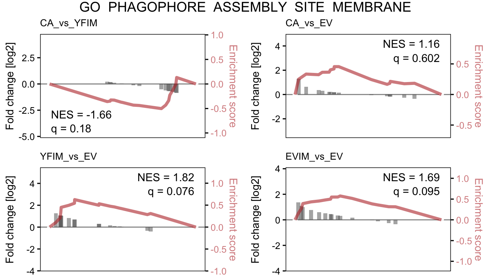

# STAT5-CA/YF DE


```r
library(tidyverse)
library(tximport)
library(DESeq2)
library(EnsDb.Hsapiens.v86)
library(ggplot2)
library(openxlsx)
library(msigdbr)
library(DT)
library(fgsea)
txdb <- EnsDb.Hsapiens.v86
```

## Load data

```r
# make tx2gene
k <- keys(txdb, keytype = "TXID")
tx2gene <- ensembldb::select(txdb, k, "GENEID", "TXID")

# load quant data
files <- list.files("../processed_data/RNAseq/STAT5_CA_YF_salmon",
                    pattern = "quant.sf", 
                    recursive = T, full.names = T)
pattern <- "^.+(STAT5A_YF_IM|STAT5A_CA|EV_IM|EV)/quant.sf$"
smi <- data.frame(row.names = sub(pattern, "\\1",files),
                  condition = sub(pattern, "\\1",files))
names(files) <- smi$sample_id
txi <- tximport(files, type = "salmon", tx2gene = tx2gene, ignoreTxVersion = T)

# normalised counts
dds <- DESeqDataSetFromTximport(txi, colData = smi,
                                design = ~condition)
dds <- dds[rowMeans(counts(dds)) > 5, ]
rlog <- rlog(dds)
deres <- assay(rlog) %>% as.data.frame()
deres$ensembl_id <- rownames(rlog)
rownames(deres) <- NULL
deres$gene_symbol <- mapIds(txdb, 
                            keys= deres$ensembl_id, 
                            keytype = "GENEID", 
                            column = "SYMBOL")
deres$L2FC_CA_vs_YFIM <- deres$STAT5A_CA - deres$STAT5A_YF_IM
deres$L2FC_CA_vs_EV <- deres$STAT5A_CA - deres$EV
deres$L2FC_YFIM_vs_EV <- deres$STAT5A_YF_IM - deres$EV
deres$L2FC_EVIM_vs_EV <- deres$EV_IM - deres$EV
deres <- deres[,c(6,5,7:10,1:4)] %>% arrange(-L2FC_CA_vs_YFIM)
saveRDS(deres, "../processed_data/RNAseq/STAT5_CA_YF_DE.2021-03-22.rds")
write.xlsx(deres, "../results/STAT5_CA_YF_DEres.2021-03-22.xlsx",
           firstRow=T, firstCol=T)
```

## GSEA

```r
deres <- readRDS("../processed_data/RNAseq/STAT5_CA_YF_DE.2021-03-22.rds")
# set gene ranks
comparisons <- colnames(deres)[grep("L2FC", colnames(deres))]
names(comparisons) <- sub("L2FC_(.+)", "\\1", comparisons)
gl <- lapply(comparisons, function(comp) {
  deres[,c("gene_symbol", comp)] %>% 
    arrange(-!!sym(comp)) %>% 
    na.omit() %>%
    deframe()
})
# custom pathways
custom <- list(custom_autophagy = c("ATG10","ATG14","WIPI2","ATG13",
                                  "ATG16L2","MAP1LC3B","ULK1","ATG4D",
                                  "BECN1","TFE3","ATG9A","ATG12",
                                  "ATG2A","ULK3","ATG4A","ATG101",
                                  "RAB24","TFEB","PIK3C3","ULK2"),
               custom_catabolism = c("SLC2A1","GPI1","ALDOA","PGK1",
                                     "ENO1","LDHA","MYC","INSR","HK2","PFKL",
                                     "PFKP","TPI1","GAPDH","PGAM1","PKM","ME2",
                                     "GRHPR","ODC1","PFKM","IRS1","BCL6",
                                     "CPT1A","ABCD1","BECN1","SLC44A1","CHKB",
                                     "PCYT1A","PCYT1B","MAP1C3B","LIPE",
                                     "ULK3","ACOX3","WIPI2","ACSS1","ATG4D"))
# general pathways
msig <- rbind(msigdbr(category = "H"),
              msigdbr(category = "C2", subcategory = "CP:REACTOME"),
              msigdbr(category = "C2", subcategory = "CP:KEGG"),
              msigdbr(category = "C5")) 
gs <- split(msig$gene_symbol, msig$gs_name)
internal_gs <- readRDS("../../resources/public_genesets_Hs.rds")
# combine & filter
gs <- c(gs, internal_gs, custom)
gs <- gs[!grepl(paste0("sperm|xeno|graft|naba|spinal|neuro|sclerosis",
                       "|tion_of_hscs|photo|leish|diabetes|lupus|ebola",
                       "|staph|syndrome|myo|nicotin|asthma|thyroid_stim",
                       "|gastrin|alcohol|nutrient|carcinoma|muscle_contr",
                       "|metapathway|amyloid|fusion_mutants|circadian"),
                names(gs), ignore.case = T)]
```


```r
gseres <- lapply(gl, function(x) {
  fgseaSimple(pathways = gs, stats = x, 
              nperm = 1000, maxSize = 500) %>%
    dplyr::filter(lengths(leadingEdge) > 3) %>%
    arrange(pval)
})
wb <- createWorkbook()
null <- lapply(names(gseres), function(contrast) {
  gse <- as.data.frame(gseres[[contrast]])
  addWorksheet(wb, sheetName = contrast)
  writeData(wb, gse, sheet = contrast, rowNames = F)
  freezePane(wb, sheet = contrast, firstRow = TRUE, firstCol = TRUE)
  return(NULL)
})
saveWorkbook(wb, "../results/STAT5_CA_YF_DE_fullGSEA.2021-03-22.xlsx", overwrite = T)
lapply(names(gseres), function(x) {
  tmp <- gseres[[x]] %>% dplyr::filter(pval < 0.1) %>% dplyr::select(pathway, NES)
  tmp[,2] <- round(tmp[,2], 3)
  colnames(tmp)[2] <- x
  return(tmp) }) %>% 
  Reduce(f = function(x,y) { merge(x, y, by="pathway") }) %>%
  arrange(-apply(., 1, var)) %>%
  mutate(pathway = ifelse(pathway %in% names(internal_gs), pathway,
                          paste0('<a href=https://www.gsea-msigdb.org/gsea/msigdb/cards/', 
                                 pathway, '.html>', substr(pathway, 0,30), '</a>'))) %>%
  DT::datatable(escape  = F, rownames = F,
                options = list(
                  scrollX = TRUE))
```

```{=html}
<div id="htmlwidget-938c799cfe489913497b" style="width:100%;height:auto;" class="datatables html-widget"></div>
<script type="application/json" data-for="htmlwidget-938c799cfe489913497b">{"x":{"filter":"none","data":[["Cosgun_Bcatenin_GOF_UP","<a href=https://www.gsea-msigdb.org/gsea/msigdb/cards/GO_9PLUS2_MOTILE_CILIUM.html>GO_9PLUS2_MOTILE_CILIUM<\/a>","<a href=https://www.gsea-msigdb.org/gsea/msigdb/cards/GO_ACTIN_BASED_CELL_PROJECTION.html>GO_ACTIN_BASED_CELL_PROJECTION<\/a>","<a href=https://www.gsea-msigdb.org/gsea/msigdb/cards/GO_ACTIN_BINDING.html>GO_ACTIN_BINDING<\/a>","<a href=https://www.gsea-msigdb.org/gsea/msigdb/cards/GO_ACTIN_CYTOSKELETON.html>GO_ACTIN_CYTOSKELETON<\/a>","<a href=https://www.gsea-msigdb.org/gsea/msigdb/cards/GO_ACTIN_FILAMENT_BASED_PROCESS.html>GO_ACTIN_FILAMENT_BASED_PROCES<\/a>","<a href=https://www.gsea-msigdb.org/gsea/msigdb/cards/GO_ACTIN_FILAMENT_ORGANIZATION.html>GO_ACTIN_FILAMENT_ORGANIZATION<\/a>","<a href=https://www.gsea-msigdb.org/gsea/msigdb/cards/GO_ADAPTIVE_IMMUNE_RESPONSE.html>GO_ADAPTIVE_IMMUNE_RESPONSE<\/a>","<a href=https://www.gsea-msigdb.org/gsea/msigdb/cards/GO_ADAPTIVE_IMMUNE_RESPONSE_BASED_ON_SOMATIC_RECOMBINATION_OF_IMMUNE_RECEPTORS_BUILT_FROM_IMMUNOGLOBULIN_SUPERFAMILY_DOMAINS.html>GO_ADAPTIVE_IMMUNE_RESPONSE_BA<\/a>","<a href=https://www.gsea-msigdb.org/gsea/msigdb/cards/GO_ALPHA_BETA_T_CELL_ACTIVATION.html>GO_ALPHA_BETA_T_CELL_ACTIVATIO<\/a>","<a href=https://www.gsea-msigdb.org/gsea/msigdb/cards/GO_ALPHA_BETA_T_CELL_ACTIVATION_INVOLVED_IN_IMMUNE_RESPONSE.html>GO_ALPHA_BETA_T_CELL_ACTIVATIO<\/a>","<a href=https://www.gsea-msigdb.org/gsea/msigdb/cards/GO_ALPHA_BETA_T_CELL_DIFFERENTIATION.html>GO_ALPHA_BETA_T_CELL_DIFFERENT<\/a>","<a href=https://www.gsea-msigdb.org/gsea/msigdb/cards/GO_AMEBOIDAL_TYPE_CELL_MIGRATION.html>GO_AMEBOIDAL_TYPE_CELL_MIGRATI<\/a>","<a href=https://www.gsea-msigdb.org/gsea/msigdb/cards/GO_AMINE_TRANSPORT.html>GO_AMINE_TRANSPORT<\/a>","<a href=https://www.gsea-msigdb.org/gsea/msigdb/cards/GO_ANATOMICAL_STRUCTURE_FORMATION_INVOLVED_IN_MORPHOGENESIS.html>GO_ANATOMICAL_STRUCTURE_FORMAT<\/a>","<a href=https://www.gsea-msigdb.org/gsea/msigdb/cards/GO_ANION_TRANSMEMBRANE_TRANSPORTER_ACTIVITY.html>GO_ANION_TRANSMEMBRANE_TRANSPO<\/a>","<a href=https://www.gsea-msigdb.org/gsea/msigdb/cards/GO_ANION_TRANSPORT.html>GO_ANION_TRANSPORT<\/a>","<a href=https://www.gsea-msigdb.org/gsea/msigdb/cards/GO_ARTERY_MORPHOGENESIS.html>GO_ARTERY_MORPHOGENESIS<\/a>","<a href=https://www.gsea-msigdb.org/gsea/msigdb/cards/GO_ATTACHMENT_OF_MITOTIC_SPINDLE_MICROTUBULES_TO_KINETOCHORE.html>GO_ATTACHMENT_OF_MITOTIC_SPIND<\/a>","<a href=https://www.gsea-msigdb.org/gsea/msigdb/cards/GO_AXON.html>GO_AXON<\/a>","<a href=https://www.gsea-msigdb.org/gsea/msigdb/cards/GO_BASEMENT_MEMBRANE.html>GO_BASEMENT_MEMBRANE<\/a>","<a href=https://www.gsea-msigdb.org/gsea/msigdb/cards/GO_BIOMINERALIZATION.html>GO_BIOMINERALIZATION<\/a>","<a href=https://www.gsea-msigdb.org/gsea/msigdb/cards/GO_BLOOD_VESSEL_MORPHOGENESIS.html>GO_BLOOD_VESSEL_MORPHOGENESIS<\/a>","<a href=https://www.gsea-msigdb.org/gsea/msigdb/cards/GO_BONE_MINERALIZATION.html>GO_BONE_MINERALIZATION<\/a>","<a href=https://www.gsea-msigdb.org/gsea/msigdb/cards/GO_BOX_H_ACA_SNORNA_BINDING.html>GO_BOX_H_ACA_SNORNA_BINDING<\/a>","<a href=https://www.gsea-msigdb.org/gsea/msigdb/cards/GO_BOX_H_ACA_SNORNP_COMPLEX.html>GO_BOX_H_ACA_SNORNP_COMPLEX<\/a>","<a href=https://www.gsea-msigdb.org/gsea/msigdb/cards/GO_CADHERIN_BINDING.html>GO_CADHERIN_BINDING<\/a>","<a href=https://www.gsea-msigdb.org/gsea/msigdb/cards/GO_CALCIUM_ION_BINDING.html>GO_CALCIUM_ION_BINDING<\/a>","<a href=https://www.gsea-msigdb.org/gsea/msigdb/cards/GO_CALMODULIN_BINDING.html>GO_CALMODULIN_BINDING<\/a>","<a href=https://www.gsea-msigdb.org/gsea/msigdb/cards/GO_CARBOHYDRATE_DERIVATIVE_BIOSYNTHETIC_PROCESS.html>GO_CARBOHYDRATE_DERIVATIVE_BIO<\/a>","<a href=https://www.gsea-msigdb.org/gsea/msigdb/cards/GO_CARTILAGE_DEVELOPMENT.html>GO_CARTILAGE_DEVELOPMENT<\/a>","<a href=https://www.gsea-msigdb.org/gsea/msigdb/cards/GO_CATION_TRANSMEMBRANE_TRANSPORT.html>GO_CATION_TRANSMEMBRANE_TRANSP<\/a>","<a href=https://www.gsea-msigdb.org/gsea/msigdb/cards/GO_CATION_TRANSMEMBRANE_TRANSPORTER_ACTIVITY.html>GO_CATION_TRANSMEMBRANE_TRANSP<\/a>","<a href=https://www.gsea-msigdb.org/gsea/msigdb/cards/GO_CATION_TRANSPORT.html>GO_CATION_TRANSPORT<\/a>","<a href=https://www.gsea-msigdb.org/gsea/msigdb/cards/GO_CD4_POSITIVE_ALPHA_BETA_T_CELL_ACTIVATION.html>GO_CD4_POSITIVE_ALPHA_BETA_T_C<\/a>","<a href=https://www.gsea-msigdb.org/gsea/msigdb/cards/GO_CD4_POSITIVE_ALPHA_BETA_T_CELL_DIFFERENTIATION.html>GO_CD4_POSITIVE_ALPHA_BETA_T_C<\/a>","<a href=https://www.gsea-msigdb.org/gsea/msigdb/cards/GO_CELLULAR_COMPONENT_MORPHOGENESIS.html>GO_CELLULAR_COMPONENT_MORPHOGE<\/a>","<a href=https://www.gsea-msigdb.org/gsea/msigdb/cards/GO_CELLULAR_RESPONSE_TO_ETHANOL.html>GO_CELLULAR_RESPONSE_TO_ETHANO<\/a>","<a href=https://www.gsea-msigdb.org/gsea/msigdb/cards/GO_CELLULAR_RESPONSE_TO_HORMONE_STIMULUS.html>GO_CELLULAR_RESPONSE_TO_HORMON<\/a>","<a href=https://www.gsea-msigdb.org/gsea/msigdb/cards/GO_CELLULAR_RESPONSE_TO_NITROGEN_COMPOUND.html>GO_CELLULAR_RESPONSE_TO_NITROG<\/a>","<a href=https://www.gsea-msigdb.org/gsea/msigdb/cards/GO_CELL_ADHESION_MOLECULE_BINDING.html>GO_CELL_ADHESION_MOLECULE_BIND<\/a>","<a href=https://www.gsea-msigdb.org/gsea/msigdb/cards/GO_CELL_CELL_ADHESION_VIA_PLASMA_MEMBRANE_ADHESION_MOLECULES.html>GO_CELL_CELL_ADHESION_VIA_PLAS<\/a>","<a href=https://www.gsea-msigdb.org/gsea/msigdb/cards/GO_CELL_CELL_JUNCTION.html>GO_CELL_CELL_JUNCTION<\/a>","<a href=https://www.gsea-msigdb.org/gsea/msigdb/cards/GO_CELL_CELL_SIGNALING_BY_WNT.html>GO_CELL_CELL_SIGNALING_BY_WNT<\/a>","<a href=https://www.gsea-msigdb.org/gsea/msigdb/cards/GO_CELL_CYCLE_DNA_REPLICATION.html>GO_CELL_CYCLE_DNA_REPLICATION<\/a>","<a href=https://www.gsea-msigdb.org/gsea/msigdb/cards/GO_CELL_CYCLE_DNA_REPLICATION_INITIATION.html>GO_CELL_CYCLE_DNA_REPLICATION_<\/a>","<a href=https://www.gsea-msigdb.org/gsea/msigdb/cards/GO_CELL_CYCLE_G1_S_PHASE_TRANSITION.html>GO_CELL_CYCLE_G1_S_PHASE_TRANS<\/a>","<a href=https://www.gsea-msigdb.org/gsea/msigdb/cards/GO_CELL_CYCLE_G2_M_PHASE_TRANSITION.html>GO_CELL_CYCLE_G2_M_PHASE_TRANS<\/a>","<a href=https://www.gsea-msigdb.org/gsea/msigdb/cards/GO_CELL_CYCLE_PHASE_TRANSITION.html>GO_CELL_CYCLE_PHASE_TRANSITION<\/a>","<a href=https://www.gsea-msigdb.org/gsea/msigdb/cards/GO_CELL_DIVISION.html>GO_CELL_DIVISION<\/a>","<a href=https://www.gsea-msigdb.org/gsea/msigdb/cards/GO_CELL_JUNCTION_ASSEMBLY.html>GO_CELL_JUNCTION_ASSEMBLY<\/a>","<a href=https://www.gsea-msigdb.org/gsea/msigdb/cards/GO_CELL_JUNCTION_ORGANIZATION.html>GO_CELL_JUNCTION_ORGANIZATION<\/a>","<a href=https://www.gsea-msigdb.org/gsea/msigdb/cards/GO_CELL_LEADING_EDGE.html>GO_CELL_LEADING_EDGE<\/a>","<a href=https://www.gsea-msigdb.org/gsea/msigdb/cards/GO_CELL_MATRIX_ADHESION.html>GO_CELL_MATRIX_ADHESION<\/a>","<a href=https://www.gsea-msigdb.org/gsea/msigdb/cards/GO_CELL_MORPHOGENESIS_INVOLVED_IN_DIFFERENTIATION.html>GO_CELL_MORPHOGENESIS_INVOLVED<\/a>","<a href=https://www.gsea-msigdb.org/gsea/msigdb/cards/GO_CELL_PART_MORPHOGENESIS.html>GO_CELL_PART_MORPHOGENESIS<\/a>","<a href=https://www.gsea-msigdb.org/gsea/msigdb/cards/GO_CELL_SUBSTRATE_ADHESION.html>GO_CELL_SUBSTRATE_ADHESION<\/a>","<a href=https://www.gsea-msigdb.org/gsea/msigdb/cards/GO_CELL_SURFACE_RECEPTOR_SIGNALING_PATHWAY_INVOLVED_IN_CELL_CELL_SIGNALING.html>GO_CELL_SURFACE_RECEPTOR_SIGNA<\/a>","<a href=https://www.gsea-msigdb.org/gsea/msigdb/cards/GO_CENTRAL_NERVOUS_SYSTEM_DEVELOPMENT.html>GO_CENTRAL_NERVOUS_SYSTEM_DEVE<\/a>","<a href=https://www.gsea-msigdb.org/gsea/msigdb/cards/GO_CHEMICAL_HOMEOSTASIS.html>GO_CHEMICAL_HOMEOSTASIS<\/a>","<a href=https://www.gsea-msigdb.org/gsea/msigdb/cards/GO_CHONDROCYTE_DIFFERENTIATION.html>GO_CHONDROCYTE_DIFFERENTIATION<\/a>","<a href=https://www.gsea-msigdb.org/gsea/msigdb/cards/GO_CHROMOSOMAL_REGION.html>GO_CHROMOSOMAL_REGION<\/a>","<a href=https://www.gsea-msigdb.org/gsea/msigdb/cards/GO_CHROMOSOME_CENTROMERIC_REGION.html>GO_CHROMOSOME_CENTROMERIC_REGI<\/a>","<a href=https://www.gsea-msigdb.org/gsea/msigdb/cards/GO_CILIUM.html>GO_CILIUM<\/a>","<a href=https://www.gsea-msigdb.org/gsea/msigdb/cards/GO_CIRCULATORY_SYSTEM_DEVELOPMENT.html>GO_CIRCULATORY_SYSTEM_DEVELOPM<\/a>","<a href=https://www.gsea-msigdb.org/gsea/msigdb/cards/GO_CIRCULATORY_SYSTEM_PROCESS.html>GO_CIRCULATORY_SYSTEM_PROCESS<\/a>","<a href=https://www.gsea-msigdb.org/gsea/msigdb/cards/GO_CIS_REGULATORY_REGION_SEQUENCE_SPECIFIC_DNA_BINDING.html>GO_CIS_REGULATORY_REGION_SEQUE<\/a>","<a href=https://www.gsea-msigdb.org/gsea/msigdb/cards/GO_COLLAGEN_CONTAINING_EXTRACELLULAR_MATRIX.html>GO_COLLAGEN_CONTAINING_EXTRACE<\/a>","<a href=https://www.gsea-msigdb.org/gsea/msigdb/cards/GO_CONDENSED_CHROMOSOME.html>GO_CONDENSED_CHROMOSOME<\/a>","<a href=https://www.gsea-msigdb.org/gsea/msigdb/cards/GO_CONDENSED_CHROMOSOME_CENTROMERIC_REGION.html>GO_CONDENSED_CHROMOSOME_CENTRO<\/a>","<a href=https://www.gsea-msigdb.org/gsea/msigdb/cards/GO_CONDENSED_NUCLEAR_CHROMOSOME.html>GO_CONDENSED_NUCLEAR_CHROMOSOM<\/a>","<a href=https://www.gsea-msigdb.org/gsea/msigdb/cards/GO_CONDENSIN_COMPLEX.html>GO_CONDENSIN_COMPLEX<\/a>","<a href=https://www.gsea-msigdb.org/gsea/msigdb/cards/GO_CONNECTIVE_TISSUE_DEVELOPMENT.html>GO_CONNECTIVE_TISSUE_DEVELOPME<\/a>","<a href=https://www.gsea-msigdb.org/gsea/msigdb/cards/GO_CYTOKINE_MEDIATED_SIGNALING_PATHWAY.html>GO_CYTOKINE_MEDIATED_SIGNALING<\/a>","<a href=https://www.gsea-msigdb.org/gsea/msigdb/cards/GO_CYTOKINE_PRODUCTION.html>GO_CYTOKINE_PRODUCTION<\/a>","<a href=https://www.gsea-msigdb.org/gsea/msigdb/cards/GO_CYTOPLASMIC_PATTERN_RECOGNITION_RECEPTOR_SIGNALING_PATHWAY_IN_RESPONSE_TO_VIRUS.html>GO_CYTOPLASMIC_PATTERN_RECOGNI<\/a>","<a href=https://www.gsea-msigdb.org/gsea/msigdb/cards/GO_CYTOSOLIC_TRANSPORT.html>GO_CYTOSOLIC_TRANSPORT<\/a>","<a href=https://www.gsea-msigdb.org/gsea/msigdb/cards/GO_DENDRITE_DEVELOPMENT.html>GO_DENDRITE_DEVELOPMENT<\/a>","<a href=https://www.gsea-msigdb.org/gsea/msigdb/cards/GO_DENDRITE_MORPHOGENESIS.html>GO_DENDRITE_MORPHOGENESIS<\/a>","<a href=https://www.gsea-msigdb.org/gsea/msigdb/cards/GO_DENDRITIC_TREE.html>GO_DENDRITIC_TREE<\/a>","<a href=https://www.gsea-msigdb.org/gsea/msigdb/cards/GO_DEVELOPMENTAL_CELL_GROWTH.html>GO_DEVELOPMENTAL_CELL_GROWTH<\/a>","<a href=https://www.gsea-msigdb.org/gsea/msigdb/cards/GO_DEVELOPMENTAL_GROWTH.html>GO_DEVELOPMENTAL_GROWTH<\/a>","<a href=https://www.gsea-msigdb.org/gsea/msigdb/cards/GO_DEVELOPMENTAL_GROWTH_INVOLVED_IN_MORPHOGENESIS.html>GO_DEVELOPMENTAL_GROWTH_INVOLV<\/a>","<a href=https://www.gsea-msigdb.org/gsea/msigdb/cards/GO_DEVELOPMENTAL_PROCESS_INVOLVED_IN_REPRODUCTION.html>GO_DEVELOPMENTAL_PROCESS_INVOL<\/a>","<a href=https://www.gsea-msigdb.org/gsea/msigdb/cards/GO_DISTAL_AXON.html>GO_DISTAL_AXON<\/a>","<a href=https://www.gsea-msigdb.org/gsea/msigdb/cards/GO_DIVALENT_INORGANIC_CATION_TRANSPORT.html>GO_DIVALENT_INORGANIC_CATION_T<\/a>","<a href=https://www.gsea-msigdb.org/gsea/msigdb/cards/GO_DNA_BINDING_TRANSCRIPTION_ACTIVATOR_ACTIVITY.html>GO_DNA_BINDING_TRANSCRIPTION_A<\/a>","<a href=https://www.gsea-msigdb.org/gsea/msigdb/cards/GO_DNA_BINDING_TRANSCRIPTION_FACTOR_BINDING.html>GO_DNA_BINDING_TRANSCRIPTION_F<\/a>","<a href=https://www.gsea-msigdb.org/gsea/msigdb/cards/GO_DNA_BINDING_TRANSCRIPTION_REPRESSOR_ACTIVITY.html>GO_DNA_BINDING_TRANSCRIPTION_R<\/a>","<a href=https://www.gsea-msigdb.org/gsea/msigdb/cards/GO_DNA_BIOSYNTHETIC_PROCESS.html>GO_DNA_BIOSYNTHETIC_PROCESS<\/a>","<a href=https://www.gsea-msigdb.org/gsea/msigdb/cards/GO_DNA_DEPENDENT_DNA_REPLICATION.html>GO_DNA_DEPENDENT_DNA_REPLICATI<\/a>","<a href=https://www.gsea-msigdb.org/gsea/msigdb/cards/GO_DNA_REPLICATION.html>GO_DNA_REPLICATION<\/a>","<a href=https://www.gsea-msigdb.org/gsea/msigdb/cards/GO_DNA_REPLICATION_INITIATION.html>GO_DNA_REPLICATION_INITIATION<\/a>","<a href=https://www.gsea-msigdb.org/gsea/msigdb/cards/GO_DNA_REPLICATION_ORIGIN_BINDING.html>GO_DNA_REPLICATION_ORIGIN_BIND<\/a>","<a href=https://www.gsea-msigdb.org/gsea/msigdb/cards/GO_DNA_STRAND_ELONGATION.html>GO_DNA_STRAND_ELONGATION<\/a>","<a href=https://www.gsea-msigdb.org/gsea/msigdb/cards/GO_DNA_STRAND_ELONGATION_INVOLVED_IN_DNA_REPLICATION.html>GO_DNA_STRAND_ELONGATION_INVOL<\/a>","<a href=https://www.gsea-msigdb.org/gsea/msigdb/cards/GO_DOUBLE_STRAND_BREAK_REPAIR_VIA_BREAK_INDUCED_REPLICATION.html>GO_DOUBLE_STRAND_BREAK_REPAIR_<\/a>","<a href=https://www.gsea-msigdb.org/gsea/msigdb/cards/GO_EARLY_ENDOSOME.html>GO_EARLY_ENDOSOME<\/a>","<a href=https://www.gsea-msigdb.org/gsea/msigdb/cards/GO_EMBRYO_IMPLANTATION.html>GO_EMBRYO_IMPLANTATION<\/a>","<a href=https://www.gsea-msigdb.org/gsea/msigdb/cards/GO_ENDOCYTOSIS.html>GO_ENDOCYTOSIS<\/a>","<a href=https://www.gsea-msigdb.org/gsea/msigdb/cards/GO_ENDOSOMAL_TRANSPORT.html>GO_ENDOSOMAL_TRANSPORT<\/a>","<a href=https://www.gsea-msigdb.org/gsea/msigdb/cards/GO_EPITHELIAL_CELL_DEVELOPMENT.html>GO_EPITHELIAL_CELL_DEVELOPMENT<\/a>","<a href=https://www.gsea-msigdb.org/gsea/msigdb/cards/GO_EPITHELIAL_CELL_PROLIFERATION.html>GO_EPITHELIAL_CELL_PROLIFERATI<\/a>","<a href=https://www.gsea-msigdb.org/gsea/msigdb/cards/GO_ESTABLISHMENT_OF_PROTEIN_LOCALIZATION_TO_TELOMERE.html>GO_ESTABLISHMENT_OF_PROTEIN_LO<\/a>","<a href=https://www.gsea-msigdb.org/gsea/msigdb/cards/GO_EXTRACELLULAR_MATRIX.html>GO_EXTRACELLULAR_MATRIX<\/a>","<a href=https://www.gsea-msigdb.org/gsea/msigdb/cards/GO_EXTRACELLULAR_MATRIX_DISASSEMBLY.html>GO_EXTRACELLULAR_MATRIX_DISASS<\/a>","<a href=https://www.gsea-msigdb.org/gsea/msigdb/cards/GO_EXTRACELLULAR_STRUCTURE_ORGANIZATION.html>GO_EXTRACELLULAR_STRUCTURE_ORG<\/a>","<a href=https://www.gsea-msigdb.org/gsea/msigdb/cards/GO_FEMALE_MEIOSIS_CHROMOSOME_SEGREGATION.html>GO_FEMALE_MEIOSIS_CHROMOSOME_S<\/a>","<a href=https://www.gsea-msigdb.org/gsea/msigdb/cards/GO_FICOLIN_1_RICH_GRANULE.html>GO_FICOLIN_1_RICH_GRANULE<\/a>","<a href=https://www.gsea-msigdb.org/gsea/msigdb/cards/GO_FOLIC_ACID_METABOLIC_PROCESS.html>GO_FOLIC_ACID_METABOLIC_PROCES<\/a>","<a href=https://www.gsea-msigdb.org/gsea/msigdb/cards/GO_FOREBRAIN_CELL_MIGRATION.html>GO_FOREBRAIN_CELL_MIGRATION<\/a>","<a href=https://www.gsea-msigdb.org/gsea/msigdb/cards/GO_GENERATION_OF_PRECURSOR_METABOLITES_AND_ENERGY.html>GO_GENERATION_OF_PRECURSOR_MET<\/a>","<a href=https://www.gsea-msigdb.org/gsea/msigdb/cards/GO_GLUCOSE_CATABOLIC_PROCESS.html>GO_GLUCOSE_CATABOLIC_PROCESS<\/a>","<a href=https://www.gsea-msigdb.org/gsea/msigdb/cards/GO_GLUTAMATERGIC_SYNAPSE.html>GO_GLUTAMATERGIC_SYNAPSE<\/a>","<a href=https://www.gsea-msigdb.org/gsea/msigdb/cards/GO_GLYCEROLIPID_BIOSYNTHETIC_PROCESS.html>GO_GLYCEROLIPID_BIOSYNTHETIC_P<\/a>","<a href=https://www.gsea-msigdb.org/gsea/msigdb/cards/GO_GLYCOLYTIC_PROCESS_THROUGH_FRUCTOSE_6_PHOSPHATE.html>GO_GLYCOLYTIC_PROCESS_THROUGH_<\/a>","<a href=https://www.gsea-msigdb.org/gsea/msigdb/cards/GO_GTPASE_REGULATOR_ACTIVITY.html>GO_GTPASE_REGULATOR_ACTIVITY<\/a>","<a href=https://www.gsea-msigdb.org/gsea/msigdb/cards/GO_G_PROTEIN_COUPLED_RECEPTOR_SIGNALING_PATHWAY.html>GO_G_PROTEIN_COUPLED_RECEPTOR_<\/a>","<a href=https://www.gsea-msigdb.org/gsea/msigdb/cards/GO_HEAD_DEVELOPMENT.html>GO_HEAD_DEVELOPMENT<\/a>","<a href=https://www.gsea-msigdb.org/gsea/msigdb/cards/GO_HEXOSE_CATABOLIC_PROCESS.html>GO_HEXOSE_CATABOLIC_PROCESS<\/a>","<a href=https://www.gsea-msigdb.org/gsea/msigdb/cards/GO_HORMONE_ACTIVITY.html>GO_HORMONE_ACTIVITY<\/a>","<a href=https://www.gsea-msigdb.org/gsea/msigdb/cards/GO_HORMONE_RECEPTOR_BINDING.html>GO_HORMONE_RECEPTOR_BINDING<\/a>","<a href=https://www.gsea-msigdb.org/gsea/msigdb/cards/GO_IMMATURE_B_CELL_DIFFERENTIATION.html>GO_IMMATURE_B_CELL_DIFFERENTIA<\/a>","<a href=https://www.gsea-msigdb.org/gsea/msigdb/cards/GO_IMMUNOGLOBULIN_COMPLEX.html>GO_IMMUNOGLOBULIN_COMPLEX<\/a>","<a href=https://www.gsea-msigdb.org/gsea/msigdb/cards/GO_INFLAMMATORY_RESPONSE.html>GO_INFLAMMATORY_RESPONSE<\/a>","<a href=https://www.gsea-msigdb.org/gsea/msigdb/cards/GO_INORGANIC_ANION_TRANSMEMBRANE_TRANSPORTER_ACTIVITY.html>GO_INORGANIC_ANION_TRANSMEMBRA<\/a>","<a href=https://www.gsea-msigdb.org/gsea/msigdb/cards/GO_INORGANIC_ION_TRANSMEMBRANE_TRANSPORT.html>GO_INORGANIC_ION_TRANSMEMBRANE<\/a>","<a href=https://www.gsea-msigdb.org/gsea/msigdb/cards/GO_INOSITOL_LIPID_MEDIATED_SIGNALING.html>GO_INOSITOL_LIPID_MEDIATED_SIG<\/a>","<a href=https://www.gsea-msigdb.org/gsea/msigdb/cards/GO_INTERFERON_GAMMA_MEDIATED_SIGNALING_PATHWAY.html>GO_INTERFERON_GAMMA_MEDIATED_S<\/a>","<a href=https://www.gsea-msigdb.org/gsea/msigdb/cards/GO_INTERLEUKIN_7_MEDIATED_SIGNALING_PATHWAY.html>GO_INTERLEUKIN_7_MEDIATED_SIGN<\/a>","<a href=https://www.gsea-msigdb.org/gsea/msigdb/cards/GO_INTRINSIC_COMPONENT_OF_PLASMA_MEMBRANE.html>GO_INTRINSIC_COMPONENT_OF_PLAS<\/a>","<a href=https://www.gsea-msigdb.org/gsea/msigdb/cards/GO_INTRINSIC_COMPONENT_OF_POSTSYNAPTIC_MEMBRANE.html>GO_INTRINSIC_COMPONENT_OF_POST<\/a>","<a href=https://www.gsea-msigdb.org/gsea/msigdb/cards/GO_ION_TRANSMEMBRANE_TRANSPORT.html>GO_ION_TRANSMEMBRANE_TRANSPORT<\/a>","<a href=https://www.gsea-msigdb.org/gsea/msigdb/cards/GO_ION_TRANSMEMBRANE_TRANSPORTER_ACTIVITY.html>GO_ION_TRANSMEMBRANE_TRANSPORT<\/a>","<a href=https://www.gsea-msigdb.org/gsea/msigdb/cards/GO_JNK_CASCADE.html>GO_JNK_CASCADE<\/a>","<a href=https://www.gsea-msigdb.org/gsea/msigdb/cards/GO_KINETOCHORE.html>GO_KINETOCHORE<\/a>","<a href=https://www.gsea-msigdb.org/gsea/msigdb/cards/GO_LATE_ENDOSOME.html>GO_LATE_ENDOSOME<\/a>","<a href=https://www.gsea-msigdb.org/gsea/msigdb/cards/GO_LEUKOCYTE_DIFFERENTIATION.html>GO_LEUKOCYTE_DIFFERENTIATION<\/a>","<a href=https://www.gsea-msigdb.org/gsea/msigdb/cards/GO_LEUKOCYTE_MIGRATION.html>GO_LEUKOCYTE_MIGRATION<\/a>","<a href=https://www.gsea-msigdb.org/gsea/msigdb/cards/GO_LIPID_BINDING.html>GO_LIPID_BINDING<\/a>","<a href=https://www.gsea-msigdb.org/gsea/msigdb/cards/GO_LYMPHOCYTE_ACTIVATION.html>GO_LYMPHOCYTE_ACTIVATION<\/a>","<a href=https://www.gsea-msigdb.org/gsea/msigdb/cards/GO_LYMPHOCYTE_DIFFERENTIATION.html>GO_LYMPHOCYTE_DIFFERENTIATION<\/a>","<a href=https://www.gsea-msigdb.org/gsea/msigdb/cards/GO_MEIOTIC_CELL_CYCLE.html>GO_MEIOTIC_CELL_CYCLE<\/a>","<a href=https://www.gsea-msigdb.org/gsea/msigdb/cards/GO_MEIOTIC_CELL_CYCLE_PROCESS.html>GO_MEIOTIC_CELL_CYCLE_PROCESS<\/a>","<a href=https://www.gsea-msigdb.org/gsea/msigdb/cards/GO_MEMBRANE_DEPOLARIZATION.html>GO_MEMBRANE_DEPOLARIZATION<\/a>","<a href=https://www.gsea-msigdb.org/gsea/msigdb/cards/GO_MESENCHYMAL_CELL_DIFFERENTIATION.html>GO_MESENCHYMAL_CELL_DIFFERENTI<\/a>","<a href=https://www.gsea-msigdb.org/gsea/msigdb/cards/GO_METAL_ION_TRANSMEMBRANE_TRANSPORTER_ACTIVITY.html>GO_METAL_ION_TRANSMEMBRANE_TRA<\/a>","<a href=https://www.gsea-msigdb.org/gsea/msigdb/cards/GO_METAL_ION_TRANSPORT.html>GO_METAL_ION_TRANSPORT<\/a>","<a href=https://www.gsea-msigdb.org/gsea/msigdb/cards/GO_METHYLOSOME.html>GO_METHYLOSOME<\/a>","<a href=https://www.gsea-msigdb.org/gsea/msigdb/cards/GO_MHC_CLASS_I_PROTEIN_COMPLEX.html>GO_MHC_CLASS_I_PROTEIN_COMPLEX<\/a>","<a href=https://www.gsea-msigdb.org/gsea/msigdb/cards/GO_MICROTUBULE_CYTOSKELETON_ORGANIZATION_INVOLVED_IN_MITOSIS.html>GO_MICROTUBULE_CYTOSKELETON_OR<\/a>","<a href=https://www.gsea-msigdb.org/gsea/msigdb/cards/GO_MITOTIC_DNA_REPLICATION.html>GO_MITOTIC_DNA_REPLICATION<\/a>","<a href=https://www.gsea-msigdb.org/gsea/msigdb/cards/GO_MITOTIC_NUCLEAR_DIVISION.html>GO_MITOTIC_NUCLEAR_DIVISION<\/a>","<a href=https://www.gsea-msigdb.org/gsea/msigdb/cards/GO_MITOTIC_SISTER_CHROMATID_SEGREGATION.html>GO_MITOTIC_SISTER_CHROMATID_SE<\/a>","<a href=https://www.gsea-msigdb.org/gsea/msigdb/cards/GO_MITOTIC_SPINDLE_ORGANIZATION.html>GO_MITOTIC_SPINDLE_ORGANIZATIO<\/a>","<a href=https://www.gsea-msigdb.org/gsea/msigdb/cards/GO_MODIFICATION_DEPENDENT_PROTEIN_BINDING.html>GO_MODIFICATION_DEPENDENT_PROT<\/a>","<a href=https://www.gsea-msigdb.org/gsea/msigdb/cards/GO_MOLECULAR_TRANSDUCER_ACTIVITY.html>GO_MOLECULAR_TRANSDUCER_ACTIVI<\/a>","<a href=https://www.gsea-msigdb.org/gsea/msigdb/cards/GO_MONOSACCHARIDE_BIOSYNTHETIC_PROCESS.html>GO_MONOSACCHARIDE_BIOSYNTHETIC<\/a>","<a href=https://www.gsea-msigdb.org/gsea/msigdb/cards/GO_MONOSACCHARIDE_CATABOLIC_PROCESS.html>GO_MONOSACCHARIDE_CATABOLIC_PR<\/a>","<a href=https://www.gsea-msigdb.org/gsea/msigdb/cards/GO_MONOVALENT_INORGANIC_CATION_TRANSMEMBRANE_TRANSPORTER_ACTIVITY.html>GO_MONOVALENT_INORGANIC_CATION<\/a>","<a href=https://www.gsea-msigdb.org/gsea/msigdb/cards/GO_MONOVALENT_INORGANIC_CATION_TRANSPORT.html>GO_MONOVALENT_INORGANIC_CATION<\/a>","<a href=https://www.gsea-msigdb.org/gsea/msigdb/cards/GO_MULTICELLULAR_ORGANISMAL_HOMEOSTASIS.html>GO_MULTICELLULAR_ORGANISMAL_HO<\/a>","<a href=https://www.gsea-msigdb.org/gsea/msigdb/cards/GO_MUSCLE_ORGAN_DEVELOPMENT.html>GO_MUSCLE_ORGAN_DEVELOPMENT<\/a>","<a href=https://www.gsea-msigdb.org/gsea/msigdb/cards/GO_MUSCLE_STRUCTURE_DEVELOPMENT.html>GO_MUSCLE_STRUCTURE_DEVELOPMEN<\/a>","<a href=https://www.gsea-msigdb.org/gsea/msigdb/cards/GO_MUSCLE_SYSTEM_PROCESS.html>GO_MUSCLE_SYSTEM_PROCESS<\/a>","<a href=https://www.gsea-msigdb.org/gsea/msigdb/cards/GO_MYELOID_CELL_DIFFERENTIATION.html>GO_MYELOID_CELL_DIFFERENTIATIO<\/a>","<a href=https://www.gsea-msigdb.org/gsea/msigdb/cards/GO_MYELOID_LEUKOCYTE_ACTIVATION.html>GO_MYELOID_LEUKOCYTE_ACTIVATIO<\/a>","<a href=https://www.gsea-msigdb.org/gsea/msigdb/cards/GO_NADH_METABOLIC_PROCESS.html>GO_NADH_METABOLIC_PROCESS<\/a>","<a href=https://www.gsea-msigdb.org/gsea/msigdb/cards/GO_NAD_METABOLIC_PROCESS.html>GO_NAD_METABOLIC_PROCESS<\/a>","<a href=https://www.gsea-msigdb.org/gsea/msigdb/cards/GO_NCRNA_3_END_PROCESSING.html>GO_NCRNA_3_END_PROCESSING<\/a>","<a href=https://www.gsea-msigdb.org/gsea/msigdb/cards/GO_NCRNA_EXPORT_FROM_NUCLEUS.html>GO_NCRNA_EXPORT_FROM_NUCLEUS<\/a>","<a href=https://www.gsea-msigdb.org/gsea/msigdb/cards/GO_NCRNA_METABOLIC_PROCESS.html>GO_NCRNA_METABOLIC_PROCESS<\/a>","<a href=https://www.gsea-msigdb.org/gsea/msigdb/cards/GO_NCRNA_PROCESSING.html>GO_NCRNA_PROCESSING<\/a>","<a href=https://www.gsea-msigdb.org/gsea/msigdb/cards/GO_NEGATIVE_REGULATION_OF_B_CELL_PROLIFERATION.html>GO_NEGATIVE_REGULATION_OF_B_CE<\/a>","<a href=https://www.gsea-msigdb.org/gsea/msigdb/cards/GO_NEGATIVE_REGULATION_OF_CELLULAR_COMPONENT_MOVEMENT.html>GO_NEGATIVE_REGULATION_OF_CELL<\/a>","<a href=https://www.gsea-msigdb.org/gsea/msigdb/cards/GO_NEGATIVE_REGULATION_OF_CELL_CYCLE.html>GO_NEGATIVE_REGULATION_OF_CELL<\/a>","<a href=https://www.gsea-msigdb.org/gsea/msigdb/cards/GO_NEGATIVE_REGULATION_OF_CELL_CYCLE_PHASE_TRANSITION.html>GO_NEGATIVE_REGULATION_OF_CELL<\/a>","<a href=https://www.gsea-msigdb.org/gsea/msigdb/cards/GO_NEGATIVE_REGULATION_OF_CELL_CYCLE_PROCESS.html>GO_NEGATIVE_REGULATION_OF_CELL<\/a>","<a href=https://www.gsea-msigdb.org/gsea/msigdb/cards/GO_NEGATIVE_REGULATION_OF_CELL_DIFFERENTIATION.html>GO_NEGATIVE_REGULATION_OF_CELL<\/a>","<a href=https://www.gsea-msigdb.org/gsea/msigdb/cards/GO_NEGATIVE_REGULATION_OF_CELL_POPULATION_PROLIFERATION.html>GO_NEGATIVE_REGULATION_OF_CELL<\/a>","<a href=https://www.gsea-msigdb.org/gsea/msigdb/cards/GO_NEGATIVE_REGULATION_OF_CHROMOSOME_SEGREGATION.html>GO_NEGATIVE_REGULATION_OF_CHRO<\/a>","<a href=https://www.gsea-msigdb.org/gsea/msigdb/cards/GO_NEGATIVE_REGULATION_OF_CYTOKINE_PRODUCTION.html>GO_NEGATIVE_REGULATION_OF_CYTO<\/a>","<a href=https://www.gsea-msigdb.org/gsea/msigdb/cards/GO_NEGATIVE_REGULATION_OF_DEVELOPMENTAL_PROCESS.html>GO_NEGATIVE_REGULATION_OF_DEVE<\/a>","<a href=https://www.gsea-msigdb.org/gsea/msigdb/cards/GO_NEGATIVE_REGULATION_OF_GROWTH.html>GO_NEGATIVE_REGULATION_OF_GROW<\/a>","<a href=https://www.gsea-msigdb.org/gsea/msigdb/cards/GO_NEGATIVE_REGULATION_OF_IMMUNE_SYSTEM_PROCESS.html>GO_NEGATIVE_REGULATION_OF_IMMU<\/a>","<a href=https://www.gsea-msigdb.org/gsea/msigdb/cards/GO_NEGATIVE_REGULATION_OF_LIPASE_ACTIVITY.html>GO_NEGATIVE_REGULATION_OF_LIPA<\/a>","<a href=https://www.gsea-msigdb.org/gsea/msigdb/cards/GO_NEGATIVE_REGULATION_OF_LYMPHOCYTE_ACTIVATION.html>GO_NEGATIVE_REGULATION_OF_LYMP<\/a>","<a href=https://www.gsea-msigdb.org/gsea/msigdb/cards/GO_NEGATIVE_REGULATION_OF_MITOTIC_CELL_CYCLE.html>GO_NEGATIVE_REGULATION_OF_MITO<\/a>","<a href=https://www.gsea-msigdb.org/gsea/msigdb/cards/GO_NEGATIVE_REGULATION_OF_NUCLEAR_DIVISION.html>GO_NEGATIVE_REGULATION_OF_NUCL<\/a>","<a href=https://www.gsea-msigdb.org/gsea/msigdb/cards/GO_NEGATIVE_REGULATION_OF_PROTEIN_KINASE_B_SIGNALING.html>GO_NEGATIVE_REGULATION_OF_PROT<\/a>","<a href=https://www.gsea-msigdb.org/gsea/msigdb/cards/GO_NERVOUS_SYSTEM_PROCESS.html>GO_NERVOUS_SYSTEM_PROCESS<\/a>","<a href=https://www.gsea-msigdb.org/gsea/msigdb/cards/GO_NUCLEAR_PORE.html>GO_NUCLEAR_PORE<\/a>","<a href=https://www.gsea-msigdb.org/gsea/msigdb/cards/GO_NUCLEOBASE_BIOSYNTHETIC_PROCESS.html>GO_NUCLEOBASE_BIOSYNTHETIC_PRO<\/a>","<a href=https://www.gsea-msigdb.org/gsea/msigdb/cards/GO_NUCLEOBASE_CONTAINING_SMALL_MOLECULE_INTERCONVERSION.html>GO_NUCLEOBASE_CONTAINING_SMALL<\/a>","<a href=https://www.gsea-msigdb.org/gsea/msigdb/cards/GO_NUCLEOBASE_METABOLIC_PROCESS.html>GO_NUCLEOBASE_METABOLIC_PROCES<\/a>","<a href=https://www.gsea-msigdb.org/gsea/msigdb/cards/GO_NUCLEOSIDE_MONOPHOSPHATE_BIOSYNTHETIC_PROCESS.html>GO_NUCLEOSIDE_MONOPHOSPHATE_BI<\/a>","<a href=https://www.gsea-msigdb.org/gsea/msigdb/cards/GO_NUCLEOSIDE_MONOPHOSPHATE_METABOLIC_PROCESS.html>GO_NUCLEOSIDE_MONOPHOSPHATE_ME<\/a>","<a href=https://www.gsea-msigdb.org/gsea/msigdb/cards/GO_NUCLEOSIDE_TRIPHOSPHATASE_REGULATOR_ACTIVITY.html>GO_NUCLEOSIDE_TRIPHOSPHATASE_R<\/a>","<a href=https://www.gsea-msigdb.org/gsea/msigdb/cards/GO_NUCLEOSOME_ASSEMBLY.html>GO_NUCLEOSOME_ASSEMBLY<\/a>","<a href=https://www.gsea-msigdb.org/gsea/msigdb/cards/GO_ORGANELLE_MEMBRANE_FUSION.html>GO_ORGANELLE_MEMBRANE_FUSION<\/a>","<a href=https://www.gsea-msigdb.org/gsea/msigdb/cards/GO_ORGANIC_HYDROXY_COMPOUND_TRANSPORT.html>GO_ORGANIC_HYDROXY_COMPOUND_TR<\/a>","<a href=https://www.gsea-msigdb.org/gsea/msigdb/cards/GO_OXIDOREDUCTASE_ACTIVITY.html>GO_OXIDOREDUCTASE_ACTIVITY<\/a>","<a href=https://www.gsea-msigdb.org/gsea/msigdb/cards/GO_PEPTIDE_HORMONE_SECRETION.html>GO_PEPTIDE_HORMONE_SECRETION<\/a>","<a href=https://www.gsea-msigdb.org/gsea/msigdb/cards/GO_PEPTIDE_SECRETION.html>GO_PEPTIDE_SECRETION<\/a>","<a href=https://www.gsea-msigdb.org/gsea/msigdb/cards/GO_PEPTIDE_TRANSMEMBRANE_TRANSPORTER_ACTIVITY.html>GO_PEPTIDE_TRANSMEMBRANE_TRANS<\/a>","<a href=https://www.gsea-msigdb.org/gsea/msigdb/cards/GO_PHOSPHATIDYLINOSITOL_BIOSYNTHETIC_PROCESS.html>GO_PHOSPHATIDYLINOSITOL_BIOSYN<\/a>","<a href=https://www.gsea-msigdb.org/gsea/msigdb/cards/GO_PHOSPHATIDYLINOSITOL_PHOSPHATE_BINDING.html>GO_PHOSPHATIDYLINOSITOL_PHOSPH<\/a>","<a href=https://www.gsea-msigdb.org/gsea/msigdb/cards/GO_PHOSPHOLIPID_BINDING.html>GO_PHOSPHOLIPID_BINDING<\/a>","<a href=https://www.gsea-msigdb.org/gsea/msigdb/cards/GO_PHOSPHOLIPID_BIOSYNTHETIC_PROCESS.html>GO_PHOSPHOLIPID_BIOSYNTHETIC_P<\/a>","<a href=https://www.gsea-msigdb.org/gsea/msigdb/cards/GO_PIGMENT_GRANULE.html>GO_PIGMENT_GRANULE<\/a>","<a href=https://www.gsea-msigdb.org/gsea/msigdb/cards/GO_PLASMA_MEMBRANE_PROTEIN_COMPLEX.html>GO_PLASMA_MEMBRANE_PROTEIN_COM<\/a>","<a href=https://www.gsea-msigdb.org/gsea/msigdb/cards/GO_PLASMA_MEMBRANE_REGION.html>GO_PLASMA_MEMBRANE_REGION<\/a>","<a href=https://www.gsea-msigdb.org/gsea/msigdb/cards/GO_PLASMA_MEMBRANE_SIGNALING_RECEPTOR_COMPLEX.html>GO_PLASMA_MEMBRANE_SIGNALING_R<\/a>","<a href=https://www.gsea-msigdb.org/gsea/msigdb/cards/GO_POSITIVE_REGULATION_OF_CATABOLIC_PROCESS.html>GO_POSITIVE_REGULATION_OF_CATA<\/a>","<a href=https://www.gsea-msigdb.org/gsea/msigdb/cards/GO_POSITIVE_REGULATION_OF_CELLULAR_COMPONENT_MOVEMENT.html>GO_POSITIVE_REGULATION_OF_CELL<\/a>","<a href=https://www.gsea-msigdb.org/gsea/msigdb/cards/GO_POSITIVE_REGULATION_OF_CELL_ACTIVATION.html>GO_POSITIVE_REGULATION_OF_CELL<\/a>","<a href=https://www.gsea-msigdb.org/gsea/msigdb/cards/GO_POSITIVE_REGULATION_OF_CELL_CYCLE_G2_M_PHASE_TRANSITION.html>GO_POSITIVE_REGULATION_OF_CELL<\/a>","<a href=https://www.gsea-msigdb.org/gsea/msigdb/cards/GO_POSITIVE_REGULATION_OF_CELL_DEVELOPMENT.html>GO_POSITIVE_REGULATION_OF_CELL<\/a>","<a href=https://www.gsea-msigdb.org/gsea/msigdb/cards/GO_POSITIVE_REGULATION_OF_CELL_DIFFERENTIATION.html>GO_POSITIVE_REGULATION_OF_CELL<\/a>","<a href=https://www.gsea-msigdb.org/gsea/msigdb/cards/GO_POSITIVE_REGULATION_OF_CELL_JUNCTION_ASSEMBLY.html>GO_POSITIVE_REGULATION_OF_CELL<\/a>","<a href=https://www.gsea-msigdb.org/gsea/msigdb/cards/GO_POSITIVE_REGULATION_OF_CELL_POPULATION_PROLIFERATION.html>GO_POSITIVE_REGULATION_OF_CELL<\/a>","<a href=https://www.gsea-msigdb.org/gsea/msigdb/cards/GO_POSITIVE_REGULATION_OF_CELL_PROJECTION_ORGANIZATION.html>GO_POSITIVE_REGULATION_OF_CELL<\/a>","<a href=https://www.gsea-msigdb.org/gsea/msigdb/cards/GO_POSITIVE_REGULATION_OF_DNA_DEPENDENT_DNA_REPLICATION.html>GO_POSITIVE_REGULATION_OF_DNA_<\/a>","<a href=https://www.gsea-msigdb.org/gsea/msigdb/cards/GO_POSITIVE_REGULATION_OF_ENDOCYTOSIS.html>GO_POSITIVE_REGULATION_OF_ENDO<\/a>","<a href=https://www.gsea-msigdb.org/gsea/msigdb/cards/GO_POSITIVE_REGULATION_OF_GTPASE_ACTIVITY.html>GO_POSITIVE_REGULATION_OF_GTPA<\/a>","<a href=https://www.gsea-msigdb.org/gsea/msigdb/cards/GO_POSITIVE_REGULATION_OF_HEMOPOIESIS.html>GO_POSITIVE_REGULATION_OF_HEMO<\/a>","<a href=https://www.gsea-msigdb.org/gsea/msigdb/cards/GO_POSITIVE_REGULATION_OF_HYDROLASE_ACTIVITY.html>GO_POSITIVE_REGULATION_OF_HYDR<\/a>","<a href=https://www.gsea-msigdb.org/gsea/msigdb/cards/GO_POSITIVE_REGULATION_OF_JNK_CASCADE.html>GO_POSITIVE_REGULATION_OF_JNK_<\/a>","<a href=https://www.gsea-msigdb.org/gsea/msigdb/cards/GO_POSITIVE_REGULATION_OF_LEUKOCYTE_CELL_CELL_ADHESION.html>GO_POSITIVE_REGULATION_OF_LEUK<\/a>","<a href=https://www.gsea-msigdb.org/gsea/msigdb/cards/GO_POSITIVE_REGULATION_OF_LEUKOCYTE_DIFFERENTIATION.html>GO_POSITIVE_REGULATION_OF_LEUK<\/a>","<a href=https://www.gsea-msigdb.org/gsea/msigdb/cards/GO_POSITIVE_REGULATION_OF_LYMPHOCYTE_ACTIVATION.html>GO_POSITIVE_REGULATION_OF_LYMP<\/a>","<a href=https://www.gsea-msigdb.org/gsea/msigdb/cards/GO_POSITIVE_REGULATION_OF_MAPK_CASCADE.html>GO_POSITIVE_REGULATION_OF_MAPK<\/a>","<a href=https://www.gsea-msigdb.org/gsea/msigdb/cards/GO_POSITIVE_REGULATION_OF_NERVOUS_SYSTEM_DEVELOPMENT.html>GO_POSITIVE_REGULATION_OF_NERV<\/a>","<a href=https://www.gsea-msigdb.org/gsea/msigdb/cards/GO_POSITIVE_REGULATION_OF_PROTEIN_CATABOLIC_PROCESS.html>GO_POSITIVE_REGULATION_OF_PROT<\/a>","<a href=https://www.gsea-msigdb.org/gsea/msigdb/cards/GO_POSITIVE_REGULATION_OF_SIGNAL_TRANSDUCTION_BY_P53_CLASS_MEDIATOR.html>GO_POSITIVE_REGULATION_OF_SIGN<\/a>","<a href=https://www.gsea-msigdb.org/gsea/msigdb/cards/GO_POSITIVE_REGULATION_OF_STRESS_ACTIVATED_PROTEIN_KINASE_SIGNALING_CASCADE.html>GO_POSITIVE_REGULATION_OF_STRE<\/a>","<a href=https://www.gsea-msigdb.org/gsea/msigdb/cards/GO_POSITIVE_REGULATION_OF_SYNAPTIC_TRANSMISSION.html>GO_POSITIVE_REGULATION_OF_SYNA<\/a>","<a href=https://www.gsea-msigdb.org/gsea/msigdb/cards/GO_POSITIVE_REGULATION_OF_T_CELL_MEDIATED_CYTOTOXICITY.html>GO_POSITIVE_REGULATION_OF_T_CE<\/a>","<a href=https://www.gsea-msigdb.org/gsea/msigdb/cards/GO_POSTSYNAPSE.html>GO_POSTSYNAPSE<\/a>","<a href=https://www.gsea-msigdb.org/gsea/msigdb/cards/GO_PRESYNAPSE.html>GO_PRESYNAPSE<\/a>","<a href=https://www.gsea-msigdb.org/gsea/msigdb/cards/GO_PRE_REPLICATIVE_COMPLEX_ASSEMBLY_INVOLVED_IN_CELL_CYCLE_DNA_REPLICATION.html>GO_PRE_REPLICATIVE_COMPLEX_ASS<\/a>","<a href=https://www.gsea-msigdb.org/gsea/msigdb/cards/GO_PROTEIN_KINASE_ACTIVITY.html>GO_PROTEIN_KINASE_ACTIVITY<\/a>","<a href=https://www.gsea-msigdb.org/gsea/msigdb/cards/GO_PROTEIN_KINASE_B_SIGNALING.html>GO_PROTEIN_KINASE_B_SIGNALING<\/a>","<a href=https://www.gsea-msigdb.org/gsea/msigdb/cards/GO_PROTEIN_LOCALIZATION_TO_CHROMOSOME_TELOMERIC_REGION.html>GO_PROTEIN_LOCALIZATION_TO_CHR<\/a>","<a href=https://www.gsea-msigdb.org/gsea/msigdb/cards/GO_PROTEIN_TYROSINE_KINASE_ACTIVITY.html>GO_PROTEIN_TYROSINE_KINASE_ACT<\/a>","<a href=https://www.gsea-msigdb.org/gsea/msigdb/cards/GO_PYRIMIDINE_NUCLEOSIDE_MONOPHOSPHATE_METABOLIC_PROCESS.html>GO_PYRIMIDINE_NUCLEOSIDE_MONOP<\/a>","<a href=https://www.gsea-msigdb.org/gsea/msigdb/cards/GO_PYRIMIDINE_NUCLEOTIDE_BIOSYNTHETIC_PROCESS.html>GO_PYRIMIDINE_NUCLEOTIDE_BIOSY<\/a>","<a href=https://www.gsea-msigdb.org/gsea/msigdb/cards/GO_PYRUVATE_METABOLIC_PROCESS.html>GO_PYRUVATE_METABOLIC_PROCESS<\/a>","<a href=https://www.gsea-msigdb.org/gsea/msigdb/cards/GO_RAN_GTPASE_BINDING.html>GO_RAN_GTPASE_BINDING<\/a>","<a href=https://www.gsea-msigdb.org/gsea/msigdb/cards/GO_RECEPTOR_COMPLEX.html>GO_RECEPTOR_COMPLEX<\/a>","<a href=https://www.gsea-msigdb.org/gsea/msigdb/cards/GO_REGENERATION.html>GO_REGENERATION<\/a>","<a href=https://www.gsea-msigdb.org/gsea/msigdb/cards/GO_REGULATION_OF_ALPHA_BETA_T_CELL_DIFFERENTIATION.html>GO_REGULATION_OF_ALPHA_BETA_T_<\/a>","<a href=https://www.gsea-msigdb.org/gsea/msigdb/cards/GO_REGULATION_OF_AXONOGENESIS.html>GO_REGULATION_OF_AXONOGENESIS<\/a>","<a href=https://www.gsea-msigdb.org/gsea/msigdb/cards/GO_REGULATION_OF_CALCIUM_ION_TRANSPORT.html>GO_REGULATION_OF_CALCIUM_ION_T<\/a>","<a href=https://www.gsea-msigdb.org/gsea/msigdb/cards/GO_REGULATION_OF_CD4_POSITIVE_ALPHA_BETA_T_CELL_DIFFERENTIATION.html>GO_REGULATION_OF_CD4_POSITIVE_<\/a>","<a href=https://www.gsea-msigdb.org/gsea/msigdb/cards/GO_REGULATION_OF_CELLULAR_COMPONENT_MOVEMENT.html>GO_REGULATION_OF_CELLULAR_COMP<\/a>","<a href=https://www.gsea-msigdb.org/gsea/msigdb/cards/GO_REGULATION_OF_CELLULAR_COMPONENT_SIZE.html>GO_REGULATION_OF_CELLULAR_COMP<\/a>","<a href=https://www.gsea-msigdb.org/gsea/msigdb/cards/GO_REGULATION_OF_CELLULAR_RESPONSE_TO_GROWTH_FACTOR_STIMULUS.html>GO_REGULATION_OF_CELLULAR_RESP<\/a>","<a href=https://www.gsea-msigdb.org/gsea/msigdb/cards/GO_REGULATION_OF_CELLULAR_RESPONSE_TO_HEAT.html>GO_REGULATION_OF_CELLULAR_RESP<\/a>","<a href=https://www.gsea-msigdb.org/gsea/msigdb/cards/GO_REGULATION_OF_CELL_ACTIVATION.html>GO_REGULATION_OF_CELL_ACTIVATI<\/a>","<a href=https://www.gsea-msigdb.org/gsea/msigdb/cards/GO_REGULATION_OF_CELL_CYCLE_G2_M_PHASE_TRANSITION.html>GO_REGULATION_OF_CELL_CYCLE_G2<\/a>","<a href=https://www.gsea-msigdb.org/gsea/msigdb/cards/GO_REGULATION_OF_CELL_CYCLE_PHASE_TRANSITION.html>GO_REGULATION_OF_CELL_CYCLE_PH<\/a>","<a href=https://www.gsea-msigdb.org/gsea/msigdb/cards/GO_REGULATION_OF_CELL_DEVELOPMENT.html>GO_REGULATION_OF_CELL_DEVELOPM<\/a>","<a href=https://www.gsea-msigdb.org/gsea/msigdb/cards/GO_REGULATION_OF_CELL_MORPHOGENESIS.html>GO_REGULATION_OF_CELL_MORPHOGE<\/a>","<a href=https://www.gsea-msigdb.org/gsea/msigdb/cards/GO_REGULATION_OF_CELL_PROJECTION_ORGANIZATION.html>GO_REGULATION_OF_CELL_PROJECTI<\/a>","<a href=https://www.gsea-msigdb.org/gsea/msigdb/cards/GO_REGULATION_OF_DEVELOPMENTAL_GROWTH.html>GO_REGULATION_OF_DEVELOPMENTAL<\/a>","<a href=https://www.gsea-msigdb.org/gsea/msigdb/cards/GO_REGULATION_OF_DNA_DEPENDENT_DNA_REPLICATION.html>GO_REGULATION_OF_DNA_DEPENDENT<\/a>","<a href=https://www.gsea-msigdb.org/gsea/msigdb/cards/GO_REGULATION_OF_DNA_REPLICATION.html>GO_REGULATION_OF_DNA_REPLICATI<\/a>","<a href=https://www.gsea-msigdb.org/gsea/msigdb/cards/GO_REGULATION_OF_ENDOCYTOSIS.html>GO_REGULATION_OF_ENDOCYTOSIS<\/a>","<a href=https://www.gsea-msigdb.org/gsea/msigdb/cards/GO_REGULATION_OF_GTPASE_ACTIVITY.html>GO_REGULATION_OF_GTPASE_ACTIVI<\/a>","<a href=https://www.gsea-msigdb.org/gsea/msigdb/cards/GO_REGULATION_OF_HEMOPOIESIS.html>GO_REGULATION_OF_HEMOPOIESIS<\/a>","<a href=https://www.gsea-msigdb.org/gsea/msigdb/cards/GO_REGULATION_OF_IMMUNE_EFFECTOR_PROCESS.html>GO_REGULATION_OF_IMMUNE_EFFECT<\/a>","<a href=https://www.gsea-msigdb.org/gsea/msigdb/cards/GO_REGULATION_OF_INFLAMMATORY_RESPONSE.html>GO_REGULATION_OF_INFLAMMATORY_<\/a>","<a href=https://www.gsea-msigdb.org/gsea/msigdb/cards/GO_REGULATION_OF_ION_TRANSPORT.html>GO_REGULATION_OF_ION_TRANSPORT<\/a>","<a href=https://www.gsea-msigdb.org/gsea/msigdb/cards/GO_REGULATION_OF_LEUKOCYTE_DIFFERENTIATION.html>GO_REGULATION_OF_LEUKOCYTE_DIF<\/a>","<a href=https://www.gsea-msigdb.org/gsea/msigdb/cards/GO_REGULATION_OF_LYMPHOCYTE_ACTIVATION.html>GO_REGULATION_OF_LYMPHOCYTE_AC<\/a>","<a href=https://www.gsea-msigdb.org/gsea/msigdb/cards/GO_REGULATION_OF_MEMBRANE_POTENTIAL.html>GO_REGULATION_OF_MEMBRANE_POTE<\/a>","<a href=https://www.gsea-msigdb.org/gsea/msigdb/cards/GO_REGULATION_OF_METAL_ION_TRANSPORT.html>GO_REGULATION_OF_METAL_ION_TRA<\/a>","<a href=https://www.gsea-msigdb.org/gsea/msigdb/cards/GO_REGULATION_OF_MITOTIC_CELL_CYCLE.html>GO_REGULATION_OF_MITOTIC_CELL_<\/a>","<a href=https://www.gsea-msigdb.org/gsea/msigdb/cards/GO_REGULATION_OF_MUSCLE_SYSTEM_PROCESS.html>GO_REGULATION_OF_MUSCLE_SYSTEM<\/a>","<a href=https://www.gsea-msigdb.org/gsea/msigdb/cards/GO_REGULATION_OF_MYELOID_CELL_DIFFERENTIATION.html>GO_REGULATION_OF_MYELOID_CELL_<\/a>","<a href=https://www.gsea-msigdb.org/gsea/msigdb/cards/GO_REGULATION_OF_NERVOUS_SYSTEM_DEVELOPMENT.html>GO_REGULATION_OF_NERVOUS_SYSTE<\/a>","<a href=https://www.gsea-msigdb.org/gsea/msigdb/cards/GO_REGULATION_OF_OSSIFICATION.html>GO_REGULATION_OF_OSSIFICATION<\/a>","<a href=https://www.gsea-msigdb.org/gsea/msigdb/cards/GO_REGULATION_OF_PEPTIDE_HORMONE_SECRETION.html>GO_REGULATION_OF_PEPTIDE_HORMO<\/a>","<a href=https://www.gsea-msigdb.org/gsea/msigdb/cards/GO_REGULATION_OF_PEPTIDE_SECRETION.html>GO_REGULATION_OF_PEPTIDE_SECRE<\/a>","<a href=https://www.gsea-msigdb.org/gsea/msigdb/cards/GO_REGULATION_OF_POSTSYNAPSE_ORGANIZATION.html>GO_REGULATION_OF_POSTSYNAPSE_O<\/a>","<a href=https://www.gsea-msigdb.org/gsea/msigdb/cards/GO_REGULATION_OF_RAS_PROTEIN_SIGNAL_TRANSDUCTION.html>GO_REGULATION_OF_RAS_PROTEIN_S<\/a>","<a href=https://www.gsea-msigdb.org/gsea/msigdb/cards/GO_REGULATION_OF_RESPONSE_TO_WOUNDING.html>GO_REGULATION_OF_RESPONSE_TO_W<\/a>","<a href=https://www.gsea-msigdb.org/gsea/msigdb/cards/GO_REGULATION_OF_SIGNAL_TRANSDUCTION_BY_P53_CLASS_MEDIATOR.html>GO_REGULATION_OF_SIGNAL_TRANSD<\/a>","<a href=https://www.gsea-msigdb.org/gsea/msigdb/cards/GO_REGULATION_OF_SMALL_GTPASE_MEDIATED_SIGNAL_TRANSDUCTION.html>GO_REGULATION_OF_SMALL_GTPASE_<\/a>","<a href=https://www.gsea-msigdb.org/gsea/msigdb/cards/GO_REGULATION_OF_STRESS_ACTIVATED_PROTEIN_KINASE_SIGNALING_CASCADE.html>GO_REGULATION_OF_STRESS_ACTIVA<\/a>","<a href=https://www.gsea-msigdb.org/gsea/msigdb/cards/GO_REGULATION_OF_SYSTEM_PROCESS.html>GO_REGULATION_OF_SYSTEM_PROCES<\/a>","<a href=https://www.gsea-msigdb.org/gsea/msigdb/cards/GO_REGULATION_OF_TRANSCRIPTION_INVOLVED_IN_G1_S_TRANSITION_OF_MITOTIC_CELL_CYCLE.html>GO_REGULATION_OF_TRANSCRIPTION<\/a>","<a href=https://www.gsea-msigdb.org/gsea/msigdb/cards/GO_REGULATION_OF_TRANSMEMBRANE_TRANSPORT.html>GO_REGULATION_OF_TRANSMEMBRANE<\/a>","<a href=https://www.gsea-msigdb.org/gsea/msigdb/cards/GO_REGULATION_OF_TRANS_SYNAPTIC_SIGNALING.html>GO_REGULATION_OF_TRANS_SYNAPTI<\/a>","<a href=https://www.gsea-msigdb.org/gsea/msigdb/cards/GO_REGULATION_OF_T_CELL_ACTIVATION.html>GO_REGULATION_OF_T_CELL_ACTIVA<\/a>","<a href=https://www.gsea-msigdb.org/gsea/msigdb/cards/GO_REGULATION_OF_T_CELL_DIFFERENTIATION.html>GO_REGULATION_OF_T_CELL_DIFFER<\/a>","<a href=https://www.gsea-msigdb.org/gsea/msigdb/cards/GO_REGULATION_OF_T_HELPER_CELL_DIFFERENTIATION.html>GO_REGULATION_OF_T_HELPER_CELL<\/a>","<a href=https://www.gsea-msigdb.org/gsea/msigdb/cards/GO_REGULATION_OF_VESICLE_MEDIATED_TRANSPORT.html>GO_REGULATION_OF_VESICLE_MEDIA<\/a>","<a href=https://www.gsea-msigdb.org/gsea/msigdb/cards/GO_REGULATION_OF_WNT_SIGNALING_PATHWAY.html>GO_REGULATION_OF_WNT_SIGNALING<\/a>","<a href=https://www.gsea-msigdb.org/gsea/msigdb/cards/GO_RESPONSE_TO_BMP.html>GO_RESPONSE_TO_BMP<\/a>","<a href=https://www.gsea-msigdb.org/gsea/msigdb/cards/GO_RESPONSE_TO_GROWTH_FACTOR.html>GO_RESPONSE_TO_GROWTH_FACTOR<\/a>","<a href=https://www.gsea-msigdb.org/gsea/msigdb/cards/GO_RESPONSE_TO_HORMONE.html>GO_RESPONSE_TO_HORMONE<\/a>","<a href=https://www.gsea-msigdb.org/gsea/msigdb/cards/GO_RESPONSE_TO_INTERLEUKIN_2.html>GO_RESPONSE_TO_INTERLEUKIN_2<\/a>","<a href=https://www.gsea-msigdb.org/gsea/msigdb/cards/GO_RESPONSE_TO_IONIZING_RADIATION.html>GO_RESPONSE_TO_IONIZING_RADIAT<\/a>","<a href=https://www.gsea-msigdb.org/gsea/msigdb/cards/GO_RESPONSE_TO_LIPID.html>GO_RESPONSE_TO_LIPID<\/a>","<a href=https://www.gsea-msigdb.org/gsea/msigdb/cards/GO_RESPONSE_TO_WOUNDING.html>GO_RESPONSE_TO_WOUNDING<\/a>","<a href=https://www.gsea-msigdb.org/gsea/msigdb/cards/GO_RIBONUCLEOPROTEIN_COMPLEX_BIOGENESIS.html>GO_RIBONUCLEOPROTEIN_COMPLEX_B<\/a>","<a href=https://www.gsea-msigdb.org/gsea/msigdb/cards/GO_RIBONUCLEOPROTEIN_COMPLEX_SUBUNIT_ORGANIZATION.html>GO_RIBONUCLEOPROTEIN_COMPLEX_S<\/a>","<a href=https://www.gsea-msigdb.org/gsea/msigdb/cards/GO_RIBONUCLEOSIDE_MONOPHOSPHATE_BIOSYNTHETIC_PROCESS.html>GO_RIBONUCLEOSIDE_MONOPHOSPHAT<\/a>","<a href=https://www.gsea-msigdb.org/gsea/msigdb/cards/GO_RIBOSOME_BIOGENESIS.html>GO_RIBOSOME_BIOGENESIS<\/a>","<a href=https://www.gsea-msigdb.org/gsea/msigdb/cards/GO_RNA_POLYMERASE_II_SPECIFIC_DNA_BINDING_TRANSCRIPTION_FACTOR_BINDING.html>GO_RNA_POLYMERASE_II_SPECIFIC_<\/a>","<a href=https://www.gsea-msigdb.org/gsea/msigdb/cards/GO_RRNA_METABOLIC_PROCESS.html>GO_RRNA_METABOLIC_PROCESS<\/a>","<a href=https://www.gsea-msigdb.org/gsea/msigdb/cards/GO_RUFFLE_ASSEMBLY.html>GO_RUFFLE_ASSEMBLY<\/a>","<a href=https://www.gsea-msigdb.org/gsea/msigdb/cards/GO_SECOND_MESSENGER_MEDIATED_SIGNALING.html>GO_SECOND_MESSENGER_MEDIATED_S<\/a>","<a href=https://www.gsea-msigdb.org/gsea/msigdb/cards/GO_SECRETORY_GRANULE_MEMBRANE.html>GO_SECRETORY_GRANULE_MEMBRANE<\/a>","<a href=https://www.gsea-msigdb.org/gsea/msigdb/cards/GO_SENSORY_ORGAN_DEVELOPMENT.html>GO_SENSORY_ORGAN_DEVELOPMENT<\/a>","<a href=https://www.gsea-msigdb.org/gsea/msigdb/cards/GO_SENSORY_SYSTEM_DEVELOPMENT.html>GO_SENSORY_SYSTEM_DEVELOPMENT<\/a>","<a href=https://www.gsea-msigdb.org/gsea/msigdb/cards/GO_SIGNAL_RELEASE.html>GO_SIGNAL_RELEASE<\/a>","<a href=https://www.gsea-msigdb.org/gsea/msigdb/cards/GO_SINGLE_STRANDED_DNA_BINDING.html>GO_SINGLE_STRANDED_DNA_BINDING<\/a>","<a href=https://www.gsea-msigdb.org/gsea/msigdb/cards/GO_SISTER_CHROMATID_SEGREGATION.html>GO_SISTER_CHROMATID_SEGREGATIO<\/a>","<a href=https://www.gsea-msigdb.org/gsea/msigdb/cards/GO_SKELETAL_SYSTEM_DEVELOPMENT.html>GO_SKELETAL_SYSTEM_DEVELOPMENT<\/a>","<a href=https://www.gsea-msigdb.org/gsea/msigdb/cards/GO_SKELETAL_SYSTEM_MORPHOGENESIS.html>GO_SKELETAL_SYSTEM_MORPHOGENES<\/a>","<a href=https://www.gsea-msigdb.org/gsea/msigdb/cards/GO_SMALL_GTPASE_MEDIATED_SIGNAL_TRANSDUCTION.html>GO_SMALL_GTPASE_MEDIATED_SIGNA<\/a>","<a href=https://www.gsea-msigdb.org/gsea/msigdb/cards/GO_SMALL_NUCLEOLAR_RIBONUCLEOPROTEIN_COMPLEX_ASSEMBLY.html>GO_SMALL_NUCLEOLAR_RIBONUCLEOP<\/a>","<a href=https://www.gsea-msigdb.org/gsea/msigdb/cards/GO_SNARE_COMPLEX.html>GO_SNARE_COMPLEX<\/a>","<a href=https://www.gsea-msigdb.org/gsea/msigdb/cards/GO_SOMATODENDRITIC_COMPARTMENT.html>GO_SOMATODENDRITIC_COMPARTMENT<\/a>","<a href=https://www.gsea-msigdb.org/gsea/msigdb/cards/GO_SPINDLE_MICROTUBULE.html>GO_SPINDLE_MICROTUBULE<\/a>","<a href=https://www.gsea-msigdb.org/gsea/msigdb/cards/GO_SPINDLE_MIDZONE_ASSEMBLY.html>GO_SPINDLE_MIDZONE_ASSEMBLY<\/a>","<a href=https://www.gsea-msigdb.org/gsea/msigdb/cards/GO_SPINDLE_ORGANIZATION.html>GO_SPINDLE_ORGANIZATION<\/a>","<a href=https://www.gsea-msigdb.org/gsea/msigdb/cards/GO_SPLICEOSOMAL_SNRNP_ASSEMBLY.html>GO_SPLICEOSOMAL_SNRNP_ASSEMBLY<\/a>","<a href=https://www.gsea-msigdb.org/gsea/msigdb/cards/GO_STRESS_ACTIVATED_PROTEIN_KINASE_SIGNALING_CASCADE.html>GO_STRESS_ACTIVATED_PROTEIN_KI<\/a>","<a href=https://www.gsea-msigdb.org/gsea/msigdb/cards/GO_SUPRAMOLECULAR_FIBER_ORGANIZATION.html>GO_SUPRAMOLECULAR_FIBER_ORGANI<\/a>","<a href=https://www.gsea-msigdb.org/gsea/msigdb/cards/GO_SYNAPSE_ORGANIZATION.html>GO_SYNAPSE_ORGANIZATION<\/a>","<a href=https://www.gsea-msigdb.org/gsea/msigdb/cards/GO_SYNAPTIC_MEMBRANE.html>GO_SYNAPTIC_MEMBRANE<\/a>","<a href=https://www.gsea-msigdb.org/gsea/msigdb/cards/GO_SYNAPTIC_SIGNALING.html>GO_SYNAPTIC_SIGNALING<\/a>","<a href=https://www.gsea-msigdb.org/gsea/msigdb/cards/GO_TAXIS.html>GO_TAXIS<\/a>","<a href=https://www.gsea-msigdb.org/gsea/msigdb/cards/GO_TELOMERASE_RNA_LOCALIZATION.html>GO_TELOMERASE_RNA_LOCALIZATION<\/a>","<a href=https://www.gsea-msigdb.org/gsea/msigdb/cards/GO_TELOMERE_MAINTENANCE_VIA_SEMI_CONSERVATIVE_REPLICATION.html>GO_TELOMERE_MAINTENANCE_VIA_SE<\/a>","<a href=https://www.gsea-msigdb.org/gsea/msigdb/cards/GO_TELOMERE_ORGANIZATION.html>GO_TELOMERE_ORGANIZATION<\/a>","<a href=https://www.gsea-msigdb.org/gsea/msigdb/cards/GO_TERTIARY_GRANULE.html>GO_TERTIARY_GRANULE<\/a>","<a href=https://www.gsea-msigdb.org/gsea/msigdb/cards/GO_TETRAHYDROFOLATE_INTERCONVERSION.html>GO_TETRAHYDROFOLATE_INTERCONVE<\/a>","<a href=https://www.gsea-msigdb.org/gsea/msigdb/cards/GO_TOLL_LIKE_RECEPTOR_SIGNALING_PATHWAY.html>GO_TOLL_LIKE_RECEPTOR_SIGNALIN<\/a>","<a href=https://www.gsea-msigdb.org/gsea/msigdb/cards/GO_TRANSMEMBRANE_RECEPTOR_PROTEIN_TYROSINE_KINASE_SIGNALING_PATHWAY.html>GO_TRANSMEMBRANE_RECEPTOR_PROT<\/a>","<a href=https://www.gsea-msigdb.org/gsea/msigdb/cards/GO_TRANSMISSION_OF_NERVE_IMPULSE.html>GO_TRANSMISSION_OF_NERVE_IMPUL<\/a>","<a href=https://www.gsea-msigdb.org/gsea/msigdb/cards/GO_TRANSPORTER_ACTIVITY.html>GO_TRANSPORTER_ACTIVITY<\/a>","<a href=https://www.gsea-msigdb.org/gsea/msigdb/cards/GO_TRANS_GOLGI_NETWORK.html>GO_TRANS_GOLGI_NETWORK<\/a>","<a href=https://www.gsea-msigdb.org/gsea/msigdb/cards/GO_TRNA_TRANSPORT.html>GO_TRNA_TRANSPORT<\/a>","<a href=https://www.gsea-msigdb.org/gsea/msigdb/cards/GO_TUBE_DEVELOPMENT.html>GO_TUBE_DEVELOPMENT<\/a>","<a href=https://www.gsea-msigdb.org/gsea/msigdb/cards/GO_TUBE_MORPHOGENESIS.html>GO_TUBE_MORPHOGENESIS<\/a>","<a href=https://www.gsea-msigdb.org/gsea/msigdb/cards/GO_T_CELL_ACTIVATION.html>GO_T_CELL_ACTIVATION<\/a>","<a href=https://www.gsea-msigdb.org/gsea/msigdb/cards/GO_T_CELL_DIFFERENTIATION.html>GO_T_CELL_DIFFERENTIATION<\/a>","<a href=https://www.gsea-msigdb.org/gsea/msigdb/cards/GO_T_CELL_DIFFERENTIATION_INVOLVED_IN_IMMUNE_RESPONSE.html>GO_T_CELL_DIFFERENTIATION_INVO<\/a>","<a href=https://www.gsea-msigdb.org/gsea/msigdb/cards/GO_U2_SNRNP.html>GO_U2_SNRNP<\/a>","<a href=https://www.gsea-msigdb.org/gsea/msigdb/cards/GO_U4_SNRNP.html>GO_U4_SNRNP<\/a>","<a href=https://www.gsea-msigdb.org/gsea/msigdb/cards/GO_VACUOLAR_MEMBRANE.html>GO_VACUOLAR_MEMBRANE<\/a>","<a href=https://www.gsea-msigdb.org/gsea/msigdb/cards/GO_VACUOLE.html>GO_VACUOLE<\/a>","<a href=https://www.gsea-msigdb.org/gsea/msigdb/cards/GO_VASCULAR_ENDOTHELIAL_CELL_PROLIFERATION.html>GO_VASCULAR_ENDOTHELIAL_CELL_P<\/a>","<a href=https://www.gsea-msigdb.org/gsea/msigdb/cards/GO_VASCULATURE_DEVELOPMENT.html>GO_VASCULATURE_DEVELOPMENT<\/a>","<a href=https://www.gsea-msigdb.org/gsea/msigdb/cards/GO_VESICLE_LOCALIZATION.html>GO_VESICLE_LOCALIZATION<\/a>","<a href=https://www.gsea-msigdb.org/gsea/msigdb/cards/GO_VESICLE_MEMBRANE.html>GO_VESICLE_MEMBRANE<\/a>","<a href=https://www.gsea-msigdb.org/gsea/msigdb/cards/GO_VESICLE_ORGANIZATION.html>GO_VESICLE_ORGANIZATION<\/a>","<a href=https://www.gsea-msigdb.org/gsea/msigdb/cards/GO_WOUND_HEALING.html>GO_WOUND_HEALING<\/a>","<a href=https://www.gsea-msigdb.org/gsea/msigdb/cards/GO_ZINC_ION_BINDING.html>GO_ZINC_ION_BINDING<\/a>","GSE73238_CD8_TcfLefDKO_DN","GSE73238_CD8_TcfLefDKO_UP","<a href=https://www.gsea-msigdb.org/gsea/msigdb/cards/HALLMARK_COAGULATION.html>HALLMARK_COAGULATION<\/a>","<a href=https://www.gsea-msigdb.org/gsea/msigdb/cards/HALLMARK_COMPLEMENT.html>HALLMARK_COMPLEMENT<\/a>","<a href=https://www.gsea-msigdb.org/gsea/msigdb/cards/HALLMARK_DNA_REPAIR.html>HALLMARK_DNA_REPAIR<\/a>","<a href=https://www.gsea-msigdb.org/gsea/msigdb/cards/HALLMARK_E2F_TARGETS.html>HALLMARK_E2F_TARGETS<\/a>","<a href=https://www.gsea-msigdb.org/gsea/msigdb/cards/HALLMARK_FATTY_ACID_METABOLISM.html>HALLMARK_FATTY_ACID_METABOLISM<\/a>","<a href=https://www.gsea-msigdb.org/gsea/msigdb/cards/HALLMARK_G2M_CHECKPOINT.html>HALLMARK_G2M_CHECKPOINT<\/a>","<a href=https://www.gsea-msigdb.org/gsea/msigdb/cards/HALLMARK_INTERFERON_GAMMA_RESPONSE.html>HALLMARK_INTERFERON_GAMMA_RESP<\/a>","<a href=https://www.gsea-msigdb.org/gsea/msigdb/cards/HALLMARK_KRAS_SIGNALING_DN.html>HALLMARK_KRAS_SIGNALING_DN<\/a>","<a href=https://www.gsea-msigdb.org/gsea/msigdb/cards/HALLMARK_MTORC1_SIGNALING.html>HALLMARK_MTORC1_SIGNALING<\/a>","<a href=https://www.gsea-msigdb.org/gsea/msigdb/cards/HALLMARK_MYC_TARGETS_V1.html>HALLMARK_MYC_TARGETS_V1<\/a>","<a href=https://www.gsea-msigdb.org/gsea/msigdb/cards/HALLMARK_TNFA_SIGNALING_VIA_NFKB.html>HALLMARK_TNFA_SIGNALING_VIA_NF<\/a>","<a href=https://www.gsea-msigdb.org/gsea/msigdb/cards/HP_ABNORMALITY_OF_ALKALINE_PHOSPHATASE_LEVEL.html>HP_ABNORMALITY_OF_ALKALINE_PHO<\/a>","<a href=https://www.gsea-msigdb.org/gsea/msigdb/cards/HP_ABNORMALITY_OF_HUMORAL_IMMUNITY.html>HP_ABNORMALITY_OF_HUMORAL_IMMU<\/a>","<a href=https://www.gsea-msigdb.org/gsea/msigdb/cards/HP_ABNORMALITY_OF_TEMPERATURE_REGULATION.html>HP_ABNORMALITY_OF_TEMPERATURE_<\/a>","<a href=https://www.gsea-msigdb.org/gsea/msigdb/cards/HP_ABNORMALITY_OF_THE_DENTITION.html>HP_ABNORMALITY_OF_THE_DENTITIO<\/a>","<a href=https://www.gsea-msigdb.org/gsea/msigdb/cards/HP_ABNORMALITY_OF_THE_LARYNX.html>HP_ABNORMALITY_OF_THE_LARYNX<\/a>","<a href=https://www.gsea-msigdb.org/gsea/msigdb/cards/HP_ABNORMALITY_OF_THE_METAPHYSIS.html>HP_ABNORMALITY_OF_THE_METAPHYS<\/a>","<a href=https://www.gsea-msigdb.org/gsea/msigdb/cards/HP_ABNORMALITY_OF_THE_MIDDLE_EAR.html>HP_ABNORMALITY_OF_THE_MIDDLE_E<\/a>","<a href=https://www.gsea-msigdb.org/gsea/msigdb/cards/HP_ABNORMALITY_OF_THE_UPPER_RESPIRATORY_TRACT.html>HP_ABNORMALITY_OF_THE_UPPER_RE<\/a>","<a href=https://www.gsea-msigdb.org/gsea/msigdb/cards/HP_ABNORMALITY_OF_THE_VASCULATURE_OF_THE_EYE.html>HP_ABNORMALITY_OF_THE_VASCULAT<\/a>","<a href=https://www.gsea-msigdb.org/gsea/msigdb/cards/HP_ABNORMALITY_OF_UPPER_LIP.html>HP_ABNORMALITY_OF_UPPER_LIP<\/a>","<a href=https://www.gsea-msigdb.org/gsea/msigdb/cards/HP_ABNORMAL_BRONCHUS_MORPHOLOGY.html>HP_ABNORMAL_BRONCHUS_MORPHOLOG<\/a>","<a href=https://www.gsea-msigdb.org/gsea/msigdb/cards/HP_ABNORMAL_ERYTHROCYTE_MORPHOLOGY.html>HP_ABNORMAL_ERYTHROCYTE_MORPHO<\/a>","<a href=https://www.gsea-msigdb.org/gsea/msigdb/cards/HP_ABNORMAL_LYMPHOCYTE_PHYSIOLOGY.html>HP_ABNORMAL_LYMPHOCYTE_PHYSIOL<\/a>","<a href=https://www.gsea-msigdb.org/gsea/msigdb/cards/HP_ABNORMAL_MYELOID_LEUKOCYTE_MORPHOLOGY.html>HP_ABNORMAL_MYELOID_LEUKOCYTE_<\/a>","<a href=https://www.gsea-msigdb.org/gsea/msigdb/cards/HP_ABNORMAL_ORAL_MUCOSA_MORPHOLOGY.html>HP_ABNORMAL_ORAL_MUCOSA_MORPHO<\/a>","<a href=https://www.gsea-msigdb.org/gsea/msigdb/cards/HP_ABNORMAL_RETICULOCYTE_MORPHOLOGY.html>HP_ABNORMAL_RETICULOCYTE_MORPH<\/a>","<a href=https://www.gsea-msigdb.org/gsea/msigdb/cards/HP_ABNORMAL_SYSTEMIC_BLOOD_PRESSURE.html>HP_ABNORMAL_SYSTEMIC_BLOOD_PRE<\/a>","<a href=https://www.gsea-msigdb.org/gsea/msigdb/cards/HP_ABNORMAL_T_CELL_MORPHOLOGY.html>HP_ABNORMAL_T_CELL_MORPHOLOGY<\/a>","<a href=https://www.gsea-msigdb.org/gsea/msigdb/cards/HP_ALLERGY.html>HP_ALLERGY<\/a>","<a href=https://www.gsea-msigdb.org/gsea/msigdb/cards/HP_ANEMIA_OF_INADEQUATE_PRODUCTION.html>HP_ANEMIA_OF_INADEQUATE_PRODUC<\/a>","<a href=https://www.gsea-msigdb.org/gsea/msigdb/cards/HP_ARTHRITIS.html>HP_ARTHRITIS<\/a>","<a href=https://www.gsea-msigdb.org/gsea/msigdb/cards/HP_BONE_MARROW_HYPOCELLULARITY.html>HP_BONE_MARROW_HYPOCELLULARITY<\/a>","<a href=https://www.gsea-msigdb.org/gsea/msigdb/cards/HP_CELLULITIS.html>HP_CELLULITIS<\/a>","<a href=https://www.gsea-msigdb.org/gsea/msigdb/cards/HP_CHRONIC_OTITIS_MEDIA.html>HP_CHRONIC_OTITIS_MEDIA<\/a>","<a href=https://www.gsea-msigdb.org/gsea/msigdb/cards/HP_DECREASED_CIRCULATING_ANTIBODY_LEVEL.html>HP_DECREASED_CIRCULATING_ANTIB<\/a>","<a href=https://www.gsea-msigdb.org/gsea/msigdb/cards/HP_DIARRHEA.html>HP_DIARRHEA<\/a>","<a href=https://www.gsea-msigdb.org/gsea/msigdb/cards/HP_FEVER.html>HP_FEVER<\/a>","<a href=https://www.gsea-msigdb.org/gsea/msigdb/cards/HP_HEPATITIS.html>HP_HEPATITIS<\/a>","<a href=https://www.gsea-msigdb.org/gsea/msigdb/cards/HP_HIGH_NARROW_PALATE.html>HP_HIGH_NARROW_PALATE<\/a>","<a href=https://www.gsea-msigdb.org/gsea/msigdb/cards/HP_HYPERTELORISM.html>HP_HYPERTELORISM<\/a>","<a href=https://www.gsea-msigdb.org/gsea/msigdb/cards/HP_IMMUNOLOGIC_HYPERSENSITIVITY.html>HP_IMMUNOLOGIC_HYPERSENSITIVIT<\/a>","<a href=https://www.gsea-msigdb.org/gsea/msigdb/cards/HP_INCOMPLETE_PENETRANCE.html>HP_INCOMPLETE_PENETRANCE<\/a>","<a href=https://www.gsea-msigdb.org/gsea/msigdb/cards/HP_LEUKOCYTOSIS.html>HP_LEUKOCYTOSIS<\/a>","<a href=https://www.gsea-msigdb.org/gsea/msigdb/cards/HP_MENINGITIS.html>HP_MENINGITIS<\/a>","<a href=https://www.gsea-msigdb.org/gsea/msigdb/cards/HP_OTITIS_MEDIA.html>HP_OTITIS_MEDIA<\/a>","<a href=https://www.gsea-msigdb.org/gsea/msigdb/cards/HP_PNEUMONIA.html>HP_PNEUMONIA<\/a>","<a href=https://www.gsea-msigdb.org/gsea/msigdb/cards/HP_RECURRENT_LOWER_RESPIRATORY_TRACT_INFECTIONS.html>HP_RECURRENT_LOWER_RESPIRATORY<\/a>","<a href=https://www.gsea-msigdb.org/gsea/msigdb/cards/HP_RECURRENT_OTITIS_MEDIA.html>HP_RECURRENT_OTITIS_MEDIA<\/a>","<a href=https://www.gsea-msigdb.org/gsea/msigdb/cards/HP_RED_EYE.html>HP_RED_EYE<\/a>","<a href=https://www.gsea-msigdb.org/gsea/msigdb/cards/HP_RESPIRATORY_TRACT_INFECTION.html>HP_RESPIRATORY_TRACT_INFECTION<\/a>","<a href=https://www.gsea-msigdb.org/gsea/msigdb/cards/HP_SIMPLIFIED_GYRAL_PATTERN.html>HP_SIMPLIFIED_GYRAL_PATTERN<\/a>","<a href=https://www.gsea-msigdb.org/gsea/msigdb/cards/HP_STATUS_EPILEPTICUS.html>HP_STATUS_EPILEPTICUS<\/a>","<a href=https://www.gsea-msigdb.org/gsea/msigdb/cards/HP_UNUSUAL_INFECTION.html>HP_UNUSUAL_INFECTION<\/a>","<a href=https://www.gsea-msigdb.org/gsea/msigdb/cards/HP_UNUSUAL_INFECTION_BY_ANATOMICAL_SITE.html>HP_UNUSUAL_INFECTION_BY_ANATOM<\/a>","<a href=https://www.gsea-msigdb.org/gsea/msigdb/cards/HP_VERRUCAE.html>HP_VERRUCAE<\/a>","<a href=https://www.gsea-msigdb.org/gsea/msigdb/cards/HP_WHITE_HAIR.html>HP_WHITE_HAIR<\/a>","<a href=https://www.gsea-msigdb.org/gsea/msigdb/cards/KEGG_ANTIGEN_PROCESSING_AND_PRESENTATION.html>KEGG_ANTIGEN_PROCESSING_AND_PR<\/a>","<a href=https://www.gsea-msigdb.org/gsea/msigdb/cards/KEGG_CELL_CYCLE.html>KEGG_CELL_CYCLE<\/a>","<a href=https://www.gsea-msigdb.org/gsea/msigdb/cards/KEGG_CHEMOKINE_SIGNALING_PATHWAY.html>KEGG_CHEMOKINE_SIGNALING_PATHW<\/a>","<a href=https://www.gsea-msigdb.org/gsea/msigdb/cards/KEGG_CHRONIC_MYELOID_LEUKEMIA.html>KEGG_CHRONIC_MYELOID_LEUKEMIA<\/a>","<a href=https://www.gsea-msigdb.org/gsea/msigdb/cards/KEGG_DNA_REPLICATION.html>KEGG_DNA_REPLICATION<\/a>","<a href=https://www.gsea-msigdb.org/gsea/msigdb/cards/KEGG_ENDOCYTOSIS.html>KEGG_ENDOCYTOSIS<\/a>","<a href=https://www.gsea-msigdb.org/gsea/msigdb/cards/KEGG_EPITHELIAL_CELL_SIGNALING_IN_HELICOBACTER_PYLORI_INFECTION.html>KEGG_EPITHELIAL_CELL_SIGNALING<\/a>","<a href=https://www.gsea-msigdb.org/gsea/msigdb/cards/KEGG_ERBB_SIGNALING_PATHWAY.html>KEGG_ERBB_SIGNALING_PATHWAY<\/a>","<a href=https://www.gsea-msigdb.org/gsea/msigdb/cards/KEGG_GLYCINE_SERINE_AND_THREONINE_METABOLISM.html>KEGG_GLYCINE_SERINE_AND_THREON<\/a>","<a href=https://www.gsea-msigdb.org/gsea/msigdb/cards/KEGG_GLYCOLYSIS_GLUCONEOGENESIS.html>KEGG_GLYCOLYSIS_GLUCONEOGENESI<\/a>","<a href=https://www.gsea-msigdb.org/gsea/msigdb/cards/KEGG_GLYOXYLATE_AND_DICARBOXYLATE_METABOLISM.html>KEGG_GLYOXYLATE_AND_DICARBOXYL<\/a>","<a href=https://www.gsea-msigdb.org/gsea/msigdb/cards/KEGG_MELANOGENESIS.html>KEGG_MELANOGENESIS<\/a>","<a href=https://www.gsea-msigdb.org/gsea/msigdb/cards/KEGG_NUCLEOTIDE_EXCISION_REPAIR.html>KEGG_NUCLEOTIDE_EXCISION_REPAI<\/a>","<a href=https://www.gsea-msigdb.org/gsea/msigdb/cards/KEGG_ONE_CARBON_POOL_BY_FOLATE.html>KEGG_ONE_CARBON_POOL_BY_FOLATE<\/a>","<a href=https://www.gsea-msigdb.org/gsea/msigdb/cards/KEGG_PATHWAYS_IN_CANCER.html>KEGG_PATHWAYS_IN_CANCER<\/a>","<a href=https://www.gsea-msigdb.org/gsea/msigdb/cards/KEGG_PENTOSE_PHOSPHATE_PATHWAY.html>KEGG_PENTOSE_PHOSPHATE_PATHWAY<\/a>","<a href=https://www.gsea-msigdb.org/gsea/msigdb/cards/KEGG_PRIMARY_IMMUNODEFICIENCY.html>KEGG_PRIMARY_IMMUNODEFICIENCY<\/a>","<a href=https://www.gsea-msigdb.org/gsea/msigdb/cards/KEGG_PURINE_METABOLISM.html>KEGG_PURINE_METABOLISM<\/a>","<a href=https://www.gsea-msigdb.org/gsea/msigdb/cards/KEGG_PYRIMIDINE_METABOLISM.html>KEGG_PYRIMIDINE_METABOLISM<\/a>","Prdm1_repressed_preB","<a href=https://www.gsea-msigdb.org/gsea/msigdb/cards/REACTOME_ACTIVATION_OF_ATR_IN_RESPONSE_TO_REPLICATION_STRESS.html>REACTOME_ACTIVATION_OF_ATR_IN_<\/a>","<a href=https://www.gsea-msigdb.org/gsea/msigdb/cards/REACTOME_ACTIVATION_OF_NIMA_KINASES_NEK9_NEK6_NEK7.html>REACTOME_ACTIVATION_OF_NIMA_KI<\/a>","<a href=https://www.gsea-msigdb.org/gsea/msigdb/cards/REACTOME_ACTIVATION_OF_THE_PRE_REPLICATIVE_COMPLEX.html>REACTOME_ACTIVATION_OF_THE_PRE<\/a>","<a href=https://www.gsea-msigdb.org/gsea/msigdb/cards/REACTOME_ANTIGEN_ACTIVATES_B_CELL_RECEPTOR_BCR_LEADING_TO_GENERATION_OF_SECOND_MESSENGERS.html>REACTOME_ANTIGEN_ACTIVATES_B_C<\/a>","<a href=https://www.gsea-msigdb.org/gsea/msigdb/cards/REACTOME_ASSEMBLY_OF_COLLAGEN_FIBRILS_AND_OTHER_MULTIMERIC_STRUCTURES.html>REACTOME_ASSEMBLY_OF_COLLAGEN_<\/a>","<a href=https://www.gsea-msigdb.org/gsea/msigdb/cards/REACTOME_CARBOXYTERMINAL_POST_TRANSLATIONAL_MODIFICATIONS_OF_TUBULIN.html>REACTOME_CARBOXYTERMINAL_POST_<\/a>","<a href=https://www.gsea-msigdb.org/gsea/msigdb/cards/REACTOME_CD22_MEDIATED_BCR_REGULATION.html>REACTOME_CD22_MEDIATED_BCR_REG<\/a>","<a href=https://www.gsea-msigdb.org/gsea/msigdb/cards/REACTOME_CELLULAR_RESPONSE_TO_HEAT_STRESS.html>REACTOME_CELLULAR_RESPONSE_TO_<\/a>","<a href=https://www.gsea-msigdb.org/gsea/msigdb/cards/REACTOME_CELL_CYCLE_CHECKPOINTS.html>REACTOME_CELL_CYCLE_CHECKPOINT<\/a>","<a href=https://www.gsea-msigdb.org/gsea/msigdb/cards/REACTOME_CELL_CYCLE_MITOTIC.html>REACTOME_CELL_CYCLE_MITOTIC<\/a>","<a href=https://www.gsea-msigdb.org/gsea/msigdb/cards/REACTOME_CELL_SURFACE_INTERACTIONS_AT_THE_VASCULAR_WALL.html>REACTOME_CELL_SURFACE_INTERACT<\/a>","<a href=https://www.gsea-msigdb.org/gsea/msigdb/cards/REACTOME_CHROMOSOME_MAINTENANCE.html>REACTOME_CHROMOSOME_MAINTENANC<\/a>","<a href=https://www.gsea-msigdb.org/gsea/msigdb/cards/REACTOME_CONDENSATION_OF_PROMETAPHASE_CHROMOSOMES.html>REACTOME_CONDENSATION_OF_PROME<\/a>","<a href=https://www.gsea-msigdb.org/gsea/msigdb/cards/REACTOME_CONDENSATION_OF_PROPHASE_CHROMOSOMES.html>REACTOME_CONDENSATION_OF_PROPH<\/a>","<a href=https://www.gsea-msigdb.org/gsea/msigdb/cards/REACTOME_CYTOKINE_SIGNALING_IN_IMMUNE_SYSTEM.html>REACTOME_CYTOKINE_SIGNALING_IN<\/a>","<a href=https://www.gsea-msigdb.org/gsea/msigdb/cards/REACTOME_DECTIN_1_MEDIATED_NONCANONICAL_NF_KB_SIGNALING.html>REACTOME_DECTIN_1_MEDIATED_NON<\/a>","<a href=https://www.gsea-msigdb.org/gsea/msigdb/cards/REACTOME_DNA_DAMAGE_BYPASS.html>REACTOME_DNA_DAMAGE_BYPASS<\/a>","<a href=https://www.gsea-msigdb.org/gsea/msigdb/cards/REACTOME_DNA_REPLICATION.html>REACTOME_DNA_REPLICATION<\/a>","<a href=https://www.gsea-msigdb.org/gsea/msigdb/cards/REACTOME_DNA_REPLICATION_PRE_INITIATION.html>REACTOME_DNA_REPLICATION_PRE_I<\/a>","<a href=https://www.gsea-msigdb.org/gsea/msigdb/cards/REACTOME_DNA_STRAND_ELONGATION.html>REACTOME_DNA_STRAND_ELONGATION<\/a>","<a href=https://www.gsea-msigdb.org/gsea/msigdb/cards/REACTOME_DUAL_INCISION_IN_GG_NER.html>REACTOME_DUAL_INCISION_IN_GG_N<\/a>","<a href=https://www.gsea-msigdb.org/gsea/msigdb/cards/REACTOME_EXPORT_OF_VIRAL_RIBONUCLEOPROTEINS_FROM_NUCLEUS.html>REACTOME_EXPORT_OF_VIRAL_RIBON<\/a>","<a href=https://www.gsea-msigdb.org/gsea/msigdb/cards/REACTOME_EXTENSION_OF_TELOMERES.html>REACTOME_EXTENSION_OF_TELOMERE<\/a>","<a href=https://www.gsea-msigdb.org/gsea/msigdb/cards/REACTOME_FACTORS_INVOLVED_IN_MEGAKARYOCYTE_DEVELOPMENT_AND_PLATELET_PRODUCTION.html>REACTOME_FACTORS_INVOLVED_IN_M<\/a>","<a href=https://www.gsea-msigdb.org/gsea/msigdb/cards/REACTOME_FCERI_MEDIATED_CA_2_MOBILIZATION.html>REACTOME_FCERI_MEDIATED_CA_2_M<\/a>","<a href=https://www.gsea-msigdb.org/gsea/msigdb/cards/REACTOME_FGFR1_MUTANT_RECEPTOR_ACTIVATION.html>REACTOME_FGFR1_MUTANT_RECEPTOR<\/a>","<a href=https://www.gsea-msigdb.org/gsea/msigdb/cards/REACTOME_G0_AND_EARLY_G1.html>REACTOME_G0_AND_EARLY_G1<\/a>","<a href=https://www.gsea-msigdb.org/gsea/msigdb/cards/REACTOME_G1_S_SPECIFIC_TRANSCRIPTION.html>REACTOME_G1_S_SPECIFIC_TRANSCR<\/a>","<a href=https://www.gsea-msigdb.org/gsea/msigdb/cards/REACTOME_G2_M_CHECKPOINTS.html>REACTOME_G2_M_CHECKPOINTS<\/a>","<a href=https://www.gsea-msigdb.org/gsea/msigdb/cards/REACTOME_GABA_RECEPTOR_ACTIVATION.html>REACTOME_GABA_RECEPTOR_ACTIVAT<\/a>","<a href=https://www.gsea-msigdb.org/gsea/msigdb/cards/REACTOME_GAP_FILLING_DNA_REPAIR_SYNTHESIS_AND_LIGATION_IN_GG_NER.html>REACTOME_GAP_FILLING_DNA_REPAI<\/a>","<a href=https://www.gsea-msigdb.org/gsea/msigdb/cards/REACTOME_GLUCONEOGENESIS.html>REACTOME_GLUCONEOGENESIS<\/a>","<a href=https://www.gsea-msigdb.org/gsea/msigdb/cards/REACTOME_HCMV_EARLY_EVENTS.html>REACTOME_HCMV_EARLY_EVENTS<\/a>","<a href=https://www.gsea-msigdb.org/gsea/msigdb/cards/REACTOME_HDR_THROUGH_HOMOLOGOUS_RECOMBINATION_HRR_.html>REACTOME_HDR_THROUGH_HOMOLOGOU<\/a>","<a href=https://www.gsea-msigdb.org/gsea/msigdb/cards/REACTOME_INFLUENZA_INFECTION.html>REACTOME_INFLUENZA_INFECTION<\/a>","<a href=https://www.gsea-msigdb.org/gsea/msigdb/cards/REACTOME_INTERACTIONS_OF_REV_WITH_HOST_CELLULAR_PROTEINS.html>REACTOME_INTERACTIONS_OF_REV_W<\/a>","<a href=https://www.gsea-msigdb.org/gsea/msigdb/cards/REACTOME_INTERACTIONS_OF_VPR_WITH_HOST_CELLULAR_PROTEINS.html>REACTOME_INTERACTIONS_OF_VPR_W<\/a>","<a href=https://www.gsea-msigdb.org/gsea/msigdb/cards/REACTOME_INTERCONVERSION_OF_NUCLEOTIDE_DI_AND_TRIPHOSPHATES.html>REACTOME_INTERCONVERSION_OF_NU<\/a>","<a href=https://www.gsea-msigdb.org/gsea/msigdb/cards/REACTOME_INTERFERON_GAMMA_SIGNALING.html>REACTOME_INTERFERON_GAMMA_SIGN<\/a>","<a href=https://www.gsea-msigdb.org/gsea/msigdb/cards/REACTOME_INTERLEUKIN_2_FAMILY_SIGNALING.html>REACTOME_INTERLEUKIN_2_FAMILY_<\/a>","<a href=https://www.gsea-msigdb.org/gsea/msigdb/cards/REACTOME_INTERLEUKIN_3_INTERLEUKIN_5_AND_GM_CSF_SIGNALING.html>REACTOME_INTERLEUKIN_3_INTERLE<\/a>","<a href=https://www.gsea-msigdb.org/gsea/msigdb/cards/REACTOME_INTERLEUKIN_7_SIGNALING.html>REACTOME_INTERLEUKIN_7_SIGNALI<\/a>","<a href=https://www.gsea-msigdb.org/gsea/msigdb/cards/REACTOME_ION_CHANNEL_TRANSPORT.html>REACTOME_ION_CHANNEL_TRANSPORT<\/a>","<a href=https://www.gsea-msigdb.org/gsea/msigdb/cards/REACTOME_LAGGING_STRAND_SYNTHESIS.html>REACTOME_LAGGING_STRAND_SYNTHE<\/a>","<a href=https://www.gsea-msigdb.org/gsea/msigdb/cards/REACTOME_METABOLISM_OF_FOLATE_AND_PTERINES.html>REACTOME_METABOLISM_OF_FOLATE_<\/a>","<a href=https://www.gsea-msigdb.org/gsea/msigdb/cards/REACTOME_METABOLISM_OF_NUCLEOTIDES.html>REACTOME_METABOLISM_OF_NUCLEOT<\/a>","<a href=https://www.gsea-msigdb.org/gsea/msigdb/cards/REACTOME_METABOLISM_OF_VITAMINS_AND_COFACTORS.html>REACTOME_METABOLISM_OF_VITAMIN<\/a>","<a href=https://www.gsea-msigdb.org/gsea/msigdb/cards/REACTOME_MITOTIC_G1_PHASE_AND_G1_S_TRANSITION.html>REACTOME_MITOTIC_G1_PHASE_AND_<\/a>","<a href=https://www.gsea-msigdb.org/gsea/msigdb/cards/REACTOME_MITOTIC_G2_G2_M_PHASES.html>REACTOME_MITOTIC_G2_G2_M_PHASE<\/a>","<a href=https://www.gsea-msigdb.org/gsea/msigdb/cards/REACTOME_MITOTIC_METAPHASE_AND_ANAPHASE.html>REACTOME_MITOTIC_METAPHASE_AND<\/a>","<a href=https://www.gsea-msigdb.org/gsea/msigdb/cards/REACTOME_MITOTIC_PROMETAPHASE.html>REACTOME_MITOTIC_PROMETAPHASE<\/a>","<a href=https://www.gsea-msigdb.org/gsea/msigdb/cards/REACTOME_MITOTIC_SPINDLE_CHECKPOINT.html>REACTOME_MITOTIC_SPINDLE_CHECK<\/a>","<a href=https://www.gsea-msigdb.org/gsea/msigdb/cards/REACTOME_MRNA_SPLICING_MINOR_PATHWAY.html>REACTOME_MRNA_SPLICING_MINOR_P<\/a>","<a href=https://www.gsea-msigdb.org/gsea/msigdb/cards/REACTOME_M_PHASE.html>REACTOME_M_PHASE<\/a>","<a href=https://www.gsea-msigdb.org/gsea/msigdb/cards/REACTOME_NR1H2_AND_NR1H3_MEDIATED_SIGNALING.html>REACTOME_NR1H2_AND_NR1H3_MEDIA<\/a>","<a href=https://www.gsea-msigdb.org/gsea/msigdb/cards/REACTOME_NS1_MEDIATED_EFFECTS_ON_HOST_PATHWAYS.html>REACTOME_NS1_MEDIATED_EFFECTS_<\/a>","<a href=https://www.gsea-msigdb.org/gsea/msigdb/cards/REACTOME_NUCLEAR_ENVELOPE_NE_REASSEMBLY.html>REACTOME_NUCLEAR_ENVELOPE_NE_R<\/a>","<a href=https://www.gsea-msigdb.org/gsea/msigdb/cards/REACTOME_NUCLEAR_IMPORT_OF_REV_PROTEIN.html>REACTOME_NUCLEAR_IMPORT_OF_REV<\/a>","<a href=https://www.gsea-msigdb.org/gsea/msigdb/cards/REACTOME_NUCLEAR_PORE_COMPLEX_NPC_DISASSEMBLY.html>REACTOME_NUCLEAR_PORE_COMPLEX_<\/a>","<a href=https://www.gsea-msigdb.org/gsea/msigdb/cards/REACTOME_NUCLEOBASE_BIOSYNTHESIS.html>REACTOME_NUCLEOBASE_BIOSYNTHES<\/a>","<a href=https://www.gsea-msigdb.org/gsea/msigdb/cards/REACTOME_PCNA_DEPENDENT_LONG_PATCH_BASE_EXCISION_REPAIR.html>REACTOME_PCNA_DEPENDENT_LONG_P<\/a>","<a href=https://www.gsea-msigdb.org/gsea/msigdb/cards/REACTOME_POLO_LIKE_KINASE_MEDIATED_EVENTS.html>REACTOME_POLO_LIKE_KINASE_MEDI<\/a>","<a href=https://www.gsea-msigdb.org/gsea/msigdb/cards/REACTOME_POSTMITOTIC_NUCLEAR_PORE_COMPLEX_NPC_REFORMATION.html>REACTOME_POSTMITOTIC_NUCLEAR_P<\/a>","<a href=https://www.gsea-msigdb.org/gsea/msigdb/cards/REACTOME_PURINE_RIBONUCLEOSIDE_MONOPHOSPHATE_BIOSYNTHESIS.html>REACTOME_PURINE_RIBONUCLEOSIDE<\/a>","<a href=https://www.gsea-msigdb.org/gsea/msigdb/cards/REACTOME_RAB_REGULATION_OF_TRAFFICKING.html>REACTOME_RAB_REGULATION_OF_TRA<\/a>","<a href=https://www.gsea-msigdb.org/gsea/msigdb/cards/REACTOME_RECOGNITION_OF_DNA_DAMAGE_BY_PCNA_CONTAINING_REPLICATION_COMPLEX.html>REACTOME_RECOGNITION_OF_DNA_DA<\/a>","<a href=https://www.gsea-msigdb.org/gsea/msigdb/cards/REACTOME_REGULATION_OF_HSF1_MEDIATED_HEAT_SHOCK_RESPONSE.html>REACTOME_REGULATION_OF_HSF1_ME<\/a>","<a href=https://www.gsea-msigdb.org/gsea/msigdb/cards/REACTOME_RESOLUTION_OF_AP_SITES_VIA_THE_MULTIPLE_NUCLEOTIDE_PATCH_REPLACEMENT_PATHWAY.html>REACTOME_RESOLUTION_OF_AP_SITE<\/a>","<a href=https://www.gsea-msigdb.org/gsea/msigdb/cards/REACTOME_RESOLUTION_OF_SISTER_CHROMATID_COHESION.html>REACTOME_RESOLUTION_OF_SISTER_<\/a>","<a href=https://www.gsea-msigdb.org/gsea/msigdb/cards/REACTOME_RHO_GTPASES_ACTIVATE_FORMINS.html>REACTOME_RHO_GTPASES_ACTIVATE_<\/a>","<a href=https://www.gsea-msigdb.org/gsea/msigdb/cards/REACTOME_RNA_POLYMERASE_I_PROMOTER_ESCAPE.html>REACTOME_RNA_POLYMERASE_I_PROM<\/a>","<a href=https://www.gsea-msigdb.org/gsea/msigdb/cards/REACTOME_ROLE_OF_PHOSPHOLIPIDS_IN_PHAGOCYTOSIS.html>REACTOME_ROLE_OF_PHOSPHOLIPIDS<\/a>","<a href=https://www.gsea-msigdb.org/gsea/msigdb/cards/REACTOME_SEPARATION_OF_SISTER_CHROMATIDS.html>REACTOME_SEPARATION_OF_SISTER_<\/a>","<a href=https://www.gsea-msigdb.org/gsea/msigdb/cards/REACTOME_SIGNALING_BY_ERYTHROPOIETIN.html>REACTOME_SIGNALING_BY_ERYTHROP<\/a>","<a href=https://www.gsea-msigdb.org/gsea/msigdb/cards/REACTOME_SNRNP_ASSEMBLY.html>REACTOME_SNRNP_ASSEMBLY<\/a>","<a href=https://www.gsea-msigdb.org/gsea/msigdb/cards/REACTOME_SUMOYLATION_OF_DNA_REPLICATION_PROTEINS.html>REACTOME_SUMOYLATION_OF_DNA_RE<\/a>","<a href=https://www.gsea-msigdb.org/gsea/msigdb/cards/REACTOME_SYNTHESIS_OF_IP3_AND_IP4_IN_THE_CYTOSOL.html>REACTOME_SYNTHESIS_OF_IP3_AND_<\/a>","<a href=https://www.gsea-msigdb.org/gsea/msigdb/cards/REACTOME_S_PHASE.html>REACTOME_S_PHASE<\/a>","<a href=https://www.gsea-msigdb.org/gsea/msigdb/cards/REACTOME_TELOMERE_EXTENSION_BY_TELOMERASE.html>REACTOME_TELOMERE_EXTENSION_BY<\/a>","<a href=https://www.gsea-msigdb.org/gsea/msigdb/cards/REACTOME_TELOMERE_MAINTENANCE.html>REACTOME_TELOMERE_MAINTENANCE<\/a>","<a href=https://www.gsea-msigdb.org/gsea/msigdb/cards/REACTOME_TRAF6_MEDIATED_IRF7_ACTIVATION.html>REACTOME_TRAF6_MEDIATED_IRF7_A<\/a>","<a href=https://www.gsea-msigdb.org/gsea/msigdb/cards/REACTOME_TRANSCRIPTION_COUPLED_NUCLEOTIDE_EXCISION_REPAIR_TC_NER_.html>REACTOME_TRANSCRIPTION_COUPLED<\/a>","<a href=https://www.gsea-msigdb.org/gsea/msigdb/cards/REACTOME_TRANSPORT_OF_THE_SLBP_DEPENDANT_MATURE_MRNA.html>REACTOME_TRANSPORT_OF_THE_SLBP<\/a>","<a href=https://www.gsea-msigdb.org/gsea/msigdb/cards/REACTOME_TRNA_PROCESSING.html>REACTOME_TRNA_PROCESSING<\/a>","<a href=https://www.gsea-msigdb.org/gsea/msigdb/cards/REACTOME_TRNA_PROCESSING_IN_THE_NUCLEUS.html>REACTOME_TRNA_PROCESSING_IN_TH<\/a>","<a href=https://www.gsea-msigdb.org/gsea/msigdb/cards/REACTOME_UNWINDING_OF_DNA.html>REACTOME_UNWINDING_OF_DNA<\/a>","<a href=https://www.gsea-msigdb.org/gsea/msigdb/cards/REACTOME_VIRAL_MESSENGER_RNA_SYNTHESIS.html>REACTOME_VIRAL_MESSENGER_RNA_S<\/a>","Schjerven_Ikzf1_KO_DN","Staudt_sigDB_ABCgtGCB_U133AB","Staudt_sigDB_BCR_activation","Staudt_sigDB_B_cell_memory_Newman","Staudt_sigDB_B_cell_naive_Newman","Staudt_sigDB_Blimp_proliferation_repressed","Staudt_sigDB_Blood_Module-1.5_Myeloid_lineage-1","Staudt_sigDB_Blood_Module-2.6_Myeloid_lineage-2","Staudt_sigDB_BreastCa_70gene_Bad","Staudt_sigDB_CB_1p5_up","Staudt_sigDB_CC_1p33_up","Staudt_sigDB_CD40_upregulated_Burkitt_lymphoma","Staudt_sigDB_CNS_PNS_Node1663","Staudt_sigDB_Cell_cycle_Cho","Staudt_sigDB_Cell_cycle_Cho&Whitfield","Staudt_sigDB_Cell_cycle_Liu","Staudt_sigDB_Cell_cycle_Whitfield","Staudt_sigDB_Dendritic_cell_CD123pos_blood","Staudt_sigDB_Double_hit__low","Staudt_sigDB_G2_M_phase","Staudt_sigDB_GC_B_cell_BL_equal_DLBCL","Staudt_sigDB_GC_B_cell_BLlow_DLBCLhigh","Staudt_sigDB_GC_B_cell_U133Plus","Staudt_sigDB_GC_T_helper_up2x_Chtanova","Staudt_sigDB_Glutamine_starve_down","Staudt_sigDB_HIF1alpha_1.5x_Up","Staudt_sigDB_HIF1alpha_1.5x_down","Staudt_sigDB_HIF1alpha_2x_down","Staudt_sigDB_IL10_OCILy3_Up","Staudt_sigDB_IL6_Ly10_Up_all","Staudt_sigDB_IRF4_ABC_induced_ABCDLBCL","Staudt_sigDB_IRF4_ABC_repressed_all","Staudt_sigDB_IRF4_SPIB_ABC_repressed_all","Staudt_sigDB_IRF4_myeloma_induced_Agilent","Staudt_sigDB_IRF4_myeloma_induced_all","Staudt_sigDB_JAK2_PMBL_gt_GCB","Staudt_sigDB_Lenalidomide_induced_ABC","Staudt_sigDB_Leucine_starve_down","Staudt_sigDB_MCL_proliferation_survival","Staudt_sigDB_Memory_B_lt_CCR6pos_Memory_B_precursor","Staudt_sigDB_Monocyte_4x_U133plus","Staudt_sigDB_Myc_ChIP_PET_Expr_Down","Staudt_sigDB_Myc_ChIP_PET_Expr_Up","Staudt_sigDB_Myc_overexpression_1.5x_up","Staudt_sigDB_Myeloma_PR_subgroup_up","Staudt_sigDB_Myeloma_TACI_low_plasmablast_gene","Staudt_sigDB_Notch_CLL_up_2x_Fabbri","Staudt_sigDB_Notch_CLL_up_all_Fabbri","Staudt_sigDB_Notch_T-ALL_up_Palomero","Staudt_sigDB_Notch_T-ALL_up_Weng","Staudt_sigDB_OCT2_shRNA_OCT2_ChIP","Staudt_sigDB_OCT2_shRNA_OCT2_OCAB_ChIP","Staudt_sigDB_PI3K_overexpression_up","Staudt_sigDB_PMBL_9p24_gt_GCB","Staudt_sigDB_Pan_B_U133plus","Staudt_sigDB_Plasma_cell_Newman","Staudt_sigDB_Proliferation_Node1618","Staudt_sigDB_Proliferation_Node1640","Staudt_sigDB_Quiescence_heme_cluster1","Staudt_sigDB_STAT3high_ABC_DLBCL_subgroup","Staudt_sigDB_Serum_response_Fb_down","Staudt_sigDB_Serum_response_Fb_up","Staudt_sigDB_Stromal-1_DLBCL_survival_predictor","Staudt_sigDB_TCF3_BL_up","Staudt_sigDB_TGFbeta_up_epithelial_large","Staudt_sigDB_Tcell_PIind4x_Feske_Fig4","Staudt_sigDB_Tcell_PIind_CalciumDefPtdown4x_Feske_Fig6","Staudt_sigDB_Tcell_PIrep4x_Feske_Fig6","Staudt_sigDB_Thymic_DP_Tcell_gt_Thymic_SP_CD4+Tcell","<a href=https://www.gsea-msigdb.org/gsea/msigdb/cards/custom_catabolism.html>custom_catabolism<\/a>"],[-1.844,-1.954,-1.423,-1.482,-1.312,-1.22,-1.3,-1.658,-1.358,-1.399,-1.539,-1.668,-1.32,-1.445,-1.464,-1.262,-1.239,1.597,1.564,-1.312,1.523,-1.452,-1.691,-1.399,1.494,1.494,1.619,-1.401,-1.464,1.508,-1.442,-1.528,-1.591,-1.538,-1.585,-1.719,-1.513,-1.877,-1.29,-1.199,1.521,-1.433,-1.219,-1.291,1.933,1.676,1.568,1.5,1.515,1.228,-1.237,-1.273,-1.237,1.287,-1.311,-1.488,1.383,-1.427,-1.448,-1.298,-1.475,1.288,1.263,-1.342,-1.499,-1.47,-1.873,1.864,1.583,1.563,1.391,1.605,-1.309,1.285,-1.232,1.779,-1.271,-1.28,-1.288,-1.169,-1.291,-1.254,-1.263,-1.298,-1.271,-1.423,-2.121,-1.212,-1.35,1.522,1.575,1.463,1.983,1.772,1.737,1.841,1.884,-1.277,1.839,-1.452,-1.292,-1.274,-1.24,1.591,1.713,1.4,1.337,1.502,1.961,1.72,-1.85,1.574,2.243,-1.306,-1.599,2.306,-1.305,-1.79,-1.435,2.149,1.954,-1.305,-1.945,-2.104,-1.437,-1.322,-1.447,-1.282,1.678,-1.507,-1.802,-1.514,-1.505,-1.637,-1.365,1.287,-1.445,-1.704,-1.554,-1.49,-1.496,-1.906,1.319,1.431,-1.322,1.253,-1.643,-1.484,1.561,-1.452,1.552,2.071,1.287,1.507,1.568,-1.521,-1.813,1.907,2.231,-1.342,-1.349,-1.289,-1.33,-1.274,-1.344,-1.231,1.191,2.31,2.281,1.616,1.628,1.323,1.405,-1.739,1.347,1.236,1.53,1.567,-1.232,-1.229,1.409,-1.493,-1.314,1.246,-1.442,-2.044,-1.325,1.386,1.343,-1.39,-2.127,1.464,1.685,1.514,1.79,1.764,1.41,-1.232,1.343,-1.313,-1.29,1.428,1.24,1.29,1.745,-1.68,-1.345,-1.567,-1.628,1.709,-1.53,-1.328,-1.455,-1.433,-1.388,-1.26,1.437,-1.298,-1.323,-1.327,1.216,-1.329,1.679,-1.34,-1.433,-1.552,-1.25,-1.392,-1.311,-1.606,-1.335,-1.162,-1.399,-1.333,1.663,-1.334,-1.534,-1.529,-1.285,-1.527,1.776,-1.603,-1.321,1.356,-1.426,1.597,1.591,1.71,1.477,-1.485,1.758,-1.553,1.277,-1.522,-1.436,-1.484,-1.204,-1.395,1.443,-1.314,1.613,1.406,-1.351,-1.519,-1.278,-1.355,1.541,1.311,-1.23,-1.394,-1.427,-1.246,-1.471,-1.858,-1.594,-1.407,-1.751,-1.608,1.235,-1.475,-1.38,-1.393,-1.3,1.375,1.384,-1.352,-1.355,-1.35,1.288,-1.574,-1.259,-1.817,1.669,-1.615,-1.633,-1.388,-1.824,-1.404,-1.504,-1.341,-1.609,-1.267,-1.154,-1.553,1.319,-1.207,1.354,1.742,1.398,1.684,1.854,-1.245,1.645,-1.725,-1.72,-1.584,-1.329,-1.211,-1.273,1.443,1.306,-1.423,-1.29,-1.354,1.399,-1.489,-1.353,1.387,1.489,1.449,1.526,-1.243,-1.175,-1.369,-1.758,-1.792,-1.287,2.006,1.452,1.434,1.311,1.604,-1.314,-1.288,-1.398,-1.257,-1.356,1.658,-1.355,-1.497,-1.308,-1.782,-1.599,1.444,1.451,-1.313,-1.332,-1.805,-1.625,-1.303,-1.372,-1.186,1.266,-1.24,1.966,-1.307,1.575,1.615,1.479,2.204,2.084,1.909,1.754,-1.448,2.263,2.765,1.498,-1.942,-1.712,-1.544,-1.3,-1.742,-1.431,-1.706,-1.558,-1.619,-1.224,-1.721,1.413,-1.637,-1.462,-1.253,1.934,-1.261,-1.547,-1.692,1.581,-1.559,1.378,-2.088,-1.643,-1.761,-1.604,-1.593,-1.936,-1.352,-1.411,-1.592,-1.313,-1.354,-2.069,-1.938,-1.607,-1.943,-1.703,-1.789,-1.59,1.389,-1.423,-1.388,-2.073,-2.197,1.487,2.058,1.637,-1.299,-1.323,1.858,-1.259,-1.337,-1.453,1.799,2.202,1.743,-1.437,1.354,1.882,-1.234,1.974,-2.113,1.285,1.505,-1.99,1.681,1.457,1.746,-2.272,1.89,1.466,-2.159,1.593,1.869,1.803,-1.3,1.694,1.73,1.483,1.218,1.959,1.324,2.187,2.176,1.71,1.441,1.364,1.635,1.472,-2.058,-1.959,1.513,1.777,1.934,-1.408,1.472,2.213,1.623,1.371,2.257,1.675,1.557,1.514,1.771,-1.476,-1.445,-1.871,-1.266,1.413,1.72,1.599,1.76,2.128,1.75,1.996,1.38,1.499,1.411,1.555,-1.595,1.48,1.753,1.56,1.484,1.721,1.808,1.427,1.614,1.477,-1.35,1.75,1.641,1.729,1.763,1.555,1.443,-2.053,2.013,-1.489,1.591,1.486,-1.951,1.963,1.7,1.678,-1.444,1.3,1.34,1.543,1.71,1.651,1.446,-1.526,-1.525,2.279,-2.188,-2.18,1.948,-1.543,-1.645,1.519,1.393,1.734,1.601,-1.426,1.406,2.396,1.939,1.382,-1.724,1.454,1.595,-1.727,-1.446,-1.999,-2.119,2.141,-1.663,2.305,2.07,1.348,1.427,-1.522,-1.283,-1.565,1.568,1.415,1.538,-1.36,2.297,1.934,1.92,-1.459,-1.618,2.029,1.783,2.196,1.532,-1.47,-1.659,2.041,1.853,1.651,1.67,1.82,-1.218,-2.215,-1.923,2.461,1.892,-1.289,2.009,-1.534,2.091,1.669,-1.878,1.808,1.336,1.325,1.741,-1.985,1.736],[1.426,-1.426,1.469,1.234,1.291,1.556,1.44,1.453,1.362,1.622,1.397,1.51,1.262,1.384,1.403,1.279,1.355,1.807,-1.628,1.669,1.867,1.417,1.362,1.578,-1.379,-1.379,1.57,1.471,1.33,1.215,1.335,1.432,1.542,1.44,1.485,1.475,1.535,-1.447,1.459,1.698,1.66,1.363,1.726,1.397,-2.359,-1.634,-1.574,-1.62,-1.705,-1.892,1.569,1.495,1.447,1.956,1.533,1.586,1.962,1.333,1.24,1.509,1.366,-2.167,-2.23,-1.233,1.459,1.414,1.303,2.215,-2.436,-2.169,-2.231,-1.863,1.393,2.003,1.698,1.599,1.269,1.421,1.309,1.563,1.546,1.583,1.489,1.227,1.528,1.342,1.359,1.252,1.659,-1.274,-2.303,-2.422,-2.139,-1.91,-2.084,-1.972,-1.974,1.565,1.487,1.346,1.473,1.772,1.646,-1.528,2.236,1.91,2.255,-1.412,1.352,-1.704,-1.372,1.212,1.615,1.517,-1.283,1.756,1.314,1.276,1.294,1.495,2.039,1.379,-1.46,-1.676,1.72,1.361,1.474,1.408,2.357,1.868,1.581,1.451,1.366,1.47,1.435,-2.023,1.236,1.373,1.242,1.255,1.36,1.276,-1.998,-2.139,1.49,1.447,1.328,1.44,-1.663,1.71,-1.576,-1.842,-1.752,-1.806,-1.575,-1.53,1.518,1.482,1.59,1.541,1.442,1.317,1.685,1.604,1.376,1.518,1.73,1.691,1.714,-1.422,-1.743,-1.523,-1.5,-1.606,1.587,-1.251,-1.295,-1.261,1.452,1.687,-1.474,1.343,1.459,1.664,1.277,-1.423,1.424,-1.331,-1.355,1.403,1.219,-1.643,-1.553,-1.438,-1.494,-1.641,-1.473,1.237,-1.901,1.316,1.459,1.329,1.436,1.642,1.776,-1.371,1.398,1.262,-1.363,1.347,1.698,1.681,1.416,1.341,1.622,1.577,-1.384,1.483,1.769,1.406,1.661,1.647,-1.505,1.404,1.412,1.527,1.342,1.613,1.633,1.369,1.305,1.728,1.445,1.435,-1.523,1.584,1.397,1.646,1.523,1.446,-1.96,1.303,1.674,-1.364,1.473,-1.492,-1.568,1.435,-1.831,1.567,1.68,1.538,1.765,1.275,1.498,1.543,1.3,1.286,-1.327,1.591,-1.55,-1.54,1.568,1.4,1.521,1.798,-1.648,-1.762,1.323,1.403,1.421,1.454,1.679,1.239,1.433,1.378,1.302,1.257,-1.455,1.262,1.511,1.528,1.562,1.432,1.643,1.34,1.366,1.509,-1.473,1.236,1.413,1.268,-1.371,1.306,1.425,1.58,1.344,1.557,1.265,1.305,1.696,1.351,1.397,1.841,-1.381,1.239,1.9,-1.478,-1.332,-1.49,-1.338,1.279,-1.473,-1.554,1.239,1.282,1.616,1.766,1.511,-1.962,-1.876,1.692,1.637,1.243,-1.435,1.41,1.459,-1.574,-1.838,-1.66,-1.381,1.322,1.371,1.264,1.259,1.365,1.69,-1.427,-1.911,-1.672,1.854,-1.577,1.525,1.648,1.656,1.516,1.337,-1.823,1.531,1.5,1.609,1.491,1.396,-1.773,-1.445,1.835,1.651,-1.464,1.378,1.577,1.491,1.547,1.825,1.352,-2.481,1.397,2.136,2.082,-1.366,-2.73,1.547,-2.322,2.369,1.524,-1.217,-2.069,2.607,-1.616,-1.474,1.42,1.287,-1.415,1.268,-1.226,-1.476,-1.214,-1.118,-1.374,1.196,-1.481,-1.191,1.309,1.679,1.248,-1.364,-1.589,-1.359,1.571,-1.345,-1.962,-1.306,-1.519,-1.251,1.277,-1.354,1.303,-1.311,-1.321,1.412,1.319,-1.452,-1.472,-1.428,-1.695,-1.315,-1.371,-1.244,-1.734,1.351,-1.255,-1.424,-1.466,-1.444,1.833,-1.754,1.39,1.536,-2.221,1.266,1.63,1.369,-1.445,1.634,-1.428,1.448,-1.512,-1.859,1.411,1.357,-1.546,-1.681,-1.974,-1.431,-2.06,-1.437,-2.068,-1.627,1.985,-1.471,-1.614,-1.31,-2.029,-1.994,1.298,-2.219,-2.044,-1.785,1.856,1.333,-1.618,-1.741,-1.528,-2.233,-1.406,-1.802,-2.155,1.416,-1.503,1.492,-1.548,-1.63,-1.863,1.638,-1.64,1.486,-1.429,-2.354,-1.241,-1.822,-1.553,-1.438,2.277,1.395,1.482,1.795,1.505,-1.975,-1.704,-1.649,1.312,-1.514,-1.397,-1.728,-2.169,-2.026,-1.632,-1.817,-1.323,-1.57,-1.981,-1.801,-1.864,-1.515,-1.725,-1.595,-1.941,-1.519,1.372,-1.61,-1.453,-1.872,-2.155,-1.838,-1.59,-1.428,-1.626,1.673,-1.875,-1.88,-1.526,-1.469,-1.676,-2.048,1.483,-1.495,-1.97,-1.63,-1.547,-1.966,-1.628,1.428,1.53,1.554,-1.585,-1.627,-1.436,1.706,1.686,-1.588,-2.489,1.834,2.275,1.883,1.258,-1.934,-2.446,-1.96,1.344,1.829,-1.651,-1.293,1.493,-1.251,1.338,-1.317,1.454,-2.27,-2.089,1.975,2.183,1.31,1.586,1.34,1.356,1.346,2.23,1.397,-1.212,-1.982,-1.845,1.961,1.561,-1.526,-1.561,-2.357,-1.728,1.468,1.558,-1.536,-1.482,-1.904,-1.737,-1.678,2.018,-1.414,-1.633,-2.26,-1.546,1.291,1.885,1.333,-1.941,2.207,-1.434,2.22,1.872,1.956,-1.348,-1.517,1.405],[2.129,1.494,1.705,1.553,1.395,1.652,1.625,1.961,1.752,1.923,2.166,2.079,1.694,1.823,1.74,1.411,1.496,1.603,-1.706,1.884,1.979,1.861,1.913,1.897,-1.662,-1.662,-1.428,1.643,1.965,-1.357,1.857,1.61,1.785,1.657,2.117,2.245,1.929,1.801,1.573,1.679,-1.331,1.843,1.579,1.5,-2.656,-1.841,-2.075,-1.899,-1.999,-1.982,1.783,1.729,1.473,1.233,1.759,1.877,1.194,1.658,1.647,1.462,1.959,-2.167,-2.124,1.257,1.803,1.961,1.989,1.491,-2.543,-2.279,-2.21,-1.935,1.648,1.189,1.575,-1.588,1.798,1.667,1.443,1.598,1.737,1.639,1.541,1.347,1.635,1.373,2.24,1.367,1.897,-1.903,-2.473,-2.454,-2.518,-2.278,-2.215,-2.177,-2.071,1.898,-1.483,1.96,1.864,1.794,1.824,-1.845,1.736,1.697,1.994,-1.773,-1.682,-2.07,1.535,-1.373,-1.844,1.659,1.486,-1.925,1.512,1.938,1.601,-1.798,1.416,1.675,1.878,1.979,1.869,1.49,1.625,1.656,1.528,1.847,2.2,1.869,1.6,1.847,1.917,-2.024,1.798,2.001,1.583,1.698,1.726,2.162,-1.989,-2.064,1.549,1.29,1.694,1.619,-1.943,1.779,-1.978,-2.142,-1.986,-2.138,-2.02,1.288,2.223,-1.469,-1.78,1.582,1.556,1.363,1.719,1.664,1.62,1.53,1.235,-1.871,-1.76,-1.893,-1.899,-1.929,-1.977,1.53,1.356,-1.411,-1.834,-1.803,1.427,1.756,-1.983,1.755,1.462,1.313,1.687,1.636,2.015,-1.675,-1.777,1.831,2.415,-1.768,-2.072,-1.659,-2.239,-2.228,-1.832,1.332,-1.994,1.927,1.769,-1.366,1.355,1.309,-1.467,1.525,1.7,1.808,1.405,-1.523,2.186,1.701,1.778,1.754,1.887,1.526,-1.795,1.637,1.868,1.728,1.244,1.828,-1.913,1.608,1.734,1.897,1.24,1.985,1.738,1.91,1.561,1.858,1.693,1.465,-1.675,1.919,1.883,1.575,1.667,1.903,-2.025,1.794,1.892,-1.594,1.915,-1.943,-1.939,-1.301,-1.934,1.821,-1.503,1.991,1.376,1.648,2.1,1.892,1.469,1.7,-1.772,1.768,-1.972,-1.897,1.634,1.727,1.627,1.941,-1.857,-1.802,1.627,1.627,1.683,1.606,1.829,1.924,2.015,1.743,1.956,1.693,-1.684,1.856,1.762,1.664,1.748,1.255,1.292,1.313,1.822,1.715,-1.566,1.745,1.698,2.133,-1.868,1.764,2.055,1.868,2.216,2.126,1.855,1.394,2.07,1.514,1.359,1.911,-1.597,1.303,1.41,-2.229,-1.925,-2.073,-2.242,1.518,-2.093,1.379,1.879,2.087,1.865,1.888,1.708,-2.232,-2.065,1.9,1.729,1.553,-1.658,2.091,1.72,-1.931,-1.84,-1.995,-1.982,1.608,1.518,1.634,2.034,2.115,1.738,-1.919,-2.286,-1.973,1.384,-2.011,1.841,1.775,1.98,1.38,1.981,-1.89,1.702,1.866,1.728,2.142,2.242,-1.939,-1.854,1.938,1.834,1.47,1.841,1.878,2.071,1.788,1.42,1.523,-2.65,1.605,1.344,1.366,-1.836,-3.098,-1.716,-2.697,1.273,1.93,-2.485,-3.154,2.182,1.543,1.292,1.877,1.469,1.384,1.527,1.619,1.229,1.454,1.142,1.378,-1.338,1.251,1.207,1.364,-1.443,1.42,1.397,1.506,-2.054,2.034,-1.68,1.693,1.317,1.277,1.243,1.796,1.649,1.448,1.187,1.335,1.327,1.613,2.035,1.673,1.33,1.556,1.535,1.478,1.45,-2.012,1.435,1.193,1.968,1.974,-1.585,-1.411,-2.121,1.697,1.765,-2.6,1.836,1.965,1.969,-1.855,-1.75,-1.536,1.792,-1.715,-2.247,1.528,-1.633,2.041,-1.874,-2.171,1.72,-2.372,-1.743,-2.531,2.107,1.487,-1.734,1.784,-1.891,-2.494,-2.435,1.327,-2.547,-2.167,-1.966,1.157,-1.47,-1.821,-2.55,-2.384,-2.487,-1.82,-1.715,-2.495,-1.521,1.942,2.078,-1.898,-2.053,-2.446,1.996,-2.089,-2.004,-1.878,-2.267,-2.49,-1.918,-1.756,-1.659,1.506,1.704,1.941,2.12,1.531,-2.217,-2.07,-2.048,-1.495,-2.388,-2.039,-2.444,-2.204,-2.237,-1.902,-2.182,1.723,-1.752,-2.294,-1.851,-1.762,-1.902,-2.275,-1.565,-2.062,-1.763,1.896,-2.078,-2.036,-2.35,-2.395,-2.217,-1.654,1.896,-2.369,2.149,-2.036,-1.839,1.441,-2.296,-2.044,-2.419,1.656,-1.683,-1.82,-1.955,-1.961,-2.086,-1.716,1.894,1.996,-2.18,1.704,1.75,-2.25,2.091,2.344,-1.713,-2.384,-1.37,1.498,2.143,-1.396,-2.633,-2.697,-2.07,1.868,1.401,-1.672,1.657,1.798,2.002,2.589,-2.45,1.917,-2.879,-2.484,1.647,1.631,1.613,1.506,1.785,-1.365,-1.21,1.529,1.588,-2.531,-2.176,-2.334,2.457,2.229,-2.447,-2.326,-2.693,-2.157,1.785,2.148,-2.352,-2.123,-2.278,-2.138,-2.367,2.005,2.156,2.028,-2.795,-2.23,1.749,-1.406,1.935,-2.561,1.551,1.494,1.667,1.341,1.692,-1.967,1.629,-1.377],[2.259,1.434,1.533,1.451,1.33,1.663,1.674,2.028,1.617,2.177,2.233,2.181,1.67,1.758,1.66,1.403,1.39,1.662,-1.587,1.794,1.932,1.904,2.068,1.987,-1.759,-1.759,-1.402,1.548,1.922,-1.329,1.641,1.604,1.6,1.546,2.218,2.244,1.803,2.071,1.549,1.636,-1.221,1.714,1.622,1.418,-2.461,-1.819,-1.878,-1.948,-1.971,-1.786,1.582,1.598,1.58,1.352,1.723,1.799,1.341,1.54,1.495,1.565,1.689,-1.886,-1.807,1.334,1.768,1.722,1.929,1.599,-2.227,-2.021,-2.102,-1.927,1.612,1.306,1.609,-1.637,1.617,1.531,1.462,1.472,1.69,1.587,1.636,1.378,1.468,1.411,2.016,1.236,1.997,-2.053,-2.274,-2.317,-2.386,-2.361,-2.389,-2.39,-2.004,1.98,-1.409,1.84,1.84,1.919,1.578,-1.88,1.804,1.613,1.973,-1.546,-1.54,-2.014,1.425,-1.341,-2.008,1.248,1.264,-2.074,1.59,1.868,1.517,-1.988,1.62,1.553,1.999,2.074,1.701,1.572,1.611,1.865,1.566,1.616,2.084,1.665,1.604,1.716,1.839,-1.793,1.839,2.066,1.808,1.673,1.841,2.204,-1.907,-2.068,1.412,1.341,1.525,1.569,-2.025,1.747,-2.008,-2.067,-1.781,-1.87,-1.988,1.493,2.145,-1.466,-1.964,1.453,1.507,1.305,1.458,1.513,1.458,1.673,1.348,-2.093,-1.89,-1.929,-1.905,-2.009,-2.036,1.528,1.283,-1.421,-1.718,-1.745,1.558,1.612,-1.917,1.889,1.583,1.585,1.689,1.565,1.797,-1.525,-1.764,1.502,2.157,-1.906,-2.044,-1.842,-2.239,-2.263,-1.858,1.495,-1.978,1.783,2.021,-1.222,1.436,1.437,-1.503,1.611,1.721,1.766,1.381,-1.523,2.128,1.656,1.857,1.664,2.004,1.567,-1.965,1.639,1.755,1.557,1.377,1.792,-1.686,1.495,1.807,1.716,1.32,2.063,1.804,1.726,1.67,1.685,1.678,1.362,-1.706,1.941,1.897,1.441,1.455,1.691,-2.091,1.708,1.723,-1.756,1.887,-2.185,-2.149,-1.355,-1.795,1.633,-1.375,2.06,1.522,1.831,1.978,1.872,1.562,1.256,-1.675,1.798,-2.016,-1.854,1.612,1.854,1.657,1.849,-1.943,-1.836,1.721,1.723,1.727,1.623,1.676,1.891,2.091,1.69,1.735,1.877,-1.628,1.771,1.891,1.615,1.809,1.293,1.437,1.342,1.952,1.843,-1.71,1.84,1.578,1.991,-1.652,1.798,2.015,1.843,1.941,2.128,1.723,1.384,1.976,1.462,1.45,1.473,-1.355,1.321,1.559,-2.237,-1.882,-2.047,-2.271,1.452,-2.262,1.751,1.587,2.008,1.695,1.82,1.686,-2.139,-1.812,1.74,1.438,1.646,-1.611,1.892,1.57,-1.93,-1.789,-1.918,-2.169,1.53,1.507,1.379,1.768,1.96,1.772,-2.153,-2.063,-2.074,1.541,-2.118,2.024,1.753,1.998,1.305,1.859,-1.936,1.644,1.806,1.908,2.153,2.24,-1.847,-1.926,2.209,2.013,1.43,1.948,1.847,1.93,1.751,1.639,1.573,-2.587,1.33,1.535,1.285,-1.577,-2.962,-1.784,-2.568,1.476,2.111,-2.513,-3.092,2.292,1.671,1.449,2.08,1.333,1.477,1.717,1.593,1.353,1.4,1.163,1.392,-1.19,1.522,1.316,1.328,-1.674,1.375,1.504,1.842,-1.944,2.167,-1.811,1.766,1.325,1.462,1.521,1.969,1.891,1.542,1.248,1.51,1.29,1.563,2.275,1.914,1.387,1.657,1.808,1.5,1.618,-1.758,1.335,1.362,2.199,2.234,-1.615,-1.452,-1.993,1.779,1.724,-2.412,1.925,2.064,1.908,-1.994,-1.98,-1.664,1.716,-1.709,-2.195,1.477,-1.956,2.246,-1.796,-2.169,1.796,-2.27,-1.836,-2.337,2.11,1.801,-1.795,1.876,-1.784,-2.257,-2.279,1.349,-2.38,-2.183,-1.928,1.176,-1.352,-1.854,-2.421,-2.276,-2.345,-1.744,-1.839,-2.41,-1.356,1.902,1.825,-1.605,-1.723,-2.225,1.333,-1.942,-2.009,-1.641,-2.147,-2.498,-1.961,-1.802,-1.842,1.557,1.608,1.715,2.237,1.848,-1.979,-2.014,-2.179,-1.468,-2.22,-1.994,-2.259,-2.075,-1.953,-1.643,-2.042,1.743,-1.809,-2.262,-1.884,-1.841,-1.841,-2.069,-1.529,-1.971,-1.685,2.1,-2.069,-1.946,-2.042,-2.165,-1.912,-1.612,2.182,-2.21,2.049,-2.12,-1.752,1.353,-2.16,-2.177,-2.34,1.522,-1.602,-1.887,-1.717,-1.981,-2.167,-1.817,1.96,2.149,-2.405,1.506,1.633,-2.231,2.489,2.523,-1.611,-2.142,-1.558,1.631,1.918,-1.399,-2.527,-2.446,-1.848,1.934,1.552,-1.707,1.744,1.844,1.931,2.826,-2.559,1.83,-2.773,-2.462,1.6,1.383,1.742,1.619,1.741,-1.331,-1.285,1.557,1.646,-2.606,-2.059,-2.314,2.15,2.392,-2.504,-2.297,-2.459,-1.974,2.501,2.566,-2.336,-1.976,-2.234,-2.084,-2.101,2.014,2.252,1.841,-2.638,-2.281,2.024,-1.485,2.218,-2.632,1.512,1.703,1.743,1.376,1.726,-1.705,1.824,-1.375]],"container":"<table class=\"display\">\n  <thead>\n    <tr>\n      <th>pathway<\/th>\n      <th>CA_vs_YFIM<\/th>\n      <th>CA_vs_EV<\/th>\n      <th>YFIM_vs_EV<\/th>\n      <th>EVIM_vs_EV<\/th>\n    <\/tr>\n  <\/thead>\n<\/table>","options":{"scrollX":true,"columnDefs":[{"className":"dt-right","targets":[1,2,3,4]}],"order":[],"autoWidth":false,"orderClasses":false}},"evals":[],"jsHooks":[]}</script>
```

## Select GSEA

```r
poi <- c("KEGG_JAK_STAT_SIGNALING_PATHWAY",
         "HALLMARK_MYC_TARGETS_V2",
         "HALLMARK_UNFOLDED_PROTEIN_RESPONSE",
         "REACTOME_ONCOGENE_INDUCED_SENESCENCE",
         "REACTOME_INTRA_GOLGI_TRAFFIC",
         "custom_autophagy","custom_catabolism",
         "GO_PROTEIN_LOCALIZATION_TO_PHAGOPHORE_ASSEMBLY_SITE",
         "GO_PHAGOPHORE_ASSEMBLY_SITE_MEMBRANE",
         "Staudt_sigDB_BCR_activation",
         "REACTOME_ATF6_ATF6_ALPHA_ACTIVATES_CHAPERONE_GENES",
         "HALLMARK_GLYCOLYSIS",
         "HALLMARK_KRAS_SIGNALING_UP",
         "HALLMARK_MTORC1_SIGNALING",
         "Prdm1_repressed_preB")
```


```r
gsub <- gs[names(gs) %in% poi]
gseres <- lapply(gl, function(x) {
  fgseaSimple(pathways = gsub, stats = x, 
              nperm = 10000, minSize = 10, maxSize = 500) %>%
    arrange(pval)
})
saveRDS(gseres, "../processed_data/RNAseq/STAT5_CA_YF_subGSEA.2021-03-22.rds")
wb <- createWorkbook()
null <- lapply(names(gseres), function(contrast) {
  gse <- as.data.frame(gseres[[contrast]])
  addWorksheet(wb, sheetName = contrast)
  writeData(wb, gse, sheet = contrast, rowNames = F)
  freezePane(wb, sheet = contrast, firstRow = TRUE, firstCol = TRUE) 
})
saveWorkbook(wb, "../results/STAT5_CA_YF_subGSEA.2021-03-22.xlsx", overwrite = T)
```

## GSEA plots

```r
source("../../resources/fsea.R")
library(rvg)
library(officer)
library(cowplot)
ppt <- read_pptx()
pl <- lapply(poi, function(path) {
  pathplots <- lapply(names(gseres), function(contrast) {
    plot_fgsea(gseres[[contrast]], gl[[contrast]], gs, path) + 
      ggtitle(contrast) + 
    theme(plot.title = element_text(size=10))
  })
  title <- ggdraw() + draw_label(path)
  combined <- plot_grid(plotlist = pathplots, align = "vh", ncol = 2)
  p <- plot_grid(title, combined, ncol = 1, rel_heights = c(0.05, 1))
  add_slide(x = ppt, layout = "Title and Content", master = "Office Theme") %>%
    ph_with(value = dml(ggobj = p),
            location = ph_location(height = 5, width = 9,
                                   left = 0.25, top = 0.5),
            bg = "transparent")
  return(p)
})
names(pl) <- poi
print(ppt, target="../img/STAT5_CA_YF_subGSEAplots.2021-03-22.pptx")
pl$GO_PHAGOPHORE_ASSEMBLY_SITE_MEMBRANE
```



## Downloads
- <a href="../results/STAT5_CA_YF_DEres.2021-03-22.xlsx" download>Differential expression results</a> (xlsx). 
- <a href="../results/STAT5_CA_YF_DE_fullGSEA.2021-03-22.xlsx" download>Full GSEA results</a> for exploratory analysis (xlsx). 
- <a href="../results/STAT5_CA_YF_subGSEA.2021-03-22.xlsx" download>GSEA subset</a> for stats on selected pathways (xlsx).
- <a href="../img/STAT5_CA_YF_subGSEAplots.2021-03-22.pptx" download>GSEA plots</a> (vecotorised pptx).

## Session info

```r
sessionInfo()
```

```
## R version 4.0.4 (2021-02-15)
## Platform: x86_64-apple-darwin17.0 (64-bit)
## Running under: macOS Catalina 10.15.7
## 
## Matrix products: default
## BLAS:   /Library/Frameworks/R.framework/Versions/4.0/Resources/lib/libRblas.dylib
## LAPACK: /Library/Frameworks/R.framework/Versions/4.0/Resources/lib/libRlapack.dylib
## 
## locale:
## [1] en_US.UTF-8/en_US.UTF-8/en_US.UTF-8/C/en_US.UTF-8/en_US.UTF-8
## 
## attached base packages:
## [1] parallel  stats4    stats     graphics  grDevices utils     datasets 
## [8] methods   base     
## 
## other attached packages:
##  [1] gdtools_0.2.3               cowplot_1.1.1              
##  [3] officer_0.3.17              rvg_0.2.5                  
##  [5] fgsea_1.16.0                DT_0.17                    
##  [7] msigdbr_7.2.1               openxlsx_4.2.3             
##  [9] EnsDb.Hsapiens.v86_2.99.0   ensembldb_2.14.0           
## [11] AnnotationFilter_1.14.0     GenomicFeatures_1.42.2     
## [13] AnnotationDbi_1.52.0        DESeq2_1.30.1              
## [15] SummarizedExperiment_1.20.0 Biobase_2.50.0             
## [17] MatrixGenerics_1.2.1        matrixStats_0.58.0         
## [19] GenomicRanges_1.42.0        GenomeInfoDb_1.26.4        
## [21] IRanges_2.24.1              S4Vectors_0.28.1           
## [23] BiocGenerics_0.36.0         tximport_1.18.0            
## [25] forcats_0.5.1               stringr_1.4.0              
## [27] dplyr_1.0.5                 purrr_0.3.4                
## [29] readr_1.4.0                 tidyr_1.1.3                
## [31] tibble_3.1.0                ggplot2_3.3.3              
## [33] tidyverse_1.3.0            
## 
## loaded via a namespace (and not attached):
##   [1] readxl_1.3.1             uuid_0.1-4               backports_1.2.1         
##   [4] fastmatch_1.1-0          BiocFileCache_1.14.0     systemfonts_1.0.1       
##   [7] lazyeval_0.2.2           splines_4.0.4            BiocParallel_1.24.1     
##  [10] crosstalk_1.1.1          digest_0.6.27            htmltools_0.5.1.1       
##  [13] fansi_0.4.2              magrittr_2.0.1           memoise_2.0.0           
##  [16] Biostrings_2.58.0        annotate_1.68.0          modelr_0.1.8            
##  [19] askpass_1.1              prettyunits_1.1.1        colorspace_2.0-0        
##  [22] blob_1.2.1               rvest_1.0.0              rappdirs_0.3.3          
##  [25] haven_2.3.1              xfun_0.22                crayon_1.4.1            
##  [28] RCurl_1.98-1.3           jsonlite_1.7.2           genefilter_1.72.1       
##  [31] survival_3.2-10          glue_1.4.2               gtable_0.3.0            
##  [34] zlibbioc_1.36.0          XVector_0.30.0           DelayedArray_0.16.2     
##  [37] scales_1.1.1             DBI_1.1.1                Rcpp_1.0.6              
##  [40] xtable_1.8-4             progress_1.2.2           bit_4.0.4               
##  [43] htmlwidgets_1.5.3        httr_1.4.2               RColorBrewer_1.1-2      
##  [46] ellipsis_0.3.1           pkgconfig_2.0.3          XML_3.99-0.6            
##  [49] farver_2.1.0             sass_0.3.1               dbplyr_2.1.0            
##  [52] locfit_1.5-9.4           utf8_1.2.1               tidyselect_1.1.0        
##  [55] labeling_0.4.2           rlang_0.4.10             munsell_0.5.0           
##  [58] cellranger_1.1.0         tools_4.0.4              cachem_1.0.4            
##  [61] cli_2.3.1                generics_0.1.0           RSQLite_2.2.4           
##  [64] broom_0.7.5              evaluate_0.14            fastmap_1.1.0           
##  [67] yaml_2.2.1               knitr_1.31               bit64_4.0.5             
##  [70] fs_1.5.0                 zip_2.1.1                xml2_1.3.2              
##  [73] biomaRt_2.46.3           compiler_4.0.4           rstudioapi_0.13         
##  [76] curl_4.3                 reprex_1.0.0             geneplotter_1.68.0      
##  [79] bslib_0.2.4              stringi_1.5.3            highr_0.8               
##  [82] lattice_0.20-41          ProtGenerics_1.22.0      Matrix_1.3-2            
##  [85] vctrs_0.3.6              pillar_1.5.1             lifecycle_1.0.0         
##  [88] jquerylib_0.1.3          data.table_1.14.0        bitops_1.0-6            
##  [91] rtracklayer_1.50.0       R6_2.5.0                 bookdown_0.21           
##  [94] gridExtra_2.3            assertthat_0.2.1         openssl_1.4.3           
##  [97] withr_2.4.1              GenomicAlignments_1.26.0 Rsamtools_2.6.0         
## [100] GenomeInfoDbData_1.2.4   hms_1.0.0                grid_4.0.4              
## [103] rmarkdown_2.7            lubridate_1.7.10
```
